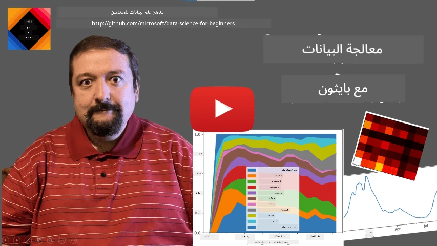
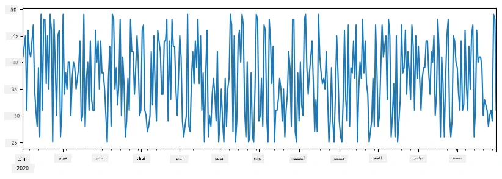
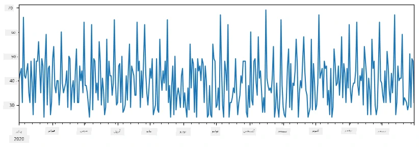
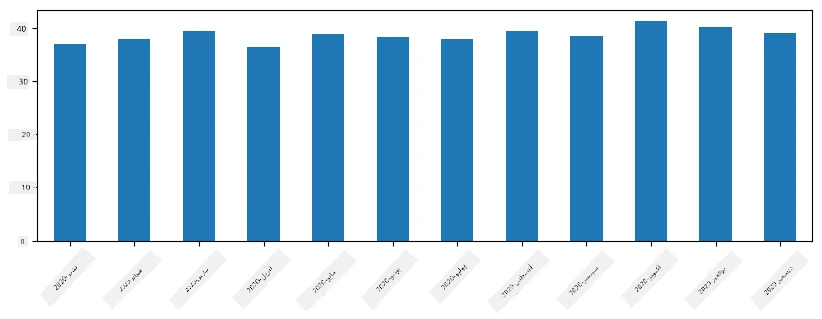
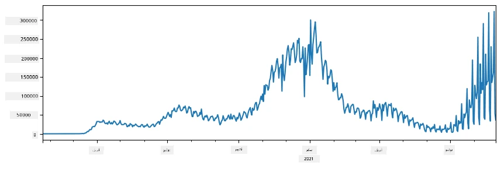
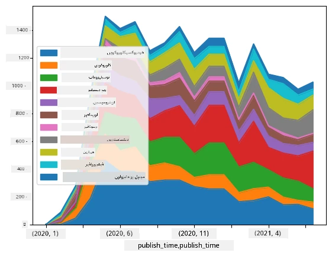

# العمل مع البيانات: بايثون ومكتبة بانداز

|  ](../../sketchnotes/07-WorkWithPython.png) |
| :-------------------------------------------------------------------------------------------------------: |
|                 العمل مع بايثون - _ملاحظة تخطيطية بواسطة [@nitya](https://twitter.com/nitya)_                 |

[](https://youtu.be/dZjWOGbsN4Y)

بينما توفر قواعد البيانات طرقًا فعالة جدًا لتخزين البيانات واستعلامها باستخدام لغات الاستعلام، فإن الطريقة الأكثر مرونة لمعالجة البيانات هي كتابة برنامجك الخاص لمعالجة البيانات. في العديد من الحالات، سيكون تنفيذ استعلام قاعدة البيانات هو الخيار الأكثر فعالية. ومع ذلك، في بعض الحالات التي تتطلب معالجة بيانات أكثر تعقيدًا، لا يمكن القيام بذلك بسهولة باستخدام SQL.
يمكن برمجة معالجة البيانات بأي لغة برمجة، ولكن هناك بعض اللغات التي تعتبر أكثر مستوى فيما يتعلق بالعمل مع البيانات. عادةً ما يفضل علماء البيانات إحدى اللغات التالية:

* **[بايثون](https://www.python.org/)**، لغة برمجة عامة الغرض، يُعتبر غالبًا خيارًا من أفضل الخيارات للمبتدئين بسبب بساطتها. لدى بايثون العديد من المكتبات الإضافية التي تساعدك على حل العديد من المشاكل العملية، مثل استخراج بياناتك من أرشيف ZIP، أو تحويل الصورة إلى تدرج الرمادي. بالإضافة إلى علم البيانات، تُستخدم بايثون كثيرًا أيضًا لتطوير الويب.
* **[R](https://www.r-project.org/)** هو صندوق أدوات تقليدي طور لمعالجة البيانات الإحصائية. يحتوي أيضًا على مستودع كبير من المكتبات (CRAN)، مما يجعله خيارًا جيدًا لمعالجة البيانات. ومع ذلك، فإن R ليست لغة برمجة عامة الغرض، ونادرًا ما تُستخدم خارج مجال علم البيانات.
* **[جوليا](https://julialang.org/)** هي لغة أخرى طورت خصيصًا لعلم البيانات. تهدف إلى تقديم أداء أفضل من بايثون، مما يجعلها أداة رائعة للتجارب العلمية.

في هذا الدرس، سنركز على استخدام بايثون لمعالجة البيانات البسيطة. سنفترض معرفة أساسية باللغة. إذا كنت تريد جولة أعمق في بايثون، يمكنك الرجوع إلى أحد الموارد التالية:

* [تعلم بايثون بطريقة ممتعة مع الرسوميات والكسور](https://github.com/shwars/pycourse) - دورة تمهيدية سريعة لبرمجة بايثون على GitHub
* [اتخذ خطواتك الأولى مع بايثون](https://docs.microsoft.com/en-us/learn/paths/python-first-steps/?WT.mc_id=academic-77958-bethanycheum) مسار تعليمي على [Microsoft Learn](http://learn.microsoft.com/?WT.mc_id=academic-77958-bethanycheum)

البيانات يمكن أن تأتي بأشكال عديدة. في هذا الدرس، سنأخذ في الاعتبار ثلاثة أشكال من البيانات - **البيانات الجدولية**، **النصوص** و **الصور**.

سنركز على بعض الأمثلة لمعالجة البيانات، بدلاً من إعطائك نظرة شاملة على جميع المكتبات ذات الصلة. هذا سيسمح لك بفهم الفكرة الرئيسية لما هو ممكن، ويترك لديك فهماً حول أين تجد حلول لمشاكلك عندما تحتاجها.

> **نصيحة مفيدة للغاية**. عندما تحتاج إلى تنفيذ عملية معينة على البيانات ولا تعرف كيف تفعل ذلك، جرب البحث عنها في الإنترنت. عادةً ما يحتوي [Stackoverflow](https://stackoverflow.com/) على العديد من عينات الكود المفيدة في بايثون للعديد من المهام النموذجية.


## [اختبار قبل المحاضرة](https://ff-quizzes.netlify.app/en/ds/quiz/12)

## البيانات الجدولية وإطارات البيانات

لقد قابلت بالفعل البيانات الجدولية عندما تحدثنا عن قواعد البيانات العلائقية. عندما يكون لديك الكثير من البيانات، وكانت موجودة في العديد من الجداول المرتبطة المختلفة، من المنطقي بالتأكيد استخدام SQL للعمل معها. ومع ذلك، هناك العديد من الحالات التي يكون لدينا فيها جدول بيانات، ونحتاج إلى الحصول على بعض **الفهم** أو **الأفكار** حول هذه البيانات، مثل التوزيع، الارتباط بين القيم، إلخ. في علم البيانات، هناك العديد من الحالات التي نحتاج فيها إلى إجراء بعض التحولات على البيانات الأصلية، يتبعها التصور البصري. كلا الخطوتين يمكن تنفيذهما بسهولة باستخدام بايثون.

هناك مكتبتان مفيدتان جدًا في بايثون يمكن أن تساعدك في التعامل مع البيانات الجدولية:
* **[بانداز](https://pandas.pydata.org/)** تسمح لك بالتعامل مع ما يسمى **إطارات البيانات**، والتي تشبه الجداول العلائقية. يمكنك أن يكون لديك أعمدة مسماة، وتنفيذ عمليات مختلفة على الصفوف والأعمدة وإطارات البيانات بشكل عام.
* **[نومباي](https://numpy.org/)** هي مكتبة للعمل مع **الموترات**، أي **المصفوفات** متعددة الأبعاد. المصفوفة تحتوي على قيم من نفس النوع الأساسي، وهي أبسط من إطار البيانات، لكنها تقدم مزيدًا من العمليات الحسابية، وتخلق عبئًا أقل.

هناك أيضًا عدد من المكتبات الأخرى التي يجب أن تعرفها:
* **[ماتبلوتليب](https://matplotlib.org/)** مكتبة تستخدم لتصور البيانات ورسم الرسوم البيانية
* **[سايباي](https://www.scipy.org/)** مكتبة تحتوي على بعض الوظائف العلمية الإضافية. لقد التقينا بهذه المكتبة بالفعل عند التحدث عن الاحتمالات والإحصاء

إليك جزءًا من الكود الذي عادةً ما تستخدمه لاستيراد هذه المكتبات في بداية برنامج بايثون الخاص بك:
```python
import numpy as np
import pandas as pd
import matplotlib.pyplot as plt
from scipy import ... # تحتاج إلى تحديد الحزم الفرعية الدقيقة التي تحتاجها
``` 

بانداز تتركز حول بعض المفاهيم الأساسية.

### السلسلة

**السلسلة** هي تسلسل من القيم، مماثل لقائمة أو مصفوفة نومباي. الفرق الرئيسي هو أن السلسلة لديها أيضًا **مؤشر**، وعندما نعمل على السلاسل (مثلاً، نجمعها)، يتم أخذ المؤشر في الاعتبار. يمكن أن يكون المؤشر بسيطًا مثل رقم الصف الصحيح (وهو المؤشر المستخدم افتراضيًا عند إنشاء سلسلة من قائمة أو مصفوفة)، أو يمكن أن يكون له هيكل معقد، مثل فترة زمنية.

> **ملاحظة**: هناك بعض كود بانداز التمهيدي في الدفتر المرافق [`notebook.ipynb`](notebook.ipynb). نحن نوضح فقط بعض الأمثلة هنا، وأنت بالتأكيد مدعو لمراجعة الدفتر الكامل.

اعتبر مثالًا: نريد تحليل مبيعات متجر الآيس كريم الخاص بنا. لنولد سلسلة من أرقام المبيعات (عدد العناصر المباعة كل يوم) لفترة زمنية معينة:

```python
start_date = "Jan 1, 2020"
end_date = "Mar 31, 2020"
idx = pd.date_range(start_date,end_date)
print(f"Length of index is {len(idx)}")
items_sold = pd.Series(np.random.randint(25,50,size=len(idx)),index=idx)
items_sold.plot()
```


الآن افترض أننا كل أسبوع ننظم حفلة للأصدقاء، ونأخذ 10 عبوات إضافية من الآيس كريم للحفلة. يمكننا إنشاء سلسلة أخرى، مفهرسة حسب الأسبوع، لإظهار ذلك:
```python
additional_items = pd.Series(10,index=pd.date_range(start_date,end_date,freq="W"))
```
 عندما نجمع سلسلتين معًا، نحصل على العدد الإجمالي:
```python
total_items = items_sold.add(additional_items,fill_value=0)
total_items.plot()
```


> **لاحظ** أننا لا نستخدم الصيغة البسيطة `total_items+additional_items`. لو فعلنا ذلك، لكنا حصلنا على الكثير من قيم `NaN` (*ليس رقمًا*) في السلسلة الناتجة. ويحدث هذا لأن هناك قيم مفقودة لبعض نقاط المؤشر في سلسلة `additional_items`، وإضافة `NaN` إلى أي شيء يؤدي إلى `NaN`. لذلك يجب تحديد معامل `fill_value` أثناء الجمع.

مع السلاسل الزمنية، يمكننا أيضًا **إعادة أخذ عينات** للسلسلة بفاصل زمني مختلف. على سبيل المثال، نفرض أننا نريد حساب متوسط حجم المبيعات شهريًا. يمكننا استخدام الكود التالي:
```python
monthly = total_items.resample("1M").mean()
ax = monthly.plot(kind='bar')
```


### إطار البيانات

إطار البيانات هو في الأساس مجموعة من السلاسل التي لها نفس المؤشر. يمكننا دمج عدة سلاسل معًا في إطار بيانات:
```python
a = pd.Series(range(1,10))
b = pd.Series(["I","like","to","play","games","and","will","not","change"],index=range(0,9))
df = pd.DataFrame([a,b])
```
 هذا سينشئ جدولًا أفقيًا مثل هذا:
|     | 0   | 1    | 2   | 3   | 4      | 5   | 6      | 7    | 8    |
| --- | --- | ---- | --- | --- | ------ | --- | ------ | ---- | ---- |
| 0   | 1   | 2    | 3   | 4   | 5      | 6   | 7      | 8    | 9    |
| 1   | I   | like | to  | use | Python | and | Pandas | very | much |

يمكننا أيضًا استخدام السلاسل كأعمدة، وتحديد أسماء الأعمدة باستخدام القاموس:
```python
df = pd.DataFrame({ 'A' : a, 'B' : b })
```
 هذا سيعطينا جدولًا مثل هذا:

|     | A   | B      |
| --- | --- | ------ |
| 0   | 1   | I      |
| 1   | 2   | like   |
| 2   | 3   | to     |
| 3   | 4   | use    |
| 4   | 5   | Python |
| 5   | 6   | and    |
| 6   | 7   | Pandas |
| 7   | 8   | very   |
| 8   | 9   | much   |

**ملاحظة** أنه يمكننا أيضًا الحصول على تخطيط الجدول هذا عن طريق تحويل الجدول السابق، مثلاً بكتابة
```python
df = pd.DataFrame([a,b]).T.rename(columns={ 0 : 'A', 1 : 'B' })
```
 هنا `.T` تعني عملية تحويل إطار البيانات، أي تبديل الصفوف والأعمدة، وعملية `rename` تسمح لنا بإعادة تسمية الأعمدة لتطابق المثال السابق.

هذه هي بعض العمليات الأكثر أهمية التي يمكننا تنفيذها على إطارات البيانات:

**اختيار الأعمدة**. يمكننا اختيار الأعمدة الفردية بكتابة `df['A']` - هذه العملية تعيد سلسلة. يمكننا أيضًا اختيار مجموعة من الأعمدة إلى إطار بيانات آخر بكتابة `df[['B','A']]` - هذا يعيد إطار بيانات آخر.

**تصفية** صفوف معينة بناءً على معايير. على سبيل المثال، لترك فقط الصفوف التي يحتوي عمود `A` فيها على قيمة أكبر من 5، نكتب `df[df['A']>5]`.

> **ملاحظة**: طريقة التصفية تعمل كما يلي. التعبير `df['A']<5` يعيد سلسلة منطقية (Boolean)، تُشير إلى ما إذا كان التعبير `True` أو `False` لكل عنصر من عناصر السلسلة الأصلية `df['A']`. عندما تُستخدم السلسلة المنطقية كمؤشر، فإنها تعيد مجموعة فرعية من الصفوف في إطار البيانات. لذا لا يمكن استخدام تعبير منطقي بايثون عادي، على سبيل المثال، كتابة `df[df['A']>5 and df['A']<7]` سيكون خطأ. بدلاً من ذلك، يجب استخدام العملية الخاصة `&` على السلاسل المنطقية، بكتابة `df[(df['A']>5) & (df['A']<7)]` (*الأقواس مهمة هنا*).

**إنشاء أعمدة جديدة قابلة للحساب**. يمكننا بسهولة إنشاء أعمدة جديدة قابلة للحساب لإطار البيانات باستخدام تعبير بديهي مثل هذا:
```python
df['DivA'] = df['A']-df['A'].mean() 
``` 
 هذا المثال يحسب تباين A عن متوسط قيمته. ما يحدث فعليًا هنا هو أننا نحسب سلسلة، ثم نعين هذه السلسلة إلى الجانب الأيسر، مما ينشئ عمودًا آخر. لذا، لا يمكننا استخدام أي عمليات غير متوافقة مع السلاسل، على سبيل المثال، الكود أدناه غير صحيح:
```python
# الكود خاطئ -> df['ADescr'] = "منخفض" إذا كانت df['A'] < 5 وإلا "مرتفع"
df['LenB'] = len(df['B']) # <- النتيجة خاطئة
``` 
 المثال الأخير، رغم كونه صحيحًا نحويًا، يعطينا نتيجة خاطئة، لأنه يعين طول السلسلة `B` لجميع القيم في العمود، وليس طول العناصر الفردية كما أردنا.

إذا كنا بحاجة لحساب تعبيرات معقدة مثل هذه، يمكننا استخدام دالة `apply`. يمكن كتابة المثال الأخير كما يلي:
```python
df['LenB'] = df['B'].apply(lambda x : len(x))
# أو
df['LenB'] = df['B'].apply(len)
```

بعد العمليات السابقة، سينتهي بنا الأمر بإطار البيانات التالي:

|     | A   | B      | DivA | LenB |
| --- | --- | ------ | ---- | ---- |
| 0   | 1   | I      | -4.0 | 1    |
| 1   | 2   | like   | -3.0 | 4    |
| 2   | 3   | to     | -2.0 | 2    |
| 3   | 4   | use    | -1.0 | 3    |
| 4   | 5   | Python | 0.0  | 6    |
| 5   | 6   | and    | 1.0  | 3    |
| 6   | 7   | Pandas | 2.0  | 6    |
| 7   | 8   | very   | 3.0  | 4    |
| 8   | 9   | much   | 4.0  | 4    |

**اختيار الصفوف بناءً على الأرقام** يمكن تنفيذه باستخدام البناء `iloc`. على سبيل المثال، لاختيار أول 5 صفوف من إطار البيانات:
```python
df.iloc[:5]
```

**التجميع** غالبًا ما يُستخدم للحصول على نتيجة مشابهة لـ *جداول المحورية* في إكسل. افترض أننا نريد حساب القيمة المتوسطة للعمود `A` لكل عدد معين من `LenB`. ثم يمكننا تجميع إطار البيانات حسب `LenB`، واستدعاء `mean`:
```python
df.groupby(by='LenB')[['A','DivA']].mean()
```
 إذا كنا بحاجة لحساب المتوسط وعدد العناصر في المجموعة، يمكننا استخدام دالة `aggregate` الأكثر تعقيدًا:
```python
df.groupby(by='LenB') \
 .aggregate({ 'DivA' : len, 'A' : lambda x: x.mean() }) \
 .rename(columns={ 'DivA' : 'Count', 'A' : 'Mean'})
```
 هذا يعطينا الجدول التالي:

| LenB | Count | Mean     |
| ---- | ----- | -------- |
| 1    | 1     | 1.000000 |
| 2    | 1     | 3.000000 |
| 3    | 2     | 5.000000 |
| 4    | 3     | 6.333333 |
| 6    | 2     | 6.000000 |

### الحصول على البيانات


لقد رأينا مدى سهولة بناء السلاسل و DataFrames من الكائنات في Python. ومع ذلك، غالبًا ما تأتي البيانات على شكل ملف نصي، أو جدول Excel. لحسن الحظ، تقدم لنا Pandas طريقة بسيطة لتحميل البيانات من القرص. على سبيل المثال، قراءة ملف CSV بسيطة كهذه:
```python
df = pd.read_csv('file.csv')
```
سنرى المزيد من الأمثلة على تحميل البيانات، بما في ذلك جلبها من مواقع الويب الخارجية، في قسم "التحدي"


### الطباعة والرسم

غالبًا ما يحتاج عالم البيانات إلى استكشاف البيانات، لذا من المهم أن يكون قادرًا على تصوّرها. عندما يكون DataFrame كبيرًا، غالبًا ما نريد فقط التأكد من أننا نفعل كل شيء بشكل صحيح عن طريق طباعة الصفوف القليلة الأولى. يمكن القيام بذلك عن طريق استدعاء `df.head()`. إذا كنت تُشغّل هذا من Jupyter Notebook، فسيتم طباعة DataFrame في شكل جدولي جميل.

لقد رأينا أيضًا استخدام دالة `plot` لتصوير بعض الأعمدة. بينما `plot` مفيد جدًا للعديد من المهام، ويدعم العديد من أنواع الرسوم البيانية المختلفة عبر معامل `kind=`, يمكنك دائمًا استخدام مكتبة `matplotlib` الخام لرسم شيء أكثر تعقيدًا. سنغطي تصور البيانات بالتفصيل في دروس منفصلة.

هذا العرض يغطي أهم مفاهيم Pandas، مع ذلك، المكتبة غنية جدًا، ولا حدود لما يمكنك القيام به بها! دعونا نطبق الآن هذه المعرفة لحل مشكلة محددة.

## 🚀 التحدي 1: تحليل انتشار كوفيد

المشكلة الأولى التي سنركز عليها هي نمذجة انتشار وباء كوفيد-19. للقيام بذلك، سنستخدم بيانات عدد الأفراد المصابين في دول مختلفة، التي يوفرها [مركز علم وهندسة النظم](https://systems.jhu.edu/) (CSSE) في [جامعة جون هوبكنز](https://jhu.edu/). قاعدة البيانات متوفرة في [مستودع GitHub هذا](https://github.com/CSSEGISandData/COVID-19).

بما أننا نريد أن نُظهر كيفية التعامل مع البيانات، ندعوك لفتح [`notebook-covidspread.ipynb`](notebook-covidspread.ipynb) وقراءته من الأعلى إلى الأسفل. يمكنك أيضًا تنفيذ الخلايا، والقيام ببعض التحديات التي تركناها لك في النهاية.



> إذا كنت لا تعرف كيفية تشغيل الكود في Jupyter Notebook، ألق نظرة على [هذه المقالة](https://soshnikov.com/education/how-to-execute-notebooks-from-github/).

## العمل مع البيانات غير المنظمة

بينما تأتي البيانات في كثير من الأحيان في شكل جدولي، في بعض الحالات نحتاج إلى التعامل مع بيانات أقل تنظيمًا، مثل النص أو الصور. في هذه الحالة، لتطبيق تقنيات معالجة البيانات التي رأيناها أعلاه، نحتاج بطريقة ما لاستخراج البيانات المنظمة. إليك بعض الأمثلة:

* استخراج الكلمات المفتاحية من النص، ورؤية مدى تكرار ظهور هذه الكلمات المفتاحية
* استخدام الشبكات العصبية لاستخراج المعلومات حول الأشياء في الصورة
* الحصول على معلومات عن مشاعر الأشخاص في تغذية كاميرا الفيديو

## 🚀 التحدي 2: تحليل أوراق كوفيد

في هذا التحدي، سنستمر بموضوع جائحة كوفيد، ونركز على معالجة الأوراق العلمية حول الموضوع. هناك قاعدة بيانات [CORD-19](https://www.kaggle.com/allen-institute-for-ai/CORD-19-research-challenge) تحتوي على أكثر من 7000 (وقت الكتابة) ورقة عن كوفيد، متوفرة مع بيانات وصفية وملخصات (ولنصفها تقريبًا أيضًا النص الكامل متوفر).

مثال كامل لتحليل هذه القاعدة باستخدام خدمة [تحليل النصوص للصحة](https://docs.microsoft.com/azure/cognitive-services/text-analytics/how-tos/text-analytics-for-health/?WT.mc_id=academic-77958-bethanycheum) مُوصوف [في هذه التدوينة](https://soshnikov.com/science/analyzing-medical-papers-with-azure-and-text-analytics-for-health/). سنناقش نسخة مبسطة من هذا التحليل.

> **ملاحظة**: لا نوفر نسخة من قاعدة البيانات ضمن هذا المستودع. قد تحتاج أولًا لتنزيل ملف [`metadata.csv`](https://www.kaggle.com/allen-institute-for-ai/CORD-19-research-challenge?select=metadata.csv) من [هذه القاعدة على Kaggle](https://www.kaggle.com/allen-institute-for-ai/CORD-19-research-challenge). قد يتطلب التسجيل في Kaggle. يمكنك أيضًا تنزيل القاعدة بدون تسجيل [من هنا](https://ai2-semanticscholar-cord-19.s3-us-west-2.amazonaws.com/historical_releases.html), ولكنها ستشمل جميع النصوص الكاملة بالإضافة إلى ملف البيانات الوصفية.

افتح [`notebook-papers.ipynb`](notebook-papers.ipynb) واقرأه من الأعلى إلى الأسفل. يمكنك أيضًا تنفيذ الخلايا، والقيام ببعض التحديات التي تركناها لك في النهاية.



## معالجة بيانات الصور

مؤخرًا، تم تطوير نماذج ذكاء اصطناعي قوية جداً تسمح لنا بفهم الصور. هناك العديد من المهام التي يمكن حلها باستخدام الشبكات العصبية المدربة مسبقًا، أو خدمات السحاب. بعض الأمثلة تشمل:

* **تصنيف الصور**، الذي يمكن أن يساعدك في تصنيف الصورة ضمن فئة مُحددة مسبقًا. يمكنك تدريب مُصنِّفات الصور الخاصة بك بسهولة باستخدام خدمات مثل [Custom Vision](https://azure.microsoft.com/services/cognitive-services/custom-vision-service/?WT.mc_id=academic-77958-bethanycheum)
* **كشف الأشياء** للكشف عن أشياء مختلفة في الصورة. خدمات مثل [الرؤية الحاسوبية](https://azure.microsoft.com/services/cognitive-services/computer-vision/?WT.mc_id=academic-77958-bethanycheum) يمكنها اكتشاف عدد من الأجسام الشائعة، ويمكنك تدريب نموذج [Custom Vision](https://azure.microsoft.com/services/cognitive-services/custom-vision-service/?WT.mc_id=academic-77958-bethanycheum) للكشف عن بعض الأجسام الخاصة التي تهمك.
* **كشف الوجه**، بما في ذلك الكشف عن العمر والجنس والمشاعر. يمكن القيام بذلك عبر [Face API](https://azure.microsoft.com/services/cognitive-services/face/?WT.mc_id=academic-77958-bethanycheum).

جميع هذه الخدمات السحابية يمكن استدعاؤها باستخدام [حزم SDK لبايثون](https://docs.microsoft.com/samples/azure-samples/cognitive-services-python-sdk-samples/cognitive-services-python-sdk-samples/?WT.mc_id=academic-77958-bethanycheum)، وبالتالي يمكن دمجها بسهولة ضمن سير عمل استكشاف البيانات الخاص بك.

إليك بعض الأمثلة على استكشاف البيانات من مصادر بيانات الصور:
* في تدوينة [كيفية تعلم علم البيانات بدون ترميز](https://soshnikov.com/azure/how-to-learn-data-science-without-coding/) نستكشف صور إنستغرام، محاولين فهم ما الذي يجعل الناس يعطون إعجابات أكثر لصورة. نستخرج أولاً أكبر قدر ممكن من المعلومات من الصور باستخدام [الرؤية الحاسوبية](https://azure.microsoft.com/services/cognitive-services/computer-vision/?WT.mc_id=academic-77958-bethanycheum)، ثم نستخدم [Azure Machine Learning AutoML](https://docs.microsoft.com/azure/machine-learning/concept-automated-ml/?WT.mc_id=academic-77958-bethanycheum) لبناء نموذج قابل للفهم.
* في [ورشة دراسات الوجه](https://github.com/CloudAdvocacy/FaceStudies) نستخدم [Face API](https://azure.microsoft.com/services/cognitive-services/face/?WT.mc_id=academic-77958-bethanycheum) لاستخراج المشاعر على الأشخاص في الصور من الفعاليات، لمحاولة فهم ما يجعل الناس سعداء.

## الخلاصة

سواء كانت لديك بيانات منظمة أو غير منظمة، باستخدام Python يمكنك تنفيذ جميع الخطوات المتعلقة بمعالجة البيانات وفهمها. ربما تكون الطريقة الأكثر مرونة لمعالجة البيانات، ولهذا السبب تستخدم الغالبية العظمى من علماء البيانات بايثون كأداتهم الأساسية. تعلم بايثون بعمق فكرة جيدة إذا كنت جادًا في رحلتك في علم البيانات!

## [اختبار بعد المحاضرة](https://ff-quizzes.netlify.app/en/ds/quiz/13)

## مراجعة ودراسة ذاتية

**كتب**
* [Wes McKinney. بايثون لتحليل البيانات: معالجة البيانات باستخدام Pandas, NumPy, و IPython](https://www.amazon.com/gp/product/1491957662)

**الموارد على الإنترنت**
* الدليل الرسمي [10 دقائق إلى Pandas](https://pandas.pydata.org/pandas-docs/stable/user_guide/10min.html)
* [توثيق حول تصور Pandas](https://pandas.pydata.org/pandas-docs/stable/user_guide/visualization.html)

**تعلم بايثون**
* [تعلم بايثون بطريقة ممتعة باستخدام رسومات السلحفاة والمتتابعات](https://github.com/shwars/pycourse)
* [خطواتك الأولى مع بايثون](https://docs.microsoft.com/learn/paths/python-first-steps/?WT.mc_id=academic-77958-bethanycheum) مسار التعليم على [Microsoft Learn](http://learn.microsoft.com/?WT.mc_id=academic-77958-bethanycheum)

## الواجب

[قم بدراسة بيانات أكثر تفصيلًا للتحديات أعلاه](assignment.md)

## الشكر والاعتمادات

تم تأليف هذا الدرس ب♥️ بواسطة [دميتري سوشنيكوف](http://soshnikov.com)

---

<!-- CO-OP TRANSLATOR DISCLAIMER START -->
**تنويه**:
تمت ترجمة هذا المستند باستخدام خدمة الترجمة بالذكاء الاصطناعي [Co-op Translator](https://github.com/Azure/co-op-translator). بينما نسعى للدقة، يرجى العلم أن الترجمات الآلية قد تحتوي على أخطاء أو عدم دقة. يجب اعتبار المستند الأصلي بلغته الأصلية المصدر الرسمي والمعتمد. للمعلومات الهامة، يُنصح بالاستعانة بترجمة بشرية محترفة. نحن غير مسؤولين عن أي سوء فهم أو تفسير ناتج عن استخدام هذه الترجمة.
<!-- CO-OP TRANSLATOR DISCLAIMER END -->