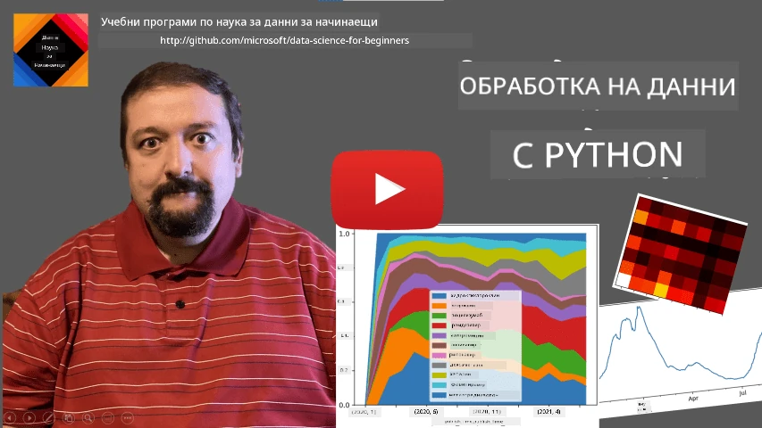
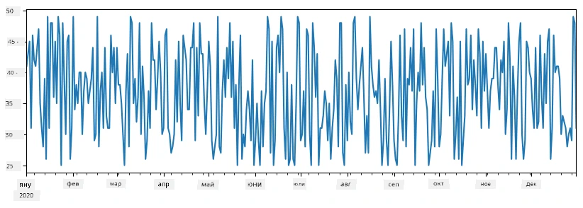
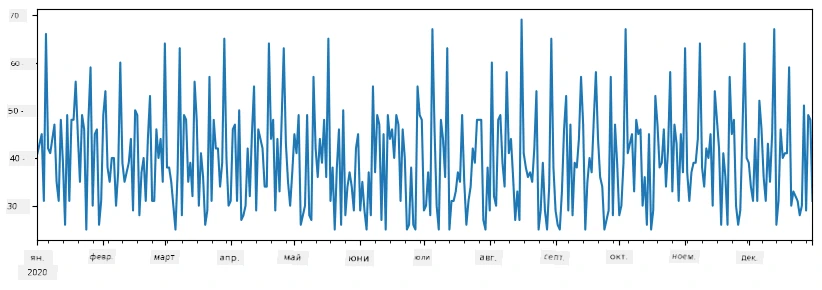
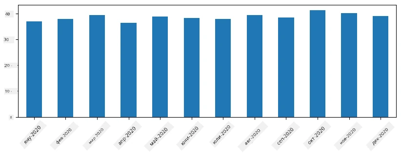
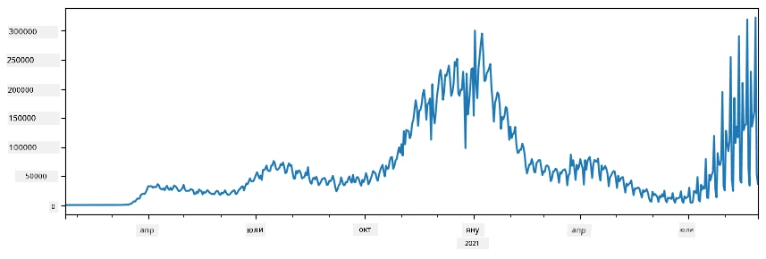
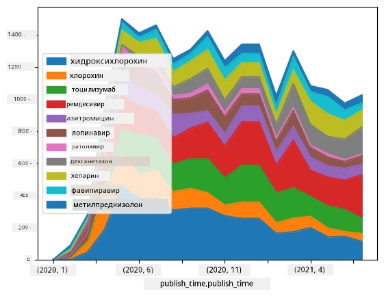

# Работа с данни: Python и библиотеката Pandas

|  ](../../sketchnotes/07-WorkWithPython.png) |
| :-------------------------------------------------------------------------------------------------------: |
|                 Работа с Python - _Скетчноут от [@nitya](https://twitter.com/nitya)_                 |

[](https://youtu.be/dZjWOGbsN4Y)

Докато базите данни предлагат много ефективни начини за съхранение на данни и заявки с езикове за заявки, най-гъвкавият начин за обработка на данни е написването на собствена програма за манипулиране на данните. В много случаи изпълнението на заявка към база данни би било по-ефективен начин. Но в някои ситуации, когато е нужна по-сложна обработка на данни, това не може да се направи лесно с SQL.
Обработката на данни може да се програмира на какъвто и да е език за програмиране, но има определени езици, които са по-високо ниво по отношение на работа с данни. Данни учени обикновено предпочитат един от следните езици:

* **[Python](https://www.python.org/)**, език за общо предназначение, който често се счита за един от най-добрите варианти за начинаещи заради простотата си. Python има много допълнителни библиотеки, които могат да ви помогнат да решите много практически задачи, като например извличане на вашите данни от ZIP архив или конвертиране на изображение в сиви тонове. Освен в науката за данни, Python често се използва и за уеб разработка.
* **[R](https://www.r-project.org/)** е традиционен набор от инструменти, създаден с мисъл за статистическа обработка на данни. Той има огромно хранилище от библиотеки (CRAN), което го прави добър избор за работа с данни. Въпреки това, R не е език за общо предназначение и рядко се използва извън сферата на науката за данни.
* **[Julia](https://julialang.org/)** е друг език, разработен специално за науката за данни. Той е предназначен да осигури по-добра производителност от Python, което го прави отличен инструмент за научни експерименти.

В този урок ще се фокусираме върху използването на Python за проста обработка на данни. Ще предположим основни познания по езика. Ако искате по-задълбочено въведение в Python, можете да се обърнете към един от следните ресурси:

* [Научете Python по забавен начин с Turtle Graphics и фрактали](https://github.com/shwars/pycourse) - кратък курс за Python програмиране, базиран в GitHub
* [Вашите първи стъпки с Python](https://docs.microsoft.com/en-us/learn/paths/python-first-steps/?WT.mc_id=academic-77958-bethanycheum) Обучителен път в [Microsoft Learn](http://learn.microsoft.com/?WT.mc_id=academic-77958-bethanycheum)

Данните могат да бъдат в много форми. В този урок ще разгледаме три форми на данни - **таблични данни**, **текст** и **изображения**.

Ще се фокусираме върху няколко примера за обработка на данни, вместо да даваме пълен преглед на всички свързани библиотеки. Това ще ви позволи да усвоите основната идея какво е възможно и да ви даде разбиране къде да търсите решения на вашите проблеми, когато ви потрябват.

> **Най-полезният съвет**. Когато трябва да извършите определена операция с данни, която не знаете как да направите, пробвайте да я потърсите в интернет. [Stackoverflow](https://stackoverflow.com/) обикновено съдържа много полезни примери с код на Python за много типични задачи.


## [Предварителен тест](https://ff-quizzes.netlify.app/en/ds/quiz/12)

## Таблични данни и Dataframes

Вече сте се запознали с таблични данни, когато говорихме за релационни бази данни. Когато имате много данни, съдържащи се в множество свързани таблици, със сигурност има смисъл да използвате SQL за работа с тях. Въпреки това в много случаи имаме таблица с данни и трябва да придобием някакво **разбиране** или **прозрение** за тези данни, като разпределение, корелация между стойностите и др. В науката за данни често трябва да извършваме трансформации на оригиналните данни, последвани от визуализация. И двата етапа могат лесно да се изпълнят с Python.

Има две най-полезни библиотеки в Python, които могат да ви помогнат да работите с таблични данни:
* **[Pandas](https://pandas.pydata.org/)** ви позволява да манипулирате така наречените **Dataframes**, които са аналогични на релационни таблици. Можете да имате именовани колони и да извършвате различни операции върху редове, колони и Dataframes като цяло.
* **[Numpy](https://numpy.org/)** е библиотека за работа с **тензори**, т.е. многомерни **масиви**. Масивите имат стойности от един и същ подлежащ тип и са по-прости от Dataframe, но предлагат повече математически операции и създават по-малко допълнителна натовареност.

Има и няколко други библиотеки, които е добре да знаете:
* **[Matplotlib](https://matplotlib.org/)** е библиотека, използвана за визуализация на данни и чертане на графики
* **[SciPy](https://www.scipy.org/)** е библиотека с допълнителни научни функции. Вече се запознахме с нея при обсъждането на вероятности и статистика

Ето част от кода, който обикновено се използва за импорт на тези библиотеки в началото на Python програмата ви:
```python
import numpy as np
import pandas as pd
import matplotlib.pyplot as plt
from scipy import ... # трябва да посочите конкретните подсъздания, от които се нуждаете
``` 

Pandas се основава на няколко основни концепции.

### Series

**Series** е последователност от стойности, подобна на списък или numpy масив. Основната разлика е, че серията има и **индекс**, и когато извършваме операции върху серии (например събиране), индексът се взема под внимание. Индексът може да бъде толкова прост, колкото цяло число ред (това е индексът, който се използва по подразбиране при създаване на серия от списък или масив), или може да има сложна структура, като интервал от дати.

> **Бележка**: Има малко въведение с Pandas код в придружаващия бележник [`notebook.ipynb`](notebook.ipynb). Тук само очертаваме някои примери, като сте добре дошли да разгледате пълния бележник.

Помислете за пример: искаме да анализираме продажбите в нашия сладоледен магазин. Нека генерираме серия продажби (брой продадени артикули всеки ден) за определен период от време:

```python
start_date = "Jan 1, 2020"
end_date = "Mar 31, 2020"
idx = pd.date_range(start_date,end_date)
print(f"Length of index is {len(idx)}")
items_sold = pd.Series(np.random.randint(25,50,size=len(idx)),index=idx)
items_sold.plot()
```


Сега предположим, че всяка седмица организираме парти за приятели и вземаме допълнително 10 пакета сладолед за партито. Можем да създадем друга серия, индексирана по седмици, за да го илюстрираме:
```python
additional_items = pd.Series(10,index=pd.date_range(start_date,end_date,freq="W"))
```
Когато съберем двете серии, получаваме общ сбор:
```python
total_items = items_sold.add(additional_items,fill_value=0)
total_items.plot()
```


> **Бележка**: Не използваме прост синтаксис `total_items+additional_items`. Ако го направим, ще получим много `NaN` (*Not a Number*) стойности в получената серия. Това е защото някои индексни точки в серията `additional_items` нямат стойности, и добавянето на `NaN` към нещо дава `NaN`. Затова трябва да посочим параметъра `fill_value` при събирането.

С времеви серии можем също да направим **ресемплиране** на серията с различни времеви интервали. Например, ако искаме да изчислим средната продажба месечно. Можем да използваме следния код:
```python
monthly = total_items.resample("1M").mean()
ax = monthly.plot(kind='bar')
```


### DataFrame

DataFrame е съществено колекция от серии с един и същ индекс. Можем да комбинираме няколко серии в един DataFrame:
```python
a = pd.Series(range(1,10))
b = pd.Series(["I","like","to","play","games","and","will","not","change"],index=range(0,9))
df = pd.DataFrame([a,b])
```
Това ще създаде хоризонтална таблица като тази:
|     | 0   | 1    | 2   | 3   | 4      | 5   | 6      | 7    | 8    |
| --- | --- | ---- | --- | --- | ------ | --- | ------ | ---- | ---- |
| 0   | 1   | 2    | 3   | 4   | 5      | 6   | 7      | 8    | 9    |
| 1   | I   | like | to  | use | Python | and | Pandas | very | much |

Можем също да използваме Series като колони и да зададем имена на колоните чрез речник:
```python
df = pd.DataFrame({ 'A' : a, 'B' : b })
```
Това ще ни даде таблица като тази:

|     | A   | B      |
| --- | --- | ------ |
| 0   | 1   | I      |
| 1   | 2   | like   |
| 2   | 3   | to     |
| 3   | 4   | use    |
| 4   | 5   | Python |
| 5   | 6   | and    |
| 6   | 7   | Pandas |
| 7   | 8   | very   |
| 8   | 9   | much   |

**Бележка**: Можем също да получим това оформление на таблицата, като транспонираме предишната таблица, например с
```python
df = pd.DataFrame([a,b]).T.rename(columns={ 0 : 'A', 1 : 'B' })
```
Тук `.T` означава операцията транспониране на DataFrame, т.е. смяна на редовете с колоните, а операцията `rename` ни позволява да преименуваме колоните, за да съвпаднат с предишния пример.

Ето няколко най-важни операции, които можем да извършим с DataFrames:

**Избор на колони**. Можем да избираме отделни колони с `df['A']` - операцията връща Series. Можем също да изберем подмножество от колони в друг DataFrame с `df[['B','A']]` - връща друг DataFrame.

**Филтриране** на редове по критерии. Например, за да оставим само редове със стойност на колона `A` по-голяма от 5, пишем `df[df['A']>5]`.

> **Бележка**: Филтрирането става по следния начин. Изразът `df['A']<5` връща булева серия, която указва дали изразът е `True` или `False` за всеки елемент на оригиналната серия `df['A']`. Когато булева серия се използва като индекс, връща подмножество от редове в DataFrame. Затова не може да се използва произволен булев израз на Python, например `df[df['A']>5 and df['A']<7]` е грешен. Вместо това трябва да се използва специалната операция `&` за булеви серии, като се пише `df[(df['A']>5) & (df['A']<7)]` (*квадратните скоби са важни*).

**Създаване на нови изчисляеми колони**. Можем лесно да създаваме нови изчисляеми колони в DataFrame, като използваме интуитивни изрази като този:
```python
df['DivA'] = df['A']-df['A'].mean() 
``` 
Този пример изчислява отклонението на A от средната му стойност. Всъщност тук изчисляваме серия и след това присвояваме тази серия от лявата страна, създавайки нова колона. Затова не можем да използваме операции, които не са съвместими със series. Например кодът по-долу е грешен:
```python
# Грешен код -> df['ADescr'] = "Low" ако df['A'] < 5 иначе "Hi"
df['LenB'] = len(df['B']) # <- Грешен резултат
``` 
Последният пример, макар и синтактично правилен, дава грешен резултат, защото назначава дължината на серия B на всички стойности в колоната, а не дължината на отделните елементи, както очаквахме.

Ако трябва да изчислим сложни изрази като този, можем да използваме функцията `apply`. Последният пример може да се напише по следния начин:
```python
df['LenB'] = df['B'].apply(lambda x : len(x))
# или
df['LenB'] = df['B'].apply(len)
```

След горните операции ще получим следния DataFrame:

|     | A   | B      | DivA | LenB |
| --- | --- | ------ | ---- | ---- |
| 0   | 1   | I      | -4.0 | 1    |
| 1   | 2   | like   | -3.0 | 4    |
| 2   | 3   | to     | -2.0 | 2    |
| 3   | 4   | use    | -1.0 | 3    |
| 4   | 5   | Python | 0.0  | 6    |
| 5   | 6   | and    | 1.0  | 3    |
| 6   | 7   | Pandas | 2.0  | 6    |
| 7   | 8   | very   | 3.0  | 4    |
| 8   | 9   | much   | 4.0  | 4    |

**Избор на редове по номер** може да стане чрез конструкта `iloc`. Например, за избор на първите 5 реда от DataFrame:
```python
df.iloc[:5]
```

**Групиране** често се използва за получаване на резултат, подобен на *pivot таблици* в Excel. Да предположим, че искаме да изчислим средната стойност на колона `A` за всяко число `LenB`. Тогава можем да групираме DataFrame по `LenB` и да извикаме `mean`:
```python
df.groupby(by='LenB')[['A','DivA']].mean()
```
Ако трябва да изчислим и средна стойност, и брой елементи в групата, можем да използваме по-сложната функция `aggregate`:
```python
df.groupby(by='LenB') \
 .aggregate({ 'DivA' : len, 'A' : lambda x: x.mean() }) \
 .rename(columns={ 'DivA' : 'Count', 'A' : 'Mean'})
```
Това ни дава следната таблица:

| LenB | Count | Средно   |
| ---- | ----- | -------- |
| 1    | 1     | 1.000000 |
| 2    | 1     | 3.000000 |
| 3    | 2     | 5.000000 |
| 4    | 3     | 6.333333 |
| 6    | 2     | 6.000000 |

### Получаване на данни


Видяхме колко е лесно да се създадат Series и DataFrames от Python обекти. Въпреки това, данните обикновено идват под формата на текстов файл или Excel таблица. За щастие, Pandas ни предлага прост начин да зареждаме данни от диска. Например, четенето на CSV файл е толкова просто:
```python
df = pd.read_csv('file.csv')
```
Ще видим още примери за зареждане на данни, включително изтеглянето им от външни уебсайтове, в секцията "Challenge"


### Принтиране и графики

Един Data Scientist често трябва да изследва данните, затова е важно да може да ги визуализира. Когато DataFrame е голям, много пъти искаме просто да сме сигурни, че всичко е наред, като отпечатаме първите няколко реда. Това може да се направи чрез извикване на `df.head()`. Ако го стартирате от Jupyter Notebook, ще отпечата DataFrame във красив табличен вид.

Видяхме и използването на функцията `plot` за визуализиране на някои колони. Докато `plot` е много полезен за много задачи и поддържа различни типове графики чрез параметъра `kind=`, винаги можете да използвате директно библиотеката `matplotlib` за по-сложни визуализации. Ще разгледаме визуализацията на данни подробно в отделни уроци от курса.

Този преглед покрива най-важните концепции на Pandas, но библиотеката е много богата и няма ограничения за това, което можете да направите с нея! Нека сега приложим тези знания за решаване на конкретен проблем.

## 🚀 Предизвикателство 1: Анализ на разпространението на COVID

Първият проблем, на който ще се съсредоточим, е моделирането на епидемичното разпространение на COVID-19. За тази цел ще използваме данните за броя на инфектираните лица в различни страни, предоставени от [Центъра за системни науки и инженеринг](https://systems.jhu.edu/) (CSSE) в [Университета Джонс Хопкинс](https://jhu.edu/). Наборът от данни е достъпен в [този GitHub репозиториум](https://github.com/CSSEGISandData/COVID-19).

Тъй като искаме да демонстрираме как да работим с данни, ви каним да отворите [`notebook-covidspread.ipynb`](notebook-covidspread.ipynb) и да го прочетете отгоре до долу. Можете също да изпълнявате клетки и да решите някои предизвикателства, които сме оставили за вас в края.



> Ако не знаете как да изпълните код в Jupyter Notebook, разгледайте [тази статия](https://soshnikov.com/education/how-to-execute-notebooks-from-github/).

## Работа с неструктурирани данни

Макар че данните много често идват в таблична форма, в някои случаи трябва да се справим с по-малко структурирани данни, например текст или изображения. В този случай, за да приложим техники за обработка на данни, които споменахме по-горе, трябва по някакъв начин да **извлечем** структурирани данни. Ето няколко примера:

* Извличане на ключови думи от текст и анализиране на честотата на появяване на тези ключови думи
* Използване на невронни мрежи за извличане на информация за обекти на изображение
* Получаване на информация за емоциите на хора на видео

## 🚀 Предизвикателство 2: Анализ на научни статии за COVID

В това предизвикателство ще продължим с темата за пандемията COVID и ще се съсредоточим върху обработката на научни статии по темата. Съществува [CORD-19 Dataset](https://www.kaggle.com/allen-institute-for-ai/CORD-19-research-challenge) с повече от 7000 (към момента на писане) статии за COVID, достъпни с метаданни и резюмета (а за около половината от тях е наличен и пълен текст).

Пълен пример за анализ на този набор от данни с помощта на когнитивната услуга [Text Analytics for Health](https://docs.microsoft.com/azure/cognitive-services/text-analytics/how-tos/text-analytics-for-health/?WT.mc_id=academic-77958-bethanycheum) е описан [в тази блог публикация](https://soshnikov.com/science/analyzing-medical-papers-with-azure-and-text-analytics-for-health/). Ще разгледаме опростена версия на този анализ.

> **ЗАБЕЛЕЖКА**: Не предоставяме копие на набора от данни като част от този репозиториум. Може първо да се наложи да изтеглите файла [`metadata.csv`](https://www.kaggle.com/allen-institute-for-ai/CORD-19-research-challenge?select=metadata.csv) от [този набор от данни в Kaggle](https://www.kaggle.com/allen-institute-for-ai/CORD-19-research-challenge). Може да е необходима регистрация в Kaggle. Можете също да изтеглите набора от данни без регистрация [оттук](https://ai2-semanticscholar-cord-19.s3-us-west-2.amazonaws.com/historical_releases.html), но той ще включва всички пълни текстове в допълнение към метаданните.

Отворете [`notebook-papers.ipynb`](notebook-papers.ipynb) и го прочетете цялостно. Можете също да изпълнявате клетки и да решите някои от предизвикателствата, които сме оставили за вас в края.



## Обработка на изображения

Наскоро бяха разработени много мощни AI модели, които ни позволяват да разбираме изображения. Съществуват много задачи, които могат да се решат чрез предварително обучени невронни мрежи или облачни услуги. Някои примери включват:

* **Класификация на изображения**, която може да ви помогне да категоризирате изображението в една от предварително определените класове. Можете лесно да обучите свои собствени класификатори на изображения с помощта на услуги като [Custom Vision](https://azure.microsoft.com/services/cognitive-services/custom-vision-service/?WT.mc_id=academic-77958-bethanycheum)
* **Откриване на обекти** за разпознаване на различни обекти на изображението. Услуги като [computer vision](https://azure.microsoft.com/services/cognitive-services/computer-vision/?WT.mc_id=academic-77958-bethanycheum) могат да откриват редица често срещани обекти, а вие можете да обучите модел [Custom Vision](https://azure.microsoft.com/services/cognitive-services/custom-vision-service/?WT.mc_id=academic-77958-bethanycheum) да разпознава специфични обекти от интерес.
* **Откриване на лица**, включително определяне на възраст, пол и емоции. Това може да стане чрез [Face API](https://azure.microsoft.com/services/cognitive-services/face/?WT.mc_id=academic-77958-bethanycheum).

Всички тези облачни услуги могат да се извикват чрез [Python SDK](https://docs.microsoft.com/samples/azure-samples/cognitive-services-python-sdk-samples/cognitive-services-python-sdk-samples/?WT.mc_id=academic-77958-bethanycheum) и така лесно да бъдат включени във вашия работен процес за изследване на данни.

Ето няколко примера за изследване на данни от източници на изображения:
* В блог публикацията [Как да научим Data Science без кодиране](https://soshnikov.com/azure/how-to-learn-data-science-without-coding/) изследваме снимки от Instagram, опитвайки се да разберем какво кара хората да дават повече харесвания на снимка. Първо извличаме колкото може повече информация от снимките с помощта на [computer vision](https://azure.microsoft.com/services/cognitive-services/computer-vision/?WT.mc_id=academic-77958-bethanycheum), а след това използваме [Azure Machine Learning AutoML](https://docs.microsoft.com/azure/machine-learning/concept-automated-ml/?WT.mc_id=academic-77958-bethanycheum), за да построим интерпретируем модел.
* В [Facial Studies Workshop](https://github.com/CloudAdvocacy/FaceStudies) използваме [Face API](https://azure.microsoft.com/services/cognitive-services/face/?WT.mc_id=academic-77958-bethanycheum), за да извлечем емоциите на хората на фотографии от събития, с цел да разберем какво прави хората щастливи.

## Заключение

Независимо дали вече имате структурирани или неструктурирани данни, с помощта на Python можете да извършите всички стъпки, свързани с обработката и разбирането на данните. Вероятно това е най-гъвкавият начин за обработка на данни, и това е причината повечето Data Scientists да използват Python като основен инструмент. Дълбокото изучаване на Python вероятно е добра идея, ако сте сериозни относно пътя си в науката за данните!

## [Тест след лекцията](https://ff-quizzes.netlify.app/en/ds/quiz/13)

## Преглед и самостоятелно изучаване

**Книги**
* [Wes McKinney. Python for Data Analysis: Data Wrangling with Pandas, NumPy, and IPython](https://www.amazon.com/gp/product/1491957662)

**Онлайн ресурси**
* Официален туториал [10 минути до Pandas](https://pandas.pydata.org/pandas-docs/stable/user_guide/10min.html)
* [Документация за визуализации в Pandas](https://pandas.pydata.org/pandas-docs/stable/user_guide/visualization.html)

**Учете Python**
* [Научете Python по забавен начин с Turtle Graphics и фрактали](https://github.com/shwars/pycourse)
* [Направете първите си стъпки с Python](https://docs.microsoft.com/learn/paths/python-first-steps/?WT.mc_id=academic-77958-bethanycheum) учебен път в [Microsoft Learn](http://learn.microsoft.com/?WT.mc_id=academic-77958-bethanycheum)

## Задача

[Извършете по-задълбочено изучаване на данни за горните предизвикателства](assignment.md)

## Авторски права

Този урок е създаден с ♥️ от [Dmitry Soshnikov](http://soshnikov.com)

---

<!-- CO-OP TRANSLATOR DISCLAIMER START -->
**Отказ от отговорност**:
Този документ е преведен с помощта на AI преводачески услуга [Co-op Translator](https://github.com/Azure/co-op-translator). Въпреки че се стремим към точност, моля имайте предвид, че автоматизираните преводи могат да съдържат грешки или неточности. Оригиналният документ на неговия роден език трябва да се счита за авторитетен източник. За критична информация се препоръчва професионален човешки превод. Ние не носим отговорност за каквито и да е недоразумения или неправилни тълкувания, произтичащи от използването на този превод.
<!-- CO-OP TRANSLATOR DISCLAIMER END -->