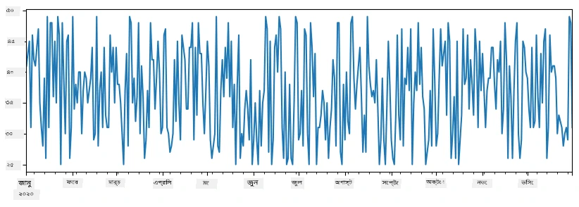
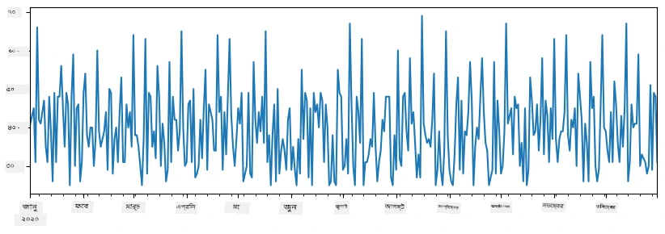
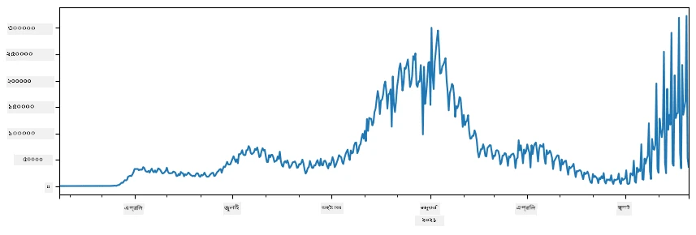
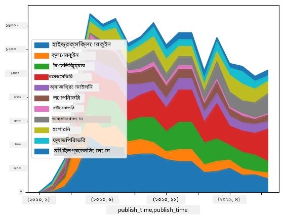

# ডেটার সাথে কাজ করা: পাইথন এবং প্যান্ডাস লাইব্রেরি

|  দ্বারা ](../../sketchnotes/07-WorkWithPython.png) |
| :-------------------------------------------------------------------------------------------------------: |
|                 পাইথনের সাথে কাজ করা - _স্কেচনোট [@nitya](https://twitter.com/nitya) দ্বারা_                 |

[](https://youtu.be/dZjWOGbsN4Y)

যেখানে ডেটাবেস খুব দক্ষভাবে ডেটা সংরক্ষণ এবং ক্যোয়ারি ভাষা ব্যবহার করে ক্যোয়ারি করার উপায় প্রদান করে, তথ্য প্রক্রিয়াকরণের সবচেয়ে নমনীয় উপায় হল নিজস্ব প্রোগ্রাম লিখে ডেটা প্রক্রিয়াকরণ করা। অনেক ক্ষেত্রে, ডেটাবেস ক্যোয়ারি করা একটি কার্যকরী উপায় হতে পারে। তবে কিছু ক্ষেত্রে যখন জটিল ডেটা প্রক্রিয়াকরণ প্রয়োজন, তখন এটি সহজে SQL ব্যবহার করে করা যায় না।
ডেটা প্রক্রিয়াকরণ যেকোনো প্রোগ্রামিং ভাষায় প্রোগ্রাম করা যেতে পারে, কিন্তু ডেটার সাথে কাজ করার জন্য কিছু ভাষা উচ্চতর স্তরের হয়ে থাকে। তথ্য বিজ্ঞানীরা সাধারণত নিম্নলিখিত ভাষাগুলোর মধ্যে একটি পছন্দ করেন:

* **[Python](https://www.python.org/)**, একটি সাধারণ উদ্দেশ্যের প্রোগ্রামিং ভাষা, যা এর সরলতার কারণে শুরুকারীদের জন্য সবচেয়ে ভাল বিকল্পগুলোর মধ্যে গণ্য। পাইথনের অনেক অতিরিক্ত লাইব্রেরি রয়েছে যা আপনাকে অনেক ব্যবহারিক সমস্যার সমাধানে সাহায্য করে, যেমন ZIP আর্কাইভ থেকে ডেটা বের করা, অথবা ছবিটিকে গ্রেস্কেলে রূপান্তর করা। ডেটা সায়েন্স ছাড়াও পাইথন প্রায়শই ওয়েব ডেভেলপমেন্টেও ব্যবহৃত হয়।
* **[R](https://www.r-project.org/)** একটি ঐতিহ্যবাহী টুলবক্স যা পরিসংখ্যানগত ডেটা প্রক্রিয়াকরণ লক্ষ্যে তৈরি করা হয়েছে। এতে বড় একটি লাইব্রেরির সংগ্রহ (CRAN) রয়েছে, যা এটিকে ডেটা প্রক্রিয়াকরণের জন্য একটি ভাল পছন্দ করে তোলে। তবে, R একটি সাধারণ উদ্দেশ্যের প্রোগ্রামিং ভাষা নয় এবং এটি সাধারণত তথ্য বিজ্ঞান ক্ষেত্রে বাইরে খুব কম ব্যবহৃত হয়।
* **[Julia](https://julialang.org/)** আরেকটি ভাষা যা বিশেষভাবে ডেটা সায়েন্সের জন্য তৈরি। এটি পাইথনের থেকে উন্নত কর্মক্ষমতা দেওয়ার উদ্দেশ্যে উন্নত করা হয়েছে, যা এটিকে বৈজ্ঞানিক পরীক্ষার জন্য একটি দুর্দান্ত সরঞ্জাম করে তোলে।

এই পাঠে আমরা পাইথন ব্যবহার করে সহজ ডেটা প্রক্রিয়াকরণের ওপর কেন্দ্রিত থাকব। আমরা ভাষাটির মৌলিক পরিচিতি থাকার কথা فرض করব। যদি আপনি পাইথনের আরও গভীর পাথ দেখতেই চান, তাহলে নিম্নলিখিত উৎসগুলো দেখতে পারেন:

* [আমোদপ্রদ উপায়ে পাইথন শিখুন টার্টল গ্রাফিক্স এবং ফ্র্যাক্টালস এর মাধ্যমে](https://github.com/shwars/pycourse) - গিটহাব ভিত্তিক দ্রুত পরিচিতি কোর্স পাইথন প্রোগ্রামিংয়ে
* [পাইথনের সাথে আপনার প্রথম পদক্ষেপ নিন](https://docs.microsoft.com/en-us/learn/paths/python-first-steps/?WT.mc_id=academic-77958-bethanycheum) [Microsoft Learn](http://learn.microsoft.com/?WT.mc_id=academic-77958-bethanycheum)-এ লার্নিং পাথ

ডেটা বিভিন্ন আকারে আসতে পারে। এই পাঠে, আমরা তিনটি ডেটা ফর্ম বিবেচনা করব - **ট্যাবুলার ডেটা**, **টেক্সট** এবং **ছবি**।

আমরা ডেটা প্রক্রিয়াকরণের কয়েকটি উদাহরণে মনোযোগ দিব, পুরো সম্পর্কিত লাইব্রেরিগুলোর পূর্ণ প্রিভিউ দেওয়ার পরিবর্তে। এটি আপনাকে সম্ভাব্য মূল ধারণা পেতে সাহায্য করবে, এবং যখন প্রয়োজন তখন সমস্যা সমাধানের জন্য কোথায় যেতে হবে সেই বিষয়ে ধারনা দিবে।

> **সবচেয়ে দরকারী পরামর্শ**। যখন আপনি এমন কোনও ডেটা অপারেশন করতে চান যা আপনি জানেন না কীভাবে করবেন, তখন ইন্টারনেটে খুঁজুন। [Stackoverflow](https://stackoverflow.com/) সাধারণত অনেক প্রায়োগিক কাজের জন্য পাইথনে কোডের উদাহরণ প্রদান করে।


## [পিপাঠ পরীক্ষা](https://ff-quizzes.netlify.app/en/ds/quiz/12)

## ট্যাবুলার ডেটা এবং ডেটাফ্রেম

আপনি ইতিমধ্যে রিলেশনাল ডাটাবেস সম্পর্কে কথা বলার সময় ট্যাবুলার ডেটার সঙ্গে পরিচিত হয়েছেন। যখন আপনার অনেক ডেটা থাকে এবং এটি অনেক বিভিন্ন লিঙ্কড টেবিলে থাকে, তখন এর সাথে কাজ করার জন্য SQL ব্যবহার করাই যুক্তিযুক্ত। তবে অনেক ক্ষেত্রে আমাদের একটি ডেটার টেবিল থাকে এবং আমরা এই ডেটার বিষয়ে কিছু **বুঝাপড়া** বা **অনুভূতিগুলো** জানতে চাই, যেমন বিতরণ, মানগুলোর মধ্যে সম্পর্ক ইত্যাদি। তথ্য বিজ্ঞানে, অনেক ক্ষেত্রে মূল ডেটার কিছু রূপান্তর করা প্রয়োজন হয়, এরপর ভিজ্যুয়ালাইজেশন করা হয়। উভয় ধাপই সহজেই পাইথন ব্যবহার করে করা যায়।

পাইথনে দুটি সবচেয়ে দরকারী লাইব্রেরি আছে যা আপনাকে ট্যাবুলার ডেটার সাথে কাজ করতে সাহায্য করবে:
* **[Pandas](https://pandas.pydata.org/)** আপনাকে তথাকথিত **ডেটাফ্রেম** পরিচালনা করতে দেয়, যা রিলেশনাল টেবিলের অনুরূপ। আপনি নামকৃত কলাম থাকতে পারেন, এবং সারি, কলাম এবং ডেটাফ্রেমে সাধারণত বিভিন্ন অপারেশন করতে পারেন।
* **[Numpy](https://numpy.org/)** হল একটি লাইব্রেরি যা **টেনসর**, অর্থাৎ বহু-মাত্রিক **অ্যারেগুলোর** সাথে কাজ করার জন্য। অ্যারে একই ধরণের মান ধারণ করে, এবং এটি ডেটাফ্রেমের চেয়ে সহজ, কিন্তু এটি আরও গাণিতিক অপারেশন প্রদান করে এবং কম ওভারহেড তৈরি করে।

এছাড়াও কয়েকটি অতিরিক্ত লাইব্রেরি রয়েছে যা আপনার জানা উচিত:
* **[Matplotlib](https://matplotlib.org/)** ডেটা ভিজ্যুয়ালাইজেশন এবং গ্রাফগুলি প্লট করার জন্য ব্যবহৃত একটি লাইব্রেরি
* **[SciPy](https://www.scipy.org/)** কিছু অতিরিক্ত বৈজ্ঞানিক ফাংশনসহ একটি লাইব্রেরি। আমরা ইতিমধ্যে সম্ভাবনা এবং পরিসংখ্যান সম্পর্কিত আলোচনায় এই লাইব্রেরি দেখতে পেয়েছি

এখানে একটা কোড অংশ আছে যা সাধারণত আপনি পাইথন প্রোগ্রামের শুরুতে এই লাইব্রেরিগুলো আমদানি করতে ব্যবহার করবেন:
```python
import numpy as np
import pandas as pd
import matplotlib.pyplot as plt
from scipy import ... # আপনি নির্দিষ্ট করতে হবে ঠিক কোন উপ-প্যাকেজগুলি আপনার প্রয়োজন
``` 

প্যান্ডাস কয়েকটি মৌলিক ধারণার উপর কেন্দ্রীভূত।

### সিরিজ

**সিরিজ** হল মানগুলোর একটি ক্রম, যা তালিকা বা নুম্পাই অ্যারের অনুরূপ। প্রধান পার্থক্য হল সিরিজের একটি **ইন্ডেক্স** থাকে, এবং যখন আমরা সিরিজের ওপর অপারেশন করি (উদা., যোগ করি), তখন ইন্ডেক্স বিবেচনায় নেওয়া হয়। ইন্ডেক্স সাধারণত পূর্ণসংখ্যা সারি নম্বর হতে পারে (যা তালিকা বা অ্যারে থেকে সিরিজ তৈরি করার সময় ডিফল্ট ইন্ডেক্স হিসেবে ব্যবহৃত হয়), অথবা একটি জটিল কাঠামো থাকতে পারে, যেমন তারিখের পরিসীমা।

> **নোট**: সংযুক্ত নোটবুক [`notebook.ipynb`](notebook.ipynb) এ কিছু প্রাথমিক প্যান্ডাস কোড রয়েছে। আমরা এখানে শুধুমাত্র কিছু উদাহরণ তুলে ধরি, এবং আপনি অবশ্যই সম্পূর্ণ নোটবুকটি দেখতে পারেন।

একটি উদাহরণ বিবেচনা করুন: আমরা আমাদের আইসক্রিম স্পটের বিক্রয় বিশ্লেষণ করতে চাই। নির্দিষ্ট সময়ের জন্য প্রতিদিন বিক্রি হওয়া আইটেম সংখ্যার সিরিজ তৈরি করি:

```python
start_date = "Jan 1, 2020"
end_date = "Mar 31, 2020"
idx = pd.date_range(start_date,end_date)
print(f"Length of index is {len(idx)}")
items_sold = pd.Series(np.random.randint(25,50,size=len(idx)),index=idx)
items_sold.plot()
```


এখন ধরুন প্রতি সপ্তাহে আমরা বন্ধুদের জন্য একটি পার্টি আয়োজন করি, এবং পার্টির জন্য অতিরিক্ত ১০ প্যাক্স আইসক্রিম নিয়ে যাই। আমরা সপ্তাহ দ্বারা ইনডেক্স করা আরেকটি সিরিজ তৈরি করতে পারি যা তা প্রদর্শন করবে:
```python
additional_items = pd.Series(10,index=pd.date_range(start_date,end_date,freq="W"))
```
যখন আমরা দুটি সিরিজ যোগ করি, তখন মোট সংখ্যা পাই:
```python
total_items = items_sold.add(additional_items,fill_value=0)
total_items.plot()
```


> **নোট** যে আমরা সরল সিনট্যাক্স `total_items+additional_items` ব্যবহার করছি না। তা করলে, ফলাফলস্বরূপ সিরিজে অনেক `NaN` (*সংখ্যা নয়*) মান আসত। কারণ `additional_items` সিরিজের কিছু ইন্ডেক্স পয়েন্টে মান অনুপস্থিত, আর `NaN` এর সাথে কিছু যোগ করলে ফলাফল `NaN` হয়। তাই যোগের সময় `fill_value` প্যারামিটার নির্দিষ্ট করতে হয়।

টাইম সিরিজে, আমরা ভিন্ন সময়ের অন্তর ব্যবহার করে সিরিজকে **পুনঃনমুনা** করতে পারি। উদাহরণস্বরূপ, ধরুন আমরা মাসিক গড় বিক্রয় পরিমাণ গণনা করতে চাই। আমরা নিম্নলিখিত কোড ব্যবহার করতে পারি:
```python
monthly = total_items.resample("1M").mean()
ax = monthly.plot(kind='bar')
```


### ডেটাফ্রেম

একটি ডেটাফ্রেম মূলত একই ইন্ডেক্সসহ সিরিজগুলোর সংগ্রহ। আমরা একাধিক সিরিজ ডেটাফ্রেমে একত্রিত করতে পারি:
```python
a = pd.Series(range(1,10))
b = pd.Series(["I","like","to","play","games","and","will","not","change"],index=range(0,9))
df = pd.DataFrame([a,b])
```
এটি একটি অনুভূমিক টেবিল তৈরি করবে যেভাবে:
|     | 0   | 1    | 2   | 3   | 4      | 5   | 6      | 7    | 8    |
| --- | --- | ---- | --- | --- | ------ | --- | ------ | ---- | ---- |
| 0   | 1   | 2    | 3   | 4   | 5      | 6   | 7      | 8    | 9    |
| 1   | I   | like | to  | use | Python | and | Pandas | very | much |

আমরা সিরিজগুলোর ক্ষেত্রেও কলাম হিসেবে ব্যবহার করতে পারি, এবং ডিকশনারির মাধ্যমে কলামের নাম সংজ্ঞায়িত করতে পারি:
```python
df = pd.DataFrame({ 'A' : a, 'B' : b })
```
এটি আমাদের একটি টেবিল দেবে যেভাবে:

|     | A   | B      |
| --- | --- | ------ |
| 0   | 1   | I      |
| 1   | 2   | like   |
| 2   | 3   | to     |
| 3   | 4   | use    |
| 4   | 5   | Python |
| 5   | 6   | and    |
| 6   | 7   | Pandas |
| 7   | 8   | very   |
| 8   | 9   | much   |

**নোট** যে আমরা পূর্বের টেবিলটিকে ট্রান্সপোজ করে এই টেবিল বিন্যাসও পেতে পারি, যেমন লেখা
```python
df = pd.DataFrame([a,b]).T.rename(columns={ 0 : 'A', 1 : 'B' })
```
এখানে `.T` অর্থ ডেটাফ্রেমকে ট্রান্সপোজ করার অপারেশন, অর্থাৎ সারি এবং কলাম পরিবর্তন, এবং `rename` অপারেশন আমাদের কলামগুলোর নাম পূর্বের উদাহরণের সাথে মিলিয়ে দিতে দেয়।

ডেটাফ্রেমের ওপর কয়েকটি সবচেয়ে গুরুত্বপূর্ণ অপারেশন নিচে দেওয়া হলো:

**কলাম নির্বাচন**। আমরা `df['A']` লিখে নির্দিষ্ট একটি কলাম নির্বাচন করতে পারি - এই অপারেশন একটি সিরিজ রিটার্ন করে। আমরা `df[['B','A']]` লিখে কয়েকটি কলামের সাবসেট নির্বাচন করতে পারি - এটি আরেকটি ডেটাফ্রেম রিটার্ন করে।

**শর্তসাপেক্ষে ফিল্টারিং**। উদাহরণস্বরূপ, কলাম `A` এর মান ৫ এর বেশি এমন সারিগুলো রাখতে, আমরা `df[df['A']>5]` লিখতে পারি।

> **নোট**: ফিল্টারিং যেভাবে কাজ করে তা হলো। এক্সপ্রেশন `df['A']<5` একটি বুলিয়ান সিরিজ দেয়, যা মূল সিরিজ `df['A']` এর প্রতিটি উপাদানের জন্য সত্য বা মিথ্যা নির্দেশ করে। যখন বুলিয়ান সিরিজকে ইন্ডেক্স হিসেবে ব্যবহার করা হয়, তখন এটি ডেটাফ্রেম থেকে ঐ সারিগুলো প্রদান করে যেগুলি শর্ত পূরণ করে। তাই যেকোনো পাইথন বুলিয়ান এক্সপ্রেশনের ব্যবহার সম্ভব নয়, যেমন `df[df['A']>5 and df['A']<7]` ভুল হবে। এর পরিবর্তে, আপনাকে বুলিয়ান সিরিজের উপর বিশেষ `&` অপারেশন ব্যবহার করতে হবে, যেমন `df[(df['A']>5) & (df['A']<7)]` (*ব্র্যাকেট গুরুত্বপূর্ণ এখানে*)।

**নতুন গাণিতিক কলাম তৈরি**। আমরা সহজেই আমাদের ডেটাফ্রেমে নতুন গাণিতিক কলাম তৈরি করতে পারি নিম্নরূপ অভিব্যক্তি ব্যবহার করে:
```python
df['DivA'] = df['A']-df['A'].mean() 
``` 
এই উদাহরণটি A এর গড় মান থেকে বিচ্যুতি হিসাব করে। যা আসলে ঘটে তা হল আমরা একটি সিরিজ হিসাব করছি, তারপর সিরিজকে বাম পাশের কাছে অ্যাসাইন করছি, নতুন কলাম তৈরি করছি। তাই, আমরা এমন কোন অপারেশন ব্যবহার করতে পারব না যা সিরিজের সাথে সঙ্গতিপূর্ণ নয়, উদাহরণস্বরূপ, নিম্নের কোডটি ভুল:
```python
# ভুল কোড -> df['ADescr'] = "Low" যদি df['A'] < 5 হয় অন্যথায় "Hi"
df['LenB'] = len(df['B']) # <- ভুল ফলাফল
``` 
পরবর্তী উদাহরণ যদিও সিনট্যাকটিক্যালি সঠিক, তবে এটি ভুল ফলাফল দেয়, কারণ এটি সিরিজ B এর দৈর্ঘ্য সব মানে অ্যাসাইন করে, আমাদের প্রত্যাশিত পৃথক উপাদানের দৈর্ঘ্য নয়।

যদি জটিল এক্সপ্রেশন হিসাব করতে হয়, আমরা `apply` ফাংশন ব্যবহার করতে পারি। শেষ উদাহরণটি এইভাবে লেখা যেতে পারে:
```python
df['LenB'] = df['B'].apply(lambda x : len(x))
# অথবা
df['LenB'] = df['B'].apply(len)
```

ওপরের অপারেশনের পরে, আমাদের নিম্নলিখিত ডেটাফ্রেম পাওয়া যাবে:

|     | A   | B      | DivA | LenB |
| --- | --- | ------ | ---- | ---- |
| 0   | 1   | I      | -4.0 | 1    |
| 1   | 2   | like   | -3.0 | 4    |
| 2   | 3   | to     | -2.0 | 2    |
| 3   | 4   | use    | -1.0 | 3    |
| 4   | 5   | Python | 0.0  | 6    |
| 5   | 6   | and    | 1.0  | 3    |
| 6   | 7   | Pandas | 2.0  | 6    |
| 7   | 8   | very   | 3.0  | 4    |
| 8   | 9   | much   | 4.0  | 4    |

**সংখ্যাভিত্তিক সারি নির্বাচন** `iloc` কন্সট্রাক্ট ব্যবহার করে করা যায়। উদাহরণস্বরূপ, ডেটাফ্রেম থেকে প্রথম ৫টি সারি নির্বাচন করতে:
```python
df.iloc[:5]
```

**গ্রুপিং** প্রায়শই এক্সেলে *পিভট টেবিল* এর মত ফলাফল পেতে ব্যবহৃত হয়। ধরুন আমরা প্রতিটি `LenB` মানের জন্য কলাম `A` এর গড় মান গণনা করতে চাই। তাহলে আমরা আমাদের ডেটাফ্রেম `LenB` দ্বারা গ্রুপ করবো, এবং `mean` কল করবো:
```python
df.groupby(by='LenB')[['A','DivA']].mean()
```
যদি গড় এবং গ্রুপের উপাদান সংখ্যা উভয় গণনা করতে হয়, তাহলে আমরা আরও জটিল `aggregate` ফাংশন ব্যবহার করতে পারি:
```python
df.groupby(by='LenB') \
 .aggregate({ 'DivA' : len, 'A' : lambda x: x.mean() }) \
 .rename(columns={ 'DivA' : 'Count', 'A' : 'Mean'})
```
এটি আমাদের নিম্নলিখিত টেবিল দেবে:

| LenB | Count | Mean     |
| ---- | ----- | -------- |
| 1    | 1     | 1.000000 |
| 2    | 1     | 3.000000 |
| 3    | 2     | 5.000000 |
| 4    | 3     | 6.333333 |
| 6    | 2     | 6.000000 |

### ডেটা সংগ্রহ করা


আমরা দেখেছি কিভাবে সহজে সিরিজ এবং ডেটাফ্রেম তৈরি করা যায় পাইথনের অবজেক্ট থেকে। তবে, ডেটা সাধারণত আসে একটি টেক্সট ফাইল বা একটি এক্সেল টেবিলের আকারে। সৌভাগ্যবশত, প্যান্ডাস আমাদের জন্য একটি সহজ উপায় অফার করে ডিস্ক থেকে ডেটা লোড করার। উদাহরণস্বরূপ, সিএসভি ফাইল পড়া এমন সহজ:
```python
df = pd.read_csv('file.csv')
```
আমরা লোড করার আরও উদাহরণ দেখব, যার মধ্যে থাকবে বাইরের ওয়েবসাইট থেকে ডেটা আনা, "চ্যালেঞ্জ" অংশে


### প্রিন্টিং এবং প্লটিং

একজন ডেটা সায়েন্টিস্ট প্রায়শই ডেটা অনুসন্ধান করতে হয়, তাই এটি গুরুত্বপূর্ণ যে ডেটা ভিজ্যুয়ালাইজেশন করতে সক্ষম হওয়া। যখন ডেটাফ্রেম বড় হয়, অনেক সময় আমরা শুধু নিশ্চিত হতে চাই যে আমরা সঠিক কাজ করছি প্রথম কয়েকটি সারি প্রিন্ট করে। এটি করা যায় `df.head()` কল করে। আপনি যদি এটি জুপিটার নোটবুক থেকে চালাচ্ছেন, তাহলে এটি সুন্দর টেবিল আকারে ডেটাফ্রেমটি প্রিন্ট করবে।

আমরা `plot` ফাংশনের ব্যবহারও দেখেছি কিছু কলাম ভিজ্যুয়ালাইজ করার জন্য। যদিও `plot` অনেক কাজের জন্য খুবই উপকারী, এবং `kind=` প্যারামিটারের মাধ্যমে বিভিন্ন গ্রাফ টাইপ সাপোর্ট করে, তবুও আপনি যেকোনো সময় কাঁচা `matplotlib` লাইব্রেরি ব্যবহার করতে পারেন আরও জটিল কিছু প্লট করার জন্য। আমরা ডেটা ভিজ্যুয়ালাইজেশনের বিস্তারিত আলাদা কোর্স লেসনে আলোচনা করব।

এই ওভারভিউ প্যান্ডাস এর সবচেয়ে গুরুত্বপূর্ণ ধারণাগুলো কভার করে, তবে লাইব্রেরিটি খুবই সমৃদ্ধ, এবং আপনি এর মাধ্যমে যা করতে পারবেন তার কোনো সীমা নেই! এখন এই জ্ঞানটি নির্দিষ্ট সমস্যার সমাধানে প্রয়োগ করি।

## 🚀 চ্যালেঞ্জ ১: কোভিড সংক্রমণ বিশ্লেষণ

প্রথম সমস্যাটি যা আমরা ফোকাস করব তা হলো কোভিড-১৯ মহামারীর সংক্রমণ মডেলিং। এর জন্য, আমরা বিভিন্ন দেশেগুলোর সংক্রমিত ব্যক্তিদের সংখ্যা সম্পর্কিত তথ্য ব্যবহার করব, যা [Center for Systems Science and Engineering](https://systems.jhu.edu/) (CSSE) দ্বারা সরবরাহ করা হয়েছে [Johns Hopkins University](https://jhu.edu/) থেকে। ডেটাসেটটি পাওয়া যাবে [এই GitHub রিপোজিটরিতে](https://github.com/CSSEGISandData/COVID-19)।

যেহেতু আমরা ডেটার সাথে কিভাবে কাজ করতে হয় তা দেখাতে চাই, তাই আপনাকে আমন্ত্রণ জানাচ্ছি [`notebook-covidspread.ipynb`](notebook-covidspread.ipynb) খুলে শুরু থেকে শেষ পর্যন্ত পড়তে। আপনি সেলও এক্সিকিউট করতে পারবেন, এবং আমরা শেষে কিছু চ্যালেঞ্জ রেখেছি আপনার জন্য।



> আপনি যদি না জানেন জুপিটার নোটবুকে কিভাবে কোড চালাতে হয়, তাহলে দেখতে পারেন [এই নিবন্ধটি](https://soshnikov.com/education/how-to-execute-notebooks-from-github/)।

## অসংগঠিত ডেটার সাথে কাজ করা

যখন ডেটা খুব সময় টেবিল আকারে আসে, কিছু ক্ষেত্রে আমাদের কম সংগঠিত ডেটার সাথে কাজ করতে হয়, যেমন, টেক্সট বা ছবি। এই ক্ষেত্রে, উপরে আমরা যে ডেটা প্রক্রিয়াকরণ পদ্ধতি দেখেছি তা প্রয়োগ করার জন্য আমাদের সংগঠিত ডেটা কিছুভাবে **এক্সট্র্যাক্ট** করতে হবে। এখানে কয়েকটি উদাহরণ:

* টেক্সট থেকে কীওয়ার্ড এক্সট্র্যাক্ট করে দেখা কতবার ঐ কীওয়ার্ডগুলো আসে
* নিউরাল নেটওয়ার্ক ব্যবহার করে ছবির বস্তুর সম্পর্কে তথ্য এক্সট্র্যাক্ট করা
* ভিডিও ক্যামেরার ফিড থেকে মানুষের আবেগের তথ্য পাওয়া

## 🚀 চ্যালেঞ্জ ২: কোভিড পেপার বিশ্লেষণ

এই চ্যালেঞ্জে, আমরা কোভিড মহামারীর বিষয় নিয়েই চালিয়ে যাব, এবং বৈজ্ঞানিক পত্রের প্রক্রিয়াকরণে ফোকাস করব। এখানে [CORD-19 Dataset](https://www.kaggle.com/allen-institute-for-ai/CORD-19-research-challenge) আছে, যার মধ্যে COVID সম্পর্কিত ৭০০০ এর বেশি (লিখার সময়) পেপার রয়েছে, মিডিয়া এবং সারাংশসহ (এবং প্রায় অর্ধেকের জন্য সম্পূর্ণ টেক্সটও পাওয়া যায়)।

[Text Analytics for Health](https://docs.microsoft.com/azure/cognitive-services/text-analytics/how-tos/text-analytics-for-health/?WT.mc_id=academic-77958-bethanycheum) কগনিটিভ সার্ভিস ব্যবহার করে এই ডেটাসেট বিশ্লেষণের পূর্ণ উদাহরণ [এই ব্লগ পোস্টে](https://soshnikov.com/science/analyzing-medical-papers-with-azure-and-text-analytics-for-health/) বর্ণিত হয়েছে। আমরা এর একটি সরলীকৃত সংস্করণ আলোচনা করব।

> **NOTE**: এই রিপোজিটরির অংশ হিসেবে আমরা ডেটাসেটের কোনও কপি প্রদান করছি না। প্রথমে আপনাকে [এই Dataset](https://www.kaggle.com/allen-institute-for-ai/CORD-19-research-challenge?select=metadata.csv) থেকে [`metadata.csv`](https://www.kaggle.com/allen-institute-for-ai/CORD-19-research-challenge?select=metadata.csv) ফাইলটি ডাউনলোড করতে হতে পারে। কাগল রেজিস্ট্রেশন প্রয়োজন হতে পারে। আপনি রেজিস্ট্রেশন ছাড়াই ডেটাসেট [এখান থেকে](https://ai2-semanticscholar-cord-19.s3-us-west-2.amazonaws.com/historical_releases.html) ডাউনলোড করতে পারবেন, তবে এতে সম্পূর্ণ টেক্সটসহ সব ফাইল অন্তর্ভুক্ত থাকবে।

[`notebook-papers.ipynb`](notebook-papers.ipynb) খুলুন এবং শুরু থেকে শেষ পর্যন্ত পড়ুন। আপনি সেল এক্সিকিউট করতে পারবেন, এবং শেষে কিছু চ্যালেঞ্জও পাবেন যা আপনার জন্য রেখে দেওয়া হয়েছে।



## চিত্র ডেটা প্রক্রিয়াকরণ

সম্প্রতি, অত্যন্ত শক্তিশালী AI মডেল তৈরি হয়েছে যা আমাদের ছবি বুঝতে সাহায্য করে। অনেক কাজ আছে যা প্রি-ট্রেইনড নিউরাল নেটওয়ার্ক বা ক্লাউড সার্ভিস ব্যবহার করে সমাধান করা যায়। কিছু উদাহরণ:

* **ইমেজ ক্লাসিফিকেশন**, যা আপনাকে ছবিটিকে পূর্বনির্ধারিত শ্রেণীর মধ্যে শ্রেণীবদ্ধ করতে সাহায্য করে। আপনি সহজেই নিজের ইমেজ ক্লাসিফায়ার ট্রেইন করতে পারেন [Custom Vision](https://azure.microsoft.com/services/cognitive-services/custom-vision-service/?WT.mc_id=academic-77958-bethanycheum) এর মতো সার্ভিস ব্যবহার করে
* **অবজেক্ট ডিটেকশন** ছবির মধ্যে বিভিন্ন বস্তু সনাক্ত করার জন্য। [computer vision](https://azure.microsoft.com/services/cognitive-services/computer-vision/?WT.mc_id=academic-77958-bethanycheum) এর মতো সার্ভিস অনেক কমন অবজেক্ট ডিটেক্ট করতে পারে, এবং আপনি [Custom Vision](https://azure.microsoft.com/services/cognitive-services/custom-vision-service/?WT.mc_id=academic-77958-bethanycheum) মডেল ট্রেইন করে বিশেষ কিছু অবজেক্ট ডিটেক্ট করতে পারেন।
* **ফেস ডিটেকশন**, যার মধ্যে বয়স, লিঙ্গ এবং আবেগ সনাক্ত করা অন্তর্ভুক্ত। এটি করা যায় [Face API](https://azure.microsoft.com/services/cognitive-services/face/?WT.mc_id=academic-77958-bethanycheum) এর মাধ্যমে।

এই সব ক্লাউড সার্ভিসগুলো [Python SDKs](https://docs.microsoft.com/samples/azure-samples/cognitive-services-python-sdk-samples/cognitive-services-python-sdk-samples/?WT.mc_id=academic-77958-bethanycheum) ব্যবহার করে কল করা যায়, এবং তাই সহজেই আপনার ডেটা অনুসন্ধান ওয়ার্কফ্লোতে অন্তর্ভুক্ত করা যায়।

এখানে ইমেজ ডেটা সোর্স থেকে ডেটা অনুসন্ধানের কিছু উদাহরণ দেওয়া হল:
* ব্লগ পোস্ট [কোডিং ছাড়া কিভাবে ডেটা সায়েন্স শিখবেন](https://soshnikov.com/azure/how-to-learn-data-science-without-coding/) এ আমরা ইনস্টাগ্রাম ছবি অনুসন্ধান করেছি, বুঝতে চেষ্টা করেছি কেন মানুষ কোনো ছবিতে বেশি লাইক দেয়। প্রথমে আমরা যতটা সম্ভব তথ্য এক্সট্র্যাক্ট করেছি [computer vision](https://azure.microsoft.com/services/cognitive-services/computer-vision/?WT.mc_id=academic-77958-bethanycheum) ব্যবহার করে, তারপর [Azure Machine Learning AutoML](https://docs.microsoft.com/azure/machine-learning/concept-automated-ml/?WT.mc_id=academic-77958-bethanycheum) ব্যবহার করে একটি ব্যাখ্যাযোগ্য মডেল তৈরি করেছি।
* [Facial Studies Workshop](https://github.com/CloudAdvocacy/FaceStudies) এ আমরা [Face API](https://azure.microsoft.com/services/cognitive-services/face/?WT.mc_id=academic-77958-bethanycheum) ব্যবহার করেছি বিভিন্ন অনুষ্ঠানের ফোটোগুলোর মানুষের আবেগ বের করতে, যাতে বোঝা যায় মানুষকে কি খুশি করে।

## উপসংহার

আপনি হোক সংগঠিত ডেটা থাকুক বা অসংগঠিত, পাইথন ব্যবহার করে আপনি ডেটা প্রক্রিয়াকরণ এবং বোঝার সব ধাপ করতে পারবেন। এটি সম্ভবত সবচেয়ে নমনীয় ডেটা প্রক্রিয়াকরণ পদ্ধতি, এবং এ কারণেই বেশিরভাগ ডেটা সায়েন্টিস্টদের প্রধান টুল পাইথন। যদি আপনি আপনার ডেটা সায়েন্স যাত্রা নিয়ে সিরিয়াস হন, পাইথন গভীরভাবে শেখা সম্ভবত ভালো এক ধারণা!

## [পোস্ট-লেকচার কুইজ](https://ff-quizzes.netlify.app/en/ds/quiz/13)

## রিভিউ ও আত্ম-অধ্যয়ন

**বইসমূহ**
* [Wes McKinney. Python for Data Analysis: Data Wrangling with Pandas, NumPy, and IPython](https://www.amazon.com/gp/product/1491957662)

**অনলাইন রিসোর্স**
* অফিসিয়াল [10 মিনিটে প্যান্ডাস](https://pandas.pydata.org/pandas-docs/stable/user_guide/10min.html) টিউটোরিয়াল
* [প্যান্ডাস ভিজ্যুয়ালাইজেশন ডকুমেন্টেশন](https://pandas.pydata.org/pandas-docs/stable/user_guide/visualization.html)

**পাইথন শেখা**
* [Turtle Graphics এবং Fractals দিয়ে মজার মাধ্যমে পাইথন শিখুন](https://github.com/shwars/pycourse)
* [Python First Steps নিয়ে শুরু করুন](https://docs.microsoft.com/learn/paths/python-first-steps/?WT.mc_id=academic-77958-bethanycheum) মাইক্রোসফট লার্নে [Microsoft Learn](http://learn.microsoft.com/?WT.mc_id=academic-77958-bethanycheum)

## অ্যাসাইনমেন্ট

[উপরের চ্যালেঞ্জগুলোর জন্য বিস্তারিত ডেটা স্টাডি করুন](assignment.md)

## ক্রেডিটস

এই লেসনটি ♥️ দিয়ে রচিত করেছেন [Dmitry Soshnikov](http://soshnikov.com)

---

<!-- CO-OP TRANSLATOR DISCLAIMER START -->
**অস্বীকৃতি**:
এই নথিটি AI অনুবাদ পরিষেবা [Co-op Translator](https://github.com/Azure/co-op-translator) ব্যবহার করে অনূদিত হয়েছে। যদিও আমরা শুদ্ধতার জন্য চেষ্টা করি, অনুগ্রহ করে মনে রাখবেন যে স্বয়ংক্রিয় অনুবাদে ত্রুটি বা অসঙ্গতি থাকতে পারে। মূল নথিটি তার স্বভাষায় কর্তৃত্বপূর্ণ উৎস হিসেবে বিবেচিত হওয়া উচিত। গুরুত্বপূর্ণ তথ্যের জন্য পেশাদার মানব অনুবাদ সুপারিশ করা হয়। এই অনুবাদের ব্যবহারে প্রয়োজনীয় ভুল বোঝাবুঝি বা ভুল ব্যাখ্যার জন্য আমরা দায়বদ্ধ নই।
<!-- CO-OP TRANSLATOR DISCLAIMER END -->