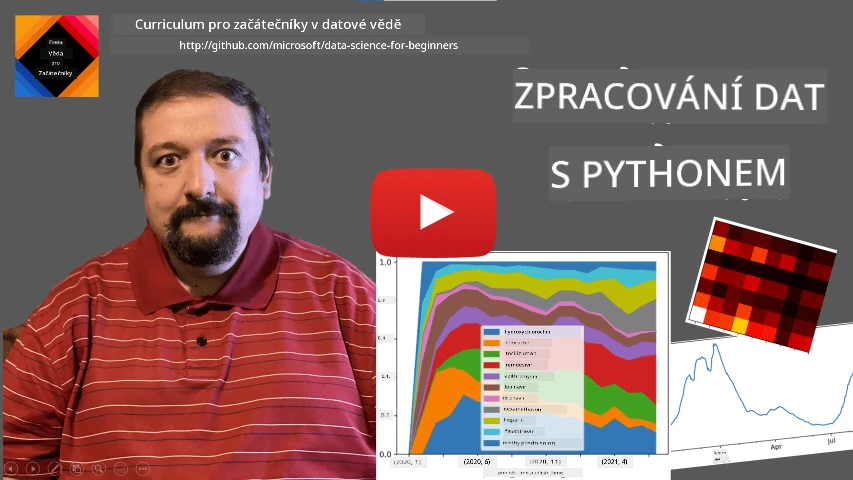
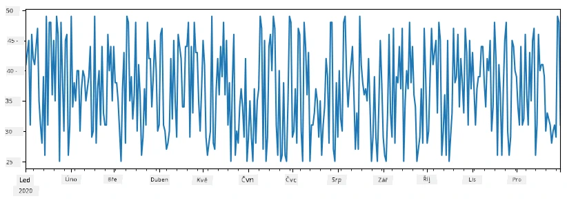
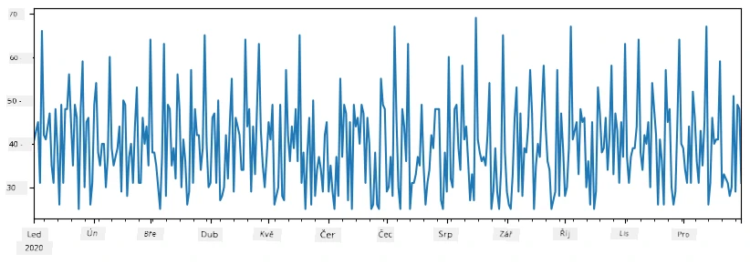
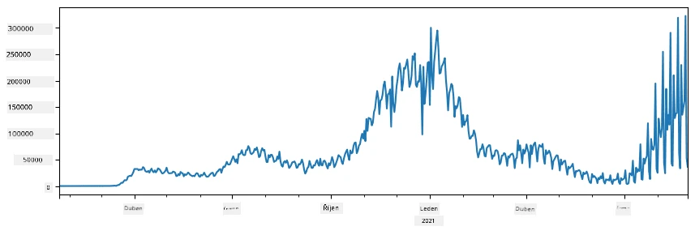
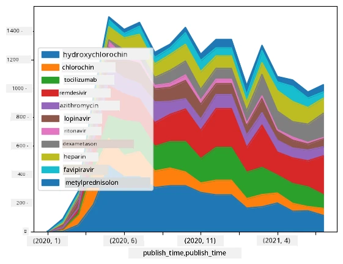

# Práce s daty: Python a knihovna Pandas

|  ](../../sketchnotes/07-WorkWithPython.png) |
| :-------------------------------------------------------------------------------------------------------: |
|                 Práce s Pythonem - _Sketchnote od [@nitya](https://twitter.com/nitya)_                 |

[](https://youtu.be/dZjWOGbsN4Y)

I když databáze nabízejí velmi efektivní způsoby ukládání dat a jejich dotazování pomocí dotazovacích jazyků, nejobecnější způsob zpracování dat je napsat si vlastní program pro manipulaci s daty. V mnoha případech je však efektivnější použít dotaz v databázi. Nicméně v některých případech, kdy je třeba složitější zpracování dat, to nelze snadno provést pomocí SQL.
Zpracování dat lze naprogramovat v jakémkoli programovacím jazyce, ale existují určité jazyky, které jsou vyšší úrovně vzhledem k práci s daty. Data vědci obvykle preferují jeden z následujících jazyků:

* **[Python](https://www.python.org/)**, obecně použitelný programovací jazyk, který je často považován za jednu z nejlepších možností pro začátečníky díky své jednoduchosti. Python má spoustu doplňkových knihoven, které vám mohou pomoci vyřešit mnoho praktických problémů, jako je extrakce dat ze ZIP archivu nebo převod obrázku na odstíny šedi. Kromě datové vědy se Python často používá také pro vývoj webu.
* **[R](https://www.r-project.org/)** je tradiční nástroj vyvinutý s ohledem na statistické zpracování dat. Obsahuje také velký repozitář knihoven (CRAN), což z něj činí dobrou volbu pro zpracování dat. Nicméně R není obecně použitelný programovací jazyk a mimo oblast datové vědy se používá zřídka.
* **[Julia](https://julialang.org/)** je další jazyk vyvinutý speciálně pro datovou vědu. Má poskytovat lepší výkon než Python, což z něj činí skvělý nástroj pro vědecké experimenty.

V této lekci se zaměříme na použití Pythonu pro jednoduché zpracování dat. Předpokládáme základní znalost jazyka. Pokud chcete hlubší průvodce Pythonem, můžete se obrátit na některý z následujících zdrojů:

* [Naučte se Python zábavnou formou pomocí turtle grafiky a fraktálů](https://github.com/shwars/pycourse) - GitHubový rychlý úvod do programování v Pythonu
* [Udělte své první kroky s Pythonem](https://docs.microsoft.com/en-us/learn/paths/python-first-steps/?WT.mc_id=academic-77958-bethanycheum) Výuková cesta na [Microsoft Learn](http://learn.microsoft.com/?WT.mc_id=academic-77958-bethanycheum)

Data mohou mít mnoho podob. V této lekci zvážíme tři formy dat - **tabulková data**, **text** a **obrázky**.

Zaměříme se na několik příkladů zpracování dat místo poskytování úplného přehledu všech souvisejících knihoven. To vám umožní získat hlavní představu o tom, co je možné, a poskytne vám představu, kde hledat řešení vašich problémů, když je budete potřebovat.

> **Nejužitečnější rada**. Kdykoli potřebujete provést určitou operaci s daty, kterou neznáte, jak provést, zkuste ji vyhledat na internetu. [Stackoverflow](https://stackoverflow.com/) obvykle obsahuje spoustu užitečných ukázek kódu v Pythonu pro mnoho typických úloh.


## [Přednáškový kvíz](https://ff-quizzes.netlify.app/en/ds/quiz/12)

## Tabulková data a DataFrame

S tabulkovými daty jste se již setkali, když jsme mluvili o relačních databázích. Když máte hodně dat uložených v mnoha propojených tabulkách, určitě má smysl použít SQL pro práci s nimi. Nicméně existuje mnoho případů, kdy máme tabulku dat a potřebujeme získat nějaké **pochopení** nebo **informace** o těchto datech, například rozložení, korelaci mezi hodnotami atd. V datové vědě je mnoho případů, kdy potřebujeme provést nějaké transformace původních dat, následované vizualizací. Oba tyto kroky lze snadno provést pomocí Pythonu.

Existují dvě nejpoužívanější knihovny v Pythonu, které vám pomohou pracovat s tabulkovými daty:
* **[Pandas](https://pandas.pydata.org/)** umožňuje manipulaci s tzv. **Dataframe**, což jsou analogie relačních tabulek. Můžete mít pojmenované sloupce a provádět různé operace s řádky, sloupci a dataframy obecně.
* **[Numpy](https://numpy.org/)** je knihovna pro práci s **tenzory**, tedy vícerozměrnými **poli**. Pole mají hodnoty stejného základního typu a jsou jednodušší než dataframy, ale nabízejí více matematických operací a vytváří méně režie.

Existuje také několik dalších knihoven, které byste měli znát:
* **[Matplotlib](https://matplotlib.org/)** je knihovna používaná pro vizualizaci dat a kreslení grafů
* **[SciPy](https://www.scipy.org/)** je knihovna s některými dalšími vědeckými funkcemi. S touto knihovnou jsme se již setkali při probírání pravděpodobnosti a statistik.

Zde je úryvek kódu, který byste typicky použili na začátku vašeho Python programu pro import těchto knihoven:
```python
import numpy as np
import pandas as pd
import matplotlib.pyplot as plt
from scipy import ... # musíte specifikovat přesné podbalíčky, které potřebujete
``` 

Pandas je založen na několika základních konceptech.

### Series

**Series** je posloupnost hodnot, podobná seznamu nebo numpy poli. Hlavní rozdíl je, že series má také **index**, a když operujeme se series (například je sčítáme), index se bere v úvahu. Index může být tak jednoduchý jako celočíselné číslo řádku (to je výchozí index při tvorbě series z listu nebo pole), nebo může mít složitější strukturu, jako např. časový interval.

> **Poznámka**: V doprovodném notebooku [`notebook.ipynb`](notebook.ipynb) se nachází úvodní kód pro Pandas. Zde jen krátce nastíníme několik příkladů a samozřejmě doporučujeme podívat se na celý notebook.

Uvažujme příklad: chceme analyzovat prodeje našeho stánku se zmrzlinou. Vygenerujme sérii prodejních čísel (počet prodaných kusů každý den) za určité časové období:

```python
start_date = "Jan 1, 2020"
end_date = "Mar 31, 2020"
idx = pd.date_range(start_date,end_date)
print(f"Length of index is {len(idx)}")
items_sold = pd.Series(np.random.randint(25,50,size=len(idx)),index=idx)
items_sold.plot()
```


Nyní předpokládejme, že každý týden pořádáme párty pro přátele, a k tomuto účelu vezmeme navíc 10 balení zmrzliny. Můžeme vytvořit další sérii, indexovanou týdnem, aby to demonstrovala:
```python
additional_items = pd.Series(10,index=pd.date_range(start_date,end_date,freq="W"))
```
Když přidáme dvě série dohromady, dostaneme celkový počet:
```python
total_items = items_sold.add(additional_items,fill_value=0)
total_items.plot()
```


> **Poznámka**, že nepoužíváme jednoduchou syntaxi `total_items+additional_items`. Kdybychom to udělali, dostali bychom mnoho hodnot `NaN` (*Not a Number*) v výsledné sérii. Je to proto, že některé hodnoty indexu v sérii `additional_items` chybí, a přičítání `NaN` k čemukoli vede k výsledku `NaN`. Proto při sčítání musíme zadat parametr `fill_value`.

U časových řad můžeme také **zpětně měřit vzorkování** série s různými časovými intervaly. Například, chcete-li vypočítat průměrný objem prodeje měsíčně, můžeme použít následující kód:
```python
monthly = total_items.resample("1M").mean()
ax = monthly.plot(kind='bar')
```


### DataFrame

DataFrame je v podstatě kolekce series, které mají stejný index. Můžeme několik series spojit dohromady do DataFrame:
```python
a = pd.Series(range(1,10))
b = pd.Series(["I","like","to","play","games","and","will","not","change"],index=range(0,9))
df = pd.DataFrame([a,b])
```
To vytvoří horizontální tabulku jako tato:
|     | 0   | 1    | 2   | 3   | 4      | 5   | 6      | 7    | 8    |
| --- | --- | ---- | --- | --- | ------ | --- | ------ | ---- | ---- |
| 0   | 1   | 2    | 3   | 4   | 5      | 6   | 7      | 8    | 9    |
| 1   | I   | like | to  | use | Python | and | Pandas | very | much |

Můžeme také použít Series jako sloupce a pojmenovat je pomocí slovníku:
```python
df = pd.DataFrame({ 'A' : a, 'B' : b })
```
To nám dá tabulku jako tato:

|     | A   | B      |
| --- | --- | ------ |
| 0   | 1   | I      |
| 1   | 2   | like   |
| 2   | 3   | to     |
| 3   | 4   | use    |
| 4   | 5   | Python |
| 5   | 6   | and    |
| 6   | 7   | Pandas |
| 7   | 8   | very   |
| 8   | 9   | much   |

**Poznámka**, že tuto tabulku můžeme také získat transpozicí předchozí tabulky, např. takto:
```python
df = pd.DataFrame([a,b]).T.rename(columns={ 0 : 'A', 1 : 'B' })
```
Zde `.T` znamená operaci transpozice DataFrame, tedy změnu řádků a sloupců, a operace `rename` nám umožňuje přejmenovat sloupce tak, aby odpovídaly předchozímu příkladu.

Zde je pár nejdůležitějších operací, které můžeme s DataFrame provádět:

**Výběr sloupců**. Můžeme vybrat jednotlivé sloupce napsáním `df['A']` - tato operace vrací Series. Také můžeme vybrat podmnožinu sloupců do jiného DataFrame, když napíšeme `df[['B','A']]` - to vrátí jiný DataFrame.

**Filtrování** pouze určitých řádků podle kritéria. Například, pokud chceme nechat pouze řádky, kde je hodnota ve sloupci `A` větší než 5, napíšeme `df[df['A']>5]`.

> **Poznámka**: Filtrování funguje takto. Výraz `df['A']<5` vrátí logickou sérii, která označuje, zda je výraz `True` nebo `False` pro každý prvek originální série `df['A']`. Když je logická série použita jako index, vrátí podmnožinu řádků ve DataFrame. Proto nelze použít libovolný Python boolean výraz, např. psaní `df[df['A']>5 and df['A']<7]` by bylo nesprávné. Místo toho byste měli použít speciální operátor `&` na logických sériích, např. `df[(df['A']>5) & (df['A']<7)]` (*závorky jsou zde důležité*).

**Vytváření nových vypočitatelných sloupců**. Můžeme snadno vytvořit nové vypočitatelné sloupce pro náš DataFrame použitím intuitivního výrazu jako je tento:
```python
df['DivA'] = df['A']-df['A'].mean() 
``` 
Tento příklad počítá odchylku sloupce A od jeho průměrné hodnoty. Co se zde vlastně děje, je výpočet series, která je pak přiřazena vlevo, čímž vzniká další sloupec. Tedy nemůžeme použít žádné operace, které nejsou kompatibilní se series, například následující kód je špatně:
```python
# Nesprávný kód -> df['ADescr'] = "Low" pokud df['A'] < 5 jinak "Hi"
df['LenB'] = len(df['B']) # <- Nesprávný výsledek
``` 
Poslední příklad, ač syntakticky správný, dává nesprávný výsledek, protože přiřazuje délku série `B` všem hodnotám ve sloupci, místo délky jednotlivých prvků, jak jsme chtěli.

Pokud potřebujeme vypočítat složitější výrazy, můžeme použít funkci `apply`. Poslední příklad lze zapsat takto:
```python
df['LenB'] = df['B'].apply(lambda x : len(x))
# nebo
df['LenB'] = df['B'].apply(len)
```

Po operacích výše dostaneme následující DataFrame:

|     | A   | B      | DivA | LenB |
| --- | --- | ------ | ---- | ---- |
| 0   | 1   | I      | -4.0 | 1    |
| 1   | 2   | like   | -3.0 | 4    |
| 2   | 3   | to     | -2.0 | 2    |
| 3   | 4   | use    | -1.0 | 3    |
| 4   | 5   | Python | 0.0  | 6    |
| 5   | 6   | and    | 1.0  | 3    |
| 6   | 7   | Pandas | 2.0  | 6    |
| 7   | 8   | very   | 3.0  | 4    |
| 8   | 9   | much   | 4.0  | 4    |

**Výběr řádků podle čísel** lze provést pomocí konstrukce `iloc`. Například pro výběr prvních 5 řádků z DataFrame:
```python
df.iloc[:5]
```

**Seskupování** se často používá k získání výsledku podobného *kontingenčním tabulkám* v Excelu. Předpokládejme, že chceme spočítat průměrnou hodnotu sloupce `A` pro každý daný počet `LenB`. Pak můžeme seskupit náš DataFrame podle `LenB` a zavolat `mean`:
```python
df.groupby(by='LenB')[['A','DivA']].mean()
```
Pokud potřebujeme spočítat průměr i počet prvků ve skupině, můžeme použít složitější funkci `aggregate`:
```python
df.groupby(by='LenB') \
 .aggregate({ 'DivA' : len, 'A' : lambda x: x.mean() }) \
 .rename(columns={ 'DivA' : 'Count', 'A' : 'Mean'})
```
Toto nám dává následující tabulku:

| LenB | Count | Mean     |
| ---- | ----- | -------- |
| 1    | 1     | 1.000000 |
| 2    | 1     | 3.000000 |
| 3    | 2     | 5.000000 |
| 4    | 3     | 6.333333 |
| 6    | 2     | 6.000000 |

### Získávání dat


Viděli jsme, jak je snadné sestavit Series a DataFrames z Python objektů. Data však obvykle přicházejí ve formě textového souboru nebo Excel tabulky. Naštěstí nám Pandas nabízí jednoduchý způsob, jak načíst data z disku. Například čtení CSV souboru je takto jednoduché:
```python
df = pd.read_csv('file.csv')
```
Uvidíme více příkladů načítání dat, včetně získávání dat z externích webových stránek, v části "Challenge"


### Tisk a grafy

Data Scientist často musí prozkoumávat data, proto je důležité být schopný je vizualizovat. Když je DataFrame velký, často chceme jen mít jistotu, že děláme vše správně, vytištěním několika prvních řádků. To lze udělat zavoláním `df.head()`. Pokud to spouštíte v Jupyter Notebooku, DataFrame se vytiskne v pěkné tabulkové podobě.

Viděli jsme také použití funkce `plot` k vizualizaci některých sloupců. Zatímco `plot` je velmi užitečný pro mnoho úkolů a podporuje mnoho různých typů grafů přes parametr `kind=`, vždy můžete použít přímo knihovnu `matplotlib` k vytvoření něčeho složitějšího. Podrobněji pokryjeme vizualizaci dat v samostatných lekcích kurzu.

Tento přehled pokrývá nejdůležitější koncepty Pandas, avšak knihovna je velmi bohatá a neexistuje žádný limit tomu, co s ní můžete dělat! Nyní tuto znalost použijeme k řešení konkrétního problému.

## 🚀 Výzva 1: Analýza šíření COVID

Prvním problémem, na který se zaměříme, je modelování šíření epidemie COVID-19. K tomu použijeme data o počtu nakažených jedinců v různých zemích, poskytovaná [Centrem pro systémy vědy a inženýrství](https://systems.jhu.edu/) (CSSE) na [Johns Hopkins University](https://jhu.edu/). Datová sada je dostupná v [tomto GitHub repozitáři](https://github.com/CSSEGISandData/COVID-19).

Protože chceme ukázat, jak pracovat s daty, zveme vás k otevření [`notebook-covidspread.ipynb`](notebook-covidspread.ipynb) a přečtení od začátku do konce. Můžete také spouštět buňky a vyzkoušet některé výzvy, které jsme pro vás nechali na konci.



> Pokud nevíte, jak spouštět kód v Jupyter Notebooku, podívejte se na [tento článek](https://soshnikov.com/education/how-to-execute-notebooks-from-github/).

## Práce s nestrukturovanými daty

I když data velmi často přicházejí v tabulární podobě, v některých případech je potřeba pracovat s méně strukturovanými daty, například textem nebo obrázky. V takovém případě, abychom mohli aplikovat výše zmíněné techniky zpracování dat, potřebujeme nějakým způsobem **extrahovat** strukturovaná data. Zde je několik příkladů:

* Extrahování klíčových slov z textu a sledování, jak často se tato slova objevují
* Používání neuronových sítí k získání informací o objektech na obrázku
* Získání informací o emocích lidí z videa z kamery

## 🚀 Výzva 2: Analýza COVID publikací

V této výzvě budeme pokračovat s tématem pandemie COVID a zaměříme se na zpracování vědeckých prací na toto téma. Existuje [datová sada CORD-19](https://www.kaggle.com/allen-institute-for-ai/CORD-19-research-challenge) s více než 7000 (v době psaní) pracemi o COVID, dostupná s metadaty a abstrakty (a u asi poloviny je také poskytnut celý text).

Kompletní příklad analýzy této datové sady pomocí kognitivní služby [Text Analytics for Health](https://docs.microsoft.com/azure/cognitive-services/text-analytics/how-tos/text-analytics-for-health/?WT.mc_id=academic-77958-bethanycheum) je popsán [v tomto blogovém příspěvku](https://soshnikov.com/science/analyzing-medical-papers-with-azure-and-text-analytics-for-health/). Budeme diskutovat zjednodušenou verzi této analýzy.

> **POZNÁMKA**: Nekončíme kopii datové sady jako součást tohoto repozitáře. Nejprve si budete možná muset stáhnout soubor [`metadata.csv`](https://www.kaggle.com/allen-institute-for-ai/CORD-19-research-challenge?select=metadata.csv) z [této datové sady na Kaggle](https://www.kaggle.com/allen-institute-for-ai/CORD-19-research-challenge). Může být vyžadována registrace na Kaggle. Datovou sadu můžete také stáhnout bez registrace [odsud](https://ai2-semanticscholar-cord-19.s3-us-west-2.amazonaws.com/historical_releases.html), ale bude obsahovat všechny plné texty kromě metadata souboru.

Otevřete [`notebook-papers.ipynb`](notebook-papers.ipynb) a přečtěte si jej od začátku do konce. Můžete také spouštět buňky a vyzkoušet některé výzvy, které pro vás zanechali na konci.



## Zpracování obrazových dat

Nedávno byly vyvinuty velmi výkonné AI modely, které nám umožňují rozumět obrázkům. Existuje mnoho úloh, které lze vyřešit pomocí předtrénovaných neuronových sítí nebo cloudových služeb. Některé příklady zahrnují:

* **Klasifikace obrázků**, která může pomoci rozdělit obrázek do jedné z předdefinovaných kategorií. Svůj vlastní klasifikátor obrázků můžete jednoduše natrénovat pomocí služeb jako je [Custom Vision](https://azure.microsoft.com/services/cognitive-services/custom-vision-service/?WT.mc_id=academic-77958-bethanycheum)
* **Detekce objektů** k identifikaci různých objektů na obrázku. Služby jako [computer vision](https://azure.microsoft.com/services/cognitive-services/computer-vision/?WT.mc_id=academic-77958-bethanycheum) dokážou detekovat řadu běžných objektů a model [Custom Vision](https://azure.microsoft.com/services/cognitive-services/custom-vision-service/?WT.mc_id=academic-77958-bethanycheum) můžete natrénovat na konkrétní objekty, které vás zajímají.
* **Detekce obličejů**, včetně detekce věku, pohlaví a emocí. To lze provést pomocí [Face API](https://azure.microsoft.com/services/cognitive-services/face/?WT.mc_id=academic-77958-bethanycheum).

Všechny tyto cloudové služby lze volat pomocí [Python SDK](https://docs.microsoft.com/samples/azure-samples/cognitive-services-python-sdk-samples/cognitive-services-python-sdk-samples/?WT.mc_id=academic-77958-bethanycheum), a tak je snadno začlenit do vašeho workflow prozkoumávání dat.

Zde jsou některé příklady zkoumání dat z obrazových zdrojů:
* V blogovém příspěvku [Jak se učit datovou vědu bez programování](https://soshnikov.com/azure/how-to-learn-data-science-without-coding/) zkoumáme fotografie z Instagramu a snažíme se pochopit, co vede lidi k tomu, aby dalo fotografii více lajků. Nejprve extrahujeme z obrázků co nejvíce informací pomocí [computer vision](https://azure.microsoft.com/services/cognitive-services/computer-vision/?WT.mc_id=academic-77958-bethanycheum), a pak použijeme [Azure Machine Learning AutoML](https://docs.microsoft.com/azure/machine-learning/concept-automated-ml/?WT.mc_id=academic-77958-bethanycheum) k vytvoření interpretovatelného modelu.
* V [Facial Studies Workshop](https://github.com/CloudAdvocacy/FaceStudies) používáme [Face API](https://azure.microsoft.com/services/cognitive-services/face/?WT.mc_id=academic-77958-bethanycheum) k extrahování emocí lidí na fotografiích z akcí, abychom se pokusili pochopit, co dělá lidi šťastnými.

## Závěr

Ať už máte strukturovaná nebo nestrukturovaná data, pomocí Pythonu můžete provádět všechny kroky spojené se zpracováním a porozuměním dat. Je to pravděpodobně nejflexibilnější způsob zpracování dat, a proto většina datových vědců používá Python jako svůj hlavní nástroj. Pokud to s datovou vědou myslíte vážně, hlubší znalost Pythonu je pravděpodobně dobrý nápad!

## [Kvíz po přednášce](https://ff-quizzes.netlify.app/en/ds/quiz/13)

## Přehled a samostudium

**Knihy**
* [Wes McKinney. Python pro analýzu dat: Data Wrangling s Pandas, NumPy a IPython](https://www.amazon.com/gp/product/1491957662)

**Online zdroje**
* Oficiální tutoriál [10 minut k Pandas](https://pandas.pydata.org/pandas-docs/stable/user_guide/10min.html)
* [Dokumentace k vizualizaci v Pandas](https://pandas.pydata.org/pandas-docs/stable/user_guide/visualization.html)

**Učení Pythonu**
* [Naučte se Python zábavnou formou s grafikou Turtle a fraktály](https://github.com/shwars/pycourse)
* [Uděláte své první kroky s Pythonem](https://docs.microsoft.com/learn/paths/python-first-steps/?WT.mc_id=academic-77958-bethanycheum) Výuková cesta na [Microsoft Learn](http://learn.microsoft.com/?WT.mc_id=academic-77958-bethanycheum)

## Zadání

[Proveďte podrobnější studii dat pro výše uvedené výzvy](assignment.md)

## Poděkování

Tuto lekci připravil s ♥️ [Dmitry Soshnikov](http://soshnikov.com)

---

<!-- CO-OP TRANSLATOR DISCLAIMER START -->
**Prohlášení o omezení odpovědnosti**:
Tento dokument byl přeložen pomocí AI překladatelské služby [Co-op Translator](https://github.com/Azure/co-op-translator). Přestože usilujeme o co největší přesnost, mějte prosím na paměti, že automatizované překlady mohou obsahovat chyby nebo nepřesnosti. Originální dokument v jeho mateřském jazyce by měl být považován za autoritativní zdroj. Pro kritické informace se doporučuje profesionální lidský překlad. Nejsme odpovědní za jakékoli nedorozumění nebo nesprávné interpretace vzniklé použitím tohoto překladu.
<!-- CO-OP TRANSLATOR DISCLAIMER END -->