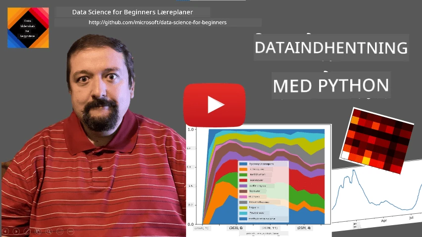
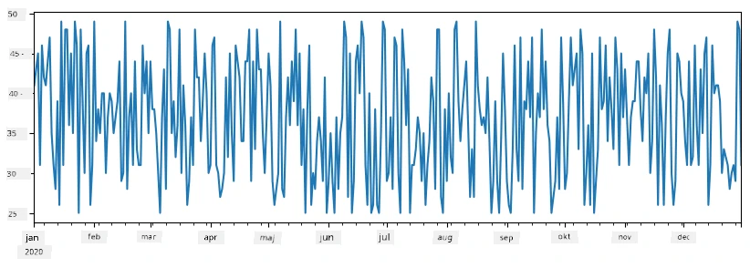
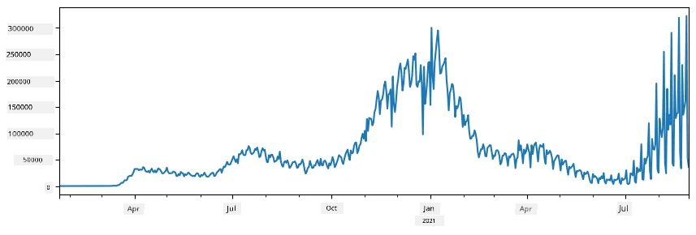
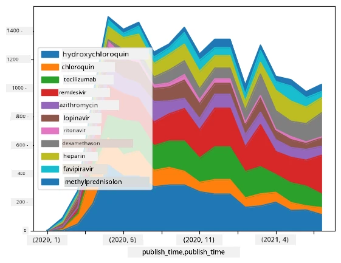

# Arbejde med data: Python og Pandas-biblioteket

|  ](../../sketchnotes/07-WorkWithPython.png) |
| :-------------------------------------------------------------------------------------------------------: |
|                 Arbejde med Python - _Sketchnote af [@nitya](https://twitter.com/nitya)_                 |

[](https://youtu.be/dZjWOGbsN4Y)

Mens databaser tilbyder meget effektive måder at gemme data på og forespørge på dem ved hjælp af forespørgselssprog, er den mest fleksible måde til databehandling at skrive dit eget program til at manipulere data. I mange tilfælde vil det være mere effektivt at lave en databaseforespørgsel. Men i nogle tilfælde, når mere kompleks databehandling er nødvendig, kan det ikke let gøres med SQL.
Databehandling kan programmeres i ethvert programmeringssprog, men der findes visse sprog, som er på højere niveau med hensyn til arbejde med data. Dataforskere foretrækker typisk et af følgende sprog:

* **[Python](https://www.python.org/)**, et generelt programmeringssprog, som ofte betragtes som en af de bedste muligheder for begyndere på grund af dets enkelhed. Python har mange yderligere biblioteker, der kan hjælpe dig med at løse mange praktiske problemer, såsom at hente dine data ud af en ZIP-arkiv eller konvertere et billede til gråtoner. Ud over data science bruges Python også ofte til webudvikling.
* **[R](https://www.r-project.org/)** er et traditionelt værktøjskasse udviklet med statistisk databehandling i tankerne. Det indeholder også et stort bibliotek af pakker (CRAN), hvilket gør det til et godt valg til databehandling. Dog er R ikke et generelt programmeringssprog og bruges sjældent uden for data science-domænet.
* **[Julia](https://julialang.org/)** er et andet sprog udviklet specifikt til data science. Det er tænkt til at give bedre ydelse end Python, hvilket gør det til et fremragende værktøj til videnskabelige eksperimenter.

I denne lektion vil vi fokusere på brug af Python til simpel databehandling. Vi antager en grundlæggende kendskab til sproget. Hvis du ønsker en dybere introduktion til Python, kan du se en af følgende ressourcer:

* [Lær Python på en sjov måde med Turtle Graphics og Fraktaler](https://github.com/shwars/pycourse) - GitHub-baseret hurtig introduktionskursus til Python-programmering
* [Tag dine første skridt med Python](https://docs.microsoft.com/en-us/learn/paths/python-first-steps/?WT.mc_id=academic-77958-bethanycheum) Læringssti på [Microsoft Learn](http://learn.microsoft.com/?WT.mc_id=academic-77958-bethanycheum)

Data kan forekomme i mange former. I denne lektion vil vi se på tre former for data - **tabulære data**, **tekst** og **billeder**.

Vi vil fokusere på et par eksempler på databehandling i stedet for at give dig et fuldt overblik over alle relevante biblioteker. Det vil give dig en hovedidé om, hvad der er muligt, og lade dig forstå, hvor du kan finde løsninger på dine problemer, når du har brug for dem.

> **Det mest nyttige råd**. Når du har brug for at udføre en bestemt operation på data, som du ikke ved, hvordan du gør, så prøv at søge efter det på internettet. [Stackoverflow](https://stackoverflow.com/) indeholder ofte mange nyttige kodeeksempler i Python til mange typiske opgaver.


## [Quiz inden lektionen](https://ff-quizzes.netlify.app/en/ds/quiz/12)

## Tabulære data og DataFrames

Du har allerede mødt tabulære data, når vi talte om relationelle databaser. Når du har meget data, og den er indeholdt i mange forskellige sammenkoblede tabeller, giver det bestemt mening at bruge SQL til at arbejde med dem. Der er dog mange tilfælde, hvor vi har en datatabel, og vi skal opnå en form for **forståelse** eller **indsigt** i disse data, såsom fordelingen, korrelationen mellem værdier osv. I data science er der mange situationer, hvor vi skal udføre transformationer af de oprindelige data efterfulgt af visualisering. Begge disse trin kan nemt udføres med Python.

Der er to af de mest nyttige biblioteker i Python, som kan hjælpe dig med at håndtere tabulære data:
* **[Pandas](https://pandas.pydata.org/)** gør det muligt at manipulere såkaldte **DataFrames**, som svarer til relationelle tabeller. Du kan have navngivne kolonner og udføre forskellige operationer på rækker, kolonner og DataFrames generelt.
* **[Numpy](https://numpy.org/)** er et bibliotek til arbejde med **tensorer**, dvs. multi-dimensionelle **arrays**. Arrays har værdier af samme underliggende type, og de er simplere end DataFrames, men tilbyder flere matematiske operationer og skaber mindre overhead.

Der er også et par andre biblioteker, du bør kende til:
* **[Matplotlib](https://matplotlib.org/)** er et bibliotek, der bruges til datavisualisering og til at plotte grafer
* **[SciPy](https://www.scipy.org/)** er et bibliotek med nogle yderligere videnskabelige funktioner. Vi er allerede stødt på dette bibliotek, når vi talte om sandsynlighed og statistik

Her er et stykke kode, som du typisk vil bruge til at importere disse biblioteker i begyndelsen af dit Python-program:
```python
import numpy as np
import pandas as pd
import matplotlib.pyplot as plt
from scipy import ... # du skal angive præcise underpakker, som du har brug for
``` 

Pandas er centreret omkring nogle grundlæggende begreber.

### Serie (Series)

**Series** er en sekvens af værdier, svarende til en liste eller numpy-array. Den vigtigste forskel er, at en serie også har et **index**, og når vi opererer på serier (f.eks. lægger dem sammen), tages index i betragtning. Index kan være så simpelt som heltalsrækkenummer (det er standardindekset, når man opretter en serie fra en liste eller array), eller det kan have en kompleks struktur som et datointerval.

> **Bemærk**: Der er noget introducerende Pandas-kode i det tilhørende notebook [`notebook.ipynb`](notebook.ipynb). Vi skitserer kun nogle af eksemplerne her, og du er bestemt velkommen til at tjekke hele notebooken.

Overvej et eksempel: vi vil analysere salget i vores isbod. Lad os generere en serie af salgsnumre (antal solgte varer hver dag) for en given periode:

```python
start_date = "Jan 1, 2020"
end_date = "Mar 31, 2020"
idx = pd.date_range(start_date,end_date)
print(f"Length of index is {len(idx)}")
items_sold = pd.Series(np.random.randint(25,50,size=len(idx)),index=idx)
items_sold.plot()
```


Antag nu, at vi hver uge arrangerer en fest for venner og medbringer yderligere 10 pakker is til festen. Vi kan oprette en anden serie, indekseret efter uger, for at vise det:
```python
additional_items = pd.Series(10,index=pd.date_range(start_date,end_date,freq="W"))
```
Når vi lægger to serier sammen, får vi et samlet antal:
```python
total_items = items_sold.add(additional_items,fill_value=0)
total_items.plot()
```


> **Bemærk** at vi ikke bruger den simple syntaks `total_items+additional_items`. Hvis vi gjorde det, ville vi få mange `NaN` (*Not a Number*) værdier i den resulterende serie. Det skyldes, at der mangler værdier for nogle af indeks-punkterne i `additional_items`-serien, og at lægges `NaN` til noget som helst, resulterer det i `NaN`. Derfor skal vi angive `fill_value`-parameteren under addition.

Med tidsserier kan vi også **genprøveudtage** serien med forskellige tidsintervaller. For eksempel antag, at vi vil beregne gennemsnitligt salgsmængde pr. måned. Vi kan bruge følgende kode:
```python
monthly = total_items.resample("1M").mean()
ax = monthly.plot(kind='bar')
```


### DataFrame

En DataFrame er i bund og grund en samling af serier med samme index. Vi kan kombinere flere serier i en DataFrame:
```python
a = pd.Series(range(1,10))
b = pd.Series(["I","like","to","play","games","and","will","not","change"],index=range(0,9))
df = pd.DataFrame([a,b])
```
Dette vil skabe en vandret tabel som denne:
|     | 0   | 1    | 2   | 3   | 4      | 5   | 6      | 7    | 8    |
| --- | --- | ---- | --- | --- | ------ | --- | ------ | ---- | ---- |
| 0   | 1   | 2    | 3   | 4   | 5      | 6   | 7      | 8    | 9    |
| 1   | I   | like | to  | use | Python | and | Pandas | very | much |

Vi kan også bruge Series som kolonner og angive kolonnenavne ved hjælp af en ordbog (dictionary):
```python
df = pd.DataFrame({ 'A' : a, 'B' : b })
```
Dette vil give os en tabel som denne:

|     | A   | B      |
| --- | --- | ------ |
| 0   | 1   | I      |
| 1   | 2   | like   |
| 2   | 3   | to     |
| 3   | 4   | use    |
| 4   | 5   | Python |
| 5   | 6   | and    |
| 6   | 7   | Pandas |
| 7   | 8   | very   |
| 8   | 9   | much   |

**Bemærk** at vi også kan få dette tabellayout ved at transponere den tidligere tabel, f.eks. ved at skrive
```python
df = pd.DataFrame([a,b]).T.rename(columns={ 0 : 'A', 1 : 'B' })
```
Her betyder `.T` operationen at transponere DataFrame, dvs. at skifte rækker og kolonner, og `rename`-operationen tillader os at ændre kolonnenavne, så de passer med det tidligere eksempel.

Her er nogle af de vigtigste operationer, vi kan udføre på DataFrames:

**Kolonnevalg**. Vi kan vælge individuelle kolonner ved at skrive `df['A']` - denne operation returnerer en Serie. Vi kan også vælge et delmængde af kolonner til en anden DataFrame ved at skrive `df[['B','A']]` - dette returnerer en anden DataFrame.

**Filtrering** af kun visse rækker efter kriterier. For eksempel, for kun at bevare rækker med kolonne `A` større end 5, kan vi skrive `df[df['A']>5]`.

> **Bemærk**: Måden filtrering fungerer på er følgende. Udtrykket `df['A']<5` returnerer en boolesk serie, som angiver, om udtrykket er `True` eller `False` for hvert element i den oprindelige serie `df['A']`. Når en boolesk serie bruges som index, returnerer det et delmængde af rækker i DataFrame. Derfor er det ikke muligt at bruge vilkårlige Python-boolske udtryk, for eksempel ville `df[df['A']>5 and df['A']<7]` være forkert. I stedet bør du bruge den særlige `&` operation på booleske serier, altså skrive `df[(df['A']>5) & (df['A']<7)]` (*parenteserne er vigtige her*).

**Oprettelse af nye beregnede kolonner**. Vi kan nemt oprette nye beregnede kolonner for vores DataFrame ved at bruge intuitive udtryk som dette:
```python
df['DivA'] = df['A']-df['A'].mean() 
``` 
Dette eksempel beregner afvigelsen af A fra dens gennemsnitsværdi. Hvad der faktisk sker her, er, at vi beregner en serie og derefter tildeler denne serie til venstresiden, hvilket skaber en ny kolonne. Derfor kan vi ikke bruge operationer, som ikke er kompatible med serier; for eksempel er nedenstående kode forkert:
```python
# Forkert kode -> df['ADescr'] = "Low" hvis df['A'] < 5 ellers "Hi"
df['LenB'] = len(df['B']) # <- Forkert resultat
``` 
Det sidste eksempel, selvom det er syntaktisk korrekt, giver et forkert resultat, fordi det tildeler længden af serien `B` til alle værdier i kolonnen, og ikke længden af de enkelte elementer, som vi ønskede.

Hvis vi har brug for at beregne komplekse udtryk som dette, kan vi bruge `apply`-funktionen. Det sidste eksempel kan skrives således:
```python
df['LenB'] = df['B'].apply(lambda x : len(x))
# eller
df['LenB'] = df['B'].apply(len)
```

Efter ovenstående operationer vil vi ende op med følgende DataFrame:

|     | A   | B      | DivA | LenB |
| --- | --- | ------ | ---- | ---- |
| 0   | 1   | I      | -4.0 | 1    |
| 1   | 2   | like   | -3.0 | 4    |
| 2   | 3   | to     | -2.0 | 2    |
| 3   | 4   | use    | -1.0 | 3    |
| 4   | 5   | Python | 0.0  | 6    |
| 5   | 6   | and    | 1.0  | 3    |
| 6   | 7   | Pandas | 2.0  | 6    |
| 7   | 8   | very   | 3.0  | 4    |
| 8   | 9   | much   | 4.0  | 4    |

**Udvælgelse af rækker baseret på nummer** kan gøres med `iloc`-konstruktionen. For eksempel, for at vælge de første 5 rækker fra DataFrame:
```python
df.iloc[:5]
```

**Gruppering** bruges ofte til at få et resultat, der ligner *pivot-tabeller* i Excel. Antag, at vi ønsker at beregne gennemsnitsværdien for kolonne `A` for hvert givet tal af `LenB`. Så kan vi gruppere vores DataFrame efter `LenB` og kalde `mean`:
```python
df.groupby(by='LenB')[['A','DivA']].mean()
```
Hvis vi vil beregne gennemsnit og antallet af elementer i gruppen, kan vi bruge en mere kompleks `aggregate`-funktion:
```python
df.groupby(by='LenB') \
 .aggregate({ 'DivA' : len, 'A' : lambda x: x.mean() }) \
 .rename(columns={ 'DivA' : 'Count', 'A' : 'Mean'})
```
Dette giver os følgende tabel:

| LenB | Count | Mean     |
| ---- | ----- | -------- |
| 1    | 1     | 1.000000 |
| 2    | 1     | 3.000000 |
| 3    | 2     | 5.000000 |
| 4    | 3     | 6.333333 |
| 6    | 2     | 6.000000 |

### Indhentning af data


Vi har set, hvor nemt det er at opbygge Series og DataFrames fra Python-objekter. Data kommer dog som regel i form af en tekstfil eller en Excel-tabel. Heldigvis tilbyder Pandas en simpel måde at indlæse data fra disk på. For eksempel er det så enkelt at læse en CSV-fil:
```python
df = pd.read_csv('file.csv')
```
Vi vil se flere eksempler på indlæsning af data, herunder hentning fra eksterne websteder, i afsnittet "Challenge"


### Udskrivning og plotning

En dataforsker skal ofte udforske data, så det er vigtigt at kunne visualisere dem. Når en DataFrame er stor, vil man mange gange bare sikre sig, at man gør alt korrekt ved at udskrive de første par rækker. Dette kan gøres ved at kalde `df.head()`. Hvis du kører det fra Jupyter Notebook, vil det udskrive DataFramen i pæn tabelform.

Vi har også set brugen af `plot` funktionen til at visualisere nogle kolonner. Mens `plot` er meget nyttigt til mange opgaver og understøtter mange forskellige graf-typer via `kind=` parameteren, kan du altid bruge det rå `matplotlib` bibliotek til at plotte noget mere komplekst. Vi vil dække datavisualisering detaljeret i separate kursuslektioner.

Denne oversigt dækker de vigtigste koncepter i Pandas, men biblioteket er meget rigt, og der er ingen grænse for, hvad du kan gøre med det! Lad os nu anvende denne viden til at løse et specifikt problem.

## 🚀 Challenge 1: Analyse af COVID-spredning

Det første problem, vi vil fokusere på, er modellering af den epidemiske spredning af COVID-19. For at gøre dette bruger vi data om antallet af smittede individer i forskellige lande, leveret af [Center for Systems Science and Engineering](https://systems.jhu.edu/) (CSSE) ved [Johns Hopkins University](https://jhu.edu/). Data-sættet er tilgængeligt i [dette GitHub Repository](https://github.com/CSSEGISandData/COVID-19).

Da vi vil demonstrere, hvordan man håndterer data, inviterer vi dig til at åbne [`notebook-covidspread.ipynb`](notebook-covidspread.ipynb) og læse den fra top til bund. Du kan også køre celler og prøve nogle af de udfordringer, vi har efterladt til dig til sidst.



> Hvis du ikke ved, hvordan man kører kode i Jupyter Notebook, kan du tage et kig på [denne artikel](https://soshnikov.com/education/how-to-execute-notebooks-from-github/).

## Arbejde med ustrukturerede data

Selvom data meget ofte kommer i tabelform, er der i nogle tilfælde behov for at håndtere mindre strukturerede data, for eksempel tekst eller billeder. I dette tilfælde, for at anvende de databehandlingsteknikker, vi har set ovenfor, skal vi på en eller anden måde **udtrække** strukturerede data. Her er nogle eksempler:

* Udtrækning af nøgleord fra tekst, og se hvor ofte disse nøgleord forekommer
* Brug af neurale netværk til at udtrække information om objekter på billedet
* Indhentning af information om følelser hos personer på videokamera-feed

## 🚀 Challenge 2: Analyse af COVID-artikler

I denne udfordring fortsætter vi med emnet COVID-pandemien og fokuserer på behandling af videnskabelige artikler om emnet. Der findes [CORD-19 Dataset](https://www.kaggle.com/allen-institute-for-ai/CORD-19-research-challenge) med mere end 7000 (på tidspunktet for skrivning) artikler om COVID, tilgængelige med metadata og abstracts (og for omkring halvdelen er der også fuld tekst tilgængelig).

Et fuldt eksempel på analyse af dette datasæt ved hjælp af [Text Analytics for Health](https://docs.microsoft.com/azure/cognitive-services/text-analytics/how-tos/text-analytics-for-health/?WT.mc_id=academic-77958-bethanycheum) kognitiv service er beskrevet [i dette blogindlæg](https://soshnikov.com/science/analyzing-medical-papers-with-azure-and-text-analytics-for-health/). Vi vil diskutere en forenklet version af denne analyse.

> **NOTE**: Vi stiller ikke en kopi af datasættet til rådighed som en del af dette repository. Du skal muligvis først downloade [`metadata.csv`](https://www.kaggle.com/allen-institute-for-ai/CORD-19-research-challenge?select=metadata.csv) filen fra [dette datasæt på Kaggle](https://www.kaggle.com/allen-institute-for-ai/CORD-19-research-challenge). Registrering hos Kaggle kan være nødvendig. Du kan også downloade datasættet uden registrering [herfra](https://ai2-semanticscholar-cord-19.s3-us-west-2.amazonaws.com/historical_releases.html), men det vil inkludere alle fulde tekster ud over metadata-filen.

Åbn [`notebook-papers.ipynb`](notebook-papers.ipynb) og læs den fra top til bund. Du kan også køre celler og prøve nogle af de udfordringer, vi har efterladt til dig til sidst.



## Behandling af billeddata

For nylig er meget kraftfulde AI-modeller blevet udviklet, der gør det muligt for os at forstå billeder. Der er mange opgaver, som kan løses ved brug af fortrænede neurale netværk eller cloud-tjenester. Nogle eksempler omfatter:

* **Billedklassifikation**, som kan hjælpe dig med at kategorisere billedet i en af de foruddefinerede klasser. Du kan nemt træne dine egne billedklassifikatorer ved hjælp af tjenester som [Custom Vision](https://azure.microsoft.com/services/cognitive-services/custom-vision-service/?WT.mc_id=academic-77958-bethanycheum)
* **Objektdetektion** for at opdage forskellige objekter i billedet. Tjenester som [computer vision](https://azure.microsoft.com/services/cognitive-services/computer-vision/?WT.mc_id=academic-77958-bethanycheum) kan opdage en række almindelige objekter, og du kan træne en [Custom Vision](https://azure.microsoft.com/services/cognitive-services/custom-vision-service/?WT.mc_id=academic-77958-bethanycheum) model til at opdage nogle specifikke objekter af interesse.
* **Ansigtsgenkendelse**, inklusive alder, køn og følelsesdetektion. Dette kan gøres via [Face API](https://azure.microsoft.com/services/cognitive-services/face/?WT.mc_id=academic-77958-bethanycheum).

Alle disse cloudtjenester kan kaldes ved hjælp af [Python SDKs](https://docs.microsoft.com/samples/azure-samples/cognitive-services-python-sdk-samples/cognitive-services-python-sdk-samples/?WT.mc_id=academic-77958-bethanycheum) og kan således nemt integreres i din dataudforskningsworkflow.

Her er nogle eksempler på udforskning af data fra billeddatakilder:
* I blogindlægget [How to Learn Data Science without Coding](https://soshnikov.com/azure/how-to-learn-data-science-without-coding/) undersøger vi Instagram-fotos for at forstå, hvad der får folk til at give flere likes til et foto. Vi udtrækker først så meget information som muligt fra billeder ved hjælp af [computer vision](https://azure.microsoft.com/services/cognitive-services/computer-vision/?WT.mc_id=academic-77958-bethanycheum), og bruger derefter [Azure Machine Learning AutoML](https://docs.microsoft.com/azure/machine-learning/concept-automated-ml/?WT.mc_id=academic-77958-bethanycheum) til at bygge en fortolkelig model.
* I [Facial Studies Workshop](https://github.com/CloudAdvocacy/FaceStudies) bruger vi [Face API](https://azure.microsoft.com/services/cognitive-services/face/?WT.mc_id=academic-77958-bethanycheum) til at udtrække følelser hos personer på fotografier fra events for at prøve at forstå, hvad der gør folk glade.

## Konklusion

Uanset om du allerede har strukturerede eller ustrukturerede data, kan du med Python udføre alle trin relateret til databehandling og forståelse. Det er sandsynligvis den mest fleksible måde at håndtere data på, og det er grunden til, at størstedelen af dataforskere bruger Python som deres primære værktøj. Det er nok en god idé at lære Python i dybden, hvis du mener alvorligt med din data science rejse!

## [Quiz efter forelæsning](https://ff-quizzes.netlify.app/en/ds/quiz/13)

## Gennemgang & Selvstudium

**Bøger**
* [Wes McKinney. Python for Data Analysis: Data Wrangling with Pandas, NumPy, and IPython](https://www.amazon.com/gp/product/1491957662)

**Online Ressourcer**
* Officiel [10 minutter til Pandas](https://pandas.pydata.org/pandas-docs/stable/user_guide/10min.html) vejledning
* [Dokumentation om Pandas Visualisering](https://pandas.pydata.org/pandas-docs/stable/user_guide/visualization.html)

**Lær Python**
* [Lær Python på en sjov måde med Turtle Graphics og Fraktaler](https://github.com/shwars/pycourse)
* [Tag dine første skridt med Python](https://docs.microsoft.com/learn/paths/python-first-steps/?WT.mc_id=academic-77958-bethanycheum) læringssti på [Microsoft Learn](http://learn.microsoft.com/?WT.mc_id=academic-77958-bethanycheum)

## Opgave

[Udfør en mere detaljeret dataanalyse for ovenstående udfordringer](assignment.md)

## Kilder

Denne lektion er skrevet med ♥️ af [Dmitry Soshnikov](http://soshnikov.com)

---

<!-- CO-OP TRANSLATOR DISCLAIMER START -->
**Ansvarsfraskrivelse**:
Dette dokument er blevet oversat ved hjælp af AI-oversættelsestjenesten [Co-op Translator](https://github.com/Azure/co-op-translator). Selvom vi bestræber os på nøjagtighed, skal du være opmærksom på, at automatiserede oversættelser kan indeholde fejl eller unøjagtigheder. Det originale dokument på dets oprindelige sprog bør betragtes som den autoritative kilde. For kritisk information anbefales professionel menneskelig oversættelse. Vi påtager os intet ansvar for misforståelser eller fejltolkninger, der opstår som følge af brugen af denne oversættelse.
<!-- CO-OP TRANSLATOR DISCLAIMER END -->