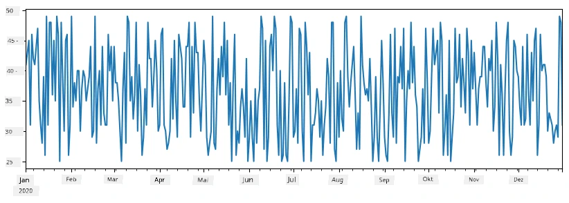
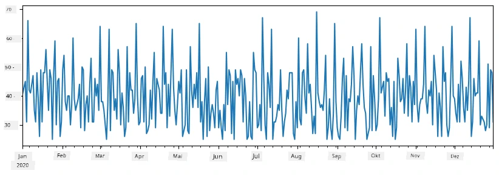
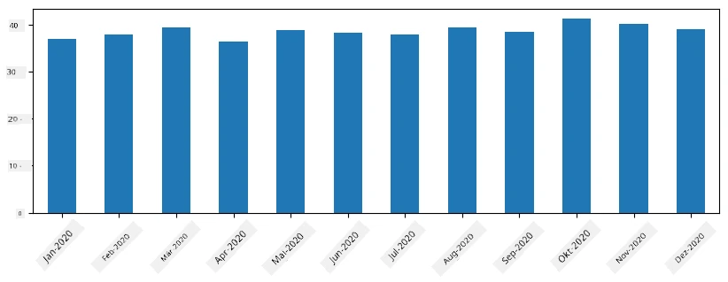
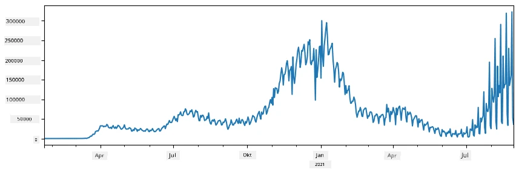
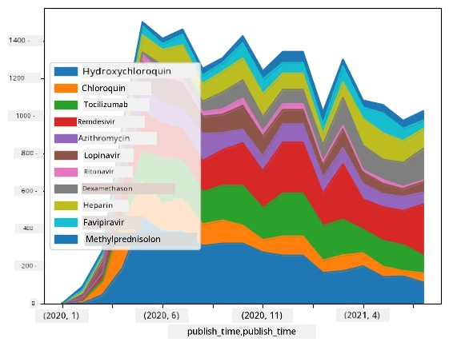

# Arbeiten mit Daten: Python und die Pandas-Bibliothek

|  ](../../sketchnotes/07-WorkWithPython.png) |
| :-------------------------------------------------------------------------------------------------------: |
|                 Arbeiten mit Python – _Sketchnote von [@nitya](https://twitter.com/nitya)_                 |

[](https://youtu.be/dZjWOGbsN4Y)

Während Datenbanken sehr effiziente Möglichkeiten bieten, Daten zu speichern und mit Abfragesprachen abzufragen, ist die flexibelste Art der Datenverarbeitung das Schreiben eines eigenen Programms zur Manipulation von Daten. In vielen Fällen wäre eine Datenbankabfrage jedoch der effektivere Weg. Doch in einigen Fällen, wenn komplexere Datenverarbeitung notwendig ist, lässt sich dies nicht einfach mit SQL erledigen.
Datenverarbeitung kann in jeder Programmiersprache programmiert werden, aber es gibt bestimmte Sprachen, die im Hinblick auf die Arbeit mit Daten höherwertig sind. Datenwissenschaftler bevorzugen typischerweise eine der folgenden Sprachen:

* **[Python](https://www.python.org/)**, eine allgemeine Programmiersprache, die aufgrund ihrer Einfachheit oft als eine der besten Optionen für Anfänger gilt. Python verfügt über viele zusätzliche Bibliotheken, die Ihnen bei der Lösung zahlreicher praktischer Probleme helfen können, z. B. das Extrahieren Ihrer Daten aus ZIP-Archiven oder das Konvertieren von Bildern in Graustufen. Neben der Datenwissenschaft wird Python auch häufig für die Webentwicklung verwendet.
* **[R](https://www.r-project.org/)** ist ein traditionelles Toolbox, das mit Blick auf statistische Datenverarbeitung entwickelt wurde. Es enthält auch ein großes Repository von Bibliotheken (CRAN), was es zu einer guten Wahl für die Datenverarbeitung macht. R ist jedoch keine allgemeine Programmiersprache und wird außerhalb der Domäne der Datenwissenschaft selten verwendet.
* **[Julia](https://julialang.org/)** ist eine weitere Sprache, die speziell für die Datenwissenschaft entwickelt wurde. Sie soll eine bessere Leistung als Python bieten, was sie zu einem großartigen Werkzeug für wissenschaftliche Experimente macht.

In dieser Lektion konzentrieren wir uns auf die Verwendung von Python für einfache Datenverarbeitung. Wir setzen grundlegende Vertrautheit mit der Sprache voraus. Wenn Sie einen tieferen Einblick in Python wünschen, können Sie auf eine der folgenden Ressourcen zurückgreifen:

* [Lerne Python auf unterhaltsame Weise mit Turtle Graphics und Fraktalen](https://github.com/shwars/pycourse) – GitHub-basierter Schnellkurs in Python-Programmierung
* [Mach deine ersten Schritte mit Python](https://docs.microsoft.com/en-us/learn/paths/python-first-steps/?WT.mc_id=academic-77958-bethanycheum) Lernpfad auf [Microsoft Learn](http://learn.microsoft.com/?WT.mc_id=academic-77958-bethanycheum)

Daten können in vielen Formen vorliegen. In dieser Lektion betrachten wir drei Formen von Daten – **tabellarische Daten**, **Text** und **Bilder**.

Wir konzentrieren uns auf einige wenige Beispiele der Datenverarbeitung, statt Ihnen eine vollständige Übersicht aller verwandten Bibliotheken zu geben. Das ermöglicht es Ihnen, die Hauptidee zu erfassen und gibt Ihnen ein Verständnis darüber, wo Sie Lösungen für Ihre Probleme finden können, wenn Sie sie benötigen.

> **Der nützlichste Rat:** Wenn Sie eine bestimmte Operation auf Daten durchführen müssen und nicht wissen, wie, versuchen Sie, online danach zu suchen. [Stackoverflow](https://stackoverflow.com/) enthält meist viele nützliche Python-Codebeispiele für viele typische Aufgaben.


## [Quiz vor der Vorlesung](https://ff-quizzes.netlify.app/en/ds/quiz/12)

## Tabellarische Daten und DataFrames

Sie sind tabellarische Daten bereits begegnet, als wir über relationale Datenbanken gesprochen haben. Wenn Sie viele Daten haben, die in vielen verschiedenen verknüpften Tabellen enthalten sind, macht es definitiv Sinn, SQL zur Arbeit damit zu nutzen. Es gibt aber viele Fälle, in denen wir eine Tabelle mit Daten haben und Einblick oder Verständnis über diese Daten gewinnen müssen, z. B. die Verteilung, Korrelationen zwischen Werten etc. In der Datenwissenschaft gibt es viele Fälle, in denen wir Daten transformieren und dann visualisieren möchten. Beide Schritte lassen sich leicht mit Python ausführen.

Es gibt zwei am häufigsten genutzte Bibliotheken in Python, die Ihnen bei der Arbeit mit tabellarischen Daten helfen:
* **[Pandas](https://pandas.pydata.org/)** ermöglicht die Manipulation sogenannter **DataFrames**, die analog zu relationalen Tabellen sind. Sie können benannte Spalten haben und verschiedene Operationen auf Zeilen, Spalten und DataFrames im Allgemeinen ausführen.
* **[Numpy](https://numpy.org/)** ist eine Bibliothek zum Arbeiten mit **Tensoren**, das heißt mehrdimensionalen **Arrays**. Ein Array hat Werte gleichen Typs und ist einfacher als ein DataFrame, bietet aber mehr mathematische Operationen und erzeugt weniger Overhead.

Es gibt auch ein paar andere Bibliotheken, die Sie kennen sollten:
* **[Matplotlib](https://matplotlib.org/)** ist eine Bibliothek für Datenvisualisierung und das Erstellen von Diagrammen
* **[SciPy](https://www.scipy.org/)** ist eine Bibliothek mit einigen zusätzlichen wissenschaftlichen Funktionen. Wir sind dieser Bibliothek bereits begegnet, als wir über Wahrscheinlichkeit und Statistik gesprochen haben

Hier ist ein Codeabschnitt, den Sie typischerweise verwenden würden, um diese Bibliotheken am Anfang Ihres Python-Programms zu importieren:
```python
import numpy as np
import pandas as pd
import matplotlib.pyplot as plt
from scipy import ... # Sie müssen die genauen Unterpakete angeben, die Sie benötigen
``` 

Pandas dreht sich um einige Grundkonzepte.

### Series

**Series** ist eine Folge von Werten, ähnlich einer Liste oder einem Numpy-Array. Der Hauptunterschied ist, dass eine Series auch einen **Index** hat und wenn wir Operationen auf Series ausführen (z. B. Addieren), wird der Index berücksichtigt. Der Index kann so einfach sein wie eine ganzzahlige Zeilennummer (das ist der Standardindex beim Erstellen einer Series aus einer Liste oder einem Array) oder er kann eine komplexere Struktur haben, z.B. ein Datumsintervall.

> **Hinweis**: Im begleitenden Notebook [`notebook.ipynb`](notebook.ipynb) finden Sie einige einführende Pandas-Beispiele. Wir erläutern hier nur einige Beispiele und Sie sind herzlich eingeladen, sich das vollständige Notebook anzusehen.

Betrachten wir ein Beispiel: Wir wollen die Verkäufe unseres Eisspezialitätenverkaufs analysieren. Generieren wir eine Series mit Verkaufszahlen (Anzahl verkaufter Artikel pro Tag) für einen bestimmten Zeitraum:

```python
start_date = "Jan 1, 2020"
end_date = "Mar 31, 2020"
idx = pd.date_range(start_date,end_date)
print(f"Length of index is {len(idx)}")
items_sold = pd.Series(np.random.randint(25,50,size=len(idx)),index=idx)
items_sold.plot()
```


Angenommen, wir organisieren jede Woche eine Party für Freunde und nehmen zusätzlich 10 Packungen Eis für die Party mit. Wir können eine weitere Series erstellen, die nach Woche indiziert ist, um das zu demonstrieren:
```python
additional_items = pd.Series(10,index=pd.date_range(start_date,end_date,freq="W"))
```
Wenn wir zwei Series addieren, erhalten wir die Gesamtzahl:
```python
total_items = items_sold.add(additional_items,fill_value=0)
total_items.plot()
```


> **Beachten** Sie, dass wir nicht die einfache Schreibweise `total_items+additional_items` verwenden. Wenn wir das täten, würden wir viele `NaN` (*Not a Number*) Werte in der resultierenden Series erhalten. Dies liegt daran, dass für einige Indexpunkte in der Series `additional_items` Werte fehlen und das Addieren von `NaN` mit irgendetwas zu `NaN` führt. Deshalb müssen wir beim Addieren den Parameter `fill_value` angeben.

Bei Zeitreihen können wir außerdem die Series mit unterschiedlichen Zeitintervallen **neu abtasten** (resample). Wenn wir zum Beispiel den durchschnittlichen Verkaufsvolumen monatlich berechnen wollen, können wir folgenden Code verwenden:
```python
monthly = total_items.resample("1M").mean()
ax = monthly.plot(kind='bar')
```


### DataFrame

Ein DataFrame ist im Wesentlichen eine Sammlung von Series mit demselben Index. Wir können mehrere Series zu einem DataFrame zusammenführen:
```python
a = pd.Series(range(1,10))
b = pd.Series(["I","like","to","play","games","and","will","not","change"],index=range(0,9))
df = pd.DataFrame([a,b])
```
Das erzeugt eine horizontale Tabelle wie diese:
|     | 0   | 1    | 2   | 3   | 4      | 5   | 6      | 7    | 8    |
| --- | --- | ---- | --- | --- | ------ | --- | ------ | ---- | ---- |
| 0   | 1   | 2    | 3   | 4   | 5      | 6   | 7      | 8    | 9    |
| 1   | I   | mag  | es  | zu  | benutzen | und | Pandas | sehr | gern |

Wir können auch Series als Spalten verwenden und Spaltennamen mit einem Wörterbuch angeben:
```python
df = pd.DataFrame({ 'A' : a, 'B' : b })
```
Das ergibt eine Tabelle wie diese:

|     | A   | B        |
| --- | --- | -------- |
| 0   | 1   | I        |
| 1   | 2   | mag      |
| 2   | 3   | es       |
| 3   | 4   | benutzen |
| 4   | 5   | Python   |
| 5   | 6   | und      |
| 6   | 7   | Pandas   |
| 7   | 8   | sehr     |
| 8   | 9   | gern     |

**Hinweis**: Wir können dieses Tabellenlayout auch erhalten, indem wir die vorherige Tabelle transponieren, z.B. durch Schreiben von
```python
df = pd.DataFrame([a,b]).T.rename(columns={ 0 : 'A', 1 : 'B' })
```
Hier bedeutet `.T` die Operation des Transponierens des DataFrames, d.h. Reihen und Spalten werden vertauscht, und die Funktion `rename` erlaubt uns, Spalten umzubenennen, um das vorherige Beispiel zu entsprechen.

Hier sind einige der wichtigsten Operationen, die wir an DataFrames durchführen können:

**Auswahl von Spalten**. Wir können einzelne Spalten auswählen, indem wir `df['A']` schreiben – diese Operation gibt eine Series zurück. Wir können auch eine Teilmenge von Spalten in einen anderen DataFrame auswählen, indem wir `df[['B','A']]` schreiben – dies gibt einen weiteren DataFrame zurück.

**Filtern** bestimmter Zeilen nach Kriterien. Um zum Beispiel nur Zeilen mit der Spalte `A` größer als 5 zu behalten, schreiben wir `df[df['A']>5]`.

> **Hinweis**: Die Funktionsweise des Filterings ist folgende. Der Ausdruck `df['A']<5` liefert eine boolesche Series, die angibt, ob der Ausdruck für jedes Element der ursprünglichen Series `df['A']` `True` oder `False` ist. Wenn eine boolesche Series als Index verwendete wird, liefert sie eine Teilmenge der Zeilen im DataFrame. Deshalb ist es nicht möglich, beliebige Python-Boolsche Ausdrücke zu verwenden, z.B. wäre `df[df['A']>5 and df['A']<7]` falsch. Stattdessen sollten Sie die spezielle Operation `&` auf booleschen Series verwenden, also `df[(df['A']>5) & (df['A']<7)]` schreiben (*Klammern sind hier wichtig*).

**Erstellen neuer berechenbarer Spalten**. Wir können einfach neue berechenbare Spalten für unseren DataFrame mit intuitiven Ausdrücken erstellen wie diesem:
```python
df['DivA'] = df['A']-df['A'].mean() 
``` 
Dieses Beispiel berechnet die Divergenz von A zu ihrem Mittelwert. Tatsächlich wird hier eine Series berechnet und dann dieser Series auf der linken Seite zugewiesen, wodurch eine weitere Spalte entsteht. Deshalb dürfen wir keine Operationen verwenden, die mit Series nicht kompatibel sind. Das folgende Beispiel ist falsch:
```python
# Falscher Code -> df['ADescr'] = "Niedrig" wenn df['A'] < 5 sonst "Hoch"
df['LenB'] = len(df['B']) # <- Falsches Ergebnis
``` 
Das letztgenannte Beispiel, obwohl syntaktisch korrekt, ergibt ein falsches Resultat, weil es die Länge der Series `B` allen Werten der Spalte zuweist, nicht jedoch die Länge der einzelnen Elemente, wie von uns beabsichtigt.

Wenn wir komplexe Ausdrücke berechnen müssen, können wir die Funktion `apply` verwenden. Das letzte Beispiel kann wie folgt geschrieben werden:
```python
df['LenB'] = df['B'].apply(lambda x : len(x))
# oder
df['LenB'] = df['B'].apply(len)
```

Nach den obigen Operationen erhalten wir folgenden DataFrame:

|     | A   | B      | DivA | LenB |
| --- | --- | ------ | ---- | ---- |
| 0   | 1   | I      | -4.0 | 1    |
| 1   | 2   | mag    | -3.0 | 4    |
| 2   | 3   | es     | -2.0 | 2    |
| 3   | 4   | benutzen | -1.0 | 3    |
| 4   | 5   | Python | 0.0  | 6    |
| 5   | 6   | und    | 1.0  | 3    |
| 6   | 7   | Pandas | 2.0  | 6    |
| 7   | 8   | sehr   | 3.0  | 4    |
| 8   | 9   | gern   | 4.0  | 4    |

**Auswahl von Zeilen basierend auf Zahlen** kann mit dem Konstrukt `iloc` erfolgen. Zum Beispiel, um die ersten 5 Zeilen eines DataFrames auszuwählen:
```python
df.iloc[:5]
```

**Gruppieren** wird oft verwendet, um ein Ergebnis ähnlich wie *Pivot-Tabellen* in Excel zu erhalten. Angenommen, wir wollen den Mittelwert der Spalte `A` für jede gegebene Anzahl von `LenB` berechnen. Dann können wir unseren DataFrame nach `LenB` gruppieren und `mean` aufrufen:
```python
df.groupby(by='LenB')[['A','DivA']].mean()
```
Falls wir den Mittelwert und die Anzahl der Elemente in jeder Gruppe benötigen, können wir eine komplexere Funktion `aggregate` verwenden:
```python
df.groupby(by='LenB') \
 .aggregate({ 'DivA' : len, 'A' : lambda x: x.mean() }) \
 .rename(columns={ 'DivA' : 'Count', 'A' : 'Mean'})
```
Dies ergibt folgende Tabelle:

| LenB | Anzahl | Mittelwert |
| ---- | ------ | ---------- |
| 1    | 1      | 1.000000   |
| 2    | 1      | 3.000000   |
| 3    | 2      | 5.000000   |
| 4    | 3      | 6.333333   |
| 6    | 2      | 6.000000   |

### Daten erhalten


Wir haben gesehen, wie einfach es ist, Series und DataFrames aus Python-Objekten zu erstellen. Daten liegen jedoch meistens in Form einer Textdatei oder einer Excel-Tabelle vor. Glücklicherweise bietet Pandas uns eine einfache Möglichkeit, Daten von der Festplatte zu laden. Zum Beispiel ist das Einlesen einer CSV-Datei so einfach:
```python
df = pd.read_csv('file.csv')
```
Wir werden im Abschnitt „Challenge“ weitere Beispiele zum Laden von Daten sehen, einschließlich des Abrufs von externen Websites


### Drucken und Plotten

Ein Data Scientist muss Daten oft erkunden, daher ist es wichtig, in der Lage zu sein, sie zu visualisieren. Wenn das DataFrame groß ist, wollen wir oft nur sicherstellen, dass alles korrekt läuft, indem wir die ersten paar Zeilen ausdrucken. Das kann man durch Aufruf von `df.head()` machen. Wenn Sie es aus dem Jupyter Notebook ausführen, wird das DataFrame in einer schönen tabellarischen Form ausgegeben.

Wir haben auch die Nutzung der Funktion `plot` gesehen, um einige Spalten zu visualisieren. Während `plot` für viele Aufgaben sehr nützlich ist und viele verschiedene Diagrammtypen über den Parameter `kind=` unterstützt, können Sie immer die reine `matplotlib`-Bibliothek verwenden, um etwas Komplexeres zu plotten. Die Datenvisualisierung werden wir in separaten Kurslektionen detailliert behandeln.

Dieser Überblick deckt die wichtigsten Konzepte von Pandas ab, jedoch ist die Bibliothek sehr umfangreich und es gibt keine Grenze für das, was Sie damit machen können! Wenden wir dieses Wissen nun an, um ein konkretes Problem zu lösen.

## 🚀 Herausforderung 1: Analyse der COVID-Ausbreitung

Das erste Thema, auf das wir uns konzentrieren, ist die Modellierung der Ausbreitung der COVID-19-Pandemie. Dazu verwenden wir die Daten zur Anzahl der infizierten Personen in verschiedenen Ländern, bereitgestellt vom [Center for Systems Science and Engineering](https://systems.jhu.edu/) (CSSE) an der [Johns Hopkins University](https://jhu.edu/). Der Datensatz ist im [diesem GitHub-Repository](https://github.com/CSSEGISandData/COVID-19) verfügbar.

Da wir zeigen wollen, wie man mit Daten umgeht, laden wir Sie ein, [`notebook-covidspread.ipynb`](notebook-covidspread.ipynb) zu öffnen und es von oben bis unten durchzulesen. Sie können auch Zellen ausführen und einige Herausforderungen bearbeiten, die wir für Sie am Ende hinterlassen haben.



> Wenn Sie nicht wissen, wie man Code in Jupyter Notebook ausführt, schauen Sie sich [diesen Artikel](https://soshnikov.com/education/how-to-execute-notebooks-from-github/) an.

## Arbeiten mit unstrukturierten Daten

Obwohl Daten sehr oft tabellarisch vorliegen, müssen wir in manchen Fällen mit weniger strukturierten Daten umgehen, zum Beispiel Text oder Bildern. Um in diesem Fall die oben gesehenen Datenverarbeitungstechniken anwenden zu können, müssen wir irgendwie strukturierte Daten **extrahieren**. Hier sind ein paar Beispiele:

* Schlüsselwörter aus Text extrahieren und sehen, wie oft diese Schlüsselwörter vorkommen
* Neuronale Netze verwenden, um Informationen über Objekte auf Bildern zu extrahieren
* Informationen über Emotionen von Personen aus Videoaufnahmen erhalten

## 🚀 Herausforderung 2: Analyse von COVID-Forschungsarbeiten

In dieser Herausforderung setzen wir das Thema COVID-Pandemie fort und konzentrieren uns auf die Verarbeitung wissenschaftlicher Arbeiten zu diesem Thema. Es gibt einen [CORD-19-Datensatz](https://www.kaggle.com/allen-institute-for-ai/CORD-19-research-challenge) mit mehr als 7000 (zum Zeitpunkt des Schreibens) COVID-Publikationen, verfügbar mit Metadaten und Abstracts (und für ungefähr die Hälfte davon gibt es auch den Volltext).

Ein vollständiges Beispiel zur Analyse dieses Datensatzes mit dem kognitiven Dienst [Text Analytics for Health](https://docs.microsoft.com/azure/cognitive-services/text-analytics/how-tos/text-analytics-for-health/?WT.mc_id=academic-77958-bethanycheum) ist [in diesem Blogpost](https://soshnikov.com/science/analyzing-medical-papers-with-azure-and-text-analytics-for-health/) beschrieben. Wir werden eine vereinfachte Version dieser Analyse besprechen.

> **HINWEIS**: Wir stellen keine Kopie des Datensatzes als Teil dieses Repositories zur Verfügung. Sie müssen zuerst die Datei [`metadata.csv`](https://www.kaggle.com/allen-institute-for-ai/CORD-19-research-challenge?select=metadata.csv) aus [diesem Datensatz auf Kaggle](https://www.kaggle.com/allen-institute-for-ai/CORD-19-research-challenge) herunterladen. Eine Registrierung bei Kaggle kann erforderlich sein. Sie können den Datensatz auch ohne Registrierung [hier](https://ai2-semanticscholar-cord-19.s3-us-west-2.amazonaws.com/historical_releases.html) herunterladen, jedoch enthält dieser neben den Metadaten auch alle Volltexte.

Öffnen Sie [`notebook-papers.ipynb`](notebook-papers.ipynb) und lesen Sie es von oben bis unten durch. Sie können auch Zellen ausführen und einige Herausforderungen bearbeiten, die wir für Sie am Ende hinterlassen haben.



## Verarbeitung von Bilddaten

Kürzlich wurden sehr leistungsfähige KI-Modelle entwickelt, die uns erlauben, Bilder zu verstehen. Es gibt viele Aufgaben, die mit vortrainierten neuronalen Netzwerken oder Cloud-Diensten gelöst werden können. Einige Beispiele sind:

* **Bildklassifikation**, die Ihnen hilft, das Bild einer vordefinierten Klasse zuzuordnen. Sie können Ihre eigenen Bildklassifizierer einfach mit Diensten wie [Custom Vision](https://azure.microsoft.com/services/cognitive-services/custom-vision-service/?WT.mc_id=academic-77958-bethanycheum) trainieren
* **Objekterkennung**, um verschiedene Objekte im Bild zu erkennen. Dienste wie [Computer Vision](https://azure.microsoft.com/services/cognitive-services/computer-vision/?WT.mc_id=academic-77958-bethanycheum) können eine Anzahl von gängigen Objekten erkennen, und Sie können ein [Custom Vision](https://azure.microsoft.com/services/cognitive-services/custom-vision-service/?WT.mc_id=academic-77958-bethanycheum)-Modell trainieren, um bestimmte Objekte von Interesse zu erkennen.
* **Gesichtserkennung**, einschließlich Alter-, Geschlechts- und Emotionserkennung. Dies kann über die [Face API](https://azure.microsoft.com/services/cognitive-services/face/?WT.mc_id=academic-77958-bethanycheum) durchgeführt werden.

All diese Cloud-Dienste können mit [Python SDKs](https://docs.microsoft.com/samples/azure-samples/cognitive-services-python-sdk-samples/cognitive-services-python-sdk-samples/?WT.mc_id=academic-77958-bethanycheum) aufgerufen werden und lassen sich daher leicht in Ihren Datenexplorations-Workflow integrieren.

Hier sind einige Beispiele für die Datenexploration mit Bilddatenquellen:
* Im Blogpost [How to Learn Data Science without Coding](https://soshnikov.com/azure/how-to-learn-data-science-without-coding/) erkunden wir Instagram-Fotos, um zu verstehen, was Menschen dazu bringt, einem Foto mehr Likes zu geben. Wir extrahieren zuerst so viele Informationen wie möglich aus Bildern mit [Computer Vision](https://azure.microsoft.com/services/cognitive-services/computer-vision/?WT.mc_id=academic-77958-bethanycheum) und verwenden dann [Azure Machine Learning AutoML](https://docs.microsoft.com/azure/machine-learning/concept-automated-ml/?WT.mc_id=academic-77958-bethanycheum), um ein interpretierbares Modell zu erstellen.
* Im [Facial Studies Workshop](https://github.com/CloudAdvocacy/FaceStudies) verwenden wir die [Face API](https://azure.microsoft.com/services/cognitive-services/face/?WT.mc_id=academic-77958-bethanycheum), um Emotionen von Menschen auf Fotos von Veranstaltungen zu extrahieren, um zu verstehen, was Menschen glücklich macht.

## Fazit

Egal, ob Sie bereits strukturierte oder unstrukturierte Daten haben, mit Python können Sie alle Schritte zur Datenverarbeitung und -analyse durchführen. Es ist wahrscheinlich die flexibelste Art der Datenverarbeitung, und deshalb verwenden die meisten Data Scientists Python als ihr Hauptwerkzeug. Es ist wahrscheinlich eine gute Idee, Python gründlich zu lernen, wenn Sie es mit Ihrer Data-Science-Reise ernst meinen!

## [Quiz nach der Vorlesung](https://ff-quizzes.netlify.app/en/ds/quiz/13)

## Rückblick & Selbststudium

**Bücher**
* [Wes McKinney. Python for Data Analysis: Data Wrangling with Pandas, NumPy, and IPython](https://www.amazon.com/gp/product/1491957662)

**Online-Ressourcen**
* Offizielles [10 minutes to Pandas](https://pandas.pydata.org/pandas-docs/stable/user_guide/10min.html) Tutorial
* [Dokumentation zu Pandas Visualisierung](https://pandas.pydata.org/pandas-docs/stable/user_guide/visualization.html)

**Python lernen**
* [Lernen Sie Python auf spielerische Weise mit Turtle-Grafiken und Fraktalen](https://github.com/shwars/pycourse)
* [Machen Sie Ihre ersten Schritte mit Python](https://docs.microsoft.com/learn/paths/python-first-steps/?WT.mc_id=academic-77958-bethanycheum) Lernpfad auf [Microsoft Learn](http://learn.microsoft.com/?WT.mc_id=academic-77958-bethanycheum)

## Aufgabenstellung

[Führen Sie eine detailliertere Datenstudie für die obigen Herausforderungen durch](assignment.md)

## Danksagungen

Diese Lektion wurde mit ♥️ erstellt von [Dmitry Soshnikov](http://soshnikov.com)

---

<!-- CO-OP TRANSLATOR DISCLAIMER START -->
**Haftungsausschluss**:
Dieses Dokument wurde mit dem KI-Übersetzungsdienst [Co-op Translator](https://github.com/Azure/co-op-translator) übersetzt. Obwohl wir uns um Genauigkeit bemühen, beachten Sie bitte, dass automatisierte Übersetzungen Fehler oder Ungenauigkeiten enthalten können. Das Originaldokument in seiner Ursprungssprache gilt als maßgebliche Quelle. Bei kritischen Informationen wird eine professionelle menschliche Übersetzung empfohlen. Wir übernehmen keine Haftung für Missverständnisse oder Fehlinterpretationen, die aus der Verwendung dieser Übersetzung entstehen.
<!-- CO-OP TRANSLATOR DISCLAIMER END -->