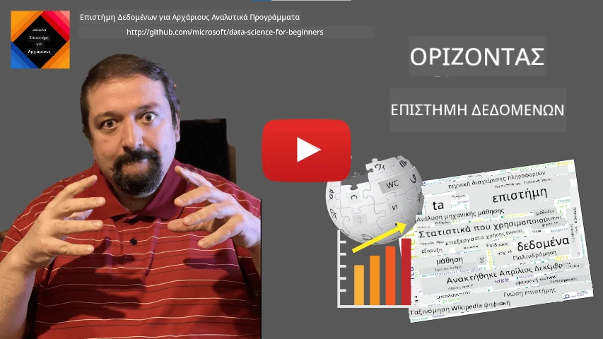
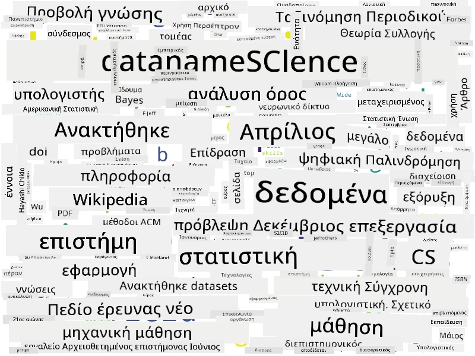

# Ορισμός της Επιστήμης των Δεδομένων

|  ](../../sketchnotes/01-Definitions.png) |
| :--------------------------------------------------------------------------------------------------: |
|          Ορισμός της Επιστήμης των Δεδομένων - _Σχεδίαση από [@nitya](https://twitter.com/nitya)_         |

---

## [Προ-διάλεξη κουίζ](https://ff-quizzes.netlify.app/en/ds/quiz/0)

## Τι είναι Δεδομένα;
Στην καθημερινή μας ζωή, είμαστε συνεχώς περιτριγυρισμένοι από δεδομένα. Το κείμενο που διαβάζετε τώρα είναι δεδομένα. Η λίστα τηλεφωνικών αριθμών των φίλων σας στο smartphone σας είναι δεδομένα, όπως και η τρέχουσα ώρα που εμφανίζεται στο ρολόι σας. Ως άνθρωποι, χειριζόμαστε φυσικά δεδομένα μετρώντας τα χρήματα που έχουμε ή γράφοντας γράμματα στους φίλους μας.

Ωστόσο, τα δεδομένα έγιναν πολύ πιο κρίσιμα με τη δημιουργία των υπολογιστών. Ο πρωταρχικός ρόλος των υπολογιστών είναι να πραγματοποιούν υπολογισμούς, αλλά χρειάζονται δεδομένα για να λειτουργήσουν. Συνεπώς, πρέπει να κατανοήσουμε πώς οι υπολογιστές αποθηκεύουν και επεξεργάζονται δεδομένα.

Με την εμφάνιση του Διαδικτύου, ο ρόλος των υπολογιστών ως συσκευές διαχείρισης δεδομένων αυξήθηκε. Αν το σκεφτείτε, τώρα χρησιμοποιούμε τους υπολογιστές όλο και περισσότερο για επεξεργασία δεδομένων και επικοινωνία, παρά για πραγματικούς υπολογισμούς. Όταν γράφουμε ένα email σε έναν φίλο ή ψάχνουμε για πληροφορίες στο Διαδίκτυο - ουσιαστικά δημιουργούμε, αποθηκεύουμε, μεταδίδουμε και χειριζόμαστε δεδομένα.
> Μπορείτε να θυμηθείτε την τελευταία φορά που χρησιμοποιήσατε πραγματικά τους υπολογιστές για να κάνετε έναν υπολογισμό;

## Τι είναι η Επιστήμη των Δεδομένων;

Στο [Wikipedia](https://en.wikipedia.org/wiki/Data_science), η **Επιστήμη των Δεδομένων** ορίζεται ως *ένα επιστημονικό πεδίο που χρησιμοποιεί επιστημονικές μεθόδους για την εξαγωγή γνώσεων και πληροφοριών από δομημένα και αδόμητα δεδομένα, και εφαρμόζει τη γνώση και τις εφαρμόσιμες πληροφορίες από δεδομένα σε ένα ευρύ φάσμα τομέων εφαρμογής*.

Αυτός ο ορισμός υπογραμμίζει τα ακόλουθα σημαντικά στοιχεία της επιστήμης των δεδομένων:

* Ο κύριος στόχος της επιστήμης των δεδομένων είναι να **εξάγει γνώση** από δεδομένα, με άλλα λόγια - να **κατανοήσει** τα δεδομένα, να βρει κρυφές σχέσεις και να δημιουργήσει ένα **μοντέλο**.
* Η επιστήμη των δεδομένων χρησιμοποιεί **επιστημονικές μεθόδους**, όπως πιθανότητες και στατιστική. Στην πραγματικότητα, όταν εισήχθη ο όρος *επιστήμη των δεδομένων*, κάποιοι ισχυρίστηκαν ότι είναι απλώς ένα νέο κομψό όνομα για τη στατιστική. Σήμερα έχει γίνει φανερό ότι ο τομέας είναι πολύ ευρύτερος.
* Η γνώση που λαμβάνεται πρέπει να εφαρμόζεται για να παράγει κάποιες **εφαρμόσιμες πληροφορίες**, δηλαδή πρακτικές πληροφορίες που μπορείτε να εφαρμόσετε σε πραγματικές επιχειρησιακές καταστάσεις.
* Πρέπει να μπορούμε να λειτουργούμε τόσο με **δομημένα** όσο και με **αδόμητα** δεδομένα. Θα επανέλθουμε για να συζητήσουμε διάφορους τύπους δεδομένων αργότερα στο μάθημα.
* Ο **τομέας εφαρμογής** είναι μια σημαντική έννοια, και οι επιστήμονες δεδομένων συχνά χρειάζονται τουλάχιστον κάποιο βαθμό εξειδίκευσης στον τομέα του προβλήματος, για παράδειγμα: χρηματοοικονομικά, ιατρική, μάρκετινγκ κ.ά.

> Ένα ακόμα σημαντικό στοιχείο της Επιστήμης των Δεδομένων είναι ότι μελετά πώς τα δεδομένα μπορούν να συλλεχθούν, να αποθηκευτούν και να χειριστούν χρησιμοποιώντας υπολογιστές. Ενώ η στατιστική μάς δίνει τα μαθηματικά θεμέλια, η επιστήμη των δεδομένων εφαρμόζει μαθηματικές έννοιες για να εξαχθούν πραγματικά πληροφορίες από δεδομένα.

Ένας από τους τρόπους (αποδιδόμενος στον [Jim Gray](https://en.wikipedia.org/wiki/Jim_Gray_(computer_scientist))) για να δούμε την επιστήμη των δεδομένων είναι να θεωρήσουμε ότι αποτελεί ένα ξεχωριστό παράδειγμα επιστήμης:
* **Εμπειρική**, όπου βασιζόμαστε κυρίως σε παρατηρήσεις και αποτελέσματα πειραμάτων
* **Θεωρητική**, όπου νέες έννοιες προκύπτουν από υπάρχουσα επιστημονική γνώση
* **Υπολογιστική**, όπου ανακαλύπτουμε νέες αρχές βάσει κάποιων υπολογιστικών πειραμάτων
* **Με πυρήνα τα δεδομένα**, βασισμένη στην ανακάλυψη σχέσεων και μοτίβων στα δεδομένα

## Άλλα Συναφή Πεδία

Επειδή τα δεδομένα είναι πανταχού παρόντα, η επιστήμη των δεδομένων είναι επίσης ένα ευρύ πεδίο που αγγίζει πολλές άλλες επιστήμες.

<dl>
<dt>Βάσεις δεδομένων</dt>
<dd>
Μια κρίσιμη σκέψη είναι <b>πώς να αποθηκεύσουμε</b> τα δεδομένα, δηλαδή πώς να τα οργανώσουμε με τρόπο που να επιτρέπει ταχύτερη επεξεργασία. Υπάρχουν διάφοροι τύποι βάσεων δεδομένων που αποθηκεύουν δομημένα και αδόμητα δεδομένα, τους οποίους <a href="../../2-Working-With-Data/README.md">θα εξετάσουμε στο μάθημά μας</a>.
</dd>
<dt>Μεγάλα Δεδομένα</dt>
<dd>
Συχνά χρειάζεται να αποθηκεύσουμε και να επεξεργαστούμε πολύ μεγάλες ποσότητες δεδομένων με σχετικά απλή δομή. Υπάρχουν ειδικές προσεγγίσεις και εργαλεία για την αποθήκευση αυτών των δεδομένων με κατανεμημένο τρόπο σε συστάδες υπολογιστών, και να τα επεξεργαστούμε αποδοτικά.
</dd>
<dt>Μηχανική Μάθηση</dt>
<dd>
Ένας τρόπος να κατανοήσουμε τα δεδομένα είναι να <b>χτίσουμε ένα μοντέλο</b> που θα μπορεί να προβλέψει ένα επιθυμητό αποτέλεσμα. Η ανάπτυξη μοντέλων από δεδομένα ονομάζεται <b>μηχανική μάθηση</b>. Μπορείτε να ρίξετε μια ματιά στο <a href="https://aka.ms/ml-beginners">Machine Learning for Beginners</a> Πρόγραμμα Σπουδών μας για να μάθετε περισσότερα γι' αυτό.
</dd>
<dt>Τεχνητή Νοημοσύνη</dt>
<dd>
Ένας τομέας της μηχανικής μάθησης γνωστός ως τεχνητή νοημοσύνη (AI) βασίζεται επίσης στα δεδομένα, και περιλαμβάνει τη δημιουργία μοντέλων υψηλής πολυπλοκότητας που μιμούνται τις διαδικασίες σκέψης του ανθρώπου. Οι μέθοδοι AI συχνά μας επιτρέπουν να μετατρέψουμε αδόμητα δεδομένα (π.χ. φυσική γλώσσα) σε δομημένες πληροφορίες.
</dd>
<dt>Οπτικοποίηση</dt>
<dd>
Τεράστιες ποσότητες δεδομένων είναι ακατανόητες για τον άνθρωπο, αλλά μόλις δημιουργήσουμε χρήσιμες οπτικοποιήσεις χρησιμοποιώντας αυτά τα δεδομένα, μπορούμε να κατανοήσουμε καλύτερα τα δεδομένα και να εξάγουμε συμπεράσματα. Επομένως, είναι σημαντικό να γνωρίζουμε πολλούς τρόπους οπτικοποίησης πληροφοριών - κάτι που θα καλύψουμε στην <a href="../../3-Data-Visualization/README.md">Ενότητα 3</a> του μαθήματός μας. Συναφή πεδία περιλαμβάνουν επίσης τα <b>InfoGraphics</b> και την <b>Αλληλεπίδραση Ανθρώπου-Υπολογιστή</b> γενικά.
</dd>
</dl>

## Τύποι Δεδομένων

Όπως έχουμε ήδη αναφέρει, τα δεδομένα είναι παντού. Απλώς πρέπει να τα συλλέξουμε με τον σωστό τρόπο! Είναι χρήσιμο να διακρίνουμε ανάμεσα σε **δομημένα** και **αδόμητα** δεδομένα. Τα πρώτα συνήθως αναπαρίστανται με κάποια καλά δομημένη μορφή, συχνά ως πίνακας ή αριθμός πινάκων, ενώ τα δεύτερα είναι απλώς μια συλλογή αρχείων. Μερικές φορές μπορούμε επίσης να μιλήσουμε για **ημι-δομημένα** δεδομένα, που έχουν κάποιο είδος δομής που μπορεί να ποικίλλει σημαντικά.

| Δομημένα                                                                 | Ημι-δομημένα                                                                                     | Αδόμητα                               |
| ------------------------------------------------------------------------- | ------------------------------------------------------------------------------------------------ | ------------------------------------- |
| Λίστα ανθρώπων με τους τηλεφωνικούς τους αριθμούς                        | Σελίδες Wikipedia με συνδέσμους                                                                  | Κείμενο της Encyclopedia Britannica   |
| Θερμοκρασία σε όλα τα δωμάτια ενός κτιρίου ανά λεπτό για τα τελευταία 20 χρόνια | Συλλογή επιστημονικών εργασιών σε μορφή JSON με συγγραφείς, ημερομηνίες δημοσίευσης και περίληψη | Κοινόχρηστα αρχεία με εταιρικά έγγραφα |
| Δεδομένα για ηλικία και φύλο όλων των ανθρώπων που εισέρχονται στο κτίριο | Διαδικτυακές σελίδες                                                                             | Ακατέργαστη ροή βίντεο από κάμερα ασφαλείας |

## Από πού να πάρετε Δεδομένα

Υπάρχουν πολλοί πιθανοί πόροι δεδομένων, και θα ήταν αδύνατο να τους απαριθμήσουμε όλους! Ωστόσο, ας αναφέρουμε μερικά από τα τυπικά μέρη στα οποία μπορείτε να βρείτε δεδομένα:

* **Δομημένα**
  - **Internet of Things** (IoT), συμπεριλαμβανομένων δεδομένων από διάφορους αισθητήρες, όπως αισθητήρες θερμοκρασίας ή πίεσης, παρέχει πολλά χρήσιμα δεδομένα. Για παράδειγμα, αν ένα κτίριο γραφείων είναι εξοπλισμένο με αισθητήρες IoT, μπορούμε αυτόματα να ελέγξουμε τη θέρμανση και τον φωτισμό ώστε να ελαχιστοποιήσουμε τα έξοδα.
  - **Έρευνες** που ζητάμε από χρήστες να συμπληρώσουν μετά από μια αγορά ή μετά από επίσκεψη σε μια ιστοσελίδα.
  - **Ανάλυση συμπεριφοράς** μπορεί, για παράδειγμα, να μας βοηθήσει να καταλάβουμε πόσο βαθιά εισέρχεται ένας χρήστης σε μια σελίδα και ποιος είναι ο τυπικός λόγος εγκατάλειψης.
* **Αδόμητα**
  - **Κείμενα** μπορούν να είναι πλούσια πηγή πληροφοριών, όπως συνολική **βαθμολογία συναισθήματος**, ή εξαγωγή λέξεων κλειδιών και σημασιολογικού νοήματος.
  - **Εικόνες** ή **Βίντεο**. Ένα βίντεο από κάμερα παρακολούθησης μπορεί να χρησιμοποιηθεί για εκτίμηση της κυκλοφορίας στο δρόμο και να ενημερώσει τους ανθρώπους για πιθανές κυκλοφοριακές συμφόρησεις.
  - **Αρχεία Καταγραφής** (Logs) web server μπορούν να χρησιμοποιηθούν για να κατανοήσουμε ποιες σελίδες της ιστοσελίδας μας επισκέπτονται πιο συχνά και για πόση ώρα.
* Ημι-δομημένα
  - **Κοινωνικά Δίκτυα** μπορούν να είναι εξαιρετικές πηγές δεδομένων για προσωπικότητες χρηστών και πιθανή αποτελεσματικότητα στη διάδοση πληροφοριών.
  - Όταν έχουμε ένα σωρό φωτογραφίες από ένα πάρτυ, μπορούμε να προσπαθήσουμε να εξάγουμε δεδομένα **Ομαδικής Δυναμικής** δημιουργώντας ένα γράφημα με ανθρώπους που φωτογραφίζονται μαζί.

Γνωρίζοντας τις διάφορες πιθανούς πηγές δεδομένων, μπορείτε να σκεφτείτε διαφορετικά σενάρια όπου οι τεχνικές της επιστήμης των δεδομένων μπορούν να εφαρμοστούν για να κατανοήσετε καλύτερα την κατάσταση και να βελτιώσετε τις επιχειρησιακές διαδικασίες.

## Τι μπορείτε να κάνετε με τα Δεδομένα

Στην Επιστήμη των Δεδομένων, εστιάζουμε στα ακόλουθα βήματα του ταξιδιού των δεδομένων:

<dl>
<dt>1) Απόκτηση Δεδομένων</dt>
<dd>
Το πρώτο βήμα είναι η συλλογή των δεδομένων. Αν και σε πολλές περιπτώσεις μπορεί να είναι μια απλή διαδικασία, όπως δεδομένα που έρχονται σε μια βάση δεδομένων από μια web εφαρμογή, μερικές φορές χρειάζεται να χρησιμοποιήσουμε ειδικές τεχνικές. Για παράδειγμα, τα δεδομένα από αισθητήρες IoT μπορεί να είναι συντριπτικά, και είναι καλή πρακτική να χρησιμοποιούμε ενδιάμεσους σταθμούς όπως το IoT Hub για να συλλέγουμε όλα τα δεδομένα πριν την περαιτέρω επεξεργασία.
</dd>
<dt>2) Αποθήκευση Δεδομένων</dt>
<dd>
Η αποθήκευση δεδομένων μπορεί να είναι δύσκολη, ειδικά αν μιλάμε για μεγάλα δεδομένα. Όταν αποφασίζουμε πώς να αποθηκεύσουμε δεδομένα, είναι λογικό να προβλέπουμε τον τρόπο με τον οποίο θα θέλαμε να κάνουμε ερωτήματα στα δεδομένα στο μέλλον. Υπάρχουν πολλοί τρόποι αποθήκευσης των δεδομένων:
<ul>
<li>Μια σχεσιακή βάση δεδομένων αποθηκεύει μια συλλογή πινάκων και χρησιμοποιεί μια ειδική γλώσσα που ονομάζεται SQL για να κάνει ερωτήματα. Συνήθως, οι πίνακες οργανώνονται σε διαφορετικές ομάδες που ονομάζονται σχήματα. Σε πολλές περιπτώσεις χρειάζεται να μετατρέψουμε τα δεδομένα από την αρχική τους μορφή ώστε να ταιριάζουν στο σχήμα.</li>
<li><a href="https://en.wikipedia.org/wiki/NoSQL">Μια βάση δεδομένων NoSQL</a>, όπως <a href="https://azure.microsoft.com/services/cosmos-db/?WT.mc_id=academic-77958-bethanycheum">CosmosDB</a>, δεν επιβάλλει σχήματα στα δεδομένα και επιτρέπει την αποθήκευση πιο πολύπλοκων δεδομένων, για παράδειγμα, ιεραρχικών εγγράφων JSON ή γραφημάτων. Ωστόσο, οι βάσεις δεδομένων NoSQL δεν έχουν τις εξελιγμένες δυνατότητες ερωτημάτων του SQL και δεν μπορούν να επιβάλλουν την αναφορική ακεραιότητα, δηλαδή κανόνες για το πώς οργανώνονται τα δεδομένα σε πίνακες και καθορίζουν τις σχέσεις μεταξύ τους.</li>
<li><a href="https://en.wikipedia.org/wiki/Data_lake">Η αποθήκευση Data Lake</a> χρησιμοποιείται για μεγάλες συλλογές δεδομένων σε ακατέργαστη, αδόμητη μορφή. Οι λίμνες δεδομένων συχνά χρησιμοποιούνται με μεγάλα δεδομένα, όπου όλα τα δεδομένα δεν χωρούν σε μία μηχανή και πρέπει να αποθηκεύονται και να επεξεργάζονται από σύμπλεγμα διακομιστών. <a href="https://en.wikipedia.org/wiki/Apache_Parquet">Το Parquet</a> είναι η μορφή δεδομένων που συχνά χρησιμοποιείται σε συνδυασμό με μεγάλα δεδομένα.</li> 
</ul>
</dd>
<dt>3) Επεξεργασία Δεδομένων</dt>
<dd>
Αυτή είναι η πιο συναρπαστική φάση του ταξιδιού των δεδομένων, που περιλαμβάνει τη μετατροπή των δεδομένων από την αρχική τους μορφή σε μορφή που μπορεί να χρησιμοποιηθεί για οπτικοποίηση ή εκπαίδευση μοντέλου. Όταν χειριζόμαστε αδόμητα δεδομένα όπως κείμενο ή εικόνες, μπορεί να χρειαστεί να χρησιμοποιήσουμε κάποιες τεχνικές τεχνητής νοημοσύνης για να εξάγουμε <b>χαρακτηριστικά</b> από τα δεδομένα, μετατρέποντάς τα έτσι σε δομημένη μορφή.
</dd>
<dt>4) Οπτικοποίηση / Ανθρωπολογικές Γνώσεις</dt>
<dd>
Συχνά, για να κατανοήσουμε τα δεδομένα, πρέπει να τα οπτικοποιήσουμε. Έχοντας πολλές διαφορετικές τεχνικές οπτικοποίησης στο οπλοστάσιό μας, μπορούμε να βρούμε την κατάλληλη οπτική για να κερδίσουμε μια γνώση. Συχνά, ένας επιστήμονας δεδομένων χρειάζεται να "παίζει με τα δεδομένα", οπτικοποιώντας τα πολλές φορές και αναζητώντας σχέσεις. Επίσης, μπορούμε να χρησιμοποιήσουμε στατιστικές τεχνικές για να ελέγξουμε μια υπόθεση ή να αποδείξουμε τη συσχέτιση μεταξύ διαφορετικών δεδομένων.
</dd>
<dt>5) Εκπαίδευση προγνωστικού μοντέλου</dt>
<dd>
Επειδή ο τελικός στόχος της επιστήμης των δεδομένων είναι να μπορούμε να παίρνουμε αποφάσεις βάσει των δεδομένων, μπορεί να θελήσουμε να χρησιμοποιήσουμε τις τεχνικές της <a href="http://github.com/microsoft/ml-for-beginners">Μηχανικής Μάθησης</a> για να δημιουργήσουμε ένα προγνωστικό μοντέλο. Στη συνέχεια, μπορούμε να το χρησιμοποιήσουμε για να κάνουμε προβλέψεις χρησιμοποιώντας νέα σύνολα δεδομένων με παρόμοιες δομές.
</dd>
</dl>

Φυσικά, ανάλογα με τα πραγματικά δεδομένα, κάποια βήματα μπορεί να λείπουν (π.χ., όταν έχουμε ήδη τα δεδομένα στη βάση δεδομένων ή όταν δεν χρειαζόμαστε εκπαίδευση μοντέλου), ή κάποια βήματα μπορεί να επαναλαμβάνονται πολλές φορές (όπως η επεξεργασία δεδομένων).

## Ψηφιοποίηση και Ψηφιακός Μετασχηματισμός

Την τελευταία δεκαετία, πολλές επιχειρήσεις άρχισαν να κατανοούν τη σημασία των δεδομένων κατά τη λήψη επιχειρηματικών αποφάσεων. Για να εφαρμόσει κάποιος τις αρχές της επιστήμης των δεδομένων στη λειτουργία μιας επιχείρησης, πρέπει πρώτα να συλλέξει κάποια δεδομένα, δηλαδή να μεταφράσει τις επιχειρηματικές διαδικασίες σε ψηφιακή μορφή. Αυτό είναι γνωστό ως **ψηφιοποίηση**. Η εφαρμογή τεχνικών επιστήμης δεδομένων σε αυτά τα δεδομένα για την καθοδήγηση αποφάσεων μπορεί να οδηγήσει σε σημαντικές αυξήσεις στην παραγωγικότητα (ή ακόμα και σε αλλαγή στρατηγικής της επιχείρησης), που ονομάζεται **ψηφιακός μετασχηματισμός**.

Ας εξετάσουμε ένα παράδειγμα. Ας υποθέσουμε ότι έχουμε ένα μάθημα επιστήμης δεδομένων (όπως αυτό) το οποίο παρέχουμε διαδικτυακά στους φοιτητές, και θέλουμε να το βελτιώσουμε χρησιμοποιώντας επιστήμη δεδομένων. Πώς μπορούμε να το κάνουμε;

Μπορούμε να ξεκινήσουμε ρωτώντας "Τι μπορεί να ψηφιοποιηθεί;" Ο πιο απλός τρόπος θα ήταν να μετρήσουμε τον χρόνο που χρειάζεται κάθε φοιτητής για να ολοκληρώσει κάθε ενότητα, και να μετρήσουμε τη γνώση που αποκτήθηκε δίνοντας ένα τεστ πολλαπλής επιλογής στο τέλος κάθε ενότητας. Υπολογίζοντας τον μέσο χρόνο ολοκλήρωσης για όλους τους φοιτητές, μπορούμε να ανακαλύψουμε ποιες ενότητες προκαλούν τις περισσότερες δυσκολίες και να εργαστούμε για τη απλοποίησή τους.
> Μπορεί να υποστηρίξετε ότι αυτή η προσέγγιση δεν είναι ιδανική, επειδή τα μαθήματα μπορεί να έχουν διαφορετική διάρκεια. Πιθανότατα είναι πιο δίκαιο να διαιρέσουμε τον χρόνο με το μήκος του μαθήματος (σε αριθμό χαρακτήρων) και να συγκρίνουμε αυτές τις τιμές αντίστοιχα.

Όταν αρχίζουμε να αναλύουμε τα αποτελέσματα τεστ πολλαπλής επιλογής, μπορούμε να προσπαθήσουμε να προσδιορίσουμε ποιες έννοιες δυσκολεύουν τους μαθητές να κατανοήσουν και να χρησιμοποιήσουμε αυτές τις πληροφορίες για να βελτιώσουμε το περιεχόμενο. Για να το κάνουμε αυτό, πρέπει να σχεδιάσουμε τα τεστ έτσι ώστε κάθε ερώτηση να αντιστοιχεί σε μια συγκεκριμένη έννοια ή τμήμα γνώσης.

Αν θέλουμε να γίνουμε ακόμα πιο σύνθετοι, μπορούμε να απεικονίσουμε τον χρόνο που απαιτείται για κάθε μάθημα σε σχέση με την ηλικιακή κατηγορία των μαθητών. Μπορεί να ανακαλύψουμε ότι για κάποιες ηλικιακές κατηγορίες απαιτείται ανάρμοστα πολύς χρόνος για την ολοκλήρωση του μαθήματος, ή ότι οι μαθητές αποχωρούν πριν το ολοκληρώσουν. Αυτό μπορεί να μας βοηθήσει να παρέχουμε ηλικιακές συστάσεις για το μάθημα και να ελαχιστοποιήσουμε τη δυσαρέσκεια των ανθρώπων από εσφαλμένες προσδοκίες.

## 🚀 Πρόκληση

Σε αυτήν την πρόκληση, θα προσπαθήσουμε να βρούμε έννοιες σχετικές με τον τομέα της Επιστήμης Δεδομένων κοιτάζοντας κείμενα. Θα πάρουμε ένα άρθρο της Wikipedia για την Επιστήμη Δεδομένων, θα κατεβάσουμε και θα επεξεργαστούμε το κείμενο, και στη συνέχεια θα δημιουργήσουμε ένα σύννεφο λέξεων σαν αυτό:

Επισκεφτείτε το [`notebook.ipynb`](../../../../1-Introduction/01-defining-data-science/notebook.ipynb ':ignore') για να διαβάσετε τον κώδικα. Μπορείτε επίσης να τρέξετε τον κώδικα και να δείτε πώς εκτελούνται όλες οι μετασχηματίσεις δεδομένων σε πραγματικό χρόνο.

> Αν δεν ξέρετε πώς να τρέξετε κώδικα σε Jupyter Notebook, ρίξτε μια ματιά σε [αυτό το άρθρο](https://soshnikov.com/education/how-to-execute-notebooks-from-github/).

## [Quiz μετά το μάθημα](https://ff-quizzes.netlify.app/en/ds/quiz/1)

## Ασκήσεις

* **Εργασία 1**: Τροποποιήστε τον παραπάνω κώδικα για να βρείτε σχετικές έννοιες στον τομέα του **Big Data** και της **Μηχανικής Μάθησης**
* **Εργασία 2**: [Σκεφτείτε Σενάρια Επιστήμης Δεδομένων](assignment.md)

## Πηγή

Αυτό το μάθημα έχει συγγραφεί με ♥️ από τον [Dmitry Soshnikov](http://soshnikov.com)

---

<!-- CO-OP TRANSLATOR DISCLAIMER START -->
**Αποποίηση ευθυνών**:
Αυτό το έγγραφο έχει μεταφραστεί χρησιμοποιώντας την υπηρεσία μετάφρασης με τεχνητή νοημοσύνη [Co-op Translator](https://github.com/Azure/co-op-translator). Ενώ επιδιώκουμε την ακρίβεια, παρακαλούμε να έχετε υπόψη ότι οι αυτοματοποιημένες μεταφράσεις ενδέχεται να περιέχουν λάθη ή ανακρίβειες. Το πρωτότυπο έγγραφο στη μητρική του γλώσσα πρέπει να θεωρείται η αυθεντική πηγή. Για κρίσιμες πληροφορίες, συνιστάται επαγγελματική ανθρώπινη μετάφραση. Δεν φέρουμε ευθύνη για τυχόν παρεξηγήσεις ή λανθασμένες ερμηνείες που προκύπτουν από τη χρήση αυτής της μετάφρασης.
<!-- CO-OP TRANSLATOR DISCLAIMER END -->