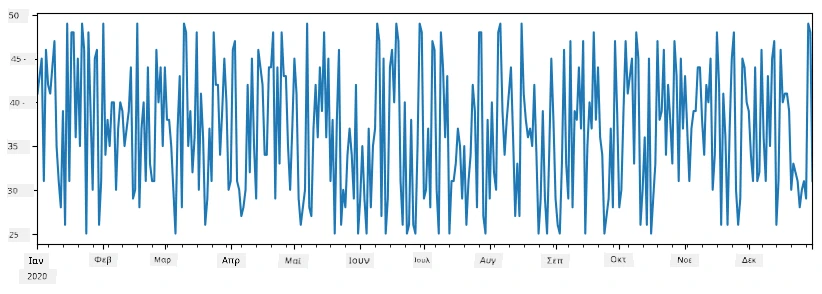
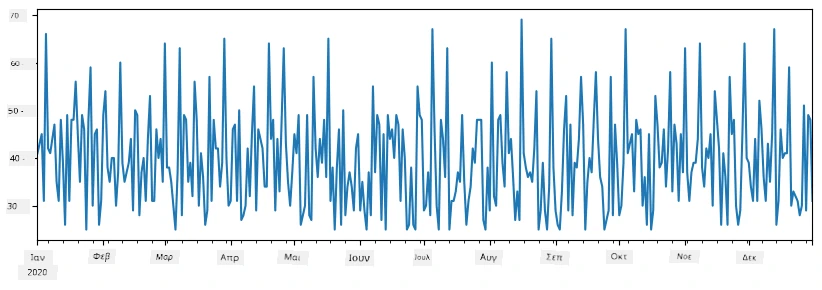
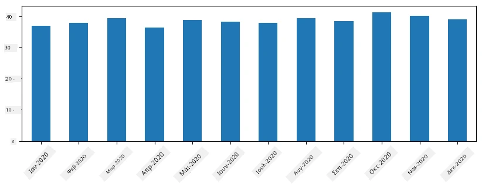
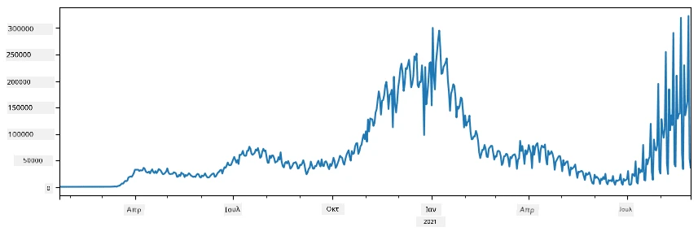
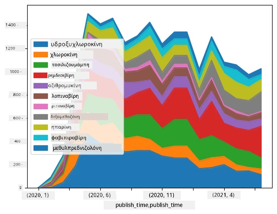

# Εργασία με Δεδομένα: Python και η Βιβλιοθήκη Pandas

|  ](../../sketchnotes/07-WorkWithPython.png) |
| :-------------------------------------------------------------------------------------------------------: |
|                        Εργασία με Python - _Σχεδιαστικό από [@nitya](https://twitter.com/nitya)_               |

[](https://youtu.be/dZjWOGbsN4Y)

Ενώ οι βάσεις δεδομένων προσφέρουν πολύ αποδοτικούς τρόπους αποθήκευσης δεδομένων και ερωτημάτων με χρήση γλωσσών ερωτημάτων, ο πιο ευέλικτος τρόπος επεξεργασίας δεδομένων είναι να γράψετε το δικό σας πρόγραμμα για να χειριστείτε τα δεδομένα. Σε πολλές περιπτώσεις, η εκτέλεση ενός ερωτήματος βάσης δεδομένων θα ήταν πιο αποτελεσματική. Ωστόσο, σε κάποιες περιπτώσεις όπου απαιτείται πιο σύνθετη επεξεργασία δεδομένων, αυτό δεν μπορεί να γίνει εύκολα με SQL.  
Η επεξεργασία δεδομένων μπορεί να προγραμματιστεί σε οποιαδήποτε γλώσσα προγραμματισμού, αλλά υπάρχουν ορισμένες γλώσσες που είναι υψηλότερου επιπέδου όσον αφορά την εργασία με δεδομένα. Οι επιστήμονες δεδομένων συνήθως προτιμούν μία από τις παρακάτω γλώσσες:

* **[Python](https://www.python.org/)**, μια γενικής χρήσης γλώσσα προγραμματισμού, που συχνά θεωρείται μία από τις καλύτερες επιλογές για αρχάριους λόγω της απλότητάς της. Η Python διαθέτει πολλές επιπλέον βιβλιοθήκες που μπορούν να σας βοηθήσουν να λύσετε πολλά πρακτικά προβλήματα, όπως εξαγωγή δεδομένων από αρχεία ZIP ή μετατροπή εικόνας σε κλίμακα του γκρι. Εκτός από την επιστήμη δεδομένων, η Python χρησιμοποιείται συχνά και για ανάπτυξη ιστού. 
* **[R](https://www.r-project.org/)** είναι ένας παραδοσιακός εργαλειακός πάγκος που αναπτύχθηκε με γνώμονα την στατιστική επεξεργασία δεδομένων. Περιέχει επίσης μεγάλο αποθετήριο βιβλιοθηκών (CRAN), καθιστώντας την καλή επιλογή για επεξεργασία δεδομένων. Ωστόσο, το R δεν είναι γλώσσα γενικής χρήσης και χρησιμοποιείται σπάνια εκτός του πεδίου της επιστήμης δεδομένων.
* **[Julia](https://julialang.org/)** είναι άλλη μία γλώσσα που αναπτύχθηκε ειδικά για την επιστήμη δεδομένων. Σκοπός της είναι να προσφέρει καλύτερη απόδοση από την Python, καθιστώντας την εξαιρετικό εργαλείο για επιστημονικά πειράματα.

Σε αυτό το μάθημα, θα εστιάσουμε στη χρήση της Python για απλή επεξεργασία δεδομένων. Θα υποθέσουμε βασική εξοικείωση με τη γλώσσα. Εάν θέλετε εκτενέστερη περιήγηση στην Python, μπορείτε να ανατρέξετε σε έναν από τους παρακάτω πόρους:

* [Μάθετε Python με Διασκεδαστικό Τρόπο με Χελώνα και fractals](https://github.com/shwars/pycourse) - Γρήγορο εισαγωγικό μάθημα στην Python μέσω GitHub
* [Κάντε τα Πρώτα σας Βήματα με την Python](https://docs.microsoft.com/en-us/learn/paths/python-first-steps/?WT.mc_id=academic-77958-bethanycheum) Μονοπάτι Μάθησης στο [Microsoft Learn](http://learn.microsoft.com/?WT.mc_id=academic-77958-bethanycheum)

Τα δεδομένα μπορεί να έρχονται σε πολλές μορφές. Σε αυτό το μάθημα, θα εξετάσουμε τρεις μορφές δεδομένων - **ταμπελοποιημένα δεδομένα**, **κείμενο** και **εικόνες**.

Θα εστιάσουμε σε μερικά παραδείγματα επεξεργασίας δεδομένων, αντί να σας δώσουμε πλήρη επισκόπηση όλων των σχετικών βιβλιοθηκών. Αυτό θα σας επιτρέψει να κατανοήσετε την κύρια ιδέα των δυνατοτήτων και να έχετε την κατανόηση για το πού να βρείτε λύσεις στα προβλήματά σας όταν τις χρειαστείτε.

> **Πιο χρήσιμη συμβουλή**. Όταν χρειάζεται να εκτελέσετε κάποια λειτουργία σε δεδομένα που δεν ξέρετε πώς να κάνετε, δοκιμάστε να το αναζητήσετε στο διαδίκτυο. Το [Stackoverflow](https://stackoverflow.com/) συνήθως περιέχει πολλά χρήσιμα παραδείγματα κώδικα σε Python για πολλές τυπικές εργασίες.


## [Προ-μάθημα κουίζ](https://ff-quizzes.netlify.app/en/ds/quiz/12)

## Ταμπελοποιημένα Δεδομένα και Dataframes

Έχετε ήδη συναντήσει τα ταμπελοποιημένα δεδομένα όταν μιλήσαμε για σχεσιακές βάσεις δεδομένων. Όταν έχετε πολλά δεδομένα, και αυτά περιέχονται σε πολλούς διαφορετικούς συνδεδεμένους πίνακες, αξίζει σίγουρα να χρησιμοποιήσετε SQL για να εργαστείτε μαζί τους. Ωστόσο, υπάρχουν πολλές περιπτώσεις όπου έχουμε έναν πίνακα δεδομένων και θέλουμε να αποκτήσουμε κάποια **κατανόηση** ή **γνώση** για αυτά τα δεδομένα, όπως η κατανομή, η συσχέτιση μεταξύ τιμών κτλ. Στην επιστήμη δεδομένων, υπάρχουν πολλές περιπτώσεις όπου πρέπει να εκτελέσουμε κάποιες μετατροπές των αρχικών δεδομένων, ακολουθούμενες από οπτικοποίηση. Και τα δύο αυτά βήματα μπορούν εύκολα να γίνουν με χρήση Python.

Υπάρχουν δύο πιο χρήσιμες βιβλιοθήκες στην Python που μπορούν να σας βοηθήσουν να χειριστείτε τα ταμπελοποιημένα δεδομένα:
* **[Pandas](https://pandas.pydata.org/)** σάς επιτρέπει να χειρίζεστε τα λεγόμενα **Dataframes**, που είναι ανάλογα με σχεσιακούς πίνακες. Μπορείτε να έχετε ονομασμένες στήλες και να εκτελείτε διάφορες λειτουργίες σε γραμμές, στήλες και γενικά σε dataframes.  
* **[Numpy](https://numpy.org/)** είναι μία βιβλιοθήκη για εργασία με **τενσόρες**, δηλαδή πολυδιάστατους **πίνακες**. Ο πίνακας έχει τιμές του ίδιου βασικού τύπου, και είναι απλούστερος από το dataframe, αλλά προσφέρει περισσότερες μαθηματικές λειτουργίες και δημιουργεί λιγότερο φόρτο.

Υπάρχουν και μερικές άλλες βιβλιοθήκες που πρέπει να γνωρίζετε:
* **[Matplotlib](https://matplotlib.org/)** είναι μια βιβλιοθήκη που χρησιμοποιείται για οπτικοποίηση δεδομένων και σχεδιασμό γραφημάτων
* **[SciPy](https://www.scipy.org/)** είναι μια βιβλιοθήκη με επιπλέον επιστημονικές συναρτήσεις. Την έχουμε ήδη συναντήσει όταν μιλήσαμε για πιθανότητες και στατιστική.

Ακολουθεί ένα κομμάτι κώδικα που συνήθως χρησιμοποιείτε για να εισάγετε αυτές τις βιβλιοθήκες στην αρχή του προγράμματός σας σε Python:
```python
import numpy as np
import pandas as pd
import matplotlib.pyplot as plt
from scipy import ... # χρειάζεται να καθορίσετε τα ακριβή υποπακέτα που χρειάζεστε
``` 

Το Pandas βασίζεται σε μερικές βασικές έννοιες.

### Series 

**Series** είναι μια ακολουθία τιμών, παρόμοια με μία λίστα ή numpy array. Η βασική διαφορά είναι ότι η series έχει επίσης **δείκτη** (index), και όταν εκτελούμε λειτουργίες σε series (π.χ. πρόσθεση), ο δείκτης λαμβάνεται υπόψη. Ο δείκτης μπορεί να είναι απλά ακέραιος αριθμός σειράς (είναι ο δείκτης που χρησιμοποιείται ως προεπιλογή όταν δημιουργούμε series από λίστα ή array), ή μπορεί να έχει πολύπλοκη δομή, όπως χρονικό διάστημα.

> **Σημείωση**: Υπάρχει κάποιος εισαγωγικός κώδικας Pandas στο συνοδευτικό τετράδιο [`notebook.ipynb`](notebook.ipynb). Εδώ παρουσιάζουμε μόνο κάποια από τα παραδείγματα και μπορείτε σίγουρα να εξετάσετε ολόκληρο το τετράδιο.

Ας δούμε ένα παράδειγμα: θέλουμε να αναλύσουμε τις πωλήσεις του παγωτατζίδικου μας. Ας δημιουργήσουμε μια σειρά από αριθμούς πωλήσεων (αριθμός πωληθέντων τεμαχίων κάθε μέρα) για ένα χρονικό διάστημα:

```python
start_date = "Jan 1, 2020"
end_date = "Mar 31, 2020"
idx = pd.date_range(start_date,end_date)
print(f"Length of index is {len(idx)}")
items_sold = pd.Series(np.random.randint(25,50,size=len(idx)),index=idx)
items_sold.plot()
```


Ας υποθέσουμε τώρα ότι κάθε εβδομάδα οργανώνουμε ένα πάρτυ για φίλους και παίρνουμε επιπλέον 10 πακέτα παγωτά για το πάρτυ. Μπορούμε να δημιουργήσουμε μια άλλη series, με δείκτη την εβδομάδα, για να το κάνουμε προφανές:
```python
additional_items = pd.Series(10,index=pd.date_range(start_date,end_date,freq="W"))
```
Όταν προσθέτουμε δύο series, παίρνουμε τον συνολικό αριθμό:
```python
total_items = items_sold.add(additional_items,fill_value=0)
total_items.plot()
```


> **Σημείωση** ότι δεν χρησιμοποιούμε την απλή σύνταξη `total_items+additional_items`. Εάν το κάναμε έτσι, θα είχαμε πολλές τιμές `NaN` (*Not a Number*) στη σειρα που προκύπτει. Αυτό συμβαίνει επειδή λείπουν κάποιες τιμές για ορισμένα σημεία δείκτη στη σειρά `additional_items`, και η πρόσθεση `NaN` με οτιδήποτε έχει αποτέλεσμα `NaN`. Έτσι πρέπει να ορίσουμε την παράμετρο `fill_value` κατά την πρόσθεση.

Με χρονικές σειρές, μπορούμε επίσης να **αναδειγματοληψύσουμε** τη σειρά με διαφορετικά χρονικά διαστήματα. Για παράδειγμα, αν θέλουμε να υπολογίσουμε το μέσο όρο όγκου πωλήσεων κάθε μήνα. Μπορούμε να χρησιμοποιήσουμε τον παρακάτω κώδικα:
```python
monthly = total_items.resample("1M").mean()
ax = monthly.plot(kind='bar')
```


### DataFrame

Το DataFrame είναι ουσιαστικά ένα σύνολο series με τον ίδιο δείκτη. Μπορούμε να συνδυάσουμε πολλαπλές σειρές σε ένα DataFrame:
```python
a = pd.Series(range(1,10))
b = pd.Series(["I","like","to","play","games","and","will","not","change"],index=range(0,9))
df = pd.DataFrame([a,b])
```
Αυτό θα δημιουργήσει έναν οριζόντιο πίνακα σαν τον παρακάτω:
|     | 0   | 1    | 2   | 3   | 4      | 5   | 6      | 7    | 8    |
| --- | --- | ---- | --- | --- | ------ | --- | ------ | ---- | ---- |
| 0   | 1   | 2    | 3   | 4   | 5      | 6   | 7      | 8    | 9    |
| 1   | Μου | αρέσει | να  | χρησιμοποιώ | Python | και | Pandas | πολύ | πολύ |

Μπορούμε επίσης να χρησιμοποιήσουμε Series ως στήλες και να ορίσουμε ονόματα στηλών με λεξικό:
```python
df = pd.DataFrame({ 'A' : a, 'B' : b })
```
Αυτό θα μας δώσει πίνακα όπως ο παρακάτω:

|     | A   | B      |
| --- | --- | ------ |
| 0   | 1   | Μου    |
| 1   | 2   | αρέσει |
| 2   | 3   | να     |
| 3   | 4   | χρησιμοποιώ |
| 4   | 5   | Python |
| 5   | 6   | και    |
| 6   | 7   | Pandas |
| 7   | 8   | πολύ   |
| 8   | 9   | πολύ   |

**Σημείωση** ότι μπορούμε επίσης να πάρουμε αυτή τη διάταξη πίνακα μεταθέτοντας τον προηγούμενο πίνακα, π.χ. γράφοντας 
```python
df = pd.DataFrame([a,b]).T..rename(columns={ 0 : 'A', 1 : 'B' })
```
Εδώ η λειτουργία `.T` σημαίνει τη μεταθετική λειτουργία του DataFrame, δηλαδή την αλλαγή μεταξύ γραμμών και στηλών, και η λειτουργία `rename` μας επιτρέπει να μετονομάσουμε τις στήλες ώστε να ταιριάζουν με το προηγούμενο παράδειγμα.

Ακολουθούν μερικές από τις πιο σημαντικές λειτουργίες που μπορούμε να εκτελέσουμε σε DataFrames:

**Επιλογή στήλης**. Μπορούμε να επιλέξουμε μεμονωμένες στήλες γράφοντας `df['A']` - αυτή η λειτουργία επιστρέφει μια Series. Μπορούμε επίσης να επιλέξουμε υποσύνολο στηλών σε άλλο DataFrame γράφοντας `df[['B','A']]` - αυτό επιστρέφει άλλο DataFrame.

**Φιλτράρισμα** συγκεκριμένων γραμμών βάσει κριτηρίων. Για παράδειγμα, για να κρατήσουμε μόνο τις γραμμές που η στήλη `A` είναι μεγαλύτερη από 5, μπορούμε να γράψουμε `df[df['A']>5]`.

> **Σημείωση**: Ο τρόπος που λειτουργεί το φιλτράρισμα είναι ο εξής. Η έκφραση `df['A']<5` επιστρέφει μια λογική σειρά, που δείχνει αν η έκφραση είναι `True` ή `False` για κάθε στοιχείο της αρχικής series `df['A']`. Όταν μια λογική σειρά χρησιμοποιείται ως δείκτης, επιστρέφει ένα υποσύνολο γραμμών του DataFrame. Επομένως, δεν είναι δυνατό να χρησιμοποιηθεί αυθαίρετη λογική έκφραση της Python, π.χ. το να γράψουμε `df[df['A']>5 and df['A']<7]` θα ήταν λάθος. Αντίθετα, πρέπει να χρησιμοποιήσετε την ειδική λειτουργία `&` για λογικές σειρές, γράφοντας `df[(df['A']>5) & (df['A']<7)]` (*οι παρενθέσεις εδώ είναι σημαντικές*).

**Δημιουργία νέων υπολογιζόμενων στηλών**. Μπορούμε εύκολα να δημιουργήσουμε νέες υπολογιζόμενες στήλες για το DataFrame μας χρησιμοποιώντας εκφράσεις όπως αυτή:
```python
df['DivA'] = df['A']-df['A'].mean() 
``` 
Αυτό το παράδειγμα υπολογίζει την απόκλιση της στήλης A από τη μέση της τιμή. Αυτό που συμβαίνει είναι ότι υπολογίζουμε μια series και μετά την εκχωρούμε στο αριστερό μέρος, δημιουργώντας άλλη στήλη. Επομένως, δεν μπορούμε να χρησιμοποιήσουμε λειτουργίες που δεν είναι συμβατές με σειρές, για παράδειγμα, ο παρακάτω κώδικας είναι λάθος:
```python
# Λανθασμένος κώδικας -> df['ADescr'] = "Low" αν df['A'] < 5 αλλιώς "Hi"
df['LenB'] = len(df['B']) # <- Λανθασμένο αποτέλεσμα
``` 
Το παραπάνω δείγμα, παρόλο που είναι συντακτικά σωστό, δίνει λάθος αποτέλεσμα, επειδή εκχωρεί το μήκος της σειράς `B` σε όλες τις τιμές στη στήλη, αντί το μήκος των μεμονωμένων στοιχείων όπως θέλαμε.

Εάν χρειάζεται να υπολογίσουμε σύνθετες εκφράσεις, μπορούμε να χρησιμοποιήσουμε τη συνάρτηση `apply`. Το παραπάνω παράδειγμα μπορεί να γραφτεί ως εξής:
```python
df['LenB'] = df['B'].apply(lambda x : len(x))
# ή
df['LenB'] = df['B'].apply(len)
```

Μετά από τις παραπάνω λειτουργίες, θα καταλήξουμε στο παρακάτω DataFrame:

|     | A   | B      | DivA | LenB |
| --- | --- | ------ | ---- | ---- |
| 0   | 1   | Μου    | -4.0 | 1    |
| 1   | 2   | αρέσει | -3.0 | 4    |
| 2   | 3   | να     | -2.0 | 2    |
| 3   | 4   | χρησιμοποιώ | -1.0 | 3    |
| 4   | 5   | Python | 0.0  | 6    |
| 5   | 6   | και    | 1.0  | 3    |
| 6   | 7   | Pandas | 2.0  | 6    |
| 7   | 8   | πολύ   | 3.0  | 4    |
| 8   | 9   | πολύ   | 4.0  | 4    |

**Επιλογή γραμμών με βάση αριθμούς** μπορεί να γίνει με τη χρήση του `iloc`. Για παράδειγμα, για να επιλέξουμε τις πρώτες 5 γραμμές από το DataFrame:
```python
df.iloc[:5]
```

**Ομαδοποίηση** χρησιμοποιείται συχνά για να πάρουμε ένα αποτέλεσμα παρόμοιο με *pivot tables* στο Excel. Ας υποθέσουμε ότι θέλουμε να υπολογίσουμε τον μέσο όρο της στήλης `A` για κάθε τιμή της `LenB`. Τότε μπορούμε να ομαδοποιήσουμε το DataFrame με βάση τη `LenB` και να καλέσουμε `mean`:
```python
df.groupby(by='LenB')[['A','DivA']].mean()
```
Αν χρειάζεται να υπολογίσουμε τον μέσο όρο και τον αριθμό των στοιχείων σε κάθε ομάδα, μπορούμε να χρησιμοποιήσουμε πιο σύνθετη συνάρτηση `aggregate`:
```python
df.groupby(by='LenB') \
 .aggregate({ 'DivA' : len, 'A' : lambda x: x.mean() }) \
 .rename(columns={ 'DivA' : 'Count', 'A' : 'Mean'})
```
Αυτό μας δίνει τον εξής πίνακα:

| LenB | Count | Mean     |
| ---- | ----- | -------- |
| 1    | 1     | 1.000000 |
| 2    | 1     | 3.000000 |
| 3    | 2     | 5.000000 |
| 4    | 3     | 6.333333 |
| 6    | 2     | 6.000000 |

### Λήψη Δεδομένων
Έχουμε δει πόσο εύκολο είναι να κατασκευάσουμε Series και DataFrames από Python αντικείμενα. Ωστόσο, τα δεδομένα συνήθως έρχονται με τη μορφή αρχείου κειμένου ή πίνακα Excel. Ευτυχώς, το Pandas μας προσφέρει έναν απλό τρόπο να φορτώσουμε δεδομένα από το δίσκο. Για παράδειγμα, η ανάγνωση ενός αρχείου CSV είναι τόσο απλή όπως αυτή:
```python
df = pd.read_csv('file.csv')
```
Θα δούμε περισσότερα παραδείγματα φόρτωσης δεδομένων, συμπεριλαμβανομένης της λήψης τους από εξωτερικές ιστοσελίδες, στην ενότητα "Challenge"


### Εκτύπωση και Σχεδίαση

Ένας Data Scientist συχνά πρέπει να εξερευνά τα δεδομένα, επομένως είναι σημαντικό να μπορεί να τα απεικονίζει. Όταν το DataFrame είναι μεγάλο, πολλές φορές θέλουμε απλώς να βεβαιωθούμε ότι κάνουμε τα πάντα σωστά, εκτυπώνοντας τις πρώτες λίγες γραμμές. Αυτό μπορεί να γίνει καλώντας το `df.head()`. Αν το τρέχετε από το Jupyter Notebook, θα τυπώσει το DataFrame σε μια όμορφη πίνακα μορφή.

Έχουμε επίσης δει τη χρήση της συνάρτησης `plot` για να απεικονίσουμε κάποιες στήλες. Ενώ το `plot` είναι πολύ χρήσιμο για πολλές εργασίες, και υποστηρίζει πολλούς διαφορετικούς τύπους γραφημάτων μέσω της παραμέτρου `kind=`, μπορείτε πάντα να χρησιμοποιήσετε την ωμή βιβλιοθήκη `matplotlib` για να σχεδιάσετε κάτι πιο σύνθετο. Θα καλύψουμε την οπτικοποίηση δεδομένων λεπτομερώς σε ξεχωριστά μαθήματα.

Αυτή η επισκόπηση καλύπτει τις πιο σημαντικές έννοιες του Pandas, ωστόσο, η βιβλιοθήκη είναι πολύ πλούσια, και δεν υπάρχει όριο σε ό,τι μπορείτε να κάνετε με αυτή! Ας εφαρμόσουμε τώρα αυτή τη γνώση για την επίλυση συγκεκριμένου προβλήματος.

## 🚀 Challenge 1: Ανάλυση της Εξάπλωσης του COVID

Το πρώτο πρόβλημα που θα επικεντρωθούμε είναι η μοντελοποίηση της επιδημικής εξάπλωσης του COVID-19. Για να το κάνουμε αυτό, θα χρησιμοποιήσουμε τα δεδομένα για τον αριθμό των μολυσμένων ατόμων σε διάφορες χώρες, που παρέχονται από το [Center for Systems Science and Engineering](https://systems.jhu.edu/) (CSSE) στο [Johns Hopkins University](https://jhu.edu/). Το σύνολο δεδομένων είναι διαθέσιμο στο [αυτό το αποθετήριο GitHub](https://github.com/CSSEGISandData/COVID-19).

Επειδή θέλουμε να δείξουμε πώς να διαχειριζόμαστε τα δεδομένα, σας προσκαλούμε να ανοίξετε το [`notebook-covidspread.ipynb`](notebook-covidspread.ipynb) και να το διαβάσετε από πάνω προς τα κάτω. Μπορείτε επίσης να εκτελέσετε τα κελιά και να κάνετε μερικές ασκήσεις που έχουμε αφήσει για εσάς στο τέλος.



> Αν δεν ξέρετε πώς να τρέξετε κώδικα στο Jupyter Notebook, ρίξτε μια ματιά σε [αυτό το άρθρο](https://soshnikov.com/education/how-to-execute-notebooks-from-github/).

## Εργασία με Αδόμητα Δεδομένα

Ενώ τα δεδομένα πολύ συχνά έρχονται σε πίνακα μορφή, σε ορισμένες περιπτώσεις πρέπει να διαχειριστούμε λιγότερο δομημένα δεδομένα, για παράδειγμα, κείμενο ή εικόνες. Σε αυτή την περίπτωση, για να εφαρμόσουμε τις τεχνικές επεξεργασίας δεδομένων που είδαμε παραπάνω, πρέπει με κάποιο τρόπο να **εξάγουμε** δομημένα δεδομένα. Εδώ είναι μερικά παραδείγματα:

* Εξαγωγή λέξεων-κλειδιών από κείμενο, και να δούμε πόσο συχνά εμφανίζονται αυτές οι λέξεις-κλειδιά
* Χρήση νευρωνικών δικτύων για την εξαγωγή πληροφοριών σχετικά με αντικείμενα στην εικόνα
* Λήψη πληροφοριών για τα συναισθήματα των ανθρώπων από βίντεο κάμερα

## 🚀 Challenge 2: Ανάλυση Επιστημονικών Εργασιών για τον COVID

Σε αυτή την άσκηση, θα συνεχίσουμε με το θέμα της πανδημίας COVID και θα εστιάσουμε στην επεξεργασία επιστημονικών εργασιών για το θέμα. Υπάρχει το [CORD-19 Dataset](https://www.kaggle.com/allen-institute-for-ai/CORD-19-research-challenge) με περισσότερες από 7000 (την ώρα που γράφεται) εργασίες για τον COVID, διαθέσιμες με μεταδεδομένα και περιλήψεις (για περίπου τις μισές εξ αυτών υπάρχει και πλήρες κείμενο).

Ένα πλήρες παράδειγμα ανάλυσης αυτού του συνόλου δεδομένων χρησιμοποιώντας την υπηρεσία γνωστικής ανάλυσης [Text Analytics for Health](https://docs.microsoft.com/azure/cognitive-services/text-analytics/how-tos/text-analytics-for-health/?WT.mc_id=academic-77958-bethanycheum) περιγράφεται [σε αυτό το άρθρο blog](https://soshnikov.com/science/analyzing-medical-papers-with-azure-and-text-analytics-for-health/). Θα συζητήσουμε μια απλοποιημένη εκδοχή αυτής της ανάλυσης.

> **NOTE**: Δεν παρέχουμε αντίγραφο του συνόλου δεδομένων ως μέρος αυτού του αποθετηρίου. Μπορεί να χρειαστεί πρώτα να κατεβάσετε το αρχείο [`metadata.csv`](https://www.kaggle.com/allen-institute-for-ai/CORD-19-research-challenge?select=metadata.csv) από [αυτό το σύνολο δεδομένων στο Kaggle](https://www.kaggle.com/allen-institute-for-ai/CORD-19-research-challenge). Μπορεί να απαιτείται εγγραφή στο Kaggle. Μπορείτε επίσης να κατεβάσετε το σύνολο δεδομένων χωρίς εγγραφή [εδώ](https://ai2-semanticscholar-cord-19.s3-us-west-2.amazonaws.com/historical_releases.html), αλλά θα περιλαμβάνει όλα τα πλήρη κείμενα επιπροσθέτως των μεταδεδομένων.

Ανοίξτε το [`notebook-papers.ipynb`](notebook-papers.ipynb) και διαβάστε το από πάνω προς τα κάτω. Μπορείτε επίσης να εκτελέσετε τα κελιά και να κάνετε κάποιες ασκήσεις που έχουμε αφήσει για εσάς στο τέλος.



## Επεξεργασία Δεδομένων Εικόνας

Πρόσφατα, έχουν αναπτυχθεί πολύ ισχυρά μοντέλα AI που μας επιτρέπουν να κατανοούμε εικόνες. Υπάρχουν πολλοί στόχοι που μπορούν να λυθούν χρησιμοποιώντας προεκπαιδευμένα νευρωνικά δίκτυα ή υπηρεσίες νέφους. Μερικά παραδείγματα περιλαμβάνουν:

* **Κατηγοριοποίηση Εικόνων**, που μπορεί να βοηθήσει στην κατηγοριοποίηση της εικόνας σε μία από τις προκαθορισμένες κλάσεις. Μπορείτε εύκολα να εκπαιδεύσετε τους δικούς σας ταξινομητές εικόνων χρησιμοποιώντας υπηρεσίες όπως το [Custom Vision](https://azure.microsoft.com/services/cognitive-services/custom-vision-service/?WT.mc_id=academic-77958-bethanycheum)
* **Ανίχνευση Αντικειμένων** για τον εντοπισμό διαφόρων αντικειμένων στην εικόνα. Υπηρεσίες όπως το [computer vision](https://azure.microsoft.com/services/cognitive-services/computer-vision/?WT.mc_id=academic-77958-bethanycheum) μπορούν να εντοπίσουν πολλά κοινά αντικείμενα, και μπορείτε να εκπαιδεύσετε το μοντέλο [Custom Vision](https://azure.microsoft.com/services/cognitive-services/custom-vision-service/?WT.mc_id=academic-77958-bethanycheum) για να εντοπίζει συγκεκριμένα αντικείμενα ενδιαφέροντος.
* **Ανίχνευση Προσώπου**, συμπεριλαμβανομένης της εκτίμησης ηλικίας, φύλου και συναισθημάτων. Αυτό μπορεί να γίνει μέσω του [Face API](https://azure.microsoft.com/services/cognitive-services/face/?WT.mc_id=academic-77958-bethanycheum).

Όλες αυτές οι υπηρεσίες νέφους μπορούν να κληθούν χρησιμοποιώντας τα [Python SDKs](https://docs.microsoft.com/samples/azure-samples/cognitive-services-python-sdk-samples/cognitive-services-python-sdk-samples/?WT.mc_id=academic-77958-bethanycheum), και επομένως μπορούν εύκολα να ενσωματωθούν στο ροή εργασίας της εξερεύνησης δεδομένων σας.

Εδώ είναι μερικά παραδείγματα εξερεύνησης δεδομένων από πηγές δεδομένων εικόνας:
* Στο άρθρο blog [How to Learn Data Science without Coding](https://soshnikov.com/azure/how-to-learn-data-science-without-coding/) εξερευνούμε φωτογραφίες του Instagram, προσπαθώντας να καταλάβουμε τι κάνει τους ανθρώπους να δίνουν περισσότερα likes σε μια φωτογραφία. Πρώτα εξάγουμε όσες περισσότερες πληροφορίες από τις εικόνες γίνεται χρησιμοποιώντας το [computer vision](https://azure.microsoft.com/services/cognitive-services/computer-vision/?WT.mc_id=academic-77958-bethanycheum), και μετά χρησιμοποιούμε το [Azure Machine Learning AutoML](https://docs.microsoft.com/azure/machine-learning/concept-automated-ml/?WT.mc_id=academic-77958-bethanycheum) για να κατασκευάσουμε ένα ερμηνεύσιμο μοντέλο.
* Στο [Facial Studies Workshop](https://github.com/CloudAdvocacy/FaceStudies) χρησιμοποιούμε το [Face API](https://azure.microsoft.com/services/cognitive-services/face/?WT.mc_id=academic-77958-bethanycheum) για να εξάγουμε συναισθήματα από ανθρώπους σε φωτογραφίες από εκδηλώσεις, προκειμένου να προσπαθήσουμε να καταλάβουμε τι κάνει τους ανθρώπους χαρούμενους.

## Συμπέρασμα

Είτε έχετε ήδη δομημένα είτε αδόμητα δεδομένα, χρησιμοποιώντας Python μπορείτε να εκτελέσετε όλα τα βήματα που σχετίζονται με την επεξεργασία και κατανόηση των δεδομένων. Είναι μάλλον ο πιο ευέλικτος τρόπος επεξεργασίας δεδομένων, και αυτός είναι ο λόγος που η πλειοψηφία των data scientists χρησιμοποιεί την Python ως το βασικό τους εργαλείο. Η μάθηση της Python σε βάθος είναι μάλλον μια καλή ιδέα αν είστε σοβαροί για το ταξίδι σας στα data science!

## [Quiz μετά το μάθημα](https://ff-quizzes.netlify.app/en/ds/quiz/13)

## Επανεξέταση & Αυτομελέτη

**Βιβλία**
* [Wes McKinney. Python for Data Analysis: Data Wrangling with Pandas, NumPy, and IPython](https://www.amazon.com/gp/product/1491957662)

**Online Πόροι**
* Επίσημο tutorial [10 minutes to Pandas](https://pandas.pydata.org/pandas-docs/stable/user_guide/10min.html)
* [Τεκμηρίωση για την Οπτικοποίηση στο Pandas](https://pandas.pydata.org/pandas-docs/stable/user_guide/visualization.html)

**Μάθηση Python**
* [Μάθετε Python με Διασκεδαστικό Τρόπο με Turtle Graphics και Fractals](https://github.com/shwars/pycourse)
* [Κάντε τα Πρώτα σας Βήματα με την Python](https://docs.microsoft.com/learn/paths/python-first-steps/?WT.mc_id=academic-77958-bethanycheum) Learning Path στο [Microsoft Learn](http://learn.microsoft.com/?WT.mc_id=academic-77958-bethanycheum)

## Εργασία

[Πραγματοποιήστε πιο λεπτομερή μελέτη δεδομένων για τις παραπάνω ασκήσεις](assignment.md)

## Πιστώσεις

Αυτό το μάθημα έχει γραφτεί με ♥️ από τον [Dmitry Soshnikov](http://soshnikov.com)

---

<!-- CO-OP TRANSLATOR DISCLAIMER START -->
**Αποποίηση ευθυνών**:
Αυτό το έγγραφο έχει μεταφραστεί χρησιμοποιώντας την υπηρεσία μετάφρασης με τεχνητή νοημοσύνη [Co-op Translator](https://github.com/Azure/co-op-translator). Ενώ επιδιώκουμε την ακρίβεια, παρακαλούμε να έχετε υπόψη ότι οι αυτοματοποιημένες μεταφράσεις ενδέχεται να περιέχουν λάθη ή ανακρίβειες. Το πρωτότυπο έγγραφο στη μητρική του γλώσσα πρέπει να θεωρείται η αυθεντική πηγή. Για κρίσιμες πληροφορίες, συνιστάται επαγγελματική ανθρώπινη μετάφραση. Δεν φέρουμε ευθύνη για τυχόν παρεξηγήσεις ή λανθασμένες ερμηνείες που προκύπτουν από τη χρήση αυτής της μετάφρασης.
<!-- CO-OP TRANSLATOR DISCLAIMER END -->