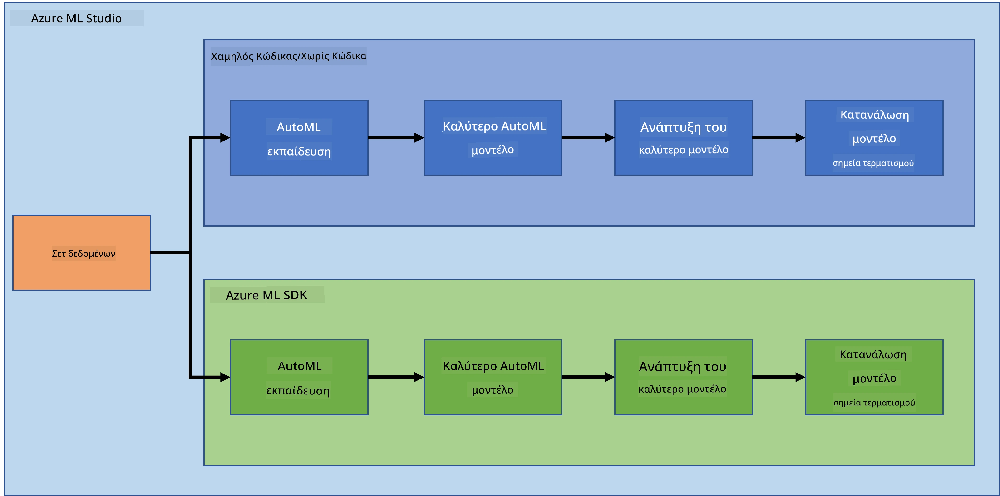
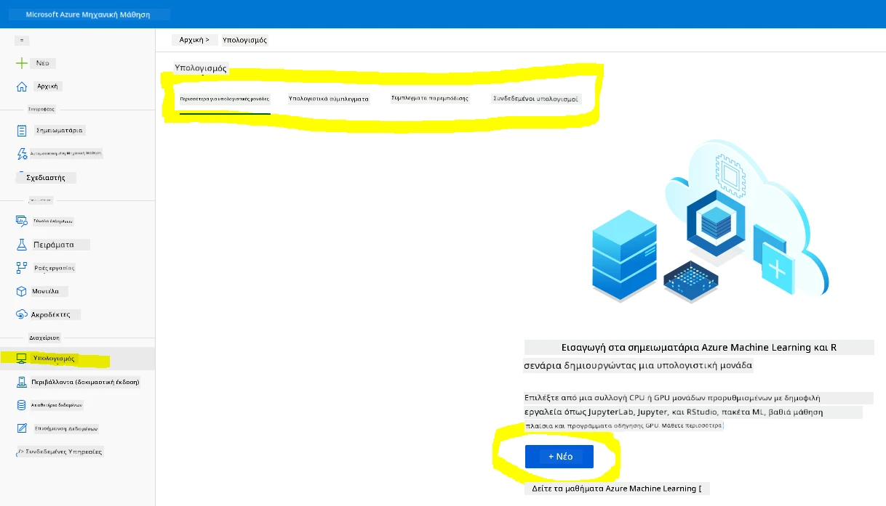
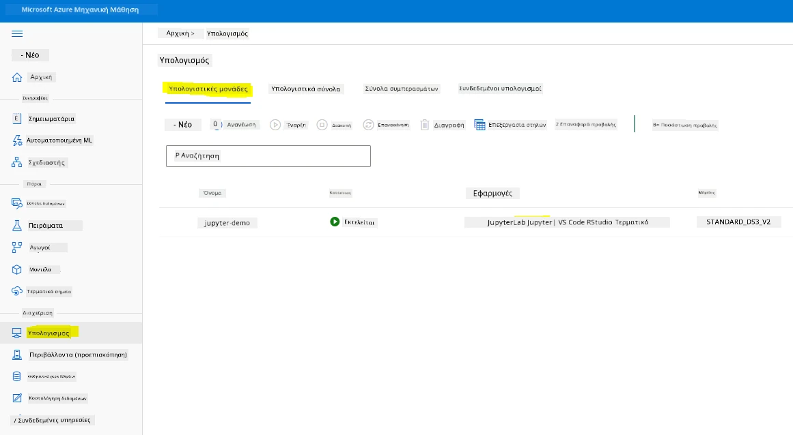
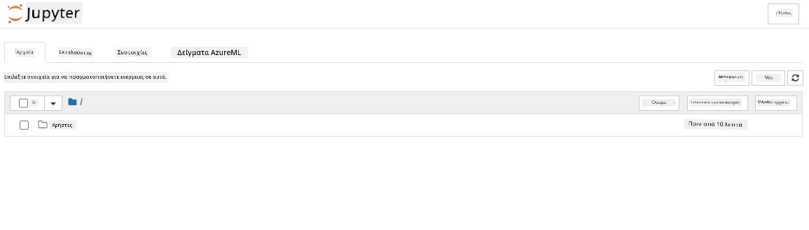

# Επιστήμη Δεδομένων στο Cloud: Ο τρόπος "Azure ML SDK"

| ](../../sketchnotes/19-DataScience-Cloud.png)|
|:---:|
| Επιστήμη Δεδομένων στο Cloud: Azure ML SDK - _Σχεδίαση από [@nitya](https://twitter.com/nitya)_ |

Πίνακας περιεχομένων:

- [Επιστήμη Δεδομένων στο Cloud: Ο τρόπος "Azure ML SDK"](#επιστήμη-δεδομένων-στο-cloud-ο-τρόπος-azure-ml-sdk)
  - [Προ-Μαθήματος Quiz](#προ-μαθήματος-quiz)
  - [1. Εισαγωγή](#1-εισαγωγή)
    - [1.1 Τι είναι το Azure ML SDK;](#11-τι-είναι-το-azure-ml-sdk)
    - [1.2 Έργο πρόβλεψης καρδιακής ανεπάρκειας και εισαγωγή συνόλου δεδομένων](#12-έργο-πρόβλεψης-καρδιακής-ανεπάρκειας-και-εισαγωγή-συνόλου-δεδομένων)
  - [2. Εκπαίδευση μοντέλου με το Azure ML SDK](#2-εκπαίδευση-μοντέλου-με-το-azure-ml-sdk)
    - [2.1 Δημιουργία ενός χώρου εργασίας Azure ML](#21-δημιουργία-ενός-χώρου-εργασίας-azure-ml)
    - [2.2 Δημιουργία ενός υπολογιστικού instance](#22-δημιουργία-ενός-υπολογιστικού-instance)
    - [2.3 Φόρτωση του Συνόλου Δεδομένων](#23-φόρτωση-του-συνόλου-δεδομένων)
    - [2.4 Δημιουργία Σημειωματάριων](#24-δημιουργία-σημειωματάριων)
    - [2.5 Εκπαίδευση μοντέλου](#25-εκπαίδευση-μοντέλου)
      - [2.5.1 Ρύθμιση χώρου εργασίας, πειράματος, υπολογιστικού cluster και συνόλου δεδομένων](#251-ρύθμιση-χώρου-εργασίας-πειράματος-υπολογιστικού-cluster-και-συνόλου-δεδομένων)
      - [2.5.2 Ρύθμιση AutoML και εκπαίδευση](#252-ρύθμιση-automl-και-εκπαίδευση)
  - [3. Ανάπτυξη μοντέλου και κατανάλωση endpoint με το Azure ML SDK](#3-ανάπτυξη-μοντέλου-και-κατανάλωση-endpoint-με-το-azure-ml-sdk)
    - [3.1 Αποθήκευση του καλύτερου μοντέλου](#31-αποθήκευση-του-καλύτερου-μοντέλου)
    - [3.2 Ανάπτυξη μοντέλου](#32-ανάπτυξη-μοντέλου)
    - [3.3 Κατανάλωση endpoint](#33-κατανάλωση-endpoint)
  - [🚀 Πρόκληση](#-challenge)
  - [Μετα-μάθημα quiz](#κουίζ-μετά-το-μάθημα)
  - [Ανασκόπηση & Αυτο-Μελέτη](#review--self-study)
  - [Ανάθεση εργασίας](#ανάθεση)

## [Προ-Μαθήματος Quiz](https://ff-quizzes.netlify.app/en/ds/quiz/36)

## 1. Εισαγωγή

### 1.1 Τι είναι το Azure ML SDK;

Οι επιστήμονες δεδομένων και οι προγραμματιστές AI χρησιμοποιούν το Azure Machine Learning SDK για την κατασκευή και εκτέλεση ροών εργασίας μηχανικής μάθησης με την υπηρεσία Azure Machine Learning. Μπορείτε να αλληλεπιδράσετε με την υπηρεσία σε οποιοδήποτε περιβάλλον Python, συμπεριλαμβανομένων των Jupyter Notebooks, Visual Studio Code ή του αγαπημένου σας IDE για Python.

Κύριοι τομείς του SDK περιλαμβάνουν:

- Εξερεύνηση, προετοιμασία και διαχείριση του κύκλου ζωής των συνόλων δεδομένων που χρησιμοποιούνται σε πειράματα μηχανικής μάθησης.
- Διαχείριση πόρων στο cloud για παρακολούθηση, καταγραφή και οργάνωση των πειραμάτων μηχανικής μάθησης σας.
- Εκπαίδευση μοντέλων είτε τοπικά είτε χρησιμοποιώντας πόρους cloud, συμπεριλαμβανομένης της επιτάχυνσης εκπαίδευσης μοντέλων με GPU.
- Χρήση αυτοματοποιημένης μηχανικής μάθησης, η οποία δέχεται παραμέτρους ρύθμισης και δεδομένα εκπαίδευσης. Αυτή επαναλαμβάνει αυτόματα ανάμεσα σε αλγορίθμους και ρυθμίσεις υπερπαραμέτρων για να βρει το καλύτερο μοντέλο για την εκτέλεση προβλέψεων.
- Ανάπτυξη υπηρεσιών web για τη μετατροπή των εκπαιδευμένων μοντέλων σας σε RESTful υπηρεσίες που μπορούν να καταναλωθούν σε οποιαδήποτε εφαρμογή.

[Μάθετε περισσότερα για το Azure Machine Learning SDK](https://docs.microsoft.com/python/api/overview/azure/ml?WT.mc_id=academic-77958-bethanycheum&ocid=AID3041109)

Στο [προηγούμενο μάθημα](../18-Low-Code/README.md), είδαμε πώς να εκπαιδεύσουμε, να αναπτύξουμε και να καταναλώσουμε ένα μοντέλο με τρόπο Low code/No code. Χρησιμοποιήσαμε το σύνολο δεδομένων για την Καρδιακή Ανεπάρκεια για να δημιουργήσουμε μοντέλο πρόβλεψης Καρδιακής Ανεπάρκειας. Σε αυτό το μάθημα, θα κάνουμε ακριβώς το ίδιο, αλλά χρησιμοποιώντας το Azure Machine Learning SDK.



### 1.2 Έργο πρόβλεψης καρδιακής ανεπάρκειας και εισαγωγή συνόλου δεδομένων

Δείτε [εδώ](../18-Low-Code/README.md) το έργο πρόβλεψης καρδιακής ανεπάρκειας και την εισαγωγή συνόλου δεδομένων.

## 2. Εκπαίδευση μοντέλου με το Azure ML SDK
### 2.1 Δημιουργία ενός χώρου εργασίας Azure ML

Για απλοποίηση, θα εργαστούμε σε ένα jupyter notebook. Αυτό συνεπάγεται ότι έχετε ήδη έναν Χώρο Εργασίας και ένα υπολογιστικό instance. Εάν έχετε ήδη ένα Χώρο Εργασίας, μπορείτε να περάσετε απευθείας στο τμήμα 2.3 Δημιουργία Σημειωματάριου.

Αν όχι, παρακαλούμε ακολουθήστε τις οδηγίες στην ενότητα **2.1 Δημιουργία ενός χώρου εργασίας Azure ML** στο [προηγούμενο μάθημα](../18-Low-Code/README.md) για να δημιουργήσετε έναν χώρο εργασίας.

### 2.2 Δημιουργία ενός υπολογιστικού instance

Στο [χώρο εργασίας Azure ML](https://ml.azure.com/) που δημιουργήσαμε νωρίτερα, μεταβείτε στο μενού υπολογισμού και θα δείτε τους διαφορετικούς διαθέσιμους πόρους υπολογισμού.



Ας δημιουργήσουμε ένα υπολογιστικό instance για την παροχή ενός jupyter notebook.  
1. Πατήστε το κουμπί + Νέο.  
2. Δώστε ένα όνομα στο υπολογιστικό σας instance.  
3. Επιλέξτε τις επιλογές σας: CPU ή GPU, μέγεθος VM και αριθμό πυρήνων.  
4. Κάντε κλικ στο κουμπί Δημιουργία.

Συγχαρητήρια, μόλις δημιουργήσατε ένα υπολογιστικό instance! Θα χρησιμοποιήσουμε αυτό το υπολογιστικό instance για να δημιουργήσουμε ένα Notebook στο τμήμα [Δημιουργία Σημειωματάριων](#23-φόρτωση-του-συνόλου-δεδομένων).

### 2.3 Φόρτωση του Συνόλου Δεδομένων
Αναφερθείτε στο [προηγούμενο μάθημα](../18-Low-Code/README.md) στην ενότητα **2.3 Φόρτωση του Συνόλου Δεδομένων** αν δεν έχετε ανεβάσει ακόμη το σύνολο δεδομένων.

### 2.4 Δημιουργία Σημειωματάριων

> **_ΣΗΜΕΙΩΣΗ:_** Για το επόμενο βήμα μπορείτε είτε να δημιουργήσετε ένα νέο σημειωματάριο από την αρχή, είτε να ανεβάσετε το [σημειωματάριο που δημιουργήσαμε](notebook.ipynb) στο Azure ML Studio σας. Για να το ανεβάσετε, απλώς κάντε κλικ στο μενού "Notebook" και ανεβάστε το σημειωματάριο.

Τα Σημειωματάρια είναι ένα πολύ σημαντικό μέρος της διαδικασίας επιστήμης δεδομένων. Μπορούν να χρησιμοποιηθούν για την Εκτενή Εξερευνητική Ανάλυση Δεδομένων (EDA), για να καλέσετε ένα υπολογιστικό cluster για την εκπαίδευση ενός μοντέλου, να καλέσετε ένα inference cluster για την ανάπτυξη ενός endpoint.

Για να δημιουργήσουμε ένα Σημειωματάριο, χρειάζεται ένας υπολογιστικός κόμβος που παρέχει την υπηρεσία του jupyter notebook instance. Επιστρέψτε στο [χώρο εργασίας Azure ML](https://ml.azure.com/) και κάντε κλικ στα Compute instances. Στη λίστα των υπολογιστικών instances θα πρέπει να δείτε το [υπολογιστικό instance που δημιουργήσαμε νωρίτερα](#22-δημιουργία-ενός-υπολογιστικού-instance).

1. Στην ενότητα Εφαρμογές, κάντε κλικ στην επιλογή Jupyter.  
2. Επιλέξτε το κουτάκι "Ναι, κατανοώ" και κάντε κλικ στο κουμπί Συνέχεια.



3. Αυτό θα ανοίξει μια νέα καρτέλα προγράμματος περιήγησης με το jupyter notebook instance σας ως εξής. Πατήστε το κουμπί "Νέο" για να δημιουργήσετε ένα σημειωματάριο.



Τώρα που έχουμε το Σημειωματάριο, μπορούμε να ξεκινήσουμε την εκπαίδευση του μοντέλου με το Azure ML SDK.

### 2.5 Εκπαίδευση μοντέλου

Καταρχάς, αν έχετε κάποια αμφιβολία, αναφερθείτε στην [τεκμηρίωση του Azure ML SDK](https://docs.microsoft.com/python/api/overview/azure/ml?WT.mc_id=academic-77958-bethanycheum&ocid=AID3041109). Περιέχει όλες τις απαραίτητες πληροφορίες για να κατανοήσετε τα modules που θα δούμε σε αυτό το μάθημα.

#### 2.5.1 Ρύθμιση χώρου εργασίας, πειράματος, υπολογιστικού cluster και συνόλου δεδομένων

Πρέπει να φορτώσετε το `workspace` από το αρχείο ρυθμίσεων χρησιμοποιώντας τον ακόλουθο κώδικα:

```python
from azureml.core import Workspace
ws = Workspace.from_config()
```

Αυτό επιστρέφει ένα αντικείμενο τύπου `Workspace` που αναπαριστά τον χώρο εργασίας. Στη συνέχεια, πρέπει να δημιουργήσετε ένα `experiment` χρησιμοποιώντας τον ακόλουθο κώδικα:

```python
from azureml.core import Experiment
experiment_name = 'aml-experiment'
experiment = Experiment(ws, experiment_name)
```

Για να πάρετε ή να δημιουργήσετε ένα πείραμα από ένα χώρο εργασίας, ζητάτε το πείραμα χρησιμοποιώντας το όνομα του πειράματος. Το όνομα του πειράματος πρέπει να έχει 3-36 χαρακτήρες, να ξεκινά με γράμμα ή αριθμό, και να περιέχει μόνο γράμματα, αριθμούς, κάτω παύλες και παύλες. Αν το πείραμα δεν βρεθεί στο χώρο εργασίας, δημιουργείται ένα νέο πείραμα.

Τώρα πρέπει να δημιουργήσετε ένα υπολογιστικό cluster για την εκπαίδευση χρησιμοποιώντας τον ακόλουθο κώδικα. Σημειώστε πως αυτό το βήμα μπορεί να διαρκέσει λίγα λεπτά.

```python
from azureml.core.compute import AmlCompute

aml_name = "heart-f-cluster"
try:
    aml_compute = AmlCompute(ws, aml_name)
    print('Found existing AML compute context.')
except:
    print('Creating new AML compute context.')
    aml_config = AmlCompute.provisioning_configuration(vm_size = "Standard_D2_v2", min_nodes=1, max_nodes=3)
    aml_compute = AmlCompute.create(ws, name = aml_name, provisioning_configuration = aml_config)
    aml_compute.wait_for_completion(show_output = True)

cts = ws.compute_targets
compute_target = cts[aml_name]
```

Μπορείτε να πάρετε το σύνολο δεδομένων από το χώρο εργασίας χρησιμοποιώντας το όνομα του συνόλου δεδομένων με τον ακόλουθο τρόπο:

```python
dataset = ws.datasets['heart-failure-records']
df = dataset.to_pandas_dataframe()
df.describe()
```


#### 2.5.2 Ρύθμιση AutoML και εκπαίδευση

Για να ορίσετε τη ρύθμιση AutoML, χρησιμοποιήστε την [κλάση AutoMLConfig](https://docs.microsoft.com/python/api/azureml-train-automl-client/azureml.train.automl.automlconfig(class)?WT.mc_id=academic-77958-bethanycheum&ocid=AID3041109).

Όπως περιγράφεται στην τεκμηρίωση, υπάρχουν πολλές παράμετροι με τις οποίες μπορείτε να πειραματιστείτε. Για αυτό το έργο, θα χρησιμοποιήσουμε τις ακόλουθες παραμέτρους:

- `experiment_timeout_minutes`: Ο μέγιστος χρόνος (σε λεπτά) που επιτρέπεται να τρέξει το πείραμα πριν σταματήσει αυτόματα και τα αποτελέσματα γίνουν αυτόματα διαθέσιμα.
- `max_concurrent_iterations`: Ο μέγιστος αριθμός ταυτόχρονων επαναλήψεων εκπαίδευσης που επιτρέπονται για το πείραμα.
- `primary_metric`: Το κύριο μέτρο που χρησιμοποιείται για τον καθορισμό της κατάστασης του πειράματος.
- `compute_target`: Ο υπολογιστικός στόχος Azure Machine Learning στον οποίο εκτελείται το Automated Machine Learning πείραμα.
- `task`: Ο τύπος της εργασίας που εκτελείται. Τιμές μπορεί να είναι 'classification', 'regression' ή 'forecasting', ανάλογα με τον τύπο του προβλήματος αυτοματοποιημένης ML που πρέπει να λυθεί.
- `training_data`: Τα δεδομένα εκπαίδευσης που θα χρησιμοποιηθούν στο πείραμα. Πρέπει να περιέχουν τόσο χαρακτηριστικά εκπαίδευσης όσο και μία στήλη ετικετών (προαιρετικά και μία στήλη δειγμάτων βάρους).
- `label_column_name`: Το όνομα της στήλης ετικετών.
- `path`: Η πλήρης διαδρομή στον φάκελο του έργου Azure Machine Learning.
- `enable_early_stopping`: Αν θα ενεργοποιηθεί η πρώιμη διακοπή αν η βαθμολογία δεν βελτιώνεται βραχυπρόθεσμα.
- `featurization`: Δείκτης για το αν το βήμα δημιουργίας χαρακτηριστικών πρέπει να γίνει αυτόματα ή όχι, ή αν πρέπει να χρησιμοποιηθεί προσαρμοσμένη δημιουργία χαρακτηριστικών.
- `debug_log`: Το αρχείο καταγραφής στο οποίο γράφονται πληροφορίες αποσφαλμάτωσης.

```python
from azureml.train.automl import AutoMLConfig

project_folder = './aml-project'

automl_settings = {
    "experiment_timeout_minutes": 20,
    "max_concurrent_iterations": 3,
    "primary_metric" : 'AUC_weighted'
}

automl_config = AutoMLConfig(compute_target=compute_target,
                             task = "classification",
                             training_data=dataset,
                             label_column_name="DEATH_EVENT",
                             path = project_folder,  
                             enable_early_stopping= True,
                             featurization= 'auto',
                             debug_log = "automl_errors.log",
                             **automl_settings
                            )
```

Τώρα που έχετε ορίσει τη ρύθμιση, μπορείτε να εκπαιδεύσετε το μοντέλο χρησιμοποιώντας τον ακόλουθο κώδικα. Αυτό το βήμα μπορεί να διαρκέσει μέχρι και μία ώρα, ανάλογα με το μέγεθος του cluster σας.

```python
remote_run = experiment.submit(automl_config)
```

Μπορείτε να τρέξετε το widget RunDetails για να δείτε τα διαφορετικά πειράματα.

```python
from azureml.widgets import RunDetails
RunDetails(remote_run).show()
```

## 3. Ανάπτυξη μοντέλου και κατανάλωση endpoint με το Azure ML SDK

### 3.1 Αποθήκευση του καλύτερου μοντέλου

Το `remote_run` είναι ένα αντικείμενο τύπου [AutoMLRun](https://docs.microsoft.com/python/api/azureml-train-automl-client/azureml.train.automl.run.automlrun?WT.mc_id=academic-77958-bethanycheum&ocid=AID3041109). Αυτό το αντικείμενο περιέχει τη μέθοδο `get_output()` που επιστρέφει την καλύτερη εκτέλεση και το αντίστοιχα προσαρμοσμένο μοντέλο.

```python
best_run, fitted_model = remote_run.get_output()
```

Μπορείτε να δείτε τις παραμέτρους που χρησιμοποιήθηκαν για το καλύτερο μοντέλο απλά εκτυπώνοντας το fitted_model και να δείτε τις ιδιότητες του καλύτερου μοντέλου χρησιμοποιώντας τη μέθοδο [get_properties()](https://docs.microsoft.com/python/api/azureml-core/azureml.core.run(class)?view=azure-ml-py#azureml_core_Run_get_properties?WT.mc_id=academic-77958-bethanycheum&ocid=AID3041109).

```python
best_run.get_properties()
```

Τώρα καταχωρήστε το μοντέλο με τη μέθοδο [register_model](https://docs.microsoft.com/python/api/azureml-train-automl-client/azureml.train.automl.run.automlrun?view=azure-ml-py#register-model-model-name-none--description-none--tags-none--iteration-none--metric-none-?WT.mc_id=academic-77958-bethanycheum&ocid=AID3041109).

```python
model_name = best_run.properties['model_name']
script_file_name = 'inference/score.py'
best_run.download_file('outputs/scoring_file_v_1_0_0.py', 'inference/score.py')
description = "aml heart failure project sdk"
model = best_run.register_model(model_name = model_name,
                                model_path = './outputs/',
                                description = description,
                                tags = None)
```

### 3.2 Ανάπτυξη μοντέλου

Μόλις αποθηκευτεί το καλύτερο μοντέλο, μπορούμε να το αναπτύξουμε με την κλάση [InferenceConfig](https://docs.microsoft.com/python/api/azureml-core/azureml.core.model.inferenceconfig?view=azure-ml-py?ocid=AID3041109). Το InferenceConfig αναπαριστά τις ρυθμίσεις διαμόρφωσης για ένα προσαρμοσμένο περιβάλλον που χρησιμοποιείται για την ανάπτυξη. Η κλάση [AciWebservice](https://docs.microsoft.com/python/api/azureml-core/azureml.core.webservice.aciwebservice?view=azure-ml-py) αναπαριστά ένα μοντέλο μηχανικής μάθησης που έχει αναπτυχθεί ως endpoint υπηρεσίας web στο Azure Container Instances. Μια αναπτυγμένη υπηρεσία δημιουργείται από ένα μοντέλο, ένα σενάριο και συνδεδεμένα αρχεία. Η προκύπτουσα υπηρεσία web είναι ένα ισορροπημένο φορτίο HTTP endpoint με REST API. Μπορείτε να στείλετε δεδομένα σε αυτό το API και να λάβετε την πρόβλεψη που επιστρέφεται από το μοντέλο.

Το μοντέλο αναπτύσσεται χρησιμοποιώντας τη μέθοδο [deploy](https://docs.microsoft.com/python/api/azureml-core/azureml.core.model(class)?view=azure-ml-py#deploy-workspace--name--models--inference-config-none--deployment-config-none--deployment-target-none--overwrite-false--show-output-false-?WT.mc_id=academic-77958-bethanycheum&ocid=AID3041109).

```python
from azureml.core.model import InferenceConfig, Model
from azureml.core.webservice import AciWebservice

inference_config = InferenceConfig(entry_script=script_file_name, environment=best_run.get_environment())

aciconfig = AciWebservice.deploy_configuration(cpu_cores = 1,
                                               memory_gb = 1,
                                               tags = {'type': "automl-heart-failure-prediction"},
                                               description = 'Sample service for AutoML Heart Failure Prediction')

aci_service_name = 'automl-hf-sdk'
aci_service = Model.deploy(ws, aci_service_name, [model], inference_config, aciconfig)
aci_service.wait_for_deployment(True)
print(aci_service.state)
```

Αυτό το βήμα θα διαρκέσει μερικά λεπτά.

### 3.3 Κατανάλωση endpoint

Καταναλώνετε το endpoint σας δημιουργώντας μια δείγμα είσοδο:
```python
data = {
    "data":
    [
        {
            'age': "60",
            'anaemia': "false",
            'creatinine_phosphokinase': "500",
            'diabetes': "false",
            'ejection_fraction': "38",
            'high_blood_pressure': "false",
            'platelets': "260000",
            'serum_creatinine': "1.40",
            'serum_sodium': "137",
            'sex': "false",
            'smoking': "false",
            'time': "130",
        },
    ],
}

test_sample = str.encode(json.dumps(data))
```
Και στη συνέχεια μπορείτε να στείλετε αυτήν την είσοδο στο μοντέλο σας για πρόβλεψη :

```python
response = aci_service.run(input_data=test_sample)
response
```
Αυτό θα πρέπει να επιστρέψει `'{"result": [false]}'`. Αυτό σημαίνει ότι η είσοδος του ασθενούς που στείλαμε στο endpoint παρήγαγε την πρόβλεψη `false` που σημαίνει ότι αυτό το άτομο πιθανώς δεν θα υποστεί καρδιακή προσβολή.

Συγχαρητήρια! Μόλις καταναλώσατε το μοντέλο που αναπτύχθηκε και εκπαιδεύτηκε στο Azure ML με το Azure ML SDK!

> **_ΣΗΜΕΙΩΣΗ:_** Μόλις ολοκληρώσετε το έργο, μην ξεχάσετε να διαγράψετε όλους τους πόρους.

## 🚀 Πρόκληση

 Υπάρχουν πολλά άλλα που μπορείτε να κάνετε μέσω του SDK, δυστυχώς δεν μπορούμε να τα δούμε όλα σε αυτό το μάθημα. Αλλά τα καλά νέα είναι ότι η εκμάθηση του πώς να περιηγείστε στην τεκμηρίωση του SDK μπορεί να σας πάει πολύ μακριά μόνοι σας. Ρίξτε μια ματιά στην τεκμηρίωση του Azure ML SDK και βρείτε την κλάση `Pipeline` που σας επιτρέπει να δημιουργείτε pipelines. Ένα Pipeline είναι μια συλλογή βημάτων που μπορούν να εκτελεστούν ως ροή εργασίας.

**ΥΠΟΔΕΙΞΗ:** Μεταβείτε στην [τεκμηρίωση του SDK](https://docs.microsoft.com/python/api/overview/azure/ml/?view=azure-ml-py?WT.mc_id=academic-77958-bethanycheum&ocid=AID3041109) και πληκτρολογήστε λέξεις-κλειδιά στη γραμμή αναζήτησης όπως "Pipeline". Πρέπει να έχετε την κλάση `azureml.pipeline.core.Pipeline` στα αποτελέσματα αναζήτησης.

## [Κουίζ μετά το μάθημα](https://ff-quizzes.netlify.app/en/ds/quiz/37)

## Ανασκόπηση & Αυτομελέτη

Σε αυτό το μάθημα μάθατε πώς να εκπαιδεύετε, να αναπτύσσετε και να χρησιμοποιείτε ένα μοντέλο για την πρόβλεψη του κινδύνου καρδιακής ανεπάρκειας με το Azure ML SDK στο cloud. Δείτε αυτήν την [τεκμηρίωση](https://docs.microsoft.com/python/api/overview/azure/ml/?view=azure-ml-py?WT.mc_id=academic-77958-bethanycheum&ocid=AID3041109) για περισσότερες πληροφορίες σχετικά με το Azure ML SDK. Προσπαθήστε να δημιουργήσετε το δικό σας μοντέλο με το Azure ML SDK.

## Ανάθεση

[Έργο Επιστήμης Δεδομένων με χρήση Azure ML SDK](assignment.md)

---

<!-- CO-OP TRANSLATOR DISCLAIMER START -->
**Αποποίηση ευθυνών**:
Αυτό το έγγραφο έχει μεταφραστεί χρησιμοποιώντας την υπηρεσία μετάφρασης με τεχνητή νοημοσύνη [Co-op Translator](https://github.com/Azure/co-op-translator). Ενώ επιδιώκουμε την ακρίβεια, παρακαλούμε να έχετε υπόψη ότι οι αυτοματοποιημένες μεταφράσεις ενδέχεται να περιέχουν λάθη ή ανακρίβειες. Το πρωτότυπο έγγραφο στη μητρική του γλώσσα πρέπει να θεωρείται η αυθεντική πηγή. Για κρίσιμες πληροφορίες, συνιστάται επαγγελματική ανθρώπινη μετάφραση. Δεν φέρουμε ευθύνη για τυχόν παρεξηγήσεις ή λανθασμένες ερμηνείες που προκύπτουν από τη χρήση αυτής της μετάφρασης.
<!-- CO-OP TRANSLATOR DISCLAIMER END -->