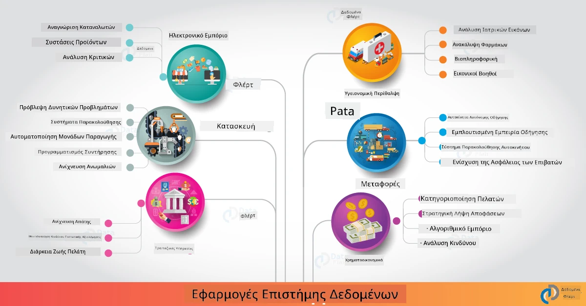

# Επιστήμη Δεδομένων στον Πραγματικό Κόσμο

|  ](../../sketchnotes/20-DataScience-RealWorld.png) |
| :--------------------------------------------------------------------------------------------------------------: |
|             Επιστήμη Δεδομένων στον Πραγματικό Κόσμο - _Σκιαγραφία από [@nitya](https://twitter.com/nitya)_               |

Είμαστε σχεδόν στο τέλος αυτού του ταξιδιού μάθησης!

Ξεκινήσαμε με ορισμούς της επιστήμης δεδομένων και ηθικής, εξερευνήσαμε διάφορα εργαλεία & τεχνικές για ανάλυση και οπτικοποίηση δεδομένων, ανασκοπήσαμε τον κύκλο ζωής της επιστήμης δεδομένων, και εξετάσαμε την κλιμάκωση και αυτοματοποίηση ροών εργασίας επιστήμης δεδομένων με υπηρεσίες υπολογιστικού νέφους. Έτσι, πιθανότατα αναρωτιέστε: _"Πώς ακριβώς αντιστοιχίζω όλες αυτές τις γνώσεις σε πραγματικά πλαίσια;"_

Σε αυτό το μάθημα, θα εξερευνήσουμε πραγματικές εφαρμογές της επιστήμης δεδομένων σε βιομηχανίες και θα εξετάσουμε συγκεκριμένα παραδείγματα στην έρευνα, στις ψηφιακές ανθρωπιστικές επιστήμες και στη βιωσιμότητα. Θα δούμε ευκαιρίες μαθητικών έργων και θα ολοκληρώσουμε με χρήσιμους πόρους για να συνεχίσετε το ταξίδι μάθησής σας!
## Quiz Προ Μαθήματος

## [Quiz Προ Μαθήματος](https://ff-quizzes.netlify.app/en/ds/quiz/38)

## Επιστήμη Δεδομένων + Βιομηχανία

Χάρη στη δημοκρατοποίηση της Τεχνητής Νοημοσύνης, οι προγραμματιστές βρίσκουν πλέον πιο εύκολο να σχεδιάζουν και να ενσωματώνουν αποφάσεις με ορμή ΤΝ και δεδομενοστραφή συμπεράσματα στις εμπειρίες χρηστών και ροές εργασίας ανάπτυξης. Εδώ είναι μερικά παραδείγματα για το πώς η επιστήμη δεδομένων "εφαρμόζεται" σε πραγματικές εφαρμογές στη βιομηχανία:

 * [Google Flu Trends](https://www.wired.com/2015/10/can-learn-epic-failure-google-flu-trends/) χρησιμοποίησε την επιστήμη δεδομένων για να συσχετίσει όρους αναζήτησης με τάσεις γρίπης. Παρόλο που η προσέγγιση είχε αδυναμίες, ευαισθητοποίησε σχετικά με τις δυνατότητες (και τις προκλήσεις) των προβλέψεων υγείας με βάση δεδομένα.

 * [UPS Routing Predictions](https://www.technologyreview.com/2018/11/21/139000/how-ups-uses-ai-to-outsmart-bad-weather/) - εξηγεί πώς η UPS χρησιμοποιεί επιστήμη δεδομένων και μηχανική μάθηση για να προβλέψει βέλτιστες διαδρομές παράδοσης, λαμβάνοντας υπόψη τις καιρικές συνθήκες, τα μοτίβα κυκλοφορίας, τις προθεσμίες παράδοσης και άλλα.

 * [Οπτικοποίηση Διαδρομών Taxi στη ΝΥ](http://chriswhong.github.io/nyctaxi/) - δεδομένα που συλλέχθηκαν μέσω [Νόμων Ελευθερίας Πληροφόρησης](https://chriswhong.com/open-data/foil_nyc_taxi/) βοήθησαν στην οπτικοποίηση μιας μέρας στη ζωή των ταξί της ΝΥ, βοηθώντας μας να καταλάβουμε πώς κινούνται στην πολυσύχναστη πόλη, τα έσοδά τους, και τη διάρκεια των διαδρομών σε κάθε 24ωρο.

 * [Uber Data Science Workbench](https://eng.uber.com/dsw/) - χρησιμοποιεί δεδομένα (τόποι παραλαβής και παράδοσης, διάρκεια ταξιδιού, προτιμώμενες διαδρομές κ.ά.) που συλλέγονται από εκατομμύρια ταξίδια Uber *ημερησίως* για να δημιουργήσει ένα εργαλείο ανάλυσης δεδομένων που βοηθά στην τιμολόγηση, την ασφάλεια, την ανίχνευση απάτης και αποφάσεις πλοήγησης.

 * [Αθλητική Ανάλυση](https://towardsdatascience.com/scope-of-analytics-in-sports-world-37ed09c39860) - επικεντρώνεται στην _προγνωστική ανάλυση_ (ανάλυση ομάδων και παικτών - σκεφτείτε [Moneyball](https://datasciencedegree.wisconsin.edu/blog/moneyball-proves-importance-big-data-big-ideas/) - και διαχείριση οπαδών) και _οπτικοποίηση δεδομένων_ (πίνακες ελέγχου ομάδων & οπαδών, αγώνες κλπ.) με εφαρμογές όπως ανίχνευση ταλέντων, στοιχήματα και διαχείριση αποθεμάτων/χώρων.

 * [Επιστήμη Δεδομένων στον Τραπεζικό Τομέα](https://data-flair.training/blogs/data-science-in-banking/) - αναδεικνύει την αξία της επιστήμης δεδομένων στη χρηματοοικονομική βιομηχανία με εφαρμογές από μοντέλα κινδύνου και ανίχνευση απάτης, διαχωρισμό πελατών, προβλέψεις σε πραγματικό χρόνο και συστήματα συστάσεων. Η προγνωστική ανάλυση υποστηρίζει επίσης κρίσιμα μέτρα όπως [πιστωτικοί βαθμοί](https://dzone.com/articles/using-big-data-and-predictive-analytics-for-credit).

 * [Επιστήμη Δεδομένων στην Υγεία](https://data-flair.training/blogs/data-science-in-healthcare/) - αναδεικνύει εφαρμογές όπως η ιατρική απεικόνιση (π.χ., MRI, Ακτίνες Χ, CT-Scan), η γονιδιωματική (αλληλουχία DNA), η ανάπτυξη φαρμάκων (εκτίμηση κινδύνου, πρόβλεψη επιτυχίας), η προγνωστική ανάλυση (φροντίδα ασθενών & εφοδιαστική), η παρακολούθηση & πρόληψη ασθενειών κ.ά.

 Πηγή Εικόνας: [Data Flair: 6 Amazing Data Science Applications ](https://data-flair.training/blogs/data-science-applications/)

Το σχήμα παρουσιάζει άλλους τομείς και παραδείγματα για την εφαρμογή τεχνικών επιστήμης δεδομένων. Θέλετε να εξερευνήσετε άλλες εφαρμογές; Δείτε την ενότητα [Ανασκόπηση & Αυτο-Μελέτη](?id=review-amp-self-study) παρακάτω.

## Επιστήμη Δεδομένων + Έρευνα

|  ](../../sketchnotes/20-DataScience-Research.png) |
| :---------------------------------------------------------------------------------------------------------------: |
|              Επιστήμη Δεδομένων & Έρευνα - _Σκιαγραφία από [@nitya](https://twitter.com/nitya)_              |

Ενώ οι εφαρμογές στον πραγματικό κόσμο συχνά εστιάζουν σε βιομηχανικές χρήσεις σε μεγάλη κλίμακα, οι εφαρμογές και τα έργα _έρευνας_ μπορούν να είναι χρήσιμα από δύο προοπτικές:

* _ευκαιρίες καινοτομίας_ - εξερεύνηση γρήγορης πρωτοτυποποίησης προχωρημένων εννοιών και δοκιμών εμπειριών χρήστη για εφαρμογές επόμενης γενιάς.
* _προκλήσεις ανέλιξης_ - διερεύνηση πιθανών βλαβών ή ανεπιθύμητων συνεπειών των τεχνολογιών επιστήμης δεδομένων σε πραγματικά πλαίσια.

Για τους σπουδαστές, αυτά τα ερευνητικά έργα μπορούν να προσφέρουν ευκαιρίες μάθησης και συνεργασίας που βελτιώνουν την κατανόηση του θέματος, και διευρύνουν την επίγνωσή σας και την αλληλεπίδραση με σχετικούς ανθρώπους ή ομάδες που εργάζονται σε τομείς ενδιαφέροντος. Πώς όμως μοιάζουν τα ερευνητικά έργα και πώς μπορούν να έχουν αντίκτυπο;

Ας δούμε ένα παράδειγμα - τη [Μελέτη MIT Gender Shades](http://gendershades.org/overview.html) από την Joy Buolamwini (MIT Media Labs) με [υπογεγραμμένο ερευνητικό άρθρο](http://proceedings.mlr.press/v81/buolamwini18a/buolamwini18a.pdf) που συνυπογράφηκε με την Timnit Gebru (τότε στη Microsoft Research) και επικεντρώθηκε στο

 * **Τι:** Στόχος του ερευνητικού έργου ήταν να _αξιολογήσει προκαταλήψεις που υπάρχουν σε αυτοματοποιημένους αλγόριθμους και σετ δεδομένων ανάλυσης προσώπου_ βάσει φύλου και τύπου επιδερμίδας.
 * **Γιατί:** Η ανάλυση προσώπου χρησιμοποιείται σε τομείς όπως επιβολή νόμου, ασφάλεια αεροδρομίων, συστήματα πρόσληψης κ.ά. - πλαίσια όπου ανακριβείς ταξινομήσεις (π.χ. λόγω προκατάληψης) μπορούν να προκαλέσουν οικονομικές και κοινωνικές βλάβες σε άτομα ή ομάδες. Η κατανόηση (και η εξάλειψη ή μείωση) αυτών των προκαταλήψεων είναι κρίσιμη για τη δικαιοσύνη στη χρήση.
 * **Πώς:** Οι ερευνητές αναγνώρισαν ότι τα υπάρχοντα πρότυπα βάσεις χρησιμοποιούσαν κυρίως άτομα με πιο ανοιχτόχρωμη επιδερμίδα, και δημιούργησαν ένα νέο σύνολο δεδομένων (πάνω από 1000 εικόνες) που ήταν _πιο ισορροπημένο_ κατά φύλο και τύπο επιδερμίδας. Το σετ χρησιμοποιήθηκε για να αξιολογήσει την ακρίβεια τριών προϊόντων ταξινόμησης φύλου (από Microsoft, IBM & Face++).

Τα αποτελέσματα έδειξαν ότι, αν και η συνολική ακρίβεια ήταν καλή, υπήρχε αξιοσημείωτη διαφορά στα ποσοστά σφάλματος μεταξύ διαφορετικών υπο-ομάδων - με **λανθασμένο φύλο** να εμφανίζεται πιο συχνά σε γυναίκες ή άτομα με πιο σκούρο τύπο επιδερμίδας, δηλώνοντας προκατάληψη.

**Κύρια Αποτελέσματα:** Ευαισθητοποίηση ότι η επιστήμη δεδομένων χρειάζεται πιο _αντιπροσωπευτικά σύνολα δεδομένων_ (ισορροπημένες υπο-ομάδες) και πιο _συμπεριληπτικές ομάδες_ (ποικιλόμορφα υπόβαθρα) για να αναγνωρίσει και να εξαλείψει ή μειώσει τέτοιες προκαταλήψεις νωρίτερα στις λύσεις ΤΝ. Οι ερευνητικές προσπάθειες όπως αυτή είναι επίσης καθοριστικές για πολλές οργανώσεις που ορίζουν αρχές και πρακτικές για _υπεύθυνη Τεχνητή Νοημοσύνη_ για να βελτιώσουν τη δικαιοσύνη στα προϊόντα και τις διαδικασίες ΤΝ τους.

**Θέλετε να μάθετε για σχετικά ερευνητικά έργα στη Microsoft;**

* Δείτε τα [Microsoft Research Projects](https://www.microsoft.com/research/research-area/artificial-intelligence/?facet%5Btax%5D%5Bmsr-research-area%5D%5B%5D=13556&facet%5Btax%5D%5Bmsr-content-type%5D%5B%5D=msr-project) στην Τεχνητή Νοημοσύνη.
* Εξερευνήστε μαθητικά έργα από το [Microsoft Research Data Science Summer School](https://www.microsoft.com/en-us/research/academic-program/data-science-summer-school/).
* Δείτε το έργο [Fairlearn](https://fairlearn.org/) και τις πρωτοβουλίες [Responsible AI](https://www.microsoft.com/en-us/ai/responsible-ai?activetab=pivot1%3aprimaryr6).

## Επιστήμη Δεδομένων + Ανθρωπιστικές Επιστήμες

|  ](../../sketchnotes/20-DataScience-Humanities.png) |
| :---------------------------------------------------------------------------------------------------------------: |
|          Επιστήμη Δεδομένων & Ψηφιακές Ανθρωπιστικές Επιστήμες - _Σκιαγραφία από [@nitya](https://twitter.com/nitya)_              |

Οι Ψηφιακές Ανθρωπιστικές Επιστήμες [έχουν οριστεί](https://digitalhumanities.stanford.edu/about-dh-stanford) ως "μία συλλογή πρακτικών και προσεγγίσεων που συνδυάζουν υπολογιστικές μεθόδους με ανθρωπιστική έρευνα". Τα [έργα του Stanford](https://digitalhumanities.stanford.edu/projects) όπως το _"rebooting history"_ και _"poetic thinking"_ καταδεικνύουν τη σύνδεση μεταξύ [Ψηφιακών Ανθρωπιστικών και Επιστήμης Δεδομένων](https://digitalhumanities.stanford.edu/digital-humanities-and-data-science) - τονίζοντας τεχνικές όπως ανάλυση δικτύων, οπτικοποίηση πληροφοριών, χωρική και κειμενική ανάλυση που μπορούν να μας βοηθήσουν να επανεξετάσουμε ιστορικά και λογοτεχνικά σύνολα δεδομένων για να αποκομίσουμε νέες γνώσεις και οπτικές.

*Θέλετε να εξερευνήσετε και να επεκτείνετε ένα έργο σε αυτόν τον τομέα;*

Δείτε το ["Emily Dickinson and the Meter of Mood"](https://gist.github.com/jlooper/ce4d102efd057137bc000db796bfd671) - ένα εξαιρετικό παράδειγμα από τη [Jen Looper](https://twitter.com/jenlooper) που ρωτά πώς μπορούμε να χρησιμοποιήσουμε την επιστήμη δεδομένων για να επανεξετάσουμε οικεία ποιήματα και να ξαναεκτιμήσουμε το νόημά τους και τις συνεισφορές του συγγραφέα σε νέα πλαίσια. Για παράδειγμα, _μπορούμε να προβλέψουμε την εποχή κατά την οποία γράφτηκε ένα ποίημα αναλύοντας τον τόνο ή το συναίσθημά του_ - και τι μας λέει αυτό για την ψυχική κατάσταση του συγγραφέα στη σχετική περίοδο;

Για να απαντήσουμε σε αυτήν την ερώτηση, ακολουθούμε τα βήματα του κύκλου ζωής της επιστήμης δεδομένων:
 * [`Απόκτηση Δεδομένων`](https://gist.github.com/jlooper/ce4d102efd057137bc000db796bfd671#acquiring-the-dataset) - για τη συλλογή ενός σχετικού συνόλου δεδομένων για ανάλυση. Επιλογές περιλαμβάνουν τη χρήση API (π.χ., [Poetry DB API](https://poetrydb.org/index.html)) ή την εξαγωγή δεδομένων από ιστοσελίδες (π.χ., [Project Gutenberg](https://www.gutenberg.org/files/12242/12242-h/12242-h.htm)) χρησιμοποιώντας εργαλεία όπως το [Scrapy](https://scrapy.org/).
 * [`Καθαρισμός Δεδομένων`](https://gist.github.com/jlooper/ce4d102efd057137bc000db796bfd671#clean-the-data) - εξηγεί πώς το κείμενο μπορεί να μορφοποιηθεί, να εξυγιανθεί και να απλοποιηθεί χρησιμοποιώντας βασικά εργαλεία όπως το Visual Studio Code και το Microsoft Excel.
 * [`Ανάλυση Δεδομένων`](https://gist.github.com/jlooper/ce4d102efd057137bc000db796bfd671#working-with-the-data-in-a-notebook) - εξηγεί πώς μπορούμε τώρα να εισάγουμε το σύνολο δεδομένων σε "Σημειωματάρια" για ανάλυση χρησιμοποιώντας πακέτα Python (όπως pandas, numpy και matplotlib) για την οργάνωση και οπτικοποίηση των δεδομένων.
 * [`Ανάλυση Συναισθήματος`](https://gist.github.com/jlooper/ce4d102efd057137bc000db796bfd671#sentiment-analysis-using-cognitive-services) - εξηγεί πώς μπορούμε να ενσωματώσουμε υπηρεσίες νέφους όπως Text Analytics, χρησιμοποιώντας εργαλεία χαμηλού κώδικα όπως το [Power Automate](https://flow.microsoft.com/en-us/) για αυτοματοποιημένες ροές εργασίας επεξεργασίας δεδομένων.

Χρησιμοποιώντας αυτή τη ροή εργασίας, μπορούμε να εξερευνήσουμε τις εποχιακές επιδράσεις στο συναίσθημα των ποιημάτων και να μας βοηθήσει να διαμορφώσουμε τις δικές μας οπτικές για τον συγγραφέα. Δοκιμάστε το μόνοι σας - στη συνέχεια επεκτείνετε το σημειωματάριο με ερωτήσεις ή οπτικοποιήσεις των δεδομένων με νέους τρόπους!

> Μπορείτε να χρησιμοποιήσετε μερικά από τα εργαλεία στο [Digital Humanities toolkit](https://github.com/Digital-Humanities-Toolkit) για να ακολουθήσετε αυτές τις ερευνητικές κατευθύνσεις

## Επιστήμη Δεδομένων + Βιωσιμότητα

|  ](../../sketchnotes/20-DataScience-Sustainability.png) |
| :---------------------------------------------------------------------------------------------------------------: |
|              Επιστήμη Δεδομένων & Βιωσιμότητα - _Σκιαγραφία από [@nitya](https://twitter.com/nitya)_              |

Η [Ατζέντα 2030 για τη Βιώσιμη Ανάπτυξη](https://sdgs.un.org/2030agenda) - υιοθετημένη από όλα τα μέλη των Ηνωμένων Εθνών το 2015 - προσδιορίζει 17 στόχους, συμπεριλαμβανομένων όσων επικεντρώνονται στην **Προστασία του Πλανήτη** από τη διάβρωση και τις επιπτώσεις της κλιματικής αλλαγής. Η πρωτοβουλία [Microsoft Sustainability](https://www.microsoft.com/en-us/sustainability) υποστηρίζει αυτούς τους στόχους εξερευνώντας τρόπους με τους οποίους οι λύσεις τεχνολογίας μπορούν να στηρίξουν και να οικοδομήσουν πιο βιώσιμα μέλλοντα με [έμφαση σε 4 στόχους](https://dev.to/azure/a-visual-guide-to-sustainable-software-engineering-53hh) - να είναι αρνητικοί σε εκπομπές άνθρακα, θετικοί σε νερό, μηδενικά απόβλητα και βιοποικιλόμορφοι έως το 2030.

Η αντιμετώπιση αυτών των προκλήσεων με κλίμακα και έγκαιρα απαιτεί σκέψη σε επίπεδο νέφους - και δεδομένα μεγάλης κλίμακας. Η πρωτοβουλία [Planetary Computer](https://planetarycomputer.microsoft.com/) παρέχει 4 στοιχεία για να βοηθήσει τους επιστήμονες δεδομένων και προγραμματιστές σε αυτή την προσπάθεια:

 * [Κατάλογος Δεδομένων](https://planetarycomputer.microsoft.com/catalog) - με πεταμπάιτ δεδομένων συστημάτων Γης (δωρεάν & φιλοξενούμενα στο Azure).
 * [Planetary API](https://planetarycomputer.microsoft.com/docs/reference/stac/) - για να βοηθά τους χρήστες να αναζητούν σχετικά δεδομένα στο χώρο και το χρόνο.
 * [Hub](https://planetarycomputer.microsoft.com/docs/overview/environment/) - διαχειριζόμενο περιβάλλον για επιστήμονες για την επεξεργασία τεράστιων γεωχωρικών συνόλων δεδομένων.
 * [Εφαρμογές](https://planetarycomputer.microsoft.com/applications) - παρουσιάζει περιπτώσεις χρήσης και εργαλεία για αντιλήψεις βιωσιμότητας.
**Το Project Planetary Computer βρίσκεται αυτή τη στιγμή σε προεπισκόπηση (από Σεπτέμβριο 2021)** - εδώ είναι πώς μπορείτε να ξεκινήσετε να συμβάλλετε σε λύσεις βιωσιμότητας χρησιμοποιώντας την επιστήμη δεδομένων.

* [Αιτηθείτε πρόσβαση](https://planetarycomputer.microsoft.com/account/request) για να ξεκινήσετε την εξερεύνηση και να συνδεθείτε με συναδέλφους.
* [Εξερευνήστε την τεκμηρίωση](https://planetarycomputer.microsoft.com/docs/overview/about) για να κατανοήσετε τα υποστηριζόμενα σύνολα δεδομένων και API.
* Εξερευνήστε εφαρμογές όπως το [Ecosystem Monitoring](https://analytics-lab.org/ecosystemmonitoring/) για έμπνευση σχετικά με ιδέες εφαρμογών.
  
Σκεφτείτε πώς μπορείτε να χρησιμοποιήσετε την οπτικοποίηση δεδομένων για να αποκαλύψετε ή να ενισχύσετε σχετικά ευρήματα σε τομείς όπως η κλιματική αλλαγή και η αποδάσωση. Ή σκεφτείτε πώς τα ευρήματα μπορούν να χρησιμοποιηθούν για να δημιουργήσουν νέες εμπειρίες χρήστη που να παρακινούν σε αλλαγές συμπεριφοράς για μια πιο βιώσιμη ζωή.

## Επιστήμη Δεδομένων + Φοιτητές

Έχουμε μιλήσει για πραγματικές εφαρμογές στη βιομηχανία και την έρευνα, και εξερευνήσει παραδείγματα εφαρμογών επιστήμης δεδομένων στις ψηφιακές ανθρωπιστικές επιστήμες και τη βιωσιμότητα. Οπότε πώς μπορείτε να αναπτύξετε τις δεξιότητές σας και να μοιραστείτε την εμπειρογνωμοσύνη σας ως αρχάριοι στην επιστήμη δεδομένων;

Εδώ είναι μερικά παραδείγματα έργων φοιτητών επιστήμης δεδομένων για να σας εμπνεύσουν.

 * [MSR Data Science Summer School](https://www.microsoft.com/en-us/research/academic-program/data-science-summer-school/#!projects) με GitHub [έργα](https://github.com/msr-ds3) που εξερευνούν θέματα όπως:
    - [Ρατσιστική προκατάληψη στη χρήση βίας από την αστυνομία](https://www.microsoft.com/en-us/research/video/data-science-summer-school-2019-replicating-an-empirical-analysis-of-racial-differences-in-police-use-of-force/) | [Github](https://github.com/msr-ds3/stop-question-frisk)
    - [Αξιοπιστία του συστήματος μετρό της Νέας Υόρκης](https://www.microsoft.com/en-us/research/video/data-science-summer-school-2018-exploring-the-reliability-of-the-nyc-subway-system/) | [Github](https://github.com/msr-ds3/nyctransit)
 * [Ψηφιοποίηση υλικής κουλτούρας: Εξερεύνηση κοινωνικοοικονομικών κατανομών στο Sirkap](https://claremont.maps.arcgis.com/apps/Cascade/index.html?appid=bdf2aef0f45a4674ba41cd373fa23afc) - από την [Ornella Altunyan](https://twitter.com/ornelladotcom) και την ομάδα στο Claremont, χρησιμοποιώντας [ArcGIS StoryMaps](https://storymaps.arcgis.com/).

## 🚀 Πρόκληση

Αναζητήστε άρθρα που προτείνουν έργα επιστήμης δεδομένων φιλικά για αρχάριους - όπως [αυτές οι 50 θεματικές περιοχές](https://www.upgrad.com/blog/data-science-project-ideas-topics-beginners/) ή [αυτές οι 21 ιδέες έργων](https://www.intellspot.com/data-science-project-ideas) ή [αυτά τα 16 έργα με πηγαίο κώδικα](https://data-flair.training/blogs/data-science-project-ideas/) που μπορείτε να αποσυνθέσετε και να ανασυνθέσετε. Και μην ξεχάσετε να γράψετε στο blog σας για τα ταξίδια μάθησής σας και να μοιραστείτε τις γνώσεις σας με όλους μας.

## Διαγώνισμα μετά τη διάλεξη

## [Διαγώνισμα μετά τη διάλεξη](https://ff-quizzes.netlify.app/en/ds/quiz/39)

## Ανασκόπηση & Αυτόνομη Μελέτη

Θέλετε να εξερευνήσετε περισσότερες περιπτώσεις χρήσης; Εδώ είναι μερικά σχετικά άρθρα:
 * [17 Εφαρμογές και Παραδείγματα Επιστήμης Δεδομένων](https://builtin.com/data-science/data-science-applications-examples) - Ιούλιος 2021
 * [11 Αξιοθαύμαστες Εφαρμογές Επιστήμης Δεδομένων στην Πραγματική Ζωή](https://myblindbird.com/data-science-applications-real-world/) - Μάιος 2021
 * [Επιστήμη Δεδομένων στον Πραγματικό Κόσμο](https://towardsdatascience.com/data-science-in-the-real-world/home) - Συλλογή Άρθρων
 * [12 Εφαρμογές Επιστήμης Δεδομένων στον Πραγματικό Κόσμο με Παραδείγματα](https://www.scaler.com/blog/data-science-applications/) - Μάιος 2024
 * Επιστήμη Δεδομένων Σε: [Εκπαίδευση](https://data-flair.training/blogs/data-science-in-education/), [Γεωργία](https://data-flair.training/blogs/data-science-in-agriculture/), [Οικονομικά](https://data-flair.training/blogs/data-science-in-finance/), [Κινηματογράφος](https://data-flair.training/blogs/data-science-at-movies/), [Υγεία](https://onlinedegrees.sandiego.edu/data-science-health-care/) & άλλα.

## Εργασία

[Εξερευνήστε ένα σύνολο δεδομένων Planetary Computer](assignment.md)

---

<!-- CO-OP TRANSLATOR DISCLAIMER START -->
**Αποποίηση ευθυνών**:
Αυτό το έγγραφο έχει μεταφραστεί χρησιμοποιώντας την υπηρεσία μετάφρασης με τεχνητή νοημοσύνη [Co-op Translator](https://github.com/Azure/co-op-translator). Ενώ επιδιώκουμε την ακρίβεια, παρακαλούμε να έχετε υπόψη ότι οι αυτοματοποιημένες μεταφράσεις ενδέχεται να περιέχουν λάθη ή ανακρίβειες. Το πρωτότυπο έγγραφο στη μητρική του γλώσσα πρέπει να θεωρείται η αυθεντική πηγή. Για κρίσιμες πληροφορίες, συνιστάται επαγγελματική ανθρώπινη μετάφραση. Δεν φέρουμε ευθύνη για τυχόν παρεξηγήσεις ή λανθασμένες ερμηνείες που προκύπτουν από τη χρήση αυτής της μετάφρασης.
<!-- CO-OP TRANSLATOR DISCLAIMER END -->