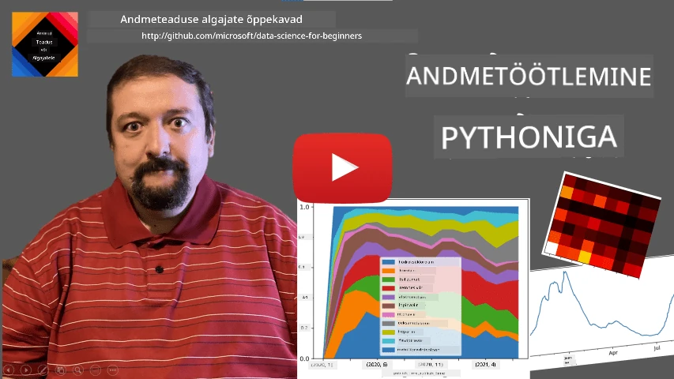
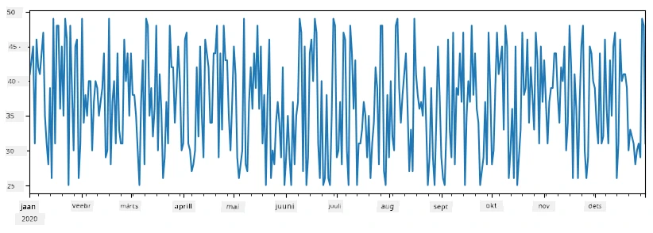
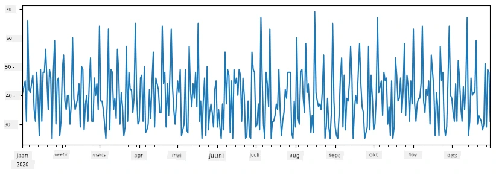
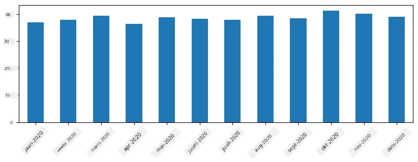
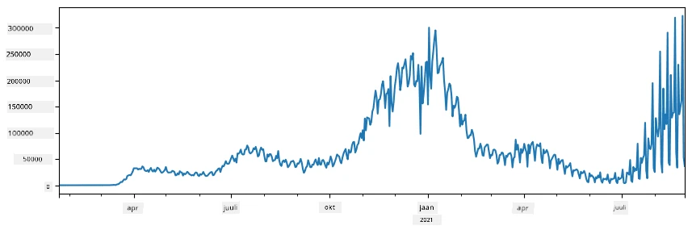
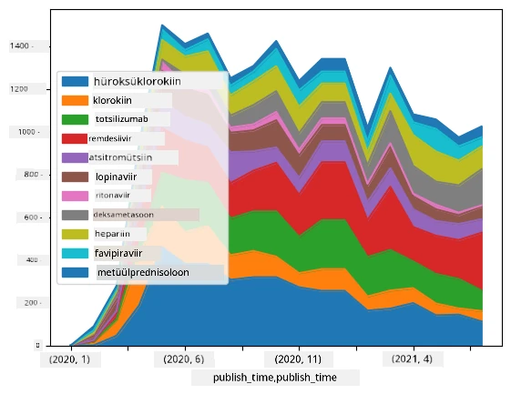

# Andmetega töötamine: Python ja Pandase teek

|  ](../../sketchnotes/07-WorkWithPython.png) |
| :-------------------------------------------------------------------------------------------------------: |
|                 Töötamine Pythoniga - _Sketchnote autoriks [@nitya](https://twitter.com/nitya)_                 |

[](https://youtu.be/dZjWOGbsN4Y)

Kuigi andmebaasid pakuvad väga tõhusaid võimalusi andmete salvestamiseks ja päringute tegemiseks päringukeeles, on andmetöötluse kõige paindlikum viis oma programmi kirjutamine andmete manipuleerimiseks. Paljudel juhtudel on andmebaasi päring tõhusam meetod. Kuid mõnel juhul, kui on vaja keerulisemat andmetöötlust, ei ole see SQL-iga kerge. 
Andmetöötlust saab programmeerida mis tahes programmeerimiskeeles, kuid mõned keeled on kõrgema tasemega andmetöötluse osas. Andmeteadlased eelistavad tavaliselt ühte järgmistest keeltest:

* **[Python](https://www.python.org/)**, üldotstarbeline programmeerimiskeel, mida peetakse sageli üheks parimaks võimaluseks algajatele tänu selle lihtsusele. Pythonil on palju lisaraamatukogusid, mis aitavad lahendada mitmeid praktilisi probleeme, näiteks andmete väljavõtmist ZIP-arhiivist või pildi muundamist halltooniks. Lisaks andmeteadusele kasutatakse Pythoni sageli ka veebiarenduses. 
* **[R](https://www.r-project.org/)** on traditsiooniline tööriistakomplekt, mis on loodud statistilise andmetöötluse jaoks. Sellel on suur raamatukogude hoidla (CRAN), mis teeb sellest hea valiku andmetöötluseks. Kuid R ei ole üldotstarbeline programmeerimiskeel ja seda kasutatakse harva väljaspool andmeteaduse valdkonda.
* **[Julia](https://julialang.org/)** on veel üks keel, mis on spetsiaalselt arendatud andmeteadusele. Selle eesmärk on pakkuda paremat jõudlust kui Python, muutes selle suurepäraseks tööriistaks teaduslikeks katseteks.

Selles õppetükis keskendume Pythonile lihtsate andmetöötlusülesannete lahendamiseks. Eeldame keele põhiteadmisi. Kui soovite Pythoniga põhjalikumat tutvust teha, võite vaadata üht järgmistest ressurssidest:

* [Õpi Python lõbusal viisil koos kilpkonnagraafika ja fraktaalidega](https://github.com/shwars/pycourse) - GitHubil põhinev kiire sissejuhatus Pythoni programmeerimisse
* [Tee oma esimesed sammud Pythoniga](https://docs.microsoft.com/en-us/learn/paths/python-first-steps/?WT.mc_id=academic-77958-bethanycheum) Õppeteek [Microsoft Learn'is](http://learn.microsoft.com/?WT.mc_id=academic-77958-bethanycheum)

Andmed võivad esineda mitmel kujul. Selles õppetükis käsitleme kolme andmetüüpi - **tabelandmed**, **tekst** ja **pildid**.

Keskendume mõnedel näidete andmetöötlusest, mitte kõigi seotud raamatukogude täielikule ülevaatele. See võimaldab teil saada põhimõtte selgeks, mis on võimalik, ning annab arusaama, kust leida lahendusi probleemidele, kui teil neid vaja on.

> **Kõige kasulikum nõuanne**. Kui peate andmetel sooritama mõne toimingu, mida te ei oska, proovige otsida internetist. [Stackoverflow](https://stackoverflow.com/) sisaldab tavaliselt palju kasulikke näidiskoodide lahendusi Pythonis paljude tüüpiliste ülesannete jaoks. 


## [Eel-loengukomisjon](https://ff-quizzes.netlify.app/en/ds/quiz/12)

## Tabelandmed ja DataFrame'id

Olete juba kohtunud tabelandmetega, kui rääkisime relatsiooniandmebaasidest. Kui teil on palju andmeid, mis paiknevad paljudes erinevates seotud tabelites, on kindlasti mõistlik kasutada SQL-i nende töötlemiseks. Kuid paljudel juhtudel on meil olemas andmetabel, mille põhjal soovime saada mingit **arusaamist** või **teadmisi**, näiteks jaotust, väärtuste korrelatsiooni jne. Andmeteaduses on palju olukordi, kus on vaja teha originaalandmete transformatsioone, millele järgneb visualiseerimine. Mõlemad sammud saab hõlpsasti teha Pythoniga.

Pythoni kõige kasulikumad teegid tabelandmetega töötamiseks on:
* **[Pandas](https://pandas.pydata.org/)** võimaldab teil manipuleerida nn **DataFrame'idega**, mis on analoogsed relatsioonitabelitele. Saate nimega veerge ning teha erinevaid operatsioone ridade, veergude ja andmeraamidega üldiselt. 
* **[Numpy](https://numpy.org/)** on teek, mis on mõeldud **tensooridega** töötamiseks, st mitmemõõtmeliste **massiividega**. Massiiv sisaldab sama andmetüübiga väärtusi ning on lihtsam kui DataFrame, kuid pakub rohkem matemaatilisi operatsioone ning tekitab vähem lisakulu.

On ka paar muud teeki, mida tasub teada:
* **[Matplotlib](https://matplotlib.org/)** on teek andmete visualiseerimiseks ja graafikute joonistamiseks
* **[SciPy](https://www.scipy.org/)** on teek mõnede lisateaduslike funktsioonidega. Oleme sellele juba varem tähelepanu pööranud tõenäosuse ja statistika teemas.

Järgmine koodilõik on tüüpiline viis nende teekide importimiseks Pythoni programmi alguses:
```python
import numpy as np
import pandas as pd
import matplotlib.pyplot as plt
from scipy import ... # peate täpsustama täpsed alam-paketid, mida vajate
``` 

Pandas põhineb mõnel põhimõttel.

### Seeria (Series)

**Series** on väärtuste jada, sarnane listile või numpy massiivile. Peamine erinevus on see, et series'il on ka **indeks**, ning kui me töötleme series (nt liitmisel), võetakse indeks arvesse. Indeks võib olla niisama lihtne kui täisarvuline rea number (see on vaikimisi indeks, mis lisatakse listist või massiivist series'i loomisel), või keerukam struktuur, näiteks kuupaeva intervall.

> ** Märkus**: Saate tutvuda mõningate Pandas'i algkoodinäidetega kaasnevas märkmikus [`notebook.ipynb`](notebook.ipynb). Me toome siin vaid mõned näited ning kindlasti on soovitatav vaadata kogu märkmikku.

Vaatame näidet: soovime analüüsida oma jäätisekohviku müüki. Genereerime müüginumbrite seeria (iga päev müüdud kaupade arv) mingiks ajavahemikuks:

```python
start_date = "Jan 1, 2020"
end_date = "Mar 31, 2020"
idx = pd.date_range(start_date,end_date)
print(f"Length of index is {len(idx)}")
items_sold = pd.Series(np.random.randint(25,50,size=len(idx)),index=idx)
items_sold.plot()
```


Oletame nüüd, et iga nädal korraldame sõpradele peo ning võtame lisaks veel 10 pakki jäätist kaasa. Selleks loome teise seeria, mille indeksiks on nädal, et seda näidata:
```python
additional_items = pd.Series(10,index=pd.date_range(start_date,end_date,freq="W"))
```
Kui liidame kaks seeriat, saame koguarvu:
```python
total_items = items_sold.add(additional_items,fill_value=0)
total_items.plot()
```


> **Tähelepanu**: me ei kasuta lihtsat süntaksit `total_items+additional_items`. Kui oleksime, oleks tulemuseks palju `NaN` (*Not a Number*) väärtusi seerias. Põhjus on selles, et some indeksikohtades `additional_items` seerias väärtusi puudub, ning `NaN` lisamine millelegi annab tulemuseks `NaN`. Seetõttu tuleb liitmisel kasutada `fill_value` parameetrit.

Ajaseeria puhul saame ka **ümberproovida** ehk resample'ida seeriat erinevate ajavahemikega. Näiteks soovime arvutada keskmist müügitulemust kuude kaupa. Selleks kasutame järgmist koodi:
```python
monthly = total_items.resample("1M").mean()
ax = monthly.plot(kind='bar')
```


### DataFrame

DataFrame on sisuliselt kooslus samade indeksitega seeriatest. Võime mitme serie ühendada DataFrame-ks:
```python
a = pd.Series(range(1,10))
b = pd.Series(["I","like","to","play","games","and","will","not","change"],index=range(0,9))
df = pd.DataFrame([a,b])
```
See loob horisontaalse tabeli kujul:
|     | 0   | 1    | 2   | 3   | 4      | 5   | 6      | 7    | 8    |
| --- | --- | ---- | --- | --- | ------ | --- | ------ | ---- | ---- |
| 0   | 1   | 2    | 3   | 4   | 5      | 6   | 7      | 8    | 9    |
| 1   | I   | like | to  | use | Python | and | Pandas | very | much |

Võime kasutada ka Series veergudena ning määrata veergude nimetused sõnastiku abil:
```python
df = pd.DataFrame({ 'A' : a, 'B' : b })
```
See annab meile sellise tabeli:

|     | A   | B      |
| --- | --- | ------ |
| 0   | 1   | I      |
| 1   | 2   | like   |
| 2   | 3   | to     |
| 3   | 4   | use    |
| 4   | 5   | Python |
| 5   | 6   | and    |
| 6   | 7   | Pandas |
| 7   | 8   | very   |
| 8   | 9   | much   |

**Märkus**: Saame ka eelmist tabelit ümber pöörata (transpose), et saada sama tabelipaigutus, nt selliselt:
```python
df = pd.DataFrame([a,b]).T.rename(columns={ 0 : 'A', 1 : 'B' })
```
Siin `.T` tähendab DataFrame'i transposeerimist ehk ridade ja veergude vahetust ning `rename` meetod lubab veerge nimetada vastavalt eelnevale näitele.

Järgnevalt mõned tähtsamad operatsioonid, mida saame DataFrame'idel sooritada:

**Veergude valik**. Saame valida üksikuid veerge kirjutades `df['A']` - see tagastab Series'i. Võime valida veergude alamkomplekti teise DataFrame'i saamiseks kirjutades `df[['B','A']]` - see annab teise DataFrame'i.

**Ridade filtreerimine** vastavalt tingimustele. Näiteks, et jätta alles ainult read, kus veeru `A` väärtus on suurem kui 5, kirjutame `df[df['A']>5]`.

> **Märkus**: Filtreerimine töötab järgmiselt. Avaldis `df['A']<5` tagastab tõeväärtusteseeria (boolean series), mis näitab iga algse `df['A']` elemendi kohta, kas avaldis on `True` või `False`. Kui tõeväärtusteseeria on indeksina, tagastab see DataFrame'i ridade alamkogumi. Seetõttu ei saa kasutada suvalist Python'i tõeväärtuslikku avaldist - näiteks `df[df['A']>5 and df['A']<7]` oleks vale. Selle asemel tuleks kasutada spetsiaalset `&` operaatorit tõeväärtusteseeriate vahel, kirjutades `df[(df['A']>5) & (df['A']<7)]` (*hoolitsege sulgude eest*).

**Uute arvutatavate veergude loomine**. Saame hõlpsasti luua DataFrame'i uusi arvutatavaid veerge intuitiivsete avaldiste abil:
```python
df['DivA'] = df['A']-df['A'].mean() 
``` 
See näide arvutab A hälbe selle keskmisest väärtusest. Tegelikult arvutame series'i ja määrame selle vasakpoolsesse ossa, luues uue veeru. Seetõttu ei saa kasutada operatsioone, mis ei sobi series'iga - näiteks järgmine kood on vale:
```python
# Vale kood -> df['ADescr'] = "Madal" kui df['A'] < 5 muidu "Kõrge"
df['LenB'] = len(df['B']) # <- Vale tulemus
``` 
Viimane näide, kuigi süntaktiliselt korrektne, annab vale tulemuse, sest see määrab veeru kõigile väärtustele `B` pikkuse asemel iga üksiku elemendi pikkuse.

Kui vaja arvutada keerukamaid avaldisi, võime kasutada `apply` funktsiooni. Viimane näide on kirjutatav nii:
```python
df['LenB'] = df['B'].apply(lambda x : len(x))
# või
df['LenB'] = df['B'].apply(len)
```

Ülaltoodud operatsioonide tulemusena saame järgmise DataFrame'i:

|     | A   | B      | DivA | LenB |
| --- | --- | ------ | ---- | ---- |
| 0   | 1   | I      | -4.0 | 1    |
| 1   | 2   | like   | -3.0 | 4    |
| 2   | 3   | to     | -2.0 | 2    |
| 3   | 4   | use    | -1.0 | 3    |
| 4   | 5   | Python | 0.0  | 6    |
| 5   | 6   | and    | 1.0  | 3    |
| 6   | 7   | Pandas | 2.0  | 6    |
| 7   | 8   | very   | 3.0  | 4    |
| 8   | 9   | much   | 4.0  | 4    |

**Rea valik numbrite järgi** on tehtav `iloc` konstruktsiooni abil. Näiteks esimese 5 rea valimiseks DataFrame'ist:
```python
df.iloc[:5]
```

**Rühmitamine** kasutatakse sageli tulemuste saamiseks, mis sarnanevad Exceli pöörd- või ristsummatabelitega. Oletame, et soovime arvutada veeru `A` keskmise väärtuse iga `LenB` väärtuse jaoks. Sel juhul rühmitame DataFrame'i `LenB` kaupa ja kutsume `mean` funktsiooni:
```python
df.groupby(by='LenB')[['A','DivA']].mean()
```
Kui soovime arvutada nii keskmist kui ka grupi elementide arvu, saame kasutada keerulisemat `aggregate` funktsiooni:
```python
df.groupby(by='LenB') \
 .aggregate({ 'DivA' : len, 'A' : lambda x: x.mean() }) \
 .rename(columns={ 'DivA' : 'Count', 'A' : 'Mean'})
```
See annab järgmise tabeli:

| LenB | Count | Mean     |
| ---- | ----- | -------- |
| 1    | 1     | 1.000000 |
| 2    | 1     | 3.000000 |
| 3    | 2     | 5.000000 |
| 4    | 3     | 6.333333 |
| 6    | 2     | 6.000000 |

### Andmete hankimine


Oleme näinud, kui lihtne on luua Series ja DataFrame’id Python objektidest. Andmed tulevad aga tavaliselt tekstifaili või Exceli tabeli kujul. Õnneks pakub Pandas lihtsat moodust andmete laadimiseks kettalt. Näiteks CSV faili lugemine on sedavõrd lihtne:
```python
df = pd.read_csv('file.csv')
```
Veel näiteid andmete laadimisest, sealhulgas nende allalaadimisest väljastpoolt veebisaidilt, näeme jaotises "Challenge"


### Trükkimine ja joonistamine

Andmeteadlane peab tihti andmeid uurima, seega on oluline neid visualiseerida. Kui DataFrame on suur, tahame tihti lihtsalt veenduda, et kõik on tehtud õigesti, trükkides välja esimesed read. Selleks kutsutakse `df.head()`. Kui kasutate Jupyter Notebooki, trükitakse DataFrame kena tabelina.

Oleme näinud ka `plot` funktsiooni kasutamist veergude visualiseerimiseks. Kuigi `plot` on paljuülesannetes väga kasulik ning toetab paljusid graafikutüüpe läbi `kind=` parameetri, saate alati kasutada ka puhtalt `matplotlib` teeki keerukamate jooniste tegemiseks. Andmete visualiseerimist käsitleme põhjalikumalt eraldi kursuse õppetundides.

See ülevaade katab Pandase olulisemad mõisted, kuid teek on väga mahukas ja võimalused peaaegu piiramatud! Rakendame nüüd seda teadmist konkreetse probleemi lahendamiseks.

## 🚀 Väljakutse 1: COVID leviku analüüs

Esimene probleem on COVID-19 epideemia leviku modelleerimine. Selleks kasutame nakkusjuhtumite arvu andmeid erinevates riikides, mida pakub [Center for Systems Science and Engineering](https://systems.jhu.edu/) (CSSE) [Johns Hopkinsi Ülikoolis](https://jhu.edu/). Andmestik on kättesaadav [selles GitHubi hoidlas](https://github.com/CSSEGISandData/COVID-19).

Kuna tahame demonstreerida, kuidas andmetega töötada, kutsume teid avama [`notebook-covidspread.ipynb`](notebook-covidspread.ipynb) ja lugema seda põhjalikult. Samuti saate teostada lahtrite käivitamist ja proovida paar väljakutset, mille oleme teile lõppu jätnud.



> Kui te ei tea, kuidas Jupyter Notebookis koodi käivitada, vaadake [seda artiklit](https://soshnikov.com/education/how-to-execute-notebooks-from-github/).

## Töötamine struktureerimata andmetega

Kuigi andmed tulevad väga sageli tabelina, peame mõnikord tegelema vähem struktureeritud andmetega, näiteks tekstide või piltidega. Sellisel juhul, et kasutada andmetöötlusmeetodeid, mida oleme ülal näinud, peame kuidagi **ekstraheerima** struktureeritud andmed. Siin on mõned näited:

* Märksõnade ekstraheerimine tekstist ja nende esinemissageduse analüüs
* Neuraalvõrkude kasutamine objektide info ekstraheerimiseks piltidelt
* Emotsioonide tuvastamine inimeste kohta videosalvestusel

## 🚀 Väljakutse 2: COVID teadusartiklite analüüs

Selles väljakutses jätkame COVID pandeemia teemaga ja keskendume teadusartiklite töötlemisele sellel teemal. Olemas on [CORD-19 andmestik](https://www.kaggle.com/allen-institute-for-ai/CORD-19-research-challenge), mis sisaldab rohkem kui 7000 (kirjutamise hetkel) COVIDi kohta artiklit koos metaandmete ja kokkuvõtetega (ja umbes poole artiklite puhul ka täisteksti).

Näide selle andmekogumi analüüsimisest kasutades [Text Analytics for Health](https://docs.microsoft.com/azure/cognitive-services/text-analytics/how-tos/text-analytics-for-health/?WT.mc_id=academic-77958-bethanycheum) kognitiivset teenust on kirjeldatud [selles blogipostituses](https://soshnikov.com/science/analyzing-medical-papers-with-azure-and-text-analytics-for-health/). Me käsitleme selle analüüsi lihtsustatud versiooni.

> **MÄRKUS**: Me ei paku selle hoidla osana andmestiku koopiat. Võite esmalt alla laadida [`metadata.csv`](https://www.kaggle.com/allen-institute-for-ai/CORD-19-research-challenge?select=metadata.csv) faili [selle andmestiku lehelt Kaggle’is](https://www.kaggle.com/allen-institute-for-ai/CORD-19-research-challenge). Võib-olla peate registreeruma Kaggle’is. Andmestikku saab registreerumiseta alla laadida ka [siit](https://ai2-semanticscholar-cord-19.s3-us-west-2.amazonaws.com/historical_releases.html), kuid seal on lisaks metaandmetele ka kõik täistekstid.

Avage [`notebook-papers.ipynb`](notebook-papers.ipynb) ja lugege see põhjalikult läbi. Samuti saate käivitada lahtrid ja katsetada mõningaid teile jäetud väljakutseid lõpus.



## Pildiadmete töötlemine

Hiljuti on arendatud väga võimsaid tehisintellekti mudeleid, mis aitavad meil pilte mõista. Paljud ülesanded lahendatakse eelnevalt treenitud neuraalvõrkude või pilveteenuste abil. Mõned näited:

* **Pildiklassifikatsioon**, mis aitab kategooriseerida pilti üheks etteantud klassist. Oma pildiklassifikaatoreid saab hõlpsasti treenida teenuste abil, nagu [Custom Vision](https://azure.microsoft.com/services/cognitive-services/custom-vision-service/?WT.mc_id=academic-77958-bethanycheum)
* **Objektituvastus**, mis tuvastab pildil erinevaid objekte. Teenused nagu [computer vision](https://azure.microsoft.com/services/cognitive-services/computer-vision/?WT.mc_id=academic-77958-bethanycheum) tuvastavad hulga levinud objekte, ning [Custom Vision](https://azure.microsoft.com/services/cognitive-services/custom-vision-service/?WT.mc_id=academic-77958-bethanycheum) mudelit saab treenida teatud huvipakkuvate objektide leidmiseks.
* **Nähtuvus** – vanuse, soo ja emotsiooni tuvastamine näolt. Seda saab teha [Face API](https://azure.microsoft.com/services/cognitive-services/face/?WT.mc_id=academic-77958-bethanycheum) abil.

Kõiki neid pilveteenuseid saab kasutada [Python SDK-de](https://docs.microsoft.com/samples/azure-samples/cognitive-services-python-sdk-samples/cognitive-services-python-sdk-samples/?WT.mc_id=academic-77958-bethanycheum) kaudu ning neid on kerge kaasata oma andmeuurimise töövoogu.

Siin on mõned näited pildiallikatest andmete uurimisest:
* Blogipostituses [Kuidas õppida andmeteadust ilma kodeerimata](https://soshnikov.com/azure/how-to-learn-data-science-without-coding/) uurime Instagrami fotosid, et mõista, mis paneb inimesi fotot rohkem laikima. Ekstraheerime piltidelt võimalikult palju informatsiooni kasutades [computer vision](https://azure.microsoft.com/services/cognitive-services/computer-vision/?WT.mc_id=academic-77958-bethanycheum) teenust ja seejärel kasutame [Azure Machine Learning AutoML](https://docs.microsoft.com/azure/machine-learning/concept-automated-ml/?WT.mc_id=academic-77958-bethanycheum), et ehitada interpreteeritav mudel.
* [Facial Studies Workshop](https://github.com/CloudAdvocacy/FaceStudies) kasutab [Face API](https://azure.microsoft.com/services/cognitive-services/face/?WT.mc_id=academic-77958-bethanycheum) inimeste emotsioonide ekstraheerimiseks sündmuste ajal tehtud fotodel, et püüda mõista, mis teeb inimesed õnnelikuks.

## Kokkuvõte

Olenemata sellest, kas sul on struktureeritud või struktureerimata andmed, saad Pythoniga teha kõik andmete töötlemise ja mõistmise sammud. See on tõenäoliselt kõige paindlikum viis andmetöötluseks ja seetõttu kasutab enamus andmeteadlasi just Pythonit esmatööriistana. Python’i süvitsi õppimine on hea mõte, kui oled tõsiselt oma andmeteaduse teekonnaga!

## [Lektuuri järgne test](https://ff-quizzes.netlify.app/en/ds/quiz/13)

## Kordamine ja iseseisev õppimine

**Raamatud**
* [Wes McKinney. Python for Data Analysis: Data Wrangling with Pandas, NumPy, and IPython](https://www.amazon.com/gp/product/1491957662)

**Veebiallikaid**
* Ametlik [10 minutit Pandasega](https://pandas.pydata.org/pandas-docs/stable/user_guide/10min.html) juhend
* [Dokumentatsioon Pandase visualiseerimise kohta](https://pandas.pydata.org/pandas-docs/stable/user_guide/visualization.html)

**Python õppimine**
* [Õpi Pythoni lõbusal moel koos kilpkonnagraafika ja fraktaalidega](https://github.com/shwars/pycourse)
* [Astuge esimesed sammud Pythoniga](https://docs.microsoft.com/learn/paths/python-first-steps/?WT.mc_id=academic-77958-bethanycheum) õppeteek Microsoft Learn’is [http://learn.microsoft.com/?WT.mc_id=academic-77958-bethanycheum](http://learn.microsoft.com/?WT.mc_id=academic-77958-bethanycheum)

## Ülesanne

[Tee põhjalikumat andmeanalüüsi ülaltoodud väljakutsetele](assignment.md)

## Tunnustused

Selle õppetunni autor on ♥️ [Dmitry Soshnikov](http://soshnikov.com)

---

<!-- CO-OP TRANSLATOR DISCLAIMER START -->
**Lahtiütlus**:
See dokument on tõlgitud kasutades AI tõlketeenust [Co-op Translator](https://github.com/Azure/co-op-translator). Kuigi me püüdleme täpsuse poole, palun pange tähele, et automatiseeritud tõlgetes võib esineda vigu või ebatäpsusi. Originaaldokument selle emakeeles tuleks pidada autoriteetseks allikaks. Olulise teabe puhul soovitatakse kasutada professionaalset inimtõlget. Me ei vastuta selle tõlkega seotud eksimustest või valesti mõistmistest.
<!-- CO-OP TRANSLATOR DISCLAIMER END -->