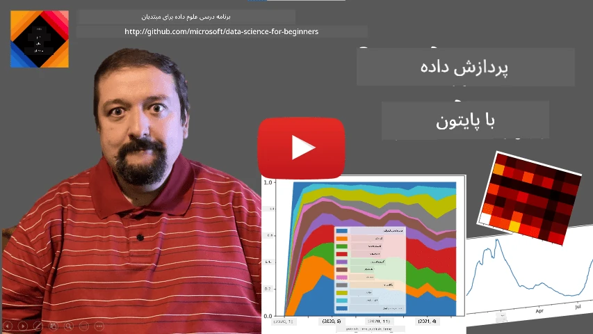
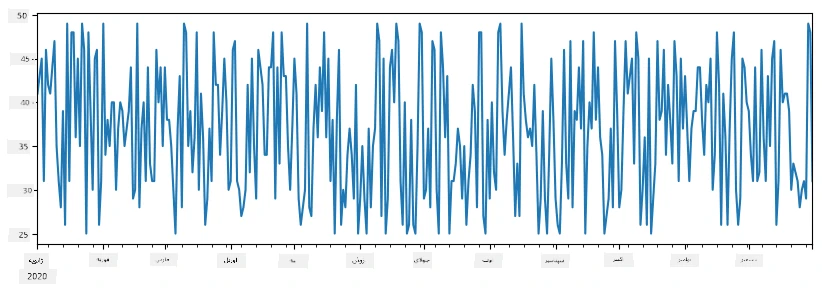
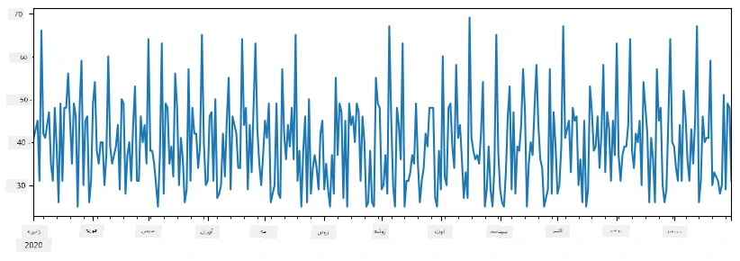
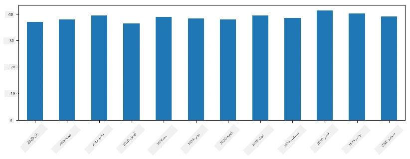
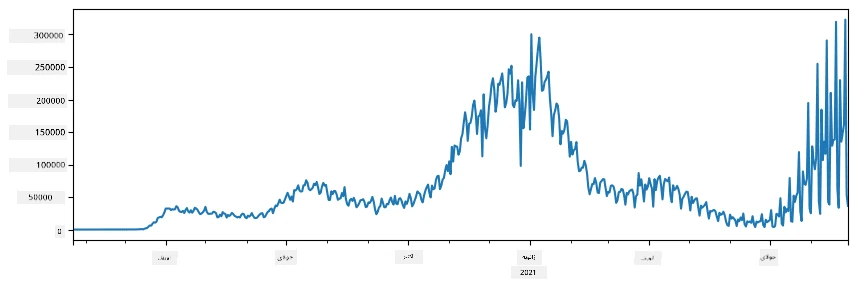
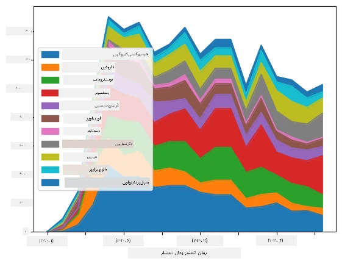

# کار با داده‌ها: پایتون و کتابخانهٔ پاندا

|  ](../../sketchnotes/07-WorkWithPython.png) |
| :-------------------------------------------------------------------------------------------------------: |
|                  کار با پایتون - _نقاشی اسکچ توسط [@nitya](https://twitter.com/nitya)_                   |

[](https://youtu.be/dZjWOGbsN4Y)

در حالی که پایگاه‌داده‌ها روش‌های بسیار مؤثری برای ذخیره‌سازی داده‌ها و پرسش آنها با استفاده از زبان‌های پرس‌وجو ارائه می‌دهند، انعطاف‌پذیرترین روش پردازش داده، نوشتن برنامهٔ خودتان برای دستکاری داده‌ها است. در بسیاری موارد، اجرای پرس‌وجوی پایگاه‌داده روشی مؤثرتر خواهد بود. اما در مواردی که پردازش داده‌های پیچیده‌تر لازم است، این کار به آسانی با SQL امکان‌پذیر نیست.
پردازش داده‌ها را می‌توان در هر زبان برنامه‌نویسی انجام داد، اما زبان‌هایی وجود دارند که سطح بالاتری از نظر کار با داده‌ها دارند. دانشمندان داده معمولاً یکی از زبان‌های زیر را ترجیح می‌دهند:

* **[پایتون](https://www.python.org/)**، یک زبان برنامه‌نویسی عمومی است که اغلب به دلیل سادگی‌اش به عنوان یکی از بهترین گزینه‌ها برای مبتدیان در نظر گرفته می‌شود. پایتون کتابخانه‌های اضافی زیادی دارد که می‌تواند به شما در حل بسیاری از مشکلات عملی کمک کند، مانند استخراج داده‌های شما از آرشیو ZIP یا تبدیل تصویر به خاکستری. علاوه بر علم داده، پایتون اغلب برای توسعهٔ وب نیز استفاده می‌شود.
* **[آر](https://www.r-project.org/)** جعبه‌ابزار سنتی است که برای پردازش داده‌های آماری توسعه یافته است. این زبان همچنین شامل مخزن بزرگی از کتابخانه‌ها (CRAN) است که آن را گزینهٔ خوبی برای پردازش داده می‌کند. با این حال، آر یک زبان برنامه‌نویسی عمومی نیست و معمولاً خارج از حوزه علم داده استفاده نمی‌شود.
* **[جولیا](https://julialang.org/)** زبان دیگری است که مخصوص علم داده توسعه یافته است. هدف آن ارائه عملکرد بهتر نسبت به پایتون است و ابزاری عالی برای آزمایش‌های علمی محسوب می‌شود.

در این درس، تمرکز ما بر استفاده از پایتون برای پردازش ساده داده‌ها خواهد بود. فرض می‌کنیم آشنایی پایه با زبان دارید. اگر می‌خواهید سفری عمیق‌تر در پایتون داشته باشید، می‌توانید به یکی از منابع زیر مراجعه کنید:

* [یادگیری پایتون به روشی سرگرم‌کننده با گرافیک لاک‌پشتی و فراکتال‌ها](https://github.com/shwars/pycourse) - دورهٔ سریع معرفی Python Programming در گیت‌هاب
* [قدم‌های اول خود را با پایتون بردارید](https://docs.microsoft.com/en-us/learn/paths/python-first-steps/?WT.mc_id=academic-77958-bethanycheum) مسیر یادگیری در [Microsoft Learn](http://learn.microsoft.com/?WT.mc_id=academic-77958-bethanycheum)

داده‌ها می‌توانند اشکال مختلفی داشته باشند. در این درس، سه شکل داده را بررسی خواهیم کرد - **داده‌های جدولی**، **متن** و **تصاویر**.

ما بر چند مثال از پردازش داده تمرکز خواهیم کرد، به جای اینکه به مرور کامل تمام کتابخانه‌های مرتبط بپردازیم. این کار به شما اجازه می‌دهد ایدهٔ اصلی ممکن‌ها را درک کنید و بدانید وقتی به راه‌حل‌های مشکل‌تان نیاز دارید، کجا باید جستجو کنید.

> **مفیدترین توصیه**. وقتی نیاز دارید عملی روی داده انجام دهید که نمی‌دانید چگونه، سعی کنید در اینترنت جستجو کنید. [Stackoverflow](https://stackoverflow.com/) معمولاً نمونه‌های کد زیادی در پایتون برای بسیاری از کارهای متداول دارد.


## [آزمون پیش‌کلاس](https://ff-quizzes.netlify.app/en/ds/quiz/12)

## داده‌های جدولی و دیتا‌فریم‌ها

زمانی که دربارهٔ پایگاه‌داده‌های رابطه‌ای صحبت کردیم، با داده‌های جدولی آشنا شدید. وقتی حجم بسیاری از داده دارید و این داده‌ها در جداول زیادی مرتبط شده هستند، استفاده از SQL برای کار با آنها منطقی است. اما موارد زیادی وجود دارد که یک جدول داده داریم و نیاز داریم دربارهٔ این داده‌ها **درک** یا **بینش**ی کسب کنیم، مثل توزیع داده‌ها، همبستگی بین مقادیر و غیره. در علم داده، موارد زیادی وجود دارد که باید بعضی تبدیل‌های داده اصلی انجام شود و سپس تجسم داده صورت گیرد. هر دو این مراحل به سادگی با پایتون قابل انجام هستند.

دو کتابخانهٔ بسیار مفید در پایتون هستند که می‌توانند به شما در کار با داده‌های جدولی کمک کنند:
* **[پاندا](https://pandas.pydata.org/)** به شما اجازه می‌دهد داده‌های به نام **دیتافریم‌ها** را دستکاری کنید، که معادل جداول رابطه‌ای هستند. می‌توانید ستون‌های نام‌گذاری شده داشته باشید و عملیات متفاوتی روی ردیف‌ها، ستون‌ها و دیتا‌فریم به طور کلی انجام دهید.
* **[نامپای](https://numpy.org/)** کتابخانه‌ای برای کار با **تنسورها** یا همان آرایه‌های چندبعدی است. آرایه‌ها مقادیری از یک نوع داده زیرین دارند و نسبت به دیتا‌فریم ساده‌تر هستند، ولی عملیات ریاضی بیشتری ارائه می‌دهند و سربار کمتری دارند.

همچنین چند کتابخانه دیگر که باید با آنها آشنا باشید:
* **[مت‌پلات‌لیب](https://matplotlib.org/)** کتابخانه‌ای برای تجسم داده و رسم نمودارها است.
* **[سای‌پای](https://www.scipy.org/)** کتابخانه‌ای با برخی توابع علمی اضافی است. ما قبلاً هنگام صحبت درباره احتمال و آمار با این کتابخانه آشنا شده‌ایم.

در اینجا کدی آمده که معمولاً در ابتدای برنامه پایتون برای وارد کردن این کتابخانه‌ها استفاده می‌شود:
```python
import numpy as np
import pandas as pd
import matplotlib.pyplot as plt
from scipy import ... # شما باید زیربسته‌های دقیقی که نیاز دارید را مشخص کنید
``` 

پاندا حول چند مفهوم پایه‌ای می‌چرخد.

### سری‌ها (Series)

**سری** توالی‌ای از مقادیر است، مشابه یک لیست یا آرایهٔ نامپای. تفاوت اصلی این است که سری همچنین یک **شاخص** دارد و هنگام عملیات روی سری (مثلاً جمع‌شان) شاخص در نظر گرفته می‌شود. شاخص می‌تواند به سادگی شماره ردیف عدد صحیح باشد (که به‌طور پیش‌فرض هنگام ایجاد سری از لیست یا آرایه استفاده می‌شود)، یا ساختار پیچیده‌تری مثل بازه زمانی داشته باشد.

> **توجه**: مقدمه‌ای بر کد پاندا در دفترکار همرا با این درس [`notebook.ipynb`](notebook.ipynb) آمده است. ما فقط چند مثال را اینجا شرح می‌دهیم و شما قطعاً می‌توانید دفترکار کامل را بررسی کنید.

مثالی در نظر بگیرید: می‌خواهیم فروش فروشگاه بستنی‌فروشی خود را تحلیل کنیم. بیایید سری‌ای از اعداد فروش (تعداد آیتم‌های فروخته شده در هر روز) برای دورهٔ زمانی مشخصی تولید کنیم:

```python
start_date = "Jan 1, 2020"
end_date = "Mar 31, 2020"
idx = pd.date_range(start_date,end_date)
print(f"Length of index is {len(idx)}")
items_sold = pd.Series(np.random.randint(25,50,size=len(idx)),index=idx)
items_sold.plot()
```


حال فرض کنید هر هفته مهمانی‌ای برای دوستان برگزار می‌کنیم و ده بسته بستنی اضافی برای مهمانی می‌آوریم. می‌توانیم سری دیگری با شاخص هفته بسازیم تا این موضوع را نشان دهیم:
```python
additional_items = pd.Series(10,index=pd.date_range(start_date,end_date,freq="W"))
```
وقتی دو سری را به هم اضافه کنیم، مجموع تعداد را خواهیم داشت:
```python
total_items = items_sold.add(additional_items,fill_value=0)
total_items.plot()
```


> **توجه** ما از نوشتار ساده `total_items+additional_items` استفاده نمی‌کنیم. اگر این کار را انجام می‌دادیم، تعداد زیادی مقدار `NaN` (*عدد نیست*) در سری نتیجه داشتیم. این به این دلیل است که در سری `additional_items` برخی از نقاط شاخص مقدار ندارند و افزودن `NaN` به هر چیزی نتیجه `NaN` می‌دهد. بنابراین باید در عملیات جمع، پارامتر `fill_value` را مشخص کنیم.

با سری‌های زمانی می‌توانیم سری را با بازه‌های زمانی متفاوت **نمونه‌برداری مجدد (resample)** کنیم. مثلاً فرض کنید می‌خواهیم میانگین حجم فروش ماهانه را محاسبه کنیم. می‌توانیم از کد زیر استفاده کنیم:
```python
monthly = total_items.resample("1M").mean()
ax = monthly.plot(kind='bar')
```


### دیتا‌فریم (DataFrame)

دیتا‌فریم در واقع مجموعه‌ای از سری‌ها با همان شاخص است. می‌توانیم چند سری را با هم ترکیب کنیم تا یک دیتا‌فریم بسازیم:
```python
a = pd.Series(range(1,10))
b = pd.Series(["I","like","to","play","games","and","will","not","change"],index=range(0,9))
df = pd.DataFrame([a,b])
```
این یک جدول افقی مانند زیر ایجاد خواهد کرد:
|     | 0   | 1    | 2   | 3   | 4      | 5   | 6      | 7    | 8    |
| --- | --- | ---- | --- | --- | ------ | --- | ------ | ---- | ---- |
| 0   | 1   | 2    | 3   | 4   | 5      | 6   | 7      | 8    | 9    |
| 1   | من  | دوست | دارم | از  | پایتون | و   | پاندا  | خیلی | زیاد |

همچنین می‌توانیم از سری‌ها به عنوان ستون‌ها استفاده کنیم و نام ستون‌ها را با استفاده از دیکشنری مشخص کنیم:
```python
df = pd.DataFrame({ 'A' : a, 'B' : b })
```
این یک جدول با این شکل خواهد داد:

|     | A   | B      |
| --- | --- | ------ |
| 0   | 1   | من     |
| 1   | 2   | دوست    |
| 2   | 3   | دارم    |
| 3   | 4   | از      |
| 4   | 5   | پایتون  |
| 5   | 6   | و       |
| 6   | 7   | پاندا   |
| 7   | 8   | خیلی    |
| 8   | 9   | زیاد    |

**توجه** که می‌توانیم این چینش جدول را نیز با ترانهاده کردن جدول قبلی به دست آوریم، مثلاً با نوشتن
```python
df = pd.DataFrame([a,b]).T.rename(columns={ 0 : 'A', 1 : 'B' })
```
در اینجا `.T` به معنی عملیات ترانهاده کردن دیتا‌فریم است، یعنی جابجایی ردیف‌ها و ستون‌ها، و عملیات `rename` به ما اجازه می‌دهد ستون‌ها را مطابق مثال قبلی نام‌گذاری کنیم.

چند عملیات مهمی که می‌توانیم روی دیتا‌فریم‌ها انجام دهیم به شرح زیر است:

**انتخاب ستون‌ها**. می‌توانیم ستون‌های منفرد را با نوشتن `df['A']` انتخاب کنیم - این عملیات یک سری باز می‌گرداند. همچنین می‌توانیم زیرمجموعه‌ای از ستون‌ها را به دیتا‌فریم دیگری با نوشتن `df[['B','A']]` انتخاب کنیم - که این هم یک دیتا‌فریم دیگر می‌دهد.

**فیلتر کردن** فقط ردیف‌های مشخص با معیار خاص. مثلاً برای نگه داشتن فقط ردیف‌هایی که ستون `A` بزرگ‌تر از ۵ است، می‌توانیم بنویسیم `df[df['A']>5]`.

> **توجه**: نحوهٔ کار فیلتر کردن به شکل زیر است. عبارت `df['A']<5` یک سری بولی برمی‌گرداند که نشان می‌دهد عبارت برای هر عنصر سری اصلی `df['A']` درست (`True`) یا نادرست (`False`) است. وقتی سری بولی به عنوان شاخص استفاده می‌شود، زیرمجموعه‌ای از ردیف‌های دیتا‌فریم را برمی‌گرداند. بنابراین استفاده از عبارت بولی دلخواه پایتون امکان‌پذیر نیست، به عنوان مثال نوشتن `df[df['A']>5 and df['A']<7]` اشتباه است. بجای آن باید از عملگر ویژه `&` روی سری بولی استفاده کنید، مانند `df[(df['A']>5) & (df['A']<7)]` (*پرانتزها اینجا مهم هستند*).

**ایجاد ستون‌های جدید قابل محاسبه**. به سادگی می‌توانیم ستون‌های جدید قابل محاسبه برای دیتا‌فریم خود بسازیم با نوشتن عبارتی شهودی مانند این:
```python
df['DivA'] = df['A']-df['A'].mean() 
``` 
این مثال واگرایی A از مقدار میانگینش را محاسبه می‌کند. در واقع اینجا ما یک سری را محاسبه می‌کنیم و سپس آن را به سمت چپ انتساب می‌دهیم که در نتیجه یک ستون جدید ساخته می‌شود. بنابراین نمی‌توانیم از عملیات‌هایی استفاده کنیم که با سری سازگار نیستند، مثلاً کد زیر اشتباه است:
```python
# کد اشتباه -> df['ADescr'] = "کم" اگر df['A'] کمتر از ۵ باشد در غیر این صورت "زیاد"
df['LenB'] = len(df['B']) # <- نتیجه اشتباه
``` 
این مثال دوم، هرچند از نظر نوشتاری درست است، نتیجهٔ نادرستی می‌دهد چون طول سری `B` را به تمام مقادیر ستون اختصاص می‌دهد، نه طول عناصر منفرد را همانطور که قصد داشتیم.

اگر نیاز به محاسبهٔ عبارات پیچیده داریم می‌توانیم از تابع `apply` استفاده کنیم. مثال آخر می‌تواند به صورت زیر نوشته شود:
```python
df['LenB'] = df['B'].apply(lambda x : len(x))
# یا
df['LenB'] = df['B'].apply(len)
```

پس از انجام عملیات فوق، دیتا‌فریم زیر حاصل می‌شود:

|     | A   | B      | DivA | LenB |
| --- | --- | ------ | ---- | ---- |
| 0   | 1   | من     | -۴.۰ | ۱    |
| 1   | 2   | دوست   | -۳.۰ | ۴    |
| 2   | 3   | دارم   | -۲.۰ | ۲    |
| 3   | 4   | از     | -۱.۰ | ۳    |
| 4   | 5   | پایتون | ۰.۰  | ۶    |
| 5   | 6   | و      | ۱.۰  | ۳    |
| 6   | 7   | پاندا  | ۲.۰  | ۶    |
| 7   | 8   | خیلی   | ۳.۰  | ۴    |
| 8   | 9   | زیاد   | ۴.۰  | ۴    |

**انتخاب ردیف‌ها بر اساس شماره** می‌تواند با سازه `iloc` انجام شود. مثلاً برای انتخاب ۵ ردیف اول از دیتا‌فریم:
```python
df.iloc[:5]
```

**گروه‌بندی** اغلب برای به دست آوردن نتیجه‌ای مشابه *جداول محوری (pivot)* در اکسل استفاده می‌شود. فرض کنید می‌خواهیم میانگین ستون `A` را برای هر مقدار داده شده از `LenB` محاسبه کنیم. می‌توانیم دیتا‌فریم خود را بر اساس `LenB` گروه‌بندی کنیم و تابع `mean` را فراخوانی کنیم:
```python
df.groupby(by='LenB')[['A','DivA']].mean()
```
اگر بخواهیم میانگین و تعداد عناصر در گروه را به طور همزمان محاسبه کنیم، می‌توانیم از تابع پیچیده‌تر `aggregate` استفاده کنیم:
```python
df.groupby(by='LenB') \
 .aggregate({ 'DivA' : len, 'A' : lambda x: x.mean() }) \
 .rename(columns={ 'DivA' : 'Count', 'A' : 'Mean'})
```
این جدول زیر را به ما می‌دهد:

| LenB | تعداد | میانگین  |
| ---- | ----- | -------- |
| 1    | 1     | ۱.۰۰۰۰۰۰ |
| 2    | 1     | ۳.۰۰۰۰۰۰ |
| 3    | 2     | ۵.۰۰۰۰۰۰ |
| 4    | 3     | ۶.۳۳۳۳۳۳ |
| 6    | 2     | ۶.۰۰۰۰۰۰ |

### دریافت داده‌ها


ما دیده‌ایم که ساختن Series و DataFrame از اشیاء پایتون چقدر آسان است. اما داده‌ها معمولاً به شکل یک فایل متنی یا جدول اکسل هستند. خوشبختانه، Pandas روش ساده‌ای برای بارگذاری داده‌ها از دیسک به ما ارائه می‌دهد. به عنوان مثال، خواندن فایل CSV به همین سادگی است:
```python
df = pd.read_csv('file.csv')
```
مثال‌های بیشتری از بارگذاری داده‌ها، از جمله دریافت آن‌ها از وب‌سایت‌های خارجی، در بخش «چالش» خواهیم دید.


### چاپ و ترسیم نمودار

یک دانشمند داده اغلب باید داده‌ها را بررسی کند، بنابراین توانایی دیداری کردن داده‌ها اهمیت دارد. وقتی DataFrame بزرگ است، اغلب می‌خواهیم فقط مطمئن شویم که همه چیز درست است، با چاپ چند ردیف اول. این کار با فراخوانی `df.head()` انجام می‌شود. اگر از Jupyter Notebook استفاده کنید، این DataFrame را به صورت جدولی زیبا چاپ خواهد کرد.

ما همچنین استفاده از تابع `plot` برای ترسیم برخی ستون‌ها را دیده‌ایم. در حالی که `plot` برای بسیاری از وظایف بسیار مفید است و از انواع مختلف نمودارها از طریق پارامتر `kind=` پشتیبانی می‌کند، شما همیشه می‌توانید از کتابخانه خام `matplotlib` برای ترسیم موارد پیچیده‌تر استفاده کنید. در درس‌های جداگانه درباره مصورسازی داده‌ها به تفصیل صحبت خواهیم کرد.

این مرور کلی مهم‌ترین مفاهیم Pandas را پوشش می‌دهد، با این حال این کتابخانه بسیار غنی است و محدودیتی در کاری که می‌توانید با آن انجام دهید وجود ندارد! بیایید اکنون این دانش را برای حل یک مسئله خاص به کار ببریم.

## 🚀 چالش ۱: تحلیل گسترش COVID

اولین مسئله‌ای که روی آن تمرکز خواهیم کرد مدل‌سازی انتشار اپیدمی COVID-19 است. برای این کار، داده‌های مربوط به تعداد افراد آلوده در کشورهای مختلف را که توسط [مرکز علوم و مهندسی سیستم‌ها](https://systems.jhu.edu/) (CSSE) در [دانشگاه جان هاپکینز](https://jhu.edu/) ارائه شده، استفاده می‌کنیم. مجموعه داده در [این مخزن GitHub](https://github.com/CSSEGISandData/COVID-19) در دسترس است.

از آنجا که می‌خواهیم نشان دهیم چگونه با داده‌ها کار کنیم، شما را دعوت می‌کنیم تا [`notebook-covidspread.ipynb`](notebook-covidspread.ipynb) را باز و از ابتدا تا انتها مطالعه کنید. همچنین می‌توانید سلول‌ها را اجرا کنید و چالش‌هایی را که در پایان باقی گذاشته‌ایم انجام دهید.



> اگر نمی‌دانید چگونه در Jupyter Notebook کد اجرا کنید، نگاهی به [این مقاله](https://soshnikov.com/education/how-to-execute-notebooks-from-github/) بیندازید.

## کار با داده‌های بدون ساختار

اگرچه داده‌ها اغلب به صورت جدولی هستند، در برخی موارد باید با داده‌های کمتر ساختارمند مانند متن یا تصاویر کار کنیم. در این حالت، برای اعمال تکنیک‌های پردازش داده که قبلاً دیدیم، باید به نحوی داده‌های ساختارمند را **استخراج** کنیم. چند مثال در این زمینه:

* استخراج کلمات کلیدی از متن و مشاهده فراوانی آن‌ها
* استفاده از شبکه‌های عصبی برای استخراج اطلاعات در مورد اشیاء در تصویر
* گرفتن اطلاعات درباره احساسات افراد در تصویر ویدئویی دوربین

## 🚀 چالش ۲: تحلیل مقالات COVID

در این چالش، موضوع اپیدمی COVID را ادامه می‌دهیم و روی پردازش مقالات علمی مربوط به این موضوع تمرکز می‌کنیم. مجموعه داده [CORD-19](https://www.kaggle.com/allen-institute-for-ai/CORD-19-research-challenge) شامل بیش از ۷۰۰۰ مقاله (تا زمان نگارش) درباره COVID است که همراه با متادیتا و چکیده‌ها ارائه شده‌اند (و تقریباً برای نیمی از آن‌ها متن کامل نیز موجود است).

یک مثال کامل از تحلیل این مجموعه داده با استفاده از سرویس شناختی [Text Analytics for Health](https://docs.microsoft.com/azure/cognitive-services/text-analytics/how-tos/text-analytics-for-health/?WT.mc_id=academic-77958-bethanycheum) در [این نوشته وبلاگی](https://soshnikov.com/science/analyzing-medical-papers-with-azure-and-text-analytics-for-health/) توضیح داده شده است. ما نسخه ساده‌تر این تحلیل را بررسی خواهیم کرد.

> **توجه**: ما کپی از این مجموعه داده را به عنوان بخشی از این مخزن ارائه نمی‌دهیم. ممکن است ابتدا لازم باشد فایل [`metadata.csv`](https://www.kaggle.com/allen-institute-for-ai/CORD-19-research-challenge?select=metadata.csv) را از [این مجموعه داده در Kaggle](https://www.kaggle.com/allen-institute-for-ai/CORD-19-research-challenge) دانلود کنید. ثبت‌نام در Kaggle ممکن است لازم باشد. همچنین می‌توانید مجموعه داده را بدون ثبت‌نام از [اینجا](https://ai2-semanticscholar-cord-19.s3-us-west-2.amazonaws.com/historical_releases.html) دانلود کنید، اما این فایل شامل تمام متون کامل علاوه بر فایل متادیتا است.

[`notebook-papers.ipynb`](notebook-papers.ipynb) را باز و از ابتدا تا انتها مطالعه کنید. می‌توانید سلول‌ها را اجرا کرده و برخی چالش‌های باقی‌مانده را انجام دهید.



## پردازش داده‌های تصویری

اخیراً مدل‌های هوش مصنوعی قدرتمندی توسعه یافته‌اند که به ما امکان درک تصاویر را می‌دهند. بسیاری از وظایف را می‌توان با استفاده از شبکه‌های عصبی پیش‌آموزش دیده یا خدمات ابری حل کرد. چند مثال عبارتند از:

* **طبقه‌بندی تصویر،** که به شما کمک می‌کند تصویر را در یکی از کلاس‌های از پیش تعریف شده دسته‌بندی کنید. می‌توانید به‌راحتی طبقه‌بندهای تصویر خود را با استفاده از خدماتی مانند [Custom Vision](https://azure.microsoft.com/services/cognitive-services/custom-vision-service/?WT.mc_id=academic-77958-bethanycheum) آموزش دهید
* **تشخیص اشیاء** برای یافتن اشیاء مختلف در تصویر. خدماتی مانند [computer vision](https://azure.microsoft.com/services/cognitive-services/computer-vision/?WT.mc_id=academic-77958-bethanycheum) می‌توانند تعداد زیادی از اشیاء رایج را تشخیص دهند و می‌توانید مدل [Custom Vision](https://azure.microsoft.com/services/cognitive-services/custom-vision-service/?WT.mc_id=academic-77958-bethanycheum) را برای تشخیص برخی اشیاء خاص آموزش دهید.
* **تشخیص چهره،** شامل سن، جنسیت و تشخیص حالت چهره. این کار از طریق [Face API](https://azure.microsoft.com/services/cognitive-services/face/?WT.mc_id=academic-77958-bethanycheum) انجام می‌شود.

همه این خدمات ابری را می‌توان با استفاده از [SDKهای پایتون](https://docs.microsoft.com/samples/azure-samples/cognitive-services-python-sdk-samples/cognitive-services-python-sdk-samples/?WT.mc_id=academic-77958-bethanycheum) فراخوانی کرد و بنابراین به آسانی در گردش کار کاوش داده شما قابل ادغام هستند.

در اینجا چند مثال از کاوش داده‌های منابع تصویری آورده شده است:
* در نوشته بلاگ [چگونه بدون کدنویسی دیتاساینس یاد بگیریم](https://soshnikov.com/azure/how-to-learn-data-science-without-coding/) ما عکس‌های اینستاگرام را بررسی می‌کنیم تا بفهمیم چه چیزی باعث می‌شود مردم عکس را بیشتر لایک کنند. ابتدا بیشترین اطلاعات ممکن را از تصاویر با استفاده از [computer vision](https://azure.microsoft.com/services/cognitive-services/computer-vision/?WT.mc_id=academic-77958-bethanycheum) استخراج می‌کنیم، سپس از [Azure Machine Learning AutoML](https://docs.microsoft.com/azure/machine-learning/concept-automated-ml/?WT.mc_id=academic-77958-bethanycheum) برای ساخت مدل قابل تفسیر استفاده می‌کنیم.
* در [کارگاه مطالعات چهره](https://github.com/CloudAdvocacy/FaceStudies) از [Face API](https://azure.microsoft.com/services/cognitive-services/face/?WT.mc_id=academic-77958-bethanycheum) برای استخراج احساسات افراد در عکس‌های رویدادها استفاده می‌کنیم تا بفهمیم چه چیزی انسان‌ها را شاد می‌کند.

## نتیجه‌گیری

چه داده‌های ساختارمند داشته باشید و چه داده‌های غیرساختارمند، با استفاده از پایتون می‌توانید تمام مراحل مربوط به پردازش و درک داده‌ها را انجام دهید. احتمالاً این انعطاف‌پذیرترین روش پردازش داده است و به همین دلیل است که اکثر دانشمندان داده پایتون را به عنوان ابزار اصلی خود انتخاب می‌کنند. یادگیری عمیق پایتون احتمالاً ایده خوبی است اگر قصد دارید در مسیر داده‌کاوی جدی باشید!

## [آزمون پس از درس](https://ff-quizzes.netlify.app/en/ds/quiz/13)

## بازبینی و خودآموزی

**کتاب‌ها**
* [Wes McKinney. Python for Data Analysis: Data Wrangling with Pandas, NumPy, and IPython](https://www.amazon.com/gp/product/1491957662)

**منابع آنلاین**
* آموزش رسمی [۱۰ دقیقه با Pandas](https://pandas.pydata.org/pandas-docs/stable/user_guide/10min.html)
* [مستندات درباره مصورسازی در Pandas](https://pandas.pydata.org/pandas-docs/stable/user_guide/visualization.html)

**یادگیری پایتون**
* [یادگیری پایتون به روشی سرگرم‌کننده با گرافیک لاک‌پشتی و فراکتال‌ها](https://github.com/shwars/pycourse)
* [گام‌های اولیه خود را با پایتون بردارید](https://docs.microsoft.com/learn/paths/python-first-steps/?WT.mc_id=academic-77958-bethanycheum) مسیر یادگیری در [Microsoft Learn](http://learn.microsoft.com/?WT.mc_id=academic-77958-bethanycheum)

## تکلیف

[مطالعه دقیق‌تر داده‌ها برای چالش‌های فوق](assignment.md)

## قدردانی‌ها

این درس با ♥️ توسط [دیمیتری سوشنیکوف](http://soshnikov.com) تهیه شده است.

---

<!-- CO-OP TRANSLATOR DISCLAIMER START -->
**سلب مسئولیت**:
این سند با استفاده از سرویس ترجمه هوش مصنوعی [Co-op Translator](https://github.com/Azure/co-op-translator) ترجمه شده است. در حالی که ما در تلاش برای دقت هستیم، لطفاً توجه داشته باشید که ترجمه‌های خودکار ممکن است شامل خطاها یا نادرستی‌هایی باشند. سند اصلی به زبان مادری خود باید به عنوان منبع معتبر در نظر گرفته شود. برای اطلاعات حیاتی، ترجمه حرفه‌ای انسانی توصیه می‌شود. ما در قبال هرگونه سوء تفاهم یا برداشت نادرست ناشی از استفاده از این ترجمه مسئولیتی نداریم.
<!-- CO-OP TRANSLATOR DISCLAIMER END -->