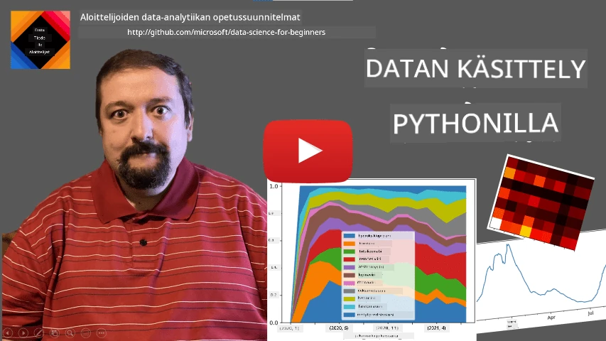
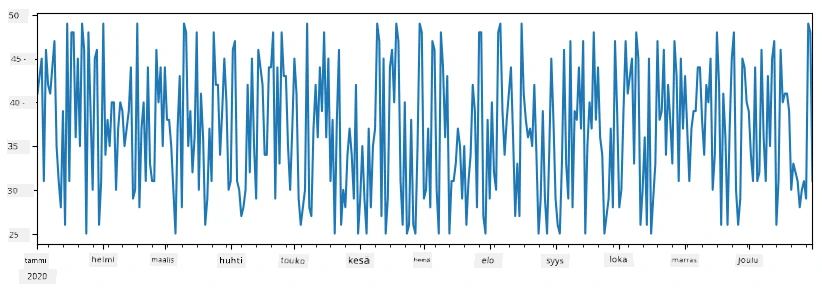
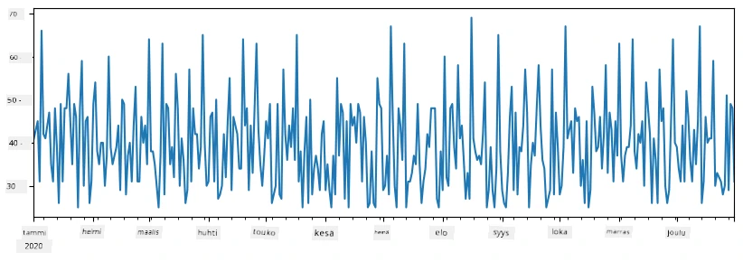
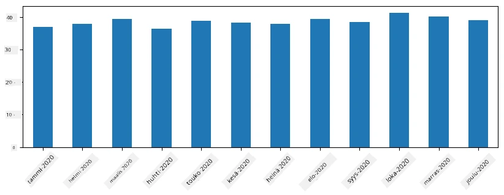
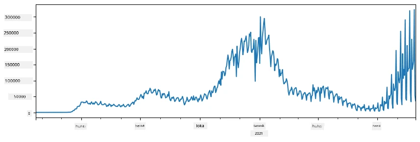
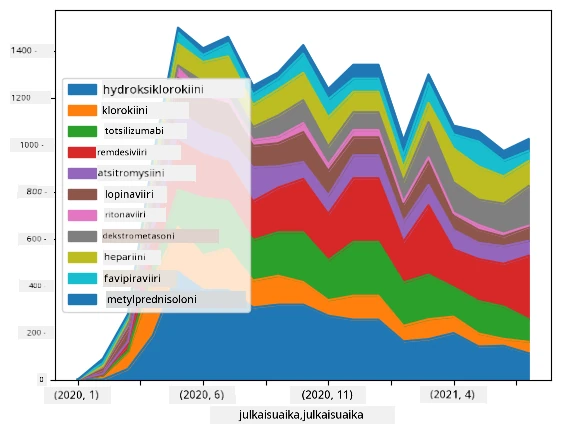

# Työskentely datan kanssa: Python ja Pandas-kirjasto

|  ](../../sketchnotes/07-WorkWithPython.png) |
| :-------------------------------------------------------------------------------------------------------: |
|                 Työskentely Pythonin kanssa - _Sketchnote by [@nitya](https://twitter.com/nitya)_                 |

[](https://youtu.be/dZjWOGbsN4Y)

Vaikka tietokannat tarjoavat erittäin tehokkaita tapoja tallentaa dataa ja kysellä sitä kyselykielten avulla, joustavin tapa datan käsittelyyn on kirjoittaa oma ohjelma datan käsittelemiseksi. Monissa tapauksissa tietokantakysely olisi tehokkaampi tapa. Kuitenkin joissain tapauksissa, kun tarvitaan monimutkaisempaa datan käsittelyä, sitä ei voi tehdä helposti SQL:llä.
Datan käsittely voidaan ohjelmoida millä tahansa ohjelmointikielellä, mutta tietyt kielet ovat korkeamman tason datan käsittelyn näkökulmasta. Data-analyytikot suosivat yleensä jotakin seuraavista kielistä:

* **[Python](https://www.python.org/)**, yleiskäyttöinen ohjelmointikieli, jota pidetään usein yhtenä parhaista vaihtoehdoista aloittelijoille sen yksinkertaisuuden vuoksi. Pythonilla on paljon lisäkirjastoja, jotka voivat auttaa ratkaisemaan monia käytännön ongelmia, kuten datan purkamista ZIP-arkistosta tai kuvan muuntamista harmaasävyiseksi. Data-analyysin lisäksi Pythonia käytetään usein myös web-kehityksessä.
* **[R](https://www.r-project.org/)** on perinteinen työkalu, joka on kehitetty erityisesti tilastollista datankäsittelyä varten. Siinä on myös suuri kirjastoarkisto (CRAN), mikä tekee siitä hyvän valinnan datan käsittelyyn. Kuitenkin R ei ole yleiskäyttöinen ohjelmointikieli ja sitä käytetään harvoin data-analyysin ulkopuolella.
* **[Julia](https://julialang.org/)** on toinen kieli, joka on kehitetty erityisesti data-analyysiin. Se on suunniteltu tarjoamaan parempi suorituskyky kuin Python, mikä tekee siitä erinomaisen työkalun tieteelliseen kokeiluun.

Tässä oppitunnissa keskitymme Pythonin käyttöön yksinkertaisessa datan käsittelyssä. Oletamme perustason tutustumisen kieleen. Jos haluat syvällisemmän Pythonin katsauksen, voit tutustua johonkin seuraavista resursseista:

* [Opiskele Pythonia hauskasti Turtle Graphicsin ja fraktaalien avulla](https://github.com/shwars/pycourse) - GitHub-pohjainen pikaopas Python-ohjelmointiin
* [Ota ensimmäiset askeleesi Pythonin kanssa](https://docs.microsoft.com/en-us/learn/paths/python-first-steps/?WT.mc_id=academic-77958-bethanycheum) Oppimispolku Microsoft Learnissa

Data voi olla monessa muodossa. Tässä oppitunnissa käsittelemme kolmea datan muotoa - **taulukkodata**, **teksti** ja **kuvat**.

Keskitymme muutamiin esimerkkeihin datan käsittelystä sen sijaan, että antaisimme täydellisen yleiskatsauksen kaikista aiheeseen liittyvistä kirjastoista. Tämä antaa sinulle pääidean siitä, mitä on mahdollista tehdä, ja auttaa sinua ymmärtämään, mistä löydät ratkaisumat ongelmiisi, kun sitä tarvitset.

> **Yleisin hyödyllinen neuvoni**. Kun sinun täytyy suorittaa jokin tietty operaatio datalle, jota et osaa tehdä, yritä etsiä ratkaisu internetistä. [Stackoverflow](https://stackoverflow.com/) sisältää yleensä paljon hyödyllisiä Python-koodiesimerkkejä moniin tyypillisiin tehtäviin.


## [Ennakkotehtävä](https://ff-quizzes.netlify.app/en/ds/quiz/12)

## Taulukkodata ja DataFrame

Olet jo tavannut taulukkodataa puhuttaessa relaatiotietokannoista. Kun sinulla on paljon dataa ja se on monissa eri linkitetyissä tauluissa, SQL:n käyttäminen on ehdottomasti järkevää. Kuitenkin on monia tapauksia, joissa meillä on joukko dataa taulukkona ja tarvitsemme jonkinlaista **ymmärrystä** tai **näkemyksiä** tästä datasta, kuten jakaumaa, arvojen välistä korrelaatiota, jne. Data-analyysissä on usein tarpeen tehdä alkuperäiselle datalle muutoksia, joita seuraa visualisointi. Molemmat vaiheet voidaan helposti tehdä Pythonilla.

Pythonissa on kaksi eniten käytettyä kirjastoa, jotka auttavat käsittelemään taulukkodataa:
* **[Pandas](https://pandas.pydata.org/)** antaa sinun käsitellä niin kutsuttuja **Dataframeja**, jotka ovat analoogisia relaatiotietokannan tauluille. Voit käyttää nimettyjä sarakkeita ja suorittaa erilaisia operaatioita riveillä, sarakkeilla ja dataframella yleisesti.
* **[Numpy](https://numpy.org/)** on kirjasto **tensoreiden**, eli moniulotteisten **taulukoiden** käsittelyyn. Taulukolla on samantyyppisiä arvoja, ja se on yksinkertaisempi kuin dataframe, mutta tarjoaa enemmän matemaattisia operaatioita ja luo vähemmän ylikuormitusta.

On myös pari muuta kirjastoa, jotka sinun kannattaa tuntea:
* **[Matplotlib](https://matplotlib.org/)** on kirjasto datan visualisointiin ja kuvaajien piirtämiseen
* **[SciPy](https://www.scipy.org/)** on kirjasto, jossa on lisätieteellisiä funktioita. Olemme törmänneet tähän kirjastoon jo puhuttaessa todennäköisyydestä ja tilastotieteestä

Tässä on koodinpätkä, jonka tyypillisesti käytät näiden kirjastojen tuomiseksi Python-ohjelman alkuun:
```python
import numpy as np
import pandas as pd
import matplotlib.pyplot as plt
from scipy import ... # sinun täytyy määrittää tarkat alipaketit, joita tarvitset
``` 

Pandas-kirjasto perustuu muutamaan peruskäsitteeseen.

### Series

**Series** on arvojono, joka on samanlainen kuin lista tai numpy-taulukko. Tärkein ero on, että series sisältää myös **indeksin**, ja kun operoimme serieseillä (esim. lisäämme niitä), indeksi otetaan huomioon. Indeksi voi olla yksinkertainen kokonaislukurivi (tämä on oletuksena kun tehdään series listasta tai taulukosta), tai se voi olla monimutkaisempi rakenne, kuten aikaväli.

> **Huom**: On olemassa johdantokoodia Pandasista mukana tulevassa muistikirjassa [`notebook.ipynb`](notebook.ipynb). Tässä esittelemme vain joitain esimerkkejä, mutta olet tervetullut tutustumaan koko muistikirjaan.

Otetaan esimerkki: haluamme analysoida jäätelökauppamme myyntiä. Luodaan sarja myyntilukuja (päivittäinen myytyjen tuotteiden määrä) jollekin aikajaksolle:

```python
start_date = "Jan 1, 2020"
end_date = "Mar 31, 2020"
idx = pd.date_range(start_date,end_date)
print(f"Length of index is {len(idx)}")
items_sold = pd.Series(np.random.randint(25,50,size=len(idx)),index=idx)
items_sold.plot()
```


Oletetaan, että joka viikko järjestämme kaveriporukalle juhlat, ja otamme ylimääräiset 10 pakettia jäätelöä juhlia varten. Voimme luoda toisen seriesin, jonka indeksi on viikko, näyttämään tämän:
```python
additional_items = pd.Series(10,index=pd.date_range(start_date,end_date,freq="W"))
```
Kun lisäämme kaksi seriesiä yhteen, saamme kokonaismäärän:
```python
total_items = items_sold.add(additional_items,fill_value=0)
total_items.plot()
```


> **Huomaa**, ettemme käytä yksinkertaista syntaksia `total_items+additional_items`. Jos käyttäisimme, saisimme paljon `NaN` (*Not a Number*) arvoja tuloksena olevalle seriesille. Tämä johtuu siitä, että `additional_items` -seriesissä puuttuu joitakin indeksejä, ja kun lasketaan yhteen NaN:n kanssa, tuloksena on NaN. Siksi meidän täytyy määrittää `fill_value` -parametri yhteenlaskussa.

Aikasarjojen kanssa voimme myös **uudelleenotantaa (resample)** seriesia eri aikaväleillä. Esimerkiksi, jos haluamme laskea kuukausittaiset keskimääräiset myyntimäärät, voimme käyttää seuraavaa koodia:
```python
monthly = total_items.resample("1M").mean()
ax = monthly.plot(kind='bar')
```


### DataFrame

DataFrame on pohjimmiltaan useiden samankaltaisten indeksoitujen seriesien kokoelma. Voimme yhdistää useita serieseitä yhdeksi DataFrameksi:
```python
a = pd.Series(range(1,10))
b = pd.Series(["I","like","to","play","games","and","will","not","change"],index=range(0,9))
df = pd.DataFrame([a,b])
```
Tämä luo vaakasuoran taulukon, joka näyttää tältä:
|     | 0   | 1    | 2   | 3   | 4      | 5   | 6      | 7    | 8    |
| --- | --- | ---- | --- | --- | ------ | --- | ------ | ---- | ---- |
| 0   | 1   | 2    | 3   | 4   | 5      | 6   | 7      | 8    | 9    |
| 1   | I   | like | to  | use | Python | and | Pandas | very | much |

Voimme myös käyttää Serieseitä sarakkeina, ja nimetä sarakkeet sanakirjan avulla:
```python
df = pd.DataFrame({ 'A' : a, 'B' : b })
```
Tämä antaa meille taulukon, joka näyttää tältä:

|     | A   | B      |
| --- | --- | ------ |
| 0   | 1   | I      |
| 1   | 2   | like   |
| 2   | 3   | to     |
| 3   | 4   | use    |
| 4   | 5   | Python |
| 5   | 6   | and    |
| 6   | 7   | Pandas |
| 7   | 8   | very   |
| 8   | 9   | much   |

**Huomaa**, että voimme myös saada tämän taulukon muodon kääntämällä edellisen taulukon, esimerkiksi kirjoittamalla
```python
df = pd.DataFrame([a,b]).T.rename(columns={ 0 : 'A', 1 : 'B' })
```
Tästä `.T` tarkoittaa DataFramen transponointia, eli rivien ja sarakkeiden vaihtamista, ja `rename` operaatiolla voimme nimetä sarakkeet uudelleen vastaamaan edellistä esimerkkiä.

Tässä muutamia tärkeimpiä operaatioita, joita voimme tehdä DataFrameillä:

**Sarakkeiden valinta**. Voimme valita yksittäisen sarakkeen kirjoittamalla `df['A']` - tämä operaatio palauttaa Seriesin. Voimme myös valita osan sarakkeista toiseksi DataFrameksi kirjoittamalla `df[['B','A']]` - tämä palauttaa toisen DataFramen.

**Suodattaminen** vain tiettyjen rivien perusteella kriteerillä. Esimerkiksi, jos haluamme jättää vain ne rivit, joiden sarakkeen `A` arvo on suurempi kuin 5, voimme kirjoittaa `df[df['A']>5]`.

> **Huom**: Suodatus toimii seuraavasti. Lauseke `df['A']<5` palauttaa boole-tyyppisen seriesin, joka ilmaisee onko ehto `True` vai `False` kullekin alkuperäisen seriesin `df['A']` alkiolle. Kun tätä boole-seriesiä käytetään indeksinä, se palauttaa DataFramesta niiden rivien osajoukon, joille ehto on tosi. Siksi ei ole mahdollista käyttää mielivaltaista Pythonin boolean lauseketta, esimerkiksi `df[df['A']>5 and df['A']<7]` olisi virheellinen. Sen sijaan pitää käyttää erityistä `&` operaatiota boolean-seriesien välillä, kirjoittaen `df[(df['A']>5) & (df['A']<7)]` (*sulkeet ovat tärkeitä tässä*).

**Uusien laskettavien sarakkeiden luominen**. Voimme helposti luoda uusia laskettavia sarakkeita DataFrameemme intuitiivisella lausekkeella kuten:
```python
df['DivA'] = df['A']-df['A'].mean() 
``` 
Tämä esimerkki laskee sarakkeen A poikkeaman sen keskiarvosta. Käytännössä laskemme seriesin ja asetamme sen vasemmalle puolelle, jolloin syntyy uusi sarake. Tämän vuoksi emme voi käyttää operaatioita, jotka eivät ole yhteensopivia seriesin kanssa, esimerkiksi alla oleva koodi on väärin:
```python
# Väärä koodi -> df['ADescr'] = "Low" jos df['A'] < 5 muuten "Hi"
df['LenB'] = len(df['B']) # <- Väärä tulos
``` 
Viimeinen esimerkki, vaikka syntaksillisesti oikea, antaa väärän tuloksen, koska se asettaa sarakkeen B pituuden arvoon kaikille riveille, eikä yksittäisten alkioiden pituuksiin kuten tarkoitimme.

Jos tarvitsemme monimutkaisempia laskutoimituksia, voimme käyttää `apply` funktiota. Viimeinen esimerkki voidaan kirjoittaa näin:
```python
df['LenB'] = df['B'].apply(lambda x : len(x))
# tai
df['LenB'] = df['B'].apply(len)
```

Operaatioiden jälkeen päädymme seuraavaan DataFrameen:

|     | A   | B      | DivA | LenB |
| --- | --- | ------ | ---- | ---- |
| 0   | 1   | I      | -4.0 | 1    |
| 1   | 2   | like   | -3.0 | 4    |
| 2   | 3   | to     | -2.0 | 2    |
| 3   | 4   | use    | -1.0 | 3    |
| 4   | 5   | Python | 0.0  | 6    |
| 5   | 6   | and    | 1.0  | 3    |
| 6   | 7   | Pandas | 2.0  | 6    |
| 7   | 8   | very   | 3.0  | 4    |
| 8   | 9   | much   | 4.0  | 4    |

**Rivien valinta numeroiden perusteella** onnistuu käyttämällä `iloc`-rakennetta. Esimerkiksi, valitaksemme ensimmäiset 5 riviä DataFramesta:
```python
df.iloc[:5]
```

**Ryhmittely** on yleinen tapa saada vastaava tulos kuin Excelin *pivot-taulukot*. Oletetaan, että haluamme laskea sarakkeen `A` keskiarvon kullekin arvolle sarakkeessa `LenB`. Silloin voimme ryhmitellä DataFramen `LenB` mukaan ja kutsua `mean`-funktiota:
```python
df.groupby(by='LenB')[['A','DivA']].mean()
```
Jos tarvitsemme sekä keskiarvon että ryhmän jäsenten lukumäärän, voimme käyttää monimutkaisempaa `aggregate`-funktiota:
```python
df.groupby(by='LenB') \
 .aggregate({ 'DivA' : len, 'A' : lambda x: x.mean() }) \
 .rename(columns={ 'DivA' : 'Count', 'A' : 'Mean'})
```
Tämä antaa seuraavan taulukon:

| LenB | Count | Mean     |
| ---- | ----- | -------- |
| 1    | 1     | 1.000000 |
| 2    | 1     | 3.000000 |
| 3    | 2     | 5.000000 |
| 4    | 3     | 6.333333 |
| 6    | 2     | 6.000000 |

### Datan hankinta


Olemme nähneet, kuinka helppoa on rakentaa Series- ja DataFrame-rakenteita Python-olioista. Kuitenkin data tulee yleensä tekstimuotoisena tiedostona tai Excel-taulukkona. Onneksi Pandas tarjoaa meille yksinkertaisen tavan ladata dataa levyltä. Esimerkiksi CSV-tiedoston lukeminen on näin yksinkertaista:
```python
df = pd.read_csv('file.csv')
```
Näemme lisää esimerkkejä datan lataamisesta, mukaan lukien datan hakeminen ulkoisilta verkkosivuilta, kohdassa "Haaste"


### Tulostaminen ja Visualisointi

Data scientistin täytyy usein tutkia dataa, joten on tärkeää pystyä visualisoimaan sitä. Kun DataFrame on suuri, monesti haluamme vain varmistaa, että teemme kaiken oikein tulostamalla muutaman ensimmäisen rivin. Tämä onnistuu kutsumalla `df.head()`. Jos ajat sen Jupyter Notebookissa, DataFrame tulostuu siistissä taulukkomuodossa.

Olemme myös nähneet `plot`-funktion käytön joidenkin sarakkeiden visualisoimiseen. Vaikka `plot` on monissa tehtävissä erittäin hyödyllinen ja tukee monia erilaisia kaaviotyyppejä parametrilla `kind=`, voit aina käyttää raakaa `matplotlib`-kirjastoa monimutkaisempien asioiden piirtämiseen. Käsittelemme datan visualisointia tarkemmin erillisissä kurssin osioissa.

Tämä yleiskatsaus kattaa Pandasin tärkeimmät käsitteet, mutta kirjasto on hyvin laaja, eikä rajaa sille, mitä voit tehdä, ole! Sovelletaanpa nyt tätä tietoa ratkomaan konkreettinen ongelma.

## 🚀 Haaste 1: COVID-leviämisen analysointi

Ensimmäisenä ongelmana keskitymme COVID-19-epidemian leviämisen mallintamiseen. Tätä varten käytämme tietoa tartunnan saaneiden määrästä eri maissa, jota tarjoaa [Center for Systems Science and Engineering](https://systems.jhu.edu/) (CSSE) [Johns Hopkins Universityssä](https://jhu.edu/). Aineisto on saatavilla [tässä GitHub-repositoriossa](https://github.com/CSSEGISandData/COVID-19).

Koska haluamme näyttää, miten dataa käsitellään, kutsumme sinut avaamaan [`notebook-covidspread.ipynb`](notebook-covidspread.ipynb) ja lukemaan sen alusta loppuun. Voit myös suorittaa soluja ja tehdä joitakin haasteita, jotka olemme jättäneet sinulle lopuksi.



> Jos et tiedä, miten koodi ajetaan Jupyter Notebookissa, tutustu [tähän artikkeliin](https://soshnikov.com/education/how-to-execute-notebooks-from-github/).

## Työskentely strukturoimattoman datan kanssa

Vaikka data tulee hyvin usein taulukkomuodossa, joissakin tapauksissa meidän täytyy käsitellä vähemmän strukturoitua dataa, kuten tekstiä tai kuvia. Tässä tapauksessa voidaksemme soveltaa yllä näkemäämme datankäsittelyä, meidän täytyy jotenkin **uoria** strukturoitua dataa. Tässä muutama esimerkki:

* Avainsanojen uuttaminen tekstistä ja niiden esiintymistiheyden tarkastelu
* Neuroverkkojen käyttö objektien tiedon uuttamiseen kuvista
* Tietojen saaminen ihmisten tunteista videokuvasta

## 🚀 Haaste 2: COVID-tutkimuspapereiden analysointi

Tässä haasteessa jatkamme COVID-pandemian aiheen parissa ja keskitymme tieteellisten tutkimuspapereiden käsittelyyn. On olemassa [CORD-19 Dataset](https://www.kaggle.com/allen-institute-for-ai/CORD-19-research-challenge), jossa on yli 7000 (kirjoitushetkellä) COVIDiin liittyvää paperia metatiedon ja tiivistelmien kanssa (ja noin puolella niistä on myös kokoteksti saatavilla).

Täydellinen esimerkki tästä aineistosta analysoinnista käyttäen [Text Analytics for Health](https://docs.microsoft.com/azure/cognitive-services/text-analytics/how-tos/text-analytics-for-health/?WT.mc_id=academic-77958-bethanycheum) kognitiivista palvelua on kuvattu [tässä blogikirjoituksessa](https://soshnikov.com/science/analyzing-medical-papers-with-azure-and-text-analytics-for-health/). Käymme läpi yksinkertaistetun version tästä analyysistä.

> **HUOMIO**: Emme tarjoa tätä aineistoa kopiona osana tätä repositoriota. Sinun täytyy ensin ladata [`metadata.csv`](https://www.kaggle.com/allen-institute-for-ai/CORD-19-research-challenge?select=metadata.csv) tiedosto [tästä Kaggle-datasta](https://www.kaggle.com/allen-institute-for-ai/CORD-19-research-challenge). Kaggle-tilin luonti saattaa olla tarpeen. Voit myös ladata aineiston rekisteröitymättä [täältä](https://ai2-semanticscholar-cord-19.s3-us-west-2.amazonaws.com/historical_releases.html), mutta sieltä saat kaikki kokotekstit lisäksi metadata-tiedostoon.

Avaa [`notebook-papers.ipynb`](notebook-papers.ipynb) ja lue se kokonaan. Voit myös suorittaa soluja ja tehdä joitakin haasteita, jotka olemme jättäneet sinulle lopuksi.



## Kuvadatan käsittely

Viime aikoina on kehitetty hyvin tehokkaita tekoälymalleja, jotka antavat meille ymmärrystä kuvista. Monia tehtäviä voidaan ratkaista valmiiksi koulutetuilla neuroverkoilla tai pilvipalveluilla. Esimerkkejä ovat:

* **Kuvien luokittelu**, joka auttaa luokittelemaan kuvan ennalta määriteltyihin luokkiin. Voit helposti kouluttaa oman kuvien luokittelumallisi palveluilla kuten [Custom Vision](https://azure.microsoft.com/services/cognitive-services/custom-vision-service/?WT.mc_id=academic-77958-bethanycheum)
* **Objektien havaitseminen**, jolla tunnistetaan erilaisia objekteja kuvasta. Palvelut kuten [computer vision](https://azure.microsoft.com/services/cognitive-services/computer-vision/?WT.mc_id=academic-77958-bethanycheum) voivat tunnistaa useita yleisiä objekteja, ja voit kouluttaa [Custom Vision](https://azure.microsoft.com/services/cognitive-services/custom-vision-service/?WT.mc_id=academic-77958-bethanycheum) mallin tunnistamaan erityisiä kiinnostuksen kohteita.
* **Kasvojen havaitseminen**, mukaan lukien iän, sukupuolen ja tunteiden tunnistus. Tämä onnistuu [Face API:n](https://azure.microsoft.com/services/cognitive-services/face/?WT.mc_id=academic-77958-bethanycheum) avulla.

Näitä pilvipalveluja voidaan kutsua [Python SDK:iden](https://docs.microsoft.com/samples/azure-samples/cognitive-services-python-sdk-samples/cognitive-services-python-sdk-samples/?WT.mc_id=academic-77958-bethanycheum) kautta, joten ne voidaan helposti integroida data-analyysityöhön.

Tässä muutamia esimerkkejä kuvadatalähteiden tutkimisesta:
* Blogikirjoituksessa [How to Learn Data Science without Coding](https://soshnikov.com/azure/how-to-learn-data-science-without-coding/) tutkimme Instagram-kuvia ja yritämme ymmärtää, mikä saa ihmiset antamaan enemmän tykkäyksiä kuvalle. Ensin uimme mahdollisimman paljon tietoa kuvista käyttäen [computer vision](https://azure.microsoft.com/services/cognitive-services/computer-vision/?WT.mc_id=academic-77958-bethanycheum) -palvelua, ja sitten käytämme [Azure Machine Learning AutoML](https://docs.microsoft.com/azure/machine-learning/concept-automated-ml/?WT.mc_id=academic-77958-bethanycheum) rakentamaan tulkinnanvaraista mallia.
* [Facial Studies Workshopissa](https://github.com/CloudAdvocacy/FaceStudies) käytämme [Face API:a](https://azure.microsoft.com/services/cognitive-services/face/?WT.mc_id=academic-77958-bethanycheum) uimaan ihmisten tunteita valokuvista tapahtumista, jotta voisimme yrittää ymmärtää, mikä tekee ihmiset onnellisiksi.

## Yhteenveto

Olipa sinulla jo strukturoitua tai strukturoimatonta dataa, Pythonin avulla voit suorittaa kaikki datankäsittelyyn ja ymmärtämiseen liittyvät vaiheet. Se on luultavasti joustavin tapa datankäsittelyyn, ja siksi suurin osa data scientistien käyttää Pythonia ensisijaisena työkalunaan. Pythonin opetteleminen perusteellisesti on hyvä idea, jos olet tosissasi data science -matkallasi!

## [Luentojälkeinen tietovisa](https://ff-quizzes.netlify.app/en/ds/quiz/13)

## Kertaus & Itsestä oppiminen

**Kirjat**
* [Wes McKinney. Python for Data Analysis: Data Wrangling with Pandas, NumPy, and IPython](https://www.amazon.com/gp/product/1491957662)

**Verkkoresurssit**
* Virallinen [10 minuuttia Pandasiin](https://pandas.pydata.org/pandas-docs/stable/user_guide/10min.html) -opetus
* [Dokumentaatio Pandas Visualisoinnista](https://pandas.pydata.org/pandas-docs/stable/user_guide/visualization.html)

**Pythonin oppiminen**
* [Opi Pythonia hauskalla tavalla Turtle Graphicsin ja Fraktaalien avulla](https://github.com/shwars/pycourse)
* [Ota ensiaskeleet Pythonissa](https://docs.microsoft.com/learn/paths/python-first-steps/?WT.mc_id=academic-77958-bethanycheum) Opintopolku Microsoft Learnissä (http://learn.microsoft.com/?WT.mc_id=academic-77958-bethanycheum)

## Tehtävä

[Suorita tarkempi datatutkimus yllä oleviin haasteisiin](assignment.md)

## Tekijänoikeudet

Tämä oppitunti on kirjoitettu ♥️ kirjoittanut [Dmitry Soshnikov](http://soshnikov.com)

---

<!-- CO-OP TRANSLATOR DISCLAIMER START -->
**Vastuuvapauslauseke**:
Tämä asiakirja on käännetty käyttämällä tekoälypohjaista käännöspalvelua [Co-op Translator](https://github.com/Azure/co-op-translator). Vaikka pyrimme tarkkuuteen, otathan huomioon, että automaattiset käännökset saattavat sisältää virheitä tai epätarkkuuksia. Alkuperäinen asiakirja sen alkuperäiskielellä on virallinen lähde. Tärkeissä asioissa suositellaan ammattimaista ihmiskäännöstä. Emme ole vastuussa tämän käännöksen käytöstä aiheutuvista väärinymmärryksistä tai tulkinnoista.
<!-- CO-OP TRANSLATOR DISCLAIMER END -->