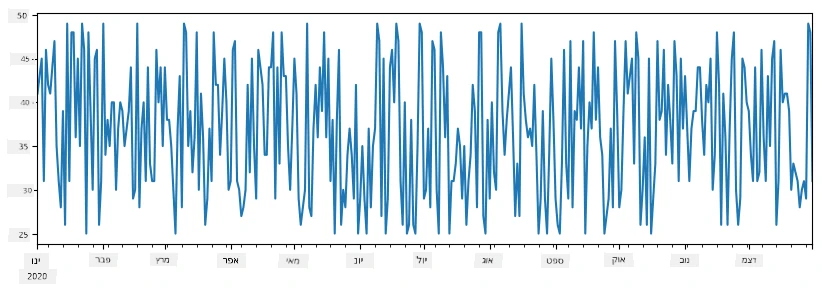
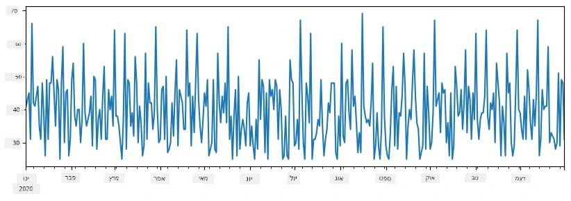
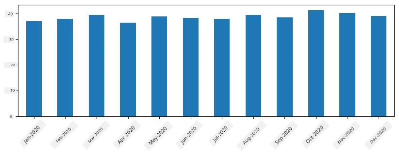
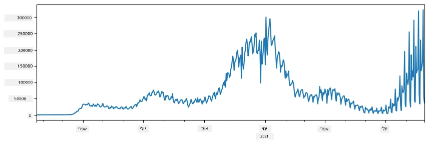
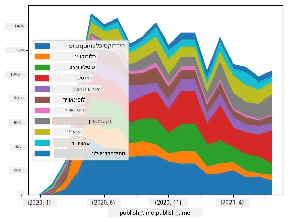

# עבודה עם נתונים: פייתון וספריית פנדס

|  ](../../sketchnotes/07-WorkWithPython.png) |
| :-------------------------------------------------------------------------------------------------------: |
|                 עבודה עם פייתון - _רשום סקיצה על ידי [@nitya](https://twitter.com/nitya)_                  |

[](https://youtu.be/dZjWOGbsN4Y)

בעוד שמסדי נתונים מציעים דרכים מאוד יעילות לאחסן נתונים ולבצע שאילתות באמצעות שפות שאילתא, הדרך הגמישה ביותר לעיבוד נתונים היא לכתוב תוכנית משלך למניפולציה של הנתונים. במקרים רבים, ביצוע שאילתה במסד הנתונים יהיה דרך יעילה יותר. עם זאת, במקרים מסוימים כאשר נדרש עיבוד נתונים מורכב יותר, לא ניתן לבצע זאת בקלות באמצעות SQL.
עיבוד נתונים ניתן לתכנת בכל שפת תכנות, אך יש שפות מסוימות שהן ברמה גבוהה יותר יחסית לעבודה עם נתונים. מדעני נתונים בדרך כלל מעדיפים אחת מהשפות הבאות:

* **[פייתון](https://www.python.org/)**, שפת תכנות כללית, שלרוב נחשבת לאחד מהאפשרויות הטובות למתחילים בגלל הפשטות שלה. לפייתון יש הרבה ספריות נוספות שיכולות לעזור לך לפתור בעיות מעשיות רבות, כמו חילוץ הנתונים שלך מארכיון ZIP, או המרת תמונה לגווני אפור. בנוסף למדעי הנתונים, פייתון משמשת לעיתים קרובות גם לפיתוח אתרים.
* **[R](https://www.r-project.org/)** היא ארגז כלים מסורתי שפותח עם עיבוד נתונים סטטיסטי במחשבה. היא מכילה גם מאגר גדול של ספריות (CRAN), מה שעושה אותה לבחירה טובה לעיבוד נתונים. עם זאת, R אינה שפת תכנות כללית, והשתמשה בה לעיתים נדירות מחוץ לתחום מדעי הנתונים.
* **[Julia](https://julialang.org/)** היא שפה נוספת שפותחה במיוחד עבור מדעי הנתונים. היא נועדה לספק ביצועים טובים יותר מאשר פייתון, מה שעושה אותה כלי נהדר לניסויים מדעיים.

בשיעור זה, נתמקד בשימוש בפייתון לעיבוד נתונים פשוט. נניח הכרות בסיסית עם השפה. אם ברצונך לסיור מעמיק יותר בפייתון, תוכל להפנות לאחד מהמשאבים הבאים:

* [למד פייתון באופן מהנה עם גרפיקה של צב ופרקטלים](https://github.com/shwars/pycourse) - קורס מבוא מהיר מבוסס GitHub לתכנות בפייתון
* [קח את צעדי הראשונים עם פייתון](https://docs.microsoft.com/en-us/learn/paths/python-first-steps/?WT.mc_id=academic-77958-bethanycheum) מסלול למידה ב-[Microsoft Learn](http://learn.microsoft.com/?WT.mc_id=academic-77958-bethanycheum)

נתונים יכולים לבוא בצורות רבות. בשיעור זה, נתייחס לשלוש צורות של נתונים - **נתונים טבלאיים**, **טקסט** ו-**תמונות**.

נתמקד בכמה דוגמאות של עיבוד נתונים, במקום לספק מבט כולל על כל הספריות הקשורות. זה יאפשר לך לקבל את הרעיון המרכזי מה אפשרי, ולתת לך הבנה איפה למצוא פתרונות לבעיות שלך כשאתה צריך.

> **העצה הכי מועילה**. כשאתה צריך לבצע פעולה מסוימת על נתונים שאינך יודע כיצד לעשות, נסה לחפש את זה באינטרנט. בדרך כלל באתר [Stackoverflow](https://stackoverflow.com/) יש המון דוגמאות קוד שימושי בפייתון לרבים מהמשימות הטיפוסיות.


## [מבחן קצר לפני ההרצאה](https://ff-quizzes.netlify.app/en/ds/quiz/12)

## נתונים טבלאיים ומסגרות נתונים

כבר הכרנו את הנתונים הטבלאיים כשדיברנו על מסדי נתונים יחסיים. כשיש לך הרבה נתונים, והם נמצאים בטבלאות מקושרות שונות, בהחלט יש הגיון להשתמש ב-SQL לעבודה איתם. עם זאת, יש מקרים רבים בהם יש לנו טבלה של נתונים, ואנחנו צריכים לקבל **הבנה** או **תובנות** על נתונים אלה, כגון התפלגות, קורלציה בין הערכים וכו'. במדעי הנתונים, יש הרבה מקרים בהם נדרש לבצע טרנספורמציות מסוימות על הנתונים המקוריים, ואחר כך להמחיש אותם. שני הצעדים האלה יכולים להיעשות בקלות באמצעות פייתון.

יש שתי ספריות הכי שימושיות בפייתון שיכולות לעזור לך לטפל בנתונים טבלאיים:
* **[Pandas](https://pandas.pydata.org/)** מאפשרת לך לתפעל את מה שנקרא **מסגרות נתונים (Dataframes)**, שהן אנלוגיות לטבלאות יחסיות. ניתן להגדיר עמודות עם שמות, ולבצע פעולות שונות על שורות, עמודות ומסגרות נתונים בכלל.
* **[Numpy](https://numpy.org/)** היא ספריה לעבודה עם **טנסורים**, כלומר **מערכים** רב-ממדיים. למערך יש ערכים מאותו סוג בסיסי, והוא פשוט יותר ממסגרת נתונים, אך מציע יותר פעולות מתמטיות ויוצר פחות עומס.

יש גם כמה ספריות נוספות שכדאי לדעת עליהן:
* **[Matplotlib](https://matplotlib.org/)** היא ספריה המשמשת להמחשת נתונים וציור גרפים
* **[SciPy](https://www.scipy.org/)** היא ספריה עם פונקציות מדעיות נוספות. כבר פגשנו את הספריה הזו כשדיברנו על הסתברות וסטטיסטיקה

הנה קטע קוד שתשתמש בדרך כלל כדי לייבא את הספריות האלה בהתחלת תוכנית הפייתון שלך:
```python
import numpy as np
import pandas as pd
import matplotlib.pyplot as plt
from scipy import ... # עליך לציין במדויק את תתי-החבילות שאתה צריך
``` 

פנדס מתמקדת בכמה מושגים בסיסיים.

### Series

**סדרה (Series)** היא רצף של ערכים, דומה לרשימה או למערך מ-numpy. ההבדל העיקרי הוא שלסדרה יש גם **אינדקס**, וכאשר אנו מבצעים פעולות על סדרות (למשל, חיבור), האינדקס נלקח בחשבון. האינדקס יכול להיות פשוט כמו מספר שורה שלם (זה האינדקס שנמצא כברירת מחדל כשמייצרים סדרה מרשימה או מערך), או שהוא יכול להיות בעל מבנה מורכב, למשל טווח תאריכים.

> **הערה**: יש קוד פתיחה לפנדס במחברת הנלווית [`notebook.ipynb`](notebook.ipynb). כאן רק נספק כמה דוגמאות, ואתם מוזמנים לבדוק את המחברת המלאה.

קחו דוגמה: אנו מעוניינים לנתח מכירות של דוכן הגלידה שלנו. בואו נייצר סדרת מספרי מכירות (מספר פריטים שנמכרו בכל יום) לתקופה מסוימת:

```python
start_date = "Jan 1, 2020"
end_date = "Mar 31, 2020"
idx = pd.date_range(start_date,end_date)
print(f"Length of index is {len(idx)}")
items_sold = pd.Series(np.random.randint(25,50,size=len(idx)),index=idx)
items_sold.plot()
```


עכשיו נניח שבכל שבוע אנחנו מארגנים מסיבה לחברים, ואנחנו לוקחים 10 חבילות גלידה נוספות למסיבה. נוכל ליצור סדרה נוספת, עם אינדקס לפי שבוע, להדגים זאת:
```python
additional_items = pd.Series(10,index=pd.date_range(start_date,end_date,freq="W"))
```
כאשר אנו מחברים שתי סדרות, מקבלים מספר כולל:
```python
total_items = items_sold.add(additional_items,fill_value=0)
total_items.plot()
```


> **הערה** שאנחנו לא משתמשים בתחביר הפשוט `total_items+additional_items`. אם היינו עושים זאת, היינו מקבלים הרבה ערכי `NaN` (*לא מספר*) בסדרה התוצאה. זה נובע מכיוון שיש ערכים חסרים עבור חלק מנקודות האינדקס בסדרה `additional_items`, וחיבור `NaN` לכל דבר מוביל ל-`NaN`. לכן, יש לציין את הפרמטר `fill_value` בעת החיבור.

עם סדרות זמן, ניתן גם **לדגום מחדש** את הסדרה עם מרווחי זמן שונים. לדוגמה, נניח וברצוננו לחשב ממוצע מכירות חודשי. נוכל להשתמש בקוד הבא:
```python
monthly = total_items.resample("1M").mean()
ax = monthly.plot(kind='bar')
```


### DataFrame

מסגרת נתונים (DataFrame) היא בעצם אוסף של סדרות עם אותו אינדקס. אפשר לשלב כמה סדרות יחד למסגרת נתונים:
```python
a = pd.Series(range(1,10))
b = pd.Series(["I","like","to","play","games","and","will","not","change"],index=range(0,9))
df = pd.DataFrame([a,b])
```
זה ייצור טבלה אופקית כמו זו:
|     | 0   | 1    | 2   | 3   | 4      | 5   | 6      | 7    | 8    |
| --- | --- | ---- | --- | --- | ------ | --- | ------ | ---- | ---- |
| 0   | 1   | 2    | 3   | 4   | 5      | 6   | 7      | 8    | 9    |
| 1   | I   | like | to  | use | Python | and | Pandas | very | much |

ניתן גם להשתמש בסדרות כעמודות, ולציין שמות לעמודות באמצעות מילון:
```python
df = pd.DataFrame({ 'A' : a, 'B' : b })
```
זה יתן לנו טבלה כמו זו:

|     | A   | B      |
| --- | --- | ------ |
| 0   | 1   | I      |
| 1   | 2   | like   |
| 2   | 3   | to     |
| 3   | 4   | use    |
| 4   | 5   | Python |
| 5   | 6   | and    |
| 6   | 7   | Pandas |
| 7   | 8   | very   |
| 8   | 9   | much   |

**הערה** שאפשר גם לקבל את פריסת הטבלה הזו על ידי טרנספוזיציה של הטבלה הקודמת, לדוגמה על ידי כתיבה
```python
df = pd.DataFrame([a,b]).T.rename(columns={ 0 : 'A', 1 : 'B' })
```
כאן `.T` מתאר את הפעולה של הטרנספוזיציה של מסגרת הנתונים, כלומר החלפת שורות ועמודות, ופעולת `rename` מאפשרת לנו לשנות את שמות העמודות כך שיתאימו לדוגמה הקודמת.

הנה כמה מהפעולות החשובות ביותר שאפשר לבצע על מסגרות נתונים:

**בחירת עמודות**. ניתן לבחור עמודה בודדת על ידי כתיבת `df['A']` - פעולה זו מחזירה סדרה. ניתן גם לבחור תת-קבוצה של עמודות למסגרת נתונים אחרת על ידי כתיבת `df[['B','A']]` - פעולה זו מחזירה מסגרת נתונים נוספת.

**סינון** של שורות מסוימות לפי קריטריונים. לדוגמה, כדי להשאיר רק שורות שבהן העמודה `A` גדולה מ-5, נוכל לכתוב `df[df['A']>5]`.

> **הערה**: הדרך בה הסינון עובד היא כזו. הביטוי `df['A']<5` מחזיר סדרת בוליאן, שמסמנת האם הביטוי הוא `True` או `False` עבור כל איבר בסדרת המקור `df['A']`. כאשר סדרת בוליאן משמשת כאינדקס, היא מחזירה תת-קבוצה של שורות במסגרת הנתונים. לכן אי אפשר להשתמש בביטוי בוליאני ארבי בפייתון, למשל, כתיבת `df[df['A']>5 and df['A']<7]` תהיה שגויה. במקום זאת, יש להשתמש באופרציה מיוחדת `&` על סדרות בוליאניות, לכתוב `df[(df['A']>5) & (df['A']<7)]` (*הסוגריים חשובים כאן*).

**יצירת עמודות חדשות לחישוב**. ניתן בקלות ליצור עמודות חדשות לחישוב במסגרת הנתונים על ידי שימוש בביטוי אינטואיטיבי כזה:
```python
df['DivA'] = df['A']-df['A'].mean() 
``` 
בדוגמה זו מחושבת סטייה של A מערכה הממוצעת שלו. מה שבפועל קורה כאן הוא שאנו מחשבים סדרה ומאוחר יותר מציבים סדרה זו בצד השמאלי, ויוצרים עמודה חדשה. לכן, לא ניתן להשתמש בפעולות שאינן תואמות לסדרות, לדוגמה, הקוד הבא שגוי:
```python
# קוד שגוי -> df['ADescr'] = "נמוך" אם df['A'] < 5 אחרת "גבוה"
df['LenB'] = len(df['B']) # <- תוצאה שגויה
``` 
הדוגמה האחרונה, אף על פי שהיא תחבירית נכונה, נותנת תוצאה שגויה, כיוון שהיא מייחסת את האורך של הסדרה `B` לכל הערכים בעמודה, ולא את האורך של האיברים בודדים כפי שהתכוונו.

אם צריך לחשב ביטויים מורכבים כאלה, אפשר להשתמש בפונקציה `apply`. הדוגמה האחרונה ניתנת לכתיבה כך:
```python
df['LenB'] = df['B'].apply(lambda x : len(x))
# או
df['LenB'] = df['B'].apply(len)
```

לאחר הפעולות הנ"ל, נקבל את מסגרת הנתונים הבאה:

|     | A   | B      | DivA | LenB |
| --- | --- | ------ | ---- | ---- |
| 0   | 1   | I      | -4.0 | 1    |
| 1   | 2   | like   | -3.0 | 4    |
| 2   | 3   | to     | -2.0 | 2    |
| 3   | 4   | use    | -1.0 | 3    |
| 4   | 5   | Python | 0.0  | 6    |
| 5   | 6   | and    | 1.0  | 3    |
| 6   | 7   | Pandas | 2.0  | 6    |
| 7   | 8   | very   | 3.0  | 4    |
| 8   | 9   | much   | 4.0  | 4    |

**בחירת שורות על בסיס מספרים** ניתן לבצע באמצעות המונח `iloc`. לדוגמה, כדי לבחור את חמש השורות הראשונות ממסגרת הנתונים:
```python
df.iloc[:5]
```

**קיבוץ** משמש לעיתים לקבל תוצאה דומה ל-*טבלאות ציר (pivot tables)* באקסל. נניח שאנחנו רוצים לחשב את הממוצע של עמודה `A` עבור כל ערך נתון של `LenB`. אז נוכל לקבץ את מסגרת הנתונים לפי `LenB`, ולהפעיל `mean`:
```python
df.groupby(by='LenB')[['A','DivA']].mean()
```
אם נרצה לחשב גם ממוצע וגם את מספר האיברים בקבוצה, נוכל להשתמש בפונקציית `aggregate` מורכבת יותר:
```python
df.groupby(by='LenB') \
 .aggregate({ 'DivA' : len, 'A' : lambda x: x.mean() }) \
 .rename(columns={ 'DivA' : 'Count', 'A' : 'Mean'})
```
זה נותן לנו את הטבלה הבאה:

| LenB | Count | Mean     |
| ---- | ----- | -------- |
| 1    | 1     | 1.000000 |
| 2    | 1     | 3.000000 |
| 3    | 2     | 5.000000 |
| 4    | 3     | 6.333333 |
| 6    | 2     | 6.000000 |

### קבלת נתונים


ראינו כמה קל לבנות סדרות ו-DataFrames מאובייקטים של פייתון. עם זאת, בדרך כלל הנתונים מגיעים בצורה של קובץ טקסט או טבלת Excel. למרבה המזל, Pandas מציעה לנו דרך פשוטה לטעון נתונים מהדיסק. למשל, קריאת קובץ CSV היא פשוטה כמו זה:
```python
df = pd.read_csv('file.csv')
```
נראה דוגמאות נוספות לטעינת נתונים, כולל קבלת נתונים מאתרים חיצוניים, בקטע "האתגר"


### הדפסה וגרפים

למדען נתונים לעיתים קרובות יש צורך לחקור את הנתונים, ולכן חשוב להיות מסוגלים לויזואליזציה שלהם. כאשר ה-DataFrame גדול, פעמים רבות אנחנו רק רוצים לוודא שאנחנו עושים הכל נכון על ידי הדפסת השורות הראשונות. ניתן לעשות זאת על ידי קריאה ל-`df.head()`. אם אתם מריצים זאת ב-Jupyter Notebook, זה ידפיס את ה-DataFrame בצורה טבלאית נאה.

ראינו גם שימוש בפונקציית `plot` לויזואליזציה של עמודות מסוימות. בעוד ש-`plot` שימושי מאוד למשימות רבות, ותומך בסוגים שונים של גרפים באמצעות הפרמטר `kind=`, תמיד תוכלו להשתמש בספריית `matplotlib` הגולמית כדי לשרטט משהו מורכב יותר. נסקור את ויזואליזציית הנתונים בפירוט בשיעורים נפרדים.

סקירה זו מכסה את המושגים החשובים ביותר של Pandas, עם זאת, הספרייה עשירה מאוד, ואין גבול למה שניתן לעשות איתה! עכשיו בואו ניישם את הידע הזה לפתרון בעיה ספציפית.

## 🚀 אתגר 1: ניתוח הפצת COVID

הבעיה הראשונה שעליה נתמקד היא מודל הפצת מגפת COVID-19. לצורך כך, נשתמש בנתונים על מספר הנדבקים במדינות שונות, שמסופקים על ידי [המרכז למדעי מערכות והנדסה](https://systems.jhu.edu/) (CSSE) באוניברסיטת [ג'ונס הופקינס](https://jhu.edu/). מערך הנתונים זמין ב-[מאגר GitHub זה](https://github.com/CSSEGISandData/COVID-19).

כיוון שאנו רוצים להדגים איך להתמודד עם נתונים, אנו מזמינים אתכם לפתוח את [`notebook-covidspread.ipynb`](notebook-covidspread.ipynb) ולקרוא אותו מלמעלה למטה. אתם יכולים גם להריץ את התאים ולעשות אתגרים שהשארנו לכם בסוף.



> אם אינכם יודעים איך להריץ קוד ב-Jupyter Notebook, עיינו ב-[מאמר זה](https://soshnikov.com/education/how-to-execute-notebooks-from-github/).

## עבודה עם נתונים לא מובנים

בעוד שלעיתים קרובות הנתונים מגיעים בצורה טבלאית, במקרים מסוימים אנחנו צריכים להתמודד עם נתונים פחות מובנים, למשל טקסט או תמונות. במקרה זה, כדי ליישם טכניקות עיבוד נתונים שלמעלה, עלינו באופן כלשהו **לחלץ** נתונים מובנים. הנה כמה דוגמאות:

* חילוץ מילות מפתח מטקסט, ובדיקת כמה לעיתים מופיעות מילות המפתח האלו
* שימוש ברשתות עצביות לחילוץ מידע על עצמים בתמונה
* קבלת מידע על רגשות של אנשים בפיד של מצלמת וידאו

## 🚀 אתגר 2: ניתוח מאמרי COVID

באתגר זה נמשיך עם נושא מגפת הקורונה, נתמקד בעיבוד מאמרים מדעיים בנושא. יש [מערך נתונים CORD-19](https://www.kaggle.com/allen-institute-for-ai/CORD-19-research-challenge) עם למעלה מ-7000 (בעת הכתיבה) מאמרים על COVID, זמין עם מטא-דטה ותמלילים (ולכמחציתם גם הטקסט המלא).

דוגמה מלאה לניתוח מערך נתונים זה באמצעות שירות קוגניטיבי [Text Analytics for Health](https://docs.microsoft.com/azure/cognitive-services/text-analytics/how-tos/text-analytics-for-health/?WT.mc_id=academic-77958-bethanycheum) מתוארת [בפוסט הבלוג הזה](https://soshnikov.com/science/analyzing-medical-papers-with-azure-and-text-analytics-for-health/). נדון בגרסה מפושטת של ניתוח זה.

> **הערה**: איננו מספקים עותק של מערך הנתונים כחלק מהמאגר הזה. ייתכן שתצטרכו להוריד תחילה את הקובץ [`metadata.csv`](https://www.kaggle.com/allen-institute-for-ai/CORD-19-research-challenge?select=metadata.csv) מ-[מערך הנתונים הזה בקגל](https://www.kaggle.com/allen-institute-for-ai/CORD-19-research-challenge). ייתכן שיידרש רישום בקגל. ניתן גם להוריד את מערך הנתונים ללא רישום [מכאן](https://ai2-semanticscholar-cord-19.s3-us-west-2.amazonaws.com/historical_releases.html), אך זה יכלול את כל הטקסטים המלאים בנוסף לקובץ המטא-דטה.

פתחו את [`notebook-papers.ipynb`](notebook-papers.ipynb) וקראו אותו מלמעלה למטה. אתם יכולים גם להריץ את התאים ולעשות אתגרים שהשארנו לכם בסוף.



## עיבוד נתוני תמונה

לאחרונה פותחו מודלים רבי עוצמה של בינה מלאכותית שמאפשרים לנו להבין תמונות. ישנן משימות רבות שניתן לפתור באמצעות רשתות עצביות מאומנות מראש או שירותי ענן. כמה דוגמאות כוללות:

* **מיון תמונות**, שיכול לעזור לך לסווג את התמונה לאחת הכיתות המוגדרות מראש. תוכלו בקלות לאמן מסווג תמונות משלכם באמצעות שירותים כגון [Custom Vision](https://azure.microsoft.com/services/cognitive-services/custom-vision-service/?WT.mc_id=academic-77958-bethanycheum)
* **זיהוי עצמים** לאיתור עצמים שונים בתמונה. שירותים כגון [computer vision](https://azure.microsoft.com/services/cognitive-services/computer-vision/?WT.mc_id=academic-77958-bethanycheum) יכולים לזהות מספר עצמים נפוצים, וניתן לאמן מודל של [Custom Vision](https://azure.microsoft.com/services/cognitive-services/custom-vision-service/?WT.mc_id=academic-77958-bethanycheum) כדי לאתר עצמים ספציפיים בעלי עניין.
* **זיהוי פנים**, כולל גיל, מגדר וזיהוי רגשות. ניתן לעשות זאת באמצעות [Face API](https://azure.microsoft.com/services/cognitive-services/face/?WT.mc_id=academic-77958-bethanycheum).

כל השירותי ענן הללו ניתנים לקריאה באמצעות [ערכות SDK של פייתון](https://docs.microsoft.com/samples/azure-samples/cognitive-services-python-sdk-samples/cognitive-services-python-sdk-samples/?WT.mc_id=academic-77958-bethanycheum), ולכן ניתן לשלבם בקלות בתהליך חקר הנתונים שלכם.

הנה כמה דוגמאות לחקר נתונים ממקורות תמונה:
* בפוסט הבלוג [איך ללמוד מדעי הנתונים בלי קידוד](https://soshnikov.com/azure/how-to-learn-data-science-without-coding/) אנו חוקרים תמונות מאינסטגרם, מנסים להבין מה גורם לאנשים לתת יותר לייקים לתמונה. תחילה אנו מחלצים כמה שיותר מידע מהתמונות באמצעות [computer vision](https://azure.microsoft.com/services/cognitive-services/computer-vision/?WT.mc_id=academic-77958-bethanycheum), ואז משתמשים ב-[Azure Machine Learning AutoML](https://docs.microsoft.com/azure/machine-learning/concept-automated-ml/?WT.mc_id=academic-77958-bethanycheum) לבניית מודל מתפרש.
* בסדנת [Facial Studies Workshop](https://github.com/CloudAdvocacy/FaceStudies) אנו משתמשים ב-[Face API](https://azure.microsoft.com/services/cognitive-services/face/?WT.mc_id=academic-77958-bethanycheum) לחלוץ רגשות של אנשים בתמונות מאירועים, במטרה לנסות להבין מה גורם לאנשים להיות שמחים.

## סיכום

בין אם כבר יש לכם נתונים מובנים או לא מובנים, באמצעות פייתון אתם יכולים לבצע את כל השלבים הקשורים לעיבוד והבנת הנתונים. זו כנראה הדרך הגמישה ביותר לעיבוד נתונים, ולכן רוב מדעני הנתונים משתמשים בפייתון ככלי הראשי שלהם. ללמוד פייתון לעומק זו כנראה רעיון טוב אם אתם רציניים לגבי מסע מדעי הנתונים שלכם!

## [מבחן לאחר ההרצאה](https://ff-quizzes.netlify.app/en/ds/quiz/13)

## סקירה ולמידה עצמית

**ספרים**
* [Wes McKinney. Python for Data Analysis: Data Wrangling with Pandas, NumPy, and IPython](https://www.amazon.com/gp/product/1491957662)

**משאבים מקוונים**
* מדריך רשמי של [10 דקות לפנדס](https://pandas.pydata.org/pandas-docs/stable/user_guide/10min.html)
* [תיעוד על ויזואליזציה בפנדס](https://pandas.pydata.org/pandas-docs/stable/user_guide/visualization.html)

**לימוד פייתון**
* [למדו פייתון בדרך מהנה עם גרפיקה של צב ופרקטלים](https://github.com/shwars/pycourse)
* [קחו את הצעדים הראשונים שלכם עם פייתון](https://docs.microsoft.com/learn/paths/python-first-steps/?WT.mc_id=academic-77958-bethanycheum) מסלול לימוד ב-[Microsoft Learn](http://learn.microsoft.com/?WT.mc_id=academic-77958-bethanycheum)

## משימה

[בצעו מחקר נתונים מפורט יותר לאתגרים שלמעלה](assignment.md)

## קרדיטים

שיעור זה נכתב באהבה על ידי [דמיטרי סושניקוב](http://soshnikov.com)

---

<!-- CO-OP TRANSLATOR DISCLAIMER START -->
**כתב ויתור**:
מסמך זה תורגם באמצעות שירות תרגום אוטומטי [Co-op Translator](https://github.com/Azure/co-op-translator). למרות שאנו שואפים לדיוק, יש לקחת בחשבון שתרגומים אוטומטיים עלולים להכיל שגיאות או אי-דיוקים. יש להחשיב את המסמך המקורי בשפתו הטבעית כמקור הסמכות. למידע קריטי מומלץ להשתמש בתרגום מקצועי על ידי מתרגם אדם. אנו לא אחראים לכל אי-הבנה או פירוש שגוי הנובע מהשימוש בתרגום זה.
<!-- CO-OP TRANSLATOR DISCLAIMER END -->