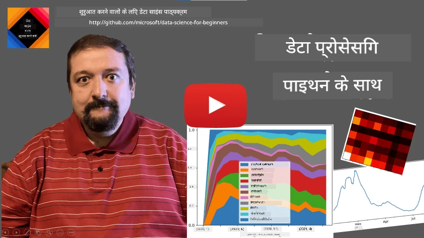
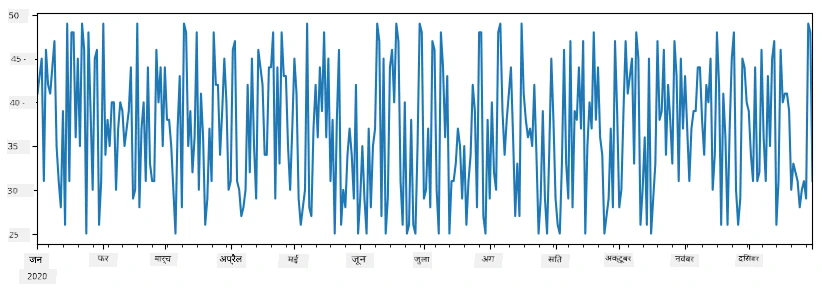
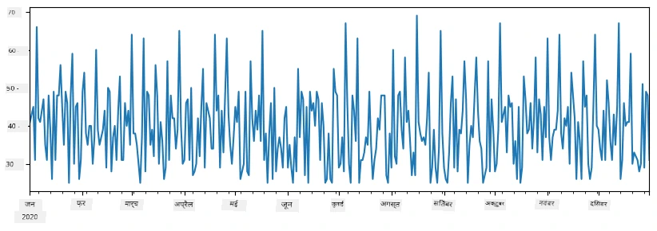
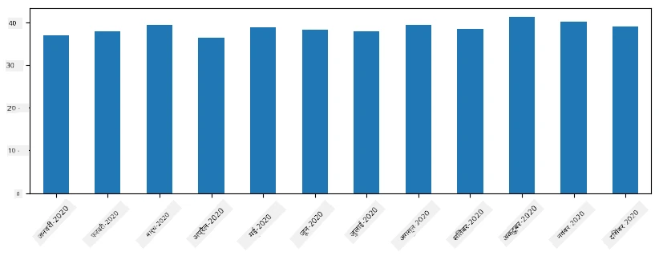
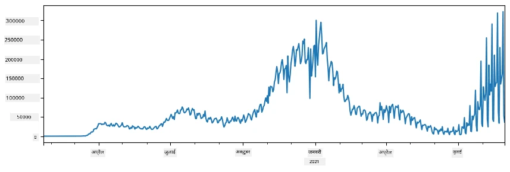
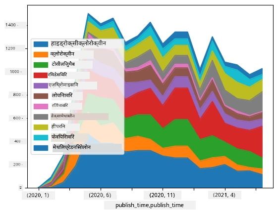

# डेटा के साथ काम करना: पायथन और पांडा लाइब्रेरी

|  ](../../sketchnotes/07-WorkWithPython.png) |
| :-------------------------------------------------------------------------------------------------------: |
|                 पायथन के साथ काम करना - _स्केचनोट द्वारा [@nitya](https://twitter.com/nitya)_                 |

[](https://youtu.be/dZjWOGbsN4Y)

जबकि डेटाबेस डेटा संग्रहित करने और उन्हें क्वेरी भाषाओं के जरिए क्वेरी करने के लिए बहुत कुशल तरीके प्रदान करते हैं, डेटा प्रसंस्करण का सबसे लचीला तरीका अपना स्वयं का प्रोग्राम लिखना है। कई मामलों में, डेटाबेस क्वेरी करना अधिक प्रभावी तरीका होगा। हालांकि कुछ मामलों में जब अधिक जटिल डेटा प्रसंस्करण की आवश्यकता होती है, तो इसे आसानी से SQL के साथ नहीं किया जा सकता।
डेटा प्रसंस्करण किसी भी प्रोग्रामिंग भाषा में प्रोग्राम किया जा सकता है, लेकिन कुछ भाषाएँ डेटा के साथ काम करने के संदर्भ में उच्च स्तरीय हैं। डेटा वैज्ञानिक आमतौर पर निम्नलिखित भाषाओं में से किसी एक को पसंद करते हैं:

* **[Python](https://www.python.org/)**, एक सर्व-उद्देश्यीय प्रोग्रामिंग भाषा, जिसे इसकी सरलता के कारण शुरुआती लोगों के लिए सर्वश्रेष्ठ विकल्पों में से एक माना जाता है। पायथन में कई अतिरिक्त लाइब्रेरीज़ हैं जो आपको कई व्यावहारिक समस्याओं को हल करने में मदद कर सकती हैं, जैसे ZIP आर्काइव से अपना डेटा निकालना, या चित्र को ग्रेस्केल में परिवर्तित करना। डेटा साइंस के अलावा, पायथन वेब विकास के लिए भी अक्सर उपयोग किया जाता है।
* **[R](https://www.r-project.org/)** एक पारंपरिक टूलबॉक्स है जो सांख्यिकीय डेटा प्रसंस्करण को ध्यान में रखकर विकसित किया गया है। इसमें बड़ी लाइब्रेरी रिपोजिटरी (CRAN) भी शामिल है, जो इसे डेटा प्रसंस्करण के लिए अच्छा विकल्प बनाती है। हालांकि, R एक सर्व-उद्देश्यीय प्रोग्रामिंग भाषा नहीं है और डेटा साइंस डोमेन के बाहर शायद ही कभी इस्तेमाल की जाती है।
* **[Julia](https://julialang.org/)** एक और भाषा है जो विशेष रूप से डेटा साइंस के लिए विकसित की गई है। इसका उद्देश्य पायथन की तुलना में बेहतर प्रदर्शन देना है, जिससे यह वैज्ञानिक प्रयोगों के लिए एक महान उपकरण है।

इस पाठ में, हम सरल डेटा प्रसंस्करण के लिए पायथन के उपयोग पर ध्यान केंद्रित करेंगे। हम भाषा की मूल परिचितता मानेंगे। यदि आप पायथन के गहरे परिचय चाहते हैं, तो आप निम्नलिखित संसाधनों में से किसी एक का संदर्भ ले सकते हैं:

* [कछुए ग्राफिक्स और फ्रैक्टल के साथ मजेदार तरीके से पायथन सीखें](https://github.com/shwars/pycourse) - पायथन प्रोग्रामिंग में जल्दी परिचय वाला GitHub आधारित कोर्स
* [पायथन के साथ अपने पहले कदम उठाएँ](https://docs.microsoft.com/en-us/learn/paths/python-first-steps/?WT.mc_id=academic-77958-bethanycheum) [Microsoft Learn](http://learn.microsoft.com/?WT.mc_id=academic-77958-bethanycheum) पर लर्निंग पाथ

डेटा कई रूपों में आ सकता है। इस पाठ में, हम तीन प्रकार के डेटा पर विचार करेंगे - **तालिकात्मक डेटा**, **पाठ्य** और **छवियाँ**।

हम डेटा प्रसंस्करण के कुछ उदाहरणों पर ध्यान केंद्रित करेंगे, बजाय सभी संबंधित लाइब्रेरीज़ का पूरा अवलोकन देने के। इससे आपको संभव चीजों का मुख्य विचार मिलेगा, और जब आपको जरूरत होगी, तब आप अपने समस्याओं के समाधान कहाँ खोजने हैं यह समझ पाएंगे।

> **सबसे उपयोगी सलाह**। जब आपको डेटा पर कोई विशिष्ट ऑपरेशन करना हो और आप न जानें कि कैसे करना है, तो इंटरनेट पर खोज करने की कोशिश करें। [Stackoverflow](https://stackoverflow.com/) आमतौर पर कई सामान्य कार्यों के लिए पायथन में उपयोगी कोड नमूने रखता है।


## [पूर्व-व्याख्यान क्विज़](https://ff-quizzes.netlify.app/en/ds/quiz/12)

## तालिकात्मक डेटा और डाटाफ्रेम

आपने तालिकात्मक डेटा से पहले ही परिचय लिया है जब हमने रिलेशनल डेटाबेस के बारे में बात की थी। जब आपके पास बहुत सारा डेटा होता है, और वह कई अलग-अलग जुड़े हुए टेबल्स में होता है, तो इसके साथ काम करने के लिए SQL का उपयोग करना निश्चित रूप से तर्कसंगत होता है। हालांकि, कई मामले ऐसे हैं जब हमारे पास केवल एक तालिका का डेटा होता है, और हमें इस डेटा के बारे में कुछ **समझ** या **जानकारी** प्राप्त करनी होती है, जैसे वितरण, मानों के बीच सहसंबंध आदि। डेटा साइंस में ऐसे कई मामले हैं जब हमें मूल डेटा का कुछ रूपांतरण करना होता है, उसके बाद विज़ुअलाइज़ेशन करना होता है। ये दोनों चरण पायथन का उपयोग करके आसानी से किए जा सकते हैं।

पायथन में दो सबसे उपयोगी लाइब्रेरीज़ हैं जो आपको तालिकात्मक डेटा से निपटने में मदद कर सकती हैं:
* **[Pandas](https://pandas.pydata.org/)** आपको तथाकथित **डाटाफ्रेम** को संभालने की अनुमति देती है, जो रिलेशनल टेबल्स के सामान होती हैं। आपके पास नामित कॉलम हो सकते हैं, और आप पंक्ति, कॉलम और डाटाफ्रेम के सामान्य रूप से विभिन्न ऑपरेशन कर सकते हैं।
* **[Numpy](https://numpy.org/)** एक लाइब्रेरी है **टेन्सर**, अर्थात् बहुआयामी **ऐरे** के साथ काम करने के लिए। ऐरे में समान मूल प्रकार के मान होते हैं, और यह डाटाफ्रेम की तुलना में सरल होता है, लेकिन यह अधिक गणितीय ऑपरेशन प्रदान करता है, और कम ओवरहेड बनाता है।

कुछ अन्य लाइब्रेरीज़ भी हैं जिनके बारे में आपको जानकारी होनी चाहिए:
* **[Matplotlib](https://matplotlib.org/)** डेटा विज़ुअलाइज़ेशन और ग्राफ़ बनाने के लिए इस्तेमाल की जाने वाली लाइब्रेरी है
* **[SciPy](https://www.scipy.org/)** कुछ अतिरिक्त वैज्ञानिक फ़ंक्शन वाली लाइब्रेरी है। हम इस लाइब्रेरी से पहले ही संभाव्यता और सांख्यिकी पर चर्चा करते हुए परिचित हो चुके हैं

यहाँ कोड का एक हिस्सा है जिसे आप आमतौर पर अपने पायथन प्रोग्राम की शुरुआत में इन लाइब्रेरीज़ को आयात करने के लिए उपयोग करेंगे:
```python
import numpy as np
import pandas as pd
import matplotlib.pyplot as plt
from scipy import ... # आपको सही उप-पैकेज निर्दिष्ट करने होंगे जिनकी आपको आवश्यकता है
``` 

पांडा कुछ मूलभूत अवधारणाओं के चारों ओर केंद्रित है।

### सीरीज़ 

**सीरीज़** मानों का एक अनुक्रम है, जो सूची या numpy ऐरे के समान है। मुख्य अंतर यह है कि सीरीज़ के साथ एक **इंडेक्स** भी होता है, और जब हम सीरीज़ पर ऑपरेशन करते हैं (जैसे, उन्हें जोड़ना), तो इंडेक्स को ध्यान में रखा जाता है। इंडेक्स उतना ही सरल हो सकता है जितना पूर्णांक पंक्ति संख्या (यह डिफ़ॉल्ट इंडेक्स होता है जब सूची या ऐरे से सीरीज़ बनाते हैं), या यह जटिल संरचना हो सकती है, जैसे तारीख अंतराल।

> **नोट**: सहायक नोटबुक [`notebook.ipynb`](notebook.ipynb) में कुछ प्रारंभिक पांडा कोड दिया गया है। हम केवल कुछ उदाहरण यहाँ रेखांकित करते हैं, और आप निश्चित रूप से पूरी नोटबुक देख सकते हैं।

एक उदाहरण पर विचार करें: हम अपने आइस-क्रीम के स्थान की बिक्री का विश्लेषण करना चाहते हैं। आइए किसी समय अवधि के लिए बिक्री की संख्या (हर दिन बेचे गए आइटम की संख्या) की एक सीरीज़ बनाएं:

```python
start_date = "Jan 1, 2020"
end_date = "Mar 31, 2020"
idx = pd.date_range(start_date,end_date)
print(f"Length of index is {len(idx)}")
items_sold = pd.Series(np.random.randint(25,50,size=len(idx)),index=idx)
items_sold.plot()
```


अब मान लीजिए कि हर सप्ताह हम दोस्तों के लिए एक पार्टी का आयोजन करते हैं, और पार्टी के लिए अतिरिक्त 10 पैक आइस-क्रीम लेते हैं। हम एक और सीरीज बना सकते हैं, जो सप्ताह द्वारा अनुक्रमित है, ताकि इसे दर्शाया जा सके:
```python
additional_items = pd.Series(10,index=pd.date_range(start_date,end_date,freq="W"))
```
जब हम दो सीरीज़ जोड़ते हैं, तो हमें कुल संख्या मिलती है:
```python
total_items = items_sold.add(additional_items,fill_value=0)
total_items.plot()
```


> **ध्यान दें** कि हम सरल सिंटैक्स `total_items+additional_items` का उपयोग नहीं कर रहे हैं। यदि हम ऐसा करते, तो हमें परिणामी सीरीज में कई `NaN` (*नॉट अ नंबर*) मान मिलते। इसका कारण यह है कि `additional_items` सीरीज़ में कुछ इंडेक्स बिंदुओं के लिए मान गायब हैं, और `NaN` में कुछ जोड़ने पर परिणाम `NaN` होता है। इसलिए हमें जोड़ते समय `fill_value` पैरामीटर निर्दिष्ट करना होगा।

समय श्रृंखला के साथ, हम श्रृंखला को विभिन्न समय अंतरालों से भी **पुनः नमूने** कर सकते हैं। उदाहरण के लिए, मान लीजिए कि हम मासिक औसत बिक्री मात्रा की गणना करना चाहते हैं। हम निम्नलिखित कोड का उपयोग कर सकते हैं:
```python
monthly = total_items.resample("1M").mean()
ax = monthly.plot(kind='bar')
```


### डाटाफ्रेम

डाटाफ्रेम मूल रूप से समान इंडेक्स वाली कई सीरिज़ का संग्रह होता है। हम कई सीरीज को एक साथ मिलाकर डाटाफ्रेम बना सकते हैं:
```python
a = pd.Series(range(1,10))
b = pd.Series(["I","like","to","play","games","and","will","not","change"],index=range(0,9))
df = pd.DataFrame([a,b])
```
यह एक क्षैतिज तालिका बनाएगा इस प्रकार:
|     | 0   | 1    | 2   | 3   | 4      | 5   | 6      | 7    | 8    |
| --- | --- | ---- | --- | --- | ------ | --- | ------ | ---- | ---- |
| 0   | 1   | 2    | 3   | 4   | 5      | 6   | 7      | 8    | 9    |
| 1   | I   | like | to  | use | Python | and | Pandas | very | much |

हम सीरीज को कॉलम के रूप में भी उपयोग कर सकते हैं, और शब्दकोश के जरिए कॉलम नाम निर्दिष्ट कर सकते हैं:
```python
df = pd.DataFrame({ 'A' : a, 'B' : b })
```
यह हमें इस प्रकार की तालिका देगा:

|     | A   | B      |
| --- | --- | ------ |
| 0   | 1   | I      |
| 1   | 2   | like   |
| 2   | 3   | to     |
| 3   | 4   | use    |
| 4   | 5   | Python |
| 5   | 6   | and    |
| 6   | 7   | Pandas |
| 7   | 8   | very   |
| 8   | 9   | much   |

**नोट** कि हम इस तालिका लेआउट को पिछली तालिका को ट्रांसपोज़ करके भी प्राप्त कर सकते हैं, जैसे लिखकर 
```python
df = pd.DataFrame([a,b]).T.rename(columns={ 0 : 'A', 1 : 'B' })
```
यहाँ `.T` डाटाफ्रेम को ट्रांसपोज़ करने का ऑपरेशन है, अर्थात् पंक्तियों और कॉलमों को बदलना, और `rename` ऑपरेशन हमें कॉलम का नाम पिछली उदाहरण के समान करने की अनुमति देता है।

यहां कुछ सबसे महत्वपूर्ण ऑपरेशन हैं जो हम डाटाफ्रेम पर कर सकते हैं:

**कॉलम चयन**। हम `df['A']` लिखकर व्यक्तिगत कॉलम चुन सकते हैं - यह ऑपरेशन एक सीरीज़ लौटाता है। हम कॉलम के उपसमूह को दूसरे डाटाफ्रेम में भी चुन सकते हैं, जैसे `df[['B','A']]` लिखकर - यह दूसरा डाटाफ्रेम लौटाता है।

केवल कुछ पंक्तियों को चुनना फ़िल्टरिंग है। उदाहरण के लिए, कॉलम `A` जहाँ मान 5 से बड़े हों, केवल वे पंक्तियां रखने के लिए हम लिख सकते हैं `df[df['A']>5]`।

> **नोट**: फिल्टरिंग का तरीका यह है। अभिव्यक्ति `df['A']<5` एक बूलियन सीरीज़ लौटाती है, जो दिखाती है कि प्रत्येक तत्व के लिए यह अभिव्यक्ति `True` है या `False`। जब बूलियन सीरीज़ को इंडेक्स के रूप में उपयोग किया जाता है, तो यह डाटाफ्रेम में पंक्तियों का उपसमूह लौटाता है। इसलिए मनमाना पायथन बूलियन अभिव्यक्ति उपयोग करना संभव नहीं है, उदाहरण के लिए, `df[df['A']>5 and df['A']<7]` गलत होगा। इसके बजाय, आपको विशेष `&` ऑपरेशन का उपयोग करना चाहिए, जैसे `df[(df['A']>5) & (df['A']<7)]` (*कोष्ठक महत्वपूर्ण हैं*).

**नए गणनात्मक कॉलम बनाना**। हम सहज अभिव्यक्तियों का उपयोग करके अपने डाटाफ्रेम के लिए नए गणनात्मक कॉलम आसानी से बना सकते हैं:
```python
df['DivA'] = df['A']-df['A'].mean() 
``` 
यह उदाहरण A के मध्य मान से विचलन की गणना करता है। वास्तव में यहां जो हो रहा है वह यह है कि हम एक सीरीज़ की गणना कर रहे हैं, और फिर इस सीरीज़ को बाएं तरफ असाइन कर रहे हैं, एक नया कॉलम बना रहे हैं। इसलिए, हम ऐसे ऑपरेशन का उपयोग नहीं कर सकते जो सीरीज़ के साथ संगत नहीं हों, उदाहरण के लिए, नीचे दिया गया कोड गलत है:
```python
# गलत कोड -> df['ADescr'] = "Low" यदि df['A'] < 5 तो अन्यथा "Hi"
df['LenB'] = len(df['B']) # <- गलत परिणाम
``` 
बाद वाला उदाहरण, यद्यपि सिन्टैक्टिक रूप से सही है, गलत परिणाम देता है, क्योंकि यह कॉलम में सभी मानों को सीरीज `B` की लंबाई असाइन करता है, न कि व्यक्तिगत तत्वों की लंबाई जैसा हमने सोचा था।

यदि हमें इस तरह की जटिल अभिव्यक्तियाँ गणना करनी हों, तो हम `apply` फ़ंक्शन का उपयोग कर सकते हैं। अंतिम उदाहरण को इस प्रकार लिखा जा सकता है:
```python
df['LenB'] = df['B'].apply(lambda x : len(x))
# या
df['LenB'] = df['B'].apply(len)
```

उपरोक्त ऑपरेशनों के बाद, हमारे पास निम्नलिखित डाटाफ्रेम होगा:

|     | A   | B      | DivA | LenB |
| --- | --- | ------ | ---- | ---- |
| 0   | 1   | I      | -4.0 | 1    |
| 1   | 2   | like   | -3.0 | 4    |
| 2   | 3   | to     | -2.0 | 2    |
| 3   | 4   | use    | -1.0 | 3    |
| 4   | 5   | Python | 0.0  | 6    |
| 5   | 6   | and    | 1.0  | 3    |
| 6   | 7   | Pandas | 2.0  | 6    |
| 7   | 8   | very   | 3.0  | 4    |
| 8   | 9   | much   | 4.0  | 4    |

**संख्याओं के आधार पर पंक्तियाँ चुनना** `iloc` संरचना के उपयोग से किया जा सकता है। उदाहरण के लिए, डाटाफ्रेम से पहली 5 पंक्तियाँ चुनने के लिए:
```python
df.iloc[:5]
```

**ग्रुपिंग** अक्सर *पिवट टेबल* जैसा परिणाम प्राप्त करने के लिए की जाती है। मान लीजिए कि हम प्रत्येक `LenB` मान के लिए कॉलम `A` का औसत मान निकालना चाहते हैं। तब हम अपने डाटाफ्रेम को `LenB` के आधार पर समूहित कर सकते हैं, और `mean` कॉल कर सकते हैं:
```python
df.groupby(by='LenB')[['A','DivA']].mean()
```
यदि हमें समूह में औसत और तत्वों की संख्या दोनों निकालनी हों, तो हम अधिक जटिल `aggregate` फ़ंक्शन का उपयोग कर सकते हैं:
```python
df.groupby(by='LenB') \
 .aggregate({ 'DivA' : len, 'A' : lambda x: x.mean() }) \
 .rename(columns={ 'DivA' : 'Count', 'A' : 'Mean'})
```
यह हमें निम्न तालिका देता है:

| LenB | Count | Mean     |
| ---- | ----- | -------- |
| 1    | 1     | 1.000000 |
| 2    | 1     | 3.000000 |
| 3    | 2     | 5.000000 |
| 4    | 3     | 6.333333 |
| 6    | 2     | 6.000000 |

### डेटा प्राप्त करना


हमने देखा है कि Python ऑब्जेक्ट्स से Series और DataFrames बनाना कितना आसान है। हालांकि, डेटा सामान्यतः एक टेक्स्ट फ़ाइल या Excel तालिका के रूप में आता है। सौभाग्य से, Pandas हमें डिस्क से डेटा लोड करने का एक सरल तरीका प्रदान करता है। उदाहरण के लिए, CSV फ़ाइल पढ़ना इस तरह सरल है:
```python
df = pd.read_csv('file.csv')
```
हम "Challenge" सेक्शन में बाहरी वेब साइटों से डेटा प्राप्त करने सहित डेटा लोड करने के और उदाहरण देखेंगे


### प्रिंटिंग और प्लॉटिंग

एक डेटा वैज्ञानिक को अक्सर डेटा का अन्वेषण करना होता है, इसलिए इसे विज़ुअलाइज़ करने में सक्षम होना महत्वपूर्ण है। जब DataFrame बड़ा होता है, तो कई बार हम केवल यह सुनिश्चित करना चाहते हैं कि हम सब कुछ सही कर रहे हैं, इसे पहली कुछ पंक्तियाँ प्रिंट करके। यह `df.head()` को कॉल करके किया जा सकता है। यदि आप इसे Jupyter Notebook से चला रहे हैं, तो यह DataFrame को एक सुंदर सारणीबद्ध रूप में प्रिंट करेगा।

हमने कुछ स्तंभों को विज़ुअलाइज़ करने के लिए `plot` फ़ंक्शन का उपयोग भी देखा है। जबकि `plot` कई कार्यों के लिए बहुत उपयोगी है, और `kind=` पैरामीटर के माध्यम से कई ग्राफ़ प्रकारों का समर्थन करता है, आप हमेशा कुछ अधिक जटिल प्लॉट करने के लिए कच्ची `matplotlib` लाइब्रेरी का उपयोग कर सकते हैं। हम डेटा विज़ुअलाइज़ेशन को अलग कोर्स के अध्ययनों में विस्तार से कवर करेंगे।

यह अवलोकन Pandas के सबसे महत्वपूर्ण अवधारणाओं को कवर करता है, हालांकि, यह लाइब्रेरी बहुत समृद्ध है, और आप इसके साथ जो कुछ भी कर सकते हैं उसकी कोई सीमा नहीं है! आइए अब इस ज्ञान को किसी विशिष्ट समस्या को हल करने के लिए लागू करें।

## 🚀 चुनौती 1: COVID फैलाव का विश्लेषण

पहली समस्या जिस पर हम ध्यान केंद्रित करेंगे वह COVID-19 के महामारी फैलाव का मॉडलिंग है। ऐसा करने के लिए, हम अलग-अलग देशों में संक्रमित व्यक्तियों की संख्या पर डेटा का उपयोग करेंगे, जो [Center for Systems Science and Engineering](https://systems.jhu.edu/) (CSSE) द्वारा [Johns Hopkins University](https://jhu.edu/) में प्रदान किया गया है। डेटा सेट [इस GitHub रिपॉजिटरी](https://github.com/CSSEGISandData/COVID-19) में उपलब्ध है।

चूंकि हम डेटा के साथ काम करने का तरीका दिखाना चाहते हैं, इसलिए हम आपको [`notebook-covidspread.ipynb`](notebook-covidspread.ipynb) खोलने और इसे ऊपर से नीचे तक पढ़ने के लिए आमंत्रित करते हैं। आप सेल भी निष्पादित कर सकते हैं, और कुछ चुनौतियां कर सकते हैं जो हमने अंत में आपके लिए छोड़ी हैं।



> यदि आप नहीं जानते कि Jupyter Notebook में कोड कैसे चलाएं, तो [इस लेख](https://soshnikov.com/education/how-to-execute-notebooks-from-github/) को देखें।

## असंरचित डेटा के साथ काम करना

जबकि डेटा अक्सर सारणीबद्ध रूप में आता है, कुछ मामलों में हमें कम संरचित डेटा से निपटने की आवश्यकता होती है, जैसे टेक्स्ट या चित्र। इस मामले में, डेटा प्रोसेसिंग तकनीकों को लागू करने के लिए हमें कुछ तरह से संरचित डेटा **निकालना** होगा। यहाँ कुछ उदाहरण हैं:

* टेक्स्ट से कीवर्ड निकालना, और देखना कि वे कीवर्ड कितनी बार प्रकट होते हैं
* चित्र पर वस्तुओं के बारे में जानकारी निकालने के लिए न्यूरल नेटवर्क्स का उपयोग करना
* वीडियो कैमरा फ़ीड पर लोगों के भावनाओं की जानकारी प्राप्त करना

## 🚀 चुनौती 2: COVID पेपर्स का विश्लेषण

इस चुनौती में, हम COVID महामारी के विषय पर वैज्ञानिक पेपर्स के प्रसंस्करण पर केंद्रित रहेंगे। वहाँ [CORD-19 Dataset](https://www.kaggle.com/allen-institute-for-ai/CORD-19-research-challenge) है जिसमें COVID पर 7000 से अधिक पेपर्स (लेखन के समय) उपलब्ध हैं, मेटाडेटा और सारांश के साथ (और उनके आधे के लिए पूरी पाठ सामग्री भी प्रदान की गई है)।

इस डेटासेट का विश्लेषण करने का एक पूर्ण उदाहरण [Text Analytics for Health](https://docs.microsoft.com/azure/cognitive-services/text-analytics/how-tos/text-analytics-for-health/?WT.mc_id=academic-77958-bethanycheum) संज्ञानात्मक सेवा का उपयोग कर [इस ब्लॉग पोस्ट में वर्णित](https://soshnikov.com/science/analyzing-medical-papers-with-azure-and-text-analytics-for-health/) है। हम इस विश्लेषण के सरल संस्करण पर चर्चा करेंगे।

> **NOTE**: हम इस रिपॉजिटरी का हिस्सा के रूप में डेटासेट की प्रति प्रदान नहीं करते हैं। आपको पहले [इस Kaggle डेटासेट](https://www.kaggle.com/allen-institute-for-ai/CORD-19-research-challenge) से [`metadata.csv`](https://www.kaggle.com/allen-institute-for-ai/CORD-19-research-challenge?select=metadata.csv) फ़ाइल डाउनलोड करनी पड़ सकती है। Kaggle पर पंजीकरण आवश्यक हो सकता है। आप बिना पंजीकरण के भी डेटासेट [यहाँ से](https://ai2-semanticscholar-cord-19.s3-us-west-2.amazonaws.com/historical_releases.html) डाउनलोड कर सकते हैं, लेकिन यह मेटाडेटा फ़ाइल के अलावा सभी पूरी पाठ सामग्री भी शामिल होगी।

[`notebook-papers.ipynb`](notebook-papers.ipynb) खोलें और इसे ऊपर से नीचे तक पढ़ें। आप सेल निष्पादित भी कर सकते हैं, और कुछ चुनौतियां कर सकते हैं जो हमने अंत में आपके लिए छोड़ी हैं।



## इमेज डेटा का प्रसंस्करण

हाल ही में, बहुत शक्तिशाली AI मॉडल विकसित किए गए हैं जो हमें छवियों को समझने की अनुमति देते हैं। कई कार्य हैं जिन्हें प्री-ट्रेंड न्यूरल नेटवर्क या क्लाउड सेवाओं का उपयोग करके हल किया जा सकता है। कुछ उदाहरण निम्नलिखित हैं:

* **इमेज वर्गीकरण**, जो आपको छवि को पूर्व-परिभाषित वर्गों में से एक में वर्गीकृत करने में मदद कर सकता है। आप [Custom Vision](https://azure.microsoft.com/services/cognitive-services/custom-vision-service/?WT.mc_id=academic-77958-bethanycheum) जैसी सेवाओं का उपयोग करके आसानी से अपनी स्वयं की इमेज क्लासीफायर ट्रेन कर सकते हैं।
* **ऑब्जेक्ट डिटेक्शन** छवि में विभिन्न वस्तुओं का पता लगाने के लिए। [computer vision](https://azure.microsoft.com/services/cognitive-services/computer-vision/?WT.mc_id=academic-77958-bethanycheum) जैसी सेवाएं कई सामान्य वस्तुओं का पता लगा सकती हैं, और आप कुछ विशिष्ट इच्छित वस्तुओं का पता लगाने के लिए [Custom Vision](https://azure.microsoft.com/services/cognitive-services/custom-vision-service/?WT.mc_id=academic-77958-bethanycheum) मॉडल को प्रशिक्षित कर सकते हैं।
* **चेहरे का पता लगाना**, जिसमें आयु, लिंग और भावनाओं का पता लगाना शामिल है। यह [Face API](https://azure.microsoft.com/services/cognitive-services/face/?WT.mc_id=academic-77958-bethanycheum) के माध्यम से किया जा सकता है।

ये सभी क्लाउड सेवाएं [Python SDKs](https://docs.microsoft.com/samples/azure-samples/cognitive-services-python-sdk-samples/cognitive-services-python-sdk-samples/?WT.mc_id=academic-77958-bethanycheum) का उपयोग करके बुलाई जा सकती हैं, और इसलिए इन्हें आपके डेटा अन्वेषण वर्कफ़्लो में आसानी से शामिल किया जा सकता है।

इमेज डेटा स्रोतों से डेटा अन्वेषण के कुछ उदाहरण यहाँ दिए गए हैं:
* ब्लॉग पोस्ट [How to Learn Data Science without Coding](https://soshnikov.com/azure/how-to-learn-data-science-without-coding/) में हम इंस्टाग्राम फ़ोटो का विश्लेषण करते हैं, यह समझने की कोशिश करते हैं कि लोग किन कारणों से किसी फ़ोटो को अधिक लाइक देते हैं। हम पहले [computer vision](https://azure.microsoft.com/services/cognitive-services/computer-vision/?WT.mc_id=academic-77958-bethanycheum) का उपयोग करके तस्वीरों से अधिकतम जानकारी निकालते हैं, और फिर [Azure Machine Learning AutoML](https://docs.microsoft.com/azure/machine-learning/concept-automated-ml/?WT.mc_id=academic-77958-bethanycheum) का उपयोग करके व्याख्यात्मक मॉडल बनाते हैं।
* [Facial Studies Workshop](https://github.com/CloudAdvocacy/FaceStudies) में हम [Face API](https://azure.microsoft.com/services/cognitive-services/face/?WT.mc_id=academic-77958-bethanycheum) का उपयोग करके घटनाओं से लोगों की तस्वीरों में भावनाओं को निकालते हैं, ताकि यह समझा जा सके कि क्या लोगों को खुश करता है।

## निष्कर्ष

चाहे आपके पास पहले से संरचित हो या असंरचित डेटा हो, Python का उपयोग करके आप डेटा प्रोसेसिंग और समझ से संबंधित सभी चरणों को कर सकते हैं। यह शायद डेटा प्रोसेसिंग का सबसे लचीला तरीका है, और यही कारण है कि अधिकांश डेटा वैज्ञानिक Python को अपना प्राथमिक उपकरण मानते हैं। यदि आप अपनी डेटा साइंस यात्रा के प्रति गंभीर हैं, तो Python को गहराई से सीखना शायद अच्छा विचार है!

## [पाठ के बाद क्विज़](https://ff-quizzes.netlify.app/en/ds/quiz/13)

## समीक्षा एवं स्व-अध्ययन

**पुस्तकें**
* [Wes McKinney. Python for Data Analysis: Data Wrangling with Pandas, NumPy, and IPython](https://www.amazon.com/gp/product/1491957662)

**ऑनलाइन संसाधन**
* आधिकारिक [10 minutes to Pandas](https://pandas.pydata.org/pandas-docs/stable/user_guide/10min.html) ट्यूटोरियल
* [Pandas विज़ुअलाइज़ेशन के लिए डॉक्युमेंटेशन](https://pandas.pydata.org/pandas-docs/stable/user_guide/visualization.html)

**Python सीखना**
* [Turtle Graphics और Fractals के साथ मज़ेदार तरीके से Python सीखें](https://github.com/shwars/pycourse)
* [Python के साथ अपनी पहली कदम उठाएं](https://docs.microsoft.com/learn/paths/python-first-steps/?WT.mc_id=academic-77958-bethanycheum) [Microsoft Learn](http://learn.microsoft.com/?WT.mc_id=academic-77958-bethanycheum) पर सीखने का मार्ग

## असाइनमेंट

[ऊपर दी गई चुनौतियों के लिए और विस्तार से डेटा अध्ययन करें](assignment.md)

## क्रेडिट

इस पाठ को ♥️ के साथ [Dmitry Soshnikov](http://soshnikov.com) द्वारा लिखा गया है

---

<!-- CO-OP TRANSLATOR DISCLAIMER START -->
**अस्वीकरण**:
इस दस्तावेज़ का अनुवाद AI अनुवाद सेवा [Co-op Translator](https://github.com/Azure/co-op-translator) का उपयोग करके किया गया है। जबकि हम सटीकता के लिए प्रयास करते हैं, कृपया ध्यान दें कि स्वचालित अनुवादों में त्रुटियाँ या अशुद्धियाँ हो सकती हैं। मूल दस्तावेज़ अपनी मूल भाषा में ही प्रामाणिक स्रोत माना जाना चाहिए। महत्वपूर्ण जानकारी के लिए, पेशेवर मानव अनुवाद की सिफारिश की जाती है। इस अनुवाद के उपयोग से उत्पन्न किसी भी गलतफहमी या गलत व्याख्या के लिए हम उत्तरदायी नहीं हैं।
<!-- CO-OP TRANSLATOR DISCLAIMER END -->