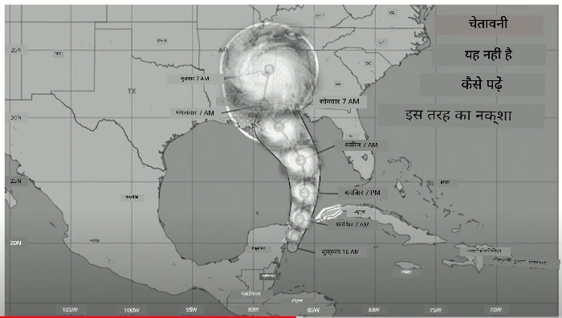
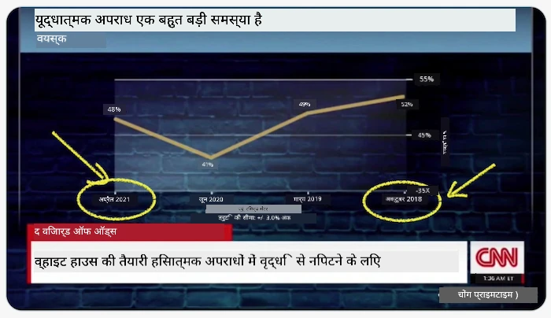
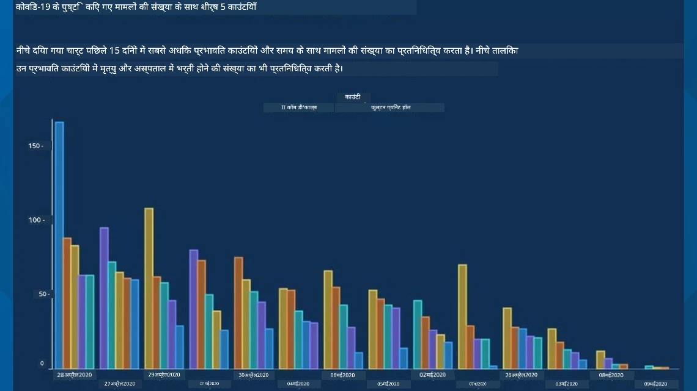
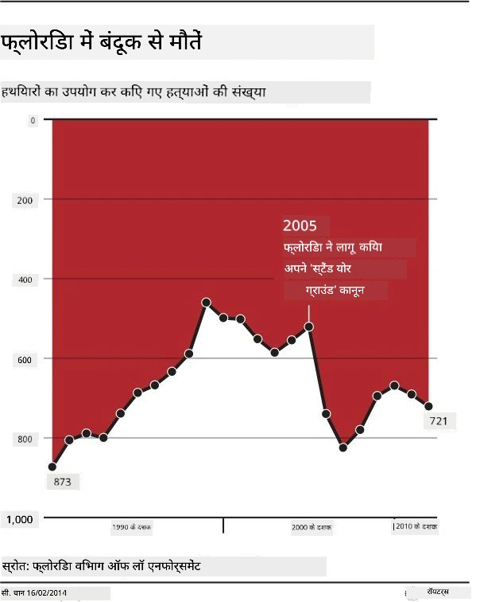
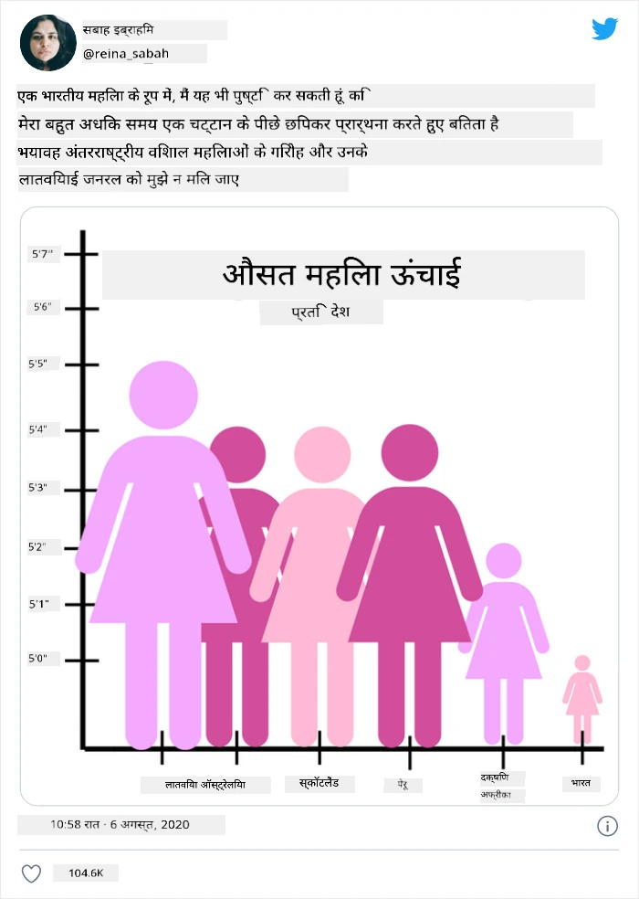
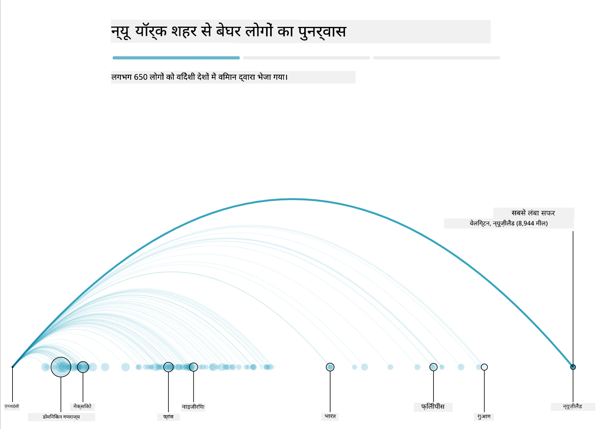
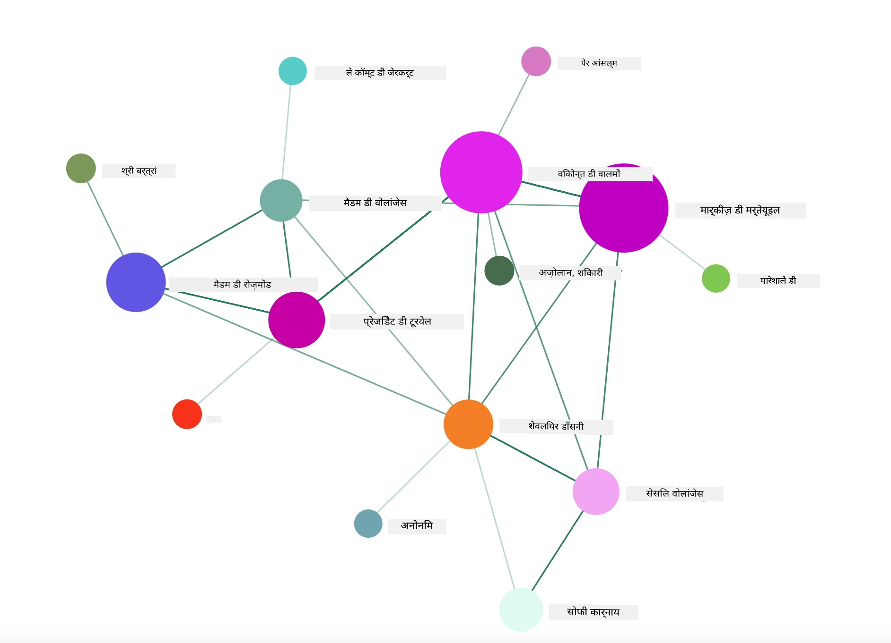

# सार्थक विज़ुअलाइज़ेशन बनाना

| ](../../sketchnotes/13-MeaningfulViz.png)|
|:---:|
| सार्थक विज़ुअलाइज़ेशन - _स्केचनोट द्वारा [@nitya](https://twitter.com/nitya)_ |

> "अगर आप डेटा को पर्याप्त देर तक सताएंगे, तो यह कुछ भी स्वीकार कर लेगा" -- [Ronald Coase](https://en.wikiquote.org/wiki/Ronald_Coase)

एक डेटा वैज्ञानिक का एक मूल कौशल है सार्थक डेटा विज़ुअलाइज़ेशन बनाना जो आपके प्रश्नों का उत्तर देने में मदद करे। डेटा को विज़ुअलाइज़ करने से पहले, आपको यह सुनिश्चित करना होगा कि इसे पहले की तरह साफ़ और तैयार किया गया हो। उसके बाद, आप निर्णय ले सकते हैं कि डेटा को सबसे अच्छी तरह कैसे प्रस्तुत किया जाए।

इस पाठ में, आप समीक्षा करेंगे:

1. सही चार्ट प्रकार कैसे चुनें
2. धोखाधड़ी करने वाले चार्टिंग से कैसे बचें
3. रंग का उपयोग कैसे करें
4. पठनीयता के लिए अपने चार्ट को कैसे स्टाइल करें
5. एनिमेटेड या 3D चार्टिंग समाधान कैसे बनाएं
6. रचनात्मक विज़ुअलाइज़ेशन कैसे बनाएं

## [प्राच्याविचार क्विज़](https://ff-quizzes.netlify.app/en/ds/quiz/24)

## सही चार्ट प्रकार चुनें

पिछले पाठों में, आपने Matplotlib और Seaborn का उपयोग करके सभी प्रकार के रोचक डेटा विज़ुअलाइज़ेशन बनाने का प्रयोग किया था। सामान्यतः, आप पूछे जा रहे प्रश्न के लिए इस तालिका का उपयोग करके सही प्रकार का चार्ट चुन सकते हैं:

| आपको क्या करना है:        | आपको इसका उपयोग करना चाहिए:   |
| ------------------------- | ------------------------------ |
| समय के साथ डेटा प्रवृत्तियों को दिखाना | लाइन                             |
| श्रेणियों की तुलना करना        | बार, पाई                        |
| कुलों की तुलना करना           | पाई, स्टैक्ड बार                |
| सम्बन्ध दिखाना               | स्कैटर, लाइन, फेसट, ड्यूल लाइन |
| वितरण दिखाना               | स्कैटर, हिस्टोग्राम, बॉक्स         |
| अनुपात दिखाना               | पाई, डोनट, वाफल              |

> ✅ अपने डेटा की संरचना के आधार पर, आपको टेक्स्ट को संख्यात्मक में परिवर्तित करना पड़ सकता है ताकि कोई दिया गया चार्ट इसे समर्थित कर सके।

## धोखा देने से बचें

यहां तक कि यदि एक डेटा वैज्ञानिक सही डेटा के लिए सही चार्ट चुनने में सावधान भी हो, तो डेटा को साबित करने के लिए कई तरीके होते हैं जिनमें अक्सर डेटा का ही अपमान होता है। धोखा देने वाले चार्ट और इन्फोग्राफिक्स के कई उदाहरण हैं!

[](https://www.youtube.com/watch?v=oX74Nge8Wkw "How charts lie")

> 🎥 धोखा देने वाले चार्ट्स पर एक सम्मेलन बातचीत के लिए ऊपर चित्र पर क्लिक करें

यह चार्ट X अक्ष को उलटा करता है ताकि तारीख के आधार पर सच्चाई के विपरीत दिखा सके:



[यह चार्ट](https://media.firstcoastnews.com/assets/WTLV/images/170ae16f-4643-438f-b689-50d66ca6a8d8/170ae16f-4643-438f-b689-50d66ca6a8d8_1140x641.jpg) और भी अधिक धोखाधड़ीपूर्ण है, क्योंकि आंखें दाहिनी तरफ आकर्षित होती हैं और निष्कर्ष निकालती हैं कि समय के साथ, विभिन्न काउंटियों में COVID मामलों में कमी आई है। वास्तव में, यदि आप तिथियों को ध्यान से देखें, तो आप पाएंगे कि उन्हें धोखा देने वाली नीचे की ओर प्रवृत्ति दिखाने के लिए पुन: व्यवस्थित किया गया है।



यह कुख्यात उदाहरण रंग और एक उल्टा Y अक्ष का उपयोग करता है धोखा देने के लिए: बंदूक-समर्थक कानून की पारित होने के बाद बंदूक मौतों में वृद्धि के बजाय, आंख को धोखा दिया गया है कि इसके विपरीत सच है:



यह विचित्र चार्ट दिखाता है कि अनुपात को कैसे हँसोड़ प्रभाव के लिए चालाकी से बदला जा सकता है:



अतुलनीय की तुलना करना एक और संदिग्ध चाल है। एक [शानदार वेबसाइट](https://tylervigen.com/spurious-correlations) 'स्प्यूरियस करिलेशन' के बारे में है जो तथ्य दिखाती है जैसे मेन में तलाक की दर और मार्जरीन की खपत। एक Reddit समूह भी डेटा के [बदसूरत प्रयोगों](https://www.reddit.com/r/dataisugly/top/?t=all) को संकलित करता है।

यह समझना महत्वपूर्ण है कि धोखाधड़ी करने वाले चार्ट से आंख कितनी आसानी से मूर्ख बन सकती है। हालांकि डेटा वैज्ञानिक का इरादा अच्छा हो, खराब प्रकार के चार्ट जैसे कि बहुत सारी श्रेणियाँ दिखाने वाले पाई चार्ट भी धोखा दे सकते हैं।

## रंग

आपने ऊपर 'फ्लोरिडा बंदूक हिंसा' के चार्ट में देखा कि रंग कैसे चार्ट्स को अतिरिक्त अर्थ दे सकता है, खासकर उन चार्ट्स में जो Matplotlib और Seaborn जैसी लाइब्रेरीज का उपयोग नहीं करते जिनमें कई अनुमोदित रंग पुस्तकालय और पैलेट्स आते हैं। यदि आप हाथ से एक चार्ट बना रहे हैं, तो [रंग सिद्धांत](https://colormatters.com/color-and-design/basic-color-theory) का थोड़ा अध्ययन करें।

> ✅ ध्यान रखें, चार्ट डिजाइन करते समय पहुँच योग्यता विज़ुअलाइज़ेशन का एक महत्वपूर्ण पहलू है। आपके कुछ उपयोगकर्ता रंग अंध हो सकते हैं - क्या आपका चार्ट दृष्टिबाधित उपयोगकर्ताओं के लिए अच्छी तरह दिखता है?

अपने चार्ट के लिए रंग चुनते समय सावधानी बरतें, क्योंकि रंग ऐसा अर्थ प्रदान कर सकता है जो आप अभिप्रेत नहीं करते। ऊपर 'ऊंचाई' चार्ट में 'गुलाबी महिलाएं' स्पष्ट रूप से 'मादा' अर्थ प्रदान करती हैं जो चार्ट की विचित्रता में इज़ाफ़ा करती है।

हालांकि [रंग का अर्थ](https://colormatters.com/color-symbolism/the-meanings-of-colors) दुनिया के विभिन्न हिस्सों में अलग हो सकता है, और उनकी छाया के अनुसार अर्थ बदल सकता है। सामान्य रूप से, रंगों का अर्थ निम्नलिखित होता है:

| रंग    | अर्थ                |
| ------ | -------------------- |
| लाल    | शक्ति               |
| नीला   | विश्वास, निष्ठा      |
| पीला   | खुशी, सावधानी      |
| हरा    | पर्यावरण, भाग्य, ईर्ष्या |
| बैंगनी | खुशी                |
| नारंगी | जीवंतता            |

यदि आपको कस्टम रंगों के साथ एक चार्ट बनाने का कार्य दिया गया है, तो सुनिश्चित करें कि आपके चार्ट दोनों सुलभ हों और आपके द्वारा चुना गया रंग उस अर्थ के साथ मेल खाता हो जिसे आप संप्रेषित करना चाहते हैं।

## पठनीयता के लिए अपने चार्ट को स्टाइल करें

यदि चार्ट पठनीय नहीं हैं तो वे सार्थक नहीं होते! अपने चार्ट की चौड़ाई और ऊँचाई को अपने डेटा के साथ अच्छी तरह से स्केल करने के लिए स्टाइलिंग पर एक पल विचार करें। यदि एक चरों (जैसे सभी 50 राज्यों) को दिखाना है, तो उन्हें संभव हो तो Y अक्ष पर लंबवत दिखाएं ताकि क्षैतिज स्क्रॉलिंग वाला चार्ट बनने से बचा जा सके।

अपने अक्षों को लेबल करें, यदि आवश्यक हो तो लेजेंड प्रदान करें, और बेहतर समझ के लिए टूलटिप्स दें।

यदि आपका डेटा X अक्ष पर टेक्स्टुअल और बहुत है, तो बेहतर पठनीयता के लिए पाठ को कोणीय बना सकते हैं। [Matplotlib](https://matplotlib.org/stable/tutorials/toolkits/mplot3d.html) 3D प्लॉटिंग प्रदान करता है, यदि आपका डेटा इसे सपोर्ट करता है। `mpl_toolkits.mplot3d` का उपयोग कर जटिल डेटा विज़ुअलाइज़ेशन बनाए जा सकते हैं।


## एनिमेशन और 3D चार्ट डिस्प्ले

आज के कुछ बेहतरीन डेटा विज़ुअलाइज़ेशन एनिमेटेड होते हैं। Shirley Wu के पास D3 के साथ अद्भुत एनिमेटेड विज़ुअलाइज़ेशन हैं, जैसे '[फिल्म फ्लावर्स](http://bl.ocks.org/sxywu/raw/d612c6c653fb8b4d7ff3d422be164a5d/)', जहां प्रत्येक फूल एक फिल्म का विज़ुअलाइज़ेशन है। गार्डियन के लिए एक उदाहरण 'bussed out' है, जो विज़ुअलाइज़ेशन को Greensock और D3 के साथ मिलाकर एक इंटरैक्टिव अनुभव प्रदान करता है, जिसमें स्क्रोलटेलिंग लेख प्रारूप है जो दिखाता है कि NYC अपने बेघर समस्या को शहर से बाहर बस द्वारा कैसे संभालता है।



> "Bussed Out: How America Moves its Homeless" from [the Guardian](https://www.theguardian.com/us-news/ng-interactive/2017/dec/20/bussed-out-america-moves-homeless-people-country-study)। विज़ुअलाइज़ेशन Nadieh Bremer & Shirley Wu द्वारा

यह पाठ इन शक्तिशाली विज़ुअलाइज़ेशन लाइब्रेरीज को गहराई से सिखाने के लिए अपर्याप्त है, लेकिन D3 का उपयोग Vue.js ऐप में करें जो "Dangerous Liaisons" पुस्तक का एनिमेटेड सोशल नेटवर्क विज़ुअलाइज़ेशन बनाए।

> "Les Liaisons Dangereuses" एक पत्रिकात्मक उपन्यास है, या ऐसे उपन्यास जो पत्रों की एक श्रृंखला के रूप में प्रस्तुत होता है। इसे 1782 में Choderlos de Laclos ने लिखा था, जो फ्रांसीसी अभिजात वर्ग के दो प्रतिद्वंद्वी पात्रों, विस्कॉन्टे डी वालमोंट और मार्कीज़े डी मर्टुयिल की दुष्ट, नैतिक रूप से भ्रष्ट सामाजिक चालबाज़ियों की कहानी बताता है। वे अंत में नष्ट हो जाते हैं लेकिन बहुत सामाजिक नुकसान पहुंचाते हैं। उपन्यास को उनके सर्कल के विभिन्न लोगों को लिखे गए पत्रों की श्रृंखला के रूप में खुलासा किया जाता है, जो बदला लेने या केवल मुसीबत पैदा करने के लिए योजनाएं बनाते हैं। इन पत्रों का विज़ुअलाइज़ेशन बनाएं ताकि कथा के प्रमुख नायक दृष्टिगत रूप से पता चल सकें।

आप एक वेब ऐप पूर्ण करेंगे जो इस सोशल नेटवर्क का एनिमेटेड दृश्य प्रदर्शित करेगा। यह Vue.js और D3 का उपयोग करके [नेटवर्क का दृश्य](https://github.com/emiliorizzo/vue-d3-network) बनाने के लिए बनाई गई एक लाइब्रेरी का उपयोग करता है। जब ऐप चल रहा हो, तो आप स्क्रीन पर नोड्स को खींच सकते हैं ताकि डेटा को फेरबदल कर सकें।



## प्रोजेक्ट: D3.js का उपयोग करके नेटवर्क दिखाने वाला चार्ट बनाएँ

> इस पाठ फ़ोल्डर में एक `solution` फ़ोल्डर शामिल है जहाँ आप पूर्ण परियोजना अपने संदर्भ के लिए पा सकते हैं।

1. स्टार्टर फ़ोल्डर की रूट में README.md फ़ाइल की निर्देशों का पालन करें। सुनिश्चित करें कि आपके कंप्यूटर पर NPM और Node.js चल रहे हों और अपनी परियोजना की निर्भरताएँ इंस्टॉल करने से पहले।

2. `starter/src` फ़ोल्डर खोलें। आप एक `assets` फ़ोल्डर पाएंगे जहाँ उपन्यास के सभी पत्रों का एक .json फ़ाइल है, नंबरित, 'to' और 'from' एनोटेशन के साथ।

3. `components/Nodes.vue` में कोड पूरा करें ताकि विज़ुअलाइज़ेशन सक्षम हो सके। `createLinks()` नामक मेथड खोजें और नीचे दिए गए नेस्टेड लूप को जोड़ें।

.json ऑब्जेक्ट के माध्यम से लूप करें ताकि पत्रों के 'to' और 'from' डेटा को पकड़ सकें और `links` ऑब्जेक्ट बनाएँ ताकि विज़ुअलाइज़ेशन लाइब्रेरी इसे उपयोग कर सके:

```javascript
//अक्षरों के माध्यम से लूप करें
      let f = 0;
      let t = 0;
      for (var i = 0; i < letters.length; i++) {
          for (var j = 0; j < characters.length; j++) {
              
            if (characters[j] == letters[i].from) {
              f = j;
            }
            if (characters[j] == letters[i].to) {
              t = j;
            }
        }
        this.links.push({ sid: f, tid: t });
      }
  ```
  
अपने टर्मिनल से अपना ऐप चलाएँ (npm run serve) और विज़ुअलाइज़ेशन का आनंद लें!

## 🚀 चुनौती

इंटरनेट की सैर करें और धोखा देने वाले विज़ुअलाइज़ेशन खोजें। लेखक उपयोगकर्ता को कैसे मूर्ख बनाता है, और क्या यह जानबूझकर है? उन विज़ुअलाइज़ेशन को सही करने का प्रयास करें कि वे कैसे दिखने चाहिए।

## [पश्चात-व्याख्यान क्विज़](https://ff-quizzes.netlify.app/en/ds/quiz/25)

## समीक्षा और स्व-अध्ययन

धोखा देने वाले डेटा विज़ुअलाइज़ेशन के बारे में पढ़ने के लिए यहां कुछ लेख हैं:

https://gizmodo.com/how-to-lie-with-data-visualization-1563576606

http://ixd.prattsi.org/2017/12/visual-lies-usability-in-deceptive-data-visualizations/

ऐतिहासिक संपत्तियों और कलाकृतियों के लिए ये रोचक विज़ुअलाइज़ेशन देखें:

https://handbook.pubpub.org/

देखें कि एनिमेशन आपकी विज़ुअलाइज़ेशन को कैसे बढ़ा सकता है:

https://medium.com/@EvanSinar/use-animation-to-supercharge-data-visualization-cd905a882ad4

## असाइनमेंट

[अपना कस्टम विज़ुअलाइज़ेशन बनाएं](assignment.md)

---

<!-- CO-OP TRANSLATOR DISCLAIMER START -->
**अस्वीकरण**:
इस दस्तावेज़ का अनुवाद AI अनुवाद सेवा [Co-op Translator](https://github.com/Azure/co-op-translator) का उपयोग करके किया गया है। जबकि हम सटीकता के लिए प्रयास करते हैं, कृपया ध्यान दें कि स्वचालित अनुवादों में त्रुटियाँ या अशुद्धियाँ हो सकती हैं। मूल दस्तावेज़ अपनी मूल भाषा में ही प्रामाणिक स्रोत माना जाना चाहिए। महत्वपूर्ण जानकारी के लिए, पेशेवर मानव अनुवाद की सिफारिश की जाती है। इस अनुवाद के उपयोग से उत्पन्न किसी भी गलतफहमी या गलत व्याख्या के लिए हम उत्तरदायी नहीं हैं।
<!-- CO-OP TRANSLATOR DISCLAIMER END -->