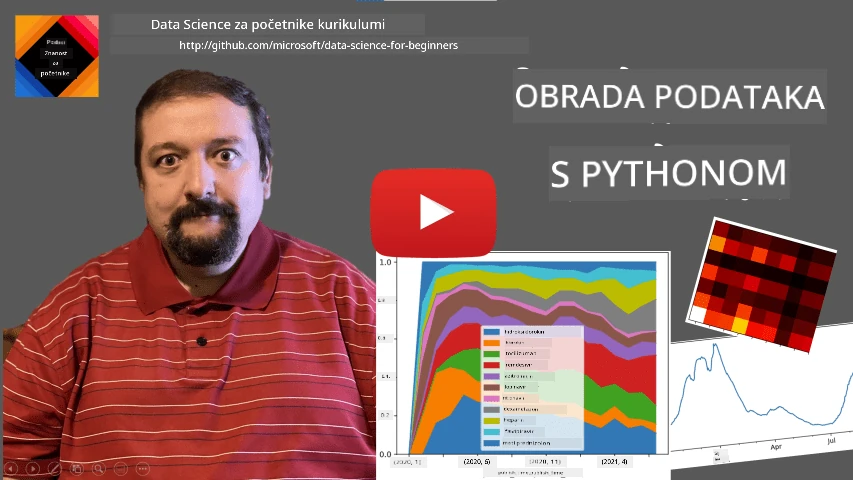
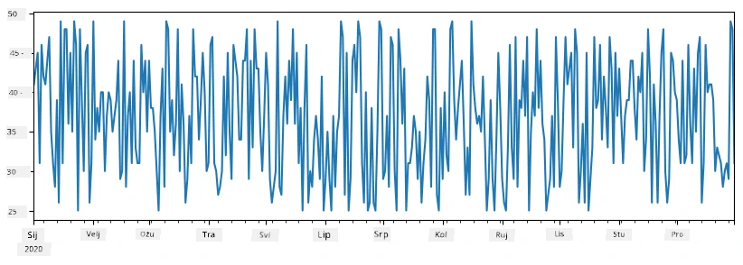
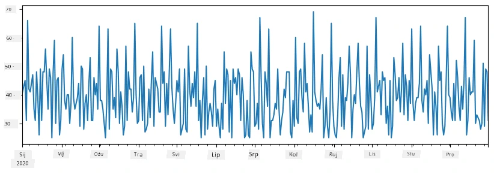
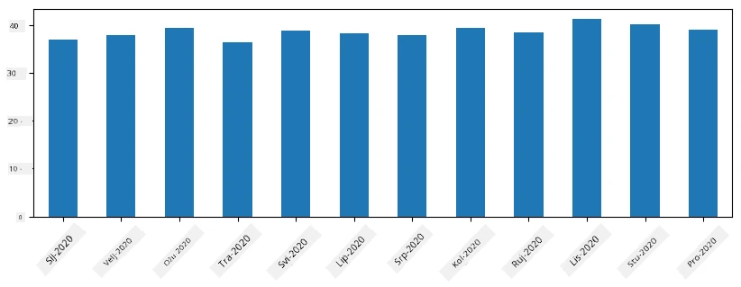
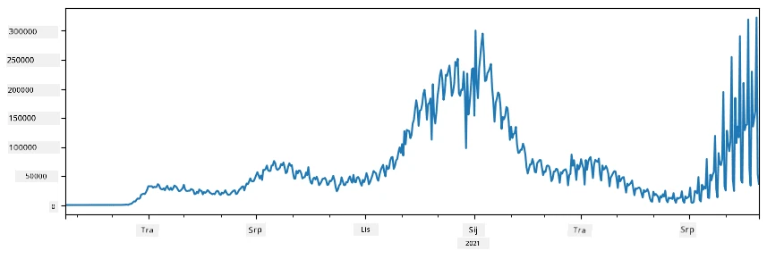
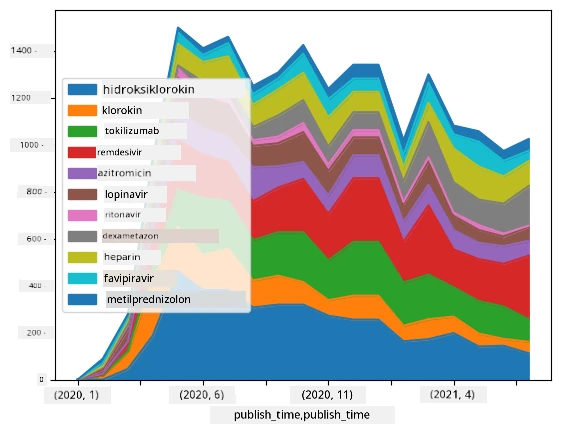

# Rad s podacima: Python i knjižnica Pandas

|  ](../../sketchnotes/07-WorkWithPython.png) |
| :-------------------------------------------------------------------------------------------------------: |
|                 Rad s Pythonom - _Sketchnote od [@nitya](https://twitter.com/nitya)_                 |

[](https://youtu.be/dZjWOGbsN4Y)

Iako baze podataka nude vrlo učinkovite načine za pohranu podataka i njihovo upitavanje pomoću jezika za upite, najfleksibilniji način obrade podataka je pisanje vlastitog programa za manipulaciju podacima. U mnogim slučajevima, izvršavanje upita u bazi podataka bilo bi učinkovitije. Međutim, u nekim slučajevima kada je potrebna složenija obrada podataka, to se ne može lako napraviti pomoću SQL-a.
Obrada podataka može se programirati u bilo kojem programskom jeziku, ali postoje određeni jezici koji su viša razina u pogledu rada s podacima. Znanstvenici podataka obično preferiraju jedan od sljedećih jezika:

* **[Python](https://www.python.org/)**, opći programski jezik koji se često smatra jednom od najboljih opcija za početnike zbog svoje jednostavnosti. Python ima mnoge dodatne knjižnice koje vam mogu pomoći riješiti mnoge praktične probleme, kao što su izvlačenje podataka iz ZIP arhive ili pretvaranje slike u nijanse sive. Osim u znanosti o podacima, Python se također često koristi za web razvoj.
* **[R](https://www.r-project.org/)** je tradicionalni alat razvijen s fokusom na statističku obradu podataka. Također sadrži veliki repozitorij knjižnica (CRAN), što ga čini dobrim izborom za obradu podataka. Međutim, R nije opći programski jezik i rijetko se koristi izvan domene znanosti o podacima.
* **[Julia](https://julialang.org/)** je još jedan jezik razvijen posebno za znanost o podacima. Namijenjen je pružanju bolje performanse od Pythona, čineći ga izvrsnim alatom za znanstvene eksperimente.

U ovoj lekciji fokusirat ćemo se na korištenje Pythona za jednostavnu obradu podataka. Pretpostavit ćemo osnovno poznavanje jezika. Ako želite dublji uvod u Python, možete pogledati jedan od sljedećih izvora:

* [Naučite Python na zabavan način uz Turtle Graphics i Fraktale](https://github.com/shwars/pycourse) - GitHub tijekom brzog uvoda u Python programiranje
* [Uzmite svoje prve korake s Pythonom](https://docs.microsoft.com/en-us/learn/paths/python-first-steps/?WT.mc_id=academic-77958-bethanycheum) Put učenja na [Microsoft Learn](http://learn.microsoft.com/?WT.mc_id=academic-77958-bethanycheum)

Podaci mogu doći u mnogim oblicima. U ovoj lekciji ćemo razmotriti tri oblika podataka - **tablični podaci**, **tekst** i **slike**.

Usredotočit ćemo se na nekoliko primjera obrade podataka, umjesto da vam damo potpuni pregled svih povezanih knjižnica. To će vam omogućiti da steknete glavnu ideju o tome što je moguće i ostavit će vam razumijevanje gdje pronaći rješenja za vaše probleme kad ih zatrebate.

> **Najkorisniji savjet**. Kad trebate izvršiti neku operaciju na podacima za koju ne znate kako, pokušajte je potražiti na internetu. [Stackoverflow](https://stackoverflow.com/) obično sadrži mnogo korisnih primjera koda u Pythonu za mnoge tipične zadatke.


## [Kviz prije lekcije](https://ff-quizzes.netlify.app/en/ds/quiz/12)

## Tablični podaci i DataFrameovi

Već ste upoznali tablične podatke kada smo razgovarali o relacijskim bazama podataka. Kada imate puno podataka koji su sadržani u mnogim različitim povezanim tablicama, definitivno ima smisla koristiti SQL za rad s njima. Međutim, postoji mnogo slučajeva kada imamo tablicu podataka i trebamo dobiti neko **razumijevanje** ili **uvid** u te podatke, poput raspodjele, korelacije između vrijednosti i sl. U znanosti o podacima, često trebamo izvršiti neke transformacije izvornog podatka, praćene vizualizacijom. Oba ta koraka lako se mogu napraviti pomoću Pythona.

Postoje dvije najkorisnije knjižnice u Pythonu koje vam mogu pomoći u radu s tabličnim podacima:
* **[Pandas](https://pandas.pydata.org/)** omogućuje manipulaciju tzv. **DataFrameovima**, koji su analogni relacijskim tablicama. Možete imati imenovane stupce i izvoditi različite operacije na redcima, stupcima i DataFrameovima općenito.
* **[Numpy](https://numpy.org/)** je knjižnica za rad s **tenzorima**, tj. višedimenzionalnim **nizovima** (array). Niz sadrži vrijednosti istog temeljnog tipa, i jednostavniji je od DataFramea, ali nudi više matematičkih operacija i stvara manji režijski trošak.

Postoje i druge knjižnice koje biste trebali poznavati:
* **[Matplotlib](https://matplotlib.org/)** je knjižnica koja se koristi za vizualizaciju podataka i crtanje grafova
* **[SciPy](https://www.scipy.org/)** je knjižnica s dodatnim znanstvenim funkcijama. Već smo naišli na ovu knjižnicu kada smo govorili o vjerojatnosti i statistici

Evo komadić koda koji biste obično koristili za uvoz tih knjižnica na početku vašeg Python programa:
```python
import numpy as np
import pandas as pd
import matplotlib.pyplot as plt
from scipy import ... # morate navesti točne podpakete koje trebate
``` 

Pandas je usmjeren oko nekoliko osnovnih pojmova.

### Series

**Series** je niz vrijednosti, sličan listi ili numpy nizu. Glavna razlika je da serija također ima **indeks**, i kada na seriji izvodimo operacije (npr., zbrajamo ih), indeks se uzima u obzir. Indeks može biti jednostavan kao redni broj cijelog broja (to je indeks koji se koristi prema zadanim postavkama pri stvaranju serije iz liste ili niza), ili može imati složenu strukturu, kao što je vremenski interval.

> **Napomena**: U pratećem bilježniku [`notebook.ipynb`](notebook.ipynb) nalazi se uvodni Pandas kod. Ovdje samo izlažemo neke primjere, a svakako ste pozvani da proučite cijeli bilježnik.

Razmotrimo primjer: želimo analizirati prodaju našeg mjesta za sladoled. Generirat ćemo niz brojeva prodaje (broj prodanih stavki svaki dan) za neki vremenski period:

```python
start_date = "Jan 1, 2020"
end_date = "Mar 31, 2020"
idx = pd.date_range(start_date,end_date)
print(f"Length of index is {len(idx)}")
items_sold = pd.Series(np.random.randint(25,50,size=len(idx)),index=idx)
items_sold.plot()
```


Sad pretpostavimo da svake sedmice organiziramo zabavu za prijatelje i donosimo dodatnih 10 paketa sladoleda za zabavu. Možemo stvoriti drugu seriju, indeksiranu prema tjednu, da to pokažemo:
```python
additional_items = pd.Series(10,index=pd.date_range(start_date,end_date,freq="W"))
```
Kada zbrojimo dvije serije, dobijemo ukupan broj:
```python
total_items = items_sold.add(additional_items,fill_value=0)
total_items.plot()
```


> **Napomena** da ne koristimo jednostavnu sintaksu `total_items+additional_items`. Da jesmo, dobili bismo puno `NaN` (*Not a Number*) vrijednosti u rezultirajućoj seriji. To je zato što nedostaju vrijednosti za neke točke indeksa u seriji `additional_items`, a dodavanje `NaN` na bilo što daje `NaN`. Stoga je potrebno koristiti parametar `fill_value` tijekom zbrajanja.

Kod vremenskih serija također možemo **ponovno uzorkovati** seriju s različitim vremenskim intervalima. Na primjer, pretpostavimo da želimo izračunati prosječnu prodaju mjesečno. Možemo koristiti sljedeći kod:
```python
monthly = total_items.resample("1M").mean()
ax = monthly.plot(kind='bar')
```


### DataFrame

DataFrame je u biti kolekcija serija s istim indeksom. Možemo kombinirati nekoliko serija u jedan DataFrame:
```python
a = pd.Series(range(1,10))
b = pd.Series(["I","like","to","play","games","and","will","not","change"],index=range(0,9))
df = pd.DataFrame([a,b])
```
To će stvoriti horizontalnu tablicu poput ove:
|     | 0   | 1    | 2   | 3   | 4      | 5   | 6      | 7    | 8    |
| --- | --- | ---- | --- | --- | ------ | --- | ------ | ---- | ---- |
| 0   | 1   | 2    | 3   | 4   | 5      | 6   | 7      | 8    | 9    |
| 1   | Ja  | volim | koristiti | Python | i | Pandas | jako | puno |

Također možemo koristiti Series kao stupce i navesti imena stupaca pomoću rječnika:
```python
df = pd.DataFrame({ 'A' : a, 'B' : b })
```
To će nam dati tablicu ovakvog izgleda:

|     | A   | B       |
| --- | --- | ------- |
| 0   | 1   | Ja      |
| 1   | 2   | volim   |
| 2   | 3   | koristiti |
| 3   | 4   | Python  |
| 4   | 5   | i       |
| 5   | 6   | Pandas  |
| 6   | 7   | jako    |
| 7   | 8   | puno    |
| 8   | 9   |         |

**Napomena** da ovu strukturu tablice možemo dobiti i transponiranjem prethodne tablice, npr. pisanjem
```python
df = pd.DataFrame([a,b]).T.rename(columns={ 0 : 'A', 1 : 'B' })
```
Ovdje `.T` označava operaciju transponiranja DataFramea, tj. promjenu redaka i stupaca, a `rename` operacija nam omogućava preimenovanje stupaca da odgovaraju prethodnom primjeru.

Evo nekoliko najvažnijih operacija koje možemo izvesti nad DataFrameovima:

**Izbor stupca**. Možemo odabrati pojedinačne stupce pisanjem `df['A']` - ova operacija vraća Series. Također možemo odabrati podskup stupaca u drugi DataFrame pisanjem `df[['B','A']]` - ovo vraća drugi DataFrame.

**Filtriranje** samo određenih redaka prema kriterijima. Na primjer, da ostavimo samo one retke kod kojih je stupac `A` veći od 5, možemo napisati `df[df['A']>5]`.

> **Napomena**: Način na koji filtriranje radi je sljedeći. Izraz `df['A']<5` vraća boolean seriju, koja označava je li izraz `True` ili `False` za svaki element u izvornom nizu `df['A']`. Kad se boolean serija koristi kao indeks, ona vraća podskup redaka u DataFrameu. Stoga nije moguće koristiti proizvoljni Python boolean izraz, na primjer `df[df['A']>5 and df['A']<7]` bilo bi pogrešno. Umjesto toga trebate koristiti posebnu operaciju `&` na boolean serijama, pišući `df[(df['A']>5) & (df['A']<7)]` (*zagrade su važne ovdje*).

**Kreiranje novih izračunljivih stupaca**. Možemo lako stvoriti nove izračunljive stupce za naš DataFrame koristeći intuitivan izraz poput ovog:
```python
df['DivA'] = df['A']-df['A'].mean() 
``` 
Ovaj primjer izračunava odstupanje A od njegove srednje vrijednosti. Ono što se zapravo događa jest da računamo seriju, te zatim dodjeljujemo tu seriju lijevoj strani, stvarajući novi stupac. Stoga ne možemo koristiti operacije koje nisu kompatibilne sa serijama, na primjer, sljedeći kod je pogrešan:
```python
# Pogrešan kod -> df['ADescr'] = "Low" ako je df['A'] < 5, inače "Hi"
df['LenB'] = len(df['B']) # <- Pogrešan rezultat
``` 
Posljednji primjer, iako je sintaktički ispravan, daje nam pogrešan rezultat jer dodjeljuje duljinu serije `B` svim vrijednostima stupca, a ne duljinu pojedinih elemenata kao što smo zamišljali.

Ako trebamo izračunati složene izraze poput ovog, možemo koristiti funkciju `apply`. Zadnji primjer možemo napisati na sljedeći način:
```python
df['LenB'] = df['B'].apply(lambda x : len(x))
# ili
df['LenB'] = df['B'].apply(len)
```

Nakon gore navedenih operacija, dobit ćemo sljedeći DataFrame:

|     | A   | B       | DivA | LenB |
| --- | --- | ------- | ---- | ---- |
| 0   | 1   | Ja      | -4.0 | 1    |
| 1   | 2   | volim   | -3.0 | 4    |
| 2   | 3   | koristiti | -2.0 | 2    |
| 3   | 4   | Python  | -1.0 | 3    |
| 4   | 5   | i       | 0.0  | 1    |
| 5   | 6   | Pandas  | 1.0  | 3    |
| 6   | 7   | jako    | 2.0  | 6    |
| 7   | 8   | puno    | 3.0  | 4    |
| 8   | 9   |         | 4.0  | 4    |

**Odabir redaka prema brojevima** može se napraviti korištenjem konstrukta `iloc`. Na primjer, za odabir prvih 5 redaka iz DataFramea:
```python
df.iloc[:5]
```

**Grupiranje** se često koristi za dobivanje rezultata sličnog *pivot tablicama* u Excelu. Pretpostavimo da želimo izračunati srednju vrijednost stupca `A` za svaki dani broj `LenB`. Zatim možemo grupirati naš DataFrame po `LenB` i pozvati `mean`:
```python
df.groupby(by='LenB')[['A','DivA']].mean()
```
Ako trebamo izračunati srednju vrijednost i broj elemenata u grupi, tada možemo koristiti složeniju funkciju `aggregate`:
```python
df.groupby(by='LenB') \
 .aggregate({ 'DivA' : len, 'A' : lambda x: x.mean() }) \
 .rename(columns={ 'DivA' : 'Count', 'A' : 'Mean'})
```
Ovo nam daje sljedeću tablicu:

| LenB | Count | Mean     |
| ---- | ----- | -------- |
| 1    | 1     | 1.000000 |
| 2    | 1     | 3.000000 |
| 3    | 2     | 5.000000 |
| 4    | 3     | 6.333333 |
| 6    | 2     | 6.000000 |

### Dobivanje podataka


Vidjeli smo koliko je lako konstruirati Series i DataFrame iz Python objekata. Međutim, podaci obično dolaze u obliku tekstualne datoteke ili Excel tablice. Srećom, Pandas nam nudi jednostavan način za učitavanje podataka s diska. Na primjer, čitanje CSV datoteke je ovako jednostavno:
```python
df = pd.read_csv('file.csv')
```
Vidjet ćemo još primjera učitavanja podataka, uključujući dohvaćanje s vanjskih web stranica, u odjeljku "Izazov"


### Ispisivanje i crtanje

Data Scientist često mora istraživati podatke, stoga je važno moći ih vizualizirati. Kada je DataFrame velik, često želimo samo provjeriti da radimo sve ispravno ispisivanjem prvih nekoliko redaka. To se može napraviti pozivom `df.head()`. Ako to pokrećete iz Jupyter Notebooka, ispisat će DataFrame u lijepom tabličnom obliku.

Također smo vidjeli upotrebu funkcije `plot` za vizualizaciju nekih stupaca. Iako je `plot` vrlo koristan za mnoge zadatke i podržava mnoge različite vrste grafikona preko parametra `kind=`, uvijek možete koristiti sirovu biblioteku `matplotlib` za crtanje nečeg složenijeg. Detaljno ćemo obraditi vizualizaciju podataka u posebnim lekcijama.

Ovaj pregled pokriva najvažnije koncepte Pandas biblioteke, no biblioteka je vrlo bogata i nema ograničenja što sve možete s njom napraviti! Sada primijenimo ovo znanje za rješavanje konkretnog problema.

## 🚀 Izazov 1: Analiza širenja COVID-a

Prvi problem na koji ćemo se fokusirati je modeliranje širenja epidemije COVID-19. Za to ćemo koristiti podatke o broju zaraženih osoba u različitim zemljama, koje pruža [Center for Systems Science and Engineering](https://systems.jhu.edu/) (CSSE) na [Sveučilištu Johns Hopkins](https://jhu.edu/). Skup podataka dostupan je u [ovom GitHub spremištu](https://github.com/CSSEGISandData/COVID-19).

Budući da želimo pokazati kako raditi s podacima, pozivamo vas da otvorite [`notebook-covidspread.ipynb`](notebook-covidspread.ipynb) i pročitate ga od početka do kraja. Također možete izvršavati ćelije i riješiti neke izazove koje smo ostavili za vas na kraju.



> Ako ne znate kako pokrenuti kod u Jupyter Notebooku, pogledajte [ovaj članak](https://soshnikov.com/education/how-to-execute-notebooks-from-github/).

## Rad s nestrukturiranim podacima

Dok podaci vrlo često dolaze u tabličnom obliku, u nekim slučajevima potrebni su nam manje strukturirani podaci, na primjer tekst ili slike. U tom slučaju, da bismo primijenili tehnike obrade podataka koje smo vidjeli gore, trebamo nekako **izvući** strukturirane podatke. Evo nekoliko primjera:

* Izvlačenje ključnih riječi iz teksta i praćenje koliko često se te ključne riječi pojavljuju
* Korištenje neuronskih mreža za izvlačenje informacija o objektima na slici
* Dobivanje informacija o emocijama ljudi s video snimke

## 🚀 Izazov 2: Analiza COVID radova

U ovom izazovu nastavljamo s temom COVID pandemije i fokusiramo se na obradu znanstvenih radova iz tog područja. Postoji [CORD-19 Dataset](https://www.kaggle.com/allen-institute-for-ai/CORD-19-research-challenge) s više od 7000 (u trenutku pisanja) radova o COVID-u, dostupnih s metapodacima i sažetcima (za otprilike polovicu od njih postoji i potpuni tekst).

Cjelovit primjer analize ovog skupa podataka koristeći [Text Analytics for Health](https://docs.microsoft.com/azure/cognitive-services/text-analytics/how-tos/text-analytics-for-health/?WT.mc_id=academic-77958-bethanycheum) kognitivnu uslugu opisan je [u ovom blog postu](https://soshnikov.com/science/analyzing-medical-papers-with-azure-and-text-analytics-for-health/). Raspravit ćemo pojednostavljenu verziju te analize.

> **NAPOMENA**: Ne pružamo kopiju skupa podataka kao dio ovog spremišta. Prvo ćete možda morati preuzeti datoteku [`metadata.csv`](https://www.kaggle.com/allen-institute-for-ai/CORD-19-research-challenge?select=metadata.csv) s [ovog skupa podataka na Kaggleu](https://www.kaggle.com/allen-institute-for-ai/CORD-19-research-challenge). Možda je potrebna registracija na Kaggle. Skup podataka možete preuzeti i bez registracije [ovdje](https://ai2-semanticscholar-cord-19.s3-us-west-2.amazonaws.com/historical_releases.html), no bit će uključen sav puni tekst uz datoteku metapodataka.

Otvorite [`notebook-papers.ipynb`](notebook-papers.ipynb) i pročitajte ga od početka do kraja. Također možete izvršavati ćelije i riješiti neke izazove koje smo ostavili za vas na kraju.



## Obrada slika

Nedavno su razvijeni vrlo moćni AI modeli koji nam omogućuju razumijevanje slika. Postoji mnogo zadataka koji se mogu riješiti korištenjem unaprijed naučenih neuronskih mreža ili cloud servisa. Neki primjeri uključuju:

* **Klasifikacija slika**, koja vam može pomoći da kategorizirate sliku u jednu od unaprijed definiranih klasa. Lako možete trenirati vlastite klasifikatore slika koristeći servise poput [Custom Vision](https://azure.microsoft.com/services/cognitive-services/custom-vision-service/?WT.mc_id=academic-77958-bethanycheum)
* **Detekcija objekata** za detekciju različitih objekata na slici. Servisi poput [Computer Vision](https://azure.microsoft.com/services/cognitive-services/computer-vision/?WT.mc_id=academic-77958-bethanycheum) mogu detektirati niz uobičajenih objekata, a možete trenirati model [Custom Vision](https://azure.microsoft.com/services/cognitive-services/custom-vision-service/?WT.mc_id=academic-77958-bethanycheum) za otkrivanje specifičnih objekata od interesa.
* **Detekcija lica**, uključujući procjenu dobi, spola i emocija. To se može napraviti putem [Face API](https://azure.microsoft.com/services/cognitive-services/face/?WT.mc_id=academic-77958-bethanycheum).

Sve te cloud usluge moguće je pozivati pomoću [Python SDK-ova](https://docs.microsoft.com/samples/azure-samples/cognitive-services-python-sdk-samples/cognitive-services-python-sdk-samples/?WT.mc_id=academic-77958-bethanycheum), te ih lako uključiti u svoj proces istraživanja podataka.

Evo nekoliko primjera istraživanja podataka iz izvora slika:
* U blog postu [Kako naučiti Data Science bez kodiranja](https://soshnikov.com/azure/how-to-learn-data-science-without-coding/) istražujemo Instagram fotografije, pokušavajući razumjeti što ljude potiče da daju više lajkova. Prvo izvlačimo što više informacija iz slika korištenjem [Computer Vision](https://azure.microsoft.com/services/cognitive-services/computer-vision/?WT.mc_id=academic-77958-bethanycheum), zatim pomoću [Azure Machine Learning AutoML](https://docs.microsoft.com/azure/machine-learning/concept-automated-ml/?WT.mc_id=academic-77958-bethanycheum) gradimo tumačivi model.
* U [Facial Studies Workshop](https://github.com/CloudAdvocacy/FaceStudies) koristimo [Face API](https://azure.microsoft.com/services/cognitive-services/face/?WT.mc_id=academic-77958-bethanycheum) za izvlačenje emocija ljudi na fotografijama s događaja, kako bismo pokušali razumjeti što ljude čini sretnima.

## Zaključak

Bez obzira imate li već strukturirane ili nestrukturirane podatke, koristeći Python možete izvršiti sve korake vezane uz obradu i razumijevanje podataka. To je vjerojatno najfleksibilniji način obrade podataka, i zato većina data scientista koristi Python kao svoj glavni alat. Dubinsko učenje Pythona dobra je ideja ako ozbiljno pristupate svom Data Science putovanju!

## [Kviz nakon predavanja](https://ff-quizzes.netlify.app/en/ds/quiz/13)

## Pregled i samostalno učenje

**Knjige**
* [Wes McKinney. Python for Data Analysis: Data Wrangling with Pandas, NumPy, and IPython](https://www.amazon.com/gp/product/1491957662)

**Online resursi**
* Službeni [10 minutes to Pandas](https://pandas.pydata.org/pandas-docs/stable/user_guide/10min.html) tutorial
* [Dokumentacija za Pandas vizualizaciju](https://pandas.pydata.org/pandas-docs/stable/user_guide/visualization.html)

**Učenje Pythona**
* [Nauči Python na zabavan način s Turtle Grafikom i Fraktalima](https://github.com/shwars/pycourse)
* [Prvi koraci s Pythonom](https://docs.microsoft.com/learn/paths/python-first-steps/?WT.mc_id=academic-77958-bethanycheum) Learning Path na [Microsoft Learn](http://learn.microsoft.com/?WT.mc_id=academic-77958-bethanycheum)

## Zadatak

[Izvedite detaljniju analizu podataka za gornje izazove](assignment.md)

## Zasluge

Ovu lekciju je s ljubavlju napisao [Dmitry Soshnikov](http://soshnikov.com)

---

<!-- CO-OP TRANSLATOR DISCLAIMER START -->
**Napomena**:
Ovaj dokument je preveden korištenjem AI prevoditeljskog servisa [Co-op Translator](https://github.com/Azure/co-op-translator). Iako težimo točnosti, imajte na umu da automatski prijevodi mogu sadržavati greške ili netočnosti. Izvorni dokument na izvornom jeziku treba smatrati autoritativnim izvorom. Za važne informacije preporuča se profesionalni ljudski prijevod. Nismo odgovorni za bilo kakva nesporazumevanja ili pogrešne interpretacije koje proizlaze iz korištenja ovog prijevoda.
<!-- CO-OP TRANSLATOR DISCLAIMER END -->