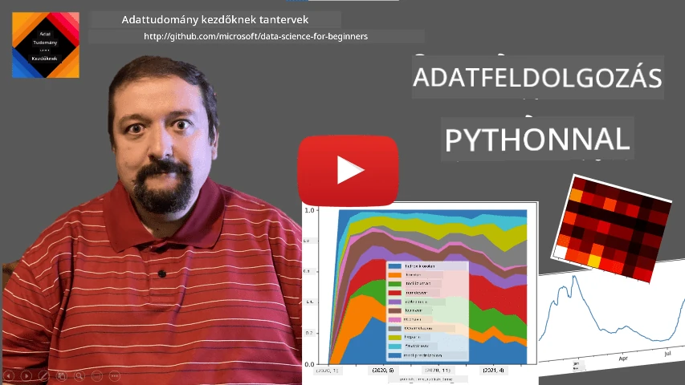
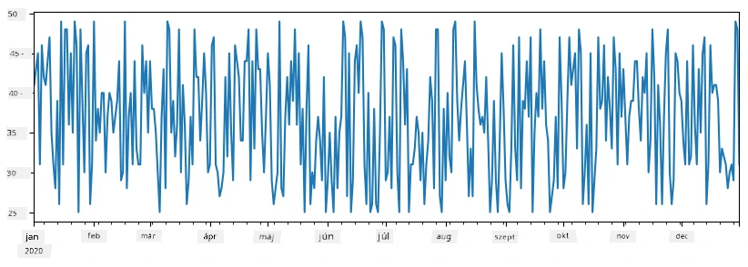
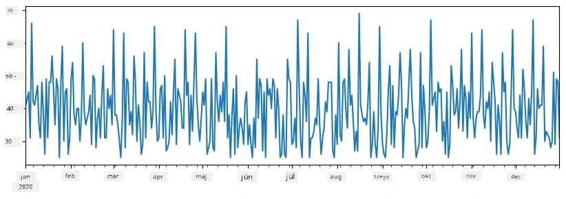
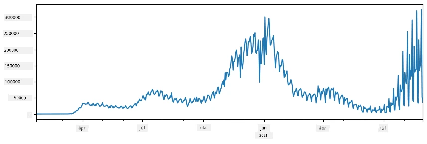
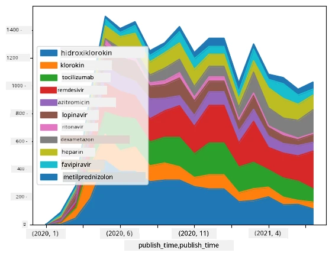

# Adatok kezelése: Python és a Pandas könyvtár

|  ](../../sketchnotes/07-WorkWithPython.png) |
| :-------------------------------------------------------------------------------------------------------: |
|                 Python használata - _Sketchnote készítette [@nitya](https://twitter.com/nitya)_                |

[](https://youtu.be/dZjWOGbsN4Y)

Míg az adatbázisok nagyon hatékony módot kínálnak az adatok tárolására és lekérdezésére lekérdező nyelvek használatával, az adatok feldolgozásának legflexibilisebb módja az, ha saját programot írsz az adatok manipulálására. Sok esetben az adatbázis lekérdezés hatékonyabb megoldás lenne. Azonban bizonyos esetekben, amikor összetettebb adatfeldolgozásra van szükség, azt nem lehet könnyen megoldani SQL segítségével.
Az adatfeldolgozás bármilyen programozási nyelvvel megvalósítható, de vannak olyan nyelvek, amelyek magasabb szintűek az adatok kezelésére. Az adattudósok általában az alábbi nyelvek egyikét favorizálják:

* **[Python](https://www.python.org/)**, egy általános célú programozási nyelv, amelyet gyakran az egyik legjobb választásnak tartanak kezdőknek az egyszerűsége miatt. Python rengeteg extra könyvtárral rendelkezik, melyek segítenek sok gyakorlati problémát megoldani, például adat kinyerése ZIP archívumból vagy kép átalakítása szürkeárnyalatossá. Az adattudomány mellett a Python gyakran használatos webfejlesztésre is.
* **[R](https://www.r-project.org/)** egy hagyományos eszköztár, amely statisztikai adatfeldolgozásra lett kifejlesztve. Nagy könyvtárkészlettel (CRAN) rendelkezik, így jó választás az adatfeldolgozáshoz. Ugyanakkor az R nem általános célú programozási nyelv, és ritkán használják az adattudományi területen kívül.
* **[Julia](https://julialang.org/)** egy másik nyelv, amelyet kifejezetten az adattudomány céljára fejlesztettek. Célja, hogy jobb teljesítményt nyújtson, mint a Python, így kiváló eszköz tudományos kísérletekhez.

Ebben a leckében a Python használatára koncentrálunk egyszerű adatfeldolgozás esetén. Feltételezzük az alapvető nyelvismeretet. Ha mélyebb bevezetőt szeretnél a Python-ba, az alábbi forrásokat ajánljuk:

* [Tanulj Python-t játékosan Turtle grafikával és fraktálokkal](https://github.com/shwars/pycourse) - GitHub alapú gyors Python programozás bevezető tanfolyam
* [Tedd meg az első lépéseidet Python-nal](https://docs.microsoft.com/en-us/learn/paths/python-first-steps/?WT.mc_id=academic-77958-bethanycheum) Tanulási útvonal a [Microsoft Learn](http://learn.microsoft.com/?WT.mc_id=academic-77958-bethanycheum) oldalon

Az adatok sok formában érkezhetnek. Ebben a leckében három formát vizsgálunk meg - **táblázatos adatokat**, **szöveget** és **képeket**.

Néhány adatfeldolgozási példára koncentrálunk, ahelyett, hogy a kapcsolódó könyvtárakat teljes egészében bemutatnánk. Ez megengedi, hogy megértsd a fő elképzelést, és eligazodj, hol találhatod meg a megoldásokat, amikor szükséged van rájuk.

> **Leghasznosabb tanács**. Ha végezni szeretnél egy műveletet az adatokkal, és nem tudod, hogyan, próbálj meg rákeresni az interneten. A [Stackoverflow](https://stackoverflow.com/) rendszerint sok hasznos Python mintakódot tartalmaz sok tipikus feladathoz.


## [Bevezető kvíz](https://ff-quizzes.netlify.app/en/ds/quiz/12)

## Táblázatos Adatok és Dataframe-ek

Már találkoztál táblázatos adatokkal, amikor a relációs adatbázisokról beszéltünk. Ha sok adata van, és az sok, összekapcsolt táblában található, akkor kétségtelenül érdemes az SQL-t használni az adatok kezelésére. Azonban sok esetben van egy adatokat tartalmazó táblázatunk, és szükségünk van arra, hogy **megértsük** vagy **észrevegyük a mintázatokat** az adatokban, például az eloszlást, az értékek közötti korrelációt stb. Az adattudományban gyakran szükséges az eredeti adatok átalakítása, majd vizualizáció. Mindkét lépés könnyen elvégezhető Python segítségével.

Pythonban két leghasznosabb könyvtár segít a táblázatos adatok kezelésében:
* **[Pandas](https://pandas.pydata.org/)** lehetővé teszi úgynevezett **Dataframe**-ek kezelését, amelyek relációs táblákhoz hasonlóak. Lehetnek elnevezett oszlopok, és különféle műveleteket végezhetünk sorokon, oszlopokon és magán a dataframe-en is.
* **[Numpy](https://numpy.org/)** egy könyvtár többdimenziós **tényezők**, azaz tömbök kezelésére. A tömbben az értékek azonos típusúak, ez egyszerűbb, mint egy dataframe, de több matematikai műveletet támogat, és kevesebb plusz terhet jelent.

Van néhány más könyvtár is, amiről tudnia kell:
* **[Matplotlib](https://matplotlib.org/)** könyvtár adatvizualizációhoz és grafikonok megrajzolásához
* **[SciPy](https://www.scipy.org/)** könyvtár néhány további tudományos függvénnyel. Ezzel a könyvtárral már találkoztunk a valószínűség és statisztika tárgyalásánál

Íme egy kódrészlet, amit általában az említett könyvtárak importálására használnál Python program elején:
```python
import numpy as np
import pandas as pd
import matplotlib.pyplot as plt
from scipy import ... # meg kell adnia a pontos alcsomagokat, amikre szüksége van
``` 

A Pandas néhány alapvető koncepció köré épül.

### Sorozat (Series)

A **Series** egy értéksorozat, hasonló egy listához vagy numpy tömbhöz. A fő különbség, hogy a series-nek van egy **indexe**, és amikor műveleteket végzünk series-eken (pl. hozzáadás), az indexszámítás figyelembe van véve. Az index lehet egyszerű, például egész szám sorozatszám (ha listából vagy tömbből hozunk létre series-t, ez az alapértelmezett index), vagy lehet összetett, például dátumtartomány.

> **Megjegyzés**: Van némi bevezető Pandas kód a mellékelt jegyzetfüzetben [`notebook.ipynb`](notebook.ipynb). Itt csak az példákat vázoljuk, de természetesen megtekintheted az egész jegyzetet.

Példaként elemezzük egy fagylaltozó eladásait. Generáljunk egy sorozatot az eladott darabszámokról (az eladott tételek száma naponta) egy adott időszakra:

```python
start_date = "Jan 1, 2020"
end_date = "Mar 31, 2020"
idx = pd.date_range(start_date,end_date)
print(f"Length of index is {len(idx)}")
items_sold = pd.Series(np.random.randint(25,50,size=len(idx)),index=idx)
items_sold.plot()
```


Tegyük fel, hogy hetente baráti partit szervezünk, és a partira további 10 csomag fagylaltot viszünk. Készítsünk egy másik sorozatot, heti indexekkel, hogy ezt bemutassuk:
```python
additional_items = pd.Series(10,index=pd.date_range(start_date,end_date,freq="W"))
```
Két sorozat összeadásakor az összesített darabszámot kapjuk:
```python
total_items = items_sold.add(additional_items,fill_value=0)
total_items.plot()
```


> **Megjegyzés**, hogy nem egyszerűen a `total_items+additional_items` kifejezést használjuk. Ha ezt tettük volna, sok `NaN` (*Nem Szám*) értéket kaptunk volna az eredmény sorozatban. Ez azért van, mert az `additional_items` sorozat némely indexpontjára hiányzó értékek vannak, és `NaN` hozzáadása bármilyen értékhez `NaN`-t eredményez. Ezért az összeadás során a `fill_value` paramétert kell megadni.

Idősorozatoknál a sorozatot különböző időintervallumokra is átvehetjük (resample). Például, ha havi átlagos eladást akarunk számolni, a következő kódot használhatjuk:
```python
monthly = total_items.resample("1M").mean()
ax = monthly.plot(kind='bar')
```


### DataFrame

A DataFrame tulajdonképpen ugyanazzal az indexszel rendelkező sorozatok gyűjteménye. Több sorozatot is összekapcsolhatunk DataFrame-é:
```python
a = pd.Series(range(1,10))
b = pd.Series(["I","like","to","play","games","and","will","not","change"],index=range(0,9))
df = pd.DataFrame([a,b])
```
Ez egy vízszintes táblázatot hoz létre, mint az alábbi:
|     | 0   | 1    | 2   | 3   | 4      | 5   | 6      | 7    | 8    |
| --- | --- | ---- | --- | --- | ------ | --- | ------ | ---- | ---- |
| 0   | 1   | 2    | 3   | 4   | 5      | 6   | 7      | 8    | 9    |
| 1   | I   | like | to  | use | Python | and | Pandas | very | much |

Sorozatokat használhatunk oszlopként is, és megadhatjuk az oszlopneveket szótár segítségével:
```python
df = pd.DataFrame({ 'A' : a, 'B' : b })
```
Ez az alábbi táblázatot eredményezi:

|     | A   | B      |
| --- | --- | ------ |
| 0   | 1   | I      |
| 1   | 2   | like   |
| 2   | 3   | to     |
| 3   | 4   | use    |
| 4   | 5   | Python |
| 5   | 6   | and    |
| 6   | 7   | Pandas |
| 7   | 8   | very   |
| 8   | 9   | much   |

**Megjegyzés**, hogy ezt a táblázatot úgy is megkaphatjuk, ha az előző táblázatot transzponáljuk, pl. az alábbi módon:
```python
df = pd.DataFrame([a,b]).T.rename(columns={ 0 : 'A', 1 : 'B' })
```
 Itt a `.T` a DataFrame transzponálásának műveletét jelenti, vagyis a sorok és oszlopok felcserélését, és a `rename` művelet lehetővé teszi az oszlopok átnevezését, hogy megfeleljen az előző példának.

Íme néhány legfontosabb művelet, amit DataFrame-ekkel végezhetünk:

**Oszlop kiválasztás**. Kiválaszthatunk egyéni oszlopokat azzal, hogy írjuk `df['A']` - ez egy Series-t ad vissza. Szintén kiválaszthatunk egy részhalmaz oszlopokat egy másik DataFrame-be azzal, hogy `df[['B','A']]` - ez egy másik DataFrame-et ad vissza.

**Szűrés** bizonyos sorokra feltételek alapján. Például hogy csak azokat a sorokat hagyjuk meg, ahol az `A` oszlop értéke nagyobb, mint 5, írhatjuk: `df[df['A']>5]`.

> **Megjegyzés**: A szűrés működése a következő. A `df['A']<5` kifejezés egy logikai sorozatot ad vissza, amely megmutatja, hogy az eredeti `df['A']` sorozat egyes elemeire az adott kifejezés igaz vagy hamis. Amikor egy ilyen logikai sorozatot indexként használunk, a DataFrame-ből csak a megfelelő sorok kerülnek kiválasztásra. Ezért nem lehet tetszőleges Python logikai kifejezést használni, például a `df[df['A']>5 and df['A']<7]` helytelen. Ehelyett speciális `&` operátort kell használni a logikai sorozaton, így: `df[(df['A']>5) & (df['A']<7)]` (*a zárójelek itt nagyon fontosak*).

**Új, számítható oszlopok létrehozása**. Könnyen létrehozhatunk új oszlopokat DataFrame-ben intuitív kifejezésekkel, például:
```python
df['DivA'] = df['A']-df['A'].mean() 
``` 
Ez a példa kiszámolja az `A` eltérését az átlagától. Ami itt valójában történik, az az, hogy kiszámítunk egy series-t, majd hozzárendeljük ezt a baloldali változóhoz, létrehozva egy új oszlopot. Ezért nem használhatunk olyan műveleteket, amelyek nem kompatibilisek a series-ekkel. Például a következő kód hibás:
```python
# Hibás kód -> df['ADescr'] = "Low" ha df['A'] < 5 különben "Hi"
df['LenB'] = len(df['B']) # <- Hibás eredmény
``` 
Az utóbbi példa, bár szintaktikailag helyes, helytelen eredményt ad, mert az `B` sorozat hosszát rendeli az oszlop minden értékéhez, nem pedig az egyes elemek hosszát, ahogy szerettük volna.

Ha összetettebb kifejezéseket kell számolnunk, használhatjuk az `apply` függvényt. Az utolsó példát így írhatjuk át:
```python
df['LenB'] = df['B'].apply(lambda x : len(x))
# vagy
df['LenB'] = df['B'].apply(len)
```

A fenti műveletek után a következő DataFrame-et kapjuk:

|     | A   | B      | DivA | LenB |
| --- | --- | ------ | ---- | ---- |
| 0   | 1   | I      | -4.0 | 1    |
| 1   | 2   | like   | -3.0 | 4    |
| 2   | 3   | to     | -2.0 | 2    |
| 3   | 4   | use    | -1.0 | 3    |
| 4   | 5   | Python | 0.0  | 6    |
| 5   | 6   | and    | 1.0  | 3    |
| 6   | 7   | Pandas | 2.0  | 6    |
| 7   | 8   | very   | 3.0  | 4    |
| 8   | 9   | much   | 4.0  | 4    |

**Sorok kiválasztása számok alapján** az `iloc` szerkezet használatával történik. Például az első 5 sor kiválasztásához:
```python
df.iloc[:5]
```

**Csoportosítás** gyakran használatos olyan eredmény létrehozásához, ami hasonló az Excel *kereszt-táblákhoz* (pivot tables). Tegyük fel, hogy az `A` oszlop átlagértékét szeretnénk kiszámolni az egyes `LenB` értékekhez. Akkor csoportosíthatunk a DataFrame-et `LenB` oszlop szerint, és meghívhatjuk a `mean` függvényt:
```python
df.groupby(by='LenB')[['A','DivA']].mean()
```
Ha átlag mellett az elemek számát is szeretnénk meghatározni a csoportban, használhatjuk az összetettebb `aggregate` függvényt:
```python
df.groupby(by='LenB') \
 .aggregate({ 'DivA' : len, 'A' : lambda x: x.mean() }) \
 .rename(columns={ 'DivA' : 'Count', 'A' : 'Mean'})
```
Ez a következő táblázatot eredményezi:

| LenB | Count | Mean     |
| ---- | ----- | -------- |
| 1    | 1     | 1.000000 |
| 2    | 1     | 3.000000 |
| 3    | 2     | 5.000000 |
| 4    | 3     | 6.333333 |
| 6    | 2     | 6.000000 |

### Adatok beszerzése


Láttuk, milyen könnyű Series és DataFrame objektumokat létrehozni Python objektumokból. Azonban az adatok általában egy szövegfájl vagy Excel táblázat formájában érkeznek. Szerencsére a Pandas egyszerű módot kínál arra, hogy lemezről töltsünk be adatokat. Például CSV fájl olvasása ilyen egyszerű:
```python
df = pd.read_csv('file.csv')
```
Az adatbetöltés további példáit, beleértve az adatok külső weboldalakról történő lekérését, a „Kihívás” részben fogjuk megtekinteni


### Nyomtatás és ábrázolás

Egy Data Scientist gyakran kell, hogy felfedezze az adatokat, ezért fontos, hogy képes legyen azokat vizualizálni. Amikor a DataFrame nagy, sokszor csak meg akarjuk győződni arról, hogy mindent helyesen csinálunk az első néhány sor kiíratásával. Ezt a `df.head()` hívásával tehetjük meg. Ha Jupyter Notebookból futtatod, akkor az szép táblázatos formában jeleníti meg a DataFrame-et.

Láttuk a `plot` függvény használatát is, hogy bizonyos oszlopokat vizualizáljunk. Bár a `plot` sok feladatra nagyon hasznos, és a `kind=` paraméterrel sokféle grafikon típust támogat, mindig használhatod a natív `matplotlib` könyvtárat is, ha valami bonyolultabbat szeretnél rajzolni. Az adatvizualizációt részletesen egy külön kurzus leckében tárgyaljuk majd.

Ez az áttekintés lefedi a Pandas legfontosabb fogalmait, de a könyvtár nagyon gazdag, és nincs korlát arra, mit tehetsz vele! Most alkalmazzuk ezt a tudást egy konkrét probléma megoldásához.

## 🚀 Kihívás 1: A COVID terjedésének elemzése

Az első problémánk a COVID-19 járvány terjedésének modellezése. Ehhez a különböző országokban fertőzött egyének számával kapcsolatos adatokat fogjuk használni, amelyeket a [Johns Hopkins Egyetem](https://jhu.edu/) [System Science and Engineering Center](https://systems.jhu.edu/) (CSSE) biztosít. Az adatkészlet elérhető [ebben a GitHub tárolóban](https://github.com/CSSEGISandData/COVID-19).

Mivel azt szeretnénk megmutatni, hogyan kell az adatokkal dolgozni, kérünk, hogy nyisd meg a [`notebook-covidspread.ipynb`](notebook-covidspread.ipynb) fájlt és olvasd végig az elejétől a végéig. A cellákat is lefuttathatod, és megoldhatod az utolsó részben hagyott kihívásokat.



> Ha nem tudod, hogyan futtass kódot Jupyter Notebookban, nézd meg [ezt a cikket](https://soshnikov.com/education/how-to-execute-notebooks-from-github/).

## Dolgozás strukturálatlan adatokkal

Bár az adatok gyakran táblázatos formában érkeznek, bizonyos esetekben kevésbé strukturált adatokkal, például szöveggel vagy képekkel kell foglalkoznunk. Ilyenkor, hogy alkalmazni tudjuk az előzőekben bemutatott adatfeldolgozási technikákat, valahogyan **ki kell nyernünk** a strukturált adatokat. Íme néhány példa:

* Kulcsszavak kinyerése szövegből, és megfigyelése, hogy hányszor fordulnak elő ezek a kulcsszavak
* Neurális hálózatok használata tárgyak azonosítására a képen
* Információk gyűjtése az emberek érzelmi állapotáról a videó kameraképről

## 🚀 Kihívás 2: COVID tudományos cikkek elemzése

Ebben a kihívásban a COVID pandémiával kapcsolatos tudományos cikkek feldolgozására fókuszálunk. Létezik a [CORD-19 Dataset](https://www.kaggle.com/allen-institute-for-ai/CORD-19-research-challenge), amely több mint 7000 cikket tartalmaz (a cikk írásakor), a hozzá tartozó metaadatokkal és kivonatokkal (és körülbelül a cikkek feléhez teljes szöveg is elérhető).

Egy teljes példa a dataset elemzésére a [Text Analytics for Health](https://docs.microsoft.com/azure/cognitive-services/text-analytics/how-tos/text-analytics-for-health/?WT.mc_id=academic-77958-bethanycheum) kognitív szolgáltatás segítségével [ebben a blogbejegyzésben](https://soshnikov.com/science/analyzing-medical-papers-with-azure-and-text-analytics-for-health/) található. Mi egy egyszerűsített változatot fogunk tárgyalni.

> **MEGJEGYZÉS**: Az adatkészlet másolatát nem biztosítjuk ennek a tárolónak a részeként. Először le kell töltened a [`metadata.csv`](https://www.kaggle.com/allen-institute-for-ai/CORD-19-research-challenge?select=metadata.csv) fájlt ebből a [Kaggle adatkészletből](https://www.kaggle.com/allen-institute-for-ai/CORD-19-research-challenge). Lehet, hogy regisztrálnod kell a Kaggle-re. Regisztráció nélkül is letöltheted az adatkészletet [innen](https://ai2-semanticscholar-cord-19.s3-us-west-2.amazonaws.com/historical_releases.html), de ebben a teljes szövegek is benne lesznek a metaadat fájl mellett.

Nyisd meg a [`notebook-papers.ipynb`](notebook-papers.ipynb) fájlt és olvasd végig az elejétől a végéig. A cellákat is futtathatod, és megoldhatod az utolsó részben hagyott kihívásokat.



## Képadatok feldolgozása

Nemrég nagyon hatékony MI modelleket fejlesztettek ki, amelyek lehetővé teszik, hogy megértsük a képeket. Számos feladat megoldható előre betanított neurális hálózatokkal vagy felhőszolgáltatásokkal. Néhány példa:

* **Kép osztályozás**, amely segít kategorizálni a képet előre definiált osztályok egyikébe. Könnyen képezheted saját képosztályozódat szolgáltatások segítségével, például a [Custom Vision](https://azure.microsoft.com/services/cognitive-services/custom-vision-service/?WT.mc_id=academic-77958-bethanycheum) szolgáltatással
* **Tárgyfelismerés** különböző tárgyak azonosításához a képen. Olyan szolgáltatások, mint a [computer vision](https://azure.microsoft.com/services/cognitive-services/computer-vision/?WT.mc_id=academic-77958-bethanycheum) felismernek sok gyakori tárgyat, és a [Custom Vision](https://azure.microsoft.com/services/cognitive-services/custom-vision-service/?WT.mc_id=academic-77958-bethanycheum) modellt is képezheted, hogy bizonyos érdekes tárgyakat felismerjen.
* **Arc felismerés**, beleértve az életkor, nem és érzelem felismerést is. Ezt a [Face API](https://azure.microsoft.com/services/cognitive-services/face/?WT.mc_id=academic-77958-bethanycheum) szolgáltatás biztosítja.

Ezeket a felhőszolgáltatásokat [Python SDK-kkal](https://docs.microsoft.com/samples/azure-samples/cognitive-services-python-sdk-samples/cognitive-services-python-sdk-samples/?WT.mc_id=academic-77958-bethanycheum) hívhatod meg, ezáltal könnyedén beillesztheted adatfeltáró munkafolyamatodba.

Íme néhány példa képekből származó adatforrások felfedezésére:
* A [Hogyan tanulj adat tudományt kódolás nélkül](https://soshnikov.com/azure/how-to-learn-data-science-without-coding/) blogbejegyzésben Instagram fotókat elemzünk, hogy megértsük, miért adnak az emberek több lájkot egy képre. Először annyi információt nyerünk ki a képekből, amennyit csak lehet a [computer vision](https://azure.microsoft.com/services/cognitive-services/computer-vision/?WT.mc_id=academic-77958-bethanycheum) segítségével, majd az [Azure Machine Learning AutoML](https://docs.microsoft.com/azure/machine-learning/concept-automated-ml/?WT.mc_id=academic-77958-bethanycheum) modellel értelmezhető modellt építünk.
* A [Facial Studies Workshop](https://github.com/CloudAdvocacy/FaceStudies) keretében a [Face API](https://azure.microsoft.com/services/cognitive-services/face/?WT.mc_id=academic-77958-bethanycheum) segítségével az eseményeken készített fényképeken szereplő emberek érzelmeit nyerjük ki, hogy megpróbáljuk megérteni, mi teszi boldoggá az embereket.

## Összefoglalás

Akár strukturált, akár strukturálatlan adatokkal dolgozol, a Python segítségével elvégezhetsz minden adatfeldolgozással és megértéssel kapcsolatos lépést. Valószínűleg ez a leginkább rugalmas adatfeldolgozási mód, és ezért használja a data scientist-ek többsége elsődleges eszközként a Pythont. A Python mélyreható tanulása jó ötlet, ha komolyan veszed az adat tudományútadat!

## [Előadás utáni kvíz](https://ff-quizzes.netlify.app/en/ds/quiz/13)

## Áttekintés és önálló tanulás

**Könyvek**
* [Wes McKinney. Python for Data Analysis: Data Wrangling with Pandas, NumPy, and IPython](https://www.amazon.com/gp/product/1491957662)

**Online források**
* Hivatalos [10 perc a Pandas-hoz](https://pandas.pydata.org/pandas-docs/stable/user_guide/10min.html) bemutató
* [Dokumentáció a Pandas vizualizációhoz](https://pandas.pydata.org/pandas-docs/stable/user_guide/visualization.html)

**Python tanulása**
* [Tanulj Python-t játékosan Turtle Graphics-szal és fraktálokkal](https://github.com/shwars/pycourse)
* [Tedd meg az első lépéseidet Python-nal](https://docs.microsoft.com/learn/paths/python-first-steps/?WT.mc_id=academic-77958-bethanycheum) tanulási útvonal a [Microsoft Learn-en](http://learn.microsoft.com/?WT.mc_id=academic-77958-bethanycheum)

## Feladat

[Végezz részletesebb adatvizsgálatot a fenti kihívásokra](assignment.md)

## Köszönetnyilvánítás

Ezt a leckét ♥️-vel írta [Dmitry Soshnikov](http://soshnikov.com)

---

<!-- CO-OP TRANSLATOR DISCLAIMER START -->
**Jogi nyilatkozat**:
Ez a dokumentum az AI fordítási szolgáltatás, a [Co-op Translator](https://github.com/Azure/co-op-translator) segítségével készült. Bár az pontosságra törekszünk, kérjük, vegye figyelembe, hogy az automatikus fordítások hibákat vagy pontatlanságokat tartalmazhatnak. Az eredeti dokumentum az anyanyelvén tekintendő hiteles forrásnak. Fontos információk esetén professzionális emberi fordítást javasolunk. Nem vállalunk felelősséget semmilyen félreértésért vagy téves értelmezésért, amely ebből a fordításból ered.
<!-- CO-OP TRANSLATOR DISCLAIMER END -->