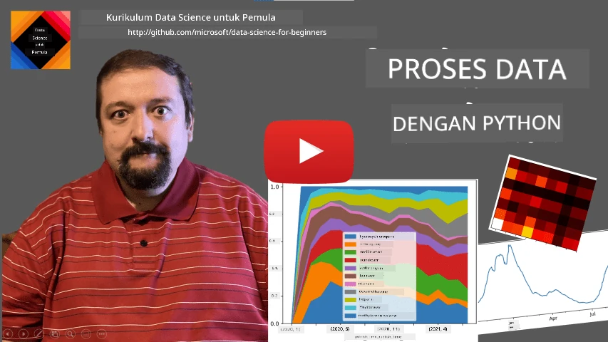
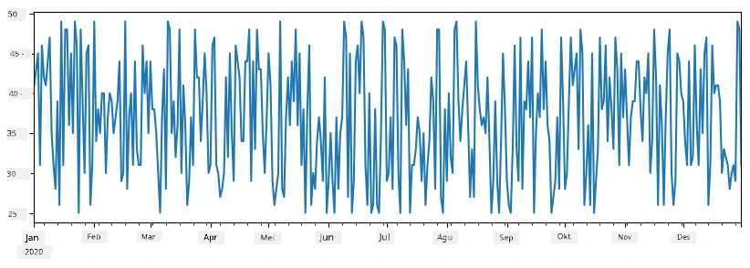
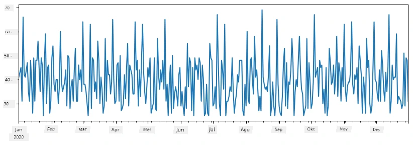
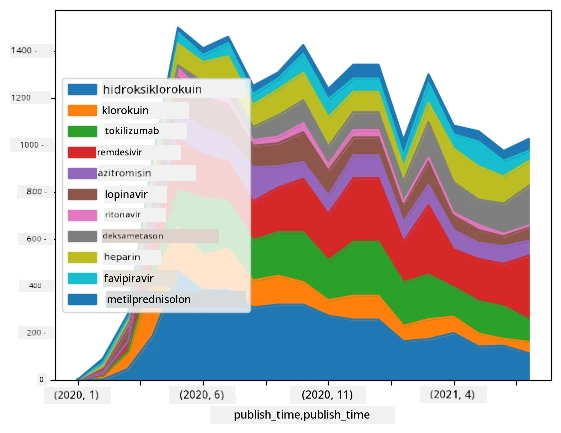

# Bekerja dengan Data: Python dan Perpustakaan Pandas

|  ](../../sketchnotes/07-WorkWithPython.png) |
| :-------------------------------------------------------------------------------------------------------: |
|                Bekerja Dengan Python - _Sketchnote oleh [@nitya](https://twitter.com/nitya)_                |

[](https://youtu.be/dZjWOGbsN4Y)

Sementara basis data menawarkan cara yang sangat efisien untuk menyimpan data dan mengkueri mereka menggunakan bahasa kueri, cara pengolahan data yang paling fleksibel adalah menulis program Anda sendiri untuk memanipulasi data. Dalam banyak kasus, melakukan kueri basis data akan menjadi cara yang lebih efektif. Namun dalam beberapa kasus ketika pengolahan data yang lebih kompleks diperlukan, hal itu tidak dapat dilakukan dengan mudah menggunakan SQL. 
Pengolahan data dapat diprogram dalam bahasa pemrograman apa pun, tetapi ada bahasa tertentu yang lebih tinggi tingkatnya dengan respect terhadap bekerja dengan data. Ilmuwan data biasanya lebih menyukai salah satu dari bahasa berikut:

* **[Python](https://www.python.org/)**, bahasa pemrograman tujuan umum, yang sering dianggap sebagai salah satu pilihan terbaik untuk pemula karena kesederhanaannya. Python memiliki banyak perpustakaan tambahan yang dapat membantu Anda menyelesaikan banyak masalah praktis, seperti mengekstrak data Anda dari arsip ZIP, atau mengubah gambar ke skala abu-abu. Selain untuk ilmu data, Python juga sering digunakan untuk pengembangan web. 
* **[R](https://www.r-project.org/)** adalah kotak peralatan tradisional yang dikembangkan dengan pengolahan data statistik dalam pikiran. Ini juga mengandung repositori besar perpustakaan (CRAN), menjadikannya pilihan yang baik untuk pengolahan data. Namun, R bukan bahasa pemrograman tujuan umum, dan jarang digunakan di luar domain ilmu data.
* **[Julia](https://julialang.org/)** adalah bahasa lain yang dikembangkan khusus untuk ilmu data. Ini dimaksudkan untuk memberikan kinerja yang lebih baik daripada Python, menjadikannya alat yang hebat untuk eksperimen ilmiah.

Dalam pelajaran ini, kita akan fokus menggunakan Python untuk pengolahan data sederhana. Kita akan mengasumsikan pemahaman dasar terhadap bahasa tersebut. Jika Anda ingin tur yang lebih mendalam tentang Python, Anda dapat merujuk pada salah satu sumber berikut:

* [Belajar Python dengan Cara Menyenangkan menggunakan Grafis Turtle dan Fraktal](https://github.com/shwars/pycourse) - Kursus pengantar cepat berbasis GitHub ke Pemrograman Python
* [Mulailah Langkah Pertama Anda dengan Python](https://docs.microsoft.com/en-us/learn/paths/python-first-steps/?WT.mc_id=academic-77958-bethanycheum) Jalur Pembelajaran di [Microsoft Learn](http://learn.microsoft.com/?WT.mc_id=academic-77958-bethanycheum)

Data dapat datang dalam berbagai bentuk. Dalam pelajaran ini, kita akan mempertimbangkan tiga bentuk data - **data tabular**, **teks** dan **gambar**.

Kita akan fokus pada beberapa contoh pengolahan data, daripada memberi Anda gambaran lengkap dari semua perpustakaan terkait. Ini memungkinkan Anda mendapatkan ide utama tentang apa yang mungkin dilakukan, dan memberi Anda pemahaman tentang di mana menemukan solusi untuk masalah Anda kapan pun Anda membutuhkannya.

> **Nasihat yang paling berguna**. Ketika Anda perlu melakukan operasi tertentu pada data yang tidak Anda ketahui caranya, coba cari di internet. [Stackoverflow](https://stackoverflow.com/) biasanya berisi banyak contoh kode berguna dalam Python untuk banyak tugas tipikal. 


## [Kuis pra-ceramah](https://ff-quizzes.netlify.app/en/ds/quiz/12)

## Data Tabular dan Dataframes

Anda sudah pernah bertemu data tabular ketika kita berbicara tentang basis data relasional. Ketika Anda memiliki banyak data, dan data tersebut terkandung dalam banyak tabel berbeda yang terhubung, memang sangat masuk akal untuk menggunakan SQL untuk bekerja dengan data tersebut. Namun, ada banyak kasus ketika kita memiliki tabel data, dan kita perlu mendapatkan **pemahaman** atau **wawasan** tentang data ini, seperti distribusi, korelasi antara nilai, dll. Dalam ilmu data, ada banyak kasus ketika kita perlu melakukan beberapa transformasi data asli, diikuti dengan visualisasi. Kedua langkah tersebut dapat dilakukan dengan mudah menggunakan Python.

Ada dua perpustakaan paling berguna di Python yang dapat membantu Anda menangani data tabular:
* **[Pandas](https://pandas.pydata.org/)** memungkinkan Anda memanipulasi yang disebut **Dataframes**, yang serupa dengan tabel relasional. Anda dapat memiliki kolom bernama, dan melakukan berbagai operasi pada baris, kolom dan dataframe secara umum. 
* **[Numpy](https://numpy.org/)** adalah perpustakaan untuk bekerja dengan **tensor**, yaitu **array** multi-dimensi. Array memiliki nilai tipe yang sama di bawahnya, dan lebih sederhana daripada dataframe, namun menawarkan operasi matematika lebih banyak, dan menghasilkan overhead lebih sedikit.

Ada juga beberapa perpustakaan lain yang harus Anda ketahui:
* **[Matplotlib](https://matplotlib.org/)** adalah perpustakaan yang digunakan untuk visualisasi data dan menggambar grafik
* **[SciPy](https://www.scipy.org/)** adalah perpustakaan dengan beberapa fungsi ilmiah tambahan. Kita sudah pernah bertemu dengan perpustakaan ini ketika membahas probabilitas dan statistik

Berikut adalah potongan kode yang biasanya Anda gunakan untuk mengimpor perpustakaan tersebut pada awal program Python Anda:
```python
import numpy as np
import pandas as pd
import matplotlib.pyplot as plt
from scipy import ... # Anda perlu menentukan sub-paket yang tepat yang Anda butuhkan
``` 

Pandas berpusat pada beberapa konsep dasar.

### Series 

**Series** adalah urutan nilai, mirip dengan list atau array numpy. Perbedaan utama adalah series juga memiliki **indeks**, dan saat kita melakukan operasi pada series (misalnya, menambahkan mereka), indeks diperhitungkan. Indeks bisa sesederhana nomor baris integer (indeks ini digunakan secara default saat membuat series dari list atau array), atau bisa memiliki struktur kompleks, seperti interval tanggal.

> **Catatan**: Ada beberapa kode pengantar Pandas dalam notebook yang menyertainya [`notebook.ipynb`](notebook.ipynb). Kita hanya menguraikan sebagian contoh di sini, dan Anda tentu dipersilakan untuk memeriksa notebook lengkapnya.

Pertimbangkan contoh: kita ingin menganalisis penjualan tempat es krim kita. Mari kita buat series angka penjualan (jumlah barang terjual setiap hari) untuk periode waktu tertentu:

```python
start_date = "Jan 1, 2020"
end_date = "Mar 31, 2020"
idx = pd.date_range(start_date,end_date)
print(f"Length of index is {len(idx)}")
items_sold = pd.Series(np.random.randint(25,50,size=len(idx)),index=idx)
items_sold.plot()
```


Sekarang misalkan setiap minggu kami mengadakan pesta untuk teman-teman, dan kami membawa tambahan 10 paket es krim untuk pesta. Kita bisa membuat series lain, diindeks berdasarkan minggu, untuk menunjukkan hal tersebut:
```python
additional_items = pd.Series(10,index=pd.date_range(start_date,end_date,freq="W"))
```
Ketika kita menambahkan dua series bersama-sama, kita mendapatkan total jumlah:
```python
total_items = items_sold.add(additional_items,fill_value=0)
total_items.plot()
```


> **Catatan** bahwa kita tidak menggunakan sintaks sederhana `total_items+additional_items`. Jika kita melakukannya, kita akan menerima banyak nilai `NaN` (*Not a Number*) dalam series hasil. Ini karena ada nilai yang hilang untuk beberapa titik indeks dalam series `additional_items`, dan menambahkan `NaN` ke apa pun menghasilkan `NaN`. Oleh karena itu kita perlu menentukan parameter `fill_value` saat melakukan penambahan.

Dengan deret waktu, kita juga dapat **mengambil sampel ulang** series dengan interval waktu berbeda. Misalnya, misalkan kita ingin menghitung volume penjualan rata-rata bulanan. Kita dapat menggunakan kode berikut:
```python
monthly = total_items.resample("1M").mean()
ax = monthly.plot(kind='bar')
```


### DataFrame

DataFrame pada dasarnya adalah kumpulan series dengan indeks yang sama. Kita dapat menggabungkan beberapa series menjadi satu DataFrame:
```python
a = pd.Series(range(1,10))
b = pd.Series(["I","like","to","play","games","and","will","not","change"],index=range(0,9))
df = pd.DataFrame([a,b])
```
Ini akan membuat tabel horizontal seperti ini:
|     | 0   | 1    | 2   | 3   | 4      | 5   | 6      | 7    | 8    |
| --- | --- | ---- | --- | --- | ------ | --- | ------ | ---- | ---- |
| 0   | 1   | 2    | 3   | 4   | 5      | 6   | 7      | 8    | 9    |
| 1   | I   | like | to  | use | Python | and | Pandas | very | much |

Kita juga dapat menggunakan Series sebagai kolom, dan menentukan nama kolom menggunakan kamus:
```python
df = pd.DataFrame({ 'A' : a, 'B' : b })
```
Ini akan memberi kita tabel seperti ini:

|     | A   | B      |
| --- | --- | ------ |
| 0   | 1   | I      |
| 1   | 2   | like   |
| 2   | 3   | to     |
| 3   | 4   | use    |
| 4   | 5   | Python |
| 5   | 6   | and    |
| 6   | 7   | Pandas |
| 7   | 8   | very   |
| 8   | 9   | much   |

**Catatan** bahwa kita juga dapat memperoleh layout tabel ini dengan mentransposisikan tabel sebelumnya, misalnya dengan menulis 
```python
df = pd.DataFrame([a,b]).T.rename(columns={ 0 : 'A', 1 : 'B' })
```
Di sini `.T` berarti operasi mentransposisikan DataFrame, yaitu menukar baris dan kolom, dan operasi `rename` memungkinkan kita mengganti nama kolom agar sesuai dengan contoh sebelumnya.

Berikut adalah beberapa operasi terpenting yang dapat kita lakukan pada DataFrame:

**Seleksi kolom**. Kita dapat memilih kolom individual dengan menulis `df['A']` - operasi ini mengembalikan sebuah Series. Kita juga dapat memilih subset kolom ke DataFrame lain dengan menulis `df[['B','A']]` - ini mengembalikan DataFrame lain.

**Menyaring** hanya baris tertentu berdasarkan kriteria. Misalnya, untuk meninggalkan hanya baris dengan kolom `A` lebih besar dari 5, kita dapat menulis `df[df['A']>5]`.

> **Catatan**: Cara kerja penyaringan adalah sebagai berikut. Ekspresi `df['A']<5` mengembalikan series boolean, yang menunjukkan apakah ekspresi bernilai `True` atau `False` untuk setiap elemen series asli `df['A']`. Ketika series boolean digunakan sebagai indeks, ia mengembalikan subset baris dalam DataFrame. Jadi tidak memungkinkan menggunakan ekspresi boolean Python sembarangan, misalnya menulis `df[df['A']>5 and df['A']<7]` akan salah. Sebagai gantinya, Anda harus menggunakan operasi khusus `&` pada series boolean, menulis `df[(df['A']>5) & (df['A']<7)]` (*tanda kurung sangat penting di sini*).

**Membuat kolom baru yang dapat dihitung**. Kita dapat dengan mudah membuat kolom baru yang dapat dihitung pada DataFrame kita dengan menggunakan ekspresi intuitif seperti ini:
```python
df['DivA'] = df['A']-df['A'].mean() 
``` 
Contoh ini menghitung divergensi A dari nilai rata-ratanya. Sebenarnya yang terjadi di sini adalah kita menghitung sebuah series, lalu menetapkan series ini ke sisi kiri, membuat kolom lain. Oleh karena itu, kita tidak dapat menggunakan operasi apa pun yang tidak kompatibel dengan series, misalnya kode di bawah ini salah:
```python
# Kode salah -> df['ADescr'] = "Low" jika df['A'] < 5 else "Hi"
df['LenB'] = len(df['B']) # <- Hasil salah
``` 
Contoh terakhir, walaupun secara sintaksis benar, memberikan hasil yang salah, karena menetapkan panjang series `B` ke semua nilai dalam kolom, bukan panjang dari elemen individual seperti yang kita maksud.

Jika kita perlu menghitung ekspresi kompleks seperti ini, kita dapat menggunakan fungsi `apply`. Contoh terakhir dapat ditulis seperti berikut:
```python
df['LenB'] = df['B'].apply(lambda x : len(x))
# atau
df['LenB'] = df['B'].apply(len)
```

Setelah operasi di atas, kita akan berakhir dengan DataFrame berikut:

|     | A   | B      | DivA | LenB |
| --- | --- | ------ | ---- | ---- |
| 0   | 1   | I      | -4.0 | 1    |
| 1   | 2   | like   | -3.0 | 4    |
| 2   | 3   | to     | -2.0 | 2    |
| 3   | 4   | use    | -1.0 | 3    |
| 4   | 5   | Python | 0.0  | 6    |
| 5   | 6   | and    | 1.0  | 3    |
| 6   | 7   | Pandas | 2.0  | 6    |
| 7   | 8   | very   | 3.0  | 4    |
| 8   | 9   | much   | 4.0  | 4    |

**Memilih baris berdasarkan nomor** dapat dilakukan menggunakan konstruk `iloc`. Misalnya, untuk memilih 5 baris pertama dari DataFrame:
```python
df.iloc[:5]
```

**Pengelompokan** sering digunakan untuk mendapatkan hasil mirip dengan *pivot table* di Excel. Misalkan kita ingin menghitung nilai rata-rata kolom `A` untuk setiap nilai `LenB` tertentu. Lalu kita dapat mengelompokkan DataFrame kita berdasarkan `LenB`, dan memanggil `mean`:
```python
df.groupby(by='LenB')[['A','DivA']].mean()
```
Jika kita perlu menghitung rata-rata dan jumlah elemen dalam grup, maka kita dapat menggunakan fungsi `aggregate` yang lebih kompleks:
```python
df.groupby(by='LenB') \
 .aggregate({ 'DivA' : len, 'A' : lambda x: x.mean() }) \
 .rename(columns={ 'DivA' : 'Count', 'A' : 'Mean'})
```
Ini memberi kita tabel berikut:

| LenB | Count | Mean     |
| ---- | ----- | -------- |
| 1    | 1     | 1.000000 |
| 2    | 1     | 3.000000 |
| 3    | 2     | 5.000000 |
| 4    | 3     | 6.333333 |
| 6    | 2     | 6.000000 |

### Mendapatkan Data


Kita telah melihat betapa mudahnya membuat Series dan DataFrame dari objek Python. Namun, data biasanya datang dalam bentuk file teks, atau tabel Excel. Untungnya, Pandas menawarkan cara sederhana untuk memuat data dari disk. Misalnya, membaca file CSV sesederhana ini:
```python
df = pd.read_csv('file.csv')
```
Kita akan melihat lebih banyak contoh pemuatan data, termasuk mengambil dari situs web eksternal, di bagian "Challenge"


### Mencetak dan Membuat Grafik

Seorang Data Scientist sering harus mengeksplorasi data, oleh karena itu penting untuk dapat memvisualisasikannya. Ketika DataFrame besar, seringkali kita hanya ingin memastikan bahwa kita melakukan semuanya dengan benar dengan mencetak beberapa baris pertama. Ini dapat dilakukan dengan memanggil `df.head()`. Jika Anda menjalankannya dari Jupyter Notebook, itu akan mencetak DataFrame dalam bentuk tabel yang rapi.

Kita juga telah melihat penggunaan fungsi `plot` untuk memvisualisasikan beberapa kolom. Meskipun `plot` sangat berguna untuk banyak tugas, dan mendukung banyak jenis grafik yang berbeda melalui parameter `kind=`, Anda selalu dapat menggunakan pustaka `matplotlib` mentah untuk membuat grafik yang lebih kompleks. Kita akan membahas visualisasi data secara detail dalam pelajaran kursus terpisah.

Ikhtisar ini mencakup konsep paling penting dari Pandas, namun perpustakaannya sangat kaya, dan tidak ada batasan untuk apa yang dapat Anda lakukan dengannya! Sekarang mari kita terapkan pengetahuan ini untuk memecahkan masalah spesifik.

## 🚀 Tantangan 1: Menganalisis Penyebaran COVID

Masalah pertama yang akan kita fokuskan adalah pemodelan penyebaran epidemi COVID-19. Untuk melakukan itu, kita akan menggunakan data jumlah individu yang terinfeksi di berbagai negara, yang disediakan oleh [Center for Systems Science and Engineering](https://systems.jhu.edu/) (CSSE) di [Johns Hopkins University](https://jhu.edu/). Dataset tersedia di [Repositori GitHub ini](https://github.com/CSSEGISandData/COVID-19).

Karena kita ingin menunjukkan cara menangani data, kami mengundang Anda untuk membuka [`notebook-covidspread.ipynb`](notebook-covidspread.ipynb) dan membacanya dari atas ke bawah. Anda juga dapat menjalankan sel-sel, dan melakukan beberapa tantangan yang kami tinggalkan untuk Anda di akhir.


> Jika Anda tidak tahu cara menjalankan kode di Jupyter Notebook, lihat [artikel ini](https://soshnikov.com/education/how-to-execute-notebooks-from-github/).

## Bekerja dengan Data Tidak Terstruktur

Meskipun data seringkali datang dalam bentuk tabel, dalam beberapa kasus kita perlu menangani data yang kurang terstruktur, misalnya, teks atau gambar. Dalam kasus ini, untuk menerapkan teknik pemrosesan data yang telah kita lihat di atas, kita perlu **mengekstrak** data terstruktur. Berikut beberapa contohnya:

* Mengekstrak kata kunci dari teks, dan melihat seberapa sering kata kunci tersebut muncul
* Menggunakan jaringan neural untuk mengekstrak informasi tentang objek pada gambar
* Mendapatkan informasi tentang emosi orang dari rekaman kamera video

## 🚀 Tantangan 2: Menganalisis Makalah COVID

Dalam tantangan ini, kita akan melanjutkan dengan topik pandemi COVID, dan fokus pada pemrosesan makalah ilmiah tentang subjek tersebut. Ada [Dataset CORD-19](https://www.kaggle.com/allen-institute-for-ai/CORD-19-research-challenge) dengan lebih dari 7000 (pada saat tulisan ini dibuat) makalah tentang COVID, tersedia dengan metadata dan abstrak (dan untuk sekitar setengahnya juga disediakan teks lengkap).

Contoh lengkap analisis dataset ini menggunakan layanan kognitif [Text Analytics for Health](https://docs.microsoft.com/azure/cognitive-services/text-analytics/how-tos/text-analytics-for-health/?WT.mc_id=academic-77958-bethanycheum) dijelaskan [dalam posting blog ini](https://soshnikov.com/science/analyzing-medical-papers-with-azure-and-text-analytics-for-health/). Kita akan membahas versi sederhana dari analisis ini.

> **CATATAN**: Kami tidak menyediakan salinan dataset sebagai bagian dari repositori ini. Anda mungkin harus mengunduh terlebih dahulu file [`metadata.csv`](https://www.kaggle.com/allen-institute-for-ai/CORD-19-research-challenge?select=metadata.csv) dari [dataset ini di Kaggle](https://www.kaggle.com/allen-institute-for-ai/CORD-19-research-challenge). Pendaftaran di Kaggle mungkin diperlukan. Anda juga dapat mengunduh dataset tanpa pendaftaran [dari sini](https://ai2-semanticscholar-cord-19.s3-us-west-2.amazonaws.com/historical_releases.html), tetapi itu akan mencakup semua teks lengkap selain file metadata.

Buka [`notebook-papers.ipynb`](notebook-papers.ipynb) dan baca dari atas ke bawah. Anda juga dapat menjalankan sel-sel, dan melakukan beberapa tantangan yang kami tinggalkan untuk Anda di akhir.



## Memproses Data Gambar

Baru-baru ini, model AI yang sangat kuat telah dikembangkan yang memungkinkan kita memahami gambar. Ada banyak tugas yang dapat diselesaikan menggunakan jaringan neural yang telah dilatih sebelumnya, atau layanan cloud. Beberapa contohnya termasuk:

* **Klasifikasi Gambar**, yang dapat membantu Anda mengkategorikan gambar ke dalam salah satu kelas yang telah ditentukan. Anda dapat dengan mudah melatih pengklasifikasi gambar sendiri menggunakan layanan seperti [Custom Vision](https://azure.microsoft.com/services/cognitive-services/custom-vision-service/?WT.mc_id=academic-77958-bethanycheum)
* **Deteksi Objek** untuk mendeteksi objek yang berbeda pada gambar. Layanan seperti [computer vision](https://azure.microsoft.com/services/cognitive-services/computer-vision/?WT.mc_id=academic-77958-bethanycheum) dapat mendeteksi sejumlah objek umum, dan Anda dapat melatih model [Custom Vision](https://azure.microsoft.com/services/cognitive-services/custom-vision-service/?WT.mc_id=academic-77958-bethanycheum) untuk mendeteksi beberapa objek spesifik yang diminati.
* **Deteksi Wajah**, termasuk deteksi Usia, Jenis Kelamin dan Emosi. Ini dapat dilakukan melalui [Face API](https://azure.microsoft.com/services/cognitive-services/face/?WT.mc_id=academic-77958-bethanycheum).

Semua layanan cloud tersebut dapat dipanggil menggunakan [SDK Python](https://docs.microsoft.com/samples/azure-samples/cognitive-services-python-sdk-samples/cognitive-services-python-sdk-samples/?WT.mc_id=academic-77958-bethanycheum), dan dengan demikian dapat dengan mudah diintegrasikan ke dalam alur kerja eksplorasi data Anda.

Berikut beberapa contoh eksplorasi data dari sumber data Gambar:
* Dalam posting blog [Cara Belajar Data Science tanpa Coding](https://soshnikov.com/azure/how-to-learn-data-science-without-coding/) kami menjelajahi foto Instagram, mencoba memahami apa yang membuat orang memberikan lebih banyak suka pada sebuah foto. Kami pertama-tama mengekstrak sebanyak mungkin informasi dari gambar menggunakan [computer vision](https://azure.microsoft.com/services/cognitive-services/computer-vision/?WT.mc_id=academic-77958-bethanycheum), dan kemudian menggunakan [Azure Machine Learning AutoML](https://docs.microsoft.com/azure/machine-learning/concept-automated-ml/?WT.mc_id=academic-77958-bethanycheum) untuk membangun model yang dapat diinterpretasikan.
* Dalam [Facial Studies Workshop](https://github.com/CloudAdvocacy/FaceStudies) kami menggunakan [Face API](https://azure.microsoft.com/services/cognitive-services/face/?WT.mc_id=academic-77958-bethanycheum) untuk mengekstrak emosi orang pada foto-foto dari acara, untuk mencoba memahami apa yang membuat orang bahagia.

## Kesimpulan

Baik Anda sudah memiliki data terstruktur atau tidak terstruktur, menggunakan Python Anda dapat melakukan semua langkah yang terkait dengan pemrosesan dan pemahaman data. Ini mungkin cara paling fleksibel dalam pemrosesan data, dan itulah alasan mengapa sebagian besar data scientist menggunakan Python sebagai alat utama mereka. Mempelajari Python secara mendalam mungkin ide yang baik jika Anda serius dalam perjalanan data science Anda!

## [Kuis setelah kuliah](https://ff-quizzes.netlify.app/en/ds/quiz/13)

## Ulasan & Belajar Mandiri

**Buku**
* [Wes McKinney. Python for Data Analysis: Data Wrangling with Pandas, NumPy, and IPython](https://www.amazon.com/gp/product/1491957662)

**Sumber Daya Online**
* Tutorial resmi [10 menit untuk Pandas](https://pandas.pydata.org/pandas-docs/stable/user_guide/10min.html)
* [Dokumentasi tentang Visualisasi Pandas](https://pandas.pydata.org/pandas-docs/stable/user_guide/visualization.html)

**Belajar Python**
* [Belajar Python dengan Cara Menyenangkan menggunakan Turtle Graphics dan Fraktal](https://github.com/shwars/pycourse)
* [Ambil Langkah Pertama Anda dengan Python](https://docs.microsoft.com/learn/paths/python-first-steps/?WT.mc_id=academic-77958-bethanycheum) Jalur Pembelajaran di [Microsoft Learn](http://learn.microsoft.com/?WT.mc_id=academic-77958-bethanycheum)

## Tugas

[Lakukan studi data yang lebih rinci untuk tantangan di atas](assignment.md)

## Kredit

Pelajaran ini ditulis dengan ♥️ oleh [Dmitry Soshnikov](http://soshnikov.com)

---

<!-- CO-OP TRANSLATOR DISCLAIMER START -->
**Penafian**:
Dokumen ini telah diterjemahkan menggunakan layanan terjemahan AI [Co-op Translator](https://github.com/Azure/co-op-translator). Meskipun kami berupaya untuk mencapai akurasi, harap diketahui bahwa terjemahan otomatis mungkin mengandung kesalahan atau ketidakakuratan. Dokumen asli dalam bahasa aslinya harus dianggap sebagai sumber yang sah. Untuk informasi penting, disarankan menggunakan terjemahan profesional oleh manusia. Kami tidak bertanggung jawab atas kesalahpahaman atau penafsiran yang keliru yang timbul dari penggunaan terjemahan ini.
<!-- CO-OP TRANSLATOR DISCLAIMER END -->