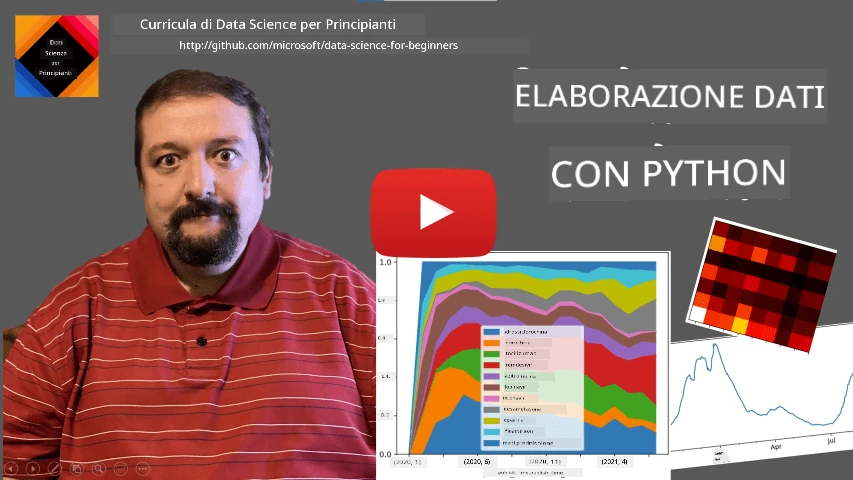
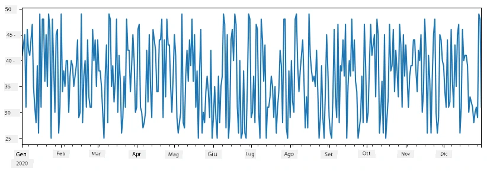
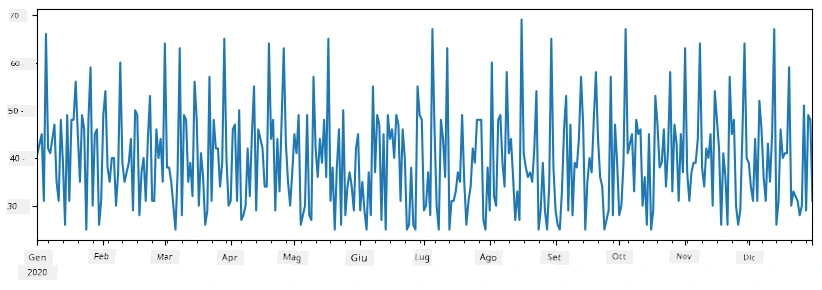
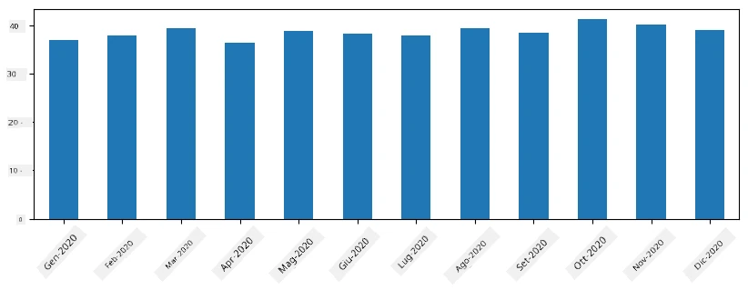
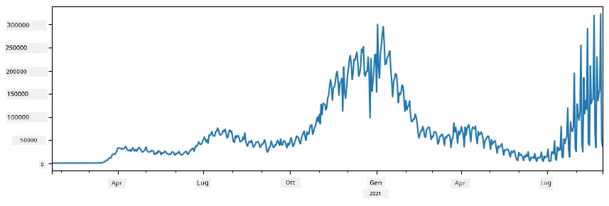
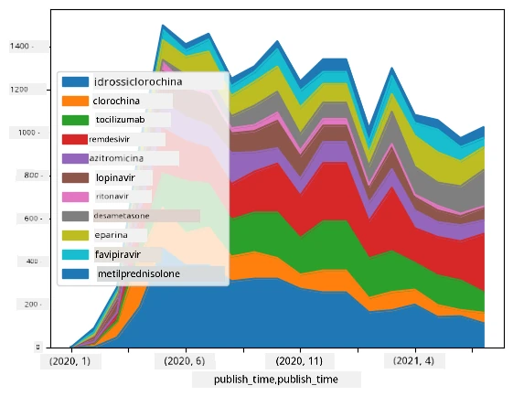

# Lavorare con i Dati: Python e la Libreria Pandas

|  ](../../sketchnotes/07-WorkWithPython.png) |
| :-------------------------------------------------------------------------------------------------------: |
|                 Lavorare con Python - _Sketchnote di [@nitya](https://twitter.com/nitya)_                 |

[](https://youtu.be/dZjWOGbsN4Y)

Mentre i database offrono modi molto efficienti per memorizzare i dati e interrogarli usando linguaggi di query, il modo più flessibile di elaborare i dati è scrivere il proprio programma per manipolare i dati. In molti casi, effettuare una query su un database sarebbe un modo più efficace. Tuttavia, in alcuni casi, quando è necessaria un’elaborazione dei dati più complessa, non può essere fatta facilmente con SQL.
L’elaborazione dei dati può essere programmata in qualsiasi linguaggio di programmazione, ma ci sono alcuni linguaggi che sono di livello più alto rispetto al lavoro con i dati. Gli scienziati dei dati tipicamente preferiscono uno dei seguenti linguaggi:

* **[Python](https://www.python.org/)**, un linguaggio di programmazione general-purpose, spesso considerato una delle migliori opzioni per i principianti grazie alla sua semplicità. Python ha molte librerie aggiuntive che possono aiutarti a risolvere molti problemi pratici, come estrarre i tuoi dati da archivi ZIP o convertire immagini in scala di grigi. Oltre alla data science, Python è spesso usato anche per lo sviluppo web.
* **[R](https://www.r-project.org/)** è uno strumento tradizionale sviluppato con il pensiero all’elaborazione statistica dei dati. Contiene anche un grande repository di librerie (CRAN), rendendolo una buona scelta per l’elaborazione dei dati. Tuttavia, R non è un linguaggio di programmazione general-purpose, ed è raramente usato al di fuori del dominio della data science.
* **[Julia](https://julialang.org/)** è un altro linguaggio sviluppato specificamente per la data science. È pensato per offrire prestazioni migliori rispetto a Python, rendendolo uno strumento eccellente per esperimenti scientifici.

In questa lezione, ci concentreremo sull’uso di Python per semplici elaborazioni di dati. Presumiamo una conoscenza di base del linguaggio. Se vuoi un tour più approfondito di Python, puoi fare riferimento a una delle seguenti risorse:

* [Impara Python in modo divertente con Turtle Graphics e Frattali](https://github.com/shwars/pycourse) - Corso rapido introduttivo su GitHub alla programmazione Python
* [Fai i tuoi primi passi con Python](https://docs.microsoft.com/en-us/learn/paths/python-first-steps/?WT.mc_id=academic-77958-bethanycheum) Percorso di apprendimento su [Microsoft Learn](http://learn.microsoft.com/?WT.mc_id=academic-77958-bethanycheum)

I dati possono presentarsi in molte forme. In questa lezione considereremo tre forme di dati - **dati tabellari**, **testo** e **immagini**.

Ci concentreremo su alcuni esempi di elaborazione dati, invece di fornire una panoramica completa di tutte le librerie correlate. Questo ti permetterà di capire l’idea principale di ciò che è possibile, e ti lascerà con la comprensione di dove trovare soluzioni ai tuoi problemi quando ne avrai bisogno.

> **Consiglio più utile**. Quando devi eseguire una certa operazione sui dati che non sai come fare, prova a cercarla su internet. [Stackoverflow](https://stackoverflow.com/) solitamente contiene molti esempi di codice utile in Python per molti compiti tipici.


## [Quiz pre-lezione](https://ff-quizzes.netlify.app/en/ds/quiz/12)

## Dati Tabellari e Dataframe

Hai già incontrato dati tabellari quando abbiamo parlato di database relazionali. Quando hai molti dati, contenuti in molte tabelle diverse collegate, ha sicuramente senso usare SQL per lavorarci. Tuttavia, ci sono molti casi in cui abbiamo una tabella di dati e abbiamo bisogno di ottenere qualche **comprensione** o **intuizione** su questi dati, come la distribuzione, la correlazione tra valori, ecc. In data science, ci sono molti casi in cui dobbiamo effettuare alcune trasformazioni dei dati originali, seguiti da visualizzazioni. Entrambi questi passaggi possono essere facilmente fatti usando Python.

Ci sono due librerie molto utili in Python che possono aiutarti a gestire i dati tabellari:
* **[Pandas](https://pandas.pydata.org/)** ti permette di manipolare i cosiddetti **DataFrame**, che sono analoghi alle tabelle relazionali. Puoi avere colonne nominate e eseguire diverse operazioni su righe, colonne e dataframe in generale.
* **[Numpy](https://numpy.org/)** è una libreria per lavorare con **tensori**, cioè **array** multidimensionali. L’array contiene valori dello stesso tipo sottostante, ed è più semplice del dataframe, ma offre più operazioni matematiche e crea meno overhead.

Ci sono anche un paio di altre librerie di cui dovresti sapere:
* **[Matplotlib](https://matplotlib.org/)** è una libreria usata per la visualizzazione dei dati e la creazione di grafici
* **[SciPy](https://www.scipy.org/)** è una libreria con alcune funzioni scientifiche aggiuntive. Ci siamo già imbattuti in questa libreria parlando di probabilità e statistica

Ecco un pezzo di codice che tipicamente useresti per importare queste librerie all’inizio del tuo programma Python:
```python
import numpy as np
import pandas as pd
import matplotlib.pyplot as plt
from scipy import ... # è necessario specificare i sottopacchetti esatti di cui hai bisogno
``` 

Pandas è incentrato su pochi concetti base.

### Serie

**Series** è una sequenza di valori, simile a una lista o a un array numpy. La differenza principale è che le series hanno anche un **indice** e quando operiamo sulle series (ad esempio, aggiungendole), l’indice viene preso in considerazione. L’indice può essere semplice come il numero intero di riga (è l’indice usato di default quando si crea una serie da una lista o array), oppure può avere una struttura complessa, come un intervallo di date.

> **Nota**: C’è un codice introduttivo di Pandas nel notebook allegato [`notebook.ipynb`](notebook.ipynb). Qui accenniamo solo alcuni esempi e sei sicuramente invitato a consultare il notebook completo.

Considera un esempio: vogliamo analizzare le vendite del nostro negozio di gelati. Generiamo una serie di numeri di vendite (numero di articoli venduti ogni giorno) per un certo periodo di tempo:

```python
start_date = "Jan 1, 2020"
end_date = "Mar 31, 2020"
idx = pd.date_range(start_date,end_date)
print(f"Length of index is {len(idx)}")
items_sold = pd.Series(np.random.randint(25,50,size=len(idx)),index=idx)
items_sold.plot()
```


Ora supponiamo che ogni settimana organizziamo una festa per amici, e portiamo 10 confezioni extra di gelati per la festa. Possiamo creare un’altra serie, indicizzata per settimana, per dimostrarlo:
```python
additional_items = pd.Series(10,index=pd.date_range(start_date,end_date,freq="W"))
```
Quando sommiamo due series insieme, otteniamo il numero totale:
```python
total_items = items_sold.add(additional_items,fill_value=0)
total_items.plot()
```


> **Nota** che non stiamo usando la sintassi semplice `total_items+additional_items`. Se lo facessimo, otterremmo molti valori `NaN` (*Not a Number*) nella serie risultante. Questo accade perché mancano valori per alcuni punti di indice nella serie `additional_items`, e aggiungere `NaN` a qualsiasi cosa dà come risultato `NaN`. Perciò dobbiamo specificare il parametro `fill_value` durante l’addizione.

Con le serie temporali possiamo anche **riesaminare** la serie con intervalli di tempo diversi. Per esempio, supponiamo di voler calcolare il volume medio di vendite mensilmente. Possiamo usare il seguente codice:
```python
monthly = total_items.resample("1M").mean()
ax = monthly.plot(kind='bar')
```


### DataFrame

Un DataFrame è essenzialmente una collezione di series con lo stesso indice. Possiamo combinare varie series in un unico DataFrame:
```python
a = pd.Series(range(1,10))
b = pd.Series(["I","like","to","play","games","and","will","not","change"],index=range(0,9))
df = pd.DataFrame([a,b])
```
Questo creerà una tabella orizzontale come questa:
|     | 0   | 1    | 2   | 3   | 4      | 5   | 6      | 7    | 8    |
| --- | --- | ---- | --- | --- | ------ | --- | ------ | ---- | ---- |
| 0   | 1   | 2    | 3   | 4   | 5      | 6   | 7      | 8    | 9    |
| 1   | I   | like | to  | use | Python | and | Pandas | very | much |

Possiamo anche usare series come colonne, e specificare i nomi delle colonne usando un dizionario:
```python
df = pd.DataFrame({ 'A' : a, 'B' : b })
```
Questo ci darà una tabella come questa:

|     | A   | B      |
| --- | --- | ------ |
| 0   | 1   | I      |
| 1   | 2   | like   |
| 2   | 3   | to     |
| 3   | 4   | use    |
| 4   | 5   | Python |
| 5   | 6   | and    |
| 6   | 7   | Pandas |
| 7   | 8   | very   |
| 8   | 9   | much   |

**Nota** che possiamo ottenere anche questo layout di tabella trasponendo la tabella precedente, per esempio scrivendo
```python
df = pd.DataFrame([a,b]).T.rename(columns={ 0 : 'A', 1 : 'B' })
```
Qui `.T` significa l’operazione di trasposizione del DataFrame, cioè scambiare righe e colonne, e l’operazione `rename` ci permette di rinominare le colonne per corrispondere all’esempio precedente.

Ecco alcune tra le operazioni più importanti che possiamo eseguire sui DataFrame:

**Selezione di colonne**. Possiamo selezionare singole colonne scrivendo `df['A']` - questa operazione restituisce una Series. Possiamo anche selezionare un sottoinsieme di colonne in un altro DataFrame scrivendo `df[['B','A']]` - questo restituisce un altro DataFrame.

**Filtrare** solo certe righe in base a criteri. Per esempio, per lasciare solo le righe con colonna `A` maggiore di 5, possiamo scrivere `df[df['A']>5]`.

> **Nota**: Il modo in cui funziona il filtraggio è il seguente. L’espressione `df['A']<5` restituisce una series booleana, che indica se l’espressione è `True` o `False` per ogni elemento della series originale `df['A']`. Quando la series booleana è usata come indice, restituisce un sottoinsieme di righe nel DataFrame. Perciò non è possibile usare arbitrarie espressioni booleane Python, ad esempio scrivere `df[df['A']>5 and df['A']<7]` sarebbe sbagliato. Invece, dovresti usare l’operazione speciale `&` sulle series booleane, scrivendo `df[(df['A']>5) & (df['A']<7)]` (*le parentesi sono importanti qui*).

**Creare nuove colonne calcolabili**. Possiamo facilmente creare nuove colonne calcolabili per il nostro DataFrame usando espressioni intuitive come questa:
```python
df['DivA'] = df['A']-df['A'].mean() 
``` 
Questo esempio calcola la divergenza di A dal suo valore medio. Ciò che succede effettivamente è che stiamo calcolando una series, e poi assegnando questa series a sinistra, creando un’altra colonna. Perciò non possiamo usare operazioni incompatibili con le series, per esempio, il codice qui sotto è sbagliato:
```python
# Codice errato -> df['ADescr'] = "Low" se df['A'] < 5 altrimenti "Hi"
df['LenB'] = len(df['B']) # <- Risultato errato
``` 
Questo ultimo esempio, pur essendo sintatticamente corretto, dà un risultato sbagliato, perché assegna la lunghezza della series `B` a tutti i valori nella colonna, e non la lunghezza degli elementi individuali come volevamo.

Se dobbiamo calcolare espressioni complesse come questa, possiamo usare la funzione `apply`. L’ultimo esempio può essere scritto come segue:
```python
df['LenB'] = df['B'].apply(lambda x : len(x))
# o
df['LenB'] = df['B'].apply(len)
```

Dopo le operazioni sopra, otterremo il seguente DataFrame:

|     | A   | B      | DivA | LenB |
| --- | --- | ------ | ---- | ---- |
| 0   | 1   | I      | -4.0 | 1    |
| 1   | 2   | like   | -3.0 | 4    |
| 2   | 3   | to     | -2.0 | 2    |
| 3   | 4   | use    | -1.0 | 3    |
| 4   | 5   | Python | 0.0  | 6    |
| 5   | 6   | and    | 1.0  | 3    |
| 6   | 7   | Pandas | 2.0  | 6    |
| 7   | 8   | very   | 3.0  | 4    |
| 8   | 9   | much   | 4.0  | 4    |

**Selezionare righe in base ai numeri** può essere fatto usando la struttura `iloc`. Per esempio, per selezionare le prime 5 righe del DataFrame:
```python
df.iloc[:5]
```

**Raggruppare** è spesso usato per ottenere un risultato simile alle *pivot table* in Excel. Supponiamo di voler calcolare il valore medio della colonna `A` per ogni valore dato di `LenB`. Allora possiamo raggruppare il nostro DataFrame per `LenB` e chiamare `mean`:
```python
df.groupby(by='LenB')[['A','DivA']].mean()
```
Se abbiamo bisogno di calcolare la media e il numero di elementi nel gruppo, possiamo usare una funzione più complessa `aggregate`:
```python
df.groupby(by='LenB') \
 .aggregate({ 'DivA' : len, 'A' : lambda x: x.mean() }) \
 .rename(columns={ 'DivA' : 'Count', 'A' : 'Mean'})
```
Questo ci dà la seguente tabella:

| LenB | Count | Media    |
| ---- | ----- | -------- |
| 1    | 1     | 1.000000 |
| 2    | 1     | 3.000000 |
| 3    | 2     | 5.000000 |
| 4    | 3     | 6.333333 |
| 6    | 2     | 6.000000 |

### Ottenere Dati


Abbiamo visto quanto sia facile costruire Series e DataFrame a partire da oggetti Python. Tuttavia, i dati di solito arrivano sotto forma di file di testo o tabelle Excel. Fortunatamente, Pandas ci offre un modo semplice per caricare i dati dal disco. Per esempio, leggere un file CSV è semplice come questo:
```python
df = pd.read_csv('file.csv')
```
Vedremo altri esempi di caricamento di dati, inclusi quelli presi da siti web esterni, nella sezione "Challenge"


### Stampa e Grafici

Un Data Scientist deve spesso esplorare i dati, quindi è importante poterli visualizzare. Quando il DataFrame è grande, molte volte vogliamo solo assicurarci di fare tutto correttamente stampando le prime righe. Questo si può fare chiamando `df.head()`. Se lo esegui da Jupyter Notebook, il DataFrame verrà stampato in una bella forma tabellare.

Abbiamo anche visto l’uso della funzione `plot` per visualizzare alcune colonne. Mentre `plot` è molto utile per molti compiti e supporta diversi tipi di grafici tramite il parametro `kind=`, puoi sempre usare la libreria `matplotlib` grezza per tracciare qualcosa di più complesso. Tratteremo la visualizzazione dei dati in dettaglio in lezioni di corso separate.

Questa panoramica copre i concetti più importanti di Pandas, tuttavia la libreria è molto ricca e non c’è limite a ciò che puoi fare con essa! Applichiamo ora queste conoscenze per risolvere un problema specifico.

## 🚀 Challenge 1: Analisi della diffusione del COVID

Il primo problema su cui ci concentreremo è la modellazione della diffusione epidemica del COVID-19. Per farlo, useremo i dati sul numero di individui infetti in diversi paesi, forniti dal [Center for Systems Science and Engineering](https://systems.jhu.edu/) (CSSE) della [Johns Hopkins University](https://jhu.edu/). Il dataset è disponibile in [questo repository GitHub](https://github.com/CSSEGISandData/COVID-19).

Poiché vogliamo mostrare come gestire i dati, ti invitiamo ad aprire [`notebook-covidspread.ipynb`](notebook-covidspread.ipynb) e leggerlo dall'inizio alla fine. Puoi anche eseguire le celle e provare le sfide che abbiamo lasciato alla fine.



> Se non sai come eseguire codice in Jupyter Notebook, dai un'occhiata a [questo articolo](https://soshnikov.com/education/how-to-execute-notebooks-from-github/).

## Lavorare con dati non strutturati

Sebbene i dati molto spesso arrivino in forma tabellare, in alcuni casi dobbiamo gestire dati meno strutturati, per esempio testo o immagini. In questo caso, per applicare le tecniche di elaborazione dati viste sopra, dobbiamo in qualche modo **estrarre** dati strutturati. Ecco alcuni esempi:

* Estrarre parole chiave dal testo e vedere quanto spesso compaiono
* Usare reti neurali per estrarre informazioni su oggetti presenti nella foto
* Ottenere informazioni sulle emozioni delle persone dai video

## 🚀 Challenge 2: Analisi dei documenti COVID

In questa sfida continueremo con il tema della pandemia COVID, e ci concentreremo sull'elaborazione di articoli scientifici sull’argomento. Esiste il [CORD-19 Dataset](https://www.kaggle.com/allen-institute-for-ai/CORD-19-research-challenge) con più di 7000 (al momento della scrittura) articoli su COVID, disponibile con metadati e abstract (e per circa metà è fornito anche il testo completo).

Un esempio completo di analisi di questo dataset usando il servizio cognitivo [Text Analytics for Health](https://docs.microsoft.com/azure/cognitive-services/text-analytics/how-tos/text-analytics-for-health/?WT.mc_id=academic-77958-bethanycheum) è descritto [in questo post del blog](https://soshnikov.com/science/analyzing-medical-papers-with-azure-and-text-analytics-for-health/). Discuteremo una versione semplificata di questa analisi.

> **NOTA**: Non forniamo una copia del dataset come parte di questo repository. Potresti dover prima scaricare il file [`metadata.csv`](https://www.kaggle.com/allen-institute-for-ai/CORD-19-research-challenge?select=metadata.csv) da [questo dataset su Kaggle](https://www.kaggle.com/allen-institute-for-ai/CORD-19-research-challenge). Potrebbe essere necessaria la registrazione a Kaggle. Puoi anche scaricare il dataset senza registrazione [da qui](https://ai2-semanticscholar-cord-19.s3-us-west-2.amazonaws.com/historical_releases.html), ma includerà tutti i testi completi oltre al file dei metadati.

Apri [`notebook-papers.ipynb`](notebook-papers.ipynb) e leggilo dall'inizio alla fine. Puoi anche eseguire le celle e provare le sfide che abbiamo lasciato alla fine.



## Elaborazione di dati di immagini

Recentemente sono stati sviluppati modelli AI molto potenti che ci permettono di comprendere le immagini. Ci sono molti compiti che possono essere risolti usando reti neurali pre-addestrate o servizi cloud. Alcuni esempi includono:

* **Classificazione delle immagini**, che può aiutarti a categorizzare un’immagine in una delle classi predefinite. Puoi facilmente addestrare i tuoi classificatori di immagini usando servizi come [Custom Vision](https://azure.microsoft.com/services/cognitive-services/custom-vision-service/?WT.mc_id=academic-77958-bethanycheum)
* **Rilevamento oggetti** per individuare diversi oggetti nell’immagine. Servizi come [computer vision](https://azure.microsoft.com/services/cognitive-services/computer-vision/?WT.mc_id=academic-77958-bethanycheum) possono rilevare un certo numero di oggetti comuni, e puoi addestrare un modello [Custom Vision](https://azure.microsoft.com/services/cognitive-services/custom-vision-service/?WT.mc_id=academic-77958-bethanycheum) per rilevare alcuni specifici oggetti di interesse.
* **Rilevamento volti**, incluso rilevamento di età, sesso ed emozioni. Questo può essere fatto tramite [Face API](https://azure.microsoft.com/services/cognitive-services/face/?WT.mc_id=academic-77958-bethanycheum).

Tutti questi servizi cloud possono essere chiamati usando gli [SDK Python](https://docs.microsoft.com/samples/azure-samples/cognitive-services-python-sdk-samples/cognitive-services-python-sdk-samples/?WT.mc_id=academic-77958-bethanycheum), e quindi possono essere facilmente integrati nel tuo flusso di lavoro di esplorazione dati.

Ecco alcuni esempi di esplorazione dati da fonti di dati immagine:
* Nel post del blog [Come imparare Data Science senza programmare](https://soshnikov.com/azure/how-to-learn-data-science-without-coding/) esploriamo foto di Instagram, cercando di capire cosa fa sì che le persone diano più “mi piace” a una foto. Prima estraiamo quante più informazioni possibile dalle immagini usando [computer vision](https://azure.microsoft.com/services/cognitive-services/computer-vision/?WT.mc_id=academic-77958-bethanycheum), e poi usiamo [Azure Machine Learning AutoML](https://docs.microsoft.com/azure/machine-learning/concept-automated-ml/?WT.mc_id=academic-77958-bethanycheum) per costruire un modello interpretabile.
* Nel [Facial Studies Workshop](https://github.com/CloudAdvocacy/FaceStudies) usiamo [Face API](https://azure.microsoft.com/services/cognitive-services/face/?WT.mc_id=academic-77958-bethanycheum) per estrarre le emozioni delle persone nelle fotografie di eventi, per cercare di capire cosa rende felici le persone.

## Conclusione

Che tu abbia dati strutturati o non strutturati, usando Python puoi eseguire tutti i passaggi relativi all'elaborazione e alla comprensione dei dati. Probabilmente è il modo più flessibile di processare dati, ed è per questo che la maggior parte dei data scientist usa Python come strumento primario. Imparare Python a fondo è probabilmente una buona idea se sei serio nel tuo percorso in data science!

## [Quiz post-lezione](https://ff-quizzes.netlify.app/en/ds/quiz/13)

## Revisione e studio autonomo

**Libri**
* [Wes McKinney. Python for Data Analysis: Data Wrangling with Pandas, NumPy, and IPython](https://www.amazon.com/gp/product/1491957662)

**Risorse online**
* Tutorial ufficiale [10 minuti per Pandas](https://pandas.pydata.org/pandas-docs/stable/user_guide/10min.html)
* [Documentazione su Pandas Visualization](https://pandas.pydata.org/pandas-docs/stable/user_guide/visualization.html)

**Imparare Python**
* [Impara Python in modo divertente con Turtle Graphics e Frattali](https://github.com/shwars/pycourse)
* [Fai i tuoi primi passi con Python](https://docs.microsoft.com/learn/paths/python-first-steps/?WT.mc_id=academic-77958-bethanycheum) Percorso di apprendimento su [Microsoft Learn](http://learn.microsoft.com/?WT.mc_id=academic-77958-bethanycheum)

## Compito

[Esegui uno studio dati più dettagliato per le sfide sopra](assignment.md)

## Crediti

Questa lezione è stata scritta con ♥️ da [Dmitry Soshnikov](http://soshnikov.com)

---

<!-- CO-OP TRANSLATOR DISCLAIMER START -->
**Disclaimer**:
Questo documento è stato tradotto utilizzando il servizio di traduzione AI [Co-op Translator](https://github.com/Azure/co-op-translator). Sebbene ci impegniamo per garantire la precisione, si prega di notare che le traduzioni automatizzate possono contenere errori o imprecisioni. Il documento originale nella sua lingua nativa deve essere considerato la fonte autorevole. Per informazioni critiche, si raccomanda una traduzione professionale effettuata da un essere umano. Non siamo responsabili per eventuali malintesi o interpretazioni errate derivanti dall’uso di questa traduzione.
<!-- CO-OP TRANSLATOR DISCLAIMER END -->