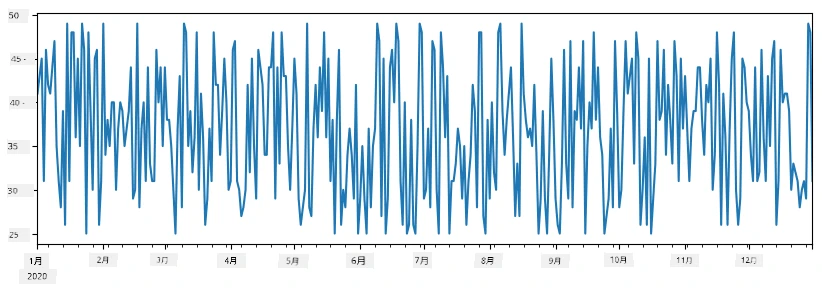
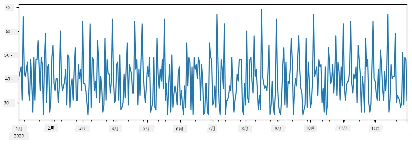
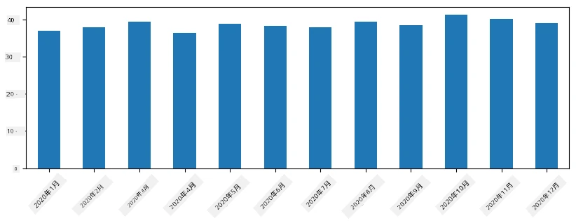
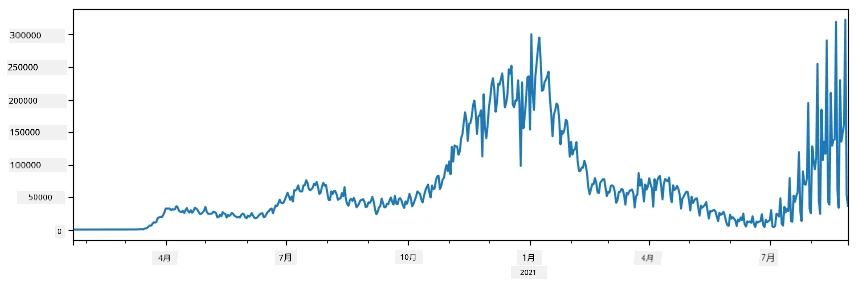
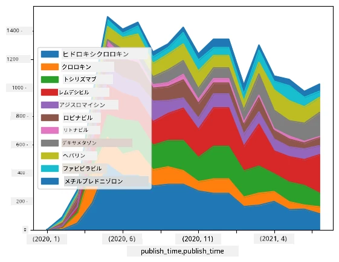

# データの操作：Python と Pandas ライブラリ

|  ](../../sketchnotes/07-WorkWithPython.png) |
| :-------------------------------------------------------------------------------------------------------: |
|                 Working With Python - _Sketchnote by [@nitya](https://twitter.com/nitya)_                 |

[](https://youtu.be/dZjWOGbsN4Y)

データベースはデータの格納とクエリ言語での問い合わせに非常に効率的な方法を提供しますが、最も柔軟なデータ処理方法は自分でプログラムを書いてデータを操作することです。多くの場合、データベースクエリを使う方が効果的ですが、より複雑なデータ処理が必要な場合は、SQLでは簡単にできないこともあります。
データ処理はどのプログラミング言語でも可能ですが、データ操作に関してより高レベルな言語があります。データサイエンティストは一般的に以下の言語のいずれかを好みます：

* **[Python](https://www.python.org/)** は汎用プログラミング言語で、そのシンプルさから初心者にとって最良の選択肢の一つとされています。PythonにはZIPアーカイブからのデータ抽出や画像のグレースケール変換など、多くの実用的な問題解決に役立つ追加ライブラリが多数あります。データサイエンスのほかに、Web開発にもよく使われています。
* **[R](https://www.r-project.org/)** は統計データ処理を念頭に開発された伝統的なツールボックスです。CRANと呼ばれる多くのライブラリも備え、データ処理に適しています。しかしRは汎用プログラミング言語ではなく、データサイエンス領域以外で使われることは稀です。
* **[Julia](https://julialang.org/)** はデータサイエンス専用に開発された別の言語で、Pythonよりも高い性能を目指しており、科学的実験に適したツールです。

このレッスンでは、簡単なデータ処理のためにPythonを使うことに焦点を当てます。言語の基本的な知識があることを前提とします。Pythonのより深い学習を希望する場合は、以下のリソースを参照してください：

* [Learn Python in a Fun Way with Turtle Graphics and Fractals](https://github.com/shwars/pycourse) - GitHub上のPythonプログラミングのクイックイントロコース
* [Take your First Steps with Python](https://docs.microsoft.com/en-us/learn/paths/python-first-steps/?WT.mc_id=academic-77958-bethanycheum) - [Microsoft Learn](http://learn.microsoft.com/?WT.mc_id=academic-77958-bethanycheum) の学習パス

データはさまざまな形態があります。このレッスンでは、<strong>表形式データ</strong>、<strong>テキスト</strong>、<strong>画像</strong>の三つのデータ形式について考えます。

関連するすべてのライブラリの完全な概要を提供する代わりに、いくつかのデータ処理の例に焦点を当てます。これにより、可能なことの全体像を掴み、問題解決のためのソリューションを見つける場所を理解しやすくします。

> <strong>最も有用なアドバイス</strong>：データに対してある操作を行いたいが方法がわからない場合は、インターネットで検索してみてください。[Stackoverflow](https://stackoverflow.com/) には多くの典型的なタスクに対するPythonの有用なコード例が掲載されています。


## [講義前クイズ](https://ff-quizzes.netlify.app/en/ds/quiz/12)

## 表形式データとデータフレーム

関係データベースについて話したとき、すでに表形式データを扱いました。大量のデータがあり、複数の関連テーブルに分かれている場合は、SQLを使うのが賢明です。しかし、データの分布や値同士の相関関係など、そのデータについて何らかの<strong>理解</strong>や<strong>洞察</strong>を得たい場合が多々あります。データサイエンスでは、元のデータの変換を行い、その後に可視化するケースが多くありますが、この両方のステップはPythonで簡単にできます。

Pythonで表形式データを扱うのに役立つ最も有用なライブラリは以下の二つです：
* **[Pandas](https://pandas.pydata.org/)** は、いわゆる<strong>データフレーム</strong>を操作するためのライブラリです。データフレームは関係データベースのテーブルと類似しており、名前付きのカラムを持ち、行やカラム、データフレーム全体に対してさまざまな操作が行えます。
* **[Numpy](https://numpy.org/)** は<strong>テンソル</strong>、つまり多次元の<strong>配列</strong>を扱うライブラリです。配列は同じ基本型の値を持ち、データフレームより単純ですが、より多くの数学的演算を提供し、オーバーヘッドが少ないです。

他にも知っておくべきライブラリがいくつかあります：
* **[Matplotlib](https://matplotlib.org/)** はデータの可視化やグラフの描画に使われるライブラリです。
* **[SciPy](https://www.scipy.org/)** は追加の科学計算用関数を含むライブラリです。確率や統計の話で既に触れました。

これらのライブラリをPythonプログラムの冒頭でインポートする場合、通常は次のように書きます：
```python
import numpy as np
import pandas as pd
import matplotlib.pyplot as plt
from scipy import ... # 必要なサブパッケージを正確に指定する必要があります
``` 

Pandasはいくつかの基本概念に基づいています。

### Series（シリーズ）

**Series** は、リストやnumpyの配列に似た値の列ですが、大きな違いは<strong>インデックス</strong>を持つことです。シリーズ同士の演算（例えば加算）では、このインデックスが考慮されます。インデックスは単純な整数の行番号（リストや配列からシリーズを作るときにデフォルトで使われます）であったり、日付の区間など複雑な構造を持つこともあります。

> <strong>注</strong>: 同梱のノートブック [`notebook.ipynb`](notebook.ipynb) に導入用のPandasコードがいくつかあります。ここでは一部の例だけを取り上げており、ぜひ完全なノートブックもご覧ください。

例を考えます。アイスクリーム店の売上分析を行いたいとします。ある期間の日ごとの販売数（販売アイテム数）のシリーズを作成します：

```python
start_date = "Jan 1, 2020"
end_date = "Mar 31, 2020"
idx = pd.date_range(start_date,end_date)
print(f"Length of index is {len(idx)}")
items_sold = pd.Series(np.random.randint(25,50,size=len(idx)),index=idx)
items_sold.plot()
```


次に、毎週友人たちとパーティを行い、パーティ用に追加で10パックのアイスクリームを持っていくことにしたとします。これを週単位のインデックスで別のシリーズとして作成します：
```python
additional_items = pd.Series(10,index=pd.date_range(start_date,end_date,freq="W"))
```
二つのシリーズを足し合わせると合計の売上数が得られます：
```python
total_items = items_sold.add(additional_items,fill_value=0)
total_items.plot()
```


> <strong>注</strong>：単純に `total_items+additional_items` のように書くのではありません。そうすると、多くの `NaN`（*Not a Number*）が結果のシリーズに現れます。これは、`additional_items` のいくつかのインデックスに値が欠落しており、`NaN` と何かを足すと `NaN` になるためです。したがって、加算時に `fill_value` パラメータを指定する必要があります。

時系列データでは、異なる時間間隔で<strong>リサンプリング</strong>することもできます。例えば、毎月の平均売上高を計算したい場合は、次のようにします：
```python
monthly = total_items.resample("1M").mean()
ax = monthly.plot(kind='bar')
```


### DataFrame（データフレーム）

DataFrameは、共通のインデックスを持つ複数のシリーズの集合体と考えられます。複数のシリーズを組み合わせてデータフレームにできます：
```python
a = pd.Series(range(1,10))
b = pd.Series(["I","like","to","play","games","and","will","not","change"],index=range(0,9))
df = pd.DataFrame([a,b])
```
これにより、次のような横方向の表が作成されます：
|     | 0   | 1    | 2   | 3   | 4      | 5   | 6      | 7    | 8    |
| --- | --- | ---- | --- | --- | ------ | --- | ------ | ---- | ---- |
| 0   | 1   | 2    | 3   | 4   | 5      | 6   | 7      | 8    | 9    |
| 1   | I   | like | to  | use | Python | and | Pandas | very | much |

シリーズをカラムとして使い、辞書でカラム名を指定することもできます：
```python
df = pd.DataFrame({ 'A' : a, 'B' : b })
```
これにより、次のような表が得られます：

|     | A   | B      |
| --- | --- | ------ |
| 0   | 1   | I      |
| 1   | 2   | like   |
| 2   | 3   | to     |
| 3   | 4   | use    |
| 4   | 5   | Python |
| 5   | 6   | and    |
| 6   | 7   | Pandas |
| 7   | 8   | very   |
| 8   | 9   | much   |

<strong>注</strong>：先の表を転置し（`.T`）、`rename` 操作でカラム名を変更することでも同じ配置が得られます。
```python
df = pd.DataFrame([a,b]).T.rename(columns={ 0 : 'A', 1 : 'B' })
```
`.T` はデータフレームの転置操作（行と列の入れ替え）を意味し、`rename` 操作で先ほどの例に合わせてカラム名を変更しています。

データフレームで行える最も重要な操作をいくつか紹介します：

<strong>カラム選択</strong>：`df['A']` と書くと、個別のカラムを選択できます。この操作はシリーズを返します。カラムのサブセットを選び別のデータフレームにするには、`df[['B','A']]` と書きます。これにより別のデータフレームが返されます。

<strong>フィルタリング</strong>：ある条件で行を絞り込みます。例えば、カラム `A` が5より大きい行だけ残すには、`df[df['A']>5]` と書きます。

> <strong>注</strong>：フィルタリングの仕組みはこうです。`df['A']<5` はブール値のシリーズを返し、元のシリーズ `df['A']` の各要素が条件を満たすかどうかを示します。このブールシリーズをインデックスとして使うと、条件に合う行のサブセットが返されます。したがって、`df[df['A']>5 and df['A']<7]` のような任意のPythonブール式は使えません。その代わりに、ブールシリーズ同士を `&` で結合し、`df[(df['A']>5) & (df['A']<7)]` とします（<em>括弧は重要です</em>）。

<strong>新しい計算カラムの作成</strong>：計算可能な新しいカラムは、次のような直感的な式で簡単に作成できます：
```python
df['DivA'] = df['A']-df['A'].mean() 
``` 
この例は、Aの各値が平均値からどれだけ離れているか（偏差）を計算しています。ここで実際に行われているのは、シリーズが計算され、そのシリーズを左辺に代入して新しいカラムを作成することです。したがって、シリーズに適さない操作は使えません。例えば、次のコードは誤りです：
```python
# 間違ったコード -> df['ADescr'] = "Low" if df['A'] < 5 else "Hi"
df['LenB'] = len(df['B']) # <- 間違った結果
``` 
この例は文法的には正しいですが、誤った結果を返します。なぜなら、シリーズ `B` の長さをすべての値に割り当ててしまい、各要素の長さではないからです。

複雑な計算式が必要な場合は、`apply` 関数を使うことができます。上記の最後の例は次のように書けます：
```python
df['LenB'] = df['B'].apply(lambda x : len(x))
# または
df['LenB'] = df['B'].apply(len)
```

これらの操作の後、次のようなデータフレームが完成します：

|     | A   | B      | DivA | LenB |
| --- | --- | ------ | ---- | ---- |
| 0   | 1   | I      | -4.0 | 1    |
| 1   | 2   | like   | -3.0 | 4    |
| 2   | 3   | to     | -2.0 | 2    |
| 3   | 4   | use    | -1.0 | 3    |
| 4   | 5   | Python | 0.0  | 6    |
| 5   | 6   | and    | 1.0  | 3    |
| 6   | 7   | Pandas | 2.0  | 6    |
| 7   | 8   | very   | 3.0  | 4    |
| 8   | 9   | much   | 4.0  | 4    |

<strong>数値ベースの行選択</strong> は `iloc` 構文を使って行えます。例えば、最初の5行を選択するには：
```python
df.iloc[:5]
```

<strong>グルーピング</strong> はExcelのピボットテーブルに似た結果を得るためによく使います。例えば、`LenB` ごとにカラム `A` の平均値を計算したい場合、`LenB` でグループ化し、`mean` を呼び出します：
```python
df.groupby(by='LenB')[['A','DivA']].mean()
```
平均値とグループ内の要素数の両方を計算したい場合は、より複雑な `aggregate` 関数を使えます：
```python
df.groupby(by='LenB') \
 .aggregate({ 'DivA' : len, 'A' : lambda x: x.mean() }) \
 .rename(columns={ 'DivA' : 'Count', 'A' : 'Mean'})
```
これにより次の表が得られます：

| LenB | Count | Mean     |
| ---- | ----- | -------- |
| 1    | 1     | 1.000000 |
| 2    | 1     | 3.000000 |
| 3    | 2     | 5.000000 |
| 4    | 3     | 6.333333 |
| 6    | 2     | 6.000000 |

### データの取得


PythonオブジェクトからSeriesやDataFrameを簡単に構築できることを見てきました。しかし、データは通常テキストファイルやExcelの表形式で提供されます。幸いなことに、Pandasはディスクからデータを読み込む簡単な方法を提供しています。例えば、CSVファイルを読み込むのは以下のように非常に簡単です：
```python
df = pd.read_csv('file.csv')
```
「Challenge」セクションでは、データを読み込む他の例や外部ウェブサイトからの取得方法についても見ていきます。


### 印刷とプロット

データサイエンティストはデータを探索することが多いため、その可視化が重要です。DataFrameが大きい場合、多くの場合は正しく処理できているかを確認するために最初の数行だけを表示したいことがあります。これは`df.head()`を呼び出すことで実現できます。Jupyter Notebook上で実行すると、DataFrameが見やすい表形式で表示されます。

また、特定の列を可視化するために`plot`関数の使用例も見てきました。`plot`は多くのタスクで非常に便利であり、`kind=`パラメーターを使って多様なグラフタイプをサポートしていますが、より複雑なプロットが必要な場合は生の`matplotlib`ライブラリを使うこともできます。データ可視化については別の講座で詳しく扱います。

この概要ではPandasの最も重要な概念をカバーしましたが、このライブラリは非常に豊富でできることに限界はありません！それでは、この知識を具体的な問題解決に適用してみましょう。

## 🚀 チャレンジ1：COVIDの拡散分析

最初の問題はCOVID-19の流行拡大のモデル化です。そのために、[ジョンズ・ホプキンス大学](https://jhu.edu/)の[システム科学工学センター](https://systems.jhu.edu/)（CSSE）が提供する各国の感染者数データを使用します。データセットは[このGitHubリポジトリ](https://github.com/CSSEGISandData/COVID-19)で入手可能です。

データの扱い方を学ぶために[`notebook-covidspread.ipynb`](notebook-covidspread.ipynb)を開き、最初から最後まで読んでみてください。セルを実行したり、最後に用意したチャレンジにも取り組めます。



> Jupyter Notebookでコードの実行方法がわからない場合は、[こちらの記事](https://soshnikov.com/education/how-to-execute-notebooks-from-github/)をご覧ください。

## 非構造化データの扱い

データは非常に多くの場合表形式ですが、テキストや画像など、より構造化されていないデータを扱う必要がある場合もあります。この場合、上で見てきたデータ処理技術を適用するには、何らかの方法で<strong>構造化されたデータを抽出する</strong>必要があります。以下はその例です：

* テキストからキーワードを抽出し、キーワードの出現頻度を調べる
* ニューラルネットワークを使って画像上の物体に関する情報を抽出する
* ビデオカメラの映像から人の感情情報を取得する

## 🚀 チャレンジ2：COVID関連論文の分析

ここではCOVIDパンデミックに関する科学論文の処理を扱います。[CORD-19データセット](https://www.kaggle.com/allen-institute-for-ai/CORD-19-research-challenge)には7000以上（執筆時点）のCOVID関連論文が収録されており、メタデータと要旨（およそ半分には全文も付属）が利用可能です。

[Text Analytics for Health](https://docs.microsoft.com/azure/cognitive-services/text-analytics/how-tos/text-analytics-for-health/?WT.mc_id=academic-77958-bethanycheum)認知サービスを使ったこのデータセットの分析例は[こちらのブログ記事](https://soshnikov.com/science/analyzing-medical-papers-with-azure-and-text-analytics-for-health/)で詳述されています。ここではこの分析の簡略版を扱います。

> <strong>注意</strong>: このリポジトリにはデータセットのコピーは含まれていません。まず[Kaggleのこのデータセット](https://www.kaggle.com/allen-institute-for-ai/CORD-19-research-challenge)から[`metadata.csv`](https://www.kaggle.com/allen-institute-for-ai/CORD-19-research-challenge?select=metadata.csv)ファイルをダウンロードする必要があります。Kaggleの登録が要求される場合があります。また、登録なしに[こちら](https://ai2-semanticscholar-cord-19.s3-us-west-2.amazonaws.com/historical_releases.html)からダウンロードできるものにはメタデータに加えて全文データも含まれています。

[`notebook-papers.ipynb`](notebook-papers.ipynb)を開き、最初から最後まで読んでみてください。セルの実行や最後に用意したチャレンジにも挑戦できます。



## 画像データの処理

近年、画像を理解できる非常に強力なAIモデルが開発されています。多くのタスクが事前学習済みのニューラルネットワークやクラウドサービスを使って解決できます。例は以下の通りです：

* <strong>画像分類</strong>は画像をあらかじめ定められたクラスのいずれかに分類することを助けます。[Custom Vision](https://azure.microsoft.com/services/cognitive-services/custom-vision-service/?WT.mc_id=academic-77958-bethanycheum)などのサービスを使用して自分で画像分類器を簡単にトレーニングできます。
* <strong>物体検出</strong>では画像内の様々な物体を検出します。[computer vision](https://azure.microsoft.com/services/cognitive-services/computer-vision/?WT.mc_id=academic-77958-bethanycheum)などのサービスは多くの一般物体を検出可能で、[Custom Vision](https://azure.microsoft.com/services/cognitive-services/custom-vision-service/?WT.mc_id=academic-77958-bethanycheum)モデルを使って特定の関心物体の検出にトレーニングすることもできます。
* <strong>顔検出</strong>は年齢、性別、感情検出も含みます。[Face API](https://azure.microsoft.com/services/cognitive-services/face/?WT.mc_id=academic-77958-bethanycheum)を使って対応可能です。

これらのクラウドサービスはすべて[Python SDKs](https://docs.microsoft.com/samples/azure-samples/cognitive-services-python-sdk-samples/cognitive-services-python-sdk-samples/?WT.mc_id=academic-77958-bethanycheum)で呼び出せるため、データ探索のワークフローに容易に組み込めます。

画像データ源からのデータ探索の具体例をいくつか紹介します：
* ブログ記事[How to Learn Data Science without Coding](https://soshnikov.com/azure/how-to-learn-data-science-without-coding/)ではインスタグラムの写真を解析し、人々がどの写真に多くのいいねを付けるかを理解しようとしています。まず[computer vision](https://azure.microsoft.com/services/cognitive-services/computer-vision/?WT.mc_id=academic-77958-bethanycheum)を用いて写真からできるだけ多くの情報を抽出し、次に[Azure Machine Learning AutoML](https://docs.microsoft.com/azure/machine-learning/concept-automated-ml/?WT.mc_id=academic-77958-bethanycheum)を使って解釈可能なモデルを構築します。
* [Facial Studies Workshop](https://github.com/CloudAdvocacy/FaceStudies)では[Face API](https://azure.microsoft.com/services/cognitive-services/face/?WT.mc_id=academic-77958-bethanycheum)を使い、イベントの写真に写った人々の感情を抽出して、人々が幸せになる要因を探ろうとしています。

## 結論

構造化データであろうと非構造化データであろうと、Pythonを使えばデータ処理と理解に必要なすべてのステップを行うことができます。Pythonはおそらく最も柔軟なデータ処理手法であり、多くのデータサイエンティストが主要なツールとして用いる理由もそこにあります。データサイエンスの道を真剣に進みたいなら、Pythonを深く学ぶのは賢明な選択です！

## [講義後クイズ](https://ff-quizzes.netlify.app/en/ds/quiz/13)

## 復習 & 自習

<strong>書籍</strong>
* [Wes McKinney著 『Python for Data Analysis: Data Wrangling with Pandas, NumPy, and IPython』](https://www.amazon.com/gp/product/1491957662)

<strong>オンラインリソース</strong>
* 公式[10 minutes to Pandas](https://pandas.pydata.org/pandas-docs/stable/user_guide/10min.html)チュートリアル
* [Pandas可視化関連ドキュメント](https://pandas.pydata.org/pandas-docs/stable/user_guide/visualization.html)

**Python学習**
* [Turtle Graphicsとフラクタルで楽しく学ぶPython](https://github.com/shwars/pycourse)
* [Microsoft LearnのPython入門学習パス](https://docs.microsoft.com/learn/paths/python-first-steps/?WT.mc_id=academic-77958-bethanycheum)

## 課題

[上記チャレンジに関するより詳細なデータ研究を行う](assignment.md)

## 謝辞

本レッスンは[Dmitry Soshnikov](http://soshnikov.com)による♥️のもとで作成されました

---

<!-- CO-OP TRANSLATOR DISCLAIMER START -->
**免責事項**：
本書類は AI 翻訳サービス [Co-op Translator](https://github.com/Azure/co-op-translator) を使用して翻訳されています。正確性を期していますが、自動翻訳には誤りや不正確な部分が含まれる可能性があることをご承知おきください。原文の原語版が正式な情報源とみなされるべきです。重要な情報については、専門の人間による翻訳を推奨します。本翻訳の利用により生じたいかなる誤解や解釈違いについても、当方は責任を負いかねます。
<!-- CO-OP TRANSLATOR DISCLAIMER END -->