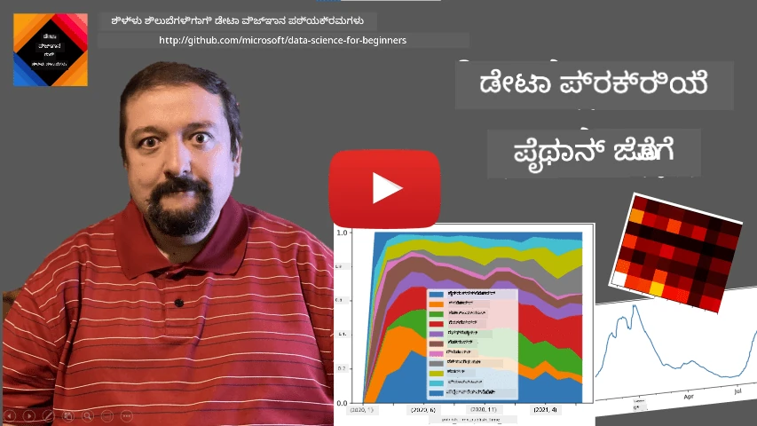
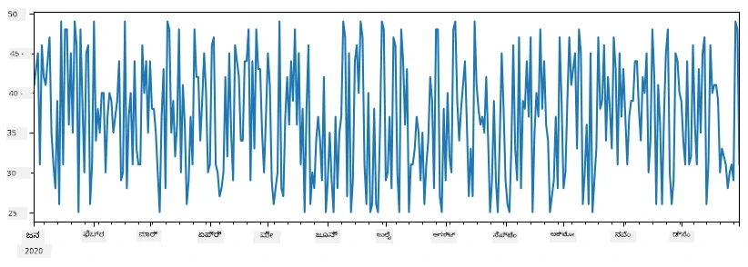
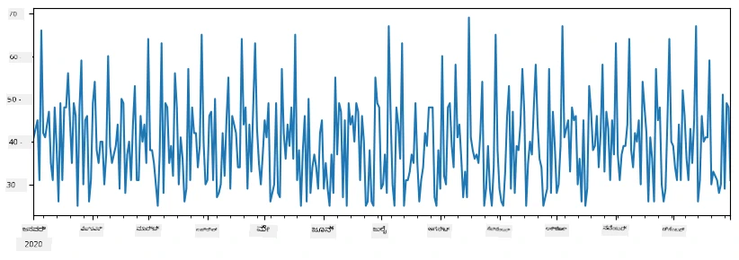
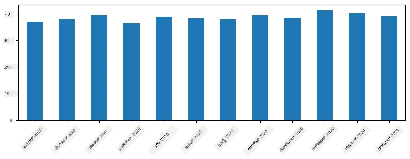
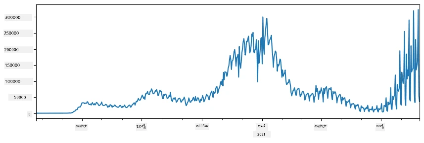
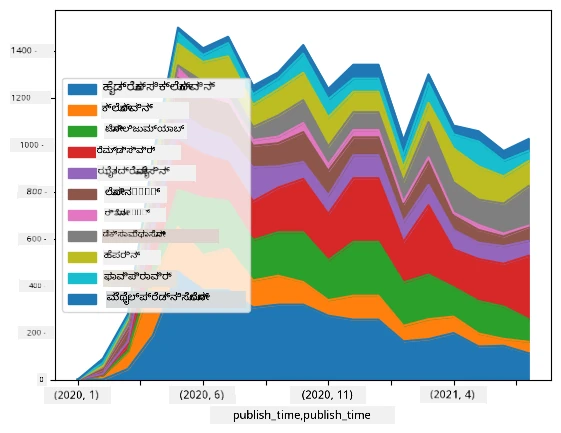

# ಡೇಟಾ ಜೊತೆ ಕೆಲಸ ಮಾಡುವುದು: ಪೈಥಾನ್ ಮತ್ತು ಪಾಂಡಾಸ್ ಗ್ರಂಥಾಲಯ

|  ](../../sketchnotes/07-WorkWithPython.png) |
| :-------------------------------------------------------------------------------------------------------: |
|                 ಪೈಥಾನ್ ಜೊತೆಗೆ ಕೆಲಸ - _ಸ್ಕೆಚ್ ನೋಟ್ [@nitya](https://twitter.com/nitya) ರಿಂದ_                 |

[](https://youtu.be/dZjWOGbsN4Y)

ಡೇಟಾಬೇಸ್‌ಗಳು ಡೇಟಾವನ್ನು very ಪರಿಣಾಮಕಾರಿಯಾಗಿ ಸಂಗ್ರಹಿಸುವ ವಿಧಾನಗಳನ್ನು ಒದಗಿಸುತ್ತವೆ ಮತ್ತು ಕ್ವೇರಿ ಭಾಷೆಗಳನ್ನು ఉపయోగಿಸಿ ಅವುಗಳನ್ನು ಕೇಳಲು ಸಾಧ್ಯವಾಗುತ್ತದೆ, ಆದರೆ ಡೇಟಾ ಪ್ರಕ್ರಿಯೆಗಾಗಿ ಅತ್ಯಂತ ಸುಲಭ ವಿಧಾನವೆಂದರೆ ನಿಮ್ಮದೇ ದೃಷ್ಟಿಕೋನವನ್ನು ಬರೆಯುವುದು. ಬಹುಶಃ ಕೆಲವು ಸಂದರ್ಭಗಳಲ್ಲಿ, ಡೇಟಾಬೇಸ್ ಕ್ವೇರಿ ಹೆಚ್ಚು ಪರಿಣಾಮಕಾರಿಯಾಗಿರುತ್ತದೆ. ಆದರೆ ಕೆಲವು ಸಂದರ್ಭಗಳಲ್ಲಿ ಹೆಚ್ಚು ಸಂಕೀರ್ಣ ಡೇಟಾ ಪ್ರಕ್ರಿಯೆಯನ್ನು SQL ಉಪಯೋಗಿಸಿದರೆ ಸುಲಭವಲ್ಲ.
ಡೇಟಾ ಪ್ರಕ್ರಿಯೆಯನ್ನು ಯಾವುದೇ ಪ್ರೋಗ್ರಾಮಿಂಗ್ ಭಾಷೆಯಲ್ಲಿ ಬರೆಯಬಹುದು, ಆದರೆ ಕೆಲವು ಭಾಷೆಗಳು ಡೇಟಾ ಜೊತೆಗೆ ಕೆಲಸ ಮಾಡುವ ದೃಷ್ಟಿಯಿಂದ ಹೆಚ್ಚು ಮಟ್ಟದಲ್ಲಿವೆ. ಡೇಟಾ ವಿಜ್ಞಾನಿಗಳು ಸಾಮಾನ್ಯವಾಗಿ ಕೆಳಗಿನ ಭಾಷೆಗಳಲ್ಲಿ ಒಂದನ್ನು ಬಯಸುತ್ತಾರೆ:

* **[Python](https://www.python.org/)**, ಒಂದು ಸಾಮಾನ್ಯ ಉದ್ದೇಶದ ಪ್ರೋಗ್ರಾಮಿಂಗ್ ಭಾಷೆ, ಹಾಗಾಗಿ ಅದರ ಸರಳತೆಗೆ ಕಾರಣವಾಗಿ ಆರಂಭಿಕರಿಗೆ ಒಳ್ಳೆಯ ಆಯ್ಕೆ ಎಂದು ಪರಿಗಣಿಸಲಾಗಿದೆ. ಪೈಥಾನ್‌ನಲ್ಲಿಯ ಐತಿಹಾಸಿಕ ಗ್ರಂಥಾಲಯಗಳು ನಿಮ್ಮ ಅನೇಕ ಪ್ರಯೋಜನಕಾರಿ ಸಮಸ್ಯೆಗಳನ್ನು ಪರಿಹರಿಸಲು ಸಹಾಯ ಮಾಡುತ್ತವೆ, ಉದಾಹರಣೆಗೆ ZIP ಆರ್ಕೈವ್‌ನಿಂದ ಡೇಟಾ ತೆಗೆದುಕೊಳ್ಳುವುದು ಅಥವಾ ಚಿತ್ರವನ್ನು ಗ್ರೇಸ್ಕೇಲ್ ಆಗಿ ಪರಿವರ್ತಿಸುವುದು. ಡೇಟಾ ವಿಜ್ಞಾನದ ಜೊತೆಗೆ, ಪೈಥಾನ್ ಅನ್ನು ವೆಬ್ ಅಭಿವೃದ್ಧಿಗಾಗಿ ಸಹ ಬಳಸಲಾಗುತ್ತದೆ.
* **[R](https://www.r-project.org/)** ಈ ಒಂದು ಸಾಂಖ್ಯಿಕ ಡೇಟಾ ಪ್ರಕ್ರಿಯೆಗೆ ಗಮನಹರಿಸಿ ಅಭಿವೃದ್ಧಿಗೊಂಡಿರುವ ಪರಂಪರೆಯ ಸಾಧನಸಂಕಲನವಾಗಿದೆ. ಇದರಲ್ಲಿ ದೊಡ್ಡ ಗ್ರಂಥಾಲಯ ಸಂಗ್ರಹ (CRAN) ಕೂಡ ಇದೆ, ಆದ್ದರಿಂದ ಇದು ಡೇಟಾ ಪ್ರಕ್ರಿಯೆಗೆ ಒಳ್ಳೆಯ ಆಯ್ಕೆಯಾಗುತ್ತದೆ. ಆದರೆ, R ಒಂದು ಸಾಮಾನ್ಯ ಉದ್ದೇಶದ ಪ್ರೋಗ್ರಾಮಿಂಗ್ ಭಾಷೆ ಅಲ್ಲ, ಮತ್ತು ಡೇಟಾ ವಿಜ್ಞಾನ ಕ್ಷೇತ್ರದ ಹೊರಗೆ ಬಹುಶಃ ಬಳಕೆಯಲ್ಲ.
* **[Julia](https://julialang.org/)** ಮತ್ತೊಂದು ಭಾಷೆ, ವಿಶೇಷವಾಗಿ ಡೇಟಾ ವಿಜ್ಞಾನಗಾಗಿ ಅಭಿವೃದ್ಧಿಪಡಿಸಲಾಗಿದೆ. ಇದು ಪೈಥಾನ್ ಗಿಂತ ಉತ್ತಮ ಕಾರ್ಯಕ್ಷಮತೆ ನೀಡಲು ಉದ್ದೇಶಿಸಲಾಗಿದೆ, ವಿಜ್ಞಾನಕಾರ್ಯದ ಪ್ರಯೋಗಗಳಿಗೆ ಅದ್ಭುತ ಸಾಧನವಾಗಿದೆ.

ಈ ಪಾಠದಲ್ಲಿ, ನಾವು ಸರಳ ಡೇಟಾ ಪ್ರಕ್ರಿಯೆಗೆ ಪೈಥಾನ್ ಬಳಕೆಮೇಲೆ ಗಮನ ಕೊಡುತ್ತೇವೆ. ನಾವು ಭಾಷೆಯ ಮೂಲಭೂತ ಪರಿಚಯವಿದ್ದೇವೆ ಎಂದು ಊಹಿಸುವೆವು. ನೀವು ಪೈಥಾನ್ ಬಗ್ಗೆ ಹೆಚ್ಚು ವಿಸ್ತೃತ ಮಾರ್ಗದರ್ಶನ ಬಯಸಿದರೆ, ಕೆಳಗಿನ ಸಂಪನ್ಮೂಲಗಳನ್ನು ನೋಡಿ:

* [ಟರ್ಟಲ್ ಗ್ರಾಫಿಕ್ಸ್ ಮತ್ತು ಫ್ರಾಕ್ಟಲ್ಗಳೊಂದಿಗೆ ಪೈಥಾನ್ ಅನ್ನು ಮನರಂಜನೆಯ ಬದಲು ಕಲಿಯಿರಿ](https://github.com/shwars/pycourse) - ಗಿತ್‌ಹಬ್ ಆಧಾರಿತ ಪೈಥಾನ್ ಪ್ರೋಗ್ರಾಮಿಂಗ್ ಸಾಂಕ್ಷಿಪ್ತ ಕೋರ್ಸ್
* [ಪೈಥಾನ್ ಮೊದಲನೆಯ ಹೆಜ್ಜೆಗಳು](https://docs.microsoft.com/en-us/learn/paths/python-first-steps/?WT.mc_id=academic-77958-bethanycheum) - [Microsoft Learn](http://learn.microsoft.com/?WT.mc_id=academic-77958-bethanycheum)ನಲ್ಲಿ ಕಲಿಕಾ ಮಾರ್ಗ

ಡೇಟಾ ಹಲವು ರೂಪಗಳಲ್ಲಿ ಬರುವುದಕ್ಕೆ ಸಾಧ್ಯ. ಈ ಪಾಠದಲ್ಲಿ, ನಾವು ಮೂರು ರೂಪಗಳ ಡೇಟಾವನ್ನು ತೆಗೆದುಕೊಳ್ಳಲಿದ್ದೇವೆ - **ಪಟ್ಟಿ ಡೇಟಾ**, **ಪಠ್ಯ** ಮತ್ತು **ಚಿತ್ರಗಳು**.

ನಾವು ಸಂಪೂರ್ಣ ಗ್ರಂಥಾಲಯ ವೀಕ್ಷಣೆಯ ಬದಲು ಕೆಲವು ಡೇಟಾ ಪ್ರಕ್ರಿಯೆ ಉದಾಹರಣೆಗಳ ಮೇಲೆ ಗಮನಸೆಳೆಯುತ್ತೇವೆ. ಇದರಿಂದ ನಿಮಗೆ ಸಾಧ್ಯವಿರುವ ಪ್ರಮುಖ ಕಲ್ಪನೆ ದೊರೆಯುತ್ತದೆ ಮತ್ತು ನೀವು ಸಮಸ್ಯೆಗಳಿಗೆ ಪರಿಹಾರಗಳನ್ನು ಎಲ್ಲಿಂದ ಕಂಡುಹಿಡಿಯಬಹುದು ಎಂದು ಬಲ್ಲಿರಿ.

> ** ಅತ್ಯಂತ ಉಪಯುಕ್ತ ಸಲಹೆ **. ನೀವು ಯಾವುದೇ ನಿರ್ದಿಷ್ಟ ಕಾರ್ಯವನ್ನು ಡೇಟಾ ಮೇಲೆ ಮಾಡಬೇಕಾದಾಗ, ಅದು ಹೇಗೆ ಮಾಡಬೇಕೆಂದು ತಿಳಿಯದಿದ್ದರೆ, ಅದನ್ನು ಇಂಟರ್ನೆಟ್‌ನಲ್ಲಿ ಹುಡುಕಿ. [Stackoverflow](https://stackoverflow.com/) ನಲ್ಲಿ ಬಹುಮಾನ್ಯವಾದ ಪೂರ್ವಕೋಡ್ ಉದಾಹರಣೆಗಳು ಪೈಥಾನ್‌ಗಾಗಿ ಸಾಕಷ್ಟು ಲಭ್ಯವಿರುತ್ತವೆ.


## [ಪಾಠ ಹೇಗಿರುವುದನ್ನು ಭೇಟಿಮಾಡಲು ಗೆಲುವಿನ ಪ್ರಶ್ನೆಗಳು](https://ff-quizzes.netlify.app/en/ds/quiz/12)

## ಪಟ್ಟಿಪರ ಡೇಟಾ ಮತ್ತು ಡೇಟಾಫ್ರೇಮ್‌ಗಳು

ನೀವು ಈಗಾಗಲೇ ಸಂಬಂಧ ಡೇಟಾಬೇಸ್ ಕುರಿತು ಮಾತಾಡಿದಾಗ ಪಟ್ಟಿಪರ ಡೇಟಾ ಜೊತೆ ಪರಿಚಿತರಾಗಿದ್ದೀರಿ. ದೊಡ್ಡ ಪ್ರಮಾಣದ ಡೇಟಾ ಇದ್ದಾಗ ಮತ್ತು ಅದು ಹಲವು ಬೇರೆಯಾದ ಲಿಂಕ್‌ ಮಾಡಿದ ಪಟ್ಟಿಗಳಲ್ಲಿ ಇದ್ದಾಗ, ಅದನ್ನು ಕಾರ್ಯನಿರ್ವಹಿಸಲು SQL ಬಳಸುವುದು ಸ್ತಾಯೀ ಅನುಕೂಲ. ಆದರೆ ಹೆಚ್ಚಿನ ಸಂದರ್ಭಗಳಲ್ಲಿ, ನಾವು ಡೇಟಾ ಕುರಿತ **ಅರ್ಥಮಾಡಿಕೊಳ್ಳುವಿಕೆ** ಅಥವಾ **ಅನುಭವಗಳನ್ನು** ಪಡೆಯಲು ಬೇಕಾದಾಗ, ಉತ್ಪ್ರೇರಣೆ, ಮೌಲ್ಯಗಳ ಸಂಬಂಧತೆ ಮತ್ತು ಇತ್ಯಾದಿ ಬಗ್ಗೆ ವಿಚಾರಿಸುವಾಗ, Django ಡೇಟಾ ವಿಜ್ಞಾನದಲ್ಲಿ ಡೇಟಾ ಕೆಲವೊಂದು ಪರಿಕರಗಳನ್ನು ಪರಿವರ್ತಿಸುವುದು ಮತ್ತು ದೃಶ್ಯೀಕರಣವನ್ನು ಸಾಧಿಸುವುದು ಅವಶ್ಯಕ. ಆ ಇಬ್ಬರೂ ಹಂತಗಳನ್ನು ಪೈಥಾನ್ ಸಹಜವಾಗಿ ಮಾಡಬಹುದು.

ಪೈಥಾನ್‌ನಲ್ಲಿರುವ ಎರಡು ಅತ್ಯಂತ ಉಪಯುಕ್ತ ಗ್ರಂಥಾಲಯಗಳು, ನೀವು ಪಟ್ಟಿಪರ ಡೇಟಾ ವಹಿಸಲು ಸಹಾಯ ಮಾಡುತ್ತವೆ:
* **[Pandas](https://pandas.pydata.org/)** ನಿಮಗೆ **ಡೇಟಾಫ್ರೇಮ್ಸ್** ಎಂದು ಕರೆಯಲ್ಪಡುವ relational ಟೇಬಲ್ಗಳಿಗೆ ಇದ್ದಂತೆಯೇ ಇರುವ ಮಾಹಿತಿಯನ್ನು ನಡೆಸಲು ಅವಕಾಶ ನೀಡುತ್ತದೆ. ನೀವು ಕಾಲಮ್‌ಗಳಿಗೆ ಹೆಸರಿನನ್ನಿಡಬಹುದು ಮತ್ತು ಸಾಲುಗಳು, ಕಾಲಮ್‌ಗಳು ಮತ್ತು ಸಾಮಾನ್ಯವಾಗಿ ಡೇಟಾಫ್ರೇಮ್‌ಗಳನ್ನು ಮೇಲ್ಮನವಿ ಮಾಡಬಹುದು.
* **[Numpy](https://numpy.org/)** ಬಹುಮಾರ್ಗೀಯ **array**ಗಳಾದ **ಟೆನ್ಸರ್‌ಗಳ** ಜೊತೆ ಕೆಲಸ ಮಾಡಲು ಗ್ರಂಥಾಲಯ. ಅರೆ ಸಮಾನ underlying ವಿಧದ ಮೌಲ್ಯಗಳನ್ನು ಹೊಂದಿದ್ದು, ಇದು ಡೇಟಾಫ್ರೇಮ್ಗಿಂತ ಸರಳ ಆದರೆ ಗಣಿತೀಯ ಕಾರ್ಯಗಳಿಗಿಂತ ಹೆಚ್ಚು ನೆರವಿನೊಂದಿಗೆ ಬರುವುದರಿಂದ ಕಡಿಮೆ ಬದ್ಧತೆಯನ್ನು ಉಂಟುಮಾಡುತ್ತದೆ.

ಇನ್ನೂ ಕೆಲವು ಗ್ರಂಥಾಲಯಗಳ ಪರಿಚಯ ಬೇಕಾಗಬಹುದು:
* **[Matplotlib](https://matplotlib.org/)** ಡೇಟಾ ದೃಶ್ಯೀಕರಣ ಮತ್ತು ಚಿತ್ರದ ಚಾರ್ಟ್ ಗಳಿಗಾಗಿ ಉಪಯೋಗಿಸುವ ಗ್ರಂಥಾಲಯ
* **[SciPy](https://www.scipy.org/)** ಹೆಚ್ಚುವರಿ ವೈಜ್ಞಾನಿಕ ಕಾರ್ಯಗಳನ್ನು ಹೊಂದಿರುವ ಗ್ರಂಥಾಲಯ. ನಾವು ಈಗಾಗಲೇ ಸಂಭಾವ್ಯತೆ ಮತ್ತು ಸಂಖ್ಯಾಶಾಸ್ತ್ರದ ಬಗ್ಗೆ ಮಾತನಾಡಲು ಈ ಗ್ರಂಥಾಲಯವನ್ನು ಸ್ಪರ್ಶಿಸಿದ್ದೇವೆ

ಕೆಳಗಿನ ಕೋಡ್ ಉದಾಹರಣೆಗಳನ್ನು ಆರಂಭದಲ್ಲಿ ನಿಮ್ಮ ಪೈಥಾನ್ ಪ್ರೋಗ್ರಾಂನಲ್ಲಿ ಈ ಗ್ರಂಥಾಲಯಗಳನ್ನು ಆಮದು ಮಾಡಿಕೊಳ್ಳಲು ಸಾಮಾನ್ಯವಾಗಿ ಬಳಸುತ್ತಾರೆ:
```python
import numpy as np
import pandas as pd
import matplotlib.pyplot as plt
from scipy import ... # ನಿಮಗೆ ಬೇಕಾಗಿರುವ ನಿಖರ ಉಪ-ಪ್ಯಾಕೇಜ್‌ಗಳನ್ನು ನೀವು ಸೂಚಿಸಬೇಕು
``` 

ಪಾಂಡಾಸ್ ಕೆಲವು ಮೂಲಭೂತ ಕಲ್ಪನೆಗಳ ಸುತ್ತ ಕೇಂದ್ರೀಕರಿಸಲಾಗಿದೆ.

### ಸರಣಿ (Series)

**ಸರಣಿ (Series)** ಮೌಲ್ಯಗಳ ಕ್ರಮವಾಗಿದೆ, ಇದು ಪಟ್ಟಿ ಅಥವಾ ನಂಪಿ ಅರೆಗಳಿಗೆ ಹೋಲಿಕೆಯಾಗಿದೆ. ಮುಖ್ಯ ಭೇದವೇನೆಂದರೆ, ಸರಣಿಗೆ **ಸೂಚ್ಯಂಕ (index)** ಕೂಡ ಇರುತ್ತದೆ, ಮತ್ತು ನಾವು ಸರಣಿಯಿಂದ ಕಾರ್ಯಗಳನ್ನು ( ಉದಾ. ಸೇರಿಸುವುದು) ಮಾಡಿದಾಗ, ಸೂಚ್ಯಂಕವನ್ನು ಪರಿಗಣಿಸಲಾಗುತ್ತದೆ. ಸೂಚ್ಯಂಕ ಸರಳ ಇಂಟೆજર‍ಂತಹ ಸಾಲು ಸಂಖ್ಯೆಯಾಗಿರಬಹುದು (ಪಟ್ಟಿ ಅಥವಾ ಅರೆಗಳಿಂದ ಸರಣಿ ಸೃಷ್ಟಿಸುವಾಗ ಪೂರ್ವನಿಯತವಾಗಿ ಬಳಸಲಾಗುವ ಸೂಚ್ಯಂಕ) ಅಥವಾ ದಿನಾಂಕ ಅಂತರಾವಧಿಯಂತಹ ಗಣಕೀಯ ರೀತಿಯಲ್ಲಿರಬಹುದು.

> **ಗಮನಿಸಿ**: ಜೊತೆಯಲ್ಲಿರುವ ನೋಟ್‌ಬುಕ್‌ನಲ್ಲಿ [`notebook.ipynb`](notebook.ipynb) ನಲ್ಲಿ ಕೆಲ ಆರಂಭಿಕ ಪಾಂಡಾಸ್ ಕೋಡ್ ಇದೆ. ನಾವು ಇಲ್ಲಿ ಕೆಲವು ಉದಾಹರಣೆಗಳನ್ನು ಮಾತ್ರ ನಿರೂಪಿಸುತ್ತೇವೆ, ನೀವು ಸಂಪೂರ್ಣ ನೋಟ್‌ಬುಕ್ ನೋಡಲು ಸ್ವಾಗತ.

ಒಂದು ಉದಾಹರಣೆಗೆ ಪರಿಗಣಿಸಿ: ನಮ್ಮ ಐಸ್-ಕ್ರಿಮ್ ಮಾರಾಟವನ್ನು ವಿಶ್ಲೇಷಿಸಲು ಬಯಸುತ್ತೇವೆ. ಕೆಲವು ಅವಧಿಗೆ ಮಾರಾಟದ ಸಂಖ್ಯೆಗಳ ಸರಣಿ(ಪ್ರತಿ ದಿನ ಮಾರಾಟವಾದ ಐಟಂಗಳ ಸಂಖ್ಯೆ) ಸೃಷ್ಟಿಸೋಣ:

```python
start_date = "Jan 1, 2020"
end_date = "Mar 31, 2020"
idx = pd.date_range(start_date,end_date)
print(f"Length of index is {len(idx)}")
items_sold = pd.Series(np.random.randint(25,50,size=len(idx)),index=idx)
items_sold.plot()
```


ಈಗ ಪ್ರತಿನಿತ್ಯ ನಾವು ಸ್ನೇಹಿತರಿಗಾಗಿ ಒಂದು ಪಾರ್ಟಿ ಆಯೋಜಿಸುತ್ತೇವೆ ಎಂದು ಊಹಿಸೋಣ, ಮತ್ತು ಪಾರ್ಟಿಗಾಗಿ ಹೆಚ್ಚುವರಿ 10 ಐಸ್-ಕ್ರಿಮ್ ಪ್ಯಾಕೆಟ್‌ಗಳನ್ನು ತೆಗೆದುಕೊಂಡಾಗ. ನಾವು ಇನ್ನೊಂದು ಸರಣಿ ಸೃಷ್ಟಿಸಬಹುದು, ವಾರಗಳ ಮೂಲಕ ಸೂಚ್ಯಂಕ ಮಾಡಲಾಗಿದ್ದು, ಅದನ್ನು ತೋರಿಸಲು:
```python
additional_items = pd.Series(10,index=pd.date_range(start_date,end_date,freq="W"))
```
ಎರಡು ಸರಣಿಗಳನ್ನು ಸೇರಿಸಿದಾಗ, ಒಟ್ಟು ಸಂಖ್ಯೆಯನ್ನು ಪಡೆಯುತ್ತೇವೆ:
```python
total_items = items_sold.add(additional_items,fill_value=0)
total_items.plot()
```


> **ಗಮನಿಸಿ** ಸರಳ ವ್ಯಾಕರಣ `total_items+additional_items` ಬಳಸದಿದ್ದೇವೆ. ಅದನ್ನು ಬಳಸದಿದ್ದರೆ, ಫಲಿತಾಂಶದಲ್ಲಿ ತುಂಬಾ `NaN` (`Not a Number`) ಮೌಲ್ಯಗಳು ಬರುತ್ತಿದ್ದವು. ಇದಕ್ಕೆ ಕಾರಣ, ಕೆಲವು ಸೂಚ್ಯಂಕ್ಇಗಳು `additional_items` ಸರಣಿಯಲ್ಲಿ ಇಲ್ಲದಿರುವುದು, ಮತ್ತು `NaN` ಅನ್ನು ಸೇರಿಸುವಾಗ ಫಲಿತಾಂಶವೂ `NaN` ಆಗುತ್ತದೆ. ಆದ್ದರಿಂದ ಸೇರಿಸುವಾಗ `fill_value` ಪರಾಮಿತಿ ನಿಗದಿಪಡಿಸಬೇಕಾಗುತ್ತದೆ.

ಕಾಲ ಸರಣಿಗಳೊಂದಿಗೆ, ನಾವು ವಿವಿಧ ಕಾಲಾವಧಿ ಮೂಲಕ ಸರಣಿಯನ್ನು **ಪುನರ್ವಿನ್ಯಾಸ (resample)** ಮಾಡಬಹುದು. ಉದಾಹರಣೆಗೆ, ಮಾಸಿಕ ಸರಾಸರಿ ಮಾರಾಟವನ್ನು ಲೆಕ್ಕಿಸುವುದಾಗಿ ಊಹಿಸೋಣ. ಕೆಳಗಿನ ಕೋಡ್ ಅನ್ನು ಬಳಸಬಹುದು:
```python
monthly = total_items.resample("1M").mean()
ax = monthly.plot(kind='bar')
```


### ಡೇಟಾಫ್ರೇಮ್

ಡೇಟಾಫ್ರೇಮ್ ಅಂದರೆ ಅದೇ ಸೂಚ್ಯಂಕ ಹೊಂದಿರುವ ಸರಣಿಗಳ ಸಮೂಹವಾಗಿದೆ. ನಾವು ಕೆಲವು ಸರಣಿಗಳನ್ನು ಸೇರಿಸಿ ಡೇಟಾಫ್ರೇಮ್ ಮಾಡಬಹುದು:
```python
a = pd.Series(range(1,10))
b = pd.Series(["I","like","to","play","games","and","will","not","change"],index=range(0,9))
df = pd.DataFrame([a,b])
```
ಇದು ಹೋರಿಜಾಂಟಲ್ ಟೇಬಲ್ ಅನ್ನು ರಚಿಸುತ್ತದೆ:
|     | 0   | 1    | 2   | 3   | 4      | 5   | 6      | 7    | 8    |
| --- | --- | ---- | --- | --- | ------ | --- | ------ | ---- | ---- |
| 0   | 1   | 2    | 3   | 4   | 5      | 6   | 7      | 8    | 9    |
| 1   | I   | like | to  | use | Python | and | Pandas | very | much |

ನಾವು ಸರಣಿಗಳನ್ನು ಕಾಲಮ್‌ಗಳಾಗಿ ಉಪಯೋಗಿಸಿ, ಡಿಕ್ಷನರಿ ಬಳಸಿ ಕಾಲಮ್ ಹೆಸರನ್ನು ಸೂಚಿಸಬಹುದು:
```python
df = pd.DataFrame({ 'A' : a, 'B' : b })
```
ಈ ರೀತಿಯ ಟೇಬಲನ್ನು ನೀಡುತ್ತದೆ:

|     | A   | B      |
| --- | --- | ------ |
| 0   | 1   | I      |
| 1   | 2   | like   |
| 2   | 3   | to     |
| 3   | 4   | use    |
| 4   | 5   | Python |
| 5   | 6   | and    |
| 6   | 7   | Pandas |
| 7   | 8   | very   |
| 8   | 9   | much   |

**ಗಮನಿಸಿ** ನಾವು ಹಿಂದಿನ ಟೇಬಲನ್ನು ಟ್ರಾನ್ಸ್‌ಪೋಸ್ ಮಾಡಿ ಈ ಟೇಬಲ್ ವಿನ್ಯಾಸವನ್ನು ಪಡೆಯಬಹುದು, ಉದಾ:
```python
df = pd.DataFrame([a,b]).T.rename(columns={ 0 : 'A', 1 : 'B' })
```
ಎಲ್ಲಿ `.T` ಅಂದರೆ ಡೇಟಾಫ್ರೇಮ್ ಅನ್ನು ಟ್ರಾನ್ಸ್‌ಪೋಸ್ ಮಾಡುವ ಕಾರ್ಯ (ಸಾಲು ಹಾಗೂ ಕಾಲಮ್ ಬದಲಾಯಿಸುವುದು), ಮತ್ತು `rename` ಕಾರ್ಯ ನಮಗೆ ಕಾಲಮ್‌ಗಳನ್ನು ಹಿಂದಿನ ಉದಾಹರಣೆಗೆ ಹೆಸರಿಸಲು ಸಹಾಯ ಮಾಡುತ್ತದೆ.

ಕೆಳಗಿನವು ಡೇಟಾಫ್ರೇಮ್‌ಗಳ ಮೇಲೆ ನಾವು ಮಾಡಬಹುದಾದ ಮುಖ್ಯ ಕಾರ್ಯಗಳು:

**ಕಾಲಮ್ ಆಯ್ಕೆ**. `df['A']` ಎಂದು ಬರೆಯುವ ಮೂಲಕ ನಾವು ವ್ಯಕ್ತಿಗತ ಕಾಲಮ್ ಆಯ್ಕೆ ಮಾಡಬಹುದು - ಈ ಕಾರ್ಯ ಸರಣಿಯನ್ನು ನೀಡುತ್ತದೆ. ನಾವು ಇನ್ನೊಂದು ಡೇಟಾಫ್ರೇಮ್‌ಗೆ ಕೆಲವು ಕಾಲಮ್ ಉಪಸಮೂಹ ಆಯ್ಕೆ ಮಾಡಲು `df[['B','A']]` ಎಂದು ಬರೆಯಬಹುದು - ಇದು ಮತ್ತೊಂದು ಡೇಟಾಫ್ರೇಮ್ ಅನ್ನು ನೀಡುತ್ತದೆ.

**ನಿಯಮಗಳ ಮೂಲಕ ಕೆಲವು ಸಾಲುಗಳನ್ನು ಮಾತ್ರ ಫಿಲ್ಟರ್ ಮಾಡುವುದು**. ಉದಾಹರಣೆಗೆ, `A` ಕಾಲಮ್ 5ಕ್ಕಿಂತ ಹೆಚ್ಚು ಇರುವ ಸಾಲುಗಳನ್ನು ಮಾತ್ರ ಬೀಳಿಸುವುದಾಗಿ ಒಂದು ಆಯ್ಕೆ ಮಾಡಬೇಕಾದರೆ, `df[df['A']>5]` ಎಂದು ಬರೆಯಬಹುದು.

> **ಗಮನಿಸಿ** ಫಿಲ್ಟರಿಂಗ್ ಕೆಲಸ ಹೇಗೆ ನಡೆಯುತ್ತದೆಯೆಂದರೆ, `df['A']<5` ಎಂಬ ಅಭಿವ್ಯಕ್ತಿ ಒಂದು ಬೂಲಿಯನ್ ಸರಣಿಯನ್ನು ನೀಡುತ್ತದೆ, ಇದು ಪ್ರತಿ ಮೂಲ ಸರಣಿ `df['A']` ಮೆಲುಕು ಪಡೆದ ಅಂಶಗಳಿಗೆ `True` ಅಥವಾ `False` ಅನ್ನು ಸೂಚಿಸುತ್ತದೆ. ಬೂಲಿಯನ್ ಸರಣಿ ಸೂಚ್ಯಂಕವಾಗಿ ಉಪಯೋಗಿಸಿದಾಗ, ಅದು ಡೇಟಾಫ್ರೇಮ್‌ನ ಸಾಲುಗಳ ಉಪಸಮೂಹವನ್ನು ವಾಪಸು ನೀಡುತ್ತದೆ. ಹೀಗಾಗಿ, Arbitrary Python ಬೂಲಿಯನ್ ಅಭಿವ್ಯಕ್ತಿ ಬಳಸಲು ಸಾಧ್ಯವಿಲ್ಲ, ಉದಾ., `df[df['A']>5 and df['A']<7]` ತಪ್ಪಾಗಿದೆ. ಬದಲಾಗಿ, ಬೂಲಿಯನ್ ಸರಣಿಗಳಲ್ಲಿ ವಿಶೇಷ `&` ಕಾರ್ಯವನ್ನು ಬಳಸಿರಿ, ಉದಾ., `df[(df['A']>5) & (df['A']<7)]` (*ಮುಚ್ಚುಹೊಡೆಗಳು ಮುಖ್ಯ*).

**ಹೊಸ ಗಣಿಸುತ್ತಬಹುದಾದ ಕಾಲಮ್‌ಗಳನ್ನು ರಚಿಸುವುದು**. ನಾವು ನಮ್ಮ ಡೇಟಾಫ್ರೇಮ್‌ಗೆ ಹೊಸ ಗಣನೆ ಮಾಡುವ ಕಾಲಮ್‌ಗಳನ್ನು ಸೌಕರ್ಯಪೂರ್ವಕ ಅಭಿವ್ಯಕ್ತಿಯನ್ನು ಬಳಸಿಕೊಂಡು ಸೃಷ್ಟಿಸಬಹುದು:
```python
df['DivA'] = df['A']-df['A'].mean() 
``` 
ಈ ಉದಾಹರಣೆ `A` ಕಾಲಮ್‌ನ ಸರಾಸರಿ ಮೌಲ್ಯದಿಂದ ವ್ಯತ್ಯಾಸವನ್ನು ಲೆಕ್ಕಿಸುತ್ತದೆ. ಇಲ್ಲಿ ನಡೆಯುತ್ತಿರುವುದು, ನಾವು ಸರಣಿ ಲೆಕ್ಕಿಸುವೆವು, ನಂತರ ಆ ಸರಣಿಯನ್ನು ಎಡ-ಹಸ್ತಕ್ಕೆ ನಿಗದಿಮಾಡುತ್ತೇವೆ ಮತ್ತು ಇನ್ನೊಂದು ಕಾಲಮ್‌ ರಚಿಸುತ್ತೇವೆ. ಹೀಗಾಗಿ ಸರಣಿಯೊಂದಿಗೆ ಹೊಂದಿಕೊಳ್ಳದ ಕಾರ್ಯಗಳನ್ನು ಬಳಸಲು ಆಗುವುದಿಲ್ಲ, ಉದಾಹರಣೆಗಾಗಿ ಕೆಳಗಿನ ಕೋಡ್ ತಪ್ಪಾಗಿದೆ:
```python
# ತಪ್ಪು ಕೋಡ್ -> df['ADescr'] = "Low" if df['A'] < 5 else "Hi"
df['LenB'] = len(df['B']) # <- ತಪ್ಪು ಫಲಿತಾಂಶ
``` 
ಈ ಕೊನೆಯ ಉದಾಹರಣೆ ಕೂಡ ವ್ಯಾಕರಣಾತ್ಮಕವಾಗಿ ಸರಿಹಾಗಿದ್ದರೂ, ತಪ್ಪಾದ ಫಲಿತಾಂಶ ನೀಡುತ್ತದೆ, ಏಕೆಂದರೆ ಇದು ಕಾಲಮ್‌ನ ಎಲ್ಲಾ ಮೌಲ್ಯಗಳಿಗೆ ಸರಣಿಯ `B` ನ দৈর্ঘ್ಯವನ್ನು ಅನ್ವಯಿಸುತ್ತದೆ, ನಾವು ಹೊಂದಿಕೊಳ್ಳಬೇಕಾದಂತೆ ವೈಯಕ್ತಿಕ ಅಂಶಗಳ দৈರ್ಘ್ಯವಲ್ಲ.

ಈ ರೀತಿಯ ಸಂಕೀರ್ಣ ಅಭಿವ್ಯಕ್ತಿಗಳನ್ನು ಲೆಕ್ಕಿಸಲು, ನಾವು `apply` ಫಂಕ್ಷನ್ ಉಪಯೋಗಿಸಬಹುದು. ಕೊನೆಯ ಉದಾಹರಣೆ ಹೀಗೆಯಿರಬಹುದು:
```python
df['LenB'] = df['B'].apply(lambda x : len(x))
# ಅಥವಾ
df['LenB'] = df['B'].apply(len)
```

ಮೇಲೆಗೊಂಡ ಕಾರ್ಯಗಳ ನಂತರ ನಾವು ಕೆಳಗಿನ ಡೇಟಾಫ್ರೇಮ್ ಪಡೆಯುತ್ತೇವೆ:

|     | A   | B      | DivA | LenB |
| --- | --- | ------ | ---- | ---- |
| 0   | 1   | I      | -4.0 | 1    |
| 1   | 2   | like   | -3.0 | 4    |
| 2   | 3   | to     | -2.0 | 2    |
| 3   | 4   | use    | -1.0 | 3    |
| 4   | 5   | Python | 0.0  | 6    |
| 5   | 6   | and    | 1.0  | 3    |
| 6   | 7   | Pandas | 2.0  | 6    |
| 7   | 8   | very   | 3.0  | 4    |
| 8   | 9   | much   | 4.0  | 4    |

**ಸಂಖ್ಯೆಗಳ ಆಧಾರದ ಮೇಲೆ ಸಾಲುಗಳನ್ನು ಆಯ್ಕೆ ಮಾಡುವುದು** `iloc` ರಚನೆ ಉಪಯೋಗಿಸಿ ಮಾಡಬಹುದು. ಉದಾಹರಣೆಗೆ, ಮೊದಲ 5 ಸಾಲುಗಳನ್ನು ಆಯ್ಕೆ ಮಾಡಲು:
```python
df.iloc[:5]
```

**ಗ್ರೂಪಿಂಗ್** ಬಹುಶಃ ಎಕ್ಸೆಲ್‌ನ ಪಿವಾಟ್ ಟೇಬಲ್‌ಗಳಂತೆಯೇ ಫಲಿತಾಂಶ ಪಡೆಯಲು ಬಳಸಲಾಗುತ್ತದೆ. ಉದಾಹರಣೆಗೆ, ಪ್ರತಿಯೊಂದು `LenB` ಸಂಖ್ಯೆಯನ್ನು ಆಧರಿಸಿ `A` ಕಾಲಮ್‌ನ ಸರಾಸರಿ ಮೌಲ್ಯ ಲೆಕ್ಕಿಸೋಣ. ನಂತರ ನಾವು ಡೇಟಾಫ್ರೇಮ್ ಅನ್ನು `LenB` ಆಧರಿಸಿ ಗುಂಪು ಮಾಡಿ `mean` ಅನ್ನು ಕರೆಬಹುದು:
```python
df.groupby(by='LenB')[['A','DivA']].mean()
```
ಮತ್ತು ನಾವು ಗುಂಪಿನ ಸರಾಸರಿ ಮತ್ತು ಗಣನೆ ಲೆಕ್ಕಿಸಬೇಕಾದರೆ, ಆಗ ನಾವು ಹೆಚ್ಚು ಸಂಕೀರ್ಣ `aggregate` ಫಂಕ್ಷನ್ ಬಳಸಬಹುದು:
```python
df.groupby(by='LenB') \
 .aggregate({ 'DivA' : len, 'A' : lambda x: x.mean() }) \
 .rename(columns={ 'DivA' : 'Count', 'A' : 'Mean'})
```
ಇದೊಂದು ಕೆಳಗಿನ ಟೇಬಲನ್ನು ನೀಡುತ್ತದೆ:

| LenB | Count | Mean     |
| ---- | ----- | -------- |
| 1    | 1     | 1.000000 |
| 2    | 1     | 3.000000 |
| 3    | 2     | 5.000000 |
| 4    | 3     | 6.333333 |
| 6    | 2     | 6.000000 |

### ಡೇಟಾ ಪಡೆಯುವುದು


ನಾವು Python ವಸ್ತುಗಳಿಂದ Series ಮತ್ತು DataFrames ರಚಿಸುವುದು ಎಷ್ಟು ಸುಲಭ ಎಂಬುದನ್ನು ನೋಡಿದ್ದೇವೆ. ಆದಾಗ್ಯೂ, ಡೇಟಾ ಸಾಮಾನ್ಯವಾಗಿ ಪಠ್ಯ ಕಡತ ಅಥವಾ Excel ಟೇಬಲ್ ರೂಪದಲ್ಲಿ ಬರುತ್ತದೆ. ಅದೃಷ್ಟವಶಾತ್, Pandas ನಮಗೆ ಡಿಸ್ಕ್‌ನಿಂದ ಡೇಟಾವನ್ನು ಲೋಡ್ ಮಾಡುವ ಸರಳ ವಿಧಾನವನ್ನು ಒದಗಿಸುತ್ತದೆ. ಉದಾಹರಣೆಗೆ, CSV ಕಡತವನ್ನು ಓದುವಿಕೆ ಇದು ಸುಲಭವಾಗಿದೆ:
```python
df = pd.read_csv('file.csv')
```
 ನಾವು ಡೇಟಾ ಲೋಡ್ ಮಾಡುವ ಮತ್ತಷ್ಟು ಉದಾಹರಣೆಗಳನ್ನು, ಹೊರಗಿನ ವೆಬ್‌ಸೈಟ್ಗಳಿಂದ ಸ್ವೀಕರಿಸುವುದನ್ನು ಸೇರಿಸಲಾಗಿದೆ ಎಂದು "ಚಾಲೆಂಜ್" ವಿಭಾಗದಲ್ಲಿ ನೋಡಬಹುದು


### ಮುದ್ರಣ ಮತ್ತು ಪ್ಲಾಟಿಂಗ್

ಡೇಟಾ ಸಯನ್ಟಿಸ್ಟ್‌ಗೆ ಡೇಟಾವನ್ನು ಅನ್ವೇಷಣೆಯ ಮಾಡಬೇಕಾಗುತ್ತದೆ, ಆದ್ದರಿಂದ ಅದನ್ನು ದೃಶ್ಯೀಕರಿಸುವುದು ಬಹಳ ಮುಖ್ಯ. DataFrame ದೊಡ್ಡದಾಗಿರുമ്പോൾ, ನಾವು ಬಹುಶಃ ಮೊದಲ ಕೆಲವು ಸಾಲುಗಳನ್ನು ಮುದ್ರಣ ಎನ್ನುತ್ತೇವೆ ಇದು ನಾವು ಸರಿ ಮಾಡುತ್ತಿದ್ದೇವೆ ಎಂಬುದನ್ನು ಖಚಿತಪಡಿಸಿಕೊಳ್ಳಲು ಉಪಯುಕ್ತ. ಇದನ್ನು `df.head()` ಅನ್ನು ಕರೆದು ಮಾಡಬಹುದು. ನೀವು ಇದನ್ನು Jupyter Notebook ರಿಂದ ಚಲಾಯಿಸಿದರೆ, ಇದು DataFrame ಅನ್ನು ಉತ್ತಮವಾದ ಟೇಬಲರ್ ರೂಪದಲ್ಲಿ ಮುದ್ರಣ ಮಾಡುತ್ತದೆ.

ಕೆಲವು ಕಾಲ, ಕೆಲವು ಅಂಶಗಳನ್ನು ದೃಶ್ಯೀಕರಿಸುವುದಕ್ಕೆ `plot` ಫಂಕ್ಷನ್ ಅನ್ನು ಬಳಕೆ ಮಾಡಿದ್ದೇವೆ. `plot` ಬಹು ಕಾರ್ಯಗಳಿಗೆ ತುಂಬ ಉಪಯುಕ್ತವಾಗಿದ್ದು, ವಿವಿಧ ಗ್ರಾಫ್ ಪ್ರಕಾರಗಳನ್ನು `kind=` ಪರಿಮಿತಿಯಿಂದ ಬೆಂಬಲಿಸುತ್ತದೆ, ಆದರೆ ನೀವು ಯಾವಾಗಲೂ ಗಂಭೀರವಾದದ್ದನ್ನು ಪ್ಲಾಟ್ ಮಾಡಲು ಮೂಲ `matplotlib` ಲೈಬ್ರರಿಯನ್ನು ಬಳಸಬಹುದು. ಡೇಟಾ ದೃಶ್ಯೀಕರಣವನ್ನು ವಿಭಿನ್ನ ಪಾಠಗಳಲ್ಲಿ ವಿವರವಾಗಿ ಚರ್ಚಿಸೋಣ.

ಈ ಅವಲೋಕನವು Pandas ನ ಅತಿ ಪ್ರಮುಖ ತತ್ವಗಳು ಸೇರಿದೆ, ಆದರೂ ಈ ಲೈಬ್ರರಿ ಬಹಳ ಸಮೃದ್ಧವಾಗಿದೆ, ನೀವು ಇದರಿಂದ ಏನು ಮಾಡಬಹುದು ಎಂಬುದಕ್ಕೆ ಯಾವುದೇ ಮಿತಿ ಇಲ್ಲ! ಈಗ ನಾವು ಈ ಜ್ನಾನವನ್ನು ವಿಶೇಷ ಸಮಸ್ಯೆಯನ್ನು ಪರಿಹರಿಸುವದಕ್ಕೆ ಅನ್ವಯಿಸೋಣ.

## 🚀 ಚಾಲೆಂಜ್ 1: COVID ಹರಡುವಿಕೆಯನ್ನು ವಿಶ್ಲೇಷಣೆ ಮಾಡುವುದು

ನಾವು ಮೊದಲಿಗೆ ಗಮನಹರಿಸುವ ಸಮಸ್ಯೆಯು COVID-19 ಸಾಂಕ್ರಾಮಿಕ ಹರಡುವಿಕೆಯನ್ನು ಮಾದರಿಮಾಡುವುದು. ಅದಕ್ಕಾಗಿ ಬೇರೆ ಬೇರೆ ದೇಶಗಳಲ್ಲಿ ಸೋಂಕಿತರ ಸಂಖ್ಯೆಯ ಮೇಲೆ ಡೇಟಾ ಬಳಸೋಣ, ಇದು [Center for Systems Science and Engineering](https://systems.jhu.edu/) (CSSE) [Johns Hopkins University](https://jhu.edu/) ನಲ್ಲಿ ಲಭ್ಯವಿದೆ. ಈ ಡೇಟಾಸೆಟ್ [ಈ GitHub Repository](https://github.com/CSSEGISandData/COVID-19) ನಲ್ಲಿ ಲಭ್ಯವಿದೆ.

ನಾವು ಡೇಟಾವನ್ನು ಹೇಗೆ ನಿಭಾಯಿಸುವುದು ಎಂಬುದನ್ನು ತೋರಿಸಲು, ನೀವು [`notebook-covidspread.ipynb`](notebook-covidspread.ipynb) ಅನ್ನು ತೆರೆಯಿರಿ ಮತ್ತು ಕೆಳದಿಂದ ಮೇಲಕ್ಕೆ ಓದಿ. ನೀವು ಸೆಲ್‌ಗಳನ್ನು ಕೂಡ ನಿರ್ವಹಿಸಬಹುದು ಮತ್ತು ನಾವು ನಿಮ್ಮಿಗಾಗಿ ಕೊನೇಗೆ ಬಿಟ್ಟುಹೋದ ಕೆಲವು ಚಾಲೆಂಜ್‌ಗಳನ್ನೂ ಮಾಡಿ.



> ನೀವು Jupyter Notebook ನಲ್ಲಿ ಕೋಡ್ ಹೇಗೆ ಚಲಾಯಿಸಬೇಕೆಂದು ತಿಳಿಯದಿದ್ದಲ್ಲಿ, [ಈ ಲೇಖನ](https://soshnikov.com/education/how-to-execute-notebooks-from-github/) ನೋಡಿ.

## ಅಸಂರಚಿತ ಡೇಟಾ ಜೊತೆ ಕೆಲಸ ಮಾಡುವುದು

ಡೇಟಾ ಬಹುತೆಕವು ಟೇಬಲರ್ ರೂಪದಲ್ಲಿ ಬರುತ್ತದೆ, ಆದರೆ ಕೆಲವೊಮ್ಮೆ ಕಡಿಮೆ ಸಾಂಕೇತಿಕವಾದ ಡೇಟಾವನ್ನು, ಉದಾಹರಣೆಗೆ ಪಠ್ಯ ಅಥವಾ ಚಿತ್ರಗಳನ್ನು ನಿಭಾಯಿಸಬೇಕಾಗಬಹುದು. ಈ ಸಂದರ್ಭದಲ್ಲಿ, ಮೇಲ್ನೋಟದಲ್ಲಿ ಕಂಡುಬಂದ ಡೇಟಾ ಪ್ರಕ್ರಿಯೆ ತಂತ್ರಗಳನ್ನು ಅನ್ವಯಿಸಲು ನಮಗೆ somehow **ಸಂರಚಿತ** ಡೇಟಾವನ್ನು **ತೆಗೆಯಬೇಕಾಗುತ್ತದೆ**. ಇಲ್ಲಿವೆ ಕೆಲವು ಉದಾಹರಣೆಗಳು:

* ಪಠ್ಯದಿಂದ ಪ್ರಮುಖ ಪದಗಳನ್ನು ತೆಗೆದು, ಆ ಪದಗಳು ಎಷ್ಟು ಬಾರಿ ಬರುತ್ತವೆ ಎಂಬುದನ್ನು ಗಮನಿಸುವುದು
* ಚಿತ್ರದಲ್ಲಿ ವಸ್ತುಗಳ ಕುರಿತ ಮಾಹಿತಿ ಪಡೆಯಲು ನ್ಯೂರಲ್ ನೆಟ್ವರ್ಕ್‌ಗಳನ್ನು ಬಳಸುವುದು
* ವಿಡಿಯೋ ಕ್ಯಾಮೆರಾ ಫೀಡಿನಲ್ಲಿನ ಜನರ ಭಾವನೆಗಳ ಕುರಿತು ಮಾಹಿತಿ ಪಡೆಯುವುದು

## 🚀 ಚಾಲೆಂಜ್ 2: COVID ಲೇಖನಗಳನ್ನು ವಿಶ್ಲೇಷಣೆ ಮಾಡುವುದು

ಈ ಚಾಲೆಂಜ್‌ನಲ್ಲಿ, ನಾವು COVID ಮಹಾಮಾರಿ ವಿಷಯವನ್ನು ಮುಂದುವರೆಸುತ್ತೇವೆ, ಮತ್ತು ವೈಜ್ಞಾನಿಕ ಲೇಖನಗಳನ್ನು ಪ್ರಕ್ರಿಯೆ ಮಾಡಲಿದ್ದೇವೆ. [CORD-19 Dataset](https://www.kaggle.com/allen-institute-for-ai/CORD-19-research-challenge) ಇತ್ತೀಚೆಗೆ ಬರೆಯುತ್ತಿರುವ ಸಮಯದಲ್ಲಿ 7000ಕ್ಕೂ ಹೆಚ್ಚು COVID ಕುರಿತ ಲೇಖನಗಳನ್ನು, ಮೆಟಾಡೇಟಾ ಮತ್ತು ಸಾರಾಂಶಗಳೊಂದಿಗೆ (ಅರೆಯ ಬಹಳ ಭಾಗಕ್ಕೆ ಪೂರ್ಣ ಪಠ್ಯವೂ ಲಭ್ಯ) ಒದಗಿಸಿದೆ.

[Text Analytics for Health](https://docs.microsoft.com/azure/cognitive-services/text-analytics/how-tos/text-analytics-for-health/?WT.mc_id=academic-77958-bethanycheum) ಕುಶಲ ಸೇವೆಯನ್ನು ಬಳಸಿಕೊಂಡು ಈ ಡೇಟಾಸೆಟ್‌ನ್ನು ವಿಶ್ಲೇಷಿಸುವ ಪೂರ್ಣ ಉದಾಹರಣೆ ಇದರಲ್ಲಿ [ಬ್ಲಾಗ್ ಪೋಸ್ಟ್‌ನಲ್ಲಿ](https://soshnikov.com/science/analyzing-medical-papers-with-azure-and-text-analytics-for-health/) ವಿವರಿಸಲಾಗಿದೆ. ನಾವು ಸುಧಾರಿತ ಆವೃತ್ತಿಯನ್ನು ಚರ್ಚಿಸುವೆವು.

> **ನ್ಯೋಟ್**: ಈ ರೆಪೊಸಿಟರಿಯ ಭಾಗವಾಗಿ ಡೇಟಾಸೆಟ್ ನ ಪ್ರತಿಯನ್ನು ನಾವು ಒದಗಿಸುವುದಿಲ್ಲ. ನೀವು ಮೊದಲು [Kaggle](https://www.kaggle.com/allen-institute-for-ai/CORD-19-research-challenge) ನಿಂದ [`metadata.csv`](https://www.kaggle.com/allen-institute-for-ai/CORD-19-research-challenge?select=metadata.csv) ಕಡತವನ್ನು ಡೌನ್‌ಲೋಡ್ ಮಾಡಬೇಕು. Kaggle ನಲ್ಲಿ ನೋಂದಣಿ ಅಗತ್ಯವಿರಬಹುದು. ನೀವು ನೋಂದಣಿಯಿಲ್ಲದೆ [ಇತ್ತಿಂದ](https://ai2-semanticscholar-cord-19.s3-us-west-2.amazonaws.com/historical_releases.html) ಡೇಟಾಸೆಟ್ ಅನ್ನು ಡೌನ್‌ಲೋಡ್ ಮಾಡಬಹುದು, ಆದರೆ ಇದು ಮೆಟಾಡೇಟಾ ಕಡತಕ್ಕೆ ಜೊತೆಗೆ ಎಲ್ಲಾ ಪೂರ್ಣ ಪಠ್ಯಗಳನ್ನೂ ಒಳಗೊಂಡಿರುತ್ತದೆ.

[`notebook-papers.ipynb`](notebook-papers.ipynb) ತೆರೆಯಿರಿ ಮತ್ತು ಕೆಳದಿಂದ ಮೇಲಕ್ಕೆ ಓದಿ. ನೀವು ಸೆಲ್‌ಗಳನ್ನು ಸಹ ಚಲಾಯಿಸಬಹುದು ಮತ್ತು ನಾವು ನಿಮ್ಮಿಗಾಗಿ ಕೊನೆಯಲ್ಲಿಟ್ಟಿರುವ ಕೆಲವು ಚಾಲೆಂಜ್‌ಗಳನ್ನು ಮಾಡಿ.



## ಚಿತ್ರ ಡೇಟಾವನ್ನು ಪ್ರಕ್ರಿಯೆ ಮಾಡುವುದು

ಇತ್ತೀಚೆಗೆ, ಚಿತ್ರಗಳನ್ನು ಅರ್ಥಮಾಡಿಕೊಳ್ಳಲು ಬಹಳ ಶಕ್ತಿ ಹೊಂದಿದ AI ಮಾದರಿಗಳನ್ನು ಅಭಿವೃದ್ಧಿಪಡಿಸಲಾಗಿದೆ. ಪೂರ್ವ-ಶಿಕ್ಷಿತ ನ್ಯೂರಲ್ ನೆಟ್ವರ್ಕ್‌ಗಳು ಅಥವಾ ಕ್ಲೌಡ್ ಸೇವೆಗಳ ಮೂಲಕ ಅನೇಕ ಕಾರ್ಯಗಳನ್ನು ಪರಿಹರಿಸಬಹುದು. ಕೆಲವು ಉದಾಹರಣೆಗಳು:

* **ಚಿತ್ರ ವರ್ಗೀಕರಣ**, ಇದು ನಿಮಗೆ ಚಿತ್ರವನ್ನು ಪೂರ್ವನಿರ್ಧರಿತ ವರ್ಗಗಳಲ್ಲಿ ಒಂದಾಗಿ ವರ್ಗೀಕರಿಸಲು ಸಹಾಯ ಮಾಡುತ್ತದೆ. ನೀವು ಸುಲಭವಾಗಿ [Custom Vision](https://azure.microsoft.com/services/cognitive-services/custom-vision-service/?WT.mc_id=academic-77958-bethanycheum) ಸೇವೆಗಳನ್ನು ಬಳಸಿಕೊಂಡು ನಿಮ್ಮದೇ ಚಿತ್ರ ವರ್ಗೀಕರಣ 모델ವನ್ನು ತರಬೇತಿ ಮಾಡಬಹುದು
* **ವಸ್ತು ಪತ್ತೆ** ಚಿತ್ರದಲ್ಲಿ ವಿಭಿನ್ನ ವಸ್ತುಗಳನ್ನು ಪತ್ತೆ ಹಚ್ಚಲು. [computer vision](https://azure.microsoft.com/services/cognitive-services/computer-vision/?WT.mc_id=academic-77958-bethanycheum)ಂತಹ ಸೇವೆಗಳು ಸಾಮಾನ್ಯ ವಸ್ತುಗಳನ್ನು ಪತ್ತೆ ಹಚ್ಚುತ್ತವೆ, ಮತ್ತು ನೀವು [Custom Vision](https://azure.microsoft.com/services/cognitive-services/custom-vision-service/?WT.mc_id=academic-77958-bethanycheum) ಮಾದರಿಯನ್ನು ಕೆಲವೊಂದಿಷ್ಟು ಆಸಕ್ತ ವಸ್ತುಗಳನ್ನು ಪತ್ತೆ ಮಾಡುವಂತೆ ತರಬೇತಿ ಮಾಡಬಹುದು.
* **ಮುಖದ ಪತ್ತೆ**, ಇದರಲ್ಲಿ ವಯಸ್ಸು, ಲಿಂಗ ಮತ್ತು ಭಾವನೆ ಪತ್ತೆ ಸೇರಿದೆ. ಇದನ್ನು [Face API](https://azure.microsoft.com/services/cognitive-services/face/?WT.mc_id=academic-77958-bethanycheum) ಮೂಲಕ ಮಾಡಬಹುದು.

ಈ ಎಲ್ಲಾ ಕ್ಲೌಡ್ ಸೇವೆಗಳನ್ನು [Python SDKs](https://docs.microsoft.com/samples/azure-samples/cognitive-services-python-sdk-samples/cognitive-services-python-sdk-samples/?WT.mc_id=academic-77958-bethanycheum) ಬಳಸಿಕೊಂಡು ಕರೆಯಬಹುದು, ಮತ್ತು ಆದ್ದರಿಂದ ನಿಮ್ಮ ಡೇಟಾ ಅನ್ವೇಷಣಾ ಕಾರ್ಯಪದ್ಧತಿಯಲ್ಲಿ ಸುಲಭವಾಗಿ ಸಂಯೋಜಿಸಬಹುದು.

ಚಿತ್ರ ಡೇಟಾ ಮೂಲಗಳಿಂದ ಡೇಟಾ ಅನ್ವೇಷಣೆಯ ಕೆಲವು ಉದಾಹರಣೆಗಳು ಇಲ್ಲಿವೆ:
* ಬ್ಲಾಗ್ ಪೋಸ್ಟ್ [How to Learn Data Science without Coding](https://soshnikov.com/azure/how-to-learn-data-science-without-coding/) ನಲ್ಲಿ ನಾವು ಇನ್‌ಸ್ಟಾಗ್ರಾಮ್ ಫೋಟೋಗಳನ್ನು ಅನ್ವೇಷಿಸಿ, ಜನರು ಫೋಟೋಗೆ ಹೆಚ್ಚಿನ ಲೈಕ್ಸ್ ನೀಡಲು ಕಾರಣವೇನು ಎಂಬುದನ್ನು ಅರ್ಥಮಾಡಿಕೊಳ್ಳಲು ಪ್ರಯತ್ನಿಸುತ್ತೇವೆ. ಮೊದಲು ನಾವು [computer vision](https://azure.microsoft.com/services/cognitive-services/computer-vision/?WT.mc_id=academic-77958-bethanycheum) ಬಳಸಿ ಚಿತ್ರದಷ್ಟು ಹೆಚ್ಚು ಮಾಹಿತಿಯನ್ನು ತೆಗೆಯುತ್ತೇವೆ, ನಂತರ [Azure Machine Learning AutoML](https://docs.microsoft.com/azure/machine-learning/concept-automated-ml/?WT.mc_id=academic-77958-bethanycheum) ಬಳಸಿ ವ್ಯಾಖ್ಯಾನ ಮಾಡಬಹುದಾದ ಮಾದರಿಯನ್ನು ನಿರ್ಮಿಸುತ್ತೇವೆ.
* [Facial Studies Workshop](https://github.com/CloudAdvocacy/FaceStudies) ನಲ್ಲಿ ನಾವು [Face API](https://azure.microsoft.com/services/cognitive-services/face/?WT.mc_id=academic-77958-bethanycheum) ಬಳಸಿ ಘಟನೆಗಳಿಂದ ಜನರ ಭಾವನೆಗಳನ್ನು ಚಿತ್ರಗಳಲ್ಲಿ ತೆಗೆಯುತ್ತೇವೆ, ಜನರನ್ನು ಸಂತೋಷಪಡಿಸುವ ಕಾರಣಗಳನ್ನು ಅರ್ಥಮಾಡಿಕೊಳ್ಳಲು ಪ್ರಯತ್ನಿಸುತ್ತೇವೆ.

## ಸಾರಾಂಶ

ನೀವು ಈಗಾಗಲೇ ಸಂರಚಿತ ಅಥವಾ ಅಸಂರಚಿತ ಡೇಟಾ ಹೊಂದಿದ್ದೀರಾ, Python ಬಳಸಿ ಡೇಟಾ ಪ್ರಕ್ರಿಯೆ ಮತ್ತು ಅರ್ಥಮಾಡಿಕೊಳ್ಳುವ ಎಲ್ಲಾ ಹಂತಗಳನ್ನು ನಿರ್ವಹಿಸಬಹುದು. ಇದು ಬಹುಶಃ ಡೇಟಾ ಪ್ರಕ್ರಿಯೆಯ ಅತ್ಯಂತ ಲವಚಿಕ ಮಾರ್ಗ, ಮತ್ತು ಅದಕ್ಕಾಗಿ ಹೆಚ್ಚಿನ ಡೇಟಾ ಸಯಂಟಿಸ್ಟ್‍ಗಳು Python ಅನ್ನು ಅವರ ಪ್ರಾಥಮಿಕ ಬಾಗುಲು ಉಪಕರಣವಾಗಿ ಬಳಸುತ್ತಾರೆ. ನಿಮ್ಮ ಡೇಟಾ ಸಯನ್ಸ್ ಪ್ರಯಾಣದಲ್ಲಿ ಗಂಭೀರರಾಗಿದ್ದರೆ Python ಅನ್ನು ಆಳವಾಗಿ ಕಲಿಯೋದು ಒಳ್ಳೆಯ ಐಡಿಯಾ!

## [ಪಠ್ಯೋತ್ತರ ಕುಲಿಕಟ್ಟು](https://ff-quizzes.netlify.app/en/ds/quiz/13)

## ವಿಮರ್ಶೆ & ಸ್ವಯಂ ಅಧ್ಯಯನ

**ಪುಸ್ತಕಗಳು**
* [Wes McKinney. Python for Data Analysis: Data Wrangling with Pandas, NumPy, and IPython](https://www.amazon.com/gp/product/1491957662)

**ಆನ್‌ಲೈನ್ ಸಂಪನ್ಮೂಲಗಳು**
* ಅಧಿಕೃತ [10 minutes to Pandas](https://pandas.pydata.org/pandas-docs/stable/user_guide/10min.html) ಟ್ಯುಟೋರಿಯಲ್
* [Pandas Visualization ಕುರಿತು ಡಾಕ್ಯುಮೆಂಟೇಶನ್](https://pandas.pydata.org/pandas-docs/stable/user_guide/visualization.html)

**Python ಕಲಿಕೆ**
* [ತುತ್ತಲ್ರ ಗ್ರಾಫಿಕ್ಸ್ ಮತ್ತು ಫ್ರಾಕ್ಟಲ್ಸ್ ಜೊತೆಗೆ Python ಮನರಂಜನಾತ್ಮಕವಾಗಿ ಕಲಿಯಿರಿ](https://github.com/shwars/pycourse)
* [Python ಜೊತೆಗೆ ನಿಮ್ಮ ಮೊದಲ ಹೆಜ್ಜೆಗಳು](https://docs.microsoft.com/learn/paths/python-first-steps/?WT.mc_id=academic-77958-bethanycheum) Microsoft Learn ನಲ್ಲಿ ಶ学习ಪಥ

## ನಿಯೋಜನೆ

[ಮೇಲಿನ ಚಾಲೆಂಜ್‌ಗಳಿಗೆ ಹೆಚ್ಚಿನ ವಿವರವಾದ ಡೇಟಾ ಅಧ್ಯಯನವನ್ನು ಮಾಡಿ](assignment.md)

## ಧನ್ಯವಾದಗಳು

ಈ ಪಾಠವನ್ನು ಹೃದಯಪೂರ್ವಕವಾಗಿ [Dmitry Soshnikov](http://soshnikov.com) ರವರು ರಚಿಸಿದ್ದಾರೆ

---

<!-- CO-OP TRANSLATOR DISCLAIMER START -->
**ಅಸ್ವೀಕಾರ**:
ಈ ದಸ್ತಾವೇಜು AI ಅನುವಾದ ಸೇವೆ [Co-op Translator](https://github.com/Azure/co-op-translator) ಬಳಸಿ ಅನುವಾದಿಸಲಾಗಿದೆ. ನಾವು ನಿಖರತೆಯನ್ನು ಸಾಧಿಸಲು ಪ್ರಯತ್ನಿಸುತ್ತಿದ್ದರೂ, ದಯವಿಟ್ಟು ಗಮನಿಸಿ, ಸ್ವಯಂಚಾಲಿತ ಅನುವಾದಗಳಲ್ಲಿ ದೋಷಗಳು ಅಥವಾ ಅಸಡ್ಡೆಗಳು ಇರಬಹುದು. ಮೂಲ ಭಾಷೆಯಲ್ಲಿರುವ ಮೂಲ ದಸ್ತಾವೇಜು ಪ್ರಾಮಾಣಿಕ ಮೂಲವೆಂದು ಪರಿಗಣಿಸಬೇಕು. ಪ್ರಮುಖ ಮಾಹಿತಿಗಾಗಿ, ವೃತ್ತಿಪರ ಮಾನವ ಅನುವಾದವನ್ನು ಶಿಫಾರಸು ಮಾಡಲಾಗುತ್ತದೆ. ಈ ಅನುವಾದವನ್ನು ಬಳಸುವ ಮೂಲಕ ಉಂಟಾಗುವ ಯಾವುದೇ ತಪ್ಪು ಅರ್ಥಗಳ ಅಥವಾ ತಪ್ಪು ವ್ಯಾಖ್ಯಾನಗಳ ಬಗ್ಗೆ ನಾವು ಹೊಣೆಗಾರರಲ್ಲ.
<!-- CO-OP TRANSLATOR DISCLAIMER END -->