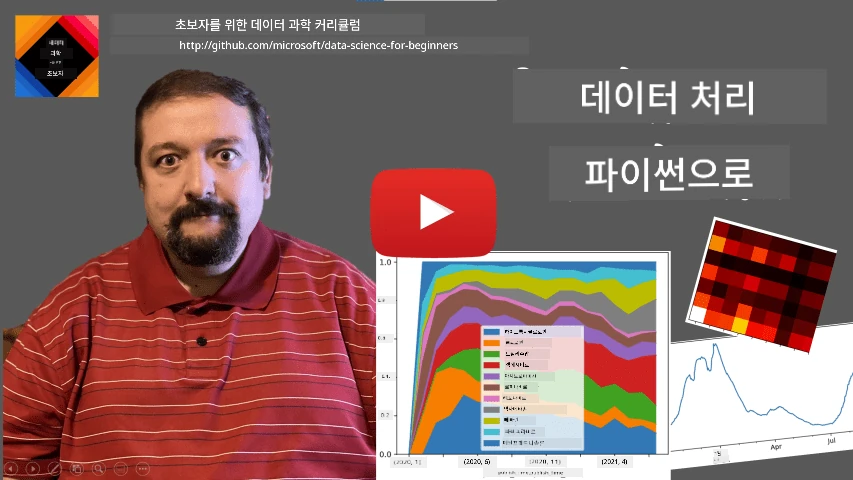
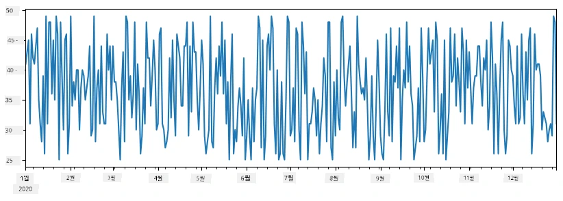
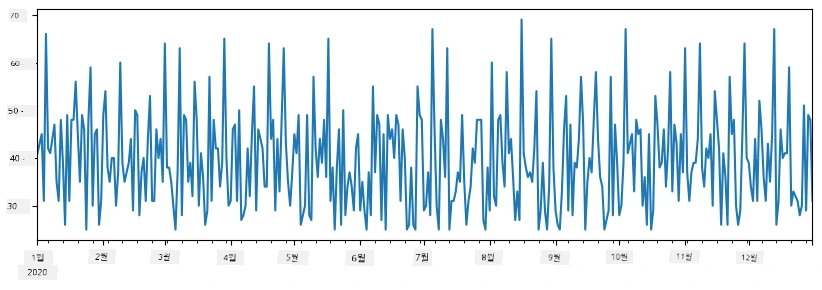
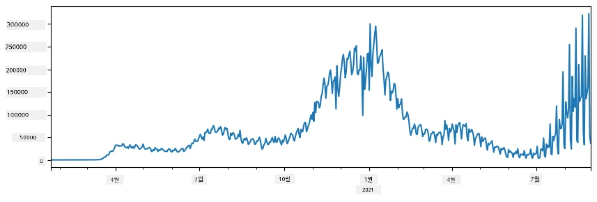
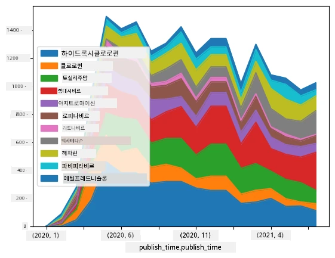

# 데이터 다루기: 파이썬과 Pandas 라이브러리

|  ](../../sketchnotes/07-WorkWithPython.png) |
| :-------------------------------------------------------------------------------------------------------: |
|                 파이썬과 함께하기 - _[@nitya](https://twitter.com/nitya)의 스케치노트_                 |

[](https://youtu.be/dZjWOGbsN4Y)

데이터베이스는 데이터를 저장하고 쿼리 언어로 조회하는 매우 효율적인 방법을 제공하지만, 가장 유연한 데이터 처리 방법은 데이터를 조작하는 자신만의 프로그램을 작성하는 것입니다. 많은 경우 데이터베이스 쿼리를 사용하는 것이 더 효과적일 수 있습니다. 하지만 더 복잡한 데이터 처리가 필요할 때는 SQL로 쉽게 처리할 수 없는 경우도 있습니다.
데이터 처리는 어떤 프로그래밍 언어로도 할 수 있지만, 데이터 작업에 관해 더 높은 수준의 언어들이 있습니다. 데이터 과학자들은 일반적으로 다음 언어들 중 하나를 선호합니다:

* **[Python](https://www.python.org/)**, 범용 프로그래밍 언어로, 단순성 때문에 초보자에게 가장 좋은 선택 중 하나로 여겨집니다. Python은 ZIP 아카이브에서 데이터를 추출하거나 이미지를 그레이스케일로 변환하는 등 많은 실용적인 문제를 해결하는 데 도움이 되는 추가 라이브러리가 많습니다. 데이터 과학뿐 아니라 웹 개발에도 자주 사용됩니다.
* <strong>[R](https://www.r-project.org/)</strong>는 통계 데이터 처리에 중점을 두고 개발된 전통적인 도구 상자입니다. 라이브러리 저장소(CRAN)가 잘 갖춰져 있어 데이터 처리에 좋은 선택입니다. 그러나 R은 범용 프로그래밍 언어가 아니며, 데이터 과학 영역 밖에서는 거의 사용되지 않습니다.
* <strong>[Julia](https://julialang.org/)</strong>는 데이터 과학을 위해 특별히 개발된 또 다른 언어입니다. Python보다 더 나은 성능을 제공하도록 설계되어 과학 실험에 탁월한 도구입니다.

이 강의에서는 간단한 데이터 처리를 위해 Python 사용에 초점을 맞춥니다. 기본적인 언어 익숙도를 가정합니다. 파이썬을 더 깊이 배우고 싶다면 다음 리소스 중 하나를 참고할 수 있습니다:

* [Turtle 그래픽과 프랙탈로 즐겁게 배우는 파이썬](https://github.com/shwars/pycourse) - GitHub 기반 파이썬 프로그래밍 빠른 입문 코스
* [파이썬 첫걸음 배우기](https://docs.microsoft.com/en-us/learn/paths/python-first-steps/?WT.mc_id=academic-77958-bethanycheum) Microsoft Learn의 러닝 경로

데이터는 다양한 형태로 올 수 있습니다. 이 강의에서는 **표형 데이터**, <strong>텍스트</strong>, <strong>이미지</strong> 세 가지 형태의 데이터를 살펴봅니다.

관련된 모든 라이브러리를 완벽히 다루기보다는 몇 가지 데이터 처리 예제에 집중할 것입니다. 이는 무엇이 가능한지에 대한 기본 아이디어를 얻고, 문제 발생 시 해결책을 찾는 방법을 이해하는 데 도움이 됩니다.

> **가장 유용한 조언**. 특정 데이터 연산을 수행할 줄 모를 때, 인터넷에서 검색해 보세요. [Stackoverflow](https://stackoverflow.com/)는 많은 전형적인 작업에 대해 유용한 파이썬 코드 샘플이 풍부합니다.


## [강의 전 퀴즈](https://ff-quizzes.netlify.app/en/ds/quiz/12)

## 표형 데이터와 데이터프레임

관계형 데이터베이스에 대해 배울 때 이미 표형 데이터를 접했습니다. 데이터가 많고 여러 관련 테이블에 분산되어 있으면 SQL을 사용하는 것이 당연히 합리적입니다. 하지만 데이터가 하나의 테이블에 있고 분포, 값 간 상관관계 등 데이터를 <strong>이해</strong>하거나 <strong>통찰</strong>할 필요가 있는 경우가 많습니다. 데이터 과학에서는 원본 데이터를 변환하고 시각화하는 경우가 많으며, 이 두 단계 모두 파이썬으로 쉽게 수행할 수 있습니다.

파이썬에서 표형 데이터를 다루는 데 가장 유용한 라이브러리 두 가지가 있습니다:
* <strong>[Pandas](https://pandas.pydata.org/)</strong>는 관계형 테이블에 해당하는 <strong>데이터프레임</strong>을 조작할 수 있게 해줍니다. 이름 있는 열이 있고, 행, 열, 전체 데이터프레임에 대해 다양한 작업을 수행할 수 있습니다.
* <strong>[Numpy](https://numpy.org/)</strong>는 다차원 <strong>텐서</strong> 즉, 다차원 <strong>배열</strong>을 다루는 라이브러리입니다. 배열은 동일한 타입 값을 가지며, 데이터프레임보다 간단하지만 더 많은 수학 연산을 지원하고 오버헤드가 적습니다.

또한 알아두어야 할 몇 가지 라이브러리가 있습니다:
* <strong>[Matplotlib](https://matplotlib.org/)</strong>는 데이터 시각화 및 그래프 그리기에 쓰이는 라이브러리입니다.
* <strong>[SciPy](https://www.scipy.org/)</strong>는 추가 과학 함수들을 포함한 라이브러리로, 확률 및 통계에서 이미 소개한 바 있습니다.

파이썬 프로그램 초반에 보통 아래 코드를 사용해 이들 라이브러리를 임포트합니다:
```python
import numpy as np
import pandas as pd
import matplotlib.pyplot as plt
from scipy import ... # 필요한 정확한 하위 패키지를 지정해야 합니다
``` 

Pandas는 몇 가지 기본 개념을 중심으로 설계되었습니다.

### 시리즈

<strong>시리즈(Series)</strong>는 리스트나 numpy 배열과 비슷한 값들의 순차형입니다. 주된 차이점은 시리즈에는 <strong>인덱스</strong>가 있고, 시리즈끼리 연산을 할 때(예: 덧셈) 인덱스가 고려된다는 점입니다. 인덱스는 정수 행 번호일 수 있으며(리스트나 배열에서 기본 생성되는 인덱스), 날짜 구간과 같은 복잡한 구조일 수도 있습니다.

> <strong>참고</strong>: 동봉된 노트북 [`notebook.ipynb`](notebook.ipynb)에는 기본적인 Pandas 코드가 있습니다. 여기서는 일부 예시만 제시하므로 전체 노트북을 확인해 보시길 권합니다.

예를 들어 우리의 아이스크림 가게 매출을 분석하고자 할 때, 일정 기간 동안 일별 판매량 시리즈를 생성해 보겠습니다:

```python
start_date = "Jan 1, 2020"
end_date = "Mar 31, 2020"
idx = pd.date_range(start_date,end_date)
print(f"Length of index is {len(idx)}")
items_sold = pd.Series(np.random.randint(25,50,size=len(idx)),index=idx)
items_sold.plot()
```


이제 매주 친구들을 위한 파티를 열 때 간식용 아이스크림 10팩을 추가로 준비한다고 가정하겠습니다. 주 단위로 인덱싱된 또 다른 시리즈를 만들어 이를 보여줄 수 있습니다:
```python
additional_items = pd.Series(10,index=pd.date_range(start_date,end_date,freq="W"))
```
시리즈 둘을 합치면 총 판매량이 나옵니다:
```python
total_items = items_sold.add(additional_items,fill_value=0)
total_items.plot()
```


> <strong>참고</strong>: 간단한 문법인 `total_items+additional_items`를 사용하지 않는 이유는 결과 시리즈에 많은 `NaN` (*숫자가 아님*) 값이 발생하기 때문입니다. `additional_items` 시리즈에는 일부 인덱스에 값이 없고, `NaN`과의 덧셈이 `NaN`을 만드는 특성 때문입니다. 그래서 덧셈 시에 `fill_value` 파라미터를 지정해야 합니다.

시계열 데이터는 다른 시간 간격으로 <strong>재샘플링(resample)</strong>할 수도 있습니다. 예를 들어 월별 평균 판매량을 계산하고 싶으면 다음 코드를 사용합니다:
```python
monthly = total_items.resample("1M").mean()
ax = monthly.plot(kind='bar')
```


### 데이터프레임(DataFrame)

데이터프레임은 인덱스가 같은 여러 시리즈의 모음입니다. 여러 시리즈를 결합하여 데이터프레임을 만들 수 있습니다:
```python
a = pd.Series(range(1,10))
b = pd.Series(["I","like","to","play","games","and","will","not","change"],index=range(0,9))
df = pd.DataFrame([a,b])
```
이렇게 하면 다음과 같은 가로형 표가 만들어집니다:
|     | 0   | 1    | 2   | 3   | 4      | 5   | 6      | 7    | 8    |
| --- | --- | ---- | --- | --- | ------ | --- | ------ | ---- | ---- |
| 0   | 1   | 2    | 3   | 4   | 5      | 6   | 7      | 8    | 9    |
| 1   | I   | like | to  | use | Python | and | Pandas | very | much |

시리즈를 열로 사용하고, 사전을 이용해 열 이름을 지정할 수도 있습니다:
```python
df = pd.DataFrame({ 'A' : a, 'B' : b })
```
이렇게 하면 다음과 같은 표가 만들어집니다:

|     | A   | B      |
| --- | --- | ------ |
| 0   | 1   | I      |
| 1   | 2   | like   |
| 2   | 3   | to     |
| 3   | 4   | use    |
| 4   | 5   | Python |
| 5   | 6   | and    |
| 6   | 7   | Pandas |
| 7   | 8   | very   |
| 8   | 9   | much   |

<strong>참고</strong> 이전 표를 전치(transpose)해서도 같은 배열을 만들 수 있습니다. 예를 들어
```python
df = pd.DataFrame([a,b]).T.rename(columns={ 0 : 'A', 1 : 'B' })
```
여기서 `.T`는 데이터프레임의 행과 열을 바꾸는 전치 연산이고, `rename`은 열 이름을 이전 예와 맞게 바꾸는 작업입니다.

데이터프레임에서 수행할 수 있는 몇 가지 중요한 작업은 다음과 같습니다:

**열 선택**. 개별 열은 `df['A']`라고 쓰면 선택할 수 있으며, 이 작업은 시리즈를 반환합니다. `df[['B','A']]`처럼 여러 열을 선택하면 다른 데이터프레임이 됩니다.

**특정 조건으로 행 필터링**. 예를 들어 `A` 열이 5 초과인 행만 남기려면 `df[df['A']>5]`라고 씁니다.

> <strong>참고</strong>: 필터링 방식은 다음과 같습니다. `df['A']<5`는 불리언 시리즈를 반환하며, 각 원소가 참인지 거짓인지 표시합니다. 불리언 시리즈는 인덱스로 사용되면 데이터프레임의 행 하위 집합을 반환합니다. 따라서 임의의 파이썬 불리언 표현식을 사용할 수 없습니다. 예를 들어 `df[df['A']>5 and df['A']<7]`은 잘못된 표현입니다. 대신 불리언 시리즈에 특수 연산자인 `&`를 사용해 `df[(df['A']>5) & (df['A']<7)]`라고 써야 합니다 (*괄호 필수*).

**새 컴퓨팅 열 만들기**. 직관적 표현을 사용해 데이터프레임에 새 계산 열을 쉽게 추가할 수 있습니다:
```python
df['DivA'] = df['A']-df['A'].mean() 
``` 
이 예제는 `A`의 평균값과 편차를 계산합니다. 실제로는 시리즈를 계산한 후 좌변에 할당해 새 열을 만들기 때문에 시리즈와 호환되지 않는 연산은 사용할 수 없습니다. 아래 코드는 잘못된 예입니다:
```python
# 잘못된 코드 -> df['ADescr'] = "Low" if df['A'] < 5 else "Hi"
df['LenB'] = len(df['B']) # <- 잘못된 결과
``` 
문법적으로는 맞지만 잘못된 결과를 냅니다. 모든 열 값에 시리즈 `B` 길이가 할당되며, 개별 원소 길이가 아닙니다.

복잡한 표현식을 계산해야 할 때 `apply` 함수를 사용할 수 있습니다. 마지막 예는 다음과 같이 작성할 수 있습니다:
```python
df['LenB'] = df['B'].apply(lambda x : len(x))
# 또는
df['LenB'] = df['B'].apply(len)
```

위 작업을 거치면 다음과 같은 데이터프레임이 만들어집니다:

|     | A   | B      | DivA | LenB |
| --- | --- | ------ | ---- | ---- |
| 0   | 1   | I      | -4.0 | 1    |
| 1   | 2   | like   | -3.0 | 4    |
| 2   | 3   | to     | -2.0 | 2    |
| 3   | 4   | use    | -1.0 | 3    |
| 4   | 5   | Python | 0.0  | 6    |
| 5   | 6   | and    | 1.0  | 3    |
| 6   | 7   | Pandas | 2.0  | 6    |
| 7   | 8   | very   | 3.0  | 4    |
| 8   | 9   | much   | 4.0  | 4    |

<strong>숫자로 행 선택하기</strong>는 `iloc` 구문을 사용합니다. 예를 들어 데이터프레임에서 처음 5개 행을 선택하려면:
```python
df.iloc[:5]
```

<strong>그룹화</strong>는 Excel의 <em>피벗 테이블</em>과 유사한 결과를 얻을 때 자주 사용됩니다. 예컨대 `LenB`별로 `A` 열 평균값을 계산하려면, 데이터프레임을 `LenB`로 그룹화하고 `mean`을 호출합니다:
```python
df.groupby(by='LenB')[['A','DivA']].mean()
```
평균과 그룹 내 원소 수를 함께 구하려면 더 복잡한 `aggregate` 함수를 사용할 수 있습니다:
```python
df.groupby(by='LenB') \
 .aggregate({ 'DivA' : len, 'A' : lambda x: x.mean() }) \
 .rename(columns={ 'DivA' : 'Count', 'A' : 'Mean'})
```
결과는 다음 표와 같습니다:

| LenB | Count | Mean     |
| ---- | ----- | -------- |
| 1    | 1     | 1.000000 |
| 2    | 1     | 3.000000 |
| 3    | 2     | 5.000000 |
| 4    | 3     | 6.333333 |
| 6    | 2     | 6.000000 |

### 데이터 가져오기


Python 객체로부터 Series와 DataFrame을 쉽게 구성할 수 있는 방법을 살펴보았습니다. 그러나 데이터는 보통 텍스트 파일이나 Excel 표의 형태로 제공됩니다. 다행히도, Pandas는 디스크에서 데이터를 불러오는 간단한 방법을 제공합니다. 예를 들어, CSV 파일을 읽는 것은 다음과 같이 간단합니다:
```python
df = pd.read_csv('file.csv')
```
"도전" 섹션에서 외부 웹사이트에서 데이터를 가져오는 것을 포함하여 더 많은 데이터 로드 예제를 볼 것입니다.


### 출력 및 시각화

데이터 과학자는 종종 데이터를 탐색해야 하므로 데이터를 시각화할 수 있는 것이 중요합니다. DataFrame이 클 때는 보통 `df.head()`를 호출하여 처음 몇 행만 출력함으로써 모든 것이 올바르게 처리되고 있는지 확인하고자 합니다. Jupyter Notebook에서 실행하면, DataFrame을 깔끔한 표 형식으로 출력합니다.

일부 열을 시각화하기 위해 `plot` 함수의 사용법도 살펴보았습니다. `plot`은 많은 작업에 매우 유용하며 `kind=` 매개변수를 통해 여러 그래프 유형을 지원하지만, 더 복잡한 것을 그려야 할 때는 언제든지 순수한 `matplotlib` 라이브러리를 사용할 수 있습니다. 데이터 시각화는 별도의 강의에서 자세히 다룰 예정입니다.

이번 개요에서는 Pandas의 가장 중요한 개념을 다루었으나, 이 라이브러리는 매우 풍부하며 할 수 있는 것에 제한이 없습니다! 이제 이 지식을 특정 문제 해결에 적용해 봅시다.

## 🚀 도전 1: COVID 확산 분석

첫 번째 문제는 COVID-19의 전염병 확산 모델링에 집중합니다. 이를 위해 [Johns Hopkins University](https://jhu.edu/)의 [Center for Systems Science and Engineering](https://systems.jhu.edu/) (CSSE)이 제공하는 여러 국가별 감염자 수 데이터를 사용할 예정입니다. 데이터셋은 [이 GitHub 저장소](https://github.com/CSSEGISandData/COVID-19)에서 제공됩니다.

데이터 처리를 어떻게 다루는지 보여주기 위해 [`notebook-covidspread.ipynb`](notebook-covidspread.ipynb) 파일을 열어 처음부터 끝까지 읽어보세요. 또한 셀을 실행하거나 마지막에 남겨둔 도전 문제들을 풀어볼 수도 있습니다.



> Jupyter Notebook에서 코드를 실행하는 방법을 모른다면, [이 글](https://soshnikov.com/education/how-to-execute-notebooks-from-github/)을 참고하세요.

## 비정형 데이터 다루기

데이터는 대부분 표 형식으로 제공되지만, 경우에 따라 텍스트나 이미지 같은 덜 구조화된 데이터를 다뤄야 할 때가 있습니다. 이 경우 위에서 살펴본 데이터 처리 기법을 적용하려면 구조화된 데이터를 <strong>추출</strong>해야 합니다. 몇 가지 예시는 다음과 같습니다:

* 텍스트에서 키워드를 추출하고, 이 키워드가 얼마나 자주 나타나는지 확인
* 신경망을 사용하여 이미지 내 객체에 대한 정보 추출
* 비디오 카메라 피드 속 인물의 감정 정보 추출

## 🚀 도전 2: COVID 논문 분석

이번 도전에서는 COVID 팬데믹 주제를 이어가며, 관련 과학 논문 처리에 집중합니다. 7000편 이상의 COVID 관련 논문이 포함된 [CORD-19 데이터셋](https://www.kaggle.com/allen-institute-for-ai/CORD-19-research-challenge)이 있으며, 메타데이터와 초록이 제공됩니다(절반가량의 논문에는 전체 텍스트도 제공).

[Text Analytics for Health](https://docs.microsoft.com/azure/cognitive-services/text-analytics/how-tos/text-analytics-for-health/?WT.mc_id=academic-77958-bethanycheum) 인지 서비스를 사용한 이 데이터셋 분석의 전체 예시는 [이 블로그 게시물](https://soshnikov.com/science/analyzing-medical-papers-with-azure-and-text-analytics-for-health/)에 설명되어 있습니다. 우리는 이 분석의 단순화된 버전을 다룰 것입니다.

> <strong>참고</strong>: 본 저장소에는 데이터셋 사본이 포함되어 있지 않습니다. 먼저 [이 Kaggle 데이터셋](https://www.kaggle.com/allen-institute-for-ai/CORD-19-research-challenge)에서 [`metadata.csv`](https://www.kaggle.com/allen-institute-for-ai/CORD-19-research-challenge?select=metadata.csv) 파일을 다운로드해야 할 수 있습니다. Kaggle 회원가입이 필요할 수 있습니다. 등록 없이 [여기](https://ai2-semanticscholar-cord-19.s3-us-west-2.amazonaws.com/historical_releases.html)에서 데이터셋을 다운로드할 수도 있지만, 메타데이터 파일뿐만 아니라 전체 텍스트도 포함됩니다.

[`notebook-papers.ipynb`](notebook-papers.ipynb)를 열어 처음부터 끝까지 읽어보세요. 셀을 실행하거나 마지막에 남겨둔 도전을 풀어볼 수도 있습니다.



## 이미지 데이터 처리

최근 매우 강력한 AI 모델이 개발되어 이미지를 이해할 수 있게 되었습니다. 사전 학습된 신경망이나 클라우드 서비스를 사용하여 해결할 수 있는 작업은 많습니다. 몇 가지 예시는 다음과 같습니다:

* **이미지 분류**, 이미지를 미리 정의된 클래스 중 하나로 분류하는 데 도움이 됩니다. [Custom Vision](https://azure.microsoft.com/services/cognitive-services/custom-vision-service/?WT.mc_id=academic-77958-bethanycheum) 등의 서비스를 사용해 손쉽게 자신만의 이미지 분류기를 훈련할 수 있습니다.
* **객체 감지**, 이미지 내 여러 객체를 감지합니다. [computer vision](https://azure.microsoft.com/services/cognitive-services/computer-vision/?WT.mc_id=academic-77958-bethanycheum)과 같은 서비스는 여러 일반 객체를 감지하며, [Custom Vision](https://azure.microsoft.com/services/cognitive-services/custom-vision-service/?WT.mc_id=academic-77958-bethanycheum) 모델을 훈련해 특정 관심 객체를 감지할 수도 있습니다.
* **얼굴 감지**, 연령, 성별 및 감정 감지도 가능합니다. 이는 [Face API](https://azure.microsoft.com/services/cognitive-services/face/?WT.mc_id=academic-77958-bethanycheum)로 수행할 수 있습니다.

이러한 모든 클라우드 서비스는 [Python SDK](https://docs.microsoft.com/samples/azure-samples/cognitive-services-python-sdk-samples/cognitive-services-python-sdk-samples/?WT.mc_id=academic-77958-bethanycheum)를 통해 호출할 수 있어 데이터 탐색 작업에 쉽게 통합됩니다.

이미지 데이터 소스 탐색 예시는 다음과 같습니다:
* 블로그 글 [How to Learn Data Science without Coding](https://soshnikov.com/azure/how-to-learn-data-science-without-coding/)에서는 Instagram 사진을 탐색하며, 사람들이 어떤 사진에 더 많은 좋아요를 주는지 이해하려고 합니다. 먼저 [computer vision](https://azure.microsoft.com/services/cognitive-services/computer-vision/?WT.mc_id=academic-77958-bethanycheum)를 사용해 사진에서 가능한 많은 정보를 추출한 다음, [Azure Machine Learning AutoML](https://docs.microsoft.com/azure/machine-learning/concept-automated-ml/?WT.mc_id=academic-77958-bethanycheum)로 해석 가능한 모델을 구축합니다.
* [Facial Studies Workshop](https://github.com/CloudAdvocacy/FaceStudies)에서는 [Face API](https://azure.microsoft.com/services/cognitive-services/face/?WT.mc_id=academic-77958-bethanycheum)를 사용해 이벤트에서 찍힌 사진 속 인물의 감정을 추출하여 사람들이 무엇에 행복을 느끼는지 이해하려고 합니다.

## 결론

구조화된 데이터든 비정형 데이터든, Python을 사용하면 데이터 처리와 이해에 필요한 모든 단계를 수행할 수 있습니다. Python은 아마도 가장 유연한 데이터 처리 방법이며, 이것이 대부분의 데이터 과학자가 Python을 주력 도구로 사용하는 이유입니다. 데이터 과학에 진지하다면 Python을 깊이 배우는 것이 좋은 생각일 것입니다!

## [강의 후 퀴즈](https://ff-quizzes.netlify.app/en/ds/quiz/13)

## 복습 및 자기학습

<strong>도서</strong>
* [Wes McKinney. Python for Data Analysis: Data Wrangling with Pandas, NumPy, and IPython](https://www.amazon.com/gp/product/1491957662)

**온라인 자료**
* 공식 [10 minutes to Pandas](https://pandas.pydata.org/pandas-docs/stable/user_guide/10min.html) 튜토리얼
* [Pandas 시각화에 관한 문서](https://pandas.pydata.org/pandas-docs/stable/user_guide/visualization.html)

**Python 학습**
* [거북이 그래픽과 프랙탈로 재미있게 배우는 Python](https://github.com/shwars/pycourse)
* [Python 기초 배우기](https://docs.microsoft.com/learn/paths/python-first-steps/?WT.mc_id=academic-77958-bethanycheum) - [Microsoft Learn](http://learn.microsoft.com/?WT.mc_id=academic-77958-bethanycheum)의 학습 경로

## 과제

[위 도전 과제에 대한 더 상세한 데이터 분석 수행](assignment.md)

## 감사의 글

이 강의는 [Dmitry Soshnikov](http://soshnikov.com)의 ♥️로 제작되었습니다.

---

<!-- CO-OP TRANSLATOR DISCLAIMER START -->
**면책 조항**:
이 문서는 AI 번역 서비스 [Co-op Translator](https://github.com/Azure/co-op-translator)를 사용하여 번역되었습니다. 정확성을 기하기 위해 노력하고 있으나, 자동 번역은 오류나 부정확한 부분이 있을 수 있음을 유의하시기 바랍니다. 원본 문서의 원어본이 권위 있는 자료로 간주되어야 합니다. 중요한 정보의 경우, 전문가의 인간 번역을 권장합니다. 이 번역 사용으로 인해 발생하는 오해나 잘못된 해석에 대해 당사는 책임을 지지 않습니다.
<!-- CO-OP TRANSLATOR DISCLAIMER END -->