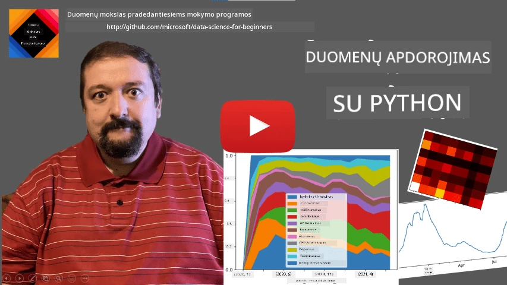
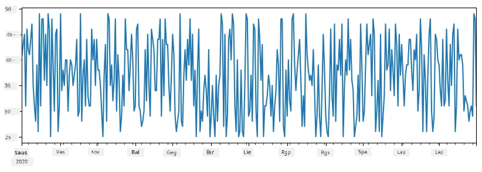
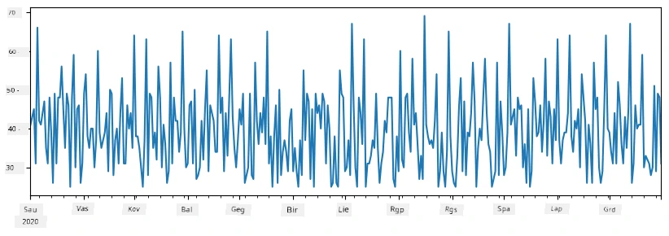
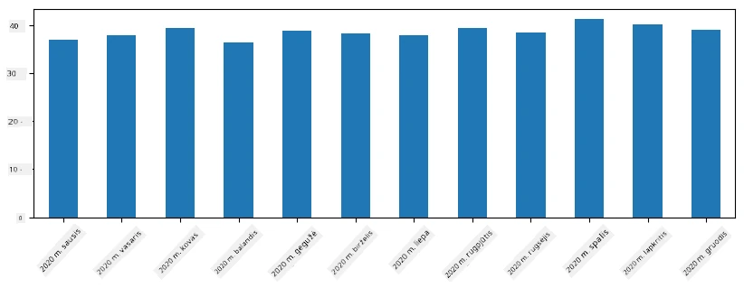
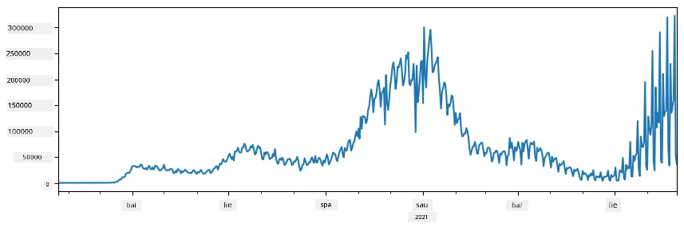
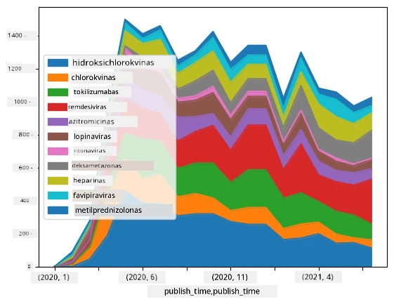

# Darbas su Duomenimis: Python ir Pandas Biblioteka

|  ](../../sketchnotes/07-WorkWithPython.png) |
| :-------------------------------------------------------------------------------------------------------: |
|                 Darbas su Python - _Sketchnote by [@nitya](https://twitter.com/nitya)_                 |

[](https://youtu.be/dZjWOGbsN4Y)

Nors duomenų bazės siūlo labai efektyvius būdus duomenims saugoti ir juos užklausinėti naudojant užklausų kalbas, lanksčiausias būdas duomenų apdorojimui yra rašyti savo programą duomenims manipuliuoti. Daugeliu atvejų duomenų bazės užklausa būtų veiksmingesnis būdas. Tačiau kai kuriais atvejais, kai reikia sudėtingesnio duomenų apdorojimo, to negalima lengvai atlikti naudojant SQL.
Duomenų apdorojimas gali būti programuojamas bet kuria programavimo kalba, tačiau yra tam tikros kalbos, kurios yra aukštesnio lygio dirbant su duomenimis. Duomenų mokslininkai paprastai renkasi vieną iš šių kalbų:

* **[Python](https://www.python.org/)**, bendros paskirties programavimo kalba, kuri dažnai laikoma viena geriausių pasirinkčių pradedantiesiems dėl jos paprastumo. Python turi daug papildomų bibliotekų, kurios gali padėti išspręsti daugelį praktinių problemų, pavyzdžiui, išgauti duomenis iš ZIP archyvo arba konvertuoti paveikslėlį į pilką skalę. Be duomenų mokslo, Python taip pat dažnai naudojamas interneto kūrimui.
* **[R](https://www.r-project.org/)** yra tradicinis įrankių rinkinys, sukurtas galvojant apie statistinį duomenų apdorojimą. Jis taip pat turi didelę bibliotekų saugyklą (CRAN), todėl yra gera pasirinktis duomenų apdorojimui. Tačiau R nėra bendros paskirties programavimo kalba ir retai naudojama už duomenų mokslo srities ribų.
* **[Julia](https://julialang.org/)** yra kita kalba, sukurta specialiai duomenų mokslui. Ji skirta suteikti geresnį našumą nei Python, todėl yra puikus įrankis moksliniams eksperimentams.

Šiame pamokoje mes sutelksime dėmesį į Python naudojimą paprastam duomenų apdorojimui. Mes prielaidžiai laikome, kad turite pagrindines kalbos žinias. Jei norite išsamesnio Python pažinimo, galite pasinaudoti vienu iš šių šaltinių:

* [Mokykitės Python linksmai su Turtle grafika ir fraktalais](https://github.com/shwars/pycourse) - greita įžanga į Python programavimą GitHub platformoje
* [Pirmieji žingsniai su Python](https://docs.microsoft.com/en-us/learn/paths/python-first-steps/?WT.mc_id=academic-77958-bethanycheum) mokymosi kelias platformoje [Microsoft Learn](http://learn.microsoft.com/?WT.mc_id=academic-77958-bethanycheum)

Duomenys gali būti įvairių formų. Šioje pamokoje mes apsvarstysime tris duomenų formas - **lentelinius duomenis**, **tekstą** ir **paveikslėlius**.

Mes sutelksime dėmesį į keletą duomenų apdorojimo pavyzdžių vietoje to, kad pateiktume pilną visų susijusių bibliotekų apžvalgą. Tai leis jums suprasti pagrindinę idėją, kas įmanoma, ir suteiks supratimą, kur rasti sprendimų savo problemoms, kai jų reikės.

> **Naudingiausias patarimas**. Kai jums reikia atlikti tam tikrą veiksmą su duomenimis ir nežinote, kaip tai padaryti, pabandykite ieškoti internete. [Stackoverflow](https://stackoverflow.com/) dažnai turi daug naudingų Python kodo pavyzdžių daugeliui tipinių užduočių.


## [Prieš paskaitą testas](https://ff-quizzes.netlify.app/en/ds/quiz/12)

## Lenteliniai duomenys ir Dataframe'ai

Jūs jau susipažinote su lenteliniais duomenimis, kai kalbėjome apie reliacines duomenų bazes. Kai turite daug duomenų, ir jie yra daugelyje skirtingų susietų lentelių, tikrai prasminga naudoti SQL darbui su jais. Tačiau yra daug atvejų, kai turime duomenų lentelę ir norime gauti **supratimą** arba **įžvalgas** apie šiuos duomenis, pavyzdžiui, pasiskirstymą, reikšmių koreliaciją ir pan. Duomenų moksle dažnai reikia atlikti tam tikras originalių duomenų transformacijas, kurioms seka vizualizacija. Abu šie žingsniai yra lengvai atlikti naudojant Python.

Python yra dvi naudingiausios bibliotekos, kurios gali padėti dirbti su lenteliniais duomenimis:
* **[Pandas](https://pandas.pydata.org/)** leidžia manipuliuoti vadinamaisiais **Dataframe'ais**, kurie yra analogiški reliacinėms lentelėms. Galima turėti pavadintas stulpelius ir atlikti įvairias operacijas su eilutėmis, stulpeliais ir visais data frame'ais apskritai.
* **[Numpy](https://numpy.org/)** yra biblioteka darbui su **tenzorais**, t. y. daugiamatėmis **matricomis**. Matrica turi vienodos pagrindinės rūšies reikšmes, ir ji yra paprastesnė už dataframe, tačiau siūlo daugiau matematinių operacijų bei sukuria mažiau papildomos naštos.

Taip pat yra keletas kitų žinomų bibliotekų:
* **[Matplotlib](https://matplotlib.org/)** yra biblioteka, skirta duomenų vizualizacijai ir grafikų darymui
* **[SciPy](https://www.scipy.org/)** yra biblioteka su papildomomis mokslinėmis funkcijomis. Jau susidūrėme su šia biblioteka kalbėdami apie tikimybę ir statistiką

Štai kodo fragmentas, kurį paprastai naudotumėte importuoti šias bibliotekas savo Python programos pradžioje:
```python
import numpy as np
import pandas as pd
import matplotlib.pyplot as plt
from scipy import ... # jums reikia nurodyti tikslinius požeminius paketus, kurių jums reikia
``` 

Pandas pagrindiniai konceptai yra keli.

### Serijos (Series)

**Series** yra reikšmių seka, panaši į sąrašą arba numpy matricą. Pagrindinis skirtumas yra tas, kad serija taip pat turi **indeksą**, ir kai operuojame su serijomis (pvz., jas sudedame), indeksas yra atsižvelgiamas. Indeksas gali būti toks paprastas kaip sveikasis eilutės numeris (pagal nutylėjimą naudojamas generuojant seriją iš sąrašo ar matricos), arba jis gali turėti sudėtingesnę struktūrą, pvz., datos intervalą.

> **Pastaba**: Yra šiek tiek įvadinio Pandas kodo pridėtame sąsiuvinyje [`notebook.ipynb`](notebook.ipynb). Čia mes tik apibendriname keletą pavyzdžių, tačiau jūs galite drąsiai peržiūrėti visą sąsiuvinį.

Pavyzdžiui, norime analizuoti ledų prekybos rezultatus. Sugeneruokime seriją pardavimų skaičių (vienetų, parduotų kiekvieną dieną) tam tikram laiko tarpui:

```python
start_date = "Jan 1, 2020"
end_date = "Mar 31, 2020"
idx = pd.date_range(start_date,end_date)
print(f"Length of index is {len(idx)}")
items_sold = pd.Series(np.random.randint(25,50,size=len(idx)),index=idx)
items_sold.plot()
```


Tarkime, kad kiekvieną savaitę rengiame draugų vakarėlį ir pasiimame papildomus 10 ledų pakelių. Galime sukurti kitą seriją, indeksuotą pagal savaites, kad tai parodytume:
```python
additional_items = pd.Series(10,index=pd.date_range(start_date,end_date,freq="W"))
```
Kai sudedame dvi serijas, gauname bendrą skaičių:
```python
total_items = items_sold.add(additional_items,fill_value=0)
total_items.plot()
```


> **Pastaba**, kad nesinaudojame paprasta sintakse `total_items+additional_items`. Jei taip padarytume, gautume daug `NaN` (*Not a Number*) reikšmių galutinėje serijoje. Tai todėl, kad kai kuriems indeksų taškams serijoje `additional_items` trūksta reikšmių, o bet kokio skaičiaus sudėjimas su `NaN` duoda `NaN`. Todėl sudedant reikia nurodyti `fill_value` parametrą.

Su laiko serijomis galime taip pat **persampling** seriją su skirtingais laiko intervalais. Pavyzdžiui, norime apskaičiuoti vidutinius mėnesinius pardavimus. Galime naudoti šį kodą:
```python
monthly = total_items.resample("1M").mean()
ax = monthly.plot(kind='bar')
```


### DataFrame

DataFrame iš esmės yra kelių serijų rinkinys su tuo pačiu indeksu. Galime sujungti kelias serijas į vieną DataFrame:
```python
a = pd.Series(range(1,10))
b = pd.Series(["I","like","to","play","games","and","will","not","change"],index=range(0,9))
df = pd.DataFrame([a,b])
```
Tai sukurs horizontalų lentelės vaizdą:
|     | 0   | 1    | 2   | 3   | 4      | 5   | 6      | 7    | 8    |
| --- | --- | ---- | --- | --- | ------ | --- | ------ | ---- | ---- |
| 0   | 1   | 2    | 3   | 4   | 5      | 6   | 7      | 8    | 9    |
| 1   | I   | like | to  | use | Python | and | Pandas | very | much |

Taip pat galime naudoti Series kaip stulpelius ir nurodyti stulpelių pavadinimus naudojant žodyną:
```python
df = pd.DataFrame({ 'A' : a, 'B' : b })
```
Tai duos tokį lentelės vaizdą:

|     | A   | B      |
| --- | --- | ------ |
| 0   | 1   | I      |
| 1   | 2   | like   |
| 2   | 3   | to     |
| 3   | 4   | use    |
| 4   | 5   | Python |
| 5   | 6   | and    |
| 6   | 7   | Pandas |
| 7   | 8   | very   |
| 8   | 9   | much   |

**Pastaba**, kad tokią lentelės išdėstymą galime gauti ir transponuodami ankstesnę lentelę, pvz. rašydami
```python
df = pd.DataFrame([a,b]).T.rename(columns={ 0 : 'A', 1 : 'B' })
```
Čia `.T` reiškia DataFrame transponavimo operaciją, t. y. eilučių ir stulpelių keitimą vietomis, o `rename` operacija leidžia pervadinti stulpelius, kad atitiktų ankstesnio pavyzdžio išdėstymą.

Štai keletas svarbiausių operacijų, kurias galime atlikti su DataFrame:

**Stulpelių parinkimas**. Galime pasirinkti atskirus stulpelius rašydami `df['A']` - ši operacija grąžina Series. Taip pat galime pasirinkti stulpelių pogrupį į kitą DataFrame rašydami `df[['B','A']]` - tai grąžina kitą DataFrame.

**Filtravimas** pagal tam tikras eilutes pagal sąlygas. Pavyzdžiui, norėdami palikti tik eiles, kur stulpelis `A` yra didesnis nei 5, galime rašyti `df[df['A']>5]`.

> **Pastaba**: Filtravimo veikimo principas yra toks. Išraiška `df['A']<5` grąžina loginę seriją (boolean), kuri nurodo, ar išraiška yra `True` ar `False` kiekvienam pradinės serijos `df['A']` elementui. Kai loginė serija naudojama kaip indeksas, ji grąžina eilučių poaibį DataFrame. Todėl nėra galima naudoti bet kokios Python loginės išraiškos, pavyzdžiui, rašymas `df[df['A']>5 and df['A']<7]` būtų klaidingas. Vietoje to, reiktų naudoti specialų `&` veiksmą su loginėmis serijomis, rašant `df[(df['A']>5) & (df['A']<7)]` (*skliaustai čia yra svarbūs*).

**Naujų apskaičiuojamų stulpelių kūrimas**. Lengvai galime sukurti naujus apskaičiuojamus stulpelius savo DataFrame naudodami intuityvias išraiškas kaip šią:
```python
df['DivA'] = df['A']-df['A'].mean() 
``` 
Šis pavyzdys apskaičiuoja A nukrypimą nuo jo vidutinės reikšmės. Iš esmės čia mes skaičiuojame seriją ir priskiriame šią seriją kairiajai pusei, sukuriant kitą stulpelį. Todėl negalime naudoti jokių operacijų, kurios nėra suderinamos su serijomis, pavyzdžiui, žemiau pateiktas kodas yra klaidingas:
```python
# Neteisingas kodas -> df['ADescr'] = "Low" jei df['A'] < 5 kitaip "Hi"
df['LenB'] = len(df['B']) # <- Neteisinga rezultatas
``` 
Pastarasis pavyzdys, nors ir sintaksiškai teisingas, duoda klaidingą rezultatą, nes priskiria serijos `B` ilgį visoms reikšmėms stulpelyje, o ne atskirų elementų ilgį, kaip norėjome.

Jei reikia apskaičiuoti sudėtingas išraiškas, galime naudoti funkciją `apply`. Paskutinį pavyzdį galima užrašyti taip:
```python
df['LenB'] = df['B'].apply(lambda x : len(x))
# arba
df['LenB'] = df['B'].apply(len)
```

Po aukščiau nurodytų operacijų gausime tokį DataFrame:

|     | A   | B      | DivA | LenB |
| --- | --- | ------ | ---- | ---- |
| 0   | 1   | I      | -4.0 | 1    |
| 1   | 2   | like   | -3.0 | 4    |
| 2   | 3   | to     | -2.0 | 2    |
| 3   | 4   | use    | -1.0 | 3    |
| 4   | 5   | Python | 0.0  | 6    |
| 5   | 6   | and    | 1.0  | 3    |
| 6   | 7   | Pandas | 2.0  | 6    |
| 7   | 8   | very   | 3.0  | 4    |
| 8   | 9   | much   | 4.0  | 4    |

**Eilučių pasirinkimas pagal numerius** atliekamas naudojant konstruktą `iloc`. Pavyzdžiui, norėdami pasirinkti pirmas 5 eilutes iš DataFrame:
```python
df.iloc[:5]
```

**Grupavimas** dažnai naudojamas gauti rezultatą, panašų į *pivot lenteles* Excel programoje. Tarkime, norime apskaičiuoti stulpelio `A` vidurkį kiekvienam konkrečiam `LenB` skaičiui. Tada galime grupuoti DataFrame pagal `LenB` ir kviesti `mean`:
```python
df.groupby(by='LenB')[['A','DivA']].mean()
```
Jei reikia apskaičiuoti vidurkį ir grupės elementų skaičių, galime naudoti sudėtingesnę funkciją `aggregate`:
```python
df.groupby(by='LenB') \
 .aggregate({ 'DivA' : len, 'A' : lambda x: x.mean() }) \
 .rename(columns={ 'DivA' : 'Count', 'A' : 'Mean'})
```
Tai duoda tokią lentelę:

| LenB | Count | Mean     |
| ---- | ----- | -------- |
| 1    | 1     | 1.000000 |
| 2    | 1     | 3.000000 |
| 3    | 2     | 5.000000 |
| 4    | 3     | 6.333333 |
| 6    | 2     | 6.000000 |

### Duomenų gavimas


Matėme, kaip lengva sukurti Series ir DataFrames iš Python objektų. Tačiau duomenys dažniausiai pateikiami teksto failo arba Excel lentelės forma. Laimei, Pandas siūlo paprastą būdą įkelti duomenis iš disko. Pavyzdžiui, CSV failo skaitymas yra toks paprastas:
```python
df = pd.read_csv('file.csv')
```
Daugiau duomenų įkėlimo pavyzdžių, įskaitant jų gavimą iš išorinių svetainių, pamatysime skyriuje „Iššūkis“


### Spausdinimas ir braižymas

Duomenų mokslininkas dažnai turi tirti duomenis, todėl svarbu sugebėti juos vizualizuoti. Kai DataFrame yra didelis, dažnai norime tiesiog įsitikinti, kad viską darome teisingai, išspausdinę kelias pirmąsias eilutes. Tai galima padaryti iškviečiant `df.head()`. Jei vykdote kodą Jupyter Notebook'e, jis atspausdins DataFrame gražia lentelės forma.

Taip pat matėme, kaip naudoti `plot` funkciją kažkurių stulpelių vizualizavimui. Nors `plot` yra labai naudingas daugeliu užduočių ir palaiko daug įvairių grafiko tipus per `kind=` parametrą, visuomet galite naudoti žaliąją `matplotlib` biblioteką, jeigu norite nubraižyti kažką sudėtingesnio. Duomenų vizualizaciją išsamiai aptarsime atskiruose kurso pamokose.

Šis apžvalginis turinys apima svarbiausias Pandas sąvokas, tačiau biblioteka yra labai turtinga ir nėra ribų tam, ką su ja galite nuveikti! Dabar pritaikykime šias žinias sprendžiant konkrečią problemą.

## 🚀 Iššūkis 1: COVID plitimo analizė

Pirmoji problema, kuriai skirsime dėmesį, yra COVID-19 epidemijos plitimo modeliavimas. Tam pasitelksime skirtingų šalių užsikrėtusių asmenų skaičiaus duomenis, kuriuos pateikia [Systems Science and Engineering Center](https://systems.jhu.edu/) (CSSE) prie [Johns Hopkins universiteto](https://jhu.edu/). Duomenų rinkinys yra prieinamas [šiame GitHub repozitoriume](https://github.com/CSSEGISandData/COVID-19).

Kadangi norime parodyti, kaip dirbti su duomenimis, kviečiame atidaryti [`notebook-covidspread.ipynb`](notebook-covidspread.ipynb) ir perskaityti jį nuo pradžios iki pabaigos. Taip pat galite vykdyti langelius ir atlikti kai kuriuos iššūkius, kuriuos palikome pabaigoje.



> Jei nežinote, kaip paleisti kodą Jupyter Notebook'e, žiūrėkite [į šį straipsnį](https://soshnikov.com/education/how-to-execute-notebooks-from-github/).

## Darbas su nestruktūrizuotais duomenimis

Nors duomenys dažnai būna lentelinės formos, kartais reikia dirbti su mažiau struktūrizuotais duomenimis, pavyzdžiui, tekstu ar vaizdais. Tokiu atveju, taikydami aukščiau matytas duomenų apdorojimo technikas, turime kažkaip **išgauti** struktūrizuotą informaciją. Štai keletas pavyzdžių:

* Raktinių žodžių išgavimas iš teksto ir raktinių žodžių pasikartojimų skaičiaus analizė
* Naudojant neuroninius tinklus išgauti informaciją apie objektus paveikslėlyje
* Gauti informaciją apie žmonių emocijas iš video kameros srauto

## 🚀 Iššūkis 2: COVID mokslinių straipsnių analizė

Šiame iššūkyje tęsime COVID pandemijos temą ir fokusuosimės į mokslinių straipsnių apdorojimą šia tema. Yra [CORD-19 duomenų rinkinys](https://www.kaggle.com/allen-institute-for-ai/CORD-19-research-challenge) su daugiau nei 7000 (rašymo metu) COVID straipsnių, prieinamų su metaduomenimis ir santraukomis (ir apie pusės jų yra pateiktas ir visas tekstas).

Pilnas šio duomenų rinkinio analizės pavyzdys naudojant [Text Analytics for Health](https://docs.microsoft.com/azure/cognitive-services/text-analytics/how-tos/text-analytics-for-health/?WT.mc_id=academic-77958-bethanycheum) pažintinę paslaugą yra aprašytas [šiame tinklaraščio įraše](https://soshnikov.com/science/analyzing-medical-papers-with-azure-and-text-analytics-for-health/). Aptarsime supaprastintą šios analizės versiją.

> **PASTABA**: Šiame repozitoriume nepateikiame duomenų rinkinio kopijos. Pirmiausia jums gali reikėti atsisiųsti [`metadata.csv`](https://www.kaggle.com/allen-institute-for-ai/CORD-19-research-challenge?select=metadata.csv) failą iš [šio Kaggle duomenų rinkinio](https://www.kaggle.com/allen-institute-for-ai/CORD-19-research-challenge). Gali reikėti registracijos Kaggle. Taip pat galite atsisiųsti duomenų rinkinį neregistruodamiesi [iš čia](https://ai2-semanticscholar-cord-19.s3-us-west-2.amazonaws.com/historical_releases.html), bet jis apims ne tik metaduomenų failą, bet ir visus pilnus tekstus.

Atidarykite [`notebook-papers.ipynb`](notebook-papers.ipynb) ir perskaitykite jį nuo pradžios iki pabaigos. Taip pat galite vykdyti langelius ir atlikti kai kuriuos iššūkius, kuriuos palikome pabaigoje.



## Vaizdinių duomenų apdorojimas

Pastaruoju metu sukurti labai galingi AI modeliai, leidžiantys mums suprasti vaizdus. Yra daug užduočių, kurias galima spręsti naudojant iš anksto apmokytus neuroninius tinklus ar debesies paslaugas. Keletas pavyzdžių:

* **Vaizdų klasifikavimas**, kuris padeda priskirti paveikslėlį vienai iš iš anksto apibrėžtų klasių. Galite lengvai apmokyti savo vaizdų klasifikatorius naudodami tokias paslaugas kaip [Custom Vision](https://azure.microsoft.com/services/cognitive-services/custom-vision-service/?WT.mc_id=academic-77958-bethanycheum)
* **Objektų aptikimas** vaizde. Toks paslaugos kaip [computer vision](https://azure.microsoft.com/services/cognitive-services/computer-vision/?WT.mc_id=academic-77958-bethanycheum) gali aptikti keletą įprastų objektų, o jūs galite apmokyti [Custom Vision](https://azure.microsoft.com/services/cognitive-services/custom-vision-service/?WT.mc_id=academic-77958-bethanycheum) modelį aptikti konkretų jus dominančių objektų rinkinį.
* **Veido aptikimas**, įskaitant amžiaus, lyties ir emocijų nustatymą. Tai galima atlikti per [Face API](https://azure.microsoft.com/services/cognitive-services/face/?WT.mc_id=academic-77958-bethanycheum).

Visas šias debesies paslaugas galite iškviesti naudodami [Python SDK](https://docs.microsoft.com/samples/azure-samples/cognitive-services-python-sdk-samples/cognitive-services-python-sdk-samples/?WT.mc_id=academic-77958-bethanycheum), todėl jas lengva įtraukti į savo duomenų tyrinėjimo darbo eigą.

Štai keletas pavyzdžių, kaip analizuoti duomenis iš vaizdinių duomenų šaltinių:
* Tinklaraščio įraše [Kaip mokytis duomenų mokslo neprogramuojant](https://soshnikov.com/azure/how-to-learn-data-science-without-coding/) nagrinėjame Instagram nuotraukas, bandoma suprasti, kas priverčia žmones daugiau „pamėgti“ nuotrauką. Pirmiausia iš paveikslėlių ištraukiame kiek įmanoma daugiau informacijos naudodami [computer vision](https://azure.microsoft.com/services/cognitive-services/computer-vision/?WT.mc_id=academic-77958-bethanycheum), o tada naudojame [Azure Machine Learning AutoML](https://docs.microsoft.com/azure/machine-learning/concept-automated-ml/?WT.mc_id=academic-77958-bethanycheum) kurti interpretuojamą modelį.
* „Facial Studies Workshop“ projekte [Facial Studies Workshop](https://github.com/CloudAdvocacy/FaceStudies) naudojame [Face API](https://azure.microsoft.com/services/cognitive-services/face/?WT.mc_id=academic-77958-bethanycheum), kad ištrauktume žmonių emocijas fotografijose iš renginių, siekdami suprasti, kas daro žmones laimingus.

## Išvados

Nesvarbu, ar jau turite struktūrizuotų, ar nestruktūrizuotų duomenų, naudodami Python galite atlikti visus su duomenų apdorojimu ir supratimu susijusius veiksmus. Tai tikriausiai lankstčiausias duomenų apdorojimo būdas, todėl dauguma duomenų mokslininkų naudoja Python kaip pagrindinį įrankį. Gilus Python mokymasis tikriausiai yra gera idėja, jei rimtai ketinate savo duomenų mokslo kelionę!

## [Po paskaitos viktorina](https://ff-quizzes.netlify.app/en/ds/quiz/13)

## Apžvalga ir savarankiškas mokymasis

**Knygos**
* [Wes McKinney. Python for Data Analysis: Data Wrangling with Pandas, NumPy, and IPython](https://www.amazon.com/gp/product/1491957662)

**Internetiniai ištekliai**
* Oficialus [10 minučių iki Pandas](https://pandas.pydata.org/pandas-docs/stable/user_guide/10min.html) vadovas
* [Dokumentacija apie Pandas vizualizaciją](https://pandas.pydata.org/pandas-docs/stable/user_guide/visualization.html)

**Python mokymasis**
* [Mokykitės Python smagiai su Turtle grafika ir fraktalais](https://github.com/shwars/pycourse)
* [Pirmieji žingsniai su Python](https://docs.microsoft.com/learn/paths/python-first-steps/?WT.mc_id=academic-77958-bethanycheum) mokymosi kelias [Microsoft Learn](http://learn.microsoft.com/?WT.mc_id=academic-77958-bethanycheum)

## Užduotis

[Atlikite išsamesnę duomenų studiją aukščiau pateiktiems iššūkiams](assignment.md)

## Autoriai

Šią pamoką su ♥️ parašė [Dmitry Soshnikov](http://soshnikov.com)

---

<!-- CO-OP TRANSLATOR DISCLAIMER START -->
**Atsakomybės apribojimas**:
Šis dokumentas buvo išverstas naudojant dirbtinio intelekto vertimo paslaugą [Co-op Translator](https://github.com/Azure/co-op-translator). Nors siekiame tikslumo, prašome atkreipti dėmesį, kad automatiniai vertimai gali turėti klaidų ar netikslumų. Originalus dokumentas jo gimtąja kalba laikomas autoritetingu šaltiniu. Svarbiai informacijai rekomenduojama naudoti profesionalų žmogiškąjį vertimą. Mes neatsakome už jokius nesusipratimus ar neteisingą interpretaciją, kilusią naudojantis šiuo vertimu.
<!-- CO-OP TRANSLATOR DISCLAIMER END -->