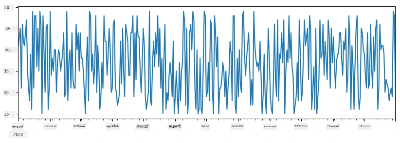
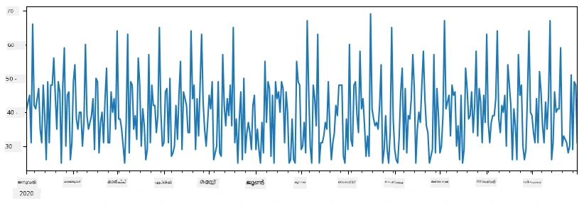
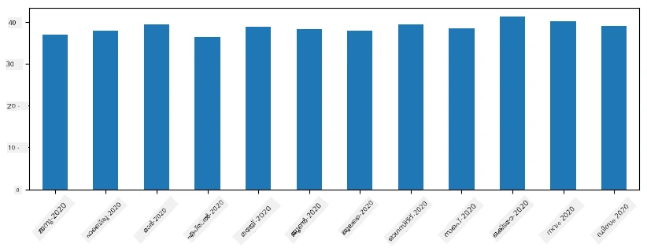
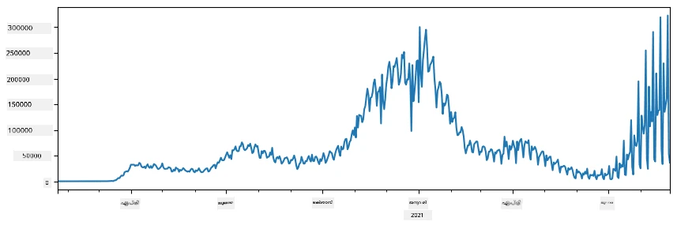
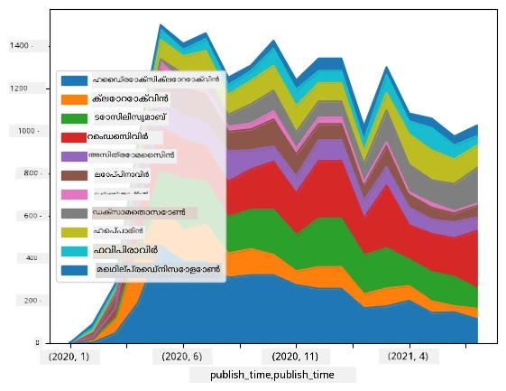

# ഡാറ്റയിൽ ജോലി ചെയ്യൽ: പൈഥൺ এবং പാൻഡാസ് ലൈബ്രറി

|  ](../../sketchnotes/07-WorkWithPython.png) |
| :-------------------------------------------------------------------------------------------------------: |
|                 Python-ൽ ജോലി ചെയ്യൽ - _Sketchnote by [@nitya](https://twitter.com/nitya)_                 |

[](https://youtu.be/dZjWOGbsN4Y)

ഡാറ്റാബേസുകൾ ഡാറ്റ സൂക്ഷിക്കാനും ക്വറി ഭാഷകൾ ഉപയോഗിച്ച് അവയെ ചോദിക്കാനുമുള്ള വളരെ കാര്യക്ഷമമായ മാർഗങ്ങൾ നൽകുമ്പോഴും, ഡാറ്റ പ്രോസസിംഗിന് ഏറ്റവും വിശാലമായ മാർഗമാണ് ഡാറ്റ മാനിപ്പുലേറ്റ് ചെയ്യാൻ നിങ്ങളുടെ സ്വന്തം പ്രോഗ്രാം എഴുതുന്നത്. പലപ്പോഴും, ഡാറ്റാബേസ് ക്വറി നടത്തുന്നത് കൂടുതൽ ഫലപ്രദമായ മാർഗമായിരിക്കും. എന്നാൽ, കൂടുതൽ സങ്കീർണമായ ഡാറ്റ പ്രോസസിംഗ് ആവശ്യമായപ്പോൾ അത് എളുപ്പത്തിൽ SQL ഉപയോഗിച്ച് ചെയ്‌തുപോവാൻ കഴിയില്ല. 
ഡാറ്റ പ്രോസസിംഗ് ഏതെങ്കിലും പ്രോഗ്രാമിംഗ് ഭാഷയിൽ പ്രോഗ്രാം ചെയ്യാവുന്നതാണ്, പക്ഷേ ഡാറ്റയുമായി പ്രവർത്തിക്കുന്നതിൽ ഉയർന്നതരം ഉള്ള ചില ഭാ‍ഷകൾ ഉണ്ട്. ഡാറ്റ ശാസ്ത്രജ്ഞർ സാധാരണയായി താഴെപ്പറഞ്ഞ ഭാഷകളിൽ ഒന്നാണ് ഇഷ്ടപ്പെടുന്നത്:

* **[Python](https://www.python.org/)**, ഒരു പൊതുവായ പ്രോഗ്രാമിംഗ് ഭാഷ, എളുപ്പത്തിൽ പഠിക്കാൻ മികച്ച ഓപ്ഷനുകളിൽ ഒന്നായി പരിഗണിക്കപ്പെടുന്നു. Python-ന് നിരവധി അധിക ലൈബ്രറികൾ ഉണ്ട്, ഉദാഹരണത്തിന് ZIP ആർക്കൈവ് നിന്നും ഡാറ്റ എടുക്കുക, അല്ലെങ്കിൽ ചിത്രത്തെ ഗ്രേസ്‌കെയിലിലേക്ക് മാറ്റുക തുടങ്ങിയ പല പ്രായോഗിക പ്രശ്നങ്ങളും പരിഹരിക്കാൻ സഹായിക്കുന്നു. ഡാറ്റ ശാസ്ത്രത്തിന് പുറമേ, Python വേബ് ഡെവലപ്പ്മെന്റിനും വ്യാപകമായി ഉപയോഗിക്കുന്നു.
* **[R](https://www.r-project.org/)** മാനസിക ഡാറ്റ പ്രോസസിംഗിന് വികസിപ്പിച്ച പാരമ്പര്യ ട്വൾ ബോക്സാണ്. ഇതിൽ ഗ്രന്ഥശാലകളുടെ വലിയ സദ്യ (CRAN) ഉണ്ട്, ഇത് ഡാറ്റ പ്രോസസിങ്ങ്‌ക്കു നല്ല ഓപ്ഷനാണ്. പക്ഷേ, R ഒരു പൊതുവായ പ്രോഗ്രാമിംഗ് ഭാഷയല്ല, കൂടാതെ അത് ഡാറ്റ ശാസ്ത്ര മേഖലയ്ക്ക് പുറത്തു അപൂർവ്വം മാത്രം ഉപയോഗിക്കുന്നു.
* **[Julia](https://julialang.org/)** മറ്റൊരു ഭാഷയാണ് പ്രത്യേകിച്ച് ഡാറ്റ ശാസ്ത്രത്തിനായി വികസിപ്പിച്ചത്. Python-നേക്കാൾ മികച്ച പ്രകടനം നൽകാൻ ഉദ്ദേശിച്ചാണ് ഇത് നിർമ്മിച്ചത്, ഇത് ശാസ്ത്രീയ പരീക്ഷണങ്ങൾക്കായി മികച്ച ഉപകരണമാകുന്നു.

ഈ പാഠത്തിൽ, ലളിതമായ ഡാറ്റ പ്രോസസിംഗിനായി Python ഉപയോഗിക്കാൻ നമുക്ക് കേന്ദ്രീകരിക്കാം. ഭാഷയിൽ അടിസ്ഥാനമായ പരിചയം ധാര്യിച്ചിരിക്കുന്നു എന്ന് നമുക്ക് കരുതാം. Python-ന്റെ കൂടുതൽ വ്യാപകപരമായ പരിചയം ആവശ്യമായാൽ, താഴെപ്പറഞ്ഞ വരികളെ സ്രോതസ്സ് ഉപയോഗിക്കാം:

* [ക്യാപുകൾ, ഫ്രാക്ടലുകളുമായി രസകരമായി Python പഠിക്കുക](https://github.com/shwars/pycourse) - GitHub അടിസ്ഥാനമായ പ്രവൃത്തി പരിചയ കോഴ്സ്
* [Python-ൽ ആദ്യ പടി ഗതി നേടുക](https://docs.microsoft.com/en-us/learn/paths/python-first-steps/?WT.mc_id=academic-77958-bethanycheum) [Microsoft Learn](http://learn.microsoft.com/?WT.mc_id=academic-77958-bethanycheum) യിലെ ലേണിംഗ് പാത

ഡാറ്റ പല രൂപങ്ങളിലും വരും. ഈ പാഠത്തിൽ, നാം മൂന്ന് രൂപങ്ങൾ പരിഗണിക്കാം - **ടാബുലർ ഡാറ്റ**, **വാചകം**, **ചിത്രങ്ങൾ**.

നാം പൂർണ്ണമായ ലൈബ്രറികളെ കുറിച്ചുള്ള അവലോകനം നൽകുന്നതിന് പകരം, ഡാറ്റ പ്രോസസിംഗിന്റെ കുറച്ച് ഉദാഹരണങ്ങളിൽ കേന്ദ്രീകരിക്കും. ഇതിൽ നിങ്ങൾക്കു സാധ്യമാകാനുള്ള പ്രധാന ആശയം മനസ്സിലാക്കാനും, ആവശ്യാനുസരിച്ച് പ്രശ്നങ്ങൾക്ക് പരിഹാരങ്ങൾ കണ്ടെത്താൻ എവിടെ നോക്കേണ്ടതാണെന്ന് ഗ്രഹിക്കാനും സഹായിക്കും.

> **Entakki upadesham**. നിങ്ങൾ അറിയാത്ത ഒരു ഡാറ്റ ഓപ്പറേഷൻ നടത്തേണ്ടി വന്നാൽ, അത് ഇന്റർനെറ്റിൽ തിരയാൻ ശ്രമിക്കുക. [Stackoverflow](https://stackoverflow.com/) Python-ൽ വിവിധ സാധാരണ ജോലികൾക്കുള്ള ധാരാളം സഹായകമായ കോഡ് ഉദാഹരണം നൽകും.


## [പഠനത്തിനുമുമ്പ് ക്വിസ്](https://ff-quizzes.netlify.app/en/ds/quiz/12)

## ടാബുലർ ഡാറ്റയും ഡാറ്റ്ഫ്രെയിംസും

റിലേഷൻ ഡാറ്റാബേസുകളെ കുറിച്ചു പറഞ്ഞപ്പോൾ നേരത്തെ നിങ്ങളെ ടാബുലർ ഡാറ്റ കണ്ടിട്ടുണ്ട്. വളരെ ഡാറ്റ ഉണ്ടെങ്കിൽ, വിവിധ ബന്ധപ്പെട്ടു കിടക്കുന്ന ടേബിളുകളിലായി നിന്നാൽ, അതിൽ SQL ഉപയോഗിക്കുന്നത് ശരിയാണെന്ന് പറയാം. എന്നാൽ, ഡാറ്റയുടെ ചില പ്രത്യേക ബോധ്യം അല്ലെങ്കിൽ ആഴത്തിലുള്ള അവലോകനം (distribution, correlation തുടങ്ങിയവ) കിട്ടേണ്ടപ്പോൾ, ഡാറ്റ ശാസ്ത്രത്തിൽ പലപ്പോഴും ആദ്യ ഡാറ്റയിൽ നിന്ന് രൂപാന്തരം (transformations) ചെയ്യേണ്ടിവരും, പിന്നെ ভ്യ_ൽ പഠനം നടത്തേണ്ടിവരും. Python ഉപയോഗിച്ച് ഈ രണ്ട് ഘട്ടങ്ങളും എളുപ്പത്തിൽ ചെയ്യാം.

Python-ൽ ടാബുലർ ഡാറ്റ കൈകാര്യം ചെയ്യാൻ സഹായിക്കുന്ന ഏറ്റവും പ്രയോജനകരമായ രണ്ട് ലൈബ്രറികൾ ഇതാണ്:
* **[Pandas](https://pandas.pydata.org/)**, ഡാറ്റ്ഫ്രെയിം എന്ന പേരിൽ അറിയപ്പെടുന്ന റീലേഷൻ ഷിപ്പുള്ള പട്ടികകൾ കൈകാര്യം ചെയ്യാൻ സഹായിക്കുന്നു. നാമകരിച്ച കോളങ്ങളുമായി നിങ്ങൾക്ക് നിരവധി ഓപ്പറേഷനുകൾ നിരവതിരിക്കാൻ കഴിയും.
* **[Numpy](https://numpy.org/)**, ടെൻസറുകളായി പറയപ്പെടുന്ന ബഹുആയാമ **ആറേകൾ** കൈകാര്യം ചെയ്യാൻ ഉള്ള ലൈബ്രറിയാണ്. ആരേയ്ക്ക് എല്ലാസംഖ്യകളും ഒരേ തരം ഉള്ളവയാണ്, ഡാറ്റ്ഫ്രെയിമിനെക്കാൾ ലളിതമാണ്, എന്നാൽ ഏറെ ഗണിത ഫംഗ്ഷനുകൾക്കും കുറവ് ഓവർഹെഡിനും സഹായിക്കുന്നു.

ചില മറ്റ് ലൈബ്രറികളും നിങ്ങൾ അറിയേണ്ടതാണ്:
* **[Matplotlib](https://matplotlib.org/)**, ഡാറ്റാ ദൃശ്യവത്ക്കരണത്തിനും ഗ്രാഫുകൾ വരയ്ക്കുന്നതിനും ഉപയോഗിക്കുന്നു
* **[SciPy](https://www.scipy.org/)**, കൂടുതൽ ശാസ്ത്രീയ ഫംഗ്ഷനുകൾ ഉൾപ്പെടുത്തിയ ലൈബ്രറി. സാധ്യതയും സ്ഥിതിവിവരശാസ്ത്രവും സംബന്ധിച്ചിടത്തോളം ഇത് പരിചയപ്പെടുത്തപ്പെട്ടിട്ടുണ്ട്.

Python പ്രോഗ്രാമിന്റെ ആരംഭത്തിൽ ഈ ലൈബ്രറികൾ ഇംപോർട്ട് ചെയ്യാൻ സാധാരണയായി ഉപയോഗിക്കുന്ന കോഡ് ഇവിടെ:
```python
import numpy as np
import pandas as pd
import matplotlib.pyplot as plt
from scipy import ... # നിങ്ങൾക്ക് ആവശ്യമായ دقیق സബ്-പാക്കേജുകൾ വ്യക്തമാക്കേണ്ടതുണ്ട്
``` 

Pandas ചില അടിസ്ഥാന ആശയങ്ങൾക്കു മദ്ധ്യമാണ്.

### സീരീസ്

**സീരീസ്** ഒരു മൂല്യങ്ങളുടെ നിരയാണ്, ലിസ്റ്റ് അല്ലെങ്കിൽ numpy array പോലെയാണ്. പ്രധാന വ്യത്യാസം അത് ഒരു **ഇൻഡക്സ്** കൂടുന്നു എന്നതാണ്, സീരീസ് മുകളിലുള്ള ഓപ്പറേഷനുകൾ (ഉദാ., ചേർക്കുക) ചെയ്താൽ ഇൻഡക്സ് പരിഗണിക്കുന്നു. ഇൻഡക്സ് സാധ്യതയുള്ളതതായി ജാതി നമ്പർ പോലും ആകാം (ലിസ്റ്റ് അല്ലെങ്കിൽ ആരേയിൽ നിന്നും സീരീസ് സൃഷ്ടിക്കുമ്പോൾ ഡിഫോൾട്ട് ഇൻഡക്സ് കാണുന്നത്), അല്ലെങ്കിൽ സങ്കീർണ ഘടന ഉണ്ടാകാം (പോലെയുള്ള തീയതി ഇടവേള).

> **കുറിപ്പ്**: സഹൈത ശീലനം നൽകുന്ന നോട്ട്‌ബുക്കിൽ [`notebook.ipynb`](notebook.ipynb) Pandas വിവരണകോഡ് ഉണ്ട്. ഇവിടെ നാം ചില ഉദാഹരണങ്ങൾ മാത്രമേ നൽകുന്നുള്ളൂ, മുഴുവൻ നോട്ട്‌ബുക്ക് പരിശോധിക്കാനായി സ്വാഗതം.

ഒരു ഉദാഹരണം പരിഗണിക്കാം: ഞങ്ങൾ നമ്മുടേത് ഐസ്ക്രീം വിൽപ്പനയെ വിശകലനം ചെയ്യാൻ ആഗ്രഹിക്കുന്നു. ഏതാനും ദിവസത്തേക്ക് വിൽപ്പന സംഖ്യകൾ ഉള്ള സീരീസ് സൃഷ്ടിക്കാം:

```python
start_date = "Jan 1, 2020"
end_date = "Mar 31, 2020"
idx = pd.date_range(start_date,end_date)
print(f"Length of index is {len(idx)}")
items_sold = pd.Series(np.random.randint(25,50,size=len(idx)),index=idx)
items_sold.plot()
```


ഓരോ ആഴ്ചയും നാം സുഹൃത്തുക്കൾക്കായി പാർട്ടി നടത്തുമ്പോൾ അധികം 10 പാക്ക് ഐസ്ക്രീം പാർട്ടി ഉപയോഗത്തിന് എടുത്തു വെക്കുന്നു. ഇതെടുത്തു കാണിക്കാൻ ആഴ്ച ഓർഡർ ചെയ്ത മറ്റൊരു സീരീസ് ഉണ്ടാക്കാം:
```python
additional_items = pd.Series(10,index=pd.date_range(start_date,end_date,freq="W"))
```
 രണ്ടു സീരീസുകളും ചേരുമ്പോൾ, ആകെ സംഖ്യ ലഭിക്കുന്നു:
```python
total_items = items_sold.add(additional_items,fill_value=0)
total_items.plot()
```


> **കുറിപ്പ്:** ലളിതമായ സിന്റാക്സ് `total_items+additional_items` താൽപ്പര്യമില്ല, കാരണം `additional_items` സീരീസിൽ ചില ഇൻഡക്സ് പോയിന്റുകൾക്കുള്ള മൂല്യങ്ങൾ കാണാത്തതായതിനാൽ NaN (*Not a Number*) മൂല്യങ്ങൾ ഫലമായി വരും. ഏത് മൂല്യത്തിലും `NaN` ചേർത്താൽ `NaN`തന്നെയാണ് ഫലം. അതുകൊണ്ട് ചേർക്കുമ്പോൾ `fill_value` ഘടകം നൽകണം.

ടൈം സീരീസിൽ നാം പല സമയ ഇടവേളകളിൽ **റിസാംപ്ലിംഗ്** നടത്താനാകും. ഉദാഹരണത്തിന്, മാസവാരമായി ശരാശരി വിൽപ്പന കണക്കാക്കണം എന്ന് പറയാം. താഴെ കൊടുത്തിരിക്കുന്ന കോഡ് ഉപയോഗിക്കാം:
```python
monthly = total_items.resample("1M").mean()
ax = monthly.plot(kind='bar')
```


### ഡാറ്റഫ്രെയിം

ഡാറ്റഫ്രെയിം എന്നാൽ ഒരേ ഇൻഡക്സ് ഉള്ള സീരിസുകളുടെ ശേഖരം ആണ്. പല സീരീസുകളും ചേർത്ത് ഡാറ്റഫ്രെയിം ഉണ്ടാക്കാം:
```python
a = pd.Series(range(1,10))
b = pd.Series(["I","like","to","play","games","and","will","not","change"],index=range(0,9))
df = pd.DataFrame([a,b])
```
ഇത് താഴെപ്പറഞ്ഞതുപോലെ ഒരു ഹൊറിസോണ്ടൽ പട്ടിക സൃഷ്ടിക്കും:
|     | 0   | 1    | 2   | 3   | 4      | 5   | 6      | 7    | 8    |
| --- | --- | ---- | --- | --- | ------ | --- | ------ | ---- | ---- |
| 0   | 1   | 2    | 3   | 4   | 5      | 6   | 7      | 8    | 9    |
| 1   | I   | like | to  | use | Python | and | Pandas | very | much |

സീരീസ് കോളങ്ങളായി ഉപയോഗിച്ചും, കോളം നാമങ്ങൾ ഡിക്ഷണറി ഉപയോഗിച്ചും നിർദ്ദേശിക്കാവുന്നതാണ്:
```python
df = pd.DataFrame({ 'A' : a, 'B' : b })
```
ഇതു താഴെപറഞ്ഞ പട്ടിക നൽകും:

|     | A   | B      |
| --- | --- | ------ |
| 0   | 1   | I      |
| 1   | 2   | like   |
| 2   | 3   | to     |
| 3   | 4   | use    |
| 4   | 5   | Python |
| 5   | 6   | and    |
| 6   | 7   | Pandas |
| 7   | 8   | very   |
| 8   | 9   | much   |

**കുറിപ്പ്** നമുക്ക് മുമ്പത്തെ പട്ടിക ട്രാൻസ്പോസ് ചെയ്ത് ഈ പട്ടിക രൂപം ലഭിക്കാനാകും. ഉദാഹരണത്തിന്,
```python
df = pd.DataFrame([a,b]).T.rename(columns={ 0 : 'A', 1 : 'B' })
```
 ഇവിടെ `.T` ഡാറ്റഫ്രെയിം ട്രാൻസ്പോസ് (റոյസുകൾ, കോളങ്ങൾ മാറൽ) ഓപ്പറേഷനാണ്, `rename` ഉപയോഗിച്ച് മുമ്പത്തെ ഉദാഹരണത്തിലുപോലുള്ള കോളം നാമങ്ങൾ നൽകുന്നു.

ഡാറ്റഫ്രെയിമുകളിലെ ചില പ്രധാന ഓപ്പറേഷനുകൾ:

**കോലം തിരഞ്ഞെടുപ്പ്**. ഓരോ കോളവും `df['A']` എന്ന് എഴുതിയാൽ തിരഞ്ഞെടുക്കാവുന്നതാണ് – ഇത് ഒരു സീരീസ് ആണ്. `"df[['B','A']]"` എഴുതിയാല്‍ മറ്റ് ഡാറ്റഫ്രെയിം രൂപത്തില്‍ ചില കോളങ്ങൾ കിട്ടും.

**ശ്രേണി ഫിൽറ്ററിംഗ്**. ഉദാഹരണത്തിന്, `A` കോളത്തിലെ മൂല്യം 5-ല്‍ മേലുള്ളവ മാത്രം എടുക്കാൻ `df[df['A']>5]` എഴുതാം.

> **കുറിപ്പ്**: ഫിൽറ്ററിംഗ് ഈ രീതി പ്രവർത്തിക്കുന്നു. `df['A']<5` കൊണ്ട് ഒരു ബൂളിയൻ സീരീസ് കിട്ടും, ഓരോ മൂല്യവും സത്യമാണോഅയോ എന്ന സൂചന. ആ ബൂളിയൻ സീരിസിനെ ഇൻഡക്സ് ആയി ഉപയോഗിച്ചാൽ, അവയുടെ ശരിയായ അടുക്കളയായ ഭാഗങ്ങൾ തിരഞ്ഞെടുത്ത് നൽകും. അതിനാല്‍ സാധാരണ Python ബൂളിയൻ ഓപ്പറേറ്ററുകൾ ഉപയോഗിക്കല്ലേ (ഉദാ., `df[df['A']>5 and df['A']<7]` തെറ്റാണ്). പകരം, ബൂളിയൻ സീരീസുകൾക്കായി പ്രത്യേക `&` ഉപയോഗിക്കണം: `df[(df['A']>5) & (df['A']<7)]` (**ബ്രാക്കറ്റുകൾ അനിവാര്യമാണ്**).

**പുതിയ ഹിസാബ് ചെയ്യാവുന്ന കോളങ്ങൾ സൃഷ്ടിക്കൽ**. സെറീസുകൾക്കും ഡാറ്റഫ്രെയിമിനും സേത്വമായി പുത്തൻ കണ്ടുപിടിത്തങ്ങളുണ്ടാക്കാൻ സാധിച്ചു:
```python
df['DivA'] = df['A']-df['A'].mean() 
``` 
 ഈ ഉദാഹരണത്തിൽ `A` എന്ന കോളത്തിന്റെ ശരാശരിയുമായി വ്യത്യാസം കണക്കാക്കാം. ആ സീരീസിനെ ഇടതുപടി അസൈന്മെന്റിലൂടെ പുതിയ കോളമായി ചേർക്കുന്നു. അതിനാൽ, സീരീസിനോടൊരു കംപാറ്റിബിളല്ലാത്ത ഓപ്പറേഷൻ ഉപയോഗിക്കുന്നത് തെറ്റാണ്, ഉദാഹരണത്തിന് താഴെ കൊടുക്കുന്ന കോഡ് തെറ്റാണ്:
```python
# തെറ്റ് പറ്റിയ കോഡ് -> df['ADescr'] = "Low" if df['A'] < 5 else "Hi"
df['LenB'] = len(df['B']) # <- തെറ്റായ ഫലം
``` 
 ഈ ഉദാഹരണം, എളുപ്പമുള്ള സിന്റാക്സും ആകുമ്പോൾ പിഴവുള്ള ഫലം നൽകുന്നു — എല്ലാ മൂല്യങ്ങൾക്കും `B` സീരീസിന്റെ വികൃതിയുടെ നീളം നൽകുന്നു, ഒരു മൂല്യത്തിന്റെ നീളം അല്ല.

സങ്കീർണ്ണ കംപ്യൂട്ടേഷൻ വേണ്ടിയാൽ `apply` ഫംഗ്ഷൻ ഉപയോഗിക്കാം. താഴെയുള്ള ഉദാഹരണം ഇതുപോലെ എഴുതാം:
```python
df['LenB'] = df['B'].apply(lambda x : len(x))
# അല്ലെങ്കിൽ
df['LenB'] = df['B'].apply(len)
```

ഇതിന് ശേഷം ഡാറ്റഫ്രെയിം ഇങ്ങനെ ആയിരിക്കും:

|     | A   | B      | DivA | LenB |
| --- | --- | ------ | ---- | ---- |
| 0   | 1   | I      | -4.0 | 1    |
| 1   | 2   | like   | -3.0 | 4    |
| 2   | 3   | to     | -2.0 | 2    |
| 3   | 4   | use    | -1.0 | 3    |
| 4   | 5   | Python | 0.0  | 6    |
| 5   | 6   | and    | 1.0  | 3    |
| 6   | 7   | Pandas | 2.0  | 6    |
| 7   | 8   | very   | 3.0  | 4    |
| 8   | 9   | much   | 4.0  | 4    |

**നമ്പറുകൾ അടിസ്ഥാനമാക്കി ശ്രേണികൾ തിരഞ്ഞെടുക്കൽ** `iloc` ഉപയോഗിച്ച് നടത്താം. ഉദാഹരണത്തിന്, ആദ്യ 5 നിരകൾ തിരഞ്ഞെടുക്കാൻ:
```python
df.iloc[:5]
```

**ഗ്രൂപ്പിംഗ്** സാധാരണയായി ഇക്സ്‌സൽ Pivot table പോലുള്ള ഫലം ഉളവാക്കാൻ ഉപയോഗിക്കുന്നു. ഉദാഹരണത്തിന്, `LenB` അടിസ്ഥാനത്തിൽ `A`-യുടെ ശരാശരി കണക്കിക്കുക. ആിനുവേണ്ടി `LenB` ബൈ ഗ്രൂപ്പ് ചെയ്ത് `mean` വിളിക്കാം:
```python
df.groupby(by='LenB')[['A','DivA']].mean()
```
 ശരാശരി കൂടാതെ ഗൂപ്പിൽ ഉള്ള എളേക്ക് എണ്ണം കണക്കാക്കേണ്ടെങ്കിൽ കൂടുതൽ സങ്കീർണ്ണമായ `aggregate` ഉപയോഗിക്കാം:
```python
df.groupby(by='LenB') \
 .aggregate({ 'DivA' : len, 'A' : lambda x: x.mean() }) \
 .rename(columns={ 'DivA' : 'Count', 'A' : 'Mean'})
```
ഇനി താഴെകൊടുത്ത പട്ടിക ലഭിക്കും:

| LenB | Count | Mean     |
| ---- | ----- | -------- |
| 1    | 1     | 1.000000 |
| 2    | 1     | 3.000000 |
| 3    | 2     | 5.000000 |
| 4    | 3     | 6.333333 |
| 6    | 2     | 6.000000 |

### ഡാറ്റ ലഭ്യമാക്കൽ


Python objects ൽ നിന്ന് Series നും DataFrames നും എളുപ്പത്തിൽ എങ്ങനെ നിർമ്മിക്കാമെന്ന് നാം കണ്ടു. എന്നിരുന്നാലും, ഡാറ്റ സാധാരണയായി ഒരു ടെക്സ്റ്റ് ഫയലിന്റെ രൂപത്തിലോ ഒരു Excel പട്ടികയുടെ രൂപത്തിലോ വരും. ഭാഗ്യം കൊണ്ടാണ്, Pandas നമുക്ക് ഡിസ്കിൽ നിന്ന് ഡാറ്റ ലോഡ് ചെയ്യാനുള്ള ഒരു ലളിതമായ രീതി നൽകുന്നത്. ഉദാഹരണത്തിന്, CSV ഫയൽ റീഡ് ചെയ്യുന്നത് ഇതുപോലെയാണ്:
```python
df = pd.read_csv('file.csv')
```
ഡാറ്റ ലോഡിംഗ് സംബന്ധിച്ച കൂടുതൽ ഉദാഹരണങ്ങൾ, അടക്കം പുറത്തുള്ള വെബ് സൈറ്റുകളിൽ നിന്ന് ഡാറ്റ എങ്ങനെ പകർത്താം എന്നതാണ് "ചാലഞ്ച്" സെക്ഷനിൽ കാണുക


### പ്രിന്റിംഗ് және പ്ലോട്ടിംഗ്

ഒരു ഡാറ്റ സയന്റിസ്റ്റിന് ഡാറ്റഎക്സ്‌പ്ലോർ ചെയ്യേണ്ടതുണ്ടാകുമ്പോൾ, അത് വിസ്വലൈസ് ചെയ്യുക വളരെ പ്രധാനമാണ്. DataFrame വലിയതായിരിക്കുമ്പോൾ, നാം സാധാരണയായി ചെയ്യുന്നത് ശരിയാണെന്ന് ഉറപ്പാക്കാൻ ആദ്യത്തെ കുറച്ച് വരികൾ മാത്രം പ്രിന്റ് ചെയ്യുക എന്നതാണ്. ഇത് `df.head()` വിളിച്ച് ചെയ്യാം. Jupyter Notebook ൽ ഇത് ഓടിക്കുന്നുവെങ്കിൽ, DataFrame ഒരു മനോഹരമായ പട്ടിക രൂപത്തിൽ പ്രിന്റ് ചെയ്യും.

നാം `plot` ഫങ്ഷന്റെ ഉപയോഗവും കണ്ടു, ചില കോളങ്ങളിലെ ഡാറ്റിസ് വിസ്വലൈസ് ചെയ്യാൻ. `plot` പല ജോലികൾക്കും വളരെ പ്രയോജനകാരിയാണ്, kind= പാരാമീറ്ററിലൂടെ പല തരത്തിലുള്ള ഗ്രാഫുകൾ പിന്തുണയ്ക്കുന്നു. എങ്കിലും ദോഷം കൂടുതൽ സങ്കീർണ്ണമായ എന്തെങ്കിലും പ്ലോട്ട് ചെയ്യാൻ കഴിയും raw `matplotlib` ലൈബ്രറി ഉപയോഗിക്കാം. ഡാറ്റ വിസ്വലൈസേഷൻ വിശദമായി വ്യത്യസ്ത കോഴ്സ് പാഠങ്ങളിൽ പ്രത്യേകം പരിഗണിക്കും.

Pandas ന്റെ ഏറ്റവും പ്രധാനപ്പെട്ട നിലപാടുകൾ ഇതിൽ ഉൾപ്പെടുത്തിയിട്ടുണ്ട്, എങ്കിലും ലൈബ്രറി വളരെ സമ്പന്നമാണ്, അതിൽ നിങ്ങൾക്ക് ചെയ്യാനാകുന്ന കാര്യങ്ങൾക്ക് അതിരില്ല! ഇപ്പോൾ ഈ അറിവ് ഉപയോഗിച്ച് ഒരു പ്രത്യേക പ്രശ്നം പരിഹരിക്കാം.

## 🚀 ചാലഞ്ച് 1: COVID പ്രചരണം വിശകലനം

ഏറ്റവും ആദ്യത്തെ പ്രശ്നം നാം ശ്രദ്ധിക്കുന്നതു COVID-19 പകർച്ച രോഗത്തിന്റെ മോഡലിംഗ് ആണ്. ഇത് ചെയ്യാൻ, വ്യത്യസ്ത രാജ്യങ്ങളിലുള്ള ബാധితരുടെയും എണ്ണം സംബന്ധിച്ച ഡാറ്റ ഉപയോഗിക്കും, ഇത് [Center for Systems Science and Engineering](https://systems.jhu.edu/) (CSSE) അവരുടെ വെബ്സൈറ്റിൽ നിന്നും [Johns Hopkins University](https://jhu.edu/) നൽകുന്നു. ഡാറ്റാ സെറ്റ് [ഈ GitHub റീപ്പോസിറ്ററിയിൽ](https://github.com/CSSEGISandData/COVID-19) ലഭ്യമാണ്.

ഡാറ്റ കൈകാര്യം ചെയ്യുന്നത് എങ്ങനെയാണ് എന്നതറിയിക്കുന്നതിന്, നിങ്ങൾക്ക് [`notebook-covidspread.ipynb`](notebook-covidspread.ipynb) തുറന്ന് മേലിൽ നിന്ന് താഴേക്ക് വായിക്കണമെന്നും നിർദ്ദേശിക്കുന്നു. നിങ്ങൾ സെല്ലുകൾ പ്രവർത്തിപ്പിക്കാനും, അവസാനം നാം കൊടുത്തിരിക്കുന്ന ചില ചാലഞ്ചുകൾ ചെയ്യാനും കഴിയും.



> Jupyter Notebook ൽ കോഡ് എങ്ങനെ പ്രവർത്തിപ്പിക്കാമെന്ന് അറിയില്ലെങ്കിൽ, [ഈ ലേഖനം](https://soshnikov.com/education/how-to-execute-notebooks-from-github/) കാണുക.

## അസംഘടിത ഡാറ്റയുമായി പ്രവർത്തിക്കൽ

ഡാറ്റ സാധാരണയായി പട്ടിക രൂപത്തിലാണ് ഉണ്ടാകാറുള്ളത്, പക്ഷേ ചില സാഹചര്യങ്ങളിൽ കുറവുള്ള ഘടനയുള്ള ഡാറ്റയെ കൈകാര്യം ചെയ്യേണ്ടി വരും, ഉദാഹരണത്തിന് ടെക്സ്റ്റ് അല്ലെങ്കിൽ ചിത്രങ്ങൾ. ഇതിൽ മുകളിൽ കാണുന്നതുപോലെ ഡാറ്റ പ്രോസസിംഗ് സാങ്കേതിക വിദ്യകൾ പ്രയോഗിക്കാൻ, ഞങ്ങൾ **ഘടനയുള്ള** ഡാറ്റ എക്സ്ട്രാക്റ്റ് ചെയ്യേണ്ടതുണ്ട്. ചില ഉദാഹരണങ്ങൾ:

* ടെക്സ്റ്റിൽ നിന്നുള്ള കീ-വാക്കുകൾ എടുക്കൽ, അവ എത്രത്തോളം പ്രത്യക്ഷപ്പെടുന്നു എന്ന് കാണൽ
* ചിത്രത്തിലെ വസ്തുക്കളുടെ വിവരങ്ങൾ എടുക്കാൻ ന്യൂറൽ നെറ്റ്വർക്ക് ഉപയോഗിക്കൽ
* വീഡിയോ ക്യാമറ ഫീഡിൽ ആളുകളുടെ വികാരം സംബന്ധിച്ച വിവരങ്ങൾ നേടൽ

## 🚀 ചാലഞ്ച് 2: COVID പേപ്പറുകൾ വിശകലനം

ഈ ചാലഞ്ചിൽ, COVID മഹാമാരിയുടെ വിഷയത്തെ തുടർന്നും ശ്രദ്ധിക്കാം, വിഷയം സംബന്ധിച്ച ശാസ്ത്രീയ പേപ്പറുകൾ പ്രോസസ് ചെയ്യുന്നതിൽ കേന്ദ്രീകരിക്കാം. [CORD-19 Dataset](https://www.kaggle.com/allen-institute-for-ai/CORD-19-research-challenge) എന്നത് COVID സംബന്ധിച്ച 7000-ത്തിലധികം പേപ്പറുകൾ (ഈ എഴുത്തിന്റെ സമയത്ത്) ഉൾപ്പെടുന്ന ഒരു ഡാറ്റാസെറ്റ് ആണ്, മെടാഡാറ്റയും മുഖ്യഭാഗവും ലഭ്യമാണ് (അരയടിയിൽ പൂർണ്ണ എഴുത്തും ഉള്ളവയ്ക്കായി).

[Text Analytics for Health](https://docs.microsoft.com/azure/cognitive-services/text-analytics/how-tos/text-analytics-for-health/?WT.mc_id=academic-77958-bethanycheum) കോഗ്നിറ്റീവ് സർവീസ് ഉപയോഗിച്ച് ഈ ഡാറ്റാസെറ്റ് വിശകലനം ചെയ്യുന്നതിന്റെ ഒരു പൂര്‍ണ ഉദാഹരണം [ഈ ബ്ലോഗ് പോസ്റ്റിൽ](https://soshnikov.com/science/analyzing-medical-papers-with-azure-and-text-analytics-for-health/) വിവരണം ലഭ്യമാണ്.прост simplified പതിപ്പ് നാം ചർച്ച ചെയ്യും.

> **NOTE**: ഈ റീപ്പോസിറ്ററിയിൽ ഡാറ്റാസെറ്റ് ഒരു കോപ്പി നൽകുന്നില്ല. ദയവായി ആദ്യം [Kaggle ൽ നിന്നും](https://www.kaggle.com/allen-institute-for-ai/CORD-19-research-challenge?select=metadata.csv) `metadata.csv` ഫയൽ ഡൗൺലോഡ് ചെയ്യേണ്ടതുണ്ട്. Kaggle ഇൽ രജിസ്റ്റർ ചെയ്യേണ്ടിവരുമെന്ന് ശ്രദ്ധിക്കുക. രജിസ്ട്രേഷൻ ഇല്ലാതെ ഡാറ്റാസെറ്റ് [ഇവിടെ](https://ai2-semanticscholar-cord-19.s3-us-west-2.amazonaws.com/historical_releases.html) നിന്ന് ഡൗൺലോഡ് ചെയ്യാം, എങ്കിലും അത് മെടാഡാറ്റ ഫയലിനൊപ്പം മുഴുവൻ പൂർണ്ണ എഴുത്തുകൾ ഉൾക്കൊള്ളും.

 [`notebook-papers.ipynb`](notebook-papers.ipynb) തുറന്ന് മുകളിൽ നിന്ന് താഴേക്ക് വായിക്കുക. സെല്ലുകൾ പ്രവർത്തിപ്പിക്കുകയും അവസാനം നാം കൊടുത്തിരുന്ന ചില ചാലഞ്ചുകൾ ചെയ്യുകയും ചെയ്യാം.



## ഇമേജ് ഡാറ്റ പ്രോസസിംഗ്

അടുത്തകാലിൽ, വളരെ ശക്തമായ AI മോഡലുകൾ വികസിപ്പിച്ചിട്ടുണ്ട്, ഇവ നമ്മുക്ക് ചിത്രങ്ങൾ മനസ്സിലാക്കാൻ സഹായിക്കുന്നു. മുൻ പരിശീലിത ന്യൂറൽ നെറ്റ്വർക്കുകൾ അല്ലെങ്കിൽ ക്ലൗഡ് സർവീസുകൾ ഉപയോഗിച്ച് പല ജോലികളും പരിഹരിക്കാം. ചില ഉദാഹരണങ്ങൾ:

* **ഇമേജ് ക്ലാസിഫിക്കേഷൻ:** ചിത്രത്തെ മുൻ నిర్ణയിച്ച ക്ലാസ്സുകളിലൊന്നായി ವರ್ಗീകരിക്കാൻ സഹായിക്കുന്നു. [Custom Vision](https://azure.microsoft.com/services/cognitive-services/custom-vision-service/?WT.mc_id=academic-77958-bethanycheum) പോലുള്ള സർവീസുകൾ ഉപയോഗിച്ച് നിങ്ങളുടെ സ്വന്തം ഇമേജ് ക്ലാസിഫയർമാരെ പരിശീലിപ്പിക്കാവുന്നതാണ്
* **ആബ്ജക്ട് ഡിറ്റക്ഷൻ:** ചിത്രത്തിലുള്ള വ്യത്യസ്ത വസ്തുക്കൾ കണ്ടെത്തൽ. [computer vision](https://azure.microsoft.com/services/cognitive-services/computer-vision/?WT.mc_id=academic-77958-bethanycheum) പോലുള്ള സർവീസുകൾ പല സാധാരണ വസ്തുക്കൾ കണ്ടെത്തും, [Custom Vision](https://azure.microsoft.com/services/cognitive-services/custom-vision-service/?WT.mc_id=academic-77958-bethanycheum) മോഡൽ ഉപയോഗിച്ച് നിങ്ങൾക്കു ചില പ്രത്യേക വസ്തുക്കൾ കണ്ടെത്താനും കഴിയും.
* **ഫേസ് ഡിറ്റക്ഷൻ:** പ്രായം, ലൈംഗികത, വികാരങ്ങൾ അടക്കം തിരിച്ചറിയൽ. ഇത് [Face API](https://azure.microsoft.com/services/cognitive-services/face/?WT.mc_id=academic-77958-bethanycheum) ഉപയോഗിച്ച് ചെയ്യാം.

ഈ ക്ളൗഡ് സർവീസുകൾ [Python SDKs](https://docs.microsoft.com/samples/azure-samples/cognitive-services-python-sdk-samples/cognitive-services-python-sdk-samples/?WT.mc_id=academic-77958-bethanycheum) വഴി വിളിപ്പിച്ച് നിങ്ങളുടെ ഡാറ്റ എക്സ്‌പ്ലോറേഷൻ പ്രവൃത്തി പ്രവാഹത്തിൽ എളുപ്പത്തിൽ ഉൾപ്പെടുത്താവുന്നതാണ്.

ഇമേജ് ഡാറ്റാ സ്രോതസ്സുകളിൽ നിന്നുള്ള ഡാറ്റ എക്സ്പ്ലോറേഷനെക്കുറിച്ചുള്ള ചില ഉദാഹരണങ്ങൾ:
* [How to Learn Data Science without Coding](https://soshnikov.com/azure/how-to-learn-data-science-without-coding/) എന്ന ബ്ലോഗ് പോസ്റ്റിൽ, നമ്മൾ Instagram ചിത്രങ്ങൾ പരിശോധിക്കുന്നു, ഒരു ചിത്രം കൂടുതൽ ലൈക്കുകൾ നേടുന്നത് എന്തുകൊണ്ടാണെന്ന് മനസ്സിലാക്കാൻ. ആദ്യം [computer vision](https://azure.microsoft.com/services/cognitive-services/computer-vision/?WT.mc_id=academic-77958-bethanycheum) ഉപയോജിച്ച് ചിത്രങ്ങളിൽ നിന്നുള്ള όσο കൂടുതൽ വിവരവും എടുക്കുകയും, പിന്നീട് [Azure Machine Learning AutoML](https://docs.microsoft.com/azure/machine-learning/concept-automated-ml/?WT.mc_id=academic-77958-bethanycheum) ഉപയോഗിച്ച് വ്യാഖ്യാനം ചെയ്യാവുന്ന മോഡൽ നിർമ്മിക്കുകയും ചെയ്യുന്നു.
* [Facial Studies Workshop](https://github.com/CloudAdvocacy/FaceStudies) ൽ നാം [Face API](https://azure.microsoft.com/services/cognitive-services/face/?WT.mc_id=academic-77958-bethanycheum) ഉപയോഗിച്ച് സംഭവങ്ങളുടെ ഫോട്ടോകളിലെ ആൾക്കാർക്ക് ഉള്ള വികാരങ്ങൾ എടുക്കുകയും, ഏത് കാരണത്താൽ ആളുകൾ സന്തോഷവാനാകുന്നുവെന്ന് മനസ്സിലാക്കാൻ ശ്രമിക്കുകയും ചെയ്യുന്നു.

## നിഗമനം

നിങ്ങൾക്ക് ഘടനയുള്ളതോ അസംഘടിതമോ ആയ ഡാറ്റയുണ്ടെങ്കിലും Python ഉപയോഗിച്ച് ഡാറ്റ പ്രോസസിംഗിന്റെയും മനസിലാക്കലിന്റെയും എല്ലാ പടികളും ചെയ്യാം. ഇത് ഏറ്റവും വിമർശനാത്മകമായ ഡാറ്റ പ്രോസസിംഗ് മാർഗമാണ്, അതുകൊണ്ടുതന്നെ അധികം ഡാറ്റ സയന്റിസ്റ്റുകൾ Python നെ അവരുടെ പ്രധാന ഉപകരണമായി ഉപയോഗിക്കുന്നു. നിങ്ങളുടെ ഡേറ്റാ സയൻസ് യാത്രയിൽ സുതാര്യതയുണ്ട് എന്ന് നിങ്ങൾ കരുതുന്നുവെങ്കിൽ Python നന്നായി പഠിക്കൽ ഒരു നല്ല ആശയമാണെന്ന് തോന്നുന്നു!

## [പഠനാനന്തരം ക്വിസ്](https://ff-quizzes.netlify.app/en/ds/quiz/13)

## അവലോകനം & സ്വയം പഠനം

**പുസ്തകങ്ങൾ**
* [Wes McKinney. Python for Data Analysis: Data Wrangling with Pandas, NumPy, and IPython](https://www.amazon.com/gp/product/1491957662)

**ഓൺലൈൻ റിസോഴ്സുകൾ**
* ഔദ്യോഗിക [10 minutes to Pandas](https://pandas.pydata.org/pandas-docs/stable/user_guide/10min.html) ട്യൂട്ടോറിയൽ
* [Pandas Visualization ന്റെ ഡോക്യുമെന്റേഷൻ](https://pandas.pydata.org/pandas-docs/stable/user_guide/visualization.html)

**Python പഠനം**
* [Turtle Graphics ഉം Fractals ഉം ഉപയോഗിച്ച് രസകരമായി Python പഠിക്കുക](https://github.com/shwars/pycourse)
* [Python ൽ നിങ്ങളുടെ ആദ്യ ചവിട്ടുകൾ എടുക്കുക](https://docs.microsoft.com/learn/paths/python-first-steps/?WT.mc_id=academic-77958-bethanycheum) [Microsoft Learn](http://learn.microsoft.com/?WT.mc_id=academic-77958-bethanycheum) ലെ പഠന പാത

## അസൈൻമെന്റ്

[മുൻപ് പറഞ്ഞ ചാലഞ്ചുകൾക്ക് വേണ്ടി കൂടുതൽ വിശദമായ ഡാറ്റ പഠനങ്ങൾ നടത്തുക](assignment.md)

## ക്രഡിറ്റുകൾ

ഈ പാഠം ♥️ കൊണ്ട് [Dmitry Soshnikov](http://soshnikov.com) എഴുതിയാണ്

---

<!-- CO-OP TRANSLATOR DISCLAIMER START -->
**അറിയിപ്പ്**:
ഈ രേഖ AI പരിഭാഷാ സേവനം [Co-op Translator](https://github.com/Azure/co-op-translator) ഉപയോഗിച്ച് പരിഭാഷപ്പെടുത്തിയതാണ്. ഞങ്ങൾ കൃത്യതയ്ക്കായി ശ്രമിക്കുന്നുവെങ്കിലും, ഓട്ടോമേറ്റഡ് പരിഭാഷകളിൽ പിഴവുകൾ അല്ലെങ്കിൽ തെറ്റായ വിവരങ്ങൾ ഉണ്ടാകാൻ സാധ്യതയുണ്ട്. അതിന്റെ സ്വാഭാവിക ഭാഷയിലുള്ള അസൽ രേഖയാണ് പ്രാമാണികമായ ഉറവിടമായി പരിഗണിക്കേണ്ടത്. നിർണായകമായ വിവരങ്ങൾക്ക്, പ്രൊഫഷണൽ മനുഷ്യ പരിഭാഷ ശുപാർശ ചെയ്യുന്നു. ഈ പരിഭാഷ ഉപയോഗിച്ച് ഉണ്ടാകുന്ന തെറ്റിദ്ധാരണകൾ അല്ലെങ്കിൽ തെറ്റായ വ്യാഖ്യാനങ്ങൾക്കായി ഞങ്ങൾ ഉത്തരവാദികളല്ല.
<!-- CO-OP TRANSLATOR DISCLAIMER END -->