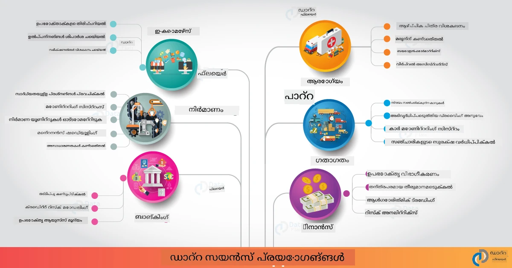

# യഥാർഥ ലോകത്തിലെ ഡേറ്റാ സയൻസ്

|  ](../../sketchnotes/20-DataScience-RealWorld.png) |
| :--------------------------------------------------------------------------------------------------------------: |
|               യഥാർഥ ലോകത്തിലെ ഡേറ്റാ സയൻസ് - _സ്ക്കെച്ച്നോട്ട് by [@nitya](https://twitter.com/nitya)_               |

നാം ഈ പഠനയാത്രയുടെ അവസാനത്തോടെയാണ് എത്തിയിരിക്കുന്നത്!

നാം ഡേറ്റാ സയൻസിന്റെയും എഥിക്സിന്റെയും നിർവചനങ്ങളിൽനിന്ന് തുടങ്ങുകയും, ഡേറ്റാ വിശകലനത്തിനും ദൃശ്യവത്ക്കരണത്തിനും വേണ്ടിയുള്ള വിവിധ ഉപകരണങ്ങളും സാങ്കേതിക വിദ്യകളും പരിശോധിക്കുകയും, ഡേറ്റാ സയൻസ് ലൈഫ്സൈക്കിൾ അവലോകനം ചെയ്യുകയും, ക്ലൗഡ് കംപ്യൂട്ടിംഗ് സേവനങ്ങളിലൂടെ ഡേറ്റാ സയൻസ് പ്രവർത്തികൾ സ്കെയിൽ ചെയ്യുകയും ഓട്ടോമേറ്റുചെയ്യുകയും ചെയ്തു. അതിനാൽ, നിങ്ങൾക്ക് തോന്നുന്നുണ്ടോ: _"ഈ പഠനങ്ങളെ യഥാർത്ഥ ലോക സന്നിവേശങ്ങളിലേക്ക് എങ്ങനെ കൃത്യമായി നമാക്കാം?"_

ഈ പാഠത്തിൽ, വ്യവസായത്തിലെ യഥാർത്ഥ ലോക അസംഖ്യമായ ഡേറ്റാ സയൻസ് പ്രയോഗങ്ങളെ പരിസരിക്കാം, ഗവേഷണം, ഡിജിറ്റൽ മനുഷ്യശാസ്ത്രം, സ്ഥിരതാ സാങ്കേതികവിദ്യ എന്നിവയിലുള്ള പ്രത്യേക ഉദാഹരണങ്ങളിൽ പ്പോയർണ്ണും. വിദ്യാർത്ഥി പ്രൊജക്റ്റ് അവസരങ്ങൾ നോക്കുകയും നിങ്ങളുടെ പഠന യാത്ര തുടർന്നും സഹായിക്കുന്ന അനുയോജ്യമായ വൃത്താന്തങ്ങൾ നൽകി സമാപിപ്പിക്കുകയും ചെയ്യും!
## ഫോർ-പാഠം ക്വിസ്

## [ഫോർ-പാഠം ക്വിസ്](https://ff-quizzes.netlify.app/en/ds/quiz/38)

## ഡേറ്റാ സയൻസ് + വ്യവസായം

AI-യുടെ ജനാധിപത്യവൽക്കരണത്തിന് നന്ദിയോടെ, ഡെവലപ്പർമാർ ഇപ്പോൾ AI-എഴുതിയ നിർണയമെടുക്കലും ഡേറ്റാ-പ്രേരിത洞റിവുകളും ഉപയോക്തൃ അനുഭവങ്ങളിലും വികസന പ്രവൃത്തികളിലും സുഖകരമായി ചേർക്കാൻ കഴിവർന്നു. വ്യവസായ വ്യാപ്തിയിലുള്ള യഥാർത്ഥ ലോക പ്രയോഗങ്ങൾക്ക് ഡേറ്റാ സയൻസ് എങ്ങനെ "പ്രയോഗിക്കുന്നു" എന്ന് ചില ഉദാഹരണങ്ങൾ:

 * [Google Flu Trends](https://www.wired.com/2015/10/can-learn-epic-failure-google-flu-trends/) ഡേറ്റാംശം ഉപയോഗിച്ച് സന്ധാന താൾവാക്കുകൾക്കും ഫ്ലു പ്രവണതകൾക്കും ഇടയിലുള്ള ബന്ധം കണ്ടെത്താൻ ഡേറ്റാ സയൻസ് ഉപയോഗിച്ചിരുന്നു. സമീപനം പിഴവുകളുണ്ടെങ്കിലും, ഡേറ്റാ-പ്രേരിത ആരോഗ്യപരിപാലന പ്രവചനങ്ങളുടെ സാധ്യതകളും വെല്ലുവിളികളും പ്രചരിപ്പിച്ചു.

 * [UPS Routing Predictions](https://www.technologyreview.com/2018/11/21/139000/how-ups-uses-ai-to-outsmart-bad-weather/) - എങ്ങനെ UPS ഡേറ്റാ സയൻസ്, മെഷീൻ ലേണിംഗ് എന്നിവ നൽകുന്ന കാലാവസ്ഥ സാഹചര്യം, ഗതാഗത പാറ്റേണുകൾ, താഴെയെത്താനുള്ള സമയപരിധി എന്നിവ പരിഗണിച്ച് ഡെലിവറി ഏറ്റവും മികച്ച മാർഗ്ഗങ്ങൾ പ്രവചിക്കുന്നു എന്ന് വിശദീകരിക്കുന്നു.

 * [NYC Taxi Route Visualization](http://chriswhong.github.io/nyctaxi/) - [Freedom Of Information Laws](https://chriswhong.com/open-data/foil_nyc_taxi/) ഉപയോഗിച്ച് ശേഖരിച്ച ഡേറ്റാ NYC ടാക്സികളുടെ ഒരു ദിന ജീവിതം കാണിച്ചു, അവർ നഗരത്തിൽ എങ്ങനെ സഞ്ചരിക്കുന്നു, അവർ ഉണ്ടാക്കിയ വരുമാനം, 24 മണിക്കൂറിൽ യാത്രയുടെ ദൈർഘ്യം എന്നിവ മനസ്സിലാക്കാൻ സഹായിച്ചു.

 * [Uber Data Science Workbench](https://eng.uber.com/dsw/) - *പ്ര ദിനം* മില്യനുകളായ ഉബർ യാത്രകളിൽ നിന്നുള്ള ഡേറ്റ (പിക്കപ്പ് & ഡ്രോപ്പ്ഓഫ് ലൊക്കേഷനുകൾ, യാത്ര ദൈർഘ്യം, മുന്‍തൂക്കമിട്ട മാർഗ്ഗങ്ങൾ) ഉപയോഗിച്ച് വില നിർണ്ണയം, സുരക്ഷ, തട്ടിപ്പ് കണ്ടെത്തൽ, നാവിഗേഷൻ തീരുമാനങ്ങൾ എന്നിവ സഹായിക്കുന്ന ഡേറ്റാ അനലിറ്റിക്സ് ടൂൾ നിർമ്മിക്കുന്നു.

 * [Sports Analytics](https://towardsdatascience.com/scope-of-analytics-in-sports-world-37ed09c39860) - _പ്രവചനാത്മക അനലിറ്റിക്സ്_ (ടീം, കളിക്കാരൻ വിശകലനം - [Moneyball](https://datasciencedegree.wisconsin.edu/blog/moneyball-proves-importance-big-data-big-ideas/) പോലെ - പ്രേമികർ മാനേജ്‌മെന്റ്) ഉം _ഡേറ്റാ ദൃശ്യവത്ക്കരണം_ (ടീം & പ്രേമികർ ഡാഷ്ബോർഡുകൾ, മത്സരങ്ങൾ തുടങ്ങിയവ) എന്നിവയെയും പരിശീലിക്കാൻ, സ്പോർട്സ് ബെറ്റിങ്ങും ഇൻവെന്ററി/വേദി മാനേജ്‌മെന്റും ഉൾപ്പെടുന്ന പ്രയോഗങ്ങൾ.

 * [ബാങ്കിംഗ് രംഗത്ത് ഡേറ്റാ സയൻസ്](https://data-flair.training/blogs/data-science-in-banking/) - ഫെഞ്ചർ രംഗത്ത് പ്രയോഗങ്ങൾ ബാക്കി അപകടനിരൂപണം, തട്ടിപ്പ് കണ്ടെത്തൽ മുതൽ ഉപഭോക്തൃ വിഭാഗീകരണം, യഥാർത്ഥ സമയ പ്രവചനങ്ങൾ, ശുപാർശ സിസ്റ്റങ്ങൾ വരെ ഉൾപ്പെടുന്നു. പ്രവചനാത്മക അനലിറ്റിക്സ് [ക്രെഡിറ്റ് സ്കോറുകൾ](https://dzone.com/articles/using-big-data-and-predictive-analytics-for-credit) പോലുള്ള നിർണായക മാനദണ്ഡങ്ങൾ പ്രേരിപ്പിക്കുന്നു.

 * [ആരോഗ്യ മേഖലയിലെ ഡേറ്റാ സയൻസ്](https://data-flair.training/blogs/data-science-in-healthcare/) - മെഡിക്കൽ ഇമേജിംഗ് (MRI, X-Ray, CT-സ്കാൻ), ജനോമിക്സ് (DNA അനുക്രമണം), മരുന്ന് വികസനം (അപായ വിലയിരുത്തൽ, വിജയ പ്രവചനം), പ്രവചനാത്മക അനലിറ്റിക്സ് (രോഗി പരിചരണം & പൊതുവിതരണ ലൊജിസ്റ്റിക്‌സ്), രോഗം നിരീക്ഷണം & പ്രതിരോധം മുതലായ പ്രയോഗങ്ങൾ.

 Image Credit: [Data Flair: 6 Amazing Data Science Applications ](https://data-flair.training/blogs/data-science-applications/)

ഈ ചിത്രം ഡേറ്റാ സയൻസ് സാങ്കേതിക വിദ്യകൾ ഉപയോഗിച്ച് മറ്റ് മേഖലകളും ഉദാഹരണങ്ങളും കാണിക്കുകയും ചെയ്യുന്നു. മറ്റ് പ്രയോഗങ്ങൾ അന്വേഷിക്കാനുണ്ടോ? താഴെയുള്ള [പരിശോധന & സ്വയം പഠനം](?id=review-amp-self-study) വിഭാഗം നോക്കൂ.

## ഡേറ്റാ സയൻസ് + ഗവേഷണം

|  ](../../sketchnotes/20-DataScience-Research.png) |
| :---------------------------------------------------------------------------------------------------------------: |
|              ഡേറ്റാ സയൻസ് & ഗവേഷണം - _സ്ക്കെച്ച്നോട്ട് by [@nitya](https://twitter.com/nitya)_              |

യഥാർത്ഥ ലോക പ്രയോഗങ്ങൾ സാധാരണയായി വ്യവസായ പരിധിയിൽ വ്യാപകമായി ഉപയോഗിക്കപ്പെടുമ്പോൾ, _ഗവേഷണ_ പ്രയോഗങ്ങൾ രണ്ട് കാഴ്ചപ്പാടുകളിൽ ഉൽപ്പാദകമാകാവുന്നുണ്ട്:

* _നൂതനത ആവശ്യമുള്ള അവസരങ്ങൾ_ - ആധുനിക ആശയങ്ങളുടെ വേഗത്തിലുള്ള പ്രോട്ടോടൈപ്പിംഗ് പരീക്ഷണങ്ങളും അടുത്ത തലമുറ പ്രയോഗങ്ങൾക്ക് ഉപയോക്തൃ അനുഭവങ്ങൾ പരിശോധിക്കുകയും ചെയ്യുക.
* _പ്രയോഗപ്രവേശന വെല്ലുവിളികൾ_ - ഡേറ്റാ സയൻസ് സാങ്കേതിക വിദ്യകൾ യഥാർത്ഥ ലോക ആശയസാഹിത്യത്തിൽ ഉണ്ടാക്കുന് സാധ്യതയുള്ള ഉപദ്രവങ്ങൾ അല്ലെങ്കിൽ അനീച്ഛിത പ്രത്യാഘാതങ്ങൾ അന്വേഷിക്കുക.

വിദ്യാർത്ഥികൾക്ക്, ഗവേഷണ പദ്ധതികൾ വിഷയത്തെക്കുറിച്ചുള്ള ബോധവും മനസ്സിലാക്കലും കൂടുതൽ മെച്ചപ്പെടുത്താനും, ആ മേഖലകളിൽ പ്രവർത്തിക്കുന്ന അനുയോജ്യരായ വ്യക്തികളും സംഘങ്ങളുമായുള്ള ഇടപെടലുകളും വികസിപ്പിക്കാനും സഹായകരമാണ്. ആകെയുള്ള ഗവേഷണ പദ്ധതികൾ എങ്ങനെ രൂപപ്പെടുന്നുവെന്നും അവ എങ്ങനെ സ്വാധീനം ചെലുത്തുന്നു എന്നും നോക്കുക.

ഒരു ഉദാഹരണമായി നോക്കുക - Joy Buolamwini (MIT മീഡിയ ലാബ്) രചിച്ച [MIT Gender Shades Study](http://gendershades.org/overview.html), [പ്രധാന ഗവേഷണം പേപ്പർ](http://proceedings.mlr.press/v81/buolamwini18a/buolamwini18a.pdf) Timnit Gebru (മൈക്രോസോഫ്റ്റ് റിസർച്ചിൽ അന്നത്തെ) സഹ-രചിച്ച് നടത്തിയതു:

 * **എന്ത്:** ഗവേഷണ ലക്ഷ്യം _ലൈംഗികതയും ചുണ്ടു വർണവും അടിസ്ഥാനമാക്കി ഓട്ടോമേറ്റഡ് മുഖവിശകലന ആൾഗോരിഥങ്ങളെ വിലയിരുത്തൽ_ ചെയ്യുക എന്നത്.
 * **എന്തിന്:** മുഖവിശകലനം പോലുള്ള മേഖലകൾ (നിയമനിർവഹണം, വിമാനത്താവളം സുരക്ഷ, നിയമന സംവിധാനങ്ങൾ എന്നിവ) അശുദ്ധമായ വർഗ്ഗീകരണം (ഉദാ., മുന്‍കൂട്ടിയുള്ള പക്ഷപാതം) ബാധിത വ്യക്തികൾക്കും കൂട്ടായ്മകൾക്കും സാമ്പത്തിക-സാമൂഹിക ഹാനികൾ സൃഷ്ടിക്കാമെന്നതിനാൽ, പാരിതോഷികത ഉറപ്പാക്കാൻ പൂർണ്ണമായ അറിവും പരിഹാരവും ആവശ്യമാണ്.
 * **എങ്ങനെ:** ഗവേഷകർ കണ്ടുപിടിച്ചതായി നിലവിലുള്ള നിലവാര ചില്ലറവകുപ്പുകൾ എളുപ്പത്തിലുള്ള ത്വക്ക് വ്യക്തികൾ കൂടുതലായിരുന്നു; അതിനാൽ പുതിയ, _സന്തുലിതമായ_ ലിംഗവും ത്വക് തരം അടിസ്ഥാനമാക്കി ഡാറ്റാസെറ്റ് (1000+ ചിത്രങ്ങൾ) രൂപകൽപ്പന ചെയ്ത് മൂന്ന് ലിംഗം വർഗ്ഗീകരണ ഉൽപ്പന്നങ്ങളുടെ കൃത്യത (Microsoft, IBM & Face++) വിലയിരുത്തി.

ഫലങ്ങൾ കാണിക്കുന്നത്, മൊത്തം കൃത്യത നല്ലതായിരുന്നുവെങ്കിലും വിവിധ ഉപഗ്രൂപ്പുകളിലെ പിഴവ് നിരക്കുകളിൽ പരസ്യ വ്യത്യാസങ്ങൾ ഉണ്ടായിരുന്നു — **സ്ത്രീകൾക്കും ഇരുണ്ട ത്വക് കൈക്കാരായവർക്കും മിസ്‌ജെൻഡറിങ്ങ്** കൂടുതലായിരുന്നത്.

**പ്രധാന ഫലങ്ങൾ:** ഡേറ്റാ സയൻസിന് കൂടുതൽ _പ്രാതിനിധ്യ ഡാറ്റാസെറ്റുകളും_ (സന്തുലിത ഉപഗ്രൂപ്പുകൾ) കൂടാതെ കൂടുതൽ _സമാഗമ സംഘങ്ങൾ_ (വിവിധ പശ്ചാത്തലങ്ങൾ) ആവശ്യമാണ്, ഇത്തരം പക്ഷപാതങ്ങൾ പഹയിലും പരിഹരിക്കലും ചെയ്യാൻ സാധിക്കണം എന്ന ബോധ്യവൽക്കരണം ഉയര്‍ത്തി. പരമാധികാരമുള്ള AI ഉല്‍പ്പന്നങ്ങളും പ്രക്രിയകളും കൂടുതൽ ന്യായവത്തോടും ചുമതലപൂര്‍ണമായവയാക്കുന്നതിന് ഇത്തരത്തിലുള്ള ഗവേഷണ ശ്രമങ്ങൾ അനിവാര്യമാണ്.

**മൈക്രോസോഫ്റ്റിൽ ബന്ധപ്പെട്ട ഗവേഷണ ശ്രമങ്ങളെക്കുറിച്ച് അറിയാൻ ആഗ്രഹിക്കുന്നുവോ?**

* [Artificial Intelligence-ലെ Microsoft Research Projects](https://www.microsoft.com/research/research-area/artificial-intelligence/?facet%5Btax%5D%5Bmsr-research-area%5D%5B%5D=13556&facet%5Btax%5D%5Bmsr-content-type%5D%5B%5D=msr-project) പരിശോധിക്കുക.
* [Microsoft Research Data Science Summer School](https://www.microsoft.com/en-us/research/academic-program/data-science-summer-school/) കഴിഞ്ഞ വിദ്യാർത്ഥി പ്രൊജക്റ്റുകൾ പരിശോധിക്കുക.
* [Fairlearn](https://fairlearn.org/) പ്രോജക്റ്റും [Responsible AI](https://www.microsoft.com/en-us/ai/responsible-ai?activetab=pivot1%3aprimaryr6) പൊതുരംഗ സംരംഭങ്ങളും പരിശോധിക്കുക.

## ഡേറ്റാ സയൻസ് + മനുഷ്യശാസ്ത്രം

|  ](../../sketchnotes/20-DataScience-Humanities.png) |
| :---------------------------------------------------------------------------------------------------------------: |
|              ഡേറ്റാ സയൻസ് & ഡിജിറ്റൽ മനുഷ്യശാസ്ത്രം - _സ്ക്കെച്ച്നോട്ട് by [@nitya](https://twitter.com/nitya)_              |

ഡിജിറ്റൽ മനുഷ്യശാസ്ത്രം [എന്ന് നിർവചിക്കപ്പെട്ടിരിക്കുന്നത്](https://digitalhumanities.stanford.edu/about-dh-stanford) "കമ്പ്യൂട്ടേഷണൽ മാർഗങ്ങളും മനുഷ്യൻവഴികളായ അന്വേഷണങ്ങളും സംയോജിപ്പിക്കുന്ന പ്രായോഗികവും സമീപനങ്ങളുടെ സമാഹാരം" എന്നതായിരുന്നു. സ്റ്റാൻഫോർഡ് പ്രൊജക്റ്റുകൾ [_rebooting history_ എന്നതും _poetic thinking_ എന്നതും](https://digitalhumanities.stanford.edu/projects) [ഡിജിറ്റൽ മനുഷ്യശാസ്ത്രവും ഡേറ്റാ സയൻസും](https://digitalhumanities.stanford.edu/digital-humanities-and-data-science) തമ്മിലുള്ള ബന്ധം കാണിക്കുന്നു - നെറ്റ്‌വർക്ക് വിശകലനം, വിവര ദൃശ്യവത്ക്കരണം, സ്ഥലം, വാചക വിശകലനം തുടങ്ങിയ സാങ്കേതിക വിദ്യകൾ ഉപയോഗിച്ച് ചരിത്ര, സാഹിത്യ ഡാറ്റാസെറ്റുകൾ പഴയ(round) ഉദ്ദേശങ് പുതിയ അറിവുകളും കാഴ്ചപ്പാടുകളും ലഭിക്കുന്നു.

*ഈ മേഖലയിൽ ഒരു പദ്ധതി ആഴത്തിൽ പരീക്ഷിക്കുകയും വികസിപ്പിക്കുകയോ ആഗ്രഹിക്കുന്നോ?*

[എമിലി ഡിക്കിൻസൺ - മെടർ ഓഫ് മൂഡ്](https://gist.github.com/jlooper/ce4d102efd057137bc000db796bfd671) — [ജെൻ ലൂപ്പർ](https://twitter.com/jenlooper) നൽകിയ ഒരു മികച്ച ഉദാഹരണം. _കവിതയുടെ ടോൺ അല്ലെങ്കിൽ സംവേദനം വിശകലനം ചെയ്താൽ, ആ കവിത എഴുതപ്പെട്ട കാലം പ്രവചിക്കാമോ?_എന്ന ചോദ്യമാണ് ഈ പദ്ധതി ഉണ്ട്. അങ്ങനെ, കവിയുടെ മനോഭാവം ആ കാലയളവിൽ എങ്ങനെയായി എന്നും അർത്ഥമാക്കാം.

ആ ചോദ്യത്തിന് ഉത്തരം കണ്ടെത്താൻ, ഡേറ്റാ സയൻസ് ലൈഫ്സൈക്കിൾ ഘട്ടങ്ങൾ പാലിക്കുന്നു:
 * [`ഡേറ്റാ സമാഹരണം`](https://gist.github.com/jlooper/ce4d102efd057137bc000db796bfd671#acquiring-the-dataset) - വിശകലനത്തിന് അനുയോജ്യമായ ഡാറ്റ സെറ്റ് ശേഖരിക്കൽ; API (ഉദാ., [Poetry DB API](https://poetrydb.org/index.html)) ഉപയോഗിക്കൽ അല്ലെങ്കിൽ വെബ്‌സൈറ്റുകൾ സ്ക്രാപ്പിംഗ് (ഉദാ., [Project Gutenberg](https://www.gutenberg.org/files/12242/12242-h/12242-h.htm)) [Scrapy](https://scrapy.org/) പോലുള്ള ഉപകരണങ്ങൾ ഉപയോഗിച്ച്.
 * [`ഡേറ്റാ ശുചീകരണം`](https://gist.github.com/jlooper/ce4d102efd057137bc000db796bfd671#clean-the-data) - ടെക്സ്റ്റ് വേണ്ടി പൊരുത്തപ്പെടുത്തൽ, ശുദ്ധീകരണം സർവോപരി ഉപകരണങ്ങളായ Visual Studio Code, Microsoft Excel എന്നിവ ഉപയോഗിച്ച്.
 * [`ഡാറ്റാ അനലിസീസ്`](https://gist.github.com/jlooper/ce4d102efd057137bc000db796bfd671#working-with-the-data-in-a-notebook) - പാന്താസ്, നമ്പൈ, മാട്ട്‌പ്ലോട്ട്‌ലിബ് പോലുള്ള പൈതൺ പാക്കേജുകൾ ഉപയോഗിച്ച് ഡാറ്റാ നോറ്റ്ബുക്കിൽ ഇറക്കുമതി ചെയ്ത് ഒരുക്കലും ദൃശ്യവത്ക്കരണവും.
 * [`സംവേദന വിശകലനം`](https://gist.github.com/jlooper/ce4d102efd057137bc000db796bfd671#sentiment-analysis-using-cognitive-services) - Text Analytics പോലുള്ള ക്ലൗഡ് സേവനങ്ങൾ ഉൾപ്പെടുത്തൽ, [Power Automate](https://flow.microsoft.com/en-us/) പോലുള്ള ലോ-കോഡ് ടൂളുകൾ ഉപയോഗിച്ച് ഓട്ടോമേറ്റഡ് ഡാറ്റാ പ്രോസസ്സിംഗ് പ്രവൃത്തിശ്രേണികൾ.

ഈ പ്രവൃത്തി ശ്രേണി ഉപയോഗിച്ച്, കവിതകളുടെ സംവേദനത്തിൽ കാലാവധി സ്വാധീനം വിശകലനം ചെയ്യാൻ കഴിയും, കവിയുടെ വിദൂര അവലോകനങ്ങൾ രൂപം നൽകാനും സഹായിക്കും. നിങ്ങൾ തന്നെ ശ്രമിക്കൂ — തുടർന്ന് നോറ്റ്ബുക്ക് വികസിപ്പിച്ച് മറ്റേതെങ്കിലും ചോദ്യങ്ങൾ ചോദിക്കുക അല്ലെങ്കിൽ പുതിയ രീതികളിൽ ഡാറ്റ കാണിക്കുക!

> [Digital Humanities toolkit](https://github.com/Digital-Humanities-Toolkit) ഉൾപ്പെടെയുള്ള ചില ഉപകരണങ്ങൾ ഉപയോഗിച്ച് ഇതു സംബന്ധിച്ച അന്വേഷണങ്ങൾ നടത്താം.

## ഡേറ്റാ സയൻസ് + സ്ഥിരതാ

|  ](../../sketchnotes/20-DataScience-Sustainability.png) |
| :---------------------------------------------------------------------------------------------------------------: |
|              ഡേറ്റാ സയൻസ് & സ്ഥിരതാ - _സ്ക്കെച്ച്നോട്ട് by [@nitya](https://twitter.com/nitya)_              |

[2030 ദീർഘകാല വികസന ഏജൻഡ](https://sdgs.un.org/2030agenda) - 2015-ൽ ഐക്യരാഷ്ട്രങ്ങങ്ങളുടെ എല്ലാ അംഗങ്ങളും സ്വീകരിച്ചത് - 17 ലക്ഷ്യങ്ങളെ ഉൾക്കൊള്ളുന്നു, അതിൽ **ഗ്രഹത്തെ സംരക്ഷിക്കൽ** കാലാവസ്ഥ വ്യതിയാനത്തിൻറെ ആഘാതത്തിൽ അടങ്ങിയിരിക്കുന്നു. [Microsoft Sustainability](https://www.microsoft.com/en-us/sustainability) സംരംഭം ഈ ലക്ഷ്യങ്ങളെ പിന്തുണയ്ക്കുന്നു, സാങ്കേതിക പരിഹാരങ്ങൾ ഉപയോഗിച്ച് കൂടുതൽ സ്ഥിരതയുള്ള ഭവിഷ്യങ്ങൾ നിർമ്മിക്കുന്നതിൽ സഹായിക്കുന്നതിന് [4 ലക്ഷ്യങ്ങളിൽ ശ്രദ്ധ](https://dev.to/azure/a-visual-guide-to-sustainable-software-engineering-53hh) - 2030-ലേക്ക് കാർബണ്‍ നെഗറ്റീവ്, വാട്ടര്‍ പോസിറ്റീവ്, സീറോ വെയസ്റ്റ്, ബയോ-വിവിധത്വം.

ഈ വെല്ലുവിളികളെ സ്കെയിലബിള്‍ അദ്ധ്വാനത്തിലും സമയോചിതമായും നേരിടാൻ ക്ലൗഡ് സ്കെയിൽ ചിന്തയും വലിയ ഡേറ്റയും ആവശ്യമാണ്. [Planetary Computer](https://planetarycomputer.microsoft.com/) സംരംഭം ഡാറ്റാ സയന്റിസ്റ്റുകളും ഡെവലപ്പർമാരും സഹായിക്കാൻ 4 ഘടകങ്ങൾ നൽകുന്നു:
 
 * [ഡാറ്റാ കാറ്റലോഗ്](https://planetarycomputer.microsoft.com/catalog) - പേടാബൈറ്റുകളുടെ ഭൂമിയിലെ സിസ്റ്റം ഡേറ്റ (സൗജന്യവും ആസ്യൂറിലെങ്കിലും).
 * [പ്ലാനറ്ററി API](https://planetarycomputer.microsoft.com/docs/reference/stac/) - ഉപയോക്താക്കൾക്ക് സാന്ദ്രവും സമയം കൊണ്ട് ബന്ധപ്പെട്ട ഡേറ്റകൾ തിരയാൻ.
 * [ഹബ്](https://planetarycomputer.microsoft.com/docs/overview/environment/) - ദ്രുതഗതിയിലുള്ള ഭൂമിശാസ്ത്ര ഡാറ്റാസെറ്റുകൾ പ്രോസസ്സുചെയ്യുന്ന ശാസ്ത്രജ്ഞർക്ക് മാനേജുചെയ്ത പരിസ്ഥിതി.
 * [ആപ്ലിക്കേഷനുകൾ](https://planetarycomputer.microsoft.com/applications) - സ്ഥിരതാവാനുള്ള洞റിവുകൾ സഹിതം ഉപയോഗകേസുകളും ടൂളുകളും പ്രദർശിപ്പിക്കുന്നു.
**ദി പ്ലാനറ്ററി കമ്പ്യൂട്ടർ പ്രോജക്ട് നിലവിൽ പ്രിവ്യൂ ഘട്ടത്തിലാണ് (സെപ് 2021 മുതൽ)** - ഡാറ്റ സയൻസ് ഉപയോഗിച്ച് സുസ്ഥിരതാ പരിഹാരങ്ങളിൽ സംഭാവന നൽകാൻ നിങ്ങൾ തുടങ്ങാൻ കഴിയും.

* [Request access](https://planetarycomputer.microsoft.com/account/request) വഴി അന്വേഷനം ആരംഭിക്കുകയും സഖാക്കളുമായി ബന്ധപ്പെടുകയും ചെയ്യൂ.
* [Explore documentation](https://planetarycomputer.microsoft.com/docs/overview/about) വഴി പിന്തുടരുന്ന ഡാറ്റാസെറ്റുകളും APIs-ഉം മനസ്സിലാക്കൂ.
* [Ecosystem Monitoring](https://analytics-lab.org/ecosystemmonitoring/) പോലുള്ള അപേക്ഷകൾ പ്രചോദനത്തിന് അന്വേഷിക്കൂ.
  
കാലാവസ്ഥ മാറ്റം, വനനശീകരണം പോലുള്ള മേഖലകളിലെ പ്രസക്തമായ洞കൾ പ്രദർശിപ്പിക്കാൻ അല്ലെങ്കിൽ ഊർജ്ജിതമാക്കാൻ ഡാറ്റ വീക്ഷണം എങ്ങനെ ഉപയോഗിക്കാമെന്ന് ചിന്തിക്കൂ. അല്ലെങ്കിൽ, കൂടുതൽ സുസ്ഥിരമായ ജീവിതത്തിനു വേണ്ടി പൊതു പെരുമാറ്റ മാറ്റങ്ങൾക്ക് പ്രചോദനമാകുന്ന പുതിയ ഉപയോക്തൃ അനുഭവങ്ങൾ സൃഷ്ടിക്കാൻ洞കൾ എങ്ങനെ ഉപയോഗിക്കാമെന്ന് ആലോചിക്കൂ. 

## ഡാറ്റ സയൻസ് + വിദ്യാർത്ഥികൾ

നാം വ്യവസായത്തിലും ഗവേഷണത്തിലും യഥാർത്ഥ ലോക് അപ്ലിക്കേഷനുകൾ ചർച്ച ചെയ്തു, ഡിജിറ്റൽ ഹ്യൂമാനിറ്റീസ്, സുസ്ഥിരത എന്നിവയിലുള്ള ഡാറ്റ സയൻസ് അപ്ലിക്കേഷൻ ഉദാഹരണങ്ങൾ പരിശോധിച്ചു. ആകെ, ഡാറ്റ സയൻസ് ആരംഭക്കാർ ആയി നിങ്ങളുടെ കഴിവുകൾ എങ്ങനെ വർദ്ധിപ്പിച്ച് വിദഗ്ധത പങ്കുവെക്കാമെന്ന്?

ഡാറ്റ സയൻസ് വിദ്യാർത്ഥികളുടെ ചില പ്രോജക്ടുകൾ നിങ്ങളെ പ്രചോദിപ്പിക്കും.

 * [MSR Data Science Summer School](https://www.microsoft.com/en-us/research/academic-program/data-science-summer-school/#!projects) ഗിറ്റ്ഹബ് [projects](https://github.com/msr-ds3) - ഇവിടെ ഉള്ള വിഷയങ്ങൾ പരിശോധിക്കുന്നു:
    - [Racial Bias in Police Use of Force](https://www.microsoft.com/en-us/research/video/data-science-summer-school-2019-replicating-an-empirical-analysis-of-racial-differences-in-police-use-of-force/) | [Github](https://github.com/msr-ds3/stop-question-frisk)
    - [Reliability of NYC Subway System](https://www.microsoft.com/en-us/research/video/data-science-summer-school-2018-exploring-the-reliability-of-the-nyc-subway-system/) | [Github](https://github.com/msr-ds3/nyctransit)
 * [Digitizing Material Culture: Exploring socio-economic distributions in Sirkap](https://claremont.maps.arcgis.com/apps/Cascade/index.html?appid=bdf2aef0f45a4674ba41cd373fa23afc) - [Ornella Altunyan](https://twitter.com/ornelladotcom) ഒരുക്കിയ ടീം ക്ലെയർമൗണ്ടിൽ, [ArcGIS StoryMaps](https://storymaps.arcgis.com/) ഉപയോഗിച്ച്.

## 🚀 ചലഞ്ച്

വഴികാട്ടി ഡാറ്റ സയൻസ് പ്രോജക്ടുകൾ ശുപാർശ ചെയ്യുന്ന ലേഖനങ്ങൾ തിരയൂ - ഉദാഹരണത്തിന് [50 വിഷയങ്ങൾ](https://www.upgrad.com/blog/data-science-project-ideas-topics-beginners/) അല്ലെങ്കിൽ [21 പ്രോജക്ട് ഐഡിയകൾ](https://www.intellspot.com/data-science-project-ideas) അല്ലെങ്കിൽ [16 പ്രോജക്ടുകൾ സോഴ്‌സ് കോഡ് സഹിതം](https://data-flair.training/blogs/data-science-project-ideas/) - ഇവ നീക്കം ചെയ്ത് പുനസംസ്കരിക്കാം. നിങ്ങളുടെ പഠന യാത്രകൾ കുറിച്ച് ബ്ലോഗ് ചെയ്യാനും洞കൾ പങ്കുവെക്കാനും മറക്കരുത്.
## പോസ്റ്റ്-ലെക്ചർ ക്വിസ്

## [Post-lecture quiz](https://ff-quizzes.netlify.app/en/ds/quiz/39)

## അവലോകനവും സ്വയം പഠനവും

കൂടുതൽ ഉപയോഗശേഷികൾ പരിശോധിക്കാൻ ആഗ്രഹിക്കുന്നുവോ? ചില പ്രസക്തമായ ലേഖനങ്ങൾ:
 * [17 Data Science Applications and Examples](https://builtin.com/data-science/data-science-applications-examples) - ജൂലൈ 2021
 * [11 Breathtaking Data Science Applications in Real World](https://myblindbird.com/data-science-applications-real-world/) - മേയ് 2021
 * [Data Science In The Real World](https://towardsdatascience.com/data-science-in-the-real-world/home) - ലേഖന ശേഖരം
 * [12 Real-World Data Science Applications with Examples](https://www.scaler.com/blog/data-science-applications/) - മേയ് 2024
 * Data Science: [Education](https://data-flair.training/blogs/data-science-in-education/), [Agriculture](https://data-flair.training/blogs/data-science-in-agriculture/),[Finance](https://data-flair.training/blogs/data-science-in-finance/), [Movies](https://data-flair.training/blogs/data-science-at-movies/), [Health Care](https://onlinedegrees.sandiego.edu/data-science-health-care/) എന്നിവയിൽ & മറ്റും.
## അസൈൻമെന്റ്

[Explore A Planetary Computer Dataset](assignment.md)

---

<!-- CO-OP TRANSLATOR DISCLAIMER START -->
**അറിയിപ്പ്**:
ഈ രേഖ AI പരിഭാഷാ സേവനം [Co-op Translator](https://github.com/Azure/co-op-translator) ഉപയോഗിച്ച് പരിഭാഷപ്പെടുത്തിയതാണ്. ഞങ്ങൾ കൃത്യതയ്ക്കായി ശ്രമിക്കുന്നുവെങ്കിലും, ഓട്ടോമേറ്റഡ് പരിഭാഷകളിൽ പിഴവുകൾ അല്ലെങ്കിൽ തെറ്റായ വിവരങ്ങൾ ഉണ്ടാകാൻ സാധ്യതയുണ്ട്. അതിന്റെ സ്വാഭാവിക ഭാഷയിലുള്ള അസൽ രേഖയാണ് പ്രാമാണികമായ ഉറവിടമായി പരിഗണിക്കേണ്ടത്. നിർണായകമായ വിവരങ്ങൾക്ക്, പ്രൊഫഷണൽ മനുഷ്യ പരിഭാഷ ശുപാർശ ചെയ്യുന്നു. ഈ പരിഭാഷ ഉപയോഗിച്ച് ഉണ്ടാകുന്ന തെറ്റിദ്ധാരണകൾ അല്ലെങ്കിൽ തെറ്റായ വ്യാഖ്യാനങ്ങൾക്കായി ഞങ്ങൾ ഉത്തരവാദികളല്ല.
<!-- CO-OP TRANSLATOR DISCLAIMER END -->