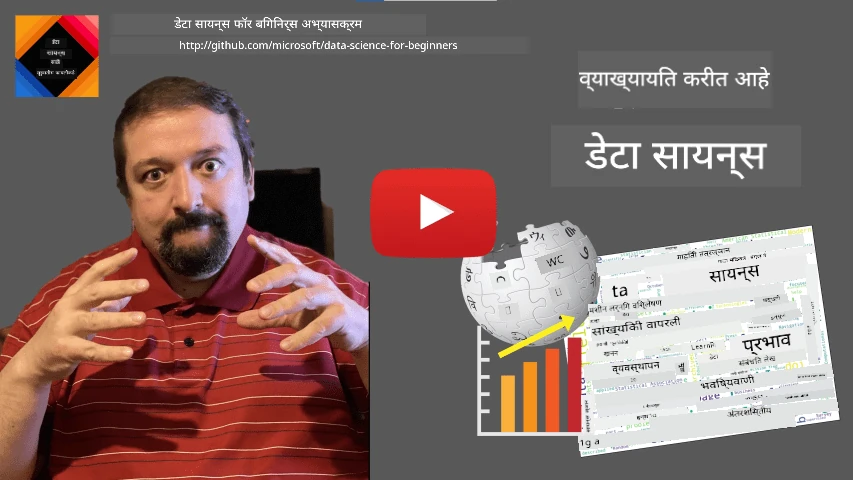
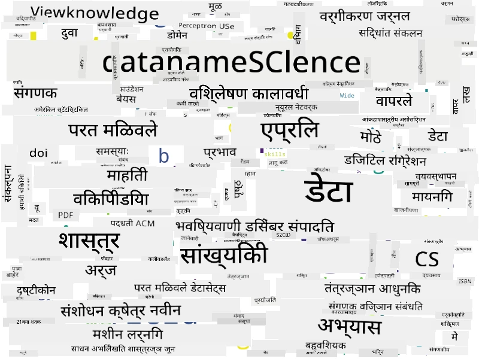

# डेटासायन्सची व्याख्या

|  कडून स्केचनोट ](../../sketchnotes/01-Definitions.png) |
| :--------------------------------------------------------------------------------------------------: |
|               डेटासायन्सची व्याख्या - _[@nitya](https://twitter.com/nitya) कडून स्केचनोट_                |

---

## [पूर्व-व्याख्यान क्विझ](https://ff-quizzes.netlify.app/en/ds/quiz/0)

## डेटा म्हणजे काय?
आपल्या दैनंदिन जीवनात आपण सतत डेटाने वेढलेले असतो. तुम्ही सध्या जे वाचत आहात ते डेटा आहे. तुमच्या मित्रांचे फोन नंबर तुमच्या स्मार्टफोनमधील यादी डेटा आहे तर तुमच्या घड्याळावर दर्शवलेला सध्याचा वेळही डेटा आहे. मानव म्हणून आपण नैसर्गिकपणे डेटा वापरतो, जसे आपण आपल्याकडे असलेले पैसे मोजतो किंवा मित्रांना पत्र लिहितो.

तथापि, संगणकांच्या निर्मितीमुळे डेटा खूप महत्त्वाचा झाला. संगणकांची मुख्य भूमिका गणना करणे असली तरी त्यांना ऑपरेशनसाठी डेटाची गरज असते. त्यामुळे, संगणक कसे डेटा संग्रहित करतात आणि प्रक्रिया करतात हे समजून घेणे आवश्यक आहे.

इंटरनेटच्या उदयासह, डेटा हाताळणीसाठी संगणकांची भूमिका वाढली आहे. विचार करा, आपण आता संगणकांचा वापर जास्त करून डेटा प्रक्रिया आणि संवादासाठी करतो, प्रत्यक्ष गणना करण्यासाठी नव्हे. जेव्हा आपण मित्राला ई-मेल लिहितो किंवा इंटरनेटवर काही माहिती शोधतो - आपण मूलतः डेटा निर्मिती, संग्रहण, प्रसारण आणि प्रक्रियेसाठी काम करत असतो.
> तुम्हाला शेवटच्या वेळी संगणकांचा वापर प्रत्यक्ष गणना काहीतरी करण्यासाठी केव्हा केला होता हे आठवते का?

## डेटासायन्स म्हणजे काय?

[विकिपीडिया](https://en.wikipedia.org/wiki/Data_science) नुसार, **डेटासायन्स** म्हणजे *संरचित आणि असंरचित डेटामधून ज्ञान आणि अंतर्दृष्टी काढण्यासाठी वैज्ञानिक पद्धती वापरणारा वैज्ञानिक क्षेत्र आणि डेटामधून मिळालेले ज्ञान व उपयुक्त अंतर्दृष्टी विविध वापर क्षेत्रांमध्ये लागू करणे*.

ही व्याख्या डेटासायन्सच्या खालील महत्त्वाच्या पैलूंना अधोरेखित करते:

* डेटासायन्सचा मुख्य उद्दिष्ट म्हणजे डेटामधून **ज्ञान काढणे**, म्हणजेच डेटाला **समजून घेणे**, काही लपलेले संबंध शोधणे आणि एक **मॉडेल** तयार करणे.
* डेटासायन्समध्ये **वैज्ञानिक पद्धती**, जसे की संभाव्यता आणि संख्याशास्त्र वापरल्या जातात. प्रत्यक्षपणे, जेव्हा डेटासायन्स हा शब्द प्रथम परिचयला गेला तेव्हा काही लोक म्हणाले की डेटासायन्स ही फक्त संख्याशास्त्रासाठी एक नवीन नाव आहे. आता स्पष्ट झाले आहे की हे क्षेत्र खूप व्यापक आहे.
* प्राप्त ज्ञानाचा उपयोग काही **उपयुक्त अंतर्दृष्टी** निर्माण करण्यासाठी केला पाहिजे, म्हणजेच व्यावहारिक अंतर्दृष्टी ज्याचा उपयोग खऱ्या व्यवसायाच्या परिस्थितींमध्ये करता येईल.
* आपल्याला दोन्ही प्रकारच्या डेटा वापरता येणे गरजेचे आहे - **संरचित** आणि **असंरचित** डेटा. आपण पुढील कोर्समध्ये डेटाच्या विविध प्रकारांवर परत येणार आहोत.
* **अर्ज क्षेत्र** हा एक महत्त्वाचा संकल्पना आहे, आणि डेटासायन्समध्ये काम करणाऱ्यांना अनेकदा संबंधित क्षेत्रातील (उदाहरणार्थ: वित्त, औषधशास्त्र, विपणन, इ.) काही प्रमाणात तज्ज्ञता असणे गरजेचे असते.

> डेटासायन्सचा आणखी एक महत्त्वाचा पैलू म्हणजे तो अभ्यासतो की डेटा संगणकांद्वारे कसा गोळा करावा, संग्रहित करावा आणि प्रक्रिया करावी. जिथे सांख्यिकी आपल्याला गणितीय आधार देते, तिथे डेटासायन्स गणिती संकल्पना प्रत्यक्षात वापरून डेटातून अंतर्दृष्टी काढते.

डेटासायन्स पाहण्याचा एक मार्ग (जो [Jim Gray](https://en.wikipedia.org/wiki/Jim_Gray_(computer_scientist)) यांना श्रेय दिला जातो) म्हणजे डेटासायन्स हा विज्ञानाचा स्वतंत्र प्रकार मानणे:
* **प्रायोगिक**, ज्यामध्ये मुख्यत्वे निरीक्षणे आणि प्रयोगांचे निकाल वापरले जातात
* **सैद्धांतिक**, जिथे नवीन संकल्पना विद्यमान वैज्ञानिक ज्ञानातून उदयास येतात
* **संगणकीय**, जिथे नवीन तत्व झाले काही संगणकीय प्रयोगांच्या आधारे शोधले जातात
* **डेटा-चालित**, डेटामधील संबंध आणि नमुने शोधण्यावर आधारित  

## इतर संबंधित क्षेत्रे

डेटा सर्वत्र असल्यामुळे, डेटासायन्स स्वतःसुद्धा एक विस्तृत क्षेत्र आहे, जे अनेक अन्य शाखांना स्पर्श करते.

<dl>
<dt>डेटाबेस</dt>
<dd>
महत्त्वाची बाब म्हणजे डेटा कसा **संग्रहित** करायचा, म्हणजे तो असा कसा रचायचा ज्यामुळे प्रक्रिया वेगवान होईल. **संरचित** आणि **असंरचित** डेटा संग्रहित करणारे विविध प्रकारचे डेटाबेस असतात, ज्यांचा अभ्यास आपला <a href="../../2-Working-With-Data/README.md">कोर्समध्ये</a> केला जाईल.
</dd>
<dt>बिग डेटा</dt>
<dd>
आपल्याला अनेक वेळा खूप मोठ्या प्रमाणात डेटा संग्रहित करावा लागतो जो तुलनेने सोप्या रचनेचा असतो. अशा डेटाला वितरित संगणक समूहावर संग्रहित करून योग्य प्रकारे प्रक्रिया करण्यासाठी खास उपाय आणि साधने वापरली जातात.
</dd>
<dt>मशीन लर्निंग</dt>
<dd>
डेटा समजून घेण्याचा एक मार्ग म्हणजे एखादे मॉडेल तयार करणे जे हव्या असलेल्या निकालाची भविष्यवाणी करू शकेल. डेटातून मॉडेल तयार करणे म्हणजेच **मशीन लर्निंग** होय. याबद्दल अधिक जाणून घेण्यासाठी आपला <a href="https://aka.ms/ml-beginners">Machine Learning for Beginners</a> अभ्यासक्रम पाहू शकता.
</dd>
<dt>कृत्रिम बुद्धिमत्ता</dt>
<dd>
मशीन लर्निंगचा एक भाग असलेले कृत्रिम बुद्धिमत्ता (AI) देखील डेटावर आधारित आहे आणि मानवी विचार प्रक्रियेचे अनुकरण करणारे जटिल मॉडेल तयार करते. AI पद्धती अनेकदा असंरचित डेटाला (उदा. नैसर्गिक भाषा) संरचित अंतर्दृष्टीत रूपांतरित करू शकतात.
</dd>
<dt>दृश्यांकन</dt>
<dd>
मोठ्या प्रमाणावर डेटा एका मनुष्याला समजून घेणे अवघड असते, परंतु जेव्हा आपण त्या डेटाचा उपयोग करून उपयुक्त दृश्यांकन तयार करतो, तेव्हा आपल्याला डेटाचा अर्थ उलगडण्यास मदत होते आणि आपण काही निष्कर्ष काढू शकतो. त्यामुळे माहितीचे दृश्यांकन कसे करायचे हे जाणून घेणे महत्त्वाचे आहे - जो विषय आपला <a href="../../3-Data-Visualization/README.md">सेक्शन 3</a> मध्ये मांडला जाईल. संबंधित क्षेत्रांमध्ये <b>इन्फोग्राफिक्स</b> आणि <b>मानव-संगणक संवाद</b> देखील समाविष्ट आहेत.
</dd>
</dl>

## डेटा प्रकार

जसे आपण आधीच म्हटले आहे, डेटा सर्वत्र आहे. फक्त त्याला योग्य प्रकारे कॅप्चर करणे आवश्यक आहे! आपण **संरचित** आणि **असंरचित** डेटा यामध्ये फरक करणे उपयुक्त आहे. पूर्वीचा डेटा बहुधा एक व्यवस्थित रूपात असतो, अनेकदा टेबल अथवा अनेक टेबल्सच्या स्वरूपात असतो, तर नंतरचा डेटा फक्त काही फायलींचा संग्रह असतो. कधी कधी आपण **अर्ध-संरचित** डेटा याबद्दलही बोलू शकतो, ज्यामध्ये काही प्रकारची रचना असते परंतु ती फारसा फरक करू शकते.

| संरचित                                                                    | अर्ध-संरचित                                                                                 | असंरचित                              |
| -------------------------------------------------------------------------- | ------------------------------------------------------------------------------------------- | ----------------------------------- |
| लोकांची फोन नंबरसह यादी                                                  | व्हिकिपीडिया पानं आणि लिंक                                                                  | एन्सायक्लोपीडिया ब्रिटानिका मजकुर    |
| एका इमारतीतील प्रत्येक खोलीचा तापमान गेल्या 20 वर्षांसाठी प्रत्येक मिनिटाला | वैज्ञानिक कागदपत्रांचा JSON फॉरमॅटमधील संग्रह, ज्यात लेखक, प्रकाशनाची तारीख, आणि सारांश आहे | कॉर्पोरेट दस्तऐवजांसाठी फायलींंचा शेअर |
| इमारतीमध्ये प्रवेश करणाऱ्या वयोगट आणि लिंगाचा डेटा                        | इंटरनेट पानं                                                                                | देखरेख कॅमेर्‍याने तयार केलेला सदोष व्हिडिओ फीड |

## डेटा कुठून मिळेल?

डेटा मिळण्यासाठी अनेक शक्यता आहेत, आणि त्यातील सर्वांचा उल्लेख करणे अशक्य आहे! तरीही, काही पूर्णपणे सामान्य ठिकाणांचा उल्लेख करूया जिथे तुम्हाला डेटा मिळू शकतो:

* **संरचित**
  - **इंटरनेट ऑफ थिंग्ज (IoT)**, जसे तापमान किंवा दाब सेन्सर्स यांसारख्या विविध सेन्सर्समधून डेटा मिळतो, जो खूप उपयुक्त ठरतो. उदाहरणार्थ, जर एखाद्या कार्यालयीन इमारतीत IoT सेन्सर्स बसवलेले असतील तर आपण आपोआपच उष्मा आणि प्रकाशयोजना नियंत्रित करू शकतो ज्यामुळे खर्च कमी होतो.
  - **सर्व्हे** ज्या आपण ग्राहकांना खरेदी नंतर किंवा एखाद्या वेब साइटला भेटल्यानंतर पूर्ण करण्यास सांगतो.
  - **वर्तन विश्लेषण** उदाहरणार्थ, यामुळे आपल्याला समजते की वापरकर्ता साइटवर कितपत खोलवर जातो आणि मुख्य कारण काय आहे तेथेून निघण्याचं.
* **असंरचित**
  - **मजकूर** अंतर्दृष्टीचा समृद्ध स्रोत असू शकतो, जसे की एकूण **भावनिक गुणांकन** किंवा कीवर्ड आणि अर्थशास्त्रीय अर्थ काढणे.
  - **प्रतिमा** किंवा **व्हिडिओ**. देखरेख कॅमेरा द्वारे घेतलेले व्हिडिओ रस्त्यावरचे वाहतूक अंदाज करायला व लोकांना संभाव्य ट्राफिक जाम्सची माहिती देयला वापरले जाऊ शकतो.
  - वेब सर्व्हर **लॉग्स** आपल्या साइटवरील कोणती पानं सर्वात जास्त भेट दिली गेली आहेत व ते किती वेळ राहिले याचा अभ्यास करण्यासाठी वापरले जाऊ शकतात.
* अर्ध-संरचित
  - **सोशल नेटवर्क** ग्राफ युजरच्या व्यक्तिमत्वाबद्दल तसेच माहिती पसरवण्याच्या कार्यक्षमतेबद्दल उत्तम स्रोत असू शकतात.
  - एखाद्या पार्टीतील अनेक फोटो असल्यास, लोक एकमेकांसोबत फोटो काढण्याचा ग्राफ तयार करून **गट गतिशीलता** डेटा काढण्याचा प्रयत्न करू शकतो.

डेटाच्या वेगवेगळ्या शक्य स्रोतांविषयी जाणून घेतल्याने तुम्ही विचार करू शकता की कोणत्या परिस्थितीत डेटासायन्स तंत्रांचा उपयोग करून परिस्थिती वरून अधिक चांगली माहिती मिळवू शकतो व व्यवसाय प्रक्रियेत सुधारणा करू शकतो.

## डेटासह काय करू शकतो

डेटासायन्स मध्ये आपण डेटाच्या प्रवासाच्या खालील टप्प्यांवर लक्ष केंद्रित करतो:

<dl>
<dt>1) डेटा प्राप्ती</dt>
<dd>
सर्वप्रथम डेटा गोळा करणे आवश्यक आहे. अनेक वेळा डेटा एका वेब अ‍ॅप्लिकेशनकडून डेटाबेसमध्ये येणे हे सोपे असते, पण कधी कधी खास तंत्र वापरावे लागतात. उदाहरणार्थ, IoT सेन्सर्समधून डेटा फार मोठ्या प्रमाणात येऊ शकतो, त्यामुळे IoT हब सारखे बफरिंग एंडपॉइंट्स वापरून सर्व डेटा जमा करून नंतर प्रक्रिया करणे चांगले.
</dd>
<dt>2) डेटा संग्रहण</dt>
<dd>
डेटा संग्रहित करणे कठीण असू शकते, विशेषतः बिग डेटा बाबतीत. कोणती पद्धत वापरून डेटा संग्रहित करायचा ते ठरवताना भविष्यात कसा क्वेरी करू इच्छिता हे विचारात घ्या. डेटा संग्रहणासाठी अनेक मार्ग आहेत:
<ul>
<li>रिलेशनल डेटाबेसमध्ये टेबल्सचा संग्रह असतो व त्याला क्वेरी करण्यासाठी SQL नावाचा विशेष भाषा वापरली जाते. टेबल्स अनेक स्कीमांमध्ये विभागले जातात. अनेक वेळा मूळ स्वरूपापासून स्कीमेसाठी डेटा रूपांतरित करावा लागतो.</li>
<li><a href="https://en.wikipedia.org/wiki/NoSQL">NoSQL</a> डेटाबेस, जसे की <a href="https://azure.microsoft.com/services/cosmos-db/?WT.mc_id=academic-77958-bethanycheum">CosmosDB</a>, या डेटाबेसमध्ये स्कीमेस अनिवार्य नाहीत आणि जास्त गुंतागुंतीचा डेटा, जसे की अनुक्रमिक JSON दस्तऐवज किंवा ग्राफ्स संग्रहित करता येतो. मात्र, NoSQL डेटाबेसमध्ये SQL प्रमाणे प्रश्न विचारण्याच्या क्षमता इतक्या समृद्ध नसतात आणि ते डेटाच्या सारण्या आणि त्यांच्या संबंधांवरील नियमांची पूर्तता करू शकत नाहीत.</li>
<li><a href="https://en.wikipedia.org/wiki/Data_lake">डेटा लेक</a> संग्रहण मोठ्या प्रमाणात कच्च्या, असंरचित स्वरूपातील डेटासाठी वापरले जाते. डेटा लेक सामान्यतः बिग डेटा सोबत वापरले जातात, जिथे सर्व डेटा एका मशीनवर बसत नाही आणि ते अनेक सर्व्हरच्या क्लस्टरवर संग्रहित करून प्रक्रिया करावे लागते. <a href="https://en.wikipedia.org/wiki/Apache_Parquet">Parquet</a> डेटा फॉरमॅट जो बिग डेटासोबत सामान्य वापरात आहे.</li> 
</ul>
</dd>
<dt>3) डेटा प्रक्रिया</dt>
<dd>
हा डेटा प्रवासाचा सर्वात रोमांचक भाग आहे, जेथे मूळ स्वरूपातील डेटा अशा स्वरूपात रूपांतरित केला जातो ज्याचा उपयोग दृश्यांकन किंवा मॉडेल प्रशिक्षणासाठी होऊ शकतो. असंरचित डेटा जसे की मजकूर किंवा प्रतिमा हाताळताना, आपण AI तंत्र वापरून डेटामधून **वैशिष्ट्ये** काढू शकतो ज्यामुळे तो संरचित रूप मिळतो.
</dd>
<dt>4) दृश्यांकन / मानवी अंतर्दृष्टी</dt>
<dd>
डेटा समजून घेण्यासाठी अनेक वेळा दृश्यांकन आवश्यक असते. विविध दृश्यांकन तंत्रे वापरून योग्य दृश्य शोधून अंतर्दृष्टी प्राप्त केली जाऊ शकते. बऱ्याच वेळा डेटासायन्सिस्ट "डेटासोबत खेळतो", अनेक वेळा दृश्यांकन करतो आणि काही संबंध शोधतो. त्याचबरोबर आपण संख्याशास्त्रीय तंत्रे वापरून गृहितक तपासू शकतो किंवा डेटाच्या वेगवेगळ्या तुकड्यांमधील सहसंबंध सिद्ध करू शकतो.
</dd>
<dt>5) भविष्यवाणी करणारे मॉडेल प्रशिक्षण</dt>
<dd>
डेटासायन्सचा मुख्य उद्दिष्ट म्हणजे डेटाच्या आधारावर निर्णय घेणे असते, म्हणून आपण <a href="http://github.com/microsoft/ml-for-beginners">मशीन लर्निंग</a> तंत्र वापरून भविष्यवाणी करणारे मॉडेल तयार करू शकतो. त्यानंतर नवीन समान रचनेच्या डेटासेटसह या मॉडेलाचा वापर करून भविष्यवाणी केली जाऊ शकते.
</dd>
</dl>

यादीत, वास्तविक डेटानुसार काही टप्पे सुटू शकतात (उदा., जर डेटा आधीच डेटाबेसमध्ये असेल, किंवा मॉडेल प्रशिक्षण आवश्यक नसेल) किंवा काही टप्पे अनेकदा पुनरावृत्ती होऊ शकतात (जसे की डेटा प्रक्रिया).

## डिजिटलीकरण आणि डिजिटल परिवर्तन

गेल्या दशकात अनेक व्यवसायांनी डेटाच्या महत्त्वाची जाणीव केली आहे जेव्हा व्यवसाय निर्णय घेतले जातात. व्यवसाय चालवण्यासाठी डेटासायन्सचे तत्त्व लागू करण्यासाठी प्रथम डेटा गोळा करणे आवश्यक आहे, म्हणजेच व्यवसाय प्रक्रियांना डिजिटल स्वरूपात रूपांतरित करणे. याला **डिजिटलीकरण** म्हणतात. या डेटावर आधारित निर्णय घेण्यासाठी डेटासायन्स तंत्राचा वापर केल्याने उत्पादनक्षमता प्रचंड वाढू शकते (किंवा व्यवसायाचा केंद्रीय मार्ग बदलेल), ज्याला **डिजिटल परिवर्तन** म्हणतात.

उदाहरण घेऊया. समजा आपल्याकडे एक डेटासायन्स कोर्स आहे (असा या कोर्सप्रमाणे) जो आपण ऑनलाईन विद्यार्थ्यांना देतो, आणि आपण त्यात सुधारणा करण्यासाठी डेटासायन्सचा वापर करू इच्छितो. आपण हे कसे करू शकतो?

आपण विचार करू शकतो "काय डिजिटल करता येईल?" सर्वात सोपा मार्ग म्हणजे प्रत्येक विद्यार्थ्यांकडून प्रत्येक मॉड्यूल पूर्ण करण्यासाठी लागलेल्या वेळा मोजणे आणि प्रत्येक मॉड्यूलच्या शेवटी बहुविकल्पीय चाचणी देऊन ज्ञान मोजणे. सर्व विद्यार्थ्यांच्या वेळेचा सरासरी काढून आपण शोधू शकतो की कोणते मॉड्यूल्स विद्यार्थ्यांसाठी सर्वात कठीण ठरतात, आणि त्यावर सुधारणा करू शकतो.
> आपण असे म्हणू शकता की हा दृष्टिकोन आदर्श नाही, कारण मॉड्युल्सची लांबी वेगवेगळी असू शकते. कदाचित वेळ मॉड्युलच्या लांबीने (अक्षरांच्या संख्येने) विभागणे आणि त्या मूल्यांची तुलना करणे अधिक योग्य ठरेल.

जेव्हा आपण बहुपर्यायी चाचण्यांचे निकाल विश्लेषित करू लागतो, तेव्हा आपण ठरवू शकतो की विद्यार्थी कोणत्या संकल्पनांना समजायला त्रास होतोय, आणि त्या माहितीचा वापर करून विषय सुधारू शकतो. तसे करण्यासाठी, आपल्याला अशी चाचणी तयार करावी लागेल ज्यात प्रत्येक प्रश्न ठराविक संकल्पना किंवा ज्ञानाच्या तुकड्याशी संबंधित असेल.

जर आपण आणखी गुंतागुंतीची गोष्ट करू इच्छित असू, तर आपण प्रत्येक मॉड्युलसाठी लागलेला वेळ आणि विद्यार्थ्यांच्या वयाच्या वर्गाला यांच्यात विश्लेषण करू शकतो. आपल्याला असे आढळू शकते की काही वयोगटांसाठी मॉड्युल पूर्ण करण्यास असामान्यपणे जास्त वेळ लागू शकतो, किंवा विद्यार्थी ते पूर्ण करण्याआधी सोडून देतात. यामुळे आपल्याला मॉड्युलसाठी वयाच्या अनुशंसाही देता येतील, आणि चुकीच्या अपेक्षांमुळे लोकांच्या असंतोषाला टाळता येईल.

## 🚀 आव्हान

या आव्हानात, आपण वाचन करून डेटा सायन्सच्या क्षेत्राशी संबंधित संकल्पना शोधून काढण्याचा प्रयत्न करू. आपण डेटा सायन्सवरील विकिपीडिया लेख घेऊन त्यातील मजकूर डाउनलोड करू, प्रक्रिया करू आणि नंतर अशा प्रकारचा शब्दमेघ तयार करू:

कोड समजून घेण्यासाठी [`notebook.ipynb`](../../../../1-Introduction/01-defining-data-science/notebook.ipynb ':ignore') येथे भेट द्या. आपण कोड चालवूनही पाहू शकता, आणि सर्व डेटा रूपांतरे वास्तविक वेळेत कशी होतात ते पाहू शकता.

> आपण जिपिटर नोटबुकमध्ये कोड कसा चालवायचा हे माहित नसेल, तर [हा लेख](https://soshnikov.com/education/how-to-execute-notebooks-from-github/) पहा.

## [व्याख्यानानंतरचा क्विझ](https://ff-quizzes.netlify.app/en/ds/quiz/1)

## कामे

* **काम 1**: वरील कोडमध्ये बदल करून **बिग डेटा** आणि **मशीन लर्निंग** या क्षेत्रांसाठी संबंधित संकल्पना शोधा
* **काम 2**: [डेटा सायन्सच्या परिस्थितींवर विचार करा](assignment.md)

## श्रेय

हा धडा ♥️ सह [डमित्री सोशनिकोव्ह](http://soshnikov.com) यांनी authored केला आहे

---

<!-- CO-OP TRANSLATOR DISCLAIMER START -->
**अस्वीकरण**:
हा दस्तऐवज AI भाषांतर सेवा [Co-op Translator](https://github.com/Azure/co-op-translator) चा वापर करून अनुवादित केला आहे. जरी आम्ही अचूकतेसाठी प्रयत्न करतो, तरी कृपया लक्षात घ्या की स्वयंचलित भाषांतरांमध्ये त्रुटी किंवा अचूकतेची कमतरता असू शकते. मूळ दस्तऐवज त्याच्या मूळ भाषेत अधिकृत स्रोत मानला पाहिजे. महत्त्वाची माहिती असल्यास, व्यावसायिक मानवी भाषांतराची शिफारस केली जाते. या भाषांतराच्या वापरामुळे उद्भवणाऱ्या कोणत्याही गैरसमज किंवा चुकीच्या अर्थलावणीसाठी आम्ही जबाबदार नाही.
<!-- CO-OP TRANSLATOR DISCLAIMER END -->