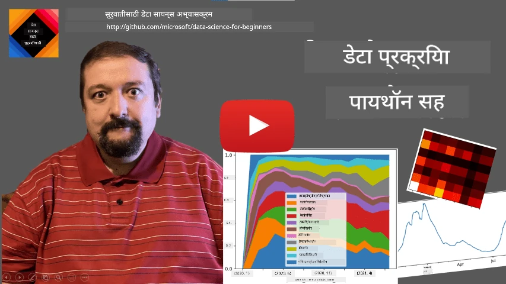
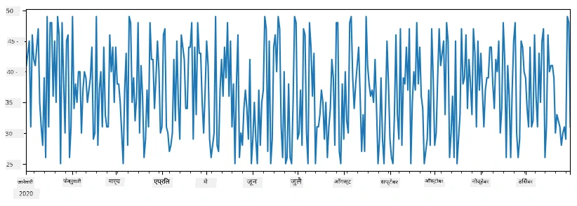
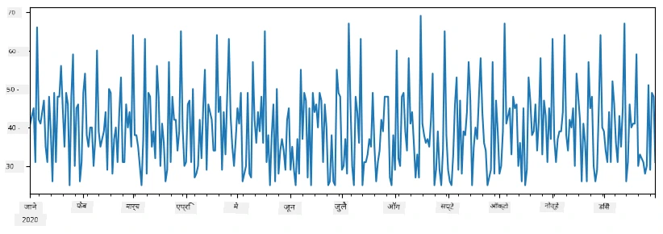
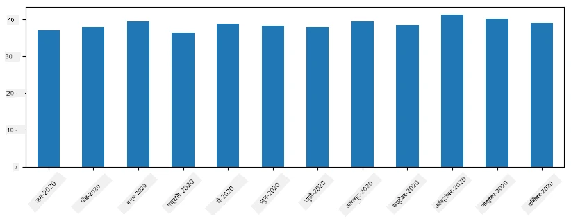
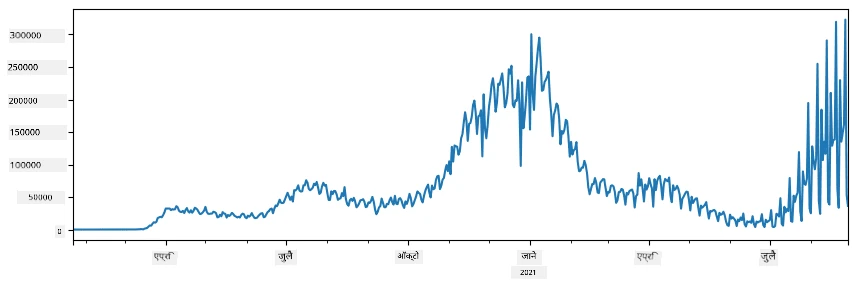
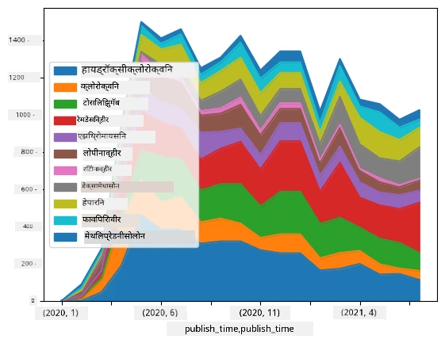

# डेटा सह काम करणे: Python आणि Pandas लायब्ररी

|  ](../../sketchnotes/07-WorkWithPython.png) |
| :-------------------------------------------------------------------------------------------------------: |
|                 Python सह काम करणे - _Sketchnote by [@nitya](https://twitter.com/nitya)_                 |

[](https://youtu.be/dZjWOGbsN4Y)

जरी डेटाबेस डेटा संग्रहित करण्यासाठी आणि क्वेरी भाषा वापरून त्यांना क्वेरी करण्याच्या खूप कार्यक्षम मार्गांना ऑफर करत असले तरी, डेटा प्रक्रिया करण्याचा सर्वात लवचिक मार्ग म्हणजे डेटा हाताळण्यासाठी आपला स्वतःचा प्रोग्राम लिहिणे. अनेक प्रकरणांमध्ये डेटाबेस क्वेरी करणे अधिक प्रभावी ठरू शकते. तथापि, जेव्हा अधिक गुंतागुंतीची डेटा प्रक्रिया आवश्यक असते, तेव्हा ती SQL वापरून सोप्या पद्धतीने होऊ शकत नाही.
डेटा प्रक्रिया कोणत्याही प्रोग्रामिंग भाषेत करता येऊ शकते, परंतु काही भाषा डेटा सह काम करताना अधिक उंच पातळीवर असतात. डेटा सायंटिस्ट सामान्यतः पुढील भाषांपैकी एक पसंत करतात:

* **[Python](https://www.python.org/)**, एक सर्वसाधारण उद्देशांची प्रोग्रामिंग भाषा, जी तिच्या सुलभतेमुळे नवशिक्यांसाठी सर्वोत्तम पर्यायांपैकी एक मानली जाते. Python मध्ये अनेक अतिरिक्त लायब्ररी आहेत ज्या आपल्याला अनेक व्यावहारिक समस्या सोडवायला मदत करतात, जसे की ZIP आर्काइवमधून डेटा काढणे किंवा चित्राला ग्रेस्केलमध्ये रूपांतर करणे. डेटा सायन्सव्यतिरिक्त, Python वेब विकासासाठी देखील वापरली जाते.
* **[R](https://www.r-project.org/)** ही एक पारंपरिक टूलबॉक्स आहे जी सांख्यिकी डेटा प्रक्रियेच्या दृष्टीने विकसित केलेली आहे. यात मोठ्या प्रमाणावर लायब्ररींसाठी संग्रह (CRAN) आहे, ज्यामुळे डेटा प्रक्रिया करण्यासाठी चांगला पर्याय आहे. परंतु, R ही एक सर्वसाधारण उद्देशांची प्रोग्रामिंग भाषा नाही, आणि डेटा सायन्सच्या क्षेत्राबाहेर कमी वापरली जाते.
* **[Julia](https://julialang.org/)** ही दुसरी भाषा आहे जी विशेषतः डेटा सायन्ससाठी विकसित केली गेली आहे. ती Python पेक्षा चांगली कार्यक्षमता देण्यासाठी उद्दिष्ट केली गेली आहे, ज्यामुळे ती वैज्ञानिक प्रयोगांसाठी एक उत्तम साधन आहे.

या धड्यात, आपण साध्या डेटा प्रक्रियेसाठी Python वापरण्यावर लक्ष केंद्रित करू. आपण भाषेबाबत मूलभूत परिचय समजल्याचे गृहीत धरू. जर आपण Python बद्दल सखोल जाणून घेऊ इच्छित असाल, तर आपण पुढील संसाधनांपैकी कोणताही वापर करू शकता:

* [तुटलेले ग्राफिक्स आणि फ्रॅक्टलसह मजेशीर पद्धतीने Python शिका](https://github.com/shwars/pycourse) - GitHub आधारित Python प्रोग्रामिंगसाठी झटपट परिचयात्मक कोर्स
* [Python सह आपले पहिले पाऊल टाका](https://docs.microsoft.com/en-us/learn/paths/python-first-steps/?WT.mc_id=academic-77958-bethanycheum) [Microsoft Learn](http://learn.microsoft.com/?WT.mc_id=academic-77958-bethanycheum) वरील शिक्षण मार्ग

डेटा अनेक प्रकारांमध्ये येऊ शकतो. या धड्यात, आपण तीन प्रकारचे डेटा पाहणार आहोत - **तक्त्याचा डेटा**, **मजकूर**, आणि **प्रतिमा**.

आम्ही डेटा प्रक्रियेची काही उदाहरणे पाहणार आहोत, सर्व संबंधित लायब्ररींचा पूर्ण आढावा देण्याऐवजी. हे आपल्याला काय शक्य आहे याची मुख्य कल्पना देईल, आणि जेव्हा आपल्याला गरज भासेल तेव्हा आपल्या समस्यांचे निराकरण कुठे शोधायचे हे समजून घेण्यात मदत करेल.

> **सर्वात उपयुक्त सल्ला**. जेव्हा आपल्याला डेटा वर विशिष्ट ऑपरेशन करायचे असते पण ते कसे करायचे माहित नसते, तेव्हा त्याचा शोध इंटरनेटवर घ्या. [Stackoverflow](https://stackoverflow.com/) मध्ये Python साठी अनेक सामान्य कार्यांसाठी उपयुक्त कोड नमुने असतात.


## [पूर्व व्याख्यान क्विझ](https://ff-quizzes.netlify.app/en/ds/quiz/12)

## तक्त्याचा डेटा आणि Dataframes

आपण रिलेशनल डेटाबेसबद्दल बोलताना तक्त्याचा डेटाचा सामना केला आहे. जेव्हा आपल्याकडे खूप डेटा असतो आणि तो अनेक वेगळ्या जोडलेल्या तक्त्यांमध्ये असतो, तेव्हा त्यावर काम करण्यासाठी SQL वापरणे निश्चितपणे योग्य ठरते. परंतु असे अनेक प्रसंग असतात जेव्हा आपल्याकडे डेटा तक्ता असतो आणि आपल्याला त्या डेटाबद्दल काही **आकलन** किंवा **अंतर्दृष्टी** प्राप्त करायची असते, जसे वितरण, मूल्यांमधील सहसंबंध, इत्यादी. डेटा सायन्समध्ये, अनेकवेळा मूळ डेटामध्ये काही रूपांतरणे करणे आवश्यक असते, त्यानंतर व्हिज्युअलायजेशन केले जाते. दोन्ही टप्पे Python वापरून सहज करता येऊ शकतात.

Python मध्ये तक्त्याचा डेटा हाताळण्यासाठी दोन सर्वात उपयुक्त लायब्ररी आहेत:
* **[Pandas](https://pandas.pydata.org/)** आपल्याला तथाकथित **Dataframes** हाताळण्याची परवानगी देते, जे relational tables प्रमाणे असतात. आपल्याला नाव दिलेल्या स्तंभांचा वापर करता येतो, आणि रांगा, स्तंभ आणि Dataframes वर विविध क्रिया केली जाऊ शकतात.
* **[Numpy](https://numpy.org/)** ही बहुआयामी **arrays** किंवा **tensors** वर काम करण्यासाठी लायब्ररी आहे. Array मध्ये सारखे प्रकारचे मूल्ये आहेत, आणि ते dataframe च्या तुलनेत सोपे आहे, पण अधिक गणितीय ऑपरेशन्स देते आणि कमी ओव्हरहेड तयार करते.

अजून काही लायब्ररीज देखील आहेत ज्यांची माहिती असणे आवश्यक आहे:
* **[Matplotlib](https://matplotlib.org/)** ही डेटा व्हिज्युअलायजेशन आणि ग्राफ काढण्यासाठी वापरली जाणारी लायब्ररी आहे
* **[SciPy](https://www.scipy.org/)** यात काही अतिरिक्त वैज्ञानिक फंक्शन्स आहेत. आपण संभाव्यता आणि सांख्यिकीवर बोलताना या लायब्ररीचा आधीच अनुभव घेतला आहे

येथे त्याचं एक कोड आहे ज्याचा वापर आपण सामान्यतः आपल्या Python प्रोग्रामच्या सुरुवातीला या लायब्ररी आयात करण्यासाठी करतो:
```python
import numpy as np
import pandas as pd
import matplotlib.pyplot as plt
from scipy import ... # आपल्याला आवश्यक असलेल्या अचूक उप-पॅकेजेस निर्दिष्ट करण्याची गरज आहे
``` 

Pandas काही मूलभूत संकल्पनाभोवती केंद्रित आहे.

### Series

**Series** म्हणजे मूल्यांची शृंखला, जी यादी किंवा numpy array सारखी असते. मुख्य फरक असा की series मध्ये एक **index** देखील असतो, आणि जेव्हा आपण series वर क्रिया करतो (उदा., त्यांना जोडणे), तेव्हा index लक्षात घेतला जातो. Index साध्या पूर्णांक रांगा क्रमांकाप्रमाणे असू शकतो (जे series तयार करताना लिस्ट किंवा array वापरल्यास डीफॉल्ट असतो), किंवा तो तारीख कालावधीसारखी गुंतागुंतीची रचना असू शकते.

> **टीप**: समवेत येणाऱ्या नोटबुकमध्ये [`notebook.ipynb`](notebook.ipynb) काही प्रारंभिक Pandas कोड आहे. येथे आपण काही उदाहरणेच संक्षेपात देतो, आणि आपण नक्कीच पूर्ण नोटबुक पाहू शकता.

एक उदाहरण विचार करूया: आपण आपल्या आईस-क्रीम दुकानाची विक्री विश्लेषण करू इच्छितो. काही काळासाठी विक्री संख्यांची (प्रत्येक दिवशी विकलेल्या वस्तूंची संख्या) series तयार करूयात:

```python
start_date = "Jan 1, 2020"
end_date = "Mar 31, 2020"
idx = pd.date_range(start_date,end_date)
print(f"Length of index is {len(idx)}")
items_sold = pd.Series(np.random.randint(25,50,size=len(idx)),index=idx)
items_sold.plot()
```


आता समजा की प्रत्येक आठवड्यात आपण मित्रांसाठी पार्टी आयोजित करतो, आणि पार्टीसाठी अतिरिक्त 10 पॅक आईस-क्रीम घेतो. आपण दुसरी series तयार करू शकतो, जी आठवड्यांनी अनुक्रमांकित असेल, आणि ती दाखवूया:
```python
additional_items = pd.Series(10,index=pd.date_range(start_date,end_date,freq="W"))
```
जेव्हा आपण दोन series एकत्र करतो, तेव्हा आपल्याला एकूण संख्या मिळते:
```python
total_items = items_sold.add(additional_items,fill_value=0)
total_items.plot()
```


> **टीप**: आपण सोप्या सिंटॅक्स `total_items+additional_items` वापरत नाही. जर तसे केले असते, तर परिणामी series मध्ये बर्‍याच `NaN` (*Not a Number*) मूल्ये प्राप्त झाली असती. याचा कारण असा की `additional_items` series मध्ये काही index points साठी मूल्ये गहाळ आहेत, आणि `NaN` मध्ये कोणतीही संख्या जोडल्यास परिणामी `NaN` येते. म्हणून जोडणी करताना `fill_value` पॅरामीटर निर्दिष्ट करणे आवश्यक आहे.

टाइम सिरीजसह, आपण वेगळ्या कालावधीने series **पुन:नमुना** (resample) देखील करू शकतो. उदाहरणार्थ, आपल्याला मासिक विक्रीचे सरासरी गणना करायची असल्यास, आपण खालील कोड वापरू शकतो:
```python
monthly = total_items.resample("1M").mean()
ax = monthly.plot(kind='bar')
```


### DataFrame

DataFrame मूलतः एकाच index सह अनेक series चा संच आहे. आपण अनेक series एकत्र करून DataFrame तयार करू शकतो:
```python
a = pd.Series(range(1,10))
b = pd.Series(["I","like","to","play","games","and","will","not","change"],index=range(0,9))
df = pd.DataFrame([a,b])
```
हे 横सरखी (horizontal) अशी एक तक्ता तयार करेल:
|     | 0   | 1    | 2   | 3   | 4      | 5   | 6      | 7    | 8    |
| --- | --- | ---- | --- | --- | ------ | --- | ------ | ---- | ---- |
| 0   | 1   | 2    | 3   | 4   | 5      | 6   | 7      | 8    | 9    |
| 1   | I   | like | to  | use | Python | and | Pandas | very | much |

आपण Series ला स्तंभ म्हणून देखील वापरू शकतो, आणि स्तंभ नावे शब्दकोशाद्वारे निर्दिष्ट करू शकतो:
```python
df = pd.DataFrame({ 'A' : a, 'B' : b })
```
हे आपल्याला अशा तक्त्याला देईल:

|     | A   | B      |
| --- | --- | ------ |
| 0   | 1   | I      |
| 1   | 2   | like   |
| 2   | 3   | to     |
| 3   | 4   | use    |
| 4   | 5   | Python |
| 5   | 6   | and    |
| 6   | 7   | Pandas |
| 7   | 8   | very   |
| 8   | 9   | much   |

**टीप:** आपण मागील तक्त्याचा लेआउट ट्रान्सपोज (transpose) करून देखील हा तक्ता मिळवू शकतो, उदा. लिहून 
```python
df = pd.DataFrame([a,b]).T.rename(columns={ 0 : 'A', 1 : 'B' })
```
 येथे `.T` म्हणजे DataFrame चे ट्रान्सपोजिंग ऑपरेशन, म्हणजे रांगा आणि स्तंभ बदलणे, आणि `rename` ऑपरेशन आपल्याला स्तंभांची नावे मागील उदाहरणाशी जुळवण्यासाठी बदलण्याची परवानगी देते.

DataFrames वर आपण काही महत्त्वाच्या ऑपरेशन्स करू शकतो:

**स्तंभ निवडणे**. आपण एकल स्तंभ निवडू शकतो `df['A']` लिहून - ही ऑपरेशन एक Series परत देते. आपण `df[['B','A']]` लिहून काही स्तंभ निवडून दुसऱ्या DataFrame मध्ये सुद्धा ठेवू शकतो - हे दुसरे DataFrame परत देते.

**विशिष्ट रांगा निवडणे निकषांनुसार.** उदाहरणार्थ, फक्त अशा रांगा ठेवण्यासाठी जिथे स्तंभ `A` चे मूल्य 5 पेक्षा जास्त आहे, आपण `df[df['A']>5]` लिहू शकतो.

> **टीप:** फिल्टर कसे कार्य करते ते खालीलप्रमाणे आहे. `df['A']<5` ही अभिव्यक्ती boolean series परत करते, जी प्रत्येक मूळ series `df['A']` मधील घटकासाठी True किंवा False दाखवते. जेव्हा boolean series ला index म्हणून वापरले जाते, तेव्हा DataFrame मध्ये त्या रांगा परत मिळतात जिथे नियम पूर्ण होतो. म्हणून कोणतीही सामान्य Python boolean अभिव्यक्ती वापरता येत नाही, उदा. `df[df['A']>5 and df['A']<7]` वापरणे चुकीचे आहे. त्याऐवजी, boolean series साठी खास `&` ऑपरेशन वापरावे, उदा. `df[(df['A']>5) & (df['A']<7)]` (*अधिक महत्त्वाचे म्हणजे कोष्ठक योग्यरित्या लावणे*).

**नवीन संगणनिय स्तंभ तयार करणे**. आपण सहजपणे DataFrame साठी नवीन संगणनिय स्तंभ तयार करू शकतो अशा सोप्या अभिव्यक्ती वापरून:
```python
df['DivA'] = df['A']-df['A'].mean() 
``` 
हे उदाहरण स्तंभ `A` च्या सरासरीपासूनची विचलन (divergence) गणना करते. प्रत्यक्षात आपण एक series तयार करत आहोत, आणि नंतर त्या series ला डाव्या बाजूला असलेल्या स्तंभाला नियुक्त करत आहोत, ज्यामुळे दुसरा स्तंभ तयार होतो. म्हणून, series सह सुसंगत नसलेल्या कोणत्याही ऑपरेशन्सचा वापर करता येत नाही, उदा. खालील कोड चुकीचा आहे:
```python
# चुकीचा कोड -> df['ADescr'] = "Low" जर df['A'] < 5 असेल तर अन्यथा "Hi"
df['LenB'] = len(df['B']) # <- चुकीचा निकाल
``` 
हा शेवटचा उदाहरण, जरी सिंटॅक्सदृष्ट्या बरोबर आहे, तेव्हा चुकीचा परिणाम देतो, कारण तो `B` series चा लांब (length) सर्व मूल्यांसाठी नियुक्त करतो, आणि व्यक्तिशः घटकाचा लांब जसा अपेक्षित होता तसा नाही.

जर संकुचित अभिव्यक्ती गणना करायच्या असतील, तर आपण `apply` फंक्शन वापरू शकतो. शेवटचं उदाहरण पुढीलप्रमाणे लिहिता येऊ शकते:
```python
df['LenB'] = df['B'].apply(lambda x : len(x))
# किंवा
df['LenB'] = df['B'].apply(len)
```

वरील ऑपरेशन्सनंतर, आपल्याकडे खालील DataFrame तयार होईल:

|     | A   | B      | DivA | LenB |
| --- | --- | ------ | ---- | ---- |
| 0   | 1   | I      | -4.0 | 1    |
| 1   | 2   | like   | -3.0 | 4    |
| 2   | 3   | to     | -2.0 | 2    |
| 3   | 4   | use    | -1.0 | 3    |
| 4   | 5   | Python | 0.0  | 6    |
| 5   | 6   | and    | 1.0  | 3    |
| 6   | 7   | Pandas | 2.0  | 6    |
| 7   | 8   | very   | 3.0  | 4    |
| 8   | 9   | much   | 4.0  | 4    |

**संख्या आधारित रांग निवडणे** `iloc` संरचना वापरून करता येते. उदाहरणार्थ, DataFrame मधून पहिला 5 रांगे निवडण्यासाठी:
```python
df.iloc[:5]
```

**गटबद्ध करणे (Grouping)** बऱ्याचदा Excel मधील *pivot tables* सारखा परिणाम मिळवण्यासाठी वापरले जाते. समजा आपल्याला प्रत्येक दिलेल्या `LenB` संख्येसाठी `A` चा सरासरी मूल्य गणना करायचा आहे. मग आपण आपला DataFrame `LenB` नुसार गटबद्ध करू शकतो आणि `mean` कॉल करू शकतो:
```python
df.groupby(by='LenB')[['A','DivA']].mean()
```
जर आपल्याला गटातील संख्या आणि सरासरी दोन्ही गटवायचे असतील, तर आपण अधिक क्लिष्ट `aggregate` फंक्शन वापरू शकतो:
```python
df.groupby(by='LenB') \
 .aggregate({ 'DivA' : len, 'A' : lambda x: x.mean() }) \
 .rename(columns={ 'DivA' : 'Count', 'A' : 'Mean'})
```
आपल्याला खालील तक्ता मिळेल:

| LenB | Count | Mean     |
| ---- | ----- | -------- |
| 1    | 1     | 1.000000 |
| 2    | 1     | 3.000000 |
| 3    | 2     | 5.000000 |
| 4    | 3     | 6.333333 |
| 6    | 2     | 6.000000 |

### डेटा मिळवणे


आपण पाहिले आहे की Python ऑब्जेक्ट्समधून Series आणि DataFrames तयार करणे किती सोपे आहे. तथापि, डेटा सहसा टेक्स्ट फाइल किंवा Excel तक्त्याच्या स्वरूपात येतो. सुदैवाने, Pandas आपल्याला डिस्कवरून डेटा लोड करण्याचा एक सोपा मार्ग प्रदान करते. उदाहरणार्थ, CSV फाइल वाचणे हे इतके सोपे आहे:
```python
df = pd.read_csv('file.csv')
```
आम्ही अधिक डेटा लोडिंगच्या उदाहरणांवर पाहू, ज्यात बाह्य वेब साइट्सहून डेटा घेणे यासुद्धा समाविष्ट आहे, "Challenge" विभागात


### छपाई आणि प्लॉटिंग

डेटा सायंटिस्टला अनेकदा डेटा शोधणे आवश्यक असते, त्यामुळे त्याचे दर्शन करणे महत्त्वाचे असते. जेव्हा DataFrame मोठा असतो, तेव्हा अनेक वेळा आपण फक्त खात्री करायची असते की आपण सर्व काही योग्यरित्या करत आहोत का, यासाठी पहिल्या काही ओळी छापणे उपयुक्त ठरते. हे `df.head()` कॉल करून करता येते. आपण Jupyter Notebook मधून हे चालवत असल्यास, ते DataFrame ला एका छान तक्त्याच्या स्वरूपात छापेल.

आपण `plot` फंक्शनचा वापर काही स्तंभांचे दर्शन करण्यासाठी कसे करतात हेही पाहिले आहे. `plot` अनेक कामांसाठी उपयुक्त आहे, आणि `kind=` पॅरामीटरद्वारे अनेक वेगवेगळ्या ग्राफ प्रकारांना समर्थन देते, परंतु आपल्याला नेहमीच मूळ `matplotlib` लायब्ररी वापरून काही अधिक जटिल प्लॉट तयार करता येतात. आपण डेटा व्हिज्युअलायझेशनचा तपशील वेगळ्या कोर्सच्या धड्यांमध्ये पाहू.

हे आढावा Pandas च्या सर्वात महत्त्वाच्या संकल्पनांचा समावेश करतो, तरीसुद्धा, ही लायब्ररी फार समृद्ध आहे, आणि तुम्ही यामध्ये काहीही करू शकता! चला आता या ज्ञानाचा उपयोग विशिष्ट समस्यांचे निराकरण करण्यासाठी करूया.

## 🚀 चॅलेंज 1: COVID फैलाव विश्लेषण

आम्ही ज्या पहिल्या समस्येवर लक्ष केंद्रित करू, ती म्हणजे COVID-19 चा साथीचा पसारा मॉडेल करणे. हे करण्यासाठी, आपण वेगवेगळ्या देशांतील संक्रमित व्यक्तींच्या संख्येवरील डेटा वापरणार आहोत, जो [Center for Systems Science and Engineering](https://systems.jhu.edu/) (CSSE) यांनी [Johns Hopkins University](https://jhu.edu/) येथे दिलेला आहे. डेटासेट [या GitHub रिपॉझिटरी](https://github.com/CSSEGISandData/COVID-19) मध्ये उपलब्ध आहे.

आपल्याला डेटा कसा हाताळायचा हे दाखवायचे आहे, त्यामुळे आपण [`notebook-covidspread.ipynb`](notebook-covidspread.ipynb) उघडून वरून खालीपर्यंत वाचावं, असा आमचा आग्रह आहे. तुम्ही सेल्स देखील चालवू शकता, आणि शेवटी आम्ही तुम्हाला दिलेल्या काही आव्हानांवर काम करू शकता.



> जर तुम्हाला Jupyter Notebook मध्ये कोड कसा चालवायचा हे माहित नसेल, तर [हा लेख](https://soshnikov.com/education/how-to-execute-notebooks-from-github/) पहा.

## असंरचित डेटासह काम करणे

जरी डेटा खूप वेळा तक्त्यासारखा असला तरी, काही प्रकरणांमध्ये आपल्याला कमी रचनेचा डेटा हाताळावा लागतो, जसे की टेक्स्ट किंवा प्रतिमा. या वेळी, वर पाहिलेल्या डेटा प्रक्रिया तंत्रांचा वापर करण्यासाठी आपल्याला रचनाबद्ध डेटा काही प्रकारे **काढून टाकावा** लागतो. येथे काही उदाहरणे आहेत:

* टेक्स्टमधून कीवर्ड्स काढणे, आणि त्या कीवर्ड्स किती वेळा दिसतात हे पाहणे
* प्रतिमेवरील वस्तूंविषयी माहिती काढण्यासाठी न्यूरल नेटवर्क्सचा वापर करणे
* व्हिडिओ कॅमेरा फीडवरील लोकांच्या भावना मिळविणे

## 🚀 चॅलेंज 2: COVID पेपर्सचे विश्लेषण

या आव्हानात, आपण COVID महामारी विषयावरचे वैज्ञानिक पेपर्स प्रक्रिया करण्यावर लक्ष केंद्रित करू. COVID वर 7000 पेक्षा जास्त (लेखनाच्या वेळी) पेपर्ससह [CORD-19 Dataset](https://www.kaggle.com/allen-institute-for-ai/CORD-19-research-challenge) उपलब्ध आहे, ज्यात मेटाडेटा आणि सारांश (आणि त्यापैकी अर्ध्यावर पूर्ण मजकूर देखील दिलेला आहे).

या डेटासेटचे विश्लेषण [Text Analytics for Health](https://docs.microsoft.com/azure/cognitive-services/text-analytics/how-tos/text-analytics-for-health/?WT.mc_id=academic-77958-bethanycheum) कॉग्निटिव्ह सेवेच्या मदतीने कसे करायचे याचे एक पूर्ण उदाहरण [या ब्लॉग पोस्ट](https://soshnikov.com/science/analyzing-medical-papers-with-azure-and-text-analytics-for-health/) मध्ये दिले आहे. आपण या विश्लेषणाचा साधा प्रकार स्वतः पाहू.

> **टीप**: आम्ही या रिपॉझिटरीचा भाग म्हणून डेटासेटची प्रती देत नाही. कदाचित तुम्हाला प्रथम [`metadata.csv`](https://www.kaggle.com/allen-institute-for-ai/CORD-19-research-challenge?select=metadata.csv) हा फाइल [Kaggle वरील या डेटासेटवरून](https://www.kaggle.com/allen-institute-for-ai/CORD-19-research-challenge) डाउनलोड करावा लागेल. Kaggle वर नोंदणी आवश्यक असू शकते. तुम्ही नोंदणी न करता [येथे](https://ai2-semanticscholar-cord-19.s3-us-west-2.amazonaws.com/historical_releases.html) डेटासेट डाउनलोड करू शकता, परंतु त्यामध्ये मेटाडेटा फाइलसह सर्व पूर्ण मजकूर देखील असेल.

[`notebook-papers.ipynb`](notebook-papers.ipynb) उघडा आणि वरून खालीपर्यंत वाचा. तुम्ही सेल्स चालवू शकता, आणि शेवटी आम्ही तुम्हाला दिलेल्या काही आव्हानांवर काम करू शकता.



## प्रतिमा डेटाचे प्रक्रिया करणे

अलीकडे, फार शक्तिशाली AI मॉडेल्स विकसित झाले आहेत जे प्रतिमा समजून घेण्यास मदत करतात. अनेक कामे पूर्व-प्रशिक्षित न्यूरल नेटवर्क्स किंवा क्लाउड सेवा वापरून सोडवता येतात. काही उदाहरणे यप्रमाणे आहेत:

* **प्रतिमा वर्गीकरण**, जे तुम्हाला प्रतिमा पूर्व-निर्धारित वर्गांपैकी एका वर्गात विभागण्यास मदत करते. तुम्ही स्वतःचे प्रतिमा वर्गीकरण करणारे मॉडेल [Custom Vision](https://azure.microsoft.com/services/cognitive-services/custom-vision-service/?WT.mc_id=academic-77958-bethanycheum) सारख्या सेवांचा वापर करून सहज प्रशिक्षित करू शकता
* **वस्तू शोध**, प्रतिमेमध्ये वेगवेगळ्या वस्तू शोधण्यासाठी. [computer vision](https://azure.microsoft.com/services/cognitive-services/computer-vision/?WT.mc_id=academic-77958-bethanycheum) सारख्या सेवा अनेक सामान्य वस्तू शोधू शकतात, आणि तुम्ही विशिष्ट आवडीच्या वस्तू शोधण्यासाठी [Custom Vision](https://azure.microsoft.com/services/cognitive-services/custom-vision-service/?WT.mc_id=academic-77958-bethanycheum) मॉडेल प्रशिक्षित करू शकता.
* **चेहरा ओळखणे**, त्यात वय, लिंग आणि भावना ओळखणे. हे [Face API](https://azure.microsoft.com/services/cognitive-services/face/?WT.mc_id=academic-77958-bethanycheum) वापरून करता येते.

या सर्व क्लाउड सेवा [Python SDKs](https://docs.microsoft.com/samples/azure-samples/cognitive-services-python-sdk-samples/cognitive-services-python-sdk-samples/?WT.mc_id=academic-77958-bethanycheum) वापरून कॉल केल्या जाऊ शकतात, त्यामुळे ते सहजपणे तुमच्या डेटा एक्सप्लोरेशन कार्यप्रवाहात समाकलित करता येऊ शकतात.

येथे प्रतिमा डेटास्रोतांमधील डेटा एक्सप्लोर करण्याची काही उदाहरणे आहेत:
* ब्लॉग पोस्ट [How to Learn Data Science without Coding](https://soshnikov.com/azure/how-to-learn-data-science-without-coding/) मध्ये आम्ही Instagram फोटोंचा अभ्यास करतो, समजून घेण्यासाठी की लोक फोटोला जास्त लाईक्स का देतात. आम्ही प्रथम [computer vision](https://azure.microsoft.com/services/cognitive-services/computer-vision/?WT.mc_id=academic-77958-bethanycheum) वापरून शक्य तितकी माहिती फोटोंमधून काढतो, आणि मग [Azure Machine Learning AutoML](https://docs.microsoft.com/azure/machine-learning/concept-automated-ml/?WT.mc_id=academic-77958-bethanycheum) वापरून अर्थ लावू शकणारे मॉडेल तयार करतो.
* [Facial Studies Workshop](https://github.com/CloudAdvocacy/FaceStudies) मध्ये आम्ही [Face API](https://azure.microsoft.com/services/cognitive-services/face/?WT.mc_id=academic-77958-bethanycheum) वापरून कार्यक्रमांतील लोकांच्या फोटोमधील भावना काढतो, समजून घेण्यासाठी की लोकांना काय आनंदी करते.

## निष्कर्ष

तुम्ही आधीपासूनच रचनाबद्ध किंवा असंरचित डेटा वापरत असाल, Python वापरून तुम्ही डेटा प्रक्रिया आणि समज यासंबंधी सर्व टप्पे पार पाडू शकता. बहुधा, डेटा प्रक्रिया करण्याचा हा सर्वात लवचीक मार्ग आहे, आणि हेच कारण आहे की बहुतेक डेटा सायंटिस्ट्स Python त्यांचे प्राथमिक साधन म्हणून वापरतात. तुमच्या डेटा सायन्स प्रवासात गंभीर असाल तर Python मध्ये सखोल शिक्षण घेणे चांगले ठरेल!

## [पोस्ट-लेक्चर क्विझ](https://ff-quizzes.netlify.app/en/ds/quiz/13)

## समीक्षा आणि स्वतःचा अभ्यास

**पुस्तके**
* [Wes McKinney. Python for Data Analysis: Data Wrangling with Pandas, NumPy, and IPython](https://www.amazon.com/gp/product/1491957662)

**ऑनलाइन स्त्रोत**
* अधिकृत [10 minutes to Pandas](https://pandas.pydata.org/pandas-docs/stable/user_guide/10min.html) ट्युटोरियल
* [Pandas Visualization वर दस्तऐवज](https://pandas.pydata.org/pandas-docs/stable/user_guide/visualization.html)

**Python शिकणे**
* [Turtle Graphics आणि Fractals सह मजेशीर पद्धतीने Python शिकणे](https://github.com/shwars/pycourse)
* [Python मध्ये पहिले पाऊल उचला](https://docs.microsoft.com/learn/paths/python-first-steps/?WT.mc_id=academic-77958-bethanycheum) लर्निंग पथ [Microsoft Learn](http://learn.microsoft.com/?WT.mc_id=academic-77958-bethanycheum) वर

## असाइनमेंट

[वरील आव्हानांसाठी अधिक तपशीलवार डेटा अभ्यास करा](assignment.md)

## क्रेडिट्स

हा धडा ♥️ [Dmitry Soshnikov](http://soshnikov.com) यांनी लिहिला आहे

---

<!-- CO-OP TRANSLATOR DISCLAIMER START -->
**अस्वीकरण**:
हा दस्तऐवज AI भाषांतर सेवा [Co-op Translator](https://github.com/Azure/co-op-translator) चा वापर करून अनुवादित केला आहे. जरी आम्ही अचूकतेसाठी प्रयत्न करतो, तरी कृपया लक्षात घ्या की स्वयंचलित भाषांतरांमध्ये त्रुटी किंवा अचूकतेची कमतरता असू शकते. मूळ दस्तऐवज त्याच्या मूळ भाषेत अधिकृत स्रोत मानला पाहिजे. महत्त्वाची माहिती असल्यास, व्यावसायिक मानवी भाषांतराची शिफारस केली जाते. या भाषांतराच्या वापरामुळे उद्भवणाऱ्या कोणत्याही गैरसमज किंवा चुकीच्या अर्थलावणीसाठी आम्ही जबाबदार नाही.
<!-- CO-OP TRANSLATOR DISCLAIMER END -->