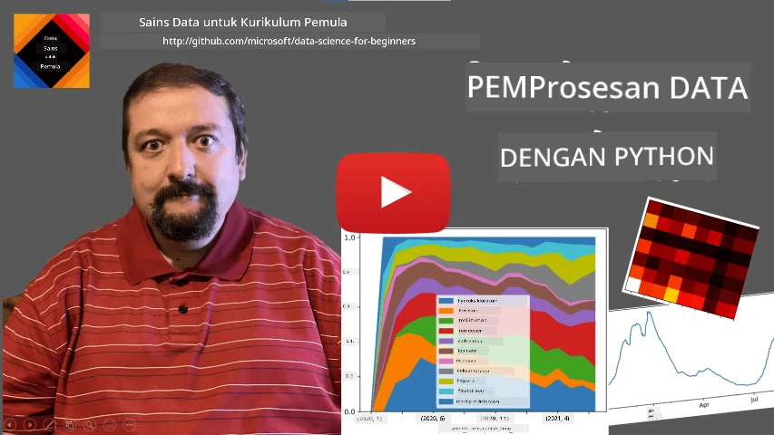
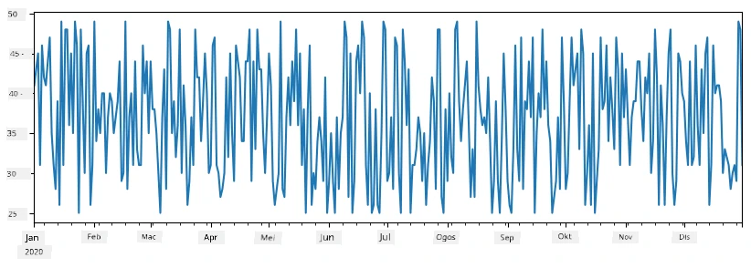
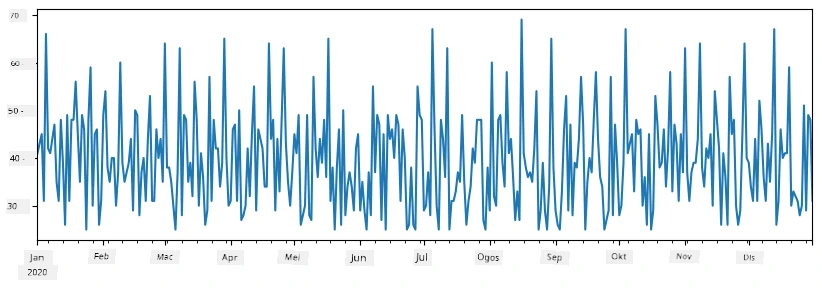
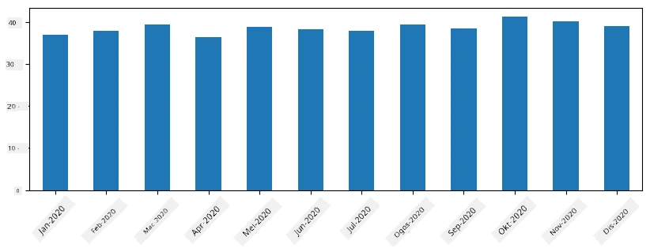

# Bekerja dengan Data: Python dan Perpustakaan Pandas

|  ](../../sketchnotes/07-WorkWithPython.png) |
| :-------------------------------------------------------------------------------------------------------: |
|                 Bekerja Dengan Python - _Sketchnote oleh [@nitya](https://twitter.com/nitya)_                 |

[](https://youtu.be/dZjWOGbsN4Y)

Walaupun pangkalan data menawarkan cara yang sangat cekap untuk menyimpan data dan membuat pertanyaan menggunakan bahasa pertanyaan, cara paling fleksibel untuk pemprosesan data adalah menulis program anda sendiri untuk memanipulasi data. Dalam banyak kes, melakukan pertanyaan pangkalan data adalah cara yang lebih berkesan. Namun dalam beberapa kes apabila pemprosesan data yang lebih kompleks diperlukan, ia tidak boleh dilakukan dengan mudah menggunakan SQL.
Pemprosesan data boleh diprogram dalam mana-mana bahasa pengaturcaraan, tetapi terdapat bahasa tertentu yang lebih tinggi tahapnya dalam hal bekerja dengan data. Ahli sains data biasanya memilih salah satu daripada bahasa berikut:

* **[Python](https://www.python.org/)**, bahasa pengaturcaraan tujuan umum, yang sering dianggap sebagai salah satu pilihan terbaik untuk pemula kerana kesederhanaannya. Python mempunyai banyak perpustakaan tambahan yang boleh membantu anda menyelesaikan banyak masalah praktikal, seperti mengekstrak data anda daripada arkib ZIP, atau menukar gambar ke skala kelabu. Selain sains data, Python juga sering digunakan untuk pembangunan web.
* **[R](https://www.r-project.org/)** adalah kotak alat tradisional yang dibangunkan dengan pemprosesan data statistik dalam fikiran. Ia juga mengandungi repositori besar perpustakaan (CRAN), menjadikannya pilihan yang baik untuk pemprosesan data. Namun, R bukan bahasa pengaturcaraan tujuan umum, dan jarang digunakan di luar domain sains data.
* **[Julia](https://julialang.org/)** adalah bahasa lain yang dibangunkan khusus untuk sains data. Ia bertujuan memberikan prestasi yang lebih baik daripada Python, menjadikannya alat hebat untuk eksperimen saintifik.

Dalam pelajaran ini, kita akan fokus menggunakan Python untuk pemprosesan data yang mudah. Kami akan menganggap anda mempunyai kefahaman asas tentang bahasa ini. Jika anda mahukan pengenalan lebih mendalam tentang Python, anda boleh merujuk salah satu daripada sumber berikut:

* [Belajar Python dengan Cara yang Menyeronokkan menggunakan Grafik Turtle dan Fraktal](https://github.com/shwars/pycourse) - Kursus pengenalan pantas berbasis GitHub ke Pengaturcaraan Python
* [Ambil Langkah Pertama Anda dengan Python](https://docs.microsoft.com/en-us/learn/paths/python-first-steps/?WT.mc_id=academic-77958-bethanycheum) Laluan Pembelajaran di [Microsoft Learn](http://learn.microsoft.com/?WT.mc_id=academic-77958-bethanycheum)

Data boleh datang dalam pelbagai bentuk. Dalam pelajaran ini, kita akan membincangkan tiga bentuk data - **data tabular**, **teks** dan **imej**.

Kita akan fokus pada beberapa contoh pemprosesan data, daripada memberikan gambaran penuh tentang semua perpustakaan berkaitan. Ini membolehkan anda memahami idea utama tentang apa yang mungkin dilakukan, dan memberikan kefahaman tentang di mana mencari penyelesaian untuk masalah anda apabila diperlukan.

> **Nasihat yang paling berguna**. Apabila anda perlu melakukan operasi tertentu pada data yang anda tidak tahu caranya, cuba cari di internet. [Stackoverflow](https://stackoverflow.com/) biasanya mengandungi banyak contoh kod berguna dalam Python untuk banyak tugas tipikal.


## [Kuiz Pra-ceramah](https://ff-quizzes.netlify.app/en/ds/quiz/12)

## Data Tabular dan Dataframe

Anda sudah pernah bertemu data tabular apabila kita membincangkan pangkalan data berhubung. Apabila anda mempunyai banyak data, dan ia terkandung dalam banyak jadual berhubung yang berbeza, memang masuk akal menggunakan SQL untuk bekerja dengannya. Namun, terdapat banyak kes apabila kita mempunyai jadual data, dan kita perlu mendapatkan **pemahaman** atau **insight** tentang data ini, seperti taburan, korelasi antara nilai, dan sebagainya. Dalam sains data, terdapat banyak kes apabila kita perlu melakukan beberapa transformasi data asal, diikuti dengan visualisasi. Kedua-dua langkah ini boleh dilakukan dengan mudah menggunakan Python.

Terdapat dua perpustakaan yang paling berguna dalam Python yang boleh membantu anda mengendalikan data tabular:
* **[Pandas](https://pandas.pydata.org/)** membolehkan anda memanipulasi yang dikenali sebagai **Dataframes**, yang serupa dengan jadual berhubung. Anda boleh mempunyai lajur bernama, dan melakukan operasi berbeza ke atas baris, lajur dan dataframe secara umum.
* **[Numpy](https://numpy.org/)** adalah perpustakaan untuk bekerja dengan **tensor**, iaitu **array** berbilang dimensi. Array mempunyai nilai jenis asas yang sama, dan ia lebih mudah daripada dataframe, tetapi menawarkan lebih banyak operasi matematik, dan menghasilkan overhead yang lebih rendah.

Terdapat juga beberapa perpustakaan lain yang anda perlu tahu:
* **[Matplotlib](https://matplotlib.org/)** adalah perpustakaan yang digunakan untuk visualisasi data dan melukis graf
* **[SciPy](https://www.scipy.org/)** adalah perpustakaan dengan beberapa fungsi saintifik tambahan. Kami sudah pernah bertemu perpustakaan ini ketika membincangkan kebarangkalian dan statistik

Berikut adalah sebahagian kod yang biasanya anda gunakan untuk mengimport perpustakaan tersebut pada awal program Python anda:
```python
import numpy as np
import pandas as pd
import matplotlib.pyplot as plt
from scipy import ... # anda perlu menyatakan sub-pakej yang tepat yang anda perlukan
``` 

Pandas tertumpu pada beberapa konsep asas.

### Siri

**Siri** adalah deretan nilai, serupa dengan senarai atau array numpy. Perbezaan utama ialah siri juga mempunyai **indeks**, dan apabila kita melakukan operasi ke atas siri (contohnya, menambahnya), indeks diambil kira. Indeks boleh sesederhana nombor baris integer (ia adalah indeks yang digunakan secara lalai ketika membuat siri dari senarai atau array), atau boleh mempunyai struktur kompleks, seperti julat tarikh.

> **Nota**: Terdapat beberapa kod pengenalan Pandas dalam buku nota yang disertakan [`notebook.ipynb`](notebook.ipynb). Kami hanya menggariskan beberapa contoh di sini, dan anda tentunya dialu-alukan untuk melihat buku nota penuh.

Pertimbangkan contoh: kami mahu menganalisis jualan kedai aiskrim kami. Mari kita jana siri nombor jualan (bilangan item yang dijual setiap hari) untuk suatu tempoh masa:

```python
start_date = "Jan 1, 2020"
end_date = "Mar 31, 2020"
idx = pd.date_range(start_date,end_date)
print(f"Length of index is {len(idx)}")
items_sold = pd.Series(np.random.randint(25,50,size=len(idx)),index=idx)
items_sold.plot()
```


Sekarang anggap bahawa setiap minggu kami mengadakan pesta untuk rakan-rakan, dan kami mengambil tambahan 10 pek aiskrim untuk pesta tersebut. Kita boleh buat seri lain, yang diindekskan mengikut minggu, untuk menunjukkan itu:
```python
additional_items = pd.Series(10,index=pd.date_range(start_date,end_date,freq="W"))
```
Apabila kita tambah dua siri bersama, kita dapat jumlah keseluruhan:
```python
total_items = items_sold.add(additional_items,fill_value=0)
total_items.plot()
```


> **Nota** bahawa kami tidak menggunakan sintaks mudah `total_items+additional_items`. Jika kami melakukannya, kami akan mendapat banyak nilai `NaN` (*Bukan Nombor*) dalam siri hasil. Ini kerana terdapat nilai hilang untuk beberapa titik indeks dalam siri `additional_items`, dan menambahkan `NaN` kepada apa sahaja menghasilkan `NaN`. Oleh itu kita perlu menentukan parameter `fill_value` semasa penambahan.

Dengan siri masa, kita juga boleh **resample** siri itu dengan selang masa yang berbeza. Contohnya, andaikan kita mahu mengira purata volum jualan bulanan. Kita boleh menggunakan kod berikut:
```python
monthly = total_items.resample("1M").mean()
ax = monthly.plot(kind='bar')
```


### DataFrame

DataFrame pada asasnya adalah koleksi siri dengan indeks yang sama. Kita boleh menggabungkan beberapa siri menjadi DataFrame:
```python
a = pd.Series(range(1,10))
b = pd.Series(["I","like","to","play","games","and","will","not","change"],index=range(0,9))
df = pd.DataFrame([a,b])
```
Ini akan menghasilkan jadual mendatar seperti ini:
|     | 0   | 1    | 2   | 3   | 4      | 5   | 6      | 7    | 8    |
| --- | --- | ---- | --- | --- | ------ | --- | ------ | ---- | ---- |
| 0   | 1   | 2    | 3   | 4   | 5      | 6   | 7      | 8    | 9    |
| 1   | I   | suka | untuk | guna | Python | dan | Pandas | sangat | banyak |

Kita juga boleh menggunakan Siri sebagai lajur, dan menentukan nama lajur menggunakan kamus:
```python
df = pd.DataFrame({ 'A' : a, 'B' : b })
```
Ini akan memberikan kita jadual seperti ini:

|     | A   | B      |
| --- | --- | ------ |
| 0   | 1   | Saya   |
| 1   | 2   | suka   |
| 2   | 3   | untuk  |
| 3   | 4   | guna   |
| 4   | 5   | Python |
| 5   | 6   | dan    |
| 6   | 7   | Pandas |
| 7   | 8   | sangat |
| 8   | 9   | banyak |

**Nota** bahawa kita juga boleh mendapatkan susun atur jadual ini dengan transposisi jadual sebelumnya, contohnya dengan menulis 
```python
df = pd.DataFrame([a,b]).T.rename(columns={ 0 : 'A', 1 : 'B' })
```
Di sini `.T` bermaksud operasi transpose DataFrame, iaitu menukar baris dan lajur, dan operasi `rename` membolehkan kita menamakan semula lajur untuk memadankan contoh sebelumnya.

Berikut adalah beberapa operasi paling penting yang boleh kita lakukan pada DataFrames:

**Pemilihan lajur**. Kita boleh memilih lajur individu dengan menulis `df['A']` - operasi ini mengembalikan Siri. Kita juga boleh memilih subset lajur ke DataFrame lain dengan menulis `df[['B','A']]` - ini mengembalikan DataFrame lain.

**Penapisan** hanya baris tertentu melalui kriteria. Contohnya, untuk meninggalkan hanya baris dengan lajur `A` lebih besar dari 5, kita boleh menulis `df[df['A']>5]`.

> **Nota**: Cara penapisan berfungsi adalah seperti berikut. Ekspresi `df['A']<5` mengembalikan siri boolean, yang menunjukkan sama ada ekspresi adalah `True` atau `False` untuk setiap elemen siri asal `df['A']`. Apabila siri boolean digunakan sebagai indeks, ia mengembalikan subset baris dalam DataFrame. Oleh itu, tidak boleh menggunakan ekspresi boolean Python sewenang-wenangnya, contohnya, menulis `df[df['A']>5 and df['A']<7]` adalah salah. Sebaliknya, anda harus menggunakan operasi khas `&` pada siri boolean, menulis `df[(df['A']>5) & (df['A']<7)]` (*kurungan penting di sini*).

**Mencipta lajur baru yang boleh dikira**. Kita boleh dengan mudah mencipta lajur baru yang boleh dikira bagi DataFrame kita dengan menggunakan ekspresi intuitif seperti ini:
```python
df['DivA'] = df['A']-df['A'].mean() 
``` 
Contoh ini mengira divergence A dari nilai puratanya. Apa yang sebenarnya berlaku ialah kita mengira siri, dan kemudian menetapkan siri ini ke sebelah kiri, mewujudkan lajur lain. Oleh itu, kita tidak boleh menggunakan operasi yang tidak serasi dengan siri, contohnya, kod di bawah adalah salah:
```python
# Kod salah -> df['ADescr'] = "Low" jika df['A'] < 5 jika tidak "Hi"
df['LenB'] = len(df['B']) # <- Keputusan salah
``` 
Contoh terakhir, walaupun secara sintaksis betul, memberikan hasil salah, kerana ia menetapkan panjang siri `B` ke semua nilai dalam lajur, dan bukan panjang elemen individu seperti yang dimaksudkan.

Jika kita perlu mengira ekspresi yang kompleks seperti ini, kita boleh menggunakan fungsi `apply`. Contoh terakhir boleh ditulis seperti berikut:
```python
df['LenB'] = df['B'].apply(lambda x : len(x))
# atau
df['LenB'] = df['B'].apply(len)
```

Selepas operasi di atas, kita akan mendapat DataFrame berikut:

|     | A   | B      | DivA | LenB |
| --- | --- | ------ | ---- | ---- |
| 0   | 1   | Saya   | -4.0 | 1    |
| 1   | 2   | suka   | -3.0 | 4    |
| 2   | 3   | untuk  | -2.0 | 2    |
| 3   | 4   | guna   | -1.0 | 3    |
| 4   | 5   | Python | 0.0  | 6    |
| 5   | 6   | dan    | 1.0  | 3    |
| 6   | 7   | Pandas | 2.0  | 6    |
| 7   | 8   | sangat | 3.0  | 4    |
| 8   | 9   | banyak | 4.0  | 4    |

**Memilih baris berdasarkan nombor** boleh dilakukan menggunakan konstruk `iloc`. Contohnya, untuk memilih 5 baris pertama dari DataFrame:
```python
df.iloc[:5]
```

**Pengelompokan** sering digunakan untuk mendapatkan hasil yang serupa dengan *pivot tables* dalam Excel. Andaikan kita mahu mengira nilai purata lajur `A` untuk setiap bilangan tertentu `LenB`. Kemudian kita boleh mengelompokkan DataFrame kita berdasarkan `LenB`, dan memanggil `mean`:
```python
df.groupby(by='LenB')[['A','DivA']].mean()
```
Jika kita perlu mengira purata dan bilangan elemen dalam kumpulan, maka kita boleh menggunakan fungsi `aggregate` yang lebih kompleks:
```python
df.groupby(by='LenB') \
 .aggregate({ 'DivA' : len, 'A' : lambda x: x.mean() }) \
 .rename(columns={ 'DivA' : 'Count', 'A' : 'Mean'})
```
Ini memberikan kita jadual berikut:

| LenB | Count | Mean     |
| ---- | ----- | -------- |
| 1    | 1     | 1.000000 |
| 2    | 1     | 3.000000 |
| 3    | 2     | 5.000000 |
| 4    | 3     | 6.333333 |
| 6    | 2     | 6.000000 |

### Mendapatkan Data


Kita telah melihat betapa mudahnya untuk membina Siri dan DataFrames daripada objek Python. Walau bagaimanapun, data biasanya datang dalam bentuk fail teks, atau jadual Excel. Mujurlah, Pandas menawarkan cara mudah untuk memuatkan data dari cakera. Sebagai contoh, membaca fail CSV adalah semudah ini:
```python
df = pd.read_csv('file.csv')
```
Kita akan melihat lebih banyak contoh pemuatan data, termasuk pengambilan daripada laman web luaran, dalam bahagian "Cabaran"


### Mencetak dan Melukis

Seorang Saintis Data selalunya perlu meneroka data, jadi adalah penting untuk dapat memvisualisasikannya. Apabila DataFrame besar, sering kali kita hanya mahu memastikan segala-galanya dilakukan dengan betul dengan mencetak beberapa baris pertama. Ini boleh dilakukan dengan memanggil `df.head()`. Jika anda menjalankannya dari Jupyter Notebook, ia akan mencetak DataFrame dalam bentuk jadual yang kemas.

Kita juga telah melihat penggunaan fungsi `plot` untuk memvisualisasikan beberapa lajur. Walaupun `plot` sangat berguna untuk banyak tugas, dan menyokong banyak jenis graf yang berbeza melalui parameter `kind=`, anda sentiasa boleh menggunakan perpustakaan `matplotlib` mentah untuk melukis sesuatu yang lebih kompleks. Kita akan membincangkan visualisasi data dengan lebih terperinci dalam pelajaran kursus yang berasingan.

Gambaran keseluruhan ini merangkumi konsep paling penting Pandas, tetapi, perpustakaan ini sangat kaya, dan tiada had untuk apa yang anda boleh lakukan dengannya! Mari kita gunakan pengetahuan ini untuk menyelesaikan masalah tertentu.

## 🚀 Cabaran 1: Menganalisis Penyebaran COVID

Masalah pertama yang akan kita fokuskan adalah pemodelan penyebaran wabak COVID-19. Untuk melakukan itu, kita akan menggunakan data mengenai bilangan individu yang dijangkiti di negara-negara berbeza, disediakan oleh [Pusat Sains dan Kejuruteraan Sistem](https://systems.jhu.edu/) (CSSE) di [Universiti Johns Hopkins](https://jhu.edu/). Set data tersedia di [Repositori GitHub ini](https://github.com/CSSEGISandData/COVID-19).

Oleh kerana kita mahu demonstrasi cara mengendalikan data, kami menjemput anda untuk membuka [`notebook-covidspread.ipynb`](notebook-covidspread.ipynb) dan membacanya dari atas ke bawah. Anda juga boleh menjalankan sel, dan melakukan beberapa cabaran yang kami tinggalkan untuk anda di akhir.


> Jika anda tidak tahu cara menjalankan kod dalam Jupyter Notebook, lihat [artikel ini](https://soshnikov.com/education/how-to-execute-notebooks-from-github/).

## Bekerja dengan Data Tidak Berstruktur

Walaupun data sangat kerap datang dalam bentuk jadual, dalam beberapa kes kita perlu menangani data kurang terstruktur, contohnya, teks atau imej. Dalam kes ini, untuk menggunakan teknik pemprosesan data yang telah kita lihat di atas, kita perlu **mengeluarkan** data berstruktur. Berikut adalah beberapa contoh:

* Mengekstrak kata kunci daripada teks, dan melihat berapa kerap kata kunci tersebut muncul
* Menggunakan rangkaian neural untuk mengekstrak maklumat tentang objek dalam gambar
* Mendapatkan maklumat tentang emosi orang dalam rakaman kamera video

## 🚀 Cabaran 2: Menganalisis Kertas COVID

Dalam cabaran ini, kita akan meneruskan topik pandemik COVID, dan fokus pada pemprosesan kertas saintifik mengenai subjek tersebut. Terdapat [Set Data CORD-19](https://www.kaggle.com/allen-institute-for-ai/CORD-19-research-challenge) dengan lebih daripada 7000 (ketika penulisan) kertas mengenai COVID, tersedia dengan metadata dan abstrak (dan untuk kira-kira separuh daripadanya juga disediakan teks penuh).

Contoh penuh menganalisis set data ini menggunakan perkhidmatan kognitif [Analitis Teks untuk Kesihatan](https://docs.microsoft.com/azure/cognitive-services/text-analytics/how-tos/text-analytics-for-health/?WT.mc_id=academic-77958-bethanycheum) diterangkan [dalam pos blog ini](https://soshnikov.com/science/analyzing-medical-papers-with-azure-and-text-analytics-for-health/). Kita akan membincangkan versi ringkas analisis ini.

> **CATATAN**: Kami tidak menyediakan salinan set data ini sebagai sebahagian daripada repositori ini. Anda mungkin perlu memuat turun terlebih dahulu fail [`metadata.csv`](https://www.kaggle.com/allen-institute-for-ai/CORD-19-research-challenge?select=metadata.csv) dari [set data ini di Kaggle](https://www.kaggle.com/allen-institute-for-ai/CORD-19-research-challenge). Pendaftaran dengan Kaggle mungkin diperlukan. Anda juga boleh memuat turun set data tanpa pendaftaran [di sini](https://ai2-semanticscholar-cord-19.s3-us-west-2.amazonaws.com/historical_releases.html), tetapi ia akan termasuk semua teks penuh selain fail metadata.

Buka [`notebook-papers.ipynb`](notebook-papers.ipynb) dan bacalah dari atas ke bawah. Anda juga boleh menjalankan sel, dan melakukan beberapa cabaran yang kami tinggalkan untuk anda di akhir.


## Memproses Data Imej

Baru-baru ini, model AI yang sangat berkuasa telah dibangunkan yang membolehkan kita memahami imej. Terdapat banyak tugas yang boleh diselesaikan menggunakan rangkaian neural yang telah dilatih, atau perkhidmatan awan. Beberapa contoh termasuk:

* **Klasifikasi Imej**, yang boleh membantu anda mengkategorikan imej ke dalam salah satu kelas yang telah ditetapkan. Anda boleh melatih pengelasan imej anda sendiri dengan mudah menggunakan perkhidmatan seperti [Custom Vision](https://azure.microsoft.com/services/cognitive-services/custom-vision-service/?WT.mc_id=academic-77958-bethanycheum)
* **Pengesanan Objek** untuk mengesan objek berbeza dalam imej. Perkhidmatan seperti [computer vision](https://azure.microsoft.com/services/cognitive-services/computer-vision/?WT.mc_id=academic-77958-bethanycheum) boleh mengesan beberapa objek biasa, dan anda boleh melatih model [Custom Vision](https://azure.microsoft.com/services/cognitive-services/custom-vision-service/?WT.mc_id=academic-77958-bethanycheum) untuk mengesan beberapa objek khusus yang diminati.
* **Pengesanan Wajah**, termasuk pengesanan Umur, Jantina dan Emosi. Ini boleh dilakukan melalui [Face API](https://azure.microsoft.com/services/cognitive-services/face/?WT.mc_id=academic-77958-bethanycheum).

Semua perkhidmatan awan ini boleh dipanggil menggunakan [Python SDKs](https://docs.microsoft.com/samples/azure-samples/cognitive-services-python-sdk-samples/cognitive-services-python-sdk-samples/?WT.mc_id=academic-77958-bethanycheum), dan oleh itu boleh dengan mudah dimasukkan ke dalam aliran kerja penerokaan data anda.

Berikut adalah beberapa contoh penerokaan data dari sumber data Imej:
* Dalam pos blog [How to Learn Data Science without Coding](https://soshnikov.com/azure/how-to-learn-data-science-without-coding/) kita meneroka foto Instagram, cuba memahami apa yang membuatkan orang memberi lebih banyak suka kepada satu foto. Kita mula-mula mengekstrak sebanyak mungkin maklumat dari gambar menggunakan [computer vision](https://azure.microsoft.com/services/cognitive-services/computer-vision/?WT.mc_id=academic-77958-bethanycheum), dan kemudian menggunakan [Azure Machine Learning AutoML](https://docs.microsoft.com/azure/machine-learning/concept-automated-ml/?WT.mc_id=academic-77958-bethanycheum) untuk membina model yang boleh diterangkan.
* Dalam [Facial Studies Workshop](https://github.com/CloudAdvocacy/FaceStudies) kita menggunakan [Face API](https://azure.microsoft.com/services/cognitive-services/face/?WT.mc_id=academic-77958-bethanycheum) untuk mengekstrak emosi pada orang dalam gambar daripada acara, dengan tujuan untuk cuba memahami apa yang membuatkan orang gembira.

## Kesimpulan

Sama ada anda sudah mempunyai data berstruktur atau tidak berstruktur, menggunakan Python anda boleh melakukan semua langkah yang berkaitan dengan pemprosesan dan pemahaman data. Ia mungkin cara paling fleksibel untuk pemprosesan data, dan itulah sebab mengapa majoriti saintis data menggunakan Python sebagai alat utama mereka. Mempelajari Python dengan mendalam adalah idea yang baik jika anda serius dengan perjalanan sains data anda!

## [Kuiz pasca kuliah](https://ff-quizzes.netlify.app/en/ds/quiz/13)

## Ulasan & Belajar Sendiri

**Buku**
* [Wes McKinney. Python for Data Analysis: Data Wrangling with Pandas, NumPy, and IPython](https://www.amazon.com/gp/product/1491957662)

**Sumber Dalam Talian**
* Tutorial rasmi [10 minit ke Pandas](https://pandas.pydata.org/pandas-docs/stable/user_guide/10min.html)
* [Dokumentasi Visualisasi Pandas](https://pandas.pydata.org/pandas-docs/stable/user_guide/visualization.html)

**Belajar Python**
* [Belajar Python dengan cara yang menyeronokkan menggunakan Grafik Turtle dan Fraktal](https://github.com/shwars/pycourse)
* [Ambil Langkah Pertama Anda dengan Python](https://docs.microsoft.com/learn/paths/python-first-steps/?WT.mc_id=academic-77958-bethanycheum) Laluan Pembelajaran di [Microsoft Learn](http://learn.microsoft.com/?WT.mc_id=academic-77958-bethanycheum)

## Tugasan

[Lakukan kajian data yang lebih terperinci untuk cabaran di atas](assignment.md)

## Kredit

Pelajaran ini telah ditulis dengan ♥️ oleh [Dmitry Soshnikov](http://soshnikov.com)

---

<!-- CO-OP TRANSLATOR DISCLAIMER START -->
**Penafian**:
Dokumen ini telah diterjemahkan menggunakan perkhidmatan terjemahan AI [Co-op Translator](https://github.com/Azure/co-op-translator). Walaupun kami berusaha untuk ketepatan, sila ambil maklum bahawa terjemahan automatik mungkin mengandungi kesilapan atau ketidaktepatan. Dokumen asal dalam bahasa asalnya harus dianggap sebagai sumber yang sahih. Untuk maklumat penting, terjemahan oleh manusia profesional adalah disyorkan. Kami tidak bertanggungjawab terhadap sebarang salah faham atau salah tafsir yang timbul daripada penggunaan terjemahan ini.
<!-- CO-OP TRANSLATOR DISCLAIMER END -->