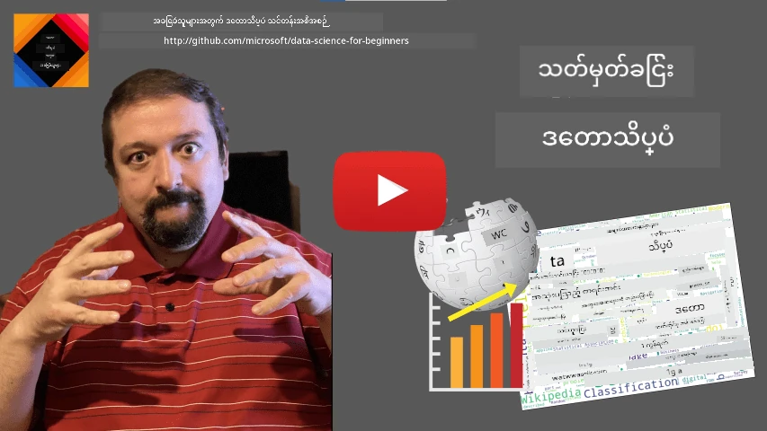
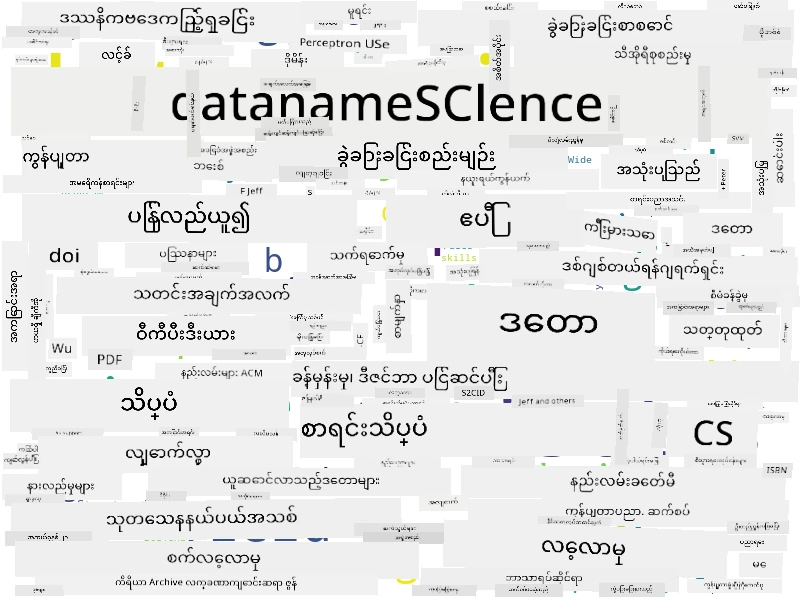

# ဒေတာသိပ္ပံကို သတ်မှတ်ခြင်း

|  ](../../sketchnotes/01-Definitions.png) |
| :----------------------------------------------------------------------------------------------------: |
|              ဒေတာသိပ္ပံကို သတ်မှတ်ခြင်း - _Sketchnote by [@nitya](https://twitter.com/nitya)_               |

---

## [Pre-lecture quiz](https://ff-quizzes.netlify.app/en/ds/quiz/0)

## ဒေတာ ဆိုတာဘာလဲ?
ကျွန်တော်တို့၏ နေ့စဉ်ဘဝတွင် ဒေတာများဖြင့် အမြဲ ဝန်းရံထားရသည်။ သင့်က အခု ဖတ်နေသော စာသားမှာ ဒေတာဖြစ်သည်။ သင့်ဖုန်းထဲ ရှိ မိတ်ဆွေများ၏ ဖုန်းနံပါတ်စာရင်းမှာ ဒေတာဖြစ်ပြီး၊ သင့်နာရီပေါ်တွင် ပြသနေသော လက်တလောအချိန်လည်း ဒေတာဖြစ်သည်။ လူသားများအနေနဲ့ ဒေတာကို သဘာဝကျ လုပ်ကိုင်ကြပြီး၊ ကျွန်တော်တို့ ငွေတွက်တာ သို့မဟုတ် မိတ်ဆွေတွေထံ စာမေးတာတွေ ပြုလုပ်တာကလည်း ဒေတာနဲ့ ဆက်စပ်နေပါတယ်။

သို့သော် ဒေတာသည် ကွန်ပျူတာများ ဖန်တီးမှုနှင့်အမျိုးမျိုးပို စိတ်ကြိုက်သောအရာ ဖြစ်လာပါသည်။ ကွန်ပျူတာ၏ အဓိက အလုပ်က ရှင်သန်အားဖြင့် တွက်ချက်ပေးခြင်းဖြစ်သည်၊ သို့သော် စီမံဆောင်ရွက်ရန် ဒေတာလိုအပ်ပါသည်။ ထို့ကြောင့် ကွန်ပျူတာများသည် ဒေတာကို မည်သို့ သိမ်းဆည်းပြီး ဖြစ်ပေါ်စေသည်ကို ကျွန်တော်တို့ နားလည်ရပါမည်။

အင်တာနက် ပေါ်လာခြင်းကြောင့် ကွန်ပျူတာ၏ ဒေတာကို ကိုင်တွယ်မှုအခန်းကဏ္ဍ ကြီးသည်။ သင်စိတ်မှတ်မိပါက ကျွန်တော်တို့ ယခုအခါ တွက်ချက်မှုများထက် ဒေတာ ပြုလုပ်ခြင်းနှင့် ဆက်သွယ်ရေးအတွက် ကွန်ပျူတာကို ပိုမို အသုံးပြုလျက်ရှိသည်။ မိတ်ဆွေတစ်ဦးထံ အီးမေးလ်ရေးတဲ့အခါ သို့မဟုတ် အင်တာနက်ပေါ်တွင် တစ်စုံတစ်ခု ရှာဖွေတဲ့အခါမှာ ဒေတာကို ဖန်တီးခြင်း၊ သိမ်းဆည်းခြင်း၊ ဖြန့်ဝေခြင်း၊ ပြုပြင်တည်းဖြတ်ခြင်းတို့ လုပ်နေသည်။

> နောက်ဆုံးအကြိမ် ကျွန်တော်တို့ ကွန်ပျူတာနဲ့ တကယ် တွက်ချက်လုပ်ခဲ့တာ ကိုယ့်မှာ မှတ်မိပါသလား?

## ဒေတာသိပ္ပံ ဆိုတာဘာလဲ?

[ဝီကီပီဒီးယား](https://en.wikipedia.org/wiki/Data_science) မှာ၊ **ဒေတာသိပ္ပံ**ကို *ဖွဲ့စည်းပုံရှိ/မရှိ ဒေတာများထဲမှ သိပ္ပံနည်းလမ်းများ အသုံးပြုကာ သိပံပညာနှင့် သွက်လက်သော နည်းပညာများက ဉာဏ်ရည်များကို ထုတ်ယူခြင်း၊ ဉာဏ်ရည်များ၊ နှင့် လက်တွေ့ အသုံးချနိုင်သော ထောက်ပံ့ချက်များကို လုပ်ငန်းခွင်များစွာတွင် အသုံးချခြင်း* ဟု သတ်မှတ်ထားသည်။

ဤသတ်မှတ်ချက်သည် ဒေတာသိပ္ပံ၏ အရေးကြီးသော အချက်များကို တောက်ပစွာ ပြသသည်ထက် –

* ဒေတာသိပ္ပံ၏ အဓိက ရည်ရွယ်ချက်မှာ ဒေတာထဲမှ **ညဏ်ရည် ရယူခြင်း** ဖြစ်ပြီး၊ အကြောင်းကောင်းမှန်တွေကို နားလည်သဘောပေါက်ခြင်း၊ မှတ်မိထားသည့် ဆက်နွယ်ချက်များ ရှာဖွေခြင်းနှင့် **မော်ဒယ်တစ်ခု** တည်ဆောက်ခြင်း ဖြစ်သည်။
* ဒေတာသိပ္ပံသည် **သိပ္ပံနည်းလမ်းများ** ကိုအသုံးပြုသည်၊ ဥပမာ - အလွတ်အလပ်နှင့် သင်္ကေတဗေဒ။ ဒေတာသိပ္ပံဟူသော စကားလုံးကို ပထမဆုံးသုံးခဲ့ချိန်တွင် အချို့လူများက ဒေတာသိပ္ပံသည် စာရင်းဇယားသိပ္ပံ (statistics) အတွက် အသစ်သော နာမည်ခေါ်တစ်ခုသာဖြစ်ကြောင်း ဆန့်ကျင်ခဲ့သည်။ ယနေ့တွင် ဤဘာသာရပ်သည် ပိုမိုကျယ်ပြန့်သည့် နယ်ပယ်ဖြစ်လာသည်ဟု သိသာပြမှီ။
* ရရှိထားသည့် ဉာဏ်ရည်ကို လက်တွေ့အသုံးချဖွယ်ရာ **အခြေအနေသေချာသော နိဒါန်းများ** ထုတ်ပေးနိုင်ရန် မဟာဗျူဟာများဖြင့် အသုံးချရမည်။
* ကွန်ပျူတာများစွာ သို့မဟုတ် ဒေတာကို ကျယ်ပြန့်စွာ စီမံခန့်ခွဲရန် **ဖွဲ့စည်းပုံရှိ** နှင့် **ဖွဲ့စည်းပုံမရှိ** ဒေတာ နှစ်မျိုးစလုံးကို ဆောင်ရွက်နိုင်ရမည်။ လေ့လာရေးကာလအတွင်း ဒေတာ အမျိုးအစားများနှင့် နောက်ပိုင်းတွင် ပြန်လည်ဆွေးနွေးပါမည်။
* **လျှောက်လွှာနယ်ပယ်** သည် အရေးကြီးသော အယူအဆတစ်ခု ဖြစ်ပြီး ဒေတာသိပ္ပံပညာရှင်များသည် အကြောင်းအရာနယ်ပယ်ကို အနည်းဆုံး အခွင့်အရေးအနေဖြင့် ကျွမ်းကျင်မှုရှိရမည်ဖြစ်သည်။ ဥပမာ - ငွေကြေး၊ ဆေးဘက်ဆိုင်ရာ၊ စျေးကွက်ရှာဖွေမှု စသည်တို့ဖြစ်သည်။

> ဒေတာသိပ္ပံ၏ တခြား အရေးကြီးသောအချက်မှာ ကွန်ပျူတာအသုံးပြုပြီး ဒေတာကို မည်သို့ စုဆောင်း၊ သိမ်းဆည်း၊ နှင့်ဆောင်ရွက်သင့်သည်ကိုလေ့လာခြင်း ဖြစ်သည်။ စာရင်းဇယားသိပ္ပံသည် သင်္ကေတပေါ်အခြေခံသည်၊ ဒေတာသိပ္ပံသည် သင်္ကေတစည်းကမ်းများကို အသုံးပြုပြီး တကယ်ဉာဏ်ရည် ထုတ်ယူသည်။

ဒေတာသိပ္ပံကို [Jim Gray](https://en.wikipedia.org/wiki/Jim_Gray_(computer_scientist)) မှပေးထားသည့် နည်းလမ်းတစ်ခုအရ သိပ္ပံနယ်ပယ်တစ်ခုအဖြစ် တွေ့မြင်နိုင်သည်၊

* **ကြားထဲတွင် အခြေခံထားသော (Empirical)၊** အဓိကအားဖြင့် လေ့လာမှုနှင့် စမ်းသပ်မှုရလဒ်များအပေါ် မှီခံသည်။
* **သီအိုရီအရ (Theoretical),** အသိပညာရှိသည့် သိပ္ပံမှုမှ အသစ်သောအယူအဆများ ပေါ်လာသည်။
* **ကွန်ပျူတာ အသုံးပြု (Computational),** ကွန်ပျူတာ စမ်းသပ်မှုအပေါ် အခြေခံပြီး အယူအဆအသစ်များ ရှာဖွေသည်။
* **ဒေတာမှ အခြေခံထားသည် (Data-Driven),** ဒေတာထဲရှိ ဆက်နွယ်မှုများနှင့် ပုံစံများ ရှာဖွေရန် အခြေခံသည်။  

## အခြား ဆက်စပ် နယ်ပယ်များ

ဒေတာသည် အလုံးစုံ ရှိသဖြင့် ဒေတာသိပ္ပံကိုယ်တိုင်ဟာလည်း ဝန်းရံ နယ်ပယ်ကျယ်ပြန့်ပြီး အခြား နယ်ပယ်များကို ထိတွေ့နေသည်။

<dl>
<dt>ဒေတာဘေ့စ်များ (Databases)</dt>
<dd>
အရေးကြီးသော အကောက်အနှုတ်မှာ ဒေတာကို <b>မည်သို့ စုစည်းအပ်နှံမလဲ</b> ဖြစ်ပြီး၊ ဒေတာကို ပိုမိုလျင်မြန်စွာ သုံးစွဲနိုင်အောင် ဖွဲ့စည်းပုံစီမံခြင်း ဖြစ်သည်။ ဖွဲ့စည်းပုံရှိ နှင့် မရှိသော ဒေတာကို သိမ်းဆည်းထားသည့် မတူညီသော ဒေတာဘေ့စ် နည်းပညာများ ရှိကြပြီး၊ ကျွန်တော်တို့၏ <a href="../../2-Working-With-Data/README.md">သင်တန်းအတွင်း တွေ့မြင်မည်</a> ဖြစ်သည်။
</dd>
<dt>ကြီးမားသော ဒေတာ (Big Data)</dt>
<dd>
အခါအားလျော်စွာ ဖွဲ့စည်းပုံရိုးရှင်းသော ဒေတာ အလွန်ကြီးမားသော အရေအတွက်ကို သိမ်းဆည်းပြီး စီမံရန် လိုအပ်သည်။ ဒေတာများစွာကို ကွန်ပျူတာ ကလပ်စတာပေါ်တွင် ဖြန့်ဝေ၍ ထိရောက်စွာ ထိန်းချုပ်စီမံရန် ရည်ရွယ်ချက်ဖြင့် အထူးနည်းဗျူဟာများနှင့် ကိရိယာများ ရှိသည်။
</dd>
<dt>စက်သင်ယူမှု (Machine Learning)</dt>
<dd>
ဒေတာကို နားလည်ဖို့ ရည်ရွယ်ပြီး၊ လိုအပ်သည့် ရလဒ်များ ခန့်မှန်းနိုင်မည့် <b>မော်ဒယ်တစ်ခု ဖန်တီးခြင်း</b> ဖြစ်သည်။ ဒေတာမှ မော်ဒယ်များ ဖွံ့ဖြိုးတည်ဆောက်ခြင်းကို <b>စက်သင်ယူခြင်း</b> ဟုခေါ်သည်။ ကျွန်တော်တို့၏ <a href="https://aka.ms/ml-beginners">စက်သင်ယူမှုပြန်လည်စတင်သူများအတွက် သင်တန်း</a> ကို သင်ယူနိုင်သည်။
</dd>
<dt>အတုအခေါ် စွမ်းရည် (Artificial Intelligence)</dt>
<dd>
စက်သင်ယူမှု၏ နယ်ပယ်တစ်ခုဖြစ်သော အတုအခေါ်စွမ်းရည် (AI) သည် ဒေတာပေါ်တွင် မူတည်ပြီး လူ့အတွေးအခေါ်စနစ်များကို အတုယူသည့် မော်ဒယ်များ တည်ဆောက်ခြင်းဖြစ်သည်။ AI နည်းပညာများက ဖွဲ့စည်းပုံမရှိသော ဒေတာ (ဥပမာ- သဘာဝဘာသာစကား) ကို ဖွဲ့စည်းပုံရှိ အမြင်မြင်သာသော အချက်အလက်များ အဖြစ် ပြောင်းလဲပေးသည်။
</dd>
<dt>ကြည့်ရှုခြင်း (Visualization)</dt>
<dd>
ဒေတာ၏ အရေအတွက် များများသည် လူသားအတွက် နားလည်ရန်ခက်ခဲသည်၊ ဒါပေမယ့် ထိုဒေတာမှ အသုံးဝင်သော မျက်နှာပြင်များ ဖန်တီးကာ ဒေတာကို နားလည်မှု မြင့်စေပြီး ဆုံးဖြတ်ချက်များ ထုတ်တတ်နိုင်သည်။ ထို့ကြောင့် အချက်အလက်များကို ကြည့်ရှုနည်း များစွာကို သိရှိခြင်း အရေးကြီးပြီး၊ သင်တန်း၏ <a href="../../3-Data-Visualization/README.md">အပိုင်း ၃</a> တွင် ဆွေးနွေးမည်ဖြစ်သည်။ သက်ဆိုင်ရာ နယ်ပယ်များတွင် <b>ဖော်ပြချက်ပုံပြင်များ (Infographics)</b> နှင့် <b>လူနှင့် ကွန်ပျူတာ ဆက်ဆံရေး (Human-Computer Interaction)</b> ပါဝင်သည်။
</dd>
</dl>

## ဒေတာအမျိုးအစားများ

ယခင်တွင် ဖော်ပြထားသလို ဒေတာသည် အကွာအဝေးသင့်လျော်စွာ ရှိနေသည်။ ဒါကြောင့် အချက်အလက်ကို မှန်ကန်စွာ ဖမ်းယူရပါမည်! **ဖွဲ့စည်းပုံရှိ** နှင့် **ဖွဲ့စည်းပုံမရှိ** ဒေတာကို ခွဲခြားသိရှိရန် သုံးများသည်။ ဖွဲ့စည်းပုံရှိ ဒေတာသည် အထူးသဖြင့် ဇယားမျိုးဖြစ်거나 ဇယားအများအတွက် တစ်ခုတည်း အထူးစနစ်ဖြင့် ပုံနှိပ်ထားသည်၊ ဖွဲ့စည်းပုံမရှိ ဒေတာသည် ဖိုင်စုစည်းခြင်းသာ ဖြစ်သည်။ တခါတရံမှာ၊ ဖွဲ့စည်းပုံတစ်စုံတစ်ခုရှိသော်လည်း အမျိုးအစားက အများကြီး ကွဲပြားနိုင်သော **မှတ်သားဖွဲ့စည်းပုံရှိ ဒေတာ** ကိုလည်း ရှင်းလင်းနိုင်သည်။

| ဖွဲ့စည်းပုံရှိ                                                          | မှတ်သားဖွဲ့စည်းပုံရှိ                                                                            | ဖွဲ့စည်းပုံမရှိ                       |
| ----------------------------------------------------------------------- | ------------------------------------------------------------------------------------------------ | ------------------------------------ |
| လူတိုင်း၏ ဖုန်းနံပါတ်စာရင်း                                         | လင့်ခ်ပါသည့် Wikipedia စာမျက်နှာများ                                                          | Encyclopedia Britannica စာသား       |
| နေအိမ်အခန်းအားလုံးတွင် မိနစ်တိုင်း အပူချိန်                             | ရေးသားသူ၊ ထုတ်ပြန်ရက်စွဲနှင့် အကျဉ်းချုပ်ပါဝင်သော JSON ပုံစံသည့် သိပ္ပံစာတမ်းများစုစည်းမှု                                 | ကုမ္ပဏီစာရွက်စာတမ်းများ ဖိုင်မျှဝေခြင်း |
| နေအိမ်ထဲ ဝင်သော လူကြီးမင်းတို့၏ အသက်နှင့် အမျိုးသား/မအချက်အလက်   | အင်တာနက်စာမျက်နှာများ                                                                           | လုံခြုံရေးဗီဒီယို မှတ်တမ်း               |

## ဒေတာကို ဘယ်မှာ ရနိုင်မလဲ

ဒေတာရရှိနိုင်သော အရင်းအမြစ်များစွာ ရှိပြီး အားလုံးကို စုစည်းဖော်ပြရန် မဖြစ်နိုင်ပါ။ သို့သော် ဒေတာ ရနိုင်သည့် ကျယ်ပြန့်သောနေရာများစွာကို ဖော်ပြပါမည်။

* **ဖွဲ့စည်းပုံရှိ**
  - အမျိုးမျိုးသော အာရုံခံပစ္စည်းများ၊ အပူချိန်၊ ဖိအား ထိန်းယူကိရိယာများပါတဲ့ **အရာအားလုံး အင်တာနက်ဖြင့် (Internet of Things, IoT)** မှ ဒေတာများ၊ အများအပြား အသုံးဝင်သော ဒေတာများကို ပေးစွမ်းသည်။ ဥပမာ - ရုံးတစ်ခုအတွက် IoT အာရုံခံကိရိယာများရှိလျှင် အပူနှင့် မီးလျှပ်စစ် ကို ယာယီထိန်းချုပ်၍ ကုန်ကျစရိတ်ကို ချွတ်ခွာနိုင်တယ်။
  - **စုံစမ်းမေးမြန်းမှုများ** - ဝယ်ယူပြီးနောက် သို့မဟုတ် ဝဘ်ဆိုဒ် သုံးသည့် အချိန် တန်းတွင် အသုံးပြုသူများကို မေးခွန်းဖြေစေခြင်း။
  - **ပြုသဘောတရား အရ အကျင့်စစ်တမ်း** အနေနဲ့ ဝဘ်ဆိုဒ်ထဲသို့ ဝင်ရောက် ပြုလုပ်မှုနက်ရှိုင်းကန့်သတ်ခြင်း နှင့် ပွတ်စရာအကြောင်းတွေကို နားလည်ရအောင် ကူညီသည်။
* **ဖွဲ့စည်းပုံမရှိ**
  - **စာသားများ** သည် အကျဉ်းခွဲခြင်း၊ စကားလုံးအဓိပ္ပါယ်ထုတ်ယူခြင်းနှင့် စိတ်ခံစားချက် စာရင်း (sentiment score) တို့အတွက် သာယာသော အချက်အလက်များ ဖြစ်နိုင်သည်။
  - **ပုံများ** သို့မဟုတ် **ဗီဒီယိုများ** - လုံခြုံရေးကင်မရာမှ ဗီဒီယိုသည် လမ်းတွင် ယာဉ်လမ်းပိတ်များ အခြေအနေကို ခန့်မှန်းနိုင်စေပါတယ်။
  - ဝဘ်ဆာဗာ **မှတ်တမ်းများ** (Logs) သည် ဝဘ်ဆိုဒ်အတွင်း ဘယ်စာမျက်နှာများ ကို ရေရှည်ကြည့်ရှုခြင်းဖြစ်စေ စာမျက်နှာများအား မည်မျှ ကြိုက်နှစ်သက်ဖြစ်ကြောင်း နားလည်ရန် အသုံးဝင်သည်။
* မှတ်သားဖွဲ့စည်းပုံရှိ
  - **လူမှုကွန်ရက်** ဂရပ်များက အသုံးပြုသူများ၏ ကိုယ်ရေးကိုယ်တာ ဒေတာများနှင့် သတင်းအချက်အလက်များ ဖြန့်ဝေမှု ထိရောက်မှု တို့အတွက် ကောင်းမွန်သော အရင်းအမြစ်ဖြစ်သည်။
  - မိတ်ဆွေတူဖက်တစ်စုမှ ဓာတ်ပုံများ ရှိပါက လူများကို ဓာတ်ပုံရိုက်နေခြင်းဖြင့် **အဖွဲ့အစည်း အပြန်အလှန်ဆက်ဆံမှု (Group Dynamics)** ဂရပ်ကို တည်ဆောက်၍ အချက်အလက်တွင်မူ ပါအုပ်စုရဲ့ သဘောထား များကို ထုတ်ယူနိုင်သည်။

ဒေတာရနိုင်သော နေရာအမျိုးမျိုးကို သိရှိခြင်းက ဒေတာသိပ္ပံ နည်းဗျူဟာများကို အသုံးပြု၍ အခြေအနေများကို ပိုမိုနားလည်ကောင်းမွန်စေရန် နှင့် လုပ်ငန်းလုပ်ငန်းစဉ်များ အကြောင်းအရာ မြှင့်တင်နိုင်ပါသည်။

## ဒေတာဖြင့် ဘာတွေလုပ်နိုင်မလဲ

ဒေတာသိပ္ပံတွင် ဒေတာခရီးစဉ်၏ အောက်ပါအဆင့်များကို အာရုံစိုက်သည် -

<dl>
<dt>1) ဒေတာစုဆောင်းခြင်း</dt>
<dd>
ပထမဆုံး အဆင့်မှာ ဒေတာကို စုပြုံဆောင်ရွက်ခြင်း ဖြစ်သည်။ အချို့ကိစ္စများတွင် ဒေတာကို ဝဘ်အက်ပလီကေးရှင်းမှ ဒေတာဘေ့စ်သို့ တိုက်ရိုက် လာရှိသည်ဟု ဆိုလို့ရပေမယ့်၊ အချို့အခါများတွင် အထူးနည်းလမ်းများ လိုအပ်တတ်သည်။ ဥပမာ IoT အာရုံခံကိရိယာများမှ ဒေတာသည် အလွန် အလေးတကြီး ရှိနိုင်ပြီး၊ IoT Hub ကဲ့သို့သော သိုလှောင်မှုနှင့် buffer ချမှု အချက်အတွက် ကူညီပေးသည့် နေရာများကို အသုံးပြုရပါတယ်။
</dd>
<dt>2) ဒေတာသိမ်းဆည်းခြင်း</dt>
<dd>
ဒေတာသိမ်းဆည်းရတာမှာ အစိမ်းရောင်ဖြစ်နိုင်ပြီး၊ ကြီးမားသော ဒေတာ (Big Data) ဆိုရင် ရှုပ်ခွင့်များ ပိုမိုရှိသည်။ ဒေတာသိမ်းဆည်းချိန်တွင် မနာလိုအပ်သော မေးခွန်းများကို ကြိုတင် ထည့်သွင်းစဉ်းစားဖို့ လိုတယ်။ ဒေတာသိမ်းဆည်းနိုင်သည့် နည်းလမ်း အစုံအလင် ရှိသည် -
<ul>
<li>ကော်လံပုံစံပါသည့်ဇယားစုစည်းမှုရှိသော ဒေတာများကို သိမ်းဆည်းရာတွင် အဓိက SQL ဟူသော ဘာသာစကားကို အသုံးပြု၍ မေးခွန်း We're။ စားဖတ်တယ်။ အနုပညာအဖွဲ့(စာရင်းဇယား) ခွဲခြားသိမ်းဆည်းထားသည်။ ဒါမှတစ်ပါးသင်လိုအပ်သလိုပုံစံပေါ်လွှင်ခြင်းအတွက် ဒေတာနားလုံးကို အမူအရာသို့ ပြောင်းသည်။</li>
<li><a href="https://en.wikipedia.org/wiki/NoSQL">NoSQL</a> ဆိုတဲ့ ဒေတာဘေ့စ်တွေ၊ ဥပမာ <a href="https://azure.microsoft.com/services/cosmos-db/?WT.mc_id=academic-77958-bethanycheum">CosmosDB</a> ကဖွဲ့စည်းပုံကို တင်းကျပ်စွာမလိုအပ်တော့ပဲ ဒေတာတွေ စုပုံတည်ဆောက်ရန် ခွင့်ပြုသည်။ JSON ဖိုင်များ သို့မဟုတ် ဂရပ်များ အဖြစ် သိမ်းဆည်းနိုင်သည်။ သို့ပါး NoSQL က SQL ရဲ့စွမ်းဆောင်ရည်မျိုးတွေ မပါရှိပါဘူး။</li>
<li><a href="https://en.wikipedia.org/wiki/Data_lake">Data Lake</a> သည် အသီးသီးသော ရှင်းလင်းဖွဲ့စည်းပုံမရှိသော ဒေတာအကြီးအကျယ်များသိမ်းဆည်းရာတွင် အသုံးပြုကြသည်။ ဤ प्रकार의big 데이터에 사용됩니다. တစ်ကွန်ပျူတာတင်မရနိုင်သော ဒေတာများကို cluster server တွေမှာ သိမ်းထားကာ ထိန်းသိမ်းခြင်းလုပ်ဆောင်သည်။ <a href="https://en.wikipedia.org/wiki/Apache_Parquet">Parquet</a> သည် big data နဲ့ အတူ မြင့်မားစွာအသုံးပြုသော ဒေတာ ပုံစံတစ်ခုဖြစ်သည်။</li>
</ul>
</dd>
<dt>3) ဒေတာထုတ်လုပ်ခြင်း</dt>
<dd>
ဒီအဆင့်မှာ ဒေတာကို မူရင်းပုံစံမှ ဗီဇွယ်/မော်ဒယ်လေ့လာမှု ပြုလုပ်နိုင်သော ပုံစံသို့ ပြောင်းလဲစေသည်။ စာသားသို့မဟုတ် ပုံများကဲ့သို့ ဖွဲ့စည်းပုံမရှိသော ဒေတာကို အသုံးပြုသောအခါ AI နည်းလမ်းများ ဖြင့် <b>အင်္ဂါရပ်များ</b> ထုတ်ယူပြီး ဖွဲ့စည်းပုံရှိ ဒီတာအဖြစ် ပြောင်းပေးရတတ်သည်။
</dd>
<dt>4) ကြည့်ရှုခြင်း / လူ့အဖြေများ</dt>
<dd>
ဒေတာကို နားလည်ရန် ကြည့်ရှုခြင်းများ ပြုလုပ်ရသည်။ ကြည့်ရှု နည်းလမ်းများစွာ ရှိ၍ သင့်တော်သော အမြင်ပုံစံထည့်ချသည် ဖော်ပြချက်ထုတ်ယူရန် အသုံးပေါ်သည်။ ဒေတာသိပ္ပံပညာရှင်များသည် "ဒေတာကို ကစားခြင်း" ကြေညာချက်အတွက် အကြိမ်ရေ များမြှင့်ကာ လေ့လာမှုများ လုပ်ဆောင်တတ်ကြသည်။ ထို့အပြင် သင်္ကေတနည်းလမ်းများကို အသုံးပြု၍ သဘောထား စမ်းသပ်ခြင်း သို့မဟုတ် ဒေတာများ အကြား ပဋိပက္ခရှိမှုကို ဆောင်ရွက်သည်။   
</dd>
<dt>5) ခန့်မှန်းခန့်မှန်းမော်ဒယ် သင်ကြားခြင်း</dt>
<dd>
ဒေတာနှင့် ဆုံးဖြတ်ချက်ချနိုင်ရန် အဓိကရည်ရွယ်ချက် ရှိပြီး ဆိုလျှင် <a href="http://github.com/microsoft/ml-for-beginners">စက်သင်ယူမှု နည်းလမ်းများ</a> ကို အသုံးပြုကာ ခန့်မှန်းမော်ဒယ် တည်ဆောက်ပါ။ ထို့နောက် အချိုးတူဒေါ့တာစုများကို အသုံးပြု၍ ခန့်မှန်းချက်များ ပြုလုပ်နိုင်ပါသည်။
</dd>
</dl>

အမှန်တကယ် ဒေတာပေါ် မူတည်၍ အချို့အဆင့်များ မပါဝင်နိုင်သောအခြေအနေရှိနိုင်သည် (ဥပမာ - ဒေတာဘေ့စ်တွင် ဒေတာ ရှိပြီးသားဖြစ်သောအခါ၊ မော်ဒယ်သင်ကြားခြင်း မလိုအပ်သောအခါ) သို့မဟုတ် အချို့ အဆင့်များ မကြာခဏ ထပ်ခါထပ်ခါ ဆောင်ရွက်ချက်ဖြစ်နိုင်သည် (ဥပမာ - ဒေတာထုတ်လုပ်ခြင်း)။

## ဒစ်ဂျစ်တယ်ဖြင့် ပြောင်းလဲခြင်းနှင့် ဒစ်ဂျစ်တယ်ပြောင်းလဲမှု

ပြီးခဲ့သည့် စက္ကန့်တစ်ဆယ့်တစ်နှစ်ခုအတွင်း သင့်လုပ်ငန်းများသည် ဒေတာသည် မဟာဗျူဟာ ဆုံးဖြတ်ချက်များ မှာ အရေးပါသည်ဟု နားလည်လာကြသည်။ ဒေတာသိပ္ပံလုပ်ငန်းစဉ်များကို ရေးဆွဲရန် မတူညီသော လုပ်ငန်းတွေကို ဒစ်ဂျစ်တယ်ပုံစံဖြင့် ပြောင်းလဲဖို့ လိုအပ်ပါသည်။ ဤကို **ဒစ်ဂျစ်တယ်ဖြင့် ပြောင်းလဲခြင်း (digitalization)** ဟု ခေါ်သည်။ ဒီတည်းက ဒေါ်တအချက် အခြေခံပြီး ဆုံးဖြတ်ချက်များ ဦးတည်မှုများ ကျွမ်းကျင်စွာ ပြုလုပ်သည့် အချိန်မှာ **ဒစ်ဂျစ်တယ်ပြောင်းလဲမှု (digital transformation)** ဖြစ်လာသည်။

ဥပမာ တစ်ခုစဉ်းစားကြပါစို့။ ကျွန်တော်တို့မှာ ဒေတာသိပ္ပံ သင်တန်း တစ်ခု ရှိပြီး၊ အွန်လိုင်းမှ တက်ရောက်သော ကျောင်းသားများအတွက် သင်တန်းတစ်ခု ဖြစ်ပါသည်။ ဒေတာသိပ္ပံကို အသုံးပြုပြီး သင်တန်းတိုးတက်အောင် ပြုလုပ်ချင်ပါက ဘယ်လိုလုပ်နိုင်မလဲ?

"ဘာတွေ ဒစ်ဂျစ်တယ်ပုံစံဖြင့် ပြောင်းလဲနိုင်မလဲ?" ဟု မေးခွန်း မေးကာ စတင်နိုင်ပါသည်။ အဆင်ပြေဆုံး နည်းလမ်းမှာ ကျောင်းသား တစ်ဦးချင်းစီသည် မော်ဂျူးတစ်ခုချင်း အပြီးသတ်ရန် စုစုပေါင်း အချိန်ကို တိုင်းတာခြင်းနှင့် မော်ဂျူးအဆုံးတွင် မေးခွန်းစစ်တမ်း ဖြေဖြတ်ခြင်းဖြင့် သိပံရှင် ရရှိမှုကို တိုင်းတာခြင်း ဖြစ်ပါသည်။ ကျောင်းသားအားလုံး၏ အချိန်များကို သင်တန်းတစ်ခုလုံးအတွက် ပျမ်းမျှတွက်ချက်တွင် မော်ဂျူး တစ်ခုချင်းစီသည် မြန်ဆန်မှုမှာ ဘယ်လိုဖြစ်နေသည်ကို ရှာဖွေကာ လွယ်ကူစေရန် အလုပ်လုပ်နိုင်သည်။
> သင့်ရဲ့ စကားပြောချက်မှာ ဒီနည်းလမ်းဟာအကောင်းဆုံးမဟုတ်ပါဘူးဆိုတာ ကောက်နုတ်နိုင်ပါတယ်၊ အကြောင်းက မော်ဂျူးတွေက အရှည်ရှည်မျိုး မတူကြပါဘူး။ စာလုံးအရေအတွက်အရ မော်ဂျူး အရှည်ပမာဏ ကို အချိန်နဲ့စားပြီး ဆက်သွယ်ထားတဲ့ တန်ဖိုးတွေကို နှိုင်းယှဉ်ရခြင်း ဖော်ပြချက်ပိုတရားမျှဖြစ်နိုင်ပါတယ်။

ကျွန်တော်တို့ မကြာခဏ အတန်းရေးမေးခွန်း စမ်းသပ်မှုရလဒ်တွေကို အကဲဖြတ်ချိန်မှာ ကျောင်းသားတွေ အခက်အခဲတွေဟာ ဘယ် concept တွေ နားမလည်နိုင်တာလဲ ဆိုတာ သိရှိနိုင်ပြီး ထိုသတင်းအချက်အလက်တွေကို အသုံးပြုကာ ပစ္စည်းအကြောင်း အတိုးတက်အောင်လုပ်နိုင်ပါတယ်။ အဲဒီအတွက် မေးခွန်း တစ်ခုချင်းစီဟာ အထည်အလိပ်ရှု့ concept ဖြစ်နိုင်တဲ့ အပိုင်းတစ်ခုနဲ့ ဆက်စပ်မှုရှိအောင် စမ်းသပ်မှုဒီဇိုင်းဆွဲရပါမယ်။

ပိုမိုရှုပ်ထွေးစေချင်ရင် Module တစ်ခုချင်းစီအတွက် အသက်အုပ်စုနဲ့ နှိုင်းယှဉ်၍ ကုန်သက်သာချိန်ကို ကြည့်ရမှာဖြစ်ပါတယ်။ အသက်အုပ်စုတချို့မှာ မော်ဂျူးကို အချိန်မှန်တုန်းတုန်း မပြီးစီးနိုင်တာ သို့မဟုတ် အပြီးမရှိခင် ကျောင်းသားတွေ ရပ်တန့်သွားတာတွေကို ရှာတွေ့နိုင်ပါတယ်။ ဒီသတင်းအချက်အလက်ဟာ မော်ဂျူးအတွက် အသက်အကြံပြုချက်များ ပေးနိုင်ပြီး မမှန်ကန်တဲ့မျှော်မှန်းချက်များကြောင့် လူတွေ ရိုက်ခတ်ခံရတဲ့ စိတ်မချမ်းသာမှုကိုလည်း လျော့နည်းစေမှာ ဖြစ်ပါတယ်။

## 🚀 အခက်ခဲ

ဒီအခက်ခဲမှာ Data Science နယ်ပယ်နှင့်သက်ဆိုင်သော concepts တွေကို စာသားအပေါ်မှ ကြည့်ရှုကာ ရှာဖွေကြမှာ ဖြစ်ပါတယ်။ Data Science မှ Wikipedia ဆောင်းပါးတစ်ခုကို ယူပြီး စာသားကို ဒေါင်းလုပ်လုပ်၊ ပြင်ဆင်ပြီး ထိုနောက် ဒီလို word cloud တစ်ခု တည်ဆောက်ပါမယ် -

ကုဒ်ကို ခွဲခြမ်းဖတ်ရှုရန် [`notebook.ipynb`](../../../../1-Introduction/01-defining-data-science/notebook.ipynb ':ignore') သို့ သွားရောက်ကြည့်ရှုနိုင်ပါတယ်။ ကိုးဒ်များကို ဖြတ်သန်းသုံးမယ့်အခါ မှန်ကန်စွာ တစ်ခုချင်း ဒေတာပြောင်းပုံပြင်ဆောင်ချက်ကို ဒေတာလက်တွေ့ အချိန်တွင်မြင်တွေ့နိုင်ပါတယ်။

> သင် Jupyter Notebook မှာ ကုဒ်တွေ ဘယ်လို run ရမလဲ မသိရင် [ဒီဆောင်းပါး](https://soshnikov.com/education/how-to-execute-notebooks-from-github/) ကို ကြည့်ရှုနိုင်ပါတယ်။

## [သင်ခန်းစာအပြီး စစ်တမ်း](https://ff-quizzes.netlify.app/en/ds/quiz/1)

## အလုပ်တာဝန်များ

* **Task 1**: မြောက်မှာရှိထားသော ကုဒ်ကိုပြင်၍ **Big Data** နှင့် **Machine Learning** နယ်ပယ်နှစ်ခုဆိုင်ရာ သက်ဆိုင်သော concept တွေကို ရှာဖွေရမယ်
* **Task 2**: [Data Science အခြေအနေများအကြောင်း စဉ်းစားခြင်း](assignment.md)

## မှတ်ချက်များ

ဒီသင်ခန်းစာကို ♥️ဖြင့် [Dmitry Soshnikov](http://soshnikov.com) မှ ရေးသားပေးထားပါသည်။

---

<!-- CO-OP TRANSLATOR DISCLAIMER START -->
**ပြောကြားချက်**
ဤစာတမ်းကို AI ဘာသာပြန်ဝန်ဆောင်မှု [Co-op Translator](https://github.com/Azure/co-op-translator) အသုံးပြု၍ ဘာသာပြန်ထားပါသည်။ ကျွန်ုပ်တို့သည် တိကျမှန်ကန်မှုအတွက် ကြိုးပမ်းနေသော်လည်း၊ စက်ကိရိယာဘာသာပြန်ခြင်းများတွင် အမှားများ သို့မဟုတ် မှားယွင်းချက်များ ပါဝင်နိုင်ကြောင်း သတိပြုပါရန် လိုအပ်ပါသည်။ မူလစာတမ်းကို မူရင်းဘာသာဖြင့်သာ ယုံကြည်စိတ်ချရသော အချက်အလက်အဖြစ် သတ်မှတ်သင့်သည်။ အရေးကြီးသည့် သတင်းအချက်အလက်များအတွက် ပရော်ဖက်ရှင်နယ် လူသားဘာသာပြန်သူဝန်ဆောင်မှုကို အကြံပြုပါသည်။ ဤဘာသာပြန်ချက်ကို အသုံးပြုခြင်းမှ ဖြစ်ပေါ်လာသော နားလည်မှုကွာခြားမှုများ သို့မဟုတ် မမှန်ကန်သော အသုံးပြုမှုများအတွက် ကျွန်ုပ်တို့ တာဝန်မခံပါ။
<!-- CO-OP TRANSLATOR DISCLAIMER END -->