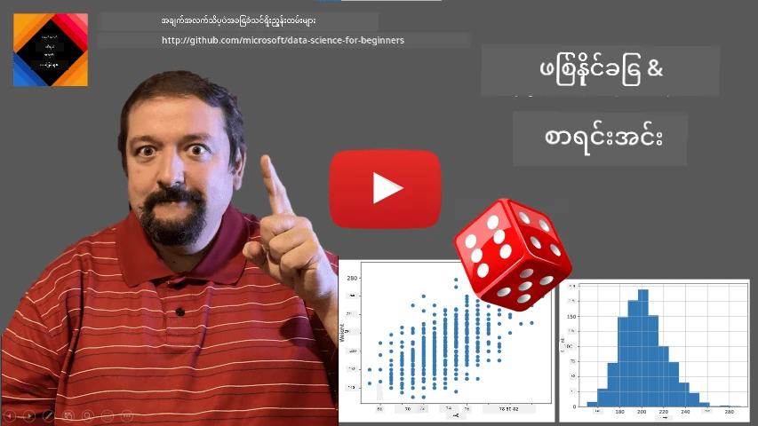
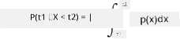
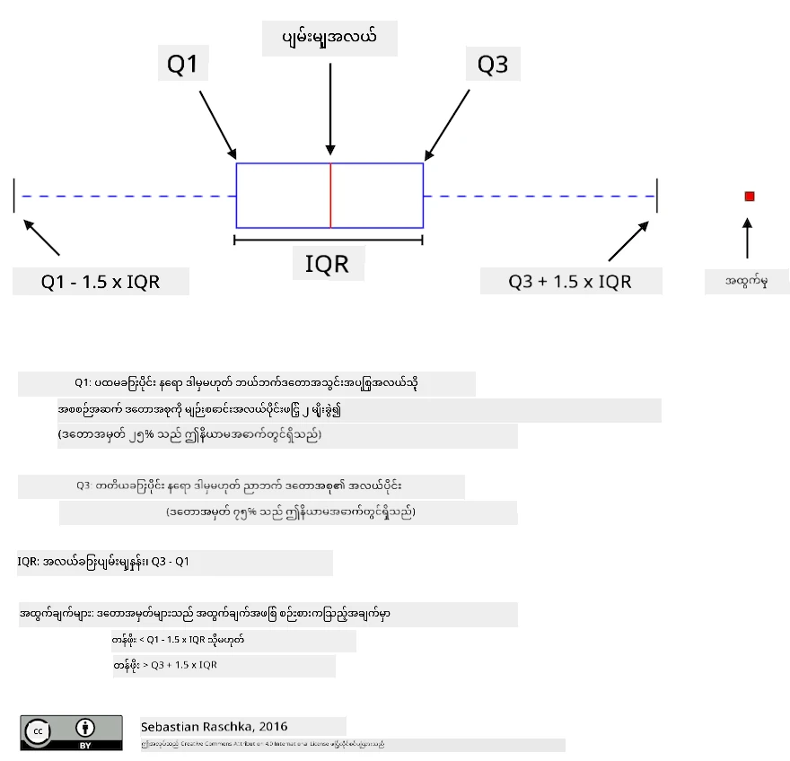
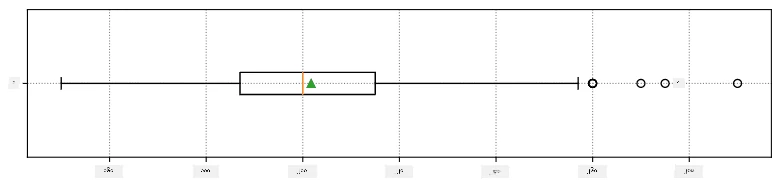
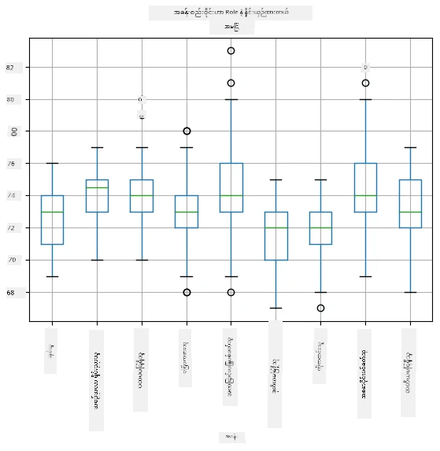
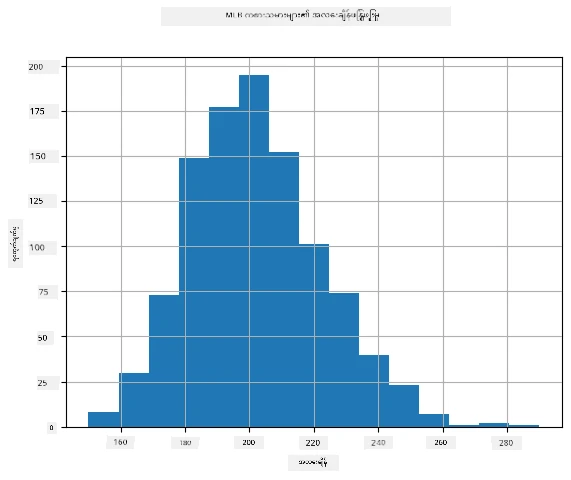
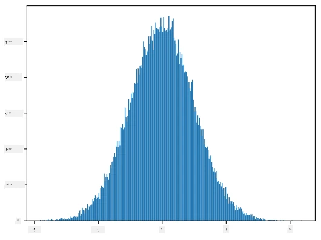
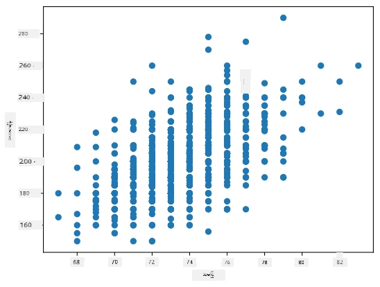

# အချက်အလက်နှင့် ဖြစ်နိုင်မှုအတွက် အနှစ်ချုပ်မိတ်ဆက်ခြင်း

| ](../../sketchnotes/04-Statistics-Probability.png)|
|:---:|
| အချက်အလက်နှင့် ဖြစ်နိုင်မှု - _Sketchnote by [@nitya](https://twitter.com/nitya)_ |

အချက်အလက်နှင့် ဖြစ်နိုင်မှု သီအိုရီများမှာ သင်္ချာ၏ အလွန်နီးစပ်သော အပိုင်းနှစ်ခုဖြစ်ပြီး ဒေတာသိပ္ပံနှင့် အလွန်သက်ဆိုင်သည်။ သင်္ချာကိုနက်ရှိုင်းစွာမသိပဲ ဒေတာများဖြင့် လုပ်ဆောင်နိုင်ပေမယ့် အနည်းဆုံး အေကြာင်းအရာ အချို့ကို သိရှိထားမှ ပိုမိုကောင်းမွန်သည်။ ဒီမှာ သင်စတင်လေ့လာရန် ကူညီပေးမည့် အတိုချုပ်မိတ်ဆက်ချက်ကို ဖော်ပြသွားမယ်။

[](https://youtu.be/Z5Zy85g4Yjw)


## [Pre-lecture quiz](https://ff-quizzes.netlify.app/en/ds/quiz/6)

## ဖြစ်နိုင်မှုနှင့် အလွတ်အစွဲတန်ဖိုးများ

**ဖြစ်နိုင်မှု** ဆိုသည်မှာ 0 နဲ့ 1 ကြားရှိ နံပါတ်တစ်ခုဖြစ်ပြီး **ဖြစ်ရပ်** တစ်ခု သေးငယ်ခြင်းကို ဖော်ပြသည်။ ၎င်းမှာ ဖြစ်ရပ်ဖြစ်စေသော အရာတွေ၏ အရေအတွက်ကို နောက်ဆုံးဖြစ်နိုင်သော အရာအရေအတွက်ဖြင့် 나누၍ စနစ်တကျသတ်မှတ်ထားသည်။ ဥပမာ၊ ဂဏန်းတစ်လုံးကို လွှင့်သောအခါ အလယ်အလတ်ဂဏန်း လက်ခံရရှိနိုင်ခြင်း ဖြစ်နိုင်မှုမှာ ၃/၆ = ၀.၅ ဖြစ်သည်။

ဖြစ်ရပ်များအကြောင်း ပြောတဲ့အခါ **အလွတ်သတ်မှတ်တန်ဖိုးများ** အသုံးပြုကြသည်။ ဥပမာ၊ ဂဏန်းတစ်လုံးလွှင့်သော အခါ ရသော ဂဏန်းကိုဖော်ပြတဲ့ အလွတ်သတ်မှတ်တန်ဖိုးသည် ၁ မှ ၆ ထိတန်ဖိုးများရှိသည်။ ၁ မှ ၆ ထိရှိသော ဂဏန်းတန်းကို **နမူနာ အပိုင်း** ဟု ခေါ်ဆိုသည်။ အလွတ်သတ်မှတ်တန်ဖိုး တန်ဖိုးတစ်ခု ရောကြားသော ဖြစ်နိုင်မှုကိုလည်း ပြောနိုင်သည်။ ဥပမာ P(X=3)=1/6 ဖြစ်သည်။

အထက်ပါ အလွတ်သတ်မှတ်တန်ဖိုးကို **ရေတွက်နိုင်သော** ဟု ခေါ်သည်၊ ၎င်းမှာ နမူနာအပိုင်းရှိတန်ဖိုးများအား ရေတွက်နိုင်သောကြောင့်ဖြစ်သည်။ နမူနာအပိုင်းသည် တချို့ အစဉ်လိုက် တန်ဖိုးများဖြစ်ပါက ၎င်းကို **ဆက်လက်ဆဲလျော့** ဟု ခေါ်သည်။ ဥပမာကတော့ ဘတ်စ်ကားရောက်ချိန်တန်ဖိုးဖြစ်သည်။

## ဖြစ်နိုင်မှု ဖြန့်ဖြူးမှု

ရေတွက်နိုင်သော အလွတ်သတ်မှတ်တန်ဖိုးများအတွက် ဖြစ်နိုင်မှုကို P(X) ဟု ဆိုသည့် ဆင့်တူ၍ ဖော်ထုတ်နိုင်သည်။ နမူနာအပိုင်း S မှ စုပေါင်းဖွဲ့သော တန်ဖိုး s တစ်ခုစီအတွက် ০ မှ ၁ ထိဖြစ်နိုင်မှုတန်ဖိုးကို သတ်မှတ်၍ P(X=s) တန်ဖိုးများ စုစုပေါင်း ၁ ဖြစ်ရမည်။

မှန်ကန်သော ရေတွက်နိုင်သောဖြန့်ဖြူးမှုမှာ **ညီမျှဖြန့်ဖြူးမှု** ဖြစ်ပြီး နမူနာအပိုင်းတွင် N အစိတ်အပိုင်းများရှိပြီး တစ်စိတ်ချင်းစီ၏ ဖြစ်နိုင်မှုမှာ ၁/N ဖြစ်သည်။

ဆက်လက်ဆဲလျော့ အလွတ်သတ်မှတ်တန်ဖိုးတို့တွင် ဖြစ်နိုင်မှုဖြန့်ဖြူးမှုကို ဖော်ပြရခက်သည်။ ဘတ်စ်ကားရောက်ချိန်ကို ဥပမာပြ သောအခါ၊ တိတိကျကျတောက်လျှောက် နှိပ်ချိန်အတွက် ဖြစ်နိုင်မှုသည် ၀ ဖြစ်သည်။

> အခုသိပါပြီ၊ ဖြစ်နိုင်မှု ၀ ရှိသော် မဖြစ်မနေဖြစ်ပွားပုံများ ရှိကြောင်း၊ အထူးသဖြင့် ဘတ်စ်ကားရောက်ချိန်တိုင်းမှာဖြစ်တတ်သည်။

တန်ဖိုးတစ်ခု သတ်မှတ် ကန့်အတွင်းတွင် ကျရောက်မှုသာ ဖြစ်နိုင်သည်။ ဥပမာ P(t<sub>1</sub>&le;X&lt;t<sub>2</sub>) ဖြစ်နိုင်သည့်ကန့်သတ် ဖြစ်သည်။ ဤသို့ ဖြစ်နိုင်မှုရှာဖွေရေးအတွက် **ဖြစ်နိုင်မှု အထူအစစ် (probability density function)** p(x) ကို သတ်မှတ်သည်။


  
ဆက်လက်ဆဲလျော့ သက်တမ်းကန့်သတ် အတွင်း ထပ်တူညီမျှဖြန့်ဖြူးမှုကို **ဆက်လက်ညီမျှဖြန့်ဖြူးမှု** ဟု ခေါ်သည်။ အဲဒီအတွင်း X သည် l အရှည်ရှိသော ကန့်သတ်တွင် ကျရောက်မှုဖြစ်နိုင်ခြေသည် l နှင့် ဆန့်ကျင်။ ၁ ထိ မြင့်တက်သည်။

တခြားအရေးကြီးသောဖြန့်ဖြူးမှုမှာ **normal distribution** ဖြစ်ပြီး နောက်ပိုင်းတွင် ပိုမိုသေချာ ပြောကြားမည်။

## ယူဆချက်၊ ပြောင်းလဲမှုနှင့် စံ အထွက်တန်ဖိုး

အေလွတ်သတ်မှတ်တန်ဖိုး X ၏ နမူနာအဆင့် n ခုကို ရွေးယူပါ။ x<sub>1</sub>, x<sub>2</sub>, ..., x<sub>n</sub> တန်ဖိုးများဖြစ်သည်။ စိတ်ကြိုက်အလျော်ကြားအား (သို့) အမြတ်ပေါင်း၏ အနံ့အရသာ (arithmetic average) သတ်မှတ်ချက်မှာ (x<sub>1</sub>+x<sub>2</sub>+...+x<sub>n</sub>)/n ဖြစ်သည်။ နမူနာအရွယ်အစားကြီးလာစဉ် (n&rarr;&infin;) အတွင်း ယူဆချက် (expectation) ကို ရရှိမည်ဖြစ်သည်။ ယူဆချက်ကို **E**(x) ဖြင့် ပြရန် သတ်မှတ်သည်။

> ရေတွက်နိုင်သောဖြန့်ဖြူးမှုနှင့် တကွ {x<sub>1</sub>, x<sub>2</sub>, ..., x<sub>N</sub>} တန်ဖိုးများနှင့် အတူ p<sub>1</sub>, p<sub>2</sub>, ..., p<sub>N</sub> ဖြစ်နိုင်မှုများရှိပါက ယူဆချက်မှာ E(X)=x<sub>1</sub>p<sub>1</sub>+x<sub>2</sub>p<sub>2</sub>+...+x<sub>N</sub>p<sub>N</sub> ဟု သက်သေပြနိုင်သည်။

တန်ဖိုးများ သာမာန်နေရာမှဘယ်လောက် ပြန့်ပြားသည်ကိုသိရန် &sigma;<sup>2</sup> = &sum;(x<sub>i</sub> - &mu;)<sup>2</sup>/n, যেখানে &mu; သည် ယူဆချက်ဖြစ်သည်၊ ကိုတွက်ချက်ပါ။ &sigma; ကို **စံအထွက်တန်ဖိုး** ဟု ခေါ်ပြီး &sigma;<sup>2</sup> ကို **ပြောင်းလဲမှု** ဟု ခေါ်သည်။

## မုဒ်၊ မဒီယံနှင့် စတုတ္ထပိုင်းများ

တခါတရံမှာ ယူဆချက်သည် ဒေတာ၏ "ဖောင်းနည်း" တန်ဖိုး ကိုတိုက်ဆိုင်စွာ ကိုယ်စားပြုခြင်း မလုံလောက်နိုင်ပါ။ ဥပမာ အလွန်ရှည်မဟုတ်သည့် တန်ဖိုး အနည်းငယ် ရှိပါက ယူဆချက်ကို ထိခိုက်နိုင်သည်။ ထိုနေရာတွင် **မဒီယံ** ဟူသော တန်ဖိုးကို အသုံးပြုနိုင်သည်။ ၎င်းမှာ ဒေတာ၏ နှစ်ဝက်ထက်နည်းသော နေရာစုံတန်ဖိုးဖြစ်သည်။

ဒေတာဖြန့်ဖြူးမှုကို နားလည်ရန် **စတုတ္ထပိုင်း** များကိုလည်း ဘာသာပြန်ပြောနိုင်သည်။

* ပထမ စတုတ္ထပိုင်း Q1 မှာ ဒေတာ၏ ၂၅% ဖြစ်သော တန်ဖိုးအောက်တွင်ဖြစ်သည်
* တတိယ စတုတ္ထပိုင်း Q3 တွင် ဒေတာ၏ ၇၅% ဖြစ်သော တန်ဖိုးအောက်တွင်ရှိသည်

ပန်းချီဆွဲချက်အနေဖြင့် မဒီယံ နှင့် စတုတ္ထပိုင်းဆိုင်ရာ အဆက်အသွယ်ကို **အမှတ်တံဆိပ်တန်း (box plot)** တိုင်ကြားပုံဖော်နိုင်သည်။



ဒီမှာလည်း **စတုတ္ထပိုင်းအတွင်းအချင်းကွာဟမှု** IQR=Q3-Q1 ကိုတွက်ချက်ပြီး **အထွက်တန်ဖိုး (outliers)** များကို [Q1-1.5*IQR, Q3+1.5*IQR] အပြင်တွင် ရှိသော တန်ဖိုးများ အဖြစ် သတ်မှတ်သည်။

တန်ဖိုးနည်းပါးပြီး များစွာဆိုရင် ပါဝင်သော တန်ဖိုးများထဲမှ အများဆုံး ဆောင်ရွက်သော တန်ဖိုးကို **မုဒ် (mode)** ဟုခေါ်သည်။ ၎င်းကို အများအားဖြင့် အရောင်စာရင်းစသည့် အမျိုးအစားဒေတာများတွင် အသုံးပြုကြသည်။ နီရောင်ကိုအားသာသော ကျေးဇူးပြုသောသူများနဲ့ အပြာရောင်ကိုအားသာသောသူများ တို့ကိုယူဆပါက အရောင်ကို နံပါတ်ဖြင့် ကိုက်ညီစီစဉ်ပါက မုဒ်မှာ အိမ့်မက်အနီနွဲ့အပြာလိုက် အနီ၊ အပြာ တန်ဖိုးတွေ ဖြစ်နိုင်ပါသည်။ မတူညီခြင်းဖြင့် ကွဲပြားမှုရှိခဲ့လျှင် နမူနာကို **multimodal** ဟု ခေါ်သည်။

## အမှန်တကယ်ရှိသောဒေတာများ

လူမှုဘဝမှ ဒေတာများအားလုံးကို အလွတ်သတ်မှတ်တန်ဖိုးတွေအဖြစ် မပြောနိုင်ပါ။ ဥပမာအားဖြင့် ဘေ့စ်ဘောကစားသမားများ အဖွဲ့တစ်ခု၏ အမြင့်၊ အလေးချိန် နှင့် အသက် ကဲ့သို့သော ကိုယ်ရေးအချက်အလက်များမှာ ပြည့်စုံသော ရလဒ်ပါရှိသည်။ သို့သော် အတိုင်းအတာတစ်ခုအဖြစ် နမူနာတစ်ခုဖြစ်သည်ဟုယူဆနိုင်သည်။ အောက်တွင် [Major League Baseball](http://mlb.mlb.com/index.jsp) မှ ရရှိသော ကစားသမားများ၏ အလေးချိန်ဒေတာတွေရှိသည်။ [ဒီဒေတာအစု](http://wiki.stat.ucla.edu/socr/index.php/SOCR_Data_MLB_HeightsWeights) မှ ယူထားသည် (အဆင်ပြေစေရန် ပထမ ၂၀ သာပြထားသည်)။

```
[180.0, 215.0, 210.0, 210.0, 188.0, 176.0, 209.0, 200.0, 231.0, 180.0, 188.0, 180.0, 185.0, 160.0, 180.0, 185.0, 197.0, 189.0, 185.0, 219.0]
```

> **မှတ်ချက်**: ဒီဒေတာကို ကိုင်တွယ် နမူနာလုပ်ဆောင်မှုကြည့်ရန် [accompanying notebook](notebook.ipynb) ကိုကြည့်ပါ။ ဒီသင်ခန်းစာအတွင်း ကြိုးစားစေချင်တဲ့ ပြဿနာများ အများအပြား ရှိပြီး သင်ထဲမှာ ကုဒ်ထည့်ပြီး ဖြေရှင်းနိုင်သည်။ ဒေတာကို ဘယ်လို ကိုင်တွယ်ရမည် မသိပါက စိတ်မပူပါနဲ့ - နောက်ပိုင်း Python အသုံးပြုပြီး ထပ်ကြိုးစားမှု လုပ်ပါမယ်။ Jupyter Notebook တွင် ကုဒ် ဘယ်လို အလုပ်လုပ်မည်မသိပါက [ဒီဆောင်းပါး](https://soshnikov.com/education/how-to-execute-notebooks-from-github/) ကြည့်ပါ။

အောက်တွင် အချက်အလက်များ၏ ယူဆချက်၊ မဒီယံနှင့် စတုတ္ထပိုင်းများကို ဖော်ပြသည့် box plot တစ်ခု ရှိသည်။



ဒေတာတွင် ကစားသမား **ရာထူးများ** အကြောင်း ပါဝင်ပြီးသားဖြစ်၍ ရာထူးအလိုက် box plot ကို ဖော်ပြနိုင်သည် - ၎င်းက ရာထူးအလိုက် ပါရာမီတာတန်ဖိုးများ ကွာခြားမှုကို သိနိုင်စေသည်။ အခုအချိန် ခုနှစ်ရာထူးအလိုက် အမြင့်ကို ကြည့်ပါ။



ဤပုံက ရှင်းပြသည်မှာ ပထမအခြေခန်းပြုသူများ၏ အမြင့်သည် ဒုတိယအခြေခန်းပြုသူများထက် မြင့်သည်ဟု ဆိုနိုင်သည်။ နောက်ပိုင်း၌ ဤသီအိုရီကို ပိုမိုမှန်ကန်စွာ စစ်ဆေးနည်း နှင့် ဒေတာသည် သေချာစွာ ဖြစ်နိုင်မှုဖြင့် အတည်ပြုနိုင်ပါမည်။

> အမှန်တကယ် ဒေတာများကို ကိုင်တွယ်ရာတွင် ဒေတာအချက်အလက်အားလုံးကို တစ်ခုသော ဖြစ်နိုင်မှု ဖြန့်ဖြူးမှုမှ ယူမြောက်ထားသည်ဟု မျှော်လင့်သည်။ ၎င်းက များစွာသော စက်မှုသင်ယူနည်းများနှင့် မော်ဒယ်များ လုပ်ဆောင်နိုင်စေသည်။

ဒေတာ၏ဖြန့်ဖြူးမှုကို သိရန် **ဟစ်စ်တိုဂရမ်း(histogram)** ကို ချပြနိုင်သည်။ X အားသည် အလေးချိန်ကွက်အလိုက် (bins) နေရာများ ပါရှိမည်ဖြစ်ပြီး ရှေ့တန်းတည့်အနေဖြင့် ဒေတာတန်ဖိုး ပဟေဋ္ဌိ အပေါင်းသို့ ဝင်ရောက်မှု အရေအတွက်ကို ပြနိုင်သည်။



ဒီဟစ်စ်တိုဂရမ်တွင် အလေးချိန်တန်ဖိုးများသည် တိတိကျကျ ယူဆချက် အနီး အလယ်တွင် စုပေါင်းထားပြီး ၎င်းကနေ လွှဲကို ဝင်လာသည်။ ဒါဆို ဘေ့စ်ဘောကစားသမား အလေးချိန်သည် ပုံမှန်ထက် မတူညီခြင်း ထုံးစံမဟုတ်ကြောင်း ကိုဆိုလိုသည်။ အလေးချိန်ပြောင်းလဲမှုသည် ယူဆချက်မှ ဘယ်လောက်ကွာခြားနိုင်သလဲကို ပြသသည်။

> လူများအခြား အဖွဲ့အစည်းများ၏ အလေးချိန်များကို ယူပါက ဖြန့်ဖြူးမှုကွဲပြားနိုင်ပါသည်။ သို့သော် ဖြန့်ဖြူးမှုပုံစံမှာ တူညီပေမယ့် ယူဆချက်နှင့် ပြောင်းလဲမှုကွာခြားမည်။ ထို့ကြောင့် ဘေ့စ်ဘောကစားသမားများအပေါ် ပြုလုပ်သော မော်ဒယ်ကို တက္ကသိုလ်ကျောင်းသားများအပေါ် အလျောက်သုံးသည့်အခါ မှားယွင်းမှု ဖြစ်ပေါ်နိုင်သည်။

## နော်မာ လွှမ်းမှု (Normal Distribution)

အထက်ဖော်ပြသော အလေးချိန်ဖြန့်ဖြူးမှုသည် ယေဘူယျအလားအလာရှိပြီး အများအပြား အတိုင်းအရာများလည်း ဒီလိုဖြန့်ဖြူးမှုနည်းနဲ့ သွားပါသည်၊ သို့သော် ယူဆချက်နှင့် ပြောင်းလဲမှုအတတ်ပညာကွာခြားသည်။ ဤဖြန့်ဖြူးမှုကို **နော်မာဖြန့်ဖြူးမှု** ဟုခေါ်ပြီး ဆောင်းပါးပညာတွင် အရေးပါသည်။

နော်မာဖြန့်ဖြူးမှုကို အသုံးပြု၍ ဘေ့စ်ဘော ကစားသမား အလေးချိန်များကို မဖြစ်မနေ ယေဘူယျတန်ဖိုးအတိုင်း ဖန်တီးနိုင်သည်။ ယူဆချက် `mean` နှင့် စံအထွက်တန်ဖိုး `std` သတ်မှတ်သွားပြီးနောက် ၁၀၀၀ ခုကို ဖန်တီးနိုင်သည်။
```python
samples = np.random.normal(mean,std,1000)
``` 

ဖန်တီးခြင်းနမူနာများ၏ ဟစ်စ်တိုဂရမ်းကို ဆွဲပါက အထက်ပါပုံအတိုင်း ထင်ပေါ်မှု ရပါတယ်။ နမူနာအရေအတွက်နှင့် bin အရေအတွက်များ တိုးလာသည်နှင့်အမျှ နော်မာဖြန့်ဖြူးမှု ပိုလုပ်ခွင့်ရှိသည့် ပုံရိပ် ပိုတိကျလာသည်။



*ယူဆချက်=0၊ စံအထွက်တန်ဖိုး=1 နဲ့ နော်မာဖြန့်ဖြူးမှု*

## ယုံကြည်မှု ကန့်သတ်များ (Confidence Intervals)

ဘေ့စ်ဘော ကစားသမား အလေးချိန်များအကြောင်း ပြောတဲ့အခါ တစ်ခုသော **ဖျော်ဖြေသည့် အလွတ်တန်ဖိုး W** ကို ရှိကြောင်း ယူဆသည်။ ဒါဟာ ကစားသမား အားလုံးရဲ့ အလေးချိန်ဖြန့်ဖြူးမှုကို ကိုယ်စားပြုသည်။ ကျွန်ုပ်တို့ ရှိသည့် အလေးချိန်များ သည် **နမူနာ** လို့ ခေါ်ထားသော အဖွဲ့အစည်း၏ အစိတ်အပိုင်းတစ်ခုဖြစ်သည်။ အံ့သြစရာကောင်းသော မေးခွန်းမှာတော့ W ၏ ဖြန့်ဖြူးမှုတန်ဖိုးများ၊ ယူဆချက်နှင့် ပြောင်းလဲမှုများကို ရရှိနိုင်မလားဖြစ်သည်။

အလွယ်တကူဖြေဆိုရမည့် နည်းမှာ နမူနာ၏ ယူဆချက်နှင့် ပြောင်းလဲမှုများကိုတွက်ချက်သည်။ သို့သော် နမူနာမှာ ပြည့်စုံသော ဖျော်ဖြေမှုကို ကိုယ်စားပြုရမှာ မဟုတ်နိုင်ပါ။ ထို့ကြောင့် **ယုံကြည်မှု ကန့်သတ် (confidence interval)** ကို ပြောပါ။

> **ယုံကြည်မှု ကန့်သတ်** ဆိုသည်မှာ နမူနာမှ စမ်းသပ်၍ ရရှိသည့် အနီးကပ်ယူဆချက်ဖြင့် လူထု၏ အမှန်ပြ စားချက်ကို ယုံကြည်မှုတစ်ခု ဖြင့် ခန့်မှန်းခြင်းဖြစ်သည်။

X<sub>1</sub>, ..., X<sub>n</sub> နမူနာယူထားပြီး တစ်ခါတစ်လေ အနီးကပ်ယူဆချက် &mu; ရှိသည်။ ထို &mu; ကို အလွတ်သတ်မှတ်တန်ဖိုး ဟုယူနိုင်သည်။ ယုံကြည်မှု p ပါရှိသော ယုံကြည်မှု ကန့်သတ်သည် (L<sub>p</sub>,R<sub>p</sub>) နှစ်ခုလုံးဖြစ်သည်၊ အဲ့ဒါမှာ **P**(L<sub>p</sub>&leq;&mu;&leq;R<sub>p</sub>)=p ဖြစ်သည်၊ သို့ဆို လေ့လာသည့် ယူဆချက် &mu; သည် ကန့်သတ်အတွင်း ဖြစ်နိုင်မှု p ရှိသည်။

အကျဉ်းချုပ်အနေနှင့် ၎င်းတို့ကို ဘယ်လိုတွက်ချက်ကြောင်း ဤမိတ်ဆက်အတွင်း မရှင်းလင်းပါ။ ပိုပြီးသိလိုပါက [Wikipedia](https://en.wikipedia.org/wiki/Confidence_interval) ကို ကြည့်ပါ။ ကျွန်ုပ်တို့ သတ်မှတ်ထားသော နမူနာယူဆချက်ဖြန့်ဖြူးမှုနှင့် လူထု၏ အသေးစိတ် ဖြစ်နိုင်မှုဖြန့်ဖြူးမှု လေးနက်စွာ ခြားနားမှုတစ်ခုဖြစ်သည်၊ ကို **student distribution** ဟုခေါ်ပါသည်။
> **စိတ်ဝင်စားဖွယ်အချက်**: Student distribution ကို ရေးမထားသူ မှတ်စုမှာ ကြမ်းတမ်းတဲ့ သင်္ချာပညာရှင် William Sealy Gosset ရဲ့နာမည်ကို အသုံးပြုထားပြီး၊ သူ့စာတမ်းကို "Student" ဆိုတဲ့ နာမည်ပြောင်းနောက်ဖှယ်နာမည်ဖြင့် တင်ပြခဲ့သည်။ သူသည် Guinness brewery တွင် အလုပ်လုပ်ခဲ့ပြီး၊ အစီအစဉ်အရ သူ့အလုပ်ရှင်က လူထုကို အသိပေးချင်ခြင်းမရှိခဲ့ကြောင်း၊ အရင်းသတင်းများအရ စံချိန်စစ်ဆေးမှုများ အသုံးပြု၍ မူလတန်းပစ္စည်း၏ အရည်အသွေးကို သတ်မှတ်နေကြသည်ကို ထုတ်ဖော်ပြောဆိုခြင်း မကြာသေးဟု ဆိုသည်။

ကျွန်တော်တို့ သန်းခေါင် &mu; ကို ယုံကြည်မှုပမာဏ p ဖြင့် ခန့်မှန်းလိုပါက၊ Student distribution A ၏ *(1-p)/2-th percentile* ကို သုံးရမည်ဖြစ်ပြီး၊ ၎င်းကို ဇယားများမှ ဖတ်ယူနိုင်ခြင်းသို့မဟုတ် စားပွဲထွက်စက်ပစ္စည်းများ (ဥပမာ Python, R စသည်ဖြင့်) ၏ အတွင်းဖော်ပြချက်အချို့မှ ခန့်မှန်းချက် ပြုလုပ်နိုင်သည်။ ထို့နောက် &mu; အတွက် အကွာအဝေးကို X&pm;A*D/&radic;n ဟူ၍ တွက်ချက်နိုင်ပြီး၊ X သည် ယူထားသော နမူနာ၏ သန်းခေါင်ဖြစ်ပြီး D သည် စံချိန်ဖြစ်သည်။

> **မှတ်ချက်**: ကျွန်ုပ်တို့သည် Student distribution နှင့် ဆက်စပ်သော အရေးကြီးသော [Degrees of freedom](https://en.wikipedia.org/wiki/Degrees_of_freedom_(statistics)) ဆိုင်ရာ အယူအဆကို လွှဲချော်ထားသည်။ ထို့ကြောင့် ဒီအတွေးအခေါ်ကိုနက်နဲစွာနားလည်ရန် စားပွဲထိုးစာအုပ်များကို ကိုးကားနိုင်သည်။

ကိုယ်ပြုလုပ်ထားသော နမူနာများအတွက် ယုံကြည်မှုပမာဏအကွာအဝေးကို [အတူတကွ ရေးသားထားသော notebook များတွင်](notebook.ipynb) ဥပမာပြထားသည်။

| p | အလေးချိန် များစု |
|-----|-----------|
| 0.85 | 201.73±0.94 |
| 0.90 | 201.73±1.08 |
| 0.95 | 201.73±1.28 |

 ယုံကြည်မှု၏ မြင့်မားမှုနှင့် ကွာအဝေးကျယ်ပြန့်မှုတွဲဖက်စွာ ဖြစ်တတ်ကြောင်း သတိပြုပါ။

## သဘောထား စမ်းသပ်ခြင်း

 ကျွန်တော်တို့၏ ဘေ့စ်ဘော်ရိုက်ကစားသမားများ ဒေတာစုတွင် ကစားသမား အခန်းကဏ္ဍ အမျိုးမျိုးရှိပြီး အောက်ပါအတိုင်း စုစည်းနိုင်သည် (ဘယ်လိုဇယား တည်ဆောက်သည်ကို [အတူတကွ ရေးသားထားသော notebook တွင်](notebook.ipynb) ကြည့်ရှုနိုင်သည်) -

| အခန်းကဏ္ဍ | အမြင့် | အလေးချိန် | အရေအတွက် |
|------|--------|--------|-------|
| Catcher | 72.723684 | 204.328947 | 76 |
| Designated_Hitter | 74.222222 | 220.888889 | 18 |
| First_Baseman | 74.000000 | 213.109091 | 55 |
| Outfielder | 73.010309 | 199.113402 | 194 |
| Relief_Pitcher | 74.374603 | 203.517460 | 315 |
| Second_Baseman | 71.362069 | 184.344828 | 58 |
| Shortstop | 71.903846 | 182.923077 | 52 |
| Starting_Pitcher | 74.719457 | 205.163636 | 221 |
| Third_Baseman | 73.044444 | 200.955556 | 45 |

 ပထမဘေစ်စ်မစားသူများ၏ အမြင့်သည် ဒုတိယဘေစ်စ်မစားသူများထက် မြင့်တယ်ဆိုတာ တွေ့ရသည်။ ထိုကြောင့် ကျွန်တော်တို့ဆိုရင် **ပထမဘေစ်စ်မစားသူများသည် ဒုတိယဘေစ်စ်မစားသူများထက် ပိုမြင့်ကြောင်း** သတိပေးနိုင်သည်။

> ဒီအကြောင်းပြချက်ကို **သဘောထားတစ်ခု** ဟု ခေါ်သည်၊ အဲဒါက အချက်အလက်ကအစစ်ပါလား မဟုတ်ပါဘူးဆိုတာ မသိသေးလို့ ဖြစ်ပါတယ်။

သို့သော် န်တယ်ဖြစ်လွယ်တာမဟုတ်ပါဘူး၊ ငါတို့ဟာတိုင်းထိန်းချက်ကို သိထားသလို တစ်ခုချင်းလဲ အမြင့်တိုင်းရဲ့ယုံကြည်မှုအကွာအဝေးလည်း ရှိပြီး၊ အဲဒီကွာချက်ဟာ သင်္ကေတချွေတာမှုတစ်ခု ဖြစ်နိုင်ပါတယ်။ ငါတို့အကြောင်းခံထားသော သဘောတရားကို စစ်ဆေးဖို့ ပိုမိုတိကျတဲ့ နည်းလမ်းလိုအပ်ပါတယ်။

ပထမနှင့် ဒုတိယ ဘေစ်စ်မစားသူများ၏ အမြင့်များအတွက် ယုံကြည်မှု အကွာအဝေးများကို စာရင်းဆွဲကြပါစို့ -

| ယုံကြည်မှု | ပထမဘေစ်စ်မစားသူ | ဒုတိယဘေစ်စ်မစားသူ |
|------------|---------------|----------------|
| 0.85 | 73.62..74.38 | 71.04..71.69 |
| 0.90 | 73.56..74.44 | 70.99..71.73 |
| 0.95 | 73.47..74.53 | 70.92..71.81 |

 ယုံကြည်မှု မည်မျှ နိမ့်ထားသောအခါမဆို အကွာအဝေးများ တပြန်ထိုက်တမ်း ဖန်တီးခြင်း မရှိကြောင်း ကျွန်တော်တို့တွေ့နိုင်ပြီး၊ ခုနှစ်ထည့်သွင်းထားသော သဘောထားကြောင့် ပထမဘေစ်စ်မစားသူများသည် ဒုတိယဘေစ်စ်မစားသူများထက် ပိုမြင့်ကြောင်း သက်သေပြပြီးဖြစ်သည်။

ပိုမိုတိကျစွာ ဆိုရမည်မှာ ကျွန်တော်တို့ ပြဿနာရှာဖွေချင်တာက **နှစ်ခုသော ဖြစ်နိုင်မည့်ဖြန့်ဖြူးမှုများသည် တူညီပါသလား၊ သို့မဟုတ် လျော်ကြည့်ထားသော ပါရာမီတာများ တူပါသလား** ကို သိလိုတာဖြစ်သည်။ ဖြန့်ဖြူးမှု အမျိုးအစားအရ စမ်းသပ်မှု မျိုးဟာ ကွဲပြားပါမယ်။ သို့သော် ကျွန်တော်တို့ရဲ့ ဖြန့်ဖြူးမှုတွေမှာ ပုံမှန်ဖြန့်ဖြူးမှုဖြစ်တယ်ဆိုလျှင် **[Student t-test](https://en.wikipedia.org/wiki/Student%27s_t-test)** ကို အသုံးပြုနိုင်ပါသည်။

Student t-test တွင်၊ ကျွန်တော်တို့သည် "t-value" ဟူသော တန်ဖိုးတစ်ခုတွက်ချက်ပြီး၊ ၎င်းသည် အနည်းဆုံး များစွာသော အချက်အလက်များအကြား ကွာခြားချက်ကို ဖော်ပြသည်။ ထို့နောက် t-value သည် **student distribution** ကို လိုက်နာသည်ဟု ပြသပြီး၊ ယုံကြည်မှုပမာဏ p အတွက် ခြားနားလိုက်ဖက်နိုင်သော အစွန်းတန်ဖိုးကို ရနိုင်သည် (ဤအတန်ဖိုးသည် တိုင်းတာနိုင်သလို ဇယားများမှလည်း ရရှိနိုင်ပါသည်)။ ထို့နောက် t-value ကို အစွန်းတန်ဖိုးနှင့် နှိုင်းယှဉ်၍ သဘောထားကို လက်ခံခြင်း သို့မဟုတ် ငြင်းဆန်ခြင်း ချမှတ်နိုင်ပါသည်။

Python တွင် အထူးသဖြင့် **SciPy** စာကြောင်းကို အသုံးပြုနိုင်ပြီး၊ `ttest_ind` မှတ်တမ်း (အခြား များစွာသော စာရင်းဒီဇိုင်န်းစစ်ဆေးရေး အလုပ်လုပ်ဖို့ အကူအညီပေး) ပါဝင်သည်။ ၎င်းသည် ကျွန်တော်တို့အတွက် t-value ကို တွက်ချက်ပေးခြင်းအပြင် ယုံကြည်မှုပမာဏ p-value ကိုလည်း ပြန်ရှာဖွေနိုင်ပါသည်၊ ထိုကြောင့် ယုံကြည်မှုတန်ဖိုးမျှသာ ကြည့်၍ ရလဒ် ရနိုင်ပါသည်။

ဥပမာအနေဖြင့် ပထမနှင့် ဒုတိယဘေစ်စ်မစားသူများ၏ အမြင့်များနှိုင်းယှဉ်မှုများမှရလဒ်မှာ။  
```python
from scipy.stats import ttest_ind

tval, pval = ttest_ind(df.loc[df['Role']=='First_Baseman',['Height']], df.loc[df['Role']=='Designated_Hitter',['Height']],equal_var=False)
print(f"T-value = {tval[0]:.2f}\nP-value: {pval[0]}")
```
```
T-value = 7.65
P-value: 9.137321189738925e-12
```
  
ကျွန်ုပ်တို့အခြေအနေတွင် p-value သာမန် များစွာနည်းပါးခြင်းကြောင့် ပထမ ဘေစ်စ်မစားသူများသည် ပိုမြင့်ကြောင်း အထောက်အထားကောင်းသော သက်သေရှိသည်။

ဤစိတ်ပိုင်းကွဲရွှားမှုကြောင့် မတူညီသည့် သဘောထားများကို စမ်းသပ်လို့ရပါသည်၊ ဥပမာ-  
* နမူနာတစ်ခုသည် တစ်ခုခု ဖြန့်ဖြူးမှုကို လိုက်နာသည်ဟု သက်သေပြရန်။ ကျွန်တော်တို့ဥပမာ အရ အမြင့်များသည် ပုံမှန်ဖြန့်ဖြူးမှု ဖြစ်ဟု ယူခဲ့သည်၊ ဒါပေမယ့် ၎င်းသည် တိကျသော သင်္ကေတ ဖြင့် စစ်ဆေးရန်လိုသည်။
* နမူနာတစ်ခု၏ သန်းခေါင်တန်ဖိုးသည် ထုံးစံသတ်မှတ်ထားသော တန်ဖိုးနှင့် ကိုက်ညီကြောင်း သက်သေပြရန်။
* နမူနာအမျိုးအစားများစီ၏ သန်းခေါင်များကို နှိုင်းယှဉ်ရန် (ဥပမာ အသက်အစုအဝေးပေါ် မူတည်၍ ပျော်ရွှင်မှုများကွာခြားမှု)

## နံပါတ်ကြီးချက်များ၏ဥပဒေ နှင့် အလယ်အလတ်ကန့်သတ်သီအိုရီ

 ပုံမှန်ဖြန့်ဖြူးမှု အရေးကြီးသော အကြောင်းအရင်းအရစ် တစ်ခုမှာ **အလယ်အလတ်ကန့်သတ်သီအိုရီ** ဖြစ်သည်။ အပြတ်သပ်သီးခြားသော N ကိန်းဂဏန်း X<sub>1</sub>, ..., X<sub>N</sub> (သန်းခေါင် &mu; နှင့် မတည့်သော)) မည်သည့် ဖြန့်ဖြူးမှုမှ ရလာသည် ဟုယူပါစို့၊ N အရေအတွက် ကြီးလျှင် (အနည်းဆုံး N&rarr;&infin; ဖြစ်သည့်အခါ) သန်းခေါင် &Sigma;<sub>i</sub>X<sub>i</sub> သည် ပုံမှန် ဖြန့်ဖြူးမှုမူတည်ပြီး၊ သန်းခေါင် &mu; နှင့် မတည့်သော sigma<sup>2</sup>/N ဖြစ်မည်။

> အလယ်အလတ်ကန့်သတ်သီအိုရီကို နားလည်ရန် အခြားနည်းလမ်းတစ်ခုမှာ၊ ဖြန့်ဖြူးမှု မည်မျှမဟုတ်ဘဲ၊ မည်သည့် ကိန်းဂဏန်းတန်ဖိုးများ၏ ယူထားပြီး တန်ဖိုးစု၏ သန်းခေါင် တွက်ချက်သည် ပုံမှန်ဖြန့်ဖြူးမှုဖြစ်လာသည်ဟု ဆိုခြင်း ဖြစ်သည်။

အလယ်အလတ်ကန့်သတ်သီအိုရီမှ တစ်ဆင့် ရယူနိုင်သည့်နောက်ထပ် အချက်မှာ N&rarr;&infin; ဖြစ်သောအခါ နမူနာ သန်းခေါင်သည် &mu; နှင့် တူညီမှု ဖြစ်ပေါ်မှု သံသယအလွန်နည်းပါးလာပြီး၊ ၎င်းကို **နံပါတ်ကြီးချက်များ၏ဥပဒေ** ဟုခေါ်သည်။

## ကိုဗယ်ရေလးရှင်းနှင့် ကိုရလာရှင်း

 ဒေတာသိပ္ပံလုပ်ငန်းတွင် အချက်အလက်များအကြား ဆက်စပ်မှုများ ရှာဖွေရခြင်း တစ်ခုပါဝင်သည်။ နှစ်ခုသော စာရင်းများသည် **ကိုရလာရှင်း** တွေ့ရသည်ဟုဆိုသည်မှာ တစ်ချိန်တည်းမှာ အလားတူ အပြုအမူ ပြသခြင်းဖြစ်ပြီး၊ များ/နိမ့်ခြင်း တို့ကို တပြိုင်နက် လိုက်လျောညီထွေ ဖြစ်စေ သို့မဟုတ် တစ်ခုမြင့် တစ်ခု နိမ့် သော ပြုမူမှု ဖြစ်စေသည်။ 

> ကိုရလာရှင်းသည် နှစ်ခုသော စာရင်းများ အကြား အကြောင်းပြချက်ဆက်စပ်မှုကို မသိကြောင်း ဖော်ပြသော်လည်း၊ တခါတရံမှာ အပြင်ပိုင်း အကြောင်းတစ်ခုနှစ်ခုစလုံး ပံ့ပိုးကြောင်းဖြစ်နိုင်ပြီး၊ ဒါမှမဟုတ် ပေါင်းစပ်မှုသည် ယုံကြည်မှုပဲဖြစ်နိုင်သည်။ သင်္ချာပညာပိုင်း ပြင်းထန်သော ကိုရလာရှင်းသည် နှစ်ခုသော အမျိုးအစားများ ဆက်စပ်မှုရှိကြောင်း သက်သေရှိသည်။

 သင်္ချာပညာမှာ နှစ်ခုသော အရေရှည်အချိန်နောက်ခံ မှတ်သားမှုကို ဖော်ပြရန် အဓိကယူဆချက်မှာ **ကိုဗယ်ရေလေးရှင်း** ဖြစ်ပြီး၊ ၎င်းကို အောက်ပါအတိုင်းတွက်ချက်သည်။ Cov(X,Y) = **E**\[(X-**E**(X))(Y-**E**(Y))\]။ ကျွန်တော်တို့သည် နှစ်ခုသော အမျိုးအစားများ၏ သန်းခေါင်မှ ရှုပ်ထွေးမှုကိုတွက်ပြီး၊ ၎င်း ရှုပ်ထွေးမှုတန်ဖိုးများ၏ထုတ်ကုန်ကို တွက်ချက်သည်။ နှစ်ခုသော အရေရှည်အချိန်အမှားကဲ့သို့လျှင်တစ်ပြိုင်တည်း ရှိနေပြီး ၊ ထုတ်ကုန်သည် အမြဲဉက္ကနေတန်ဖိုး ဖြစ်ပြီး၊ ကိုဗယ်ရေလေးရှင်းအပေါ် တိုးပွားသည်။ ထုတ်ကုန်များ ဆန့်ကျင်ဖက်သည့်ာလျှင် (တစ်ခုက ပျက်ကွက်ပြီး တစ်ခုက တက်နေသော) များဖွဲ့စည်းမျှခြားအပ်မှု တፈပ်ဖြစ်ပြီး၊ ကိုဗယ်ရေလေးရှင်း နောက်လွှတ် စုစုပေါင်း မလိုက်လျောမှု ဖြစ်သွားသည်။ မဟုတ်သောအခါ တန်ဖိုးများ ပုံမှန် ရှိပြီး သဟဇာတမျှဝေမှု မရှိကြောင်းပြသည်။

 ကိုဗယ်ရေလေးရှင်း၏ တန်ဖိုး အပြည့်အဝ ဟာ ကိုရလာရှင်းအရွယ်အစား ပြသမှုဖြစ်စေခြင်း မဟုတ်ပါဘူး၊ ကိန်းဂဏန်းတန်ဖိုး၏အကြီးအမြတ်ပေါ် မူတည်သည်။ ၎င်းကို ပုံမှန်တန်ဖိုးဖြင့် ခွဲလိုက်ခြင်းဖြင့် **ကိုရလာရှင်း** ရနိုင်သည်။ ကောင်းတာက ကိုရလာရှင်းမှာ -1 မှ 1 အတွင်း အမြဲတမ်း ရှိပြီး၊ ၁ ဆိုသည်မှာ တန်ဖိုးများ များစွာပေါင်းပြီး ကိုက်ညီမှုအားပြသည်၊ -၁ ဆိုသည်မှာ တန်ဖိုးများ ဆန့်ကျင်ပြသမှုပြင်းထန်ပြီး ၊ ၀ ဆိုသည်မှာ ဆက်စပ်မှု မရှိကြောင်း (အမျိုးအစားများ သီးခြား) ဖြစ်သည်။

**ဥပမာ**: ကျွန်တော်တို့Dataset တွင် ပါဝင်သော ဘေ့စ်ဘော်ကစားသမားများ၏ အလေးချိန်နှင့် အမြင့်များ၏ ကိုရလာရှင်းကို တွက်ချက်ကြည့်ပါ။  
```python
print(np.corrcoef(weights,heights))
```
  
ရလဒ်အဖြစ် အောက်ပါအတိုင်း **ကိုရလာရှင်းဇယား** ရရှိသည် -  
```
array([[1.        , 0.52959196],
       [0.52959196, 1.        ]])
```
  
> ကိုရလာရှင်းဇယား C ကို S<sub>1</sub>, ..., S<sub>n</sub> တို့လိုမျိုး ထည့်သွင်းချက်များကို မည်မျှရှိနှင့်မဆိုတွက်ချက်နိုင်သည်။ C<sub>ij</sub> သည် S<sub>i</sub> နှင့် S<sub>j</sub> တို့အကြား ကိုရလာရှင်းတန်ဖိုးဖြစ်ပြီး၊ ဇယား၏ ထောင့်တန်းထောက် အစိတ်အပိုင်းများမှာ အမြဲတမ်း ၁ ဖြစ်သည် (S<sub>i</sub> ၏ ကိုယ်ပိုင် ကိုရလာရှင်း)။

 ကျွန်တော်တို့အခြေအနေမှာ 0.53 ဟုဆိုလိုလျှင် ဆိုင်ရာ လူ ဦးရေ၏ အလေးချိန်နှင့် အမြင့်တို့အကြား အချင်းချင်း ဆက်စပ်မှု ရှိသည်ဟု ဆိုနိုင်သည်။ တစ်ခုတည်း၏ တန်ဖိုးကို အခြားတစ်ခုဆီ အရိုက်ပြသဖို့ ရုပ်ပိုင်းဆိုင်ရာ အပြိုင်အဆိုင် ပုံကိုသုံးနိုင်သည်-



> ကိုရလာရှင်းနှင့် ကိုဗယ်ရေလေးရှင်း ပိုမိုအသေးစိတ် ဥပမာများကို [အတူတကွ ရေးသားထားသော notebook တွင်](notebook.ipynb) တွေ့ရှိနိုင်ပါသည်။

## နိဂုံးချုပ်

ဤ အပိုဒ်တွင် ကျွန်တော်တို့ ဖတ်သင်ယူခဲ့တာများမှာ -

* အချက်အလက်၏ အခြေခံ သင်္ကေတပညာ ပိုင်ဆိုင်မှုများ၊ ဥပမာ သန်းခြေ၊ မတည့်မှု၊ အနာဂတ် နှင့် ကွိုင်တိုင်များ။
* မတူညီသော ဖြစ်နိုင်မည့် ဖြန့်ဖြူးမှုများ၊ ပုံမှန် ဖြန့်ဖြူးမှု အပါအဝင်
* အချက်အလက်များအကြား ကိုရလာရှင်း ရှာဖွေရေးနည်းများ။
* သင်္ချာနှင့် စာရင်းအင်းရဲ့ သင့်လျော်သော ကိရိယာများကို အသုံးပြု၍ သဘောထား တည်ဆောက်ခြင်း။
* သင်္ကေတမြောက် နမူနာများအား အခြေခံကာ ယုံကြည်မှုအကွာအဝေး တွက်ချက်ခြင်း။

 ဒါဟာ ပရိုဘဘယ်လီတီနှင့် စတက်တစ်စတစ်ဆိုင်ရာ ဌာန အတွင်းရှိ ဘာသာရပ်များအတွက် ရှာဖွေသင်ယူဖို့ လုံလောက်တဲ့ စတင်မှုသာဖြစ်ပြီး၊ အကုန်လုံး မဟုတ်ပါဘူး။

## 🚀 စိန်ခေါ်မှု

Notebook ထဲမှ နမူနာ ကုဒ်ကို အသုံးပြု၍ အောက်ဖော်ပြပါ သဘောထားများကို စမ်းသပ်ပါ-  
1. ပထမဘေစ်စ်မစားသူများသည် ဒုတိယဘေစ်စ်မစားသူများထက် ကြီးပြင်းကြောင်း  
2. ပထမဘေစ်စ်မစားသူများသည် တတိယဘေစ်စ်မစားသူများထက် ပိုမြင့်ကြောင်း  
3. ရှုပ်စတေါပ်များသည် ဒုတိယဘေစ်စ်မစားသူများထက် ပိုမြင့်ကြောင်း

## [မောင်ဘာသာ စစ်ဆေးမေးစက်](https://ff-quizzes.netlify.app/en/ds/quiz/7)

## ပြန်လည် ကြည့်ရှုမှုနှင့် ကိုယ်ကိုယ့်လေ့လာမှု

ပရိုဘဘယ်လီတီနှင့် စတက်တစ်စတစ်သည် အလွန်ကျယ်ပြန့်သော ကဏ္ဍဖြစ်ပြီး၊ သီးသန့်သင်တန်းတစ်ခုအဖြစ် မရှိမဖြစ်လိုအပ်သည်။ သင်သည် အဆင့်မြင့် ကရိယာများအတွက် စိတ်ဝင်စားပါက အောက်ပါ စာအုပ်များကို ဆက်လက်ဖတ်ရှုနိုင်သည်-

1. New York University ၏ [Carlos Fernandez-Granda](https://cims.nyu.edu/~cfgranda/) က ရေးသားထားသော အထူးသင်ခန်းစာမှတ်တမ်းများ [Probability and Statistics for Data Science](https://cims.nyu.edu/~cfgranda/pages/stuff/probability_stats_for_DS.pdf) (အွန်လိုင်းတွင် ရနိုင်သည်)။
1. [Peter နှင့် Andrew Bruce. Practical Statistics for Data Scientists.](https://www.oreilly.com/library/view/practical-statistics-for/9781491952955/) [[R ဖြင့် နမူနာကုဒ်](https://github.com/andrewgbruce/statistics-for-data-scientists)]။
1. [James D. Miller. Statistics for Data Science](https://www.packtpub.com/product/statistics-for-data-science/9781788290678) [[R ဖြင့် နမူနာကုဒ်](https://github.com/PacktPublishing/Statistics-for-Data-Science)]

## အလုပ်အမှုဆောင်

[အသေးစား ဆီးချိုရောဂါ သုတေသန](assignment.md)

## ကျေးဇူးတင်စကား

ဤဘာသာပြန် စာမူကို ♥️ နှင့်အတူ [Dmitry Soshnikov](http://soshnikov.com) မှ ရေးသားသည်။

---

<!-- CO-OP TRANSLATOR DISCLAIMER START -->
**ပြောကြားချက်**
ဤစာတမ်းကို AI ဘာသာပြန်ဝန်ဆောင်မှု [Co-op Translator](https://github.com/Azure/co-op-translator) အသုံးပြု၍ ဘာသာပြန်ထားပါသည်။ ကျွန်ုပ်တို့သည် တိကျမှန်ကန်မှုအတွက် ကြိုးပမ်းနေသော်လည်း၊ စက်ကိရိယာဘာသာပြန်ခြင်းများတွင် အမှားများ သို့မဟုတ် မှားယွင်းချက်များ ပါဝင်နိုင်ကြောင်း သတိပြုပါရန် လိုအပ်ပါသည်။ မူလစာတမ်းကို မူရင်းဘာသာဖြင့်သာ ယုံကြည်စိတ်ချရသော အချက်အလက်အဖြစ် သတ်မှတ်သင့်သည်။ အရေးကြီးသည့် သတင်းအချက်အလက်များအတွက် ပရော်ဖက်ရှင်နယ် လူသားဘာသာပြန်သူဝန်ဆောင်မှုကို အကြံပြုပါသည်။ ဤဘာသာပြန်ချက်ကို အသုံးပြုခြင်းမှ ဖြစ်ပေါ်လာသော နားလည်မှုကွာခြားမှုများ သို့မဟုတ် မမှန်ကန်သော အသုံးပြုမှုများအတွက် ကျွန်ုပ်တို့ တာဝန်မခံပါ။
<!-- CO-OP TRANSLATOR DISCLAIMER END -->