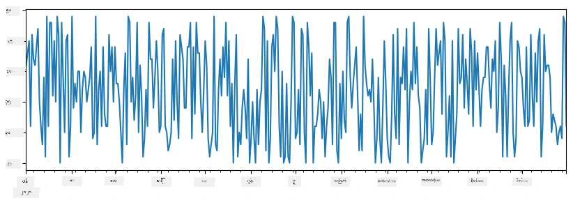
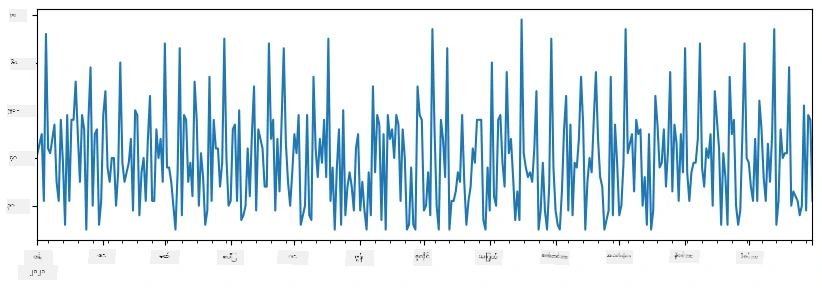
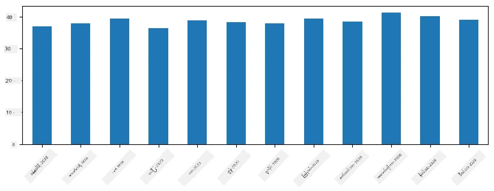
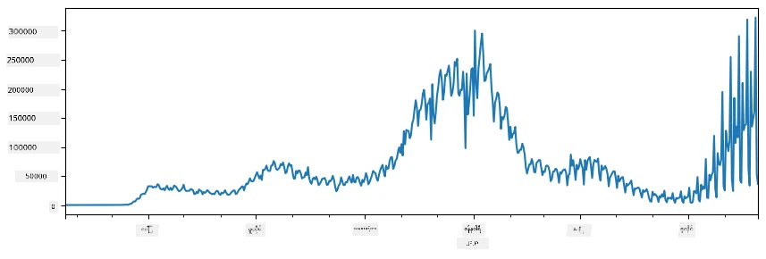
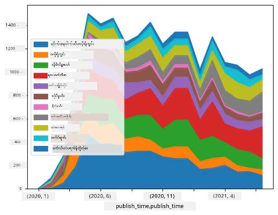

# ဒေတာနှင့်အလုပ်လုပ်ခြင်း: Python နှင့် Pandas စာကြည့်တိုက်

|  ](../../sketchnotes/07-WorkWithPython.png) |
| :-------------------------------------------------------------------------------------------------------: |
|                 Python ဖြင့် အလုပ်လုပ်ခြင်း - _Sketchnote by [@nitya](https://twitter.com/nitya)_                 |

[](https://youtu.be/dZjWOGbsN4Y)

ဒေတာဘေ့စ်များသည် ဒေတာကို သိမ်းဆည်းရန် နှင့် query ဘာသာစကားများကို အသုံးပြု၍ query ဆွဲရန် အထူးထိရောက်သောနည်းလမ်းများကို ပေးစွမ်းပေမယ့်၊ ဒေတာကို ကြီးကြပ်ဖွဲ့စည်းရန် အကောင်းဆုံးနည်းလမ်းမှာ ကိုယ့်အတွက် ကိုယ်ရေးတဲ့ ကွန်ပရိုဂရမ်ကို အသုံးပြုခြင်းဖြစ်သည်။ ဘယ်အချို့မှာတော့ database query ပြုလုပ်ခြင်းသည် ပိုပြီးထိရောက်စေမည့်နည်းလမ်းဖြစ်နိုင်ပါသည်။ သို့သော် စကားဝိုင်း အဆင့်မြင့် ဒေတာကြီးကြပ်မှု လိုအပ်သောအခါတွင် SQL ဖြင့် လွယ်ကူစွာမပြုလုပ်နိုင်ပါ။  
ဒေတာကြီးကြပ်မှုကို programming ဘာသာစကား မည်သည့်အမျိုးအစားဖြင့် မဆိုရေးနိုင်ပေမယ့် ဒေတာနှင့်အလုပ်လုပ်ရန် အဆင့်မြင့် ဘာသာစကားအချို့ ရှိပါသည်။ ဒေတာသိပ္ပံပညာရှင်များသည် အောက်ပါ ဘာသာစကားများအနက်မှတစ်ခုကို မကြာခဏ အသုံးပြုကြပါသည်-

* **[Python](https://www.python.org/)** သည် မည်သည့် ဘာသာရပ်ဆိုဒ်ရာတွင်မဆို အသုံးပြုနိုင်သော အထွေထွေ programming ဘာသာစကားဖြစ်ပြီး၊ ရိုးရှင်း လွယ်ကူကြောင့် စတင်သင်ယူသူများအကြား အကောင်းဆုံးရွေးချယ်စရာတစ်ခုအနေနှင့် သိကြသည်။ Python သည် များစွာသော ပရိုဂရမ်လိုင်ဘရီများကိုပါ အသုံးချနိုင်ပြီး၊ ဒါနဲ့ ZIP ဖိုင်ထဲမှ ဒေတာထုတ်ယူခြင်း၊ ဓာတ်ပုံကို အပြာရောင် ခြစ်ခြင်းကဲ့သို့သော လုပ်ငန်းများကို ဖြေရှင်းရန် ကူညီပေးနိုင်သည်။ ဒေတာသိပ္ပံအပြင် ဝဘ်ဆက်တင်ဖွံ့ဖြိုးရေးအတွက်လည်း နေရာယူစွာ အသုံးပြုသည်။
* **[R](https://www.r-project.org/)** သည် သီအိုရီကွန်ယက်အချက်အလက် ကြီးကြပ်မှု အထူးပြု စနစ်တခုထုတ်လုပ်ထားပြီး၊ CRAN လိုင်ဘရီ သိမ်းတည်းရာကြီးကြပ်မှုကြောင့် ဒေတာအလုပ်များအတွက် စုံလင်သည်။ သို့သော် R သည် အထွေထွေ programming ဘာသာစကား မဟုတ်ဘဲ ဒေတာသိပ္ပံနယ်ပယ်အတွင်း မကြာခဏသာ အသုံးပြုသည်။
* **[Julia](https://julialang.org/)** သည် ဒေတာသိပ္ပံအတွက် အထူးဖန်တီးထားသော ဘာသာစကားတစ်ခုဖြစ်ပြီး Python ထက် ပိုမိုမြန်ဆန်သော သုတေသနစမ်းသပ်မှုများအတွက် အသုံးပြုရန် ရည်ရွယ်ပါသည်။

ဒီသင်ခန်းစာမှာ Python ကို အသုံးပြု၍ ရိုးရှင်းသော ဒေတာကြီးကြပ်မှုကို လေ့လာပါမည်။ ဘာသာစကားကို အခြေခံ မိတ်ဆက်ပြီးသားဖြစ်ကြောင်း ယူဆပါမည်။ Python ကို ပိုမိုနက်နဲသော သင်ခန်းစာလိုပါက အောက်ပါ ရင်းမြစ်များကို ရွေးချယ် ကြည့်ရှုနိုင်သည်-

* [Learn Python in a Fun Way with Turtle Graphics and Fractals](https://github.com/shwars/pycourse) - GitHub ပေါ်တွင်ရှိသော Python programming အရှုံးအစလေးတို့ကို လျင်မြန်စွာ ရှင်းပြတဲ့ သင်ခန်းစာ
* [Take your First Steps with Python](https://docs.microsoft.com/en-us/learn/paths/python-first-steps/?WT.mc_id=academic-77958-bethanycheum) - Microsoft Learn တွင် ရရှိနိုင်သော သင်ခန်းစာလမ်းကြောင်း

ဒေတာများသည် မတူညီသော ပုံစံများဖြင့် ရရှိနိုင်ပါသည်။ ဒီသင်ခန်းစာတွင် များသောအားဖြင့် **ဇယားပုံဒေတာ (tabular data)**၊ **စာသား (text)** နှင့် **ပုံရိပ် (images)** အမျိုးအစား သုံးမျိုးကို ဖော်ပြပါမည်။

ဒေတာကြီးကြပ်မှု အမူအရာနှင့်ပတ်သက်၍ ဆုံးလတ်ပြည့်စုံသော စာကြည့်တိုက်များအား ပေးရန် မဟုတ်ဘဲ အခြေခံ ဥပမာအချို့သာ ဖော်ပြပေးမည်ဖြစ်ပြီး ဒါကနေ မင်းတို့ကို မှတ်သားနိုင်စေပြီး၊ ပြဿနာဖြေရှင်းနိုင်ရန် ရင်းမြစ်များကို စတင်သိရှိနိုင်စေဖို့ ဖြစ်ပါသည်။

> **အထောက်အကူပြု အကြံပေးချက်**။ မင်း မသိသော ဒေတာအပေါ် လုပ်ငန်းစဉ်တစ်ခု လုပ်ရန်လိုအပ်လာရင် အင်တာနက်ပေါ်တွင် ရှာဖွေကြည့်ပါ။ [Stackoverflow](https://stackoverflow.com/) တွင် Python ဖြင့် ခြားနားသည့် task များအတွက် အသုံးဝင်သော ကုဒ်ဥပမာများ များစွာပါရှိသည်။ 


## [Pre-lecture quiz](https://ff-quizzes.netlify.app/en/ds/quiz/12)

## ဇယားပုံဒေတာနှင့် Dataframes

ဆက်စပ် relational databases အကြောင်း ပြောပြချိန်တွင် ဇယားပုံဒေတာ အသိမှတ်ပြုခဲ့ပြီးသားဖြစ်သည်။ ဒေတာအရေအတွက် များပြီး တော်တော်ပါးများသော စက်ရုပ် ဘောင်တစ်ခုထဲတွင် တည်ရှိနေတဲ့အခါ သိပ်များတဲ့ SQL ဖြင့် အလုပ်လုပ်ဖို့ သင့်တော်သည်။ သို့သော် ဒေတာဇယားရှိပြီး ဒါ့အပေါ် မူတည်၍ ဒေတာကို နားလည်မှုသို့မဟုတ် အတွေးအမြင်တစ်ချို့ ရရှိရန် လိုအပ်သောအခါ (ဥပမာ distribution, correlation) တို့အတွက် တိုအချို့သော ဒေတာပြောင်းလဲခြင်းများနှင့် မြင်ကြည့်ခြင်းများ လိုအပ်နိုငကြောင်း သင်္ချိုင်းတွင် လေ့လာခဲ့သည်။ ဒေတာသိပ္ပံတွင် ဒေတာပြောင်းလဲခြင်းများ ပြုလုပ်ပြီး မြင်ရလွယ်အောင် ပြုလုပ်ရန် အများကြီးအခါစဥ်ကြုံတွေ့ရသည်။ ဒါတွေကို Python ဖြင့် လွယ်ကူစွာ ပြုလုပ်နိုင်ပါသည်။

Python တွင် ဇယားပုံဒေတာနှင့် အလုပ်လုပ်ရာတွင် အထောက်အကူပြုသော စာကြည့်တိုက် နှစ်ခုရှိသည်-
* **[Pandas](https://pandas.pydata.org/)** သည် relational ဇယားကဲ့သို့ ဖြစ်သော **Dataframes** ကို အုပ်စုဖွဲ့လိုက်လုပ်ဆောင်နိုင်သည်။ ထိုမှာ နာမည်တွဲသော ကော်လံများရှိနိုင်ပြီး အတန်းများ၊ ကော်လံများနှင့် Dataframe အားလုံးအပေါ် စိတ်ကြိုက် လုပ်ဆောင်နိုင်သည်။
* **[Numpy](https://numpy.org/)** သည် **tensors** အပေါ် အလုပ်လုပ်ရန် ထူးခြားသော စာကြည့်တိုက်ဖြစ်ပြီး multi-dimensional **arrays** မြောက်များစွာကို ကိုင်တွယ်နိုင်သည်။ Array တွင် တူညီသော အမျိုးအစား တန်ဖိုးများသာ ပါရှိပြီး Dataframe ထက် ပိုမိုလွယ်ကူသော်လည်း ဆိုင်ရာဂဏန်းဆိုင်ရာ လုပ်ဆောင်ချက်များပို၍ ပါဝင်ပြီး အလေးချိန် လည်း သက်သာစေသည်။

အခြားလည်း သိထားသင့်သော စာကြည့်တိုက်အသေးစိတ်များလည်း ရှိသည်-
* **[Matplotlib](https://matplotlib.org/)** သည် ဒေတာမြင်ကွင်းဖော်ခြင်းနှင့် ဇယားဆွဲခြင်းအတွက် အသုံးပြုသည်။
* **[SciPy](https://www.scipy.org/)** သည် အချို့သုတေသနဆိုင်ရာ function များ ပါဝင်သည့် စာကြည့်တိုက် ဖြစ်ပြီး သင်္ချိုင်းတွင် probability နှင့် statistics ဆွေးနွေးရာတွင် အစီအစဉ်တစ်ခုအဖြစ် အသုံးတည်ခဲ့ပြီးဖြစ်သည်။

Python program အစပိုင်းတွင် အောက်ပါလို အတိုင်း အသုံးပြုလေ့ရှိသော စာကြည့်တိုက်အား အတူတင်သွင်းသည့်ကုဒ်အစိတ်အပိုင်း:

```python
import numpy as np
import pandas as pd
import matplotlib.pyplot as plt
from scipy import ... # သင်လိုအပ်သော ရှင်းလင်းသော အပိုက်ကေ့ချ်များကို သတ်မှတ်ရန် လိုအပ်ပါသည်
``` 

Pandas သည် အခြေခံအရာများ အနည်းငယ်ကို အခြေခံထားသည်။

### Series 

**Series** သည် တစ်သဖြင့် အသေးစား အချက်တစ်ခုခုပင်ဖြစ်သော စီးရီးတစ်ခုဖြစ်ပြီး၊ list သို့မဟုတ် numpy array နှင့် အလားတူသည်။ အဓိကကွာခြားချက်မှာ series တွင် **index** ပါရှိပြီး series ပေါ်တွင် လုပ်ဆောင်ခြင်း (ဥပမာ ထပ်ထည့်ခြင်း) ပြုလုပ်သည့်အခါ index ကိုထည့်စဉ်းစားသည်။ index သည် integer နံပါတ်အဆင့် ဖြစ်နိုင်သည် (list သို့ array မှ series ဖန်တီးစဉ် default index ဖြစ်သည်) သို့မဟုတ် အချိန်ကာလပိုင်းလို ပိုရှုပ်ထွေးသော အစိတ်အပိုင်းလည်း ဖြစ်နိုင်သည်။

> **မှတ်ချက်**: Pandas စတင်သင်ကြားမှုနှင့်သက်ဆိုင်သော code များကို အတူတကွလာရှိသည့် notebook [`notebook.ipynb`](notebook.ipynb) တွင် ရှိပါသည်။ အောက်မှာ ဥပမာအချို့သာ ရှင်းပြထားပြီး ကိုယ်တိုင် အပြည့်အစုံ ကြည့်ရှုနိုင်ပါသည်။

ဥပမာအနေဖြင့် - ကျွန်ုပ်တို့၏ အအေးခဲဘူးရောင်းအားကို ချိတ်ဆက်စစ်ဆေးချင်ကြပါစို့။ ရက်ပေါင်းအတော်များအတွက် ရောင်းနှုန်းနံပါတ်များ စီးရီးတစ်ခု ဖန်တီးပါမည်-

```python
start_date = "Jan 1, 2020"
end_date = "Mar 31, 2020"
idx = pd.date_range(start_date,end_date)
print(f"Length of index is {len(idx)}")
items_sold = pd.Series(np.random.randint(25,50,size=len(idx)),index=idx)
items_sold.plot()
```


အခုဆိုရင်၊ ကျွန်ုပ်တို့သည် အပတ်တိုင်း သူငယ်ချင်းများအတွက်ပါတီပြုလုပ်ပြီး အပို ၁၀ စုံးအအေးခဲဘူးကို ပါတီအတွက် ယူသွားနေသည်ဆိုပါစို့။ အပတ်အလိုက် index ချထားသော ဒုတိယ စီးရီး တစ်ခု ဖန်တီးနိုင်ပါသည်-
```python
additional_items = pd.Series(10,index=pd.date_range(start_date,end_date,freq="W"))
```
Series နှစ်ခုကို ပေါင်းလျှင် စုစုပေါင်း တန်ဖိုးကို ရယူနိုင်ပါသည်-
```python
total_items = items_sold.add(additional_items,fill_value=0)
total_items.plot()
```


> **မှတ်ချက်**- simple syntax ဖြစ်သော `total_items+additional_items` ကို အသုံးမပြုပါနှင့်။ အဲဒါကို သုံးရင် ရလဒ်တွင် `NaN` (*Not a Number*) တန်ဖိုးများ များစွာ ရရှိမှာ ဖြစ်သည်။ အဲဒါမှာ `additional_items` series ၏ နောက်ဆုံး index တန်ဖိုးများ မရှိတော့လို့ ဖြစ်ပြီး NaN ကို တန်ဖိုးတစ်ခုချင်းထည့်လိုက်တော့ `NaN` ဖြစ်သွားတာပါ။ ထို့ကြောင့် ပေါင်းစပ်ရာမှာ `fill_value` parameter ကို သတ်မှတ်ရပါမည်။

time series တွင် အချိန်ကာလမျိုးစုံဖြင့် **resample** ပြုလုပ်နိုင်သည်။ ဥပမာ- တစ်လစာ ပျမ်းမျှရောင်းအားအားတွက်ချင်သောပွင့် code အောက်ပါအတိုင်းဖြစ်သည်-
```python
monthly = total_items.resample("1M").mean()
ax = monthly.plot(kind='bar')
```


### DataFrame

DataFrame သည် အခြေခံအားဖြင့် index တူညီသော series များ စုစည်းထားခြင်းဖြစ်သည်။ series များ အတူလိုက်ပြီး DataFrame ဖန်တီးနိုင်သည်-
```python
a = pd.Series(range(1,10))
b = pd.Series(["I","like","to","play","games","and","will","not","change"],index=range(0,9))
df = pd.DataFrame([a,b])
```
ဒီလို horizontal ဇယားတစ်ခု ဖန်တီးပါလိမ့်မည်-
|     | 0   | 1    | 2   | 3   | 4      | 5   | 6      | 7    | 8    |
| --- | --- | ---- | --- | --- | ------ | --- | ------ | ---- | ---- |
| 0   | 1   | 2    | 3   | 4   | 5      | 6   | 7      | 8    | 9    |
| 1   | I   | like | to  | use | Python | and | Pandas | very | much |

Series များကို ကော်လံအဖြစ်အသုံးပြုပြီး ကော်လံနာမည်များကို dictionary ဖြင့် သတ်မှတ်နိုင်သည်-
```python
df = pd.DataFrame({ 'A' : a, 'B' : b })
```
ဒါမှ ဆင်တူဇယားပုံစံဖြစ်ပါသည်-

|     | A   | B      |
| --- | --- | ------ |
| 0   | 1   | I      |
| 1   | 2   | like   |
| 2   | 3   | to     |
| 3   | 4   | use    |
| 4   | 5   | Python |
| 5   | 6   | and    |
| 6   | 7   | Pandas |
| 7   | 8   | very   |
| 8   | 9   | much   |

**မှတ်ချက်**- ယခင်ဇယားကို transpose လုပ်ခြင်းဖြင့်လည်း ဒီဇယားနမူနာကို ရနိုင်သည်။ ဥပမာသည်-
```python
df = pd.DataFrame([a,b]).T..rename(columns={ 0 : 'A', 1 : 'B' })
```
ဤနေရာတွင် `.T` သည် DataFrame ကို rows နှင့် columns ပြောင်းခြင်းလုပ်ဆောင်ချက်ဖြစ်ပြီး `rename` သည် ကော်လံနာမည် ပြောင်းရန် သုံးသည်။

DataFrame များအပေါ် လုပ်ဆောင်နိုင်သော အရေးကြီးဆုံးလုပ်ငန်းစဉ်အချို့မှာ-

**ကော်လံရွေးချယ်ခြင်း**။ ထုတ်ယူလိုသည့်ကော်လံကို `df['A']` ဟုပြီး ရေးရုံဖြင့် ရွေးချယ်နိုင်ပြီး အဲဒါ Series ကိုပြန်ပေးသည်။ ကော်လံအစုအဝေးကို `df[['B','A']]` ဟုပြီး ရွေးချယ်လည်း ဤအခါ DataFrame ကိုပြန်ပေးသည်။

**အတန်းများကို စစ်ထုတ်ခြင်း**။ ဥပမာ ကော်လံ `A` ၏တန်ဖိုးသည် ၅ ထက်ကြီးသောအတန်းများသာ ကြည့်ချင်ရင် `df[df['A']>5]` ဟု ရေးနိုင်သည်။

> **မှတ်ချက်** - စစ်ထုတ်ပုံသည် `df['A']<5` လိုရေးသည့်အခါ boolean series တစ်ခုရရှိပြီး၊ ဒါက `True`/`False` ကို original series `df['A']` ၏ မူရင်း တန်ဖိုးအလိုက်ပြန်ပြောသည်။ Boolean series ကို index အဖြစ်သုံးရင် DataFrame ၏ အတန်းများတစ်စုကို ပြန်ပေးသည်။ ထို့ကြောင့် Python boolean expression များကို တိုက်တိုက်ဆင့် ရေး၍ မရဘူး။ ဥပမာ၊ `df[df['A']>5 and df['A']<7]` ဟုရေးရင် မှားနေသည်။ အဲဒီအစား `df[(df['A']>5) & (df['A']<7)]` (ပုံကြီးကို စောင့်ရပါမယ်) ဟုပြောရမည်။

**ဖန်တီးနိုင်သောကော်လံအသစ်ပြုလုပ်ခြင်း**။ အောက်ပါကဲ့သို့သင့် DataFrame အတွက် တန်ဖိုးတွက်နိုင်သည့် ကော်လံအသစ်များရရှိရန် ရိုးရာ လွယ်ကူသောဖော်ပြချက်များဖြင့် ပြုလုပ်နိုင်သည်-
```python
df['DivA'] = df['A']-df['A'].mean() 
``` 
ဤဥပမာတွင် A ၏ ပျမ်းမျှတန်ဖိုးနှင့်သော အရွား ရွေးချယ်ချက်သည်။ ကောင့်လုပ်သည်မှာ series တစ်ခု တွက်ချက်ပြီး ဘယ်ဘက်ရိုးနေရာတွင် သတ်မှတ်ထားခြင်းဖြစ်သည်။ အဲဒီကြောင့် series မဟုတ်သော operation များ မလူနဲ့နိုင်ပါ၊ ဥပမာအောက်ပါကုဒ် မှားနေပါသည်-
```python
# မှားနေသော ကုဒ် -> df['ADescr'] = "Low" if df['A'] < 5 else "Hi"
df['LenB'] = len(df['B']) # <- မှားနေသော ရလဒ်
``` 
နောက်ဆုံး အထဲမှာ syntax မှန်သော်လည်း မမှန်သောရလဒ်ပေါ်လာပြီး ၊ series `B` ၏ အရှည်ကို ကော်လံတစ်ခုလုံး အတွက် ရှင်းပြသွားသည်၊ အသေးစိတ် element တစ်ခုချင်း၏ အရှည်မဟုတ်ခြင်း ဖြစ်သည်။

ရှုပ်ထွေးသော ဖော်ပြချက်များရှိလျှင် `apply` လုပ်ဆောင်ချက်ကို အသုံးပြုနိုင်သည်။ နောက်ဆုံးဥပမာကို အောက်ပါအတိုင်း ပြင်ဆင်ရေးသားနိုင်သည်-
```python
df['LenB'] = df['B'].apply(lambda x : len(x))
# သို့မဟုတ်
df['LenB'] = df['B'].apply(len)
```

အထက်ဖော်ပြသည့် ဆက်လက်လုပ်ဆောင်ချက်များပြီးနောက် ရလာသည့် DataFrame -

|     | A   | B      | DivA | LenB |
| --- | --- | ------ | ---- | ---- |
| 0   | 1   | I      | -4.0 | 1    |
| 1   | 2   | like   | -3.0 | 4    |
| 2   | 3   | to     | -2.0 | 2    |
| 3   | 4   | use    | -1.0 | 3    |
| 4   | 5   | Python | 0.0  | 6    |
| 5   | 6   | and    | 1.0  | 3    |
| 6   | 7   | Pandas | 2.0  | 6    |
| 7   | 8   | very   | 3.0  | 4    |
| 8   | 9   | much   | 4.0  | 4    |

**အကောင့်နံပါတ်အားဖြင့် အတန်းရွေးချယ်ခြင်း**ကို `iloc` ကိုသုံးနိုင်သည်။ ဥပမာ DataFrame ၏ ပထမဆုံး ၅ ခုသောအတန်းများ ရွေးချယ်ရန်-
```python
df.iloc[:5]
```

**Group လုပ်ခြင်း**သည် Excel ဒေတာ့ pivot table ကဲ့သို့ ထွက်ရှိစေရန် အသုံးပြုသည်။ ကော်လံ `A` ၏ ပျမ်းမျှတန်ဖိုးကို `LenB` အလိုက် ကွဲပြားသောအုပ်စုများအတွက်တွက်ချင်သောအခါ Group by ရေးပြီး `mean` ခေါ်နိုင်သည်-
```python
df.groupby(by='LenB')[['A','DivA']].mean()
```
ပို၍ ခက်ခဲသော အုပ်စုဆိုင်ရာ `aggregate` function ကို လည်း အသုံးပြုနိုင်သည်-
```python
df.groupby(by='LenB') \
 .aggregate({ 'DivA' : len, 'A' : lambda x: x.mean() }) \
 .rename(columns={ 'DivA' : 'Count', 'A' : 'Mean'})
```
ဤကဲ့သို့ဇယားရရှိသည်-

| LenB | Count | Mean     |
| ---- | ----- | -------- |
| 1    | 1     | 1.000000 |
| 2    | 1     | 3.000000 |
| 3    | 2     | 5.000000 |
| 4    | 3     | 6.333333 |
| 6    | 2     | 6.000000 |

### ဒေတာရယူခြင်း
Python objects များမှ Series နှင့် DataFrames များကို တည်ဆောက်ခြင်း များ ရိုးရှင်းသည်ကို ကျွန်ုပ်တို့ မြင်ခဲ့ပါပြီ။ သို့ရာတွင် ဒေတာသည် ပုံမှန်အားဖြင့် စာသားဖိုင် သို့မဟုတ် Excel ဇယားဖြစ်လာလေ့ရှိသည်။ ကံကောင်းစွာ ဖြင့် Pandas သည် ဒေတာကို disk မှ မောင်းယူရန် ရိုးရှင်းသည့်နည်းလမ်း တစ်ခုကို ပံ့ပိုးပေးသည်။ ဥပမာ CSV ဖိုင်ကို ဖတ်ခြင်းသည် အောက်ပါအတိုင်း ရိုးရှင်းသည်။
```python
df = pd.read_csv('file.csv')
```
ကျွန်ုပ်တို့သည် "Challenge" အပိုင်းတွင် ဝက်ဘ်ဆိုဒ်များမှ ဒေတာကို ရယူခြင်း အပါအဝင် ဒေတာ မောင်းယူခြင်း၏ ဥပမာများ ပိုမို ကြည့်ရှုရမည်ဖြစ်သည်


### ပုံနှိပ်ခြင်းနှင့် ပလော့ခြင်း

Data Scientist တစ်ဦးသည် မကြာခဏ ဒေတာကို လေ့လာရန်လိုအပ်သည်၊ ထို့ကြောင့် ဒေတာကို မြင်မြင်ရရ အလင်းပုံဖော်နိုင်ရန် အရေးကြီးသည်။ DataFrame သည် ကြီးမားလျှင် ပုံမှန်အားဖြင့် ပထမဆုံး အတန်းများအနည်းငယ်ကိုပဲ ပုံနှိပ်သုံးသပ်လိုသည်။ ၎င်းကို `df.head()` ကို ခေါ်ဆိုခြင်းဖြင့် ပြုလုပ်နိုင်သည်။ Jupyter Notebook မှ run လုပ်ပါက DataFrame ကို ကောင်းမွန်သော ဇယားပုံစံဖြင့် ပုံနှိပ်ပြပါမည်။

ကျွန်ုပ်တို့သည် ဆော်လစ် `plot` function ကို တချို့ကော်လံများကို ဂရပ်ဖ်ဆွဲရန် အသုံးပြုသည့် နည်းလမ်းကိုလည်း မြင်ခဲ့ပါသည်။ `plot` သည် အများအပြားလုပ်ငန်းများအတွက် အသုံးဝင်ပြီး `kind=` ပရမီတာမှတဆင့် ကွဲပြားသည့် ဂရပ်ဖ်အမျိုးအစားများကို ယူဆောင်ပေးသည်။ သို့သော် ပို၍ရှုပ်ထွေးသော ပုံစံများ版အတွက် မူရင်း `matplotlib` စာကြည့်တိုက်ကို စိတ်ကြိုက် အသုံးပြုနိုင်သည်။ ဒေတာမြင်ကွင်းဖော်ခြင်းကို သီးခြားသင်ခန်းစာများတွင် အသေးစိတ်ဖေါ်ပြမည်ဖြစ်သည်။

ဤအနှစ်ချုပ်သည် Pandas ၏ အရေးကြီးသော အယူအဆများ၏ အများစုကို ဖော်ပြခြင်းဖြစ်သော်လည်း ၎င်းစာကြည့်တိုက်သည် အလွန်ဆန်းသစ်ပြီး မည်သည့်အရာမျှ မလျှော့ပယ်နိုင်ပါ။ ယခု Knowledge များကို သတ်မှတ်ထားသော ပြဿနာကို ဖြေရှင်းရန် အသုံးပြုပို့ကြပါစို့။

## 🚀 Challenge 1: COVID ကူးစက်သည့် ဖန်တီးမှု ခွဲခြမ်းစိတ်ဖြာခြင်း

ကျွန်ုပ်တို့ အလေးပေးမည့် ပထမဆုံး ပြဿနာမှာ COVID-19 ရောဂါကူးစက်မှု မော်ဒယ်တစ်ခုကို တည်ဆောက်ခြင်း ဖြစ်သည်။ ၎င်းအတွက်ဘယ်လိုလုပ်မလဲဆိုသည်မှာ လူမျိုးနိုင်ငံအလိုက် ကူးစက်ခံရသူနံပါတ်များကို [Center for Systems Science and Engineering](https://systems.jhu.edu/) (CSSE) မှ [Johns Hopkins University](https://jhu.edu/) ပေးသည့် ဒေတာကို အသုံးပြုမည်ဖြစ်သည်။ ဒေတာစုံစုသည် [ဤ GitHub Repository](https://github.com/CSSEGISandData/COVID-19) တွင် ရရှိနိုင်သည်။

ဒေတာကို ကိုင်တွယ်သည့်နည်းကို ဖော်ပြရန် ရည်ရွယ်၍ [`notebook-covidspread.ipynb`](notebook-covidspread.ipynb) ကို ဖွင့်ပြီး အပေါ်မှ အောက်သို့ဖတ်ပါ။ ဆဲလ်များကို ပြီးမြောက်စွာ တည်ဆောက်လို့ရသလို၊ ကျွန်ုပ်တို့က ပေးထားသော စိန်ခေါ်မှုများကိုလည်း ပြုလုပ်နိုင်သည်။



> Jupyter Notebook တွင် code run မလုပ်နိုင်ပါက [ဤ ဆောင်းပါး](https://soshnikov.com/education/how-to-execute-notebooks-from-github/) ကိုကြည့်ပါ။

## မတိမ်မွေ့သော ဒေတာနှင့် လုပ်ကိုင်ခြင်း

ဒေတာသည် အများအားဖြင့် ဇယားအပေါ်တွင် ရှိသော်လည်း အချို့အခါတွင် ပိုမို မတိမ်မွေ့သော ဒေတာများနှင့် လုပ်ကိုင်ရလေ့ရှိသည်၊ ဥပမာ စာသား သို့မဟုတ် ပုံများ။ ထိုအခါတွင် ရှိပြီးသား ဒေတာ စီမံခန့်ခွဲရေး နည်းလမ်းများကို အသုံးချနိုင်ရန် ဆွဲထုတ်၍ **extract** ပြုလုပ်ရပါမည်။ ဥပမာအချို့မှာ-

* စာသားမှ Keyword များ ဆွဲထုတ်ပြီး၊ မည်သည့် Keyword များ အကြိမ်ကြိမ် ကြားနေရသည်ကို စစ်ဆေးခြင်း
* ပုံရိပ်ပေါ်ရှိ အရာဝတ္ထုများအကြောင်း အချက်အလက် ထုတ်ယူရန် Neural Networks များအသုံးပြုခြင်း
* ဗီဒီယို ကင်မရာ မျက်နှာဖြင့် လူများ၏ စိတ်ခံစားမှုအချက်အလက် ရယူခြင်း

## 🚀 Challenge 2: COVID စာတမ်းများ ခွဲခြမ်းစိတ်ဖြာခြင်း

ဤ စိန်ခေါ်မှုတွင် COVID ကပ်ရောဂါနဲ့ဆိုင်သော သုတေသနစာတမ်းများကို ဆက်လက်လုပ်ဆောင်မည်ဖြစ်သည်။ COVID အပေါ် စာတမ်း ၇၀၀၀ ကျော် (ရေးသားချိန်အတိုင်း) ပါရှိသည့် [CORD-19 Dataset](https://www.kaggle.com/allen-institute-for-ai/CORD-19-research-challenge) ကို Metadata နှင့် အကျဉ်းချုပ်များနှင့်အတူ ရရှိနိုင်ပြီး၊ တချို့စာတမ်းများအတွက် စာတမ်းအပြည့်အစုံလည်း ပါဝင်သည်။

[Text Analytics for Health](https://docs.microsoft.com/azure/cognitive-services/text-analytics/how-tos/text-analytics-for-health/?WT.mc_id=academic-77958-bethanycheum) ကွက်တစ်ခုသုံးပြီး ဒီ Dataset ကို ခွဲခြမ်းစိတ်ဖြာသည့် ပုံမှန်ဥပမာကို [ဤဘလော့ဂ်ဆောင်းပါး](https://soshnikov.com/science/analyzing-medical-papers-with-azure-and-text-analytics-for-health/) တွင်ဖော်ပြထားသည်။ ကျွန်ုပ်တို့သည် ၎င်းကို ရိုးရှင်းသောဗားရှင်းအား ပြုလုပ်ဆွေးနွေးမည်။

> **NOTE**: ဤ repository ၌ dataset ၏ မိတ္တူကို မပေးပါ။ Kaggle ၏ [ဤ dataset](https://www.kaggle.com/allen-institute-for-ai/CORD-19-research-challenge?select=metadata.csv) မှ [`metadata.csv`](https://www.kaggle.com/allen-institute-for-ai/CORD-19-research-challenge?select=metadata.csv) ဖိုင်ကို ဒေါင်းလုပ်ရယူရန် လိုအပ်နိုင်သည်။ Kaggle တွင် အကောင့်ဖွင့်ထားရန် မရှိမဖြစ်လိုအပ်နိုင်သည်။ ဒါမှမဟုတ် [ဤနေရာမှ](https://ai2-semanticscholar-cord-19.s3-us-west-2.amazonaws.com/historical_releases.html) ရရှိနိုင်သော်လည်း metadata ဖိုင်ဖြင့်အတူ စာတမ်းစာသားများ အပြည့်အစုံ ပါဝင်ပါမည်။

[`notebook-papers.ipynb`](notebook-papers.ipynb) ကို ဖွင့်ပြီး အပေါ်မှ အောက်သို့ ဖတ်ပါ။ ဆဲလ်များကို လည်း ပြုလုပ်ကာ ကျန်ရှိသည့် စိန်ခေါ်မှုများကို လေ့လာနိုင်ပါသည်။



## ပုံရိပ်ဒေတာ ကို ကိုင်တွယ်ခြင်း

မကြာသေးမီက ဒိဂျစ်တယ်ဉာဏ်ရည် (AI) စနစ်များသည် ပုံရိပ်များကို နားလည်ပုံဖေါ်နိုင်စွမ်းရှိလာသည်။ ဒီနည်းလမ်းများသည် ကြို တရားသင်ကြားထားသော neural network များ သို့မဟုတ် cloud ဝန်ဆောင်မှုများ အသုံးပြု၍ ဖြေရှင်းနိုင်သော အလုပ်များစွာ ရှိပါသည်။ ဥပမာအချို့မှာ-

* **ပုံရိပ် ခွဲခြမ်းခြင်း** (Image Classification) - ဤနည်းပညာဖြင့် ပုံရိပ်ကို ကြိုတင်သတ်မှတ်ထားသည့် အမျိုးအစားတစ်ခုသို့ စ分類နိုင်သည်။ သင်၏ပုံရိပ် ခွဲခြမ်းတွဲဖက်ရေး အတွက် [Custom Vision](https://azure.microsoft.com/services/cognitive-services/custom-vision-service/?WT.mc_id=academic-77958-bethanycheum) ကဲ့သို့သော ဆာဗစ်များကို အသုံးပြု၍ လွယ်ကူစွာ လေ့ကျင့်နိုင်သည်။
* **အရာဝတ္ထု တွေ့ရှိခြင်း** (Object Detection) - ပုံရိပ်ထဲရှိ အရာဝတ္ထုများကို ရှာဖွေဖော်ပြရန် [computer vision](https://azure.microsoft.com/services/cognitive-services/computer-vision/?WT.mc_id=academic-77958-bethanycheum) နှင့် [Custom Vision](https://azure.microsoft.com/services/cognitive-services/custom-vision-service/?WT.mc_id=academic-77958-bethanycheum) အကူအညီဖြင့် ထိရောက်စွာ ဖြေရှင်းနိုင်သည်။
* **မျက်နှာ တွေ့ရှိခြင်း** (Face Detection) - အသက်၊ကျားမနှင့် စိတ်ခံစားမှုများ ဖော်ထုတ်ခြင်းတို့ကို [Face API](https://azure.microsoft.com/services/cognitive-services/face/?WT.mc_id=academic-77958-bethanycheum) ဖြင့် ဆောင်ရွက်နိုင်သည်။

အဆိုပါ cloud ဝန်ဆောင်မှုများကို [Python SDKs](https://docs.microsoft.com/samples/azure-samples/cognitive-services-python-sdk-samples/cognitive-services-python-sdk-samples/?WT.mc_id=academic-77958-bethanycheum) အသုံးပြု၍ ခေါ်ယူနိုင်ပြီး ဒေတာလေ့လာခြင်းအတွက် စက်လည်မှုတစ်ခုအဖြစ် ပေါင်းထည့်နိုင်ပါသည်။

ပုံရိပ်ဒေတာရင်းမြစ်မှ ဒေတာရှာဖွေရန် ဥပမာအချို့ကတော့-
* ဘလော့ဂ် စာမျက်နှာ [How to Learn Data Science without Coding](https://soshnikov.com/azure/how-to-learn-data-science-without-coding/) တွင် Instagram ဓာတ်ပုံများကို လေ့လာ၍ မည်သည့်အချက်များကြောင့် လူများသည် ဓာတ်ပုံကို ပို၍ ကြိုက်နှစ်သက်သနည်း ကို နားလည်ရန် ကြိုးပမ်းသည်။ ပထမဦးစွာ [computer vision](https://azure.microsoft.com/services/cognitive-services/computer-vision/?WT.mc_id=academic-77958-bethanycheum) သုံး၍ ဓာတ်ပုံမှ အချက်အလက်များ စုဆောင်းထားပြီး ထို့နောက် [Azure Machine Learning AutoML](https://docs.microsoft.com/azure/machine-learning/concept-automated-ml/?WT.mc_id=academic-77958-bethanycheum) ဖြင့် တိကျသောမော်ဒယ်တစ်ခု ဖန်တီးခဲ့သည်။
* [Facial Studies Workshop](https://github.com/CloudAdvocacy/FaceStudies) တွင် မျက်နှာ API ကို အသုံးပြုပြီး ပွဲမှဓာတ်ပုံများမှ လူများ၏ စိတ်ခံစားမှုများကို ဆွဲထုတ်ကာ မည်သည့်အချက်များကြောင့် လူများ ပျော်ရွှင်သည်ဆိုသည်ကို သိရှိရန် ကြိုးစားသည်။

## နိဂုံးချုပ်

သင်မှာ အဆင်းကျသော ဒေတာမျိုး ဖြစ်ပါစေ မတိမ်မွေ့သောဒေတာ ဖြစ်ပါစေ၊ Python ကို အသုံးပြု၍ ဒေတာဆိုင်ရာ လုပ်ငန်းဆောင်တာအားလုံးကို လုပ်ဆောင်နိုင်သည်။ ဒေတာ ကိုင်တွယ်ရန် အများဆုံးလွယ်ကူပြီး မည်သည့်အကြောင်းအရင်းကြောင့် ဆိုမည်ဆိုရင် Data Scientist အများစုသည် Python ကို သူတို့၏ ပထမဆုံးကိရိယာအဖြစ် အသုံးပြုကြသည်။ သင်၏ ဒေတာသိပ္ပံခရီးကို ကျင့်ကြံကောင်းစွာ ဆက်လက်လေ့လာရန် Python ကို နက်နဲစွာလေ့လာသင့်သည်ဟု ထင်ပါသည်။

## [Post-lecture quiz](https://ff-quizzes.netlify.app/en/ds/quiz/13)

## ပြန်လည်သုံးသပ်ခြင်းနှင့် ကိုယ်တိုင်လေ့လာမှု

**စာအုပ်များ**
* [Wes McKinney. Python for Data Analysis: Data Wrangling with Pandas, NumPy, and IPython](https://www.amazon.com/gp/product/1491957662)

**အွန်လိုင်း အရင်းအမြစ်များ**
* တရားဝင် [10 minutes to Pandas](https://pandas.pydata.org/pandas-docs/stable/user_guide/10min.html) သင်ခန်းစာ
* [Pandas Visualization အတွက် စာတမ်း](https://pandas.pydata.org/pandas-docs/stable/user_guide/visualization.html)

**Python ကို လေ့လာခြင်း**
* [Turtle Graphics နှင့် Fractals ဖြင့် စိတ်ဝင်စားဖွယ် Python လေ့လာခြင်း](https://github.com/shwars/pycourse)
* [Python နဲ့ ပထမဆုံး ခြေလှမ်းများ](https://docs.microsoft.com/learn/paths/python-first-steps/?WT.mc_id=academic-77958-bethanycheum) Microsoft Learn တွင်

## အလုပ်တာဝန်

[အထက်ဖော်ပြထားသောစိန်ခေါ်မှုများအတွက် ပိုမိုအသေးစိတ် ဒေတာလေ့လာရေး ပြုလုပ်ပါ](assignment.md)

## အထောက်အပံ့များ

ဤသင်ခန်းစာကို ♥️ဖြင့် [Dmitry Soshnikov](http://soshnikov.com) မှရေးသားထားသည်။

---

<!-- CO-OP TRANSLATOR DISCLAIMER START -->
**ပြောကြားချက်**
ဤစာတမ်းကို AI ဘာသာပြန်ဝန်ဆောင်မှု [Co-op Translator](https://github.com/Azure/co-op-translator) အသုံးပြု၍ ဘာသာပြန်ထားပါသည်။ ကျွန်ုပ်တို့သည် တိကျမှန်ကန်မှုအတွက် ကြိုးပမ်းနေသော်လည်း၊ စက်ကိရိယာဘာသာပြန်ခြင်းများတွင် အမှားများ သို့မဟုတ် မှားယွင်းချက်များ ပါဝင်နိုင်ကြောင်း သတိပြုပါရန် လိုအပ်ပါသည်။ မူလစာတမ်းကို မူရင်းဘာသာဖြင့်သာ ယုံကြည်စိတ်ချရသော အချက်အလက်အဖြစ် သတ်မှတ်သင့်သည်။ အရေးကြီးသည့် သတင်းအချက်အလက်များအတွက် ပရော်ဖက်ရှင်နယ် လူသားဘာသာပြန်သူဝန်ဆောင်မှုကို အကြံပြုပါသည်။ ဤဘာသာပြန်ချက်ကို အသုံးပြုခြင်းမှ ဖြစ်ပေါ်လာသော နားလည်မှုကွာခြားမှုများ သို့မဟုတ် မမှန်ကန်သော အသုံးပြုမှုများအတွက် ကျွန်ုပ်တို့ တာဝန်မခံပါ။
<!-- CO-OP TRANSLATOR DISCLAIMER END -->