# Cloud တွင် Data Science: "Low code/No code" နည်းလမ်း

| ](../../sketchnotes/18-DataScience-Cloud.png)|
|:---:|
| Cloud တွင် Data Science: Low Code - _Sketchnote by [@nitya](https://twitter.com/nitya)_ |

အကြောင်းအရာဇယား:

- [Cloud တွင် Data Science: "Low code/No code" နည်းလမ်း](#cloud-တွင်-data-science-low-codeno-code-နည်းလမ်း)
  - [နောက်တန်းစာမေးခွန်း](#နောက်တန်းစာမေးခွန်း)
  - [1. နိဒါန်း](#1-နိဒါန်း)
    - [1.1 Azure Machine Learning ကဘာလဲ?](#11-azure-machine-learning-ကဘာလဲ)
    - [1.2 နှလုံးပျက်စီးမှု ခန့်မှန်းမှု စုစည်းမှု](#12-နှလုံးပျက်စီးမှု-ခန့်မှန်းမှု-စုစည်းမှု)
    - [1.3 နှလုံးပျက်စီးမှု ဒေတာစုစည်းမှု](#13-နှလုံးပျက်စီးမှု-ဒေတာစုစည်းမှု)
  - [2. Azure ML Studio တွင် Low code/No code မော်ဒယ် လေ့ကျင့်ခြင်း](#2-azure-ml-studio-တွင်-low-codeno-code-မော်ဒယ်-လေ့ကျင့်ခြင်း)
    - [2.1 Azure ML workspace တစ်ခု ဖန်တီးခြင်း](#21-azure-ml-workspace-တစ်ခု-ဖန်တီးခြင်း)
    - [2.2 ကွန်ပျူတာ အရင်းအမြစ်များ](#22-ကွန်ပျူတာအရင်းအမြစ်များ)
      - [2.2.1 ကွန်ပျူတာ အရင်းအမြစ်များအတွက် မှန်ကန်သော ရွေးချယ်မှုများ](#221-သင့်ကုွန်ပျူတာအရင်းအမြစ်များအတွက်-မှန်ကန်သောရွေးချယ်စရာများ)
      - [2.2.2 Compute cluster ဖန်တီးခြင်း](#222-ကွန်ပျူတာအုပ်စု-တည်ဆောက်ခြင်း)
    - [2.3 ဒေတာစုစည်းမှုကို တင်သွင်းခြင်း](#23-ဒေတာစုစည်းမှုတင်ခြင်း)
    - [2.4 AutoML ဖြင့် Low code/No code လေ့ကျင့်ခြင်း](#24-low-codeno-code-training-နှင့်-automl)
  - [3. Low code/No code မော်ဒယ် ပို့ဆောင်ခြင်းနှင့် endpoint အသုံးပြုခြင်း](#3-low-codeno-code-မော်ဒယ်-ထည့်သွင်းခြင်းနှင့်-endpoint-အသုံးပြုခြင်း)
    - [3.1 မော်ဒယ် ပို့ဆောင်ခြင်း](#31-မော်ဒယ်-ထည့်သွင်းခြင်း)
    - [3.2 Endpoint အသုံးပြုခြင်း](#32-endpoint-အသုံးပြုခြင်း)
  - [🚀 စိန်ခေါ်မှု](#-challenge)
  - [နောက်တန်းစာမေးခွန်း](#စာသင်ခန်းပြီး-quiz)
  - [ပြန်လည်သုံးသပ်ခြင်းနှင့် ကိုယ်တိုင်လေ့လာမှု](#review--self-study)
  - [တာဝန်ခံမှု](#ပေးအပ်ထားသော-လေ့ကျင့်မှုများ)
  
## [နောက်တန်းစာမေးခွန်း](https://ff-quizzes.netlify.app/en/ds/quiz/34)

## 1. နိဒါန်း
### 1.1 Azure Machine Learning ကဘာလဲ?

Azure cloud ပလက်ဖောင်းသည် သင့်အား ဖြေရှင်းချက်အသစ်များ တည်ဆောက်နိုင်ရန် အထောက်အကူဖြစ်စေဖွယ် ပစ္စည်းနှင့် cloud ဝန်ဆောင်မှု ၂၀၀ ကျော် ထုတ်လုပ်ထားသည်။
ဒေတာသိပ္ပံပညာရှင်များသည် ဒေတာကို စူးစမ်းခြင်းနှင့် ကြိုတင် ပြင်ဆင်ခြင်းများကို များစွာ ကြိုးစားပြီး မော်ဒယ်လေ့ကျင့်မှု အမျိုးမျိုးကို စမ်းသပ်ကာ တိကျမှန်ကန်သော မော်ဒယ်များ ထုတ်လုပ်ရန် ကြိုးပမ်းတတ်ကြသည်။ ၎င်းများသည် အချိန်ကုန်ပြီး ထုတ်လုပ်မှု့စျေးကြီးသော ကွန်ပျူတာ ဆိပ်ကမ်းပစ္စည်းများကို မထိရောက်စွာ အသုံးပြုတတ်သည်။

[Azure ML](https://docs.microsoft.com/azure/machine-learning/overview-what-is-azure-machine-learning?WT.mc_id=academic-77958-bethanycheum&ocid=AID3041109) သည် Azure တွင် machine learning ဖြေရှင်းချက်များ တည်ဆောက်ခြင်းနှင့် စီမံခန့်ခွဲရန် cloud-အခြေပြု ပလက်ဖောင်းတစ်ခုဖြစ်သည်။ ဒေတာသိပ္ပံပညာရှင်များ အတွက် ဒေတာ ပြင်ဆင်ခြင်း၊ မော်ဒယ်လေ့ကျင့်ခြင်း၊ ခန့်မှန်း ဝန်ဆောင်မှုများ ပေါက်ထွက်ခြင်းနှင့် အသုံးပြုမှုများကိုစောင့်ကြည့်ခြင်းဆိုင်ရာ အင်္ဂါရပ်များနှင့် စွမ်းရည်များစွာ ပါဝင်သည်။ အရေးကြီးဆုံးအချက်မှာ မော်ဒယ်လေ့ကျင့်ရာတွင် အချိန်ကုန်သက်သာမှုရှိသော တာဝန်များကို အလိုအလျောက် လှုံ့ဆော်ပေးပြီး ရောနှောသော ဒေတာပမာဏများကို တက်ကြွစွာ ကိုင်တွယ်နိုင်ပြီး အသုံးပြုနေစဉ်သာ စရိတ်ဖြစ်ပေါ်ရန် cloud-အခြေပြု ကွန်ပျူတာအရင်းအမြစ်များကို အသုံးပြုနိုင်ကာ ထိရောက်စွာ ထိန်းချုပ်နိုင်သည်။

Azure ML သည် မော်ဒယ်လေ့ကျင့်မှု လုပ်ဆောင်ရာတွင် developer များနှင့် ဒေတာသိပ္ပံပညာရှင်များ လိုအပ်သမျှ ကိရိယာများအားလုံးကို ပေးသည်။ ၎င်းတို့သည်-

- **Azure Machine Learning Studio**: မော်ဒယ် လေ့ကျင့်ခြင်း၊ ပို့ဆောင်ခြင်း၊ အလိုအလျောက်လုပ်ဆောင်မှု၊ တည်ဆဲမှု စောင့်ကြည့်ခြင်း နှင့် ပစ္စည်းစီမံခန့်ခွဲမှုများအတွက် low-code နှင့် no-code ဝန်ဆောင်မှုများ ပါဝင်သည့် Azure Machine Learning ၏ ဝက်ဘ်ဆိုင်ရာ ပေါ်တယ်ဖြစ်သည်။ Studio သည် Azure Machine Learning SDK နှင့် ပေါင်းစပ်၍ အတွေ့အကြုံ ပံ့ပိုးသည်။
- **Jupyter Notebooks**: ML မော်ဒယ်များကို လျင်မြန်စွာ အကြံပေးစမ်းသပ်ရန်။
- **Azure Machine Learning Designer**: မော်ဒယ် တည်ဆောက်သည့် လုပ်ထုံးလုပ်နည်းများကို ခွဲ၍ ဆွဲ၍ စမ်းသပ်ရန်ဖြစ်ပြီး နောက်မှ pipeline များ low-code ပတ်ဝန်းကျင်တွင် ပို့ဆောင်နိုင်သည်။
- **Automated machine learning UI (AutoML)**: machine learning မော်ဒယ် တီထွင်ရာ အပြောင်းအလဲများကိုအလိုအလျောက် လုပ်ဆောင်သည်၊ မြင့်မားသော ပမာဏ၊ ထိရောက်မှု နှင့် ထုတ်လုပ်မှုရှိမှုဖြင့် ML မော်ဒယ်တည်ဆောက်ပေးပြီး မော်ဒယ် အရည်အသွေး ထိန်းသိမ်းသည်။
- **Data Labelling**: ဒေတာကို အလိုအလျောက် တိကျမှန်ကန်စွာ မျှဝေရာ ML ကိရိယာ။
- **Visual Studio Code အတွက် machine learning extension**: ML ပရောဂျက်များ တည်ဆောက်ခြင်းနှင့် စီမံခန့်ခွဲမှုအတွက် အပြည့်အစုံ ဖွံ့ဖြိုးရေးပတ်ဝန်းကျင်ကို ပံ့ပိုးပေးသည်။
- **Machine learning CLI**: Command line မှတစ်ဆင့် Azure ML အရင်းအမြစ်များကို စီမံခန့်ခွဲရန် Command များ။
- **Open-source frameworks နှင့် ပေါင်းစပ်မှု**: PyTorch, TensorFlow, Scikit-learn များ၏ training, deploying နှင့် end-to-end machine learning လုပ်ငန်းစဉ်စီမံခန့်ခွဲမှုများ။
- **MLflow**: machine learning စမ်းသပ်မှုများ၏ အသက်ကြာမြင့်မှုကို စီမံခန့်ခွဲရာ open-source ไลဘ်ရယ်ရီ။ **MLFlow Tracking** သည် training run များ၏ metrics နှင့် မော်ဒယ် artifact များကို logging နှင့် tracking ပြုလုပ်သည်။

### 1.2 နှလုံးပျက်စီးမှု ခန့်မှန်းမှု စုစည်းမှု

စွမ်းခြင်းစွမ်းအား သက်သေပြရန် ပရောဂျက်တည်ဆောက်မှုသည် အကောင်းဆုံး နည်းလမ်းဖြစ်သည်မှာ ပြတ်သားစွာ မှတ်သားစရာဖြစ်သည်။ ဒီသင်ခန်းစာတွင် Azure ML Studio တွင် Low code/No code နည်းလမ်းဖြင့်နှင့် Azure ML SDK အသုံးပြု၍ နှလုံးပျက်စီးမှု ခန့်မှန်းမှု data science ပရောဂျက်တည်ဆောက်မည်ဖြစ်၍ အောက်ပါ diagram အတိုင်းပါ။

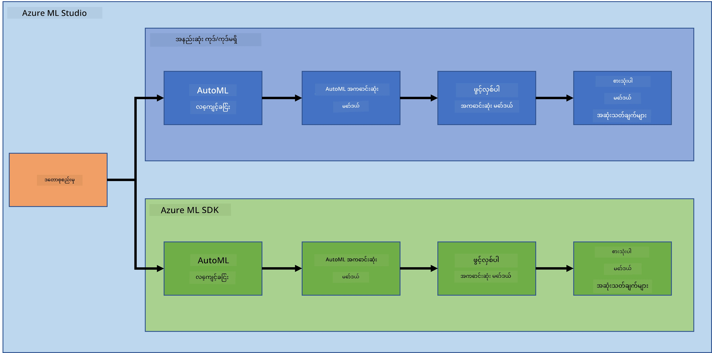

နည်းလမ်းတိုင်းတွင် အားသာချက်နှင့် အားနည်းချက် ရှိသည်။ Low code/No code နည်းလမ်းသည် GUI (Graphical User Interface) ဖြင့် လုပ်ဆောင်သည့် အတွက် ကုဒ်ရေးခြင်း မလိုဘဲ လွယ်ကူစွာ စတင်နိုင်သည်။ဤနည်းလမ်းသည် project သက်တမ်း စမ်းသပ်ရန်နှင့် POC (Proof Of Concept) ဖန်တီးရန် အထောက်အကူဖြစ်ချေသည်။ သို့သော် project ကြီးလာလျှင် production-ready ဖြစ်ရန် GUI မှန်မှန် resource ဖန်တီးခြင်း မဖြစ်နိုင်တော့ပါ။ resource ဖန်တီးခြင်းမှ မော်ဒယ် deployment အထိ အားလုံးကို အလိုအလျောက်လုပ်ရန် programmatically လုပ်နိုင်ရန် Azure ML SDK အသုံးပြုနည်း သတိပြုရသည်။

|                   | Low code/No code | Azure ML SDK              |
|-------------------|------------------|---------------------------|
| ကုဒ် ကျွမ်းကျင်မှု | မလိုအပ်ပါ         | လိုအပ်ပါ                   |
| ဖွံ့ဖြိုးရန် အချိန်   | မြန်ဆန်ပြီး လွယ်ကူသည် | ကုဒ် ကျွမ်းကျင်မှုပေါ် မူတည်သည်  |
| Production-ready   | မဟုတ်ပါ          | ဟုတ်ပါ                     |

### 1.3 နှလုံးပျက်စီးမှု ဒေတာစုစည်းမှု

ကမ္ဘာ့အဆိုးဆုံး သေဆုံးမှုအကြောင်းရင်း ၁ ဖြစ်သည့် Cardiovascular ရောဂါများ (CVDs)သည် ကမ္ဘာတစ်ဝှမ်းတွင် သေဆုံးမှုများ၏ ၃၁% ကို ဖြစ်စေသည်။ ဆေးလိပ်သောက်သည်၊ စားသောက်မှားယွင်းမှုများနှင့် လေးစားထားသည့်အကဲဖြတ်ချက်မဟုတ်သည့် အစားအသောက်၊ ရုပ်ပိုင်းဆိုင်ရာ လှုပ်ရှားမှုနည်းသောစိတ်နေစိတ်ထား၊ အရက်စားမှုများအပါအဝင် ပတ်ဝန်းကျင်နှင့် ကျင့်သုံးမှုဆိုင်ရာ လိုအပ်သော အချက်များကို ခန့်မှန်းမှု မော်ဒယ်များတွင် တစ်ခုတည်း feature များအဖြစ် အသုံးပြုနိုင်သည်။ CVD ဖြစ်ရက်ရှိကြောင်း ခန့်မှန်းခြေပြုနိုင်ခြင်းသည် အန္တရာယ်အများကြီးရှိသော လူများကို တားဆီးရန် အကျိုးရှိစေသည်။

Kaggle သည် အများပြည်သူ သုံးစွဲနိုင်ရန် [Heart Failure dataset](https://www.kaggle.com/andrewmvd/heart-failure-clinical-data) ကို ထုတ်ဝေထားပြီး ၎င်းကို ဒီ project အတွက် သုံးမည် ဖြစ်သည်။ ဒေတာကို ယခုဒေါင်းလုဒ်နိုင်သည်။ ဒီ dataset သည် ၁၃ ကော်လံ (12 feature နှင့် 1 target variable)နှင့် 299 စာကြောင်း ပါဝင်သည်။ 

|    | Variable name             | Type            | Description                                               | Example           |
|----|---------------------------|-----------------|-----------------------------------------------------------|-------------------|
| 1  | age                       | ရက်စက်           | လူနာ၏ အသက်                                            | 25                |
| 2  | anaemia                   | အမှန်/အမှား         | ခန္ဓာကိုယ်တွင် သွေးလောင်ခြင်း သို့မဟုတ် haemoglobin လျော့နည်းခြင်း            | 0 or 1            |
| 3  | creatinine_phosphokinase  | ရက်စက်           | သွေးထဲရှိ CPK အင်ဇိုင်မှု အဆင့်                          | 542               |
| 4  | diabetes                  | အမှန်/အမှား         | လူနာတွင် ဆီးချို ရှိ/မရှိ                               | 0 or 1            |
| 5  | ejection_fraction         | ရက်စက်           | နှလုံး၏ contraction တစ်ခုစီအတွင်း သွေးထွက်ချိန် ရာခိုင်နှုန်း | 45                |
| 6  | high_blood_pressure       | အမှန်/အမှား         | လူနာတွင် သွေးတိုး ရှိ/မရှိ                              | 0 or 1            |
| 7  | platelets                 | ရက်စက်           | သွေး၏ platelets အရေအတွက်                                | 149000            |
| 8  | serum_creatinine          | ရက်စက်           | သွေးထဲရှိ serum creatinine အဆင့်                         | 0.5               |
| 9  | serum_sodium              | ရက်စက်           | သွေးထဲရှိ serum sodium အဆင့်                           | jun               |
| 10 | sex                       | အမှန်/အမှား         | အမျိုးသမီး သို့မဟုတ် အမျိုးသား                           | 0 or 1            |
| 11 | smoking                   | အမှန်/အမှား         | လူနာ တိုက်ဆိုင်နေမှု ရှိ/မရှိ                             | 0 or 1            |
| 12 | time                      | ရက်စက်           | လိုက်ရှာခြင်းကာလ (ရက်)                                  | 4                 |
|----|---------------------------|-----------------|-----------------------------------------------------------|-------------------|
| 21 | DEATH_EVENT [Target]      | အမှန်/အမှား         | လိုက်ရှာကာလအတွင်း လူနာ သေဆုံး/မသေဆုံး                    | 0 or 1            |

ဒေတာကုန်ဆုံပြီးနောက်မှာ Azure တွင် Project ကို စတင်နိုင်ပါပြီ။

## 2. Azure ML Studio တွင် Low code/No code မော်ဒယ် လေ့ကျင့်ခြင်း
### 2.1 Azure ML workspace တစ်ခု ဖန်တီးခြင်း
Azure ML တွင် မော်ဒယ်လေ့ကျင့်ရန်အတွက် ပထမတည်းမှာ Azure ML workspace တစ်ခု ဖန်တီးရပါမည်။ Workspace သည် Azure Machine Learning အတွက် အဆင့်မြင့်အရင်းအမြစ်တစ်ခုဖြစ်ကာ သင် Azure ML အသုံးပြုစဉ် ဖန်တီးသည့် နည်းလမ်းအားလုံးကို စုစည်းရာနေရာဖြစ်သည်။ Workspace သည် training run အားလုံး၏ မှတ်တမ်းများ(လော့ဂ်များ၊ metrics များ၊ output များနှင့် script များ၏ snapshot) သိမ်းဆည်းထားကာ ဘယ် training run သည် အကောင်းဆုံး မော်ဒယ်ပေးသည်ဆိုတာ ဆုံးဖြတ်ရာတွင် အသုံးပြုနိုင်သည်။ [ပိုမိုသိရှိရန်](https://docs.microsoft.com/azure/machine-learning/concept-workspace?WT.mc_id=academic-77958-bethanycheum&ocid=AID3041109)

သင်၏ OS နှင့် ကိုက်ညီသောအရင်းအမြစ် browser အသစ်ဆုံးကို အသုံးပြုရန် အကြံပေးသည်။ အောက်ဖော်ပြပါ browser များကို ပံ့ပိုးသည်-

- Microsoft Edge (Microsoft Edge အသစ်၊ နောက်ဆုံးဗားရှင်း၊ Microsoft Edge legacy မဟုတ်ရန်)
- Safari (နောက်ဆုံးဗားရှင်း၊ Mac အတွက်သာ)
- Chrome (နောက်ဆုံးဗားရှင်း)
- Firefox (နောက်ဆုံးဗားရှင်း)

Azure Machine Learning အသုံးပြုရန်အတွက် သင်၏ Azure subscription တွင် workspace တစ်ခုဖန်တီးပါ။ ထို workspace တွင် ဒေတာ၊ ကွန်ပျူတာအရင်းအမြစ်များ၊ ကုဒ်၊ မော်ဒယ်များနှင့် machine learning လုပ်ငန်းစဉ်များနှင့် ဆက်စပ်သော အရာများကို စီမံခန့်ခွဲနိုင်သည်။

> **_မှတ်ချက်:_** Azure Machine Learning workspace သည် သင်၏ subscription တွင် ရှိနေသည့်အထိ ဒေတာသိမ်းဆည်းမှုအတွက် စရိတ်သေးငယ်တစ်ချိန်ပေးရမည်ဖြစ်သောကြောင့် သင် မသုံးတော့သောအခါမှာ workspace ကို ဖျက်ပစ်ရန် အကြံပြုပါသည်။

1. [Azure portal](https://ms.portal.azure.com/) တွင် သင်၏ Microsoft အကောင့်ဖြင့် login ဝင်ပါ။
2. **＋Create a resource** ကိုရွေးချယ်ပါ
   
   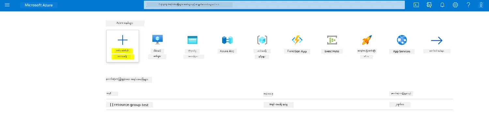

   Machine Learning ကို ရှာဖွေပြီး Machine Learning tile ကိုရွေးပါ။

   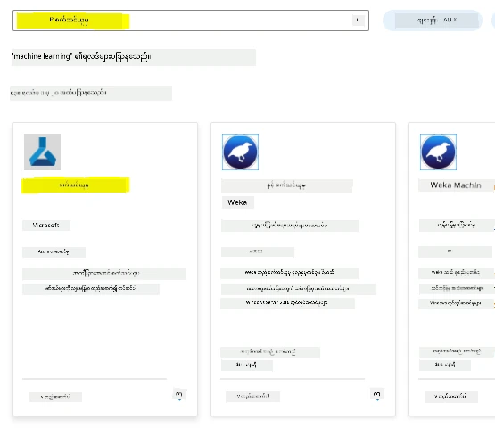

   Create ခလုတ်ကို နှိပ်ပါ။

   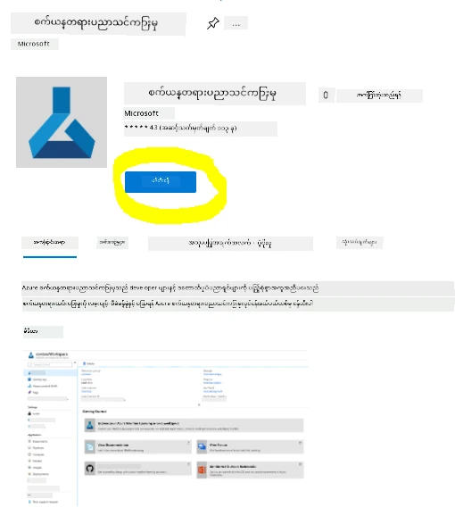

   အောက်ပါအတိုင်း ဆက်လက်ဖြည့်စွက်ပါ-
   - Subscription: သင်၏ Azure subscription
   - Resource group: resource group အသစ် ဖန်တီးရန် သို့မဟုတ် ရွေးချယ်ရန်
   - Workspace name: workspace အမည် ထည့်ရန်
   - Region: သင်နှင့် နီးစပ်သော ဒေသရွေးချယ်ပါ
   - Storage account: workspace အတွက် အလိုအလျောက် ဖန်တီးမည့် storage account ကို မှတ်သားပါ
   - Key vault: workspace အတွက် အလိုအလျောက် ဖန်တီးမည့် key vault ကို မှတ်သားပါ
   - Application insights: workspace အတွက် အလိုအလျောက် ဖန်တီးမည့် application insights resource ကို မှတ်သားပါ
   - Container registry: မရှိပါ (မော်ဒယ် ကို container သို့ ပို့ဆောင်ကြိယာ ပြုလုပ်သည့်အချိန်တွင် အလိုအလျောက် ဖန်တီးမည်)

    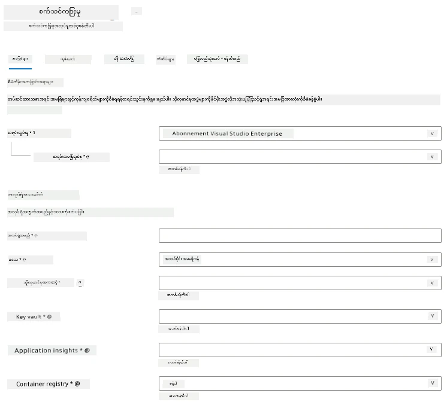

   - Create+Review ကို နှိပ်ပြီး Create ခလုတ်ကို အတည်ပြုပါ။
3. Workspace ဖန်တီးခြင်းပြီးချိန် (အချိန်လည်းပေါ့) သေချာရန် ချိန်ဆိုင်းပြီး portal တွင် သွားပါ။ Machine Learning Azure ဝန်ဆောင်မှုမှ သူ့ကို ရှာနိုင်သည်။
4. Workspace Overview စာမျက်နှာတွင် Azure Machine Learning studio ဖြင့် အကောင့် ဝင်ပါ (သို့မဟုတ် browser tab အသစ် ဖွင့်ပြီး https://ml.azure.com သို့ သွားပါ)။ Microsoft အကောင့်ဖြင့် sign in ဝင်ပြီး Azure directory နှင့် subscription, Azure Machine Learning workspace ကို ရွေးချယ်ပါ။
   
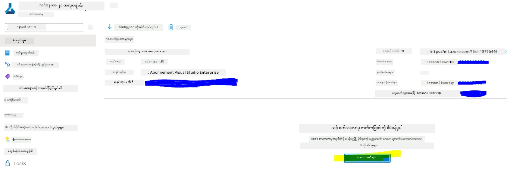

5. Azure Machine Learning studio တွင် အပေါ်ဘယ်ဘက်က ☰ လိုဂိုကို နှိပ်၍ interface တွင် ရှိ page များကို ကြည့်ရှုနိုင်ပါသည်။ သင် workspace အရင်းအမြစ်များကို စီမံရန် စာမျက်နှာများကို အသုံးပြုနိုင်သည်။

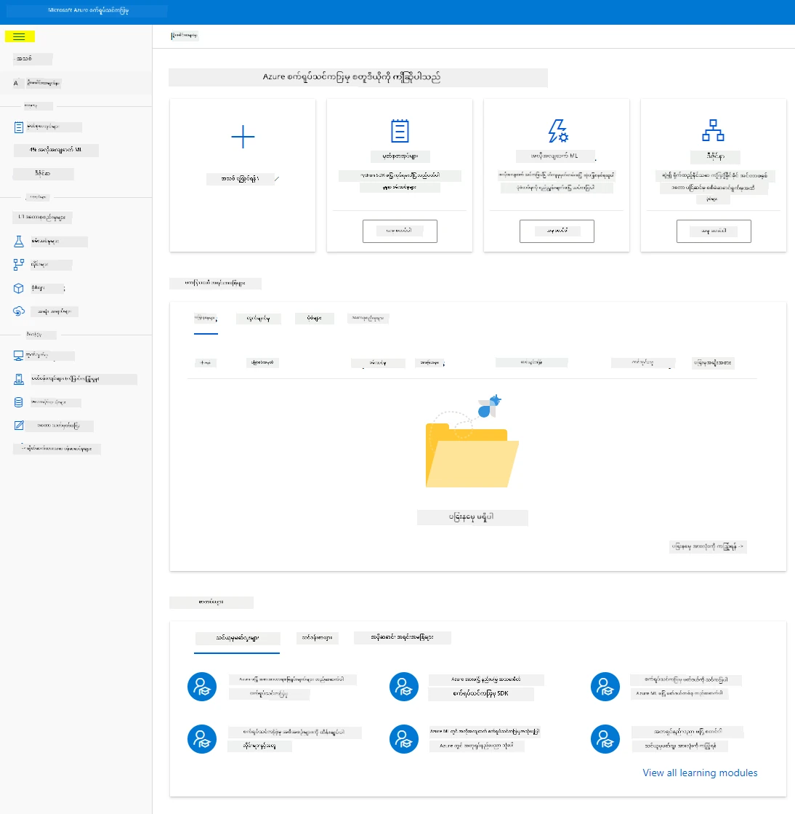

Azure portal ဖြင့် workspace ကို စီမံနိုင်သော်လည်း ဒေတာသိပ္ပံပညာရှင်များနှင့် ML operations engineers များအတွက် Azure Machine Learning Studio သည် workspace resource များကို ပိုမိုအာရုံစိုက်စွာ စီမံနိုင်သော အသုံးပြုသူ အင်တာဖေ့စ် ဖြစ်သည်။

### 2.2 ကွန်ပျူတာအရင်းအမြစ်များ

Compute Resources များသည် မော်ဒယ်လေ့ကျင့်ခြင်းနှင့် ဒေတာ စူးစမ်းရှာဖွေရေး လုပ်ငန်းများကို cloud ပေါ်တွင် လည်ပတ်ရန် သုံးသော အရင်းအမြစ်များ ဖြစ်သည်။ ဖန်တီးနိုင်သော compute resource ประเภทလေး မျိုးရှိသည်-

- **Compute Instances**: ဒေတာသိပ္ပံပညာရှင်များသည် ဒေတာနှင့် မော်ဒယ်များဖြင့် အလုပ်လုပ်ရန် အသုံးပြုသည့် ဖွံ့ဖြိုးရေး workstations ဖြစ်ပြီး Virtual Machine (VM) တစ်ခု ဖန်တီးကာ notebook instance တစ်ခု စတင်လည်ပတ်သည်။ မှတ်စုယာပေါ်မှ compute cluster ကို ခေါ်ပြီး မော်ဒယ် လေ့ကျင့်နိုင်သည်။
- **Compute Clusters**: Experiment code များကို အလိုအလျောက် လုပ်ငန်းစဉ်လိုအပ်သလို ပိုမိုကြီးမားသော VM များစုစည်းထားသော scalable cluster ဖြစ်သည်။ မော်ဒယ်လေ့ကျင့်ရာတွင် လိုအပ်ပြီး specialized GPU သို့မဟုတ် CPU အရင်းအမြစ်များကိုလည်း အသုံးပြုနိုင်သည်။
- **Inference Clusters**: သင်၏ လေ့ကျင့်ပြီး မော်ဒယ်များကို အသုံးပြု၍ ခန့်မှန်း ဝန်ဆောင်မှုများကို ပို့ဆောင်ရန် အတိုက်အခံများ။
- **အသက်ဆက်ထားသော ကွန်ပျူတာ**: Virtual Machines သို့မဟုတ် Azure Databricks clusters ကဲ့သို့ ရှိပြီးသား Azure ကွန်ပျူတာအရင်းအမြစ်များနှင့် ချိတ်ဆက်ထားသည်။

#### 2.2.1 သင့်ကုွန်ပျူတာအရင်းအမြစ်များအတွက် မှန်ကန်သောရွေးချယ်စရာများ

ကွန်ပျူတာအရင်းအမြစ်တည်ဆောက်ရာတွင် စဉ်းစားရမည့် အဓိကအချက်များအချို့ရှိပြီး ထိုရွေးချယ်မှုများသည် ဆုံးဖြတ်ချက်အတွက် အရေးကြီးသောဟူ၍ ပြုလုပ်နိုင်သည်။

**သင်အား CPU ဒါမှမဟုတ် GPU လိုအပ်ပါသလား?**

CPU (Central Processing Unit) သည် ကွန်ပျူတာပရိုဂရမ်ကို ဖွဲ့စည်းသော အညွှန်းများကို လုပ်ဆောင်ပေးသော အီလက်ထရောနစ်ဇယားဖြစ်သည်။ GPU (Graphics Processing Unit) သည် ဂရပ်ဖစ်ဆိုင်ရာ ကုတ်ကို အလွန်မြန်ဆန်စွာ လုပ်ဆောင်နိုင်သော အထူးပြု အီလက်ထရောနစ်ဇယားဖြစ်သည်။

CPU နှင့် GPU ၏ မူရင်းမတူကွာခြားချက်မှာ CPU သည် အကျယ်ပြန့်သော အလုပ်များကို အမြန်နည်းဖြင့် လုပ်ဆောင်ရန် ဒီဇိုင်းဆွဲထားပြီး (CPU ကာလမြန်နှုန်းဖြင့် တိုင်းတာသည်) တစ်ပြိုင်တည်း လုပ်ကိုင်နိုင်သော အလုပ်အရေအတွက်မှာ ကန့်သတ်ထားသည်။ GPU များကို ပိုင်းခြားတွက်ချက်မှုများအတွက် ဒီဇိုင်းဆွဲထား၍ အထူးသဖြင့် အလွန်ကောင်းမွန်သော နက်ရှိုင်းသင်ယူမှု အလုပ်များအတွက် အသုံးပြုကြသည်။

| CPU                                     | GPU                         |
|-----------------------------------------|-----------------------------|
| ကျမကျပါး                            | ပိုကျမကျပါး                |
| တစ်ပြိုင်တည်းလုပ်နိုင်မှုနည်း             | တစ်ပြိုင်တည်းလုပ်နိုင်မှုများမှုများ  |
| နက်ရှိုင်းသင်ယူမှု မော်ဒယ်တွေသင်ယူရာ ပိုနောက်ကျ | နက်ရှိုင်းသင်ယူမှုအတွက် အကောင်းဆုံး        |


**အုပ်စုအရွယ်အစား**

အုပ်စုကြီးများသည် ပိုကျစရိတ်မြင့်သော်လည်း တုံ့ပြန်ချက်ကောင်းမွန်စေနိုင်သည်။ ထို့ကြောင့် သင်တွင် အချိန်ရှိသော်လည်း ငွေမလုံလောက်ပါက အုပ်စုအသေးငယ်မှ စတင်သင့်သည်။ ပြန်လည်ဆိုပါက ငွေရှိသော်လည်း အချိန်မရှိပါက အုပ်စုကြီးမှ စတင်သင့်သည်။

**VM အရွယ်အစား**

သင့်အချိန်နှင့် စရိတ်ကန့်သတ်ချက်အပေါ် မူတည်၍ RAM၊ မိုင်းခတ်စွမ်းဆောင်ရည်၊ လေးကိုယ်နဲ့ ကလိပ်နှုန်း အရွယ်အစားများကို အမျိုးမျိုးပြောင်းလဲနိုင်သည်။ ထို parameter များအားလုံး တိုးမြှင့်ခြင်းသည် စရိတ်ကြီးမားသော်လည်း စွမ်းဆောင်ရည်ကောင်းမွန်စေသည်။

**Dedicated သို့မဟုတ် Low-Priority Instances ?**

Low-priority instance ဆိုသည်မှာ ရပ်တန့်နိုင်သည်ဟု အဓိပ္ပါယ်ရသည်။ အဓိပ္ပါယ်က Microsoft Azure သည် ထိုရင်းမြစ်များကို ယူပြီး အခြားအလုပ်တစ်ခုကို ပေးအပ်နိုင်ခြင်းဖြစ်ပြီး အလုပ်တစ်ခုကို ရပ်တန့်နိုင်သည်။ Dedicated instance သည် နားထောင်၍မရပ်တန့်နိုင်သောနေရာဖြစ်ပြီး သင်၏ ခွင့်ပြုချက်မရှိသည့်အခါ အလုပ်ကို ရပ်တန့်မည်မဟုတ်ပါ။ ဤဟာသည် အချိန်နှင့် ငွေ သုံးစွဲမှုအကြား ထပ်တူစဉ်းစားရမည့်အချက်တစ်ရပ်ဖြစ်သည်၊ ရပ်တန့်နိုင်သော instance များမှာ dedicated များထက် ပိုထော့လျော့စရိတ်ဖြစ်သည်။

#### 2.2.2 ကွန်ပျူတာအုပ်စု တည်ဆောက်ခြင်း

[Azure ML workspace](https://ml.azure.com/) ထဲသို့ သွားပြီး ကွန်ပျူတာတွင်သွားပါက ယခုဆွေးနွေးသမျှ ကွန်ပျူတာအရင်းအမြစ် များ (ကုွန်ပျူတာ instance များ၊ compute cluster များ၊ inference cluster များနှင့် attached compute များ) ကို မြင်ရမည်ဖြစ်သည်။ ဤပရောဂျက်အတွက် မော်ဒယ်လေ့ကျင့်ခြင်းအတွက် compute cluster လိုအပ်သည်။ Studio တွင် "Compute" မီနူးကို နှိပ်ပြီး "Compute cluster" tab တွင် "+ New" ခလုတ်ကို နှိပ်ကာ compute cluster အသစ်တည်ဆောက်ပါ။

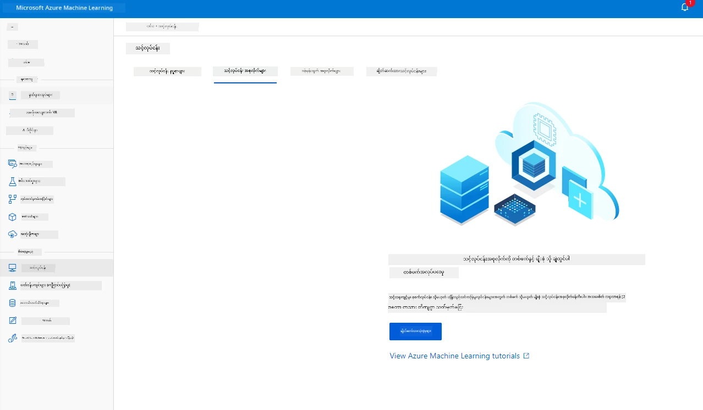

1. သင့်အတွက် ရွေးချယ်စရာများ: Dedicated vs Low priority, CPU လား GPU လား, VM အရွယ်အစားနှင့် core အရေအတွက် (ဤပရောဂျက်အတွက် default ဆက်တင်များကို ထိန်းသိမ်းနိုင်သည်)။
2. Next ခလုတ်ကို နှိပ်ပါ။

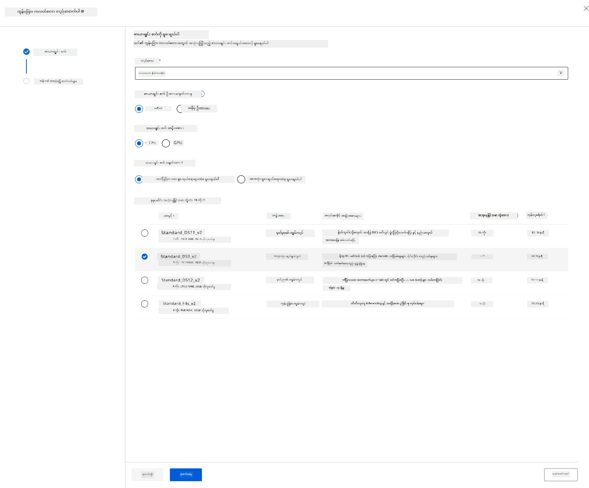

3. cluster အမည်ပေးပါ။
4. သင့်အတွက် ရွေးချယ်စရာများ: အနည်းဆုံး/အများဆုံး node အရေအတွက်၊ scale down မလုပ်မီ ရပ်နားထားသည့် စက္ကန့်၊ SSH access။ အနည်းဆုံး node အရေအတွက်ကို 0 သတ်မှတ်ထားပါက cluster မည်သည်အချိန်မဆို ရပ်နားသည့်အခါ ငွေစုဆောင်းနိုင်သည်။ အများဆုံး node အရေအတွက်များရှိသည့်အချိန် training ၏ အချိန်ကောင်လည်း ပိုတို သွားမည်ဖြစ်သည်။ အကြံပြုထားသည့် အများဆုံး node အရေအတွက်မှာ 3 ဖြစ်သည်။
5. "Create" ခလုတ်ကို နှိပ်ပါ။ ဤအဆင့်သည် မိနစ်အနည်းငယ် ကြာမြင့်နိုင်သည်။

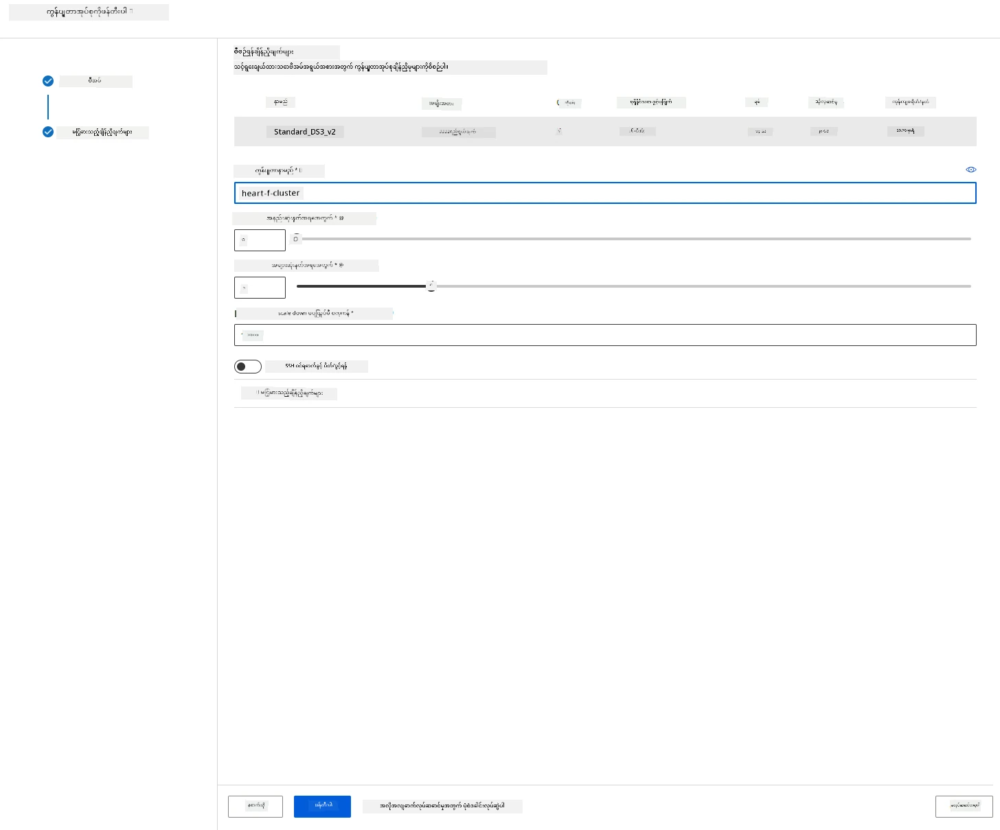

အံ့သြဖွယ်! Compute cluster ရရှိပြီနောက် Azure ML Studio သို့ ဒေတာကို တင်ရမည်။

### 2.3 ဒေတာစုစည်းမှုတင်ခြင်း

1. [Azure ML workspace](https://ml.azure.com/) မှ်သွားပြီး "Datasets" ကို ဘယ်ဘက်မီနူးတွင် နှိပ်ပြီး "+ Create dataset" ခလုတ်ကို နှိပ်ပါ။ "From local files" ရွေးပြီး အရင် downloaded လုပ်ထားသည့် Kaggle dataset ကို ရွေးချယ်ပါ။
   
   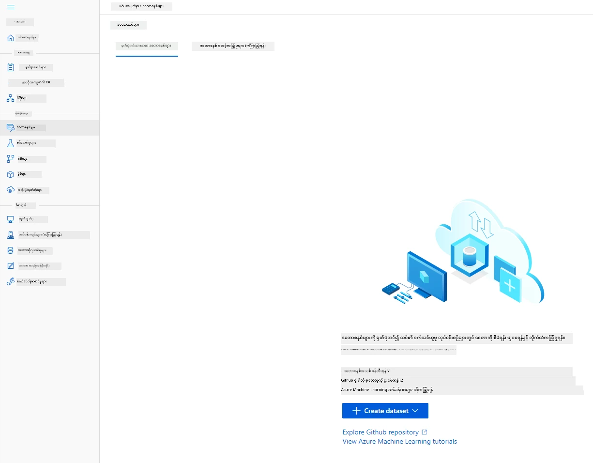

2. dataset အတွက် အမည်၊ အမျိုးအစားနှင့် ဖော်ပြချက်ပေးပြီး Next ကို နှိပ်ပါ။ ဖိုင်မှ ဒေတာတင်ပါ။ Next ကို နှိပ်ပါ။
   
   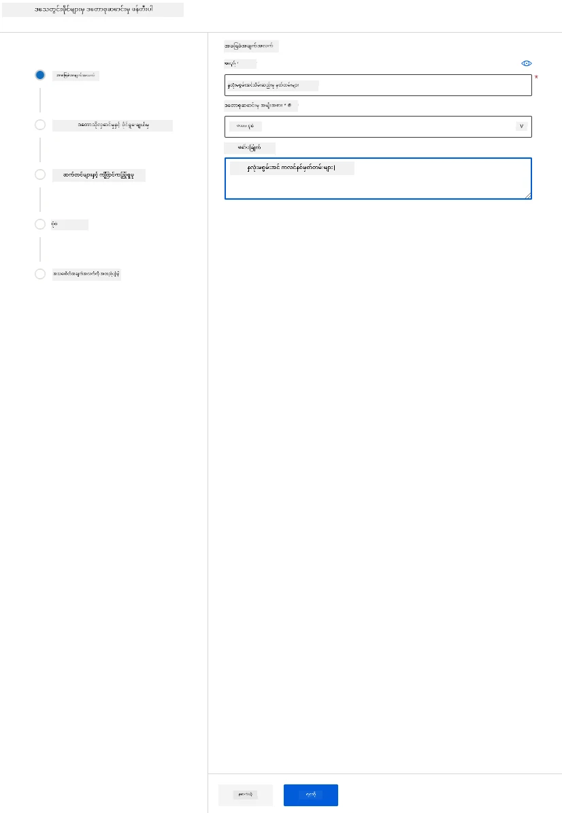

3. Schema တွင် anaemia, diabetes, high blood pressure, sex, smoking, နှင့် DEATH_EVENT ပုံစံများအား Boolean အမျိုးအစားသို့ ပြောင်းပါ။ Next နှိပ်ပြီး Create ကို နှိပ်ပါ။
   
   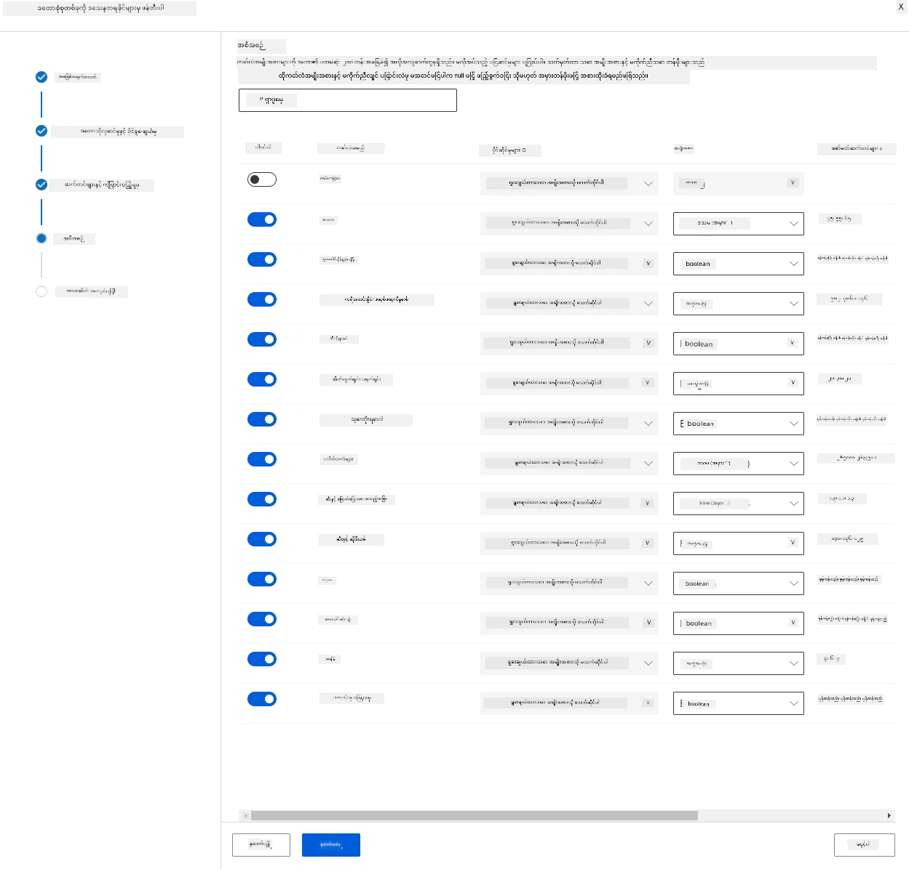

အရမ်းကောင်းပြီ! dataset ကို ထည့်သွင်းပြီး compute cluster ကို တည်ဆောက်ပြီးသားဖြစ်သဖြင့် မော်ဒယ် training ကို စတင်နိုင်ပြီ။

### 2.4 Low code/No Code training နှင့် AutoML

 ရိုးရာစက်မှုလေ့ကျင့်မှု မော်ဒယ် ဖွံ့ဖြိုးတိုးတက်ခြင်းသည် အရင်းအမြစ်များ များစွာ သုံးစွဲပြီး ဒိုမိန်း ဝိဇ္ဇာနည်းများနှင့် အချိန်အမျိုးမျိုးလိုအပ်သည်။ 
Automated machine learning (AutoML) သည် စက်မှုလေ့ကျင့်မှု မော်ဒယ်ခြေရာခံခြင်း၏ အချိန်စားပြီး ပြန်လည်ဆောင်ရွက်ရသော အလုပ်များကို သက်သာကြးစေသော လုပ်ငန်းစဉ်ဖြစ်သည်။ ဒေတာသိပ္ပံပညာရှင်များ၊ နည်းပညာဗဟုသုတရှိသူများနှင့် ကုဒ်ရေးဆရာများအား တိုးတက်မှုမြင့်မားပြီး ထိရောက်သော စွမ်းဆောင်ရည်ဖြင့် ML မော်ဒယ်များ တည်ဆောက်ရန် အဆင်ပြေစေသည်။ ထုတ်လုပ်နိုင်စရာရှိသော ML မော်ဒယ်များကို ဦးစွာ ရရှိစေရန် ခက်ခဲစွာ နှင့် ထိရောက်စွာ လျော့နည်းစေသည်။ [အသေးစိတ်သိရှိရန်](https://docs.microsoft.com/azure/machine-learning/concept-automated-ml?WT.mc_id=academic-77958-bethanycheum&ocid=AID3041109)

1. အရင်က တည်ဆောက်ထားသော [Azure ML workspace](https://ml.azure.com/) ထဲသို့ သွားပြီး ဘယ်ဘက်မီနူးအတွင်း "Automated ML" ကို နှိပ်ပါ။ ကိုယ့်တင်ထားသော dataset ကို ရွေးချယ်ပြီး Next ကို နှိပ်ပါ။

   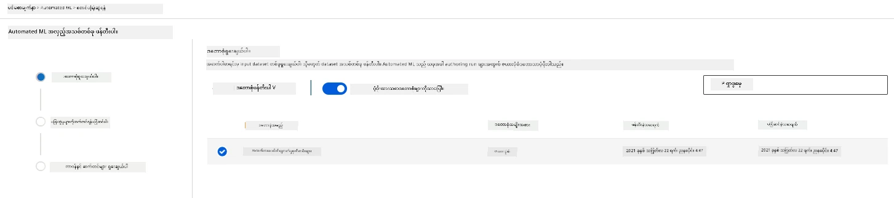

2. သစ်လွင်သော experiment အမည်၊ target column (DEATH_EVENT) နှင့် တည်ဆောက်ထားသော compute cluster ကို ထည့်နှိပ်ပါ။ Next ကို နှိပ်ပါ။
   
   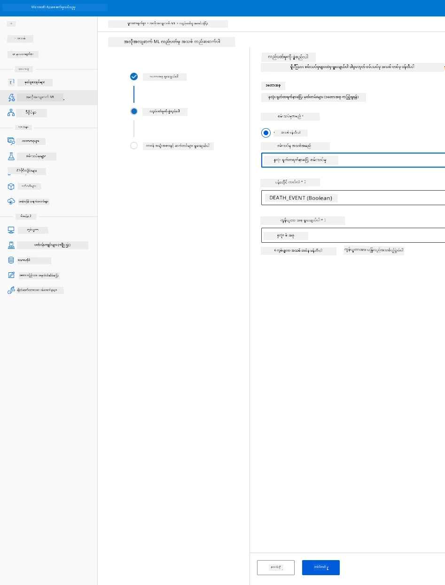

3. "Classification" ရွေးပြီး Finish ကို နှိပ်ပါ။ ဤအဆင့်သည် သင့် compute cluster အရွယ်အစား ပေါ်မူတည်၍ ၃၀ မိနစ်မှ ၁ နာရီအထိ ကြာနိုင်သည်။
    
    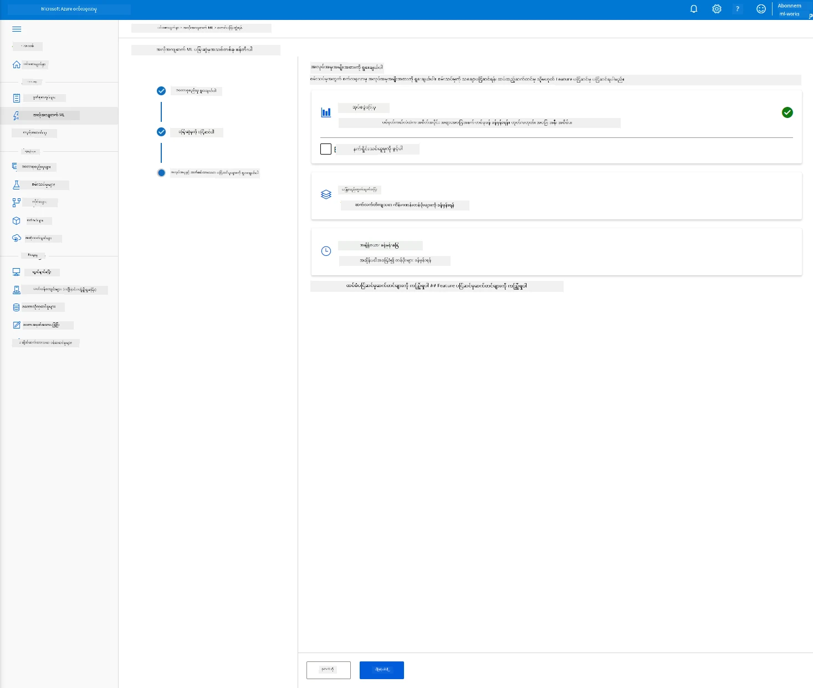

4. run ပြီးဆုံးသည့်အခါ "Automated ML" tab တွင် သွား၍ ကိုယ် run ပြုလုပ်ထားသော အရာကိုနှိပ်ပြီး "Best model summary" ကတ်ရှိ algorithm ကို နှိပ်ပါ။
    
    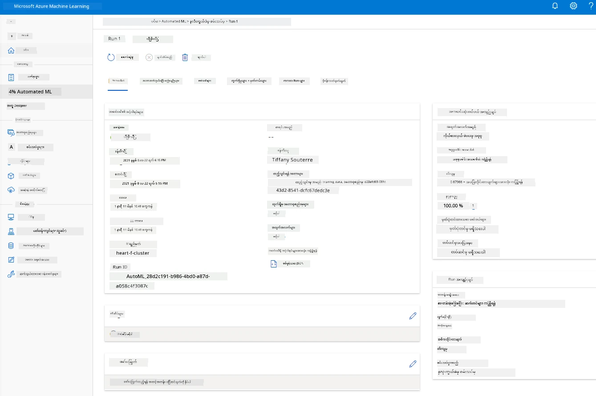

ဤနေရာတွင် AutoML ဆောင်ရွက်သည့် အကောင်းဆုံး မော်ဒယ်၏ အသေးစိတ် ဖော်ပြချက်ကို ကြည့်ရှုနိုင်သည်။ Models tab တွင် တခြားမော်ဒယ်များကိုလည်း စူးစမ်းလေ့လာနိုင်ပါသည်။ Explanations (preview button) တွင် မော်ဒယ်များကို စူးစမ်းရန် အချိန်ယူပါ။ သင့်ရွေးချယ်လိုသော မော်ဒယ်ကို ရွေးထားပြီး (ဒီနေရာမှာ AutoML ရွေးချယ်သော အကောင်းဆုံးမော်ဒယ်ကို အသုံးပြုမည်) ဖော်ပြချက်အပေါ် မော်ဒယ် ကို ဘယ်လို Deploy လုပ်ရမည်ကို ကြည့်ရအောင်။

## 3. Low code/No Code မော်ဒယ် ထည့်သွင်းခြင်းနှင့် Endpoint အသုံးပြုခြင်း
### 3.1 မော်ဒယ် ထည့်သွင်းခြင်း

Automated machine learning အဆင့်တွင် အကောင်းဆုံးမော်ဒယ်အား web service အဖြစ် အဆင့်အတန်းရလွယ်ကူစွာ ထည့်သွင်းနိုင်သည်။ ထည့်သွင်းခြင်းဆိုသည်မှာ မော်ဒယ်အား အသစ်ရလာသော ဒေတာအပေါ် မူတည်၍ ခန့်မှန်းမှုများပြုလုပ်နိုင်ရန်နှင့် အခွင့်အလမ်းများ ရှာဖွေနိုင်ရန် အမြဲတမ်း ဆက်စပ်စေခြင်းဖြစ်သည်။ ဤပရောဂျက်အတွက် web service သို့ deployment ပြုလုပ်ခြင်း ဆိုသည်မှာ ဆေးဘက်ဆိုင်ရာ Application များသည် လက်ရှိ လူနာများ၏ နှလုံးရောဂါကာကွယ်မှု အန္တရာယ်ကို တိုင်းတာ ခန့်မှန်းနိုင်ဖို့ မော်ဒယ်ကို အသုံးပြုနိုင်ခြင်း ဖြစ်သည်။

အကောင်းဆုံးမော်ဒယ် ဖော်ပြချက်အတွင်း "Deploy" ခလုတ်ကို နှိပ်ပါ။
    
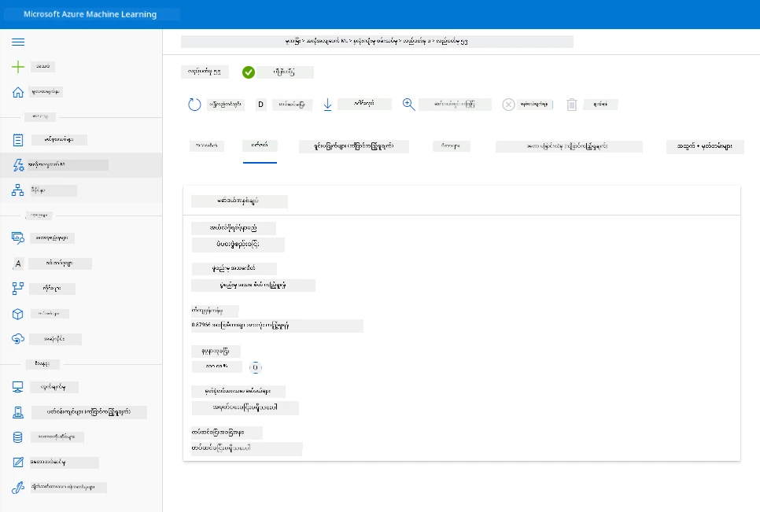

15. အမည်၊ ဖော်ပြချက်၊ compute အမျိုးအစား (Azure Container Instance)၊ အတည်ပြုချက် ပေးမှု ဖွင့်ပြီး Deploy ကို နှိပ်ပါ။ ဤအဆင့်သည် ၂၀ မိနစ်ခန့် ကြာနိုင်သည်။ Deployment မှတ်တမ်းတွင် မော်ဒယ်တင်ခြင်း၊ ရင်းမြစ်များ ပေါ်ထွက်ခြင်းနှင့် web service အတွက် ပြင်ဆင်ခြင်းတို့ ပါဝင်သည်။ Deploy status အောက်တွင် အခြေအနေစာတမ်းပြပါမည်။ Refresh periodically ကို ရွေးပြီး Deployment အခြေအနေ စစ်ဆေးပါ။ status သည် "Healthy" ဖြစ်သည့်အခါ ထည့်သွင်းပြီး ဖြစ်သည်။

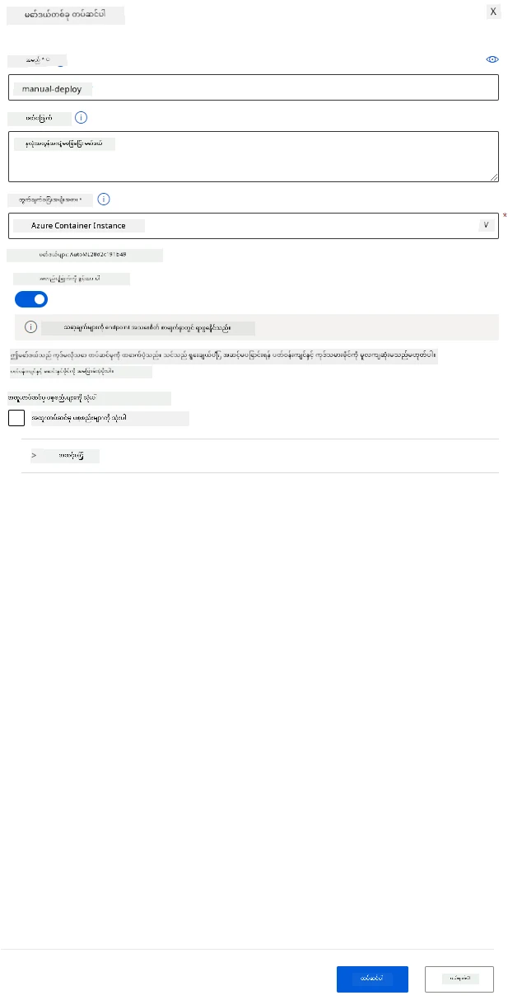

16. ထည့်သွင်းပြီးသော အခါ Endpoint tab ကို နှိပ်ပြီး သင့်ထည့်သွင်းပြီးသော endpoint ကို နှိပ်ပါ။ ဤနေရာတွင် endpoint အကြောင်း အသေးစိတ် အချက်အလက်များ ရှိသည်။ 

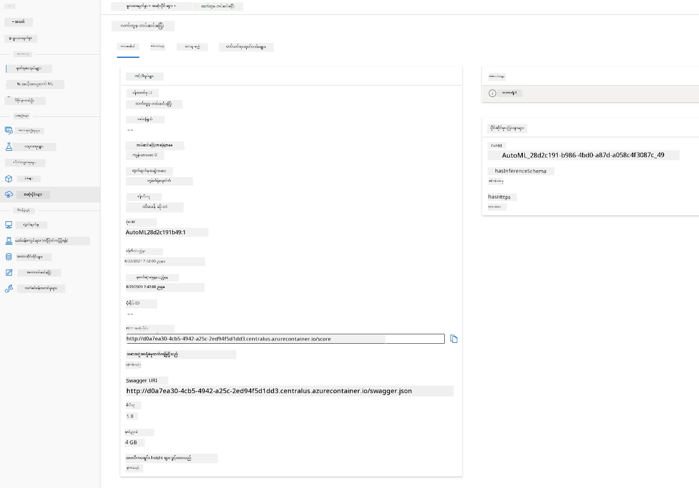

အံ့သြဖွယ်! မော်ဒယ်တင်ပြီးမှ Endpoint ကို အသုံးပြုစတင်နိုင်ပြီ။

### 3.2 Endpoint အသုံးပြုခြင်း

"Consume" tab ကို နှိပ်ပါ။ ဒီမှာ REST endpoint နှင့် python script ကို အသုံးပြုမှု ရွေးချယ်မှုအောက် တွင် မြင်ရပါမည်။ python code ကို ဖတ်ရယူရန် အချိန်ယူပါ။

ဤ script သည် သင့်ဒေသအကျယ်မှ တိုက်ရိုက် သွင်းလုပ်၍ endpoint ကို အသုံးပြုနိုင်ပါသည်။

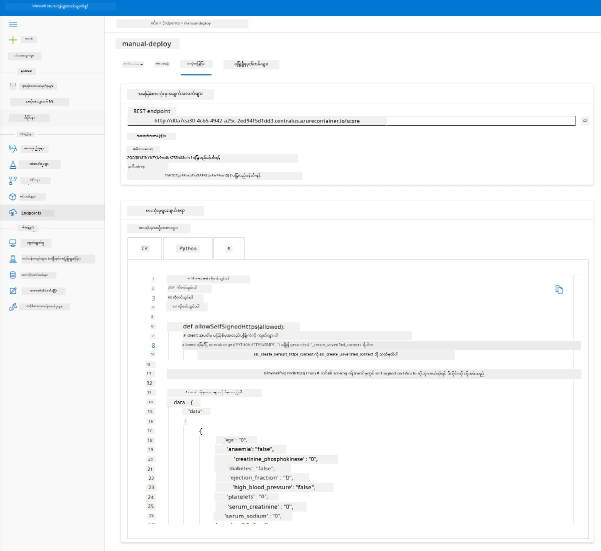

အောက်ပါ ကုဒ်အတန်း ၂ လိုင်းကို တစ်စိမ်ကြည့်ပါ:

```python
url = 'http://98e3715f-xxxx-xxxx-xxxx-9ec22d57b796.centralus.azurecontainer.io/score'
api_key = '' # ဤနေရာတွင် ဝဘ်ဝန်ဆောင်မှုအတွက် API key ကို အစားထိုးပါ။
```
 `url` နှင့် `api_key` အမျိုးအစားများသည် consume tab တွင် ရှိသော REST endpoint နှင့် primary key ဖြစ်သည် (Authentication ဖွင့်ထားသောအခါတွင်သာဖြစ်သည်)။ Script သည် ဤသို့ Endpoint ကို စားသုံးရန် ဖြစ်သည်။

18. Script ကို run လုပ်ပါက အောက်ပါ output ကို မြင်ရမည်ဖြစ်သည်:
    ```python
    b'"{\\"result\\": [true]}"'
    ```
 ၎င်းသည် ပေးထားသော ဒေတာအပေါ် နှလုံးပြတ်တောက်ရခြင်း ခန့်မှန်းချက်မှာ တကယ်ဖြစ်ကြောင်းကို ဆိုလိုသည်။ script တွင် အလိုအလျောက် ပြုလုပ်ထားသော ဒေတာကို ချည့်ကြည့်ပါက အဖြစ်တည်ရှိမှုများအားလုံးသည် 0 နှင့် false ဖြစ်ပါသည်။ ဒေတာကို အောက်ပါ input နမူနာဖြင့် ပြောင်းလဲနိုင်သည်-

```python
data = {
    "data":
    [
        {
            'age': "0",
            'anaemia': "false",
            'creatinine_phosphokinase': "0",
            'diabetes': "false",
            'ejection_fraction': "0",
            'high_blood_pressure': "false",
            'platelets': "0",
            'serum_creatinine': "0",
            'serum_sodium': "0",
            'sex': "false",
            'smoking': "false",
            'time': "0",
        },
        {
            'age': "60",
            'anaemia': "false",
            'creatinine_phosphokinase': "500",
            'diabetes': "false",
            'ejection_fraction': "38",
            'high_blood_pressure': "false",
            'platelets': "260000",
            'serum_creatinine': "1.40",
            'serum_sodium': "137",
            'sex': "false",
            'smoking': "false",
            'time': "130",
        },
    ],
}
```
 Script မှ ထုတ်ပေးသည့် အဖြေမှာ:
    ```python
    b'"{\\"result\\": [true, false]}"'
    ```

အောင်မြင်ပါပြီ! သင်သည် Azure ML တွင် မော်ဒယ်ကို တင်ပြီး သင်ကြားပြီးနောက် deployed မော်ဒယ်ကို အသုံးပြုနိုင်ပြီဖြစ်သည်!

> **_မှတ်ချက်:_** ပရောဂျက်ပြီးဆုံးသည်နှင့်နောက် ယူထားသော ရင်းမြစ်များအားလုံး ဖျက်ရန် မမေ့ပါနှင့်။
## 🚀 စိန်ခေါ်မှု

AutoML က ထုတ်ပေးသော အကောင်းဆုံးမော်ဒယ်နှင့် အခြားမော်ဒယ်များ၏ ဖော်ပြချက် နှင့် အသေးစိတ်များကို သေချာကြည့်ပါ။ အကောင်းဆုံး မော်ဒယ်သည် အခြားတို့ထက် မည်သည့်ကြောင့် ကောင်းမွန်သနည်း။ မည်သည့် အယ်လဂိုရစ်သမ်များကို နှိုင်းယှဉ်ထားသနည်း။ သူတို့အကြားကွာခြားချက်များသည် ဘာလဲ။ ဒီအခြေအနေတွင် အကောင်းဆုံးမော်ဒယ်သည် မည်သို့ ပိုဆင်ခြင်သနည်း။

## [စာသင်ခန်းပြီး Quiz](https://ff-quizzes.netlify.app/en/ds/quiz/35)

## ပြန်လည်သုံးသပ်ခြင်းနှင့် ကိုယ်တိုင်လေ့လာမှု

ဤသင်ခန်းတွင် သင်သည် Low code/No code fashion ဖြင့် မော်ဒယ်တစ်ခုကို cloud ပေါ်တွင် နှလုံးရောဂါ ဖြစ်နိုင်ခြေ ခန့်မှန်းရန် သင်ကြားခြင်း၊ ထည့်သွင်းခြင်းနှင့် အသုံးပြုခြင်းတို့ကိုလေ့လာခဲ့ပါသည်။ သင် မလုပ်ဆောင်သေးပါက AutoML ထုတ်ပေးသော အကောင်းဆုံးမော်ဒယ်၏ ဖော်ပြချက်များကို ပိုမိုနက်ရှိုင်းစွာ လေ့လာကြည့်ပြီး အကောင်းဆုံးမော်ဒယ်သည် အခြားတွေနှင့် ကြောင့်ကောင်းသည့်အကြောင်း မှတ်မိပါ။

Low code/No code AutoML ကို နက်ရှိုင်းစွာ လေ့လာလိုပါက [documentation](https://docs.microsoft.com/azure/machine-learning/tutorial-first-experiment-automated-ml?WT.mc_id=academic-77958-bethanycheum&ocid=AID3041109) ကို ဖတ်ရှုနိုင်သည်။

## ပေးအပ်ထားသော လေ့ကျင့်မှုများ

[Low code/No code Data Science project on Azure ML](assignment.md)

---

<!-- CO-OP TRANSLATOR DISCLAIMER START -->
**ပြောကြားချက်**
ဤစာတမ်းကို AI ဘာသာပြန်ဝန်ဆောင်မှု [Co-op Translator](https://github.com/Azure/co-op-translator) အသုံးပြု၍ ဘာသာပြန်ထားပါသည်။ ကျွန်ုပ်တို့သည် တိကျမှန်ကန်မှုအတွက် ကြိုးပမ်းနေသော်လည်း၊ စက်ကိရိယာဘာသာပြန်ခြင်းများတွင် အမှားများ သို့မဟုတ် မှားယွင်းချက်များ ပါဝင်နိုင်ကြောင်း သတိပြုပါရန် လိုအပ်ပါသည်။ မူလစာတမ်းကို မူရင်းဘာသာဖြင့်သာ ယုံကြည်စိတ်ချရသော အချက်အလက်အဖြစ် သတ်မှတ်သင့်သည်။ အရေးကြီးသည့် သတင်းအချက်အလက်များအတွက် ပရော်ဖက်ရှင်နယ် လူသားဘာသာပြန်သူဝန်ဆောင်မှုကို အကြံပြုပါသည်။ ဤဘာသာပြန်ချက်ကို အသုံးပြုခြင်းမှ ဖြစ်ပေါ်လာသော နားလည်မှုကွာခြားမှုများ သို့မဟုတ် မမှန်ကန်သော အသုံးပြုမှုများအတွက် ကျွန်ုပ်တို့ တာဝန်မခံပါ။
<!-- CO-OP TRANSLATOR DISCLAIMER END -->