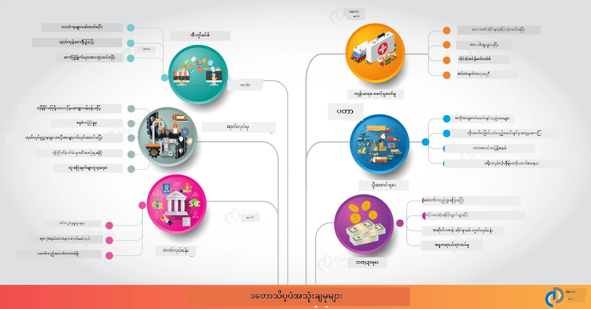

# ဒေတာ သိပ္ပံကို အမှန်တကယ်ကမ္ဘာပေါ်မှာ

|  ](../../sketchnotes/20-DataScience-RealWorld.png) |
| :--------------------------------------------------------------------------------------------------------------: |
|               ဒေတာ သိပ္ပံကို အမှန်တကယ်ကမ္ဘာပေါ်မှာ - _Sketchnote by [@nitya](https://twitter.com/nitya)_               |

ဒီ တန်ခိုးတက္ကြွမှုခရီးစဉ်ရဲ့ အဆုံးအပေါ်ကို နီးနီးလာပြီ!

ဒေတာ သိပ္ပံနဲ့ဂရုဏာရှိမှု၏ အဓိပ္ပါယ်တွေကို စတင်ပြီး၊ ဒေတာ विश्लेषणနဲ့ မြင်ကွင်း ပြုလုပ်မှုအတွက် ကိရိယာများနဲ့ နည်းပညာမျိုးစုံကို စူးစမ်းလေ့လာခဲ့ပြီး၊ ဒေတာ သိပ္ပံ ပြန်လည်အသုံးပြုခြင်းလည်ပတ်မှု လည်ပတ်ခြင်းများကို ပြန်လည်သုံးသပ်ခဲ့ပြီး၊ ကလေ့ ဂျစ်ဝန်ဆောင်မှုများဖြင့် ဒေတာ သိပ္ပံ လုပ်ငန်းစဉ်များကို တိုးချဲ့မှုနဲ့ အလိုအလျောက်ဆောင်ရွက်မှုတွေဆီသွားခဲ့သည်။ ဒါကြောင့် သင်တန်းသားတွေ ဟောပြောမဲ့အကြောင်းမှာ: _"ဒီသင်ယူချက်တွေကို အမှန်တကယ်ကမ္ဘာပေါ် ဖြစ်ရပ်များနဲ့ ဘယ်လို ညွှန်ပြမလဲ?"_ ဆိုတဲ့ စိတ်ကူးတွေပဲ ဖြစ်နိုင်ပါတယ်။

ဒီသင်ခန်းစာမှာ ဒေတာ သိပ္ပံကို ကဏ္ဍအတွင်း အမှန်တကယ်ကမ္ဘာပေါ်၏ အသုံးပြုမှုများကို ရှာဖွေပြီး သုတေသန၊ ဒစ်ဂျစ်တယ် လူမှုကဏ္ဍနဲ့ တာဝန်ခံတည်ဆောက်မှုဆိုင်ရာ ဥပမာများကို နက်ရှိုင်းစွာ ကြည့်ရှုမှာဖြစ်ပါတယ်။ ကျောင်းသား စာပေ အတွက် အခွင့်အလမ်းများကို ရှင်းပြပြီး သင့်တက်ကြွမှုခရီးစဉ်ကို ဆက်လက်တိုးတက်ဖို့ အထောက်အကူပြုပစ္စည်းများနဲ့ အဆုံးသတ်ပါမည်။
## သင်ခန်းစာ မတိုင်မီ စစ်ဆေးမေးခွန်း

## [သင်ခန်းစာ မတိုင်မီ စစ်ဆေးမေးခွန်း](https://ff-quizzes.netlify.app/en/ds/quiz/38)

## ဒေတာ သိပ္ပံ + စက်မှုလုပ်ငန်း

AI ကို လူသုံးတန်းမြှင့်တင်ခြင်းကြောင့်၊ ဖွံ့ဖြိုးသူများသည် AI မောင်းနှင်သော ဆုံးဖြတ်ချက် ချမှုနဲ့ ဒေတာအပေါ် အခြေခံထားသော နားလည်မှုများအား အသုံးပြုသူအတွေ့အကြုံနဲ့ ဖွံ့ဖြိုးမှု လုပ်ငန်းစဉ်များအတွင်း ပေါင်းစည်း အတက်အကျ လုပ်ဆောင်ရတာ ပိုလွယ်ကူလာပြီ ဖြစ်သည်။ ဒီမှာ အချို့ ဥပမာတွေရှိတယ်၊ ဒေတာ သိပ္ပံအား စက်မှုလုပ်ငန်းတစ်ခုလုံးတစ်ဆက်တည်းတွင် "အသုံးချ" ပြုလုပ်တဲ့ နေရာမှာ -

 * [Google Flu Trends](https://www.wired.com/2015/10/can-learn-epic-failure-google-flu-trends/) က ဒေတာ သိပ္ပံသုံးပြီး ရှာဖွေမှု စကားလုံးများနဲ့ ဖလူး လေ့လာမှုများကို ဆက်စပ်စေခဲ့ပါတယ်။ နည်းလမ်းမှာ ပြစ်မှားချက်များ ရှိခဲ့ပေမယ့်၊ ဒေတာအပေါ် အခြေခံထားသော ကျန်းမာရေးခန့်မှန်းမှုများ၏ အခွင့်အရေးများနဲ့ စိန်ခေါ်မှုများကို အသိပေးခဲ့သည်။

 * [UPS Routing Predictions](https://www.technologyreview.com/2018/11/21/139000/how-ups-uses-ai-to-outsmart-bad-weather/) မှာ UPS သည် ဒေတာ သိပ္ပံနဲ့ machine learning ကို အသုံးပြုပြီး ပို့ဆောင်ရာလမ်းကြောင်းများကို မိုးလေဝသ၊ ယာဉ်များ လည်ပတ်မှု မျိုးစုံ၊ ပို့ဆောင်ရမည့် အချိန် အတိအကျ တွက်ချက်ကာ ခန့်မှန်းတယ်ဆိုတာ ဖော်ပြထားပါတယ်။

 * [NYC Taxicab Route Visualization](http://chriswhong.github.io/nyctaxi/) မှာ [Freedom Of Information Laws](https://chriswhong.com/open-data/foil_nyc_taxi/) ဖြင့် စုဆောင်းထားတဲ့ ဒေတာက NYC taxicab တစ်နေ့တာရဲ့ နေ့စဉ် အကြောင်းအရာတွေကို မြင်ရစေပြီး၊ သူတို့ ဘယ်လိုမြို့ကြီးထဲ လမ်းကြောင်းရွေးချယ်သွားကြတာ၊ ဘယ်လောက်ငွေရှာကြတာနဲ့ တစ် ၂၄ နာရီအတွင်း ခရီးများကာလများကို နားလည်ထင်မြင်စေပါသည်။

 * [Uber Data Science Workbench](https://eng.uber.com/dsw/) သည် Uber ခရီးဆိုဒ်ပေါင်း မီလျံကျော်မှ ရိုက်ကြည့်ထားသော Pickup & dropoff တည်နေရာများ၊ ခရီးကာလ၊ နှစ်သက်သော လမ်းကြောင်းများ စသည်များ ပုံသွား စုဆောင်းခဲ့ပါသည်။ ဒေတာကို အသုံးပြုပြီး စျေးနှုန်းချချက်၊ ဘေးကင်းမှု၊ လိမ်လည်မှု တွေ ဖော်ထုတ်ခြင်းနှင့် လမ်းညွှန်မှု ဆုံးဖြတ်ချက်များအတွက် ဒေတာ သုံးသပ်မှုဆော့ဖ်ဝဲတစ်ခု တည်ဆောက်ထားသည်။

 * [Sports Analytics](https://towardsdatascience.com/scope-of-analytics-in-sports-world-37ed09c39860) က _ခန့်မှန်းချက် သုံးသပ်မှု_ (အသင်းနဲ့ ကစားသမား သုံးသပ်မှု - [Moneyball](https://datasciencedegree.wisconsin.edu/blog/moneyball-proves-importance-big-data-big-ideas/) စသဖြင့် - နှင့် ပရိသတ် စီမံခန့်ခွဲမှု) နဲ့ _ဒေတာ မြင်ကွင်းပြ_ (အသင်းနဲ့ ပရိသတ် ဖျော်ဖြေမှု ဒိုင်ခွာတို့၊ ပြိုင်ပွဲများ ဖြစ်စဉ်) ကျွမ်းကျင်သော ပရော်ဂရမ်များဟာ အရည်အချင်းရှာဖွေခြင်း၊ အားကစား စာရင်းဝင်ကစားခြင်းနဲ့ ဂိမ်း/ဦးတည်ချက် စီမံခန့်ခွဲမှုတို့တွင် အသုံးပြုပါသည်။

 * [Data Science in Banking](https://data-flair.training/blogs/data-science-in-banking/) မှာ ဘဏ်လုပ်ငန်းတွင် ဒေတာ သိပ္ပံ၏ တန်ဖိုးကို ဖော်ပြသော ဥပမာများပါဝင်ပြီး၊ ဆိုးရွားမှု မော်ဒယ်ဖော်ခြင်း၊ လိမ်လည်မှု ကြိုတင်ရှာဖွေရေး၊ ဖောက်သည် အပိုင်းခွဲခြားမှု၊ တိကျသောအချိန်ခန့်မှန်းခြင်း၊ အကြံပေးစနစ်များကို ပါဝင်ပါတယ်။ ခန့်မှန်းချက် သုံးသပ်မှုများက [အကြွေးကောက်စနစ်](https://dzone.com/articles/using-big-data-and-predictive-analytics-for-credit) ကဲ့သို့ အရေးပါသော စနစ်များကို တိုးတက်စေသည်။

 * [Data Science in Healthcare](https://data-flair.training/blogs/data-science-in-healthcare/) မှာ ဆေးဘက်ဆိုင်ရာ ရုပ်ပုံသရုပ်ကွက် (ဥပမာ - MRI, X-Ray, CT-Scan)၊ ကိုယ်ဗီဇအချက်အလက် (DNA စီးကွင်း)၊ ဆေးထုတ်လုပ်ခြင်း (အန္တရာယ် ခန့်မှန်းခြင်း၊ အောင်မြင်မှု ခန့်မှန်းခြင်း)၊ ညွှန်ကြားမှု သုံးသပ်မှု (လူနာစောင့်ရှောက်မှုနဲ့ ကုန်ပစ္စည်း ရှေ့ဆောင်ခြင်း)၊ ရောဂါ လေ့လာ & ကာကွယ်မှု စသည့် ကဏ္ဍများကို ဖော်ပြထားသည်။

 ပုံရိပ် ချီးမြှင့်မှု: [Data Flair: 6 Amazing Data Science Applications ](https://data-flair.training/blogs/data-science-applications/)

ဓာတ်ပုံသည် ဒေတာ သိပ္ပံ နည်းစနစ်များကို အသုံးပြုဖို့ အခြားကဏ္ဍများနဲ့ ဥပမာများကို ပြသထားပါသည်။ အခြား အသုံးချမှုများ ရှာဖွေရန် စိတ်ဝင်စားပါသလား? အောက်ပါ [ပြန်လည်သုံးသပ်မှု & ကိုယ်တိုင်လေ့လာမှု](?id=review-amp-self-study) အပိုင်းကို ကြည့်ပါ။

## ဒေတာ သိပ္ပံ + သုတေသန

|  ](../../sketchnotes/20-DataScience-Research.png) |
| :---------------------------------------------------------------------------------------------------------------: |
|              ဒေတာ သိပ္ပံနဲ့ သုတေသန - _Sketchnote by [@nitya](https://twitter.com/nitya)_              |

အမှန်တကယ်ကမ္ဘာပေါ် အသုံးပြုမှုများသည် အကြီးစား စက်မှုလုပ်ငန်းအသုံးပြုမှု အခြေပြုထားသော နေရာများတွင် ဦးစားပေးထားပေမယ့်၊ _သုတေသန_ အသုံးပြုမှု နှင့် ပရောဂျက်များဟာ အနည်းငယ် မျက်နှာပြင် နှစ်မျိုးဖြင့် အသုံးဝင်တတ်သည် -

* _နည်းပညာတီထွင်မှု အခွင့်အလမ်းများ_ - တိုးတက်ပြောင်းလဲသောတွေးခေါ်မှု တီထွင်ရေးနှင့် နောက်ဆုံးပေါ် အသုံးချမှုများအတွက် အသုံးပြုသူ အတွေ့အကြုံ လေ့လာခြင်း။
* _အသုံးချမှု အခက်အခဲများ_ - အမှန်တကယ်ကမ္ဘာပေါ် တွင် ဒေတာ သိပ္ပံ နည်းပညာများက စွန့်စားမှုများ သို့မဟုတ် မမှန်ကန်သော အကျိုးသက်ရောက်မှုများ ရှိမရှိ စိစစ်သုံးသပ်ခြင်း။

ကျောင်းသားများအတွက် သုတေသနပုဂ္ဂိုလ်ရေးအခွင့်အလမ်းများက ဗဟုသုတရှာဖွေမှုနဲ့ပေါင်းသင်းဆက်ဆံခြင်းအတွက် ကူညီပေးပြီး၊ အကြောင်းအရာနဲ့ ပတ်သက်သော လူများသို့မဟုတ် အဖွဲ့အစည်းများနှင့် ပိုမိုကောင်းမွန်သော ဆက်ဆံရေးတည်ဆောက်ရန် အထောက်အကူဖြစ်သလို သင်၏ ခံစားမှုကို မြှင့်တင်ပေးသည့် အခွင့်အလမ်းများကို ပေးစွမ်းနိုင်သည်။ သုတေသနပရောဂျက်များက ဘယ်လို ရှိပြီး အကျိုးသက်ရောက်မှု ဘယ်လို ရနိုင်မလဲ?

တစ်ချက်တွေ့ကြည့်ပါ - Joy Buolamwini (MIT Media Labs) မှ အချက်အလက်အရ [MIT Gender Shades Study](http://gendershades.org/overview.html) တစ်ခု၊ Timnit Gebru (အဲဒီအချိန်မှာ Microsoft Research) နှင့် ပူးပေါင်းရေးသားထားတဲ့ [လက်မှတ်သုတေသနစာတမ်း](http://proceedings.mlr.press/v81/buolamwini18a/buolamwini18a.pdf) တစ်ခုရှိပါသည်။

 * **ဘာလဲ:** ကာမ သမားနဲ့ အရောင်အမျိုးအစားအပေါ် အလိုအလျောက် မျက်နှာပြင် တိကျမှု ဝေဖန်ချက်သုံးသပ်မှု နဲ့ ဒေတာစုစည်းမှုများရှိမှုကို အကဲဖြတ်ခြင်းဖြစ်ပါသည်။ 
 * **ဘာကြောင့်:** မျက်နှာတစ်ချပ်စီကို ခွဲခြားအသုံးပြုခြင်းကို ဥပဒေကြောင့် စစ်ဆေးခြင်း၊ လေဆိပ်လုံခြုံရေး၊ အလုပ်ခန့်မှန်းမှု စနစ် တွင် အသုံးပြုသော နေရာများရှိသည်။ အမှားရှိသော ခွဲခြားမှု (ဥပမာ - ဝါဒ အကြောင့်) က လူများ သို့မဟုတ် အုပ်စုများအပေါ် စီးပွားရေးနှင့် လူမှုဆက်ဆံရေး အန္တရာယ် ဖြစ်စေနိုင်သည်။ ဝါဒများကို နားလည်၊ ဖယ်ရှားခြင်း သို့မဟုတ် လျော့နည်းစေရန် အရေးပါသည်။
 * **ဘာလို့:** သုတေသနသမားများသည် ယခင်စမ်းသပ်ငဲ့များတွင် အဓိကအားဖြင့် အရောင်ပြာသော အများစုကို အသုံးပြုကြောင်း သိရှိပြီး အသစ်တစ်ခုတည်းသော ဒေတာစုစည်းမှု (၁၀၀၀+ ပုံများ) ကို ကာယအမျိုးအစားနှင့် ကာမ သမား ခြားနားမှုဖြင့် မျှတအောင် ပြင်ဆင်ထားသည်။ ဒေတာစုစည်းမှုကို Microsoft, IBM & Face++ မှ ထုတ်ထားသော ကာမသရုပ် ခွဲခြားမှု ထုတ်ကုန်သုံးခုအား တိကျမှု စစ်တမ်းဆုတ်ခွာရန် အသုံးပြုခဲ့သည်။

ရလဒ်များပြသခဲ့သည်မှာ စုစုပေါင်း ခွဲခြားမှုမှန်ကန်မှုကောင်းသော်လည်း အဖွဲ့ခွဲတိုင်း၏ အမှားနှုန်းတွေက ကွာခြားချက်ရှိပြီး - ကာမသွားလမ်းမှားခြင်း _misgendering_ အမှားမှားခြင်းသည် မိန်းကလေးများ သို့မဟုတ် အရောင်မူကြီးသောလူများအတွင်း ပိုများသည်။ ဤသည်သည် ဗဟိုထားချက်ဖြစ်သည်။

**အရေးပါသောရလဒ်များ** - ဒေတာ သိပ္ပံသည် ပိုမို _ကိုယ်စားပြုပုံဖော်သော ဒေတာစုစည်းမှု_ (မတူညီသော အုပ်စုခွဲများကို မျှတစွာဖြန့်ဖြူးထား) နဲ့ ပိုမို _ပါဝင်ကူညီသော အဖွဲ့များ_ (မျိုးခွဲ မျိုးစုံ) လိုအပ်သည်ဟု သတိပေးခဲ့ပြီး AI ဖြေရှင်းနည်းများတွင် ဤဗဟိုထားချက်များကို ကျော်လွှား ဖျယ်ဖျက်ရန် ကြိုတင်တွေ့ရှိနိုင်ဟု သုတေသနပလုပ်မှုများက အဆက်မပြတ် အဖွဲ့အစည်းမတူညီများတွင် _တာဝန်ရှိသော AI_ အဆင့်မြှင့်နည်းလမ်း၊ စည်းမျဉ်းများ သတ်မှတ်နိုင်မှုကို ကြီးပွားစေသည်။

**Microsoft မှ သက်ဆိုင်ရာ သုတေသနများကို သိရှိလိုပါသလား?** 

* [Microsoft Research Projects](https://www.microsoft.com/research/research-area/artificial-intelligence/?facet%5Btax%5D%5Bmsr-research-area%5D%5B%5D=13556&facet%5Btax%5D%5Bmsr-content-type%5D%5B%5D=msr-project) တွင် အတတ်ပညာရေး AI ကို ကြည့်ရှုပါ။
* [Microsoft Research Data Science Summer School](https://www.microsoft.com/en-us/research/academic-program/data-science-summer-school/) မှ ကျောင်းသား ပရောဂျက်များကို ရှာဖွေပါ။
* [Fairlearn](https://fairlearn.org/) ပရောဂျက် နှင့် [Responsible AI](https://www.microsoft.com/en-us/ai/responsible-ai?activetab=pivot1%3aprimaryr6) အစီအစဉ်များကို စူးစမ်းပါ။

## ဒေတာ သိပ္ပံ + လူမှုဗေဒ

|  ](../../sketchnotes/20-DataScience-Humanities.png) |
| :---------------------------------------------------------------------------------------------------------------: |
|              ဒေတာ သိပ္ပံနဲ့ ဒစ်ဂျစ်တယ် လူမှုဗေဒ - _Sketchnote by [@nitya](https://twitter.com/nitya)_              |

ဒစ်ဂျစ်တယ် လူမှုဗေဒကို [သတ်မှတ်ချက်](https://digitalhumanities.stanford.edu/about-dh-stanford) အရ "ကွန်ပျူတာ နည်းပညာ နဲ့ လူ့ ဘာသာရပ်တိုင်းအတွင်း စုပေါင်းထားသော လေ့လာမှု နည်းလမ်းများနှင့် လမ်းကြောင်းများ၏ စုစည်းမှု" ဟု ဆိုသည်။ [Stanford စီမံချက်များ](https://digitalhumanities.stanford.edu/projects) များသည် _"သမိုင်းကို ပြန်လည်စတင်ထူထောင်ခြင်း"_ နဲ့ _"ကဗျာရေးပြီး မသိပ်မစုံထင်ရှားသော စဉ်းစားမှု"_ များ၊ [ဒစ်ဂျစ်တယ် လူမှုဗေဒနဲ့ ဒေတာ သိပ္ပံ](https://digitalhumanities.stanford.edu/digital-humanities-and-data-science) တို့ အချိတ်အဆက်ကို ဖော်ပြသည်။ အဓိက နည်းနှစ်ခုမှာ ကွန်ယက် သုံးသပ်ခြင်း၊ သတင်းအချက်အလက် မြင်ကွင်းပြခြင်း၊ နေရာအခြေပြုနဲ့ စာသားသုံးသပ်ခြင်းတို့ဖြစ်ပြီး အမှန်တကယ် သမိုင်း နှင့် စာပေ မူရင်းအချက်အလက်တွေကို ပြန်လည် လေ့လာ ရှုမြင်နိုင်ပါသည်။

*ဒီကဏ္ဍမှာ ပရောဂျက်တစ်ခုကို ရှာဖွေပြီး တိုးချဲ့ချင်ပါသလား?*

["Emily Dickinson and the Meter of Mood"](https://gist.github.com/jlooper/ce4d102efd057137bc000db796bfd671) ကို ကြည့်ပါ။ [Jen Looper](https://twitter.com/jenlooper) ထံမှ ဤကောင်းမွန်တဲ့ ဥပမာသည် ဒေတာ သိပ္ပံကို အသုံးပြုခြင်းဖြင့် နာမည်ကြီး ကဗျာများကို ပြန်လည်သုံးသပ်ခြင်း၊ အဓိပ္ပါယ် ထပ်မံ သုံးသပ်ခြင်းနှင့် ရေးသူ၏ ဆက်ဆံမှုကို အသစ်တင်ပြသည်။ ဥပမာအားဖြင့်၊ _ကဗျာရေးသည့်ရာသီကို ကဗျာ၏ အသံသဘော သို့မဟုတ် စိတ်ခံစားချက် ခွဲခြားပြီး ခန့်မှန်းနိုင်ပါသလား_ ဆိုပြီး ရေးသူ၏ စိတ်ဓာတ် အခြေအနေကို ပြသပေးမလားဆိုတာတွေ့ရန်။

ဤမေးခွန်းကို ဖြေရှင်းရန် ဒေတာ သိပ္ပံ လည်ပတ်မှု အဆင့်များကို လိုက်နာကြမည် -
 * [`Data Acquisition`](https://gist.github.com/jlooper/ce4d102efd057137bc000db796bfd671#acquiring-the-dataset) - သုံးသပ်ရန်အတွက် သင့်လျော်သော ဒေတာစုစည်းမှုကို စုဆောင်းရန်။ API အသုံးပြုခြင်း (ဥပမာ - [Poetry DB API](https://poetrydb.org/index.html)) သို့မဟုတ် Web စာမျက်နှာများကို စုတ်ယူခြင်း (ဥပမာ - [Project Gutenberg](https://www.gutenberg.org/files/12242/12242-h/12242-h.htm))၊ [Scrapy](https://scrapy.org/) ကဲ့သို့သော ကိရိယာများကို အသုံးပြုနိုင်သည်။
 * [`Data Cleaning`](https://gist.github.com/jlooper/ce4d102efd057137bc000db796bfd671#clean-the-data) - စာသားများကို ပုံစံတူ သန့်ရှင်းစေစေ၊ ပြောင်းလဲနှိမ့်ချခြင်းကို Visual Studio Code နဲ့ Microsoft Excel ကိရိယာများ အသုံးပြုပြီး ဖေါ်ပြထားသည်။
 * [`Data Analysis`](https://gist.github.com/jlooper/ce4d102efd057137bc000db796bfd671#working-with-the-data-in-a-notebook) - အခု datasets ကို Python package များ (pandas, numpy, matplotlib စသည်ဖြင့်) အသုံးပြုပြီး Notebooks ထဲသို့ ထည့်သွင်းကာ ရှင်းလင်းချက်နှင့် မြင်ကွင်းပြ လုပ်ဆောင်ခြင်းကို ဖော်ပြသည်။
 * [`Sentiment Analysis`](https://gist.github.com/jlooper/ce4d102efd057137bc000db796bfd671#sentiment-analysis-using-cognitive-services) - Text Analytics ကဲ့သို့သော Cloud ဝန်ဆောင်မှုများနှင့် ပေါင်းစပ်ခြင်း၊ [Power Automate](https://flow.microsoft.com/en-us/) ကဲ့သို့သော နည်းလမ်းများဖြင့် ဒေတာ လည်ပတ်မှုများကို အလိုအလျောက် ပြုလုပ်ခြင်းကို ဖော်ပြသည်။

ဒီလုပ်ငန်းစဉ် အသုံးပြု၍ ကဗျာများ၏ အချိန်အလိုက် စိတ်ခံစားမှု အသွင်ပြောင်းလဲမှုများကို လေ့လာနိုင်ပြီး၊ ရေးသူ နှင့် ဆက်စပ်သည့် အမြင်များကို ဖန်တီးနိုင်သည်။ ကိုယ့်ကိုယ်ကို စမ်းသပ်ကြည့်ပြီး နောက်ထပ်မေးခွန်းများ မေးပါ၊ ဒေတာကို အသစ်နည်းနည်းနဲ့ မြင်ကြည့်ပါနဲ့!

> [Digital Humanities toolkit](https://github.com/Digital-Humanities-Toolkit) တစ်နေရာဖြစ်သည့် ကိရိယာတချို့ကို အသုံးပြု၍ ဒီဖမ်းစည်းမှုများကို ဆက်လက်ရှာဖွေနိုင်ပါသည်။

## ဒေတာ သိပ္ပံ + တာဝန်ခံတည်ဆောက်မှု

|  ](../../sketchnotes/20-DataScience-Sustainability.png) |
| :---------------------------------------------------------------------------------------------------------------: |
|              ဒေတာ သိပ္ပံနဲ့ တာဝန်ခံတည်ဆောက်မှု - _Sketchnote by [@nitya](https://twitter.com/nitya)_              |

[2030 တာဝန်ခံ ရပ်တည်မှု အစီအစဉ်](https://sdgs.un.org/2030agenda) ကို ၂၀၁၅ ခုနှစ်တွင် ကုလသမဂ္ဂ အဖွဲ့ဝင်တိုင်းက လက်မှတ်ရေးထိုးလက်ခံခဲ့ပြီး၊ ကမ္ဘာမြေကြီး ပေါ်ရှိ သဘာဝပတ်ဝန်းကျင်အန္တရာယ်များနဲ့ ရာသီဥတု ဖိုင်လုဒ်ဆိုးကျိုးများကို ကာကွယ်ကာ ဘေးကင်းစေရန် နှင့် တာဝန်ခံတည်ဆောက်မှုကို အဓိကထား၍ ၁၇ ခုသော ရည်မှန်းချက်များကို ထောက်ပြသွားသည်။ [Microsoft Sustainability](https://www.microsoft.com/en-us/sustainability) လုပ်ငန်းစဉ်သည်၊ [၄ မျိုးသော ရည်မှန်းချက်များ](https://dev.to/azure/a-visual-guide-to-sustainable-software-engineering-53hh) – ကာဗွန် ပျောက်ကွယ်မှု၊ ရေ ကောင်းမွန်မှု၊ အမှိုက် မရွိခြင်း၊ စိုက်ပျိုးရေးကွင်း ပေါ်တွင် ရှိမှသာ တာရှည်တည်တံ့သော အနာဂတ်များ ဖန်တီးရန် နည်းပညာဖြေရှင်းချက်များ ရှာဖွေပေးသည်။

ဤပြဿနာများကို တိုးချဲ့ကာ ချိန်မှန်စွာ ကိုင်တွယ်ရန် ဒေတာ သုံးစွဲမှု ကောင်းစွာဟာ လိုအပ်ပြီး ကလေ့ ဂျစ်တည်ဆောက်မှု စဉ်းစားမှုရလဒ် မရှိမဖြစ်လိုအပ်သည်။ [Planetary Computer](https://planetarycomputer.microsoft.com/) လုပ်ငန်းစဉ်တွင် ဒေတာ သိပ္ပံပညာရှင်များနဲ့ ဖွံ့ဖြိုးရေးသူများအား ကြီးမားသော ဖျော်ဖြေမှု ဒေတာများကို ချိတ်ဆက်ရန် အောက်ပါ ၄ ချက် ပါဝင်သည်။

 * [Data Catalog](https://planetarycomputer.microsoft.com/catalog) - ကမ္ဘာမြေအခြေနှင့် သဘာဝပတ်ဝန်းကျင် ဒေတာများရှိရာ (အခမဲ့နှင့် Azure မှ ထောက်ပံ့လျက်)။
 * [Planetary API](https://planetarycomputer.microsoft.com/docs/reference/stac/) - အသုံးပြုသူများအား နေရာအချိန်တစ်ခုချင်းစီအတွင်း သက်ဆိုင်ရာ ဒေတာများကို ရှာဖွေရန် ကူညီသည်။
 * [Hub](https://planetarycomputer.microsoft.com/docs/overview/environment/) - ပြင်ပ ဒေတာသိပ္ပံပညာရှင်များအတွက် သုံးစွဲနိုင်စေရန် စီမံခန့်ခွဲသော ပတ်ဝန်းကျင်။
 * [Applications](https://planetarycomputer.microsoft.com/applications) - တာဝန်ခံတည်ဆောက်မှုသတင်းအချက်အလက်များအတွက် အသုံးချပုံနှင့် ကိရိယာများကို ပြသထားသည်။
**The Planetary Computer Project သည် လက်ရှိ Sep 2021 အချိန်အထိ ကြိုတင်ကြည့်ရှုနေပြီးဖြစ်ပါသည်** - ဒေတာသိပ္ပံကို အသုံးပြု၍ သဘာဝစနစ်ဆိုင်ရာဖြေရှင်းချက်များတွင် ပါဝင်ဆောင်ရွက်နိုင်ရန် စတင်မည့်နည်းလမ်းများမှာ -

* စတင်လေ့လာရန်နှင့် ဆွေးနွေးသူများနှင့် ချိတ်ဆက်ရန် [Request access](https://planetarycomputer.microsoft.com/account/request) ကို လျှောက်ထားပါ။
* ကိုယ်ပိုင် dataset များနှင့် API များအား နားလည်ရန် [Explore documentation](https://planetarycomputer.microsoft.com/docs/overview/about) ကို လေ့လာပါ။
* [Ecosystem Monitoring](https://analytics-lab.org/ecosystemmonitoring/) ကဲ့သို့သော app များအား ပြန်လည်အသုံးချ၍ application ideas များအတွက် အားပေးမှုရယူပါ။

ဒေတာကြည့်ရှုခြင်းအားဖြင့် ရာသီဥတု ပြောင်းလဲမှုနှင့် သစ်တောများဖျက်ဆီးမှုကဲ့သို့သောနယ်ပယ်များတွင် သက်ဆိုင်ရာအချက်အလက်များကို ဖော်ပြခြင်း သို့မဟုတ် တိုးမြှင့်ပြသခြင်းအား မည်သို့ အသုံးပြုနိုင်မည်ကို စဉ်းစားပါ။ ဒါမှမဟုတ် အသုံးပြုသူတွေ့ကြုံနိုင်မည့် အသစ်သော အတွေ့အကြုံများကို ဖန်တီးပေးပြီး ပိုမိုတည်တံ့သောဘဝလမ်းကြောင်းများဖန်တီးရန် ဆင့်ကဲမှု ပြုလုပ်နိုင်မည့် မှတ်ချက်များကို စဉ်းစားပါ။

## Data Science + ကျောင်းသားများ

ကျွန်ုပ်တို့သည် စက်မှုနှင့်သုတေသနကဏ္ဍများတွင် အမှန်တကယ်သုံးသော application များကို ဆွေးနွေးပြီး၊ ဒစ်ဂျစ်တယ်မွန်ဟူမန်တီနှင့် သဘာဝတန်ဖိုးမြှင့်တင်မှုတို့တွင် data science application အမူအရာများကို လေ့လာပြီးသားဖြစ်သည်။ သိပ္ပံလမ်းကြောင်း စတင်လေ့လာနေသူများအနေဖြင့် မည်သို့ စွမ်းရည်တိုးတက်စေပြီး ဆယ်ကျော်သူတွေ ဆွေးနွေးချက်များကို ပြန်ဝေစုနိုင်မလဲ။

ကျောင်းသားများအတွက် data science ပရောဂျက်တို့၏ ဥပမာအချို့ကို အောက်ပါအတိုင်း ဖော်ပြပါသည်။

 * [MSR Data Science Summer School](https://www.microsoft.com/en-us/research/academic-program/data-science-summer-school/#!projects) GitHub တွင်ရှိသော [projects](https://github.com/msr-ds3)များတွင် အောက်ပါအကြောင်းအရာများ ပါဝင်သည် -
    - [Racial Bias in Police Use of Force](https://www.microsoft.com/en-us/research/video/data-science-summer-school-2019-replicating-an-empirical-analysis-of-racial-differences-in-police-use-of-force/) | [Github](https://github.com/msr-ds3/stop-question-frisk)
    - [Reliability of NYC Subway System](https://www.microsoft.com/en-us/research/video/data-science-summer-school-2018-exploring-the-reliability-of-the-nyc-subway-system/) | [Github](https://github.com/msr-ds3/nyctransit)
 * [Digitizing Material Culture: Exploring socio-economic distributions in Sirkap](https://claremont.maps.arcgis.com/apps/Cascade/index.html?appid=bdf2aef0f45a4674ba41cd373fa23afc) - [Ornella Altunyan](https://twitter.com/ornelladotcom) နှင့် Claremont အသင်းပူးပေါင်း၍ [ArcGIS StoryMaps](https://storymaps.arcgis.com/) ကို အသုံးပြုထားသည်။

## 🚀 အခက်အခဲ

မစခင်ဘဲ စတင်လေ့လာနိုင်မည့် data science ပရောဂျက်များ၊ အကြံပြုထားသော ဆောင်းပါးများကို ရှာဖွေပါ - [ဒီ ၅၀ ချက်](https://www.upgrad.com/blog/data-science-project-ideas-topics-beginners/) သို့မဟုတ် [ဒီ ၂၁ ခု](https://www.intellspot.com/data-science-project-ideas)၊ ဒါမှမဟုတ် [ဒီ ၁၆ ခုစနစ် code ပါသော ပရောဂျက်များ](https://data-flair.training/blogs/data-science-project-ideas/) ကို သဘောရရှိရန် နှင့် ပြုပြင်ပြောင်းလဲ သုံးသပ်ရန်။ သင်ရောက်ရှိသည့် ခေါင်းစဉ်များအား ဘလော့ဂ်ရေးသားခြင်းဖြင့် သင်္ချိုင်းရှင်းချက်ကို ကျွန်တော်တို့အားလုံးနှင့် မျှဝေပါ။

## စာသင်ခန်းပြီး Quiz

## [စာသင်ခန်းပြီး Quiz](https://ff-quizzes.netlify.app/en/ds/quiz/39)

## ပြန်လည်လေ့လာခြင်းနှင့် ကိုယ်တိုင်လေ့လာခြင်း

ပိုမိုအသုံးပြုနိုင်မည့် case များကို ရှာဖွေလိုပါသလား? သင်အောက်ပါ ဆောင်းပါး ဥပမာများကို ကြည့်ပါ -
 * [17 Data Science Applications and Examples](https://builtin.com/data-science/data-science-applications-examples) - Jul 2021
 * [11 Breathtaking Data Science Applications in Real World](https://myblindbird.com/data-science-applications-real-world/) - May 2021
 * [Data Science In The Real World](https://towardsdatascience.com/data-science-in-the-real-world/home) - ဆောင်းပါးစုစည်းမှု
 * [12 Real-World Data Science Applications with Examples](https://www.scaler.com/blog/data-science-applications/) - May 2024
 * Data Science တွင် - [ပညာရေး](https://data-flair.training/blogs/data-science-in-education/), [လယ်ယာ](https://data-flair.training/blogs/data-science-in-agriculture/), [ဘဏ္ဍာရေး](https://data-flair.training/blogs/data-science-in-finance/), [ရုပ်ရှင်](https://data-flair.training/blogs/data-science-at-movies/), [ကျန်းမာရေးစောင့်ရှောက်မှု](https://onlinedegrees.sandiego.edu/data-science-health-care/) နှင့် အခြားများ။

## အမေးအပွဲ

[Explore A Planetary Computer Dataset](assignment.md)

---

<!-- CO-OP TRANSLATOR DISCLAIMER START -->
**ပြောကြားချက်**
ဤစာတမ်းကို AI ဘာသာပြန်ဝန်ဆောင်မှု [Co-op Translator](https://github.com/Azure/co-op-translator) အသုံးပြု၍ ဘာသာပြန်ထားပါသည်။ ကျွန်ုပ်တို့သည် တိကျမှန်ကန်မှုအတွက် ကြိုးပမ်းနေသော်လည်း၊ စက်ကိရိယာဘာသာပြန်ခြင်းများတွင် အမှားများ သို့မဟုတ် မှားယွင်းချက်များ ပါဝင်နိုင်ကြောင်း သတိပြုပါရန် လိုအပ်ပါသည်။ မူလစာတမ်းကို မူရင်းဘာသာဖြင့်သာ ယုံကြည်စိတ်ချရသော အချက်အလက်အဖြစ် သတ်မှတ်သင့်သည်။ အရေးကြီးသည့် သတင်းအချက်အလက်များအတွက် ပရော်ဖက်ရှင်နယ် လူသားဘာသာပြန်သူဝန်ဆောင်မှုကို အကြံပြုပါသည်။ ဤဘာသာပြန်ချက်ကို အသုံးပြုခြင်းမှ ဖြစ်ပေါ်လာသော နားလည်မှုကွာခြားမှုများ သို့မဟုတ် မမှန်ကန်သော အသုံးပြုမှုများအတွက် ကျွန်ုပ်တို့ တာဝန်မခံပါ။
<!-- CO-OP TRANSLATOR DISCLAIMER END -->