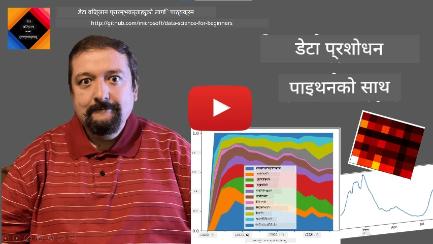
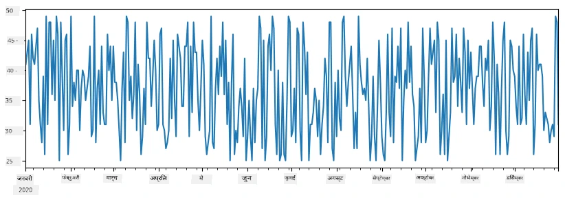
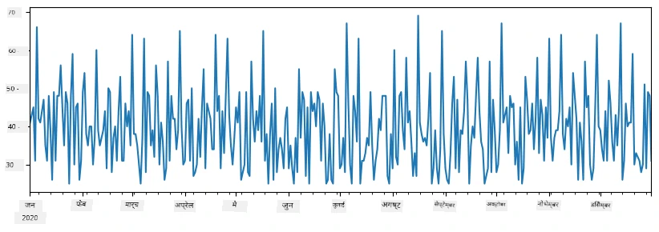
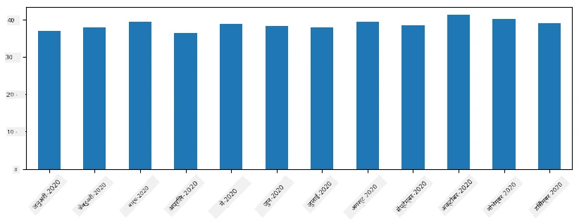
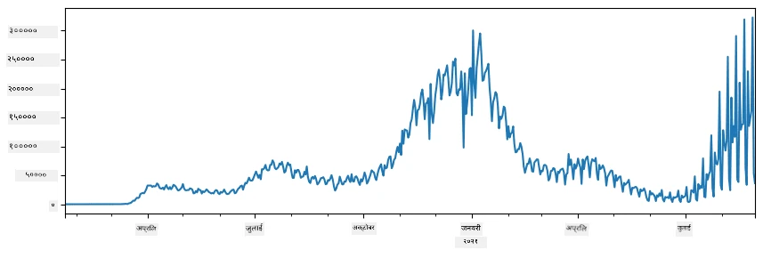
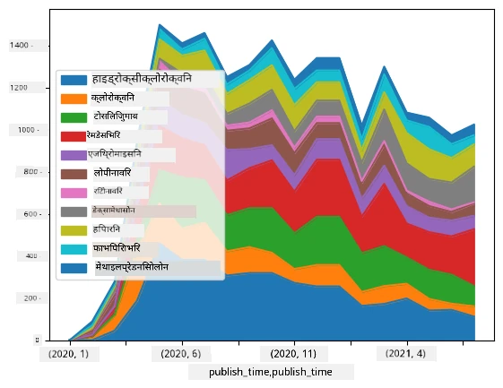

# डेटा सँग काम गर्ने: Python र Pandas लाइब्रेरी

|  ](../../sketchnotes/07-WorkWithPython.png) |
| :-------------------------------------------------------------------------------------------------------: |
|                 Python सँग काम गर्ने - _स्केचनोट द्वारा [@nitya](https://twitter.com/nitya)_                 |

[](https://youtu.be/dZjWOGbsN4Y)

जहाँ डेटाबेसहरूले डेटा भण्डारण गर्ने र सोधपुछ भाषाहरू प्रयोग गरी सोधपुछ गर्ने धेरै प्रभावकारी तरिका प्रदान गर्दछन्, डाटा प्रक्रियाको सबैभन्दा लचिलो तरिका भनेको तपाइँको आफ्नै प्रोग्राम लेखेर डेटा व्यवस्थापन गर्नु हो। धेरै अवस्थामा, डेटाबेस सोधपुछ गर्ने तरिका प्रभावकारी हुन सक्छ। तथापि, केहि जटिल डेटा प्रक्रिया आवश्यक पर्दा, यो सजिलै SQL प्रयोग गरेर गर्न सकिँदैन।
डेटा प्रक्रिया कुनै पनि प्रोग्रामिङ भाषा मा प्रोग्राम गर्न सकिन्छ, तर केही भाषाहरू डेटा सँग काम गर्नेमा उच्च स्तरका मानिन्छन्। डेटा वैज्ञानिकहरूले सामान्यतया तलका मध्ये कुनै एक भाषा रोज्छन्:

* **[Python](https://www.python.org/)**, एउटा सामान्य प्रयोजनको प्रोग्रामिङ भाषा, जुन यसको सरलताका कारण सुरु गर्नेलाई सबैभन्दा राम्रो विकल्पमध्ये एक मानिन्छ। Python मा धेरै अतिरिक्त लाइब्रेरीहरू छन् जसले तपाइँलाई ZIP आर्काइभबाट डेटा निकालन, वा चित्रलाई ग्रेस्केलमा रूपान्तरण गर्ने जस्ता धेरै व्यावहारिक समस्याहरू समाधान गर्न मद्दत गर्छ। डेटा विज्ञानका साथै, Python वेब विकासका लागि पनि प्रायः प्रयोग गरिन्छ।
* **[R](https://www.r-project.org/)** परम्परागत उपकरण बाकस हो जुन सांख्यिकीय डेटा प्रक्रिया ध्यानमा राखेर विकास गरिएको हो। यसमा ठूलो संख्यामा पुस्तकालयहरू (CRAN) छन्, जसले यसलाई डेटा प्रक्रिया गर्न राम्रो विकल्प बनाउँछ। तर R सामान्य प्रयोजनको प्रोग्रामिङ भाषा होइन, र साधारणतया डेटा विज्ञान क्षेत्र बाहिर प्रयोग हुँदैन।
* **[Julia](https://julialang.org/)** अर्को भाषा हो जुन विशेष गरी डेटा विज्ञानका लागि विकास गरिएको हो। यसको उद्देश्य Python भन्दा राम्रो प्रदर्शन दिनु हो, जसले यसलाई वैज्ञानिक प्रयोगको लागि उत्कृष्ट उपकरण बनाउँछ।

यस पाठमा, हामी सरल डेटा प्रक्रिया को लागि Python को प्रयोगमा केन्द्रित हुने छौं। हामी भाषा सँग आधारभूत परिचय मान्ने छौं। यदि तपाईं Python को विस्तृत यात्रा चाहनुहुन्छ भने, तपाईं तलका स्रोतहरू मध्ये कुनै एकमा सन्दर्भ गर्न सक्नुहुन्छ:

* [टर्टल ग्राफिक्स र फ्र्याक्टल्स सँग रमाइलो तरिकामा Python सिक्नुहोस्](https://github.com/shwars/pycourse) - GitHub आधारित Python प्रोग्रामिङमा छिटो परिचय पाठ्यक्रम
* [Python मा तपाईंका पहिलो कदमहरू लिनुहोस्](https://docs.microsoft.com/en-us/learn/paths/python-first-steps/?WT.mc_id=academic-77958-bethanycheum) माइक्रोसफ्ट लर्न मा सिकाइ मार्ग

डेटा धेरै रूपहरूमा आउन सक्छ। यस पाठमा, हामी तीन प्रकारका डाटाहरूमा विचार गर्नेछौँ - **तालिकागत डेटा**, **पाठ्य सामग्री** र **छविहरू**।

हामी केही डेटा प्रक्रिया उदाहरणहरूमा केन्द्रित हुने छौं, सबै सम्बन्धित लाइब्रेरीहरूको पूर्ण ओभरभ्यू दिने सट्टा। यसले तपाईंलाई के सम्भव छ भन्ने मुख्य विचार प्राप्त गर्न अनुमति दिनेछ, र जब आवश्यक पर्छ तब समाधान कहाबाट खोज्ने बुझाइ दिनेछ।

> **सबैभन्दा उपयोगी सल्लाह**। जब तपाईंलाई डेटा मा कुनै निश्चित अपरेशन गर्नुपर्ने हुन्छ जुन तपाईंलाई थाहा छैन, इन्टरनेटमा खोज्ने प्रयास गर्नुहोस्। [Stackoverflow](https://stackoverflow.com/) मा धेरै सामान्य कार्यहरूका लागि Python को धेरै उपयोगी कोड नमूना पाइन्छ।


## [पाठ अघि क्विज](https://ff-quizzes.netlify.app/en/ds/quiz/12)

## तालिकागत डेटा र डेटा फ्रेमहरू

तपाईंले पहिले नै तालिकागत डेटा देख्नुभएको छ जब हामीले सम्बन्धित डेटाबेसहरूबारे कुरा गर्यौं। धेरै डेटा हुँदा र त्यो धेरै विभिन्न लिङ्क भएका तालिकाहरूमा हुने हुँदा, यसमा SQL प्रयोग गरी काम गर्नु बुद्धिमानी हुन्छ। तर धेरै अवस्थाहरूमा, जब हामीसँग एउटा तालिका हुन्छ र हामीलाई यस डेटा को बारेमा केही **बुझाइ** वा **दृष्टिकोण** चाहिन्छ, जस्तो वितरण, मानहरू बीचको सम्बन्ध आदि। डेटा विज्ञानमा, धेरै अवस्थामा हामीलाई मूल डाटामा केहि रूपान्तरणहरू गर्नुपर्छ, त्यसपछि दृश्यांकन गर्नुपर्छ। यी दुबै चरणहरू Python प्रयोग गरेर सजिलै गर्न सकिन्छ।

Python मा दुई सबैभन्दा उपयोगी पुस्तकालयहरू छन् जुनले तपाईंलाई तालिकागत डेटा सँग काम गर्न मद्दत गर्छन्:
* **[Pandas](https://pandas.pydata.org/)** ले तपाइँलाई तथाकथित **Dataframes** सँग काम गर्ने अनुमति दिन्छ, जुन सम्बन्धित तालिकाहरू जस्तै हुन्छ। तपाईंले नामित स्तम्भहरू राख्न सक्नुहुन्छ र पङ्क्तिहरू, स्तम्भहरू र डेटा फ्रेमहरूमा भिन्न अपरेशन्स गर्न सक्नुहुन्छ।
* **[Numpy](https://numpy.org/)** मल्टी-डाइमेन्सनल **array** अर्थात् **tensors** सँग काम गर्न लाइब्रेरी हो। array मा एउटै प्रकारका मानहरू हुन्छन्, र यो डेटा फ्रेम भन्दा सरल हुन्छ, तर यसले अधिक गणितीय अपरेशन्स दिन्छ र कम छ। 

केहि अन्य लाइब्रेरीहरू पनि छन् जुन तपाईंलाई थाहा हुनु आवश्यक छ:
* **[Matplotlib](https://matplotlib.org/)** डेटा दृश्याङ्कन र ग्राफहरू प्लट गर्नको लागि पुस्तकालय हो।
* **[SciPy](https://www.scipy.org/)** केही थप वैज्ञानिक फङ्क्शन्स सहितको लाइब्रेरी हो। हामीले यो लाइब्रेरी पहिले सम्भाव्यता र सांख्यिकी बारे कुराकानी गर्दा देखेको छौं।

यहाँ केहि कोड छ जुन तपाईंले सामान्यतया Python प्रोग्रामको सुरुवातमा ती पुस्तकालयहरू आयात गर्न प्रयोग गर्नुहुन्छ:
```python
import numpy as np
import pandas as pd
import matplotlib.pyplot as plt
from scipy import ... # तपाईंले आवश्यक उप-प्याकेजहरू स्पष्ट रूपमा निर्दिष्ट गर्न आवश्यक छ
``` 

Pandas केही आधारभूत अवधारणाहरू वरिपरि केन्द्रित छ।

### श्रृंखला (Series)

**Series** मानहरूको एउटा अनुक्रम हो, जस्तो कि लिस्ट वा numpy array को जस्तै। मुख्य फरक भनेको seriesसँग पनि **index** हुन्छ, र जब हामी series मा अपरेशन गर्छौं (जस्तै थप्न), त हामी index लाई विचार गर्छौं। Index साधारण रूपमा पूर्णांक पङ्क्ति संख्या हुन सक्छ (यदि तपाईंले सूची वा एर्रेबाट series बनाउनु भयो भने यो डिफल्ट हुन्छ), वा यो जटिल संरचना हुन सक्छ, जस्तै मिति अन्तराल।

> **टिप**: सङ्गै रहेको नोटबुक [`notebook.ipynb`](notebook.ipynb) मा केही introductory Pandas कोड छन्। हामी यहाँ केहि उदाहरणहरू मात्र सारांश गर्छौं, र तपाईंलाई पूर्ण नोटबुक अवश्य हेर्न सल्लाह दिइन्छ।

एउटा उदाहरण लिनुहोस्: हामीलाई हाम्रो आइस्क्रीम पसलको बिक्री विश्लेषण गर्नुछ। केही समय अवधिका लागि दैनिक बिक्री संख्याहरूको श्रृंखला (विक्री भएका आइटमहरूको संख्या) बनाऔं:

```python
start_date = "Jan 1, 2020"
end_date = "Mar 31, 2020"
idx = pd.date_range(start_date,end_date)
print(f"Length of index is {len(idx)}")
items_sold = pd.Series(np.random.randint(25,50,size=len(idx)),index=idx)
items_sold.plot()
```


अब मानौँ हाम्रा हरेक हप्ता साथीहरूको लागि पार्टी आयोजना हुन्छ, र हामी पार्टीका लागि थप 10 प्याक आइस्क्रीम लिन्छौं। हामी अर्को श्रृंखला, जुन हप्ताको सूचकाङ्कद्वारा निर्देशित छ, बनाउन सक्छौं:
```python
additional_items = pd.Series(10,index=pd.date_range(start_date,end_date,freq="W"))
```
जब हामी दुई श्रृखा थप्छौं, तब कुल संख्या प्राप्त हुन्छ:
```python
total_items = items_sold.add(additional_items,fill_value=0)
total_items.plot()
```


> **टिप**: हामीले सरल `total_items+additional_items` सिन्ट्याक्स प्रयोग गरेका छैनौं। यदि प्रयोग गर्थ्यौं भने, नतिजा श्रृंखलामा धेरै `NaN` (*संख्या होइन*) मानहरू प्राप्त गर्थ्यौं। किनभने `additional_items` श्रृंखलामा केही index बिन्दुहरूको मानहरू हराइरहेका छन्, र `NaN` लाई केहीमा थप्दा `NaN` नै हुन्छ। त्यसैले थप्दाखेरी `fill_value` प्यारामिटर सेट गर्नु आवश्यक हुन्छ।

टाइम श्रृंखलाहरूको सँगै, हामी श्रृंखलालाई फरक-फरक समयावधिहरूमा **पुनः नमूना गर्न** सक्छौं। उदाहरणका लागि, हामी महिनावारी औसत बिक्री गणना गर्न चाहन्छौं भने, तलको कोड प्रयोग गर्न सकिन्छ:
```python
monthly = total_items.resample("1M").mean()
ax = monthly.plot(kind='bar')
```


### डेटा फ्रेम (DataFrame)

डेटा फ्रेम मूलमा एउटै index भएका धेरै श्रृंखलाहरूको संग्रह हो। हामी केही sériesलाई एकसाथ डेटा फ्रेममा मिलाउन सक्छौं:
```python
a = pd.Series(range(1,10))
b = pd.Series(["I","like","to","play","games","and","will","not","change"],index=range(0,9))
df = pd.DataFrame([a,b])
```
यसले यस्तो क्षैतिज तालिका सिर्जना गर्नेछ:
|     | 0   | 1    | 2   | 3   | 4      | 5   | 6      | 7    | 8    |
| --- | --- | ---- | --- | --- | ------ | --- | ------ | ---- | ---- |
| 0   | 1   | 2    | 3   | 4   | 5      | 6   | 7      | 8    | 9    |
| 1   | I   | like | to  | use | Python | and | Pandas | very | much |

हामी श्रृंखलाहरूलाई स्तम्भको रूपमा पनि प्रयोग गर्न सक्छौं, र डिक्सनरी प्रयोग गरी स्तम्भ नामहरू निर्दिष्ट गर्न सक्छौं:
```python
df = pd.DataFrame({ 'A' : a, 'B' : b })
```
यसले हामीलाई यस्तो तालिका दिन्छ:

|     | A   | B      |
| --- | --- | ------ |
| 0   | 1   | I      |
| 1   | 2   | like   |
| 2   | 3   | to     |
| 3   | 4   | use    |
| 4   | 5   | Python |
| 5   | 6   | and    |
| 6   | 7   | Pandas |
| 7   | 8   | very   |
| 8   | 9   | much   |

**टिप**: हामी यस तालिका लेआउटलाई पहिलेको तालिकालाई ट्रान्सपोज गरेर पनि प्राप्त गर्न सक्छौं, जस्तै लेखेर
```python
df = pd.DataFrame([a,b]).T.rename(columns={ 0 : 'A', 1 : 'B' })
```
यहाँ `.T` ले डेटा फ्रेमको पङ्क्ति र स्तम्भ बदल्ने ट्रान्सपोज अपरेशन जनाउँछ, र `rename` अपरेशनले स्तम्भहरूको नाम पहिलेको उदाहरणसँग मिलाउन परिवर्तन गर्छ।

यहाँ डेटा फ्रेमहरूमा गर्न सकिने केही सबैभन्दा महत्वपूर्ण कार्यहरू छन्:

**स्तम्भ चयन**। हामी `df['A']` लेखेर व्यक्तिगत स्तम्भहरू चयन गर्न सक्छौं - यसले Series फिर्ता गर्छ। हामी `df[['B','A']]` लेखेर कुनै स्तम्भ subset चयन गरी अर्को DataFrame पनि बनाउन सक्छौं - यसले अर्को DataFrame फिर्ता गर्छ।

**केवल केही पङ्क्तिहरूलाई फिल्टर गर्ने**, मानदण्ड अनुसार। उदाहरणका लागि, `A` स्तम्भ ५ भन्दा ठुलो मान भएका पङ्क्तिहरू मात्र राख्न, `df[df['A']>5]` लेख्न सकिन्छ।

> **टिप**: फिल्टर यस्तो काम गर्छ। अभिव्यक्ति `df['A']<5` boolean श्रृंखला फिर्ता गर्छ, जुन प्रदर्शन गर्छ कि मूल श्रृंखला `df['A']` को प्रत्येक तत्वको लागि त्यो साँचो छ कि झुटो। जब boolean श्रृंखला सूचकांकको रूपमा प्रयोग हुन्छ, यसले डेटा फ्रेमको पङ्क्तिहरूको उपसमूह फिर्ता गर्छ। त्यसैले सामान्य Python boolean अभिव्यक्ति प्रयोग गर्न सकिन्न, जस्तै `df[df['A']>5 and df['A']<7]` गलत हुन्छ। यसको सट्टामा, boolean श्रृंखलामा विशेष `&` अपरेटर प्रयोग गर्नु पर्छ, `df[(df['A']>5) & (df['A']<7)]` लेखेर (*ब्र्याकेटहरू आवश्यक छन्*).

**नयाँ गणना योग्य स्तम्भहरू सिर्जना गर्ने**। हामी हाम्रो DataFrame को लागि सहज अभिव्यक्तिहरू प्रयोग गरेर नयाँ गणना स्तम्भहरू सजिलै बनाउन सक्छौं:
```python
df['DivA'] = df['A']-df['A'].mean() 
``` 
यस उदाहरणले A को माध्य मानबाट हेरफेर गणना गर्दछ। यहाँ के भइरहेको छ भने हामी एक श्रृंखला गणना गर्दैछौं, र त्यसपछि त्यो श्रृंखला बायाँतर्फ असाइन गरी अर्को स्तम्भ सिर्जना गर्दैछौं। त्यसैले, हामी श्रृंखला सँग आसंगत नभएका अपरेशन्स प्रयोग गर्न सक्दैनौं, जस्तै तलको कोड गलत हो:
```python
# गलत कोड -> df['ADescr'] = "Low" if df['A'] < 5 else "Hi"
df['LenB'] = len(df['B']) # <- गलत परिणाम
``` 
यो पछिल्लो उदाहरण, यद्यपि सिन्ट्याक्टिक रूपले सही छ, हामीलाई गलत नतिजा दिन्छ, किनभने यसले B श्रृंखलाको लम्बाई सबै मानहरूमा राख्छ, हामीले चाहेको व्यक्तिगत तत्वहरूको लम्बाई होइन।

यदि हामीलाई यस्तो जटिल अभिव्यक्ति गणना गर्नुपर्छ भने, हामी `apply` फंक्शन प्रयोग गर्न सक्छौं। अन्तिम उदाहरण यसरी लेख्न सकिन्छ:
```python
df['LenB'] = df['B'].apply(lambda x : len(x))
# वा
df['LenB'] = df['B'].apply(len)
```

माथिका अपरेशन्स पछि, हामीसँग तलको DataFrame हुनेछ:

|     | A   | B      | DivA | LenB |
| --- | --- | ------ | ---- | ---- |
| 0   | 1   | I      | -4.0 | 1    |
| 1   | 2   | like   | -3.0 | 4    |
| 2   | 3   | to     | -2.0 | 2    |
| 3   | 4   | use    | -1.0 | 3    |
| 4   | 5   | Python | 0.0  | 6    |
| 5   | 6   | and    | 1.0  | 3    |
| 6   | 7   | Pandas | 2.0  | 6    |
| 7   | 8   | very   | 3.0  | 4    |
| 8   | 9   | much   | 4.0  | 4    |

**संख्या अनुसार पङ्क्तिहरू चयन** `iloc` संरचना प्रयोग गरेर गर्न सकिन्छ। उदाहरणका लागि, DataFrame बाट पहिलो ५ पङ्क्तिहरू चयन गर्न:
```python
df.iloc[:5]
```

**समूहबद्धीकरण** प्रायः Excel मा *pivot table* जस्तै नतिजा प्राप्त गर्न प्रयोग गरिन्छ। मानौँ हामी `LenB` को प्रत्येक मानको लागि स्तम्भ `A` को माध्य मान गणना गर्न चाहन्छौं। त्यसपछि हामी DataFrame लाई `LenB` द्वारा समूहबद्ध गरी `mean` कल गर्न सक्छौं:
```python
df.groupby(by='LenB')[['A','DivA']].mean()
```
यदि हामीलाई समूहमा माध्य र संख्या दुवै गणना गर्नुपर्छ भने, हामी थप जटिल `aggregate` फंक्शन प्रयोग गर्न सक्छौं:
```python
df.groupby(by='LenB') \
 .aggregate({ 'DivA' : len, 'A' : lambda x: x.mean() }) \
 .rename(columns={ 'DivA' : 'Count', 'A' : 'Mean'})
```
यसले हामीलाई तलको तालिका दिन्छ:

| LenB | Count | Mean     |
| ---- | ----- | -------- |
| 1    | 1     | 1.000000 |
| 2    | 1     | 3.000000 |
| 3    | 2     | 5.000000 |
| 4    | 3     | 6.333333 |
| 6    | 2     | 6.000000 |

### डेटा प्राप्ति


हामीले देख्यौं कि Python वस्तुहरूबाट कसरि सजिलै Series र DataFrames निर्माण गर्न सकिन्छ। तर, डेटा प्रायः एउटा टेक्स्ट फाइल वा Excel तालिकाको रूपमा आउँछ। सौभाग्यवश, Pandas ले हामीलाई डिस्कबाट डेटा लोड गर्न साधारण तरिका प्रदान गर्दछ। उदाहरणका लागि, CSV फाइल पढ्न यो जति सरल छ:
```python
df = pd.read_csv('file.csv')
```
हामीले "Challenge" सेक्सनमा बाह्य वेब साइटहरूबाट डेटा ल्याउने लगायत डेटा लोड गर्ने अझ धेरै उदाहरणहरू हेर्नेछौं


### प्रिन्टिङ र प्लटिङ

एक Data Scientist ले प्रायः डेटा अन्वेषण गर्नुपर्छ, त्यसैले यसलाई दृश्यात्मक रूपमा देखाउन सक्नु महत्वपूर्ण छ। जब DataFrame ठूलो हुन्छ, धेरै पटक हामीले सही रूपमा कार्य गरिरहेका छौं वा छैन भनेर सुनिश्चित गर्न सुरुका केही पंक्तिहरू मात्र प्रिन्ट गर्न चाहन्छौं। यो `df.head()` कल गरेर गर्न सकिन्छ। यदि तपाईं Jupyter Notebook बाट चलाउँदै हुनुहुन्छ भने, यसले DataFrameलाई राम्रो टेबल फारममा प्रिन्ट गर्नेछ।

हामीले पनि केही स्तम्भहरू दृश्यात्मक बनाउन `plot` फंक्शनको प्रयोग देखेका छौं। `plot` धेरै कामहरूका लागि धेरै उपयोगी छ र `kind=` प्यारामिटरको माध्यमबाट विभिन्न ग्राफ प्रकारहरू समर्थन गर्दछ, तर तपाईं जहिले पनि अझ जटिल कुरा प्लट गर्न कच्चा `matplotlib` लाइब्रेरी प्रयोग गर्न सक्नुहुन्छ। हामी डाटाभिजुअलाइजेशनलाई अलग पाठहरूमा विस्तारमा छलफल गर्नेछौं।

यो अवलोकनले Pandas का सबैभन्दा महत्वपूर्ण अवधारणाहरू समेट्छ, यद्यपि यो लाइब्रेरी धेरै समृद्ध छ, र तपाईंले यससँग गर्न सक्ने कुराको कुनै सीमा छैन! अब यस ज्ञानलाई विशिष्ट समस्याको समाधान गर्न प्रयोग गरौं।

## 🚀 चुनौती १: COVID फैलावट विश्लेषण

पहिलो समस्या जुन हामीले केन्द्रित गर्नेछौं त्यो हो COVID-19 को महामारी फैलावटको मोडेलिङ। त्यसका लागि, हामीले विभिन्न देशहरूमा संक्रमित व्यक्तिहरूको संख्या सम्बन्धी डेटा प्रयोग गर्नेछौं, जुन [Center for Systems Science and Engineering](https://systems.jhu.edu/) (CSSE) ले [Johns Hopkins University](https://jhu.edu/) मा प्रदान गरेको छ। डेटासेट [यस GitHub रिपोजिटरीमा](https://github.com/CSSEGISandData/COVID-19) उपलब्ध छ।

किनभने हामी डेटा कसरी ह्यान्डल गर्ने देखाउन चाहन्छौं, हामी तपाईंलाई [`notebook-covidspread.ipynb`](notebook-covidspread.ipynb) खोल्न र शीर्षबाट तलसम्म पढ्न आमन्त्रण गर्दछौं। तपाईं सेल्लहरू पनि चलाउन सक्नुहुन्छ र अन्त्यमा हामीले राखेका केही चुनौतीहरू गर्न सक्नुहुन्छ।



> यदि तपाईंलाई Jupyter Notebook मा कोड कसरी चलाउने थाहा छैन भने, [यस लेख](https://soshnikov.com/education/how-to-execute-notebooks-from-github/) मा हेर्नुहोस्।

## गैर-संरचित डेटा सँग काम गर्ने

डेटा प्रायः तालिकागत फारममा आउँछ, तर कतिपय अवस्थामा हामी कम संरचित डेटा जस्तै टेक्स्ट वा छविहरूसँग काम गर्न आवश्यक पर्छ। यस्तो अवस्थामा माथि देखाइएका डेटा प्रशोधन प्रविधिहरू प्रयोग गर्न हामीले कुनै प्रकारले **संरचित** डेटा **निकाल्न** आवश्यक हुन्छ। यहाँ केही उदाहरणहरू छन्:

* टेक्स्टबाट मुख्य शब्दहरू निकाल्नु, र ती शब्दहरू कति पटक देखा पर्दछ हेर्नु
* तस्बिरमा वस्तुहरूको बारेमा जानकारी निकाल्न न्यूरल नेटवर्कहरू प्रयोग गर्नु
* भिडीयो क्यामेरा फिडमा मानिसहरूको भावनाको बारेमा जानकारी प्राप्त गर्नु

## 🚀 चुनौती २: COVID कागजातहरूको विश्लेषण

यस चुनौतीमा, हामी COVID महामारी विषयमा वैज्ञानिक कागजातहरू प्रसंस्करण गर्ने विषयमा ध्यान केन्द्रित गर्नेछौं। [CORD-19 डेटासेट](https://www.kaggle.com/allen-institute-for-ai/CORD-19-research-challenge) मा ७००० भन्दा बढी (लेखिरहेका बेला) COVID सम्बन्धी कागजातहरू छन्, जुन मेटाडाटा र सारांसहित उपलब्ध छन् (र करिब आधाका लागि पूर्ण पाठ पनि प्रदान गरिएको छ)।

[Text Analytics for Health](https://docs.microsoft.com/azure/cognitive-services/text-analytics/how-tos/text-analytics-for-health/?WT.mc_id=academic-77958-bethanycheum) संज्ञानात्मक सेवा प्रयोग गरेर यस डेटासेटको विश्लेषण गरेको पूर्ण उदाहरण [यस ब्लग पोस्टमा](https://soshnikov.com/science/analyzing-medical-papers-with-azure-and-text-analytics-for-health/) वर्णन गरिएको छ। हामी यस विश्लेषणको सरलीकृत संस्करण छलफल गर्नेछौं।

> **NOTE**: हामीले यस रिपोजिटरीको भागको रूपमा डेटासेटको प्रतिलिपि प्रदान गरेका छैनौं। तपाईंले पहिले [यस Kaggle डेटासेटमा](https://www.kaggle.com/allen-institute-for-ai/CORD-19-research-challenge) बाट [`metadata.csv`](https://www.kaggle.com/allen-institute-for-ai/CORD-19-research-challenge?select=metadata.csv) फाइल डाउनलोड गर्न आवश्यक हुन सक्छ। Kaggle मा दर्ता आवश्यक हुन सक्छ। तपाईं दर्ता नगरी नै [यहाँबाट](https://ai2-semanticscholar-cord-19.s3-us-west-2.amazonaws.com/historical_releases.html) डेटासेट डाउनलोड गर्न सक्नुहुन्छ, तर त्योले सबै पूर्ण पाठ मेटाडाटा फाइलसँगै समावेश गर्नेछ।

[`notebook-papers.ipynb`](notebook-papers.ipynb) खोल्नुहोस् र शीर्षबाट तलसम्म पढ्नुहोस्। तपाईं सेल्लहरू पनि चलाउन सक्नुहुन्छ र अन्त्यमा हामीले राखेका केही चुनौतीहरू गर्न सक्नुहुन्छ।



## छवि डेटा प्रशोधन

भर्खरै, अत्यन्त शक्तिशाली AI मोडेलहरू विकास भएका छन् जसले हामीलाई तस्बिरहरू बुझ्न मद्दत गर्छ। धेरै कार्यहरू पूर्व-प्रशिक्षित न्यूरल नेटवर्कहरू वा क्लाउड सेवाहरू प्रयोग गरेर समाधान गर्न सकिन्छ। केही उदाहरणहरू यस्ता छन्:

* **छवि वर्गीकरण**, जसले तपाईंलाई तस्बिरलाई पूर्व-निर्धारित वर्गहरूमध्ये एकमा वर्गीकरण गर्न मद्दत गर्दछ। तपाईं सजिलै आफ्नो तस्बिर वर्गीकरणकर्ता प्रशिक्षण गर्न सक्नुहुन्छ जस्तै [Custom Vision](https://azure.microsoft.com/services/cognitive-services/custom-vision-service/?WT.mc_id=academic-77958-bethanycheum) सेवाहरू प्रयोग गरेर
* **वस्तु पहिचान** तस्बिरमा फरक वस्तुहरू पत्ता लगाउन। [computer vision](https://azure.microsoft.com/services/cognitive-services/computer-vision/?WT.mc_id=academic-77958-bethanycheum) जस्ता सेवाले धेरै सामान्य वस्तुहरू पत्ता लगाउन सक्छ, र तपाईंले [Custom Vision](https://azure.microsoft.com/services/cognitive-services/custom-vision-service/?WT.mc_id=academic-77958-bethanycheum) मोडेललाई केही विशेष चासोका वस्तुहरू पत्ता लगाउन तालिम दिन सक्नुहुन्छ।
* **चेहरा पहिचान**, जसमा उमेर, लिङ्ग र भावना पहिचान समावेश छ। यो [Face API](https://azure.microsoft.com/services/cognitive-services/face/?WT.mc_id=academic-77958-bethanycheum) मार्फत गर्न सकिन्छ।

ती सबै क्लाउड सेवाहरूलाई [Python SDKs](https://docs.microsoft.com/samples/azure-samples/cognitive-services-python-sdk-samples/cognitive-services-python-sdk-samples/?WT.mc_id=academic-77958-bethanycheum) प्रयोग गरेर कल गर्न सकिन्छ, र यसैले यो तपाईंको डेटा अन्वेषण कार्यप्रवाहमा सजिलै समावेश गर्न सकिन्छ।

यहाँ छवि डेटा स्रोतहरूबाट डेटा अन्वेषण गर्ने केहि उदाहरणहरू छन्:
* ब्लग पोस्ट [How to Learn Data Science without Coding](https://soshnikov.com/azure/how-to-learn-data-science-without-coding/) मा हामी Instagram फोटोहरू अन्वेषण गर्छौं, बुझ्न प्रयास गर्दै कि मानिसहरुले फोटोमा बढी लाइक किन दिन्छन्। हामी सबैभन्दा पहिले [computer vision](https://azure.microsoft.com/services/cognitive-services/computer-vision/?WT.mc_id=academic-77958-bethanycheum) प्रयोग गरेर तस्बिरहरूबाट सकेसम्म धेरै जानकारी निकाल्छौं, र त्यसपछि [Azure Machine Learning AutoML](https://docs.microsoft.com/azure/machine-learning/concept-automated-ml/?WT.mc_id=academic-77958-bethanycheum) प्रयोग गरेर व्याख्यात्मक मोडेल बनाउँछौं।
* [Facial Studies Workshop](https://github.com/CloudAdvocacy/FaceStudies) मा हामी [Face API](https://azure.microsoft.com/services/cognitive-services/face/?WT.mc_id=academic-77958-bethanycheum) प्रयोग गरेर कार्यक्रमहरूबाट रहेका मानिसहरूका फोटोहरूमा भावनाहरू निकाल्छौं, जसले केले मानिसहरूलाई खुशी बनाउँछ बुझ्ने प्रयास गर्दछ।

## निष्कर्ष

तपाईं सङरचित वा गैर-संरचित डेटा दुबै भए तापनि, Python प्रयोग गरेर तपाईंले डेटा प्रशोधन र बुझाइसँग सम्बन्धित सबै चरणहरू गर्न सक्नुहुन्छ। यो सम्भवतः सबैभन्दा लचिलो डेटा प्रशोधन विधि हो, र यस्तै कारणले डेटा वैज्ञानिकहरुको बहुलांशले Python लाई प्रमुख उपकरणका रूपमा प्रयोग गर्छन्। यदि तपाईं आफ्नो डेटा विज्ञान यात्रा गम्भीरतापूर्वक लिनुहुन्छ भने, Python गहिरो रूपमा सिक्न राम्रो विचार हुन सक्छ!

## [पोष्ट-लेक्चर क्विज](https://ff-quizzes.netlify.app/en/ds/quiz/13)

## समीक्षा र आत्म-अध्ययन

**पुस्तकहरू**
* [Wes McKinney. Python for Data Analysis: Data Wrangling with Pandas, NumPy, and IPython](https://www.amazon.com/gp/product/1491957662)

**अनलाइन स्रोतहरू**
* आधिकारिक [10 minutes to Pandas](https://pandas.pydata.org/pandas-docs/stable/user_guide/10min.html) ट्यूटोरियल
* [Pandas Visualization सम्बन्धि डकुमेन्टेसन](https://pandas.pydata.org/pandas-docs/stable/user_guide/visualization.html)

**Python सिक्ने**
* [Turtle Graphics र Fractals सँग रमाइलो तरिकाले Python सिक्नुहोस्](https://github.com/shwars/pycourse)
* [Python मा पहिलो कदम चाल्नुहोस्](https://docs.microsoft.com/learn/paths/python-first-steps/?WT.mc_id=academic-77958-bethanycheum) Microsoft Learn मा सिक्ने बाटो

## कार्य

[माथिका चुनौतीहरूको लागि विस्तृत डेटा अध्ययन गर्नुहोस्](assignment.md)

## श्रेय

यो पाठ ♥️ सँग [Dmitry Soshnikov](http://soshnikov.com) द्वारा तयार पारिएको हो

---

<!-- CO-OP TRANSLATOR DISCLAIMER START -->
**अस्वीकरण**:
यो दस्तावेज़ AI अनुवाद सेवा [Co-op Translator](https://github.com/Azure/co-op-translator) प्रयोग गरेर अनुवाद गरिएको हो। हामी सही हुन प्रयास गर्छौं, तर कृपया जानकार हुनुस् कि स्वचालित अनुवादमा त्रुटिहरू वा अशुद्धताहरू हुन सक्छन्। मूल दस्तावेज़ यसको मूल भाषामा आधिकारिक स्रोत मानिनुपर्छ। महत्वपूर्ण जानकारीका लागि व्यावसायिक मानव अनुवाद सिफारिस गरिन्छ। यस अनुवादको प्रयोगबाट उत्पन्न कुनै पनि गलत बुझाइ वा त्रुटिको लागि हामी जिम्मेवार छैनौं।
<!-- CO-OP TRANSLATOR DISCLAIMER END -->