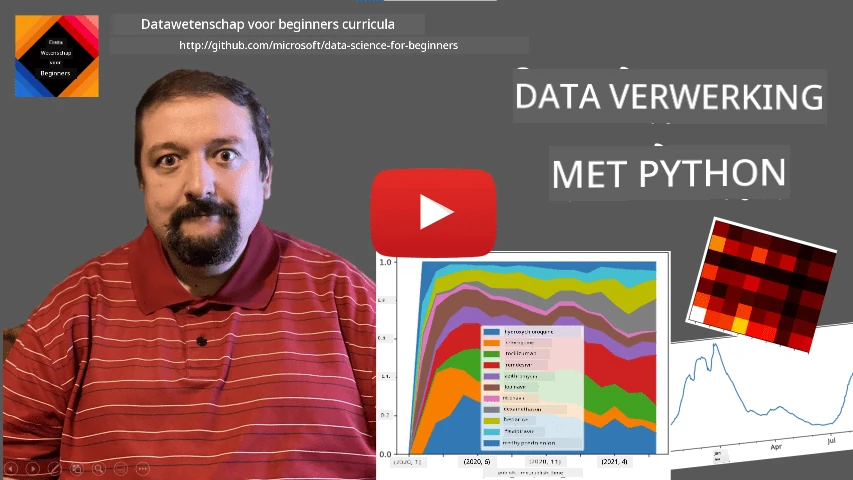
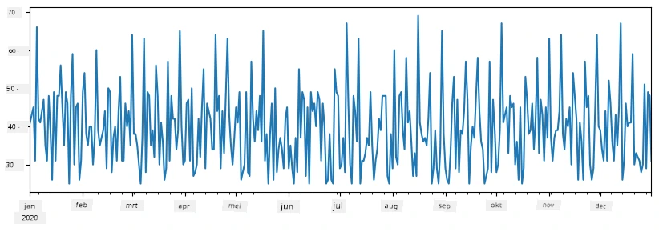
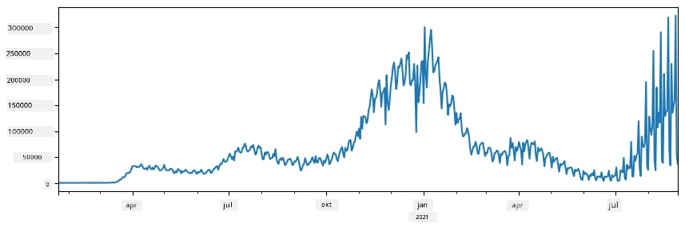
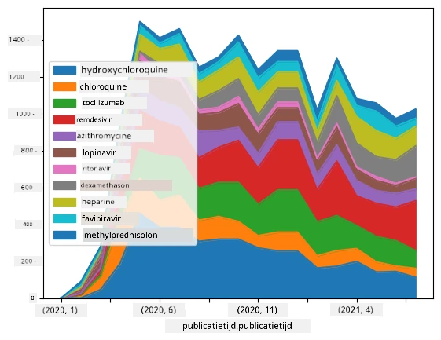

# Werken met Gegevens: Python en de Pandas Bibliotheek

|  ](../../sketchnotes/07-WorkWithPython.png) |
| :-------------------------------------------------------------------------------------------------------: |
|                 Werken met Python - _Sketchnote door [@nitya](https://twitter.com/nitya)_                 |

[](https://youtu.be/dZjWOGbsN4Y)

Hoewel databases zeer efficiënte manieren bieden om data op te slaan en te bevragen met querytalen, is de meest flexibele manier van dataverwerking het schrijven van je eigen programma om data te manipuleren. In veel gevallen zou een database-query effectiever zijn. Echter, in sommige gevallen wanneer meer complexe dataverwerking nodig is, kan dit niet gemakkelijk met SQL worden gedaan. 
Dataverwerking kan geprogrammeerd worden in elke programmeertaal, maar er zijn bepaalde talen die hoger niveau zijn met betrekking tot werken met data. Datascientists geven meestal de voorkeur aan een van de volgende talen:

* **[Python](https://www.python.org/)**, een algemene programmeertaal, die vaak wordt beschouwd als een van de beste opties voor beginners vanwege zijn eenvoud. Python heeft veel extra bibliotheken die je kunnen helpen bij het oplossen van veel praktische problemen, zoals het extraheren van data uit ZIP-archieven, of het converteren van een afbeelding naar grijswaarden. Naast datawetenschap wordt Python ook vaak gebruikt voor webontwikkeling. 
* **[R](https://www.r-project.org/)** is een traditionele toolbox ontwikkeld met statistische dataverwerking in gedachten. Het bevat ook een grote bibliotheek (CRAN), wat het een goede keuze maakt voor dataverwerking. Echter, R is geen algemene programmeertaal en wordt zelden buiten het datawetenschapsdomein gebruikt.
* **[Julia](https://julialang.org/)** is een andere taal die specifiek voor datawetenschap is ontwikkeld. Het is bedoeld om betere prestaties te bieden dan Python, wat het een geweldig instrument maakt voor wetenschappelijke experimenten.

In deze les richten we ons op het gebruiken van Python voor eenvoudige dataverwerking. We gaan uit van basiskennis van de taal. Als je een diepere introductie in Python wilt, kun je een van de volgende bronnen raadplegen:

* [Learn Python in a Fun Way with Turtle Graphics and Fractals](https://github.com/shwars/pycourse) - GitHub-gebaseerde korte introductiecursus in Python programmeren
* [Take your First Steps with Python](https://docs.microsoft.com/en-us/learn/paths/python-first-steps/?WT.mc_id=academic-77958-bethanycheum) Leerpad op [Microsoft Learn](http://learn.microsoft.com/?WT.mc_id=academic-77958-bethanycheum)

Data kan in vele vormen voorkomen. In deze les behandelen we drie vormen van data - **tabelgegevens**, **tekst** en **afbeeldingen**.

We richten ons op een paar voorbeelden van dataverwerking, in plaats van een volledig overzicht te geven van alle gerelateerde bibliotheken. Dit stelt je in staat de hoofdlijn te begrijpen van wat mogelijk is, en geeft je inzicht in waar je oplossingen kunt vinden als je ze nodig hebt.

> **Meest nuttige advies**. Wanneer je een bepaalde bewerking op data wilt uitvoeren die je niet weet hoe je moet doen, probeer ernaar te zoeken op internet. [Stackoverflow](https://stackoverflow.com/) bevat meestal veel nuttige Python codevoorbeelden voor veel voorkomende taken. 


## [Voor-lezing quiz](https://ff-quizzes.netlify.app/en/ds/quiz/12)

## Tabelgegevens en Dataframes

Je hebt al tabelgegevens ontmoet toen we het hadden over relationele databases. Wanneer je veel data hebt, opgesplitst over verschillende gekoppelde tabellen, is het zeker zinvol SQL te gebruiken om ermee te werken. Er zijn echter veel gevallen waarin we een tabel met data hebben en we wat **inzicht** of **begrip** over deze data willen krijgen, zoals de verdeling, correlatie tussen waarden, etc. In datawetenschap zijn er veel gevallen waarin we transformaties van de originele data moeten uitvoeren, gevolgd door visualisatie. Beide stappen kunnen eenvoudig met Python worden gedaan.

Er zijn twee meest nuttige bibliotheken in Python die je kunnen helpen met tabeldata:
* **[Pandas](https://pandas.pydata.org/)** laat je zogenaamde **Dataframes** manipuleren, die analoog zijn aan relationele tabellen. Je kunt benoemde kolommen hebben en verschillende operaties uitvoeren op rijen, kolommen en Dataframes in het algemeen. 
* **[Numpy](https://numpy.org/)** is een bibliotheek voor het werken met **tensors**, dat wil zeggen multi-dimensionale **arrays**. Arrays bevatten waarden van hetzelfde onderliggende type, en zijn eenvoudiger dan Dataframes, maar bieden meer wiskundige operaties en creëren minder overhead.

Er zijn ook een paar andere bibliotheken die je moet kennen:
* **[Matplotlib](https://matplotlib.org/)** is een bibliotheek die wordt gebruikt voor datavisualisatie en het plotten van grafieken
* **[SciPy](https://www.scipy.org/)** is een bibliotheek met enkele aanvullende wetenschappelijke functies. We zijn deze bibliotheek al tegengekomen bij het bespreken van waarschijnlijkheid en statistiek

Hier is een stuk code dat je typisch gebruikt om deze bibliotheken te importeren aan het begin van je Python-programma:
```python
import numpy as np
import pandas as pd
import matplotlib.pyplot as plt
from scipy import ... # je moet de exacte subpakketten specificeren die je nodig hebt
``` 

Pandas is gericht op een paar basisconcepten.

### Series 

**Series** is een reeks waarden, vergelijkbaar met een lijst of numpy array. Het belangrijkste verschil is dat een series ook een **index** heeft, en wanneer we operaties op series uitvoeren (bijvoorbeeld optellen), wordt de index in aanmerking genomen. De index kan zo simpel zijn als een geheel getal rij-nummer (dit is de standaard index bij het maken van een series uit een lijst of array), of het kan een complexe structuur hebben, zoals een datuminterval.

> **Opmerking**: Er is enige introductiecode voor Pandas in het bijbehorende notebook [`notebook.ipynb`](notebook.ipynb). We behandelen hier slechts enkele voorbeelden en je bent zeker welkom om het volledige notebook te bekijken.

Overweeg een voorbeeld: we willen de verkoop van onze ijswinkel analyseren. Laten we een series maken van verkopen (aantal verkochte items per dag) over een bepaalde periode:

```python
start_date = "Jan 1, 2020"
end_date = "Mar 31, 2020"
idx = pd.date_range(start_date,end_date)
print(f"Length of index is {len(idx)}")
items_sold = pd.Series(np.random.randint(25,50,size=len(idx)),index=idx)
items_sold.plot()
```


Stel nu dat we elke week een feestje organiseren voor vrienden, en we nemen extra 10 pakken ijs mee voor het feest. We kunnen een andere series maken, geïndexeerd op week, om dat te demonstreren:
```python
additional_items = pd.Series(10,index=pd.date_range(start_date,end_date,freq="W"))
```
Wanneer we twee series optellen, krijgen we het totaal aantal:
```python
total_items = items_sold.add(additional_items,fill_value=0)
total_items.plot()
```


> **Let op** dat we niet de eenvoudige syntax `total_items+additional_items` gebruiken. Als we dat deden, zouden we veel `NaN` (*Not a Number*) waarden in de resulterende series krijgen. Dit komt omdat er ontbrekende waarden zijn voor enkele indexpunten in de `additional_items` series, en het optellen van `NaN` met iets resulteert in `NaN`. Daarom moeten we tijdens de optelling de parameter `fill_value` specificeren.

Met tijdseries kunnen we ook de series **resamplen** met verschillende tijdsintervallen. Bijvoorbeeld, stel dat we het gemiddelde maandelijkse verkoopvolume willen berekenen. We kunnen de volgende code gebruiken:
```python
monthly = total_items.resample("1M").mean()
ax = monthly.plot(kind='bar')
```


### DataFrame

Een DataFrame is in essentie een verzameling van series met dezelfde index. We kunnen verschillende series samenvoegen in een DataFrame:
```python
a = pd.Series(range(1,10))
b = pd.Series(["I","like","to","play","games","and","will","not","change"],index=range(0,9))
df = pd.DataFrame([a,b])
```
Dit maakt een horizontale tabel zoals deze:
|     | 0   | 1    | 2   | 3   | 4      | 5   | 6      | 7    | 8    |
| --- | --- | ---- | --- | --- | ------ | --- | ------ | ---- | ---- |
| 0   | 1   | 2    | 3   | 4   | 5      | 6   | 7      | 8    | 9    |
| 1   | I   | like | to  | use | Python | and | Pandas | very | much |

We kunnen ook Series als kolommen gebruiken, en kolomnamen specificeren via een dictionary:
```python
df = pd.DataFrame({ 'A' : a, 'B' : b })
```
Dit geeft ons een tabel zoals deze:

|     | A   | B      |
| --- | --- | ------ |
| 0   | 1   | I      |
| 1   | 2   | like   |
| 2   | 3   | to     |
| 3   | 4   | use    |
| 4   | 5   | Python |
| 5   | 6   | and    |
| 6   | 7   | Pandas |
| 7   | 8   | very   |
| 8   | 9   | much   |

**Let op** dat we deze tabelindeling ook kunnen krijgen door de vorige tabel te transponeren, bijvoorbeeld door te schrijven 
```python
df = pd.DataFrame([a,b]).T.rename(columns={ 0 : 'A', 1 : 'B' })
```
Hier betekent `.T` de bewerking van het transponeren van de DataFrame, dat wil zeggen rijen en kolommen verwisselen, en de `rename` bewerking stelt ons in staat de kolommen opnieuw te benoemen om het vorige voorbeeld te laten kloppen.

Hier zijn een paar van de belangrijkste bewerkingen die we op DataFrames kunnen uitvoeren:

**Kolomselectie**. We kunnen individuele kolommen selecteren door te schrijven `df['A']` - deze bewerking geeft een Series terug. We kunnen ook een subset van kolommen selecteren naar een ander DataFrame door te schrijven `df[['B','A']]` - dit geeft een ander DataFrame terug.

**Filteren** van alleen bepaalde rijen op basis van criteria. Bijvoorbeeld, om alleen rijen met kolom `A` groter dan 5 te behouden, kunnen we schrijven `df[df['A']>5]`.

> **Let op**: De manier waarop filteren werkt is als volgt. De expressie `df['A']<5` geeft een booleaanse series terug, die aanduidt of de expressie `True` of `False` is voor elk element van de originele series `df['A']`. Wanneer een booleaanse series wordt gebruikt als index, retourneert het een subset van de rijen in de DataFrame. Daarom is het niet mogelijk een willekeurige Python booleaanse expressie te gebruiken, bijvoorbeeld schrijven `df[df['A']>5 and df['A']<7]` zou fout zijn. In plaats daarvan moet je de speciale `&` operatie voor booleaanse series gebruiken, en schrijven `df[(df['A']>5) & (df['A']<7)]` (*haakjes zijn hier belangrijk*).

**Nieuwe berekenbare kolommen maken**. We kunnen eenvoudig nieuwe berekenbare kolommen toevoegen aan onze DataFrame met een intuïtieve expressie zoals deze:
```python
df['DivA'] = df['A']-df['A'].mean() 
``` 
Dit voorbeeld berekent de afwijking van A ten opzichte van zijn gemiddelde waarde. Wat er eigenlijk gebeurt is dat we een series berekenen, en deze series toewijzen aan de linkerkant, waardoor een nieuwe kolom ontstaat. Daarom kunnen we geen bewerkingen gebruiken die niet compatibel zijn met series, bijvoorbeeld de volgende code is fout:
```python
# Verkeerde code -> df['ADescr'] = "Low" als df['A'] < 5 anders "Hi"
df['LenB'] = len(df['B']) # <- Verkeerd resultaat
``` 
Het laatste voorbeeld, hoewel syntactisch correct, geeft een fout resultaat, omdat het de lengte van de series `B` toewijst aan alle waarden in de kolom, en niet de lengte van de individuele elementen zoals bedoeld.

Wanneer we complexe expressies moeten berekenen zoals deze, kunnen we de `apply` functie gebruiken. Het laatste voorbeeld kan als volgt worden geschreven:
```python
df['LenB'] = df['B'].apply(lambda x : len(x))
# of
df['LenB'] = df['B'].apply(len)
```

Na bovenstaande bewerkingen hebben we de volgende DataFrame:

|     | A   | B      | DivA | LenB |
| --- | --- | ------ | ---- | ---- |
| 0   | 1   | I      | -4.0 | 1    |
| 1   | 2   | like   | -3.0 | 4    |
| 2   | 3   | to     | -2.0 | 2    |
| 3   | 4   | use    | -1.0 | 3    |
| 4   | 5   | Python | 0.0  | 6    |
| 5   | 6   | and    | 1.0  | 3    |
| 6   | 7   | Pandas | 2.0  | 6    |
| 7   | 8   | very   | 3.0  | 4    |
| 8   | 9   | much   | 4.0  | 4    |

**Rijen selecteren op basis van nummer** kan gedaan worden met de constructie `iloc`. Bijvoorbeeld, om de eerste 5 rijen van de DataFrame te selecteren:
```python
df.iloc[:5]
```

**Groepeerbewerking** wordt vaak gebruikt om een resultaat te krijgen vergelijkbaar met *draaitabellen* in Excel. Stel dat we het gemiddelde van kolom `A` willen berekenen voor elk gegeven aantal `LenB`. Dan kunnen we onze DataFrame groeperen op `LenB` en `mean` aanroepen:
```python
df.groupby(by='LenB')[['A','DivA']].mean()
```
Als we het gemiddelde en het aantal elementen in de groep tegelijk willen berekenen, kunnen we de meer gecompliceerde `aggregate` functie gebruiken:
```python
df.groupby(by='LenB') \
 .aggregate({ 'DivA' : len, 'A' : lambda x: x.mean() }) \
 .rename(columns={ 'DivA' : 'Count', 'A' : 'Mean'})
```
Dit geeft ons de volgende tabel:

| LenB | Aantal | Gemiddelde |
| ---- | ------ | ---------- |
| 1    | 1      | 1.000000   |
| 2    | 1      | 3.000000   |
| 3    | 2      | 5.000000   |
| 4    | 3      | 6.333333   |
| 6    | 2      | 6.000000   |

### Gegevens verkrijgen


We hebben gezien hoe gemakkelijk het is om Series en DataFrames te construeren van Python-objecten. Data komt echter meestal in de vorm van een tekstbestand of een Excel-tabel. Gelukkig biedt Pandas ons een eenvoudige manier om data van de schijf te laden. Bijvoorbeeld, het lezen van een CSV-bestand is zo eenvoudig als dit:
```python
df = pd.read_csv('file.csv')
```
We zullen meer voorbeelden zien van het laden van data, inclusief het ophalen ervan van externe websites, in de sectie "Uitdaging"


### Printen en Plotten

Een Data Scientist moet vaak de data verkennen, dus het is belangrijk om deze te visualiseren. Wanneer een DataFrame groot is, willen we vaak gewoon zeker weten dat we alles correct doen door de eerste paar rijen af te drukken. Dit kan gedaan worden door `df.head()` aan te roepen. Als je het uitvoert vanuit Jupyter Notebook, zal het de DataFrame in een mooie tabelvorm afdrukken.

We hebben ook het gebruik van de `plot`-functie gezien om enkele kolommen te visualiseren. Hoewel `plot` erg handig is voor veel taken en vele verschillende grafiektype ondersteunt via de `kind=` parameter, kun je altijd de ruwe `matplotlib` bibliotheek gebruiken om iets complexers te plotten. We zullen data visualisatie in detail behandelen in aparte lesonderdelen.

Dit overzicht behandelt de belangrijkste concepten van Pandas, maar de bibliotheek is erg rijk, en er is geen limiet aan wat je ermee kunt doen! Laten we deze kennis nu toepassen om een specifiek probleem op te lossen.

## 🚀 Uitdaging 1: Analyse van de COVID-verspreiding

Het eerste probleem waarop we ons richten is het modelleren van de epidemische verspreiding van COVID-19. Hiervoor gebruiken we de data over het aantal geïnfecteerde personen in verschillende landen, geleverd door het [Center for Systems Science and Engineering](https://systems.jhu.edu/) (CSSE) van de [Johns Hopkins University](https://jhu.edu/). De dataset is beschikbaar in [deze GitHub-repository](https://github.com/CSSEGISandData/COVID-19).

Omdat we willen aantonen hoe je met data omgaat, nodigen we je uit om [`notebook-covidspread.ipynb`](notebook-covidspread.ipynb) te openen en van boven naar beneden te lezen. Je kunt ook cellen uitvoeren en enkele uitdagingen doen die we voor je aan het eind hebben achtergelaten.



> Als je niet weet hoe je code in Jupyter Notebook moet uitvoeren, kijk dan naar [dit artikel](https://soshnikov.com/education/how-to-execute-notebooks-from-github/).

## Werken met Ongestructureerde Data

Hoewel data vaak in tabelvorm komt, moeten we in sommige gevallen omgaan met minder gestructureerde data, bijvoorbeeld tekst of afbeeldingen. Om in dat geval de hierboven getoonde dataverwerkingstechnieken toe te passen, moeten we op de een of andere manier gestructureerde data **extraheren**. Hier zijn een paar voorbeelden:

* Het extraheren van sleutelwoorden uit tekst, en zien hoe vaak die sleutelwoorden voorkomen
* Het gebruik van neurale netwerken om informatie over objecten in een afbeelding te extraheren
* Het verkrijgen van informatie over emoties van mensen op videobeelden

## 🚀 Uitdaging 2: Analyse van COVID-artikelen

In deze uitdaging gaan we door met het onderwerp van de COVID-pandemie en richten we ons op het verwerken van wetenschappelijke artikelen over het onderwerp. Er is de [CORD-19 dataset](https://www.kaggle.com/allen-institute-for-ai/CORD-19-research-challenge) met meer dan 7000 (op het moment van schrijven) artikelen over COVID, beschikbaar met metadata en samenvattingen (en voor ongeveer de helft daarvan is er ook volledige tekst beschikbaar).

Een volledig voorbeeld van het analyseren van deze dataset met behulp van de cognitieve service [Text Analytics for Health](https://docs.microsoft.com/azure/cognitive-services/text-analytics/how-tos/text-analytics-for-health/?WT.mc_id=academic-77958-bethanycheum) wordt beschreven [in deze blogpost](https://soshnikov.com/science/analyzing-medical-papers-with-azure-and-text-analytics-for-health/). We zullen een vereenvoudigde versie van deze analyse bespreken.

> **OPMERKING**: We leveren geen kopie van de dataset als onderdeel van deze repository. Je moet mogelijk eerst het bestand [`metadata.csv`](https://www.kaggle.com/allen-institute-for-ai/CORD-19-research-challenge?select=metadata.csv) downloaden van [deze dataset op Kaggle](https://www.kaggle.com/allen-institute-for-ai/CORD-19-research-challenge). Een registratie bij Kaggle kan vereist zijn. Je kunt de dataset ook zonder registratie downloaden [via deze link](https://ai2-semanticscholar-cord-19.s3-us-west-2.amazonaws.com/historical_releases.html), maar deze bevat dan alle volledige teksten naast het metadata-bestand.

Open [`notebook-papers.ipynb`](notebook-papers.ipynb) en lees het van boven naar beneden. Je kunt ook cellen uitvoeren en enkele uitdagingen doen die we voor je aan het eind hebben achtergelaten.



## Verwerken van Beelddata

Onlangs zijn er zeer krachtige AI-modellen ontwikkeld die ons in staat stellen afbeeldingen te begrijpen. Er zijn veel taken die kunnen worden opgelost met behulp van voorgetrainde neurale netwerken of clouddiensten. Enkele voorbeelden zijn:

* **Beeldclassificatie**, waarmee je een afbeelding kunt categoriseren in een van de vooraf gedefinieerde klassen. Je kunt gemakkelijk je eigen beeldclassificatoren trainen met diensten zoals [Custom Vision](https://azure.microsoft.com/services/cognitive-services/custom-vision-service/?WT.mc_id=academic-77958-bethanycheum)
* **Objectdetectie** om verschillende objecten in een afbeelding te detecteren. Diensten zoals [computer vision](https://azure.microsoft.com/services/cognitive-services/computer-vision/?WT.mc_id=academic-77958-bethanycheum) kunnen een aantal veelvoorkomende objecten detecteren, en je kunt een [Custom Vision](https://azure.microsoft.com/services/cognitive-services/custom-vision-service/?WT.mc_id=academic-77958-bethanycheum) model trainen om specifieke objecten van interesse te detecteren.
* **Gezichtsdetectie**, inclusief detectie van Leeftijd, Geslacht en Emoties. Dit kan gedaan worden via de [Face API](https://azure.microsoft.com/services/cognitive-services/face/?WT.mc_id=academic-77958-bethanycheum).

Al deze clouddiensten kunnen worden aangeroepen met behulp van [Python SDK's](https://docs.microsoft.com/samples/azure-samples/cognitive-services-python-sdk-samples/cognitive-services-python-sdk-samples/?WT.mc_id=academic-77958-bethanycheum), en kunnen dus gemakkelijk worden geïntegreerd in je data-verkenningsworkflow.

Hier zijn enkele voorbeelden van het verkennen van data uit beeldbronnen:
* In de blogpost [Hoe leer je Data Science zonder te coderen](https://soshnikov.com/azure/how-to-learn-data-science-without-coding/) verkennen we Instagram-foto's en proberen we te begrijpen wat mensen ertoe brengt meer likes aan een foto te geven. We extraheren eerst zoveel mogelijk informatie uit de foto's met [computer vision](https://azure.microsoft.com/services/cognitive-services/computer-vision/?WT.mc_id=academic-77958-bethanycheum) en gebruiken daarna [Azure Machine Learning AutoML](https://docs.microsoft.com/azure/machine-learning/concept-automated-ml/?WT.mc_id=academic-77958-bethanycheum) om een interpreteerbaar model te bouwen.
* In [Facial Studies Workshop](https://github.com/CloudAdvocacy/FaceStudies) gebruiken we [Face API](https://azure.microsoft.com/services/cognitive-services/face/?WT.mc_id=academic-77958-bethanycheum) om emoties te extraheren van mensen op foto's van evenementen, om te proberen te begrijpen wat mensen gelukkig maakt.

## Conclusie

Of je nu gestructureerde of ongestructureerde data hebt, met Python kun je alle stappen uitvoeren die met dataverwerking en -begrip te maken hebben. Het is waarschijnlijk de meest flexibele manier van dataverwerking, en daarom gebruiken de meeste data scientists Python als hun primaire hulpmiddel. Het is waarschijnlijk een goed idee om Python grondig te leren als je het serieus meent met je data science-reis!

## [Quiz na de les](https://ff-quizzes.netlify.app/en/ds/quiz/13)

## Review & Zelfstudie

**Boeken**
* [Wes McKinney. Python for Data Analysis: Data Wrangling with Pandas, NumPy, and IPython](https://www.amazon.com/gp/product/1491957662)

**Online Bronnen**
* Officiële [10 minuten tot Pandas](https://pandas.pydata.org/pandas-docs/stable/user_guide/10min.html) tutorial
* [Documentatie over Pandas Visualisatie](https://pandas.pydata.org/pandas-docs/stable/user_guide/visualization.html)

**Python Leren**
* [Leer Python op een leuke manier met Turtle Graphics en Fractals](https://github.com/shwars/pycourse)
* [Zet je eerste stappen met Python](https://docs.microsoft.com/learn/paths/python-first-steps/?WT.mc_id=academic-77958-bethanycheum) Leerpad op [Microsoft Learn](http://learn.microsoft.com/?WT.mc_id=academic-77958-bethanycheum)

## Opdracht

[Voer een meer gedetailleerde data-analyse uit voor de bovenstaande uitdagingen](assignment.md)

## Credits

Deze les is met ♥️ geschreven door [Dmitry Soshnikov](http://soshnikov.com)

---

<!-- CO-OP TRANSLATOR DISCLAIMER START -->
**Disclaimer**:
Dit document is vertaald met behulp van de AI vertaaldienst [Co-op Translator](https://github.com/Azure/co-op-translator). Hoewel we streven naar nauwkeurigheid, dient u er rekening mee te houden dat geautomatiseerde vertalingen fouten of onnauwkeurigheden kunnen bevatten. Het originele document in de oorspronkelijke taal moet worden beschouwd als de gezaghebbende bron. Voor kritieke informatie wordt professionele menselijke vertaling aanbevolen. Wij zijn niet aansprakelijk voor eventuele misverstanden of verkeerde interpretaties die voortvloeien uit het gebruik van deze vertaling.
<!-- CO-OP TRANSLATOR DISCLAIMER END -->