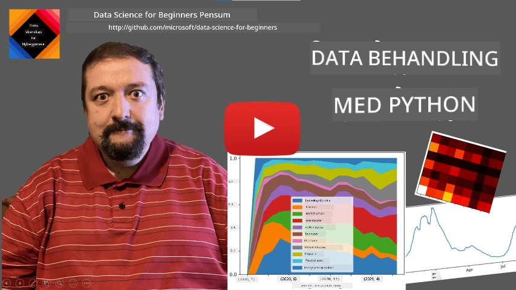
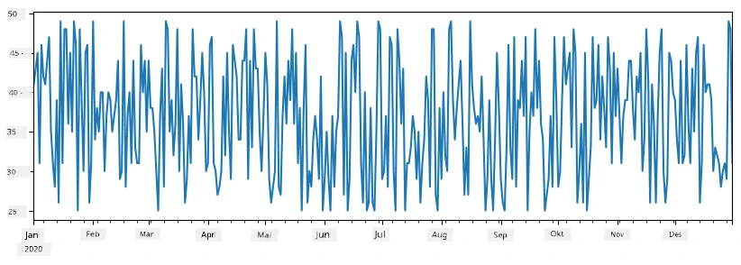
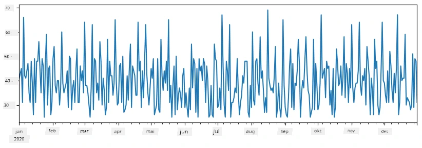
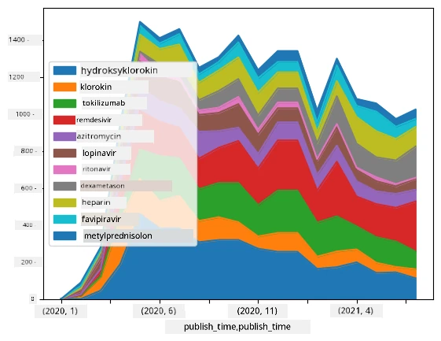

# Arbeide med data: Python og Pandas-biblioteket

|  ](../../sketchnotes/07-WorkWithPython.png) |
| :-------------------------------------------------------------------------------------------------------: |
|              Arbeide med Python - _Sketchnote av [@nitya](https://twitter.com/nitya)_               |

[](https://youtu.be/dZjWOGbsN4Y)

Selv om databaser tilbyr veldig effektive måter å lagre data på og forespørre dem med spørringsspråk, er den mest fleksible måten å behandle data på å skrive ditt eget program for å manipulere dataene. I mange tilfeller ville en databaseforespørsel være en mer effektiv måte. Men i noen tilfeller når mer kompleks databehandling trengs, kan det ikke gjøres enkelt med SQL.
Databehandling kan programmeres i hvilket som helst programmeringsspråk, men det finnes visse språk som er på et høyere nivå med hensyn til arbeid med data. Dataforskere foretrekker vanligvis ett av følgende språk:

* **[Python](https://www.python.org/)**, et generelt programmeringsspråk, som ofte regnes som ett av de beste valgene for nybegynnere på grunn av sin enkelhet. Python har mange tilleggspakker som kan hjelpe deg med å løse mange praktiske problemer, som å hente ut data fra ZIP-arkiv eller konvertere bilder til gråtoner. I tillegg til data science brukes Python også ofte til webutvikling.
* **[R](https://www.r-project.org/)** er en tradisjonell verktøykasse utviklet med statistisk databehandling i tankene. Det inneholder også et stort bibliotek av pakker (CRAN), noe som gjør det til et godt valg for databehandling. R er imidlertid ikke et generelt programmeringsspråk, og brukes sjelden utenfor data science-området.
* **[Julia](https://julialang.org/)** er et annet språk utviklet spesielt for data science. Det er ment å gi bedre ytelse enn Python, noe som gjør det til et flott verktøy for vitenskapelig eksperimentering.

I denne leksjonen vil vi fokusere på å bruke Python til enkel databehandling. Vi forutsetter grunnleggende kjennskap til språket. Hvis du ønsker en dypere introduksjon til Python, kan du se på en av følgende ressurser:

* [Lær Python på en morsom måte med Turtle Graphics og Fraktaler](https://github.com/shwars/pycourse) - GitHub-basert rask innføringskurs i Python-programmering
* [Ta dine første steg med Python](https://docs.microsoft.com/en-us/learn/paths/python-first-steps/?WT.mc_id=academic-77958-bethanycheum) Læringssti på [Microsoft Learn](http://learn.microsoft.com/?WT.mc_id=academic-77958-bethanycheum)

Data kan komme i mange former. I denne leksjonen vil vi se på tre former for data – **tabulære data**, **tekst** og **bilder**.

Vi vil fokusere på noen få eksempler på databehandling, i stedet for å gi en full oversikt over alle relaterte biblioteker. Dette vil la deg få hovedideen om hva som er mulig, og gi deg forståelse for hvor du kan finne løsninger på dine problemer når du trenger dem.

> **Mest nyttige råd**. Når du trenger å utføre en bestemt operasjon på data som du ikke vet hvordan du gjør, prøv å søke etter det på internett. [Stackoverflow](https://stackoverflow.com/) inneholder vanligvis mange nyttige kodeeksempler i Python for mange typiske oppgaver.


## [For-forelesningsquiz](https://ff-quizzes.netlify.app/en/ds/quiz/12)

## Tabulære Data og Dataframes

Du har allerede møtt tabulære data når vi snakket om relasjonsdatabaser. Når du har mye data, og det er inneholdt i mange forskjellige sammenkoblede tabeller, gir det absolutt mening å bruke SQL for å jobbe med det. Men det finnes mange tilfeller hvor vi har en tabell med data, og vi trenger å få en viss **forståelse** eller **innsikt** om disse dataene, som for eksempel fordeling, korrelasjon mellom verdier, osv. I data science finnes det mange tilfeller hvor vi må utføre noen transformasjoner av originaldataene, etterfulgt av visualisering. Begge disse trinnene kan enkelt utføres med Python.

Det finnes to mest brukte biblioteker i Python som kan hjelpe deg med å håndtere tabulære data:
* **[Pandas](https://pandas.pydata.org/)** lar deg manipulere såkalte **Dataframes**, som tilsvarer relasjons-tabeller. Du kan ha navngitte kolonner, og utføre forskjellige operasjoner på rader, kolonner og dataframes generelt.
* **[Numpy](https://numpy.org/)** er et bibliotek for arbeid med **tensorer**, dvs. flerdimensjonale **arrays**. Array har verdier av samme underliggende type, og det er enklere enn dataframe, men tilbyr flere matematiske operasjoner og skaper mindre overhead.

Det finnes også et par andre biblioteker du bør kjenne til:
* **[Matplotlib](https://matplotlib.org/)** er et bibliotek som brukes til datavisualisering og plotting av grafer
* **[SciPy](https://www.scipy.org/)** er et bibliotek med noen ekstra vitenskapelige funksjoner. Vi har allerede støtt på dette biblioteket når vi snakket om sannsynlighet og statistikk

Her er en kodebit som du typisk vil bruke for å importere disse bibliotekene i starten av Python-programmet ditt:
```python
import numpy as np
import pandas as pd
import matplotlib.pyplot as plt
from scipy import ... # du må spesifisere nøyaktige underpakker som du trenger
``` 

Pandas er sentrert rundt noen få grunnleggende konsepter.

### Series 

**Series** er en sekvens av verdier, lik en liste eller numpy-array. Hovedforskjellen er at en series også har en **indeks**, og når vi utfører operasjoner på serier (f.eks. legger dem sammen), tas indeksen med i betraktningen. Indeksen kan være så enkel som heltallsradnummer (det er indeksen som brukes som standard når en series lages fra liste eller array), eller den kan ha en kompleks struktur, som et dato-interval.

> **Merk**: Det finnes noe innledende Pandas-kode i den medfølgende notatboken [`notebook.ipynb`](notebook.ipynb). Vi skisserer bare noen av eksemplene her, og du er absolutt velkommen til å sjekke ut hele notatboken.

Tenk på et eksempel: vi ønsker å analysere salget til iskremstedet vårt. La oss generere en series av salgstall (antall solgte enheter per dag) for en viss tidsperiode:

```python
start_date = "Jan 1, 2020"
end_date = "Mar 31, 2020"
idx = pd.date_range(start_date,end_date)
print(f"Length of index is {len(idx)}")
items_sold = pd.Series(np.random.randint(25,50,size=len(idx)),index=idx)
items_sold.plot()
```


Nå antar vi at vi hver uke arrangerer et vorspiel for venner, og vi tar med ytterligere 10 pakker iskrem til vorspielet. Vi kan lage en annen series, indeksert etter uke, for å demonstrere det:
```python
additional_items = pd.Series(10,index=pd.date_range(start_date,end_date,freq="W"))
```
Når vi legger to serier sammen, får vi totalt antall:
```python
total_items = items_sold.add(additional_items,fill_value=0)
total_items.plot()
```


> **Merk** at vi ikke bruker enkel syntaks `total_items+additional_items`. Hvis vi gjorde det, ville vi fått mange `NaN` (*Not a Number*) verdier i den resulterende serien. Dette er fordi det mangler verdier for noen av indeks-punktene i `additional_items`-serien, og å legge `NaN` til noe som helst resulterer i `NaN`. Derfor må vi spesifisere `fill_value`-parameteren under addisjon.

Med tidsserier kan vi også **resample** serien med forskjellige tidsintervaller. For eksempel, anta at vi ønsker å beregne gjennomsnittlig salgsmengde månedlig. Vi kan bruke følgende kode:
```python
monthly = total_items.resample("1M").mean()
ax = monthly.plot(kind='bar')
```


### DataFrame

En DataFrame er i hovedsak en samling av serier med samme indeks. Vi kan kombinere flere serier sammen til en DataFrame:
```python
a = pd.Series(range(1,10))
b = pd.Series(["I","like","to","play","games","and","will","not","change"],index=range(0,9))
df = pd.DataFrame([a,b])
```
Dette vil lage en horisontal tabell som dette:
|     | 0   | 1    | 2   | 3   | 4      | 5   | 6      | 7    | 8    |
| --- | --- | ---- | --- | --- | ------ | --- | ------ | ---- | ---- |
| 0   | 1   | 2    | 3   | 4   | 5      | 6   | 7      | 8    | 9    |
| 1   | I   | like | to  | use | Python | and | Pandas | very | much |

Vi kan også bruke Series som kolonner, og spesifisere kolonnenavn ved å bruke ordbok:
```python
df = pd.DataFrame({ 'A' : a, 'B' : b })
```
Dette gir oss en tabell som dette:

|     | A   | B      |
| --- | --- | ------ |
| 0   | 1   | I      |
| 1   | 2   | like   |
| 2   | 3   | to     |
| 3   | 4   | use    |
| 4   | 5   | Python |
| 5   | 6   | and    |
| 6   | 7   | Pandas |
| 7   | 8   | very   |
| 8   | 9   | much   |

**Merk** at vi også kan få denne tabelloppsettet ved å transponere den forrige tabellen, for eksempel ved å skrive 
```python
df = pd.DataFrame([a,b]).T.rename(columns={ 0 : 'A', 1 : 'B' })
```
Her betyr `.T` operasjonen med å transponere DataFrame, dvs. bytte om rader og kolonner, og `rename` operasjonen lar oss gi nytt navn til kolonner for å matche forrige eksempel.

Her er noen av de viktigste operasjonene vi kan utføre på DataFrames:

**Kolonneutvalg**. Vi kan velge individuelle kolonner ved å skrive `df['A']` - denne operasjonen returnerer en Series. Vi kan også velge et utvalg av kolonner til en annen DataFrame ved å skrive `df[['B','A']]` - dette returnerer en annen DataFrame.

**Filtrere** bare visse rader etter kriterier. For eksempel, for å beholde kun rader med kolonne `A` større enn 5, kan vi skrive `df[df['A']>5]`.

> **Merk**: Måten filtrering fungerer på er som følger. Uttrykket `df['A']<5` returnerer en boolsk serie, som indikerer om uttrykket er `True` eller `False` for hvert element i den opprinnelige serien `df['A']`. Når en boolsk serie brukes som indeks, returnerer den en delmengde av rader i DataFrame. Derfor er det ikke mulig å bruke vilkårlig Python-boolske uttrykk, for eksempel ville `df[df['A']>5 and df['A']<7]` være feil. I stedet bør du bruke spesialoperasjonen `&` på boolske serier, ved å skrive `df[(df['A']>5) & (df['A']<7)]` (*parentesene er viktige her*).

**Opprette nye beregnede kolonner**. Vi kan enkelt lage nye beregnede kolonner i DataFrame ved å bruke intuitive uttrykk som dette:
```python
df['DivA'] = df['A']-df['A'].mean() 
``` 
Dette eksempelet beregner avviket til A fra gjennomsnittsverdien sin. Det som faktisk skjer her, er at vi beregner en series, og så tildeler denne serien til venstresiden og lager en annen kolonne. Derfor kan vi ikke bruke operasjoner som ikke er kompatible med serier, for eksempel koden nedenfor er feil:
```python
# Feil kode -> df['ADescr'] = "Lav" hvis df['A'] < 5 ellers "Høy"
df['LenB'] = len(df['B']) # <- Feil resultat
``` 
Det siste eksempelet er syntaktisk korrekt, men gir oss feil resultat, fordi det tildeler lengden til serien `B` til alle verdiene i kolonnen, og ikke lengden til individuelle elementer som vi hadde til hensikt.

Hvis vi trenger å beregne komplekse uttrykk som dette, kan vi bruke `apply` funksjonen. Det siste eksempelet kan skrives som følger:
```python
df['LenB'] = df['B'].apply(lambda x : len(x))
# eller
df['LenB'] = df['B'].apply(len)
```

Etter operasjonene over, vil vi ende opp med følgende DataFrame:

|     | A   | B      | DivA | LenB |
| --- | --- | ------ | ---- | ---- |
| 0   | 1   | I      | -4.0 | 1    |
| 1   | 2   | like   | -3.0 | 4    |
| 2   | 3   | to     | -2.0 | 2    |
| 3   | 4   | use    | -1.0 | 3    |
| 4   | 5   | Python | 0.0  | 6    |
| 5   | 6   | and    | 1.0  | 3    |
| 6   | 7   | Pandas | 2.0  | 6    |
| 7   | 8   | very   | 3.0  | 4    |
| 8   | 9   | much   | 4.0  | 4    |

**Velge rader basert på nummer** kan gjøres ved å bruke `iloc`-konstruktet. For eksempel, for å velge de første 5 radene i DataFrame:
```python
df.iloc[:5]
```

**Gruppering** brukes ofte for å få et resultat tilsvarende *pivot-tabeller* i Excel. Anta at vi ønsker å beregne gjennomsnittsverdien av kolonne `A` for hver gitt verdi av `LenB`. Da kan vi gruppere DataFrame på `LenB`, og kalle `mean`:
```python
df.groupby(by='LenB')[['A','DivA']].mean()
```
Hvis vi trenger å beregne både gjennomsnitt og antall elementer i gruppen, kan vi bruke mer kompleks `aggregate`-funksjon:
```python
df.groupby(by='LenB') \
 .aggregate({ 'DivA' : len, 'A' : lambda x: x.mean() }) \
 .rename(columns={ 'DivA' : 'Count', 'A' : 'Mean'})
```
Dette gir oss følgende tabell:

| LenB | Count | Mean     |
| ---- | ----- | -------- |
| 1    | 1     | 1.000000 |
| 2    | 1     | 3.000000 |
| 3    | 2     | 5.000000 |
| 4    | 3     | 6.333333 |
| 6    | 2     | 6.000000 |

### Hente data


Vi har sett hvor lett det er å konstruere Series og DataFrames fra Python-objekter. Data kommer derimot vanligvis i form av en tekstfil eller en Excel-tabell. Heldigvis tilbyr Pandas oss en enkel måte å laste data fra disk på. For eksempel er det å lese en CSV-fil så enkelt som dette:
```python
df = pd.read_csv('file.csv')
```
Vi vil se flere eksempler på datalasting, inkludert henting fra eksterne nettsteder, i "Challenge"-delen


### Utskrift og plotting

En dataforsker må ofte utforske data, derfor er det viktig å kunne visualisere det. Når DataFrame er stor, ønsker man ofte bare å forsikre seg om at alt går riktig for seg ved å skrive ut de første radene. Dette kan gjøres ved å kalle `df.head()`. Hvis du kjører det fra Jupyter Notebook, vil det skrive ut DataFrame på en fin tabellform.

Vi har også sett bruken av `plot`-funksjonen for å visualisere noen kolonner. Mens `plot` er veldig nyttig for mange oppgaver, og støtter mange forskjellige graf-typer via `kind=`-parameteren, kan du alltid bruke rå `matplotlib`-biblioteket for å plotte noe mer komplekst. Vi vil dekke datavisualisering i detalj i egne kursleksjoner.

Denne oversikten dekker de viktigste konseptene i Pandas, men biblioteket er veldig rikt, og det finnes ingen grenser for hva du kan gjøre med det! La oss nå bruke denne kunnskapen til å løse et spesifikt problem.

## 🚀 Challenge 1: Analysering av COVID-spredning

Det første problemet vi skal fokusere på er modellering av epidemisk spredning av COVID-19. For å gjøre det, vil vi bruke data om antall smittede i forskjellige land, levert av [Center for Systems Science and Engineering](https://systems.jhu.edu/) (CSSE) ved [Johns Hopkins University](https://jhu.edu/). Dataset er tilgjengelig i [denne GitHub-repositorien](https://github.com/CSSEGISandData/COVID-19).

Siden vi vil demonstrere hvordan man håndterer data, inviterer vi deg til å åpne [`notebook-covidspread.ipynb`](notebook-covidspread.ipynb) og lese den fra topp til bunn. Du kan også kjøre celler og gjøre noen utfordringer som vi har lagt igjen til deg på slutten.


> Hvis du ikke vet hvordan du kjører kode i Jupyter Notebook, kan du se på [denne artikkelen](https://soshnikov.com/education/how-to-execute-notebooks-from-github/).

## Arbeid med ustrukturert data

Selv om data svært ofte kommer i tabellform, må vi i noen tilfeller håndtere mindre strukturert data, som for eksempel tekst eller bilder. I slike tilfeller, for å kunne bruke databehandlingsteknikker som vi har sett ovenfor, må vi på en eller annen måte **utvinne** strukturert data. Her er noen eksempler:

* Utvinning av nøkkelord fra tekst, og se hvor ofte disse nøkkelordene dukker opp
* Bruk av nevrale nettverk for å hente informasjon om objekter på bilder
* Hente informasjon om følelser til personer på videostrøm

## 🚀 Challenge 2: Analysering av COVID-artikler

I denne utfordringen fortsetter vi med temaet COVID-pandemien, og fokuserer på behandling av vitenskapelige artikler om emnet. Det finnes [CORD-19 Dataset](https://www.kaggle.com/allen-institute-for-ai/CORD-19-research-challenge) med mer enn 7000 (på tidspunktet for skriving) artikler om COVID, tilgjengelig med metadata og sammendrag (og for omtrent halvparten av dem også full tekst).

Et fullstendig eksempel på analyse av dette datasettet ved bruk av [Text Analytics for Health](https://docs.microsoft.com/azure/cognitive-services/text-analytics/how-tos/text-analytics-for-health/?WT.mc_id=academic-77958-bethanycheum) kognitive tjeneste er beskrevet [i dette blogginnlegget](https://soshnikov.com/science/analyzing-medical-papers-with-azure-and-text-analytics-for-health/). Vi vil diskutere en forenklet versjon av denne analysen.

> **MERK**: Vi tilbyr ikke en kopi av datasettet som del av dette repoet. Du må først laste ned [`metadata.csv`](https://www.kaggle.com/allen-institute-for-ai/CORD-19-research-challenge?select=metadata.csv)-filen fra [dette datasettet på Kaggle](https://www.kaggle.com/allen-institute-for-ai/CORD-19-research-challenge). Registrering hos Kaggle kan være nødvendig. Du kan også laste ned datasettet uten registrering [herfra](https://ai2-semanticscholar-cord-19.s3-us-west-2.amazonaws.com/historical_releases.html), men da inkluderes alle fulltekster i tillegg til metadatafilen.

Åpne [`notebook-papers.ipynb`](notebook-papers.ipynb) og les den fra topp til bunn. Du kan også kjøre celler og gjøre noen utfordringer som vi har lagt igjen til deg på slutten.



## Behandling av bildedata

Nylig har det blitt utviklet svært kraftige AI-modeller som lar oss forstå bilder. Det finnes mange oppgaver som kan løses ved bruk av forhåndstrente nevrale nettverk eller skytjenester. Noen eksempler inkluderer:

* **Bildeklassifisering**, som kan hjelpe deg å kategorisere bildet i en av forhåndsdefinerte klasser. Du kan enkelt trene dine egne bildekategorisere ved hjelp av tjenester som [Custom Vision](https://azure.microsoft.com/services/cognitive-services/custom-vision-service/?WT.mc_id=academic-77958-bethanycheum)
* **Objektdeteksjon** for å oppdage forskjellige objekter i bildet. Tjenester som [computer vision](https://azure.microsoft.com/services/cognitive-services/computer-vision/?WT.mc_id=academic-77958-bethanycheum) kan oppdage en rekke vanlige objekter, og du kan trene en [Custom Vision](https://azure.microsoft.com/services/cognitive-services/custom-vision-service/?WT.mc_id=academic-77958-bethanycheum)-modell for å oppdage noen spesifikke objekter av interesse.
* **Ansiktsdeteksjon**, inkludert alder, kjønn og følelsesdeteksjon. Dette kan gjøres via [Face API](https://azure.microsoft.com/services/cognitive-services/face/?WT.mc_id=academic-77958-bethanycheum).

Alle disse skytjenestene kan kalles ved bruk av [Python SDKer](https://docs.microsoft.com/samples/azure-samples/cognitive-services-python-sdk-samples/cognitive-services-python-sdk-samples/?WT.mc_id=academic-77958-bethanycheum), og kan dermed lett inkorporeres i din datautforskningsarbeidsflyt.

Her er noen eksempler på utforsking av data fra bildedata-kilder:
* I blogginnlegget [How to Learn Data Science without Coding](https://soshnikov.com/azure/how-to-learn-data-science-without-coding/) utforsker vi Instagram-bilder, og prøver å forstå hva som gjør at folk gir flere likes til et bilde. Vi henter først ut så mye informasjon som mulig fra bildene ved hjelp av [computer vision](https://azure.microsoft.com/services/cognitive-services/computer-vision/?WT.mc_id=academic-77958-bethanycheum), og bruker deretter [Azure Machine Learning AutoML](https://docs.microsoft.com/azure/machine-learning/concept-automated-ml/?WT.mc_id=academic-77958-bethanycheum) for å bygge en tolkbar modell.
* I [Facial Studies Workshop](https://github.com/CloudAdvocacy/FaceStudies) bruker vi [Face API](https://azure.microsoft.com/services/cognitive-services/face/?WT.mc_id=academic-77958-bethanycheum) for å hente ut følelser blant personer på fotografier fra arrangementer, for å forsøke å forstå hva som gjør folk glade.

## Konklusjon

Enten du allerede har strukturert eller ustrukturert data, kan du med Python utføre alle steg relatert til databehandling og forståelse. Det er sannsynligvis den mest fleksible måten å behandle data på, og det er grunnen til at flertallet av dataforskere bruker Python som sitt primære verktøy. Å lære Python grundig er trolig en god idé hvis du er seriøs i din dataforskning!

## [Quiz etter forelesning](https://ff-quizzes.netlify.app/en/ds/quiz/13)

## Gjennomgang og selvstudie

**Bøker**
* [Wes McKinney. Python for Data Analysis: Data Wrangling with Pandas, NumPy, and IPython](https://www.amazon.com/gp/product/1491957662)

**Nettressurser**
* Offisiell [10 minutes to Pandas](https://pandas.pydata.org/pandas-docs/stable/user_guide/10min.html) tutorial
* [Dokumentasjon om Pandas Visualisering](https://pandas.pydata.org/pandas-docs/stable/user_guide/visualization.html)

**Lære Python**
* [Lær Python på en morsom måte med Turtle Graphics og Fraktaler](https://github.com/shwars/pycourse)
* [Ta dine første skritt med Python](https://docs.microsoft.com/learn/paths/python-first-steps/?WT.mc_id=academic-77958-bethanycheum) læringsvei på [Microsoft Learn](http://learn.microsoft.com/?WT.mc_id=academic-77958-bethanycheum)

## Oppgave

[Utfør en mer detaljert datastudie for utfordringene ovenfor](assignment.md)

## Takk

Denne leksjonen er laget med ♥️ av [Dmitry Soshnikov](http://soshnikov.com)

---

<!-- CO-OP TRANSLATOR DISCLAIMER START -->
**Ansvarsfraskrivelse**:
Dette dokumentet er oversatt ved hjelp av AI-oversettelsestjenesten [Co-op Translator](https://github.com/Azure/co-op-translator). Selv om vi streber etter nøyaktighet, vær oppmerksom på at automatiske oversettelser kan inneholde feil eller unøyaktigheter. Det opprinnelige dokumentet på originalspråket skal betraktes som den autoritative kilden. For kritisk informasjon anbefales profesjonell menneskelig oversettelse. Vi er ikke ansvarlige for eventuelle misforståelser eller feiltolkninger som oppstår ved bruk av denne oversettelsen.
<!-- CO-OP TRANSLATOR DISCLAIMER END -->