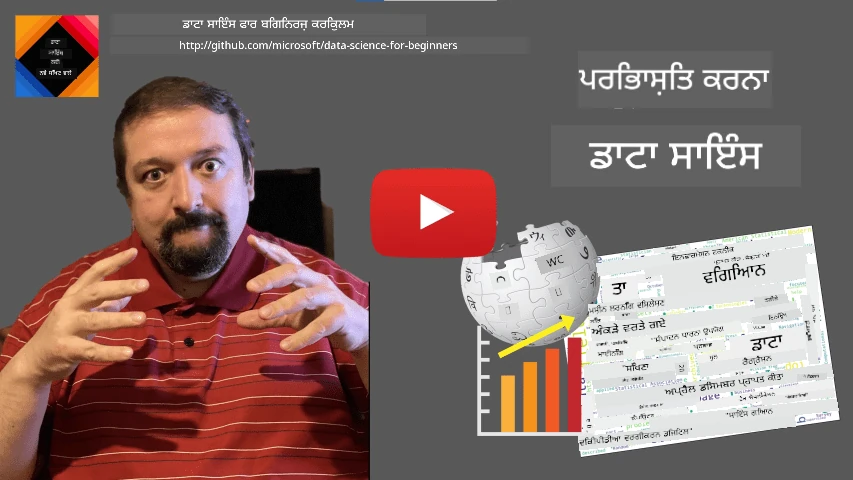
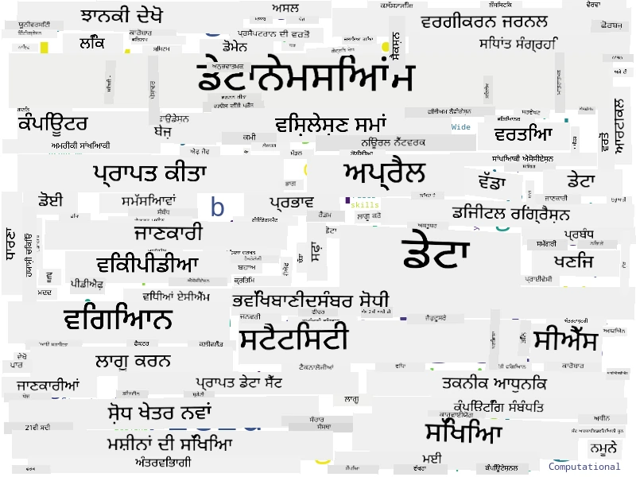

# ਡੇਟਾ ਸਾਇੰਸ ਦੀ ਪਰਿਭਾਸ਼ਾ

|  ](../../sketchnotes/01-Definitions.png) |
| :----------------------------------------------------------------------------------------------------: |
|              ਡੇਟਾ ਸਾਇੰਸ ਦੀ ਪਰਿਭਾਸ਼ਾ - _Sketchnote by [@nitya](https://twitter.com/nitya)_               |

---

## [ਪ੍ਰੀ-ਲੈਕਚਰ ਪ੍ਰਸ਼ਨਾਵਲੀ](https://ff-quizzes.netlify.app/en/ds/quiz/0)

## ਡੇਟਾ ਕੀ ਹੈ?
ਸਾਡੇ ਰੋਜ਼ਾਨਾ ਜੀਵਨ ਵਿੱਚ, ਅਸੀਂ ਲਗਾਤਾਰ ਡੇਟਾ ਨਾਲ ਘਿਰੇ ਹੋਏ ਹਾਂ। ਤੁਸੀਂ ਹੁਣ ਜੋ ਲਿਖ ਰਿਹਾ/ਰਿਹੀ ਹੋ, ਉਹ ਡੇਟਾ ਹੈ। ਤੁਹਾਡੇ ਦੋਸਤਾਂ ਦੇ ਫੋਨ ਨੰਬਰਾਂ ਦੀ ਸੂਚੀ ਤੁਹਾਡੇ ਸਮਾਰਟਫੋਨ ਵਿੱਚ ਡੇਟਾ ਹੈ, ਜਿਵੇਂ ਕਿ ਤੁਹਾਡੇ ਘੜੀ 'ਤੇ ਦਿਖਾਈ ਦੇ ਰਹੀ ਮੌਜੂਦਾ ਵਕਤ ਵੀ। ਮਨੁੱਖਾਂ ਵਜੋਂ, ਅਸੀਂ ਕੁਦਰਤੀ ਤੌਰ 'ਤੇ ਡੇਟਾ ਨਾਲ ਕੰਮ ਕਰਦੇ ਹਾਂ, ਜਿਵੇਂ ਪੈਸਾ ਗਿਣਨਾ ਜਾਂ ਦੋਸਤਾਂ ਨੂੰ ਖਤ ਲਿਖਣਾ।

ਪਰ, ਡੇਟਾ ਕੰਪਿਊਟਰਾਂ ਦੇ ਬਣਨ ਨਾਲ ਬਹੁਤ ਜ਼ਿਆਦਾ ਅਹਿਮ ਹੋ ਗਿਆ। ਕੰਪਿਊਟਰਾਂ ਦਾ ਮੁਖ ਭੂਮਿਕਾ ਗਣਨਾਕਾਰੀ ਕਰਨੀ ਹੁੰਦੀ ਹੈ, ਪਰ ਉਹਨਾਂ ਨੂੰ ਕੰਮ ਕਰਨ ਲਈ ਡੇਟੇ ਦੀ ਲੋੜ ਹੁੰਦੀ ਹੈ। ਇਸ ਲਈ, ਸਾਨੂੰ ਸਮਝਣਾ ਪੈਂਦਾ ਹੈ ਕਿ ਕੰਪਿਊਟਰ ਡੇਟਾ ਨੂੰ ਕਿਵੇਂ ਸਟੋਰ ਅਤੇ ਪ੍ਰੋਸੈੱਸ ਕਰਦੇ ਹਨ।

ਅੰਤਰਜਾਲ ਦੇ ਆਗਮਨ ਨਾਲ, ਕੰਪਿਊਟਰਾਂ ਦਾ ਡੇਟਾ ਸਾਂਭਣ ਵਾਲੇ ਯੰਤਰ ਵਜੋਂ ਭੂਮਿਕਾ ਵਧ ਗਈ। ਜੇ ਤੁਸੀਂ ਸੋਚੋ, ਅਸੀਂ ਹੁਣ ਡੇਟਾ ਪ੍ਰਕਿਰਿਆ ਅਤੇ ਸੰਚਾਰ ਲਈ ਕੰਪਿਊਟਰ ਜ਼ਿਆਦਾ ਵਰਤਦੇ ਹਾਂ, ਗਣਨਾਕਾਰੀ ਦੀ ਤુલਨਾ ਵਿੱਚ ਘੱਟ। ਜਦੋਂ ਅਸੀਂ ਦੋਸਤ ਨੂੰ ਈ-ਮੇਲ ਲਿਖਦੇ ਹਾਂ ਜਾਂ ਇੰਟਰਨੈੱਟ 'ਤੇ ਕੋਈ ਜਾਣਕਾਰੀ ਲੱਭਦੇ ਹਾਂ - ਅਸੀਂ ਮੁਢਲੀ ਤੌਰ 'ਤੇ ਡੇਟਾ ਬਣਾਉਂਦੇ, ਸਟੋਰ ਕਰਦੇ, ਪ੍ਰਸਾਰਿਤ ਕਰਦੇ ਅਤੇ ਸੰਚਾਲਿਤ ਕਰਦੇ ਹਾਂ।
> ਕੀ ਤੁਸੀਂ ਯਾਦ ਕਰ ਸਕਦੇ ਹੋ ਕਿ ਆਖਰੀ ਵਾਰੀ ਤੁਸੀਂ ਕੰਪਿਊਟਰ 'ਤੇ ਕਿਸੇ ਚੀਜ਼ ਦਾ ਗਣਨਾ ਕੀਤੀ ਸੀ?

## ਡੇਟਾ ਸਾਇੰਸ ਕੀ ਹੈ?

[ਵੀਕਿਪੀਡੀਆ](https://en.wikipedia.org/wiki/Data_science) ਅਨੁਸਾਰ, **ਡੇਟਾ ਸਾਇੰਸ** ਨੂੰ ਐਸਾ ਵਿਗਿਆਨਕ ਖੇਤਰ ਵਜੋਂ ਪਰਿਭਾਸ਼ਿਤ ਕੀਤਾ ਗਿਆ ਹੈ ਜੋ ਵਿਗਿਆਨਕ ਤਰੀਕਿਆਂ ਦੀ ਵਰਤੋਂ ਕਰਕੇ ਸੰਰਚਿਤ ਅਤੇ ਅਸੰਰਚਿਤ ਡੇਟਾ ਵਿੱਚੋਂ ਗਿਆਨ ਅਤੇ ਅੰਦਰੂਨੀ ਜਾਣਕਾਰੀਆਂ ਨਿਕਾਲਦਾ ਹੈ ਅਤੇ ਵਿਆਪਕ ਐਪਲੀਕੇਸ਼ਨ ਖੇਤਰਾਂ ਵਿੱਚ ਡੇਟਾ ਤੋਂ ਪ੍ਰਾਪਤ ਗਿਆਨ ਅਤੇ ਪ੍ਰਯੋਗਸ਼ੀਲ ਅੰਦਰੂਨੀਆਂ ਨੂੰ ਲਾਗੂ ਕਰਦਾ ਹੈ।

ਇਸ ਪਰਿਭਾਸ਼ਾ ਵਿੱਚ ਡੇਟਾ ਸਾਇੰਸ ਦੇ ਕਈ ਅਹਿਮ ਪੱਖ ਉਭਰ ਕੇ ਆਉਂਦੇ ਹਨ:

* ਡੇਟਾ ਸਾਇੰਸ ਦਾ ਮੁੱਖ ਮਕਸਦ ਡੇਟਾ ਤੋਂ **ਗਿਆਨ ਪ੍ਰਾਪਤ ਕਰਨਾ** ਹੈ, ਦੂਜੇ ਸ਼ਬਦਾਂ ਵਿੱਚ - ਡੇਟਾ ਨੂੰ ਸਮਝਣਾ, ਕੁਝ ਲੁਕੇ ਹੋਏ ਸੰਬੰਧ ਲੱਭਣਾ ਅਤੇ ਇੱਕ **ਮਾਡਲ** ਬਣਾਉਣਾ।
* ਡੇਟਾ ਸਾਇੰਸ **ਵਿਗਿਆਨਕ ਤਰੀਕੇ** ਵਰਤਦਾ ਹੈ, ਜਿਵੇਂ ਕਿ ਸੰਭਾਵਨਾ ਅਤੇ ਅੰਕੜਿਆਂ ਦਾ ਵਿਗਿਆਨ। ਅਸਲ ਵਿੱਚ, ਜਦੋਂ ਪਹਿਲਾਂ *ਡੇਟਾ ਸਾਇੰਸ* ਸ਼ਬਦ ਆਇਆ ਸੀ, ਕੁਝ ਲੋਕ ਦਲੀਲ ਦਿੱਤੀ ਸੀ ਕਿ ਡੇਟਾ ਸਾਇੰਸ ਸਿਰਫ ਅੰਕੜਿਆਂ ਦੀ ਵਿਗਿਆਨ ਲਈ ਇੱਕ ਨਵਾਂ ਅਰਿਸ਼ਟ ਨਾਮ ਹੈ। ਅੱਜਕਲ ਇਹ ਸਪਸ਼ਟ ਹੈ ਕਿ ਖੇਤਰ ਬਹੁਤ ਵਿਆਪਕ ਹੈ।
* ਪ੍ਰਾਪਤ ਗਿਆਨ ਨੂੰ ਕੁਝ **ਪ੍ਰਯੋਗਸ਼ੀਲ ਅੰਦਰੂਨੀਆਂ** ਉਤਪੰਨ ਕਰਨ ਲਈ ਲਾਗੂ ਕੀਤਾ ਜਾਣਾ ਚਾਹੀਦਾ ਹੈ, ਜਿਹੜੇ ਕਾਰੋਬਾਰੀ ਹਾਲਾਤਾਂ ਵਿੱਚ ਵਰਤੇ ਜਾ ਸਕਣ.
* ਸਾਨੂੰ ਦੋਹਾਂ **ਸੰਰਚਿਤ** ਅਤੇ **ਅਸੰਰਚਿਤ** ਡੇਟਾ ਤੇ ਕੰਮ ਕਰਨ ਦੇ ਯੋਗ ਹੋਣਾ ਚਾਹੀਦਾ ਹੈ। ਅਸੀਂ ਕੋਰਸ ਦੇ ਅੱਗੇ ਕੁਝ ਵੱਖ-ਵੱਖ ਕਿਸਮਾਂ ਦੇ ਡੇਟਾ ਬਾਰੇ ਵਿਆਖਿਆ ਕਰਨਗੇ।
* **ਐਪਲੀਕੇਸ਼ਨ ਖੇਤਰ** ਇੱਕ ਮਹੱਤਵਪੂਰਨ ਧਾਰਨਾ ਹੈ, ਅਤੇ ਡੇਟਾ ਵਿਗਿਆਨੀ ਅਕਸਰ ਮਾਮਲੇ ਦੇ ਖੇਤਰ ਵਿੱਚ ਕੁਝ ਹੱਦ ਤੱਕ ਵਿਸ਼ੇਸ਼ਗਤਾ ਦੇ ਮਾਲਕ ਹੁੰਦੇ ਹਨ, ਜਿਵੇਂ ਕਿ: ਵਿੱਤੀ, ਦਵਾਈ, ਮਾਰਕੀਟਿੰਗ ਆਦਿ।

> ਡੇਟਾ ਸਾਇੰਸ ਦਾ ਇੱਕ ਹੋਰ ਮਹੱਤਵਪੂਰਨ ਪੱਖ ਇਹ ਵੀ ਹੈ ਕਿ ਇਹ ਡੇਟਾ ਨੂੰ ਕਿਵੇਂ ਇਕੱਤਰ ਕੀਤਾ ਜਾ ਸਕਦਾ ਹੈ, ਸਟੋਰ ਕੀਤਾ ਜਾ ਸਕਦਾ ਹੈ ਅਤੇ ਕੰਪਿਊਟਰਾਂ ਦੀ ਵਰਤੋਂ ਨਾਲ ਓਪਰੇਟ ਕੀਤਾ ਜਾ ਸਕਦਾ ਹੈ। ਜਿੱਥੇ ਅੰਕੜੇ ਸਾਡੇ ਲਈ ਗਣਾ-ਤਮਕ ਅਧਾਰ ਦਿੰਦੇ ਹਨ, ਉਥੇ ਡੇਟਾ ਸਾਇੰਸ ਅੰਕੜਿਆਂ ਦੇ ਸਿਧਾਂਤਾਂ ਨੂੰ ਲਾਗੂ ਕਰਕੇ ਡੇਟਾ ਵਿਚੋਂ ਅਸਲ ਅੰਦਰੂਨੀ ਜਾਣਕਾਰੀਆਂ ਨਿਕਾਲਦਾ ਹੈ।

ਡੇਟਾ ਸਾਇੰਸ ਨੂੰ ਦੇਖਣ ਦੇ ਇੱਕ ਤਰੀਕੇ (ਜਿਸਦਾ ਸਿਤਾਰਾ [ਜਿਮ ਗ੍ਰੇ](https://en.wikipedia.org/wiki/Jim_Gray_(computer_scientist)) ਹੈ) ਇਹ ਹੈ ਕਿ ਇਸਨੂੰ ਵਿਗਿਆਨ ਦੇ ਇੱਕ ਵੱਖਰੇ ਪੈਰਾਡਾਇਮ ਵਜੋਂ ਲਿਆ ਜਾਵੇ:
* **ਅਨੁਭਵਕਤਮਕ**, ਜਿਸ ਵਿੱਚ ਅਸੀਂ ਜ਼ਿਆਦਾਤਰ ਨਿરીਖਣਾਂ ਅਤੇ ਪ੍ਰਯੋਗਾਂ ਦੇ ਨਤੀਜਿਆਂ 'ਤੇ ਨਿਰਭਰ ਕਰਦੇ ਹਾਂ
* **ਥਿਊਰੇਟੀਕਲ**, ਜਿੱਥੇ ਨਵੇਂ ਸੰਕਲਪ ਮੌਜੂਦਾ ਵਿਗਿਆਨਕ ਗਿਆਨ ਵਿੱਚੋਂ ਉਭਰਦੇ ਹਨ
* **ਕੰਪਿਊਟੇਸ਼ਨਲ**, ਜਿੱਥੇ ਅਸੀਂ ਕਿਸੇ ਕੰਪਿਊਟੇਸ਼ਨਲ ਪ੍ਰਯੋਗ ਦੇ ਆਧਾਰ ਤੇ ਨਵੇਂ ਸਿਧਾਂਤ ਲੱਭਦੇ ਹਾਂ
* **ਡੇਟਾ-ਚਲਿਤ**, ਜਿਸ ਦਾ ਆਧਾਰ ਡੇਟਾ ਵਿੱਚ ਸੰਬੰਧਾਂ ਅਤੇ ਪੈਟਰਨ ਦੀ ਖੋਜ ਕਰਨਾ ਹੈ

## ਹੋਰ ਸੰਬੰਧਿਤ ਖੇਤਰ

ਜਿਵੇਂ ਕਿ ਡੇਟਾ ਵਿਸ਼ਵ-ਵਿਆਪਕ ਹੈ, ਡੇਟਾ ਸਾਇੰਸ ਵੀ ਇੱਕ ਵਿਆਪਕ ਖੇਤਰ ਹੈ ਜੋ ਕਈ ਹੋਰ ਵਿਭਾਗਾਂ ਨੂੰ ਛੂਹਦਾ ਹੈ।

<dl>
<dt>ਡੇਟਾਬੇਸ</dt>
<dd>
ਇਕ ਅਹਿਮ ਵਿਸ਼ਾ ਇਹ ਹੈ ਕਿ ਡੇਟਾ ਨੂੰ <b>ਕਿਵੇਂ ਸਟੋਰ ਕਰਨਾ ਹੈ</b>, ਮਤਲਬ ਇਸਨੂੰ ਇਸ ਤਰ੍ਹਾਂ ਫਾਰਮੈਟ ਕਰਨਾ ਕਿ ਪ੍ਰੋਸੈਸਿੰਗ ਤੇਜ਼ ਹੋਵੇ। ਵੱਖ-ਵੱਖ ਕਿਸਮ ਦੇ ਡੇਟਾਬੇਸ ਹੁੰਦੇ ਹਨ ਜੋ ਸੰਰਚਿਤ ਅਤੇ ਅਸੰਰਚਿਤ ਡੇਟਾ ਸਟੋਰ ਕਰਦੇ ਹਨ, ਜਿਨ੍ਹਾਂ 'ਤੇ ਅਸੀਂ <a href="../../2-Working-With-Data/README.md">ਆਪਣੇ ਕੋਰਸ ਵਿੱਚ ਵਿਚਾਰ ਕਰਾਂਗੇ</a>।
</dd>
<dt>ਵੱਡਾ ਡੇਟਾ</dt>
<dd>
ਅਕਸਰ ਅਸੀਂ ਬਹੁਤ ਵੱਡੀ ਮਾਤਰਾ ਵਿੱਚ ਡੇਟਾ ਸੰਭਾਲਣਾ ਅਤੇ ਪ੍ਰੋਸੈਸ ਕਰਨਾ ਪੈਂਦਾ ਹੈ ਜਿਸਦੀ ਢਾਂਚਾ ਸਧਾਰਣ ਹੁੰਦੀ ਹੈ। ਡੇਟਾ ਨੂੰ ਵੰਡੇ ਹੋਏ ਕੰਪਿਊਟਰ ਕਲੱਸਟਰ 'ਤੇ ਸਟੋਰ ਅਤੇ ਪ੍ਰਭਾਵਸ਼ਾਲੀ ਤਰੀਕੇ ਨਾਲ ਚਲਾਉਣ ਲਈ ਖਾਸ ਤਕਨੀਕਾਂ ਅਤੇ ਉਪਕਰਣ ਹਨ।
</dd>
<dt>ਮਸ਼ੀਨ ਲਰਨਿੰਗ</dt>
<dd>
ਡੇਟਾ ਨੂੰ ਸਮਝਣ ਦਾ ਇੱਕ ਤਰੀਕਾ ਇਹ ਹੈ ਕਿ ਇੱਕ ਐਸਾ <b>ਮਾਡਲ ਬਣਾਇਆ ਜਾਵੇ</b> ਜੋ ਚਾਹੁਣ ਵਾਲੇ ਨਤੀਜੇ ਦੀ ਭਵਿੱਖਬਾਣੀ ਕਰ ਸਕੇ। ਡੇਟਾ ਤੋਂ ਮਾਡਲ ਵਿਕਸਿਤ ਕਰਨ ਨੂੰ <b>ਮਸ਼ੀਨ ਲਰਨਿੰਗ</b> ਕਿਹਾ ਜਾਂਦਾ ਹੈ। ਤੁਸੀਂ ਇਸ ਬਾਰੇ ਹੋਰ ਜਾਣਕਾਰੀ ਲਈ ਸਾਡੇ <a href="https://aka.ms/ml-beginners">ਮਸ਼ੀਨ ਲਰਨਿੰਗ ਫਾਰ ਬਿਗਿਨਰਜ਼</a> ਕਰਿਕੁਲਮ ਨੂੰ ਵੇਖ ਸਕਦੇ ਹੋ।
</dd>
<dt>ਕ੍ਰਿਤਿਮ ਬੁੱਧੀਮੱਤਾ</dt>
<dd>
ਮਸ਼ੀਨ ਲਰਨਿੰਗ ਦਾ ਇੱਕ ਖੇਤਰ ਕ੍ਰਿਤਿਮ ਬੁੱਧੀਮੱਤਾ (AI) ਵੀ ਡੇਟਾ 'ਤੇ ਨਿਰਭਰ ਹੈ, ਜੋ ਮਨੁੱਖੀ ਸੋਚ ਪ੍ਰਕਿਰਿਆਵਾਂ ਦੀ ਨਕਲ ਕਰਨ ਵਾਲੇ ਬਹੁਤ ਉੱਚ ਪੱਧਰ ਦੇ ਮਾਡਲ ਬਣਾਉਂਦਾ ਹੈ। AI ਤਰੀਕੇ ਅਕਸਰ ਅਸੰਰਚਿਤ ਡੇਟਾ (ਜਿਵੇਂ ਕੁਦਰਤੀ ਭਾਸ਼ਾ) ਨੂੰ ਸੰਰਚਿਤ ਅੰਦਰੂਨੀਆਂ ਵਿੱਚ ਬਦਲਣ ਦੀ ਆਗਿਆ ਦਿੰਦੀਆਂ ਹਨ।
</dd>
<dt>ਦ੍ਰਿਸ਼ਟੀਕਰਨ</dt>
<dd>
ਡੇਟਾ ਦੀ ਮਹਾਨ ਮਾਤਰਾ ਮਨੁੱਖ ਲਈ ਸਮਝਣਾ ਮੁਸ਼ਕਲ ਹੁੰਦਾ ਹੈ, ਪਰ ਜਦੋਂ ਅਸੀਂ ਉਸ ਡੇਟਾ ਨਾਲ ਲਾਭਦਾਇਕ ਵਿਜੁਅਲਾਈਜ਼ੇਸ਼ਨ ਬਣਾਉਂਦੇ ਹਾਂ, ਤਾਂ ਅਸੀਂ ਡੇਟਾ ਦਾ ਬਹੁਤ ਵਧੀਆ ਸਮਝ ਪ੍ਰਾਪਤ ਕਰ ਸਕਦੇ ਹਾਂ ਅਤੇ ਕੁਝ ਨਤੀਜੇ ਖਿੱਚ ਸਕਦੇ ਹਾਂ। ਇਸ ਲਈ ਜਾਣਕਾਰੀ ਵਿਜੁਅਲਾਈਜ਼ ਕਰਨ ਦੇ ਕਈ ਤਰੀਕੇ ਜਾਣਣਾ ਮਹੱਤਵਪੂਰਨ ਹੈ - ਜਿਸਦਾ ਅਸੀਂ <a href="../../3-Data-Visualization/README.md">Section 3</a> ਵਿੱਚ ਜ਼ਿਕਰ ਕਰਾਂਗੇ। ਸਬੰਧਿਤ ਖੇਤਰਾਂ ਵਿੱਚ <b>ਇਨਫੋਗ੍ਰਾਫਿਕਸ</b> ਅਤੇ ਸਧਾਰਨ ਇਹ <b>ਹਿਊਮਨ ਕੰਪਿਊਟਰ ਇੰਟਰਕਸ਼ਨ</b> ਵੀ ਸ਼ਾਮਲ ਹੈ।
</dd>
</dl>

## ਡੇਟਾ ਦੀਆਂ ਕਿਸਮਾਂ

ਜਿਵੇਂ ਅਸੀਂ ਪਹਿਲਾਂ ਹੀ ਦੱਸਿਆ ਹੈ, ਡੇਟਾ ਹਰ ਥਾਂ ਹੈ। ਸਾਨੂੰ ਇਸਨੂੰ ਸਹੀ ਤਰੀਕੇ ਨਾਲ ਪ੍ਰਾਪਤ ਕਰਨ ਦੀ ਲੋੜ ਹੈ! ਇਹ ਲਾਭਦਾਇਕ ਹੈ ਕਿ ਅਸੀਂ **ਸੰਰਚਿਤ** ਅਤੇ **ਅਸੰਰਚਿਤ** ਡੇਟਾ ਵਿੱਚ ਅੰਤਰ ਕਰੀਏ। ਪਹਿਲਾ ਆਮ ਤੌਰ 'ਤੇ ਕੁਝ ਇਸ ਤਰ੍ਹਾਂ ਹੁੰਦਾ ਹੈ ਕਿ ਇਹ ਵਧੀਆ ਢੰਗ ਨਾਲ ਅੰਗ੍ਰਿਥਤ ਹੁੰਦਾ ਹੈ, ਜਿਵੇਂ ਇਕ ਟੇਬਲ ਜਾਂ ਕਈ ਟੇਬਲਾਂ ਵਾਂਗ, ਜਦਕਿ ਦੂਜਾ ਸਿਰਫ ਫਾਇਲਾਂ ਦਾ ਇਕ ਗੱਠ (ਕਲੇਕਸ਼ਨ) ਹੁੰਦਾ ਹੈ। ਕਦੇ-ਕਦੇ ਸਾਡੇ ਕੋਲ **ਅਰੱਧ ਸੰਰਚਿਤ** ਡੇਟਾ ਵੀ ਹੁੰਦਾ ਹੈ ਜਿਸਦਾ ਕੋਈ ਨਾ ਕੋਈ ਢਾਂਚਾ ਹੁੰਦਾ ਹੈ ਪਰ ਜੋ ਕਾਫੀ ਵੱਖ-ਵੱਖ ਹੋ ਸਕਦਾ ਹੈ।

| ਸੰਰਚਿਤ                                                                    | ਅਰੱਧ-ਸੰਰਚਿਤ                                                                                  | ਅਸੰਰਚਿਤ                               |
| ------------------------------------------------------------------------- | --------------------------------------------------------------------------------------------- | ------------------------------------- |
| ਲੋਕਾਂ ਦੀ ਸੂਚੀ ਉਨ੍ਹਾਂ ਦੇ ਫੋਨ ਨੰਬਰਾਂ ਨਾਲ                                   | ਵਿਕੀਪੀਡੀਆ ਦੇ ਪੰਨੇ ਜੋ ਲਿੰਕਾਂ ਨਾਲ ਜੁੜੇ ਹੋਏ ਹਨ                                                 | ਐਨਸਾਈਕਲੋਪੀਡੀਆ ਬ੍ਰਿਟਾਨਿਕਾ ਦਾ ਪਾਠ        |
| ਪਿਛਲੇ 20 ਸਾਲਾਂ ਵਿੱਚ ਹਰ ਮਿੰਟ ਵਿਖੇ ਬਿਲਡਿੰਗ ਦੇ ਹਰ ਕਮਰੇ ਦਾ ਤਾਪਮਾਨ        | ਵਿਗਿਆਨਕ ਕਾਗਜ਼ਾਂ ਦਾ JSON ਫਾਰਮੈਟ ਵਿੱਚ ਕਲੇਕਸ਼ਨ ਜਿਹੜੇ ਲੇਖਕ, ਪ੍ਰਕਾਸ਼ਨ ਦੀ ਤਾਰੀਖ ਅਤੇ ਸੰਖੇਪ ਨਾਲ ਹਨ        | ਕਾਰਪੋਰੇਟ ਦਸਤਾਵੇਜ਼ਾਂ ਨਾਲ ਫਾਇਲ ਸਾਂਝਾ           |
| ਬਿਲਡਿੰਗ ਵਿੱਚ ਦਾਖਲ ਹੋਣ ਵਾਲੇ ਸਾਰੇ ਲੋਕਾਂ ਦੀ ਉਮਰ ਅਤੇ ਲਿੰਗ ਦਾ ਡੇਟਾ           | ਇੰਟਰਨੈੱਟ ਪੰਨੇ                                                                               | ਨਿਗਰਾਨੀ ਕੈਮਰੇ ਤੋਂ ਕੱਚਾ ਵੀਡੀਓ ਫੀਡ         |

## ਡੇਟਾ ਕਿੱਥੋਂ ਲੱਭਣਾ ਹੈ

ਡੇਟਾ ਦੇ ਕਈ ਸੰਭਾਵਤ ਸਰੋਤ ਹਨ, ਅਤੇ ਸਾਰਿਆਂ ਨੂੰ ਸੂਚੀਬੱਧ ਕਰਨਾ ਅਸੰਭਵ ਹੈ! ਪਰ ਆਓ ਕੁਝ ਆਮ ਥਾਵਾਂ ਦਾ ਜ਼ਿਕਰ ਕਰੀਏ ਜਿੱਥੋਂ ਤੁਸੀਂ ਡੇਟਾ ਲੈ ਸਕਦੇ ਹੋ:

* **ਸੰਰਚਿਤ**
  - **ਇੰਟਰਨੈੱਟ ਆਫ ਥਿੰਗਜ਼** (IoT), ਵੱਖ-ਵੱਖ ਸੈਂਸਰਾਂ ਤੋਂ ਡੇਟਾ ਸਮੇਤ, ਜਿਵੇਂ ਤਾਪਮਾਨ ਜਾਂ ਦਬਾਅ ਸੈਂਸਰ, ਬਹੁਤ ਸਾਰਾ ਉਪਯੋਗੀ ਡੇਟਾ ਦਿੰਦਾ ਹੈ। ਉਦਾਹਰਨ ਵਜੋਂ, ਜੇ ਕਿਸੇ ਦਫਤਰ ਦੀ ਇਮਾਰਤ IoT ਸੈਂਸਰਾਂ ਨਾਲ ਸਜੀ ਹੈ, ਤਾਂ ਅਸੀਂ ਖਰਚੇ ਘਟਾਉਣ ਲਈ ਹੀਟਿੰਗ ਅਤੇ ਲਾਈਟਿੰਗ ਨੂੰ ਸਵੈਚਾਲਿਤ ਤਰੀਕੇ ਨਾਲ ਕਾਬੂ ਕਰ ਸਕਦੇ ਹਾਂ।
  - **ਸਰਵੇਖਣ**, ਜੋ ਅਸੀਂ ਯੂਜ਼ਰਜ਼ ਨੂੰ ਖਰੀਦਾਰੀ ਦੇ ਬਾਅਦ ਜਾਂ ਕੋਈ ਵੈੱਬਸਾਈਟ ਵੇਖਣ ਤੋਂ ਬਾਅਦ ਪੂਰੇ ਕਰਨ ਲਈ ਕਹਿੰਦੇ ਹਾਂ।
  - **ਵਤੀਵਰਨ ਦਾ ਵਿਸ਼ਲੇਸ਼ਣ** ਸਾਨੂੰ ਇਹ ਸਮਝਣ ਵਿੱਚ ਮਦਦ ਕਰ ਸਕਦਾ ਹੈ ਕਿ ਯੂਜ਼ਰ ਸਾਈਟ 'ਤੇ ਕਿੰਨੇ ਗਹਿਰਾਈ ਨਾਲ ਜਾਂਦਾ ਹੈ ਅਤੇ ਸਾਈਟ ਛੱਡਣ ਦਾ ਆਮ ਕਾਰਨ ਕੀ ਹੈ।
* **ਅਸੰਰਚਿਤ**
  - **ਪਾਠ** ਅੰਦਰੂਨੀ ਜਾਣਕਾਰੀਆਂ ਦਾ ਧਨ ਰਿਹਾ ਸਕਦਾ ਹੈ, ਜਿਵੇਂ ਕੁੱਲ **ਭਾਵਨਾਤਮਕ ਸਕੋਰ**, ਜਾਂ ਕੁੰਜੀ ਸ਼ਬਦ ਅਤੇ ਸਾਂਝੀ ਅਰਥ ਨਿਕਾਲਣਾ।
  - **ਚਿੱਤਰ** ਜਾਂ **ਵੀਡੀਓ**। ਨਿਗਰਾਨੀ ਕੈਮਰੇ ਤੋਂ ਵੀਡੀਓ ਨੂੰ ਸੜਕ 'ਤੇ ਟ੍ਰੈਫਿਕ ਦਾ ਅੰਦਾਜ਼ਾ ਲਗਾਉਣ ਅਤੇ ਲੋਕਾਂ ਨੂੰ ਸੰਭਾਵਿਤ ਟ੍ਰੈਫਿਕ ਜੈਮਾਂ ਬਾਰੇ ਸੂਚਿਤ ਕਰਨ ਲਈ ਵਰਤਿਆ ਜਾ ਸਕਦਾ ਹੈ।
  - ਵੈੱਬ ਸਰਵਰ **ਲੋਗਸ** ਸਾਨੂੰ ਸਮਝਣ ਵਿੱਚ ਮਦਦ ਕਰਦੇ ਹਨ ਕਿ ਸਾਡੀ ਸਾਈਟ ਦੇ ਕਿਹੜੇ ਪੰਨੇ ਸਭ ਤੋਂ ਬਾਰੇ ਤੇਜ਼ੀ ਨਾਲ ਦੇਖੇ ਜਾਂਦੇ ਹਨ ਅਤੇ ਕਿੰਨਾ ਸਮਾਂ ਲੱਗਦਾ ਹੈ।
* ਅਰੱਧ-ਸੰਰਚਿਤ
  - **ਸੋਸ਼ਲ ਨੈੱਟਵਰਕ** ਗ੍ਰਾਫ ਯੂਜ਼ਰ ਪ੍ਰਸਨੈਲਿਟੀਜ਼ ਅਤੇ ਜਾਣਕਾਰੀ ਫੈਲਾਉਣ ਵਿੱਚ ਸੰਭਾਵਿਤ ਪ੍ਰਭਾਵਸ਼ੀਲਤਾ ਬਾਰੇ ਬਹੁਤ ਵਧੀਆ ਡੇਟਾ ਦੇ ਸਰੋਤ ਹੋ ਸਕਦੇ ਹਨ।
  - ਜਦੋਂ ਸਾਡੇ ਕੋਲ ਕਿਸੇ ਪਾਰਟੀ ਦੀਆਂ ਕਈਆਂ ਫੋਟੋਆਂ ਹੁੰਦੀਆਂ ਹਨ, ਤਾਂ ਅਸੀਂ ਇੱਕ ਗ੍ਰਾਫ ਬਣਾ ਕੇ ਲੋਕਾਂ ਦੀ ਹਟਾਟਲ ਜੁੜਾਈ ਦੁਆਰਾ **ਗਰੁੱਪ ਡਾਇਨਾਮਿਕਸ** ਡੇਟਾ ਕੱਢ ਸਕਦੇ ਹਾਂ।

ਵੱਖ-ਵੱਖ ਸੰਭਾਵਤ ਡੇਟਾ ਸਰੋਤਾਂ ਨੂੰ ਜਾਣ ਕੇ, ਤੁਸੀਂ ਸੋਚ ਸਕਦੇ ਹੋ ਕਿ ਕਿਹੜੇ ਸਥਿਤੀਆਂ ਵਿੱਚ ਡੇਟਾ ਸਾਇੰਸ ਤਕਨੀਕਾਂ ਨੂੰ ਲਾਗੂ ਕਰਕੇ ਮਾਹੌਲ ਨੂੰ ਬਿਹਤਰ ਤਰੀਕੇ ਨਾਲ ਜਾਣਿਆ ਜਾ ਸਕਦਾ ਹੈ ਅਤੇ ਕਾਰੋਬਾਰੀ ਪ੍ਰਕਿਰਿਆਵਾਂ ਵਿੱਚ ਸੁਧਾਰ ਲਿਆਇਆ ਜਾ ਸਕਦਾ ਹੈ।

## ਤੁਸੀਂ ਡੇਟਾ ਨਾਲ ਕੀ ਕਰ ਸਕਦੇ ਹੋ

ਡੇਟਾ ਸਾਇੰਸ ਵਿੱਚ, ਅਸੀਂ ਡੇਟਾ ਯਾਤਰਾ ਦੇ ਹੇਠਾਂ ਦਿੱਤੇ ਕਦਮਾਂ 'ਤੇ ਧਿਆਨ देते ਹਾਂ:

<dl>
<dt>1) ਡੇਟਾ ਪ੍ਰਾਪਤੀ</dt>
<dd>
ਪਹਿਲਾ ਕਦਮ ਡੇਟਾ ਇਕੱਠਾ ਕਰਨਾ ਹੈ। ਕਈ ਵਾਰੀ ਇਹ ਸਿੱਧਾ ਪ੍ਰਕਿਰਿਆ ਹੋ ਸਕਦੀ ਹੈ, ਜਿਵੇਂ ਕਿ ਵੈੱਬ ਐਪਲੀਕੇਸ਼ਨ ਤੋਂ ਡੇਟਾ ਡੇਟਾਬੇਸ ਵਿੱਚ ਆਉਣਾ, ਪਰ ਕਈ ਵਾਰੀ ਸਾਨੂੰ ਖਾਸ ਤਕਨੀਕਾਂ ਦੀ ਲੋੜ ਪੈਂਦੀ ਹੈ। ਉਦਾਹਰਨ ਵਜੋਂ, IoT ਸੈਂਸਰਾਂ ਤੋਂ ਡੇਟਾ ਬਹੁਤ ਵੱਧ ਹੋ ਸਕਦਾ ਹੈ, ਇਸ ਕਰਕੇ ਇੱਕ ਚੰਗੀ ਪ੍ਰਥਾ ਹੈ ਕਿ ਸਾਰਾ ਡੇਟਾ ਇਕੱਠਾ ਕਰਨ ਲਈ IoT ਹੱਬ ਵਰਗੇ ਬਫਰਿੰਗ ਐਂਡਪੌਇੰਟਸ ਦੀ ਵਰਤੋਂ ਕੀਤੀ ਜਾਵੇ ਤਾਂ ਜੋ ਅਗਲੇ ਪ੍ਰਕਿਰਿਆ ਲਈ ਤਿਆਰ ਰਹੇ।
</dd>
<dt>2) ਡੇਟਾ ਸਟੋਰੇਜ</dt>
<dd>
ਡੇਟਾ ਸਟੋਰ ਕਰਨਾ ਮੁਸ਼ਕਲ ਹੋ ਸਕਦਾ ਹੈ, ਖ਼ਾਸਕਰ ਜਦੋਂ ਗੱਲ ਵੱਡੇ ਡੇਟਾ ਦੀ ਹੋਵੇ। ਡੇਟਾ ਸਟੋਰ ਕਰਨ ਦਾ ਫੈਸਲਾ ਕਰਦਿਆਂ, ਅਗਲੇ ਵੇਲੇ ਤੁਸੀਂ ਕਿਵੇਂ ਡੇਟਾ ਨੂੰ ਕਵੇਰੀ ਕਰਨਾ ਚਾਹੁੰਦੈ ਹੋ, ਇਸ ਦਾ ਅੰਦਾਜ਼ਾ ਲਗਾਉਣਾ ਅਹਿਮ ਹੈ। ਡੇਟਾ ਸਟੋਰ ਕਰਨ ਦੇ ਕਈ ਤਰੀਕੇ ਹਨ:
<ul>
<li>ਇੱਕ ਰਿਲੇਸ਼ਨਲ ਡੇਟਾਬੇਸ ਟੇਬਲਾਂ ਦਾ ਇਕੱਤਰ ਸਟੋਰ ਕਰਦਾ ਹੈ ਅਤੇ ਉਨ੍ਹਾਂ ਨੂੰ ਕਵੈਰੀ ਕਰਨ ਲਈ SQL ਨਾਮ ਦੀ ਖਾਸ ਭਾਸ਼ਾ ਵਰਤਦਾ ਹੈ। ਆਮ ਤੌਰ 'ਤੇ ਟੇਬਲਾਂ ਨੂੰ ਵੱਖ-ਵੱਖ ਸਮੂਹਾਂ ਵਿੱਚ ਵਿਭਾਜਿਤ ਕੀਤਾ ਜਾਂਦਾ ਹੈ ਜਿਨ੍ਹਾਂ ਨੂੰ ਸੈਕੇਮਾਂ ਕਿਹਾ ਜਾਂਦਾ ਹੈ। ਕਈ ਵਾਰੀ ਹਾਲਤ ਹੈ ਕਿ ਮੂਲ ਡੇਟਾ ਨੂੰ ਇਸ ਤਰ੍ਹਾਂ ਬਦਲਣਾ ਪੈਂਦਾ ਹੈ ਕਿ ਇਹ ਸੈਕੇਮਾ ਦੇ ਅਨੁਕੂਲ ਹੋ ਜਾਵੇ।</li>
<li><a href="https://en.wikipedia.org/wiki/NoSQL">NoSQL</a> ਡੇਟਾਬੇਸ, ਜਿਵੇਂ ਕਿ <a href="https://azure.microsoft.com/services/cosmos-db/?WT.mc_id=academic-77958-bethanycheum">CosmosDB</a>, ਡੇਟਾ 'ਤੇ ਸੈਕੇਮਾ ਲਾਗੂ ਨਹੀਂ ਕਰਦੇ ਅਤੇ ਵਧੇਰੇ ਜਟਿਲ ਡੇਟਾ ਨੂੰ ਸਟੋਰ ਕਰਨ ਦੀ ਆਗਿਆ ਦਿੰਦੇ ਹਨ, ਉਦਾਹਰਨ ਵਜੋਂ, ਹੈਰਾਰਕੀ JSON ਦਸਤਾਵੇਜ਼ ਜਾਂ ਗ੍ਰਾਫ। ਪਰ NoSQL ਡੇਟਾਬੇਸ ਦੀ SQL ਜਿਹੀ ਵਿਸ਼ਾਲ ਕਵੇਰੀ ਕਰਨ ਦੀ ਸਮਰੱਥਾ ਨਹੀਂ ਹੁੰਦੀ, ਅਤੇ ਇਹ ਰੈਫਰੈਂਸ਼ੀਅਲ ਇੰਟੈਗ੍ਰਿਟੀ ਲਾਗੂ ਨਹੀਂ ਕਰ ਸਕਦੇ, ਜਿਸਦਾ ਅਰਥ ਹੈ ਕਿ ਟੇਬਲਾਂ ਵਿੱਚ ਡੇਟਾ ਕਿਵੇਂ ਸਟ੍ਰਕਚਰ ਕੀਤਾ ਗਿਆ ਹੈ ਅਤੇ ਟੇਬਲਾਂ ਦਰਮਿਆਨ ਸੰਬੰਧਾਂ ਨੂੰ ਕਿਵੇਂ ਸੰਭਾਲਿਆ ਜਾਂਦਾ ਹੈ, ਇਸ ਲਈ ਕਾਇਦੇ ਨਹੀਂ ਬਣਾ ਸਕਦੇ।</li>
<li><a href="https://en.wikipedia.org/wiki/Data_lake">ਡੇਟਾ ਲੇਕ</a> ਸਟੋਰੇਜ ਵੱਡੇ ਡੇਟਾ ਦਾ ਅਡੰਬਰ ਰੂਪ ਵਿੱਚ ਬਹੁਤ ਵੱਡਾ ਸੰਗ੍ਰਹਿ ਕਰਨ ਲਈ ਵਰਤਿਆ ਜਾਂਦਾ ਹੈ। ਡੇਟਾ ਲੇਕ ਆਮ ਤੌਰ 'ਤੇ ਵੱਡੇ ਡੇਟਾ ਨਾਲ ਵਰਤੇ ਜਾਂਦੇ ਹਨ, ਜਿੱਥੇ ਸਾਰਾ ਡੇਟਾ ਇੱਕ ਮਸ਼ੀਨ 'ਤੇ ਨਹੀਂ ਫਟਦਾ ਅਤੇ ਕਲੱਸਟਰ ਦੇ ਸਰਵਰਾਂ ਦੁਆਰਾ ਸਟੋਰ ਅਤੇ ਪ੍ਰੋਸੈੱਸ ਕੀਤਾ ਜਾਂਦਾ ਹੈ। <a href="https://en.wikipedia.org/wiki/Apache_Parquet">Parquet</a> ਉਹ ਡੇਟਾ ਫਾਰਮੈਟ ਹੈ ਜੋ ਅਕਸਰ ਵੱਡੇ ਡੇਟਾ ਨਾਲ ਮਿਲ ਕੇ ਵਰਤਿਆ ਜਾਂਦਾ ਹੈ।</li> 
</ul>
</dd>
<dt>3) ਡੇਟਾ ਪ੍ਰਕਿਰਿਆ</dt>
<dd>
ਇਹ ਡੇਟਾ ਯਾਤਰਾ ਦਾ ਸਭ ਤੋਂ ਦਿਲਚਸਪ ਹਿੱਸਾ ਹੈ, ਜਿਸ ਵਿੱਚ ਮੂਲ ਡੇਟਾ ਨੂੰ ਉਸ ਰੂਪ ਵਿੱਚ ਬਦਲਿਆ ਜਾਂਦਾ ਹੈ ਜੋ ਦੇਖਾਵਟ ਜਾਂ ਮਾਡਲ ਟ੍ਰੇਨਿੰਗ ਲਈ ਵਰਤਿਆ ਜਾ ਸਕੇ। ਅਸੰਰਚਿਤ ਡੇਟਾ ਜਿਵੇਂ ਕਿ ਪਾਠ ਜਾਂ ਚਿੱਤਰਾਂ ਨਾਲ ਕੰਮ ਕਰਦਿਆਂ, ਸਾਨੂੰ ਕੁਝ AI ਤਰੀਕਿਆਂ ਦੀ ਲੋੜ ਹੋ ਸਕਦੀ ਹੈ ਤਾਂ ਜੋ ਡੇਟਾ ਵਿੱਚੋਂ <b>ਖੂਬੀਆਂ</b> ਨਿਕਾਲ ਕੇ ਇਸਨੂੰ ਸੰਰਚਿਤ ਰੂਪ ਵਿੱਚ ਬਦਲਿਆ ਜਾਵੇ।
</dd>
<dt>4) ਵਿਜੁਅਲਾਈਜ਼ੇਸ਼ਨ / ਮਨੁੱਖੀ ਅੰਦਰੂਨੀਆਂ</dt>
<dd>
ਅਕਸਰ, ਡੇਟਾ ਸਮਝਣ ਲਈ ਅਸੀਂ ਇਸਨੂੰ ਵਿਜੁਅਲਾਈਜ਼ ਕਰਦੇ ਹਾਂ। ਸਾਡੇ ਕੋਲ ਕਈ ਵੱਖ-ਵੱਖ ਵਿਜੁਅਲਾਈਜ਼ੇਸ਼ਨ ਤਕਨੀਕਾਂ ਹਨ, ਜੋ ਸਹੀ ਦ੍ਰਿਸ਼ਟੀ ਨੂੰ ਖੋਜ ਕੇ ਅੰਦਰੂਨੀ ਜਾਣਕਾਰੀ ਪ੍ਰਦਾਨ ਕਰਦੀਆਂ ਹਨ। ਡੇਟਾ ਵਿਗਿਆਨੀ ਨੂੰ ਕਈ ਵਾਰੀ "ਡੇਟਾ ਨਾਲ ਖੇਡਣਾ" ਪੈਂਦਾ ਹੈ, ਇਸਨੂੰ ਕਈ ਵਾਰੀ ਵਿਜੁਅਲਾਈਜ਼ ਕਰਨਾ ਅਤੇ ਕੁਝ ਸੰਬੰਧ ਲੱਭਣੇ ਹੁੰਦੇ ਹਨ। ਅਸੀਂ ਅੰਕੜੇ ਜਾਣਚ ਤਕਨੀਕਾਂ ਨਾਲ ਸਿਧਾਂਤ ਜਾਂ ਡਾਟਾ ਦੇ ਵੱਖਰੇ ਟੁਕੜਿਆਂ ਵਿਚਕਾਰ ਦੇ ਸੰਬੰਧ ਦੀ ਪੁਸ਼ਟੀ ਵੀ ਕਰ ਸਕਦੇ ਹਾਂ।   
</dd>
<dt>5) ਭਵਿੱਖਬਾਣੀ ਵਾਲਾ ਮਾਡਲ ਸਿਖਲਾਈ</dt>
<dd>
ਕਿਉਂਕਿ ਡੇਟਾ ਸਾਇੰਸ ਦਾ ਆਖਰੀ ਮਕਸਦ ਫੈਸਲੇ ਕਰਨ ਦੇ ਯੋਗ ਬਣਨਾ ਹੈ, ਅਸੀਂ <a href="http://github.com/microsoft/ml-for-beginners">ਮਸ਼ੀਨ ਲਰਨਿੰਗ</a> ਦੀਆਂ ਤਕਨੀਕਾਂ ਦੀ ਵਰਤੋਂ ਕਰਕੇ ਭਵਿੱਖਬਾਣੀ ਵਾਲਾ ਮਾਡਲ ਬਣਾ ਸਕਦੇ ਹਾਂ। ਫਿਰ ਅਸੀਂ ਨਵੇਂ ਅਤੇ ਸਮਾਨ ਢਾਂਚੇ ਵਾਲੇ ਡੇਟਾ ਸੈੱਟਾਂ ਦੀ ਵਰਤੋਂ ਕਰਕੇ ਭਵਿੱਖਬਾਣੀਆਂ ਕਰ ਸਕਦੇ ਹਾਂ।
</dd>
</dl>

ਜ਼ਾਹਰ ਹੈ, ਕੁਝ ਹਾਲਤਾਂ ਵਿੱਚ ਕੁਝ ਕਦਮ ਗੁੰਮ ਹੋ ਸਕਦੇ ਹਨ (ਜਿਵੇਂ ਕਿ ਜੇ ਅਸੀਂ ਪਹਿਲਾਂ ਹੀ ਡੇਟਾ ਡੇਟਾਬੇਸ ਵਿੱਚ ਰੱਖ ਚੁੱਕੇ ਹਾਂ, ਜਾਂ ਮਾਡਲ ਟ੍ਰੇਨਿੰਗ ਦੀ ਲੋੜ ਨਹੀਂ ਹੈ), ਜਾਂ ਕੁਝ ਕਦਮ ਕਈ ਵਾਰੀ ਦੁਹਰਾਏ ਜਾਂਦੇ ਹਨ (ਜਿਵੇਂ ਡੇਟਾ ਪ੍ਰਕਿਰਿਆ)।

## ਡਿਜੀਟਲਾਈਜ਼ੇਸ਼ਨ ਅਤੇ ਡਿਜੀਟਲ ਤਬਦੀਲੀ

ਪਿਛਲੇ ਦਹਾਕੇ ਵਿੱਚ, ਕਈ ਕਾਰੋਬਾਰ ਨੇ ਕਾਰੋਬਾਰੀ ਫੈਸਲੇ ਕਰਨ ਵੇਲੇ ਡੇਟਾ ਦੇ ਮਹੱਤਵ ਨੂੰ ਸਮਝਣਾ ਸ਼ੁਰੂ ਕਰ ਦਿੱਤਾ। ਕਾਰੋਬਾਰ ਚਲਾਉਣ ਲਈ ਡੇਟਾ ਸਾਇੰਸ ਦੇ ਸਿਧਾਂਤ ਲਾਗੂ ਕਰਨ ਲਈ, ਪਹਿਲਾਂ ਡੇਟਾ ਇਕੱਠਾ ਕਰਨਾ ਜਰੂਰੀ ਹੈ, ਜਿਸਦਾ ਮਤਲਬ ਹੈ ਕਾਰੋਬਾਰੀ ਪ੍ਰਕਿਰਿਆਵਾਂ ਨੂੰ ਡਿਜିਟਲ ਰੂਪ ਵਿੱਚ ਬਦਲਣਾ। ਇਸਨੂੰ **ਡਿਜੀਟਲਾਈਜ਼ੇਸ਼ਨ** ਕਿਹਾ ਜਾਂਦਾ ਹੈ। ਇਸ ਡੇਟਾ 'ਤੇ ਡੇਟਾ ਸਾਇੰਸ ਤਕਨੀਕਾਂ ਲਾਗੂ ਕਰਕੇ ਫੈਸਲੇ ਲੈਣਾ **ਡਿਜੀਟਲ ਤਬਦੀਲੀ** ਕਹਾਉਂਦਾ ਹੈ, ਜੋ ਉਤਪਾਦਕਤਾ ਵਿੱਚ ਨਜ਼ਰਣੀ ਕਮੀ ਜਾਂ ਕਾਰੋਬਾਰ ਵਿੱਚ ਬਦਲਾਅ ਲਿਆ ਸਕਦਾ ਹੈ।

ਚਲੋ ਇੱਕ ਉਦਾਹਰਨ ਲੱਭੀਏ। ਮੰਨੋ ਸਾਡੇ ਕੋਲ ਡੇਟਾ ਸਾਇੰਸ ਕੋਰਸ (ਜਿਵੇਂ ਇਹ) ਹੈ ਜੋ ਅਸੀਂ ਔਨਲਾਈਨ ਵਿਦਿਆਰਥੀਆਂ ਨੂੰ ਦਿੰਦੇ ਹਾਂ, ਅਤੇ ਅਸੀਂ ਇਸਨੂੰ ਸੁਧਾਰਨਾ ਚਾਹੁੰਦੇ ਹਾਂ। ਅਸੀਂ ਇਹ ਕਿਵੇਂ ਕਰ ਸਕਦੇ ਹਾਂ?

ਅਸੀਂ ਇਹਨਾਂ ਪ્ਰਸ਼ਨਾਂ ਤੋਂ ਸ਼ੁਰੂ ਕਰ ਸਕਦੇ ਹਾਂ: "ਕੀ ਚੀਜ਼ ਡਿਜੀਟਲ ਕੀਤੀ ਜਾ ਸਕਦੀ ਹੈ?" ਸਭ ਤੋਂ ਸਧਾਰਣ ਤਰੀਕਾ ਇਹ ਹੋਵੇਗਾ ਕਿ ਹਰ ਵਿਦਿਆਰਥੀ ਨੂੰ ਹਰ ਮੋਡੀਊਲ ਨੂੰ ਪੂਰਾ ਕਰਨ ਵਿੱਚ ਲੱਗੇ ਸਮੇਂ ਨੂੰ ਮਾਪਾ ਜਾਵੇ ਅਤੇ ਹਰ ਮੋਡੀਊਲ ਦੇ ਅਖੀਰ ਵਿੱਚ ਪ੍ਰਾਪਤ ਗਿਆਨ ਨੂੰ ਬਹੁ-ਚੋਣ ਦਾ ਟੈਸਟ ਦੇ ਕੇ ਅੰਕਿਤ ਕੀਤਾ ਜਾਵੇ। ਸਾਰੇ ਵਿਦਿਆਰਥੀਆਂ ਲਈ ਸਮਾਂ-ਮਿਆਦ ਦਾ ਔਸਤ ਕੱਢ ਕੇ, ਅਸੀਂ ਜਾਣ ਸਕਦੇ ਹਾਂ ਕਿ ਕਿਹੜੇ ਮੋਡੀਊਲ ਵਿਦਿਆਰਥੀਆਂ ਲਈ ਸਭ ਤੋਂ ਮੁਸ਼ਕਲ ਹਨ ਅਤੇ ਉਨ੍ਹਾਂ ਨੂੰ ਸੌਖਾ ਬਣਾਉਣ ਉੱਤੇ ਕੰਮ ਕਰ ਸਕਦੇ ਹਾਂ।
> ਤੁਸੀਂ ਦਲੀਲ ਦੇ ਸਕਦੇ ਹੋ ਕਿ ਇਹ ਤਰੀਕਾ ਆਦਰਸ਼ ਨਹੀਂ ਹੈ, ਕਿਉਂਕਿ ਮੌਡੀਊਲ ਵੱਖ-ਵੱਖ ਲੰਬਾਈਆਂ ਦੇ ਹੋ ਸਕਦੇ ਹਨ।  ਇਹ ਸੰਭਵਤ: ਵਧੇਰੇ ਨਿਆਂਸੰਗਤ ਹੈ ਕਿ ਸਮਾਂ ਮੌਡੀਊਲ ਦੀ ਲੰਬਾਈ (ਅੱਖਰਾਂ ਦੀ ਗਿਣਤੀ ਵਿੱਚ) ਦੇ ਨਾਲ ਵੰਡਿਆ ਜਾਵੇ, ਅਤੇ ਫਿਰ ਉਹਨਾਂ ਮੁੱਲਾਂ ਦੀ ਤੁਲਨਾ ਕੀਤੀ ਜਾਵੇ।

ਜਦੋਂ ਅਸੀਂ ਬਹੁ-ਚੋਣ ਵਾਲੇ ਟੈਸਟਾਂ ਦੇ ਨਤੀਜਿਆਂ ਦਾ ਵਿਸ਼ਲੇਸ਼ਣ ਕਰਨਾ ਸ਼ੁਰੂ ਕਰਦੇ ਹਾਂ, ਤਾਂ ਅਸੀਂ ਇਹ ਜਾਣਨ ਦੀ ਕੋਸ਼ਿਸ਼ ਕਰ ਸਕਦੇ ਹਾਂ ਕਿ ਵਿਦਿਆਰਥੀਆਂ ਨੂੰ ਕਿਹੜੇ ਸੰਕਲਪ ਸਮਝਣ ਵਿੱਚ ਮুশਕਿਲ ਆ ਰਹੀ ਹੈ, ਅਤੇ ਇਸ ਜਾਣਕਾਰੀ ਨੂੰ ਸਮੱਗਰੀ ਵਿੱਚ ਸੁਧਾਰ ਕਰਨ ਲਈ ਵਰਤ ਸਕਦੇ ਹਾਂ।  ਇਸ ਲਈ ਸਾਨੂੰ ਟੈਸਟ ਇਸ ਤਰੀਕੇ ਨਾਲ ਡਿਜ਼ਾਈਨ ਕਰਨੇ ਪੈਣਗੇ ਕਿ ਹਰ ਪ੍ਰਸ਼ਨ ਕਿਸੇ ਵੱਖਰੇ ਸੰਕਲਪ ਜਾਂ ਗਿਆਨ ਦੇ ਹਿੱਸੇ ਨਾਲ ਜੁੜਿਆ ਹੋਵੇ।

ਜੇ ਅਸੀਂ ਹੋਰ ਵੀ ਜਟਿਲਤਾ ਲਿਆਉਣੀ ਚਾਹੁੰਦੇ ਹਾਂ, ਤਾਂ ਅਸੀਂ ਹਰ ਮੌਡੀਊਲ ਲਈ ਲੱਗੇ ਸਮੇਂ ਨੂੰ ਵਿਦਿਆਰਥੀਆਂ ਦੀ ਉਮਰ ਵੱਗਰੇਟਰੀ ਦੇ ਨਾਲ ਪਲਾਟ ਕਰ ਸਕਦੇ ਹਾਂ।  ਸਾਨੂੰ ਪਤਾ ਲੱਗ ਸਕਦਾ ਹੈ ਕਿ ਕੁਝ ਉਮਰ ਵੱਗਰੇਟਰੀਆਂ ਲਈ ਮੌਡੀਊਲ ਮੁਕੰਮਲ ਕਰਨ ਵਿੱਚ ਬੇਹੱਦ ਜ਼ਿਆਦਾ ਸਮਾਂ ਲੱਗਦਾ ਹੈ, ਜਾਂ ਵਿਦਿਆਰਥੀ ਇਸਨੂੰ ਪੂਰਾ ਕਰਨ ਤੋਂ ਪਹਿਲਾਂ ਛੱਡ ਦਿੰਦੇ ਹਨ।  ਇਹ ਸਾਡੇ ਲਈ ਮੌਡੀਊਲ ਲਈ ਉਮਰ ਦੀਆਂ ਸਿਫਾਰਸ਼ਾਂ ਪ੍ਰਦਾਨ ਕਰਨ ਵਿੱਚ ਮਦਦਗਾਰ ਹੋ ਸਕਦਾ ਹੈ, ਅਤੇ ਗਲਤ ਉਮੀਦਾਂ ਕਾਰਨ ਲੋਕਾਂ ਦੀ ਅਸੰਤੋਸ਼ ਨੂੰ ਘਟਾ ਸਕਦਾ ਹੈ।

## 🚀 ਚੁਣੌਤੀ

ਇਸ ਚੁਣੌਤੀ ਵਿੱਚ, ਅਸੀਂ Data Science ਦੇ ਖੇਤਰ ਨਾਲ ਜੁੜੇ ਸੰਕਲਪ ਲੱਭਣ ਦੀ ਕੋਸ਼ਿਸ਼ ਕਰਾਂਗੇ ਟੈਕਸਟਾਂ ਨੂੰ ਵੇਖ ਕੇ।  ਅਸੀਂ Data Science ਬਾਰੇ ਇੱਕ ਵਿਕੀਪੀਡਿਆ ਲਿਖਤ ਲਵਾਂਗੇ, ਟੈਕਸਟ ਨੂੰ ਡਾਊਨਲੋਡ ਅਤੇ ਪ੍ਰੋਸੈਸ ਕਰਾਂਗੇ, ਅਤੇ ਫਿਰ ਇੱਕ ਸ਼ਬਦ ਬੱਦੱਲ (word cloud) ਬਣਾਵਾਂਗੇ ਜਿਵੇਂ ਕਿ ਇਹ ਹੈ:

ਕੋਡ ਨੂੰ ਪੜ੍ਹਨ ਲਈ [`notebook.ipynb`](../../../../1-Introduction/01-defining-data-science/notebook.ipynb ':ignore') ਤੇ ਜਾਓ।  ਤੁਸੀਂ ਕੋਡ ਨੂੰ ਚਲਾ ਸਕਦੇ ਹੋ, ਅਤੇ ਦੇਖ ਸਕਦੇ ਹੋ ਕਿ ਇਹ ਸਾਰੇ ਡਾਟਾ ਪਰਿਵਰਤਨ ਕਿਵੇਂ ਵਿਅਕਤੀਗਤ ਸਮੇਂ 'ਚ ਕਰਦਾ ਹੈ।

> ਜੇ ਤੁਹਾਨੂੰ Jupyter Notebook ਵਿੱਚ ਕੋਡ ਚਲਾਉਣਾ ਨਹੀਂ ਆਉਂਦਾ, ਤਾਂ [ਇਸ ਲੇਖ](https://soshnikov.com/education/how-to-execute-notebooks-from-github/) ਨੂੰ ਦੇਖੋ।

## [ਪੋਸਟ-ਲੇਕਚਰ ਕਵੀਜ਼](https://ff-quizzes.netlify.app/en/ds/quiz/1)

## ਅਸਾਈਨਮੈਂਟਸ

* **ਟਾਸਕ 1**: ਉਪਰ ਦਿੱਤੇ ਕੋਡ ਨੂੰ ਸੰਸ਼ੋਧਿਤ ਕਰੋ ਤਾਂ ਕਿ **Big Data** ਅਤੇ **Machine Learning** ਖੇਤਰਾਂ ਲਈ ਸੰਬੰਧਿਤ ਸੰਕਲਪ ਲੱਭ ਸਕੀਏ
* **ਟਾਸਕ 2**: [Data Science ਸਿਨਾਰੀਓਜ਼ ਬਾਰੇ ਸੋਚੋ](assignment.md)

## ਸ਼੍ਰੇਯਸ

ਇਹ ਪਾਠ [Dmitry Soshnikov](http://soshnikov.com) ਵੱਲੋਂ ♥️ ਨਾਲ ਲਿਖਿਆ ਗਿਆ ਹੈ।

---

<!-- CO-OP TRANSLATOR DISCLAIMER START -->
**ਅਸਵੀਕਾਰੋਪਣ**:
ਇਸ ਦਸਤਾਵੇਜ਼ ਦਾ ਅਨੁਵਾਦ ਏਆਈ ਅਨੁਵਾਦ ਸੇਵਾ [Co-op Translator](https://github.com/Azure/co-op-translator) ਦੀ ਵਰਤੋਂ ਕਰਕੇ ਕੀਤਾ ਗਿਆ ਹੈ। ਜਦੋਂ ਕਿ ਅਸੀਂ ਸਹੀਤਾਵਾਂ ਲਈ ਯਤਨਸ਼ੀਲ ਹਾਂ, ਕਿਰਪਾ ਕਰਕੇ ਧਿਆਨ ਰੱਖੋ ਕਿ ਸਵੈਚਾਲਿਤ ਅਨੁਵਾਦਾਂ ਵਿੱਚ ਗਲਤੀਆਂ ਜਾਂ ਅਸਮੱਤਿਆਵਾਂ ਹੋ ਸਕਦੀਆਂ ਹਨ। ਮੂਲ ਦਸਤਾਵੇਜ਼ ਆਪਣੀ ਮੂਲ ਭਾਸ਼ਾ ਵਿੱਚ ਅਧਿਕਾਰਕ ਸਰੋਤ ਮੰਨਿਆ ਜਾਣਾ ਚਾਹੀਦਾ ਹੈ। ਜਰੂਰੀ ਜਾਣਕਾਰੀ ਲਈ, ਪੇਸ਼ੇਵਰ ਮਨੁੱਖੀ ਅਨੁਵਾਦ ਦੀ ਸਿਫ਼ਾਰਸ਼ ਕੀਤੀ ਜਾਂਦੀ ਹੈ। ਅਸੀਂ ਇਸ ਅਨੁਵਾਦ ਦੇ ਉਪਯੋਗ ਤੋਂ ਪੈਦਾ ਹੋਣ ਵਾਲੀਆਂ ਕਿਸੇ ਵੀ ਗਲਤਫਹਿਮੀਆਂ ਜਾਂ ਗਲਤ ਵਿਆਖਿਆਵਾਂ ਲਈ ਜਵਾਬਦੇਹ ਨਹੀਂ ਹਾਂ।
<!-- CO-OP TRANSLATOR DISCLAIMER END -->