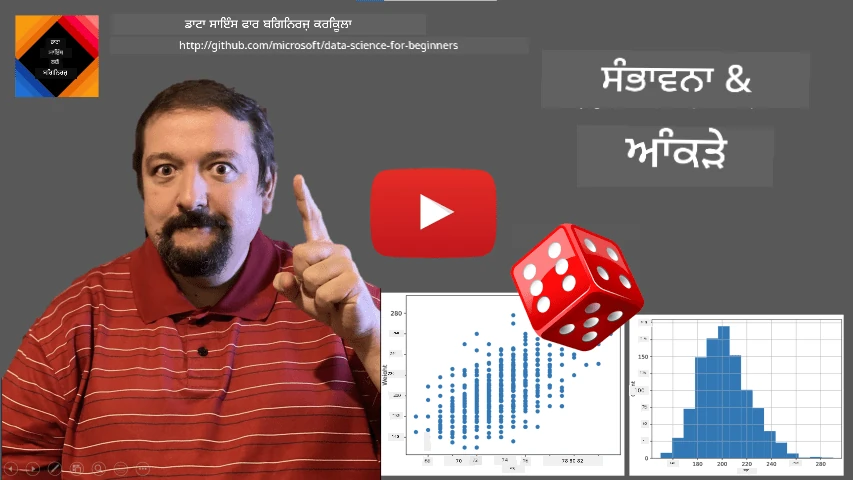
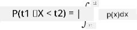
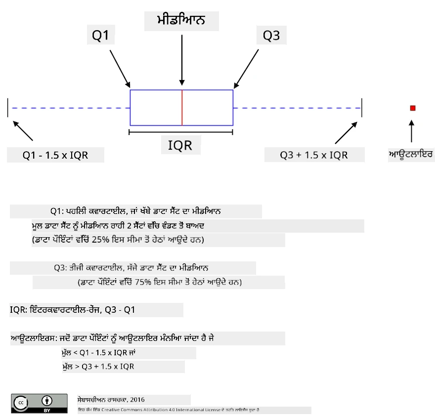
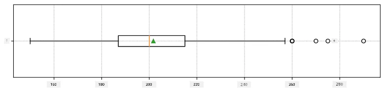
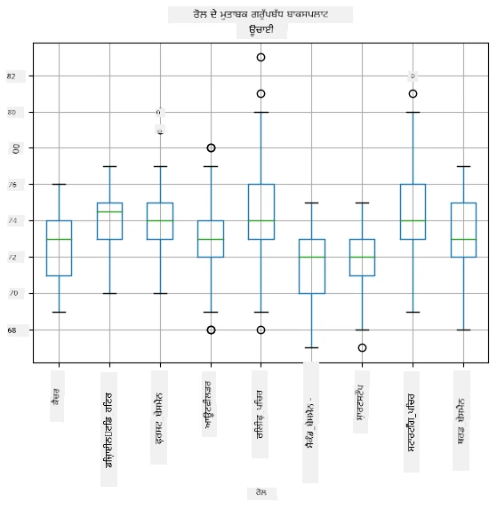
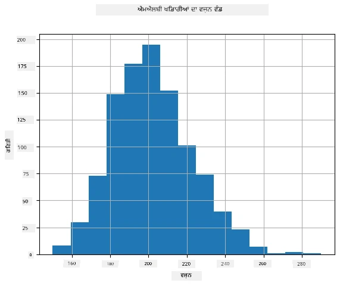
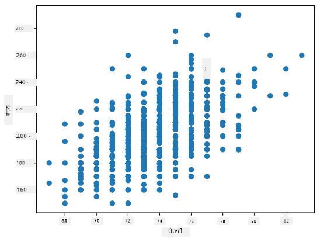

# ਅੰਕੜੇ ਅਤੇ ਸੰਭਾਵਨਾ ਦਾ ਇੱਕ ਸੰਖੇਪ ਪਰਚਿਆ

| ਵੱਲੋਂ ਸਕੇਚਨੋਟ ](../../sketchnotes/04-Statistics-Probability.png)|
|:---:|
| ਅੰਕੜੇ ਅਤੇ ਸੰਭਾਵਨਾ - _[@nitya](https://twitter.com/nitya) ਵੱਲੋਂ ਸਕੇਚਨੋਟ_ |

ਅੰਕੜੇ ਅਤੇ ਸੰਭਾਵਨਾ ਸਿਧਾਂਤ ਗਣਿਤ ਦੇ ਦੋ ਬਹੁਤ ਹੀ ਸਬੰਧਤ ਖੇਤਰ ਹਨ ਜੋ ਡਾਟਾ ਸਾਇੰਸ ਨਾਲ ਬਹੁਤ ਮਾਇਆ ਰੱਖਦੇ ਹਨ। ਗਣਿਤ ਦੀ ਡੂੰਘੀ ਜਾਣਕਾਰੀ ਬਿਨਾਂ ਵੀ ਡਾਟਾ ਨਾਲ ਕੰਮ ਕਰਨਾ ਸੰਭਵ ਹੈ, ਪਰ ਫਿਰ ਵੀ ਘੱਟੋ-ਘੱਟ ਕੁਝ ਬੁਨਿਆਦੀ ਧਾਰਨਾਵਾਂ ਜਾਣਨਾ ਵਧੀਆ ਹੈ। ਇੱਥੇ ਅਸੀਂ ਇੱਕ ਛੋਟਾ ਪਰਚਿਆ ਦਿੰਦੇ ਹਾਂ ਜੋ ਤੁਹਾਨੂੰ ਸ਼ੁਰੂਆਤ ਕਰਨ ਵਿੱਚ ਮਦਦ ਕਰੇਗਾ।

[](https://youtu.be/Z5Zy85g4Yjw)


## [ਪੁਰਵ-ਲੈਕਚਰ ਕੂਇਜ਼](https://ff-quizzes.netlify.app/en/ds/quiz/6)

## ਸੰਭਾਵਨਾ ਅਤੇ ਬੇਤਕਦੀਰ ਚੀਜ਼ਾਂ

**ਸੰਭਾਵਨਾ** 0 ਅਤੇ 1 ਦੇ ਦਰਮਿਆਨ ਇੱਕ ਅੰਕ ਹੈ ਜੋ ਇਹ ਦਰਸਾਉਂਦਾ ਹੈ ਕਿ ਕੋਈ **ਘਟਨਾ** ਕਿੰਨੀ ਸੰਭਾਵਤ ਹੈ। ਇਹ ਇਕ ਪੋਜਟਿਵ ਨਤੀਜਿਆਂ ਦੀ ਗਿਣਤੀ ਦੇ ਤੌਰ ਤੇ ਪਰਿਭਾਸ਼ਿਤ ਹੈ (ਜੋ ਘਟਨਾ ਵੱਲ ਲੈ ਜਾਂਦੇ ਹਨ), ਜੋ ਕੁੱਲ ਨਤੀਜਿਆਂ ਨਾਲ ਭਾਗ ਕੀਤੀ ਜਾਂਦੀ ਹੈ, ਜੇ ਸਭ ਨਤੀਜੇ ਬਰਾਬਰ ਸੰਭਾਵਤ ਹੋਣ। ਉਦਾਹਰਨ ਵਜੋਂ, ਜਦੋਂ ਅਸੀਂ ਇੱਕ ਗੋਲੀ ਫੈਂਕਦੇ ਹਾਂ, ਤਦ ਸੰਭਾਵਨਾ ਕਿ ਸਾਨੂੰ ਇੱਕ ਸਮ ਸੰਖਿਆ ਮਿਲੇਗੀ, 3/6 = 0.5 ਹੈ।

ਜਦੋਂ ਅਸੀਂ ਘਟਨਾਵਾਂ ਦੀ ਗੱਲ ਕਰਦੇ ਹਾਂ, ਅਸੀਂ **ਬੇਤਕਦੀਰ ਚੀਜ਼ਾਂ** ਦੀ ਵਰਤੋਂ ਕਰਦੇ ਹਾਂ। ਉਦਾਹਰਨ ਵਜੋਂ, ਬੇਤਕਦੀਰ ਚੀਜ਼ ਜੋ ਗੋਲੀ ਫੈਂਕਣ 'ਤੇ ਪ੍ਰਾਪਤ ਕੀਤੀ ਗਈ ਸੰਖਿਆ ਪ੍ਰਤੀਨਿਧਿਤ ਕਰਦੀ ਹੈ, ਉਹ 1 ਤੋਂ 6 ਤੱਕ ਕੀਮਤਾਂ ਲਵੇਗੀ। 1 ਤੋਂ 6 ਤੱਕ ਦੀ ਸੰਖਿਆਵਾਂ ਦਾ ਜਥਾ **ਨਮੂਨਾ ਸਪੇਸ** ਕਹਿੰਦੇ ਹਨ। ਅਸੀਂ ਕਿਸੇ ਬੇਤਕਦੀਰ ਚੀਜ਼ ਦੀ ਕਿਸੇ ਵਿਸ਼ੇਸ਼ ਕੀਮਤ ਲੈਣ ਦੀ ਸੰਭਾਵਨਾ ਬਾਰੇ ਗੱਲ ਕਰ ਸਕਦੇ ਹਾਂ, ਉਦਾਹਰਨ ਵਜੋਂ P(X=3)=1/6।

ਪਿਛਲੇ ਉਦਾਹਰਨ ਵਿੱਚ ਬੇਤਕਦੀਰ ਚੀਜ਼ ਨੂੰ **ਵਿੱਛੇੜਾ** ਕਿਹਾ ਜਾਂਦਾ ਹੈ ਕਿਉਂਕਿ ਇਸ ਦਾ ਨਮੂਨਾ ਸਪੇਸ ਗਿਣਤੀਯੋਗ ਹੁੰਦਾ ਹੈ, ਜਿਸਦਾ ਮਤਲਬ ਹੈ ਕਿ ਇਸ ਵਿੱਚ ਅਲੱਗ-ਅਲੱਗ ਕੀਮਤਾਂ ਹੁੰਦੀਆਂ ਹਨ ਜਿਨ੍ਹਾਂ ਨੂੰ ਗਿਣਤੀ ਕੀਤਾ ਜਾ ਸਕਦਾ ਹੈ। ਕੁਝ ਮਾਮਲੇ ਹਨ ਜਿਥੇ ਨਮੂਨਾ ਸਪੇਸ ਅਸਲ ਸੰਖਿਆਵਾਂ ਦੀ ਇੱਕ ਲੜੀ ਹੋ ਜਾਂਦਾ ਹੈ, ਜਾਂ ਸਾਰੇ ਅਸਲ ਸੰਖਿਆਵਾਂ ਦਾ ਜਥਾ। ਅਜਿਹੀਆਂ ਚੀਜ਼ਾਂ ਨੂੰ **ਲਗਾਤਾਰ** ਕਿਹਾ ਜਾਂਦਾ ਹੈ। ਇੱਕ ਚੰਗਾ ਉਦਾਹਰਨ ਬੱਸ ਦੇ ਆਉਣ ਦਾ ਸਮਾਂ ਹੈ।

## ਸੰਭਾਵਨਾ ਦਾ ਵੰਡ

ਵਿੱਛੇੜੇ ਬੇਤਕਦੀਰ ਚੀਜ਼ਾਂ ਦੀ ਹਾਲਤ ਵਿੱਚ, ਹਰ ਘਟਨਾ ਦੀ ਸੰਭਾਵਨਾ ਨੂੰ ਇੱਕ ਫੰਕਸ਼ਨ P(X) ਨਾਲ ਵਰਨਿਤ ਕਰਨਾ ਆਸਾਨ ਹੁੰਦਾ ਹੈ। ਨਮੂਨਾ ਸਪੇਸ *S* ਵਿੱਚੋਂ ਹਰ ਕੀਮਤ *s* ਲਈ ਇਹ 0 ਤੋਂ 1 ਦਾ ਅੰਕ ਦੇਵੇਗਾ, ਐਸਾ ਕਿ ਸਾਰੇ ਘਟਨਾਵਾਂ ਲਈ P(X=s) ਦੇ ਮੁੱਲਾਂ ਦਾ ਜੋੜ 1 ਹੋਵੇ।

ਸਭ ਤੋਂ ਪ੍ਰਸਿੱਧ ਵਿੱਛੇੜਾ ਵੰਡ **ਇਕਸਾਰ ਵੰਡ** ਹੈ, ਜਿਸ ਵਿੱਚ N ਤੱਤਾਂ ਦਾ ਨਮੂਨਾ ਸਪੇਸ ਹੁੰਦਾ ਹੈ, ਅਤੇ ਹਰ ਇੱਕ ਦਾਅਵੇ ਦੀ ਸੰਭਾਵਨਾ 1/N ਹੁੰਦੀ ਹੈ।

ਲਗਾਤਾਰ ਬੇਤਕਦੀਰ ਚੀਜ਼ਾਂ ਲਈ, ਜਿਨ੍ਹਾਂ ਦਾ ਕੀਮਤਾਂ ਕੁਝ ਖਾਸ ਮੁਕਾਬਲੇ [a,b] ਜਾਂ ਸਾਰੇ ਅਸਲ ਸੰਖਿਆਵਾਂ &Ropf; ਵਿੱਚੋਂ ਹੁੰਦੀਆਂ ਹਨ, ਸੰਭਾਵਨਾ ਵੰਡ ਨੂੰ ਵਰਨਿਤ ਕਰਨਾ ਥੋੜ੍ਹਾ ਮੁਸ਼ਕਲ ਹੁੰਦਾ ਹੈ। ਬੱਸ ਦੇ ਆਉਣ ਦੇ ਸਮੇਂ ਦੀ ਮਿਸਾਲ ਲਓ। ਵਾਸਤਵ ਵਿੱਚ, ਹਰ ਸਹੀ ਆਉਣ ਵਾਲੇ ਸਮੇਂ *t* ਲਈ ਬੱਸ ਦੇ ਉਸ ਸਮੇਂ ਆਉਣ ਦੀ ਸੰਭਾਵਨਾ 0 ਹੈ!

> ਹੁਣ ਤੁਹਾਨੂੰ ਪਤਾ ਲੱਗ ਗਿਆ ਹੈ ਕਿ ਸੰਭਾਵਨਾ 0 ਵਾਲੀਆਂ ਘਟਨਾਵਾਂ ਵੀ ਹੁੰਦੀਆਂ ਹਨ, ਅਤੇ ਬਹੁਤ ਵਾਰ! ਘੱਟੋ-ਘੱਟ ਹਰ ਵਾਰੀ ਜਦੋਂ ਬੱਸ ਆਉਂਦੀ ਹੈ!

ਅਸੀਂ ਸਿਰਫ ਕਿਸੇ ਮੁਕਾਬਲੇ ਵਿੱਚ ਕੀਮਤ ਦੇ ਆਉਣ ਬਾਰੇ ਗੱਲ ਕਰ ਸਕਦੇ ਹਾਂ, ਜਿਵੇਂ ਕਿ P(t<sub>1</sub>&le;X&lt;t<sub>2</sub>)। ਇਸ ਹਾਲਤ ਵਿੱਚ, ਸੰਭਾਵਨਾ ਵੰਡ ਨੂੰ ਇੱਕ **ਸੰਭਾਵਨਾ ਘਣਤਾ ਫੰਕਸ਼ਨ** p(x) ਨਾਲ ਵਰਨਿਤ ਕੀਤਾ ਜਾਂਦਾ ਹੈ, ਜੋ


  
ਇਕ ਲਗਾਤਾਰ ਵਰਜਨ ਜੋ ਇਸਾਰ ਵਰਡ ਵਰਗੀ ਹੁੰਦੀ ਹੈ, ਉਸਨੂੰ **ਲਗਾਤਾਰ ਇੱਕਸਾਰ** ਕਹਿੰਦੇ ਹਨ, ਜੋ ਇੱਕ ਸੀਮਿਤ ਅੰਤਰਾਲ 'ਤੇ ਪਰਿਭਾਸ਼ਿਤ ਹੁੰਦੀ ਹੈ। X ਦੀ ਕੀਮਤ ਕਿਸੇ l ਦੀ ਲੰਬਾਈ ਵਾਲੇ ਅੰਤਰਾਲ ਵਿੱਚ ਆਉਣ ਦੀ ਸੰਭਾਵਨਾ l ਦੇ ਅਨੁਪਾਤੀ ਹੋਂਦੀ ਹੈ, ਅਤੇ ਇਹ 1 ਤੱਕ ਵੱਧਦੀ ਹੈ।

ਕਿਸੇ ਹੋਰ ਮਹੱਤਵਪੂਰਨ ਵੰਡ ਨੂੰ **ਸਧਾਰਣ ਵੰਡ** ਕਿਹਾ ਜਾਂਦਾ ਹੈ, ਜਿਸ ਬਾਰੇ ਅਸੀਂ ਹੇਠਾਂ ਵਧੀਕ ਵੇਰਵਾ ਦਿਉਂਗੇ।

## ਔਸਤ, ਵਾਰੀਅੰਸ ਅਤੇ ਮਿਆਰੀ ਵਿਭਿੰਨਤਾ

ਮੰਨ ਲਵੋ ਅਸੀਂ ਕਿਸੇ ਬੇਤਕਦੀਰ ਚੀਜ਼ X ਦੇ n ਨਮੂਨੇ ਖਿੱਚਦੇ ਹਾਂ: x<sub>1</sub>, x<sub>2</sub>, ..., x<sub>n</sub>। ਅਸੀਂ ਸਧਾਰਨ ਤਰੀਕੇ ਨਾਲ ਲੜੀ ਦਾ **ਔਸਤ** (ਜਾਂ **ਗਣਿਤੀ ਔਸਤ**) ਪਰਿਭਾਸ਼ਿਤ ਕਰ ਸਕਦੇ ਹਾਂ, (x<sub>1</sub>+x<sub>2</sub>+...+x<sub>n</sub>)/n ਵੱਜੋਂ। ਜਿਵੇਂ ਜਿਵੇਂ ਸੈਂਪਲ ਦਾ ਆਕਾਰ ਵੱਧਦਾ ਹੈ (ਅਰਥਾਤ n&rarr;&infin;), ਅਸੀਂ ਵੰਡ ਦਾ ਔਸਤ ਪ੍ਰਾਪਤ ਕਰਾਂਗੇ (ਜਿਸਨੂੰ **ਉਮੀਦ** ਵੀ ਕਹਿੰਦੇ ਹਨ)। ਅਸੀਂ ਉਮੀਦ ਨੂੰ **E**(x) ਨਾਲ ਦਰਸਾਵਾਂਗੇ।

> ਇਹ ਦਿਖਾਇਆ ਜਾ ਸਕਦਾ ਹੈ ਕਿ ਕਿਸੇ ਵੀ ਵਿੱਛੇੜੀ ਵੰਡ ਲਈ ਜਿਸ ਦੀਆਂ ਕੀਮਤਾਂ {x<sub>1</sub>, x<sub>2</sub>, ..., x<sub>N</sub>} ਹਨ ਅਤੇ ਉਨ੍ਹਾਂ ਦੀਆਂ ਸੰਭਾਵਨਾਵਾਂ p<sub>1</sub>, p<sub>2</sub>, ..., p<sub>N</sub>, ਊਮੀਦ ਸਮਾਨ ਹੋਵੇਗੀ E(X)=x<sub>1</sub>p<sub>1</sub>+x<sub>2</sub>p<sub>2</sub>+...+x<sub>N</sub>p<sub>N</sub>।

ਮੁੱਲਾਂ ਦੇ ਫੈਲਾਅ ਦਾ ਪਤਾ ਲੱਗਾਉਣ ਲਈ ਅਸੀਂ ਵਾਰੀਅੰਸ &sigma;<sup>2</sup> = &sum;(x<sub>i</sub> - &mu;)<sup>2</sup>/n ਗਣਨਾ ਕਰਦੇ ਹਾਂ, ਜਿੱਥੇ &mu; ਲੜੀ ਦਾ ਔਸਤ ਹੈ। ਮੁੱਲ &sigma; ਨੂੰ **ਮਿਆਰੀ ਵਿਭਿੰਨਤਾ** ਕਿਹਾ ਜਾਂਦਾ ਹੈ, ਅਤੇ &sigma;<sup>2</sup> ਨੂੰ **ਵਾਰੀਅੰਸ** ਕਹਿੰਦੇ ਹਨ।

## ਮੋਡ, ਮੀਡਿਅਨ ਅਤੇ ਕ੍ਵਾਰਟਾਈਲ

ਕਈ ਵਾਰੀ ਔਸਤ ਡਾਟਾ ਲਈ "ਆਮ" ਮੁੱਲ ਨੂੰ ਠੀਕ ਤਰ੍ਹਾਂ ਵਿਆਖਿਆ ਨਹੀਂ ਕਰਦਾ। ਉਦਾਹਰਨ ਵਜੋਂ, ਜਦ ਅਜਿਹੀਆਂ ਵੈਲਯੂਆਂ ਹੁੰਦੀਆਂ ਹਨ ਜੋ ਬਹੁਤ ਜ਼ਿਆਦਾ ਸਥਿਤੀ ਤੋਂ ਬਾਹਰ ਹੁੰਦੀਆਂ ਹਨ, ਇਹ ਔਸਤ ਨੂੰ ਪ੍ਰਭਾਵਿਤ ਕਰ ਸਕਦੀਆਂ ਹਨ। ਇੱਕ ਚੰਗਾ ਰੂਪ **ਮੀਡਿਅਨ** ਹੈ, ਇੱਕ ਮੁੱਲ ਜਿੱਥੇ ਅੱਧੀ ਡਾਟਾ ਇਨ੍ਹਾਂ ਤੋਂ ਘੱਟ ਹੁੰਦੀ ਹੈ ਅਤੇ ਅੱਧੀ ਵੱਧ।

ਡਾਟਾ ਦੇ ਵੰਡ ਨੂੰ ਸਮਝਣ ਲਈ, **ਕ੍ਵਾਰਟਾਈਲ** ਬਾਰੇ ਗੱਲ ਕਰਨਾ ਮਦਦਗਾਰ ਹੁੰਦਾ ਹੈ:

* ਪਹਿਲਾ ਕ੍ਵਾਰਟਾਈਲ ਜਾਂ Q1, ਇੱਕ ਮੁੱਲ ਹੈ ਜਿੱਥੇ 25% ਡਾਟਾ ਇਸ ਤੋਂ ਘੱਟ ਹੁੰਦੀ ਹੈ
* ਤੀਜਾ ਕ੍ਵਾਰਟਾਈਲ ਜਾਂ Q3, ਇੱਕ ਮੂਲ ਹੈ ਜਿੱਥੇ 75% ਡਾਟਾ ਇਸ ਤੋਂ ਘੱਟ ਹੁੰਦੀ ਹੈ

ਗ੍ਰਾਫੀਕ ਰੂਪ ਵਿੱਚ ਅਸੀਂ ਮੀਡਿਅਨ ਅਤੇ ਕ੍ਵਾਰਟਾਈਲਾਂ ਦੇ ਸਬੰਧ ਨੂੰ ਇੱਕ ਚਿੱਤਰ ਵਿੱਚ ਦਰਸਾ ਸਕਦੇ ਹਾਂ, ਜਿਸਨੂੰ **ਬਾਕਸ ਪਲਾਟ** ਕਹਿੰਦੇ ਹਨ:



ਇੱਥੇ ਅਸੀਂ **ਇੰਟਰ-ਕ੍ਵਾਰਟਾਈਲ ਰੇਂਜ** IQR=Q3-Q1 ਅਤੇ ਤਦਕਾਲੀ ਮੁੱਲਾਂ - ਉਹ ਮੁੱਲ ਜੋ ਸਮੂਹ ਤੋਂ ਬਾਹਰ ਪੈਂਦੇ ਹਨ [Q1-1.5*IQR,Q3+1.5*IQR] ਦੀ ਵੀ ਗਣਨਾ ਕਰਦੇ ਹਾਂ।

ਸਮਭਵ ਮੁੱਲਾਂ ਦੀ ਗਿਣਤੀ ਹੋਣ ਵਾਲੀ ਹਾਲਤ ਜਿੱਥੇ ਸੰਭਾਵਿਤ ਮੁੱਲਾਂ ਦੀ ਗਿਣਤੀ ਘੱਟ ਹੋਵੇ, ਇੱਕ ਚੰਗਾ "ਆਮ" ਮੁੱਲ ਉਹ ਹੁੰਦਾ ਹੈ ਜੋ ਸਭ ਤੋਂ ਵੱਧ ਵਾਰ ਦਿੱਖਾਈ ਦੇ, ਜਿਸਨੂੰ **ਮੋਡ** ਕਹਿੰਦੇ ਹਨ। ਇਹੰ ਆਮ ਤੌਰ 'ਤੇ ਵਰਗੀਕਰਣ ਵਾਲੇ ਡਾਟਾ ਵਿੱਚ ਵਰਤਿਆ ਜਾਂਦਾ ਹੈ, ਜਿਵੇਂ ਕਿ ਰੰਗ। ਸੋਚੋ ਸਾਨੂੰ ਦੋ ਗਰੁੱਪ ਹਨ - ਕੁਝ ਜੋ ਲਾਲ ਨੂੰ ਪਸੰਦ ਕਰਦੇ ਹਨ ਅਤੇ ਕੁਝ ਜੋ ਨੀਲਾ ਪਸੰਦ ਕਰਦੇ ਹਨ। ਜੇ ਅਸੀਂ ਰੰਗਾਂ ਨੂੰ ਨੰਬਰਾਂ ਨਾਲ ਦਰਸਾਈਏ, ਤਾਂ ਪਸੰਦੀਦਾ ਰੰਗ ਦਾ ਔਸਤ ਕਿਤੇ ਸੰਤਰੀ-ਹਰਾ ਵਿਚਕਾਰ ਆਵੇਗਾ ਜੋ ਕਿਸੇ ਵੀ ਗਰੁੱਪ ਦੀ ਅਸਲੀ ਪਸੰਦ ਨਹੀਂ ਦਰਸਾਂਦਾ। ਪਰ ਮੋਡ ਇੱਕ ਜਾਂ ਦੋਹਾਂ ਰੰਗਾਂ ਵਿੱਚੋਂ ਇੱਕ ਹੋਵੇਗਾ, ਜੇ ਦੋਵੇਂ ਲਈ ਵੋਟਰ ਦੀ ਗਿਣਤੀ ਬਰਾਬਰ ਹੋਵੇ (ਇਸ ਹਾਲਤ ਨੂੰ ਅਸੀਂ **ਮਲਟੀਮੋਡਲ** ਕਹਿੰਦੇ ਹਾਂ)।

## ਅਸਲ ਦੁਨੀਆ ਦਾ ਡਾਟਾ

ਜਦੋਂ ਅਸੀਂ ਅਸਲ ਦੁਨੀਆ ਤੋਂ ਡਾਟਾ ਦਾ ਵਿਸ਼ਲੇਸ਼ਣ ਕਰਦੇ ਹਾਂ, ਉਹ ਅਕਸਰ ਬੇਤਕਦੀਰ ਚੀਜ਼ਾਂ ਨਹੀਂ ਹੁੰਦੀਆਂ, ਇਸ ਮਤਲਬ ਵਿੱਚ ਕਿ ਅਸੀਂ ਅਣਜਾਣ ਨਤੀਜੇ ਵਾਲੇ ਪ੍ਰਯੋਗ ਨਹੀਂ ਕਰ ਰਹੇ। ਉਦਾਹਰਨ ਵਜੋਂ, ਇੱਕ ਬੇਸਬਾਲ ਟੀਮ ਦੇ ਬਾੜੀ ਦੇ ਡਾਟਾ ਨੂੰ ਲਓ, ਜਿਵੇਂ ਉਚਾਈ, ਵਜ਼ਨ ਅਤੇ ਉਮਰ। ਇਹ ਸੰਖਿਆਵਾਂ ਠੀਕ-ਠੀਕ ਬੇਤਕਦੀਰ ਨਹੀਂ ਹਨ, ਪਰ ਅਸੀਂ ਫਿਰ ਵੀ ਉਹੀ ਗਣਿਤੀ ਧਾਰਨਾਵਾਂ ਲਾਗੂ ਕਰ ਸਕਦੇ ਹਾਂ। ਉਦਾਹਰਨ ਵਜੋਂ, ਲੋਕਾਂ ਦੇ ਵਜ਼ਨਾਂ ਦੀ ਲੜੀ ਇੱਕ ਜਿਹੀ ਬੇਤਕਦੀਰ ਚੀਜ਼ ਤੋਂ ਖਿੱਚੀ ਗਈ ਕੀਮਤਾਂ ਦਾ ਜਮਾਂ ਹੋ ਸਕਦੀ ਹੈ। ਹੇਠਾਂ [ਮੈਜਰ ਲੀਗ ਬੇਸਬਾਲ](http://mlb.mlb.com/index.jsp) ਦੇ ਅਸਲ ਖਿਡਾਰੀਆਂ ਤੋਂ ਪ੍ਰਾਪਤ ਵਜ਼ਨਾਂ ਦੀ ਲੜੀ ਦਿੱਤੀ ਗਈ ਹੈ, ਜੋ ਕਿ [ਇਸ ਡਾਟਾਸੈਟ](http://wiki.stat.ucla.edu/socr/index.php/SOCR_Data_MLB_HeightsWeights) ਵਿੱਚੋਂ ਲਈ ਗਈ ਹੈ (ਸੁਵਿਧਾ ਲਈ ਸਿਰਫ ਪਹਿਲੇ 20 ਮੁੱਲ ਦਿਖਾਏ ਗਏ ਹਨ):

```
[180.0, 215.0, 210.0, 210.0, 188.0, 176.0, 209.0, 200.0, 231.0, 180.0, 188.0, 180.0, 185.0, 160.0, 180.0, 185.0, 197.0, 189.0, 185.0, 219.0]
```

> **ਟਿੱਪਣੀ**: ਇਸ ਡਾਟਾਸੈਟ ਨਾਲ ਕੰਮ ਕਰਨ ਦਾ ਉਦਾਹਰਨ ਵੇਖਣ ਲਈ [ਸਾਥ ਹੀ ਨੋਟਬੁੱਕ](notebook.ipynb) ਵੇਖੋ। ਇਸ ਪਾਠ ਵਿੱਚ ਕਈ ਚੁਣੌਤੀਆਂ ਹਨ, ਜਿਹਨਾਂ ਨੂੰ ਤੁਸੀਂ ਕੋਡ ਜੁੜ ਕੇ ਪੂਰਾ ਕਰ ਸਕਦੇ ਹੋ। ਜੇਕਰ ਤੁਹਾਨੂੰ ਡਾਟਾ 'ਤੇ ਕੰਮ ਕਰਨ ਦੀ ਸਮਝ ਨਹੀਂ, ਤਾਂ ਚਿੰਤਾ ਨਾ ਕਰੋ - ਅਸੀਂ ਬਾਅਦ ਵਿੱਚ Python ਦੀ ਵਰਤੋਂ ਕਰਕੇ ਡਾਟਾ ਨਾਲ ਕੰਮ ਕਰਨ ਆਵਾਂਗੇ। ਜੇ ਤੁਸੀਂ ਜੂਪਾਇਟਰ ਨੋਟਬੁੱਕ ਵਿੱਚ ਕੋਡ ਚਲਾਉਣਾ ਨਹੀਂ ਜਾਣਦੇ, ਤਦ [ਇਸ ਲੇਖ](https://soshnikov.com/education/how-to-execute-notebooks-from-github/) ਨੂੰ ਵੇਖੋ।

ਇੱਥੇ ਨਮੂਨਾ, ਮੀਡਿਅਨ ਅਤੇ ਕ੍ਵਾਰਟਾਈਲ ਲਈ ਡਾਟਾ ਦਾ ਬਾਕਸ ਪਲਾਟ ਦਿੱਤਾ ਗਿਆ ਹੈ:



ਕਿਉਂਕਿ ਸਾਡੇ ਡਾਟਾ ਵਿੱਚ ਸੋਖਿਆਂ ਦੇ ਵੱਖਰੇ **ਰੋਲਾਂ** ਦੀ ਜਾਣਕਾਰੀ ਹੈ, ਅਸੀਂ ਬਾਕਸ ਪਲਾਟ ਵਿੱਚ ਰੋਲ ਅਨੁਸਾਰ ਵੀ ਪੜਤਾਲ ਕਰ ਸਕਦੇ ਹਾਂ - ਜੋ ਸਾਨੂੰ ਸੂਚਨਾ ਦੇਵੇਗਾ ਕਿ ਵੱਖ-ਵੱਖ ਰੋਲਾਂ ਵਿੱਚ ਪੈਮਾਨੇ ਕਿਵੇਂ ਵੱਖਰੇ ਹਨ। ਇਸ ਵਾਰੀ ਅਸੀਂ ਉਚਾਈ ਨੂੰ ਵੇਖਾਂਗੇ:



ਇਹ ਚਿੱਤਰ ਦਰਸਾਉਂਦਾ ਹੈ ਕਿ ਪਹਿਲੇ ਬੇਸਮੈਨ ਦੀ ਉਚਾਈ ਆਮ ਤੌਰ 'ਤੇ ਦੂਜੇ ਬੇਸਮੈਨ ਨਾਲੋਂ ਵੱਧ ਹੁੰਦੀ ਹੈ। ਇਸ ਪਾਠ ਵਿੱਚ ਅਸੀਂ ਸਿੱਖਾਂਗੇ ਕਿ ਅਸੀਂ ਇਸ ਧਾਰਨਾ ਦੀ ਜਾਂਚ ਕਿਵੇਂ ਕਰ ਸਕਦੇ ਹਾਂ ਅਤੇ ਸਾਬਤ ਕਰ ਸਕਦੇ ਹਾਂ ਕਿ ਸਾਡਾ ਡਾਟਾ ਅੰਕੜਿਆਂ ਤੌਰ ਤੇ ਮਹੱਤਵਪੂਰਨ ਹੈ।

> ਅਸਲ ਦੁਨੀਆ ਦੇ ਡਾਟਾ ਨਾਲ ਕੰਮ ਕਰਦੇ ਸਮੇਂ, ਅਸੀਂ ਮਨ ਲੈਂਦੇ ਹਾਂ ਕਿ ਸਾਰੇ ਡਾਟਾ ਪੁਆਇੰਟ ਕਿਸੇ ਸੰਭਾਵਨਾ ਵੰਡ ਤੋਂ ਖਿੱਚਿਆ ਗਿਆ ਹੈ। ਇਸ ਧਾਰਨਾ ਨਾਲ ਅਸੀਂ ਮਸ਼ੀਨ ਲਰਣਿੰਗ ਤਕਨੀਕਾਂ ਲਾਗੂ ਕਰ ਸਕਦੇ ਹਾਂ ਅਤੇ ਕਾਮਯਾਬ ਪੂਰਵਾਨੁਮਾਨ ਮਾਡਲ ਤਿਆਰ ਕਰ ਸਕਦੇ ਹਾਂ।

ਸਾਡੇ ਡਾਟੇ ਦੀ ਵੰਡ ਦੇਖਣ ਲਈ ਅਸੀਂ ਇੱਕ ਚਿੱਤਰ ਜੋ ਕਿ **ਹਿਸਟੋਗ੍ਰਾਮ** ਕਹਿੰਦੇ ਹਨ, ਬਣਾ ਸਕਦੇ ਹਾਂ। X-ਅਕਸ਼ ਵਿੱਚ ਵੱਖ-ਵੱਖ ਵਜ਼ਨ ਇੰਟਰਵਲ (ਜਿਨ੍ਹਾਂ ਨੂੰ **ਬਿਨਸ** ਕਹਿੰਦੇ ਹਨ) ਅਤੇ ਲੰਬਕ ਅਕਸ਼ ਵਿੱਚ ਭਿੰਨ-ਭਿੰਨ ਵਜ਼ਨਾਂ ਦੇ ਨਮੂਨੇ ਦੀ ਗਿਣਤੀ ਹੋਵੇਗੀ।



ਇਸ ਹਿਸਟੋਗ੍ਰਾਮ ਤੋਂ ਤੁਸੀਂ ਦੇਖ ਸਕਦੇ ਹੋ ਕਿ ਸਾਰੇ ਮੁੱਲ ਇੱਕ ਨਿਰਧਾਰਤ ਔਸਤ ਵਜ਼ਨ ਦੇ ਆਲੇ ਦੁਆਲੇ ਸੈਟ ਹਨ, ਅਤੇ ਜਿੱਥੇ ਤੋਂ ਅਸੀਂ ਔਸਤ ਤੋਂ ਦੂਰ ਜਾਂਦੇ ਹਾਂ - ਵੱਧ ਭਿੰਨ-ਭਿੰਨ ਵਜ਼ਨਾਂ ਦੀ ਸੰਖਿਆ ਘਟਦੀ ਜਾਂਦੀ ਹੈ। ਯਾਨੀ ਕਿ ਬੇਸਬਾਲ ਖਿਡਾਰੀ ਦਾ ਵਜ਼ਨ ਔਸਤ ਤੋਂ ਬਹੁਤ ਵੱਖਰਾ ਹੋਣ ਦੀ ਸੰਭਾਵਨਾ ਬਹੁਤ ਘੱਟ ਹੈ। ਵਜ਼ਨਾਂ ਦੀ ਵਾਰੀਅੰਸ ਇਹ ਦਿਖਾਉਂਦੀ ਹੈ ਕਿ ਵਜ਼ਨ ਔਸਤ ਤੋਂ ਕਿੰਨੇ ਵੱਖਰੇ ਹੋ ਸਕਦੇ ਹਨ।

> ਜੇ ਅਸੀਂ ਹੋਰ ਲੋਕਾਂ ਦੇ ਵਜ਼ਨ ਲਵਾਂ, ਜੋ ਬੇਸਬਾਲ ਲੀਗ ਤੋਂ ਨਹੀਂ ਹਨ, ਵੰਡ ਵੱਖਰੀ ਹੋਵੇਗੀ। ਪਰ ਵੰਡ ਦਾ ਆਕਾਰ ਓਹੋ ਜਿਹਾ ਹੀ ਰਹੇਗਾ, ਸਿਰਫ਼ ਔਸਤ ਅਤੇ ਵਾਰੀਅੰਸ ਬਦਲਣਗੇ। ਇਸ ਲਈ, ਜੇ ਅਸੀਂ ਆਪਣਾ ਮਾਡਲ ਬੇਸਬਾਲ ਖਿਡਾਰੀਆਂ 'ਤੇ ਟ੍ਰੇਨ ਕਰਦੇ ਹਾਂ, ਤਾਂ ਇਹ ਯੂਨੀਵਰਸਿਟੀ ਵਿਦਿਆਰਥੀਆਂ 'ਤੇ ਗਲਤ ਨਤੀਜੇ ਦੇ ਸਕਦਾ ਹੈ ਕਿਉਂਕਿ ਮੂਲ ਵੰਡ ਵੱਖਰੀ ਹੈ।

## ਸਧਾਰਣ ਵੰਡ

ਉੱਪਰ ਵੇਖੀ ਗਈ ਵਜ਼ਨਾਂ ਦੀ ਵੰਡ ਬਹੁਤ ਹੀ ਆਮ ਹੈ, ਅਤੇ ਅਸਲ ਦੁਨੀਆ ਦੇ ਕਈ ਅੰਕੜੇ ਇੱਕੋ ਕਿਸਮ ਦੀ ਵੰਡ ਦਾ ਪਾਲਣ ਕਰਦੇ ਹਨ, ਪਰ ਵੱਖਰੇ ਔਸਤ ਅਤੇ ਵਾਰੀਅੰਸ ਨਾਲ। ਇਸ ਵੰਡ ਨੂੰ **ਸਧਾਰਣ ਵੰਡ** ਕਹਿੰਦੇ ਹਨ, ਜੋ ਅੰਕੜੇ ਵਿਚ ਬਹੁਤ ਮਹੱਤਵਪੂਰਨ ਭੂਮਿਕਾ ਨਿਭਾਉਂਦਾ ਹੈ।

ਸਧਾਰਣ ਵੰਡ ਦੀ ਵਰਤੋਂ ਕਰਕੇ ਅਸੀਂ ਸੰਭਾਵਿਤ ਬੇਸਬਾਲ ਖਿਡਾਰੀਆਂ ਦੇ ਵਜ਼ਨਾਂ ਨੂੰ ਯਥਾਰਥ ਤਰੀਕੇ ਨਾਲ ਬਣਾਉਂ ਸਕਦੇ ਹਾਂ। ਜਦੋਂ ਅਸੀਂ ਔਸਤ `mean` ਅਤੇ ਮਿਆਰੀ ਵਿਭਿੰਨਤਾ `std` ਜਾਣ ਲੈਂਦੇ ਹਾਂ, ਤਾਂ ਅਸੀਂ ਹੇਠਾਂ ਦਿੱਤੇ ਤਰੀਕੇ ਨਾਲ 1000 ਵਜ਼ਨ ਦੇ ਨਮੂਨੇ ਤਿਆਰ ਕਰ ਸਕਦੇ ਹਾਂ:
```python
samples = np.random.normal(mean,std,1000)
``` 

ਜੇ ਅਸੀਂ ਬਣਾਏ ਗਏ ਨਮੂਨਿਆਂ ਦੀ ਹਿਸਟੋਗ੍ਰਾਮ ਬਣਾਈਏ ਤਾਂ ਸਾਡੀ ਤਸਵੀਰ ਉੱਪਰ ਦਿੱਤੀ ਤਸਵੀਰ ਵਾਂਗ ਬਹੁਤ ਮਿਲਦੀ-ਜੁਲਦੀ ਹੋਵੇਗੀ। ਤੇ ਜੇ ਅਸੀਂ ਨਮੂਨਿਆਂ ਅਤੇ ਬਿਨਾਂ ਦੀ ਗਿਣਤੀ ਵਧਾਈਏ ਤਾਂ ਅਸੀਂ ਇੱਕ ਆਦਰਸ਼ ਸਧਾਰਣ ਵੰਡ ਦੀ ਤਸਵੀਰ ਦੇਖ ਸਕਾਂਗੇ:


*ਓਸਤ=0 ਅਤੇ ਮਿਆਰੀ ਵਿਭਿੰਨਤਾ=1 ਵਾਲੀ ਸਧਾਰਣ ਵੰਡ*

## ਵਿਸ਼ਵਾਸ ਦੀਆਂ ਸੀਮਾਵਾਂ

ਜਦੋਂ ਅਸੀਂ ਬੇਸਬਾਲ ਖਿਡਾਰੀਆਂ ਦੇ ਵਜ਼ਨਾਂ ਬਾਰੇ ਗੱਲ ਕਰਦੇ ਹਾਂ, ਤਾਂ ਅਸੀਂ ਮੰਨਦੇ ਹਾਂ ਕਿ ਇੱਕ ਖਾਸ **ਬੇਤਕਦੀਰ ਚੀਜ਼ W** ਹੈ ਜੋ ਸਾਰੇ ਬੇਸਬਾਲ ਖਿਡਾਰੀਆਂ ਦੀ ਵਜ਼ਨਾਂ ਦੀ ਆਦਰਸ਼ ਸੰਭਾਵਨਾ ਵੰਡ ਦਾ ਦਰਸਾਉਂਦਾ ਹੈ (ਜਿਸਨੂੰ **ਅਬਾਦੀ** ਕਹਿੰਦੇ ਹਨ)। ਸਾਡਾ ਸੈਂਪਲ ਸਾਰੇ ਖਿਡਾਰੀਆਂ ਦਾ ਇਕ ਹਿੱਸਾ ਹੁੰਦਾ ਹੈ ਜਿਸਨੂੰ ਅਸੀਂ **ਨਮੂਨਾ** ਕਹਿੰਦੇ ਹਾਂ। ਇੱਕ ਦਿਲਚਸਪ ਸਵਾਲ ਇਹ ਹੈ ਕਿ ਕੀ ਅਸੀਂ W ਦੇ ਵੰਡ ਦੇ ਪੈਰਾਮੀਟਰਾਂ, ਜਿਵੇਂ ਕਿ ਔਸਤ ਅਤੇ ਵਾਰੀਅੰਸ, ਬਾਰੇ ਜਾਣ ਸਕਦੇ ਹਾਂ?

ਸਭ ਤੋਂ ਸੌਖਾ ਜਵਾਬ ਇਹ ਹੈ ਕਿ ਸਾਡੇ ਨਮੂਨੇ ਦਾ ਔਸਤ ਅਤੇ ਵਾਰੀਅੰਸ ਗਣਨਾ ਕਰ ਲਈਏ। ਪਰ ਕਈ ਵਾਰ ਸਾਡਾ ਸੈਂਪਲ ਪੂਰੀ ਅਬਾਦੀ ਦੀ ਸਹੀ ਠੋਸ ਤਸਵੀਰ ਨਹੀਂ ਦਿੰਦਾ। ਇਸ ਲਈ **ਵਿਸ਼ਵਾਸ ਸਮਾਂਤਰ** ਬਾਰੇ ਗੱਲ ਕਰਨਾ ਵਾਜਬ ਹੁੰਦਾ ਹੈ।

> **ਵਿਸ਼ਵਾਸ ਸਮਾਂਤਰ** ਸਾਡੇ ਨਮੂਨੇ ਦੇ ଆਧਾਰ ਤੇ ਅਸਲੀ ਅਬਾਦੀ ਦੇ ਠੀਕ ਔਸਤ ਦਾ ਅੰਦਾਜਾ ਹੁੰਦਾ ਹੈ, ਜੋ ਇੱਕ ਖਾਸ ਸੰਭਾਵਨਾ (ਜਿਸਨੂੰ **ਵਿਸ਼ਵਾਸ ਦਾ ਪੱਧਰ** ਕਹਿੰਦੇ ਹਨ) ਨਾਲ ਸਹੀ ਹੁੰਦਾ ਹੈ।

ਮੰਨ ਲਵੋ ਕਿ ਸਾਡੇ ਵੰਡ ਤੋਂ ਸੈਂਪਲ X<sub>1</sub>, ..., X<sub>n</sub> ਖਿੱਚੇ ਗਏ ਹਨ। ਹਰ ਵਾਰੀ ਜਦੋਂ ਅਸੀਂ ਸੈਂਪਲ ਖਿੱਚਾਂਗੇ, ਸਾਨੂੰ ਵੱਖਰਾ ਔਸਤ &mu; ਮਿਲੇਗਾ। ਇਸ ਤਰ੍ਹਾਂ &mu; ਇੱਕ ਬੇਤਕਦੀਰ ਚੀਜ਼ ਮੰਨੀ ਜਾ ਸਕਦੀ ਹੈ। ਫਿਰ ਇੱਕ ਵਿਸ਼ਵਾਸ ਸਮਾਂਤਰ ਭਰੋਸਾ p ਦੇ ਨਾਲ ਉਹ ਮੁੱਲਾਂ ਦਾ ਜੋੜਾ (L<sub>p</sub>,R<sub>p</sub>) ਹੁੰਦਾ ਹੈ, ਜਿਸ ਲਈ **P**(L<sub>p</sub>&leq;&mu;&leq;R<sub>p</sub>) = p, ਜਿਸਦਾ ਮਤਲਬ ਹੈ ਨਾਪੀ ਗਈ ਔਸਤ ਮੁੱਲ ਦਿਤੀ ਗਈ ਸੀਮਾ ਵਿੱਚ ਪੈਣ ਦੀ ਸੰਭਾਵਨਾ p ਹੈ।

ਸਾਡੇ ਇਹਨਾਂ ਸ਼ੁਰੂਆਤੀ ਜਾਣਕਾਰੀਆਂ ਵਿੱਚ ਇਸ ਗੱਲ ਦਾ ਵਿਸਥਾਰ ਨਾਲ ਵਿਸਲੇਸ਼ਣ ਕਰਨਾ ਨਹੀਂ ਆਉਂਦਾ। ਕੁਝ ਹੋਰ ਜਾਣਕਾਰੀ ਤੁਸੀਂ [ਵਿਕੀਪੀਡੀਆ](https://en.wikipedia.org/wiki/Confidence_interval) 'ਤੇ ਲੱਭ ਸਕਦੇ ਹੋ। ਛੋਟਾ ਫਰਮਾ ਇਹ ਹੈ ਕਿ ਅਸੀਂ ਅਸਲੀ ਅਬਾਦੀ ਦੇ ਔਸਤ ਨਾਲ ਤੁਲਨਾ ਕਰਕੇ ਨਾਪੇ ਗਏ ਸੈਂਪਲ ਔਸਤ ਦੀ ਵੰਡ ਪਰਿਭਾਸ਼ਿਤ ਕਰਦੇ ਹਾਂ, ਜਿਸਨੂੰ **ਸਟੂਡੈਂਟ ਵੰਡ** ਕਹਿੰਦੇ ਹਨ।
> **ਰੁਚਿਕਰ ਤੱਥ**: ਸਟੂਡੈਂਟ ਵੰਡ ਦਾ ਨਾਮ ਗਣਿਤਜ્ઞ ਵਿਲੀਅਮ ਸੀਲੀ ਗੋਸੇਟ ਦੇ ਨਾਮ 'ਤੇ ਰੱਖਿਆ ਗਿਆ ਹੈ, ਜਿਸ ਨੇ ਆਪਣੇ ਕਾਗਜ਼ ਨੂੰ "ਸਟੂਡੈਂਟ" ਨਾਂਵੀ ਛਦਮ ਨਾਮ ਹੇਠ ਪ੍ਰਕਾਸ਼ਿਤ ਕੀਤਾ। ਉਹ ਗਿਨੈਸ ਬਿ[ਰੂਰੀ](https://en.wikipedia.org/wiki/Brewery) ਵਿੱਚ ਕੰਮ ਕਰਦਾ ਸੀ, ਅਤੇ ਇੱਕ ਸੰਸਕਰਨ ਮੁਤਾਬਕ, ਉਸਦਾ ਨੌਕਰਦਾਤਾ ਨਹੀਂ ਚਾਹੁੰਦਾ ਸੀ ਕਿ ਜਨਤਕ ਨੂੰ ਇਹ ਪਤਾ ਲੱਗੇ ਕਿ ਉਹ ਰੱਅ ਮਾਲ ਨੂੰ ਤਿਆਰ ਕਰਨ ਲਈ ਸਾਂਖਿਆਕੀ ਟੈਸਟਾਂ ਦੀ ਵਰਤੋਂ ਕਰ ਰਹੇ ਹਨ।

ਜੇ ਅਸੀਂ ਆਪਣੀ ਅਬਾਦੀ ਦਾ ਮੀਨ &mu; ਕਿਸੇ ਭਰੋਸੇ ਦੇ ਪੱਧਰ p ਨਾਲ ਅੰਦਾਜ਼ਾ ਲਗਾਉਣਾ ਚਾਹੁੰਦੇ ਹਾਂ, ਤਾਂ ਸਾਨੂੰ ਇੱਕ ਸਟੂਡੈਂਟ ਵੰਡ A ਦਾ *(1-p)/2ਵਾਂ ਪ੍ਰਤੀਸ਼ਤ* ਲੈਣਾ ਪਵੇਗਾ, ਜੋ ਟੇਬਲਾਂ ਤੋਂ ਲਿਆ ਜਾ ਸਕਦਾ ਹੈ, ਜਾਂ ਸਾਂਖਿਆਕੀ ਸੋਫਟਵੇਅਰ ਦੇ ਕੁਝ ਬਿਲਟ-ਇਨ ਫੰਕਸ਼ਨਾਂ (ਜਿਵੇਂ Python, R, ਆਦਿ) ਦੀ ਵਰਤੋਂ ਕਰਕੇ ਕੈਲਕੁਲੇਟ ਕੀਤਾ ਜਾ ਸਕਦਾ ਹੈ। ਫਿਰ &mu; ਲਈ ਅੰਤਰਾਲ X&pm;A*D/&radic;n ਦੇ ਰੂਪ ਵਿੱਚ ਦਿੱਤਾ ਜਾਵੇਗਾ, ਜਿੱਥੇ X ਨਮੁਨੇ ਦਾ ਪ੍ਰਾਪਤ ਮੀਨ ਹੈ, ਅਤੇ D ਮਿਆਰੀ ਵਿਚਲਨ ਹੈ।

> **ਨੋਟ**: ਅਸੀਂ [Degrees of freedom](https://en.wikipedia.org/wiki/Degrees_of_freedom_(statistics)) ਦੇ ਇੱਕ ਮਹੱਤਵਪੂਰਨ ਧਾਰਣਾ ਦੀ ਚਰਚਾ ਵੀ ਛੱਡ ਰਹੇ ਹਾਂ, ਜੋ ਸਟੂਡੈਂਟ ਵੰਡ ਨਾਲ ਸਬੰਧਿਤ ਹੈ। ਤੁਸੀਂ ਇਸ ਧਾਰਣਾ ਨੂੰ ਵਧੇਰੇ ਗਹਿਰਾਈ ਨਾਲ ਸਮਝਣ ਲਈ ਮੁਕੰਮਲ ਸਾਂਖਿਆਕੀ ਪੁਸਤਕਾਂ ਦੀ ਸਲਾਹ ਲੈ ਸਕਦੇ ਹੋ।

ਆਕਾਰਾਂ ਅਤੇ ਉਚਾਈਆਂ ਲਈ ਭਰੋਸੇਯੋਗ ਅੰਤਰਾਲ ਦੀ ਗਣਨਾ ਦਾ ਉਦਾਹਰਨ [ਸੰਲਗਨ ਨੋਟਬੁੱਕ](notebook.ipynb) ਵਿੱਚ ਦਿੱਤਾ ਗਿਆ ਹੈ।

| p | ਵਜ਼ਨ ਮੀਨ |
|-----|-----------|
| 0.85 | 201.73±0.94 |
| 0.90 | 201.73±1.08 |
| 0.95 | 201.73±1.28 |

ਧਿਆਨ ਦਿਓ ਕਿ ਜਿੱਥੇ ਭਰੋਸੇਯੋਗ ਸੰਭਾਵਨਾ ਜ਼ਿਆਦਾ ਹੈ, ਉਥੇ ਭਰੋਸੇਯੋਗ ਅੰਤਰਾਲ ਵੱਧ ਵਿਆਪਕ ਹੁੰਦਾ ਹੈ। 

## ਪਰਿਕਲਪਨਾ ਜਾਂਚ

ਸਾਡੇ ਬੇਸਬਾਲ ਖਿਡਾਰੀਆਂ ਦੇ ਡੈਟਾਸੈੱਟ ਵਿੱਚ, ਵੱਖ-ਵੱਖ ਖਿਡਾਰੀ ਦੀਆਂ ਭੂਮਿਕਾਵਾਂ ਹਨ, ਜਿਨ੍ਹਾਂ ਨੂੰ ਹੇਠਾਂ ਸੰਖੇਪ ਕੀਤਾ ਜਾ ਸਕਦਾ ਹੈ ([ਸੰਲਗਨ ਨੋਟਬੁੱਕ](notebook.ipynb) ਵੇਖੋ ਕਿ ਇਹ ਟੇਬਲ ਕਿਵੇਂ ਬਣਾਈ ਜਾ ਸਕਦੀ ਹੈ):

| ਭੂਮਿਕਾ | ਉਚਾਈ | ਵਜ਼ਨ | ਗਿਣਤੀ |
|------|--------|--------|-------|
| ਕੈਚਰ | 72.723684 | 204.328947 | 76 |
| ਡਿਜਾਇਨਟ_Hitter | 74.222222 | 220.888889 | 18 |
| ਫਰਸਟ_Baseman | 74.000000 | 213.109091 | 55 |
| ਆਉਟਫੀਲਡਰ | 73.010309 | 199.113402 | 194 |
| ਰੀਲੀਫ_Pitcher | 74.374603 | 203.517460 | 315 |
| ਸੈਕੰਡ_Baseman | 71.362069 | 184.344828 | 58 |
| ਸ਼ੋਰਟਸਟਾਪ | 71.903846 | 182.923077 | 52 |
| ਸਟਾਰਟਿੰਗ_Pitcher | 74.719457 | 205.163636 | 221 |
| ਥਰਡ_Baseman | 73.044444 | 200.955556 | 45 |

ਅਸੀਂ ਦੇਖ ਸਕਦੇ ਹਾਂ ਕਿ ਪਹਿਲੇ ਬੇਸਮੈਨ ਦੀ ਉਚਾਈ ਦੂਜੇ ਬੇਸਮੈਨ ਨਾਲੋਂ ਵੱਧ ਹੈ। ਇਸ ਲਈ, ਅਸੀਂ ਇਹ ਨਤੀਜਾ ਕੱਢ ਸਕਦੇ ਹਾਂ ਕਿ **ਪਹਿਲੇ ਬੇਸਮੈਨ ਦੂਜੇ ਬੇਸਮੈਨ ਨਾਲੋਂ ਉੱਚੇ ਹਨ**।

> ਇਸ ਬਿਆਨ ਨੂੰ **ਪਰਿਕਲਪਨਾ** ਕਿਹਾ ਜਾਂਦਾ ਹੈ, ਕਿਉਂਕਿ ਸਾਡਾ ਇਸ ਗੱਲ ਦਾ ਪਤਾ ਨਹੀਂ ਕਿ ਇਹ ਤੱਥ ਸੱਚ ਹੈ ਜਾਂ ਨਹੀਂ।

ਪਰ ਇਹ ਸਦਾ ਸਪਸ਼ਟ ਨਹੀਂ ਹੁੰਦਾ ਕਿ ਅਸੀਂ ਇਹ ਨਤੀਜਾ ਕੱਢ ਸਕਦੇ ਹਾਂ ਜਾਂ ਨਹੀਂ। ਉਪਰ ਦਿੱਤੀ ਚਰਚਾ ਤੋਂ ਸਾਨੂੰ ਪਤਾ ਹੈ ਕਿ ਪ੍ਰਤੀ ਇੱਕ ਮੀਨ ਦਾ ਇੱਕ ਸੰਬੰਧਤ ਭਰੋਸੇਯੋਗ ਅੰਤਰਾਲ ਹੁੰਦਾ ਹੈ, ਅਤੇ ਇਸ ਲਈ ਇਹ ਫਰਕ ਸਿਰਫ ਇੱਕ ਸਾਂਖਿਆਕੀ ਗਲਤੀ ਹੋ ਸਕਦੀ ਹੈ। ਸਾਡੀ ਪਰਿਕਲਪਨਾ ਦੀ ਜਾਂਚ ਕਰਨ ਲਈ ਸਾਨੂੰ ਇੱਕ ਜ਼ਿਆਦਾ ਅਧਿਕਾਰਿਕ ਤਰੀਕਾ ਚਾਹੀਦਾ ਹੈ।

ਚਲੋ ਪਹਿਲੇ ਤੇ ਦੂਜੇ ਬੇਸਮੈਨ ਦੀਆਂ ਉਚਾਈਆਂ ਲਈ ਭਰੋਸੇਯੋਗ ਅੰਤਰਾਲ ਵੱਖ-ਵੱਖ ਗਣਨਾ ਕਰੀਏ:

| ਭਰੋਸਾ | ਪਹਿਲੇ ਬੇਸਮੈਨ | ਦੂਜੇ ਬੇਸਮੈਨ |
|------------|---------------|----------------|
| 0.85 | 73.62..74.38 | 71.04..71.69 |
| 0.90 | 73.56..74.44 | 70.99..71.73 |
| 0.95 | 73.47..74.53 | 70.92..71.81 |

ਅਸੀਂ ਦੇਖ ਸਕਦੇ ਹਾਂ ਕਿ ਕਿਸੇ ਵੀ ਭਰੋਸੇ ਤੇ ਇਹ ਅੰਤਰਾਲ ਬੀਚਕਾਰ ਟਕਰਾਅ ਨਹੀਂ ਹੈ। ਇਸ ਨਾਲ ਸਾਡੀ ਇਹ ਪਰਿਕਲਪਨਾ ਸਾਬਤ ਹੁੰਦੀ ਹੈ ਕਿ ਪਹਿਲੇ ਬੇਸਮੈਨ ਦੂਜੇ ਬੇਸਮੈਨ ਨਾਲੋਂ ਉੱਚੇ ਹਨ।

ਵਧੀਕ ਰੂਪ ਨਾਲ, ਸਮੱਸਿਆ ਇਹ ਹੈ ਕਿ ਅਸੀਂ ਦੇਖਣਾ ਚਾਹੁੰਦੇ ਹਾਂ ਕਿ **ਦੋ ਸੰਭਾਵਨਾ ਵੰਡ ਇੱਕੋ ਹੀ ਹਨ ਜਾਂ ਨਹੀਂ**, ਜਾਂ ਘੱਟੋ-ਘੱਟ ਉਹਨਾਂ ਦੇ ਪੈਰਾਮੀਟਰ ਇੱਕੋ ਹਨ। ਵੰਡ ਦੇ ਅਨੁਸਾਰ ਸਾਨੂੰ ਵੱਖ-ਵੱਖ ਟੈਸਟਾਂ ਦੀ ਲੋੜ ਪੈਂਦੀ ਹੈ। ਜੇ ਅਸੀਂ ਜਾਣਦੇ ਹਾਂ ਕਿ ਸਾਡੀਆਂ ਵੰਡਾਂ ਸਧਾਰਣ ਹਨ, ਤਾਂ ਅਸੀਂ **[Student t-test](https://en.wikipedia.org/wiki/Student%27s_t-test)** ਲਾਗੂ ਕਰ ਸਕਦੇ ਹਾਂ। 

Student t-test ਵਿੱਚ ਅਸੀਂ ਤਰ੍ਹਾਂ "t-ਮੁੱਲ" ਉਤਪੰਨ ਕਰਦੇ ਹਾਂ, ਜੋ ਮੀਨਾਂ ਵਿਚਕਾਰ ਫਰਕ ਨੂੰ ਵੈਰੀਅੰਸ ਨੂੰ ਧਿਆਨ ਵਿੱਚ ਰੱਖ ਕੇ ਦਰਸਾਉਂਦਾ ਹੈ। ਇਹ ਦਰਸਾਇਆ ਗਿਆ ਹੈ ਕਿ t-ਮੁੱਲ **ਸਟੂਡੈਂਟ ਵੰਡ** ਦੇ ਅਨੁਸਾਰ ਹੁੰਦਾ ਹੈ, ਜੋ ਸਾਨੂੰ ਦਿੱਤੇ ਭਰੋਸੇਯੋਗ ਪੱਧਰ p ਲਈ ਸੀਮਾ ਮੁੱਲ ਲੱਭਣ ਦੇ ਯੋਗ ਬਣਦਾ ਹੈ (ਇਹ ਕੈਲਕੁਲੇਟ ਕੀਤਾ ਜਾ ਸਕਦਾ ਹੈ ਜਾਂ ਗਣਿਤੀ ਟੇਬਲਾਂ ਵਿੱਚ ਲੱਭਿਆ ਜਾ ਸਕਦਾ ਹੈ)। ਫਿਰ ਅਸੀਂ t-ਮੁੱਲ ਨੂੰ ਇਸ ਸੀਮਾ ਦੇ ਨਾਲ ਤੁਲਨਾ ਕਰਦੇ ਹਾਂ ताकि ਪਰਿਕਲਪਨਾ ਨੂੰ ਮਨਜ਼ੂਰ ਜਾਂ ਖਾਰਜ ਕੀਤਾ ਜਾ ਸਕੇ।

Python ਵਿੱਚ ਅਸੀਂ **SciPy** ਪੈਕੇਜ ਦੀ ਵਰਤੋਂ ਕਰ ਸਕਦੇ ਹਾਂ, ਜੋ `ttest_ind` ਫੰਕਸ਼ਨ ਸ਼ਾਮਿਲ ਕਰਦਾ ਹੈ (ਕਈ ਹੋਰ ਫਾਇਦਿਆਂਵਾਰ ਸਾਂਖਿਆਕੀ ਫੰਕਸ਼ਨਾਂ ਦੇ ਨਾਲ!). ਇਹ ਸਾਡੀ ਲਈ t-ਮੁੱਲ ਕਣਕਤਾ ਕਰਦਾ ਹੈ, ਅਤੇ ਭਰੋਸੇਯੋਗ p-ਮੁੱਲ ਦਾ ਰਿਵਰਸ ਲੁੱਕਅਪ ਵੀ ਕਰਦਾ ਹੈ, ਤਾਂ ਜੋ ਅਸੀਂ ਸਿਧੇ ਆਪਣੇ ਨਤੀਜੇ ਤੇ ਪਹੁੰਚ ਸਕੀਏ।

ਉਦਾਹਰਨ ਵਜੋਂ, ਪਹਿਲੇ ਅਤੇ ਦੂਜੇ ਬੇਸਮੈਨ ਦੀਆਂ ਉਚਾਈਆਂ ਵਿਚਕਾਰ ਸਾਡੀ ਤੁਲਨਾ ਸਾਨੂੰ ਹੇਠਾਂ ਦਿੱਤੇ ਨਤੀਜੇ ਦਿੰਦੀ ਹੈ:  
```python
from scipy.stats import ttest_ind

tval, pval = ttest_ind(df.loc[df['Role']=='First_Baseman',['Height']], df.loc[df['Role']=='Designated_Hitter',['Height']],equal_var=False)
print(f"T-value = {tval[0]:.2f}\nP-value: {pval[0]}")
```
```
T-value = 7.65
P-value: 9.137321189738925e-12
```
ਸਾਡੇ ਮਾਮਲੇ ਵਿੱਚ, p-ਮੁੱਲ ਬਹੁਤ ਘੱਟ ਹੈ, ਜਿਸਦਾ ਅਰਥ ਹੈ ਕਿ ਪਹਿਲੇ ਬੇਸਮੈਨ ਵੱਡੀ ਉਚਾਈ ਵਾਲੇ ਹੋਣ ਦੀ ਮਜ਼ਬੂਤ ਸਬੂਤ ਹਨ।

ਹੋਰ ਵੀ ਵੱਖ-ਵੱਖ ਕਿਸਮਾਂ ਦੀਆਂ ਪਰਿਕਲਪਨਾਵਾਂ ਹੁੰਦੀਆਂ ਹਨ, ਜਿਵੇਂ ਉਦਾਹਰਣ ਲਈ:  
* ਇਹ ਸਾਬਤ ਕਰਨ ਲਈ ਕਿ ਦਿੱਤਾ ਗਿਆ ਨਮੂਨਾ ਕਿਸੇ ਵੰਡ ਦਾ ਪਾਲਣ ਕਰਦਾ ਹੈ। ਅਸੀਂ ਉਪਰ ਮੰਨਿਆ ਕਿ ਉਚਾਈਆਂ ਸਧਾਰਣ ਵੰਡ ਵਾਲੀਆਂ ਹਨ, ਪਰ ਇਹ ਫਾਰਮਲ ਸਾਂਖਿਆਕੀ ਸੱਤਰ ਦੀ ਲੋੜ ਹੈ।  
* ਇਹ ਸਾਬਤ ਕਰਨ ਲਈ ਕਿ ਨਮੂਨੇ ਦਾ ਮੀਨ ਕੋਈ ਪੂਰਵ ਨਿਰਧਾਰਿਤ ਮੁੱਲ ਹੈ  
* ਕਈ ਨਮੂਨਿਆਂ ਦੇ ਮੀਨਾਂ ਦੀ ਤੁਲਨਾ ਕਰਨ ਲਈ (ਜਿਵੇਂ ਵੱਖ-ਵੱਖ ਉਮਰ ਸਮੂਹਾਂ ਵਿੱਚ ਖੁਸ਼ੀ ਦਾ ਫ਼ਰਕ)

## ਵੱਡੀਆਂ ਗਿਣਤੀਆਂ ਦਾ ਕਾਨੂੰਨ ਅਤੇ ਕੇਂਦਰੀ ਸੀਮਾ ਸਿਧਾਂਤ

ਇਕ ਮੁੱਖ ਕਾਰਨ ਜਿਸ ਕਰਕੇ ਸਧਾਰਨ ਵੰਡ ਬਹੁਤ ਜ਼ਰੂਰੀ ਹੈ, ਉਹ ਹੈ ਤਰ੍ਹਾਂ ਕਿਹਾ ਜਾਂਦਾ ਹੈ ਕਿ **ਕੇਂਦਰੀ ਸੀਮਾ ਸਿਧਾਂਤ**। ਮੰਨੋ ਸਾਡੇ ਕੋਲ ਵੱਡਾ ਨਮੂਨਾ N ਸਵਤੰਤਰ ਕਦਰਾਂ X<sub>1</sub>, ..., X<sub>N</sub> ਦਾ ਹੈ, ਜੋ ਕਿਸੇ ਵੀ ਵੰਡ ਤੋਂ ਲਏ ਗਏ ਹਨ ਜਿਨ੍ਹਾਂ ਦਾ ਮੀਨ &mu; ਅਤੇ ਵੈਰੀਅੰਸ &sigma;<sup>2</sup> ਹੈ। ਫਿਰ, ਕਾਫੀ ਵੱਡੇ N ਲਈ (ਜਿਵੇਂ ਕਿ N&rarr;&infin; ਹੋਵੇ), ਮੀਨ &Sigma;<sub>i</sub>X<sub>i</sub> ਸਧਾਰਣ ਵੰਡ ਮਾਣਿਆ ਜਾਵੇਗਾ ਜਿਸਦਾ ਮੀਨ &mu; ਅਤੇ ਵੈਰੀਅੰਸ &sigma;<sup>2</sup>/N ਹੋਵੇਗਾ।

> ਕੇਂਦਰੀ ਸੀਮਾ ਸਿਧਾਂਤ ਨੂੰ ਇੱਕ ਹੋਰ ਤਰੀਕੇ ਨਾਲ ਵੀ ਬਿਆਨ ਕੀਤਾ ਜਾ ਸਕਦਾ ਹੈ ਕਿ ਕਿਸੇ ਵੀ ਵੰਡ ਤੋਂ ਕਿਸੇ ਵੀ ਰੈਂਡਮ ਵੈਰੀਅਬਲ ਦੀ ਮੁੱਲਾਂ ਦਾ ਜੋੜ ਲੈ ਕੇ ਮੀਨ ਕੱਢਣ ਤੇ ਸਧਾਰਣ ਵੰਡ ਮਿਲਦੀ ਹੈ।

ਕੇਂਦਰੀ ਸੀਮਾ ਸਿਧਾਂਤ ਤੋਂ ਇਹ ਵੀ ਨਤੀਜਾ ਨਿਕਲਦਾ ਹੈ ਕਿ ਜਦੋਂ N&rarr;&infin;, ਤਦ ਨਮੂਨੇ ਦੇ ਮੀਨ ਦੇ &mu; ਦੇ ਬਰਾਬਰ ਹੋਣ ਦੀ ਸੰਭਾਵਨਾ 1 ਹੋ ਜਾਂਦੀ ਹੈ। ਇਸਨੂੰ **ਵੱਡੀਆਂ ਗਿਣਤੀਆਂ ਦਾ ਕਾਨੂੰਨ** ਕਿਹਾ ਜਾਂਦਾ ਹੈ।

## ਸਾਂਝ (Covariance) ਅਤੇ ਸਹਾਂਤਰ (Correlation)

ਡਾਟਾ ਸਾਇੰਸ ਦੀ ਇੱਕ ਮੁੱਖ ਚੀਜ਼ ਸਬੰਧ ਖੋਜਣਾ ਹੈ। ਅਸੀਂ ਕਹਿੰਦੇ ਹਾਂ ਕਿ ਦੋ ਲੜੀਆਂ **ਸਹਾਂਤਰੀਤ** ਹਨ ਜਦੋਂ ਉਹ ਇੱਕੋ ਸਮੇਂ ਸਮਾਨ ਵਰਤਾਉ ਦਿਖਾਉਂਦੀਆਂ ਹਨ, ਜਿਵੇਂ ਉਹ ਇਕੱਠੇ ਵਧਦੀਆਂ/ਘਟਦੀਆਂ ਹਨ, ਜਾਂ ਇੱਕ ਜਦੋਂ ਵਧਦਾ ਹੈ ਤਾਂ ਦੂਜਾ ਘਟਦਾ ਹੈ, ਅਤੇ ਇਸ ਤਰ੍ਹਾਂ। ਦੂਜੇ ਸ਼ਬਦਾਂ ਵਿੱਚ, ਦੋ ਲੜੀਆਂ ਵਿਚਕਾਰ ਕੁਝ ਸਬੰਧ ਹੋਣਾ ਲੱਗਦਾ ਹੈ।

> ਸਹਾਂਤਰ ਜਰੂਰੀ ਤੌਰ 'ਤੇ ਦੋ ਲੜੀਆਂ ਵਿਚਕਾਰ ਕਾਰਣਕ ਸਬੰਧ ਨਹੀਂ ਦਿਖਾਉਂਦਾ; ਕਈ ਵਾਰੀ ਦੋਹਾਂ ਵੈਰੀਅਬਲਾਂ ਕੋਈ ਬਾਹਰੀ ਕਾਰਨ ਸਰੋਤ ਤੋਂ ਪ੍ਰਭਾਵਤ ਹੋ ਸਕਦੀਆਂ ਹਨ, ਜਾਂ ਕਦਚਿਤ ਇਹ ਸਿਰਫ਼ ਤਕਰਾ ਕੇ ਸਹਾਂਤਰ ਹਨ। ਪਰ, ਮਜ਼ਬੂਤ ਗਣਿਤੀ ਸਹਾਂਤਰ ਇਸ ਗੱਲ ਦੀ ਚੰਗੀ ਨਿਸ਼ਾਨੀ ਹੈ ਕਿ ਦੋ ਵੈਰੀਅਬਲ ਕਿਸੇ ਤਰ੍ਹਾਂ ਜੁੜੇ ਹੋਏ ਹਨ।

ਗਣਿਤੀ ਤੌਰ 'ਤੇ, ਦੋ ਰੈਂਡਮ ਵੈਰੀਅਬਲਾਂ ਵਿਚਕਾਰ ਸਬੰਧ ਦਿਖਾਉਂਦਾ ਮੁੱਖ ਧਾਰਣਾ ਹੈ **ਸਾਂਝ (Covariance)**, ਜੋ ਇਸ ਤਰ੍ਹਾਂ ਨੱਕਲਦਾ ਹੈ: Cov(X,Y) = **E**\[(X-**E**(X))(Y-**E**(Y))\]। ਅਸੀਂ ਦੋਹਾਂ ਵੈਰੀਅਬਲਾਂ ਦੇ ਮੀਨਾਂ ਤੋਂ ਹਟਕੇ ਉਨ੍ਹਾਂ ਦੀਆਂ ਵ੍ਰਿਧੀਆਂ ਦਾ ਗੁਣਾਕਾਰ ਲੈਂਦੇ ਹਾਂ। ਜੇ ਦੋਹਾਂ ਵੈਰੀਅਬਲ ਇੱਕੱਠੇ ਵਧ ਰਹੇ ਹਨ, ਤਾਂ ਨਤੀਜਾ ਹਮੇਸ਼ਾ ਧਨਾਤਮਕ ਹੋਵੇਗਾ, ਜੋ ਧਨਾਤਮਕ ਸਾਂਝ ਵਿੱਚ ਮਿਲੇਗਾ। ਜੇ ਦੋਹਾਂ ਵੈਰੀਅਬਲ ਬਿਲਕੁਲ ਵੱਖਰੇ ਤਰ੍ਹਾਂ ਵਧ ਰਹੇ ਹਨ (ਇੱਕ ਥੱਲੇ ਜਾ ਰਿਹਾ ਹੋਵੇ ਜਦ ਦੂਜਾ ਉੱਪਰ), ਤਾਂ ਨਤੀਜੇ ਹਮੇਸ਼ਾ ਰਣਾਤਮਕ ਹੋਣਗੇ, ਜੋ ਨਕਾਰਾਤਮਕ ਸਾਂਝ ਵੱਲ ਬਧਾਉਂਗੇ। ਜੇ ਉਨ੍ਹਾਂ ਦੀਆਂ ਵਾਧਾਂ ਬਿਨਾਂ ਕੋਈ ਨਿਸ਼ਾਨਦਾਰ ਸਮਬੰਧ ਦੇ ਹੋ ਰਹੀਆਂ ਹਨ, ਤਾਂ ਇਹ ਲਗਭਗ ਸ਼ੂਨਯ ਹੋ ਜਾਵੇਗਾ।

ਸਾਂਝ ਦਾ ਮੁੱਲ ਸਾਡੇ ਨੂੰ ਬਹੁਤ ਕੁਝ ਨਹੀਂ ਦੱਸਦਾ ਕਿਹੜਾ ਸਬੰਧ ਕਿੰਨਾ ਵੱਡਾ ਹੈ, ਕਿਉਂਕਿ ਇਹ ਅਸਲੀ ਮੁੱਲਾਂ ਦੀਆਂ ਅਮਲਾਂ 'ਤੇ ਨਿਰਭਰ ਕਰਦਾ ਹੈ। ਇਸਨੂੰ ਸਧਾਰਨ ਕਰਨ ਲਈ, ਅਸੀਂ ਸਾਂਝ ਨੂੰ ਦੋਹਾਂ ਵੈਰੀਅਬਲਾਂ ਦੇ ਮਿਆਰੀ ਵਿਚਲਨਾਂ ਦੇ ਯੋਗ ਨਾਲ ਵੰਡ ਕੇ **ਸਹਾਂਤਰ (Correlation)** ਪ੍ਰਾਪਤ ਕਰਦੇ ਹਾਂ। ਚੰਗੀ ਗੱਲ ਇਹ ਹੈ ਕਿ ਸਹਾਂਤਰ ਦਾ ਮੁੱਲ ਹਮੇਸ਼ਾ [-1,1] ਵਿਚ ਹੁੰਦਾ ਹੈ, ਜਿੱਥੇ 1 ਦੇ ਮਤਲਬ ਹੈ ਮਜ਼ਬੂਤ ਧਨਾਤਮਕ ਸਹਾਂਤਰ, -1 ਮਜ਼ਬੂਤ ਨਕਾਰਾਤਮਕ ਸਹਾਂਤਰ, ਅਤੇ 0 ਮਤਲਬ ਹੈ ਕੋਈ ਸਹਾਂਤਰ ਨਹੀਂ (ਵੈਰੀਅਬਲ ਸੁਤੰਤਰ ਹਨ)। 

**ਉਦਾਹਰਨ**: ਅਸੀਂ ਉਪਰ ਦਿੱਤੇ ਬੇਸਬਾਲ ਖਿਡਾਰੀਆਂ ਦੇ ਡੈਟਾਸੈੱਟ ਤੋਂ ਵਜ਼ਨ ਅਤੇ ਉਚਾਈ ਵਿੱਚ ਸਹਾਂਤਰ ਕੈਲਕੁਲੇਟ ਕਰ ਸਕਦੇ ਹਾਂ:  
```python
print(np.corrcoef(weights,heights))
```
ਨਤੀਜੇ ਵਜੋਂ, ਸਾਨੂੰ ਇਸ ਤਰ੍ਹਾਂ ਦੀ **ਸਹਾਂਤਰ ਮੈਟ੍ਰਿਕਸ** ਮਿਲਦੀ ਹੈ:  
```
array([[1.        , 0.52959196],
       [0.52959196, 1.        ]])
```

> ਸਹਾਂਤਰ ਮੈਟ੍ਰਿਕਸ C ਕਿਸੇ ਵੀ ਪ੍ਰਵੇਸ਼ ਲੜੀਆਂ S<sub>1</sub>, ..., S<sub>n</sub> ਲਈ ਕੈਲਕੁਲੇਟ ਕੀਤੀ ਜਾ ਸਕਦੀ ਹੈ। C<sub>ij</sub> ਦਾ ਮੁੱਲ S<sub>i</sub> ਅਤੇ S<sub>j</sub> ਵਿਚਕਾਰ ਸਹਾਂਤਰ ਹੈ, ਅਤੇ ਡਾਇਆਗੋਨਲ ਤੱਤ ਹਮੇਸ਼ਾ 1 ਹੁੰਦੇ ਹਨ (ਜੋ S<sub>i</sub> ਦੀ ਖੁਦ-ਸਹਾਂਤਰ ਹੈ)।

ਸਾਡੇ ਮਾਮਲੇ ਵਿੱਚ, 0.53 ਦਾ ਮੁੱਲ ਦਰਸਾਉਂਦਾ ਹੈ ਕਿ ਵਜ਼ਨ ਅਤੇ ਉਚਾਈ ਵਿੱਚ ਕੁਝ ਸਹਾਂਤਰ ਹੈ। ਅਸੀਂ ਦੂਜੇ ਮੁੱਲ ਦੇ ਢਾਂਚੇ ਦੇ ਖਿਲਾਫ ਸਕੈਟਰ ਪਲਾਟ ਵੀ ਬਣਾਉਂ ਸਕਦੇ ਹਾਂ ਤਾਂ ਜੋ ਸਬੰਧ ਦੇਖਣ ਵਿੱਚ ਸਪਸ਼ਟ ਹੋ ਜਾਵੇ:



> ਅਧਿਕ ਸਹਾਂਤਰ ਅਤੇ ਸਾਂਝ ਦੇ ਉਦਾਹਰਣ [ਸੰਲਗਨ ਨੋਟਬੁੱਕ](notebook.ipynb) ਵਿੱਚ ਮਿਲ ਸਕਦੇ ਹਨ।

## ਨਤੀਜਾ 

ਇਸ ਭਾਗ ਵਿੱਚ, ਅਸੀਂ ਸਿੱਖਿਆ:

* ਡਾਟਾ ਦੀਆਂ ਬੁਨਿਆਦੀ ਸਾਂਖਿਆਕੀ ਗੁਣਵੱਤਾਵਾਂ, ਜਿਵੇਂ ਮੀਨ, ਵੈਰੀਅੰਸ, ਮੋਡ ਅਤੇ ਕੁਆਰਟਾਈਲ  
* ਰੈਂਡਮ ਵੈਰੀਅਬਲਾਂ ਦੀਆਂ ਵੱਖ-ਵੱਖ ਵੰਡਾਂ, ਜਿਵੇਂ ਸਧਾਰਣ ਵੰਡ  
* ਵੱਖ-ਵੱਖ ਗੁਣਾਂ ਵਿਚਕਾਰ ਸਹਾਂਤਰ ਕਿਵੇਂ ਲੱਭਿਆ ਜਾ ਸਕਦਾ ਹੈ  
* ਕੁਝ ਪਰਿਕਲਪਨਾਵਾਂ ਨੂੰ ਸਾਬਤ ਕਰਨ ਲਈ ਗਣਿਤ ਅਤੇ ਸਾਂਖਿਆਕੀ ਉਪਕਰਣਾਂ ਦੀ ਵਰਤੋਂ ਕਿਵੇਂ ਕਰੀਏ  
* ਡਾਟਾ ਨਮੂਨੇ ਤੋਂ ਦਿੱਤੇ ਗਏ ਰੈਂਡਮ ਵੈਰੀਅਬਲ ਲਈ ਭਰੋਸੇਯੋਗ ਅੰਤਰਾਲ ਕਿਵੇਂ ਕੈਲਕੁਲੇਟ ਕਰੀਏ

ਹਾਲਾਂਕਿ ਇਹ ਸੰਭਾਵਨਾ ਅਤੇ ਸਾਂਖਿਆਕੀ ਦੇ ਵਿਸ਼ਾਲ ਖੇਤਰ ਵਿੱਚ ਮੌਜੂਦ ਸਾਰੇ ਵਿਸ਼ਿਆਂ ਦੀ ਪੂਰੀ ਸੂਚੀ ਨਹੀਂ ਹੈ, ਪਰ ਇਹ ਕੋਰਸ ਦੀ ਸ਼ੁਰੂਆਤ ਲਈ ਇੱਕ ਚੰਗਾ ਆਧਾਰ ਪੇਸ਼ ਕਰਦਾ ਹੈ।

## 🚀 ਚੁਣੌਤੀ

ਨੋਟਬੁੱਕ ਵਿੱਚ ਸੈਂਪਲ ਕੋਡ ਦੀ ਵਰਤੋਂ ਕਰਦੇ ਹੋਏ ਹੋਰ ਪਰਿਕਲਪਨਾਵਾਂ ਦੀ ਜਾਂਚ ਕਰਕੇ ਵੇਖੋ ਕਿ:  
1. ਪਹਿਲੇ ਬੇਸਮੈਨ ਦੂਜੇ ਬੇਸਮੈਨ ਨਾਲੋਂ ਵੱਡੇ ਹਨ  
2. ਪਹਿਲੇ ਬੇਸਮੈਨ ਤੀਜੇ ਬੇਸਮੈਨ ਨਾਲੋਂ ਵੱਧ ਉਚੇ ਹਨ  
3. ਸ਼ੋਰਟਸਟਾਪ ਦੂਜੇ ਬੇਸਮੈਨ ਨਾਲੋਂ ਵੱਧ ਉਚੇ ਹਨ

## [ਪোਸਟ-ਲੇਕਚਰ ਕਵਿਜ਼](https://ff-quizzes.netlify.app/en/ds/quiz/7)

## ਸਮੀਖਿਆ ਅਤੇ ਸਵੈਅਧਯਨ

ਸੰਭਾਵਨਾ ਅਤੇ ਸਾਂਖਿਆਕੀ ਇੱਕ ਬਹੁਤ ਵਿਆਪਕ ਵਿਸ਼ਾ ਹੈ, ਜਿਸ ਲਈ ਇਸਦਾ ਆਪਣੇ ਆਪ ਵਿੱਚ ਇੱਕ ਕੋਰਸ ਹੋਣਾ ਲਾਜ਼ਮੀ ਹੈ। ਜੇ ਤੁਸੀਂ ਸਿਧਾਂਤ ਵਿੱਚ ਵਧੇਰੇ ਗਹਿਰਾਈ ਨਾਲ ਜਾਣਨਾ ਚਾਹੁੰਦੇ ਹੋ, ਤਾਂ ਤੁਸੀਂ ਹੇਠਾਂ ਦਿੱਤੀਆਂ ਕੁਝ ਪੁਸਤਕਾਂ ਪੜ੍ਹ ਸਕਦੇ ਹੋ:

1. [Carlos Fernandez-Granda](https://cims.nyu.edu/~cfgranda/) ਨਿਊਯਾਰਕ ਯੂਨੀਵਰਸਿਟੀ ਤੋਂ, ਇੱਕ ਬਹੁਤ ਚੰਗੇ ਲੈਕਚਰ ਨੋਟਸ [Probability and Statistics for Data Science](https://cims.nyu.edu/~cfgranda/pages/stuff/probability_stats_for_DS.pdf) (ਆਨਲਾਈਨ ਉਪਲਬਧ)  
1. [Peter and Andrew Bruce. Practical Statistics for Data Scientists.](https://www.oreilly.com/library/view/practical-statistics-for/9781491952955/) [[R ਵਿੱਚ ਨਮੂਨਾ ਕੋਡ](https://github.com/andrewgbruce/statistics-for-data-scientists)]  
1. [James D. Miller. Statistics for Data Science](https://www.packtpub.com/product/statistics-for-data-science/9781788290678) [[R ਵਿੱਚ ਨਮੂਨਾ ਕੋਡ](https://github.com/PacktPublishing/Statistics-for-Data-Science)]

## ਅਸਾਈਨਮੈਂਟ

[ਛੋਟੀ ਡਾਇਬੀਟੀਜ਼ ਅਧਿਆਨ](assignment.md)

## ਕ੍ਰੈਡਿਟਸ

ਇਹ ਪਾਠ [Dmitry Soshnikov](http://soshnikov.com) ਵੱਲੋਂ ♥️ ਨਾਲ ਲਿਖਿਆ ਗਿਆ ਹੈ।

---

<!-- CO-OP TRANSLATOR DISCLAIMER START -->
**ਅਸਵੀਕਾਰੋਪਣ**:
ਇਸ ਦਸਤਾਵੇਜ਼ ਦਾ ਅਨੁਵਾਦ ਏਆਈ ਅਨੁਵਾਦ ਸੇਵਾ [Co-op Translator](https://github.com/Azure/co-op-translator) ਦੀ ਵਰਤੋਂ ਕਰਕੇ ਕੀਤਾ ਗਿਆ ਹੈ। ਜਦੋਂ ਕਿ ਅਸੀਂ ਸਹੀਤਾਵਾਂ ਲਈ ਯਤਨਸ਼ੀਲ ਹਾਂ, ਕਿਰਪਾ ਕਰਕੇ ਧਿਆਨ ਰੱਖੋ ਕਿ ਸਵੈਚਾਲਿਤ ਅਨੁਵਾਦਾਂ ਵਿੱਚ ਗਲਤੀਆਂ ਜਾਂ ਅਸਮੱਤਿਆਵਾਂ ਹੋ ਸਕਦੀਆਂ ਹਨ। ਮੂਲ ਦਸਤਾਵੇਜ਼ ਆਪਣੀ ਮੂਲ ਭਾਸ਼ਾ ਵਿੱਚ ਅਧਿਕਾਰਕ ਸਰੋਤ ਮੰਨਿਆ ਜਾਣਾ ਚਾਹੀਦਾ ਹੈ। ਜਰੂਰੀ ਜਾਣਕਾਰੀ ਲਈ, ਪੇਸ਼ੇਵਰ ਮਨੁੱਖੀ ਅਨੁਵਾਦ ਦੀ ਸਿਫ਼ਾਰਸ਼ ਕੀਤੀ ਜਾਂਦੀ ਹੈ। ਅਸੀਂ ਇਸ ਅਨੁਵਾਦ ਦੇ ਉਪਯੋਗ ਤੋਂ ਪੈਦਾ ਹੋਣ ਵਾਲੀਆਂ ਕਿਸੇ ਵੀ ਗਲਤਫਹਿਮੀਆਂ ਜਾਂ ਗਲਤ ਵਿਆਖਿਆਵਾਂ ਲਈ ਜਵਾਬਦੇਹ ਨਹੀਂ ਹਾਂ।
<!-- CO-OP TRANSLATOR DISCLAIMER END -->