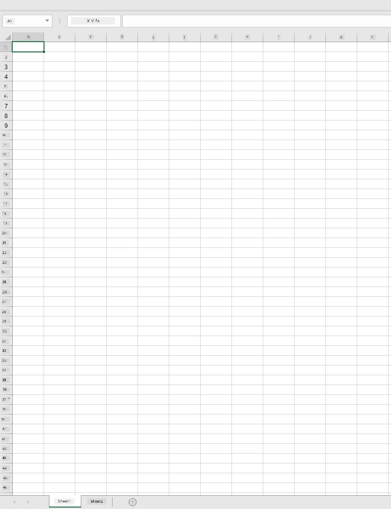
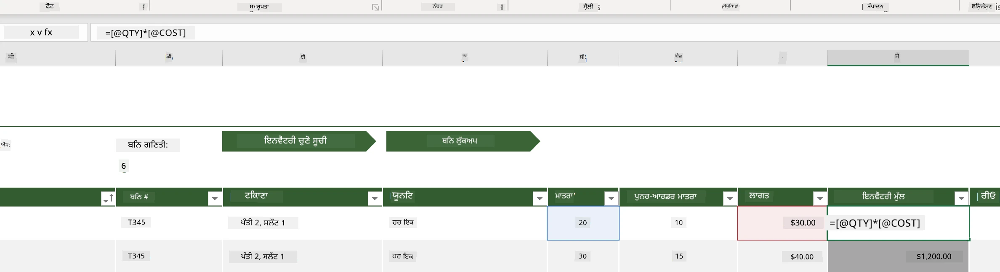
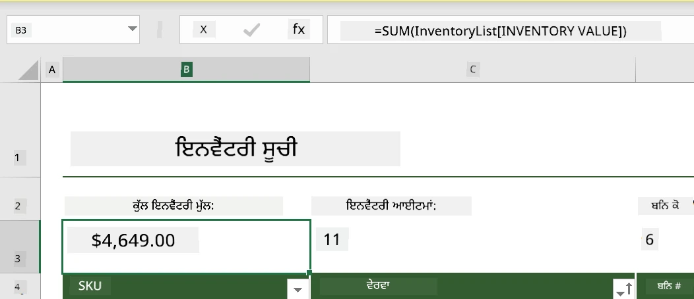
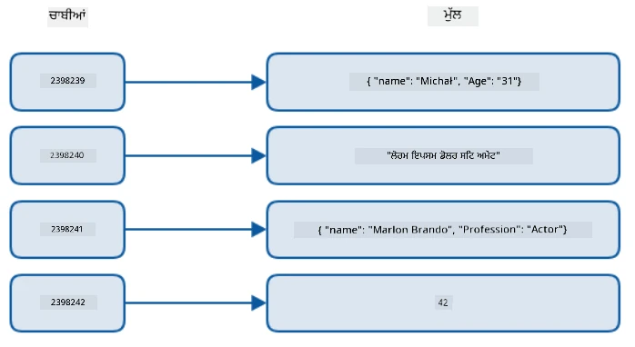
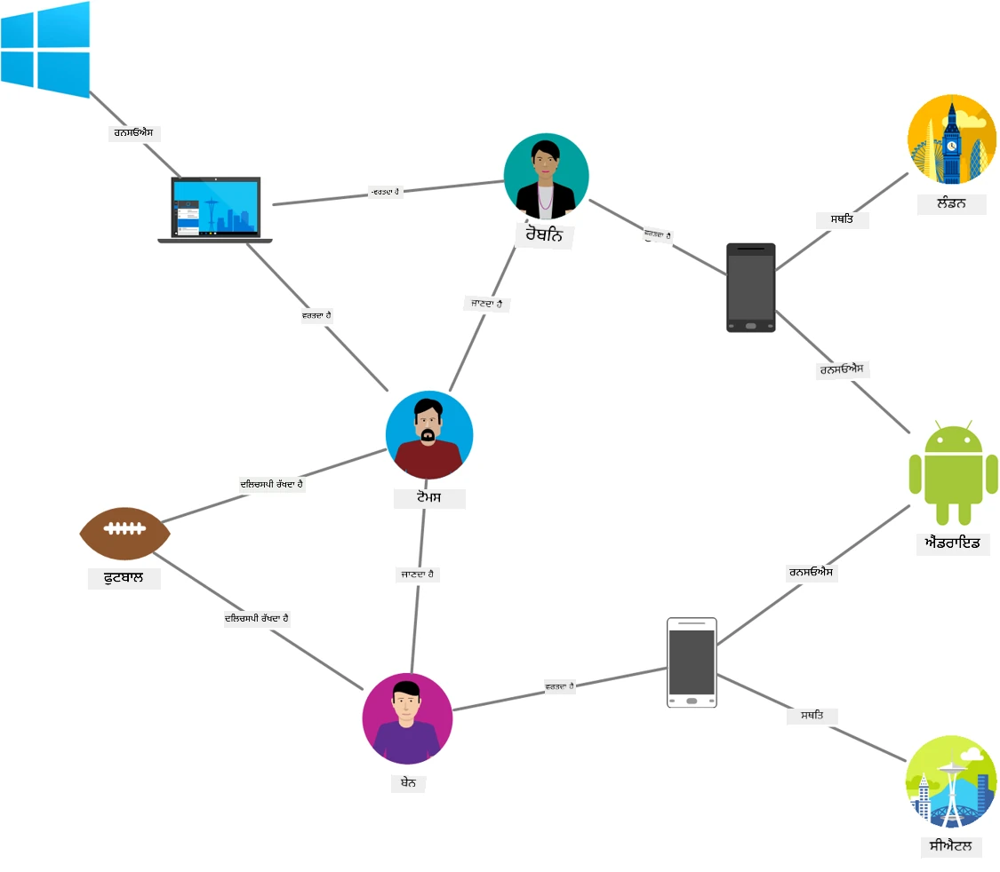
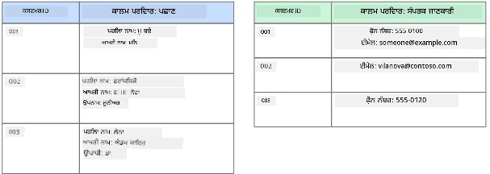
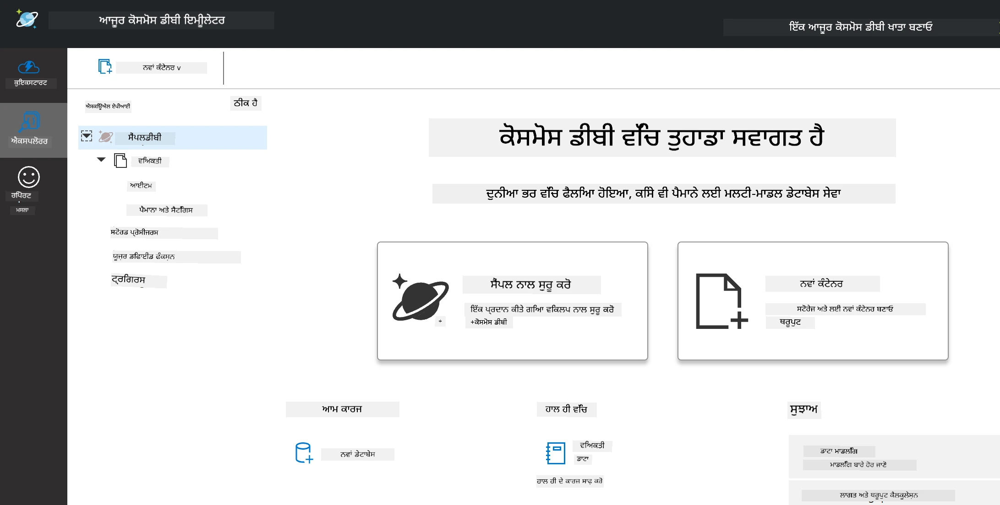
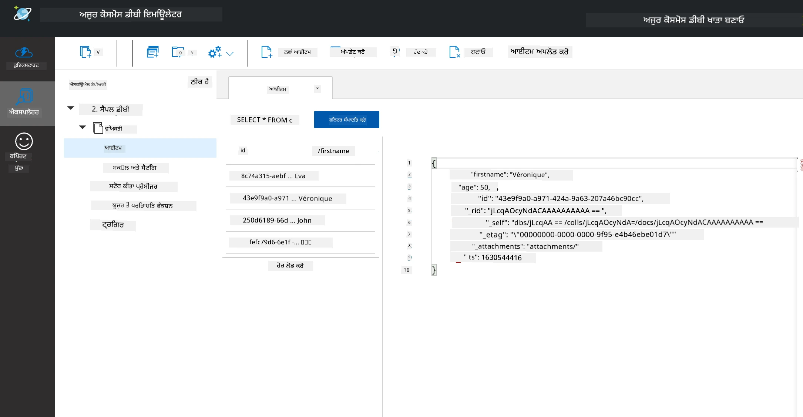
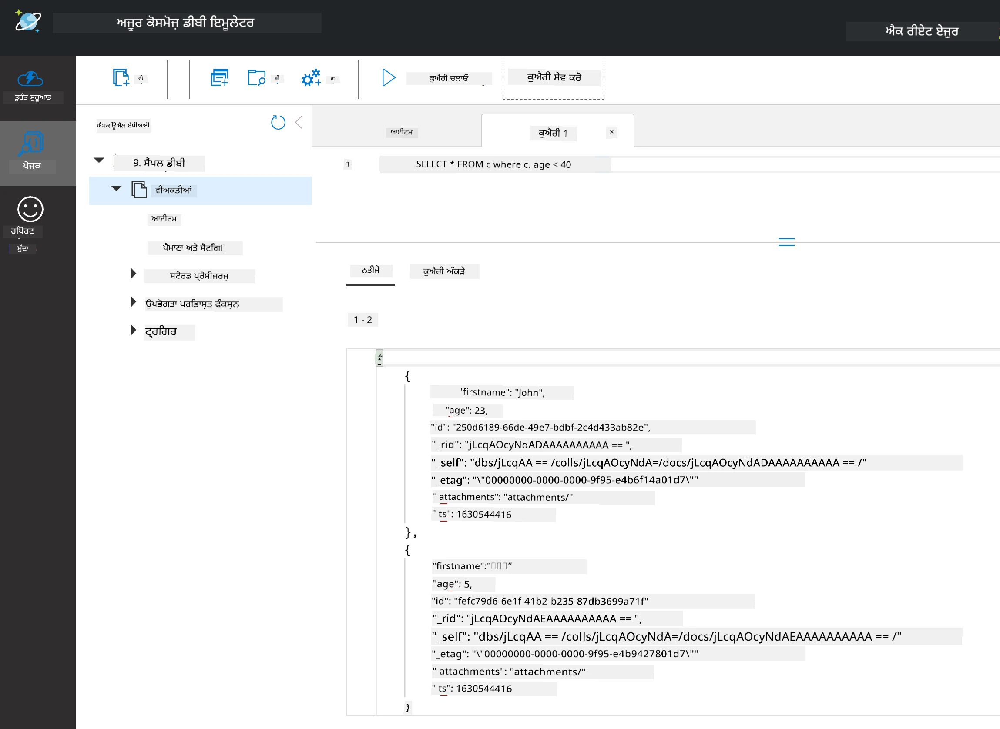

# ਡਾਟਾ ਨਾਲ ਕੰਮ ਕਰਨਾ: ਗੈਰ-ਰਿਲੇਸ਼ਨਲ ਡਾਟਾ

| ਵੱਲੋਂ ](../../sketchnotes/06-NoSQL.png)|
|:---:|
|ਨੋSQL ਡਾਟਾ ਨਾਲ ਕੰਮ ਕਰਨਾ - _ਸਕੈਚਨੋਟ [@nitya](https://twitter.com/nitya) ਵੱਲੋਂ_ |

## [ਪੂਰਵ-ਵਿਆਖਿਆਨ ਕਵਿਜ਼](https://ff-quizzes.netlify.app/en/ds/quiz/10)

ਡਾਟਾ ਸਿਰਫ ਰਿਲੇਸ਼ਨਲ ਡੇਟਾਬੇਸਾਂ ਤੱਕ ਸੀਮਿਤ ਨਹੀਂ ਹੈ। ਇਹ ਪਾਠ ਗੈਰ-ਰਿਲੇਸ਼ਨਲ ਡਾਟਾ 'ਤੇ ਕੇਂਦ੍ਰਿਤ ਹੈ ਅਤੇ ਸਪ੍ਰੈਡਸ਼ੀਟ ਅਤੇ NoSQL ਦੇ ਮੂਲ ਤੱਤਾਂ ਨੂੰ ਕਵਰ ਕਰੇਗਾ।

## ਸਪ੍ਰੈਡਸ਼ੀਟਸ

ਸਪ੍ਰੈਡਸ਼ੀਟਸ ਡਾਟਾ ਸਟੋਰ ਅਤੇ ਖੋਜਣ ਦਾ ਇੱਕ ਲੋਕਪ੍ਰਿਯ ਤਰੀਕਾ ਹਨ ਕਿਉਂਕਿ ਇਹ ਸੈਟਅੱਪ ਕਰਨ ਅਤੇ ਸ਼ੁਰੂ ਕਰਨ ਵਿੱਚ ਘੱਟ ਮਿਹਨਤ ਲੈਂਦਾ ਹੈ। ਇਸ ਪਾਠ ਵਿੱਚ ਤੁਸੀਂ ਸਪ੍ਰੈਡਸ਼ੀਟ ਦੇ ਮੂਲ ਤੱਤਾਂ, ਵੀ ਫਾਰਮੂਲੇ ਅਤੇ ਫੰਕਸ਼ਨਾਂ ਬਾਰੇ ਸਿੱਖੋਗੇ। ਉਦਾਹਰਨਾਂ ਮਾਇਕਰੋਸੌਫਟ ਐਕਸਲ ਨਾਲ ਦਿੱਤੀਆਂ ਜਾਣਗੀਆਂ, ਪਰ ਜ਼ਿਆਦਾਤਰ ਹਿੱਸੇ ਅਤੇ ਵਿਸ਼ੇ ਹੋਰ ਸਪ੍ਰੈਡਸ਼ੀਟ ਸੌਫਟਵੇਅਰ ਨਾਲ ਸਬੰਧਤ ਇੱਕੋ ਜਿਹੇ ਨਾਮਾਂ ਅਤੇ ਕਦਮਾਂ ਵਾਲੇ ਹੋਣਗੇ।



ਇੱਕ ਸਪ੍ਰੈਡਸ਼ੀਟ ਫਾਈਲ ਹੁੰਦੀ ਹੈ ਅਤੇ ਇਹ ਕੰਪਿਊਟਰ, ਡਿਵਾਈਸ ਜਾਂ ਕਲਾਉਡ ਅਧਾਰਿਤ ਫਾਈਲ ਸਿਸਟਮ ਵਿੱਚ ਮੌਜੂਦ ਹੁੰਦੀ ਹੈ। ਸਫਟਵੇਅਰ ਖੁਦ ਬ੍ਰਾузਰ ਆਧਾਰਿਤ ਹੋ ਸਕਦਾ ਹੈ ਜਾਂ ਐਪਲੀਕੇਸ਼ਨ ਜੋ ਕੰਪਿਊਟਰ 'ਤੇ ਇੰਸਟਾਲ ਕਰਨਯੋਗ ਜਾਂ ਐਪ ਵਜੋਂ ਡਾਊਨਲੋਡ ਕਰਨਯੋਗ ਹੁੰਦਾ ਹੈ। ਐਕਸਲ ਵਿੱਚ ਇਹ ਫਾਈਲਾਂ **ਵਰਕਬੁਕਸ** ਦੇ ਤੌਰ ਤੇ ਜਾਣੀਆਂ ਜਾਂਦੀਆਂ ਹਨ ਅਤੇ ਇਹ ਟਰਮੀਨੋਲੋਜੀ ਇਸ ਪਾਠ ਦੇ ਬਾਕੀ ਹਿੱਸੇ ਵਿੱਚ ਵਰਤੀ ਜਾਵੇਗੀ।

ਇੱਕ ਵਰਕਬੁੱਕ ਵਿੱਚ ਇੱਕ ਜਾਂ ਵੱਧ **ਵਰਕਸ਼ੀਟਸ** ਹੁੰਦੀਆਂ ਹਨ, ਜਿੱਥੇ ਹਰ ਵਰਕਸ਼ੀਟ ਨੂੰ ਟੈਬ ਨਾਲ ਲੇਬਲ ਕੀਤਾ ਜਾਂਦਾ ਹੈ। ਵਰਕਸ਼ੀਟ ਦੇ ਅੰਦਰ ਵਰਗਾਕਾਰ ਖਾਨੇ ਹੁੰਦੇ ਹਨ ਜਿਨ੍ਹਾਂ ਨੂੰ **ਸੈੱਲਜ਼** ਕਹਿੰਦੇ ਹਨ, ਜੋ ਹਕੀਕਤੀ ਡਾਟਾ ਰੱਖਦੇ ਹਨ। ਇੱਕ ਸੈੱਲ ਇੱਕ ਕਤਾਰ ਅਤੇ ਕਾਲਮ ਦਾ ਸੰਧੀ ਬਿੰਦੂ ਹੁੰਦਾ ਹੈ, ਜਿੱਥੇ ਕਾਲਮ ਅੱਖਰੀ ਅੱਖਰਾਂ ਨਾਲ ਲੇਬਲ ਕੀਤੇ ਜاندੇ ਹਨ ਅਤੇ ਕਤਾਰਾਂ ਨੂੰ ਨੰਬਰਰੂਪ ਵਿੱਚ ਲੇਬਲ ਕੀਤਾ ਜਾਂਦਾ ਹੈ। ਕੁਝ ਸਪ੍ਰੈਡਸ਼ੀਟਾਂ ਵਿੱਚ ਪਹਿਲੀਆਂ ਕੁਝ ਕਤਾਰਾਂ ਵਿੱਚ ਸਿਰਲੇਖ ਹੁੰਦੇ ਹਨ ਜੋ ਸੈੱਲ ਵਿੱਚ ਡਾਟਾ ਦਾ ਵਰਣਨ ਕਰਦੇ ਹਨ।

ਇਨ੍ਹਾਂ ਮੂਲ ਤੱਤਾਂ ਵਾਲੇ ਐਕਸਲ ਵਰਕਬੁੱਕ ਦੇ ਨਾਲ, ਅਸੀਂ [Microsoft Templates](https://templates.office.com/) ਤੋਂ ਇਕ ਉਦਾਹਰਨ ਲਈ ਸਪ੍ਰੈਡਸ਼ੀਟ ਦੇ ਕੁਝ ਹੋਰ ਹਿੱਸਿਆਂ ਨੂੰ ਸਮਝਾਂਗੇ ਜਿਸ ਵਿੱਚ ਇਨਵੈਂਟਰੀ 'ਤੇ ਧਿਆਨ ਦਿੱਤਾ ਗਿਆ ਹੈ।

### ਇਨਵੈਂਟਰੀ ਪ੍ਰਬੰਧਨ

"InventoryExample" ਨਾਂ ਦੀ ਸਪ੍ਰੈਡਸ਼ੀਟ ਫਾਈਲ ਇਨਵੈਂਟਰੀ ਵਿੱਚ ਆਈਟਮਾਂ ਦੀ ਤਿੰਨ ਵਰਕਸ਼ੀਟਾਂ ਵਾਲੀ ਫਾਰਮੈਟ ਕੀਤੀ ਗਈ ਸਪ੍ਰੈਡਸ਼ੀਟ ਹੈ, ਜਿੱਥੇ ਟੈਬ "Inventory List", "Inventory Pick List" ਅਤੇ "Bin Lookup" ਲੇਬਲ ਕੀਤੇ ਗਏ ਹਨ। ਇਨਵੈਂਟਰੀ ਲਿਸਟ ਵਰਕਸ਼ੀਟ ਦੀ ਕਤਾਰ 4 ਸਿਰਲੇਖ ਹੈ, ਜੋ ਸਿਰਲੇਖ ਥੱਲੇ ਹਰ ਸੈੱਲ ਦੀ ਕੀਮਤ ਨੂੰ ਵਰਣਨ ਕਰਦਾ ਹੈ।



ਕਈ ਵਾਰ ਇੱਕ ਸੈੱਲ ਹੋਰ ਸੈੱਲਾਂ ਦੀਆਂ ਕਦਰਾਂ ‘ਤੇ ਨਿਰਭਰ ਹੁੰਦਾ ਹੈ ਤਾ ਕਿ ਉਹ ਆਪਣੀ ਕੀਮਤ ਬਣਾਲੇ। ਇਨਵੈਂਟਰੀ ਲਿਸਟ ਸਪ੍ਰੈਡਸ਼ੀਟ ਹਰ ਆਈਟਮ ਦੀ ਕੀਮਤ ਦਾ ਖ਼ਿਆਲ ਰੱਖਦੀ ਹੈ, ਪਰ ਜੇਕਰ ਸਾਨੂੰ ਸਾਰੀ ਇਨਵੈਂਟਰੀ ਦੀ ਕੁੱਲ ਕੀਮਤ ਪਤਾ ਲਗਾਉਣੀ ਹੋਵੇ? [**ਫਾਰਮੂਲੇ**](https://support.microsoft.com/en-us/office/overview-of-formulas-34519a4e-1e8d-4f4b-84d4-d642c4f63263) ਸੈੱਲ ਡਾਟਾ 'ਤੇ ਕਾਰਵਾਈ ਕਰਦੇ ਹਨ ਅਤੇ ਇਸ ਉਦਾਹਰਨ 'ਚ ਇਨਵੈਂਟਰੀ ਦੀ ਕੀਮਤ ਕੈਲਕ्युਲੇਟ ਕਰਨ ਲਈ ਵਰਤੇ ਜਾਂਦੇ ਹਨ। ਇਸ ਸਪ੍ਰੈਡਸ਼ੀਟ ਨੇ ਇਨਵੈਂਟਰੀ ਵੈਲਯੂ ਕਾਲਮ ਵਿਚ ਸੁਤਰ ਵਰਤਿਆ ਹੈ ਜੋ QTY ਸਿਰਲੇਖ ਹੇਠ ਕੁਲ ਨੰਬਰ ਅਤੇ COST ਸਿਰਲੇਖ ਹੇਠ ਕੀਮਤਾਂ ਦੋਹਾਂ ਦਾ ਗੁਣਾ ਕਰਕੇ ਹਰ ਆਈਟਮ ਦੀ ਕੀਮਤ ਕੈਲਕ्युਲੇਟ ਕਰਦਾ ਹੈ। ਸੈੱਲ 'ਤੇ ਡਬਲ ਕਲਿੱਕ ਕਰਨ ਜਾਂ ਉਸਨੂੰ ਹਾਈਲਾਈਟ ਕਰਨ ‘ਤੇ ਫਾਰਮੂਲਾ ਦਿਖਾਈ ਦਿੰਦਾ ਹੈ। ਤੁਸੀਂ ਦੇਖੋਗੇ ਕਿ ਫਾਰਮੂਲੇ ਇੱਕ ਬਰਾਬਰ ਦੇ ਨਿਸ਼ਾਨ ਨਾਲ ਸ਼ੁਰੂ ਹੁੰਦੇ ਹਨ, ਜਿਸ ਤੋਂ ਬਾਅਦ ਕੈਲਕੁਲੇਸ਼ਨ ਜਾਂ ਓਪਰੇਸ਼ਨ ਦੱਸਿਆ ਜਾਂਦਾ ਹੈ।



ਸਾਡੇ ਕੋਲ ਹੋਰ ਇੱਕ ਫਾਰਮੂਲਾ ਹੈ ਜੋ ਇਨਵੈਂਟਰੀ ਵੈਲਯੂ ਦੇ ਸਾਰੇ ਮੁੱਲਾਂ ਨੂੰ ਜੋੜ ਕੇ ਕੁੱਲ ਮੁੱਲ ਦੱਸਦਾ ਹੈ। ਇਹ ਸਾਰੇ ਸੈੱਲਾਂ ਨੂੰ ਜੋੜ ਕੇ ਕਰ ਸਕਦੇ ਹਾਂ, ਪਰ ਇਹ ਥਕਾਵਟ ਭਰਾ ਕੰਮ ਹੋਵੇਗਾ। ਐਕਸਲ ਵਿੱਚ [**ਫੰਕਸ਼ਨਾਂ**](https://support.microsoft.com/en-us/office/sum-function-043e1c7d-7726-4e80-8f32-07b23e057f89) ਦਾ ਉਪਯੋਗ ਕੀਤਾ ਜਾਂਦਾ ਹੈ, ਜੋ ਕਿ ਪਹਿਲਾਂ ਹੀ ਪਰਿਭਾਸ਼ਤ ਫਾਰਮੂਲੇ ਹੁੰਦੇ ਹਨ ਜੋ ਸੈੱਲ ਮੁੱਲਾਂ 'ਤੇ ਗਣਿਤ ਸਮੀਕਰਨ ਕਰਦੇ ਹਨ। ਫੰਕਸ਼ਨਾਂ ਨੂੰ ਆਰਗੁਮੈਂਟ ਚਾਹੀਦੇ ਹੁੰਦੇ ਹਨ, ਜੋ ਉਹ ਮੁੱਲ ਹਨ ਜੋ ਇਹ ਕੈਲਕੁਲੇਸ਼ਨ ਕਰਨ ਲਈ ਵਰਤੇ ਜਾਂਦੇ ਹਨ। ਜਦੋਂ ਫੰਕਸ਼ਨਾਂ ਨੂੰ ਇੱਕ ਤੋਂ ਵੱਧ ਆਰਗੁਮੈਂਟ ਚਾਹੀਦੇ ਹੁੰਦੇ ਹਨ, ਤਾਂ ਉਹਨਾਂ ਨੂੰ ਕਿਸੇ ਖਾਸ ਕ੍ਰਮ ਵਿਚ ਲਿਖਣਾ ਲਾਜ਼ਮੀ ਹੁੰਦਾ ਹੈ, ਨਹੀਂ ਤਾਂ ਸੰਭਾਵਨਾ ਹੈ ਕਿ ਸਹੀ ਕੀਮਤ ਨਹੀਂ ਬਣਾ ਸਕਦੇ। ਇਸ ਉਦਾਹਰਨ ਵਿੱਚ SUM ਫੰਕਸ਼ਨ ਵਰਤਿਆ ਗਿਆ ਹੈ, ਜੋ ਇਨਵੈਂਟਰੀ ਵੈਲਯੂ ਦੇ ਮੁੱਲਾਂ ਨੂੰ ਜੋੜਦਾ ਹੈ ਤਾਂ ਜੋ ਰੋ 3, ਕਾਲਮ B (ਜੋ B3 ਵੀ ਕਹਾਉਂਦਾ ਹੈ) ਹੇਠ ਲਿਖੀ ਕੁੱਲ ਕੀਮਤ ਮਿਲੇ।

## NoSQL

NoSQL ਇੱਕ ਛੱਤਰ ਸ਼ਬਦ ਹੈ ਜੋ ਗੈਰ-ਰਿਲੇਸ਼ਨਲ ਡਾਟਾ ਸਟੋਰ ਕਰਨ ਦੇ ਵੱਖ-ਵੱਖ ਤਰੀਕਿਆਂ ਲਈ ਵਰਤਿਆ ਜਾਂਦਾ ਹੈ ਅਤੇ ਇਸਨੂੰ "ਗੈਰ-SQL", "ਗੈਰ-ਰਿਲੇਸ਼ਨਲ" ਜਾਂ "ਸਿਰਫ SQL ਨਹੀਂ" ਦੇ ਤੌਰ 'ਤੇ ਸਮਝਿਆ ਜਾ ਸਕਦਾ ਹੈ। ਇਹ ਪ੍ਰਕਾਰ ਦੇ ਡੇਟਾਬੇਸ ਸਿਸਟਮ 4 ਕਿਸਮਾਂ ਵਿੱਚ ਵੰਡੇ ਜਾ ਸਕਦੇ ਹਨ।


> ਸਰੋਤ [Michał Białecki Blog](https://www.michalbialecki.com/2018/03/18/azure-cosmos-db-key-value-database-cloud/)

[ਕੀ-ਵੈਲਯੂ](https://docs.microsoft.com/en-us/azure/architecture/data-guide/big-data/non-relational-data#keyvalue-data-stores) ਡੇਟਾਬੇਸ ਇਕ ਵੱਖਰੀ ਚਾਬੀ ਨੂੰ ਜੋੜਦੇ ਹਨ, ਜੋ ਇੱਕ ਵਿਲੱਖਣ ਪਹਿਚਾਣਕ ਹੈ ਜੋ ਕਿਸੇ ਮੁੱਲ ਨਾਲ ਜੁੜਿਆ ਹੁੰਦਾ ਹੈ। ਇਹ ਜੋੜ [ਹੈਸ਼ ਟੇਬਲ](https://www.hackerearth.com/practice/data-structures/hash-tables/basics-of-hash-tables/tutorial/) ਦੀ ਵਰਤੋਂ ਨਾਲ ਸੰਭਾਲੇ ਜਾਂਦੇ ਹਨ ਜਿਸ ਵਿਚ ਇੱਕ ਯੋਗ ਹੈਸ਼ਿੰਗ ਫੰਕਸ਼ਨ ਵਰਤਿਆ ਜਾਂਦਾ ਹੈ।


> ਸਰੋਤ [Microsoft](https://docs.microsoft.com/en-us/azure/cosmos-db/graph/graph-introduction#graph-database-by-example)

[ਗ੍ਰਾਫ](https://docs.microsoft.com/en-us/azure/architecture/data-guide/big-data/non-relational-data#graph-data-stores) ਡੇਟਾਬੇਸ ਡਾਟਾ ਵਿੱਚ ਸੰਬੰਧਾਂ ਨੂੰ ਵਰਣਨ ਕਰਦੇ ਹਨ ਅਤੇ ਇਹ ਨੋਡਸ ਅਤੇ ਐੱਜਾਂ ਦੇ ਸੰਗ੍ਰਹਿ ਵਜੋਂ ਦਿੱਖਾਈ ਦਿੰਦੇ ਹਨ। ਇੱਕ ਨੋਡ ਇੱਕ ਪ੍ਰਾਣੀ ਨੂੰ ਦਰਸਾਉਂਦਾ ਹੈ, ਜੋ ਅਸਲੀ ਦੁਨੀਆ ਵਿੱਚ ਮੌਜੂਦ ਕੁਝ ਵਜੋਂ ਹੈ, ਜਿਵੇਂ ਕਿ ਵਿਦਿਆਰਥੀ ਜਾਂ ਬੈਂਕ ਬਿਆਨ। ਐੱਜ ਦੋ ਜੀਵਾਂ ਵਿਚਕਾਰ ਦੇ ਸੰਬੰਧ ਨੂੰ ਦਰਸਾਉਂਦੇ ਹਨ। ਹਰ ਨੋਡ ਅਤੇ ਐੱਜ ਦੀਆਂ ਕੁਝ ਗੁਣਵੱਤਾਵਾਂ ਹੁੰਦੀਆਂ ਹਨ ਜੋ ਹਰ ਨੋਡ ਅਤੇ ਐੱਜ ਬਾਰੇ ਵਧੀਕ ਜਾਣਕਾਰੀ ਦਿੰਦੀਆਂ ਹਨ।



[ਕਾਲਮ-ਆਧਾਰਿਤ](https://docs.microsoft.com/en-us/azure/architecture/data-guide/big-data/non-relational-data#columnar-data-stores) ਡਾਟਾ ਸਟੋਰ ਡਾਟਾ ਨੂੰ ਕਾਲਮਾਂ ਅਤੇ ਕਤਾਰਾਂ ਵਿੱਚ ਵੰਡਦਾ ਹੈ, ਜਿਵੇਂ ਕਿ ਰਿਲੇਸ਼ਨਲ ਡਾਟਾ ਸਟ੍ਰਕਚਰ, ਪਰ ਹਰ ਕਾਲਮ ਨੂੰ ਕਾਲਮ ਪਰਿਵਾਰਾਂ ਵਿੱਚ ਵੰਡਿਆ ਜਾਂਦਾ ਹੈ, ਜਿੱਥੇ ਇਕ ਕਾਲਮ ਹੇਠ ਸਾਰਾ ਡਾਟਾ ਜੁੜਿਆ ਹੋਇਆ ਹੁੰਦਾ ਹੈ ਅਤੇ ਇੱਕ ਇਕਾਈ ਵਜੋਂ ਉਧਾਰ ਲਿਆ ਜਾਂਦਾ ਹੈ ਤਾਂ ਹੀ ਦੁਬਾਰਾ ਬਦਲਿਆ ਜਾਂਦਾ ਹੈ।

### ਏਜ਼ਿਊਰ ਕੋਸਮੋਸ DB ਨਾਲ ਡੌਕੂਮੇਂਟ ਡਾਟਾ ਸਟੋਰ

[ਡੌਕੂਮੈਂਟ](https://docs.microsoft.com/en-us/azure/architecture/data-guide/big-data/non-relational-data#document-data-stores) ਡਾਟਾ ਸਟੋਰ ਕੀ-ਵੈਲਯੂ ਡਾਟਾ ਸਟੋਰ ਦੇ ਕਾਂਸੈਪਟ 'ਤੇ ਬਣਾਏ ਜਾਂਦੇ ਹਨ ਅਤੇ ਇਹ ਖੇਤਰਾਂ ਅਤੇ ਆਬਜੈਕਟਾਂ ਦੀ ਇੱਕ ਕੜੀ ਹੁੰਦੇ ਹਨ। ਇਹ ਹਿੱਸਾ ਕੋਸਮੋਸ DB ਇਮੀਲੇਟਰ ਸਾਥ ਡੌਕੂਮੈਂਟ ਡੇਟਾਬੇਸਾਂ ਦੀ ਖੋਜ ਕਰੇਗਾ।

ਕੋਸਮੋਸ DB ਡੇਟਾਬੇਸ "Not Only SQL" ਦੀ ਪਰਿਭਾਸ਼ਾ ਵਿੱਚ ਫਿੱਟ ਹੁੰਦਾ ਹੈ, ਜਿੱਥੇ ਕੋਸਮੋਸ DB ਦਾ ਡੌਕੂਮੈਂਟ ਡੇਟਾਬੇਸ ਡਾਟੇ ਨੂੰ ਕਵੈਰੀ ਕਰਨ ਲਈ SQL 'ਤੇ ਨਿਰਭਰ ਕਰਦਾ ਹੈ। [ਪਿਛਲੇ ਪਾਠ](../05-relational-databases/README.md) ਵਿੱਚ SQL ਦੀਆਂ ਬੁਨਿਆਦੀ ਗੱਲਾਂ ਕਰਾਈਆਂ ਗਈਆਂ ਹਨ, ਅਤੇ ਅਸੀਂ ਇੱਥੇ ਵੀ ਕੁਝ ਉਹੀ ਕਵੈਰੀਆਂ ਡੌਕੂਮੈਂਟ ਡੇਟਾਬੇਸਾਂ 'ਤੇ ਲਾਗੂ ਕਰਾਂਗੇ। ਅਸੀਂ Cosmos DB Emulator ਵਰਤਾਂਗੇ, ਜੋ ਸਾਡੇ ਨੂੰ ਕੰਪਿਊਟਰ 'ਤੇ ਲੋਕਲ ਡੌਕੂਮੈਂਟ ਡੇਟਾਬੇਸ ਬਣਾਉਣ ਅਤੇ ਖੋਜ ਕਰਨ ਦੀ ਆਗਿਆ ਦਿੰਦਾ ਹੈ। ਇਮੀਲੇਟਰ ਬਾਰੇ ਹੋਰ ਪੜ੍ਹੋ [ਇਥੇ](https://docs.microsoft.com/en-us/azure/cosmos-db/local-emulator?tabs=ssl-netstd21)।

ਇੱਕ ਡੌਕੂਮੈਂਟ ਖੇਤਰਾਂ ਅਤੇ ਆਬਜੈਕਟ ਮੁੱਲਾਂ ਦੀ ਸੰਗ੍ਰਹਿ ਹੁੰਦਾ ਹੈ, ਜਿੱਥੇ ਖੇਤਰ ਦੱਸਦੇ ਹਨ ਕਿ ਆਬਜੈਕਟ ਮੁੱਲ ਦਾ ਕੀ ਅਰਥ ਹੈ। ਹੇਠਾਂ ਇੱਕ ਡੌਕੂਮੈਂਟ ਦੀ ਉਦਾਹਰਨ ਦਿੱਤੀ ਗਈ ਹੈ।

```json
{
    "firstname": "Eva",
    "age": 44,
    "id": "8c74a315-aebf-4a16-bb38-2430a9896ce5",
    "_rid": "bHwDAPQz8s0BAAAAAAAAAA==",
    "_self": "dbs/bHwDAA==/colls/bHwDAPQz8s0=/docs/bHwDAPQz8s0BAAAAAAAAAA==/",
    "_etag": "\"00000000-0000-0000-9f95-010a691e01d7\"",
    "_attachments": "attachments/",
    "_ts": 1630544034
}
```

ਇਸ ਡੌਕੂਮੈਂਟ ਵਿੱਚ ਦਿਲਚਸਪੀ ਵਾਲੇ ਖੇਤਰ ਹਨ: `firstname`, `id`, ਅਤੇ `age`। ਬਾਕੀ ਖੇਤਰ ਜਿਨ੍ਹਾਂ ਦੇ ਅੱਗੇ ਅੰਡਰਸਕੋਰ ਹਨ, ਉਹ ਕੋਸਮੋਸ DB ਵਲੋਂ ਬਣਾਏ ਗਏ ਹਨ।

#### ਕੋਸਮੋਸ DB ਇਮੀਲੇਟਰ ਨਾਲ ਡਾਟਾ ਦੀ ਖੋਜ

ਤੁਸੀਂ ਇਮੀਲੇਟਰ ਨੂੰ [ਵਿੰਡੋਜ਼ ਲਈ ਇੱਥੇ ਡਾਊਨਲੋਡ ਅਤੇ ਇੰਸਟਾਲ ਕਰ ਸਕਦੇ ਹੋ](https://aka.ms/cosmosdb-emulator)। macOS ਅਤੇ Linux ਲਈ ਇਮੀਲੇਟਰ ਚਲਾਉਣ ਦੇ ਔਪਸ਼ਨ ਲਈ ਇਸ [ਦਸਤਾਵੇਜ਼ ਨੂੰ](https://docs.microsoft.com/en-us/azure/cosmos-db/local-emulator?tabs=ssl-netstd21#run-on-linux-macos) ਵੇਖੋ।

ਇਮੀਲੇਟਰ ਇੱਕ ਬ੍ਰਾਊਜ਼ਰ ਵਿੰਡੋ ਖੋਲਦਾ ਹੈ, ਜਿੱਥੇ ਐਕਸਪਲੋਰਰ ਵਿਊ ਤੁਹਾਨੂੰ ਡੌਕੂਮੈਂਟ ਨੂੰ ਖੋਜਣ ਦੀ ਆਗਿਆ ਦਿੰਦਾ ਹੈ।



ਜੇ ਤੁਸੀਂ ਨਾਲ ਨਾਲ ਕਰ ਰਹੇ ਹੋ ਤਾਂ "Start with Sample" 'ਤੇ ਕਲਿੱਕ ਕਰੋ ਤਾਂ ਜੋ SampleDB ਨਾਂ ਦਾ ਨਮੂਨਾ ਡੇਟਾਬੇਸ ਬਣ ਜਾਵੇ। Sample DB ਨੂੰ ਤੀਰ ਤੇ ਕਲਿੱਕ ਕਰਕੇ ਖੋਲ੍ਹਣ 'ਤੇ ਤੁਸੀਂ `Persons` ਨਾਂ ਦੇ ਕੰਟੇਨਰ ਨੂੰ ਲੱਭੋਗੇ, ਜੋ ਆਈਟਮਾਂ ਦਾ ਸੰਗ੍ਰਹਿ ਹੈ, ਜਿਹੜੇ ਕੰਟੇਨਰ ਵਿੱਚ ਡੌਕੂਮੈਂਟ ਹਨ। ਤੁਸੀਂ `Items` ਹੇਠਲੇ ਚਾਰ ਵੱਖਰੇ ਡੌਕੂਮੈਂਟਾਂ ਦੀ ਜਾਂਚ ਕਰ ਸਕਦੇ ਹੋ।



#### ਕੋਸਮੋਸ DB ਇਮੀਲੇਟਰ ਨਾਲ ਡੌਕੂਮੈਂਟ ਡਾਟਾ ਦੀ ਕਵੈਰੀ

ਅਸੀਂ ਨਵੀਂ SQL ਕਵੈਰੀ ਬਟਨ 'ਤੇ ਕਲਿੱਕ ਕਰਕੇ ਨਮੂਨਾ ਡਾਟਾ ਦੀ ਕਵੈਰੀ ਵੀ ਕਰ ਸਕਦੇ ਹਾਂ (ਖੱਬੇ ਤੋਂ ਦੂਜੀ ਬਟਨ)।

`SELECT * FROM c` ਕੰਟੇਨਰ ਵਿਚ ਸਾਰੇ ਡੌਕੂਮੈਂਟ ਵਾਪਸ ਕਰਦਾ ਹੈ। ਚਲੋ ਇੱਕ where ਕਲਾਜ਼ ਜੋੜ ਕੇ ਉਹ ਸਾਰੇ ਲੱਭੀਏ ਜਿਨ੍ਹਾਂ ਦੀ ਉਮਰ 40 ਤੋਂ ਘੱਟ ਹੈ।

`SELECT * FROM c where c.age < 40`

 

ਕਵੈਰੀ ਦੋ ਡੌਕੂਮੈਂਟ ਵਾਪਸ ਕਰਦੀ ਹੈ, ਧਿਆਨ ਦਿਓ ਕਿ ਹਰ ਡੌਕੂਮੈਂਟ ਵਿੱਚ age ਮੁੱਲ 40 ਤੋਂ ਘੱਟ ਹੈ।

#### JSON ਅਤੇ ਡੌਕੂਮੈਂਟ

ਜੇਕਰ ਤੁਸੀਂ ਜਾਵਾਸਕ੍ਰਿਪਟ ਆਬਜੈਕਟ ਨੋਟੇਸ਼ਨ (JSON) ਨਾਲ ਜਾਣੂ ਹੋ ਤਾਂ ਤੁਸੀਂ ਦੇਖੋਂਗੇ ਕਿ ਡੌਕੂਮੈਂਟ JSON ਵਰਗੇ ਹਨ। ਇਸ ਡਾਇਰੈਕਟਰੀ ਵਿੱਚ `PersonsData.json` ਫਾਈਲ ਹੈ ਜਿਸਨੂੰ ਤੁਸੀਂ ਇਮੀਲੇਟਰ ਵਿੱਚ Persons ਕੰਟੇਨਰ ਵਿੱਚ `Upload Item` ਬਟਨ ਰਾਹੀਂ ਅਪਲੋਡ ਕਰ ਸਕਦੇ ਹੋ।

ਜ਼ਿਆਦਾਤਰ ਮਾਮਲਿਆਂ ਵਿੱਚ, ਉਹ ਏਪੀਆਈ ਜੋ JSON ਡਾਟਾ ਹੇਠਾਂ ਦਿੰਦੇ ਹਨ, ਉਹ ਬਿਲਕੁਲ ਸੀਧਾ ਡੌਕੂਮੈਂਟ ਡੇਟਾਬੇਸ ਵਿੱਚ ਸ਼ਾਮਿਲ ਕੀਤੇ ਜਾ ਸਕਦੇ ਹਨ। ਹੇਠਾਂ ਹੋਰ ਇੱਕ ਡੌਕੂਮੈਂਟ ਦਿੱਤਾ ਗਿਆ ਹੈ, ਜੋ ਮਾਇਕਰੋਸੌਫਟ ਟਵਿੱਟਰ ਖਾਤੇ ਤੋਂ ਟਵੀਟਸ ਨੂੰ ਦਰਸਾਉਂਦਾ ਹੈ ਜੋ Twitter API ਦੀ ਵਰਤੋਂ ਨਾਲ ਪ੍ਰਾਪਤ ਹੋ ਕੇ ਕੋਸਮੋਸ DB ਵਿੱਚ ਦਰਜ ਕੀਤੇ ਗਏ।

```json
{
    "created_at": "2021-08-31T19:03:01.000Z",
    "id": "1432780985872142341",
    "text": "Blank slate. Like this tweet if you’ve ever painted in Microsoft Paint before. https://t.co/cFeEs8eOPK",
    "_rid": "dhAmAIUsA4oHAAAAAAAAAA==",
    "_self": "dbs/dhAmAA==/colls/dhAmAIUsA4o=/docs/dhAmAIUsA4oHAAAAAAAAAA==/",
    "_etag": "\"00000000-0000-0000-9f84-a0958ad901d7\"",
    "_attachments": "attachments/",
    "_ts": 1630537000
```

ਇਸ ਡੌਕੂਮੈਂਟ ਵਿੱਚ ਦਿਲਚਸਪੀ ਵਾਲੇ ਖੇਤਰ ਹਨ: `created_at`, `id`, ਅਤੇ `text`।

## 🚀 ਚੈਲੈਂਜ


`TwitterData.json` ਫਾਈਲ ਹੈ ਜਿਸਨੂੰ ਤੁਸੀਂ SampleDB ਡੇਟਾਬੇਸ ਵਿੱਚ ਅਪਲੋਡ ਕਰ ਸਕਦੇ ਹੋ। ਸਿਫਾਰਸ਼ ਕੀਤੀ ਜਾਂਦੀ ਹੈ ਕਿ ਤੁਸੀਂ ਇਸਨੂੰ ਵੱਖਰੇ ਕੰਟੇਨਰ ਵਿੱਚ ਸ਼ਾਮਿਲ ਕਰੋ। ਇਹ ਕੰਮ ਕੀਤਾ ਜਾ ਸਕਦਾ ਹੈ:

1. ਉੱਤਰ-ਸੱਜੇ ਕੋਨੇ ਵਿੱਚ ਨਵਾਂ ਕੰਟੇਨਰ ਬਟਨ 'ਤੇ ਕਲਿੱਕ ਕਰਕੇ
1. ਮੌਜੂਦਾ ਡੇਟਾਬੇਸ (SampleDB) ਚੁਣ ਕੇ ਕੰਟੇਨਰ ਲਈ ਇੱਕ ਆਈਡੀ ਬਣਾਉਂਦੇ ਹੋਏ
1. partition key ਨੂੰ `/id` ਤੇ ਸੈੱਟ ਕਰਨਾ
1. OK 'ਤੇ ਕਲਿੱਕ ਕਰਨਾ (ਤੁਸੀਂ ਦਰਸ਼ਵਾਏ ਹੋਏ ਹੋਰ ਜਾਣਕਾਰੀ ਨੂੰ ਨਜ਼ਰਅੰਦਾਜ਼ ਕਰ ਸਕਦੇ ਹੋ ਕਿਉਂਕਿ ਇਹ ਛੋਟਾ ਡੇਟਾਸੈੱਟ ਤੁਹਾਡੇ ਲੋਕਲ ਮਸ਼ੀਨ 'ਤੇ ਦੌੜ ਰਿਹਾ ਹੈ)
1. ਆਪਣਾ ਨਵਾਂ ਕੰਟੇਨਰ ਖੋਲ੍ਹੋ ਅਤੇ Twitter Data ਫਾਈਲ ਨੂੰ `Upload Item` ਬਟਨ ਨਾਲ ਅਪਲੋਡ ਕਰੋ

ਕੁਝ SELECT ਕਵੈਰੀਆਂ ਚਲਾਉਂਣ ਦੀ ਕੋਸ਼ਿਸ਼ ਕਰੋ ਤਾਂ ਜੋ ਉਹ ਡੌਕੂਮੈਂਟ ਲੱਭ ਸਕੋ ਜੋ `text` ਖੇਤਰ ਵਿੱਚ Microsoft ਸ਼ਬਦ ਰੱਖਦੇ ਹੋਣ। ਸੂਚਨਾ: [LIKE ਕੀਵਰਡ](https://docs.microsoft.com/en-us/azure/cosmos-db/sql/sql-query-keywords#using-like-with-the--wildcard-character) ਵਰਤ ਕੇ ਕੋਸ਼ਿਸ਼ ਕਰੋ।

## [ਪਿੱਛੇ-ਵਿਆਖਿਆਨ ਕਵਿਜ਼](https://ff-quizzes.netlify.app/en/ds/quiz/11)


## ਸਮੀਖਿਆ ਅਤੇ ਸਵੈ ਅਧਿਐਨ

- ਇਸ ਸਪ੍ਰੈਡਸ਼ੀਟ ਵਿੱਚ ਕੁਝ ਹੋਰ ਫਾਰਮੈਟਿੰਗ ਅਤੇ ਫੀਚਰ ਹਨ ਜੋ ਇਹ ਪਾਠ ਕਵਰ ਨਹੀਂ ਕਰਦਾ। ਜੇ ਤੁਸੀਂ ਹੋਰ ਜਾਣਕਾਰੀ ਲੈਣਾ ਚਾਹੁੰਦੇ ਹੋ ਤਾਂ ਮਾਇਕਰੋਸੌਫਟ ਨੇ ਐਕਸਲ ਬਾਰੇ ਇੱਕ [ਵੱਡਾ ਡੋਕਯੂਮੈਂਟੇਸ਼ਨ ਅਤੇ ਵੀਡਿਓ ਲਾਇਬ੍ਰੇਰੀ](https://support.microsoft.com/excel) ਬਣਾਈ ਹੈ।

- ਇਹ ਆਰਕੀਟੈਕਚਰਲ ਦਸਤਾਵੇਜ਼ਾਕਾਰ ਗੈਰ-ਰਿਲੇਸ਼ਨਲ ਡਾਟਾ ਦੇ ਵੱਖਰਾ-ਵੱਖਰਾ ਕਿਸਮਾਂ ਦੀਆਂ ਖਾਸੀਅਤਾਂ ਨੂੰ ਵੇਰਵਾ ਦਿੰਦਾ ਹੈ: [ਗੈਰ-ਰਿਲੇਸ਼ਨਲ ਡਾਟਾ ਅਤੇ NoSQL](https://docs.microsoft.com/en-us/azure/architecture/data-guide/big-data/non-relational-data)

- ਕੋਸਮੋਸ DB ਇੱਕ ਕਲਾਉਡ ਅਧਾਰਿਤ ਗੈਰ-ਰਿਲੇਸ਼ਨਲ ਡੇਟਾਬੇਸ ਹੈ ਜੋ ਇਸ ਪਾਠ ਵਿੱਚ ਦਿੱਤੀ ਗਈ ਵੱਖ-ਵੱਖ NoSQL ਕਿਸਮਾਂ ਨੂੰ ਭੀ ਸਟੋਰ ਕਰ ਸਕਦਾ ਹੈ। ਇਹ ਕਿਸਮਾਂ ਬਾਰੇ ਹੋਰ ਸਿੱਖੋ ਇਸ [Cosmos DB Microsoft Learn ਮੋਡੀਊਲ](https://docs.microsoft.com/en-us/learn/paths/work-with-nosql-data-in-azure-cosmos-db/) ਵਿੱਚ।

## ਅਸਾਈਨਮੈਂਟ

[Soda Profits](assignment.md)

---

<!-- CO-OP TRANSLATOR DISCLAIMER START -->
**ਅਸਵੀਕਾਰੋਪਣ**:
ਇਸ ਦਸਤਾਵੇਜ਼ ਦਾ ਅਨੁਵਾਦ ਏਆਈ ਅਨੁਵਾਦ ਸੇਵਾ [Co-op Translator](https://github.com/Azure/co-op-translator) ਦੀ ਵਰਤੋਂ ਕਰਕੇ ਕੀਤਾ ਗਿਆ ਹੈ। ਜਦੋਂ ਕਿ ਅਸੀਂ ਸਹੀਤਾਵਾਂ ਲਈ ਯਤਨਸ਼ੀਲ ਹਾਂ, ਕਿਰਪਾ ਕਰਕੇ ਧਿਆਨ ਰੱਖੋ ਕਿ ਸਵੈਚਾਲਿਤ ਅਨੁਵਾਦਾਂ ਵਿੱਚ ਗਲਤੀਆਂ ਜਾਂ ਅਸਮੱਤਿਆਵਾਂ ਹੋ ਸਕਦੀਆਂ ਹਨ। ਮੂਲ ਦਸਤਾਵੇਜ਼ ਆਪਣੀ ਮੂਲ ਭਾਸ਼ਾ ਵਿੱਚ ਅਧਿਕਾਰਕ ਸਰੋਤ ਮੰਨਿਆ ਜਾਣਾ ਚਾਹੀਦਾ ਹੈ। ਜਰੂਰੀ ਜਾਣਕਾਰੀ ਲਈ, ਪੇਸ਼ੇਵਰ ਮਨੁੱਖੀ ਅਨੁਵਾਦ ਦੀ ਸਿਫ਼ਾਰਸ਼ ਕੀਤੀ ਜਾਂਦੀ ਹੈ। ਅਸੀਂ ਇਸ ਅਨੁਵਾਦ ਦੇ ਉਪਯੋਗ ਤੋਂ ਪੈਦਾ ਹੋਣ ਵਾਲੀਆਂ ਕਿਸੇ ਵੀ ਗਲਤਫਹਿਮੀਆਂ ਜਾਂ ਗਲਤ ਵਿਆਖਿਆਵਾਂ ਲਈ ਜਵਾਬਦੇਹ ਨਹੀਂ ਹਾਂ।
<!-- CO-OP TRANSLATOR DISCLAIMER END -->