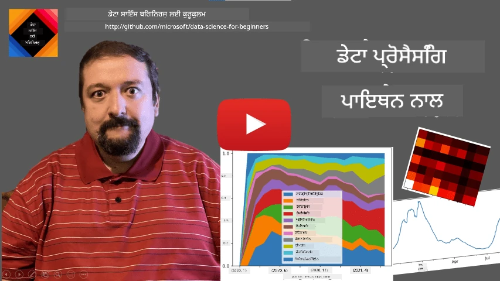
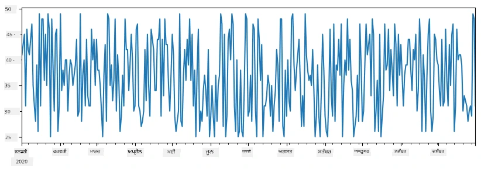
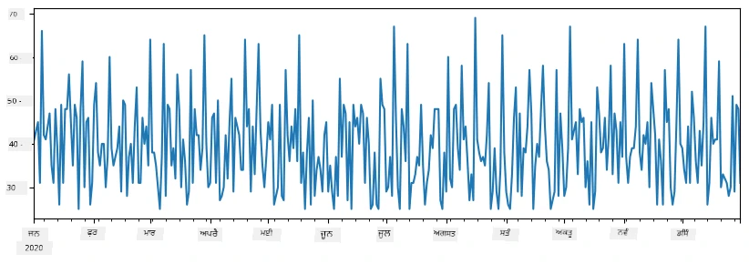
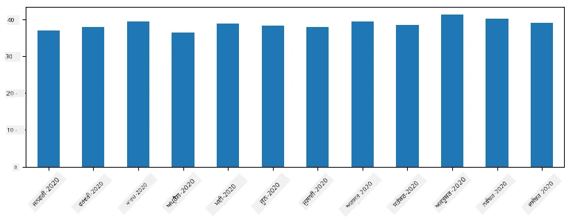
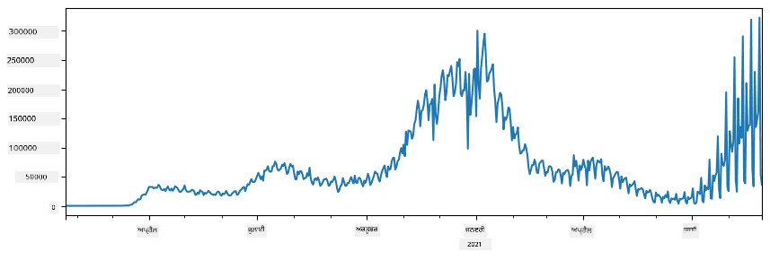
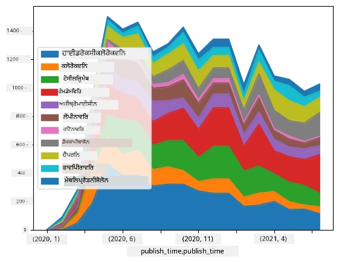

# ਡਾਟਾ ਨਾਲ ਕੰਮ ਕਰਨਾ: ਪਾਈਥਨ ਅਤੇ ਪੈਂਡਾਸ ਲਾਇਬ੍ਰੇਰੀ

|  ](../../sketchnotes/07-WorkWithPython.png) |
| :-------------------------------------------------------------------------------------------------------: |
|                 ਪਾਈਥਨ ਨਾਲ ਕੰਮ ਕਰਨਾ - _ਸਕੈਚਨੋਟ ਦੁਆਰਾ [@nitya](https://twitter.com/nitya)_                 |

[](https://youtu.be/dZjWOGbsN4Y)

ਜਦੋਂਕਿ ਡੇਟਾਬੇਸ ਡੇਟਾ ਸਟੋਰੇਜ ਅਤੇ ਪੁੱਛਗਿੱਛ ਲਈ ਬਹੁਤ ਪ੍ਰਭਾਵਸ਼ਾਲੀ ਤਰੀਕੇ ਦਿੰਦੇ ਹਨ, ਡੇਟਾ ਪ੍ਰੋਸੈਸਿੰਗ ਦਾ ਸਭ ਤੋਂ ਲਚਕੀਲਾ ਤਰੀਕਾ ਆਪਣੇ ਆਪ ਦਾ ਪ੍ਰੋਗ੍ਰਾਮ ਲਿਖ ਕੇ ਡੇਟਾ ਨੂੰ ਕੁਦਰਤੀ ਤੌਰ 'ਤੇ ਸੰਭਾਲਣਾ ਹੈ। ਬਹੁਤ ਸਾਰੀਆਂ ਹਾਲਤਾਂ ਵਿੱਚ, ਡੇਟਾਬੇਸ ਪੁੱਛਗਿੱਛ ਇੱਕ ਵੱਧ ਪ੍ਰਭਾਵਸ਼ਾਲੀ ਤਰੀਕਾ ਹੁੰਦੀ ਹੈ। ਪਰ ਕੁਝ ਹਾਲਤਾਂ ਵਿਚ, ਜਦੋਂ ਜ਼ਿਆਦਾ ਨਸੀਬਦਾਰ ਡਾਟਾ ਪ੍ਰੋਸੈਸਿੰਗ ਦੀ ਲੋੜ ਹੁੰਦੀ ਹੈ, ਤਾਂ ਇਹ SQL ਨਾਲ ਆਸਾਨੀ ਨਾਲ ਨਹੀਂ ਕੀਤਾ ਜਾ ਸਕਦਾ।  
ਡਾਟਾ ਪ੍ਰੋਸੈਸਿੰਗ ਕਿਸੇ ਵੀ ਪ੍ਰੋਗ੍ਰਾਮਿੰਗ ਭਾਸ਼ਾ ਵਿੱਚ ਕੀਤਾ ਜਾ ਸਕਦਾ ਹੈ, ਪਰ ਕੁਝ ਭਾਸ਼ਾਵਾਂ ਹਨ ਜੋ ਡਾਟਾ ਨਾਲ ਕੰਮ ਕਰਨ ਲਈ ਉੱਚ ਸਤਰ ਦੀਆਂ ਹਨ। ਡਾਟਾ ਸਾਇੰਟਿਸਟ ਆਮ ਤੌਰ 'ਤੇ ਹੇਠ ਲਿਖੀਆਂ ਭਾਸ਼ਾਵਾਂ ਵਿੱਚੋਂ ਇੱਕ ਵਰਤਣਾ ਪਸੰਦ ਕਰਦੇ ਹਨ:

* **[ਪਾਈਥਨ](https://www.python.org/)**, ਇੱਕ ਜਨਰਲ-ਪ੍ਰਯੋਜਨ ਪ੍ਰੋਗ੍ਰਾਮਿੰਗ ਭਾਸ਼ਾ, ਜੋ ਆਪਣੀ ਸਾਦਗੀ ਕਰਕੇ ਸ਼ੁਰੂਆਤੀ ਲੋਕਾਂ ਲਈ ਸਭ ਤੋਂ ਵਧੀਆ ਵਿਕਲਪਾਂ ਵਿੱਚੋਂ ਇੱਕ ਮੰਨੀ ਜਾਂਦੀ ਹੈ। ਪਾਈਥਨ ਵਿੱਚ ਬਹੁਤ ਸਾਰੀਆਂ ਵਾਧੂ ਲਾਇਬ੍ਰੇਰੀਆਂ ਹਨ ਜੋ ਤੁਹਾਨੂੰ ਕਈ ਪ੍ਰਾਇਕਟਿਕਲ ਸਮੱਸਿਆਵਾਂ ਦਾ ਹੱਲ ਕੱਢਣ ਵਿੱਚ ਮਦਦ ਕਰ ਸਕਦੀਆਂ ਹਨ, ਜਿਵੇਂ ਕਿ ZIP ਆਰਕਾਈਵ ਤੋਂ ਤੁਹਾਡਾ ਡਾਟਾ ਕੱਢਣਾ, ਜਾਂ ਤਸਵੀਰ ਨੂੰ ਗ੍ਰੇਸਕੇਲ ਵਿੱਚ ਬਦਲਣਾ। ਡਾਟਾ ਸਾਇੰਸ ਤੋਂ ਇਲਾਵਾ, ਪਾਈਥਨ ਵੈੱਬ ਵਿਕਾਸ ਲਈ ਵੀ ਅਕਸਰ ਵਰਤੀ ਜਾਂਦੀ ਹੈ।  
* **[ਆਰ](https://www.r-project.org/)** ਇੱਕ ਪੰਰੰਪਰਿਕ ਟੂਲਬਾਕਸ ਹੈ ਜੋ ਸਾਂਖਿਆਕੀ ਡਾਟਾ ਪ੍ਰੋਸੈਸਿੰਗ ਲਈ ਵਿਕਸਤ ਕੀਤਾ ਗਿਆ ਹੈ। ਇਸ ਵਿੱਚ ਕਈ ਵੱਡੇ ਲਾਇਬ੍ਰੇਰੀ ਰਿਪੋਜ਼ਟਰੀ (CRAN) ਵੀ ਹਨ, ਜੋ ਇਸਨੂੰ ਡਾਟਾ ਪ੍ਰੋਸੈਸਿੰਗ ਲਈ ਇੱਕ ਚੰਗਾ ਚੋਣ ਬਣਾਉਂਦੀਆਂ ਹਨ। ਪਰ, R ਇੱਕ ਜਨਰਲ-ਪ੍ਰਯੋਜਨ ਪ੍ਰੋਗ੍ਰਾਮਿੰਗ ਭਾਸ਼ਾ ਨਹੀਂ ਹੈ, ਅਤੇ ਆਮ ਤੌਰ 'ਤੇ ਡਾਟਾ ਸਾਇੰਸ ਖੇਤਰ ਤੋਂ ਬਾਹਰ ਬਹੁਤ ਘੱਟ ਵਰਤੀ ਜਾਂਦੀ ਹੈ।  
* **[ਜੂਲੀਆ](https://julialang.org/)** ਇੱਕ ਹੋਰ ਭਾਸ਼ਾ ਹੈ ਜੋ ਖਾਸ ਤੌਰ 'ਤੇ ਡਾਟਾ ਸਾਇੰਸ ਲਈ ਵਿਕਸਤ ਕੀਤੀ ਗਈ ਹੈ। ਇਹ ਪਾਈਥਨ ਨਾਲੋਂ ਬਿਹਤਰ ਪ੍ਰਦਰਸ਼ਨ ਦੇਣ ਲਈ ਤਿਆਰ ਕੀਤੀ ਗਈ ਹੈ, ਜੋ ਵਿਗਿਆਨਕ ਪ੍ਰਯੋਗ ਲਈ ਮਹਾਨ ਸੰਦ ਹੈ।

ਇਸ ਪਾਠ ਵਿੱਚ, ਅਸੀਂ ਸਧਾਰਣ ਡਾਟਾ ਪ੍ਰੋਸੈਸਿੰਗ ਲਈ ਪਾਈਥਨ ਦਾ ਪ੍ਰਯੋਗ ਕਰਨ ਤੇ ਧਿਆਨ ਦਿਆਂਗੇ। ਅਸੀਂ ਮੰਨ ਲਵਾਂਗੇ ਕਿ ਭਾਸ਼ਾ ਨਾਲ ਬੁਨਿਆਦੀ ਜਾਣਕਾਰੀ ਹੈ। ਜੇ ਤੁਸੀਂ ਪਾਈਥਨ ਦਾ ਇੱਕ ਵਧਿਆ ਡੂੰਘਾ ਟੂਰ ਚਾਹੁੰਦੇ ਹੋ, ਤਾਂ ਤੁਸੀਂ ਹੇਠ ਲਿਖੇ ਸਰੋਤਾਂ ਵਿੱਚੋਂ ਕਿਸੇ ਨੂੰ ਪ੍ਰਸੰਗ ਕਰ ਸਕਦੇ ਹੋ:

* [ਟਰਟਲ ਗ੍ਰਾਫਿਕਸ ਅਤੇ ਫਰੈਕਟਲਜ਼ ਨਾਲ ਮਜ਼ੇਦਾਰ ਤਰੀਕੇ ਨਾਲ ਪਾਈਥਨ ਸਿੱਖੋ](https://github.com/shwars/pycourse) - ਗਿੱਟਹੱਬ-ਅਧਾਰਿਤ ਤੇਜ਼ੀ ਨਾਲ ਪਾਈਥਨ ਪ੍ਰੋแกรมਿੰਗ ਵਿੱਚ ਦਾਖਲਾ ਪਾਠਕ੍ਰਮ  
* [ਪਾਈਥਨ ਨਾਲ ਆਪਣੇ ਪਹਿਲੇ ਕਦਮ ਚੁੱਕੋ](https://docs.microsoft.com/en-us/learn/paths/python-first-steps/?WT.mc_id=academic-77958-bethanycheum) ਮਾਈਕ੍ਰੋਸੌਫਟ ਲਰਨ 'ਤੇ ਲਰਨਿੰਗ ਪਥ

ਡਾਟਾ ਕਈ ਰੂਪਾਂ ਵਿੱਚ ਆ ਸਕਦਾ ਹੈ। ਇਸ ਪਾਠ ਵਿੱਚ, ਅਸੀਂ ਤਿੰਨ ਰੂਪਾਂ ਦੇ ਡਾਟا ਦੀ ਗੱਲ ਕਰਾਂਗੇ - **ਤਬੂਲਰ ਡਾਟਾ**, **ਟੈਕਸਟ** ਅਤੇ **ਤਸਵੀਰਾਂ**।

ਅਸੀਂ ਕੁਝ ਨਮੂਨਿਆਂ ਤੇ ਧਿਆਨ ਦੇਵਾਂਗੇ, ਬਜਾਏ ਇਹ ਪੁਰੀ ਤਰ੍ਹਾਂ ਸਾਰੀਆਂ ਲਾਇਬ੍ਰੇਰੀਆਂ ਦਾ ਜਾਇਜ਼ਾ ਲੈਣ ਦੇ। ਇਸ ਨਾਲ ਤੁਹਾਨੂੰ ਇਹ ਸਮਝ ਆ ਜਾਵੇਗੀ ਕਿ ਕੀ ਸੰਭਵ ਹੈ, ਅਤੇ ਜਦੋਂ ਵੀ ਤੁਹਾਨੂੰ ਲੋੜ ਹੋਵੇ, ਤੁਹਾਨੂੰ ਸਮੱਸਿਆਵਾਂ ਦਾ ਹੱਲ ਕਿੱਥੇ ਲੱਭਣਾ ਹੈ।

> **ਸਭ ਤੋਂ ਵਰਤੋਂਯੋਗ ਸਲਾਹ**। ਜਦੋਂ ਤੁਹਾਨੂੰ ਡਾਟਾ 'ਤੇ ਕੋਈ ਖਾਸ ਕਾਰਵਾਈ ਕਰਨੀ ਹੋਵੇ ਜਿਸ ਦਾ ਤਰੀਕਾ ਤੁਹਾਨੂੰ ਨਹੀਂ ਪਤਾ, ਤਾਂ ਇੰਟਰੰੈੱਟ 'ਤੇ ਉਸ ਤਰੀਕੇ ਦੀ ਖੋਜ ਕਰੋ। [Stackoverflow](https://stackoverflow.com/) ਵਿੱਚ ਅਕਸਰ ਬਹੁਤ ਸਾਰੇ ਵਰਤੋਂਯੋਗ ਕੋਡ ਨਮੂਨੇ ਪਾਈਥਨ ਵਿੱਚ ਮਿਲਦੇ ਹਨ ਕਈ ਆਮ ਕਾਰਜਾਂ ਲਈ। 


## [ਪ੍ਰੀ-ਲੈਕਚਰ ਕੁਇਜ਼](https://ff-quizzes.netlify.app/en/ds/quiz/12)

## ਤਬੂਲਰ ਡਾਟਾ ਅਤੇ ਡਾਟਾਫਰੇਮ

ਤੁਸੀਂ ਪਹਿਲਾਂ ਹੀ ਤਬੂਲਰ ਡਾਟਾ ਨਾਲ ਮਿਲੋ ਹੋ ਜਦੋਂ ਅਸੀਂ ਸਬੰਧਤ ਡਾਟਾਬੇਸਾਂ ਦੀ ਗੱਲ ਕੀਤੀ ਸੀ। ਜਦੋਂ ਤੁਹਾਡੇ ਕੋਲ ਬਹੁਤ ਸਾਰਾ ਡਾਟਾ ਹੁੰਦਾ ਹੈ, ਅਤੇ ਇਹ ਕਈ ਵੱਖ-ਵੱਖ ਜੋੜੇ ਹੋਏ ਟੇਬਲਾਂ ਵਿੱਚ ਹੁੰਦਾ ਹੈ, ਤਾਂ ਇਹ ਇੱਕਰੂਪ ਤਰੀਕੇ ਨਾਲ SQL ਵਰਤਣਾ ਸਮਝਦਾਰੀ ਹੁੰਦੀ ਹੈ। ਪਰ ਬਹੁਤ ਸਾਰੀਆਂ ਹਾਲਤਾਂ ਵਿਚ, ਜਦੋਂ ਸਾਡੇ ਕੋਲ ਡਾਟੇ ਦਾ ਇੱਕ ਟੇਬਲ ਹੁੰਦਾ ਹੈ, ਅਤੇ ਅਸੀਂ ਇਸ ਡਾਟੇ ਬਾਰੇ ਕੁਝ **ਸਮਝ** ਜਾਂ **ਨਤੀਜੇ** ਪ੍ਰਾਪਤ ਕਰਨਾ ਚਾਹੁੰਦੇ ਹਾਂ, ਜਿਵੇਂ ਕਿ ਵਰਤੋਂ ਵੰਡ, ਮੁੱਲਾਂ ਵਿਚਕਾਰ ਸਬੰਧ, ਆਦਿ। ਡਾਟਾ ਸਾਇੰਸ ਵਿੱਚ, ਕਈ ਵਾਰੀ ਸਾਡੇ ਕੋਲ ਮੂਲ ਡਾਟੇ ਵਿੱਚ ਕੁਝ ਪਰਿਵਰਤਨ ਕਰਨ ਦੀ ਲੋੜ ਹੁੰਦੀ ਹੈ, ਜਿਸ ਤੋਂ ਬਾਅਦ ਦ੍ਰਿਸ਼ਟੀਕਰਨ ਕੀਤਾ ਜਾਂਦਾ ਹੈ। ਦੋਹਾਂ ਕਦਮਾਂ ਨੂੰ ਪਾਈਥਨ ਨਾਲ ਆਸਾਨੀ ਨਾਲ ਕੀਤਾ ਜਾ ਸਕਦਾ ਹੈ।

ਪਾਈਥਨ ਵਿੱਚ ਦੋ ਸਭ ਤੋਂ ਵਰਤੋਂਯੋਗ ਲਾਇਬ੍ਰੇਰੀਆਂ ਹਨ ਜੋ ਤੁਹਾਨੂੰ ਤਬੂਲਰ ਡਾਟਾ ਨਾਲ ਨਿਪਟਣ 'ਚ ਮਦਦ ਕਰਦੀਆਂ ਹਨ:  
* **[ਪੈਂਡਾਸ](https://pandas.pydata.org/)** ਤੁਹਾਨੂੰ ਕਿਹਾ ਜਾਂਦਾ ਹੈ **ਡਾਟਾਫਰੇਮ** ਦੌਰਾਨ ਸੰਚਾਲਨ ਕਰਨ ਦੀ ਇਜਾਜ਼ਤ ਦਿੰਦੀ ਹੈ, ਜੋ ਸਬੰਧਤ ਟੇਬਲਾਂ ਦੇ ਸਮਾਨ ਹੁੰਦੇ ਹਨ। ਤੁਸੀਂ ਨਾਂਵਾਂ ਵਾਲੇ ਕਾਲਮ ਰੱਖ ਸਕਦੇ ਹੋ, ਅਤੇ ਕਤਾਰਾਂ, ਕਾਲਮਾਂ ਅਤੇ ਡਾਟਾਫਰੇਮਾਂ 'ਤੇ ਵੱਖਰੇ ਕਾਰਜ ਕਰ ਸਕਦੇ ਹੋ।  
* **[ਨੰਪਾਈ](https://numpy.org/)** ਇੱਕ ਲਾਇਬ੍ਰੇਰੀ ਹੈ ਜੋ **ਟੈਂਸਰ** (ਮਲਟੀ-ਡਾਈਮੇਨਸ਼ਨਲ **ਐਰੇ**) ਨਾਲ ਕੰਮ ਕਰਨ ਲਈ ਬਣਾਈ ਗਈ ਹੈ। ਐਰੇ ਵਿੱਚ ਇੱਕੋ ਕਿਸਮ ਦੇ ਮੁੱਲ ਹੁੰਦੇ ਹਨ, ਅਤੇ ਇਹ ਡਾਟਾਫਰੇਮ ਨਾਲੋਂ ਸਧਾਰਣ ਹੁੰਦਾ ਹੈ, ਪਰ ਇਹ ਜ਼ਿਆਦਾ ਗਣਿਤੀ ਕਾਰਵਾਈਆਂ ਦਿੰਦਾ ਹੈ, ਅਤੇ ਘੱਟ ਓਵਰਹੈੱਡ ਬਣਾਉਂਦਾ ਹੈ।

ਕੁਝ ਹੋਰ ਲਾਇਬ੍ਰੇਰੀਆਂ ਵੀ ਹਨ ਜਿਨ੍ਹਾਂ ਬਾਰੇ ਤੁਹਾਨੂੰ ਜਾਣਕਾਰੀ ਹੋਣੀ ਚਾਹੀਦੀ ਹੈ:  
* **[ਮੈਟਪਲੌਟਲਿਬ](https://matplotlib.org/)** ਇੱਕ ਲਾਇਬ੍ਰੇਰੀ ਹੈ ਜੋ ਡਾਟਾ ਦਰਸ਼ਨ ਅਤੇ ਗ੍ਰਾਫ ਬਣਾਉਣ ਲਈ ਵਰਤੀ ਜਾਂਦੀ ਹੈ  
* **[ਸਾਇਸਾਈ](https://www.scipy.org/)** ਕੁਝ ਵਾਧੂ ਵਿਗਿਆਨਕ ਫੰਕਸ਼ਨ ਵਾਲੀ ਲਾਇਬ੍ਰੇਰੀ ਹੈ। ਅਸੀਂ ਇਸ ਲਾਇਬ੍ਰੇਰੀ ਨਾਲ ਪਹਿਲਾਂ ਮਿਲੇ ਹਾਂ ਜਦੋਂ ਅਸੀਂ ਸੰਭਾਵਨਾ ਅਤੇ ਸਾਂਖਿਆਕ ਗੱਲਾਂ ਕੀਤੀਆਂ

ਇਹਾਂ ਇੱਕ ਪਾਈਥਨ ਪ੍ਰੋਗਰਾਮ ਦੇ ਸ਼ੁਰੂ ਵਿੱਚ ਇਹਨਾਂ ਲਾਇਬ੍ਰੇਰੀਆਂ ਨੂੰ ਇੰਪੋਰਟ ਕਰਨ ਲਈ ਆਮ ਤੌਰ ਤੇ ਵਰਤੇ ਜਾਣ ਵਾਲਾ ਕੋਡ ਹੈ:  
```python
import numpy as np
import pandas as pd
import matplotlib.pyplot as plt
from scipy import ... # ਤੁਹਾਨੂੰ ਉਹ ਸਹੀ ਉਪ-ਪੈਕੇਜ ਲਈ ਦਰਜ ਕਰਨੇ ਚਾਹੀਦੇ ਹਨ ਜੋ ਤੁਹਾਨੂੰ ਚਾਹੀਦੇ ਹਨ
``` 
  
ਪੈਂਡਾਸ ਕੁਝ ਮੁੱਖ ਸੰਕਲਪਾਂ ਦੇ ਗੇੜ 'ਚ ਕੇਂਦ੍ਰਿਤ ਹੈ।

### ਸੀਰੀਜ਼

**ਸੀਰੀਜ਼** ਮੁੱਲਾਂ ਦੀ ਲੜੀ ਹੁੰਦੀ ਹੈ, ਜੋ ਇੱਕ ਸੂਚੀ ਜਾਂ ਨੰਪਾਈ ਐਰੇ ਵਰਗੀ ਹੁੰਦੀ ਹੈ। ਮੁੱਖ ਫਰਕ ਇਹ ਹੈ ਕਿ ਸੀਰੀਜ਼ ਦੇ ਇੱਕ **ਇੰਡੈਕਸ** ਵੀ ਹੁੰਦਾ ਹੈ, ਅਤੇ ਜਦੋਂ ਅਸੀਂ ਸੀਰੀਜ਼ 'ਤੇ ਵਰਕ ਕਰਦੇ ਹਾਂ (ਜਿਵੇਂ ਕਿ ਜੋੜ ਕਰਨਾ), ਤਾਂ ਇੰਡੈਕਸ ਨੂੰ ਧਿਆਨ ਵਿਚ ਰੱਖਿਆ ਜਾਂਦਾ ਹੈ। ਇੰਡੈਕਸ ਸਧਾਰਣ ਇੰਟੀਜਰ ਕਤਾਰ ਨੰਬਰ ਹੋ ਸਕਦਾ ਹੈ (ਜੋ ਡਿਫ਼ਾਲਟ ਰੂਪ ਵਿੱਚ ਸੂਚੀ ਜਾਂ ਐਰੇ ਤੋਂ ਸੀਰੀਜ਼ ਬਣਾਉਣ ਵੇਲੇ ਵਰਤੀ ਜਾਂਦੀ ਹੈ), ਜਾਂ ਇਹ ਕਿਸੇ ਜਟਿਲ ਬਣਤਰ, ਜਿਵੇਂ ਕਿ ਮਿਤੀ ਅੰਤਰਾਲ, ਵਾਲਾ ਹੋ ਸਕਦਾ ਹੈ।

> **ਨੋਟ**: ਸਾਥੀ ਨੋਟਬੁੱਕ [`notebook.ipynb`](notebook.ipynb) ਵਿੱਚ ਕੁਝ ਮੁੱਢਲੇ ਪੈਂਡਾਸ ਕੋਡ ਉਪਲਬਧ ਹਨ। ਅਸੀਂ ਇੱਥੇ ਸਿਰਫ ਕੁਝ ਉਦਾਹਰਣਾਂ ਦਾ ਸੰਖੇਪ ਕਰਦੇ ਹਾਂ, ਅਤੇ ਤੁਸੀਂ ਪੂਰੇ ਨੋਟਬੁੱਕ ਨੂੰ ਦੇਖ ਸਕਦੇ ਹੋ।

ਇੱਕ ਉਦਾਹਰਣ ਸੋਚੋ: ਅਸੀਂ ਆਪਣੇ ਆਈਸਕريم ਸਟਾਲ ਦੀ ਵਿਕਰੀ ਦੀ ਵਿਸ਼ਲੇਸ਼ਣਾ ਕਰਨਾ ਚਾਹੁੰਦੇ ਹਾਂ। ਚਲੋ ਕੁਝ ਸਮੇਂ ਦੇ ਲਈ ਵਿਕਰੀ ਦੇ ਅੰਕੜੇ (ਹਰ ਦਿਨ ਵੇਚੇ ਗਏ ਆਈਟਮਾਂ ਦੀ ਗਿਣਤੀ) ਵਾਲੀ ਇੱਕ ਸੀਰੀਜ਼ ਬਣਾਈਏ:  

```python
start_date = "Jan 1, 2020"
end_date = "Mar 31, 2020"
idx = pd.date_range(start_date,end_date)
print(f"Length of index is {len(idx)}")
items_sold = pd.Series(np.random.randint(25,50,size=len(idx)),index=idx)
items_sold.plot()
```


ਹੁਣ ਮੰਨ ਲਓ ਕਿ ਹਰ ਹਫ਼ਤੇ ਅਸੀਂ ਮਿੱਤਰਾਂ ਲਈ ਇੱਕ ਪਾਰਟੀ ਕਰਦੇ ਹਾਂ, ਅਤੇ ਪਾਰਟੀ ਲਈ ਤੇਜ਼ 10 ਪੈਕੇਟ ਆਈਸਕ੍ਰੀਮ ਲੈ ਜਾਂਦੇ ਹਾਂ। ਅਸੀਂ ਇਸ ਨੂੰ ਦਰਸਾਉਣ ਲਈ ਇੱਕ ਹੋਰ ਸੀਰੀਜ਼ ਵੀ ਬਣਾ ਸਕਦੇ ਹਾਂ, ਜੋ ਹਫਤੇ ਦੁਆਰਾ ਇੰਡੈਕਸ ਕੀਤੀ ਗਈ ਹੈ:  
```python
additional_items = pd.Series(10,index=pd.date_range(start_date,end_date,freq="W"))
```
  
ਜਦੋਂ ਅਸੀਂ ਦੋ ਸੀਰੀਜ਼ ਜੋੜਦੇ ਹਾਂ, ਤਾਂ ਸਾਡੇ ਕੋਲ ਕੁੱਲ ਅੰਕੜੇ ਆਉਂਦੇ ਹਨ:  
```python
total_items = items_sold.add(additional_items,fill_value=0)
total_items.plot()
```


> **ਨੋਟ** ਇਹ ਹੈ ਕਿ ਅਸੀਂ ਸਧਾਰਣ ਗਣਿਤ ਸ਼ੈਲੀ `total_items+additional_items` ਵਰਤ ਨਹੀਂ ਰਹੇ ਹਾਂ। ਜੇ ਅਸੀਂ ਅਜਿਹਾ ਕੀਤਾ ਹੁੰਦਾ, ਤਾਂ ਪ੍ਰਾਪਤ ਸੀਰੀਜ਼ ਵਿੱਚ ਬਹੁਤ ਸਾਰੇ `NaN` (*ਨੰਬਰ ਨਹੀਂ*) ਮੁੱਲ ਹੁੰਦੇ। ਇਸ ਦਾ ਕਾਰਨ ਹੈ ਕਿ `additional_items` ਸੀਰੀਜ਼ ਵਿੱਚ ਕੁਝ ਇੰਡੈਕਸਾਂ ਲਈ ਮੁੱਲ ਮੌਜੂਦ ਨਹੀਂ ਹੁੰਦੇ, ਅਤੇ `NaN` ਨੂੰ ਕਿਸੇ ਵੀ ਚੀਜ਼ ਨਾਲ ਜੋੜਨ पर ਨਤੀਜਾ `NaN` ਹੁੰਦਾ ਹੈ। ਇਸ ਲਈ ਜੋੜਨ ਤੇ `fill_value` ਪੈਰਾਮੀਟਰ ਦਿਓਣਾ ਲਾਜ਼ਮੀ ਹੈ।

ਟਾਈਮ ਸੀਰੀਜ਼ ਦੇ ਨਾਲ, ਅਸੀਂ ਵੱਖ-ਵੱਖ ਸਮੇਂ ਅੰਤਰਾਲਾਂ ਨਾਲ ਸੀਰੀਜ਼ ਨੂੰ **ਰਿਸੈਂਪਲ** ਵੀ ਕਰ ਸਕਦੇ ਹਾਂ। ਉਦਾਹਰਣ ਲਈ, ਜੇ ਅਸੀਂ ਮਹੀਨੇਵਾਰ ਸੈਲਜ਼ ਵਾਲੀ ਮੀਨ ਕੱਢਣੀ ਹੋਵੇ, ਤਾਂ ਅਸੀਂ ਹੇਠਾਂ ਦਿੱਤਾ ਕੋਡ ਵਰਤ ਸਕਦੇ ਹਾਂ:  
```python
monthly = total_items.resample("1M").mean()
ax = monthly.plot(kind='bar')
```


### ਡਾਟਾਫਰੇਮ

ਡਾਟਾਫਰੇਮ ਅਸਲ ਵਿੱਚ ਇੱਕ ਐਸੀ ਸੰਕਲਪਨਾ ਹੈ ਜੋ ਸਿਖਰ ਵਾਲੇ ਇੰਡੈਕਸ ਵਾਲੀਆਂ ਕਈ ਸੀਰੀਜ਼ ਤੋਂ ਬਣੀ ਹੁੰਦੀ ਹੈ। ਅਸੀਂ ਕਈ ਸੀਰੀਜ਼ਾਂ ਨੂੰ ਮਿਲਾ ਕੇ ਡਾਟਾਫਰੇਮ ਬਣਾ ਸਕਦੇ ਹਾਂ:  
```python
a = pd.Series(range(1,10))
b = pd.Series(["I","like","to","play","games","and","will","not","change"],index=range(0,9))
df = pd.DataFrame([a,b])
```
  
ਇਹ ਇਸ ਤਰ੍ਹਾਂ ਇੱਕ ਅਡਿੱਠਾ ਟੇਬਲ ਬਣਾਏਗਾ:

|     | 0   | 1    | 2   | 3   | 4      | 5   | 6      | 7    | 8    |
| --- | --- | ---- | --- | --- | ------ | --- | ------ | ---- | ---- |
| 0   | 1   | 2    | 3   | 4   | 5      | 6   | 7      | 8    | 9    |
| 1   | I   | like | to  | use | Python | and | Pandas | very | much |

ਅਸੀਂ ਸੀਰੀਜ਼ਾਂ ਨੂੰ ਕਾਲਮ ਵਜੋਂ ਵੀ ਵਰਤ ਸਕਦੇ ਹਾਂ, ਅਤੇ ਡਿਕਸ਼ਨਰੀ ਵਰਤ ਕੇ ਕਾਲਮ ਨਾਮ ਦਿੱਤੇ ਜਾ ਸਕਦੇ ਹਨ:  
```python
df = pd.DataFrame({ 'A' : a, 'B' : b })
```
  
ਇਹ ਸਾਨੂੰ ਇਹ ਟੇਬਲ ਦੇਵੇਗਾ:

|     | A   | B      |
| --- | --- | ------ |
| 0   | 1   | I      |
| 1   | 2   | like   |
| 2   | 3   | to     |
| 3   | 4   | use    |
| 4   | 5   | Python |
| 5   | 6   | and    |
| 6   | 7   | Pandas |
| 7   | 8   | very   |
| 8   | 9   | much   |

**ਨੋਟ**: ਅਸੀਂ ਪਿਛਲੇ ਟੇਬਲ ਨੂੰ ਟ੍ਰਾਂਸਪੋਜ਼ ਕਰਕੇ ਵੀ ਇਹੇ ਲੇਆਉਟ ਪ੍ਰਾਪਤ ਕਰ ਸਕਦੇ ਹਾਂ, ਜਿਵੇਂ ਕਿ  
```python
df = pd.DataFrame([a,b]).T..rename(columns={ 0 : 'A', 1 : 'B' })
```
  
ਇੱਥੇ `.T` ਡਾਟਾਫਰੇਮ ਨੂੰ ਟ੍ਰਾਂਸਪੋਜ਼ ਕਰਨ ਲਈ ਹੈ, ਜਿਸਦਾ ਅਰਥ ਹੈ ਕਤਾਰਾਂ ਅਤੇ ਕਾਲਮਾਂ ਨੂੰ ਬਦਲਣਾ, ਅਤੇ `rename` ਆਪਰੇਸ਼ਨ ਸਾਨੂੰ ਪਿਛਲੇ ਉਦਾਹਰਣ ਨਾਲ ਮੇਲ ਖਾਂਦੇ ਕਾਲਮਾਂ ਦੇ ਨਾਮ ਰੱਖਣ ਦਿੰਦਾ ਹੈ।

ਡਾਟਾਫਰੇਮਾਂ 'ਤੇ ਅਸੀਂ ਕੁਝ ਸਭ ਤੋਂ ਮਹੱਤਵਪੂਰਨ ਕਾਰਜ ਕਰ ਸਕਦੇ ਹਾਂ:

**ਕਾਲਮ ਚੋਣ**। ਅਸੀਂ `df['A']` ਲਿਖ ਕੇ ਵੱਖਰਾ ਕਾਲਮ ਚੁਣ ਸਕਦੇ ਹਾਂ - ਇਹ ਅਪਰੈਸ਼ਨ ਇੱਕ ਸੀਰੀਜ਼ ਵਾਪਸ ਕਰਦਾ ਹੈ। ਅਸੀਂ `df[['B','A']]` ਲਿਖ ਕੇ ਕਾਲਮਾਂ ਦੇ ਸੈੱਟ ਨੂੰ ਚੁਣ ਸਕਦੇ ਹਾਂ - ਇਹ ਹੋਰ ਡਾਟਾਫਰੇਮ ਵਾਪਸ ਕਰਦਾ ਹੈ।

**ਝਾੜਨਾ** ਸਿਰਫ਼ ਕੁਝ ਕਤਾਰਾਂ ਨੂੰ ਮਿਨਹ ਕਰਕੇ। ਉਦਾਹਰਣ ਲਈ, ਸਿਰਫ ਉਹੀ ਕਤਾਰਾਂ ਛੱਡਣ ਲਈ ਜਿਨ੍ਹਾਂ ਵਿੱਚ ਕਾਲਮ `A` 5 ਤੋਂ ਵੱਡਾ ਹੈ, ਅਸੀਂ ਲਿਖ ਸਕਦੇ ਹਾਂ `df[df['A']>5]`.

> **ਨੋਟ**: ਝਾੜਨ ਦਾ ਤਰੀਕਾ ਇਹ ਹੈ। ਐਕਸਪ੍ਰੈਸ਼ਨ `df['A']<5` ਇੱਕ ਬੂਲੀਅਨ ਸੀਰੀਜ਼ ਰਿਟਰਨ ਕਰਦਾ ਹੈ, ਜੋ ਦਰਸਾਉਂਦਾ ਹੈ ਕਿ ਕਤਾਰਾਂ ਲਈ ਇਹ ਸੱਚ ਹੈ ਜਾਂ ਗਲਤ। ਜਦੋਂ ਇਹ ਬੂਲੀਅਨ ਸੀਰੀਜ਼ ਇੰਡੈਕਸ ਵਜੋਂ ਵਰਤੀ ਜਾਂਦੀ ਹੈ, ਤਾਂ ਇਹ ਡਾਟਾਫਰੇਮ ਵਿੱਚੋਂ ਉਹੀ ਕਤਾਰਾਂ ਚੁਣਦਾ ਹੈ ਜਿੰਨ੍ਹਾਂ ਦੀ ਕਨਰਡੀਸ਼ਨ ਸਚ ਹੈ। ਇਸ ਲਈ ਇੱਕ ਆਮ ਪਾਈਥਨ ਬੂਲੀਅਨ ਐਕਸਪ੍ਰੈਸ਼ਨ ਵਰਤਣਾ ਸੰਭਵ ਨਹੀਂ ਹੈ, ਜਿਵੇਂ ਕਿ `df[df['A']>5 and df['A']<7]` ਗਲਤ ਹੈ। ਇਸ ਦੀ ਬਜਾਏ, ਤੁਸੀਂ ਬੂਲੀਅਨ ਸੀਰੀਜ਼ਾਂ 'ਤੇ ਖਾਸ `&` ਆਪਰੇਸ਼ਨ ਵਰਤਣੀ ਚਾਹੀਦੀ ਹੈ, ਜਿਵੇਂ `df[(df['A']>5) & (df['A']<7)]` (*ਬਰੈਕਟ ਬਹੁਤ ਜਰੂਰੀ ਹਨ*).

**ਨਵੇਂ ਗਣਨਾ ਯੋਗ ਕਾਲਮ ਬਣਾਉਣਾ**। ਅਸੀਂ ਬਹੁਤ ਸੌਖੇ ਤਰੀਕੇ ਨਾਲ ਆਪਣੀ ਡਾਟਾਫਰੇਮ ਲਈ ਨਵੇਂ ਕਾਲਮ ਬਣਾ ਸਕਦੇ ਹਾਂ, ਜਿਵੇਂ ਕਿ:  
```python
df['DivA'] = df['A']-df['A'].mean() 
``` 
  
ਇਹ ਉਦਾਹਰਣ A ਦੇ ਮੀਨ ਮੁੱਲ ਤੋਂ ਡਾਈਵਰਜੈਂਸ ਦੀ ਗਣਨਾ ਕਰਦਾ ਹੈ। ਅਸਲ ਵਿੱਚ ਅਸੀਂ ਇੱਕ ਸੀਰੀਜ਼ ਗਣਨਾ ਕਰ ਰਹੇ ਹਾਂ, ਅਤੇ ਇਸ ਨੂੰ ਖੱਬੇ ਹੱਥ ਦੇ ਨਾਲ ਅਸਾਈਨ ਕਰ ਰਹੇ ਹਾਂ, ਜਿਸ ਨਾਲ ਇੱਕ ਹੋਰ ਕਾਲਮ ਬਣਦਾ ਹੈ। ਇਸ ਲਈ, ਅਸੀਂ ਉਹਨਾਂ ਕਾਰਵਾਈਆਂ ਨੂੰ ਵਰਤ ਨਹੀਂ ਸਕਦੇ ਜੋ ਸੀਰੀਜ਼ ਨਾਲ ਮੇਲ ਨਹੀਂ ਖਾਂਦੀਆਂ, ਉਦਾਹਰਣ ਵਜੋਂ ਹੇਠਾਂ ਦਿੱਤਾ ਕੋਡ ਗਲਤ ਹੈ:  
```python
# ਗਲਤ ਕੋਡ -> df['ADescr'] = "Low" ਜੇ df['A'] < 5 ਹੋਵੇ ਤਾਂ ਨਹੀਂ ਤਾਂ "Hi"
df['LenB'] = len(df['B']) # <- ਗਲਤ ਨਤੀਜਾ
``` 
  
ਆਖਰੀ ਉਦਾਹਰਣ, ਜਿਥੇ ਸੰਕੇਤਕ ਤੌਰ 'ਤੇ ਸਹੀ ਹੋਣ ਦੇ ਬਾਵਜੂਦ, ਸਾਡਾ ਨਤੀਜਾ ਗਲਤ ਆਉਂਦਾ ਹੈ ਕਿਉਂਕਿ ਇਹ `B` ਦੀ ਲੰਬਾਈ ਸਾਰੇ ਕਾਲਮ ਦੀਆਂ ਵੈਲਯੂਜ਼ 'ਚ ਭੇਜਦਾ ਹੈ, ਨਾ ਕਿ ਲੰਬਾਈ ਨੂੰ ਜਿਵੇਂ ਅਸੀਂ ਚਾਹੁੰਦੇ ਸੀ।

ਜੇ ਅਸੀਂ ਅਜਿਹੀਆਂ ਜਟਿਲ ਗਣਨਾਵੀਂ ਕਰਨੀ ਹੋਣ ਤਾਂ ਅਸੀਂ `apply` ਫੰਕਸ਼ਨ ਵਰਤ ਸਕਦੇ ਹਾਂ। ਆਖਰੀ ਉਦਾਹਰਣ ਨੂੰ ਹੇਠਾਂ ਇਸ ਤਰ੍ਹਾਂ ਲਿਖਿਆ ਜਾ ਸਕਦਾ ਹੈ:  
```python
df['LenB'] = df['B'].apply(lambda x : len(x))
# ਜਾਂ
df['LenB'] = df['B'].apply(len)
```
  
ਉੱਪਰ ਦਿੱਤੀਆਂ ਕਾਰਵਾਈਆਂ ਤੋਂ ਬਾਅਦ, ਅਸੀਂ ਹੇਠਾਂ ਦਿੱਤਾ ਡਾਟਾਫਰੇਮ ਪ੍ਰਾਪਤ ਕਰਾਂਗੇ:

|     | A   | B      | DivA | LenB |
| --- | --- | ------ | ---- | ---- |
| 0   | 1   | I      | -4.0 | 1    |
| 1   | 2   | like   | -3.0 | 4    |
| 2   | 3   | to     | -2.0 | 2    |
| 3   | 4   | use    | -1.0 | 3    |
| 4   | 5   | Python | 0.0  | 6    |
| 5   | 6   | and    | 1.0  | 3    |
| 6   | 7   | Pandas | 2.0  | 6    |
| 7   | 8   | very   | 3.0  | 4    |
| 8   | 9   | much   | 4.0  | 4    |

**ਨੰਬਰਾਂ ਦੀ ਬੁਨਿਆਦ 'ਤੇ ਕਤਾਰਾਂ ਚੁਣਨਾ** `iloc` ਸੰਗ੍ਰਚਨਾ ਨਾਲ ਕੀਤਾ ਜਾ ਸਕਦਾ ਹੈ। ਉਦਾਹਰਣ ਲਈ, ਡਾਟਾਫਰੇਮ ਵਿੱਚੋਂ ਪਹਿਲੀਆਂ 5 ਕਤਾਰਾਂ ਚੁਣਨ ਲਈ:  
```python
df.iloc[:5]
```
  
**ਗਰੂਪਿੰਗ** ਨੂੰ ਅਕਸਰ Excel ਵਿੱਚ *ਪਿਵਟ ਟੇਬਲ* ਵਾਂਗ ਮਿਲਦਾ ਜਾ ਸਕਦਾ ਹੈ। ਮੰਨੋ ਅਸੀਂ ਕਾਲਮ `A` ਦਾ ਮਤਲਬ ਹਰ `LenB` ਦੀ ਗਿਣਤੀ ਲਈ ਨਿਕਾਲਣਾ ਚਾਹੁੰਦੇ ਹਾਂ। ਤਾਂ ਅਸੀਂ ਆਪਣੀ ਡਾਟਾਫਰੇਮ ਨੂੰ `LenB` ਦੁਆਰਾ ਗਰੂਪ ਕਰ ਸਕਦੇ ਹਾਂ ਅਤੇ `mean` ਕਾਲ ਕਰ ਸਕਦੇ ਹਾਂ:  
```python
df.groupby(by='LenB')[['A','DivA']].mean()
```
  
ਜੇ ਸਾਨੂੰ ਸਮੂਹ ਵਿੱਚ ਮੁੱਲਾਂ ਦੀ ਗਿਣਤੀ ਅਤੇ ਮਤਲਬ ਦੋਹਾਂ ਦੀ ਲੋੜ ਹੋਵੇ ਤਾਂ ਅਸੀਂ ਜਟਿਲ `aggregate` ਫੰਕਸ਼ਨ ਵਰਤ ਸਕਦੇ ਹਾਂ:  
```python
df.groupby(by='LenB') \
 .aggregate({ 'DivA' : len, 'A' : lambda x: x.mean() }) \
 .rename(columns={ 'DivA' : 'Count', 'A' : 'Mean'})
```
  
ਇਸ ਦਾ ਪਰਿਣਾਮ ਹੇਠਾਂ ਦਿੱਤੇ ਟੇਬਲ ਰੂਪ ਵਿੱਚ ਆਉਂਦਾ ਹੈ:

| LenB | ਗਿਣਤੀ | ਮਤਲਬ   |
| ---- | ------ | -------- |
| 1    | 1      | 1.000000 |
| 2    | 1      | 3.000000 |
| 3    | 2      | 5.000000 |
| 4    | 3      | 6.333333 |
| 6    | 2      | 6.000000 |

### ਡਾਟਾ ਪ੍ਰਾਪਤ ਕਰਨਾ
ਅਸੀਂ ਵੇਖਿਆ ਹੈ ਕਿ Python ਆਬਜੈਕਟਸ ਤੋਂ Series ਅਤੇ DataFrames ਬਣਾਉਣਾ ਕਿੰਨਾ ਆਸਾਨ ਹੈ। ਹਾਲਾਂਕਿ, ਡੇਟਾ ਆਮ ਤੌਰ 'ਤੇ ਇੱਕ ਟੈਕਸਟ ਫਾਈਲ ਜਾਂ Excel ਸਾਰਣੀ ਦੇ ਰੂਪ ਵਿੱਚ ਆਉਂਦਾ ਹੈ। ਖੁਸ਼ਕਿਸਮਤੀ ਨਾਲ, Pandas ਸਾਨੂੰ ਡਿਸਕ ਤੋਂ ਡੇਟਾ ਲੋਡ ਕਰਨ ਦਾ ਇੱਕ ਸਧਾਰਣ ਤਰੀਕਾ ਦਿੰਦਾ ਹੈ। ਉਦਾਹਰਨ ਲਈ, CSV ਫਾਈਲ ਨੂੰ ਪੜ੍ਹਨਾ ਇੰਨਾ ਹੀ ਆਸਾਨ ਹੈ:

```python
df = pd.read_csv('file.csv')
```


ਅਸੀਂ ਹੋਰ ਉਦਾਹਰਨਾਂ ਵੇਖਾਂਗੇ ਡੇਟਾ ਲੋਡ ਕਰਨ ਦੀ, ਜਿਸ ਵਿੱਚ ਬਾਹਰੀ ਵੈੱਬਸਾਈਟਾਂ ਤੋਂ ਡਾਟਾ ਲਿਆਉਣਾ ਵੀ ਸ਼ਾਮਲ ਹੈ, "ਚੈਲੇਂਜ" ਭਾਗ ਵਿੱਚ।

### ਪ੍ਰਿੰਟਿੰਗ ਅਤੇ ਪਲਾਟਿੰਗ

ਇੱਕ ਡੇਟਾ ਸਾਇੰਟਿਸਟ ਨੂੰ ਅਕਸਰ ਡੇਟਾ ਦੀ ਜਾਂਚ ਕਰਨੀ ਪੈਂਦੀ ਹੈ, ਇਸ ਲਈ ਇਸਨੂੰ ਵਿਜੁਅਲਾਈਜ਼ ਕਰਨਾ ਜਰੂਰੀ ਹੁੰਦਾ ਹੈ। ਜਦੋਂ DataFrame ਵੱਡਾ ਹੁੰਦਾ ਹੈ, ਤਾਂ ਅਕਸਰ ਸਿਰਫ਼ ਪਹਿਲੀਆਂ ਕੁਝ ਪੰਗਤੀਆਂ ਪ੍ਰਿੰਟ ਕਰਕੇ ਇਹ ਯਕੀਨੀ ਬਣਾਉਣਾ ਚਾਹੀਦਾ ਹੈ ਕਿ ਅਸੀਂ ਸਾਰਾ ਕੰਮ ਸਹੀ ਕਰ ਰਹੇ ਹਾਂ। ਇਹ ਕੰਮ `df.head()` ਕਾਲ ਕਰਕੇ ਕੀਤਾ ਜਾ ਸਕਦਾ ਹੈ। ਜੇ ਤੁਸੀਂ ਇਹ Jupyter Notebook ਵਿੱਚ ਚਲਾਉਂਦੇ ਹੋ, ਤਾਂ ਇਹ DataFrame ਨੂੰ ਇੱਕ ਸੁੰਦਰ ਟੇਬੂਲਰ ਰੂਪ ਵਿੱਚ ਪ੍ਰਿੰਟ ਕਰੇਗਾ।

ਅਸੀਂ `plot` ਫੰਕਸ਼ਨ ਦੇ ਉਪਯੋਗ ਨੂੰ ਵੀ ਵੇਖਿਆ ਹੈ ਕੁਝ ਕਾਲਮਾਂ ਨੂੰ ਵਿਜੁਅਲਾਈਜ਼ ਕਰਨ ਲਈ। ਜਦੋਂ ਕਿ `plot` ਕਈ ਕੰਮਾਂ ਲਈ ਬਹੁਤ ਲਾਭਦਾਇਕ ਹੈ ਅਤੇ `kind=` ਪੈਰਾਮੀਟਰ ਰਾਹੀਂ ਕਈ ਵੱਖਰੇ ਗ੍ਰਾਫ ਕਿਸਮਾਂ ਨੂੰ ਸਹਿਯੋਗ ਦਿੰਦਾ ਹੈ, ਤੁਸੀਂ ਹਮੇਸ਼ਾਂ ਕੁਝ ਹੋਰ ਜਟਿਲ ਚੀਜ਼ ਪਲਾਟ ਕਰਨ ਲਈ ਕੱਚੀ `matplotlib` ਲਾਇਬ੍ਰੇਰੀ ਦੀ ਵਰਤੋਂ ਕਰ ਸਕਦੇ ਹੋ। ਅਸੀਂ ਡੇਟਾ ਵਿਜੁਅਲਾਈਜੇਸ਼ਨ ਨੂੰ ਵੱਖਰੇ ਕੋਰਸ ਪਾਠਾਂ ਵਿੱਚ ਵਿਸਥਾਰ ਨਾਲ ਕਵਰ ਕਰਾਂਗੇ।

ਇਹ ਝਲਕ Pandas ਦੇ ਸਭ ਤੋਂ ਮੁੱਖ ਸੰਕਲਪਾਂ ਨੂੰ ਕਵਰ ਕਰਦੀ ਹੈ, ਪਰ ਲਾਇਬ੍ਰੇਰੀ ਬਹੁਤ ਹੀ ਧਨਵਾਨ ਹੈ, ਅਤੇ ਤੁਸੀਂ ਇਸ ਨਾਲ ਬੇਹਦ ਕੁਝ ਕਰ ਸਕਦੇ ਹੋ! ਆਓ ਹੁਣ ਇਸ ਗਿਆਨ ਨੂੰ ਕਿਸੇ ਖ਼ਾਸ ਸਮੱਸਿਆ ਦਾ ਹੱਲ ਕਰਨ ਲਈ ਲਗਾਈਏ।

## 🚀 ਚੈਲੇਂਜ 1: COVID ਫੈਲਾਅ ਦਾ ਵਿਸ਼ਲੇਸ਼ਣ

ਪਹਿਲੀ ਸਮੱਸਿਆ ਜਿਸ 'ਤੇ ਅਸੀਂ ਧਿਆਨ ਦੇਵਾਂਗੇ ਉਹ COVID-19 ਦੇ ਮਹਾਮਾਰੀ ਵਿਸਤਾਰ ਦਾ ਮਾਡਲਿੰਗ ਹੈ। ਇਸ ਨੂੰ ਕਰਨ ਲਈ, ਅਸੀਂ ਵੱਖ-ਵੱਖ ਦੇਸ਼ਾਂ ਵਿੱਚ ਸੰਕ੍ਰਮਿਤ ਵਿਅਕਤੀਆਂ ਦੀ ਗਿਣਤੀ ਦਾ ਡੇਟਾ ਵਰਤਾਂਗੇ, ਜੋ [Center for Systems Science and Engineering](https://systems.jhu.edu/) (CSSE) ਵਲੋਂ ਪ੍ਰਦਾਨ ਕੀਤਾ ਗਿਆ ਹੈ, ਜੋ ਕਿ [Johns Hopkins University](https://jhu.edu/) ਵਿੱਚ ਹੈ। ਡੇਟਾਸੇਟ [ਇਸ GitHub Repository](https://github.com/CSSEGISandData/COVID-19) ਵਿੱਚ ਉਪਲਬਧ ਹੈ।

ਕਿਉਂਕਿ ਅਸੀਂ ਦਿਖਾਉਣਾ ਚਾਹੁੰਦੇ ਹਾਂ ਕਿ ਡੇਟਾ ਨਾਲ ਕਿਵੇਂ ਨਿਭਣਾ ਹੈ, ਅਸੀਂ ਤੁਹਾਨੂੰ ਸੱਦਾ ਦਿੰਦੇ ਹਾਂ ਕਿ ਤੁਸੀਂ [`notebook-covidspread.ipynb`](notebook-covidspread.ipynb) ਖੋਲ੍ਹੋ ਅਤੇ ਇਸਨੂੰ ਥੱਲੇ ਤੱਕ ਪੜ੍ਹੋ। ਤੁਸੀਂ ਸੈੱਲਾਂ ਨੂੰ ਚਲਾ ਵੀ ਸਕਦੇ ਹੋ, ਅਤੇ ਅਸੀਂ ਤੁਹਾਡੇ ਲਈ ਆਖ਼ਰ ਵਿੱਚ ਕੁਝ ਚੈਲੇਂਜ ਵੀ ਛੱਡੇ ਹਨ ਜਿਨ੍ਹਾਂ ਨੂੰ ਤੁਸੀਂ ਕਰ ਸਕਦੇ ਹੋ।



> ਜੇ ਤੁਹਾਨੂੰ ਪਤਾ ਨਹੀਂ ਕਿ Jupyter Notebook ਵਿੱਚ ਕੋਡ ਕਿਵੇਂ ਚਲਾਉਣਾ ਹੈ, ਤਾਂ [ਇਸ ਲੇਖ](https://soshnikov.com/education/how-to-execute-notebooks-from-github/) ਨੂੰ ਦੇਖੋ।

## ਅਣਸੰਰਚਿਤ ਡੇਟਾ ਨਾਲ ਕੰਮ ਕਰਨਾ

ਜਦੋਂ ਕਿ ਡੇਟਾ ਅਕਸਰ ਸਾਰਣੀਕਾਰ ਰੂਪ ਵਿੱਚ ਹੁੰਦਾ ਹੈ, ਪਰ ਕੁਝ ਹਾਲਤਾਂ ਵਿੱਚ ਸਾਨੂੰ ਘੱਟ ਸੰਰਚਿਤ ਡੇਟਾ ਨਾਲ ਨਿਭਣਾ ਪੈਂਦਾ ਹੈ, ਉਦਾਹਰਨ ਵਜੋਂ ਟੈਕਸਟ ਜਾਂ ਛਬੀਆਂ। ਇਸ ਮਾਮਲੇ ਵਿੱਚ, ਉੱਪਰ ਦਿੱਤੀਆਂ ਡੇਟਾ ਪ੍ਰੋਸੈਸਿੰਗ ਤਕਨੀਕਾਂ ਨੂੰ ਲਾਗੂ ਕਰਨ ਲਈ ਸਾਨੂੰ ਕੁਝ ਤਰੀਕੇ ਨਾਲ ਸੰਰਚਿਤ ਡੇਟਾ **ਨਿਕਾਲਣਾ** ਪੈਂਦਾ ਹੈ। ਇੱਥੇ ਕੁਝ ਉਦਾਹਰਨਾਂ ਹਨ:

* ਟੈਕਸਟ ਵਿੱਚੋਂ ਮੁੱਖ ਸ਼ਬਦ (keywords) ਨਿਕਾਲਣਾ, ਅਤੇ ਦੇਖਣਾ ਕਿ ਉਹ ਕਿੰਨੀ ਵਾਰ ਉੱਚਰੇ ਹਨ
* ਨਿਊਰਲ ਨੈੱਟਵਰਕ ਦੀ ਵਰਤੋਂ ਕਰਕੇ ਤਸਵੀਰ ਵਿੱਚ ਵਸਤੂਆਂ ਬਾਰੇ ਜਾਣਕਾਰੀ ਪ੍ਰਾਪਤ ਕਰਨਾ
* ਵੀਡਿਓ ਕੈਮਰੇ ਫੀਡ ਵਿੱਚ ਲੋਕਾਂ ਦੇ ਜਜ਼ਬਾਤ ਬਾਰੇ ਜਾਣਕਾਰੀ ਪ੍ਰਾਪਤ ਕਰਨਾ

## 🚀 ਚੈਲੇਂਜ 2: COVID ਪੇਪਰਾਂ ਦਾ ਵਿਸ਼ਲੇਸ਼ਣ

ਇਸ ਚੈਲੇਂਜ ਵਿੱਚ, ਅਸੀਂ COVID ਮਹਾਮਾਰੀ ਦੇ ਵਿਸ਼ੇ 'ਤੇ ਬਣੇ ਵਿਗਿਆਨਕ ਪੇਪਰਾਂ ਨੂੰ ਪ੍ਰਕਿਰਿਆ ਕਰਨ ਤੇ ਧਿਆਨ ਦੇਵਾਂਗੇ। [CORD-19 Dataset](https://www.kaggle.com/allen-institute-for-ai/CORD-19-research-challenge) ਵਿੱਚ COVID ਬਾਰੇ ਲਿਖੇ 7000 ਤੋਂ ਵੱਧ (ਲਿਖਦੇ ਸਮੇਂ) ਪੇਪਰ ਹਨ, ਜੋ ਮੈਟਾਡੇਟਾ ਅਤੇ ਆਬਸਟਰੈਕਟਸ ਨਾਲ ਉਪਲਬਧ ਹਨ (ਤੇ ਲਗਪਗ ਅੱਧੇ ਲਈ ਪੂਰਾ ਲੇਖ ਵੀ ਉਪਲਬਧ ਹੈ)।

ਇਸ ਡੇਟਾਸੇਟ ਦਾ ਵਿਸ਼ਲੇਸ਼ਣ ਕਰਨ ਦਾ ਪੂਰਾ ਉਦਾਹਰਨ [Text Analytics for Health](https://docs.microsoft.com/azure/cognitive-services/text-analytics/how-tos/text-analytics-for-health/?WT.mc_id=academic-77958-bethanycheum) ਕੌਗਨਿਟਿਵ ਸਰਵਿਸ ਦੀ ਵਰਤੋਂ ਕਰਕੇ [ਇਸ ਬਲੌਗ ਪੋਸਟ](https://soshnikov.com/science/analyzing-medical-papers-with-azure-and-text-analytics-for-health/) ਵਿੱਚ ਦਿੱਤਾ ਗਿਆ ਹੈ। ਅਸੀਂ ਇਸ ਵਿਸ਼ਲੇਸ਼ਣ ਦਾ ਸਧਾਰਨ ਸੰਸਕਰਣ ਚਰਚਾ ਕਰਾਂਗੇ।

> **NOTE**: ਅਸੀਂ ਇਸ ਰਿਪੋਜ਼ਿਟਰੀ ਵਿੱਚ ਡੇਟਾਸੇਟ ਦੀ ਕਾਪੀ ਪ੍ਰਦਾਨ ਨਹੀਂ ਕਰਦੇ। ਪਹਿਲਾਂ ਤੁਹਾਨੂੰ [`metadata.csv`](https://www.kaggle.com/allen-institute-for-ai/CORD-19-research-challenge?select=metadata.csv) ਫਾਈਲ [Kaggle](https://www.kaggle.com/allen-institute-for-ai/CORD-19-research-challenge) ਤੋਂ ਡਾਊਨਲੋਡ ਕਰਨੀ ਪੈ ਸਕਦੀ ਹੈ। Kaggle 'ਤੇ ਰਜਿਸਟਰੇਸ਼ਨ ਜ਼ਰੂਰੀ ਹੋ ਸਕਦੀ ਹੈ। ਤੁਸੀਂ ਬਿਨਾਂ ਰਜਿਸਟਰ ਹੋਏ ਵੀ [ਇੱਥੋਂ](https://ai2-semanticscholar-cord-19.s3-us-west-2.amazonaws.com/historical_releases.html) ਡਾਟਾ ਲੈ ਸਕਦੇ ਹੋ, ਪਰ ਇਸ ਵਿੱਚ ਮੈਟਾਡੇਟਾ ਫਾਈਲ ਦੇ ਨਾਲ ਪੂਰੇ ਲੇਖਾਂ ਦਾ ਵੀ ਸ਼ਾਮਲ ਹੋਏਗਾ।

[`notebook-papers.ipynb`](notebook-papers.ipynb) ਖੋਲ੍ਹੋ ਅਤੇ ਇਸਨੂੰ ਥੱਲੇ ਤੱਕ ਪੜ੍ਹੋ। ਤੁਸੀਂ ਸੈੱਲਾਂ ਚਲਾ ਸਕਦੇ ਹੋ, ਅਤੇ ਅਸੀਂ ਤੁਹਾਡੇ ਲਈ ਆਖ਼ਰ ਵਿੱਚ ਕੁਝ ਚੈਲੇਂਜ ਛੱਡੇ ਹਨ।



## ਤਸਵੀਰ ਡੇਟਾ ਦੀ ਪ੍ਰਕਿਰਿਆ

ਹਾਲ ਹੀ ਵਿੱਚ, ਬਹੁਤ ਤਾਕਤਵਰ AI ਮਾਡਲ ਬਣਾਏ ਗਏ ਹਨ ਜੋ ਸਾਨੂੰ ਤਸਵੀਰਾਂ ਨੂੰ ਸਮਝਣ ਦੀ ਆਗਿਆ ਦਿੰਦੇ ਹਨ। ਬਹੁਤ ਸਾਰੀਆਂ ਸਮੱਸਿਆਵਾਂ ਨੂੰ ਪ੍ਰੀ-ਟਰੇਨਡ ਨਿਊਰਲ ਨੈੱਟਵਰਕ ਜਾਂ ਕਲਾਉਡ ਸਰਵਿਸਿਜ਼ ਦੀ ਵਰਤੋ ਕਰਕੇ ਹਲ ਕੀਤਾ ਜਾ ਸਕਦਾ ਹੈ। ਕੁਝ ਉਦਾਹਰਨਾਂ:

* **ਤਸਵੀਰ ਵਰਗੀਕਰਨ (Image Classification)**, ਜੋ ਤੁਹਾਡੀ ਤਸਵੀਰ ਨੂੰ ਪਹਿਲਾਂ ਤੋਂ ਨਿਰਧਾਰਤ ਵਰਗੀ ਵਿੱਚ ਵੰਡਣ ਵਿੱਚ ਮਦਦ ਕਰ ਸਕਦਾ ਹੈ। ਤੁਸੀਂ ਆਪਣੇ ਖ਼ੁਦ ਦੇ ਇਮੇਜ ਕਲਾਸਿਫਾਇਰਸ ਨੂੰ ਆਸਾਨੀ ਨਾਲ [Custom Vision](https://azure.microsoft.com/services/cognitive-services/custom-vision-service/?WT.mc_id=academic-77958-bethanycheum) ਵਰਗੀਆਂ ਸਰਵਿਸਿਜ਼ ਦੀ ਵਰਤੋਂ ਕਰਕੇ ਟਰੇਨ ਕਰ ਸਕਦੇ ਹੋ।
* **ਆਬਜੈਕਟ ਡਿਟੈਕਸ਼ਨ**, ਜਿਹੜਾ ਤਸਵੀਰ ਵਿੱਚ ਵੱਖ-ਵੱਖ ਵਸਤੂਆਂ ਦੀ ਪਹਚਾਣ ਕਰਨ ਲਈ। [computer vision](https://azure.microsoft.com/services/cognitive-services/computer-vision/?WT.mc_id=academic-77958-bethanycheum) ਵਰਗੇ ਸਰਵਿਸਿਜ਼ ਬਹੁਤ ਸਾਰੇ ਆਮ ਵਸਤੂਆਂ ਨੂੰ ਡਿਟੈਕਟ ਕਰ ਸਕਦੇ ਹਨ, ਅਤੇ ਤੁਸੀਂ ਆਪਣਾ ਵਿ਷ੇਸ਼ [Custom Vision](https://azure.microsoft.com/services/cognitive-services/custom-vision-service/?WT.mc_id=academic-77958-bethanycheum) ਮਾਡਲ ਤਿਆਰ ਕਰ ਸਕਦੇ ਹੋ।
* **ਮੁੱਖਾ ਪਛਾਣ (Face Detection)**, ਜਿਸ ਵਿੱਚ ਉਮਰ, ਜੈਂਡਰ ਅਤੇ ਭਾਵਨਾ ਦੀ ਪਛਾਣ ਸ਼ਾਮਲ ਹੈ। ਇਹ [Face API](https://azure.microsoft.com/services/cognitive-services/face/?WT.mc_id=academic-77958-bethanycheum) ਰਾਹੀਂ ਕੀਤਾ ਜਾ ਸਕਦਾ ਹੈ।

ਇਹ ਸਾਰੇ ਕਲਾਉਡ ਸਰਵਿਸਿਜ਼ [Python SDKs](https://docs.microsoft.com/samples/azure-samples/cognitive-services-python-sdk-samples/cognitive-services-python-sdk-samples/?WT.mc_id=academic-77958-bethanycheum) ਦੀ ਵਰਤੋਂ ਕਰਕੇ ਬੁਲਾਏ ਜਾ ਸਕਦੇ ਹਨ, ਜਿਸ ਨਾਲ ਇਹ ਤੁਹਾਡੇ ਡੇਟਾ ਖੋਜ ਕਾਰਜ ਪ੍ਰਵਾਹ ਵਿੱਚ ਆਸਾਨੀ ਨਾਲ ਸ਼ਾਮਲ ਕੀਤੇ ਜਾ ਸਕਦੇ ਹਨ।

ਇੱਥੇ ਕੁਝ ਉਦਾਹਰਨਾਂ ਹਨ ਇਮੇਜ ਡੇਟਾ ਸਰੋਤਾਂ ਤੋਂ ਡੇਟਾ ਖੋਜਣ ਦੀ:
* ਬਲੌਗ ਪੋਸਟ [How to Learn Data Science without Coding](https://soshnikov.com/azure/how-to-learn-data-science-without-coding/) ਵਿੱਚ ਅਸੀਂ Instagram ਫੋਟੋਆਂ ਦਾ ਵਿਸ਼ਲੇਸ਼ਣ ਕਰਦੇ ਹਾਂ, ਦੇਖਣ ਲਈ ਕਿ ਕੀ ਚੀਜ਼ ਲੋਕਾਂ ਨੂੰ ਇੱਕ ਫੋਟੋ ਤੇ ਵੱਧ ਲਾਈਕ ਦੇਣ ਲਈ ਪ੍ਰੇਰਿਤ ਕਰਦੀ ਹੈ। ਅਸੀਂ ਪਹਿਲਾਂ [computer vision](https://azure.microsoft.com/services/cognitive-services/computer-vision/?WT.mc_id=academic-77958-bethanycheum) ਦੀ ਵਰਤੋਂ ਕਰਕੇ ਤਸਵੀਰਾਂ ਵਿੱਚੋਂ ਜਿੰਨਾ ਹੋ ਸਕੇ ਜਾਣਕਾਰੀ ਨਿਕਾਲਦੇ ਹਾਂ, ਫਿਰ [Azure Machine Learning AutoML](https://docs.microsoft.com/azure/machine-learning/concept-automated-ml/?WT.mc_id=academic-77958-bethanycheum) ਨਾਲ ਵਿਉਖਿਆਤਮਕ ਮਾਡਲ ਬਣਾਉਂਦੇ ਹਾਂ।
* [Facial Studies Workshop](https://github.com/CloudAdvocacy/FaceStudies) ਵਿੱਚ ਅਸੀਂ ਪਟਰੀਆਂ ਵਾਲੀਆਂ ਤਸਵੀਰਾਂ ਵਿੱਚੋਂ ਲੋਕਾਂ ਦੇ ਭਾਵਨਾ ਨਿਕਾਲਦੇ ਹਾਂ [Face API](https://azure.microsoft.com/services/cognitive-services/face/?WT.mc_id=academic-77958-bethanycheum) ਦੀ ਵਰਤੋਂ ਕਰਕੇ, ਤਾਂ ਜੋ ਸਮਝਿਆ ਜਾ ਸਕੇ ਕਿ ਲੋਕਾਂ ਨੂੰ ਖੁਸ਼ੀ ਕੀ ਚੀਜ਼ ਕਰਦੀ ਹੈ।

## ਨਤੀਜਾ

ਚਾਹੇ ਤੁਹਾਡੇ ਕੋਲ ਪਹਿਲਾਂ ਹੀ ਸੰਰਚਿਤ ਜਾਂ ਅਣਸੰਰਚਿਤ ਡੇਟਾ ਹੋਵੇ, Python ਦੀ ਵਰਤੋਂ ਕਰਦੇ ਹੋਏ ਤੁਸੀਂ ਡੇਟਾ ਪ੍ਰੋਸੈਸਿੰਗ ਅਤੇ ਸਮਝਣ ਨਾਲ ਸਬੰਧਤ ਸਾਰੇ ਕਦਮ ਕਰ ਸਕਦੇ ਹੋ। ਇਹ ਸੰਭਵ ਤੌਰ 'ਤੇ ਡੇਟਾ ਪ੍ਰੋਸੈਸਿੰਗ ਦਾ ਸਭ ਤੋਂ ਲਚਕੀਲਾ ਤਰੀਕਾ ਹੈ, ਅਤੇ ਇਸੀ ਲਈ ਜ਼ਿਆਦਾਤਰ ਡੇਟਾ ਸਾਇੰਟਿਸਟ Python ਨੂੰ ਆਪਣਾ ਮੁੱਖ ਸੰਦ ਮੰਨਦੇ ਹਨ। ਜੇ ਤੁਸੀਂ ਆਪਣੇ ਡੇਟਾ ਸਾਇੰਸ ਯਾਤਰਾ ਨੂੰ ਗੰਭੀਰਤਾ ਨਾਲ ਲੈਂਦੇ ਹੋ, ਤਾਂ Python ਦੀ ਮੂਲ ਦੂਰੀ ਤੱਕ ਸਿੱਖਣਾ ਸੁਰਤਮੰਦ ਹੈ!

## [ਪੋਸਟ-ਲੈਕਚਰ ਕੁਇਜ਼](https://ff-quizzes.netlify.app/en/ds/quiz/13)

## ਸਮੀਖਿਆ ਅਤੇ ਖੁਦ ਅਧਿਐਨ

**ਕਿਤਾਬਾਂ**
* [Wes McKinney. Python for Data Analysis: Data Wrangling with Pandas, NumPy, and IPython](https://www.amazon.com/gp/product/1491957662)

**ਆਨਲਾਈਨ ਸਰੋਤ**
* ਅਧਿਕਾਰਿਕ [10 minutes to Pandas](https://pandas.pydata.org/pandas-docs/stable/user_guide/10min.html) ਟਿਊਟੋਰੀਅਲ
* [Pandas ਵਿਜੁਅਲਾਈਜੇਸ਼ਨ ਬਾਰੇ ਡਾਕੂਮੈਂਟੇਸ਼ਨ](https://pandas.pydata.org/pandas-docs/stable/user_guide/visualization.html)

**Python ਸਿੱਖਣਾ**
* [ਟਰਟਲ ਗ੍ਰਾਫਿਕਸ ਅਤੇ ਫਰੈਕਟਲਸ ਨਾਲ ਮਜ਼ੇਦਾਰ ਢੰਗ ਨਾਲ Python ਸਿੱਖੋ](https://github.com/shwars/pycourse)
* [Python ਨਾਲ ਆਪਣੇ ਪਹਿਲੇ ਕਦਮ ਚੁੱਕੋ](https://docs.microsoft.com/learn/paths/python-first-steps/?WT.mc_id=academic-77958-bethanycheum) Microsoft Learn 'ਤੇ ਸਿੱਖਣ ਦਾ ਰਸਤਾ ([Microsoft Learn](http://learn.microsoft.com/?WT.mc_id=academic-77958-bethanycheum))

## ਅਸਾਈਨਮੈਂਟ

[ਉਪਰ ਦਿੱਤੇ ਚੈਲੇਂਜਾਂ ਲਈ ਹੋਰ ਵਿਸਥਾਰਤ ਡੇਟਾ ਅਧਿਐਨ ਕਰੋ](assignment.md)

## ਕ੍ਰੈਡਿਟਸ

ਇਸ ਪਾਠ ਨੂੰ ♥️ ਨਾਲ ਲਿਖਿਆ ਗਿਆ ਹੈ [Dmitry Soshnikov](http://soshnikov.com) ਵਲੋਂ

---

<!-- CO-OP TRANSLATOR DISCLAIMER START -->
**ਅਸਵੀਕਾਰੋਪਣ**:
ਇਸ ਦਸਤਾਵੇਜ਼ ਦਾ ਅਨੁਵਾਦ ਏਆਈ ਅਨੁਵਾਦ ਸੇਵਾ [Co-op Translator](https://github.com/Azure/co-op-translator) ਦੀ ਵਰਤੋਂ ਕਰਕੇ ਕੀਤਾ ਗਿਆ ਹੈ। ਜਦੋਂ ਕਿ ਅਸੀਂ ਸਹੀਤਾਵਾਂ ਲਈ ਯਤਨਸ਼ੀਲ ਹਾਂ, ਕਿਰਪਾ ਕਰਕੇ ਧਿਆਨ ਰੱਖੋ ਕਿ ਸਵੈਚਾਲਿਤ ਅਨੁਵਾਦਾਂ ਵਿੱਚ ਗਲਤੀਆਂ ਜਾਂ ਅਸਮੱਤਿਆਵਾਂ ਹੋ ਸਕਦੀਆਂ ਹਨ। ਮੂਲ ਦਸਤਾਵੇਜ਼ ਆਪਣੀ ਮੂਲ ਭਾਸ਼ਾ ਵਿੱਚ ਅਧਿਕਾਰਕ ਸਰੋਤ ਮੰਨਿਆ ਜਾਣਾ ਚਾਹੀਦਾ ਹੈ। ਜਰੂਰੀ ਜਾਣਕਾਰੀ ਲਈ, ਪੇਸ਼ੇਵਰ ਮਨੁੱਖੀ ਅਨੁਵਾਦ ਦੀ ਸਿਫ਼ਾਰਸ਼ ਕੀਤੀ ਜਾਂਦੀ ਹੈ। ਅਸੀਂ ਇਸ ਅਨੁਵਾਦ ਦੇ ਉਪਯੋਗ ਤੋਂ ਪੈਦਾ ਹੋਣ ਵਾਲੀਆਂ ਕਿਸੇ ਵੀ ਗਲਤਫਹਿਮੀਆਂ ਜਾਂ ਗਲਤ ਵਿਆਖਿਆਵਾਂ ਲਈ ਜਵਾਬਦੇਹ ਨਹੀਂ ਹਾਂ।
<!-- CO-OP TRANSLATOR DISCLAIMER END -->