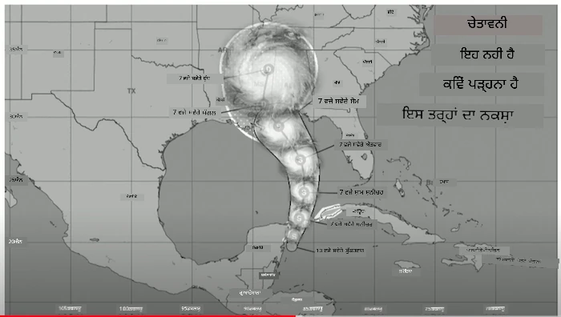
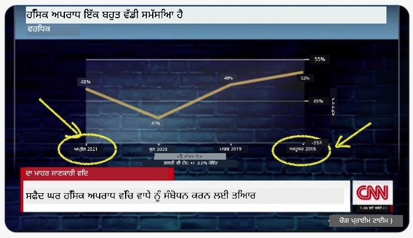
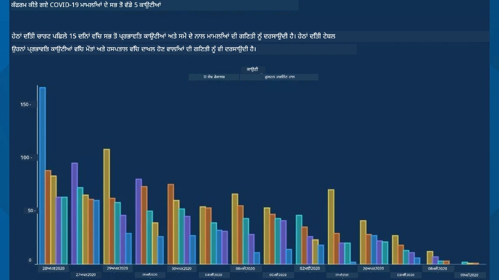
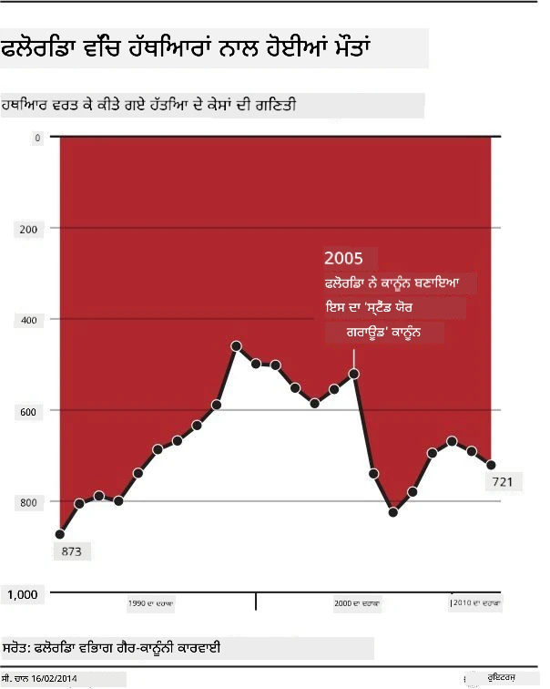
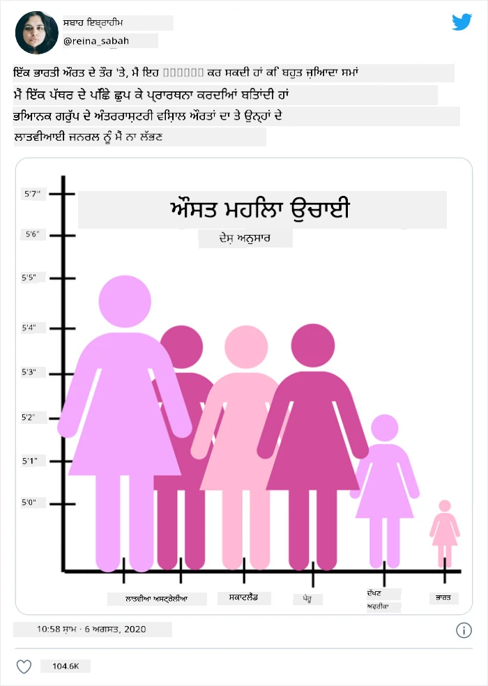
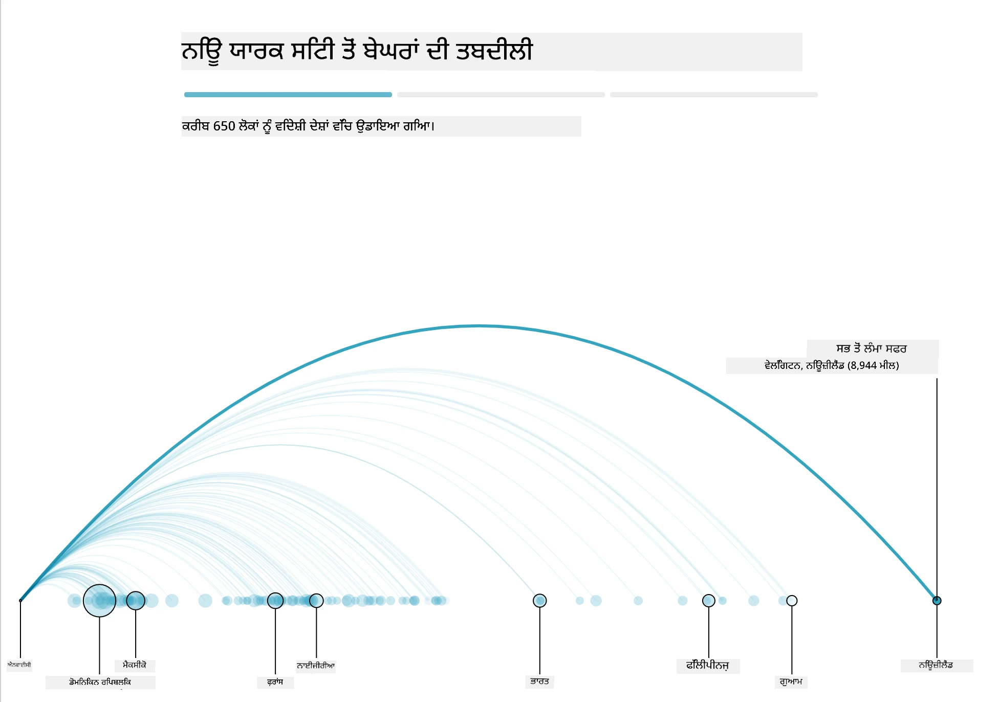
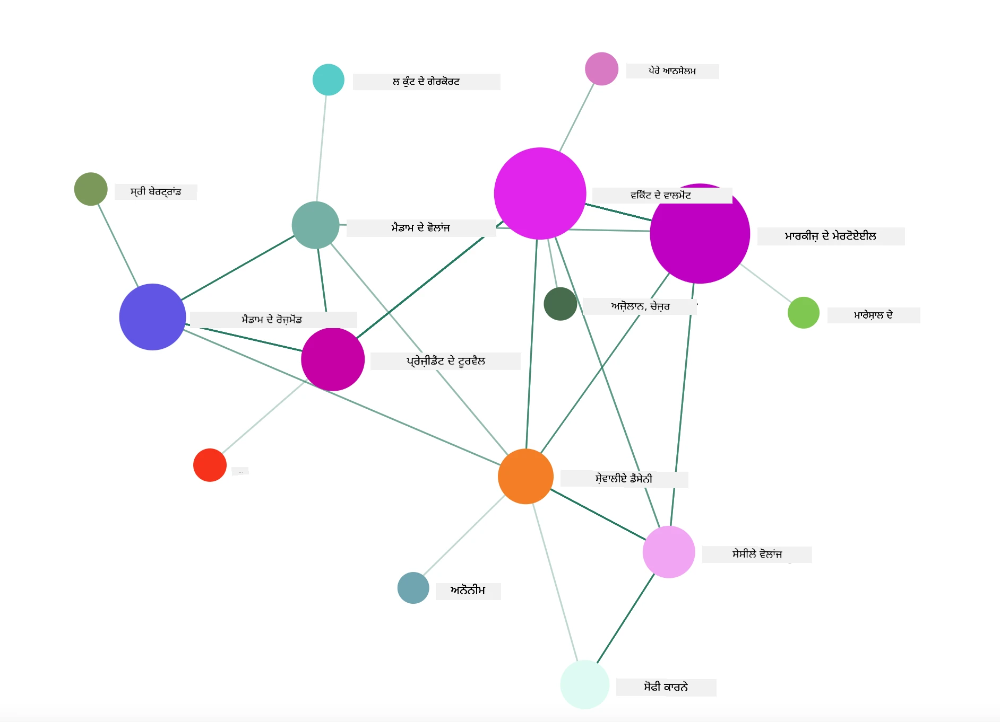

# ਮਾਇਨੇਦਾਰ ਵਿਜ਼ੂਅਲਾਈਜ਼ੇਸ਼ਨ ਬਣਾਉਣਾ

| ਵੱਲੋਂ ](../../sketchnotes/13-MeaningfulViz.png)|
|:---:|
| ਮਾਇਨੇਦਾਰ ਵਿਜ਼ੂਅਲਾਈਜ਼ੇਸ਼ਨ - _ਸਕੈਚਨੋਟ [@nitya](https://twitter.com/nitya) ਵੱਲੋਂ_ |

> "ਜੇ ਤੁਸੀਂ ਡਾਟਾ ਨੂੰ ਕਾਫ਼ੀ ਦੇਰ ਤੱਕ ਤੜપਾਓਗੇ, ਤਾਂ ਇਹ ਕੁਝ ਵੀ ਕਬੂਲ ਕਰ ਲਵੇਗਾ" -- [ਰੋਨਾਲਡ ਕੋਜ਼](https://en.wikiquote.org/wiki/Ronald_Coase)

ਡਾਟਾ ਸਾਇੰਟਿਸਟ ਦੇ ਬੁਨਿਆਦੀ ਹੁਨਰਾਂ ਵਿੱਚੋਂ ਇੱਕ ਮਾਇਨੇਦਾਰ ਡਾਟਾ ਵਿਜ਼ੂਅਲਾਈਜ਼ੇਸ਼ਨ ਬਣਾਉਣ ਦੀ ਸਮਰੱਥਾ ਹੈ ਜੋ ਤੁਹਾਡੇ ਸਵਾਲਾਂ ਦੇ ਜਵਾਬ ਦੇਣ ਵਿੱਚ ਸਹਾਇਤਾ ਕਰੇ। ਆਪਣਾ ਡਾਟਾ ਵਿਜ਼ੂਅਲਾਈਜ਼ ਕਰਨ ਤੋਂ ਪਹਿਲਾਂ, ਤੁਹਾਨੂੰ ਇਹ ਯਕੀਨੀ ਬਨਾਣਾ ਚਾਹੀਦਾ ਹੈ ਕਿ ਉਹ ਸਾਫ਼ ਅਤੇ ਤਿਆਰ ਹੈ, ਜਿਵੇਂ ਕਿ ਤੁਸੀਂ ਪਿਛਲੇ ਪਾਠਾਂ ਵਿੱਚ ਕੀਤਾ ਸੀ। ਇਸ ਤੋਂ ਬਾਅਦ, ਤੁਸੀਂ ਸੋਚ ਸਕਦੇ ਹੋ ਕਿ ਡਾਟਾ ਨੂੰ ਕਿਵੇਂ ਸਭ ਤੋਂ ਵਧੀਆ ਪੇਸ਼ ਕੀਤਾ ਜਾਵੇ।

ਇਸ ਪਾਠ ਵਿੱਚ, ਤੁਸੀਂ ਸਮੀਖਿਆ ਕਰੋਗੇ:

1. ਸਹੀ ਚਾਰਟ ਕਿਸਮ ਕਿਵੇਂ ਚੁਣੀ ਜਾਵੇ
2. ਧੋਖਾਧੜੀ ਵਾਲੇ ਚਾਰਟਿੰਗ ਤੋਂ ਬਚਾਅ
3. ਰੰਗ ਨਾਲ ਕੰਮ ਕਰਨ ਦੇ ਤਰੀਕੇ
4. ਪਾਠਯੋਗਤਾ ਲਈ ਆਪਣੇ ਚਾਰਟਾਂ ਨੂੰ ਸਜਾਉਣਾ
5. ਐਨੀਮੇਟਿਡ ਜਾਂ 3D ਚਾਰਟਿੰਗ ਹੱਲ ਬਣਾਉਣਾ
6. ਰਚਨਾਤਮਕ ਵਿਜ਼ੂਅਲਾਈਜ਼ੇਸ਼ਨ ਬਣਾਉਣਾ

## [ਪ੍ਰੀ-ਲੈਕਚਰ ਕੁਜ਼](https://ff-quizzes.netlify.app/en/ds/quiz/24)

## ਸਹੀ ਚਾਰਟ ਕਿਸਮ ਚੁਣੋ

ਪਿਛਲੇ ਪਾਠਾਂ ਵਿੱਚ, ਤੁਸੀਂ Matplotlib ਅਤੇ Seaborn ਦੀ ਵਰਤੋਂ ਕਰ ਕੇ ਹਰ ਤਰ੍ਹਾਂ ਦੀਆਂ ਦਿਲਚਸਪ ਡਾਟਾ ਵਿਜ਼ੂਅਲਾਈਜ਼ੇਸ਼ਨ ਬਣਾਉਣ ਦਾ ਅਨੁਭਵ ਕੀਤਾ। ਆਮ ਤੌਰ 'ਤੇ, ਤੁਸੀਂ ਆਪਣੀ ਪੂਛੇ ਗਈ ਸਵਾਲ ਲਈ [ਸਹੀ ਕਿਸਮ ਦਾ ਚਾਰਟ](https://chartio.com/learn/charts/how-to-select-a-data-vizualization/) ਇਸ ਟੇਬਲ ਦੀ ਵਰਤੋਂ ਕਰਕੇ ਚੁਣ ਸਕਦੇ ਹੋ:

| ਤੁਹਾਨੂੰ ਚਾਹੀਦਾ ਹੈ:            | ਤੁਹਾਨੂੰ ਵਰਤਣਾ ਚਾਹੀਦਾ ਹੈ:    |
| ----------------------------- | ---------------------------- |
| ਸਮੇਂ ਦੇ ਨਾਲ ਡਾਟਾ ਰੁਝਾਨ ਦਿਖਾਓ  | ਲਾਈਨ                         |
| ਸ਼੍ਰੇਣੀਆਂ ਦੀ ਤੁਲਨਾ ਕਰੋ          | ਬਾਰ, ਪਾਈ                     |
| ਕੁੱਲ ਦੀ ਤੁਲਨਾ ਕਰੋ               | ਪਾਈ, ਸਟੈਕਡ ਬਾਰ              |
| ਸੰਬੰਧ ਦਿਖਾਓ                  | ਸਕੈਟਰ, ਲਾਈਨ, ਫੇਸੇਟ, ਡੁਅਲ ਲਾਈਨ |
| ਵੰਡ ਦਿਖਾਓ                    | ਸਕੈਟਰ, ਹਿਸਟੋਗ੍ਰਾਮ, ਬਾਕਸ       |
| ਅਨੁਪਾਤ ਦਿਖਾਓ                 | ਪਾਈ, ਡੋਨਟ, ਵਾਫਲ               |

> ✅ ਤੁਹਾਡੇ ਡਾਟਾ ਦੀ ਬਣਤਰ ਦੇ ਆਧਾਰ ਤੇ, ਤੁਹਾਨੂੰ ਇਹ ਸਹੀ ਚਾਰਟ ਚਲਾਉਣ ਲਈ ਟੈਕਸਟ ਤੋਂ ਨੰਬਰਾਂ ਵਿੱਚ ਬਦਲਣਾ ਪੈ ਸਕਦਾ ਹੈ।

## ਧੋਖਾਧੜੀ ਤੋਂ ਬਚੋ

ਜੇਕਰ ਡਾਟਾ ਸਾਇੰਟਿਸਟ ਸਹੀ ਡਾਟਾ ਲਈ ਸਹੀ ਚਾਰਟ ਚੁਣਦਾ ਵੀ ਹੈ, ਤਾਂ ਵੀ ਡਾਟਾ ਨੂੰ ਦਰਸਾਉਣ ਦੇ ਅਨੇਕ ਤਰੀਕੇ ਹਨ ਜਿਹੜੇ ਕੁਝ ਸਬੂਤ ਸਾਬਿਤ ਕਰਨ ਲਈ ਵਰਤੇ ਜਾਂਦੇ ਹਨ, ਪਰ ਜ਼ਿਆਦਾਤਰ ਵਾਰ ਇਹ ਡਾਟਾ ਨੂੰ ਖ਼ੁਦ ਨੁਕਸਾਨ ਪਹੁੰਚਾਉਂਦੇ ਹਨ। ਧੋਖਾਧੜੀ ਵਾਲੇ ਚਾਰਟ ਅਤੇ ਇੰਫੋਗ੍ਰਾਫਿਕਸ ਦੇ ਅਨੇਕ ਉਦਾਹਰਨ ਮੌਜੂਦ ਹਨ!

[](https://www.youtube.com/watch?v=oX74Nge8Wkw "How charts lie")

> 🎥 ਧੋਖਾਧੜੀ ਚਾਰਟਾਂ ਬਾਰੇ ਕਾਨਫਰੰਸ ਟਾਕ ਲਈ ਉਪਰ ਤਸਵੀਰ 'ਤੇ ਕਲਿੱਕ ਕਰੋ

ਇਸ ਚਾਰਟ ਨੇ X ਅਕਸ ਨੂੰ ਉਲਟਾਇਆ ਹੈ ਤਾਂ ਜੋ ਸੱਚਾਈ ਦਾ ਉਲਟਾ ਦਰਸਾਇਆ ਜਾ ਸਕੇ, ਜਿਸ ਦੀ ਪ੍ਰਮਾਣਿਕਤਾ ਤਾਰੀਖ ਤੇ ਆਧਾਰਿਤ ਹੈ:



[ਇਹ ਚਾਰਟ](https://media.firstcoastnews.com/assets/WTLV/images/170ae16f-4643-438f-b689-50d66ca6a8d8/170ae16f-4643-438f-b689-50d66ca6a8d8_1140x641.jpg) ਹੋਰ ਵੀ ਧੋਖੇਬਾਜ਼ ਹੈ, ਕਿਉਂਕਿ ਨਜ਼ਰ ਸੱਜੇ ਪਾਸੇ ਖਿੱਚੀ ਜਾਂਦੀ ਹੈ ਇਹ ਨਤੀਜਾ ਕੱਢਣ ਲਈ ਕਿ ਸਮੇਂ ਦੇ ਨਾਲ COVID ਕੇਸ ਵੱਖ-ਵੱਖ ਕਾਊਂਟੀਆਂ ਵਿੱਚ ਘਟੇ ਹਨ। ਅਸਲ ਵਿੱਚ, ਜੇ ਤੁਸੀਂ ਕਦੇ ਟਾਰੀਕਾਂ ਨੂੰ ਧਿਆਨ ਨਾਲ ਵੇਖੋ ਤਾਂ ਤੁਸੀਂ ਲੱਭੋਂਗੇ ਕਿ ਉਹ ਉਲਟੇ-ਪੁਲਟੇ ਕਰ ਦਿੱਤੇ ਗਏ ਹਨ ਜੋ ਕਿ ਝੂਠੇ ਘੱਟਦਰੇ ਰੁਝਾਨ ਦਿਖਾਉਂਦੇ ਹਨ।



ਇਹ ਮਸ਼ਹੂਰ ਉਦਾਹਰਨ ਰੰਗ AND ਫਲਿੱਪ ਕੀਤਾ Y ਅਕਸ ਵਰਤਦਿਆਂ ਧੋਖੇਬਾਜ਼ੀ ਕਰਦੀ ਹੈ: ਬੰਦੂਕ-ਮਿਤਰਲਿੰਗ ਨਾਲ ਸੰਬੰਧਿਤ ਕਾਨੂੰਨ ਪਾਸ ਹੋਣ ਤੋਂ ਬਾਅਦ ਬੰਦੂਕ ਮੌਤਾਂ ਵਿੱਚ ਵਾਧਾ ਹੋਇਆ ਹੈ, ਇਹ ਖ਼ਿਆਲ ਬਿਲਕੁਲ ਗਲਤ ਹੈ, ਨਜ਼ਰ ਨੂੰ ਕਹਿੰਦੀ ਹੈ ਕਿ ਵਿਰੁੱਧ ਹੈ:



ਇਹ ਵਿਲੱਖਣ ਚਾਰਟ ਦਰਸਾਉਂਦਾ ਹੈ ਕਿ ਅਨੁਪਾਤ ਨੂੰ ਕਿਵੇਂ ਮਨਮਾਨੀ ਤਰੀਕੇ ਨਾਲ ਤਬਦੀਲ ਕੀਤਾ ਜਾ ਸਕਦਾ ਹੈ,ਮਜ਼ੇਦਾਰ ਪ੍ਰਭਾਵ ਦੇ ਨਾਲ:



ਬੇਮਿਸਾਲ ਦੀ ਤੁਲਨਾ ହଓਰ ਇੱਕ ਛਲਣਾਂ ਭਰੀ ਚਾਲ ਹੈ। ਇੱਕ [ਸ਼ਾਨਦਾਰ ਵੈੱਬਸਾਈਟ](https://tylervigen.com/spurious-correlations) ਹੈ ਜੋ ਕਿ 'ਝੂਠੇ ਸੰਬੰਧਾਂ' ਬਾਰੇ ਦਿਖਾਉਂਦੀ ਹੈ ਜਿੱਥੇ ਮਾਰਜਰੀਨ ਦੀ ਖਪਤ ਅਤੇ ਮਾਈਨ ਵਿੱਚ طلاق ਦਰ ਦੇ 'ਤੱਥਾਂ' ਦਾ ਤੁਲਨਾਤਮਕ ਤੌਰ ਤੇ ਪ੍ਰਦਰਸ਼ਨ ਹੁੰਦਾ ਹੈ। ਇੱਕ Reddit ਗਰੁੱਪ ਵੀ ਡਾਟਾ ਦੇ [ਭਿਆਨਕ ਵਰਤੋਂ](https://www.reddit.com/r/dataisugly/top/?t=all) ਨੂੰ ਇਕੱਠਾ ਕਰਦਾ ਹੈ।

ਇਹ ਸਮਝਣਾ ਜਰੂਰੀ ਹੈ ਕਿ ਕਿਵੇਂ ਨਜ਼ਰ ਨੂੰ ਬਹੁਤ ਆਸਾਨੀ ਨਾਲ ਧੋਖੇ ਵਿੱਚ ਰੱਖਿਆ ਜਾ ਸਕਦਾ ਹੈ ਧੋਖੇਬਾਜ਼ ਚਾਰਟਾਂ ਦੁਆਰਾ। ਭਾਵੇਂ ਡਾਟਾ ਸਾਇੰਟਿਸਟ ਦੀ ਨीयਤ ਚੰਗੀ ਹੋਵੇ, ਖਰਾਬ ਕਿਸਮ ਦੇ ਚਾਰਟ, ਜਿਵੇਂ ਪਾਈ ਚਾਰਟ ਜੋ ਬਹੁਤ ਸਾਰੀਆਂ ਸ਼੍ਰੇਣੀਆਂ ਵਿਖਾ ਰਹੇ ਹੋਣ, ਧੋਖੇਬਾਜ਼ ਹੋ ਸਕਦੇ ਹਨ।

## ਰੰਗ

ਤੁਸੀਂ ਉਪਰ 'ਫ਼ਲੋਰਿਡਾ ਗਨ ਵਾਇਲੈਂਸ' ਚਾਰਟ ਵਿੱਚ ਦੇਖਿਆ ਕਿ ਕਿਵੇਂ ਰੰਗ ਚਾਰਟਾਂ ਨੂੰ ਇੱਕ ਵਾਧੂ ਮਾਇਨੇਦਾਰ ਪਰਤ ਮੁਹੱਈਆ ਕਰਦਾ ਹੈ, ਖਾਸ ਕਰਕੇ ਜਿਹੜੇ Matplotlib ਅਤੇ Seaborn ਵਰਗੀਆਂ ਲਾਇਬ੍ਰੇਰੀਆਂ ਦੀ ਵਰਤੋਂ ਨਾਲ ਨਹੀਂ ਬਣਾਏ ਗਏ। ਜੇ ਤੁਸੀਂ ਹੱਥ ਨਾਲ ਚਾਰਟ ਬਣਾ ਰਹੇ ਹੋ, ਤਾਂ ਥੋੜ੍ਹਾ ਬਹੁਤ [ਰੰਗ ਸਿਧਾਂਤ](https://colormatters.com/color-and-design/basic-color-theory) ਦਾ ਅਧਿਐਨ ਕਰੋ।

> ✅ ਚਾਰਟਿੰਗ ਦੇ ਸਮੇਂ ਇਹ ਧਿਆਨ ਵਿੱਚ ਰੱਖੋ ਕਿ ਪਹੁੰਚਯੋਗਤਾ ਵਿਜ਼ੂਅਲਾਈਜ਼ੇਸ਼ਨ ਦਾ ਇੱਕ ਮਹੱਤਵਪੂਰਣ ਪੱਖ ਹੈ। ਕਈ ਵਰਤੋਂਕਾਰ ਰੰਗ ਅੰਨ੍ਹੇ ਹੋ ਸਕਦੇ ਹਨ - ਕੀ ਤੁਹਾਡਾ ਚਾਰਟ ਵਿਜ਼ੂਅਲ ਇੰਨੀਸ਼ੀਅਲਮੈਂਟ ਵਾਲੇ ਵਰਤੋਂਕਾਰਾਂ ਲਈ ਠੀਕ ਦਿਖਦਾ ਹੈ?

ਆਪਣੇ ਚਾਰਟ ਲਈ ਰੰਗਾਂ ਦੀ ਚੋਣ ਕਰਦਿਆਂ ਸੰਭਾਲ ਕੇ ਵਰਤੋ, ਕਿਉਂਕਿ ਰੰਗ ਤਰਕਸੰਗਤ ਅਰਥ ਦਿੰਦਾ ਹੈ ਜੋ ਤੁਸੀਂ ਨਹੀਂ ਦੇਣਾ ਚਾਹੁੰਦੇ। 'ਵੱਡੇ 'ਪਿੰਕ ਲੇਡੀਆਂ' ਉਪਰ 'ਊਚਾਈ' ਚਾਰਟ ਵਿੱਚ ਇੱਕ ਵੱਖਰਾ 'ਮਹਿਲਾ' ਤੱਤ ਦੇ ਅਰਥ ਜੋੜਦਾ ਹੈ ਜੋ ਖ਼ੁਦ ਚਾਰਟ ਦੇ ਵਿਲੱਖਣਤਾ ਵਿੱਚ ਵਾਧਾ ਕਰਦਾ ਹੈ।

ਜਦੋਂ ਕਿ [ਰੰਗਾਂ ਦੇ ਅਰਥ](https://colormatters.com/color-symbolism/the-meanings-of-colors) ਦੁਨੀਆ ਦੇ ਵੱਖ-ਵੱਖ ਹਿੱਸਿਆਂ ਵਿੱਚ ਵੱਖਰੇ ਹੋ ਸਕਦੇ ਹਨ ਅਤੇ ਆਪਣੀ ਛਾਇਆ ਦੇ ਅਨੁਸਾਰ ਬਦਲਦੇ ਰਹਿੰਦੇ ਹਨ, ਆਮ ਤੌਰ 'ਤੇ ਰੰਗਾਂ ਦੇ ਅਰਥ ਸ਼ਾਮਲ ਹਨ:

| ਰੰਗ      | ਅਰਥ                  |
| -------- | -------------------- |
| ਲਾਲ       | ਸ਼ਕਤੀ                  |
| ਨੀਲਾ      | ਭਰੋਸਾ, ਵਫ਼ਾਦਾਰੀ       |
| ਪੀਲਾ      | ਖੁਸ਼ੀ, ਸਾਵਧਾਨੀ         |
| ਹਰਾ       | ਪਰਿਆਵਰਣ, ਕਿਸਮਤ,ਈਰਖਾ  |
| ਜਾਮਨੀ    | ਖੁਸ਼ੀ                  |
| ਨਾਰੰਗੀ   | ਜ਼ਿੰਦਾ ਦਿਲੀ             |

ਜੇ ਤੁਹਾਨੂੰ ਕਸਟਮ ਰੰਗਾਂ ਨਾਲ ਚਾਰਟ ਬਣਾਉਣ ਦਾ ਕੰਮ ਦਿੱਤਾ ਗਇਆ ਹੈ, ਤਾਂ ਯਕੀਨੀ ਬਣਾਓ ਕਿ ਤੁਹਾਡੇ ਚਾਰਟ ਦੋਹਾਂ ਪਹੁੰਚਯੋਗ ਹਨ ਅਤੇ ਤੁਸੀਂ ਜਿਸ ਅਰਥ ਨੂੰ ਪ੍ਰਗਟਾਉਣਾ ਚਾਹੁੰਦੇ ਹੋ ਰੰਗ ਉਸ ਨਾਲ ਸੰਗਤਿਤ ਹੈ।

## ਪਾਠਯੋਗਤਾ ਲਈ ਆਪਣੇ ਚਾਰਟਾਂ ਦੀ ਸ਼ੈਲੀ

ਚਾਰਟ ਮਾਇਨੇਦਾਰ ਨਹੀਂ ਹੁੰਦੇ ਜੇ ਉਹ ਪੜ੍ਹਨ ਯੋਗ ਨਾ ਹੋਣ! ਆਪਣੀ ਡਾਟਾ ਦੇ ਅਨੁਸਾਰ ਆਪਣੇ ਚਾਰਟ ਦੀ ਚੌੜਾਈ ਅਤੇ ਲੰਬਾਈ ਦਾ ਆਕਾਰ ਸਹੀ ਸਮਝ ਕੇ ਬਦਲੋ। ਜੇ ਕੋਈ ਇਕ ਵੈਰੀਏਬਲ (ਜਿਵੇਂ ਸਾਰੇ 50 ਰਾਜ) ਦਰਸਾਉਣਾ ਹੈ, ਤਾਂ ਉਹਨੂੰ ਸੰਭਵ ਹੋਵੇ ਤਾਂ Y ਅਕਸ 'ਤੇ ਵਰਟੀਕਲ ਦਿਖਾਓ ਤਾਂ ਜੋ ਹਵਾਈ ਸਕ੍ਰੋਲ ਕਰਨ ਵਾਲਾ ਚਾਰਟ ਨਾ ਬਣੇ।

ਆਪਣੇ ਅਕਸਾਂ ਨੂੰ ਲੇਬਲ ਕਰੋ, ਜੇ ਲੋੜ ਹੋਵੇ ਤਾਂ ਲੇਜੰਡ ਦਿਓ ਅਤੇ ਡਾਟਾ ਨੂੰ ਵਧੀਆ ਸਮਝਣ ਲਈ ਟੂਲਟਿਪ ਪ੍ਰਦਾਨ ਕਰੋ।

ਜੇ ਤੁਹਾਡਾ ਡਾਟਾ ਟੈਕਸਟਵਾਲਾ ਅਤੇ ਲੰਬਾ ਹੈ X ਅਕਸ 'ਤੇ, ਤਾਂ ਟੈਕਸਟ ਨੂੰ ਪੜ੍ਹਨ ਯੋਗ ਬਣਾਉਣ ਲਈ ਟੈਕਸਟ ਨੂੰ ਥੋੜ੍ਹਾ ਕਿਹਾੜਾ ਕੀਤਾ ਜਾ ਸਕਦਾ ਹੈ। [Matplotlib](https://matplotlib.org/stable/tutorials/toolkits/mplot3d.html) 3D ਪਲਾਟਿੰਗ ਪੇਸ਼ ਕਰਦਾ ਹੈ, ਜੇ ਤੁਹਾਡਾ ਡਾਟਾ ਇਸਨੂੰ ਸਹਾਇਤਾ ਕਰਦਾ ਹੈ। `mpl_toolkits.mplot3d` ਦੀ ਵਰਤੋਂ ਕਰਕੇ ਪੇਚੀਦਾ ਡਾਟਾ ਵਿਜ਼ੂਅਲਾਈਜ਼ੇਸ਼ਨ ਤਿਆਰ ਕੀਤੇ ਜਾ ਸਕਦੇ ਹਨ।


## ਐਨੀਮੇਸ਼ਨ ਅਤੇ 3D ਚਾਰਟ ਪ੍ਰਦਰਸ਼ਨ

ਅੱਜ ਦੇ ਸਭ ਤੋਂ ਵਧੀਆ ਡਾਟਾ ਵਿਜ਼ੂਅਲਾਈਜ਼ੇਸ਼ਨ ਐਨੀਮੇਟਿਡ ਹੁੰਦੇ ਹਨ। Shirley Wu ਨੇ D3 ਨਾਲ ਸ਼ਾਨਦਾਰ ਵਿਜ਼ੂਅਲਾਈਜ਼ੇਸ਼ਨ ਬਣਾਈਆਂ ਹਨ, ਜਿਵੇਂ ਕਿ '[ਫਿਲਮ ਫੁੱਲ](http://bl.ocks.org/sxywu/raw/d612c6c653fb8b4d7ff3d422be164a5d/)', ਜਿੱਥੇ ਹਰ ਫੁੱਲ ਇੱਕ ਫਿਲਮ ਦੀ ਵਿਜ਼ੂਅਲਾਈਜ਼ੇਸ਼ਨ ਹੈ। ਦੂਜਾ ਉਦਾਹਰਨ Guardian ਲਈ 'bussed out' ਹੈ, ਜੋ ਕਿ ਇੱਕ ਇੰਟਰਐਕਟਿਵ ਤਜਰਬਾ ਹੈ ਜੋ ਵਿਜ਼ੂਅਲਾਈਜ਼ੇਸ਼ਨ Greensock ਅਤੇ D3 ਨਾਲ ਜੋੜਦਾ ਹੈ ਤੇ ਇੱਕ ਸਕਰੋਲਟੈਲਿੰਗ ਲੇਖ ਦੇ ਰੂਪ ਵਿੱਚ ਦਿਖਾਉਂਦਾ ਹੈ ਕਿ NYC ਕਿਵੇਂ ਆਪਣੇ ਬੇਘਰ ਲੋਕਾਂ ਨੂੰ ਸਿਟੀ ਤੋਂ ਬੱਸ ਰਾਹੀਂ ਭੇਜਦਾ ਹੈ।



> "Bussed Out: How America Moves its Homeless" [Guardian](https://www.theguardian.com/us-news/ng-interactive/2017/dec/20/bussed-out-america-moves-homeless-people-country-study) ਵੱਲੋਂ। ਵਿਜ਼ੂਅਲਾਈਜ਼ੇਸ਼ਨ ਨਾਦੀਹ ਬ੍ਰੇਮਰ ਅਤੇ ਸ਼ਿਰਲੀ ਵੂ ਵੱਲੋਂ।

ਇਹ ਪਾਠ ਇਹ ਸ਼ਕਤਿਸ਼ਾਲੀ ਵਿਜ਼ੂਅਲਾਈਜ਼ੇਸ਼ਨ ਲਾਇਬ੍ਰੇਰੀਜ਼ ਨੂੰ ਵਿਸਥਾਰ ਨਾਲ Sikhāṇ ਲਈ ਕਾਫ਼ੀ ਨਹੀਂ ਹੈ, ਪਰ Vue.js ਐਪ ਵਿੱਚ D3 ਨਾਲ ਹੱਥ ਆਜ਼ਮਾਉਣ ਦੀ ਕੋਸ਼ਿਸ਼ ਕਰੋ ਜੋ ਕਿਤਾਬ "Dangerous Liaisons" ਦੀ ਇੱਕ ਐਨੀਮੇਟਿਡ ਸੋਸ਼ਲ ਨੈੱਟਵਰਕ ਵਿਜ਼ੂਅਲਾਈਜ਼ੇਸ਼ਨ ਦਰਸਾਉਂਦਾ ਹੈ।

> "Les Liaisons Dangereuses" ਇੱਕੋਂ ਕ਼ਤਬੀ ਨਾਵਲ ਹੈ, ਜਾਂ ਪੱਤਰਾਂ ਦੀ ਇੱਕ ਸੀਰੀਜ਼ ਵਜੋਂ ਪੇਸ਼ ਕੀਤਾ ਗਇਆ ਨਾਵਲ। ਇਹ 1782 ਵਿੱਚ Choderlos de Laclos ਵੱਲੋਂ ਲਿਖਿਆ ਗਿਆ, ਜੋ ਕਿ 18ਵੀਂ ਸਦੀ ਦੇ ਅਖੀਰ ਵਿੱਚ ਫ੍ਰੈਂਚ ਅੰਕਿਤਤਕ ਲੋਕਾਂ ਦੀ ਦੁਰਾਲੇ, ਨੈਤਿਕ ਤੌਰ 'ਤੇ ਖ਼ਰਾਬ ਸਿਆਸੀ ਚਾਲਾਂ ਦੀ ਕਹਾਣੀ ਬਿਆਨ ਕਰਦਾ ਹੈ। Vicomte de Valmont ਅਤੇ Marquise de Merteuil ਮੁੱਖ ਕਿਰਦਾਰ ਹਨ। ਦੋਵੇਂ ਅੰਤ ਵਿੱਚ ਮਰਨ ਵਾਲੇ ਹਨ ਪਰ ਆਪਣੇ ਸਮਾਜਿਕ ਨੁਕਸਾਨ ਖੜਾ ਕਰਦੇ ਹਨ। ਨਾਵਲ ਆਪਣੇ ਵਾਸਤੇ ਵੱਖ ਵੱਖ ਲੋਕਾਂ ਨੂੰ ਲਿਖੇ ਪੱਤਰਾਂ ਦੇ ਜ਼ਰੀਏ ਸਾਜ਼ਿਸ਼ਾਂ ਜਾਂ ਮੁਸ਼ਕਲਾਂ ਬਣਾਉਂਦਾ ਹੈ। ਇਹ ਪੱਤਰਾਂ ਦੀ ਵਿਜ਼ੂਅਲਾਈਜ਼ੇਸ਼ਨ ਬਣਾਈਏ ਤਾਂ ਜੋ ਕਹਾਣੀ ਦੇ ਪ੍ਰਮੁੱਖ ਸ਼ਕਸੀਅਤਾਂ ਨੂੰ ਨਜ਼ਰ ਵਿਚ ਲਿਆ ਜਾ ਸਕੇ।

ਤੁਸੀਂ ਇੱਕ ਵੈੱਬ ਐਪ ਬਣਾਉਂਦੇ ਹੋ ਜੋ ਇਸ ਸੋਸ਼ਲ ਨੈੱਟਵਰਕ ਦੀ ਐਨੀਮੇਟਿਡ ਦ੍ਰਿਸ਼ਟੀ ਦਿਖਾਏਗਾ। ਇਹ ਇੱਕ ਲਾਇਬ੍ਰੇਰੀ ਦੀ ਵਰਤੋਂ ਕਰਦਾ ਹੈ ਜੋ Vue.js ਅਤੇ D3 ਦੀ ਵਰਤੋਂ ਕਰਕੇ [ਨੈੱਟਵਰਕ ਦੀ ਵਿਜ਼ੂਅਲ](https://github.com/emiliorizzo/vue-d3-network) ਬਣਾਉਣ ਲਈ ਬਣਾਈ ਗਈ ਹੈ। ਜਦ ਤੇ ਐਪ ਚੱਲ ਰਹੀ ਹੋਵੇ, ਤਦ ਤੁਸੀਂ ਸਕ੍ਰੀਨ 'ਤੇ ਨੋਡ ਹਿਲਾ ਕੇ ਡਾਟਾ ਨੂੰ ਮੁੜ ਸ਼ਫ਼ਲ ਕਰ ਸਕਦੇ ਹੋ।



## ਪ੍ਰੋਜੈਕਟ: D3.js ਵਰਤ ਕੇ ਨੈੱਟਵਰਕ ਦਿਖਾਉਣ ਲਈ ਚਾਰਟ ਬਣਾਓ

> ਇਸ ਪਾਠ ਫੋਲਡਰ ਵਿੱਚ ਇੱਕ `solution` ਫੋਲਡਰ ਹੈ ਜਿੱਥੇ ਤੁਸੀਂ ਮੁਕੰਮਲ ਪ੍ਰੋਜੈਕਟ ਦੇਖ ਸਕਦੇ ਹੋ, ਆਪਣੇ ਹਵਾਲੇ ਲਈ।

1. README.md ਫਾਇਲ ਦੇ ਨਿਰਦੇਸ਼ਾਂ ਦੀ ਪਾਲਣਾ ਕਰੋ ਜੋ starter ਫੋਲਡਰ ਦੀ ਜ਼ੜ੍ਹ ਵਿੱਚ ਹੈ। ਆਪਣੀ ਮਸ਼ੀਨ 'ਤੇ NPM ਅਤੇ Node.js ਚੱਲ ਰਿਹਾ ਹੋਣਾ ਯਕੀਨੀ ਕਰੋ ਆਪਣੇ ਪ੍ਰੋਜੈਕਟ ਦੀਆਂ ਡਿਪੈਂਡੇਨਸੀਜ਼ ਇੰਸਟਾਲ ਕਰਨ ਤੋਂ ਪਹਿਲਾਂ।

2. `starter/src` ਫੋਲਡਰ ਖੋਲ੍ਹੋ। ਤੁਹਾਨੂੰ ਇੱਕ `assets` ਫੋਲਡਰ ਮਿਲੇਗਾ ਜਿੱਥੇ ਨਾਵਲ ਦੇ ਸਾਰੇ ਪੱਤਰਾਂ ਵਾਲਾ ਇੱਕ .json ਫਾਇਲ ਮੌਜੂਦ ਹੈ, ਨੰਬਰਾਂ ਸਮੇਤ, 'to' ਅਤੇ 'from' ਤਾਮੀਲ ਨਾਲ।

3. ਵਿਜ਼ੂਅਲਾਈਜ਼ੇਸ਼ਨ ਯੋਗ ਬਣਾਉਣ ਲਈ `components/Nodes.vue` ਵਿੱਚ ਕੋਡ ਪੂਰਾ ਕਰੋ। `createLinks()` ਨਾਮ ਦੀ ਵਿਧੀ ਲਈ ਉਪਰੋਕਤ ਨੈਸਟਡ ਲੂਪ ਜੋੜੋ।

.json ਆਬਜੈਕਟ ਵਿੱਚੋਂ 'to' ਅਤੇ 'from' ਡਾਟਾ ਕੈਪਚਰ ਕਰਨ ਲਈ ਲੂਪ ਚਲਾਉ, ਅਤੇ `links` ਆਬਜੈਕਟ ਬਣਾਉ ਤਾਂ ਜੋ ਵਿਜ਼ੂਅਲਾਈਜ਼ੇਸ਼ਨ ਲਾਇਬ੍ਰੇਰੀ ਇਸਨੂੰ ਖਪਾ ਸਕੇ:

```javascript
//ਅੱਖਰਾਂ ਵਿੱਚ ਲੂਪ ਕਰੋ
      let f = 0;
      let t = 0;
      for (var i = 0; i < letters.length; i++) {
          for (var j = 0; j < characters.length; j++) {
              
            if (characters[j] == letters[i].from) {
              f = j;
            }
            if (characters[j] == letters[i].to) {
              t = j;
            }
        }
        this.links.push({ sid: f, tid: t });
      }
  ```

ਆਪਣਾ ਐਪ ਟਰਮੀਨਲ ਤੋਂ ਚਲਾਓ (npm run serve) ਅਤੇ ਵਿਜ਼ੂਅਲਾਈਜ਼ੇਸ਼ਨ ਦਾ ਆਨੰਦ ਲਓ!

## 🚀 ਚੈਲੇਂਜ

ਇੰਟਰਨੈੱਟ ਦਾ ਜਾਇਜ਼ਾ ਲਵੋ ਅਤੇ ਧੋਖੇਬਾਜ਼ ਵਿਜ਼ੂਅਲਾਈਜ਼ੇਸ਼ਨ ਲੱਭੋ। ਲੇਖਕ ਕਿਸ ਤਰੀਕੇ ਨਾਲ ਯੂਜ਼ਰ ਨੂੰ ਧੋਖਾ ਦਿੱਤਾ ਹੈ, ਅਤੇ ਕੀ ਇਹ ਇਰਾਦੇਵਾਲਾ ਹੈ? ਵਿਜ਼ੂਅਲਾਈਜ਼ੇਸ਼ਨਾਂ ਨੂੰ ਠੀਕ ਕਰਨ ਦੀ ਕੋਸ਼ਿਸ਼ ਕਰੋ ਤਾਂ ਜੋ ਉਹ ਜਿਵੇਂ ਹੋਣੇ ਚਾਹੀਦੇ ਹਨ ਉਵੇਂ ਦਿਖਾਈ ਦੇਣ।

## [ਪੋਸਟ-ਲੈਕਚਰ ਕੁਜ਼](https://ff-quizzes.netlify.app/en/ds/quiz/25)

## ਸਮੀਖਿਆ ਅਤੇ ਖੁਦ ਅਧਿਐਨ

ਇੱਥੇ ਕੁਝ ਲੇਖ ਹਨ ਜੋ ਧੋਖੇਬਾਜ਼ ਡਾਟਾ ਵਿਜ਼ੂਅਲਾਈਜ਼ੇਸ਼ਨ ਬਾਰੇ ਪੜ੍ਹਨ ਲਈ:

https://gizmodo.com/how-to-lie-with-data-visualization-1563576606

http://ixd.prattsi.org/2017/12/visual-lies-usability-in-deceptive-data-visualizations/

ਇਤਿਹਾਸਕ ਸੁੰਪਤੀ ਅਤੇ ਆਰਟਿਫੈਕਟਸ ਲਈ ਇਹ ਦਿਲਚਸਪ ਵਿਜ਼ੂਅਲਾਈਜ਼ੇਸ਼ਨਾਂ ਨੂੰ ਵੇਖੋ:

https://handbook.pubpub.org/

ਇਸ ਲੇਖ ਵਿੱਚ ਦੇਖੋ ਕਿ ਕਿਵੇਂ ਐਨੀਮੇਸ਼ਨ ਤੁਹਾਡੀ ਵਿਜ਼ੂਅਲਾਈਜ਼ੇਸ਼ਨ ਨੂੰ ਸੁਧਾਰ ਸਕਦਾ ਹੈ:

https://medium.com/@EvanSinar/use-animation-to-supercharge-data-visualization-cd905a882ad4

## ਅਸਾਈਨਮੈਂਟ

[ਆਪਣਾ ਖ਼ੁਦ ਦਾ ਕਸਟਮ ਵਿਜ਼ੂਅਲਾਈਜ਼ੇਸ਼ਨ ਬਣਾਓ](assignment.md)

---

<!-- CO-OP TRANSLATOR DISCLAIMER START -->
**ਅਸਵੀਕਾਰੋਪਣ**:
ਇਸ ਦਸਤਾਵੇਜ਼ ਦਾ ਅਨੁਵਾਦ ਏਆਈ ਅਨੁਵਾਦ ਸੇਵਾ [Co-op Translator](https://github.com/Azure/co-op-translator) ਦੀ ਵਰਤੋਂ ਕਰਕੇ ਕੀਤਾ ਗਿਆ ਹੈ। ਜਦੋਂ ਕਿ ਅਸੀਂ ਸਹੀਤਾਵਾਂ ਲਈ ਯਤਨਸ਼ੀਲ ਹਾਂ, ਕਿਰਪਾ ਕਰਕੇ ਧਿਆਨ ਰੱਖੋ ਕਿ ਸਵੈਚਾਲਿਤ ਅਨੁਵਾਦਾਂ ਵਿੱਚ ਗਲਤੀਆਂ ਜਾਂ ਅਸਮੱਤਿਆਵਾਂ ਹੋ ਸਕਦੀਆਂ ਹਨ। ਮੂਲ ਦਸਤਾਵੇਜ਼ ਆਪਣੀ ਮੂਲ ਭਾਸ਼ਾ ਵਿੱਚ ਅਧਿਕਾਰਕ ਸਰੋਤ ਮੰਨਿਆ ਜਾਣਾ ਚਾਹੀਦਾ ਹੈ। ਜਰੂਰੀ ਜਾਣਕਾਰੀ ਲਈ, ਪੇਸ਼ੇਵਰ ਮਨੁੱਖੀ ਅਨੁਵਾਦ ਦੀ ਸਿਫ਼ਾਰਸ਼ ਕੀਤੀ ਜਾਂਦੀ ਹੈ। ਅਸੀਂ ਇਸ ਅਨੁਵਾਦ ਦੇ ਉਪਯੋਗ ਤੋਂ ਪੈਦਾ ਹੋਣ ਵਾਲੀਆਂ ਕਿਸੇ ਵੀ ਗਲਤਫਹਿਮੀਆਂ ਜਾਂ ਗਲਤ ਵਿਆਖਿਆਵਾਂ ਲਈ ਜਵਾਬਦੇਹ ਨਹੀਂ ਹਾਂ।
<!-- CO-OP TRANSLATOR DISCLAIMER END -->