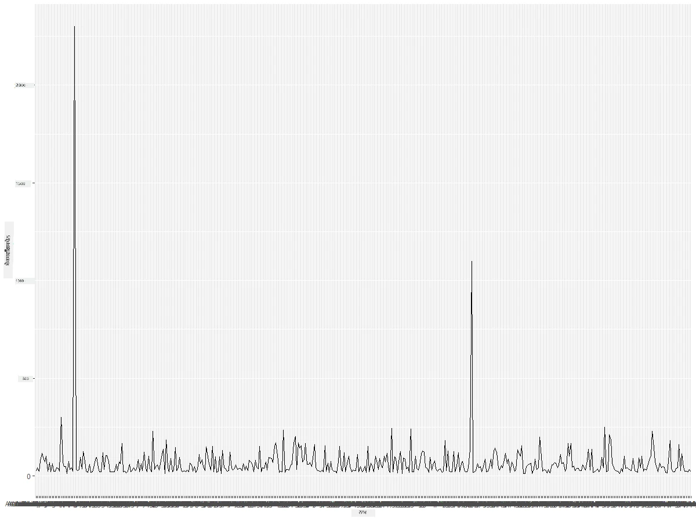
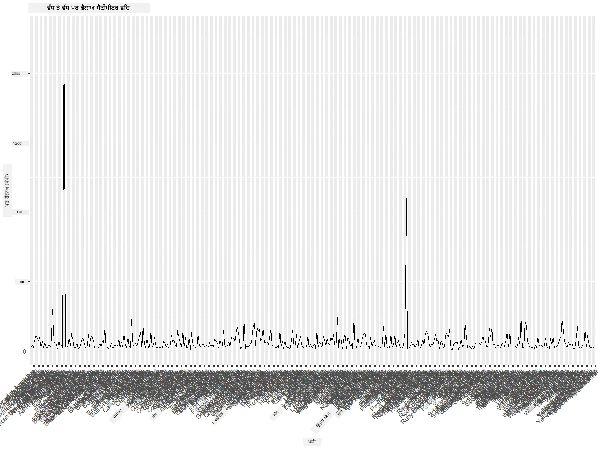
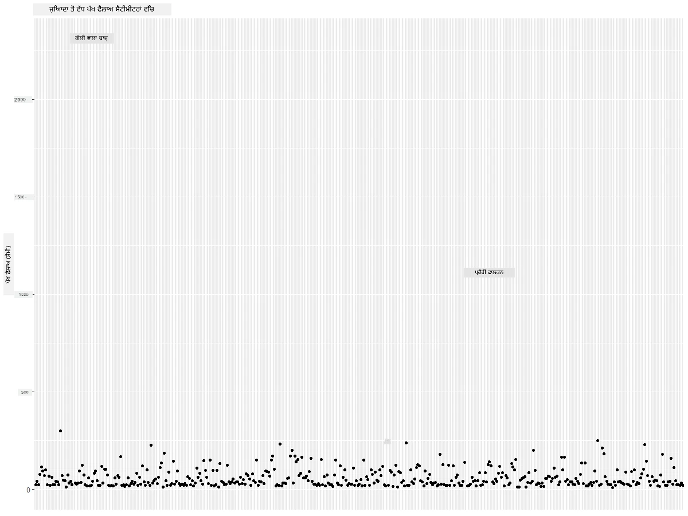
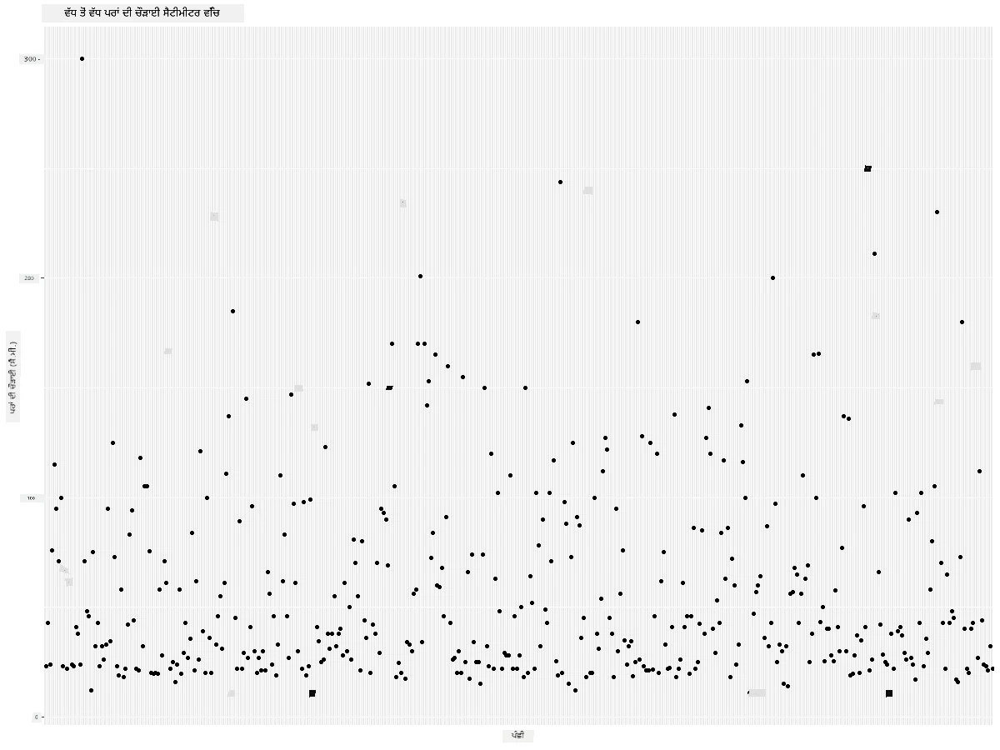
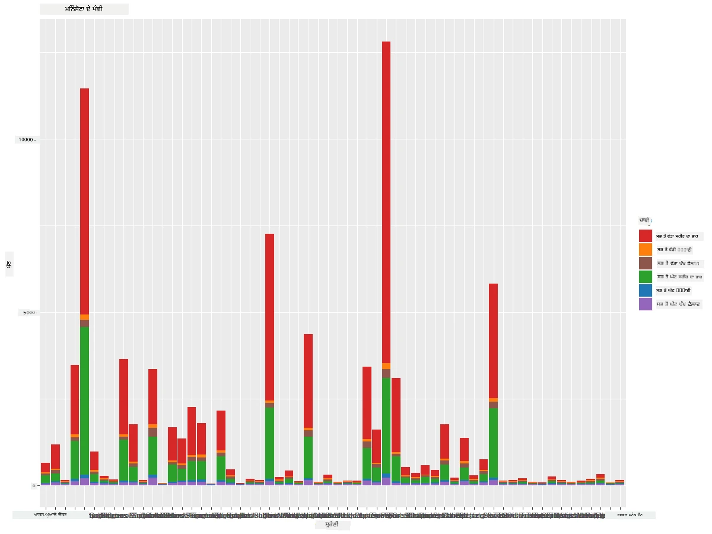
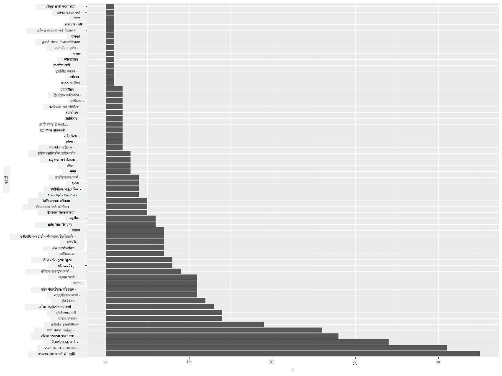
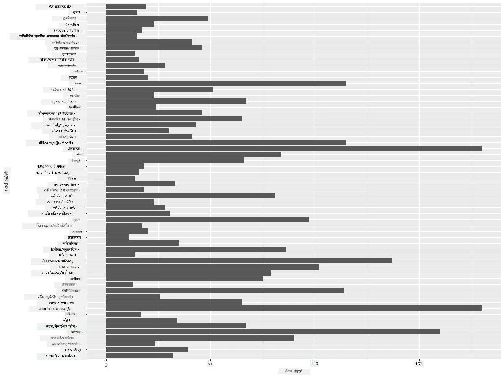
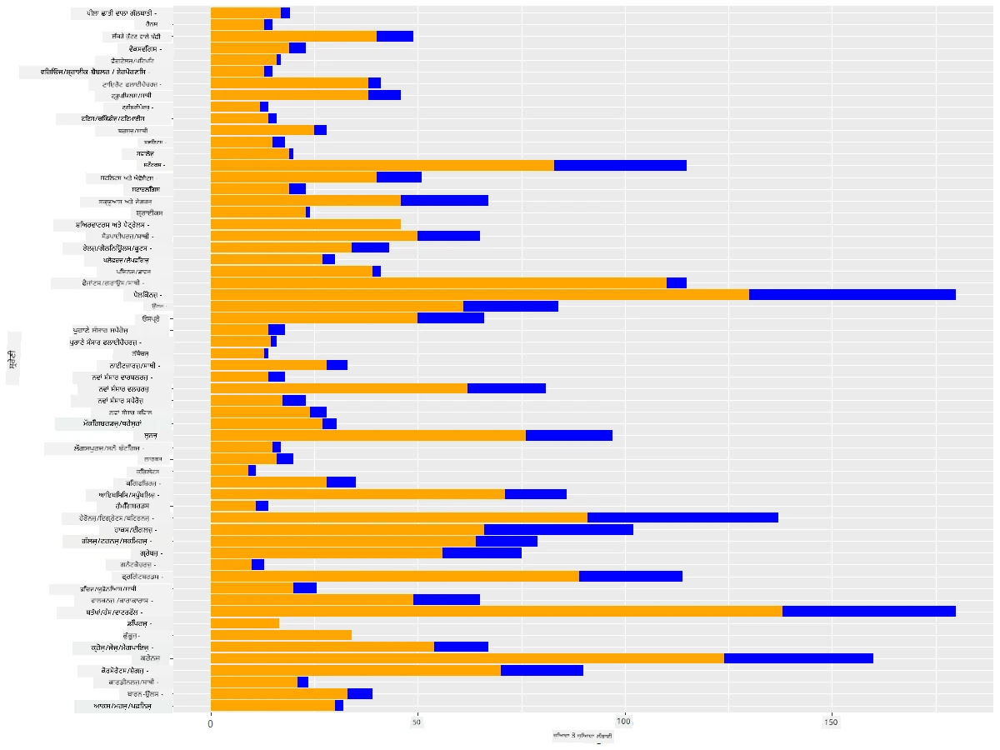

# ਮਾਤਰਾਵਾਂ ਦੀ ਦ੍ਰਿਸ਼ਟੀਕਰਨ
| ](https://github.com/microsoft/Data-Science-For-Beginners/blob/main/sketchnotes/09-Visualizing-Quantities.png)|
|:---:|
| ਮਾਤਰਾਵਾਂ ਦੀ ਦ੍ਰਿਸ਼ਟੀਕਰਨ - _ਸਕੈਚਨੋਟ ਬਾਇ [@nitya](https://twitter.com/nitya)_ |

ਇਸ ਪਾਠ ਵਿੱਚ ਤੁਸੀਂ ਇਹ ਸਿੱਖੋਗੇ ਕਿ ਮਾਤਰਾ ਦੇ ਸੰਕਲਪ ਨੂੰ ਧਿਆਨ ਵਿੱਚ ਰੱਖਦੇ ਹੋਏ ਦਿਲਚਸਪ ਦ੍ਰਿਸ਼ਟੀਕਰਨ ਬਣਾਉਣ ਲਈ R ਪੈਕੇਜਾਂ ਅਤੇ ਲਾਇਬ੍ਰੇਰੀਜ਼ ਦੀ ਵਰਤੋਂ ਕਿਵੇਂ ਕਰੀਦੀ ਹੈ। ਮਿਨੇਸੋਟਾ ਦੇ ਪੰਛੀਆਂ ਬਾਰੇ ਸਾਫ਼ ਕੀਤਾ ਗਿਆ ਡੇਟਾ ਸੈੱਟ ਵਰਤ ਕੇ ਤੁਸੀਂ ਸਥਾਨਕ ਜੰਗਲੀ ਜੀਵਾਂ ਬਾਰੇ ਕਈ ਦਿਲਚਸਪ ਤੱਥ ਸਿੱਖ ਸਕਦੇ ਹੋ।

## [ਪੂਰੇ ਪਾਠ ਤੋਂ ਪਹਿਲਾਂ ਪ੍ਰਸ਼ਨਾਵਲੀ](https://purple-hill-04aebfb03.1.azurestaticapps.net/quiz/16)

## ggplot2 ਨਾਲ ਵਿੰਗਸਪੈਨ ਨੂੰ ਦੇਖੋ
ਵੱਖ-ਵੱਖ ਕਿਸਮਾਂ ਦੇ ਸਧਾਰਣ ਅਤੇ ਸੋਫਿਸਟੀਕੇਟਿਡ ਗ੍ਰਾਫ ਅਤੇ ਚਾਰਟ ਬਣਾਉਣ ਲਈ ਬਹੁਤ ਵਧੀਆ ਲਾਇਬ੍ਰੇਰੀ ਹੈ [ggplot2](https://cran.r-project.org/web/packages/ggplot2/index.html)। ਆਮ ਤੌਰ 'ਤੇ, ਇਨ੍ਹਾਂ ਲਾਇਬ੍ਰੇਰੀਜ਼ ਦੀ ਵਰਤੋਂ ਨਾਲ ਡੇਟਾ ਪਲਾਟ ਕਰਨ ਦੀ ਪ੍ਰਕਿਰਿਆ ਵਿੱਚ ਆਪਣੇ ਡੇਟਾ ਫਰੇਮ ਦੇ ਉਹ ਹਿੱਸੇ ਪਛਾਣਨਾ ਸ਼ਾਮਲ ਹੁੰਦਾ ਹੈ ਜਿਨ੍ਹਾਂ ਨੂੰ ਤੁਸੀਂ ਨਿਸ਼ਾਨਾ ਬਣਾਉਣਾ ਚਾਹੁੰਦੇ ਹੋ, ਡੇਟਾ 'ਤੇ ਲੋੜੀਂਦੇ ਬਦਲਾਅ ਕਰਨਾ, ਇਸਦੇ x ਅਤੇ y ਅੱਖਾਂ ਦੇ ਮੁੱਲ ਨਿਰਧਾਰਿਤ ਕਰਨਾ, ਕਿਸ ਕਿਸਮ ਦਾ ਪਲਾਟ ਦਿਖਾਉਣਾ ਹੈ ਇਸਦਾ ਫੈਸਲਾ ਕਰਨਾ ਅਤੇ ਫਿਰ ਗ੍ਰਾਫ ਦਿਖਾਉਣਾ।

`ggplot2` ਇੱਕ ਸਿਸਟਮ ਹੈ ਜੋ The Grammar of Graphics 'ਤੇ ਆਧਾਰਿਤ ਗ੍ਰਾਫਿਕਸ ਨੂੰ ਹੁਕਮਾਂਤਰੀ ਤੌਰ 'ਤੇ ਬਣਾਉਂਦਾ ਹੈ। [The Grammar of Graphics](https://en.wikipedia.org/wiki/Ggplot2) ਡਾਟਾ ਵਿਜ਼ੁਅਲਾਈਜ਼ੇਸ਼ਨ ਲਈ ਇੱਕ ਆਮ ਯੋਜਨਾ ਹੈ ਜੋ ਗ੍ਰਾਫਾਂ ਨੂੰ ਸਿੰਮੇਟਿਕ ਭਾਗਾਂ ਜਿਵੇਂ ਕਿ ਸਕੇਲ ਅਤੇ ਲੇਅਰ ਵਿੱਚ ਵੰਡਦੀ ਹੈ। ਸਧਾਰਣ ਸ਼ਬਦਾਂ ਵਿੱਚ, ਥੋੜ੍ਹੇ ਕੋਡ ਨਾਲ ਹੀ ਇੱਕ-ਵੈਰੀਏਟ ਜਾਂ ਬਹੁ-ਵੈਰੀਏਟ ਡੇਟਾ ਲਈ ਪਲਾਟ ਅਤੇ ਗ੍ਰਾਫ ਬਣਾਉਣ ਦੀ ਸੌਖਿਆ ਕਾਰਨ `ggplot2` ਸਭ ਤੋਂ ਪ੍ਰਸਿੱਧ ਪੈਕੇਜ ਹੈ ਜੋ R ਵਿੱਚ ਦ੍ਰਿਸ਼ਟੀਕਰਨ ਲਈ ਵਰਤਿਆ ਜਾਂਦਾ ਹੈ। ਯੂਜ਼ਰ `ggplot2` ਨੂੰ ਦੱਸਦਾ ਹੈ ਕਿ ਕਿਵੇਂ ਵੈਰੀਏਬਲ ਨੂੰ ਐਸਥੇਟਿਕਸ ਤੇ ਨਕਸ਼ਾ ਬਣਾਉਣਾ ਹੈ, ਗ੍ਰਾਫਿਕਲ ਅੰਗਾਂ ਦੀ ਵਰਤੋਂ ਕਰਨੀ ਹੈ, ਅਤੇ ਬਾਕੀ ਕੰਮ `ggplot2` ਕਰ ਲੈਂਦਾ ਹੈ।

> ✅ ਪਲਾਟ = ਡੇਟਾ + ਐਸਥੇਟਿਕਸ + ਜਯੋਮੈਟਰੀ
> - ਡੇਟਾ ਦਾ ਅਰਥ ਹੈ ਡੇਟਾ ਸੈੱਟ
> - ਐਸਥੇਟਿਕਸ ਉਹ ਵੈਰੀਏਬਲ ਹਨ ਜਿਨ੍ਹਾਂ ਦਾ ਅਧਿਐਨ ਕੀਤਾ ਜਾ ਰਿਹਾ ਹੈ (x ਅਤੇ y ਵੈਰੀਏਬਲ)
> - ਜਯੋਮੈਟਰੀ ਦਾ ਅਰਥ ਹੈ ਪਲਾਟ ਦੀ ਕਿਸਮ (ਲਾਈਨ ਪਲਾਟ, ਬਾਰ ਪਲਾਟ ਆਦਿ)

ਆਪਣੇ ਡੇਟਾ ਅਤੇ ਕਹਾਣੀ ਦੇ ਅਨੁਆਰ ਸਭ ਤੋਂ ਵਧੀਆ ਜਯੋਮੈਟਰੀ (ਪਲਾਟ ਦੀ ਕਿਸਮ) ਚੁਣੋ।

> - ਰੁਝਾਨਾਂ ਦਾ ਵਿਸ਼ਲੇਸ਼ਣ ਕਰਨ ਲਈ: ਲਾਈਨ, ਕਾਲਮ
> - ਮੁੱਲਾਂ ਦੀ ਤੁਲਨਾ ਕਰਨ ਲਈ: ਬਾਰ, ਕਾਲਮ, ਪਾਈ, ਸਕੈਟਰਪਲਾਟ
> - ਦਿਖਾਉਣ ਲਈ ਕਿ ਹਿਸੇ ਪੂਰੇ ਨਾਲ ਕਿਵੇਂ ਜੁੜਦੇ ਹਨ: ਪਾਈ
> - ਡੇਟਾ ਦੇ ਵੰਡ ਦਰਸਾਉਣ ਲਈ: ਸਕੈਟਰਪਲਾਟ, ਬਾਰ
> - ਮੁੱਲਾਂ ਦੇ ਰਿਸ਼ਤਿਆਂ ਨੂੰ ਦਿਖਾਉਣ ਲਈ: ਲਾਈਨ, ਸਕੈਟਰਪਲਾਟ, ਬਬਲ

✅ ਤੁਸੀਂ ਇਸ ਵੇਰਵੇ ਵਾਲੀ [ਚੀਟਸ਼ੀਟ](https://nyu-cdsc.github.io/learningr/assets/data-visualization-2.1.pdf) ਨੂੰ ਵੀ ggplot2 ਲਈ ਦੇਖ ਸਕਦੇ ਹੋ।

## ਪੰਛੀਆਂ ਦੇ ਵਿੰਗਸਪੈਨ ਮੁੱਲਾਂ 'ਤੇ ਲਾਈਨ ਪਲਾਟ ਬਣਾਓ

R ਕਨਸੋਲ ਖੋਲ੍ਹੋ ਅਤੇ ਡੇਟਾ ਸੈੱਟ ਨੂੰ ਇੰਪੋਰਟ ਕਰੋ।  
> ਨੋਟ: ਡੇਟਾ ਸੈੱਟ ਇਸ ਰੇਪੋ ਦੇ ਮੂਲ `/data` ਫੋਲਡਰ ਵਿੱਚ ਸੰਗ੍ਰਹਿਤ ਹੈ।

ਆਓ ਡੇਟਾ ਸੈੱਟ ਨੂੰ ਇੰਪੋਰਟ ਕਰੀਏ ਅਤੇ ਡੇਟਾ ਦੇ ਸਿਰਲੇਖ (ਸਭ ਤੋਂ ਉੱਪਰੀ 5 ਰੋਜ਼) ਨੂੰ ਵੇਖੀਏ।

```r
birds <- read.csv("../../data/birds.csv",fileEncoding="UTF-8-BOM")
head(birds)
```
ਡੇਟਾ ਦੇ ਸਿਰਲੇਖ ਵਿੱਚ ਟੈਕਸਟ ਅਤੇ ਗਿਣਤੀਆਂ ਦੋਹਾਂ ਮਿਲੀ ਹੋਈਆਂ ਹਨ:

|      | ਨਾਂਮ                        | ਵਿਗਿਆਨਕ ਨਾਂਮ           | ਸ਼੍ਰੇਣੀ                | ਕ੍ਰਮ          | ਪਰਿਵਾਰ    | ਜੈਨਸ       | ਸੰਰੱਖਣ ਸਥਿਤੀ      | ਘੱਟੋ-ਘੱਟ ਲੰਬਾਈ | ਵੱਧਤੋਂ ਵੱਧ ਲੰਬਾਈ | ਘੱਟੋ-ਘੱਟ ਸਰੀਰ ਭਾਰ | ਵੱਧਤੋਂ ਵੱਧ ਸਰੀਰ ਭਾਰ | ਘੱਟੋ-ਘੱਟ ਵਿੰਗਸਪੈਨ | ਵੱਧਤੋਂ ਵੱਧ ਵਿੰਗਸਪੈਨ |
| ---: | :--------------------------- | :--------------------- | :-------------------- | :----------- | :------- | :---------- | :----------------- | --------: | --------: | ----------: | ----------: | ----------: | ----------: |
|    0 | ਬਲੈਕ-ਬੈਲਡ ਵ੍ਹਿਸਲਿੰਗ-ਡੱਕ     | Dendrocygna autumnalis | ਬਤੱਖ/ਹੰਸ/ਪਾਣੀਪੰਛੀ   | Anseriformes | Anatidae | Dendrocygna | LC                 |        47 |        56 |         652 |        1020 |          76 |          94 |
|    1 | ਫੁਲਵਸ ਵ੍ਹਿਸਲਿੰਗ-ਡੱਕ           | Dendrocygna bicolor    | ਬਤੱਖ/ਹੰਸ/ਪਾਣੀਪੰਛੀ   | Anseriformes | Anatidae | Dendrocygna | LC                 |        45 |        53 |         712 |        1050 |          85 |          93 |
|    2 | ਸ্নੋ ਹੰਸ                    | Anser caerulescens     | ਬਤੱਖ/ਹੰਸ/ਪਾਣੀਪੰਛੀ   | Anseriformes | Anatidae | Anser       | LC                 |        64 |        79 |        2050 |        4050 |         135 |         165 |
|    3 | ਰੌਸ ਦਾ ਹੰਸ                 | Anser rossii           | ਬਤੱਖ/ਹੰਸ/ਪਾਣੀਪੰਛੀ   | Anseriformes | Anatidae | Anser       | LC                 |      57.3 |        64 |        1066 |        1567 |         113 |         116 |
|    4 | ਵੱਡਾ ਸਫੈਦ-ਮਖ ਬੰਦਾ ਹੰਸ      | Anser albifrons        | ਬਤੱਖ/ਹੰਸ/ਪਾਣੀਪੰਛੀ   | Anseriformes | Anatidae | Anser       | LC                 |        64 |        81 |        1930 |        3310 |         130 |         165 |

ਆਓ ਕੁਝ ਗਿਣਤੀ ਵਾਲੇ ਡੇਟਾ ਨੂੰ ਸਧਾਰਨ ਲਾਈਨ ਪਲਾਟ ਨਾਲ ਪਲਾਟ ਕਰਨਾ ਸ਼ੁਰੂ ਕਰੀਏ। ਧਾਰੋ ਕਿ ਤੁਸੀਂ ਇਹ ਵੱਖ-ਵੱਖ ਦਿਲਚਸਪ ਪੰਛੀਆਂ ਦੀ ਵੱਧਤੋਂ ਵੱਧ ਵਿੰਗਸਪੈਨ ਵੇਖਣਾ ਚਾਹੁੰਦੇ ਹੋ।

```r
install.packages("ggplot2")
library("ggplot2")
ggplot(data=birds, aes(x=Name, y=MaxWingspan,group=1)) +
  geom_line() 
```
ਇੱਥੇ ਤੁਸੀਂ `ggplot2` ਪੈਕੇਜ ਨੂੰ ਇੰਸਟਾਲ ਕਰਦੇ ਹੋ ਅਤੇ ਫਿਰ ਕੰਮ ਕਰਨ ਵਾਲੀ ਥਾਂ `library("ggplot2")` ਕਮਾਂਡ ਰਾਹੀਂ ਇੰਪੋਰਟ ਕਰਦੇ ਹੋ। ਕਿਸੇ ਵੀ ਪਲਾਟ ਨੂੰ ggplot ਵਿਚ ਪਲਾਟ ਕਰਨ ਲਈ `ggplot()` ਫੰਕਸ਼ਨ ਵਰਗੀਦਾ ਹੈ ਅਤੇ ਤੁਸੀਂ ਡੇਟਾ ਸੈਟ, x ਅਤੇ y ਵੈਰੀਏਬਲਾਂ ਨੂੰ ਵਿਸ਼ੇਸ਼ਤਾ ਦੇ ਰੂਪ ਵਿੱਚ ਦਿੱਤਾ। ਇਸ ਮਾਮਲੇ ਵਿੱਚ, ਅਸੀਂ `geom_line()` ਫੰਕਸ਼ਨ ਵਰਤਦੇ ਹਾਂ ਕਿਉਂਕਿ ਅਸੀਂ ਲਾਈਨ ਪਲਾਟ ਬਣਾਉਣ ਦੀ ਕੋਸ਼ਿਸ਼ ਕਰ ਰਹੇ ਹਾਂ।



ਤੁਹਾਨੂੰ ਸਭ ਤੋਂ ਪਹਿਲਾਂ ਕੀ ਨਜ਼ਰ ਆਂਦਾ ਹੈ? ਇੱਥੇ ਘੱਟੋ-ਘੱਟ ਇੱਕ ਬਹੁਤ ਵੱਡਾ ਮੁੱਲ ਹੈ - ਇਹ ਇੱਕ ਬਹੁਤ ਵੱਡਾ ਵਿੰਗਸਪੈਨ ਹੈ! 2000+ ਸੈੰਟੀਮੀਟਰ ਵਿੰਗਸਪੈਨ ਦਾ ਮਤਲਬ 20 ਮੀਟਰ ਤੋਂ ਵੱਧ ਹੈ - ਕੀ ਮਿਨੇਸੋਟਾ ਵਿੱਚ ਪਟੇਰੋਡੈਕਟਾਇਲ ਘੁੰਮ ਰਹੇ ਹਨ? ਚਲੋ ਜਾਂਚ ਕਰੀਏ।

ਜਦੋਂ ਤੁਸੀਂ ਐਕਸਲ ਵਿੱਚ ਤੇਜ਼ੀ ਨਾਲ ਠੀਕਡ਼ਾਰ ਕਰ ਸਕਦੇ ਹੋ ਇਹਨਾਂ ਆਊਟਲਾਇਰਾਂ ਨੂੰ ਲੱਭਣ ਲਈ, ਜੋ ਸ਼ਾਇਦ ਟਾਇਪੋ ਹੋ ਸਕਦੇ ਹਨ, ਪ੍ਰਤੀਕਿਰਿਆ ਦੀ ਪ੍ਰਕਿਰਿਆ ਪਲਾਟ ਵਿਚੋਂ ਹੀ ਜਾਰੀ ਰੱਖੋ।

x-ਅਕਸ਼ 'ਤੇ ਲੇਬਲ ਵਾਲੀਆਂ ਜੋੜੋ ਤਾਂ ਜੋ ਪਤਾ ਲੱਗੇ ਕਿ ਕਿਹੜੇ ਤਰ੍ਹਾਂ ਦੇ ਪੰਛੀ ਹਨ:

```r
ggplot(data=birds, aes(x=Name, y=MaxWingspan,group=1)) +
  geom_line() +
  theme(axis.text.x = element_text(angle = 45, hjust=1))+
  xlab("Birds") +
  ylab("Wingspan (CM)") +
  ggtitle("Max Wingspan in Centimeters")
```
 ਅਸੀਂ `theme` ਵਿੱਚ ਕੌਣਸਾ ਕੋਣ ਹੈ ਦਰਸਾਉਂਦੇ ਹਾਂ ਅਤੇ x ਅਤੇ y ਅਕਸ਼ ਦੇ ਲੇਬਲ `xlab()` ਅਤੇ `ylab()` ਵਿੱਚ ਵੱਖਰੇ ਤੌਰ 'ਤੇ ਨਿਰਧਾਰਿਤ ਕਰਦੇ ਹਾਂ। `ggtitle()` ਗ੍ਰਾਫ/ਪਲਾਟ ਲਈ ਨਾਮ ਦਿੰਦਾ ਹੈ।



45 ਡਿਗਰੀ ਕੋਣ ਦੇ ਨਾਲ ਲੇਬਲ ਪਹਿਰਾਉਣ ਦੇ ਬਾਵਜੂਦ ਵੀ ਪੜ੍ਹਨਾ ਮੁਸ਼ਕਲ ਹੈ। ਆਓ ਇਕ ਹੋਰ ਤਰੀਕੇ ਨਾਲ ਸੰਭਾਲੀਏ: ਸਿਰਫ ਉਹਨਾਂ ਆਊਟਲਾਇਰਾਂ ਨੂੰ ਲੇਬਲ ਕਰੀਏ ਅਤੇ ਲੇਬਲ ਨੂੰ ਗ੍ਰਾਫ ਦੇ ਅੰਦਰ ਸੈਟ ਕਰੀਏ। ਤੁਸੀਂ ਲੇਬਲਿੰਗ ਲਈ ਥੋੜ੍ਹੀ ਜਗ੍ਹਾ ਬਣਾਉਣ ਲਈ ਇੱਕ ਸਕੈਟਰ ਚਾਰਟ ਦਾ ਉਪਯੋਗ ਕਰ ਸਕਦੇ ਹੋ:

```r
ggplot(data=birds, aes(x=Name, y=MaxWingspan,group=1)) +
  geom_point() +
  geom_text(aes(label=ifelse(MaxWingspan>500,as.character(Name),'')),hjust=0,vjust=0) + 
  theme(axis.title.x=element_blank(), axis.text.x=element_blank(), axis.ticks.x=element_blank())
  ylab("Wingspan (CM)") +
  ggtitle("Max Wingspan in Centimeters") + 
```
ਇੱਥੇ ਕੀ ਹੋ ਰਿਹਾ ਹੈ? ਤੁਸੀਂ `geom_point()` ਫੰਕਸ਼ਨ ਵਰਤ ਕੇ ਸਕੈਟਰ ਪੌਇੰਟ ਪਲਾਟ ਕੀਤੇ ਹਨ। ਇਸ ਨਾਲ, ਤੁਸੀਂ ਉਹਨਾਂ ਪੰਛੀਆਂ ਲਈ ਲੇਬਲ ਜੋੜੇ ਜਿਨ੍ਹਾਂ ਦੀ `MaxWingspan > 500` ਸੀ ਅਤੇ x ਅਕਸ਼ 'ਤੇ ਲੇਬਲ ਛੁਪਾ ਕੇ ਪਲਾਟ ਨੂੰ ਸਾਫ਼ ਸੁਥਰਾ ਕੀਤਾ।

ਤੁਹਾਨੂੰ ਕੀ ਪਤਾ ਲੱਗਦਾ ਹੈ?



## ਆਪਣਾ ਡੇਟਾ ਛਾਣੋ

ਬਾਲਡ ਈਗਲ ਅਤੇ ਪ੍ਰੇਰੀ ਫਾਲਕਨ, ਭਾਵੇਂ ਕਿ ਬਹੁਤ ਵੱਡੇ ਪੰਛੀ ਹੋਣਗੇ, ਉਹਨਾਂ ਦੇ ਵੱਧਤੋਂ ਵੱਧ ਵਿੰਗਸਪੈਨ ਵਿੱਚ ਇੱਕ ਵਾਧੂ 0 ਵੀ ਸ਼ਾਮਿਲ ਹੋ ਗਿਆ ਹੈ। ਇਹ ਸੰਭਵ ਨਹੀਂ ਹੈ ਕਿ ਤੁਸੀਂ 25 ਮੀਟਰ ਵਿੰਗਸਪੈਨ ਵਾਲਾ ਬਾਲਡ ਈਗਲ ਵੇਖੋ, ਪਰ ਜੇ ਹੋਵੇ ਤਾਂ ਸਾਨੂੰ ਦੱਸੋ! ਆਓ ਇਕ ਨਵਾਂ ਡੇਟਾ ਫਰੇਮ ਬਣਾਈਏ ਜਿਸ ਵਿੱਚ ਇਹ ਦੋ ਆਊਟਲਾਇਰ ਨਹੀਂ ਹਨ:

```r
birds_filtered <- subset(birds, MaxWingspan < 500)

ggplot(data=birds_filtered, aes(x=Name, y=MaxWingspan,group=1)) +
  geom_point() +
  ylab("Wingspan (CM)") +
  xlab("Birds") +
  ggtitle("Max Wingspan in Centimeters") + 
  geom_text(aes(label=ifelse(MaxWingspan>500,as.character(Name),'')),hjust=0,vjust=0) +
  theme(axis.text.x=element_blank(), axis.ticks.x=element_blank())
```
ਅਸੀਂ ਨਵਾਂ ਡੇਟਾ ਫਰੇਮ `birds_filtered` ਬਣਾਇਆ ਅਤੇ ਫਿਰ ਸਕੈਟਰ ਪਲਾਟ ਬਣਾਇਆ। ਆਊਟਲਾਇਰ ਛਾਣ ਕੇ, ਤੁਹਾਡਾ ਡੇਟਾ ਹੁਣ ਜ਼ਿਆਦਾ ਸਮਝਦਾਰ ਅਤੇ ਸੰਗਠਿਤ ਹੋ ਗਿਆ ਹੈ।



ਹੁਣ ਜਦੋਂ ਕਿ ਸਾਡੇ ਕੋਲ ਵਿੰਗਸਪੈਨ ਦੇ ਮਾਮਲੇ ਵਿੱਚ ਇੱਕ ਸਾਫ਼ ਸੂਥਰਾ ਡੇਟਾ ਸੈੱਟ ਹੈ, ਆਓ ਇਹ ਪੰਛੀਆਂ ਬਾਰੇ ਹੋਰ ਖੋਜ ਕਰੀਏ।

ਜਿੱਥੇ ਲਾਈਨ ਅਤੇ ਸਕੈਟਰ ਪਲਾਟ ਡੇਟਾ ਮੁੱਲਾਂ ਅਤੇ ਉਹਨਾਂ ਦੇ ਵੰਡ ਬਾਰੇ ਜਾਣਕਾਰੀ ਦਿਖਾ ਸਕਦੇ ਹਨ, ਅਸੀਂ ਇਸ ਡੇਟਾਸੈਟ ਵਿੱਚ ਮੌਜੂਦ ਮੁੱਲਾਂ ਬਾਰੇ ਸੋਚਣਾ ਚਾਹੁੰਦੇ ਹਾਂ। ਤੁਸੀਂ ਮਾਤਰਾ ਬਾਰੇ ਹੇਠਾਂ ਦਿੱਤੀਆਂ ਸਵਾਲਾਂ ਦੇ ਜਵਾਬ ਦੇਣ ਲਈ ਦ੍ਰਿਸ਼ਟੀਕਰਣ ਬਣਾ ਸਕਦੇ ਹੋ:

> ਕਿੰਨੀਆਂ ਪ੍ਰਕਾਰਾਂ ਦੇ ਪੰਛੀ ਹਨ ਅਤੇ ਉਹਨਾਂ ਦੀ ਗਿਣਤੀ ਕਿੰਨੀ ਹੈ?
> ਕਿੰਨੇ ਪੰਛੀ ਲਾਪਤਾ, ਖਤਰਨਾਕ, ਅਪੂਰਣ ਜਾਂ ਆਮ ਹਨ?
> ਲਿਨੇਅਸ ਦੀ ਟਰਮੀਨੋਲੋਜੀ ਵਿੱਚ ਵੱਖ-ਵੱਖ ਜੈਨਸ ਅਤੇ ਕ੍ਰਮਾਂ ਦੀ ਗਿਣਤੀ ਕਿੰਨੀ ਹੈ?

## ਬਾਰ ਚਾਰਟ ਦੀ ਜਾਂਚ ਕਰੋ

ਜਦੋਂ ਤੁਹਾਨੂੰ ਗਰੁੱਪ ਕੀਤਾ ਡੇਟਾ ਦਿਖਾਉਣਾ ਹੋਵੇ ਤਾਂ ਬਾਰ ਚਾਰਟ ਬਹੁਤ ਮਦਦਗਾਰ ਹੁੰਦੇ ਹਨ। ਚਲੋ ਇਸ ਡੇਟਾ ਸੈੱਟ ਵਿੱਚ ਮੌਜੂਦ ਪੰਛੀਆਂ ਦੀਆਂ ਸ਼੍ਰੇਣੀਆਂ ਦੀ ਜਾਂਚ ਕਰੀਏ ਅਤੇ ਵੇਖੀਏ ਕਿ ਦਿੰਦੇ ਅਨੁਸਾਰ ਸਭ ਤੋਂ ਆਮ ਕਿਹੜਾ ਹੈ।

ਛਣੇ ਹੋਏ ਡੇਟਾ 'ਤੇ ਬਾਰ ਚਾਰਟ ਬਣਾਈਏ।

```r
install.packages("dplyr")
install.packages("tidyverse")

library(lubridate)
library(scales)
library(dplyr)
library(ggplot2)
library(tidyverse)

birds_filtered %>% group_by(Category) %>%
  summarise(n=n(),
  MinLength = mean(MinLength),
  MaxLength = mean(MaxLength),
  MinBodyMass = mean(MinBodyMass),
  MaxBodyMass = mean(MaxBodyMass),
  MinWingspan=mean(MinWingspan),
  MaxWingspan=mean(MaxWingspan)) %>% 
  gather("key", "value", - c(Category, n)) %>%
  ggplot(aes(x = Category, y = value, group = key, fill = key)) +
  geom_bar(stat = "identity") +
  scale_fill_manual(values = c("#D62728", "#FF7F0E", "#8C564B","#2CA02C", "#1F77B4", "#9467BD")) +                   
  xlab("Category")+ggtitle("Birds of Minnesota")

```
ਹੇਠਾਂ ਦਿੱਤੇ ਕੋਡ ਵਿੱਚ, ਅਸੀਂ ਡੇਟਾ ਨੂੰ ਸੋਧਣ ਅਤੇ ਗਰੁੱਪ ਕਰਨ ਵਿੱਚ ਮਦਦ ਲਈ [dplyr](https://www.rdocumentation.org/packages/dplyr/versions/0.7.8) ਅਤੇ [lubridate](https://www.rdocumentation.org/packages/lubridate/versions/1.8.0) ਪੈਕੇਜਜ਼ ਇੰਸਟਾਲ ਕਰਦੇ ਹਾਂ ਤਾਂ ਜੋ ਸਟੈਕਡ ਬਾਰ ਚਾਰਟ ਬਣਾਇਆ ਜਾ ਸਕੇ। ਸਭ ਤੋਂ ਪਹਿਲਾਂ, ਤੁਸੀਂ ਪੰਛੀ ਦੀ `Category` ਨੂੰ ਗਰੁੱਪ ਕਰਦੇ ਹੋ ਅਤੇ ਫਿਰ `MinLength`, `MaxLength`, `MinBodyMass`,`MaxBodyMass`,`MinWingspan`,`MaxWingspan` ਕਾਲਮਾਂ ਦਾ ਸਾਰ ਸਰਾਂਸ਼ ਕਰਦੇ ਹੋ। ਫਿਰ, `ggplot2` ਪੈਕੇਜ ਦੀ ਵਰਤੋਂ ਕਰਕੇ ਬਾਰ ਚਾਰਟ ਪਲਾਟ ਕਰਦੇ ਹੋ ਅਤੇ ਵੱਖ-ਵੱਖ ਸ਼੍ਰੇਣੀਆਂ ਲਈ ਰੰਗਾਂ ਅਤੇ ਲੇਬਲਾਂ ਦਾ ਨਿਰਣਾ ਕਰਦੇ ਹੋ।



ਇਹ ਬਾਰ ਚਾਰਟ ਪੜ੍ਹਨ ਦੇ ਯੋਗ ਨਹੀਂ ਹੈ ਕਿਉਂਕਿ ਬਹੁਤ ਸਾਰਾ ਗੈਰ-ਗਰੁੱਪ ਕੀਤਾ ਡੇਟਾ ਹੈ। ਤੁਹਾਨੂੰ ਸਿਰਫ ਉਸੇ ਡੇਟਾ ਨੂੰ ਚੁਣਨਾ ਚਾਹੀਦਾ ਹੈ ਜਿਸਨੂੰ ਤੁਸੀਂ ਪਲਾਟ ਕਰਨਾ ਚਾਹੁੰਦੇ ਹੋ, ਇਸ ਲਈ ਆਓ ਪੰਛੀਆਂ ਦੀ ਲੰਬਾਈ ਨੂੰ ਉਹਨਾਂ ਦੀ ਸ਼੍ਰੇਣੀ ਦੇ ਅਧਾਰ 'ਤੇ ਵੇਖੀਏ।

ਡੇਟਾ ਨੂੰ ਪੰਛੀ ਦੀ ਸ਼੍ਰੇਣੀ ਨੂੰ ਹੀ ਸ਼ਾਮਿਲ ਕਰਕੇ ਛਾਣੋ।

ਕਿਉਂਕਿ ਕਈ ਸ਼੍ਰੇਣੀਆਂ ਹਨ, ਤੁਸੀਂ ਇਸ ਚਾਰਟ ਨੂੰ ਖੜ੍ਹਾ ਦਿਖਾ ਸਕਦੇ ਹੋ ਅਤੇ ਸਾਰੇ ਡੇਟਾ ਲਈ ਉਸਦੀ ਉਚਾਈ ਸੋਧ ਸਕਦੇ ਹੋ:

```r
birds_count<-dplyr::count(birds_filtered, Category, sort = TRUE)
birds_count$Category <- factor(birds_count$Category, levels = birds_count$Category)
ggplot(birds_count,aes(Category,n))+geom_bar(stat="identity")+coord_flip()
```
ਤੁਸੀਂ ਪਹਿਲਾਂ `Category` ਕਾਲਮ ਵਿੱਚ ਅਦੁਤੀ ਮੁੱਲਾਂ ਨੂੰ ਗਿਣਦੇ ਹੋ ਅਤੇ ਫਿਰ ਉਹਨਾਂ ਨੂੰ ਇਕ ਨਵੇਂ ਡੇਟਾ ਫਰੇਮ `birds_count` ਵਿੱਚ ਛਾਂਟਦੇ ਹੋ। ਇਹ ਛਾਂਟਿਆ ਹੋਇਆ ਡੇਟਾ ਫੜਕਾਂ ਵਿੱਚ ਉਸੇ ਪੱਧਰ ਵਿੱਚ ਰੱਖਿਆ ਜਾਂਦਾ ਹੈ ਤਾਂ ਜੋ ਇਹ ਛਾਂਟੀ ਦੇ ਅਨੁਸਾਰ ਪਲਾਟ ਹੋਵੇ। ਫਿਰ `ggplot2` ਦੀ ਵਰਤੋਂ ਕਰਕੇ, ਤੁਸੀਂ ਡੇਟਾ ਨੂੰ ਬਾਰ ਚਾਰਟ ਵਿੱਚ ਪਲਾਟ ਕਰਦੇ ਹੋ। `coord_flip()` افقي بارز پلات کردا ਹੈ۔



ਇਹ ਬਾਰ ਚਾਰਟ ਹਰ ਸ਼੍ਰੇਣੀ ਵਿੱਚ ਪੰਛੀਆਂ ਦੀ ਗਿਣਤੀ ਦਾ ਚੰਗਾ ਦ੍ਰਿਸ਼ਟੀਕੋਣ ਦਿਖਾਉਂਦਾ ਹੈ। ਇਕ ਨਜ਼ਰ ਵਿੱਚ, ਤੁਸੀਂ ਵੇਖ ਸਕਦੇ ਹੋ ਕਿ ਇਸ ਖੇਤਰ ਵਿੱਚ ਸਭ ਤੋਂ ਵੱਡੀ ਗਿਣਤੀ ਬਤੱਖ/ਹੰਸ/ਪਾਣੀਪੰਛੀਸ਼੍ਰੇਣੀ ਵਿੱਚ ਹੈ। ਮਿਨੇਸੋਟਾ 'ਦਸ਼ਹਜ਼ਾਰ ਝੀਲਾਂ ਦੀ ਧਰਤੀ' ਹੈ, ਇਸ ਲਈ ਇਹ ਹੈਰਾਨੀਜਨਕ ਨਹੀਂ!

✅ ਇਸ ਡੇਟਾਸੈਟ ਤੇ ਹੋਰ ਕੁਝ ਗਿਣਤੀਆਂ ਦੀ ਕੋਸ਼ਿਸ਼ ਕਰੋ। ਕੀ ਕੋਈ ਚੀਜ਼ ਹੈ ਜੋ ਤੁਹਾਨੂੰ ਹੈਰਾਨ ਕਰਦੀ ਹੈ?

## ਡੇਟਾ ਦੀ ਤੁਲਨਾ

ਤੁਸੀਂ ਗਰੁੱਪ ਕੀਤੇ ਡੇਟਾ ਦੀ ਵੱਖ-ਵੱਖ ਤੁਲਨਾਵਾਂ ਬਣਾ ਸਕਦੇ ਹੋ ਨਵੇਂ ਅਕਸ਼ ਬਣਾਕੇ। ਇੱਕ ਪੰਛੀ ਦੀ ਵੱਧ ਤੋਂ ਵੱਧ ਲੰਬਾਈ ਦੀ ਸ਼੍ਰੇਣੀ ਦੇ ਅਧਾਰ 'ਤੇ ਤੁਲਨਾ ਕਰ ਕੇ ਦੇਖੋ:

```r
birds_grouped <- birds_filtered %>%
  group_by(Category) %>%
  summarise(
  MaxLength = max(MaxLength, na.rm = T),
  MinLength = max(MinLength, na.rm = T)
           ) %>%
  arrange(Category)
  
ggplot(birds_grouped,aes(Category,MaxLength))+geom_bar(stat="identity")+coord_flip()
```
ਅਸੀਂ `birds_filtered` ਡੇਟਾ ਨੂੰ `Category` ਮੁਤਾਬਕ ਗਰੁੱਪ ਕਰਕੇ ਬਾਰ ਗ੍ਰਾਫ ਪਲਾਟ ਕਰਦੇ ਹਾਂ।



ਇੱਥੇ ਕੋਈ ਹੈਰਾਨੀ ਦੀ ਗੱਲ ਨਹੀਂ: ਹਮਿੰਗਬਰਡਜ਼ ਦੀ ਵੱਧ ਤੋਂ ਵੱਧ ਲੰਬਾਈ ਪੈਲੀਕਨ ਜਾਂ ਹੰਸ ਨਾਲੋਂ ਘੱਟ ਹੁੰਦੀ ਹੈ। ਡੇਟਾ ਜਦੋਂ ਤਰਕਸੰਗਤ ਹੁੰਦਾ ਹੈ ਤਾਂ ਚੰਗਾ ਲੱਗਦਾ ਹੈ!

ਤੁਸੀਂ ਬਾਰ ਚਾਰਟ ਦੇ ਹੋਰ ਦਿਲਚਸਪ ਦ੍ਰਿਸ਼ਟੀਕਰਨ ਬਣਾ ਸਕਦੇ ਹੋ ਡੇਟਾ ਨੂੰ ਓਵਰਲੇਪ ਕਰਕੇ। ਆਓ ਨੀਵਾਂ ਅਤੇ ਵੱਧ ਤੋਂ ਵੱਧ ਲੰਬਾਈ ਇੱਕ ਦਿੱਤੀ ਗਈ ਪੰਛੀ ਦੀ ਸ਼੍ਰੇਣੀ 'ਤੇ ਸਪਰਈਮਪੋਜ਼ ਕਰੀਏ:

```r
ggplot(data=birds_grouped, aes(x=Category)) +
  geom_bar(aes(y=MaxLength), stat="identity", position ="identity",  fill='blue') +
  geom_bar(aes(y=MinLength), stat="identity", position="identity", fill='orange')+
  coord_flip()
```


## 🚀 ਚੁਣੌਤੀ

ਇਹ ਪੰਛੀ ਡੇਟਾ ਸੈੱਟ ਇੱਕ ਖਾਸ ਪਰੇਸਰਦ ਦਾ ਅੰਦਰੂਨੀ ਬਹੁਤ ਸਾਰੀ ਜਾਣਕਾਰੀ ਦਿੰਦਾ ਹੈ। ਇੰਟਰਨੈੱਟ 'ਤੇ ਖੋਜ ਕਰੋ ਅਤੇ ਵੇਖੋ ਕਿ ਤੁਸੀਂ ਹੋਰ ਕਿਹੜੇ ਪੰਛੀ-ਉਦੇਸ਼ ਡੇਟਾ ਸੈੱਟ ਲੱਭ ਸਕਦੇ ਹੋ। ਇਨ੍ਹਾਂ ਪੰਛੀਆਂ ਦੇ ਆਧਾਰ 'ਤੇ ਚਾਰਟ ਅਤੇ ਗ੍ਰਾਫ ਬਣਾਉਣ ਦੀ ਅਭਿਆਸ ਕਰੋ ਅਤੇ ਅਜਿਹੇ ਤੱਥ ਖੋਜੋ ਜੋ ਤੁਹਾਡੇ ਨੂੰ ਪਹਿਲਾਂ ਪਤਾ ਨਹੀਂ ਸਨ।

## [ਪਾਠ ਦੇ ਬਾਅਦ ਪ੍ਰਸ਼ਨਾਵਲੀ](https://purple-hill-04aebfb03.1.azurestaticapps.net/quiz/17)

## ਸਮੀਖਿਆ & ਸਵੈ ਅਧਿਐਨ

ਇਹ ਪਹਿਲਾ ਪਾਠ ਤੁਹਾਨੂੰ `ggplot2` ਦੀ ਵਰਤੋਂ ਕਰਕੇ ਮਾਤਰਾਵਾਂ ਨੂੰ ਦ੍ਰਿਸ਼ਟੀਕਰਣ ਕਰਨ ਦੇ ਬਾਰੇ ਕੁਝ ਜਾਣਕਾਰੀਆਂ ਦਿੱਤੀਆਂ ਹਨ। ਵਿਜ਼ੂਅਲਾਈਜ਼ੇਸ਼ਨ ਲਈ ਹੋਰ ਪੈਕੇਜਾਂ ਨਾਲ ਕੰਮ ਕਰਨ ਦੇ ਹੋਰ ਤਰੀਕਿਆਂ ਨੂੰ ਖੋਜੋ। ਹੋਰ ਪੈਕੇਜਾਂ ਜਿਵੇਂ ਕਿ [Lattice](https://stat.ethz.ch/R-manual/R-devel/library/lattice/html/Lattice.html) ਅਤੇ [Plotly](https://github.com/plotly/plotly.R#readme) ਨਾਲ ਦ੍ਰਿਸ਼ਟੀਕਰਣ ਕਰਨ ਵਾਲੇ ਡੇਟਾਸੈਟ ਦੀ ਭਾਲ ਕਰੋ।

## ਅਸਾਈਨਮੈਂਟ
[ਲਾਈਨਾਂ, ਸਕੈਟਰ, ਅਤੇ ਬਾਰ](assignment.md)

---

<!-- CO-OP TRANSLATOR DISCLAIMER START -->
**ਅਸਵੀਕਾਰੋਪਣ**:
ਇਸ ਦਸਤਾਵੇਜ਼ ਦਾ ਅਨੁਵਾਦ ਏਆਈ ਅਨੁਵਾਦ ਸੇਵਾ [Co-op Translator](https://github.com/Azure/co-op-translator) ਦੀ ਵਰਤੋਂ ਕਰਕੇ ਕੀਤਾ ਗਿਆ ਹੈ। ਜਦੋਂ ਕਿ ਅਸੀਂ ਸਹੀਤਾਵਾਂ ਲਈ ਯਤਨਸ਼ੀਲ ਹਾਂ, ਕਿਰਪਾ ਕਰਕੇ ਧਿਆਨ ਰੱਖੋ ਕਿ ਸਵੈਚਾਲਿਤ ਅਨੁਵਾਦਾਂ ਵਿੱਚ ਗਲਤੀਆਂ ਜਾਂ ਅਸਮੱਤਿਆਵਾਂ ਹੋ ਸਕਦੀਆਂ ਹਨ। ਮੂਲ ਦਸਤਾਵੇਜ਼ ਆਪਣੀ ਮੂਲ ਭਾਸ਼ਾ ਵਿੱਚ ਅਧਿਕਾਰਕ ਸਰੋਤ ਮੰਨਿਆ ਜਾਣਾ ਚਾਹੀਦਾ ਹੈ। ਜਰੂਰੀ ਜਾਣਕਾਰੀ ਲਈ, ਪੇਸ਼ੇਵਰ ਮਨੁੱਖੀ ਅਨੁਵਾਦ ਦੀ ਸਿਫ਼ਾਰਸ਼ ਕੀਤੀ ਜਾਂਦੀ ਹੈ। ਅਸੀਂ ਇਸ ਅਨੁਵਾਦ ਦੇ ਉਪਯੋਗ ਤੋਂ ਪੈਦਾ ਹੋਣ ਵਾਲੀਆਂ ਕਿਸੇ ਵੀ ਗਲਤਫਹਿਮੀਆਂ ਜਾਂ ਗਲਤ ਵਿਆਖਿਆਵਾਂ ਲਈ ਜਵਾਬਦੇਹ ਨਹੀਂ ਹਾਂ।
<!-- CO-OP TRANSLATOR DISCLAIMER END -->