# ਕਲਾਉਡ ਵਿੱਚ ਡਾਟਾ ਸਾਇੰਸ: "ਲੋ ਕੋਡ/ਨੋ ਕੋਡ" ਤਰੀਕਾ

| ](../../sketchnotes/18-DataScience-Cloud.png)|
|:---:|
| ਕਲਾਉਡ ਵਿੱਚ ਡਾਟਾ ਸਾਇੰਸ: ਲੋ ਕੋਡ - _ਸਕੇਚਨੋਟ ਦੁਆਰਾ [@nitya](https://twitter.com/nitya)_ |

ਸਮਗਰੀ ਦੀ ਸੂਚੀ:

- [ਕਲਾਉਡ ਵਿੱਚ ਡਾਟਾ ਸਾਇੰਸ: "ਲੋ ਕੋਡ/ਨੋ ਕੋਡ" ਤਰੀਕਾ](#ਕਲਾਉਡ-ਵਿੱਚ-ਡਾਟਾ-ਸਾਇੰਸ-ਲੋ-ਕੋਡਨੋ-ਕੋਡ-ਤਰੀਕਾ)
  - [ਪੂਰਵ-ਲੈਕਚਰ ਕਵਿਜ਼](#ਪੂਰਵ-ਲੈਕਚਰ-ਕਵਿਜ਼)
  - [1. ਪਰਚਿਆ](#1-ਪਰਚਿਆ)
    - [1.1 ਐਜ਼ੂਰ ਮਸ਼ੀਨ ਲਰਨਿੰਗ ਕੀ ਹੈ?](#11-ਐਜ਼ੂਰ-ਮਸ਼ੀਨ-ਲਰਨਿੰਗ-ਕੀ-ਹੈ)
    - [1.2 ਹਾਰਟ ਫੇਲਿਅਰ ਪੂਰਵਾਨੁਮਾਨ ਪ੍ਰੋਜੈਕਟ:](#12-ਹਾਰਟ-ਫੇਲਿਅਰ-ਪੂਰਵਾਨੁਮਾਨ-ਪ੍ਰੋਜੈਕਟ)
    - [1.3 ਹਾਰਟ ਫੇਲਿਅਰ ਡਾਟਾਸੈੱਟ:](#13-ਹਾਰਟ-ਫੇਲਿਅਰ-ਡਾਟਾਸੈੱਟ)
  - [2. ਐਜ਼ੂਰ ਐਮਐਲ ਸਟੂਡੀਓ ਵਿੱਚ ਲੋ ਕੋਡ/ਨੋ ਕੋਡ ਮਾਡਲ ਟ੍ਰੇਨਿੰਗ](#2-ਐਜ਼ੂਰ-ਐਮਐਲ-ਸਟੂਡੀਓ-ਵਿੱਚ-ਲੋ-ਕੋਡਨੋ-ਕੋਡ-ਮਾਡਲ-ਟ੍ਰੇਨਿੰਗ)
    - [2.1 ਐਜ਼ੂਰ ਐਮਐਲ ਵਰਕਸਪੇਸ ਬਣਾਉਣਾ](#21-ਐਜ਼ੂਰ-ਐਮਐਲ-ਵਰਕਸਪੇਸ-ਬਣਾਉਣਾ)
    - [2.2 ਕਮਪਿਊਟ ਸਰੋਤ](#22-ਕਮਪਿਊਟ-ਸਰੋਤ)
      - [2.2.1 ਆਪਣੇ ਕਮਪਿਊਟ ਸਰੋਤਾਂ ਲਈ ਸਹੀ ਵਿਕਲਪ ਚੁਣਨਾ](#221-ਆਪਣੇ-ਹਨੇਰੀ-ਸੰਸਾਧਨਾਂ-ਲਈ-ਸਹੀ-ਵਿਕਲਪ-ਚੁਣਨਾ)
      - [2.2.2 ਕਮਪਿਊਟ ਕਲੱਸਟਰ ਬਣਾਉਣਾ](#222-ਇੱਕ-ਹਨੇਰੀ-ਕਲੱਸਟਰ-ਬਨਾਉਣਾ)
    - [2.3 ਡਾਟਾਸੈੱਟ ਲੋਡ ਕਰਨਾ](#23-ਡਾਟਾਸੇਟ-ਲੋਡ-ਕਰਨਾ)
    - [2.4 ਆਟੋਐਮਐਲ ਨਾਲ ਲੋ ਕੋਡ/ਨੋ ਕੋਡ ਟ੍ਰੇਨਿੰਗ](#24-ਆਟੋਏਮਐਲ-ਨਾਲ-ਘੱਟ-ਕੋਡਕੋਡ-ਰਹਿਤ-ਸਿਖਿਆ)
  - [3. ਲੋ ਕੋਡ/ਨੋ ਕੋਡ ਮਾਡਲ ਡਿਪਲੌਇਮੈਂਟ ਅਤੇ ਐਂਡਪੋਇੰਟ ਖਪਤ](#3-ਘੱਟ-ਕੋਡਕੋਡ-ਰਹਿਤ-ਮਾਡਲ-ਤਾਇਨਾਤੀ-ਅਤੇ-ਏਂਡਪੋਇੰਟ-ਦਾ-ਉਪਭੋਗ)
    - [3.1 ਮਾਡਲ ਡਿਪਲੌਇਮੈਂਟ](#31-ਮਾਡਲ-ਦੀ-ਤਾਇਨਾਤੀ)
    - [3.2 ਐਂਡਪੋਇੰਟ ਖਪਤ](#32-ਏਂਡਪੋਇੰਟ-ਦਾ-ਉਪਭੋਗ)
  - [🚀 ਚੈਲੰਜ](#-challenge)
  - [ਪੋਸਟ-ਲੈਕਚਰ ਕੁਇਜ਼](#ਪোਸਟ-ਲੇਕਚਰ-ਕੁਇਜ਼)
  - [ਸਮੀਖਿਆ ਅਤੇ ਸਵੈ ਅਧਿਐਨ](#review--self-study)
  - [ਅਸਾਈਨਮੈਂਟ](#ਅਸਾਈਨਮੈਂਟ)
  
## [ਪੂਰਵ-ਲੈਕਚਰ ਕਵਿਜ਼](https://ff-quizzes.netlify.app/en/ds/quiz/34)

## 1. ਪਰਚਿਆ
### 1.1 ਐਜ਼ੂਰ ਮਸ਼ੀਨ ਲਰਨਿੰਗ ਕੀ ਹੈ?

ਐਜ਼ੂਰ ਕਲਾਉਡ ਪਲੇਟਫਾਰਮ 200 ਤੋਂ ਵੱਧ ਉਤਪਾਦ ਅਤੇ ਕਲਾਉਡ ਸੇਵਾਵਾਂ ਦਾ ਇੱਕ ਸਮੂਹ ਹੈ ਜੋ ਤੁਹਾਨੂੰ ਨਵੇਂ ਹੱਲ ਲਿਆਉਣ ਵਿੱਚ ਸਹਾਇਤਾ ਕਰਨ ਲਈ ਡਿਜ਼ਾਇਨ ਕੀਤਾ ਗਿਆ ਹੈ।  
ਡਾਟਾ ਸਾਇੰਟਿਸਟ ਡਾਟਾ ਦੀ ਖੋਜ ਅਤੇ ਪ੍ਰੀ-ਪ੍ਰੋਸੈਸਿੰਗ ਵਿੱਚ ਕਾਫੀ ਮਿਹਨਤ ਲਗਾਉਂਦੇ ਹਨ ਅਤੇ ਵੱਖ-ਵੱਖ ਕਿਸਮਾਂ ਦੇ ਮਾਡਲ ਟ੍ਰੇਨਿੰਗ ਅਲਗੋਰਿਦਮਾਂ ਦੀ ਕੋਸ਼ਿਸ਼ ਕਰਦੇ ਹਨ ਤਾਂ ਜੋ ਸਹੀ ਮਾਡਲ ਤਿਆਰ ਹੋ ਸਕੇ। ਇਹ ਕਾਰਜ ਸਮੇਂ-ਵਿਆਪਕ ਹੁੰਦੇ ਹਨ ਅਤੇ ਅਕਸਰ ਮਹਿੰਗੀ ਕਮਪਿਊਟ ਹਾਰਡਵੇਅਰ ਦੀ ਅਸਮਰਥਤ ਵਰਤੋਂ ਹੁੰਦੀ ਹੈ।

[ਐਜ਼ੂਰ ਐਮਐਲ](https://docs.microsoft.com/azure/machine-learning/overview-what-is-azure-machine-learning?WT.mc_id=academic-77958-bethanycheum&ocid=AID3041109) ਇੱਕ ਕਲਾਉਡ-ਅਧਾਰਤ ਪਲੇਟਫਾਰਮ ਹੈ ਜੋ ਐਜ਼ੂਰ ਵਿੱਚ ਮਸ਼ੀਨ ਲਰਨਿੰਗ ਹੱਲ ਬਣਾਉਣ ਅਤੇ ਚਲਾਉਣ ਲਈ ਹੈ। ਇਸ ਵਿੱਚ ਵਿਸ਼ਾਲ ਪੈਮਾਨੇ ਤੇ ਖਾਸੀਅਤਾਂ ਅਤੇ ਯੋਗਤਾਂ ਹਨ ਜੋ ਡਾਟਾ ਸਾਇੰਟਿਸਟਾਂ ਨੂੰ ਡਾਟਾ ਤਿਆਰ ਕਰਨ, ਮਾਡਲ ਟ੍ਰੇਨ ਕਰਨ, ਭਵਿੱਖਵਾਣੀ ਸੇਵਾਵਾਂ ਨੂੰ ਪ੍ਰਕਾਸ਼ਿਤ ਕਰਨ ਅਤੇ ਉਨ੍ਹਾਂ ਦੀ ਵਰਤੋਂ ਦੀ ਨਿਗਰਾਨੀ ਕਰਨ ਵਿੱਚ ਮਦਦ ਕਰਦੀਆਂ ਹਨ। ਸਭ ਤੋਂ ਮਹੱਤਵਪੂਰਨ, ਇਹ ਸਮੇਂ ਲੈਣ ਵਾਲੇ ਟਾਸਕਾਂ ਨੂੰ ਆਟੋਮੇਟ ਕਰਕੇ ਉਨ੍ਹਾਂ ਦੀ ਕਾਰਗੁਜ਼ਾਰੀ ਵਧਾਉਂਦਾ ਹੈ; ਅਤੇ ਇਹ ਉਨ੍ਹਾਂ ਨੂੰ ਕਲਾਉਡ ਅਧਾਰਤ ਕਮਪਿਊਟ ਸਰੋਤਾਂ ਦੀ ਵਰਤੋਂ ਕਰਨ ਦੇ ਯੋਗ ਬਣਾਉਂਦਾ ਹੈ ਜੋ ਪ੍ਰਭਾਵਸ਼ਾਲੀ ਤਰੀਕੇ ਨਾਲ ਸਫਲਤਾਪੂਰਵਕ ਪੈਮਾਨਾ ਕਰਦੇ ਹਨ, ਬਹੁਤ ਵੱਡੀ ਮਾਤਰਾ ਵਿੱਚ ਡਾਟਾ ਸੰਭਾਲਦੇ ਹੋਏ, ਜਦੋਂ ਦੀ ਲੋੜ ਹੋਵੇ ਤਦ ਕੋਸਟੋ ਹੀ ਲਗਦੇ ਹਨ।

ਐਜ਼ੂਰ ਐਮਐਲ ਮਸ਼ੀਨ ਲਰਨਿੰਗ ਲਈ ਜ਼ਰੂਰੀ ਸਾਰੇ ਟੂਲ ਪ੍ਰਦਾਨ ਕਰਦਾ ਹੈ ਜੋ ਡਿਵੈਲਪਰ ਅਤੇ ਡਾਟਾ ਸਾਇੰਟਿਸਟਾਂ ਨੂੰ ਆਪਣੇ ਕਾਰਜ ਪ੍ਰਬੰਧਨ ਲਈ ਚਾਹੀਦੇ ਹੁੰਦੇ ਹਨ। ਇਹ ਸ਼ਾਮਲ ਹਨ:

- **ਐਜ਼ੂਰ ਮਸ਼ੀਨ ਲਰਨਿੰਗ ਸਟੂਡੀਓ**: ਇਹ ਐਜ਼ੂਰ ਵਾਲਾ ਇੱਕ ਵੈੱਬ ਪੋਰਟਲ ਹੈ ਜੋ ਮਾਡਲ ਟ੍ਰੇਨਿੰਗ, ਡਿਪਲੌਇਮੈਂਟ, ਆਟੋਮੈਸ਼ਨ, ਟ੍ਰੈਕਿੰਗ ਅਤੇ ਐਸੈੱਟ ਪ੍ਰਬੰਧਨ ਲਈ ਲੋ-ਕੋਡ ਅਤੇ ਨੋ-ਕੋਡ ਵਿਕਲਪ ਪ੍ਰਦਾਨ ਕਰਦਾ ਹੈ। ਸਟੂਡੀਓ ਐਜ਼ੂਰ ਮਸ਼ੀਨ ਲਰਨਿੰਗ SDK ਨਾਲ ਜੁੜਦਾ ਹੈ ਜੋ ਇੱਕ ਸੁਚੱਜਾ ਅਨੁਭਵ ਦਿੰਦਾ ਹੈ।
- **ਜੁਪਾਇਟਰ ਨੋਟਬੁੱਕਸ**: ਤੁਰੰਤ ਮਾਡਲਾਂ ਦਾ ਪ੍ਰੋਟੋਟਾਈਪ ਬਣਾਉਣਾ ਅਤੇ ਟੈਸਟ ਕਰਨਾ।
- **ਐਜ਼ੂਰ ਮਸ਼ੀਨ ਲਰਨਿੰਗ ਡਿਜ਼ਾਈਨਰ**: ਮਾਡਿਊਲ ਖਿੱਚ ਕੇ ਤੀਜਾੜਾ ਬਣਾਉਣ ਦੀ ਆਗਿਆ ਦਿੰਦਾ ਹੈ ਅਤੇ ਫਿਰ ਪਾਈਪਲਾਈਨ ਨੂੰ ਲੋ-ਕੋਡ ਵਾਤਾਵਰਣ ਵਿੱਚ ਡਿਪਲੌਇ ਕਰਦਾ ਹੈ।
- **ਆਟੋਮੈਟਡ ਮਸ਼ੀਨ ਲਰਨਿੰਗ ਯੂਆਈ (AutoML)** : ਮਸ਼ੀਨ ਲਰਨਿੰਗ ਮਾਡਲ ਵਿਕਾਸ ਦੇ ਦਹਰਾਏ ਜਾਣ ਵਾਲੇ ਕੰਮ ਆਟੋਮੇਟ ਕਰਦਾ ਹੈ, ਜਿਸ ਨਾਲ ML ਮਾਡਲ ਉੱਚ ਪੈਮਾਨੇ, ਦੱਖਲ ਅਤੇ ਉਤਪਾਦਕਤਾ ਨਾਲ ਬਣਾਏ ਜਾ ਸਕਦੇ ਹਨ, ਤੇ ਮਾਡਲ ਗੁਣਵੱਤਾ ਨੂੰ ਬਰਕਰਾਰ ਰੱਖਦੇ ਹਨ।
- **ਡਾਟਾ ਲੇਬਲਿੰਗ**: ਡਾਟਾ ਨੂੰ ਆਟੋਮੈਟਿਕ ਤੌਰ ਤੇ ਲੇਬਲ ਕਰਨ ਲਈ ਸਹਾਇਕ ਐਮਐਲ ਟੂਲ।
- **ਵਿਜੁਅਲ ਸਟੂਡੀਓ ਕੋਡ ਲਈ ਮਸ਼ੀਨ ਲਰਨਿੰਗ ਵਾਧੂਕ (extension)**: ਮਸ਼ੀਨ ਲਰਨਿੰਗ ਪ੍ਰੋਜੈਕਟਾਂ ਦੀ ਬਣਤਰ ਅਤੇ ਪ੍ਰਬੰਧਨ ਲਈ ਪੂਰਨ-ਫੀਚਰ ਵਾਲਾ ਵਿਕਾਸ ਵਾਤਾਵਰਣ।
- **ਮਸ਼ੀਨ ਲਰਨਿੰਗ CLI**: ਕਮਾਂਡ ਲਾਈਨ ਤੋਂ ਐਜ਼ੂਰ ਐਮਐਲ ਸਰੋਤਾਂ ਦੇ ਪ੍ਰਬੰਧਨ ਲਈ ਕਮਾਂਡਜ਼ ਪ੍ਰਦਾਨ ਕਰਦਾ ਹੈ।
- **ਖੁੱਲ੍ਹੇ ਸਰੋਤ ਫ੍ਰੇਮਵਰਕ ਨਾਲ ਇੰਟਿਗ੍ਰੇਸ਼ਨ** ਜਿਵੇਂ ਕਿ PyTorch, TensorFlow, Scikit-learn ਆਦਿ ਜੋ ਟ੍ਰੇਨਿੰਗ, ਡਿਪਲੌਇਮੈਂਟ ਅਤੇ ਐਮਐਲ ਪ੍ਰਕਿਰਿਆ ਦੇ ਪੂਰੇ ਚੱਕਰ ਦਾ ਪ੍ਰਬੰਧਨ ਕਰਦੇ ਹਨ।
- **MLflow**: ਇਹ ਤੁਹਾਡੇ ਮਸ਼ੀਨ ਲਰਨਿੰਗ ਪ੍ਰਯੋਗਾਂ ਦੇ ਲਾਈਫ ਸਾਈਕਲ ਦੇ ਪ੍ਰਬੰਧਨ ਲਈ ਖੁੱਲ੍ਹਾ ਸਰੋਤ ਲਾਇਬ੍ਰੇਰੀ ਹੈ। **MLFlow ਟ੍ਰੈਕਿੰਗ** ਇੱਕ ਐਸਾ ਘਟਕ ਹੈ ਜੋ ਤੁਹਾਡੇ ਟ੍ਰੇਨਿੰਗ ਰਨ ਮੈਟਰਿਕਸ ਅਤੇ ਮਾਡਲ ਆਰਟੀਫੈਕਟ ਨੂੰ ਲਾਗ ਅਤੇ ਟ੍ਰੈਕ ਕਰਦਾ ਹੈ, ਭਾਵੇਂ ਤੁਹਾਡਾ ਪ੍ਰਯੋਗ ਕਿਸੇ ਵੀ ਵਾਤਾਵਰਣ ਵਿੱਚ ਹੋਵੇ।

### 1.2 ਹਾਰਟ ਫੇਲਿਅਰ ਪੂਰਵਾਨੁਮਾਨ ਪ੍ਰੋਜੈਕਟ: 

ਇਸ ਗੱਲ ਵਿੱਚ ਕੋਈ ਸੰਦਰਹ ਨਹੀਂ ਕਿ ਪ੍ਰੋਜੈਕਟ ਬਣਾਉਣਾ ਅਤੇ ਬਣਾਉਣਾ ਤੁਹਾਡੇ ਕੌਸ਼ਲਾਂ ਅਤੇ ਗਿਆਨ ਨੂੰ ਪਰਖਣ ਲਈ ਸਭ ਤੋਂ ਵਧੀਆ ਤਰੀਕਾ ਹੈ। ਇਸ ਪਾਠ ਵਿੱਚ, ਅਸੀਂ ਦੋ ਵੱਖ-ਵੱਖ ਤਰੀਕਿਆਂ ਨਾਲ Azure ML ਸਟੂਡੀਓ ਵਿੱਚ ਹਾਰਟ ਫੇਲਿਅਰ ਹਮਲਿਆਂ ਦੇ ਪੂਰਵਾਨੁਮਾਨ ਲਈ ਡਾਟਾ ਸਾਇੰਸ ਪ੍ਰੋਜੈਕਟ ਬਣਾਉਣ ਦੀ ਖੋਜ ਕਰਾਂਗੇ, ਲੋ ਕੋਡ/ਨੋ ਕੋਡ ਜ਼ਰੀਏ ਅਤੇ Azure ML SDK ਰਾਹੀਂ ਜਿਵੇਂ ਕਿ ਹੇਠਾਂ ਦਿੱਤੇ ਸਕੀਮაში ਦਰਸਾਇਆ ਗਿਆ ਹੈ:

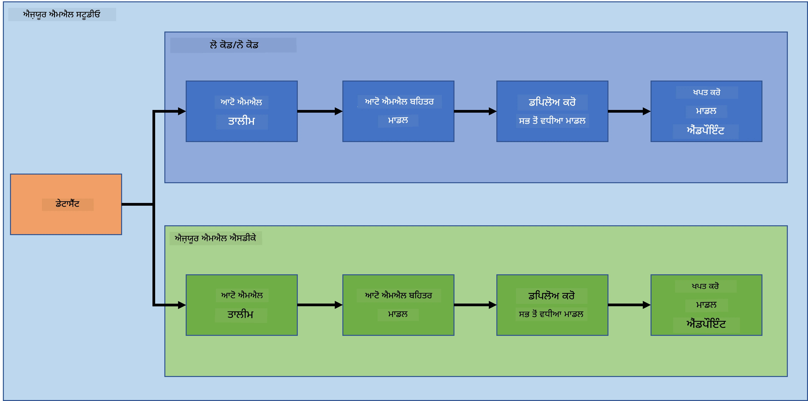

ਹਰ ਤਰੀਕਾ ਦੇ ਆਪਣੇ ਫਾਇਦੇ ਅਤੇ ਨੁਕਸਾਨ ਹਨ। ਲੋ ਕੋਡ/ਨੋ ਕੋਡ ਤਰੀਕਾ ਸ਼ੁਰੂ ਕਰਨ ਲਈ ਆਸਾਨ ਹੈ ਕਿਉਂਕਿ ਇਹ GUI (ਗ੍ਰਾਫਿਕਲ ਯੂਜ਼ਰ ਇੰਟਰਫੇਸ) ਨਾਲ ਇੰਟਰੈਕਟ ਕਰਦਾ ਹੈ ਅਤੇ ਕੋਡ ਦੀ ਪਹਿਲਾਂ ਤੋਂ ਜਾਣਕਾਰੀ ਦੀ ਲੋੜ ਨਹੀਂ। ਇਹ ਤਰੀਕਾ ਪ੍ਰੋਜੈਕਟ ਦੀ ਜ਼ਿੰਦੇदਿਲੀ ਨੂੰ ਤੇਜ਼ੀ ਨਾਲ ਟੈਸਟ ਕਰਨ ਅਤੇ POC (ਪ੍ਰੂਫ਼ ਆਫ਼ ਕਾਂਸੈਪਟ) ਬਣਾਉਣ ਦੀ ਆਗਿਆ ਦਿੰਦਾ ਹੈ। ਪਰ, ਜਿਵੇਂ ਜਿਵੇਂ ਪ੍ਰੋਜੈਕਟ ਵੱਧਦਾ ਹੈ ਅਤੇ ਉਤਪਾਦਨ ਲਈ ਤਿਆਰ ਹੋਣਾ ਚਾਹੀਦਾ ਹੈ, ਤਾਂ GUI ਰਾਹੀਂ ਸਰੋਤ ਬਣਾਉਣਾ ਸੰਭਵ ਨਹੀਂ ਰਹਿੰਦਾ। ਸਾਨੂੰ ਸਭ ਕੁਝ ਪ੍ਰੋਗ੍ਰਾਮਿੰਗ ਦੁਆਰਾ ਆਟੋਮੇਟ ਕਰਨਾ ਪੈਂਦਾ ਹੈ, ਸਰੋਤਾਂ ਦੇ ਬਣਾਉਣ ਤੋਂ ਲੈ ਕੇ ਮਾਡਲ ਦੇ ਡਿਪਲੌਇਮੈਂਟ ਤਕ। ਇਹੀ ਵਕਤ ਹੈ ਜਦੋਂ Azure ML SDK ਦੀ ਜਾਣਕਾਰੀ ਅਹਿਮ ਬਣਦੀ ਹੈ।

|                   | ਲੋ ਕੋਡ/ਨੋ ਕੋਡ    | ਐਜ਼ੂਰ ਐਮਐਲ SDK            |
|-------------------|------------------|---------------------------|
| ਕੋਡ ਵਿੱਚ ਮਹਾਰਤ    | ਲੋੜੀਂਦੀ ਨਹੀਂ     | ਲੋੜੀਂਦੀ ਹੈ                |
| ਵਿਕਾਸ ਦਾ ਸਮਾਂ     | ਤੇਜ਼ ਅਤੇ ਆਸਾਨ     | ਕੋਡ ਹۀੰਦਰਾ ਅਨੁਸਾਰ ਵੱਖਰਾ  |
| ਉਤਪਾਦਨ ਲਈ ਤਿਆਰ  | ਨਹੀਂ              | ਹਾਂ                         |

### 1.3 ਹਾਰਟ ਫੇਲਿਅਰ ਡਾਟਾਸੈੱਟ:  

ਕਾਰਡੀਓਵੈਸਕੁਲਰ ਬਿਮਾਰੀਆਂ (CVDs) ਦੁਨੀਆ ਭਰ ਵਿੱਚ ਮੌਤਾਂ ਦਾ ਨੰਬਰ 1 ਕਾਰਨ ਹਨ, ਜੋ ਕਿ ਕੁੱਲ ਮੌਤਾਂ ਦਾ 31% ਹੈ। ਐਸੇ ਵਾਤਾਵਰਨੀ ਅਤੇ ਵਰਤੋਂ ਵਾਲੇ ਖਤਰੇ ਜਿਵੇਂ ਤਮਾਕੂ ਸੇਵਨ, ਅਣਸਿਹਤਮੰਦ ਖੁਰਾਕ ਅਤੇ ਮੋਟਾਪਾ, ਸ਼ਾਰੀਰਕ ਅਚਲਤਾ ਅਤੇ ਸ਼ਰਾਬ ਦਾ ਨੁਕਸਾਨਦਾਇਕ ਉਪਯੋਗ ਅੰਦਾਜ਼ਾ ਲਗਾਉਣ ਵਾਲੇ ਮਾਡਲਾਂ ਲਈ ਫੀਚਰ ਬਣਾਏ ਜਾ ਸਕਦੇ ਹਨ। CVD ਦੇ ਵਿਕਾਸ ਦੀ ਸੰਭਾਵਨਾ ਨੂੰ ਅੰਦਾਜ਼ਾ ਲਗਾਉਣਾ ਉੱਚ ਖਤਰੇ ਵਾਲੇ ਲੋਕਾਂ ਵਿੱਚ ਹਮਲਿਆਂ ਨੂੰ ਰੋਕਣ ਲਈ ਬਹੁਤ ਮਦਦਗਾਰ ਹੋ ਸਕਦਾ ਹੈ।

Kaggle ਨੇ ਇੱਕ [ਹਾਰਟ ਫੇਲਿਅਰ ਡਾਟਾਸੈੱਟ](https://www.kaggle.com/andrewmvd/heart-failure-clinical-data) ਸਾਰਵਜਨਿਕ ਤੌਰ 'ਤੇ ਉਪਲਬਧ ਕਰਵਾਇਆ ਹੈ, ਜਿਸਨੂੰ ਅਸੀਂ ਇਸ ਪ੍ਰੋਜੈਕਟ ਲਈ ਵਰਤਾਂਗੇ। ਤੁਸੀਂ ਹੁਣ ਡਾਟਾਸੈੱਟ ਡਾਊਨਲੋਡ ਕਰ ਸਕਦੇ ਹੋ। ਇਹ ਇੱਕ ਟੇਬੂਲਰ ਡਾਟਾਸੈੱਟ ਹੈ ਜਿਸ ਵਿੱਚ 13 ਕਾਲਮ (12 ਫੀਚਰ ਅਤੇ 1 ਲਕੜੀ ਵੈਰੀਏਬਲ) ਅਤੇ 299 ਕਤਾਰਾਂ ਹਨ। 

|    | ਵੈਰੀਏਬਲ ਨਾਮ              | ਪ੍ਰਕਾਰ            | ਵੇਰਵਾ                                                    | ਉਦਾਹਰਨ          |
|----|---------------------------|-----------------|----------------------------------------------------------|------------------|
| 1  | ਉਮਰ                      | ਸਖਤੀਕ                | ਮਰੀਜ਼ ਦੀ ਉਮਰ                                              | 25               |
| 2  | ਐਨੀਮੀਆ                   | ਬੂਲੀਅਨ             | ਲਹੂ ਦੇ ਲਾਲ ਕੋਸ਼ਿਕਾਂ ਜਾਂ ਹੀਮੋਗਲੋਬਿਨ ਘਟਨਾ                  | 0 ਜਾਂ 1           |
| 3  | ਕ੍ਰੀਏਟਿਨਾਈਨ_ਫਾਸੋਕਾਈਨੇਜ਼ | ਸਖਤੀਕ                | ਲਹੂ ਵਿੱਚ CPK ਐਂਜ਼ਾਈਮ ਦੀ ਮਾਤਰਾ                            | 542              |
| 4  | ਡਾਇਬਟੀਜ਼                 | ਬੂਲੀਅਨ             | ਮਰੀਜ਼ ਨੂੰ ਡਾਇਬਟੀਜ਼ ਹੈ ਜਾਂ ਨਹੀਂ                              | 0 ਜਾਂ 1           |
| 5  | ਇਜੈਕਸ਼ਨ ਫਰੇਕਸ਼ਨ          | ਸਖਤੀਕ                | ਹਰ ਸੰਜੋੜ 'ਤੇ ਦਿਲ ਤੋਂ ਲਹੂ ਦੀ ਪ੍ਰਤੀਸ਼ਤ                        | 45               |
| 6  | ਉੱਚ ਰਕਤ ਦਬਾਅ             | ਬੂਲੀਅਨ             | ਮਰੀਜ਼ ਨੂੰ ਹਾਈਪਰਟੈਨਸ਼ਨ ਹੈ ਜਾਂ ਨਹੀਂ                          | 0 ਜਾਂ 1           |
| 7  | ਪਲੇਟਲੈਟ                  | ਸਖਤੀਕ                | ਲਹੂ ਵਿੱਚ ਪਲੇਟਲੈਟ                                            | 149000           |
| 8  | ਸੀਰਮ ਕ੍ਰੀਏਟਿਨਾਈਨ       | ਸਖਤੀਕ                | ਲਹੂ ਵਿੱਚ ਸੀਰਮ ਕ੍ਰੀਏਟਿਨਾਈਨ ਦੀ ਮਾਤਰਾ                        | 0.5              |
| 9  | ਸੀਰਮ ਸੋਡੀਅਮ              | ਸਖਤੀਕ                | ਲਹੂ ਵਿੱਚ ਸੀਰਮ ਸੋਡੀਅਮ ਦੀ ਮਾਤਰਾ                              | ਜੂਨ              |
| 10 | ਲਿੰਗ                     | ਬੂਲੀਅਨ             | ਔਰਤ ਜਾਂ ਮਰਦ                                              | 0 ਜਾਂ 1           |
| 11 | ਧੂਮਪਾਨ                  | ਬੂਲੀਅਨ             | ਮਰੀਜ਼ ਧੂਮਪਾਨ ਕਰਦਾ ਹੈ ਜਾਂ ਨਹੀਂ                              | 0 ਜਾਂ 1           |
| 12 | ਸਮਾਂ                      | ਸਖਤੀਕ                | ਫਾਲੋਅਪ ਮਿਆਦ (ਦਿਨ)                                        | 4                |
|----|---------------------------|-----------------|----------------------------------------------------------|------------------|
| 21 | DEATH_EVENT [ਟਾਰਗੇਟ]     | ਬੂਲੀਅਨ             | ਜੇ ਮਰੀਜ਼ ਫਾਲੋਅਪ ਦੌਰਾਨ ਮਰ ਜਾਂਦਾ ਹੈ                          | 0 ਜਾਂ 1           |

ਜਿਵੇਂ ਹੀ ਤੁਹਾਡੇ ਕੋਲ ਡਾਟਾਸੈੱਟ ਹੋਵੇ, ਅਸੀਂ ਐਜ਼ੂਰ ਵਿੱਚ ਪ੍ਰੋਜੈਕਟ ਸ਼ੁਰੂ ਕਰ ਸਕਦੇ ਹਾਂ।

## 2. ਐਜ਼ੂਰ ਐਮਐਲ ਸਟੂਡੀਓ ਵਿੱਚ ਲੋ ਕੋਡ/ਨੋ ਕੋਡ ਮਾਡਲ ਟ੍ਰੇਨਿੰਗ
### 2.1 ਐਜ਼ੂਰ ਐਮਐਲ ਵਰਕਸਪੇਸ ਬਣਾਉਣਾ
ਐਜ਼ੂਰ ਐਮਐਲ ਵਿੱਚ ਮਾਡਲ ਟ੍ਰੇਂ ਕਰਨ ਲਈ ਪਹਿਲਾਂ ਤੁਹਾਨੂੰ ਇਕ ਐਜ਼ੂਰ ਐਮਐਲ ਵਰਕਸਪੇਸ ਬਣਾਉਣਾ ਪੈਂਦਾ ਹੈ। ਵਰਕਸਪੇਸ ਐਜ਼ੂਰ ਮਸ਼ੀਨ ਲਰਨਿੰਗ ਲਈ ਸਿਖਰ-ਪੱਧਰੀ ਸਰੋਤ ਹੈ ਜੋ ਤੁਹਾਨੂੰ ਉਹ ਸਾਰੇ ਆਰਟੀਫੈਕਟਸ ਇਕੱਠੇ ਕੰਟਰੋਲ ਕਰਨ ਲਈ ਕੇਂਦਰੀ ਸਥਾਨ ਪ੍ਰਦਾਨ ਕਰਦਾ ਹੈ ਜੋ ਤੁਸੀਂ ਐਜ਼ੂਰ ਮਸ਼ੀਨ ਲਰਨਿੰਗ ਵਰਤਦੇ ਹੋਏ ਬਣਾਉਂਦੇ ਹੋ। ਵਰਕਸਪੇਸ ਸਾਰੇ ਟ੍ਰੇਨਿੰਗ ਦੌੜਾਂ ਦਾ ਇਤਿਹਾਸ ਰੱਖਦਾ ਹੈ, ਜਿਨ੍ਹਾਂ ਵਿੱਚ ਲੌਗ, ਮੈਟਰਿਕਸ, ਆਉਟਪੁੱਟ ਅਤੇ ਤੁਹਾਡੇ ਸਕ੍ਰਿਪਟਸ ਦਾ ਸਨੈਪਸ਼ੌਟ ਸ਼ਾਮਿਲ ਹੈ। ਤੁਸੀਂ ਇਹ ਜਾਣਕਾਰੀ ਵਰਤ ਕੇ ਪਤਾ ਲਗਾਉਂਦੇ ਹੋ ਕਿ ਕਿਹੜੀ ਟ੍ਰੇਨਿੰਗ ਦੌੜ ਸਭ ਤੋਂ ਵਧੀਆ ਮਾਡਲ ਤੈਅਰ ਕਰਦੀ ਹੈ। [ਹੋਰ ਜਾਣੋ](https://docs.microsoft.com/azure/machine-learning/concept-workspace?WT.mc_id=academic-77958-bethanycheum&ocid=AID3041109)

ਸਿਫਾਰਸ਼ ਕੀਤੀ ਜਾਂਦੀ ਹੈ ਕਿ ਤੁਹਾਡੇ ਆਪਰੇਟਿੰਗ ਸਿਸਟਮ ਨਾਲ ਸੰਗਤ ਨਾਲ ਸਭ ਤੋਂ ਅਪ-ਟੂ-ਡੇਟ ਬ੍ਰਾਊਜ਼ਰ ਵਰਤੋਂ। ਹੇਠਾਂ ਦਿੱਤੇ ਬ੍ਰਾਊਜ਼ਰ ਸਹਾਇਤ ਪ੍ਰਾਪਤ ਹਨ:

- ਮਾਈਕਰੋਸਾਫ਼ਟ ਐਜ (ਨਵਾਂ ਮਾਈਕਰੋਸਾਫ਼ਟ ਐਜ, ਸਭ ਤੋਂ ਨਵਾਂ ਵਰਜਨ। Microsoft Edge ਲੈਗਸੀ ਨਹੀਂ)
- ਸਫਾਰੀ (ਸਿਰਫ ਮੈਕ ਲਈ, ਸਭ ਤੋਂ ਨਵਾਂ ਵਰਜਨ)
- ਕ੍ਰੋਮ (ਸਭ ਤੋਂ ਨਵਾਂ ਵਰਜਨ)
- ਫਾਇਰਫਾਕਸ (ਸਭ ਤੋਂ ਨਵਾਂ ਵਰਜਨ)

ਐਜ਼ੂਰ ਮਸ਼ੀਨ ਲਰਨਿੰਗ ਵਰਤਣ ਲਈ, ਆਪਣੀ ਐਜ਼ੂਰ ਸਬਸਕ੍ਰਿਪਸ਼ਨ ਵਿੱਚ ਵਰਕਸਪੇਸ ਬਣਾਓ। ਤੁਸੀਂ ਫਿਰ ਇਸ ਵਰਕਸਪੇਸ ਦੀ ਵਰਤੋਂ ਕਰਕੇ ਡਾਟਾ, ਕਮਪਿਊਟ ਸਰੋਤ, ਕੋਡ, ਮਾਡਲ ਅਤੇ ਆਪਣੇ ਮਸ਼ੀਨ ਲਰਨਿੰਗ ਕਾਰਜਾਂ ਨਾਲ ਸਬੰਧਿਤ ਹੋਰ ਆਰਟੀਫੈਕਟਸ ਦਾ ਪ੍ਰਬੰਧਨ ਕਰ ਸਕਦੇ ਹੋ।

> **_ਨੋਟ:_** ਤੁਹਾਡੇ ਐਜ਼ੂਰ ਸਬਸਕ੍ਰਿਪਸ਼ਨ ਤੋਂ ਡਾਟਾ ਸਟੋਰੇਜ ਲਈ ਇੱਕ ਛੋਟਾ ਖਰਚ ਲੱਗੇਗਾ ਜਦ ਤੱਕ ਐਜ਼ੂਰ ਮਸ਼ੀਨ ਲਰਨਿੰਗ ਵਰਕਸਪੇਸ ਤੁਹਾਡੇ ਸਬਸਕ੍ਰਿਪਸ਼ਨ ਵਿੱਚ ਮੌਜੂਦ ਹੈ, ਇਸ ਲਈ ਅਸੀਂ ਸਿਫਾਰਸ਼ ਕਰਦੇ ਹਾਂ ਕਿ ਜਦੋਂ ਤੁਸੀਂ ਇਸਦੀ ਵਰਤੋਂ ਨਾ ਕਰ ਰਹੇ ਹੋ ਤਾਂ ਵਰਕਸਪੇਸ ਨੂੰ ਮਿਟਾ ਦਿਓ।

1. [ਐਜ਼ੂਰ ਪੋਰਟਲ](https://ms.portal.azure.com/) ਵਿੱਚ ਆਪਣੇ ਐਜ਼ੂਰ ਸਬਸਕ੍ਰਿਪਸ਼ਨ ਨਾਲ ਜੁੜੇ ਮਾਈਕਰੋਸਾਫਟ ਖਾਤੇ ਨਾਲ ਸਾਇਨ ਇਨ ਕਰੋ।  
2. **＋Create a resource** ਚੁਣੋ  
   
   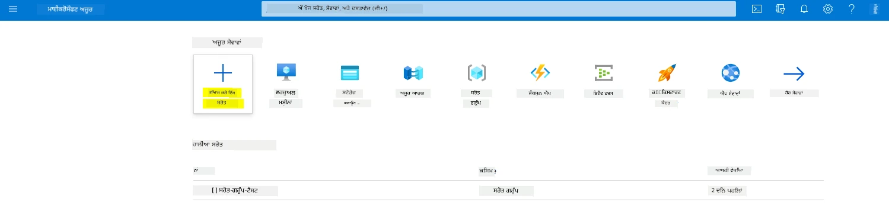

   ਮਸ਼ੀਨ ਲਰਨਿੰਗ ਲੱਭੋ ਅਤੇ ਮਸ਼ੀਨ ਲਰਨਿੰਗ ਟਾਈਲ ਚੁਣੋ

   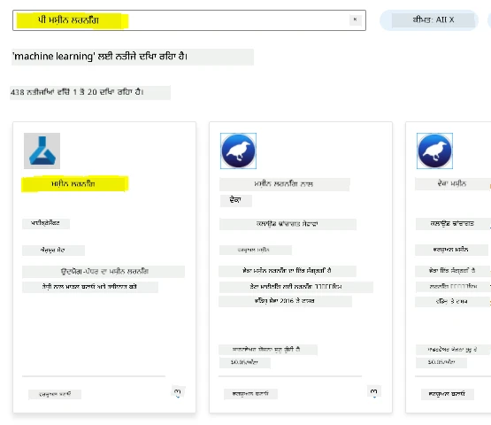

   ਬਣਾਉ ਬਟਨ 'ਤੇ ਕਲਿੱਕ ਕਰੋ

   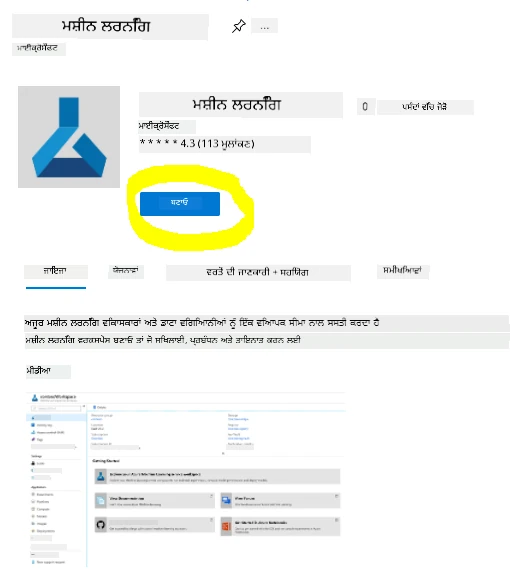

   ਹੇਠਾਂ ਦਿੱਤੀਆਂ ਸੈਟਿੰਗਾਂ ਭਰੋ:  
   - ਸਬਸਕ੍ਰਿਪਸ਼ਨ: ਤੁਹਾਡਾ ਐਜ਼ੂਰ ਸਬਸਕ੍ਰਿਪਸ਼ਨ  
   - ਸਰੋਤ ਸਮੂਹ: ਨਵਾਂ ਬਣਾਓ ਜਾਂ ਕੋਈ ਮੌਜੂਦਾ ਚੁਣੋ  
   - ਵਰਕਸਪੇਸ ਨਾਮ: ਆਪਣੇ ਵਰਕਸਪੇਸ ਲਈ ਵਿਲੱਖਣ ਨਾਮ ਦਿਓ  
   - ਖੇਤਰ: ਆਪਣੇ ਨਜ਼ਦੀਕੀ ਭੂਗੋਲਿਕ ਖੇਤਰ ਚੁਣੋ  
   - ਸਟੋਰੇਜ ਅਕਾਊਂਟ: ਡਿਫਾਲਟ ਨਵਾਂ ਸਟੋਰੇਜ ਅਕਾਊਂਟ ਨੋਟ ਕਰੋ ਜੋ ਤੁਹਾਡੇ ਵਰਕਸਪੇਸ ਲਈ ਬਣਾਇਆ ਜਾਵੇਗਾ  
   - ਕੀ ਵੌਲਟ: ਡਿਫਾਲਟ ਨਵਾਂ ਕੀ ਵੌਲਟ ਨੋਟ ਕਰੋ ਜੋ ਬਣਾਇਆ ਜਾਵੇਗਾ  
   - ਐਪਲੀਕੇਸ਼ਨ ਇਨਸਾਈਟਸ: ਡਿਫਾਲਟ ਨਵਾਂ ਐਪਲੀਕੇਸ਼ਨ ਇਨਸਾਈਟਸ ਸਰੋਤ ਨੋਟ ਕਰੋ  
   - ਕੰਟੇਨਰ ਰਜਿਸਟਰੀ: ਕੋਈ ਨਹੀਂ (ਮਾਡਲ ਨੂੰ ਕੰਟੇਨਰ ਵਿੱਚ ਪਹਿਲੀ ਵਾਰੀ ਡਿਪਲੌਇ ਕਰਨ ਸਮੇਂ ਆਪਣਾ ਆਪ ਬਣ ਜਾਵੇਗਾ)  

    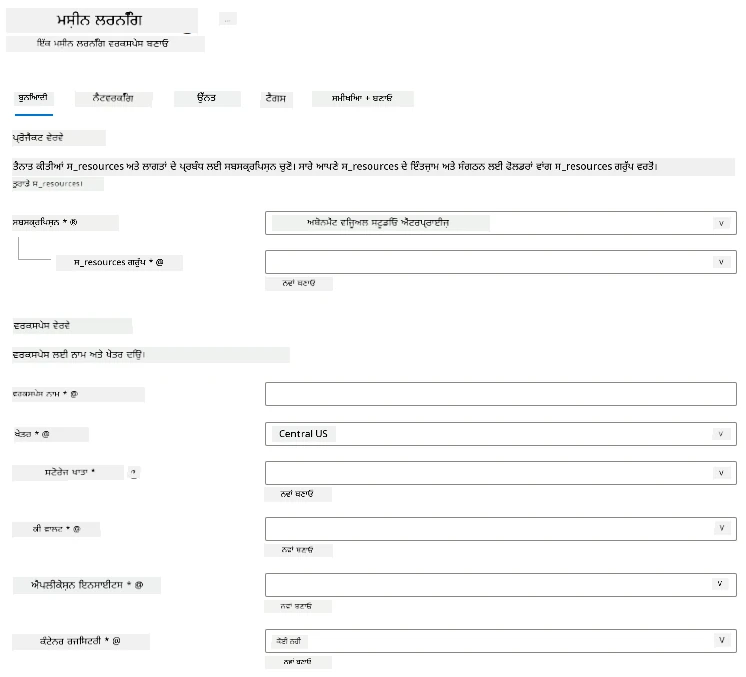

   - [Create + Review] 'ਤੇ ਕਲਿੱਕ ਕਰੋ ਅਤੇ ਫਿਰ [Create] ਬਟਨ 'ਤੇ ਕਲਿੱਕ ਕਰੋ  
3. ਆਪਣਾ ਵਰਕਸਪੇਸ ਬਣਨ ਲਈ ਕੁਝ ਮਿੰਟ ਉਡੀਕ ਕਰੋ। ਫਿਰ ਪੋਰਟਲ ਵਿਚ ਇਸ ਤੇ ਜਾਓ। ਤੁਸੀਂ ਇਸਨੂੰ ਮਸ਼ੀਨ ਲਰਨਿੰਗ ਐਜ਼ੂਰ ਸਰਵਿਸ ਰਾਹੀਂ ਲੱਭ ਸਕਦੇ ਹੋ।  
4. ਆਪਣੀ ਵਰਕਸਪੇਸ ਲਈ ਓਵਰਵਿਊ ਪੇਜ 'ਤੇ, ਐਜ਼ੂਰ ਮਸ਼ੀਨ ਲਰਨਿੰਗ ਸਟੂਡੀਓ ਚਲਾਓ (ਜਾਂ ਨਵੀਂ ਬ੍ਰਾਊਜ਼ਰ ਟੈਬ ਖੋਲ ਕੇ https://ml.azure.com ਤੱਕ ਜਾਓ) ਅਤੇ ਆਪਣੇ ਮਾਈਕਰੋਸਾਫਟ ਖਾਤੇ ਨਾਲ ਸਾਇਨ ਇਨ ਕਰੋ। ਜੇ ਪੁੱਛਿਆ ਜਾਵੇ, ਆਪਣੇ ਐਜ਼ੂਰ ਡਾਇਰੈਕਟਰੀ ਅਤੇ ਸਬਸਕ੍ਰਿਪਸ਼ਨ ਅਤੇ ਐਜ਼ੂਰ ਮਸ਼ੀਨ ਲਰਨਿੰਗ ਵਰਕਸਪੇਸ ਨੂੰ ਚੁਣੋ।  
   
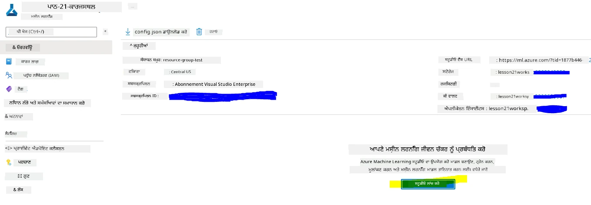

5. ਐਜ਼ੂਰ ਮਸ਼ੀਨ ਲਰਨਿੰਗ ਸਟੂਡੀਓ ਵਿੱਚ, ਵਲੋਂ ਵੱਡੇ ਬਾਈਂ ਕਤਾਰ ਵਾਲਾ ☰ ਚਿੰਨ੍ਹ ਟੋਗਲ ਕਰੋ ਤਾਂ ਜੋ ਇੰਟਰਫੇਸ ਦੇ ਵੱਖ-ਵੱਖ ਪੰਨਿਆਂ ਨੂੰ ਵੇਖਿਆ ਜਾ ਸਕੇ। ਤੁਸੀਂ ਇਨ੍ਹਾਂ ਪੰਨਿਆਂ ਦੀ ਵਰਤੋਂ ਆਪਣੇ ਵਰਕਸਪੇਸ ਦੇ ਸਰੋਤਾਂ ਦਾ ਪ੍ਰਬੰਧਨ ਕਰਨ ਲਈ ਕਰ ਸਕਦੇ ਹੋ।  

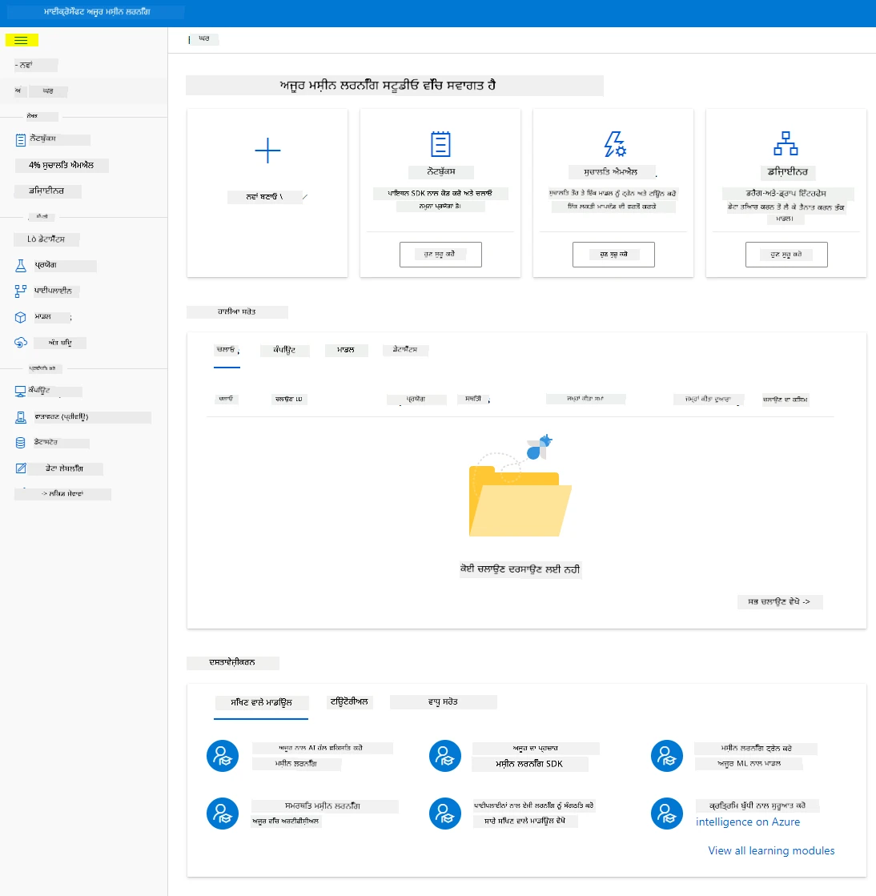

ਤੁਸੀਂ ਆਪਣਾ ਵਰਕਸਪੇਸ ਐਜ਼ੂਰ ਪੋਰਟਲ ਦੁਆਰਾ ਵੀ ਪ੍ਰਬੰਧਤ ਕਰ ਸਕਦੇ ਹੋ, ਪਰ ਡਾਟਾ ਸਾਇੰਟਿਸਟਾਂ ਅਤੇ ਮਸ਼ੀਨ ਲਰਨਿੰਗ ਆਪਰੇਸ਼ਨ ਇੰਜੀਨੀਅਰਾਂ ਲਈ, ਐਜ਼ੂਰ ਮਸ਼ੀਨ ਲਰਨਿੰਗ ਸਟੂਡੀਓ ਵਰਕਸਪੇਸ ਸਰੋਤਾਂ ਦੇ ਪ੍ਰਬੰਧਨ ਲਈ ਜ਼ਿਆਦਾ ਕੇਂਦਰਿਤ ਉਪਭੋਗਤਾ ਇੰਟਰਫੇਸ ਪ੍ਰਦਾਨ ਕਰਦਾ ਹੈ।

### 2.2 ਕਮਪਿਊਟ ਸਰੋਤ

ਕਮਪਿਊਟ ਸਰੋਤ ਕਲਾਉਡ ਅਧਾਰਿਤ ਸਰੋਤ ਹਨ ਜਿੰਨ੍ਹਾਂ ਉੱਤੇ ਤੁਸੀਂ ਮਾਡਲ ਟ੍ਰੇਨਿੰਗ ਅਤੇ ਡਾਟਾ ਖੋਜ ਪ੍ਰਕਿਰਿਆਵਾਂ ਚਲਾ ਸਕਦੇ ਹੋ। ਤੁਸੀਂ ਚਾਰ ਕਿਸਮ ਦੇ ਕਮਪਿਊਟ ਸਰੋਤ ਬਣਾਉਣ ਕਰ ਸਕਦੇ ਹੋ:

- **ਕਮਪਿਊਟ ਇੰਸਟੈਂਸਜ਼**: ਵਿਕਾਸ ਸਥਾਨ ਜਿੱਥੇ ਡਾਟਾ ਸਾਇੰਟਿਸਟ ਡਾਟਾ ਅਤੇ ਮਾਡਲ ਨਾਲ ਕੰਮ ਕਰ ਸਕਦੇ ਹਨ। ਇਸ ਵਿੱਚ ਵਰਚੁਅਲ ਮਸ਼ੀਨ (VM) ਬਣਾਉਣ ਅਤੇ ਇੱਕ ਨੋਟਬੁੱਕ ਇੰਸਟੈਂਸ ਚਲਾਉਣ ਸ਼ਾਮਿਲ ਹੈ। ਤੁਸੀਂ ਬਾਅਦ ਵਿੱਚ ਨੋਟਬੁੱਕ ਤੋਂ ਕਮਪਿਊਟ ਕਲੱਸਟਰ ਕਾਲ ਕਰ ਕੇ ਮਾਡਲ ਟ੍ਰੇਨ ਕਰ ਸਕਦੇ ਹੋ।  
- **ਕਮਪਿਊਟ ਕਲੱਸਟਰ**: ਕਿਸੇ ਵੀ ਸਮੇਂ ਤੇ ਇਕਸਾਰ VM ਕਲੱਸਟਰ, ਜੋ ਤਜਰਬਿਆਂ ਦੇ ਕੋਡ ਨੂੰ ਪ੍ਰਾਪਤ ਕਰਨ ਲਈ ਮਾਪ-ਸਥਾਪਿਤ ਕਰ ਸਕਦੇ ਹਨ। ਤੁਹਾਨੂੰ ਮਾਡਲ ਟ੍ਰੇਨਿੰਗ ਸਮੇਂ ਇਹ ਲੋੜੀਂਦਾ ਹੈ। ਕਮਪਿਊਟ ਕਲੱਸਟਰ ਖਾਸ GPU ਜਾਂ CPU ਸਰੋਤ ਵੀ ਵਰਤ ਸਕਦੇ ਹਨ।  
- **ਇੰਫਰੈਂਸ ਕਲੱਸਟਰ**: ਪ੍ਰিডਿਕਟਿਵ ਸੇਵਾਵਾਂ ਲਈ ਡਿਪਲੌਇਮੈਂਟ ਟਾਰਗੇਟ ਜੋ ਤੁਹਾਡੇ ਟ੍ਰੇਨ ਕੀਤੇ ਮਾਡਲਾਂ ਨੂੰ ਵਰਤਦੇ ਹਨ।
- **ਸੰਲੱਗਨ ਹਨੇਰੀ ਪ੍ਰਕਿਰਿਆ**: ਮੌਜੂਦਾ Azure ਹਨੇਰੀ ਸੰਸਾਧਨਾਂ ਨਾਲ ਲਿੰਕ ਕਰਦਾ ਹੈ, ਜਿਵੇਂ ਕਿ ਵਰਚੁਅਲ ਮਸ਼ੀਨ ਜਾਂ Azure Databricks ਕਲੱਸਟਰ।

#### 2.2.1 ਆਪਣੇ ਹਨੇਰੀ ਸੰਸਾਧਨਾਂ ਲਈ ਸਹੀ ਵਿਕਲਪ ਚੁਣਨਾ

ਹਨੇਰੀ ਸੰਸਾਧਨ ਬਣਾਉਣ ਸਮੇਂ ਕੁਝ ਮੁੱਖ ਤੱਤ ਧਿਆਨ ਵਿੱਚ ਰੱਖਣੇ ਚਾਹੀਦੇ ਹਨ ਅਤੇ ਉਹ ਚੋਣਾਂ ਅਹੰਕਾਰਕ ਫੈਸਲੇ ਹੋ ਸਕਦੀਆਂ ਹਨ।

**ਕੀ ਤੁਹਾਨੂੰ CPU ਜਾਂ GPU ਦੀ ਲੋੜ ਹੈ?**

CPU (ਸੈਂਟਰਲ ਪ੍ਰੋਸੈਸਿੰਗ ਯੂਨਿਟ) ਉਹ ਇਲੈਕਟ੍ਰਾਨਿਕ ਸਰਕਿਟ ਹੈ ਜੋ ਕੰਪਿਊਟਰ ਪ੍ਰੋگرام ਦੇ ਨਿਰਦੇਸ਼ਾਂ ਨੂੰ ਨਿਭਾਉਂਦਾ ਹੈ। GPU (ਗ੍ਰਾਫਿਕਸ ਪ੍ਰੋਸੈਸਿੰਗ ਯੂਨਿਟ) ਇੱਕ ਵਿਸ਼ੇਸ਼ ਇਲੈਕਟ੍ਰਾਨਿਕ ਸਰਕਿਟ ਹੈ ਜੋ ਗ੍ਰਾਫਿਕਸ-ਸੰਬੰਧਿਤ ਕੋਡ ਵਹੁਤ ਤੇਜ਼ੀ ਨਾਲ ਚਲਾ ਸਕਦਾ ਹੈ।

CPU ਅਤੇ GPU ਆਰਕੀਟੈਕਚਰ ਵਿਚ ਮੁੱਖ ਫਰਕ ਇਹ ਹੈ ਕਿ CPU ਤੇਜ਼ੀ ਨਾਲ ਵਿਆਪਕ ਸਥਾਨਾਂ ਤੋਂ ਕੰਮ ਸੰਭਾਲਣ ਲਈ ਬਣਾਇਆ ਗਿਆ ਹੈ (CPU ਕਲਾਕ ਸਪੀਡ ਨਾਲ ਮਾਪਿਆ ਗਿਆ), ਪਰ ਇੱਕ ਸਮੇਂ ਵਿੱਚ ਚੱਲ ਰਹੇ ਕੰਮ ਦੇ ਮਾਤਰਾ ਵਿੱਚ ਸੀਮਿਤ ਹੈ। GPU ਪੈਰਲੇਲ ਕੰਪਿਊਟਿੰਗ ਲਈ ਬਣਾਏ ਗਏ ਹਨ ਅਤੇ ਇਸ ਲਈ ਡੀਪ ਲਰਨਿੰਗ ਕੰਮਾਂ ਲਈ ਬਹੁਤ ਵਧੀਆ ਹਨ।

| CPU                                     | GPU                         |
|-----------------------------------------|-----------------------------|
| ਘੱਟ ਕਿਫਾਇਤੀ                         | ਵੱਧ ਕਿਫਾਇਤੀ                |
| ਘੱਟ ਦਰਜੇ ਦੀ ਸਮਕਾਲੀ ਚਾਲਕਤਾ         | ਵੱਧ ਦਰਜੇ ਦੀ ਸਮਕਾਲੀ ਚਾਲਕਤਾ |
| ਡੀਪ ਲਰਨਿੰਗ ਮਾਡਲਾਂ ਦੀ ਸਿਖਿਆ ਵਿੱਚ ਸੁਸਤ | ਡੀਪ ਲਰਨਿੰਗ ਲਈ ਉਤਮ            |

**ਕਲੱਸਟਰ ਆਕਾਰ**

ਵੱਡੇ ਕਲੱਸਟਰ ਵੱਧ ਮਹਿੰਗੇ ਹੁੰਦੇ ਹਨ ਪਰ ਵਧੀਆ ਪ੍ਰਤੀਕ੍ਰਿਆ ਦੇਣਗੇ। ਇਸ ਲਈ, ਜੇ ਤੁਹਾਡੇ ਕੋਲ ਸਮਾਂ ਹੈ ਪਰ ਪੈਸਾ ਨਹੀਂ, ਤਾਂ ਤੁਹਾਨੂੰ ਛੋਟੇ ਕਲੱਸਟਰ ਨਾਲ ਸ਼ੁਰੂ ਕਰਨਾ ਚਾਹੀਦਾ ਹੈ। ਵਿਰੋਧਾਤਮਕ ਤੌਰ 'ਤੇ, ਜੇ ਤੁਹਾਡੇ ਕੋਲ ਪੈਸਾ ਹੈ ਪਰ ਬਹੁਤ ਜ਼ਿਆਦਾ ਸਮਾਂ ਨਹੀਂ, ਤਾਂ ਵੱਡੇ ਕਲੱਸਟਰ ਨਾਲ ਸ਼ੁਰੂ ਕਰੋ।

**VM ਆਕਾਰ**

ਤੁਹਾਡੇ ਸਮੇਂ ਅਤੇ ਬਜਟ ਦੀਆਂ ਸੀਮਾਵਾਂ ਦੇ ਆਧਾਰ 'ਤੇ, ਤੁਸੀਂ ਆਪਣੇ RAM, ਡਿਸਕ, ਕੋਰ ਦੀ ਗਿਣਤੀ ਅਤੇ ਕਲਾਕ ਸਪੀਡ ਦਾ ਆਕਾਰ ਬਦਲ ਸਕਦੇ ਹੋ। ਇਨ੍ਹਾਂ ਸਾਰੇ ਪੈਰਾਮੀਟਰਾਂ ਨੂੰ ਵਧਾਉਣਾ ਮਹਿੰਗਾ ਹੋਵੇਗਾ, ਪਰ ਇਹ ਵਧੀਆ ਪ੍ਰਦਰਸ਼ਨ ਦਿੰਦੇਗਾ।

**ਨਿਸ਼ਚਿਤ ਜਾਂ ਘੱਟ-ਪਹਿਲਤਾ ਇੰਸਟੈਂਸ?**

ਘੱਟ-ਪਹਿਲਤਾ ਇੰਸਟੈਂਸ ਦਾ ਮਤਲਬ ਹੈ ਕਿ ਇਹ ਅਵਰੁਧ ਕੀਤਾ ਜਾ ਸਕਦਾ ਹੈ: ਇਸ ਦਾ ਅਰਥ ਹੈ, Microsoft Azure ਉਹ ਸਰੋਤ ਲੈ ਸਕਦਾ ਹੈ ਅਤੇ ਕਿਸੇ ਹੋਰ ਕੰਮ ਨੂੰ ਦੇ ਸਕਦਾ ਹੈ, ਇਸ ਤਰ੍ਹਾਂ ਕਿਸੇ ਨੌਕਰੀ ਨੂੰ ਰੋਕ ਸਕਦਾ ਹੈ। ਇਕ ਨਿਸ਼ਚਿਤ ਇੰਸਟੈਂਸ ਜਾਂ ਗੈਰ-ਅਵਰੁਧਯੋਗ, ਅਰਥਾਤ ਜੌਬ ਤੁਹਾਡੇ ਇਜਾਜ਼ਤ ਦੇ ਬਿਨਾਂ ਕਦੇ ਖਤਮ ਨਹੀਂ ਕੀਤਾ ਜਾਵੇਗਾ।  
ਇਹ ਸਮਾਂ ਅਤੇ ਪੈਸਾ ਦੇ ਮੂਲਿਆਂ ਦਾ ਹੋਰ ਇਕ ਅਨੁਸ੍ਠਾਨ ਹੈ, ਕਿਉਂਕਿ ਅਵਰੁਧਯੋਗ ਇੰਸਟੈਂਸ ਨਿਸ਼ਚਿਤ ਇੰਸਟੈਂਸ ਨਾਲੋਂ ਘੱਟ ਕਿਫਾਇਤੀ ਹੁੰਦੇ ਹਨ।

#### 2.2.2 ਇੱਕ ਹਨੇਰੀ ਕਲੱਸਟਰ ਬਨਾਉਣਾ

[Azure ML ਵర్కਸਪੇਸ](https://ml.azure.com/) ਵਿੱਚ ਜੋ ਅਸੀਂ ਪਹਿਲਾਂ ਬਣਾਇਆ ਹੈ, ਹਨੇਰੀ 'ਤੇ ਜਾਓ ਅਤੇ ਤੁਸੀਂ ਵੱਖ-ਵੱਖ ਹਨੇਰੀ ਸਰੋਤਾਂ ਨੂੰ ਦੇਖ ਸਕੋਗੇ ਜੋ ਅਸੀਂ ਹੁਣੇ ਹੀ ਗੱਲ ਕੀਤੀ (ਜਿਵੇਂ ਕਿ ਹਨੇਰੀ ਇੰਸਟੈਂਸ, ਹਨੇਰੀ ਕਲੱਸਟਰ, ਇੰਫਰੰਸ ਕਲੱਸਟਰ ਅਤੇ ਸੰਲੱਗਨ ਹਨੇਰੀ)। ਇਸ ਪ੍ਰੋਜੈਕਟ ਲਈ, ਸਾਨੂੰ ਮਾਡਲ ਸਿਖਿਆ ਲਈ ਇੱਕ ਹਨੇਰੀ ਕਲੱਸਟਰ ਦੀ ਲੋੜ ਹੈ। ਸਟੂਡਿਓ ਵਿੱਚ, "Compute" ਮੈਨੂ 'ਤੇ ਕਲਿਕ ਕਰੋ, ਫਿਰ "Compute cluster" ਟੈਬ ਅਤੇ "+ New" ਬਟਨ 'ਤੇ ਕਲਿਕ ਕਰਕੇ ਇੱਕ ਕਲੱਸਟਰ ਬਣਾਓ।

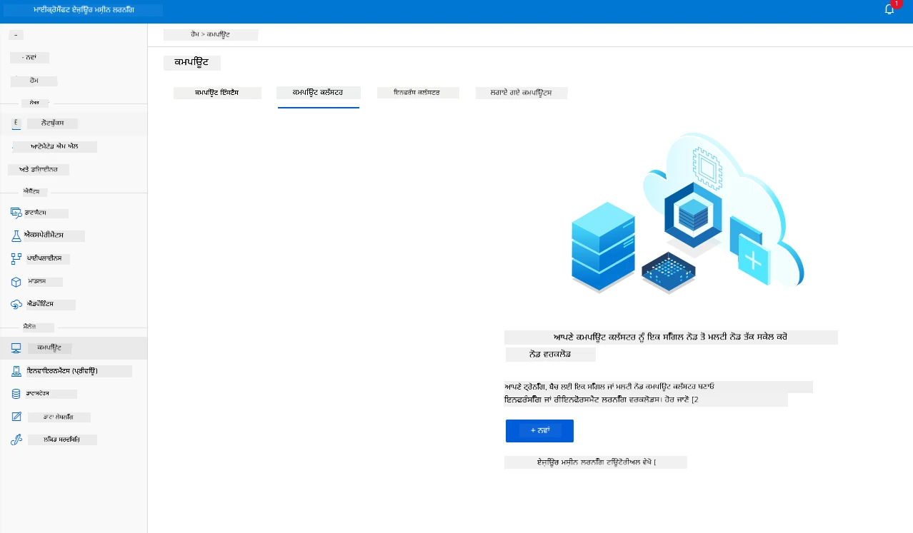

1. ਆਪਣੇ ਵਿਕਲਪ ਚੁਣੋ: ਨਿਸ਼ਚਿਤ ਜਾਂ ਘੱਟ-ਪਹਿਲਤਾ, CPU ਜਾਂ GPU, VM ਆਕਾਰ ਅਤੇ ਕੋਰ ਦੀ ਗਿਣਤੀ (ਤੁਸੀਂ ਇਸ ਪ੍ਰੋਜੈਕਟ ਲਈ ਡਿਫਾਲਟ ਸੈੱਟਿੰਗ ਰੱਖ ਸਕਦੇ ਹੋ)।  
2. Next ਬਟਨ 'ਤੇ ਕਲਿਕ ਕਰੋ।

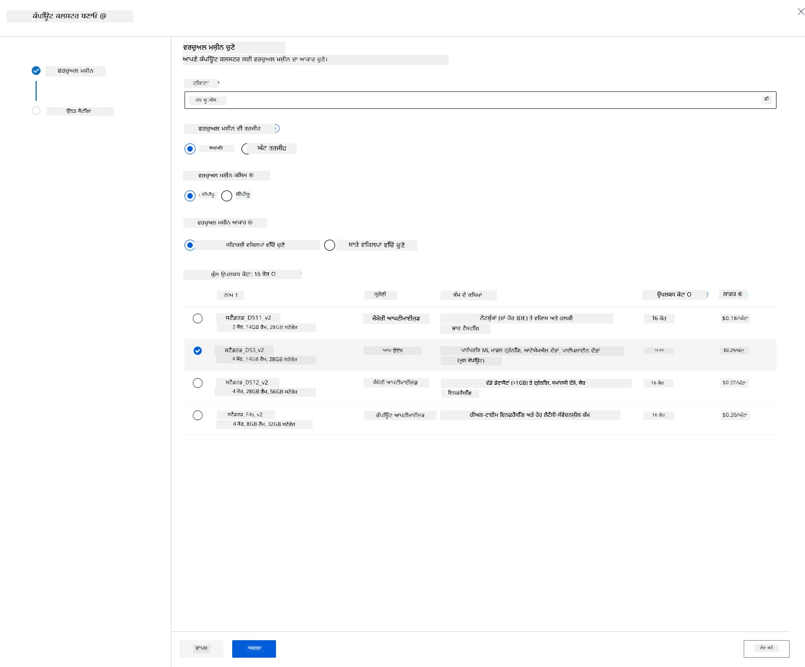

3. ਕਲੱਸਟਰ ਨੂੰ ਇੱਕ ਨਾਮ ਦਿਓ  
4. ਆਪਣੇ ਵਿਕਲਪ ਚੁਣੋ: ਘੱਟੋ-ਘੱਟ/ਵੱਧੋ-ਵੱਧ ਨੋਡ, ਸਕੇਲ ਡਾਊਨ ਤੋਂ ਪਹਿਲਾਂ ਆਇਡਲ ਸੈਕੰਡ, SSH ਪਹੁੰਚ। ਜੇ ਘੱਟੋ-ਘੱਟ ਨੋਡ ਦੀ ਸੰਖਿਆ 0 ਹੈ, ਤਾਂ ਕਲัสਟਰ ਆਇਡਲ ਰਹਿਣ 'ਤੇ ਤੁਸੀਂ ਪੈਸਾ ਬਚਾਓਗੇ। ਜਿੰਨੀ ਵੱਧ ਵੱਧੋ-ਵੱਧ ਨੋਡ, ਉਤਨਾ ਛੋਟੀ ਸਿਖਿਆ ਕਾਲ ਹੋਵੇਗੀ। ਵੱਧੋ-ਵੱਧ ਨੋਡ ਦੀ سفارش 3 ਹੈ।  
5. "Create" ਬਟਨ 'ਤੇ ਕਲਿਕ ਕਰੋ। ਇਹ ਕਦਮ ਕੁਝ ਮਿੰਟ ਲੈ ਸਕਦਾ ਹੈ।  

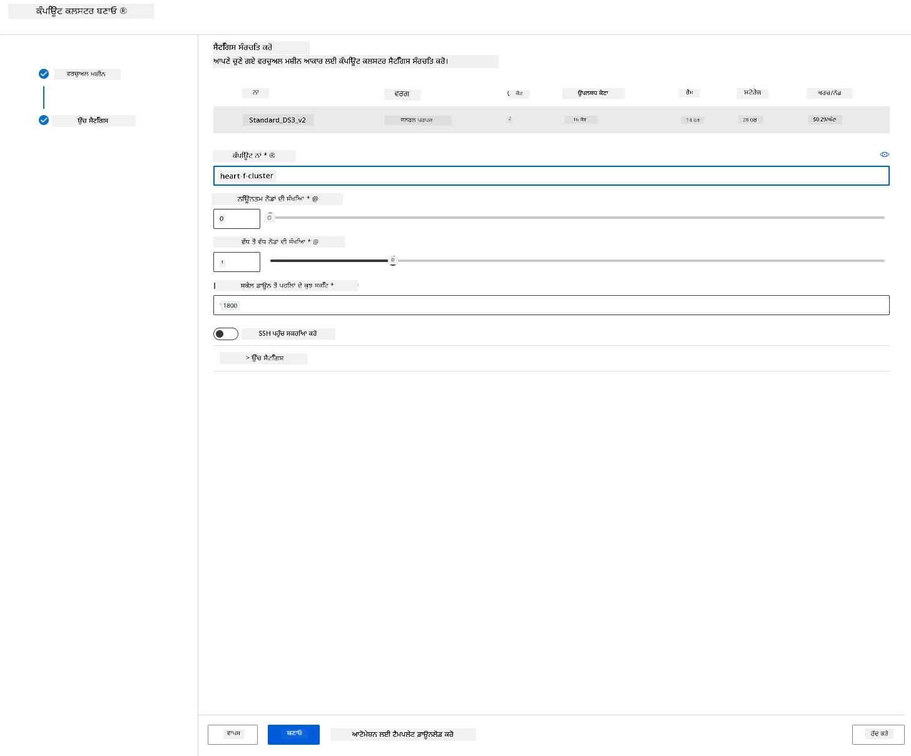

ਸ਼ਾਨਦਾਰ! ਹੁਣ ਜੇਕਰ ਸਾਡੇ ਕੋਲ ਇੱਕ ਹਨੇਰੀ ਕਲੱਸਟਰ ਹੈ, ਤਾਂ ਸਾਨੂੰ ਡੇਟਾ ਨੂੰ Azure ML ਸਟੂਡਿਓ ਵਿੱਚ ਲੋਡ ਕਰਨਾ ਹੈ।

### 2.3 ਡਾਟਾਸੇਟ ਲੋਡ ਕਰਨਾ

1. [Azure ML ਵర్కਸਪੇਸ](https://ml.azure.com/) ਵਿੱਚ ਜੋ ਅਸੀਂ ਪਹਿਲਾਂ ਬਣਾਇਆ ਸੀ, "Datasets" ਤੇ ਕਲਿਕ ਕਰੋ ਬਾਏ ਮੈਨੂ ਵਿੱਚ ਅਤੇ "+ Create dataset" ਬਟਨ 'ਤੇ ਕਲਿਕ ਕਰਕੇ ਇੱਕ ਡਾਟਾਸੇਟ ਬਣਾਓ। "From local files" ਚੁਣੋ ਅਤੇ ਪਹਿਲਾਂ ਡਾਊਨਲੋਡ ਕੀਤਾ ਕੀਤਾ Kaggle ਡਾਟਾਸੇਟ ਚੁਣੋ।

   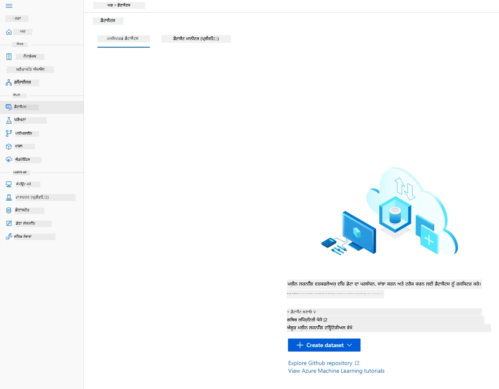

2. ਆਪਣੇ ਡਾਟਾਸੇਟ ਨੂੰ ਇੱਕ ਨਾਮ, ਟਾਈਪ ਅਤੇ ਵਰਣਨ ਦਿਓ। Next ਤੇ ਕਲਿਕ ਕਰੋ। ਫਾਇਲਾਂ ਤੋਂ ਡਾਟਾ ਅਪਲੋਡ ਕਰੋ। ਫਿਰ Next ਤੇ ਕਲਿਕ ਕਰੋ।

   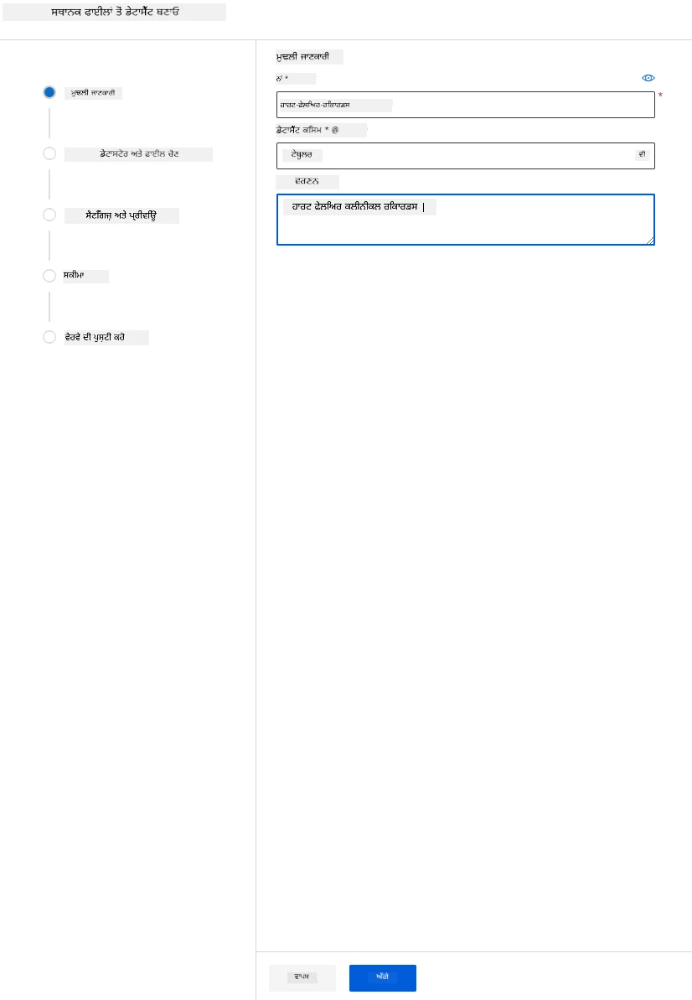

3. ਸਕੀਮਾ ਵਿੱਚ, ਡਾਟਾ ਟਾਈਪ ਨੂੰ Boolean ਵਿੱਚ ਬਦਲੋ ਹੇਠਾਂ ਦਿੱਤੇ ਫੀਚਰਾਂ ਲਈ: anaemia, diabetes, high blood pressure, sex, smoking, ਅਤੇ DEATH_EVENT। Next ਤੇ ਕਲਿਕ ਕਰੋ ਅਤੇ Create ਤੇ ਕਲਿਕ ਕਰੋ।

   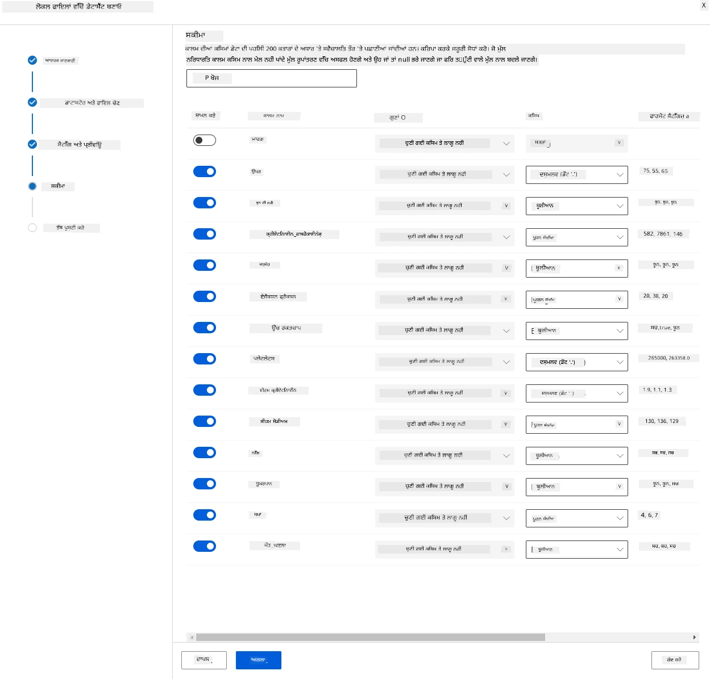

ਸ਼ਾਬਾਸ਼! ਹੁਣ ਜਦੋਂ ਡਾਟਾਸੇਟ ਮੌਜੂਦ ਹੈ ਅਤੇ ਹਨੇਰੀ ਕਲੱਸਟਰ ਬਣ ਚੁੱਕਾ ਹੈ, ਅਸੀਂ ਮਾਡਲ ਸਿਖਿਆ ਸ਼ੁਰੂ ਕਰ ਸਕਦੇ ਹਾਂ!

### 2.4 ਆਟੋਏਮਐਲ ਨਾਲ ਘੱਟ ਕੋਡ/ਕੋਡ-ਰਹਿਤ ਸਿਖਿਆ

ਪਰੰਪਰਾਗਤ ਮਸ਼ੀਨ ਲਰਨਿੰਗ ਮਾਡਲ ਦਾ ਵਿਕਾਸ ਸਰੋਤਾਂ ਵਿੱਚ ਵੱਧ ਖਪਤ ਕਰਦਾ ਹੈ, ਇਸ ਲਈ ਡੋਮੇਨ ਗਿਆਨ ਅਤੇ ਕਾਫ਼ੀ ਸਮਾਂ ਲੱਗਦਾ ਹੈ ਕਈ ਮਾਡਲਾਂ ਦਾ ਉਤਪਾਦਨ ਅਤੇ ਤੁਲਨਾ ਕਰਨ ਲਈ।  
ਆਟੋਮੇਟਿਡ ਮਸ਼ੀਨ ਲਰਨਿੰਗ (AutoML) ਉਹ ਪ੍ਰਕਿਰਿਆ ਹੈ ਜੋ ਮਸ਼ੀਨ ਲਰਨਿੰਗ ਮਾਡਲ ਵਿਕਾਸ ਦੇ ਸਮੇਂ ਖਪਤ ਕਰਨ ਵਾਲੇ ਅਤੇ ਦੁਹਰਾਵਾਂ ਹਨੇਰੇ ਕੰਮਾਂ ਨੂੰ ਆਟੋਮੈਟਿਡ ਕਰਦੀ ਹੈ। ਇਹ ਡਾਟਾ ਵਿਗਿਆਨੀ, ਵਿਸ਼ਲੇਸ਼ਕ ਅਤੇ ਡਿਵੈਲਪਰਾਂ ਨੂੰ ਉੱਚ ਪੱਧਰ, ਦੱਖਲਦਾਰੀ ਅਤੇ ਉਤਪਾਦਕਤਾ ਨਾਲ ML ਮਾਡਲ ਬਣਾਉਣ ਦੀ ਆਗਿਆ ਦਿੰਦੀ ਹੈ, ਬਿਨਾਂ ਮਾਡਲ ਗੁਣਵੱਤਾ ਪੂਰਕ ਖ਼ਤਰੇ ਵਿੱਚ ਪਾਏ। ਇਹ ਉਤਪਾਦਨ-ਤਿਆਰ ML ਮਾਡਲ ਬਣਾਉਣ ਦਾ ਸਮਾਂ ਘਟਾਉਂਦੀ ਹੈ, ਬਹੁਤ ਆਸਾਨੀ ਅਤੇ ਪ੍ਰਭਾਵਸ਼ੀਲਤਾ ਨਾਲ। [ਹੋਰ ਜਾਣੋ](https://docs.microsoft.com/azure/machine-learning/concept-automated-ml?WT.mc_id=academic-77958-bethanycheum&ocid=AID3041109)

1. [Azure ML ਵర్కਸਪੇਸ](https://ml.azure.com/) ਵਿੱਚ ਜੋ ਅਸੀਂ ਪਹਿਲਾਂ ਬਣਾਇਆ ਸੀ, ਬਾਏ ਮੈਨੂ ਵਿੱਚ "Automated ML" 'ਤੇ ਕਲਿਕ ਕਰੋ ਅਤੇ ਜੋ ਡਾਟਾਸੇਟ ਤੁਸੀਂ ਅਪਲੋਡ ਕੀਤਾ ਉਹ ਚੁਣੋ। Next 'ਤੇ ਕਲਿੱਕ ਕਰੋ।

   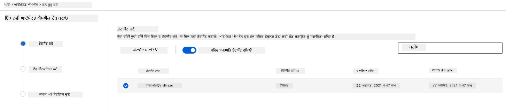

2. ਇੱਕ ਨਵਾਂ ਪ੍ਰਯੋਗ ਨਾਮ ਦਿਓ, ਟਾਰਗਟ ਕਾਲਮ(DEATH_EVENT), ਅਤੇ ਬਣਾਇਆ ਹਨੇਰੀ ਕਲੱਸਟਰ ਚੁਣੋ। Next 'ਤੇ ਕਲਿੱਕ ਕਰੋ।

   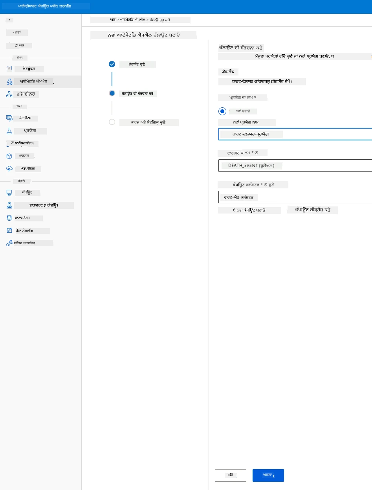

3. "Classification" ਚੁਣੋ ਅਤੇ Finish 'ਤੇ ਕਲਿਕ ਕਰੋ। ਇਹ ਕਦਮ 30 ਮਿੰਟ ਤੋਂ 1 ਘੰਟੇ ਤੱਕ ਲੱਗ ਸਕਦਾ ਹੈ, ਤੁਹਾਡੇ ਹਨੇਰੀ ਕਲੱਸਟਰ ਦੇ ਆਕਾਰ 'ਤੇ ਨਿਰਭਰ ਕਰਦਾ ਹੈ।

   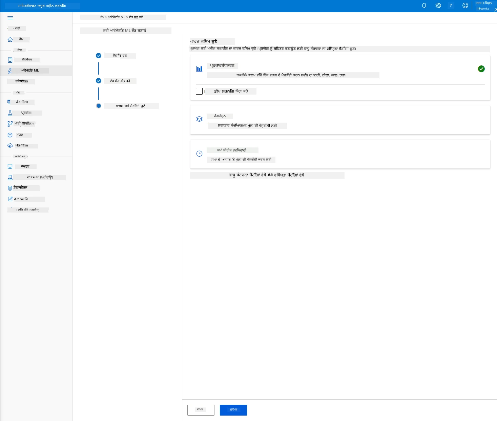

4. ਜਦੋਂ ਰਨ ਮੁਕੰਮਲ ਹੋ ਜਾਵੇ, "Automated ML" ਟੈਬ 'ਤੇ ਕਲਿਕ ਕਰੋ, ਆਪਣੇ ਰਨ 'ਤੇ ਕਲਿੱਕ ਕਰੋ ਅਤੇ "Best model summary" ਕਾਰਡ ਵਿੱਚ ਅਲਗੋਰਿਥਮ 'ਤੇ ਕਲਿਕ ਕਰੋ।

   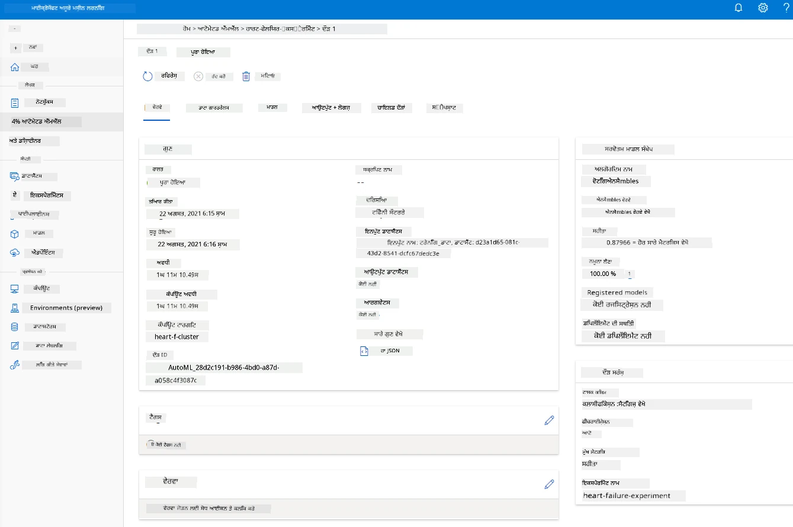

ਇੱਥੇ ਤੁਸੀਂ ਆਟੋਈਐਮਐੱਲ ਦੁਆਰਾ ਤਿਆਰ ਕੀਤਾ ਸਭ ਤੋਂ ਵਧੀਆ ਮਾਡਲ ਦਾ ਵਿਸਥਾਰਤ ਵਰਣਨ ਦੇਖ ਸਕਦੇ ਹੋ। ਤੁਸੀਂ ਮਾਡਲਾਂ ਟੈਬ ਵਿੱਚ ਹੋਰ ਮਾਡਲਾਂ ਨੂੰ ਵੀ ਵੇਖ ਸਕਦੇ ਹੋ। ਕੁਝ ਮਿੰਟ ਲਈ explanations (ਪ੍ਰੀਵੀਉ ਬਟਨ) ਵਿੱਚ ਮਾਡਲਾਂ ਨੂੰ ਸਮਝੋ। ਜਦ ਤੱਕ ਤੁਸੀਂ ਮਾਡਲ ਚੁਣ ਲੈਂਦੇ ਹੋ (ਇੱਥੇ ਅਸੀਂ ਆਟੋਈਐਮਐੱਲ ਦੁਆਰਾ ਚੁਣਿਆ ਸਭ ਤੋਂ ਵਧੀਆ ਮਾਡਲ ਲੈਵਾਂਗੇ), ਅਸੀਂ ਵੇਖਾਂਗੇ ਕਿ ਇਸਨੂੰ ਕਿਵੇਂ ਤਾਇਨਾਤ ਕਰਨਾ ਹੈ।

## 3. ਘੱਟ ਕੋਡ/ਕੋਡ-ਰਹਿਤ ਮਾਡਲ ਤਾਇਨਾਤੀ ਅਤੇ ਏਂਡਪੋਇੰਟ ਦਾ ਉਪਭੋਗ
### 3.1 ਮਾਡਲ ਦੀ ਤਾਇਨਾਤੀ

ਆਟੋਮੇਟਿਡ ਮਸ਼ੀਨ ਲਰਨਿੰਗ ਛੇਤੀ-ਇਸਤਮਾਲੀ ਇੰਟਰਫੇਸ ਤੁਹਾਨੂੰ ਕੁਝ ਕਦਮਾਂ ਵਿੱਚ ਵੈੱਬ ਸੇਵਾ ਵਜੋਂ ਸਭ ਤੋਂ ਵਧੀਆ ਮਾਡਲ ਤਾਇਨਾਤ ਕਰਨ ਦੀ ਆਗਿਆ ਦਿੰਦਾ ਹੈ। ਤਾਇਨਾਤੀ ਉਸ ਪ੍ਰਕਿਰਿਆ ਨੂੰ ਕਹਿੰਦੇ ਹਨ ਜਿਸ ਨਾਲ ਮਾਡਲ ਨੂੰ ਇਸ ਤਰ੍ਹਾਂ ਜੋੜਿਆ ਜਾਂਦਾ ਹੈ ਕਿ ਇਹ ਨਵਾਂ ਡੇਟਾ ਦੇ ਆਧਾਰ 'ਤੇ ਅਨੁਮਾਨ ਲਗਾ ਸਕੇ ਅਤੇ ਸੰਭਾਵਿਤ ਮੌਕਿਆਂ ਨੂੰ ਪਛਾਣ ਸਕੇ। ਇਸ ਪ੍ਰੋਜੈਕਟ ਲਈ, ਵੈੱਬ ਸੇਵਾ ਲਈ ਤਾਇਨਾਤੀ ਦਾ ਅਰਥ ਹੈ ਕਿ ਮੈਡੀਕਲ ਐਪਲੀਕੇਸ਼ਨ ਇਸ ਮਾਡਲ ਨੂੰ ਵਰਤ ਕੇ ਆਪਣੇ ਮਰੀਜ਼ਾਂ ਦੇ ਦਿਲ ਦਾ ਦੌਰਾ ਪੈਣ ਦੀ ਸੰਭਾਵਨਾ ਦੀ ਲਾਈਵ ਭਵਿੱਖਬਾਣੀ ਕਰ ਸਕਣਗੇ।

ਸਭ ਤੋਂ ਵਧੀਆ ਮਾਡਲ ਦੇ ਵਰਣਨ ਵਿੱਚ, "Deploy" ਬਟਨ 'ਤੇ ਕਲਿੱਕ ਕਰੋ।

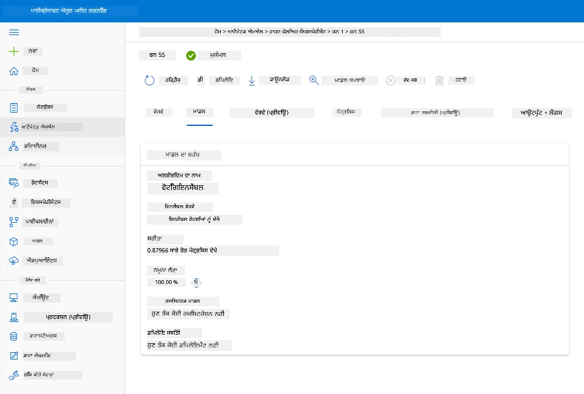

15. ਇਸਨੂੰ ਇੱਕ ਨਾਮ ਦਿਓ, ਵਰਣਨ ਦਿਓ, ਹਨੇਰੀ ਕਿਸਮ (Azure Container Instance) ਚੁਣੋ, ਪ੍ਰਮਾਣਿਕਤਾ ਨੂੰ ਚਾਲੂ ਕਰੋ ਅਤੇ Deploy 'ਤੇ ਕਲਿੱਕ ਕਰੋ। ਇਹ ਕਦਮ ਲਗਭਗ 20 ਮਿੰਟ ਲੈ ਸਕਦਾ ਹੈ। ਤਾਇਨਾਤੀ ਪ੍ਰਕਿਰਿਆ ਵਿੱਚ ਮਾਡਲ ਰਜਿਸਟਰ ਕਰਨ, ਸਰੋਤ ਤਿਆਰ ਕਰਨ ਅਤੇ ਉਨ੍ਹਾਂ ਨੂੰ ਵੈੱਬ ਸੇਵਾ ਲਈ ਸੈੱਟ ਕਰਨ ਸਮੇਤ ਕਈ ਕਦਮ ਸ਼ਾਮਲ ਹਨ। ਤਾਇਨਾਤੀ ਸਥਿਤੀ ਹੇਠਾਂ Deploy status ਵਿੱਚ ਦਿਖਾਈ ਦਿੰਦੀ ਹੈ। Deploy ਸਥਿਤੀ ਚੈੱਕ ਕਰਨ ਲਈ Refresh periodically ਚੁਣੋ। ਜਦੋਂ ਸਥਿਤੀ "Healthy" ਹੋਵੇ, ਤਾਇਨਾਤੀ ਮੁਕੰਮਲ ਹੋ ਚੁੱਕੀ ਹੈ।

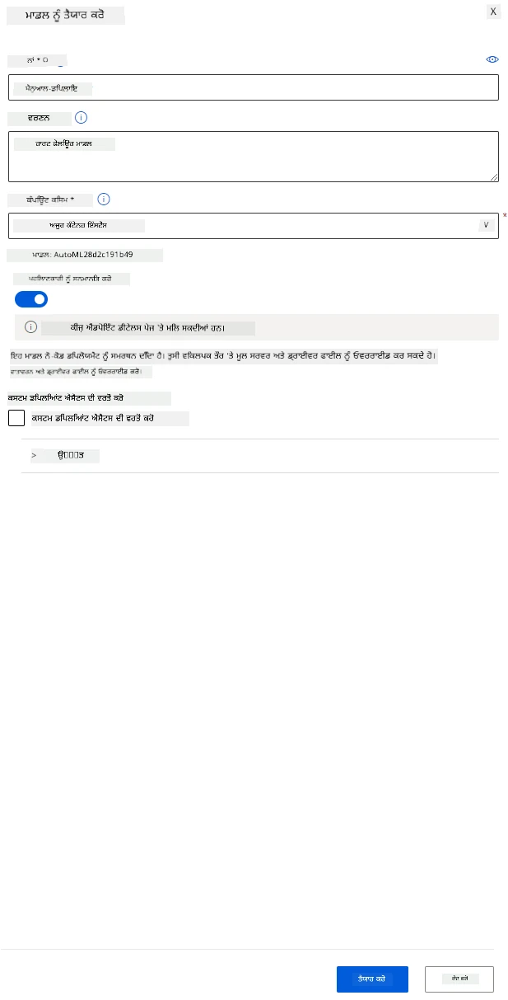

16. ਜਦੋਂ ਇਹ ਤਾਇਨਾਤ ਹੋ ਜਾਵੇ, Endpoint ਟੈਬ 'ਤੇ ਜਾਓ ਅਤੇ ਹਾਲ ਹੀ ਵਿੱਚ ਤਾਇਨਾਤ ਕੀਤੇ endpoint ਨੂੰ ਚੁਣੋ। ਇੱਥੇ ਤੁਹਾਨੂੰ endpoint ਬਾਰੇ ਸਾਰਾ ਵੇਰਵਾ ਮਿਲੇਗਾ।

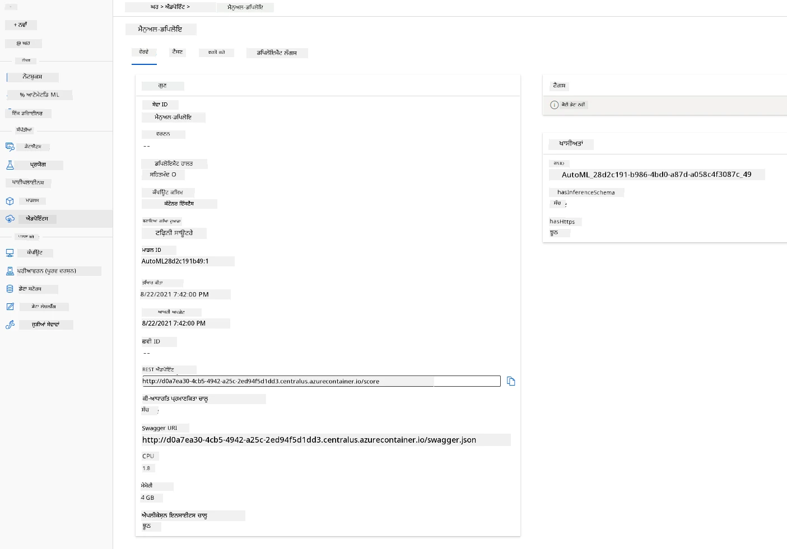

ਸ਼ਾਂਦਾਰ! ਹੁਣ ਜਦੋਂ ਮਾਡਲ ਤਾਇਨਾਤ ਹੋ ਚੁੱਕਾ ਹੈ, ਅਸੀਂ ਏਂਡਪੋਇੰਟ ਦਾ ਉਪਭੋਗ ਸ਼ੁਰੂ ਕਰ ਸਕਦੇ ਹਾਂ।

### 3.2 ਏਂਡਪੋਇੰਟ ਦਾ ਉਪਭੋਗ

"Consume" ਟੈਬ 'ਤੇ ਕਲਿਕ ਕਰੋ। ਇੱਥੇ ਤੁਹਾਨੂੰ REST endpoint ਅਤੇ ਇੱਕ ਪਾਈਥਾਨ ਸਕ੍ਰਿਪਟ ਉਪਲਬਧ ਹੈ ਜੋ ਉਪਭੋਗ ਵਿਕਲਪ ਵਿੱਚ ਹੈ। ਪਾਈਥਾਨ ਕੋਡ ਨੂੰ ਥੋੜਾ ਸਮਾਂ ਦੇਖੋ।

ਇਹ ਸਕ੍ਰਿਪਟ ਸਿੱਧੇ ਤੁਹਾਡੇ ਸਥਾਨਕ ਮਸ਼ੀਨ ਤੋਂ ਚਲਾਈ ਜਾ ਸਕਦੀ ਹੈ ਅਤੇ ਤੁਹਾਡੇ ਈਂਡਪਆਇੰਟ ਦਾ ਉਪਭੋਗ ਕਰੇਗੀ।

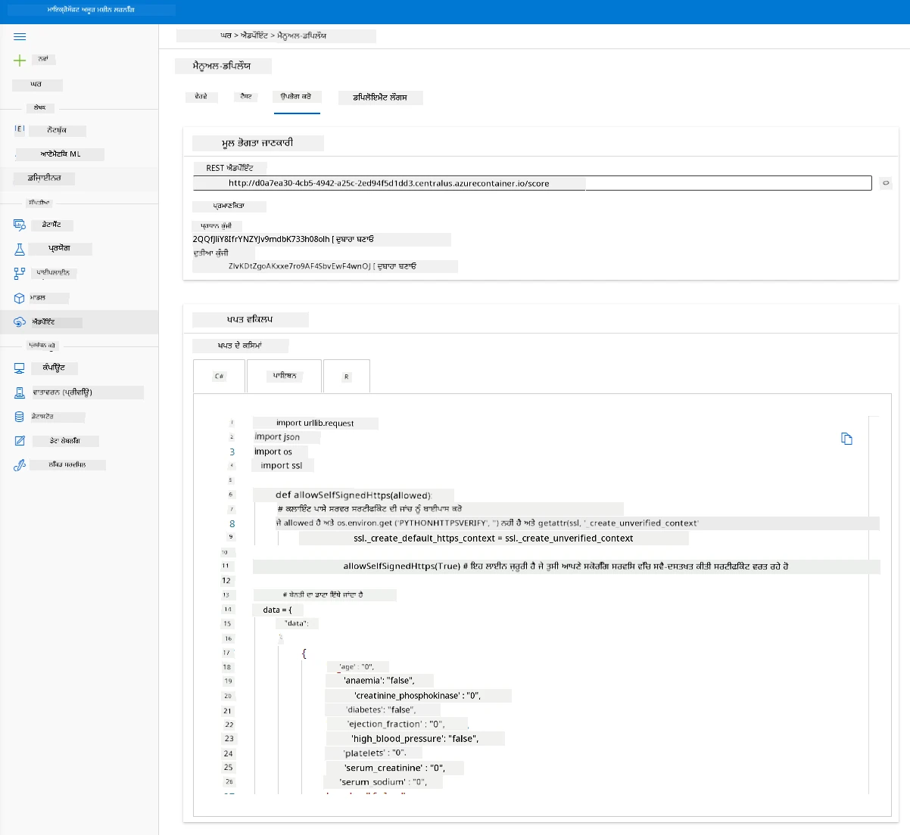

ਇਹ 2 ਕੋਡ ਲਾਈਨਾਂ ਨੂੰ ਧਿਆਨ ਨਾਲ ਵੇਖੋ:  
```python
url = 'http://98e3715f-xxxx-xxxx-xxxx-9ec22d57b796.centralus.azurecontainer.io/score'
api_key = '' # ਇਸਨੂੰ ਵੈੱਬ ਸੇਵਾ ਲਈ API ਕੁੰਜੀ ਨਾਲ ਬਦਲੋ
```
`url` ਵੈਰੀਏਬਲ consumes ਟੈਬ ਵਿੱਚ ਮਿਲੀ REST endpoint ਹੈ ਅਤੇ `api_key` ਵੈਰੀਏਬਲ ਮੁੱਖ ਕੁੰਜੀ ਹੈ ਜੋ consumes ਟੈਬ ਵਿੱਚ ਮਿਲਦੀ ਹੈ (ਜੇ ਤੁਸੀਂ ਪ੍ਰਮਾਣਿਕਤਾ ਚਾਲੂ ਕੀਤੀ ਹੈ ਤਾਂ)। ਇਹ ਹੈ ਕਿ ਸਕ੍ਰਿਪਟ ਕਿਵੇਂ ਈਂਡਪਆਇੰਟ ਦਾ ਉਪਭੋਗ ਕਰ ਸਕਦਾ ਹੈ।

18. ਜਦੋਂ ਸਕ੍ਰਿਪਟ ਚਲਾਇਆ ਜਾਵੇਗਾ, ਤਾਂ ਤੁਹਾਨੂੰ ਹੇਠਾਂ ਦਿੱਤਾ ਨਤੀਜਾ ਦੇਖਣਾ ਚਾਹੀਦਾ ਹੈ:   
    ```python
    b'"{\\"result\\": [true]}"'
    ```
ਇਸਦਾ ਮਤਲਬ ਹੈ ਕਿ ਦਿੱਤੇ ਡੇਟਾ ਲਈ ਦਿਲ ਦਾ ਫੇਲ੍ਹ ਹੋਣ ਦੀ ਭਵਿੱਖਬਾਣੀ ਸੱਚੀ ਹੈ। ਇਹ ਸਮਝਦਾਰੀ ਵਾਲੀ ਗੱਲ ਹੈ ਕਿਉਂਕਿ ਜੇ ਤੁਸੀਂ ਸਕ੍ਰਿਪਟ ਵਿੱਚ ਆਪਣੇ ਆਪ ਬਣਾਇਆ ਡੇਟਾ ਧਿਆਨ ਨਾਲ ਦੇਖੋ ਤਾਂ ਸਾਰੇ ਮੁੱਲ ਮੁ ਦੀ ਪੁਸਤੌਨ੍ਹੀ ’ਤੇ 0 ਅਤੇ False ਹਨ। ਤੁਸੀਂ ਇਨਪੁਟ ਸੈਂਪਲ ਨੂੰ ਬਦਲ ਸਕਦੇ ਹੋ:

```python
data = {
    "data":
    [
        {
            'age': "0",
            'anaemia': "false",
            'creatinine_phosphokinase': "0",
            'diabetes': "false",
            'ejection_fraction': "0",
            'high_blood_pressure': "false",
            'platelets': "0",
            'serum_creatinine': "0",
            'serum_sodium': "0",
            'sex': "false",
            'smoking': "false",
            'time': "0",
        },
        {
            'age': "60",
            'anaemia': "false",
            'creatinine_phosphokinase': "500",
            'diabetes': "false",
            'ejection_fraction': "38",
            'high_blood_pressure': "false",
            'platelets': "260000",
            'serum_creatinine': "1.40",
            'serum_sodium': "137",
            'sex': "false",
            'smoking': "false",
            'time': "130",
        },
    ],
}
```
ਸਕ੍ਰਿਪਟ ਇਸ ਤਰ੍ਹਾਂ ਦਾ ਨਤੀਜਾ ਦੇਵੇਗੀ:  
    ```python
    b'"{\\"result\\": [true, false]}"'
    ```

ਸ਼ਾਬਾਸ਼! ਤੁਸੀਂ ਅਜੇ ਵੀ ਮਾਡਲ ਦਾ ਉਪਭੋਗ ਕੀਤਾ ਹੈ ਜੋ ਤਾਇਨਾਤ ਅਤੇ ਤਿਆਰ ਕੀਤਾ ਗਿਆ ਹੈ Azure ML ‘ਤੇ!

> **_ਨੋਟ:_** ਪ੍ਰੋਜੈਕਟ ਸਿਖਮਾਪਤ ਹੋਣ ਤੋਂ ਬਾਅਦ, ਸਾਰੇ ਸਰੋਤਾਂ ਨੂੰ ਮਿਟਾਉਣਾ ਨਾ ਭੁੱਲੋ।  
## 🚀 ਚੈਲੇਂਜ

ਆਟੋਐਮਐੱਲ ਦੁਆਰਾ ਬਣਾਈਆਂ ਮਾਡਲਾਂ ਦੇ ਵਰਨਨ ਅਤੇ ਵੇਰਵੇ ਨੂੰ ਧਿਆਨ ਨਾਲ ਦੇਖੋ ਜੋ ਉੱਚ-ਸਤਹ ਮਾਡਲਾਂ ਲਈ ਜਨਰੇਟ ਕੀਤੇ ਗਏ। ਕੋਸ਼ਿਸ਼ ਕਰੋ ਸਮਝਣ ਦੀ ਕਿ ਸਭ ਤੋਂ ਵਧੀਆ ਮਾਡਲ ਹੋਰਾਂ ਨਾਲੋਂ ਕਿਉਂ ਬਿਹਤਰ ਹੈ। ਕਿਹੜੇ ਅਲਗੋਰਿਥਮ ਤੁਲਨਾ ਕੀਤੇ ਗਏ ਸਨ? ਉਹਨਾਂ ਵਿਚ ਕੀ ਫਰਕ ਹੈ? ਇਸ ਮਾਮਲੇ ਵਿੱਚ ਸਭ ਤੋਂ ਵਧੀਆ ਮਾਡਲ ਕਿਉਂ ਵਧੀਆ ਫਲਾਉਂਦਾ ਹੈ?

## [ਪোਸਟ-ਲੇਕਚਰ ਕੁਇਜ਼](https://ff-quizzes.netlify.app/en/ds/quiz/35)

## ਸਮੀਖਿਆ ਅਤੇ ਸਵੈ ਅਧਿਐਨ

ਇਸ ਪਾਠ ਵਿੱਚ, ਤੁਸੀਂ ਸਿੱਖਿਆ ਕਿ ਕਿਸ ਤਰ੍ਹਾਂ ਇੱਕ ਮਾਡਲ ਨੂੰ ਤਿਆਰ ਕਰਨਾ, ਤਾਇਨਾਤ ਕਰਨਾ ਅਤੇ ਉਪਭੋਗ ਕਰਨਾ ਜਦੋਂ ਦਿਲ ਦੀ ਨਾਕਾਮੀ ਦੀ ਭਵਿੱਖਬਾਣੀ ਘੱਟ ਕੋਡ/ਕੋਡ-ਰਹਿਤ ਢੰਗ ਨਾਲ ਕਲਾਉਡ ਵਿੱਚ ਕੀਤਾ ਜਾਵੇ। ਜੇ ਤੁਸੀਂ ਅਜੇ ਤੱਕ ਨਹੀਂ ਕੀਤਾ, ਤਾਂ ਉੱਚ-ਸਤਹ ਦੇ ਮਾਡਲਾਂ ਲਈ ਆਟੋਐਮਐੱਲ ਦੁਆਰਾ ਬਣਾਏ ਵਰਨਨਾਂ ਵਿੱਚ ਹੋਰ ਡੂੰਘਾਈ ਨਾਲ ਡੁੱਬਕਾ ਲਗਾਓ ਅਤੇ ਸਮਝਣ ਦੀ ਕੋਸ਼ਿਸ਼ ਕਰੋ ਕਿ ਸਭ ਤੋਂ ਵਧੀਆ ਮਾਡਲ ਹੋਰਾਂ ਨਾਲੋਂ ਕਿਉਂ ਬਿਹਤਰ ਹੈ।

ਤੁਸੀਂ ਇਸ [ਦਸਤਾਵੇਜ਼](https://docs.microsoft.com/azure/machine-learning/tutorial-first-experiment-automated-ml?WT.mc_id=academic-77958-bethanycheum&ocid=AID3041109) ਨੂੰ ਪੜ੍ਹ ਕੇ ਘੱਟ ਕੋਡ/ਕੋਡ-ਰਹਿਤ ਆਟੋਐਮਐੱਲ ਬਾਰੇ ਹੋਰ ਜਾਣਕਾਰੀ ਲੈ ਸਕਦੇ ਹੋ।

## ਅਸਾਈਨਮੈਂਟ

[ਘੱਟ ਕੋਡ/ਕੋਡ-ਰਹਿਤ ਡਾਟਾ ਸਾਇੰਸ ਪ੍ਰੋਜੈਕਟ Azure ML 'ਤੇ](assignment.md)

---

<!-- CO-OP TRANSLATOR DISCLAIMER START -->
**ਅਸਵੀਕਾਰੋਪਣ**:
ਇਸ ਦਸਤਾਵੇਜ਼ ਦਾ ਅਨੁਵਾਦ ਏਆਈ ਅਨੁਵਾਦ ਸੇਵਾ [Co-op Translator](https://github.com/Azure/co-op-translator) ਦੀ ਵਰਤੋਂ ਕਰਕੇ ਕੀਤਾ ਗਿਆ ਹੈ। ਜਦੋਂ ਕਿ ਅਸੀਂ ਸਹੀਤਾਵਾਂ ਲਈ ਯਤਨਸ਼ੀਲ ਹਾਂ, ਕਿਰਪਾ ਕਰਕੇ ਧਿਆਨ ਰੱਖੋ ਕਿ ਸਵੈਚਾਲਿਤ ਅਨੁਵਾਦਾਂ ਵਿੱਚ ਗਲਤੀਆਂ ਜਾਂ ਅਸਮੱਤਿਆਵਾਂ ਹੋ ਸਕਦੀਆਂ ਹਨ। ਮੂਲ ਦਸਤਾਵੇਜ਼ ਆਪਣੀ ਮੂਲ ਭਾਸ਼ਾ ਵਿੱਚ ਅਧਿਕਾਰਕ ਸਰੋਤ ਮੰਨਿਆ ਜਾਣਾ ਚਾਹੀਦਾ ਹੈ। ਜਰੂਰੀ ਜਾਣਕਾਰੀ ਲਈ, ਪੇਸ਼ੇਵਰ ਮਨੁੱਖੀ ਅਨੁਵਾਦ ਦੀ ਸਿਫ਼ਾਰਸ਼ ਕੀਤੀ ਜਾਂਦੀ ਹੈ। ਅਸੀਂ ਇਸ ਅਨੁਵਾਦ ਦੇ ਉਪਯੋਗ ਤੋਂ ਪੈਦਾ ਹੋਣ ਵਾਲੀਆਂ ਕਿਸੇ ਵੀ ਗਲਤਫਹਿਮੀਆਂ ਜਾਂ ਗਲਤ ਵਿਆਖਿਆਵਾਂ ਲਈ ਜਵਾਬਦੇਹ ਨਹੀਂ ਹਾਂ।
<!-- CO-OP TRANSLATOR DISCLAIMER END -->