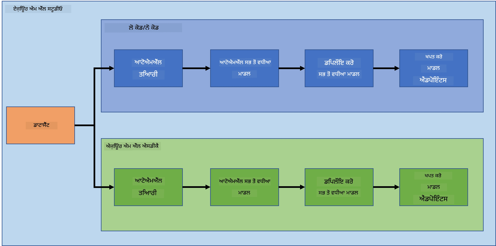
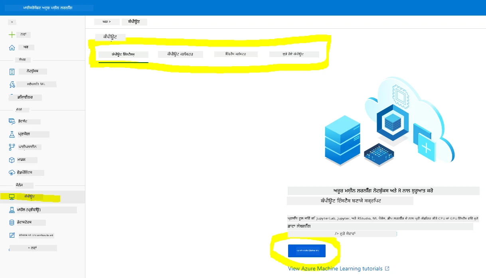
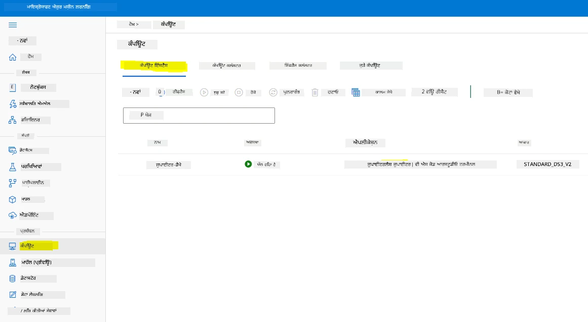
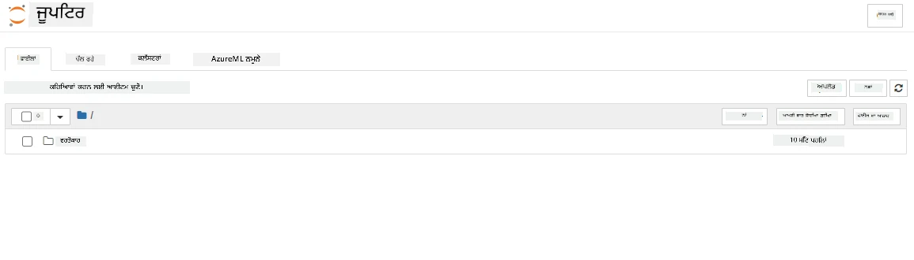

# ਕਲਾਉਡ ਵਿੱਚ ਡਾਟਾ ਸਾਇੰਸ: "Azure ML SDK" ਢੰਗ 

| ](../../sketchnotes/19-DataScience-Cloud.png)|
|:---:|
| ਕਲਾਉਡ ਵਿੱਚ ਡਾਟਾ ਸਾਇੰਸ: Azure ML SDK - _Sketchnote by [@nitya](https://twitter.com/nitya)_ |

ਸੂਚੀ ਦਾ ਸਾਰांश:

- [ਕਲਾਉਡ ਵਿੱਚ ਡਾਟਾ ਸਾਇੰਸ: "Azure ML SDK" ਢੰਗ](#ਕਲਾਉਡ-ਵਿੱਚ-ਡਾਟਾ-ਸਾਇੰਸ-azure-ml-sdk-ਢੰਗ)
  - [ਪ੍ਰੀ-ਲੈਕਚਰ ਕਵਿਜ਼](#ਪ੍ਰੀ-ਲੈਕਚਰ-ਕਵਿਜ਼)
  - [1. ਪਰੀਚੈ](#1-ਪਰੀਚੈ)
    - [1.1 Azure ML SDK ਕੀ ਹੈ?](#11-azure-ml-sdk-ਕੀ-ਹੈ)
    - [1.2 ਹਾਰਟ ਫੇਲਿਯਰ ਭਵਿੱਖਬਾਣੀ ਪ੍ਰੋਜੈਕਟ ਅਤੇ ਡੈਟਾਸੈੱਟ ਪਰੀਚੈ](#12-ਹਾਰਟ-ਫੇਲਿਯਰ-ਭਵਿੱਖਬਾਣੀ-ਪ੍ਰੋਜੈਕਟ-ਅਤੇ-ਡੈਟਾਸੈੱਟ-ਪਰੀਚੈ)
  - [2. Azure ML SDK ਨਾਲ ਮਾਡਲ ਦੀ ਪ੍ਰਸ਼ਿਕਸ਼ਣ](#2-azure-ml-sdk-ਨਾਲ-ਮਾਡਲ-ਦੀ-ਪ੍ਰਸ਼ਿਕਸ਼ਣ)
    - [2.1 ਇੱਕ Azure ML ਵਰਕਸਪੇਸ ਬਣਾਉਣਾ](#21-ਇੱਕ-azure-ml-ਵਰਕਸਪੇਸ-ਬਣਾਉਣਾ)
    - [2.2 ਇੱਕ ਕਮਪਿਊਟ ਇੰਸਟੈਂਸ ਬਣਾਉਣਾ](#22-ਇੱਕ-ਕਮਪਿਊਟ-ਇੰਸਟੈਂਸ-ਬਣਾਉਣਾ)
    - [2.3 ਡੈਟਾਸੈੱਟ ਲੋਡ ਕਰਨਾ](#23-ਡੈਟਾਸੈੱਟ-ਲੋਡ-ਕਰਨਾ)
    - [2.4 ਨੋਟਬੁੱਕ ਬਣਾਉਣਾ](#24-ਨੋਟਬੁੱਕ-ਬਣਾਉਣਾ)
    - [2.5 ਮਾਡਲ ਦੀ ਪ੍ਰਸ਼ਿਕਸ਼ਣ](#25-ਮਾਡਲ-ਦੀ-ਪ੍ਰਸ਼ਿਕਸ਼ਣ)
      - [2.5.1 ਵਰਕਸਪੇਸ, ਪ੍ਰਯੋਗ, ਕਮਪਿਊਟ ਕਲੱਸਟਰ ਅਤੇ ਡੈਟਾਸੈੱਟ ਸੈੱਟਅੱਪ ਕਰਨਾ](#251-ਵਰਕਸਪੇਸ-ਪ੍ਰਯੋਗ-ਕਮਪਿਊਟ-ਕਲੱਸਟਰ-ਅਤੇ-ਡੈਟਾਸੈੱਟ-ਸੈੱਟਅੱਪ-ਕਰਨਾ)
      - [2.5.2 AutoML ਵਿਵਸਥਾ ਅਤੇ ਪ੍ਰਸ਼ਿਕਸ਼ਣ](#252-automl-ਵਿਵਸਥਾ-ਅਤੇ-ਪ੍ਰਸ਼ਿਕਸ਼ਣ)
  - [3. Azure ML SDK ਨਾਲ ਮਾਡਲ ਡਿਪਲੋਯਮੈਂਟ ਅਤੇ ਐਂਡਪੌਇੰਟ ਖਪਤ](#3-azure-ml-sdk-ਨਾਲ-ਮਾਡਲ-ਡਿਪਲੋਯਮੈਂਟ-ਅਤੇ-ਐਂਡਪੌਇੰਟ-ਖਪਤ)
    - [3.1 ਸਭ ਤੋਂ ਵਧੀਆ ਮਾਡਲ ਸੁਰੱਖਿਅਤ ਕਰਨਾ](#31-ਸਭ-ਤੋਂ-ਵਧੀਆ-ਮਾਡਲ-ਸੁਰੱਖਿਅਤ-ਕਰਨਾ)
    - [3.2 ਮਾਡਲ ਡਿਪਲੋਯਮੈਂਟ](#32-ਮਾਡਲ-ਡਿਪਲੋਯਮੈਂਟ)
    - [3.3 ਐਂਡਪੌਇੰਟ ਖਪਤ](#33-ਐਂਡਪੌਇੰਟ-ਖਪਤ)
  - [🚀 ਚੈਲੈਂਜ](#-challenge)
  - [ਪੋਸਟ-ਲੈਕਚਰ ਕਵਿਜ਼](#ਪੋਸਟ-ਲੈਕਚਰ-ਕਵਿਜ਼)
  - [ਸਮੀਖਿਆ ਅਤੇ ਸਵੈ ਅਧਿਐਨ](#review--self-study)
  - [ਅਸਾਈਨਮੈਂਟ](#ਅਸਾਇਨਮੈਂਟ)

## [ਪ੍ਰੀ-ਲੈਕਚਰ ਕਵਿਜ਼](https://ff-quizzes.netlify.app/en/ds/quiz/36)

## 1. ਪਰੀਚੈ

### 1.1 Azure ML SDK ਕੀ ਹੈ?

ਡਾਟਾ ਵਿਗਿਆਨੀਆਂ ਅਤੇ AI ਡਿਵੈਲਪਰਾਂ ਨੂੰ Azure Machine Learning SDK ਦੀ ਵਰਤੋਂ ਕਰਕੇ Azure Machine Learning ਸੇਵਾ ਨਾਲ ਮਸ਼ੀਨ ਲਰਨਿੰਗ ਵਰਕਫਲੋਅ ਬਣਾਉਣ ਅਤੇ ਚਲਾਉਣ ਵਿੱਚ ਮਦਦ ਮਿਲਦੀ ਹੈ। ਤੁਸੀਂ ਕਿਸੇ ਵੀ ਪਾਇਥਨ ਵਾਤਾਵਰਣ ਵਿੱਚ ਇਸ ਸੇਵਾ ਨਾਲ ਸੰਪਰਕ ਕਰ ਸਕਦੇ ਹੋ, ਜਿਵੇਂ Jupyter ਨੋਟਬੁੱਕ, Visual Studio ਕੋਡ, ਜਾਂ ਤੁਹਾਡੇ ਮਨਪਸੰਦ ਪਾਇਥਨ IDE ਵਿੱਚ।

SDK ਦੇ ਮੁੱਖ ਖੇਤਰ ਹਨ:

- ਆਪਣੇ ਮਸ਼ੀਨ ਲਰਨਿੰਗ ਪ੍ਰਯੋਗਾਂ ਵਿੱਚ ਵਰਤੇ ਜਾਣ ਵਾਲੇ ਡੈਟਾਸੈੱਟ ਦੀ ਖੋਜ, ਤਿਆਰੀ ਅਤੇ ਜੀਵਨਚੱਕਰ ਪ੍ਰਬੰਧਨ ਕਰੋ।
- ਮਸ਼ੀਨ ਲਰਨਿੰਗ ਪ੍ਰਯੋਗਾਂ ਦੀ ਨਿਗਰਾਨੀ, ਲੌਗਿੰਗ ਅਤੇ ਵਿਵਸਥਾ ਲਈ ਕਲਾਉਡ ਸਰੋਤਾਂ ਦਾ ਪ੍ਰਬੰਧਨ ਕਰੋ।
- ਮਾਡਲਾਂ ਨੂੰ ਸਥਾਨਕ ਜਾਂ ਕਲਾਉਡ ਸਰੋਤਾਂ (ਜਿਵੇਂ GPU-ਸਹਾਇਤ ਮਾਡਲ ਪ੍ਰਸ਼ਿਕਸ਼ਣ) ਨਾਲ ਪ੍ਰਸ਼ਿਖਿਤ ਕਰੋ।
- ਆਟੋਮੈਟਿਕ ਮਸ਼ੀਨ ਲਰਨਿੰਗ ਦੀ ਵਰਤੋਂ ਕਰੋ, ਜੋ ਵਿਵਸਥਾ ਪੈਰਾਮੀਟਰ ਅਤੇ ਪ੍ਰਸ਼ਿਕਸ਼ਣ ਡਾਟਾ ਲੈਂਦਾ ਹੈ। ਇਹ ਆਪੋ-ਆਪਣੇ ਅਲਗੋਰਿਦਮ ਅਤੇ ਹਾਈਪਰਪੈਰਾਮੀਟਰ ਸੈਟਿੰਗਾਂ ਵਿਚਕਾਰ ਚੱਲਦਾ ਹੈ ਅਤੇ ਸਭ ਤੋਂ ਵਧੀਆ ਮਾਡਲ ਧੁੰਧਦਾ ਹੈ।
- ਵੈੱਬ ਸੇਵਾਵਾਂ ਨੂੰ ਡਿਪਲੋਇ ਕਰੋ, ਜਿਸ ਨਾਲ ਤੁਹਾਡੇ ਪ੍ਰਸ਼ਿਖਿਤ ਮਾਡਲ RESTful ਸੇਵਾਵਾਂ ਵਜੋਂ ਬਦਲੇ ਜਾਂਦੇ ਹਨ ਜੋ ਕਿਸੇ ਵੀ ਐਪਲੀਕੇਸ਼ਨ ਵਿੱਚ ਵਰਤੇ ਜਾ ਸਕਦੇ ਹਨ।

[Azure Machine Learning SDK ਬਾਰੇ ਹੋਰ ਜਾਣੋ](https://docs.microsoft.com/python/api/overview/azure/ml?WT.mc_id=academic-77958-bethanycheum&ocid=AID3041109)

ਪਿਛਲੇ ਪਾਠ ਵਿੱਚ, ਅਸੀਂ ਦੇਖਿਆ ਕਿ ਕਿਵੇਂ ਇੱਕ Low code/No code ਢੰਗ ਵਿੱਚ ਮਾਡਲ ਦੀ ਪ੍ਰਸ਼ਿਕਸ਼ਣ, ਡਿਪਲੋਯਮੈਂਟ ਅਤੇ ਖਪਤ ਕਰਨੀ ਹੈ। ਅਸੀਂ Heart Failure ਡੇਟਾਸੈੱਟ ਦੀ ਵਰਤੋਂ ਕਰਕੇ Heart failure prediction ਮਾਡਲ ਬਣਾਇਆ। ਇਸ ਪਾਠ ਵਿੱਚ, ਅਸੀਂ ਇੱਕੋ ਜਿਹਾ ਕੰਮ Azure Machine Learning SDK ਨਾਲ ਕਰਣ ਜਾ ਰਹੇ ਹਾਂ।



### 1.2 ਹਾਰਟ ਫੇਲਿਯਰ ਭਵਿੱਖਬਾਣੀ ਪ੍ਰੋਜੈਕਟ ਅਤੇ ਡੈਟਾਸੈੱਟ ਪਰੀਚੈ

ਹਾਰਟ ਫੇਲਿਯਰ ਭਵਿੱਖਬਾਣੀ ਪ੍ਰੋਜੈਕਟ ਅਤੇ ਡੈਟਾਸੈੱਟ ਪਰੀਚੈ ਲਈ [ਇੱਥੇ](../18-Low-Code/README.md) ਵੇਖੋ।

## 2. Azure ML SDK ਨਾਲ ਮਾਡਲ ਦੀ ਪ੍ਰਸ਼ਿਕਸ਼ਣ
### 2.1 ਇੱਕ Azure ML ਵਰਕਸਪੇਸ ਬਣਾਉਣਾ

ਸਰਲਤਾ ਲਈ, ਅਸੀਂ ਇੱਕ ਜੁਪੀਟਰ ਨੋਟਬੁੱਕ 'ਤੇ ਕੰਮ ਕਰ ਰਹੇ ਹਾਂ। ਇਸਦਾ ਮਤਲਬ ਹੈ ਕਿ ਤੁਹਾਡੇ ਕੋਲ ਪਹਿਲਾਂ ਹੀ ਇੱਕ ਵਰਕਸਪੇਸ ਅਤੇ ਕਮਪਿਊਟ ਇੰਸਟੈਂਸ ਹੋਣਾ ਚਾਹੀਦਾ ਹੈ। ਜੇ ਤੁਹਾਡੇ ਕੋਲ ਵਰਕਸਪੇਸ ਹੈ, ਤਾਂ ਤੁਸੀਂ ਸਿੱਧਾ ਹਿੱਸਾ 2.3 ਨੋਟਬੁੱਕ ਬਣਾਉਣਾ 'ਤੇ ਜਾ ਸਕਦੇ ਹੋ।

ਜੇ ਨਹੀਂ, ਤਾਂ ਕਿਰਪਾ ਕਰਕੇ [ਪਿਛਲੇ ਪਾਠ](../18-Low-Code/README.md) ਵਿੱਚ ਦੇਖੇ ਗਏ **2.1 ਇੱਕ Azure ML ਵਰਕਸਪੇਸ ਬਣਾਉਣਾ** ਹਿੱਸੇ ਦੀ ਹਦਾਇਤਾਂ ਦੀ ਪਾਲਣਾ ਕਰੋ।

### 2.2 ਇੱਕ ਕਮਪਿਊਟ ਇੰਸਟੈਂਸ ਬਣਾਉਣਾ

ਜੋ Azure ML ਵਰਕਸਪੇਸ ਅਸੀਂ ਪਹਿਲਾਂ ਬਣਾਇਆ ਸੀ, ਉਸ ਵਿੱਚ ਕਮਪਿਊਟ ਮੇਨੂ 'ਤੇ ਜਾਓ ਅਤੇ ਉਹ ਵੱਖ-ਵੱਖ ਕਮਪਿਊਟ ਸਰੋਤ ਤੁਹਾਨੂੰ ਦਿਖਾਏ ਜਾਣਗੇ



ਆਓ ਇੱਕ ਕਮਪਿਊਟ ਇੰਸਟੈਂਸ ਬਣਾਈਏ ਤਾਂ ਜੋ ਜੁਪੀਟਰ ਨੋਟਬੁੱਕ ਸੇਵਾ ਲਈ ਤਿਆਰ ਹੋ ਸਕੇ।  
1. + ਨਵਾਂ ਬਟਨ 'ਤੇ ਕਲਿੱਕ ਕਰੋ।  
2. ਆਪਣੇ ਕਮਪਿਊਟ ਇੰਸਟੈਂਸ ਨੂੰ ਇੱਕ ਨਾਮ ਦਿਓ।  
3. ਆਪਣੇ ਵਿਕਲਪ ਚੁਣੋ: CPU ਜਾਂ GPU, VM ਆਕਾਰ ਅਤੇ ਕੋਰ ਦੀ ਗਿਣਤੀ।  
4. ਬਣਾਉਣ ਬਟਨ 'ਤੇ ਕਲਿੱਕ ਕਰੋ।  

ਵਧਾਈ ਹੋ! ਤੁਸੀਂ ਇੱਕ ਕਮਪਿਊਟ ਇੰਸਟੈਂਸ ਬਣਾਇਆ ਹੈ। ਅਸੀਂ ਇਸ ਦਾ ਉਪਯੋਗ ਨੋਟਬੁੱਕ ਬਣਾਉਣ ਲਈ ਕਰਾਂਗੇ [ਨੋਟਬੁੱਕ ਬਣਾਉਣਾ ਹਿੱਸਾ](#23-ਡੈਟਾਸੈੱਟ-ਲੋਡ-ਕਰਨਾ) ਵਿੱਚ।

### 2.3 ਡੈਟਾਸੈੱਟ ਲੋਡ ਕਰਨਾ
ਜੇ ਤੁਸੀਂ ਅਜੇ ਤੱਕ ਡੈਟਾਸੈੱਟ ਅੱਪਲੋਡ ਨਹੀਂ ਕੀਤਾ ਹੈ, ਤਾਂ [ਪਿਛਲੇ ਪਾਠ](../18-Low-Code/README.md) ਦੇ **2.3 ਡੈਟਾਸੈੱਟ ਲੋਡ ਕਰਨਾ** ਹਿੱਸੇ ਨੂੰ ਵੇਖੋ।

### 2.4 ਨੋਟਬੁੱਕ ਬਣਾਉਣਾ

> **_ਟਿੱਪਣੀ:_** ਅਗਲੇ ਕਦਮ ਲਈ, ਤੁਸੀਂ ਕੱਚੇ ਸਿਰੇ ਤੋਂ ਨਵਾਂ ਨੋਟਬੁੱਕ ਬਣਾ ਸਕਦੇ ਹੋ, ਜਾਂ ਤੁਸੀਂ ਆਪਣੀ Azure ML Studio ਵਿੱਚ [ਨੋਟਬੁੱਕ ਜੋ ਅਸੀਂ ਬਣਾਇਆ ਹੈ](notebook.ipynb) ਅੱਪਲੋਡ ਕਰ ਸਕਦੇ ਹੋ। ਅੱਪਲੋਡ ਕਰਨ ਲਈ, ਸਿੱਧਾ "ਨੋਟਬੁੱਕ" ਮੀਨੂ 'ਤੇ ਕਲਿੱਕ ਕਰੋ ਅਤੇ ਨੋਟਬੁੱਕ ਅੱਪਲੋਡ ਕਰੋ।

ਨੋਟਬੁੱਕ ਡਾਟਾ ਸਾਇੰਸ ਪ੍ਰਕਿਰਿਆ ਦਾ ਬਹੁਤ ਮਹੱਤਵਪੂਰਨ ਹਿੱਸਾ ਹੈ। ਇਹ ਡਾਟਾ ਦਾ ਖੋਜਾਤਮਕ ਵਿਸ਼ਲੇਸ਼ਣ (EDA) ਕਰਨ, ਕਮਪਿਊਟ ਕਲੱਸਟਰ ਨੂੰ ਮਾਡਲ ਪ੍ਰਸ਼ਿਕਸ਼ਣ ਲਈ ਕਾਲ ਕਰਨ, ਅਤੇ ਇੰਫਰੈਂਸ ਕਲੱਸਟਰ ਨੂੰ ਐਂਡਪੌਇੰਟ ਡਿਪਲੋਯਮੈਂਟ ਲਈ ਕਾਲ ਕਰਨ ਵਿੱਚ ਵਰਤੇ ਜਾਂਦੇ ਹਨ।

ਨੋਟਬੁੱਕ ਬਣਾਉਣ ਲਈ, ਸਾਨੂੰ ਇੱਕ ਕਮਪਿਊਟ ਨੋਡ ਚਾਹੀਦਾ ਹੈ ਜੋ ਜੁਪੀਟਰ ਨੋਟਬੁੱਕ ਸੇਵਾ ਚਲਾ ਰਿਹਾ ਹੋਵੇ। ਵਾਪਸ [Azure ML ਵਰਕਸਪੇਸ](https://ml.azure.com/) ਉੱਤੇ ਜਾਓ ਅਤੇ ਕਮਪਿਊਟ ਇੰਸਟੈਂਸ ਉੱਤੇ ਕਲਿੱਕ ਕਰੋ। ਕਮਪਿਊਟ ਇੰਸਟੈਂਸ ਦੀ ਸੂਚੀ ਵਿੱਚ ਤੁਹਾਨੂੰ ਅਸੀਂ ਪਹਿਲਾਂ ਬਣਾਇਆ ਹੋਇਆ ਕਮਪਿਊਟ ਇੰਸਟੈਂਸ ਦਿਖਾਈ ਦੇਣਾ ਚਾਹੀਦਾ ਹੈ।

1. ਐਪਲੀਕੇਸ਼ਨ ਹਿੱਸੇ ਵਿੱਚ, ਜੁਪੀਟਰ ਵਿਕਲਪ ਨੂੰ ਕਲਿੱਕ ਕਰੋ।  
2. "Yes, I understand" ਬਾਕਸ ਨੂੰ ਟਿਕ ਕਰੋ ਅਤੇ ਜਾਰੀ ਰੱਖਣ ਲਈ ਕਲਿੱਕ ਕਰੋ।  
  
3. ਇਹ ਤੁਹਾਡੇ ਜੁਪੀਟਰ ਨੋਟਬੁੱਕ ਇੰਸਟੈਂਸ ਨਾਲ ਨਵੀਂ ਬਰਾਊਜ਼ਰ ਟੈਬ ਖੋਲੇਗਾ। ਨਵਾਂ ਬਟਨ ਕਲਿੱਕ ਕਰਕੇ ਨੋਟਬੁੱਕ ਬਣਾਓ।  



ਹੁਣ ਜਦੋਂ ਸਾਡੇ ਕੋਲ ਨੋਟਬੁੱਕ ਹੈ, ਅਸੀਂ Azure ML SDK ਨਾਲ ਮਾਡਲ ਪ੍ਰਸ਼ਿਖਣ ਸ਼ੁਰੂ ਕਰ ਸਕਦੇ ਹਾਂ।

### 2.5 ਮਾਡਲ ਦੀ ਪ੍ਰਸ਼ਿਕਸ਼ਣ

ਸਭ ਤੋਂ ਪਹਿਲਾਂ, ਜੇ ਤੁਹਾਨੂੰ ਕਦੇ ਵੀ ਸ਼ੱਕ ਹੋਵੇ, ਤਾਂ [Azure ML SDK ਡੌਕੂਮੈਂਟੇਸ਼ਨ](https://docs.microsoft.com/python/api/overview/azure/ml?WT.mc_id=academic-77958-bethanycheum&ocid=AID3041109) ਨੂੰ ਸੰਬੋਧ ਕਰੋ। ਇਸ ਵਿੱਚ ਸਾਰੇ ਜਰੂਰੀ ਜਾਣਕਾਰੀਆਂ ਹਨ ਜੋ ਅਸੀਂ ਇਸ ਪਾਠ ਵਿੱਚ ਦੇਖਣ ਜਾ ਰਹੇ ਮਾਡਿਊਲਾਂ ਨੂੰ ਸਮਝਣ ਵਿੱਚ ਮਦਦ ਕਰੇਗਾ।

#### 2.5.1 ਵਰਕਸਪੇਸ, ਪ੍ਰਯੋਗ, ਕਮਪਿਊਟ ਕਲੱਸਟਰ ਅਤੇ ਡੈਟਾਸੈੱਟ ਸੈੱਟਅੱਪ ਕਰਨਾ

ਤੁਹਾਨੂੰ ਕਨਫਿਗਰੈਸ਼ਨ ਫਾਇਲ ਤੋਂ `workspace` ਲੋਡ ਕਰਨੀ ਪਏਗੀ ਹੇਠਾਂ ਦਿੱਤੇ ਕੋਡ ਨਾਲ:

```python
from azureml.core import Workspace
ws = Workspace.from_config()
```

ਇਹ ਵਸ্তু `Workspace` ਕਿਸਮ ਦੀ ਹੁੰਦੀ ਹੈ ਜੋ ਵਰਕਸਪੇਸ ਦਾ ਪ੍ਰਤੀਨਿਧিত্ব ਕਰਦੀ ਹੈ। ਫਿਰ ਤੁਹਾਨੂੰ ਹੇਠਾਂ ਦਿੱਤੇ ਕੋਡ ਨਾਲ ਇੱਕ `experiment` ਬਣਾਉਣਾ ਪਵੇਗਾ:

```python
from azureml.core import Experiment
experiment_name = 'aml-experiment'
experiment = Experiment(ws, experiment_name)
```

ਵਰਕਸਪੇਸ ਤੋਂ ਪ੍ਰਯੋਗ ਲੈਣ ਜਾਂ ਬਣਾਉਣ ਲਈ, ਤੁਸੀਂ ਪ੍ਰਯੋਗ ਦਾ ਨਾਮ ਦੇ ਕੇ ਪ੍ਰਯੋਗ ਦੀ ਮੰਗ ਕਰਦੇ ਹੋ। ਪ੍ਰਯੋਗ ਦਾ ਨਾਮ 3-36 ਅੱਖਰ ਦਾ ਹੋਣਾ ਚਾਹੀਦਾ ਹੈ, ਇੱਕ ਅੱਖਰ ਜਾਂ ਨੰਬਰ ਨਾਲ ਸ਼ੁਰੂ ਹੋ ਅਤੇ ਸਿਰਫ ਅੱਖਰ, ਨੰਬਰ, ਅੰਡਰਸਕੋਰ, ਅਤੇ ਡੈਸ਼ਜ਼ ਦਾ ਸਮਾਵੇਸ਼ ਹੋਵੇ। ਜੇ ਪ੍ਰਯੋਗ ਵਰਕਸਪੇਸ ਵਿੱਚ ਨਹੀਂ ਮਿਲਦਾ, ਤਾਂ ਇੱਕ ਨਵਾਂ ਪ੍ਰਯੋਗ ਬਣਾਇਆ ਜਾਂਦਾ ਹੈ।

ਹੁਣ ਤੁਸੀਂ ਪ੍ਰਸ਼ਿਕਸ਼ਣ ਲਈ ਹੇਠਾਂ ਦਿੱਤੇ ਕੋਡ ਨਾਲ ਕਮਪਿਊਟ ਕਲੱਸਟਰ ਬਣਾਉਣਾ ਹੈ। ਇਸ ਕਦਮ ਨੂੰ ਕੁਝ ਮਿੰਟ ਲੱਗ ਸਕਦੇ ਹਨ।

```python
from azureml.core.compute import AmlCompute

aml_name = "heart-f-cluster"
try:
    aml_compute = AmlCompute(ws, aml_name)
    print('Found existing AML compute context.')
except:
    print('Creating new AML compute context.')
    aml_config = AmlCompute.provisioning_configuration(vm_size = "Standard_D2_v2", min_nodes=1, max_nodes=3)
    aml_compute = AmlCompute.create(ws, name = aml_name, provisioning_configuration = aml_config)
    aml_compute.wait_for_completion(show_output = True)

cts = ws.compute_targets
compute_target = cts[aml_name]
```

ਤੁਸੀਂ ਹੇਠਾਂ ਦਿੱਤੇ ਤਰੀਕੇ ਨਾਲ ਵਰਕਸਪੇਸ ਤੋਂ ਡੈਟਾਸੈੱਟ ਪ੍ਰਾਪਤ ਕਰ ਸਕਦੇ ਹੋ:

```python
dataset = ws.datasets['heart-failure-records']
df = dataset.to_pandas_dataframe()
df.describe()
```


#### 2.5.2 AutoML ਵਿਵਸਥਾ ਅਤੇ ਪ੍ਰਸ਼ਿਕਸ਼ਣ

AutoML configuration ਸੈੱਟ ਕਰਨ ਲਈ [AutoMLConfig ਕਲਾਸ](https://docs.microsoft.com/python/api/azureml-train-automl-client/azureml.train.automl.automlconfig(class)?WT.mc_id=academic-77958-bethanycheum&ocid=AID3041109) ਦੀ ਵਰਤੋਂ ਕਰੋ।

ਜਿਵੇਂ ਡੌਕੂਮੈਂਟ ਵਿੱਚ ਵੇਖਾਇਆ ਗਿਆ, ਬਹੁਤ ਸਾਰੇ ਪੈਰਾਮੀਟਰ ਹਨ ਜਿਨ੍ਹਾਂ ਨਾਲ ਤੁਸੀਂ ਖੇਡ ਸਕਦੇ ਹੋ। ਇਸ ਪ੍ਰੋਜੈਕਟ ਲਈ, ਅਸੀਂ ਹੇਠ ਲਿਖੇ ਪੈਰਾਮੀਟਰਾਂ ਦੀ ਵਰਤੋਂ ਕਰਾਂਗੇ:

- `experiment_timeout_minutes`: ਜਿਸ ਸਮੇਂ ਲਈ ਪ੍ਰਯੋਗ ਚੱਲਣ ਦੀ ਆਗਿਆ ਹੈ (ਮਿੰਟਾਂ ਵਿੱਚ), ਇਸ ਸਮੇਂ ਤੋਂ ਬਾਅਦ ਪ੍ਰਯੋਗ ਆਪਣੇ-ਆਪ ਨੂੰ ਰੋਕਦਾ ਹੈ ਅਤੇ ਫਲਾਂ ਨੂੰ ਕਰੋੜ ਕੀਤਾ ਜਾਂਦਾ ਹੈ।
- `max_concurrent_iterations`: ਪ੍ਰਯੋਗ ਲਈ ਇੱਕ ਸਮੇਂ 'ਚ ਜੰਞਾਲੇ ਪ੍ਰਸ਼ਿਕਸ਼ਣ ਚੱਕਰਾਂ ਦੀ ਸਭ ਤੋਂ ਵੱਧ ਗਿਣਤੀ।
- `primary_metric`: ਪ੍ਰਯੋਗ ਦੀ ਸਥਿਤੀ ਤੈਅ ਕਰਨ ਲਈ ਮੁੱਖ ਮੈਟ੍ਰਿਕ।
- `compute_target`: Azure Machine Learning ਕਮਪਿਊਟ ਟਾਰਗਟ ਜਿਸ 'ਤੇ Automated Machine Learning ਪ੍ਰਯੋਗ ਚਲਾਇਆ ਜਾਏਗਾ।
- `task`: ਚਲਾਉਣ ਵਾਲੇ ਕਾਰਜ ਦੀ ਕਿਸਮ। ਮੁੱਲਾਂ ਵਿੱਚ 'classification', 'regression', ਜਾਂ 'forecasting' ਹੋ ਸਕਦੇ ਹਨ, ਜੋ automated ML ਸਮੱਸਿਆ ਦੇ ਕਿਸਮ 'ਤੇ ਨਿਰਭਰ ਕਰਦਾ ਹੈ।
- `training_data`: ਪ੍ਰਯੋਗ ਵਿੱਚ ਵਰਤੋਂ ਲਈ ਹੋਣ ਵਾਲਾ ਪ੍ਰਸ਼ਿਕਸ਼ਣ ਡਾਟਾ। ਇਸ ਵਿੱਚ ਪ੍ਰਸ਼ਿਕਸ਼ਣ ਫੀਚਰ ਅਤੇ ਲੇਬਲ ਕਾਲਮ (ਆਵਸ਼્યਕਤਮਾਂਜ਼ਿ ਇੱਕ ਸੈਂਪਲ ਵਜ਼ਨ ਕਾਲਮ) ਹੋਣਾ ਚਾਹੀਦਾ ਹੈ।
- `label_column_name`: ਲੇਬਲ ਕਾਲਮ ਦਾ ਨਾਮ।
- `path`: Azure Machine Learning ਪ੍ਰੋਜੈਕਟ ਫੋਲਡਰ ਦਾ ਪੂਰਾ ਪੱਥ।
- `enable_early_stopping`: ਜੇ ਸਕੋਰ ਲੰਬੇ ਸਮੇਂ ਲਈ ਸੁਧਾਰ ਨਹੀਂ ਕਰ ਰਿਹਾ, ਤਾਂ ਅੱਗੇ ਰੁਕਾਵਟ ਆਟੋਮੈਟਿਕ ਤੌਰ 'ਤੇ ਕਰਨ ਦੀ ਵਿਵਸਥਾ।
- `featurization`: ਇਹ ਦਰਸਾਉਂਦਾ ਹੈ ਕਿ ਫੀਚਰਾਈਜ਼ੇਸ਼ਨ ਕਦਮ ਆਪੋ-ਆਪ ਹੋਵੇ ਜਾਂ ਕਸਟਮ ਫੀਚਰਾਈਜ਼ੇਸ਼ਨ ਵਰਤੀ ਜਾਵੇ।
- `debug_log`: ਡੀਬੱਗ ਜਾਣਕਾਰੀ ਲਿਖਣ ਲਈ ਲਾਗ ਫਾਈਲ।

```python
from azureml.train.automl import AutoMLConfig

project_folder = './aml-project'

automl_settings = {
    "experiment_timeout_minutes": 20,
    "max_concurrent_iterations": 3,
    "primary_metric" : 'AUC_weighted'
}

automl_config = AutoMLConfig(compute_target=compute_target,
                             task = "classification",
                             training_data=dataset,
                             label_column_name="DEATH_EVENT",
                             path = project_folder,  
                             enable_early_stopping= True,
                             featurization= 'auto',
                             debug_log = "automl_errors.log",
                             **automl_settings
                            )
```

ਹੁਣ ਜਦੋਂ ਤੁਸੀਂ ਆਪਣੀ ਵਿਵਸਥਾ ਸੈੱਟ ਕਰ ਲਈ ਹੈ, ਤੁਸੀਂ ਹੇਠਾਂ ਦਿੱਤੇ ਕੋਡ ਨਾਲ ਮਾਡਲ ਪ੍ਰਸ਼ਿਕਸ਼ਿਤ ਕਰ ਸਕਦੇ ਹੋ। ਇਹ ਕਦਮ ਤੁਹਾਡੇ ਕਲੱਸਟਰ ਆਕਾਰ ਅਨੁਸਾਰ ਇੱਕ ਘੰਟਾ ਲੱਗ ਸਕਦਾ ਹੈ।

```python
remote_run = experiment.submit(automl_config)
```

ਤੁਸੀਂ RunDetails ਵਿਡਜਿਟ ਚਲਾ ਸਕਦੇ ਹੋ, ਜੋ ਵੱਖ-ਵੱਖ ਪ੍ਰਯੋਗਾਂ ਨੂੰ ਵਿਖਾਉਂਦਾ ਹੈ।
```python
from azureml.widgets import RunDetails
RunDetails(remote_run).show()
```


## 3. Azure ML SDK ਨਾਲ ਮਾਡਲ ਡਿਪਲੋਯਮੈਂਟ ਅਤੇ ਐਂਡਪੌਇੰਟ ਖਪਤ

### 3.1 ਸਭ ਤੋਂ ਵਧੀਆ ਮਾਡਲ ਸੁਰੱਖਿਅਤ ਕਰਨਾ

`remote_run` [AutoMLRun](https://docs.microsoft.com/python/api/azureml-train-automl-client/azureml.train.automl.run.automlrun?WT.mc_id=academic-77958-bethanycheum&ocid=AID3041109) ਕਿਸਮ ਦੀ ਵਸਤੂ ਹੈ। ਇਸ ਵਸਤੂ ਵਿੱਚ `get_output()` ਮੈਥਡ ਹੁੰਦੀ ਹੈ ਜੋ ਸਭ ਤੋਂ ਵਧੀਆ ਚੱਲਣ ਅਤੇ ਉਸਦੇ ਸੰਬੰਧਤ ਫਿੱਟ ਕੀਤੇ ਮਾਡਲ ਨੂੰ ਪਰਤਦਾ ਹੈ।

```python
best_run, fitted_model = remote_run.get_output()
```

ਤੁਸੀਂ ਸਿਰਫ `fitted_model` ਨੂੰ ਪ੍ਰਿੰਟ ਕਰਕੇ ਵਰਤਏ ਗਏ ਪੈਰਾਮੀਟਰਾਂ ਨੂੰ ਵੇਖ ਸਕਦੇ ਹੋ ਅਤੇ [get_properties()](https://docs.microsoft.com/python/api/azureml-core/azureml.core.run(class)?view=azure-ml-py#azureml_core_Run_get_properties?WT.mc_id=academic-77958-bethanycheum&ocid=AID3041109) ਮੈਥਡ ਦੀ ਵਰਤੋਂ ਕਰਕੇ ਮਾਡਲ ਦੀਆਂ ਵਿਸ਼ੇਸ਼ਤਾਵਾਂ ਦੇਖ ਸਕਦੇ ਹੋ।

```python
best_run.get_properties()
```

ਹੁਣ ਮਾਡਲ ਨੂੰ [register_model](https://docs.microsoft.com/python/api/azureml-train-automl-client/azureml.train.automl.run.automlrun?view=azure-ml-py#register-model-model-name-none--description-none--tags-none--iteration-none--metric-none-?WT.mc_id=academic-77958-bethanycheum&ocid=AID3041109) ਮੈਥਡ ਨਾਲ ਰਜਿਸਟਰ ਕਰੋ।
```python
model_name = best_run.properties['model_name']
script_file_name = 'inference/score.py'
best_run.download_file('outputs/scoring_file_v_1_0_0.py', 'inference/score.py')
description = "aml heart failure project sdk"
model = best_run.register_model(model_name = model_name,
                                model_path = './outputs/',
                                description = description,
                                tags = None)
```


### 3.2 ਮਾਡਲ ਡਿਪਲੋਯਮੈਂਟ

ਜਦੋਂ ਸਭ ਤੋਂ ਵਧੀਆ ਮਾਡਲ ਸੁਰੱਖਿਅਤ ਕੀਤਾ ਜਾ ਚੁੱਕਾ ਹੈ, ਤਾਂ ਅਸੀਂ ਇਸਨੂੰ [InferenceConfig](https://docs.microsoft.com/python/api/azureml-core/azureml.core.model.inferenceconfig?view=azure-ml-py?ocid=AID3041109) ਕਲਾਸ ਦੇ ਨਾਲ ਡਿਪਲੋਇ ਕਰ ਸਕਦੇ ਹਾਂ। InferenceConfig ਡਿਪਲੋਯਮੈਂਟ ਲਈ ਵਰਤੀ ਜਾਣ ਵਾਲੀ ਕਸਟਮ ਵਾਤਾਵਰਣ ਦੀ ਵਿਵਸਥਾ ਨੂੰ ਦਰਸਾਉਂਦੀ ਹੈ। [AciWebservice](https://docs.microsoft.com/python/api/azureml-core/azureml.core.webservice.aciwebservice?view=azure-ml-py) ਕਲਾਸ Azure Container Instances 'ਤੇ ਵੈੱਬ ਸੇਵਾ ਐਂਡਪੌਇੰਟ ਵਜੋਂ ਮਸ਼ੀਨ ਲਰਨਿੰਗ ਮਾਡਲ ਨੂੰ ਪ੍ਰਤੀਨਿਧ ਕਰਦੀ ਹੈ। ਇੱਕ ਡਿਪਲੋਇਡ ਸੇਵਾ ਮਾਡਲ, ਸਕ੍ਰਿਪਟ ਅਤੇ ਜੁੜੇ ਹੋਏ ਫਾਇਲਾਂ ਤੋਂ ਬਣਦੀ ਹੈ। ਨਤੀਜੇ ਵਜੋਂ ਬਣੀ ਵੈੱਬ ਸੇਵਾ ਇੱਕ ਲੋਡ-ਬੈਲੈਂਸਡ, HTTP ਐਂਡਪੌਇੰਟ ਹੁੰਦੀ ਹੈ ਜਿਸਦੇ ਨਾਲ REST API ਹੁੰਦੀ ਹੈ। ਤੁਸੀਂ ਡੇਟਾ ਇਸ API ਨੂੰ ਭੇਜ ਸਕਦੇ ਹੋ ਅਤੇ ਮਾਡਲ ਵੱਲੋਂ ਵਾਪਸ ਕੀਤੀ ਗਈ ਭਵਿੱਖਬਾਣੀ ਪ੍ਰਾਪਤ ਕਰ ਸਕਦੇ ਹੋ।

ਮਾਡਲ ਨੂੰ [deploy](https://docs.microsoft.com/python/api/azureml-core/azureml.core.model(class)?view=azure-ml-py#deploy-workspace--name--models--inference-config-none--deployment-config-none--deployment-target-none--overwrite-false--show-output-false-?WT.mc_id=academic-77958-bethanycheum&ocid=AID3041109) ਮੈਥਡ ਨਾਲ ਡਿਪਲੋਇ ਕੀਤਾ ਜਾਂਦਾ ਹੈ।

```python
from azureml.core.model import InferenceConfig, Model
from azureml.core.webservice import AciWebservice

inference_config = InferenceConfig(entry_script=script_file_name, environment=best_run.get_environment())

aciconfig = AciWebservice.deploy_configuration(cpu_cores = 1,
                                               memory_gb = 1,
                                               tags = {'type': "automl-heart-failure-prediction"},
                                               description = 'Sample service for AutoML Heart Failure Prediction')

aci_service_name = 'automl-hf-sdk'
aci_service = Model.deploy(ws, aci_service_name, [model], inference_config, aciconfig)
aci_service.wait_for_deployment(True)
print(aci_service.state)
```

ਇਸ ਕਦਮ ਨੂੰ ਕੁਝ ਮਿੰਟ ਲੱਗਣ ਚਾਹੀਦੇ ਹਨ।

### 3.3 ਐਂਡਪੌਇੰਟ ਖਪਤ

ਤੁਸੀਂ ਆਪਣੇ ਐਂਡਪੌਇੰਟ ਨੂੰ ਇੱਕ ਨਮੂਨਾ ਇਨਪੁੱਟ ਬਣਾਕੇ ਖਪਤ ਕਰਦੇ ਹੋ:
```python
data = {
    "data":
    [
        {
            'age': "60",
            'anaemia': "false",
            'creatinine_phosphokinase': "500",
            'diabetes': "false",
            'ejection_fraction': "38",
            'high_blood_pressure': "false",
            'platelets': "260000",
            'serum_creatinine': "1.40",
            'serum_sodium': "137",
            'sex': "false",
            'smoking': "false",
            'time': "130",
        },
    ],
}

test_sample = str.encode(json.dumps(data))
```
ਅਤੇ ਫਿਰ ਤੁਸੀਂ ਇਸ ਇਨਪੁੱਟ ਨੂੰ ਆਪਣੇ ਮਾਡਲ ਨੂੰ ਭਵਿੱਖਵਾਣੀ ਲਈ ਭੇਜ ਸਕਦੇ ਹੋ : 

```python
response = aci_service.run(input_data=test_sample)
response
```
ਇਸ ਦਾ ਨਤੀਜਾ `'{"result": [false]}'` ਆਣਾ ਚਾਹੀਦਾ ਹੈ। ਇਸਦਾ ਮਤਲਬ ਹੈ ਕਿ ਇਸ ਪੇਸ਼ੰਟ ਇਨਪੁੱਟ ਜਿਸਨੂੰ ਅਸੀਂ ਐਂਡਪੌਇੰਟ ਨੂੰ ਭੇਜਿਆ ਉਸਨੇ ਭਵਿੱਖਵਾਣੀ `false` ਜਨਰੇਟ ਕੀਤੀ ਜੋ ਇਸ ਗੱਲ ਨੂੰ ਦਰਸਾਉਂਦਾ ਹੈ ਕਿ ਇਸ ਵਿਅਕਤੀ ਦੇ ਦਿਲ ਦੀ ਧੜਕਣ ਦੁਆਰਾਨੀ ਸੰਭਾਵਨਾ ਘੱਟ ਹੈ।

ਵਧਾਈ ਹੋਵੇ! ਤੁਸੀਂ ਹੁਣ ਮਾਡਲ ਨੂੰ ਜਿਸਨੂੰ ਅਜ਼ੂਰ ਐਮਐਲ SDK ਦੇ ਨਾਲ ਡਿਪਲੌਇ ਅਤੇ ਟ੍ਰੇਨ ਕੀਤਾ ਗਿਆ ਹੈ, ਸਫਲਤਾਪੂਰਵਕ ਵਰਤ ਲਿਆ ਹੈ!

> **_ਨੋਟ:_** ਜਦੋਂ ਤੁਸੀਂ ਪ੍ਰਾਜੈਕਟ ਨੂੰ ਮੁਕੰਮਲ ਕਰ ਲਵੋ, ਸਾਰੇ ਸਰੋਤਾਂ ਨੂੰ ਮਿਟਾਉਣਾ ਨਾ ਭੁੱਲੋ।

## 🚀 ਚੈਲੇਂਜ

SDK ਰਾਹੀਂ ਹੋਰ ਵੀ ਬਹੁਤ ਸਾਰੀਆਂ ਚੀਜ਼ਾਂ ਕੀਤੀਆਂ ਜਾ ਸਕਦੀਆਂ ਹਨ, ਦੁੱਖ ਦੀ ਗੱਲ ਹੈ ਕਿ ਅਸੀਂ ਇਸ ਪਾਠ ਵਿੱਚ ਸਾਰੀਆਂ ਚੀਜ਼ਾਂ ਨਹੀਂ ਦੇਖ ਸਕਦੇ। ਪਰ ਵਧੀਆ ਖ਼ਬਰ ਇਹ ਹੈ ਕਿ SDK ਦੀ ਡੌਕੂਮੈਂਟੇਸ਼ਨ ਨੂੰ ਦੇਖ ਕੇ ਖੁਦ ਸਿੱਖਣਾ ਤੁਹਾਨੂੰ ਲੰਬਾ ਸਫਰ ਤੈਅ ਕਰਾ ਸਕਦਾ ਹੈ। ਅਜ਼ੂਰ ਐਮਐਲ SDK ਡੌਕੂਮੈਂਟੇਸ਼ਨ ਨੂੰ ਵੇਖੋ ਅਤੇ `Pipeline` ਕਲਾਸ ਨੂੰ ਲੱਭੋ ਜੋ ਤੁਹਾਨੂੰ ਪਾਈਪਲਾਈਨਾਂ ਬਣਾਉਣ ਦੀ ਆਗਿਆ ਦਿੰਦਾ ਹੈ। ਇੱਕ ਪਾਈਪਲਾਈਨ ਕਦਮਾਂ ਦਾ ਇੱਕ ਸੰਗ੍ਰਹਿ ਹੈ ਜੋ ਇੱਕ ਵਰਕਫਲੋ ਵਜੋਂ ਚਲਾਇਆ ਜਾ ਸਕਦਾ ਹੈ।

**ਮਦਦ:** [SDK ਡੌਕੂਮੈਂਟੇਸ਼ਨ](https://docs.microsoft.com/python/api/overview/azure/ml/?view=azure-ml-py?WT.mc_id=academic-77958-bethanycheum&ocid=AID3041109) 'ਤੇ ਜਾਓ ਅਤੇ ਖੋਜ ਬਾਰ ਵਿੱਚ "Pipeline" ਵਰਗੇ ਕੀਵਰਡ ਟਾਈਪ ਕਰੋ। ਤੁਹਾਨੂੰ ਖੋਜ ਨਤੀਜਿਆਂ ਵਿੱਚ `azureml.pipeline.core.Pipeline` ਕਲਾਸ ਮਿਲਣੀ ਚਾਹੀਦੀ ਹੈ।

## [ਪੋਸਟ-ਲੈਕਚਰ ਕਵਿਜ਼](https://ff-quizzes.netlify.app/en/ds/quiz/37)

## ਸਮੀਖਿਆ ਅਤੇ ਸਵੈਅਧਿਐਨ

ਇਸ ਪਾਠ ਵਿੱਚ ਤੁਸੀਂ ਸਿੱਖਿਆ ਕਿ ਕਿਵੇਂ ਇੱਕ ਮਾਡਲ ਨੂੰ ਟ੍ਰੇਨ, ਡਿਪਲੌਇ ਅਤੇ ਵਰਤ ਕੇ ਦਿਲ ਦੇ ਫੇਲ ਹੋਣ ਦੇ ਖ਼ਤਰੇ ਦੀ ਭਵਿੱਖਵਾਣੀ ਕੀਤੀ ਜਾ ਸਕਦੀ ਹੈ ਅਜ਼ੂਰ ਐਮਐਲ SDK ਦੀ ਮਦਦ ਨਾਲ ਕਲਾਊਡ ਵਿੱਚ। ਹੋਰ ਜਾਣਕਾਰੀ ਲਈ ਇਸ [ਡੌਕੂਮੈਂਟੇਸ਼ਨ](https://docs.microsoft.com/python/api/overview/azure/ml/?view=azure-ml-py?WT.mc_id=academic-77958-bethanycheum&ocid=AID3041109) ਨੂੰ ਵੇਖੋ। ਅਜ਼ੂਰ ਐਮਐਲ SDK ਨਾਲ ਆਪਣਾ ਮਾਡਲ ਬਣਾਉਣ ਦੀ ਕੋਸ਼ਿਸ਼ ਕਰੋ।

## ਅਸਾਇਨਮੈਂਟ

[ਅਜ਼ੂਰ ਐਮਐਲ SDK ਦੀ ਵਰਤੋਂ ਕਰਕੇ ਡਾਟਾ ਸਾਇੰਸ ਪ੍ਰਾਜੈਕਟ](assignment.md)

---

<!-- CO-OP TRANSLATOR DISCLAIMER START -->
**ਅਸਵੀਕਾਰੋਪਣ**:
ਇਸ ਦਸਤਾਵੇਜ਼ ਦਾ ਅਨੁਵਾਦ ਏਆਈ ਅਨੁਵਾਦ ਸੇਵਾ [Co-op Translator](https://github.com/Azure/co-op-translator) ਦੀ ਵਰਤੋਂ ਕਰਕੇ ਕੀਤਾ ਗਿਆ ਹੈ। ਜਦੋਂ ਕਿ ਅਸੀਂ ਸਹੀਤਾਵਾਂ ਲਈ ਯਤਨਸ਼ੀਲ ਹਾਂ, ਕਿਰਪਾ ਕਰਕੇ ਧਿਆਨ ਰੱਖੋ ਕਿ ਸਵੈਚਾਲਿਤ ਅਨੁਵਾਦਾਂ ਵਿੱਚ ਗਲਤੀਆਂ ਜਾਂ ਅਸਮੱਤਿਆਵਾਂ ਹੋ ਸਕਦੀਆਂ ਹਨ। ਮੂਲ ਦਸਤਾਵੇਜ਼ ਆਪਣੀ ਮੂਲ ਭਾਸ਼ਾ ਵਿੱਚ ਅਧਿਕਾਰਕ ਸਰੋਤ ਮੰਨਿਆ ਜਾਣਾ ਚਾਹੀਦਾ ਹੈ। ਜਰੂਰੀ ਜਾਣਕਾਰੀ ਲਈ, ਪੇਸ਼ੇਵਰ ਮਨੁੱਖੀ ਅਨੁਵਾਦ ਦੀ ਸਿਫ਼ਾਰਸ਼ ਕੀਤੀ ਜਾਂਦੀ ਹੈ। ਅਸੀਂ ਇਸ ਅਨੁਵਾਦ ਦੇ ਉਪਯੋਗ ਤੋਂ ਪੈਦਾ ਹੋਣ ਵਾਲੀਆਂ ਕਿਸੇ ਵੀ ਗਲਤਫਹਿਮੀਆਂ ਜਾਂ ਗਲਤ ਵਿਆਖਿਆਵਾਂ ਲਈ ਜਵਾਬਦੇਹ ਨਹੀਂ ਹਾਂ।
<!-- CO-OP TRANSLATOR DISCLAIMER END -->