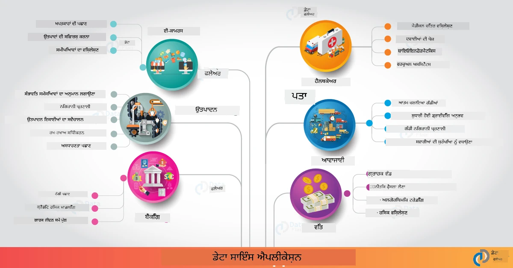

# Data Science in the Real World

|  ](../../sketchnotes/20-DataScience-RealWorld.png) |
| :--------------------------------------------------------------------------------------------------------------: |
|               ਡਾਟਾ ਸਾਇੰਸ ਇਨ ਦਿ ਰੀਅਲ ਵਰਲਡ - _ਸਕੈਚਨੋਟ ਬਾਈ [@nitya](https://twitter.com/nitya)_               |

ਅਸੀਂ ਇਸ ਸਿੱਖਣ ਦੀ ਯਾਤਰਾ ਦੇ ਅੰਤ ਦੇ ਬਹੁਤ ਨੇੜੇ ਹਾਂ!

ਅਸੀਂ ਡਾਟਾ ਸਾਇੰਸ ਅਤੇ ਨੈਤਿਕਤਾ ਦੀਆਂ ਪਰਿਭਾਸ਼ਾਵਾਂ ਨਾਲ ਸ਼ੁਰੂ ਕੀਤਾ, ਡਾਟਾ ਵਿਸ਼ਲੇਸ਼ਣ ਅਤੇ ਵਿਜ਼ੂਅਲਾਈਜ਼ੇਸ਼ਨ ਲਈ ਵੱਖ-ਵੱਖ ਟੂਲਾਂ ਅਤੇ ਤਕਨੀਕਾਂ ਦੀ ਜਾਂਚ ਕੀਤੀ, ਡਾਟਾ ਸਾਇੰਸ ਲਾਈਫਸਾਈਕਲ ਦੀ ਸਮੀਖਿਆ ਕੀਤੀ, ਅਤੇ ਕਲਾਉਡ ਕੰਪਿਊਟਿੰਗ ਸੇਵਾਵਾਂ ਨਾਲ ਡਾਟਾ ਸਾਇੰਸ ਵਰਕਫਲੋਜ਼ ਨੂੰ ਸਕੇਲ ਕਰਨ ਅਤੇ ਆਟੋਮੇਟ ਕਰਨ ਦੇ ਬਾਰੇ ਵੇਖਿਆ। ਇਸ ਲਈ, ਤੁਸੀਂ ਸ਼ਾਇਦ ਸੋਚ ਰਹੇ ਹੋ: _"ਮੈਂ ਇਹ ਸਾਰੇ ਸਿੱਖੇ ਗਏ ਗੁਣ ਅਸਲੀ ਦੁਨੀਆ ਦੇ ਪ੍ਰਸੰਗਾਂ ਨਾਲ ਕਿਵੇਂ ਜੋੜਾਂ?"_

ਇਸ ਪਾਠ ਵਿੱਚ, ਅਸੀਂ ਉਦਯੋਗ ਵਿਚ ਡਾਟਾ ਸਾਇੰਸ ਦੀਆਂ ਅਸਲੀ ਦੁਨੀਆ ਦੀਆਂ ਐਪਲੀਕੇਸ਼ਨਾਂ ਦਾ ਅਧਿਐਨ ਕਰਾਂਗੇ ਅਤੇ ਖੋਜ, ਡਿਜੀਟਲ ਹਿਊਮੈਨਿਟੀਜ਼ ਅਤੇ ਸਥਿਰਤਾ ਦੇ ਸੰਦਰਭਾਂ ਵਿੱਚ ਵਿਸ਼ੇਸ਼ ਉਦਾਹਰਣਾਂ 'ਤੇ ਚਰਚਾ ਕਰਾਂਗੇ। ਅਸੀਂ ਵਿਦਿਆਰਥੀ ਪ੍ਰੋਜੈਕਟ ਦੇ ਮੌਕੇ ਵੇਖਾਂਗੇ ਅਤੇ ਆਪਣੀ ਸਿੱਖਣ ਯਾਤਰਾ ਚੱਲਦੇ ਰਹਿਣ ਲਈ ਲਾਭਦਾਇਕ ਸਰੋਤਾਂ ਨਾਲ ਸਮਾਪਤ ਕਰਾਂਗੇ!
## पूर्व-लेक्चर क्विज़

## [ਪ्री-ਲੈਕਚਰ ਕੋਇਜ਼](https://ff-quizzes.netlify.app/en/ds/quiz/38)

## ਡਾਟਾ ਸਾਇੰਸ + ਉਦਯੋਗ

ਆਰਟੀਫਿਸ਼ਲ ਇੰਟੈਲਜੈਂਸ ਦੇ ਲੋਕ ਪ੍ਰਿਯੋਗਰਹਿਤ ਕਰਨ ਦੇ ਸ਼ੁਕਰਗੁਜ਼ਾਰ, ਡਿਵੈਲਪਰਾਂ ਲਈ ਹੁਣ ਆਸਾਨ ਹੋ ਗਿਆ ਹੈ ਕਿ ਉਹ ਏਅਆਈ ਚਲਿਤ ਫੈਸਲਾ-ਲੇਣ ਅਤੇ ਡਾਟਾ ਚਲਿਤ ਜਾਣਕਾਰੀਆਂ ਨੂੰ ਯੂਜ਼ਰ ਦੇ ਅਨੁਭਵ ਅਤੇ ਵਿਕਾਸ ਵਰਕਫਲੋਜ਼ ਵਿੱਚ ਡਿਜ਼ਾਇਨ ਅਤੇ ਇੰਟੀਗ੍ਰੇਟ ਕਰਨ। ਇੱਥੇ ਉਦਯੋਗ ਵਿੱਚ ਅਸਲੀ ਦੁਨੀਆ ਦੀਆਂ ਐਪਲੀਕੇਸ਼ਨਾਂ ਵਿੱਚ ਡਾਟਾ ਸਾਇੰਸ ਦੇ ਕੁਝ ਉਦਾਹਰਣ ਹਨ:

 * [ਗੂਗਲ ਫਲੂ ਟ੍ਰੈਂਡਸ](https://www.wired.com/2015/10/can-learn-epic-failure-google-flu-trends/) ਨੇ ਡਾਟਾ ਸਾਇੰਸ ਦੀ ਵਰਤੋਂ ਕੀਤੀ ਤਾਂ ਜੋ ਖੋਜ ਸ਼ਬਦਾਂ ਨੂੰ ਫਲੂ ਟ੍ਰੈਂਡਸ ਨਾਲ ਜੋੜ ਸਕਣ। ਜਦ ਕਿ ਇਹ ਪਹੁੰਚ ਕੁਝ ਖਰਾਬੀਆਂ ਵਾਲੀ ਸੀ, ਇਸ ਨੇ ਡਾਟਾ ਚਲਿਤ ਸਿਹਤ ਸੇਵਾਵਾਂ ਦੀ ਸੰਭਾਵਨਾਵਾਂ (ਅਤੇ ਚੁਣੌਤੀਆਂ) ਬਾਰੇ ਜਾਣੂ ਕਰਵਾਇਆ।

 * [ਯੂ.ਪੀ.ਐੱਸ. ਰੂਟਿੰਗ ਅੰਦਾਜ਼ੇ](https://www.technologyreview.com/2018/11/21/139000/how-ups-uses-ai-to-outsmart-bad-weather/) - ਦੱਸਦਾ ਹੈ ਕਿ ਯੂ.ਪੀ.ਐੱਸ. ਕਿਵੇਂ ਡਾਟਾ ਸਾਇੰਸ ਅਤੇ ਮਸ਼ੀਨ ਲਰਨਿੰਗ ਦੀ ਵਰਤੋਂ ਕਰਕੇ ਸਵੇਰੇ ਰਸਤੇ ਦੀ ਭਵਿੱਖਬਾਣੀ ਕਰਦਾ ਹੈ, ਜਿਸ ਵਿੱਚ ਮੌਸਮ ਦੀ ਹਾਲਤ, ਟ੍ਰੈਫਿਕ ਪੈਟਰਨ, ਡਿਲਿਵਰੀ ਦੀਆਂ ਮਿਆਦਾਂ ਅਤੇ ਹੋਰ ਕਈ ਗੱਲਾਂ ਸ਼ਾਮਲ ਹਨ।

 * [ਐਨ ਵਾਈ ਸੀ ਟੈਕਸੀਕੈਬ ਰੂਟ ਵਿਜ਼ੂਅਲਾਈਜ਼ੇਸ਼ਨ](http://chriswhong.github.io/nyctaxi/) - [ਆਜ਼ਾਦੀ ਸੂਚਨਾ ਕਾਨੂੰਨਾਂ](https://chriswhong.com/open-data/foil_nyc_taxi/) ਦੀ ਵਰਤੋਂ ਕਰਕੇ ਇਕੱਠਾ ਕੀਤਾ ਗਿਆ ਡੇਟਾ ਐਨ ਵਾਈ ਸੀ ਟੈਕਸੀਜ਼ ਦੇ ਇਕ ਦਿਨ ਨੂੰ ਵਿਜ਼ੂਅਲ ਕਰਦਾ ਹੈ, ਇਨ੍ਹਾਂ ਨੂੰ ਸਮਝਣ ਵਿੱਚ ਸਹਾਇਤਾ ਕਰਦਾ ਹੈ ਕਿ ਉਹ ਕਿਸ ਤਰ੍ਹਾਂ ਸ਼ਹਿਰ ਵਿੱਚ ਰਸਤੇ ਲੱਭਦੇ ਹਨ, ਉਹ ਕਿੰਨੀ ਕਮਾਈ ਕਰਦੇ ਹਨ, ਅਤੇ ਹਰ 24 ਘੰਟਿਆਂ ਵਿੱਚ ਸਫਰ ਦੀ ਮਿਆਦ ਕਿੰਨੀ ਹੁੰਦੀ ਹੈ।

 * [ਉਬੇਰ ਡਾਟਾ ਸਾਇੰਸ ਵਰਕਬੈੰਚ](https://eng.uber.com/dsw/) - ਹਰ ਰੋਜ਼ ਮਿਲੀਅਨਾਂ ਉਬੇਰ ਯਾਤਰਾਵਾਂ (ਪਿਕਅਪ ਅਤੇ ਡਰੌਪਆਫ਼ ਟਿਕਾਣੇ, ਯਾਤਰਾ ਦੀ ਮਿਆਦ, ਪ੍ਰਿਫਰਡ ਰਸਤੇ ਆਦਿ) ਤੋਂ ਇਕੱਠਾ ਕੀਤਾ ਗਿਆ ਡਾਟਾ ਵਰਤਦਾ ਹੈ ਤਾਂ ਜੋ ਪ੍ਰਾਈਸਿੰਗ, ਸੁਰੱਖਿਆ, ਧੋਖਾਧੜੀ ਪਹਿਚਾਣ ਅਤੇ ਰਸਤੇ ਬਣਾਉਣ ਦੇ ਫੈਸਲੇ ਕਰਨ ਲਈ ਇੱਕ ਡਾਟਾ ਐਨਾਲਿਟਿਕਸ ਟੂਲ ਬਣਾਇਆ ਜਾ ਸਕੇ।

 * [ਖੇਡਾਂ ਦਾ ਵਿਸ਼ਲੇਸ਼ਣ](https://towardsdatascience.com/scope-of-analytics-in-sports-world-37ed09c39860) - _ਪ੍ਰਡਿਕਟਿਵ ਐਨਾਲਿਟਿਕਸ_ (ਟੀਮ ਅਤੇ ਖਿਡਾਰੀ ਦਾ ਵਿਸ਼ਲੇਸ਼ਣ - ਜਿਵੇਂ ਕਿ [ਮਨੀ ਬੋਲ](https://datasciencedegree.wisconsin.edu/blog/moneyball-proves-importance-big-data-big-ideas/) - ਅਤੇ ਪ੍ਰਸ਼ੰਸਕ ਪ੍ਰਬੰਧ) ਅਤੇ _ਡਾਟਾ ਵਿਜ਼ੂਅਲਾਈਜ਼ੇਸ਼ਨ_ (ਟੀਮ ਅਤੇ ਪ੍ਰਸ਼ੰਸਕ ਡੈਸ਼ਬੋਰਡ, ਖੇਡਾਂ ਆਦਿ) ਉੱਤੇ ਧਿਆਨ ਕੇਂਦ੍ਰਿਤ ਕਰਦਾ ਹੈ, ਜਿਸਦੇ ਭਿੰਨ ਭਿੰਨ ਅਰਜ਼ੀਆਂ ਹਨ ਜਿਵੇਂ ਪ੍ਰਤਿਭਾ ਪਹੁੰਚ, ਖੇਡਾਂ ਤੇ ਜੂਆ ਅਤੇ ਸੰਗ੍ਰਹਿ/ਸਟੇਡੀਅਮ ਪ੍ਰਬੰਧਨ।

 * [ਬੈਂਕਿੰਗ ਵਿੱਚ ਡਾਟਾ ਸਾਇੰਸ](https://data-flair.training/blogs/data-science-in-banking/) - ਵਿੱਤ ਉਦਯੋਗ ਵਿੱਚ ਡਾਟਾ ਸਾਇੰਸ ਦੀ ਮਹੱਤਤਾ ਨੂੰ ਉਜਾਗਰ ਕਰਦਾ ਹੈ ਜਿਸ ਵਿੱਚ ਖਤਰੇ ਦੇ ਮਾਡਲਿੰਗ ਅਤੇ ਧੋਖਾਧੜੀ ਪਛਾਣ ਤੋਂ ਲੈ ਕੇ ਗਾਹਕ ਵਿਭਾਜਨ, ਸਮੇਂ ਦੇ ਅਨੁਸਾਰ ਭਵਿੱਖਬਾਣੀ ਅਤੇ ਸਿਫਾਰਸ਼ੀ ਸਿਸਟਮ ਸ਼ਾਮਲ ਹਨ। ਪ੍ਰਡਿਕਟਿਵ ਐਨਾਲਿਟਿਕਸ ਮਹੱਤਵਪੂਰਨ ਮਾਪਦੰਡ ਜਿਵੇਂ ਕਿ [ਕ੍ਰੈਡਿਟ ਸਕੋਰ](https://dzone.com/articles/using-big-data-and-predictive-analytics-for-credit) ਨੂੰ ਵੀ ਚਲਾਉਂਦੇ ਹਨ।

 * [ਹੈਲਥਕੇਅਰ ਵਿੱਚ ਡਾਟਾ ਸਾਇੰਸ](https://data-flair.training/blogs/data-science-in-healthcare/) - ਜਿਵੇਂ ਕਿ ਮੈਡੀਕਲ ਇਮੇਜਿੰਗ (ਜਿਵੇਂ ਐਮ.ਆਰ.ਆਈ., ਐਕਸ-ਰੇ, ਸੀ.ਟੀ-ਸਕੈਨ), ਜੈਵਿਕ ਰੀਤੀਆਂ (ਡੀਐਨਏ ਸੀਕੁਐਨਸਿੰਗ), ਦਵਾਈ ਵਿਕਾਸ (ਖਤਰੇ ਦਾ ਅੰਦਾਜ਼ਾ, ਸਫਲਤਾ ਦੀ ਭਵਿੱਖਬਾਣੀ), ਪੇਸ਼ਗੋਈ (ਮਰੀਜ਼ ਦੀ ਦੇਖਭਾਲ ਅਤੇ ਸਪਲਾਈ ਲਾਜਿਸਟਿਕਸ), ਰੋਗਾਂ ਦੀ ਪਛਾਣ ਤੇ ਰੋਕਥਾਮ ਆਦਿ।

 ਚਿੱਤਰ ਸਰੋਤ: [ਡਾਟਾ ਫਲੇਅਰ: 6 ਅਦਭੁਤ ਡਾਟਾ ਸਾਇੰਸ ਐਪਲੀਕੇਸ਼ਨਸ](https://data-flair.training/blogs/data-science-applications/)

ਇਸ ਚਿੱਤਰ ਵਿੱਚ ਹੋਰ ਖੇਤਰਾਂ ਅਤੇ ਡਾਟਾ ਸਾਇੰਸ ਤਕਨਾਲੋਜੀਆਂ ਦੀਆਂ ਐਪਲੀਕੇਸ਼ਨਾਂ ਲਈ ਉਦਾਹਰਣ ਦਿਖਾਈ ਗਈਆਂ ਹਨ। ਹੋਰ ਐਪਲੀਕੇਸ਼ਨਾਂ ਬਾਰੇ ਜਾਣਨ ਲਈ ਹੇਠਾਂ ਦਿੱਤੇ [Review & Self Study](?id=review-amp-self-study) ਭਾਗ ਨੂੰ ਦੇਖੋ।

## ਡਾਟਾ ਸਾਇੰਸ + ਖੋਜ

|  ](../../sketchnotes/20-DataScience-Research.png) |
| :---------------------------------------------------------------------------------------------------------------: |
|              ਡਾਟਾ ਸਾਇੰਸ & ਖੋਜ - _ਸਕੈਚਨੋਟ ਬਾਈ [@nitya](https://twitter.com/nitya)_              |

ਜਿੱਥੇ ਅਸਲੀ ਦੁਨੀਆ ਦੀਆਂ ਐਪਲੀਕੇਸ਼ਨਾਂ ਆਮ ਤੌਰ 'ਤੇ ਉਦਯੋਗ ਦੀਆਂ ਵਰਤੋਂ ਕੇਸਾਂ ਨੂੰ ਸਕੇਲ 'ਤੇ ਧਿਆਨ ਦਿੰਦੀਆਂ ਹਨ, _ਖੋਜ_ ਐਪਲੀਕੇਸ਼ਨ ਅਤੇ ਪ੍ਰੋਜੈਕਟ ਦੋ ਪੱਖੀਅਤੋਂ ਲਾਭਦਾਇਕ ਹੋ ਸਕਦੇ ਹਨ:

* _ਨਵੀਨਤਾ ਦੇ ਮੌਕੇ_ - ਵਿਕਸਤ ਸੰਕਲਪਾਂ ਦੀ ਤੇਜ਼ ਪ੍ਰੋਟੋਟਾਈਪਿੰਗ ਅਤੇ ਅਗਲੀ ਪੀੜੀ ਦੀਆਂ ਐਪਲੀਕੇਸ਼ਨਾਂ ਲਈ ਯੂਜ਼ਰ ਅਨੁਭਵਾਂ ਦੀ ਜਾਂਚ ਕਰਨ ਦੇ ਮੌਕੇ।
* _ਤਾਇਨਾਤੀ ਚੁਣੌਤੀਆਂ_ - ਅਸਲੀ ਦੁਨੀਆ ਦੀਆਂ ਸੰਦਰਭਾਂ 'ਚ ਡਾਟਾ ਸਾਇੰਸ ਤਕਨਾਲੋਜੀਆਂ ਦੇ ਸੰਭਾਵਿਤ ਨੁਕਸਾਨ ਜਾਂ ਅਣਚਾਹੇ ਨਤੀਜੇ ਖੋਜਣਾ।

ਵਿਦਿਆਰਥੀਆਂ ਲਈ, ਇਹ ਖੋਜ ਪ੍ਰੋਜੈਕਟ ਸਿੱਖਣ ਅਤੇ ਸਹਿਯੋਗ ਦੇ ਮੌਕੇ ਪੈਦਾ ਕਰ ਸਕਦੇ ਹਨ ਜੋ ਟਾਪਿਕ ਦੀ ਸਮਝ ਨੂੰ ਬਿਹਤਰ ਬਣਾਉਂਦੇ ਹਨ ਅਤੇ ਸਬੰਧਤ ਲੋਕਾਂ ਜਾਂ ਟੀਮਾਂ ਨਾਲ ਤੁਹਾਡੇ ਜੁੜਾਅ ਅਤੇ ਜਾਣੂਪਨ ਨੂੰ ਵਧਾਉਂਦੇ ਹਨ ਜੋ ਇਸ ਖੇਤਰ ਵਿੱਚ ਕੰਮ ਕਰ ਰਹੇ ਹਨ। ਤਾਂ, ਖੋਜ ਪ੍ਰੋਜੈਕਟ ਕਿਵੇਂ ਹੁੰਦੇ ਹਨ ਅਤੇ ਇਹ ਕਿਹੜਾ ਪ੍ਰਭਾਵ ਪਾਉਂਦੇ ਹਨ?

ਆਓ ਇੱਕ ਉਦਾਹਰਣ ਵੇਖੀਏ - ਜੋਏ ਬੁਓਲਮਵਿਨੀ (MIT ਮੀਡੀਆ ਲੈਬ) ਵੱਲੋਂ ਕੀਤਾ ਗਿਆ [MIT ਜੈਂਡਰ ਸ਼ੇਡਜ਼ ਅਧਿਐਨ](http://gendershades.org/overview.html) ਜਿਸ ਵਿੱਚ ਇੱਕ [ਦਸਤਖ਼ਤ ਖੋਜ ਪੇਪਰ](http://proceedings.mlr.press/v81/buolamwini18a/buolamwini18a.pdf) ਸੀ ਜਿਸਦਾ ਸਹਿ-ਲੇਖਕ ਟਿਮਨਿਤ ਗੇਬਰੂ (ਜੋ ਉਸ ਸਮੇਂ ਮਾਈਕ੍ਰੋਸੌਫਟ ਰਿਸਰਚ ਵਿੱਚ ਸਨ) ਸੀ, ਜਿਸਦਾ ਫੋਕਸ ਸੀ

 * **ਕੀ:** ਖੋਜ ਦਾ ਉਦਦੇਸ਼ ਸੀ ਕਿ ਜੈਂਡਰ ਅਤੇ ਚਮੜੀ ਦੇ ਕਿਸਮ ਦੇ ਆਧਾਰ 'ਤੇ ਆਟੋਮੈਟਿਕ ਫੇਸ਼ਲ ਐਨਾਲਿਸਿਸ ਅਲਗੋਰਿਥਮ ਅਤੇ ਡਾਟਾ ਸੈੱਟਾਂ ਵਿੱਚ ਮੌਜੂਦ ਪੱਖਪਾਤ ਦਾ ਮੁਲਾਂਕਣ ਕਰਨਾ। 
 * **ਕਿਉਂ:** ਫੇਸ਼ਲ ਐਨਾਲਿਸਿਸ ਦਾ ਇਸਤੇਮਾਲ ਕਾਨੂੰਨੀ ਫੋਰਾਂਸਿਕਸ, ਹਵਾਈ ਅੱਡਾ ਸੁਰੱਖਿਆ, ਹਾਇਰਿੰਗ ਸਿਸਟਮ ਆਦਿ ਵਿੱਚ ਹੁੰਦਾ ਹੈ - ਇਹ ਉਸ ਸੰਦਰਭਾਂ ਵਿੱਚ ਜਿੱਥੇ ਗਲਤ ਵਰਗੀ ਕੁਲਾਸੀਫਿਕੇਸ਼ਨ (ਜਿਵੇਂ ਪੱਖਪਾਤ ਕਰਕੇ) ਪ੍ਰਭਾਵਤ ਵਿਅਕਤੀਆਂ ਜਾਂ ਸਮੂਹਾਂ ਨੂੰ ਆਰਥਕ ਅਤੇ ਸਮਾਜਿਕ ਨੁਕਸਾਨ ਪਹੁੰਚਾ ਸਕਦੀ ਹੈ। ਪੱਖਪਾਤ ਨੂੰ ਸਮਝਣਾ (ਅਤੇ ਉਸਨੂੰ ਹਟਾਉਂਣਾ ਜਾਂ ਘਟਾਉਣਾ) ਵਰਤੋਂ ਵਿੱਚ ਨਿਆਂ ਲਈ ਜ਼ਰੂਰੀ ਹੈ।
 * **ਕਿਵੇਂ:** ਖੋਜਕਾਰਾਂ ਨੇ ਨੋਟ ਕੀਤਾ ਕਿ ਮੌਜੂਦਾ ਬੈਂਚਮਾਰਕ ਜ਼ਿਆਦਾਤਰ ਹਲਕੇ ਰੰਗ ਵਾਲੇ ਵਿਸ਼ਿਆਂ ਨੂੰ ਵਰਤਦੇ ਹਨ, ਅਤੇ ਇੱਕ ਨਵਾਂ ਡਾਟਾ ਸੈੱਟ (1000+ ਚਿੱਤਰ) ਤਿਆਰ ਕੀਤਾ ਜੋ ਜੈਂਡਰ ਅਤੇ ਚਮੜੀ ਦੀ ਕਿਸਮ ਨਾਲ _ਵੱਧੰ ਸਮਤੁਲਿਤ_ ਸੀ। ਇਸ ਡਾਟਾ ਸੈੱਟ ਦੀ ਵਰਤੋਂ ਤਿੰਨ ਜੈਂਡਰ ਕਲਾਸੀਫਿਕੇਸ਼ਨ ਉਤਪਾਦਾਂ (ਮਾਈਕ੍ਰੋਸੌਫਟ, ਆਈਬੀਐਮ ਅਤੇ ਫੇਸ++) ਦੀ ਸ਼ੁੱਧਤਾ ਦਾ ਮੁਲਾਂਕਣ ਕਰਨ ਲਈ ਕੀਤੀ ਗਈ।

ਨਤੀਜੇ ਦਿਖਾਉਂਦੇ ਹਨ ਕਿ ਜੇਕਰ ਮੋਟਰ ਸ਼ੁੱਧਤਾ ਵਧੀਆ ਸੀ, ਤਾਂ ਵੀ ਵੱਖ ਵੱਖ ਸਮੂਹਾਂ ਵਿੱਚ ਗਲਤੀ ਦੀ ਦਰ ਵਿੱਚ ਸਪਸ਼ਟ ਫ਼ਰਕ ਸੀ - ਜੋੜਨ ਨਾਲ **ਮਿਸਜੈਂਡਰਿੰਗ** ਕੁਝ ਜ਼ਿਆਦਾ ਸੀ ਖਾਸ ਕਰਕੇ ਮਹਿਲਾਵਾਂ ਜਾਂ ਗਹਿਰੀ ਚਮੜੀ ਵਾਲੇ ਲੋਕਾਂ ਲਈ, ਜੋ ਪੱਖਪਾਤ ਦਾ ਸੰਕੇਤ ਹੈ।

**ਮੁੱਖ ਨਤੀਜੇ:** ਇਸ ਦੇ ਨਾਲ ਜਾਗਰੂਕਤਾ ਵਧਾਈ ਗਈ ਕਿ ਡਾਟਾ ਸਾਇੰਸ ਲਈ ਵਧੇਰੇ _ਪ੍ਰਤਿਨਿਧੀ ਡਾਟਾਸੈੱਟ_ (ਸੰਤੁਲਿਤ ਸਮੂਹ) ਅਤੇ ਵਧੇਰੇ _ਸਮਾਵੇਸ਼ੀ ਟੀਮਾਂ_ (ਵਿਭਿੰਨ ਪਿਛੋਕੜ ਵਾਲੀਆਂ) ਦੀ ਲੋੜ ਹੈ ਤਾਂ ਜੋ ਪੱਖਪਾਤ ਨੂੰ AI ਹੱਲਾਂ ਵਿੱਚ ਜਲਦੀ ਪਹਿਚਾਣਿਆ ਅਤੇ ਘਟਾਇਆ ਜਾ ਸਕੇ। ਇਸ ਤਰ੍ਹਾਂ ਦੇ ਖੋਜ ਪਹਲਾਂ ਕਈ ਸੰਗਠਨਾਂ ਵਿੱਚ _ਜਿੰਮੇਵਾਰ AI_ ਦੇ ਸਿਧਾਂਤਾਂ ਅਤੇ ਅਭਿਆਸਾਂ ਦੀ ਪਰਿਭਾਸ਼ਾ ਕਰਨ ਵਿੱਚ ਮਦਦਗਾਰ ਸਾਬਤ ਹੋ ਰਹੀਆਂ ਹਨ ਤਾਂ ਜੋ AI ਪ੍ਰੋਡਕਟਸ ਅਤੇ ਪ੍ਰਕਿਰਿਆਵਾਂ ਵਿੱਚ ਨਿਆਂ ਵਿੱਚ ਸੁਧਾਰ ਕੀਤਾ ਜਾ ਸਕੇ।

**ਕੀ ਤੁਸੀਂ ਮਾਈਕ੍ਰੋਸੌਫਟ ਵਿੱਚ ਸਬੰਧਿਤ ਖੋਜ ਪਹਲਾਂ ਬਾਰੇ ਜਾਣਨਾ ਚਾਹੁੰਦੇ ਹੋ?** 

* [Artificial Intelligence 'ਤੇ Microsoft Research ਪ੍ਰੋਜੈਕਟ](https://www.microsoft.com/research/research-area/artificial-intelligence/?facet%5Btax%5D%5Bmsr-research-area%5D%5B%5D=13556&facet%5Btax%5D%5Bmsr-content-type%5D%5B%5D=msr-project) ਵੇਖੋ।
* [Microsoft Research ਡਾਟਾ ਸਾਇੰਸ ਸਮਰ ਸਕੂਲ](https://www.microsoft.com/en-us/research/academic-program/data-science-summer-school/) ਤੋਂ ਵਿਦਿਆਰਥੀ ਪ੍ਰੋਜੈਕਟ ਖੋਜੋ।
* [Fairlearn](https://fairlearn.org/) ਪ੍ਰੋਜੈਕਟ ਅਤੇ [Responsible AI](https://www.microsoft.com/en-us/ai/responsible-ai?activetab=pivot1%3aprimaryr6) ਪਹਿਲਕਦਮੀਆਂ ਨੂੰ ਵੇਖੋ।

## ਡਾਟਾ ਸਾਇੰਸ + ਹਿਊਮੈਨਿਟੀਜ਼

|  ](../../sketchnotes/20-DataScience-Humanities.png) |
| :---------------------------------------------------------------------------------------------------------------: |
|              ਡਾਟਾ ਸਾਇੰਸ & ਡਿਜੀਟਲ ਹਿਊਮੈਨਿਟੀਜ਼ - _ਸਕੈਚਨੋਟ ਬਾਈ [@nitya](https://twitter.com/nitya)_              |

ਡਿਜੀਟਲ ਹਿਊਮੈਨਿਟੀਜ਼ ਨੂੰ "[ਕੰਪਿਊਟੇਸ਼ਨਲ ਤਰੀਕਿਆਂ ਨੂੰ ਮਨੁੱਖੀ ਸਵਾਲਬੰਦੀ ਨਾਲ ਜੋੜਨ ਵਾਲੇ ਅਭਿਆਸ ਅਤੇ ਨਜ਼ਰੀਏ](https://digitalhumanities.stanford.edu/about-dh-stanford)" ਵਜੋਂ ਪਰਿਭਾਸ਼ਿਤ ਕੀਤਾ ਗਿਆ ਹੈ। [ਸਟੈਨਫੋਡ ਪ੍ਰੋਜੈਕਟ](https://digitalhumanities.stanford.edu/projects) ਜਿਵੇਂ "_ਰੀਬੂਟਿੰਗ ਹਿਸਟਰੀ_" ਅਤੇ "_ਕਾਵਿ ਸੋਚ_" ਡਿਜੀਟਲ ਹਿਊਮੈਨਿਟੀਜ਼ ਅਤੇ ਡਾਟਾ ਸਾਇੰਸ ਦੀਆਂ ਲਿੰਕਸ ਨੂੰ ਦਰਸਾਉਂਦੇ ਹਨ - ਜੋ ਜਾਲ ਵਿਸ਼ਲੇਸ਼ਣ, ਜਾਣਕਾਰੀ ਵਿਜ਼ੂਅਲਾਈਜ਼ੇਸ਼ਨ, ਸਥਾਨਕ ਅਤੇ ਲਿਖਤੀ ਵਿਸ਼ਲੇਸ਼ਣ ਵਰਗੀਆਂ ਤਕਨੀਕਾਂ 'ਤੇ ਜ਼ੋਰ ਦਿੰਦੇ ਹਨ ਜੋ ਸਾਨੂੰ ਇਤਿਹਾਸਕ ਅਤੇ ਸాహਿਤਕ ਡਾਟਾ ਸੈੱਟਾਂ ਨੂੰ ਖ਼ਤਮ ਕਰ ਕੇ ਨਵੇਂ ਵਿਚਾਰ ਅਤੇ ਦ੍ਰਿਸ਼ਟੀ ਕੋਣ ਲੱਭਣ ਵਿੱਚ ਮਦਦ ਕਰ ਸਕਦੇ ਹਨ।

*ਕੀ ਤੁਸੀਂ ਇਸ ਖੇਤਰ ਵਿੱਚ ਕੋਈ ਪ੍ਰੋਜੈਕਟ ਖੋਜਣਾ ਅਤੇ ਵਧਾਉਣਾ ਚਾਹੁੰਦੇ ਹੋ?*

["ਐਮਿਲੀ ਡਿਕਿੰਸਨ ਅਤੇ ਮੂਡ ਦਾ ਮੀਟਰ"](https://gist.github.com/jlooper/ce4d102efd057137bc000db796bfd671) ਵੇਖੋ — [ਜੇਨ ਲੂਪਰ](https://twitter.com/jenlooper) ਦਾ ਇਕ ਵਧੀਆ ਉਦਾਹਰਣ ਜੋ ਪੁੱਛਦਾ ਹੈ ਕਿ ਅਸੀਂ ਡਾਟਾ ਸਾਇੰਸ ਦੀ ਵਰਤੋਂ ਕਰਕੇ ਪਰਚਿਤ ਕਵਿਤਾ ਨੂੰ ਫਿਰ ਤੋਂ ਜਾ ਕੇ ਉਸ ਦੇ ਅਰਥ ਅਤੇ ਲੇਖਕ ਦੇ ਯੋਗਦਾਨ ਦੀ ਨਵੀਂ ਪਰੀਖਿਆ ਕਿਵੇਂ ਕਰ ਸਕਦੇ ਹਾਂ। ਉਦਾਹਰਨ ਵਜੋਂ, _ਕੀ ਅਸੀਂ ਕਿਸੇ ਕਵਿਤਾ ਦੇ ਲਿਖੇ ਜਾਣ ਵਾਲੇ ਮੌਸਮ ਦੀ ਭਵਿੱਖਬਾਣੀ ਕਰ ਸਕਦੇ ਹਾਂ ਉਸ ਦੇ ਟੋਨ ਜਾਂ ਭਾਵਨਾ ਦਾ ਵਿਸ਼ਲੇਸ਼ਣ ਕਰਕੇ_ - ਅਤੇ ਇਹ ਸਾਡੇ ਨੂੰ ਲੇਖਕ ਦੇ ਮਨੋਵਿਗਿਆਨਕ ਸਥਿਤੀ ਬਾਰੇ ਕੀ ਦੱਸਦਾ ਹੈ?

ਇਸ ਸਵਾਲ ਦਾ ਜਵਾਬ ਦੇਣ ਲਈ ਅਸੀਂ ਆਪਣੇ ਡਾਟਾ ਸਾਇੰਸ ਲਾਈਫਸਾਈਕਲ ਦੇ ਕਦਮ ਲੈਂਦੇ ਹਾਂ:  
 * [`ਡਾਟਾ ਪ੍ਰਾਪਤੀ`](https://gist.github.com/jlooper/ce4d102efd057137bc000db796bfd671#acquiring-the-dataset) - ਵਿਸ਼ਲੇਸ਼ਣ ਲਈ ਸੰਬੰਧਤ ਡਾਟਾਸੈੱਟ ਇਕੱਠਾ ਕਰਨ ਲਈ। ਵਿਕਲਪਾਂ ਵਿੱਚ ਏਪੀਆਈ ਦੀ ਵਰਤੋਂ (ਜਿਵੇਂ [Poetry DB API](https://poetrydb.org/index.html)) ਜਾਂ ਵੈੱਬ ਪੇਜ ਸੱਕਣ (ਜਿਵੇਂ [Project Gutenberg](https://www.gutenberg.org/files/12242/12242-h/12242-h.htm)) ਸ਼ਾਮਲ ਹਨ, ਜਿਹੜੇ [Scrapy](https://scrapy.org/) ਵਰਗੇ ਟੂਲਾਂ ਨਾਲ ਕੀਤੇ ਜਾ ਸਕਦੇ ਹਨ।
 * [`ਡਾਟਾ ਸਾਫ਼ਾਈ`](https://gist.github.com/jlooper/ce4d102efd057137bc000db796bfd671#clean-the-data) - ਇਸ ਨੂੰ ਸਮਝਾਉਂਦਾ ਹੈ ਕਿ ਕਿਵੇਂ ਟੈਕਸਟ ਨੂੰ ਫਾਰਮੈਟ, ਸਾਫ ਅਤੇ ਸਧਾਰਣ ਕੀਤਾ ਜਾ ਸਕਦਾ ਹੈ ਮੂਲ ਤੋੜ-ਮਰੋੜ ਵਾਲੇ ਟੂਲਾਂ ਜਿਵੇਂ ਕਿ ਵਿਜ਼ੂਅਲ ਸਟੂਡੀਓ ਕੋਡ ਅਤੇ ਮਾਈਕ੍ਰੋਸੌਫਟ ਐਕਸਲ ਦੀ ਵਰਤੋਂ ਨਾਲ।
 * [`ਡਾਟਾ ਵਿਸ਼ਲੇਸ਼ਣ`](https://gist.github.com/jlooper/ce4d102efd057137bc000db796bfd671#working-with-the-data-in-a-notebook) - ਇਸ ਨੂੰ ਸਮਝਾਉਂਦਾ ਹੈ ਕਿ ਅਸੀਂ ਹੁਣ ਡਾਟਾਸੈੱਟ ਨੂੰ "ਨੋਟਬੁਕ" ਵਿੱਚ ਐਮਪੋਰਟ ਕਰਕੇ ਪਾਇਥਨ ਪੈਕੇਜਾਂ (ਜਿਵੇਂ pandas, numpy ਅਤੇ matplotlib) ਦੀ ਵਰਤੋਂ ਨਾਲ ਡਾਟਾ ਨੂੰ ਵਿਵਸਥਿਤ ਅਤੇ ਵਿਜ਼ੂਅਲਾਈਜ਼ ਕਰ ਸਕਦੇ ਹਾਂ।
 * [`ਭਾਵਨਾ ਵਿਸ਼ਲੇਸ਼ਣ`](https://gist.github.com/jlooper/ce4d102efd057137bc000db796bfd671#sentiment-analysis-using-cognitive-services) - ਦੱਸਦਾ ਹੈ ਕਿ ਅਸੀਂ ਕਿਵੇਂ ਟੈਕਸਟ ਐਨਾਲਿਟਿਕਸ ਵਰਗੀਆਂ ਕਲਾਉਡ ਸੇਵਾਵਾਂ ਨੂੰ ਜੋੜ ਸਕਦੇ ਹਾਂ, ਅਤੇ [Power Automate](https://flow.microsoft.com/en-us/) ਵਰਗੇ ਘੱਟ-ਕੋਡ ਸੰਦਾਂ ਦੇ ਨਾਲ ਆਟੋਮੇਟਡ ਡਾਟਾ ਪ੍ਰੋਸੈਸਿੰਗ ਵਰਕਫਲੋਜ਼ ਤਿਆਰ ਕਰ ਸਕਦੇ ਹਾਂ।

ਇਸ ਵਰਕਫਲੋ ਨਾਲ ਅਸੀਂ ਕਵਿਤਾ ਦੀ ਭਾਵਨਾ 'ਤੇ ਮੌਸਮੀ ਪ੍ਰਭਾਵਾਂ ਦਾ ਅਧਿਐਨ ਕਰ ਸਕਦੇ ਹਾਂ, ਅਤੇ ਲੇਖਕ ਬਾਰੇ ਆਪਣੀ ਦ੍ਰਿਸ਼ਟੀ ਕੋਣਾ ਤਿਆਰ ਕਰ ਸਕਦੇ ਹਾਂ। ਆਪਣਾ ਆਪ ਕੋਸ਼ਿਸ਼ ਕਰੋ - ਫੇਰ ਨੋਟਬੁਕ ਨੂੰ ਵਧਾਈਏ ਅਤੇ ਹੋਰ ਸਵਾਲ ਪੁੱਛੋ ਜਾਂ ਨਵੀਂ ਤਰੀਕਿਆਂ ਨਾਲ ਡਾਟਾ ਨੂੰ ਵਿਜ਼ੂਅਲਾਈਜ਼ ਕਰੋ!

> ਤੁਸੀਂ [ਡਿਜੀਟਲ ਹਿਊਮੈਨਿਟੀਜ਼ ਟੂਲਕਿਟ](https://github.com/Digital-Humanities-Toolkit) ਵਿੱਚ ਕੁਝ ਟੂਲਾਂ ਦੀ ਵਰਤੋਂ ਕਰਕੇ ਇਹ ਪੜਤਾਲ ਕਰ ਸਕਦੇ ਹੋ।

## ਡਾਟਾ ਸਾਇੰਸ + ਸਥਿਰਤਾ

|  ](../../sketchnotes/20-DataScience-Sustainability.png) |
| :---------------------------------------------------------------------------------------------------------------: |
|              ਡਾਟਾ ਸਾਇੰਸ & ਸਥਿਰਤਾ - _ਸਕੈਚਨੋਟ ਬਾਈ [@nitya](https://twitter.com/nitya)_              |

[2030 ਐਜੰਡਾ ਫਾਰ ਸੇਸਟੇਨੇਬਲ ਡਿਵੈਲਪਮੈਂਟ](https://sdgs.un.org/2030agenda) - ਜੋ 2015 ਵਿੱਚ ਸੰਯੁਕਤ ਰਾਸ਼ਟਰ ਦੇ ਸਾਰੇ ਮੈਂਬਰਾਂ ਵੱਲੋਂ ਅਪਣਾਇਆ ਗਿਆ - 17 ਲਕਸ਼ਾਂ ਦੀ ਪਹਿਚਾਣ ਕਰਦਾ ਹੈ ਜਿਸ ਵਿੱਚ ਕੁਝ ਲਕਸ਼ ਹਨ ਜੋ **ਪ੍ਰਕ੍ਰਿਤੀ ਦੀ ਰੱਖਿਆ** ਅਤੇ ਕਲਾਈਮੇਟ ਚੇਂਜ ਦੇ ਪ੍ਰਭਾਵ ਦੇ ਵਿਰੁੱਧ ਹੈ। [ਮਾਈਕ੍ਰੋਸੌਫਟ ਸਥਿਰਤਾ](https://www.microsoft.com/en-us/sustainability) ਅਭਿਆਨ ਇਹ ਲਕਸ਼ੇ ਪੂਰੇ ਕਰਨ ਲਈ ਟੈਕਨਾਲੋਜੀ ਹੱਲਾਂ ਵੱਲ ਧਿਆਨ ਦਿੰਦੈ ਹੈ ਕਿ ਉਹ 2030 ਤਕ ਕਾਰਬਨ ਘਟਾਓ, ਪਾਣੀ ਦੀ ਬਚਤ, ਜ਼ੀਰੋ ਵੇਸਟ ਅਤੇ ਜੀਵ ਵਿਭਿੰਨਤਾ ਵਿੱਚ ਯੋਗਦਾਨ ਪਾਉਣ। 

ਇਨ੍ਹਾਂ ਚੁਣੌਤੀਆਂ ਦਾ ਵੱਡੇ ਪੈਮਾਨੇ 'ਤੇ ਤੇ ਸਮੇਂ ਦੀ ਸਹੀ ਪਾਬੰਦੀ ਨਾਲ ਸਮਨਾ ਕਰਨ ਲਈ ਕਲਾਉਡ ਪੈਮਾਨੇ ਦਾ ਸੂਚਨישערਖਾ ਅਤੇ ਵੱਡੇ ਡਾਟਾ ਦੀ ਲੋੜ ਹੁੰਦੀ ਹੈ। [ਪਲੈਨੀਟਰੀ ਕੰਪਿਊਟਰ](https://planetarycomputer.microsoft.com/) ਅਭਿਆਨ ਡਾਟਾ ਵਿਗਿਆਨੀਆਂ ਅਤੇ ਡਿਵੈਲਪਰਾਂ ਦੀ ਸਹਾਇਤਾ ਲਈ ਚਾਰ ਹਿੱਸੇ ਮੁਹੱਈਆ ਕਰਵਾਉਂਦਾ ਹੈ:
 
 * [ਡਾਟਾ ਕੈਟਾਲੌਗ](https://planetarycomputer.microsoft.com/catalog) - ਧਰਤੀ ਦੇ ਪ੍ਰਣਾਲੀਆਂ ਦਾ ਪੈਟਾਬਾਈਟ ਡਾਟਾ (ਮੁਫ਼ਤ ਅਤੇ Azure ਤੇ ਹੋਸਟ ਕੀਤਾ)
 * [ਪਲੈਨੀਟਰੀ API](https://planetarycomputer.microsoft.com/docs/reference/stac/) - ਉਪਭੋਗਤਾਂ ਨੂੰ ਸਪੇਸ ਅਤੇ ਸਮੇਂ ਵਿੱਚ ਸੰਬੰਧਤ ਡਾਟਾ ਲਈ ਖੋਜ ਦੀ ਸਹਾਇਤਾ ਪ੍ਰਦਾਨ ਕਰਦਾ ਹੈ।
 * [ਹੱਬ](https://planetarycomputer.microsoft.com/docs/overview/environment/) - ਵਿਗਿਆਨੀਆਂ ਲਈ ਪ੍ਰਭਾਵਸ਼ਾਲੀ ਭੂ-ਸਥਿੱਤਿਕ ਡਾਟਾਸੈੱਟ ਪ੍ਰਕਿਰਿਆ ਕਰਨ ਦਾ ਵਿਵਸਥਿਤ ਵਾਤਾਵਰਨ।
 * [ਐਪਲੀਕੇਸ਼ਨਜ਼](https://planetarycomputer.microsoft.com/applications) - ਸਥਿਰਤਾ ਸੰਬੰਧੀ ਅੰਦਰੂਨੀ ਜਾਣਕਾਰੀਆਂ ਲਈ ਵਰਤੋਂ ਕੇਸ ਅਤੇ ਟੂਲ ਪ੍ਰਦਰਸ਼ਿਤ ਕਰਦਾ ਹੈ।
**ਪਲੈਨੀਟਰੀ ਕੰਪਿютਰ ਪ੍ਰੋਜੈਕਟ ਇਸ ਵਕਤ ਪ੍ਰੀਵਿਊ ਵਿੱਚ ਹੈ (ਸਤੰਬਰ 2021 ਤੱਕ)** - ਇੱਥੇ ਦੱਸਿਆ ਗਿਆ ਹੈ ਕਿ ਤੁਸੀਂ ਡਾਟਾ ਸਾਇੰਸ ਦੀ ਵਰਤੋਂ ਕਰਕੇ ਸਥਿਰਤਾ ਹੱਲਾਂ ਵਿੱਚ ਅਦਾਲਤੀ ਕਿਵੇਂ ਸ਼ੁਰੂ ਕਰ ਸਕਦੇ ਹੋ।

* ਖੋਜ ਸ਼ੁਰੂ ਕਰਨ ਅਤੇ ਸਾਥੀਆਂ ਨਾਲ ਜੁੜਨ ਲਈ [ਐਕਸੈਸ ਦੀ ਬੇਨਤੀ ਕਰੋ](https://planetarycomputer.microsoft.com/account/request)।
* ਸਮਰਥਿਤ ਡੈਟਾਸੈੱਟ ਅਤੇ ਏਪੀਆਈਜ਼ ਨੂੰ ਸਮਝਣ ਲਈ [ਦਸਤਾਵੇਜ਼ੀकरण ਨੂੰ ਖੋਜੋ](https://planetarycomputer.microsoft.com/docs/overview/about)।
* ਐਪਲੀਕੇਸ਼ਨਾਂ ਲਈ ਪ੍ਰੇਰਣਾ ਵਜੋਂ [ਇਕੋਸਿਸਟਮ ਮਾਨੀਟਰਿੰਗ](https://analytics-lab.org/ecosystemmonitoring/) ਵਰਗੀਆਂ ਐਪਲੀਕੇਸ਼ਨਾਂ ਦਾ ਅਨੁਸੰਧਾਨ ਕਰੋ।

 ਸੋਚੋ ਕਿ ਤੁਹਾਨੂੰ ਕਿਸ ਤਰ੍ਹਾਂ ਡਾਟਾ ਵਿਜੁਅਲਾਈਜ਼ੇਸ਼ਨ ਦੀ ਵਰਤੋਂ ਕਰਕੇ ਜਿਵੇਂ ਕਿ ਮੌਸਮੀ ਤਬਦੀਲੀ ਅਤੇ ਜੰਗਲਾਂ ਦੀ ਕਟੀਾਈ ਵਿੱਚ ਮਹੱਤਵਪੂਰਨ ਸੂਝ ਬੂਝ ਨੂੰ ਪ੍ਰਗਟ ਕਰਨ ਜਾਂ ਵਧਾਉਣ ਲਈ ਵਰਤ ਸਕਦੇ ਹੋ। ਜਾਂ ਸੋਚੋ ਕਿ ਇਹ ਸੂਝ ਬੂਝ ਕਿਵੇਂ ਨਵੇਂ ਯੂਜ਼ਰ ਅਨੁਭਵ ਬਣਾਉਣ ਲਈ ਵਰਤੀ ਜਾ ਸਕਦੀ ਹੈ ਜੋ অধিক ਸਥਿਰ ਜੀਵਨ ਲਈ ਵਿਹਾਰਕ ਬਦਲਾਵਾਂ ਨੂੰ ਪ੍ਰੇਰਿਤ ਕਰਦੇ ਹਨ।

## ਡਾਟਾ ਸਾਇੰਸ + ਵਿਦਿਆਰਥੀ

ਅਸੀਂ ਉਦਯੋਗ ਅਤੇ ਅਨੁਸੰਧਾਨ ਵਿਚ ਕਰਮਿਕ ਅਸਲੀਆਂ ਐਪਲੀਕੇਸ਼ਨਾਂ ਬਾਰੇ ਗੱਲ ਕੀਤੀ ਹੈ ਅਤੇ ਡਿਜੀਟਲ ਹਿਊਮੈਨਿਟੀਜ਼ ਅਤੇ ਸਥਿਰਤਾ ਵਿੱਚ ਡਾਟਾ ਸਾਇੰਸ ਦੇ ਐਪਲੀਕੇਸ਼ਨ ਉਦਾਹਰਣਾਂ ਦਾ ਅਨੁਸੰਧਾਨ ਕੀਤਾ ਹੈ। ਤਾਂ ਤੁਸੀਂ ਡਾਟਾ ਸਾਇੰਸ ਸ਼ੁਰੂਆਤੀ ਕਿਵੇਂ ਆਪਣੇ ਹੁਨਰ ਵਿਕਸਤ ਕਰ ਸਕਦੇ ਹੋ ਅਤੇ ਆਪਣਾ ਗਿਆਨ ਸਾਂਝਾ ਕਰ ਸਕਦੇ ਹੋ?

ਇੱਥੇ ਕੁਝ ਡਾਟਾ ਸਾਇੰਸ ਵਿਦਿਆਰਥੀ ਪ੍ਰੋਜੈਕਟ ਹਨ ਜੋ ਤੁਹਾਨੂੰ ਪ੍ਰੇਰਨਾ ਦੇਣਗੇ।

 * [MSR ਡਾਟਾ ਸਾਇੰਸ ਸਮਰ ਸਕੂਲ](https://www.microsoft.com/en-us/research/academic-program/data-science-summer-school/#!projects) ਜਿਸਦੇ ਗਿਟਹੱਬ [ਪ੍ਰੋਜੈਕਟ](https://github.com/msr-ds3) ਪਾਈਆਂ ਜਾ ਸਕਦੀਆਂ ਹਨ ਜਿਵੇਂ:
    - [ਪੁਲਿਸ ਦੀ ਬਲਾਤਕਾਰ ਦੀ ਵਰਤੋਂ ਵਿੱਚ ਨਸਲੀ ਪੱਖਪਾਤ](https://www.microsoft.com/en-us/research/video/data-science-summer-school-2019-replicating-an-empirical-analysis-of-racial-differences-in-police-use-of-force/) | [ਗਿਟਹੱਬ](https://github.com/msr-ds3/stop-question-frisk)
    - [ਐਨਵਾਈਸੀ ਸਬਵੇ ਸਿਸਟਮ ਦੀ ਭਰੋਸਯੋਗਤਾ](https://www.microsoft.com/en-us/research/video/data-science-summer-school-2018-exploring-the-reliability-of-the-nyc-subway-system/) | [ਗਿਟਹੱਬ](https://github.com/msr-ds3/nyctransit)
 * [ਮੈਟੀਰੀਅਲ ਕਲਚਰ ਦਾ ਡਿਜਿਟਾਈਜ਼ਸ਼ਨ: ਸਰਕਪ ਵਿੱਚ ਸਮਾਜਿਕ-ਆਰਥਿਕ ਵੰਡਾਂ ਦਾ ਅਨੁਸੰਧਾਨ](https://claremont.maps.arcgis.com/apps/Cascade/index.html?appid=bdf2aef0f45a4674ba41cd373fa23afc)- کلرਮੋਂਟ ਵਿੱਚ [ਓਰਨੇਲਾ ਅਲਤੁਨਯਨ](https://twitter.com/ornelladotcom) ਅਤੇ ਟੀਮ ਵੱਲੋਂ, [ArcGIS StoryMaps](https://storymaps.arcgis.com/) ਦੀ ਵਰਤੋਂ ਕਰਦਿਆਂ।

## 🚀 ਚੈਲੈਂਜ

ਉਹ ਲੇਖ ਲੱਭੋ ਜੋ ਡਾਟਾ ਸਾਇੰਸ ਪ੍ਰੋਜੈਕਟਾਂ ਦੀ ਸਿਫਾਰਸ਼ ਕਰਦੇ ਹਨ ਜੋ ਸ਼ੁਰੂਆਤੀ ਲਈ ਢੀਠ ਹਨ - ਜਿਵੇਂ [ਇਹ 50 ਵਿਸ਼ੇ ਖੇਤਰ](https://www.upgrad.com/blog/data-science-project-ideas-topics-beginners/) ਜਾਂ [ਇਹ 21 ਪ੍ਰੋਜੈਕਟ خیال](https://www.intellspot.com/data-science-project-ideas) ਜਾਂ [ਇਹ 16 ਸੋਰਸ ਕੋਡ ਵਾਲੇ ਪ੍ਰੋਜੈਕਟ](https://data-flair.training/blogs/data-science-project-ideas/) ਜੋ ਤੁਸੀਂ ਵਿਭਾਜਿਤ ਕਰਕੇ ਦੁਬਾਰਾ ਬਣਾ ਸਕਦੇ ਹੋ। ਅਤੇ ਆਪਣੀਆਂ ਸਿੱਖਿਆ ਦੀ ਯਾਤਰਾਵਾਂ ਬਾਰੇ ਬਲੌਗ ਕਰਨਾ ਅਤੇ ਸਾਡੀ ਸਭ ਨਾਲ ਆਪਣੀ ਸੂਝ ਸਾਂਝਾ ਕਰਨਾ ਨਾ ਭੁੱਲੋ।

## ਪੋਸਟ-ਲੈਕਚਰ ਕੁਈਜ਼

## [ਪੋਸਟ-ਲੈਕਚਰ ਕੁਈਜ਼](https://ff-quizzes.netlify.app/en/ds/quiz/39)

## ਸਮੀਖਿਆ ਅਤੇ ਖੁਦ ਅਧਿਐਨ

ਹੋਰ ਵਰਤੋਂ ਦੇ ਮਾਮਲੇ ਖੋਜਣੇ ਚਾਹੁੰਦੇ ਹੋ? ਕਿਛੇ ਕੁਝ ਮਹੱਤਵਪੂਰਨ ਲੇਖ ਹਨ:
 * [17 ਡਾਟਾ ਸਾਇੰਸ ਐਪਲੀਕੇਸ਼ਨ ਅਤੇ ਉਦਾਹਰਣ](https://builtin.com/data-science/data-science-applications-examples) - ਜੁਲਾਈ 2021
 * [11 ਵਾਹ-ਵਾਹ ਕਰਨ ਵਾਲੇ ਡਾਟਾ ਸਾਇੰਸ ਐਪਲੀਕੇਸ਼ਨ ਅਸਲ ਦੁਨੀਆ ਵਿੱਚ](https://myblindbird.com/data-science-applications-real-world/) - ਮਈ 2021
 * [ਅਸਲ ਦੁਨੀਆ ਵਿੱਚ ਡਾਟਾ ਸਾਇੰਸ](https://towardsdatascience.com/data-science-in-the-real-world/home) - ਲੇਖ ਸੰਗ੍ਰਹਿ
 * [12 ਅਸਲ ਦੁਨੀਆ ਡਾਟਾ ਸਾਇੰਸ ਐਪਲੀਕੇਸ਼ਨ ਉਦਾਹਰਣਾਂ ਸਮੇਤ](https://www.scaler.com/blog/data-science-applications/) - ਮਈ 2024
 * ਡਾਟਾ ਸਾਇੰਸ ਵਿੱਚ: [ਸਿੱਖਿਆ](https://data-flair.training/blogs/data-science-in-education/), [ਕৃষੀ](https://data-flair.training/blogs/data-science-in-agriculture/), [ਵਿੱਤੀ](https://data-flair.training/blogs/data-science-in-finance/), [ਫਿਲਮਾਂ](https://data-flair.training/blogs/data-science-at-movies/), [ਹੈਲਥ ਕੇਅਰ](https://onlinedegrees.sandiego.edu/data-science-health-care/) ਅਤੇ ਹੋਰ।

## ਅਸਾਈਨਮੈਂਟ

[ਪਲੈਨੀਟਰੀ ਕੰਪਿਊਟਰ ਡੈਟਾਸੈੱਟ ਨੂੰ ਖੋਜੋ](assignment.md)

---

<!-- CO-OP TRANSLATOR DISCLAIMER START -->
**ਅਸਵੀਕਾਰੋਪਣ**:
ਇਸ ਦਸਤਾਵੇਜ਼ ਦਾ ਅਨੁਵਾਦ ਏਆਈ ਅਨੁਵਾਦ ਸੇਵਾ [Co-op Translator](https://github.com/Azure/co-op-translator) ਦੀ ਵਰਤੋਂ ਕਰਕੇ ਕੀਤਾ ਗਿਆ ਹੈ। ਜਦੋਂ ਕਿ ਅਸੀਂ ਸਹੀਤਾਵਾਂ ਲਈ ਯਤਨਸ਼ੀਲ ਹਾਂ, ਕਿਰਪਾ ਕਰਕੇ ਧਿਆਨ ਰੱਖੋ ਕਿ ਸਵੈਚਾਲਿਤ ਅਨੁਵਾਦਾਂ ਵਿੱਚ ਗਲਤੀਆਂ ਜਾਂ ਅਸਮੱਤਿਆਵਾਂ ਹੋ ਸਕਦੀਆਂ ਹਨ। ਮੂਲ ਦਸਤਾਵੇਜ਼ ਆਪਣੀ ਮੂਲ ਭਾਸ਼ਾ ਵਿੱਚ ਅਧਿਕਾਰਕ ਸਰੋਤ ਮੰਨਿਆ ਜਾਣਾ ਚਾਹੀਦਾ ਹੈ। ਜਰੂਰੀ ਜਾਣਕਾਰੀ ਲਈ, ਪੇਸ਼ੇਵਰ ਮਨੁੱਖੀ ਅਨੁਵਾਦ ਦੀ ਸਿਫ਼ਾਰਸ਼ ਕੀਤੀ ਜਾਂਦੀ ਹੈ। ਅਸੀਂ ਇਸ ਅਨੁਵਾਦ ਦੇ ਉਪਯੋਗ ਤੋਂ ਪੈਦਾ ਹੋਣ ਵਾਲੀਆਂ ਕਿਸੇ ਵੀ ਗਲਤਫਹਿਮੀਆਂ ਜਾਂ ਗਲਤ ਵਿਆਖਿਆਵਾਂ ਲਈ ਜਵਾਬਦੇਹ ਨਹੀਂ ਹਾਂ।
<!-- CO-OP TRANSLATOR DISCLAIMER END -->