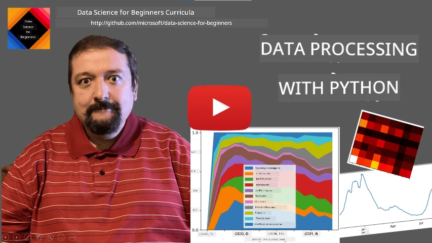
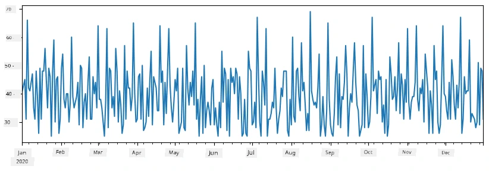
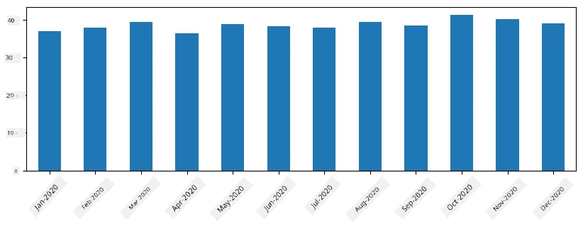

# Wok Wit Data: Python an di Pandas Library

|  ](../../sketchnotes/07-WorkWithPython.png) |
| :-------------------------------------------------------------------------------------------------------: |
|                 Wok Wit Python - _Sketchnote by [@nitya](https://twitter.com/nitya)_                 |

[](https://youtu.be/dZjWOGbsN4Y)

Even though databases dey very beta for store data an query dem wit query languages, di most flexible way to process data na to write your own program to manipulate data. For plenty cases, to do query for database go be beta way. But for some cases wey need complex data processing, e no go easy to do am wit SQL.
You fit program data processing for any programming language, but some languages dey more high-level when e come to data work. Data scientists dey mostly dey use one of dis languages:

* **[Python](https://www.python.org/)**, na general-purpose programming language, wey people dey consider as one of di best for beginners because e simple. Python get many libraries wey go fit help you solve plenty practical problems, like how to take data from ZIP archive, or how to convert picture go grayscale. Apart from data science, Python dey also use for web development.
* **[R](https://www.r-project.org/)** na traditional toolbox wey dem build for statistical data processing. E get plenty library repository (CRAN), so e good for data processing. But R no be general-purpose language, and e no too dey use outside data science area.
* **[Julia](https://julialang.org/)** na another language wey dem build specially for data science. E suppose give better performance than Python, so e great for scientific experiment.

For dis lesson, we go focus on how to use Python for simple data processing. We go assume say you get small basic knowledge about the language. If you want explore Python more, you fit check one of these resources:

* [Learn Python in a Fun Way with Turtle Graphics and Fractals](https://github.com/shwars/pycourse) - Quick intro course inside GitHub for Python Programming
* [Take your First Steps with Python](https://docs.microsoft.com/en-us/learn/paths/python-first-steps/?WT.mc_id=academic-77958-bethanycheum) Learning Path for [Microsoft Learn](http://learn.microsoft.com/?WT.mc_id=academic-77958-bethanycheum)

Data fit get many form. For dis lesson, we go look three forms of data - **tabular data**, **text** an **images**.

We go focus on some examples of data processing, no be to give you full overview of all libraries. Dis one go help you understand main idea of wetin fit happen, and e go also help you sabi where to find solution to your problems when you need am.

> **Most useful advice**. When you need perform certain operation for data wey you no sabi how to do, try search am for internet. [Stackoverflow](https://stackoverflow.com/) dey normally get plenty useful Python code samples for many common tasks.


## [Pre-lecture quiz](https://ff-quizzes.netlify.app/en/ds/quiz/12)

## Tabular Data an Dataframes

You don already meet tabular data when we dey talk about relational databases. When you get plenty data wey dey inside many different linked tables, e make sense to use SQL to work am. But many times we get table of data wey we need understand or get insight about am, like how di data scatter, di relation between di values, and more. For data science, na plenty times we need transform di original data before we fit create visualizations. All these steps easy to do using Python.

For Python, there two libraries wey fit help you handle tabular data:
* **[Pandas](https://pandas.pydata.org/)** dey allow you manipulate **Dataframes**, wey be like relational tables. Columns fit get names, and you fit do different operations on rows, columns or dataframe generally.
* **[Numpy](https://numpy.org/)** na library wey dey work with **tensors**, that is, multi-dimensional **arrays**. Array get one type of data, e simple pass dataframe, but e fit do plenty mathematical operations and e no get too much overhead.

You also get some other libraries you suppose sabi:
* **[Matplotlib](https://matplotlib.org/)** na library for data visualization and graph plotting
* **[SciPy](https://www.scipy.org/)** na library wey get extra scientific functions. We don already see am when we dey talk about probability an statistics

Dis na piece of code wey you go normally use to import dis libraries for start of your Python program:
```python
import numpy as np
import pandas as pd
import matplotlib.pyplot as plt
from scipy import ... # yu need fo tok di exact sub-packages wey yu need
``` 

Pandas dey focus on some basic ideas.

### Series 

**Series** na sequence of values, like list or numpy array. Di main difference na say series still get **index**, and when you dey do operation on series (like add dem), e dey use di index. Index fit be simple like integer row number (di default index when you create series from list or array), or e fit be complex structure like date interval.

> **Note**: Some introductory Pandas code dey inside di notebook [`notebook.ipynb`](notebook.ipynb) wey dey with this. We go just show some examples small here, but you fit check di full notebook.

Example be say: we wan analyze sales for our ice-cream spot. Make we generate series of sales numbers (number of items wey we sell each day) for some time:

```python
start_date = "Jan 1, 2020"
end_date = "Mar 31, 2020"
idx = pd.date_range(start_date,end_date)
print(f"Length of index is {len(idx)}")
items_sold = pd.Series(np.random.randint(25,50,size=len(idx)),index=idx)
items_sold.plot()
```


Now suppose we dey organize party for friends each week, and we carry extra 10 packs ice-cream for di party. We fit create another series, indexed by week, to show dat:
```python
additional_items = pd.Series(10,index=pd.date_range(start_date,end_date,freq="W"))
```
When we add two series join, we go get total number:
```python
total_items = items_sold.add(additional_items,fill_value=0)
total_items.plot()
```


> **Note** say we no just use simple code `total_items+additional_items`. If we use dat, we for get plenty `NaN` (*Not a Number*) values for di resulting series. Na because some index points no get value for `additional_items` series, and to add `NaN` to anything go still give `NaN`. So we need specify `fill_value` parameter when we dey add.

With time series, we fit also **resample** di series for different time intervals. For example, suppose we wan calculate mean sales each month. We fit use dis code:
```python
monthly = total_items.resample("1M").mean()
ax = monthly.plot(kind='bar')
```


### DataFrame

DataFrame na collection of series wey get di same index. You fit join plenty series to form one DataFrame:
```python
a = pd.Series(range(1,10))
b = pd.Series(["I","like","to","play","games","and","will","not","change"],index=range(0,9))
df = pd.DataFrame([a,b])
```
Dis one go create horizontal table like dis:
|     | 0   | 1    | 2   | 3   | 4      | 5   | 6      | 7    | 8    |
| --- | --- | ---- | --- | --- | ------ | --- | ------ | ---- | ---- |
| 0   | 1   | 2    | 3   | 4   | 5      | 6   | 7      | 8    | 9    |
| 1   | I   | like | to  | use | Python | and | Pandas | very | much |

We fit also use Series as columns, an set column names by using dictionary:
```python
df = pd.DataFrame({ 'A' : a, 'B' : b })
```
Dis one go give us table like dis:

|     | A   | B      |
| --- | --- | ------ |
| 0   | 1   | I      |
| 1   | 2   | like   |
| 2   | 3   | to     |
| 3   | 4   | use    |
| 4   | 5   | Python |
| 5   | 6   | and    |
| 6   | 7   | Pandas |
| 7   | 8   | very   |
| 8   | 9   | much   |

**Note** we fit also get dis table layout if we transpose di previous table, like by typing 
```python
df = pd.DataFrame([a,b]).T.rename(columns={ 0 : 'A', 1 : 'B' })
```
Wen you see `.T` na di transpose operation for DataFrame, dat mean e dey take rows change am to columns and columns to rows, and di `rename` operation fit rename columns to match di previous example.

Here na some important operations we fit do on DataFrames:

**Column selection**. You fit choose individual columns by typing `df['A']` - dis operation return Series. You fit choose some columns make dem go another DataFrame by typing `df[['B','A']]` - dis one return another DataFrame.

**Filtering** only rows wey meet certain criteria. For example, to keep only rows wey get column `A` greater than 5, you fit write `df[df['A']>5]`.

> **Note**: Filtering dey work like this. The expression `df['A']<5` go return boolean series, weh go show true or false for each element in original series `df['A']`. When boolean series use as index, e go select rows wey true only for the DataFrame. So you no fit use arbitrary Python boolean expression like `df[df['A']>5 and df['A']<7]` because e go wrong. Instead, use special `&` operator for boolean series, like `df[(df['A']>5) & (df['A']<7)]` (*make sure you put brackets correct*).

**Create new columns wey you fit calculate**. You fit easily create new columns for your DataFrame by writing expression like dis:
```python
df['DivA'] = df['A']-df['A'].mean() 
``` 
Dis example dey calculate how A differ from its mean. Wetin actually dey happen be say we dey calculate series, then assign am to the left-hand side, to create new column. So no fit use operations wey no fit with series, like dis code below wey no correct:
```python
# Wrong code -> df['ADescr'] = "Low" if df['A'] < 5 else "Hi"
df['LenB'] = len(df['B']) # <- Result no correct
``` 
Dis example, even though e correct for syntax, e no dey correct for result: e assign di length of entire series `B` to all values for di column, no be length of individual elements like we want.

If you need to compute complex expressions like dis, you fit use `apply` function. Di last example fit write am dis way:
```python
df['LenB'] = df['B'].apply(lambda x : len(x))
# or
df['LenB'] = df['B'].apply(len)
```

After di operations, di DataFrame go be like dis:

|     | A   | B      | DivA | LenB |
| --- | --- | ------ | ---- | ---- |
| 0   | 1   | I      | -4.0 | 1    |
| 1   | 2   | like   | -3.0 | 4    |
| 2   | 3   | to     | -2.0 | 2    |
| 3   | 4   | use    | -1.0 | 3    |
| 4   | 5   | Python | 0.0  | 6    |
| 5   | 6   | and    | 1.0  | 3    |
| 6   | 7   | Pandas | 2.0  | 6    |
| 7   | 8   | very   | 3.0  | 4    |
| 8   | 9   | much   | 4.0  | 4    |

**Select rows based on position** fit do using `iloc`. For example, to choose first 5 rows from DataFrame:
```python
df.iloc[:5]
```

**Grouping** dey often used like *pivot tables* for Excel. Suppose we wan calculate mean value of column `A` based on number of `LenB`. Then we go group our DataFrame by `LenB`, and call `mean`:
```python
df.groupby(by='LenB')[['A','DivA']].mean()
```
If you wanna calculate mean and number of elements in each group, fit use complex `aggregate` function:
```python
df.groupby(by='LenB') \
 .aggregate({ 'DivA' : len, 'A' : lambda x: x.mean() }) \
 .rename(columns={ 'DivA' : 'Count', 'A' : 'Mean'})
```
Dis one go give us this table:

| LenB | Count | Mean     |
| ---- | ----- | -------- |
| 1    | 1     | 1.000000 |
| 2    | 1     | 3.000000 |
| 3    | 2     | 5.000000 |
| 4    | 3     | 6.333333 |
| 6    | 2     | 6.000000 |

### How to Get Data


We don don see how easy e dey to build Series and DataFrames from Python objects. But, data most times dey come as text file or Excel table. Lucky for us, Pandas get simple way to load data from disk. For example, to read CSV file na like dis e be:
```python
df = pd.read_csv('file.csv')
```
We go see more example of how to load data, including to fetch am from external web sites, for the "Challenge" section


### Printing and Plotting

Data Scientist dem dey often need to explore data, so e important to fit visualize am. When DataFrame big, many times we just want to sure say everything dey go well by to print the first few rows. You fit do dis by to run `df.head()`. If you dey run am from Jupyter Notebook, e go print the DataFrame for correct tabular form.

We don also see how to use `plot` function to visualize some columns. Even though `plot` good for plenty tasks and e fit support different graph types via `kind=` parameter, you fit always use raw `matplotlib` library to plot something more complex. We go talk about data visualization better for separate course lessons.

Dis overview don cover the main concepts wey dey important for Pandas, but the library get plenti tins, and e no get limit for wetin you fit do with am! Now make we use this knowledge do correct solution for specific problem.

## 🚀 Challenge 1: Analyzing COVID Spread

The first problem we go focus on na how to model the epidemic spread of COVID-19. To do dat, we go use data about infected people for different countries, dat one na from [Center for Systems Science and Engineering](https://systems.jhu.edu/) (CSSE) at [Johns Hopkins University](https://jhu.edu/). The dataset dey for [this GitHub Repository](https://github.com/CSSEGISandData/COVID-19).

Since we wan show how to handle data, we dey invite you to open [`notebook-covidspread.ipynb`](notebook-covidspread.ipynb) and read am from top to bottom. You fit also run the cells, and do some challenges wey we leave for you for end.


> If you no sabi how to run code for Jupyter Notebook, check [this article](https://soshnikov.com/education/how-to-execute-notebooks-from-github/).

## Working with Unstructured Data

Even though data plenty times dey tabular form, sometimes we need deal with less structured data like text or pictures. For dis kain case, to apply data processing techniques we don see before, we need to somehow **extract** structured data. Here na some examples:

* Extract keywords from text, and see how often those keywords show face
* Use neural networks to extract information about objects for picture
* Get information about how people dey feel from video camera feed

## 🚀 Challenge 2: Analyzing COVID Papers

For dis challenge, we go continue with COVID pandemic topic, and focus on processing scientific papers about am. There dey [CORD-19 Dataset](https://www.kaggle.com/allen-institute-for-ai/CORD-19-research-challenge) wey get more than 7000 papers (like dis time we dey write this one) on COVID, with metadata and abstracts (and about half of them get full text too).

Full example of how to analyze dis dataset using [Text Analytics for Health](https://docs.microsoft.com/azure/cognitive-services/text-analytics/how-tos/text-analytics-for-health/?WT.mc_id=academic-77958-bethanycheum) cognitive service dey explained [for dis blog post](https://soshnikov.com/science/analyzing-medical-papers-with-azure-and-text-analytics-for-health/). We go talk about simplified version of dis analysis.

> **NOTE**: We no dey provide copy of the dataset for dis repository. You fit first download the [`metadata.csv`](https://www.kaggle.com/allen-institute-for-ai/CORD-19-research-challenge?select=metadata.csv) file from [dis dataset for Kaggle](https://www.kaggle.com/allen-institute-for-ai/CORD-19-research-challenge). You fit need register for Kaggle. You fit also download the dataset without registration [from here](https://ai2-semanticscholar-cord-19.s3-us-west-2.amazonaws.com/historical_releases.html), but e go carry all full texts join metadata file.

Open [`notebook-papers.ipynb`](notebook-papers.ipynb) and read am from top to bottom. You fit still run cells and do some challenges we leave for you at the end.


## Processing Image Data

Recently, powerful AI models don show wey to understand images well well. Plenty tasks fit solve by pre-trained neural networks, or cloud services. Some examples na:

* **Image Classification**, wey fit help you categorize the image into one of the pre-defined classes. You fit train your own image classifiers easily using services like [Custom Vision](https://azure.microsoft.com/services/cognitive-services/custom-vision-service/?WT.mc_id=academic-77958-bethanycheum)
* **Object Detection** to find different objects for inside the image. Services like [computer vision](https://azure.microsoft.com/services/cognitive-services/computer-vision/?WT.mc_id=academic-77958-bethanycheum) fit detect common objects, and you fit train [Custom Vision](https://azure.microsoft.com/services/cognitive-services/custom-vision-service/?WT.mc_id=academic-77958-bethanycheum) model to detect specific objects wey you fit need.
* **Face Detection**, wey include Age, Gender and Emotion detection. You fit do dis with [Face API](https://azure.microsoft.com/services/cognitive-services/face/?WT.mc_id=academic-77958-bethanycheum).

All these cloud services you fit call am using [Python SDKs](https://docs.microsoft.com/samples/azure-samples/cognitive-services-python-sdk-samples/cognitive-services-python-sdk-samples/?WT.mc_id=academic-77958-bethanycheum), so e dey easy to put am inside your data exploration workflow.

Here na some examples of how to explore data from Image data sources:
* For blog post [How to Learn Data Science without Coding](https://soshnikov.com/azure/how-to-learn-data-science-without-coding/) we explore Instagram photos, to sabi why people dey give more likes for photo. First, we extract as much information as e possible from pictures using [computer vision](https://azure.microsoft.com/services/cognitive-services/computer-vision/?WT.mc_id=academic-77958-bethanycheum), then use [Azure Machine Learning AutoML](https://docs.microsoft.com/azure/machine-learning/concept-automated-ml/?WT.mc_id=academic-77958-bethanycheum) to build model wey fit explain well.
* For [Facial Studies Workshop](https://github.com/CloudAdvocacy/FaceStudies) we dey use [Face API](https://azure.microsoft.com/services/cognitive-services/face/?WT.mc_id=academic-77958-bethanycheum) to extract emotional expressions for people dem wey dey picture from events, to try understand wetin dey make people happy.

## Conclusion

Whether your data structured or no structured, if you get Python you fit do all the data processing and understanding steps. E dey probably the most flexible way for data processing, and na why many data scientists dey use Python as their primary tool. To learn Python well no be small thing if you serious about your data science journey!

## [Post-lecture quiz](https://ff-quizzes.netlify.app/en/ds/quiz/13)

## Review & Self Study

**Books**
* [Wes McKinney. Python for Data Analysis: Data Wrangling with Pandas, NumPy, and IPython](https://www.amazon.com/gp/product/1491957662)

**Online Resources**
* Official [10 minutes to Pandas](https://pandas.pydata.org/pandas-docs/stable/user_guide/10min.html) tutorial
* [Documentation on Pandas Visualization](https://pandas.pydata.org/pandas-docs/stable/user_guide/visualization.html)

**Learning Python**
* [Learn Python in a Fun Way with Turtle Graphics and Fractals](https://github.com/shwars/pycourse)
* [Take your First Steps with Python](https://docs.microsoft.com/learn/paths/python-first-steps/?WT.mc_id=academic-77958-bethanycheum) Learning Path for [Microsoft Learn](http://learn.microsoft.com/?WT.mc_id=academic-77958-bethanycheum)

## Assignment

[Do more detailed data study for the challenges wey dey top](assignment.md)

## Credits

Dis lesson dem write am wit ♥️ by [Dmitry Soshnikov](http://soshnikov.com)

---

<!-- CO-OP TRANSLATOR DISCLAIMER START -->
**Disclaimer**:
Dis document don translate wit AI translation service [Co-op Translator](https://github.com/Azure/co-op-translator). Even tho we dey try make am correct, abeg make you know say automated translation fit get errors or mistakes. Di original document for dia own language na im be di correct source. For important info, make person wey sabi human translation do am. We no go responsible for any misunderstanding or wrong understanding wey fit happen because of dis translation.
<!-- CO-OP TRANSLATOR DISCLAIMER END -->