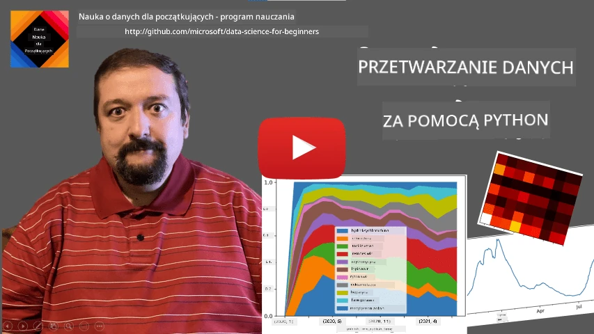
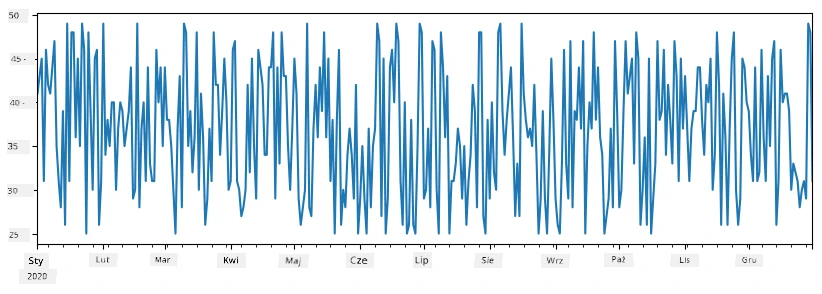
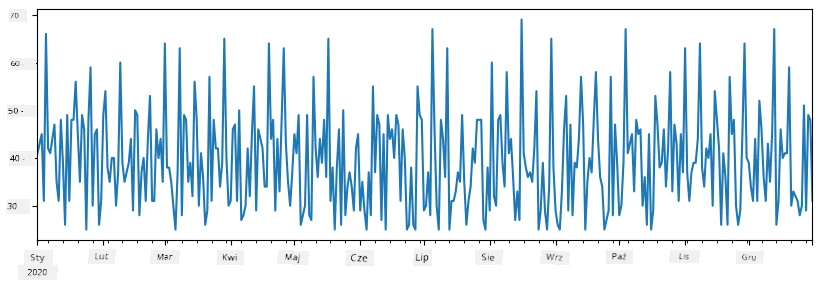
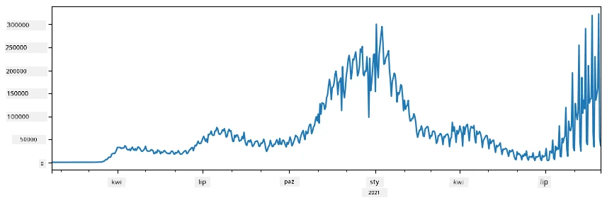
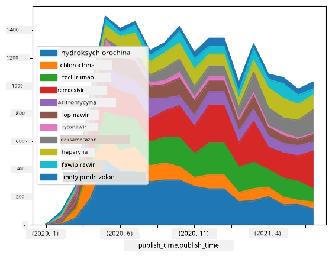

# Praca z danymi: Python i biblioteka Pandas

|  ](../../sketchnotes/07-WorkWithPython.png) |
| :-------------------------------------------------------------------------------------------------------: |
|                Praca z Pythonem - _Sketchnote autorstwa [@nitya](https://twitter.com/nitya)_                   |

[](https://youtu.be/dZjWOGbsN4Y)

Podczas gdy bazy danych oferują bardzo efektywne sposoby przechowywania danych i ich zapytań za pomocą języków zapytań, najbardziej elastycznym sposobem przetwarzania danych jest napisanie własnego programu do manipulacji danymi. W wielu przypadkach wykonanie zapytania do bazy danych jest bardziej efektywne. Jednak w pewnych sytuacjach, gdy potrzebne jest bardziej złożone przetwarzanie danych, nie można tego łatwo zrobić za pomocą SQL.
Przetwarzanie danych można programować w dowolnym języku programowania, ale istnieją pewne języki, które są wyższego poziomu pod względem pracy z danymi. Naukowcy zajmujący się danymi zazwyczaj preferują jeden z następujących języków:

* **[Python](https://www.python.org/)**, ogólnego przeznaczenia język programowania, który często uważany jest za jedną z najlepszych opcji dla początkujących ze względu na swoją prostotę. Python posiada wiele dodatkowych bibliotek, które mogą pomóc rozwiązać wiele praktycznych problemów, takich jak wyciąganie danych z archiwum ZIP czy konwersja obrazu na skalę szarości. Oprócz data science, Python jest często używany do tworzenia stron internetowych.
* **[R](https://www.r-project.org/)** to tradycyjne narzędzie stworzone z myślą o statystycznym przetwarzaniu danych. Zawiera także ogromne repozytorium bibliotek (CRAN), co czyni go dobrym wyborem do przetwarzania danych. Jednak R nie jest językiem ogólnego przeznaczenia i rzadko bywa używany poza dziedziną data science.
* **[Julia](https://julialang.org/)** to kolejny język opracowany specjalnie dla nauki o danych. Ma oferować lepszą wydajność niż Python, co czyni go świetnym narzędziem do eksperymentów naukowych.

W tej lekcji skupimy się na używaniu Pythona do prostego przetwarzania danych. Zakładamy podstawową znajomość języka. Jeśli chcesz głębsze wprowadzenie do Pythona, możesz sięgnąć po jedną z poniższych zasobów:

* [Ucz się Pythona w zabawny sposób z grafiką Turtle i fraktalami](https://github.com/shwars/pycourse) – szybki kurs wprowadzający do programowania w Pythonie na GitHubie
* [Zrób swoje pierwsze kroki z Pythonem](https://docs.microsoft.com/en-us/learn/paths/python-first-steps/?WT.mc_id=academic-77958-bethanycheum) Ścieżka nauki na [Microsoft Learn](http://learn.microsoft.com/?WT.mc_id=academic-77958-bethanycheum)

Dane mogą przybierać wiele form. W tej lekcji rozważymy trzy formy danych – **dane tabelaryczne**, **tekst** oraz **obrazy**.

Skupimy się na kilku przykładach przetwarzania danych, zamiast przedstawiać pełny przegląd wszystkich bibliotek powiązanych z tym tematem. Pozwoli to zrozumieć główną ideę i da Ci świadomość, gdzie szukać rozwiązań na swoje problemy, gdy zajdzie taka potrzeba.

> **Najbardziej przydatna rada**. Kiedy potrzebujesz wykonać określoną operację na danych, której nie znasz, spróbuj jej poszukać w internecie. [Stackoverflow](https://stackoverflow.com/) zazwyczaj zawiera wiele przydatnych przykładów kodu w Pythonie dla typowych zadań.


## [Quiz przed wykładem](https://ff-quizzes.netlify.app/en/ds/quiz/12)

## Dane tabelaryczne i DataFrame'y

Już zetknąłeś się z danymi tabelarycznymi, rozmawiając o relacyjnych bazach danych. Gdy masz dużo danych i są one zawarte w wielu powiązanych tabelach, zdecydowanie warto użyć SQL do ich przetwarzania. Jednak istnieje wiele przypadków, gdy mamy tabelę danych i potrzebujemy uzyskać pewne **zrozumienie** lub **wgląd** w te dane, takie jak rozkład, korelacje między wartościami itd. W nauce o danych często zachodzi potrzeba wykonania transformacji oryginalnych danych, a następnie ich wizualizacji. Oba te kroki można z łatwością wykonać przy użyciu Pythona.

W Pythonie istnieją dwie najważniejsze biblioteki, które pomogą Ci obsługiwać dane tabelaryczne:
* **[Pandas](https://pandas.pydata.org/)** pozwala na manipulację tak zwanymi **DataFrame'ami**, które są analogiczne do tabel relacyjnych. Możesz mieć nazwane kolumny i wykonać różne operacje na wierszach, kolumnach oraz na DataFrame'ach w ogóle.
* **[Numpy](https://numpy.org/)** to biblioteka do pracy z **tensorami**, tzn. wielowymiarowymi **tablicami** danych. Tablica ma wartości tego samego typu i jest prostsza niż DataFrame, ale oferuje więcej operacji matematycznych oraz stwarza mniejsze obciążenie.

Są też inne biblioteki, które warto znać:
* **[Matplotlib](https://matplotlib.org/)** to biblioteka używana do wizualizacji danych i rysowania wykresów
* **[SciPy](https://www.scipy.org/)** to biblioteka z dodatkowymi funkcjami naukowymi. Już mieliśmy z nią do czynienia, rozmawiając o prawdopodobieństwie i statystyce

Oto przykładowy fragment kodu, którego zwykle używasz, aby zaimportować te biblioteki na początku programu w Pythonie:
```python
import numpy as np
import pandas as pd
import matplotlib.pyplot as plt
from scipy import ... # musisz określić dokładne podpakiety, których potrzebujesz
``` 

Pandas opiera się na kilku podstawowych pojęciach.

### Series

**Series** to sekwencja wartości, podobna do listy lub tablicy numpy. Główna różnica polega na tym, że Series posiada także **indeks** i podczas wykonywania operacji na seriach (np. dodawania) indeks jest brany pod uwagę. Indeks może być tak prosty jak liczba całkowita reprezentująca numer wiersza (jest to domyślny indeks przy tworzeniu Series z listy lub tablicy) lub mieć bardziej złożoną strukturę, na przykład przedział datowy.

> **Uwaga**: W notebooku towarzyszącym [`notebook.ipynb`](notebook.ipynb) znajduje się wprowadzający kod dotyczący Pandas. Tutaj przedstawiamy tylko niektóre przykłady, ale zachęcamy do zapoznania się z całym notebookiem.

Rozważmy przykład: chcemy analizować sprzedaż naszego punktu z lodami. Wygenerujmy serię liczb sprzedaży (liczby sprzedanych sztuk każdego dnia) na pewien okres czasu:

```python
start_date = "Jan 1, 2020"
end_date = "Mar 31, 2020"
idx = pd.date_range(start_date,end_date)
print(f"Length of index is {len(idx)}")
items_sold = pd.Series(np.random.randint(25,50,size=len(idx)),index=idx)
items_sold.plot()
```


Załóżmy, że co tydzień organizujemy imprezę dla przyjaciół i zabieramy dodatkowe 10 opakowań lodów. Możemy utworzyć inną serię indeksowaną według tygodnia, by to zobrazować:
```python
additional_items = pd.Series(10,index=pd.date_range(start_date,end_date,freq="W"))
```
Kiedy dodamy dwie serie, otrzymamy całkowitą liczbę:
```python
total_items = items_sold.add(additional_items,fill_value=0)
total_items.plot()
```


> **Uwaga**: Nie używamy prostego zapisu `total_items+additional_items`. Gdybyśmy to zrobili, w wynikowej serii pojawiłoby się dużo wartości `NaN` (*Not a Number*). Dzieje się tak, ponieważ w serii `additional_items` brakuje wartości dla niektórych punktów indeksu, a dodawanie `NaN` do czegokolwiek daje `NaN`. Dlatego podczas dodawania musimy określić parametr `fill_value`.

W przypadku szeregów czasowych możemy także **próbkować ponownie** dane z różnymi interwałami czasowymi. Na przykład, jeśli chcemy obliczyć średnią sprzedaż miesięczną, możemy użyć następującego kodu:
```python
monthly = total_items.resample("1M").mean()
ax = monthly.plot(kind='bar')
```


### DataFrame

DataFrame to zasadniczo kolekcja Series o tym samym indeksie. Możemy połączyć kilka Series w jeden DataFrame:
```python
a = pd.Series(range(1,10))
b = pd.Series(["I","like","to","play","games","and","will","not","change"],index=range(0,9))
df = pd.DataFrame([a,b])
```
To stworzy tabelę poziomą taką jak ta:
|     | 0   | 1    | 2   | 3   | 4      | 5   | 6      | 7    | 8    |
| --- | --- | ---- | --- | --- | ------ | --- | ------ | ---- | ---- |
| 0   | 1   | 2    | 3   | 4   | 5      | 6   | 7      | 8    | 9    |
| 1   | I   | like | to  | use | Python | and | Pandas | very | much |

Możemy też użyć Series jako kolumn i określić nazwy kolumn za pomocą słownika:
```python
df = pd.DataFrame({ 'A' : a, 'B' : b })
```
To da nam tabelę taką jak ta:

|     | A   | B      |
| --- | --- | ------ |
| 0   | 1   | I      |
| 1   | 2   | like   |
| 2   | 3   | to     |
| 3   | 4   | use    |
| 4   | 5   | Python |
| 5   | 6   | and    |
| 6   | 7   | Pandas |
| 7   | 8   | very   |
| 8   | 9   | much   |

**Uwaga**: tę samą organizację tabeli możemy uzyskać przez transpozycję poprzedniej tabeli, np. pisząc
```python
df = pd.DataFrame([a,b]).T.rename(columns={ 0 : 'A', 1 : 'B' })
```
Tutaj `.T` oznacza operację transpozycji DataFrame, czyli zamianę wierszy z kolumnami, a `rename` pozwala nam zmienić nazwy kolumn, aby pasowały do poprzedniego przykładu.

Oto kilka najważniejszych operacji, które możemy wykonywać na DataFrame'ach:

**Wybranie kolumny**. Możemy wybrać pojedynczą kolumnę, pisząc `df['A']` — ta operacja zwraca Series. Możemy też wybrać podzbiór kolumn tworząc nowy DataFrame, pisząc `df[['B','A']]` — to zwraca nowy DataFrame.

**Filtrowanie** wierszy według kryteriów. Na przykład, aby pozostawić tylko wiersze, gdzie kolumna `A` jest większa niż 5, można napisać `df[df['A']>5]`.

> **Uwaga**: Filtrowanie działa w ten sposób, że wyrażenie `df['A']<5` zwraca serię wartości logicznych (`True` albo `False`) dla każdego elementu oryginalnej serii `df['A']`. Gdy taka seria logiczna jest używana jako indeks, zwraca podzbiór wierszy DataFrame'a. Dlatego nie można pisać dowolnego wyrażenia logicznego Pythona, np. `df[df['A']>5 and df['A']<7]` jest błędne. Zamiast tego należy użyć specjalnej operacji `&` dla serii logicznych, pisząc `df[(df['A']>5) & (df['A']<7)]` (*nawiasy są tu istotne*).

**Tworzenie nowych kolumn obliczeniowych**. Możemy łatwo tworzyć nowe kolumny oparte na obliczeniach w naszym DataFrame, używając intuicyjnych wyrażeń jak to:
```python
df['DivA'] = df['A']-df['A'].mean() 
``` 
Ten przykład oblicza odchylenie wartości A od jej średniej. Właściwie to tworzymy serię, którą następnie przypisujemy z lewej strony, tworząc kolejną kolumnę. Nie możemy więc używać operacji niekompatybilnych z seriami, na przykład poniższy kod jest błędny:
```python
# Niepoprawny kod -> df['ADescr'] = "Low" jeśli df['A'] < 5 w przeciwnym razie "Hi"
df['LenB'] = len(df['B']) # <- Niepoprawny wynik
``` 
Ten przykład, mimo że jest składniowo poprawny, daje zły wynik, ponieważ przypisuje długość serii `B` do wszystkich wartości w kolumnie, a nie długość poszczególnych elementów, jak zamierzaliśmy.

Jeśli potrzebujemy obliczyć złożone wyrażenia, możemy użyć funkcji `apply`. Ostatni przykład można napisać tak:
```python
df['LenB'] = df['B'].apply(lambda x : len(x))
# lub
df['LenB'] = df['B'].apply(len)
```

Po tych operacjach otrzymamy następujący DataFrame:

|     | A   | B      | DivA | LenB |
| --- | --- | ------ | ---- | ---- |
| 0   | 1   | I      | -4.0 | 1    |
| 1   | 2   | like   | -3.0 | 4    |
| 2   | 3   | to     | -2.0 | 2    |
| 3   | 4   | use    | -1.0 | 3    |
| 4   | 5   | Python | 0.0  | 6    |
| 5   | 6   | and    | 1.0  | 3    |
| 6   | 7   | Pandas | 2.0  | 6    |
| 7   | 8   | very   | 3.0  | 4    |
| 8   | 9   | much   | 4.0  | 4    |

**Wybór wierszy na podstawie indeksów** możemy wykonać przy pomocy `iloc`. Na przykład, aby wybrać pierwsze 5 wierszy z DataFrame:
```python
df.iloc[:5]
```

**Grupowanie** jest często stosowane, aby uzyskać rezultat podobny do *tabel przestawnych* w Excelu. Załóżmy, że chcemy obliczyć średnią kolumny `A` dla każdej wartości `LenB`. Możemy wtedy pogrupować DataFrame po `LenB` i wywołać `mean`:
```python
df.groupby(by='LenB')[['A','DivA']].mean()
```
Jeśli potrzebujemy wyliczyć średnią i liczbę elementów w grupie, możemy użyć bardziej zaawansowanej funkcji `aggregate`:
```python
df.groupby(by='LenB') \
 .aggregate({ 'DivA' : len, 'A' : lambda x: x.mean() }) \
 .rename(columns={ 'DivA' : 'Count', 'A' : 'Mean'})
```
Otrzymamy tabelę:

| LenB | Count | Mean     |
| ---- | ----- | -------- |
| 1    | 1     | 1.000000 |
| 2    | 1     | 3.000000 |
| 3    | 2     | 5.000000 |
| 4    | 3     | 6.333333 |
| 6    | 2     | 6.000000 |

### Pozyskiwanie danych


Widzieliśmy, jak łatwo jest tworzyć Series i DataFrames z obiektów Pythona. Jednak dane zazwyczaj pochodzą w formie pliku tekstowego lub tabeli Excel. Na szczęście Pandas oferuje nam prosty sposób na wczytanie danych z dysku. Na przykład, odczyt pliku CSV jest tak prosty jak to:
```python
df = pd.read_csv('file.csv')
```
Zobaczymy więcej przykładów ładowania danych, w tym pobierania ich z zewnętrznych stron internetowych, w sekcji "Challenge"


### Wyświetlanie i wykresy

Data Scientist często musi eksplorować dane, dlatego ważne jest umiejętność ich wizualizacji. Gdy DataFrame jest duży, wielokrotnie chcemy tylko upewnić się, że robimy wszystko poprawnie, wyświetlając pierwsze kilka wierszy. Można to zrobić, wywołując `df.head()`. Jeśli uruchamiasz to w Jupyter Notebook, zostanie wyświetlony DataFrame w ładnej, tabelarycznej formie.

Widzieliśmy również użycie funkcji `plot` do wizualizacji niektórych kolumn. Choć `plot` jest bardzo użyteczny w wielu zadaniach i obsługuje wiele różnych typów wykresów poprzez parametr `kind=`, zawsze można użyć surowej biblioteki `matplotlib` do wykreślenia czegoś bardziej złożonego. Omówimy wizualizację danych bardziej szczegółowo w oddzielnych lekcjach kursu.

Ta przeglądowa sekcja omawia najważniejsze koncepcje Pandas, jednak biblioteka jest bardzo bogata i nie ma ograniczeń co do tego, co można z nią zrobić! Teraz zastosujmy tę wiedzę do rozwiązania konkretnego problemu.

## 🚀 Wyzwanie 1: Analiza rozprzestrzeniania się COVID

Pierwszym problemem, na którym się skupimy, jest modelowanie rozprzestrzeniania się epidemii COVID-19. W tym celu użyjemy danych o liczbie zakażonych osób w różnych krajach, dostarczonych przez [Center for Systems Science and Engineering](https://systems.jhu.edu/) (CSSE) na [Johns Hopkins University](https://jhu.edu/). Zbiór danych jest dostępny w [tym repozytorium GitHub](https://github.com/CSSEGISandData/COVID-19).

Ponieważ chcemy pokazać, jak radzić sobie z danymi, zachęcamy do otwarcia [`notebook-covidspread.ipynb`](notebook-covidspread.ipynb) i przeczytania go od początku do końca. Możesz także wykonywać komórki i spróbować wyzwań, które zostawiliśmy dla Ciebie na końcu.



> Jeśli nie wiesz, jak uruchomić kod w Jupyter Notebook, zajrzyj do [tego artykułu](https://soshnikov.com/education/how-to-execute-notebooks-from-github/).

## Praca z danymi nieustrukturyzowanymi

Chociaż dane bardzo często występują w formie tabeli, w niektórych przypadkach musimy pracować z mniej ustrukturyzowanymi danymi, na przykład tekstem lub obrazami. W takim przypadku, aby zastosować techniki przetwarzania danych omówione powyżej, musimy jakoś **wydobyć** dane ustrukturyzowane. Oto kilka przykładów:

* Wydobywanie słów kluczowych z tekstu i sprawdzanie, jak często się pojawiają
* Użycie sieci neuronowych do wydobycia informacji o obiektach na obrazku
* Uzyskiwanie informacji o emocjach osób na nagraniu wideo

## 🚀 Wyzwanie 2: Analiza artykułów naukowych o COVID

W tym wyzwaniu kontynuujemy temat pandemii COVID i skupimy się na przetwarzaniu artykułów naukowych na ten temat. Dostępny jest [CORD-19 Dataset](https://www.kaggle.com/allen-institute-for-ai/CORD-19-research-challenge) z ponad 7000 (w chwili pisania) artykułów o COVID, dostępnych wraz z metadanymi i abstraktami (a dla około połowy z nich dostępny jest także pełny tekst).

Pełny przykład analizy tego zbioru danych za pomocą usługi kognitywnej [Text Analytics for Health](https://docs.microsoft.com/azure/cognitive-services/text-analytics/how-tos/text-analytics-for-health/?WT.mc_id=academic-77958-bethanycheum) jest opisany [w tym wpisie na blogu](https://soshnikov.com/science/analyzing-medical-papers-with-azure-and-text-analytics-for-health/). Omówimy uproszczoną wersję tej analizy.

> **UWAGA**: Nie dostarczamy kopii zbioru danych jako części tego repozytorium. Najpierw może być konieczne pobranie pliku [`metadata.csv`](https://www.kaggle.com/allen-institute-for-ai/CORD-19-research-challenge?select=metadata.csv) z [tego zbioru danych na Kaggle](https://www.kaggle.com/allen-institute-for-ai/CORD-19-research-challenge). Może być wymagana rejestracja w Kaggle. Możesz także pobrać zbiór danych bez rejestracji [stąd](https://ai2-semanticscholar-cord-19.s3-us-west-2.amazonaws.com/historical_releases.html), ale będzie on zawierał wszystkie pełne teksty oprócz pliku metadanych.

Otwórz [`notebook-papers.ipynb`](notebook-papers.ipynb) i przeczytaj go od początku do końca. Możesz także wykonywać komórki i spróbować wyzwań, które zostawiliśmy dla Ciebie na końcu.



## Przetwarzanie danych obrazowych

Ostatnio zostały opracowane bardzo potężne modele AI, które pozwalają nam rozumieć obrazy. Istnieje wiele zadań, które można rozwiązać za pomocą wstępnie wytrenowanych sieci neuronowych lub usług chmurowych. Oto kilka przykładów:

* **Klasyfikacja obrazów**, która pomaga kategoryzować obraz do jednej z wstępnie zdefiniowanych klas. Możesz łatwo trenować własne klasyfikatory obrazów, korzystając z usług takich jak [Custom Vision](https://azure.microsoft.com/services/cognitive-services/custom-vision-service/?WT.mc_id=academic-77958-bethanycheum)
* **Detekcja obiektów** w celu wykrywania różnych obiektów na obrazie. Usługi takie jak [computer vision](https://azure.microsoft.com/services/cognitive-services/computer-vision/?WT.mc_id=academic-77958-bethanycheum) mogą wykrywać wiele powszechnych obiektów, a możesz trenować model [Custom Vision](https://azure.microsoft.com/services/cognitive-services/custom-vision-service/?WT.mc_id=academic-77958-bethanycheum), aby wykrywał konkretne interesujące obiekty.
* **Wykrywanie twarzy**, w tym rozpoznawanie wieku, płci i emocji. Można to zrobić za pomocą [Face API](https://azure.microsoft.com/services/cognitive-services/face/?WT.mc_id=academic-77958-bethanycheum).

Wszystkie te usługi chmurowe można wywoływać za pomocą [Python SDK](https://docs.microsoft.com/samples/azure-samples/cognitive-services-python-sdk-samples/cognitive-services-python-sdk-samples/?WT.mc_id=academic-77958-bethanycheum), dzięki czemu łatwo można je włączyć do swojego przepływu pracy eksploracji danych.

Oto kilka przykładów eksploracji danych pochodzących ze źródeł obrazowych:
* W wpisie na blogu [Jak uczyć się Data Science bez kodowania](https://soshnikov.com/azure/how-to-learn-data-science-without-coding/) analizujemy zdjęcia z Instagrama, próbując zrozumieć, co powoduje, że ludzie dają więcej lajków na zdjęcie. Najpierw wydobywamy jak najwięcej informacji z obrazów za pomocą [computer vision](https://azure.microsoft.com/services/cognitive-services/computer-vision/?WT.mc_id=academic-77958-bethanycheum), a następnie używamy [Azure Machine Learning AutoML](https://docs.microsoft.com/azure/machine-learning/concept-automated-ml/?WT.mc_id=academic-77958-bethanycheum), aby zbudować interpretowalny model.
* W [Warsztatach Badań Twarzy](https://github.com/CloudAdvocacy/FaceStudies) korzystamy z [Face API](https://azure.microsoft.com/services/cognitive-services/face/?WT.mc_id=academic-77958-bethanycheum), aby wydobywać emocje ludzi na zdjęciach z wydarzeń, próbując zrozumieć, co sprawia, że ludzie są szczęśliwi.

## Podsumowanie

Niezależnie od tego, czy masz już dane ustrukturyzowane, czy nieustrukturyzowane, korzystając z Pythona możesz wykonać wszystkie kroki związane z przetwarzaniem i analizą danych. Jest to prawdopodobnie najbardziej elastyczny sposób przetwarzania danych, i z tego powodu większość data scientistów używa Pythona jako swojego głównego narzędzia. Nauka Pythona w praktyce jest prawdopodobnie dobrym pomysłem, jeśli poważnie traktujesz swoją drogę w data science!

## [Quiz po wykładzie](https://ff-quizzes.netlify.app/en/ds/quiz/13)

## Przegląd i samodzielna nauka

**Książki**
* [Wes McKinney. Python for Data Analysis: Data Wrangling with Pandas, NumPy, and IPython](https://www.amazon.com/gp/product/1491957662)

**Zasoby online**
* Oficjalny samouczek [10 minutes to Pandas](https://pandas.pydata.org/pandas-docs/stable/user_guide/10min.html)
* [Dokumentacja o Pandas Visualization](https://pandas.pydata.org/pandas-docs/stable/user_guide/visualization.html)

**Nauka Pythona**
* [Ucz się Pythona w zabawny sposób z grafiką Turtle i fraktalami](https://github.com/shwars/pycourse)
* [Zrób pierwsze kroki z Pythonem](https://docs.microsoft.com/learn/paths/python-first-steps/?WT.mc_id=academic-77958-bethanycheum) - ścieżka nauki na [Microsoft Learn](http://learn.microsoft.com/?WT.mc_id=academic-77958-bethanycheum)

## Zadanie

[Wykonaj bardziej szczegółową analizę danych do powyższych wyzwań](assignment.md)

## Podziękowania

Lekcję tę stworzył z ♥️ [Dmitry Soshnikov](http://soshnikov.com)

---

<!-- CO-OP TRANSLATOR DISCLAIMER START -->
**Zastrzeżenie**:
Niniejszy dokument został przetłumaczony za pomocą usługi tłumaczenia AI [Co-op Translator](https://github.com/Azure/co-op-translator). Choć dążymy do dokładności, prosimy pamiętać, że automatyczne tłumaczenia mogą zawierać błędy lub niedokładności. Oryginalny dokument w jego języku źródłowym należy uznawać za autorytatywne źródło. W przypadku informacji krytycznych zalecane jest skorzystanie z profesjonalnego tłumaczenia wykonanego przez człowieka. Nie ponosimy odpowiedzialności za jakiekolwiek nieporozumienia lub błędne interpretacje wynikające z użycia tego tłumaczenia.
<!-- CO-OP TRANSLATOR DISCLAIMER END -->