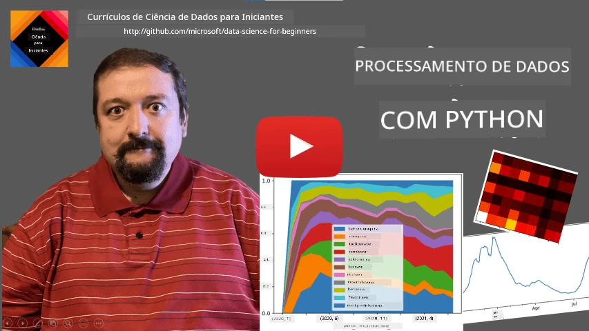
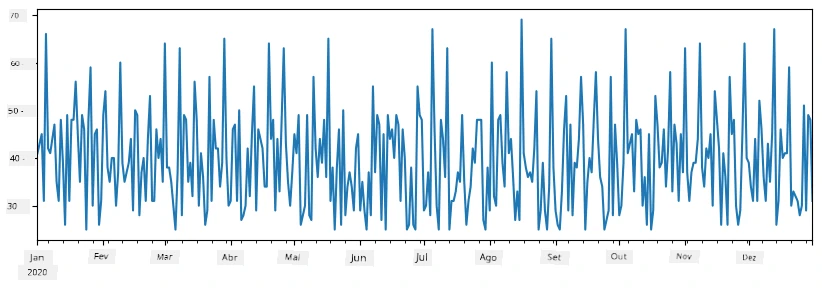
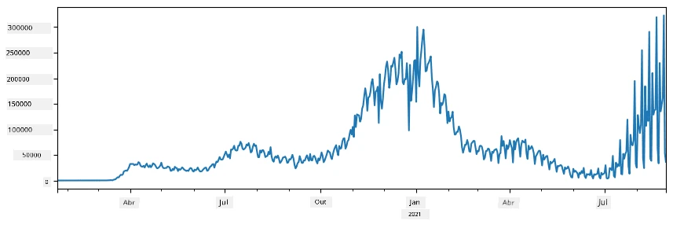
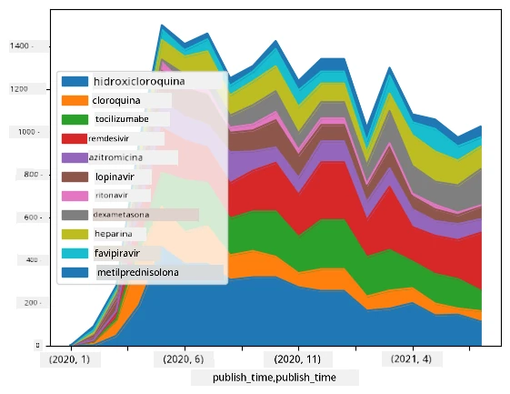

# Trabalhando com Dados: Python e a Biblioteca Pandas

|  ](../../sketchnotes/07-WorkWithPython.png) |
| :-------------------------------------------------------------------------------------------------------: |
|                 Trabalhando com Python - _Sketchnote por [@nitya](https://twitter.com/nitya)_                 |

[](https://youtu.be/dZjWOGbsN4Y)

Embora bancos de dados ofereçam maneiras muito eficientes de armazenar dados e consultá-los usando linguagens de consulta, a forma mais flexível de processar dados é escrever seu próprio programa para manipulá-los. Em muitos casos, fazer uma consulta ao banco de dados seria um modo mais eficaz. No entanto, em alguns casos, quando são necessários processamentos de dados mais complexos, isso não pode ser feito facilmente usando SQL. 
O processamento de dados pode ser programado em qualquer linguagem de programação, mas existem certas linguagens que são de nível mais alto com respeito ao trabalho com dados. Cientistas de dados normalmente preferem uma das seguintes linguagens:

* **[Python](https://www.python.org/)**, uma linguagem de programação de propósito geral, frequentemente considerada uma das melhores opções para iniciantes devido à sua simplicidade. Python possui muitas bibliotecas adicionais que podem ajudar a resolver muitos problemas práticos, como extrair dados de arquivos ZIP, ou converter imagem para tons de cinza. Além da ciência de dados, Python também é frequentemente usado para desenvolvimento web. 
* **[R](https://www.r-project.org/)** é uma caixa de ferramentas tradicional desenvolvida com foco no processamento estatístico de dados. Também contém um grande repositório de bibliotecas (CRAN), tornando-se uma boa escolha para processamento de dados. No entanto, R não é uma linguagem de programação de propósito geral, e raramente é usada fora do domínio da ciência de dados.
* **[Julia](https://julialang.org/)** é outra linguagem desenvolvida especificamente para ciência de dados. Destina-se a oferecer melhor desempenho que Python, tornando-se uma ótima ferramenta para experimentação científica.

Nesta lição, vamos focar no uso do Python para processamento simples de dados. Assumiremos familiaridade básica com a linguagem. Se quiser um tour mais profundo pelo Python, você pode consultar um dos seguintes recursos:

* [Aprenda Python de Forma Divertida com Turtle Graphics e Fractais](https://github.com/shwars/pycourse) - Curso rápido baseado no GitHub sobre Programação em Python
* [Dê seus Primeiros Passos com Python](https://docs.microsoft.com/en-us/learn/paths/python-first-steps/?WT.mc_id=academic-77958-bethanycheum) Trilha de Aprendizagem na [Microsoft Learn](http://learn.microsoft.com/?WT.mc_id=academic-77958-bethanycheum)

Dados podem vir em muitas formas. Nesta lição, consideraremos três formas de dados - **dados tabulares**, **texto** e **imagens**.

Vamos focar em alguns exemplos de processamento de dados, em vez de oferecer uma visão completa de todas as bibliotecas relacionadas. Isso permitirá que você obtenha a ideia principal do que é possível, e deixará você com a compreensão de onde encontrar soluções para seus problemas quando precisar.

> **Conselho mais útil**. Quando você precisar realizar certa operação nos dados que não sabe como fazer, tente buscar isso na internet. O [Stackoverflow](https://stackoverflow.com/) geralmente contém muitos exemplos úteis de código Python para muitas tarefas típicas. 


## [Quiz pré-aula](https://ff-quizzes.netlify.app/en/ds/quiz/12)

## Dados Tabulares e Dataframes

Você já conheceu dados tabulares quando falamos sobre bancos de dados relacionais. Quando você tem muitos dados, e eles estão contidos em várias tabelas vinculadas, definitivamente faz sentido usar SQL para trabalhar com eles. Contudo, há muitos casos em que temos uma tabela de dados, e precisamos obter alguma **compreensão** ou **insight** sobre esses dados, como a distribuição, correlação entre valores, etc. Na ciência de dados, há muitos casos em que precisamos realizar algumas transformações dos dados originais, seguidas de visualização. Ambos esses passos podem ser facilmente feitos usando Python.

Existem duas das bibliotecas mais úteis em Python que podem ajudar você a lidar com dados tabulares:
* **[Pandas](https://pandas.pydata.org/)** permite manipular os chamados **Dataframes**, que são análogos a tabelas relacionais. Você pode ter colunas nomeadas, e realizar diferentes operações em linhas, colunas e dataframes em geral. 
* **[Numpy](https://numpy.org/)** é uma biblioteca para trabalhar com **tensores**, ou seja, **arrays** multidimensionais. Array tem valores do mesmo tipo subjacente, e é mais simples que um dataframe, mas oferece mais operações matemáticas, e cria menos overhead.

Há também algumas outras bibliotecas que você deve conhecer:
* **[Matplotlib](https://matplotlib.org/)** é uma biblioteca usada para visualização de dados e desenho de gráficos
* **[SciPy](https://www.scipy.org/)** é uma biblioteca com algumas funções científicas adicionais. Já nos deparamos com essa biblioteca quando falamos sobre probabilidade e estatística

Aqui está um trecho de código que você normalmente usaria para importar essas bibliotecas no início do seu programa Python:
```python
import numpy as np
import pandas as pd
import matplotlib.pyplot as plt
from scipy import ... # você precisa especificar os subpacotes exatos que você precisa
``` 

Pandas é centrada em alguns conceitos básicos.

### Series 

**Series** é uma sequência de valores, similar a uma lista ou array numpy. A principal diferença é que series também tem um **índice**, e quando operamos com series (ex., somá-las), o índice é levado em conta. O índice pode ser tão simples quanto número inteiro da linha (é o índice usado por padrão ao criar uma series a partir de uma lista ou array), ou pode ter uma estrutura complexa, como intervalo de datas.

> **Nota**: Há um código introdutório de Pandas no notebook acompanhante [`notebook.ipynb`](notebook.ipynb). Aqui apenas delineamos alguns exemplos, e você definitivamente está convidado a conferir o notebook completo.

Considere um exemplo: queremos analisar vendas do nosso quiosque de sorvete. Vamos gerar uma series de números de vendas (número de itens vendidos a cada dia) para algum período de tempo:

```python
start_date = "Jan 1, 2020"
end_date = "Mar 31, 2020"
idx = pd.date_range(start_date,end_date)
print(f"Length of index is {len(idx)}")
items_sold = pd.Series(np.random.randint(25,50,size=len(idx)),index=idx)
items_sold.plot()
```


Agora suponha que toda semana estamos organizando uma festa para amigos, e levamos 10 pacotes adicionais de sorvete para a festa. Podemos criar outra series, indexada por semana, para demonstrar isso:
```python
additional_items = pd.Series(10,index=pd.date_range(start_date,end_date,freq="W"))
```
Quando somamos duas series, obtemos o número total:
```python
total_items = items_sold.add(additional_items,fill_value=0)
total_items.plot()
```


> **Note** que não estamos usando a sintaxe simples `total_items+additional_items`. Se fizéssemos, teríamos muitos valores `NaN` (*Not a Number* - Não é Número) na series resultante. Isso porque há valores ausentes para alguns pontos do índice na series `additional_items`, e somar `NaN` a qualquer coisa resulta em `NaN`. Portanto, precisamos especificar o parâmetro `fill_value` durante a adição.

Com séries temporais, também podemos **reesamostrar** a series com diferentes intervalos de tempo. Por exemplo, suponha que queremos calcular volume médio de vendas mensalmente. Podemos usar o código a seguir:
```python
monthly = total_items.resample("1M").mean()
ax = monthly.plot(kind='bar')
```


### DataFrame

Um DataFrame é essencialmente uma coleção de series com o mesmo índice. Podemos combinar várias series juntas em um DataFrame:
```python
a = pd.Series(range(1,10))
b = pd.Series(["I","like","to","play","games","and","will","not","change"],index=range(0,9))
df = pd.DataFrame([a,b])
```
Isso criará uma tabela horizontal assim:
|     | 0   | 1    | 2   | 3   | 4      | 5   | 6      | 7    | 8    |
| --- | --- | ---- | --- | --- | ------ | --- | ------ | ---- | ---- |
| 0   | 1   | 2    | 3   | 4   | 5      | 6   | 7      | 8    | 9    |
| 1   | I   | like | to  | use | Python | and | Pandas | very | much |

Também podemos usar Series como colunas, e especificar os nomes das colunas usando dicionário:
```python
df = pd.DataFrame({ 'A' : a, 'B' : b })
```
Isso nos dará uma tabela assim:

|     | A   | B      |
| --- | --- | ------ |
| 0   | 1   | I      |
| 1   | 2   | like   |
| 2   | 3   | to     |
| 3   | 4   | use    |
| 4   | 5   | Python |
| 5   | 6   | and    |
| 6   | 7   | Pandas |
| 7   | 8   | very   |
| 8   | 9   | much   |

**Nota** que também podemos obter essa disposição da tabela transpondo a tabela anterior, ex. escrevendo 
```python
df = pd.DataFrame([a,b]).T.rename(columns={ 0 : 'A', 1 : 'B' })
```
Aqui `.T` significa a operação de transpor o DataFrame, ou seja, trocar linhas por colunas, e a operação `rename` permite renomear colunas para corresponder ao exemplo anterior.

Aqui estão algumas das operações mais importantes que podemos realizar em DataFrames:

**Seleção de colunas**. Podemos selecionar colunas individuais escrevendo `df['A']` - essa operação retorna uma Series. Também podemos selecionar um subconjunto de colunas para outro DataFrame escrevendo `df[['B','A']]` - isso retorna outro DataFrame.

**Filtro** de apenas certas linhas por critério. Por exemplo, para deixar apenas as linhas com coluna `A` maior que 5, podemos escrever `df[df['A']>5]`.

> **Nota**: A forma como o filtro funciona é a seguinte. A expressão `df['A']<5` retorna uma series booleana, que indica se a expressão é `True` ou `False` para cada elemento da series original `df['A']`. Quando uma series booleana é usada como índice, ela retorna o subconjunto de linhas do DataFrame. Portanto, não é possível usar expressões booleanas arbitrárias do Python, por exemplo, escrever `df[df['A']>5 and df['A']<7]` estaria errado. Em vez disso, você deve usar a operação especial `&` em series booleanas, escrevendo `df[(df['A']>5) & (df['A']<7)]` (*os colchetes são importantes aqui*).

**Criar novas colunas computáveis**. Podemos facilmente criar novas colunas computáveis para nosso DataFrame usando expressões intuitivas como esta:
```python
df['DivA'] = df['A']-df['A'].mean() 
``` 
Este exemplo calcula a divergência de A em relação ao seu valor médio. O que realmente acontece aqui é que estamos computando uma series, e então atribuindo essa series ao lado esquerdo, criando outra coluna. Portanto, não podemos usar nenhuma operação que não seja compatível com series, por exemplo, o código abaixo está errado:
```python
# Código errado -> df['ADescr'] = "Low" se df['A'] < 5 senão "Hi"
df['LenB'] = len(df['B']) # <- Resultado errado
``` 
O exemplo acima, embora sintaticamente correto, nos dá um resultado errado, porque atribui o comprimento da series `B` a todos os valores na coluna, e não o comprimento dos elementos individuais como pretendíamos.

Se precisarmos computar expressões complexas como essa, podemos usar a função `apply`. O último exemplo pode ser escrito da seguinte forma:
```python
df['LenB'] = df['B'].apply(lambda x : len(x))
# ou
df['LenB'] = df['B'].apply(len)
```

Após as operações acima, teremos o seguinte DataFrame:

|     | A   | B      | DivA | LenB |
| --- | --- | ------ | ---- | ---- |
| 0   | 1   | I      | -4.0 | 1    |
| 1   | 2   | like   | -3.0 | 4    |
| 2   | 3   | to     | -2.0 | 2    |
| 3   | 4   | use    | -1.0 | 3    |
| 4   | 5   | Python | 0.0  | 6    |
| 5   | 6   | and    | 1.0  | 3    |
| 6   | 7   | Pandas | 2.0  | 6    |
| 7   | 8   | very   | 3.0  | 4    |
| 8   | 9   | much   | 4.0  | 4    |

**Selecionar linhas com base em números** pode ser feito usando a construção `iloc`. Por exemplo, para selecionar as primeiras 5 linhas do DataFrame:
```python
df.iloc[:5]
```

**Agrupamento** é frequentemente usado para obter um resultado similar a *tabelas dinâmicas* no Excel. Suponha que queremos calcular o valor médio da coluna `A` para cada determinado número de `LenB`. Então podemos agrupar nosso DataFrame por `LenB`, e chamar `mean`:
```python
df.groupby(by='LenB')[['A','DivA']].mean()
```
Se precisarmos calcular a média e o número de elementos no grupo, podemos usar a função mais complexa `aggregate`:
```python
df.groupby(by='LenB') \
 .aggregate({ 'DivA' : len, 'A' : lambda x: x.mean() }) \
 .rename(columns={ 'DivA' : 'Count', 'A' : 'Mean'})
```
Isso nos dá a seguinte tabela:

| LenB | Count | Mean     |
| ---- | ----- | -------- |
| 1    | 1     | 1.000000 |
| 2    | 1     | 3.000000 |
| 3    | 2     | 5.000000 |
| 4    | 3     | 6.333333 |
| 6    | 2     | 6.000000 |

### Obtendo Dados


Vimos como é fácil construir Series e DataFrames a partir de objetos Python. No entanto, os dados geralmente vêm na forma de um arquivo de texto ou uma tabela do Excel. Felizmente, o Pandas nos oferece uma maneira simples de carregar dados do disco. Por exemplo, ler um arquivo CSV é tão simples quanto isso:
```python
df = pd.read_csv('file.csv')
```
Veremos mais exemplos de carregamento de dados, incluindo a obtenção deles de sites externos, na seção "Desafio"


### Impressão e Plotagem

Um Cientista de Dados frequentemente precisa explorar os dados, portanto é importante ser capaz de visualizá-los. Quando o DataFrame é grande, muitas vezes queremos apenas garantir que estamos fazendo tudo corretamente imprimindo as primeiras linhas. Isso pode ser feito chamando `df.head()`. Se você estiver executando no Jupyter Notebook, ele exibirá o DataFrame em uma forma tabular agradável.

Também vimos o uso da função `plot` para visualizar algumas colunas. Embora `plot` seja muito útil para muitas tarefas e suporte muitos tipos diferentes de gráfico via parâmetro `kind=`, você sempre pode usar a biblioteca pura `matplotlib` para plotar algo mais complexo. Cobriremos visualização de dados em detalhe em lições separadas do curso.

Esta visão geral cobre os conceitos mais importantes do Pandas, entretanto, a biblioteca é muito rica, e não há limite para o que você pode fazer com ela! Agora vamos aplicar esse conhecimento para resolver um problema específico.

## 🚀 Desafio 1: Analisando a Propagação do COVID

O primeiro problema em que iremos focar é a modelagem da propagação epidêmica do COVID-19. Para isso, usaremos os dados sobre o número de indivíduos infectados em diferentes países, fornecidos pelo [Center for Systems Science and Engineering](https://systems.jhu.edu/) (CSSE) da [Johns Hopkins University](https://jhu.edu/). O conjunto de dados está disponível no [repositório do GitHub](https://github.com/CSSEGISandData/COVID-19).

Como queremos demonstrar como lidar com dados, convidamos você a abrir [`notebook-covidspread.ipynb`](notebook-covidspread.ipynb) e lê-lo de cima a baixo. Você também pode executar as células e fazer alguns desafios que deixamos para você no final.



> Se você não sabe como executar código no Jupyter Notebook, dê uma olhada [neste artigo](https://soshnikov.com/education/how-to-execute-notebooks-from-github/).

## Trabalhando com Dados Não Estruturados

Embora os dados frequentemente venham em forma tabular, em alguns casos precisamos lidar com dados menos estruturados, por exemplo, texto ou imagens. Neste caso, para aplicar as técnicas de processamento de dados que vimos acima, precisamos de alguma forma **extrair** dados estruturados. Aqui estão alguns exemplos:

* Extração de palavras-chave do texto, e verificar com que frequência essas palavras aparecem
* Uso de redes neurais para extrair informações sobre objetos na imagem
* Obtenção de informações sobre emoções das pessoas em vídeo

## 🚀 Desafio 2: Analisando Artigos sobre COVID

Neste desafio, continuaremos com o tema da pandemia de COVID e focaremos no processamento de artigos científicos sobre o assunto. Existe o [Conjunto de Dados CORD-19](https://www.kaggle.com/allen-institute-for-ai/CORD-19-research-challenge) com mais de 7000 (no momento da escrita) artigos sobre COVID, disponíveis com metadados e resumos (e para cerca de metade deles também há o texto completo disponível).

Um exemplo completo de análise desse conjunto de dados usando o serviço cognitivo [Text Analytics for Health](https://docs.microsoft.com/azure/cognitive-services/text-analytics/how-tos/text-analytics-for-health/?WT.mc_id=academic-77958-bethanycheum) está descrito [neste post do blog](https://soshnikov.com/science/analyzing-medical-papers-with-azure-and-text-analytics-for-health/). Vamos discutir uma versão simplificada dessa análise.

> **NOTA**: Não fornecemos uma cópia do conjunto de dados como parte deste repositório. Você pode precisar primeiro baixar o arquivo [`metadata.csv`](https://www.kaggle.com/allen-institute-for-ai/CORD-19-research-challenge?select=metadata.csv) deste [conjunto de dados no Kaggle](https://www.kaggle.com/allen-institute-for-ai/CORD-19-research-challenge). O registro no Kaggle pode ser necessário. Você também pode baixar o conjunto de dados sem registro [aqui](https://ai2-semanticscholar-cord-19.s3-us-west-2.amazonaws.com/historical_releases.html), mas ele incluirá todos os textos completos além do arquivo de metadados.

Abra [`notebook-papers.ipynb`](notebook-papers.ipynb) e leia-o de cima a baixo. Você também pode executar as células e fazer alguns desafios que deixamos para você no final.



## Processamento de Dados de Imagem

Recentemente, modelos de IA muito poderosos foram desenvolvidos, permitindo que entendamos imagens. Existem muitas tarefas que podem ser resolvidas usando redes neurais pré-treinadas ou serviços em nuvem. Alguns exemplos incluem:

* **Classificação de Imagens**, que pode ajudar a categorizar a imagem em uma das classes pré-definidas. Você pode facilmente treinar seus próprios classificadores de imagem usando serviços como [Custom Vision](https://azure.microsoft.com/services/cognitive-services/custom-vision-service/?WT.mc_id=academic-77958-bethanycheum)
* **Detecção de Objetos** para detectar diferentes objetos na imagem. Serviços como [computer vision](https://azure.microsoft.com/services/cognitive-services/computer-vision/?WT.mc_id=academic-77958-bethanycheum) podem detectar diversos objetos comuns, e você pode treinar um modelo [Custom Vision](https://azure.microsoft.com/services/cognitive-services/custom-vision-service/?WT.mc_id=academic-77958-bethanycheum) para detectar objetos específicos de interesse.
* **Detecção Facial**, incluindo detecção de Idade, Gênero e Emoção. Isso pode ser feito via [Face API](https://azure.microsoft.com/services/cognitive-services/face/?WT.mc_id=academic-77958-bethanycheum).

Todos esses serviços em nuvem podem ser chamados usando [SDKs Python](https://docs.microsoft.com/samples/azure-samples/cognitive-services-python-sdk-samples/cognitive-services-python-sdk-samples/?WT.mc_id=academic-77958-bethanycheum), e assim podem ser facilmente incorporados em seu fluxo de trabalho de exploração de dados.

Aqui estão alguns exemplos de exploração de dados a partir de fontes de dados de imagem:
* No post do blog [Como Aprender Ciência de Dados sem Programar](https://soshnikov.com/azure/how-to-learn-data-science-without-coding/) exploramos fotos do Instagram, tentando entender o que faz as pessoas darem mais likes a uma foto. Primeiro extraímos o máximo de informações possível das imagens usando [computer vision](https://azure.microsoft.com/services/cognitive-services/computer-vision/?WT.mc_id=academic-77958-bethanycheum), e depois usamos o [Azure Machine Learning AutoML](https://docs.microsoft.com/azure/machine-learning/concept-automated-ml/?WT.mc_id=academic-77958-bethanycheum) para construir um modelo interpretável.
* No [Workshop de Estudos Faciais](https://github.com/CloudAdvocacy/FaceStudies) usamos [Face API](https://azure.microsoft.com/services/cognitive-services/face/?WT.mc_id=academic-77958-bethanycheum) para extrair emoções das pessoas em fotografias de eventos, para tentar entender o que faz as pessoas felizes.

## Conclusão

Seja você já tenha dados estruturados ou não estruturados, usando Python você pode realizar todas as etapas relacionadas ao processamento e entendimento dos dados. Provavelmente é a forma mais flexível de processar dados, e é por isso que a maioria dos cientistas de dados usa Python como sua ferramenta principal. Aprender Python em profundidade provavelmente é uma boa ideia se você está sério sobre sua jornada em ciência de dados!

## [Quiz pós-aula](https://ff-quizzes.netlify.app/en/ds/quiz/13)

## Revisão & Autoestudo

**Livros**
* [Wes McKinney. Python para Análise de Dados: Tratamento de Dados com Pandas, NumPy, e IPython](https://www.amazon.com/gp/product/1491957662)

**Recursos Online**
* Tutorial oficial [10 minutos para Pandas](https://pandas.pydata.org/pandas-docs/stable/user_guide/10min.html)
* [Documentação sobre Visualização em Pandas](https://pandas.pydata.org/pandas-docs/stable/user_guide/visualization.html)

**Aprendendo Python**
* [Aprenda Python de forma divertida com Turtle Graphics e Fractais](https://github.com/shwars/pycourse)
* [Dê seus primeiros passos com Python](https://docs.microsoft.com/learn/paths/python-first-steps/?WT.mc_id=academic-77958-bethanycheum) Trilha de Aprendizado no [Microsoft Learn](http://learn.microsoft.com/?WT.mc_id=academic-77958-bethanycheum)

## Exercício

[Realize um estudo mais detalhado dos dados para os desafios acima](assignment.md)

## Créditos

Esta lição foi criada com ♥️ por [Dmitry Soshnikov](http://soshnikov.com)

---

<!-- CO-OP TRANSLATOR DISCLAIMER START -->
**Aviso Legal**:
Este documento foi traduzido usando o serviço de tradução por IA [Co-op Translator](https://github.com/Azure/co-op-translator). Embora nos esforcemos pela precisão, por favor, esteja ciente de que traduções automatizadas podem conter erros ou imprecisões. O documento original em seu idioma nativo deve ser considerado a fonte autorizada. Para informações críticas, recomenda-se tradução profissional humana. Não nos responsabilizamos por quaisquer mal-entendidos ou interpretações incorretas decorrentes do uso desta tradução.
<!-- CO-OP TRANSLATOR DISCLAIMER END -->