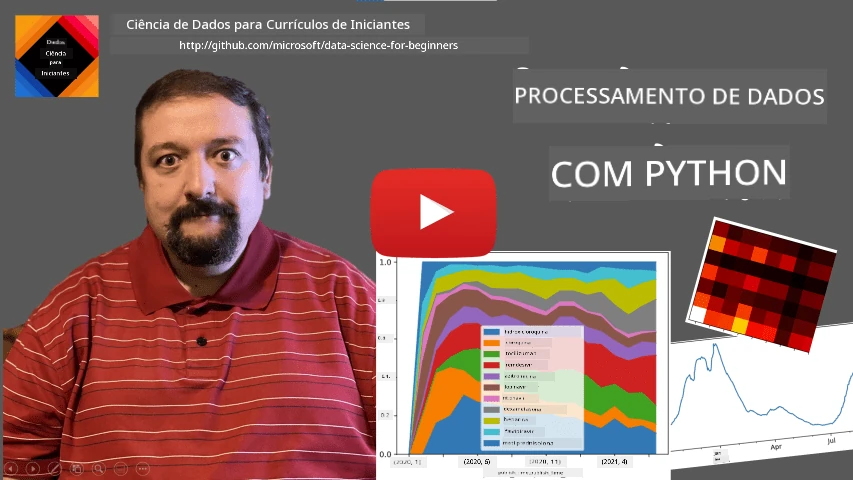
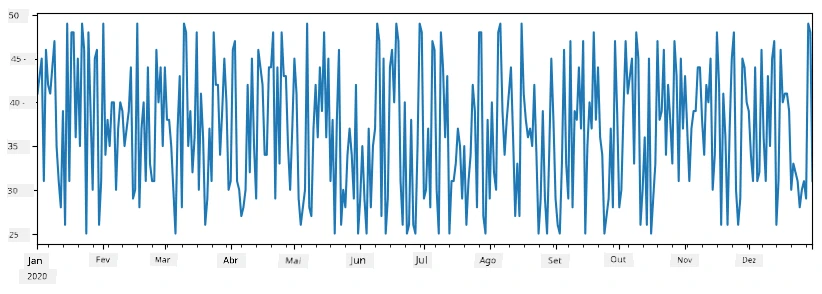
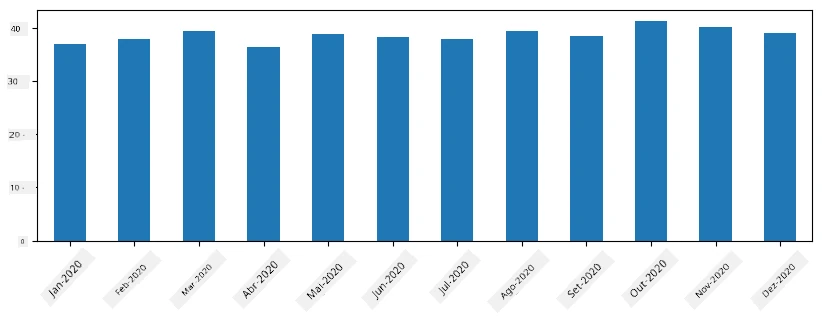
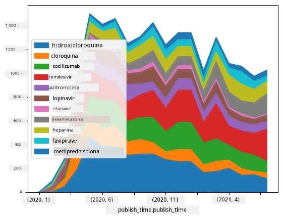

# Trabalhar com Dados: Python e a Biblioteca Pandas

|  ](../../sketchnotes/07-WorkWithPython.png) |
| :-------------------------------------------------------------------------------------------------------: |
|               Trabalhar com Python - _Sketchnote por [@nitya](https://twitter.com/nitya)_               |

[](https://youtu.be/dZjWOGbsN4Y)

Enquanto as bases de dados oferecem formas muito eficientes de armazenar dados e interroga-los usando linguagens de consulta, a forma mais flexível de processar dados é escrever o seu próprio programa para manipular dados. Em muitos casos, fazer uma consulta na base de dados seria um método mais eficaz. No entanto, em alguns casos, quando é necessário um processamento de dados mais complexo, não é fácil fazê-lo usando SQL. 
O processamento de dados pode ser programado em qualquer linguagem de programação, mas existem certas linguagens que são de nível mais elevado para trabalhar com dados. Os cientistas de dados normalmente preferem uma das seguintes linguagens:

* **[Python](https://www.python.org/)**, uma linguagem de programação de uso geral, frequentemente considerada uma das melhores opções para iniciantes devido à sua simplicidade. Python tem muitas bibliotecas adicionais que podem ajudá-lo a resolver muitos problemas práticos, como extrair seus dados de um arquivo ZIP ou converter uma imagem para escala de cinza. Para além da ciência de dados, Python é também frequentemente usado para desenvolvimento web. 
* **[R](https://www.r-project.org/)** é uma caixa de ferramentas tradicional desenvolvida com o processamento de dados estatísticos em mente. Também contém um grande repositório de bibliotecas (CRAN), sendo uma boa escolha para processamento de dados. Contudo, R não é uma linguagem de programação de uso geral e é raramente usada fora do domínio da ciência de dados.
* **[Julia](https://julialang.org/)** é outra linguagem desenvolvida especificamente para ciência de dados. Destina-se a oferecer melhor desempenho que o Python, tornando-a uma ótima ferramenta para experimentação científica.

Nesta lição, vamos focar no uso de Python para processamento simples de dados. Assumiremos uma familiaridade básica com a linguagem. Se quiser uma exploração mais aprofundada do Python, pode consultar um dos seguintes recursos:

* [Aprenda Python de Forma Divertida com Turtle Graphics e Fractais](https://github.com/shwars/pycourse) - Curso rápido baseado em GitHub para introdução à Programação em Python
* [Dê os seus Primeiros Passos com Python](https://docs.microsoft.com/en-us/learn/paths/python-first-steps/?WT.mc_id=academic-77958-bethanycheum) Percurso de Aprendizagem na [Microsoft Learn](http://learn.microsoft.com/?WT.mc_id=academic-77958-bethanycheum)

Os dados podem surgir de várias formas. Nesta lição, consideraremos três formas de dados - **dados tabulares**, **texto** e **imagens**.

Vamos focar em alguns exemplos de processamento de dados, em vez de dar uma visão geral completa de todas as bibliotecas relacionadas. Isto permitirá que obtenha a ideia principal do que é possível, e dar-lhe-á compreensão de onde encontrar soluções para os seus problemas quando precisar delas.

> **Conselho mais útil**. Quando precisar de realizar uma operação qualquer sobre dados que não saiba como fazer, tente pesquisar na internet. O [Stackoverflow](https://stackoverflow.com/) geralmente contém muitos exemplos úteis de código em Python para muitas tarefas típicas. 


## [Questionário pré-aula](https://ff-quizzes.netlify.app/en/ds/quiz/12)

## Dados Tabulares e Dataframes

Já encontrou dados tabulares quando falámos de bases de dados relacionais. Quando se tem muitos dados, contidos em várias tabelas ligadas, faz definitivamente sentido usar SQL para trabalhar com eles. Contudo, existem muitos casos em que temos uma tabela de dados e precisamos de obter alguma **compreensão** ou **insights** sobre esses dados, como a distribuição, correlação entre valores, etc. Na ciência de dados, existem muitos casos em que é necessário realizar algumas transformações dos dados originais, seguidas por visualização. Ambas essas etapas podem ser feitas facilmente usando Python.

Existem duas bibliotecas mais úteis em Python que podem ajudá-lo a lidar com dados tabulares:
* **[Pandas](https://pandas.pydata.org/)** permite manipular os chamados **Dataframes**, que são análogos a tabelas relacionais. Pode ter colunas com nomes, e realizar diferentes operações em linhas, colunas e dataframes em geral. 
* **[Numpy](https://numpy.org/)** é uma biblioteca para trabalhar com **tensores**, i.e., **arrays** multidimensionais. O array tem valores do mesmo tipo base e é mais simples que um dataframe, mas oferece mais operações matemáticas e cria menos overhead.

Existem também outras duas bibliotecas que deverá conhecer:
* **[Matplotlib](https://matplotlib.org/)** é uma biblioteca usada para visualização de dados e plotagem de gráficos
* **[SciPy](https://www.scipy.org/)** é uma biblioteca com algumas funções científicas adicionais. Já nos deparámos com esta biblioteca quando falámos de probabilidade e estatística

Aqui está um exemplo de código que normalmente usaria para importar estas bibliotecas no início do seu programa Python:
```python
import numpy as np
import pandas as pd
import matplotlib.pyplot as plt
from scipy import ... # precisa especificar os subpacotes exatos de que necessita
``` 

O Pandas está centrado em alguns conceitos básicos.

### Series 

**Series** é uma sequência de valores, semelhante a uma lista ou array numpy. A principal diferença é que a série também tem um **índice**, e quando operamos sobre séries (ex., adicionando-as), o índice é tido em conta. O índice pode ser tão simples quanto um número inteiro de linha (é o índice usado por defeito quando se cria uma série a partir de uma lista ou array), ou pode ter uma estrutura complexa, como intervalo de datas.

> **Nota**: Existe algum código introdutório do Pandas no notebook acompanhante [`notebook.ipynb`](notebook.ipynb). Apenas destacamos aqui alguns exemplos e está definitivamente convidado a ver o notebook completo.

Considere um exemplo: queremos analisar as vendas do nosso quiosque de gelados. Vamos gerar uma série de números de vendas (número de artigos vendidos por dia) durante algum período de tempo:

```python
start_date = "Jan 1, 2020"
end_date = "Mar 31, 2020"
idx = pd.date_range(start_date,end_date)
print(f"Length of index is {len(idx)}")
items_sold = pd.Series(np.random.randint(25,50,size=len(idx)),index=idx)
items_sold.plot()
```


Agora suponha que todas as semanas organizamos uma festa para amigos e levamos 10 pacotes adicionais de gelado para a festa. Podemos criar outra série, indexada por semana, para demonstrar isso:
```python
additional_items = pd.Series(10,index=pd.date_range(start_date,end_date,freq="W"))
```
Quando adicionamos duas séries, obtemos o número total:
```python
total_items = items_sold.add(additional_items,fill_value=0)
total_items.plot()
```


> **Nota** que não estamos a usar a sintaxe simples `total_items+additional_items`. Se o fizéssemos, receberíamos muitos valores `NaN` (*Not a Number*) na série resultado. Isto porque existem valores em falta para alguns pontos do índice na série `additional_items`, e somar `NaN` a qualquer coisa resulta em `NaN`. Assim, precisamos especificar o parâmetro `fill_value` durante a adição.

Com séries temporais, também podemos **reamostrar** a série com diferentes intervalos de tempo. Por exemplo, suponha que queremos calcular o volume médio de vendas mensalmente. Podemos usar o seguinte código:
```python
monthly = total_items.resample("1M").mean()
ax = monthly.plot(kind='bar')
```


### DataFrame

Um DataFrame é essencialmente uma coleção de séries com o mesmo índice. Podemos combinar várias séries num DataFrame:
```python
a = pd.Series(range(1,10))
b = pd.Series(["I","like","to","play","games","and","will","not","change"],index=range(0,9))
df = pd.DataFrame([a,b])
```
Isto criará uma tabela horizontal assim:
|     | 0   | 1    | 2   | 3   | 4      | 5   | 6      | 7    | 8    |
| --- | --- | ---- | --- | --- | ------ | --- | ------ | ---- | ---- |
| 0   | 1   | 2    | 3   | 4   | 5      | 6   | 7      | 8    | 9    |
| 1   | I   | like | to  | use | Python | and | Pandas | very | much |

Também podemos usar Series como colunas, e especificar nomes de colunas usando um dicionário:
```python
df = pd.DataFrame({ 'A' : a, 'B' : b })
```
Isto dará uma tabela assim:

|     | A   | B      |
| --- | --- | ------ |
| 0   | 1   | I      |
| 1   | 2   | like   |
| 2   | 3   | to     |
| 3   | 4   | use    |
| 4   | 5   | Python |
| 5   | 6   | and    |
| 6   | 7   | Pandas |
| 7   | 8   | very   |
| 8   | 9   | much   |

**Nota** que também podemos obter esta disposição da tabela transpondo a tabela anterior, ex., escrevendo 
```python
df = pd.DataFrame([a,b]).T.rename(columns={ 0 : 'A', 1 : 'B' })
```
Aqui `.T` significa a operação de transpor o DataFrame, i.e. trocar linhas e colunas, e a operação `rename` permite renomear colunas para coincidir com o exemplo anterior.

Aqui estão algumas das operações mais importantes que podemos realizar em DataFrames:

**Seleção de colunas**. Podemos selecionar colunas individuais escrevendo `df['A']` - esta operação retorna uma Series. Também podemos selecionar um subconjunto de colunas para outro DataFrame escrevendo `df[['B','A']]` - isto retorna outro DataFrame.

**Filtrar** apenas certas linhas por critério. Por exemplo, para deixar apenas linhas com a coluna `A` maior que 5, podemos escrever `df[df['A']>5]`.

> **Nota**: O modo como o filtro funciona é o seguinte. A expressão `df['A']<5` retorna uma série booleana, que indica se a expressão é `True` ou `False` para cada elemento da série original `df['A']`. Quando a série booleana é usada como índice, retorna um subconjunto de linhas do DataFrame. Assim, não é possível usar uma expressão booleana arbitrária do Python, por exemplo, escrever `df[df['A']>5 and df['A']<7]` está errado. Em vez disso, deve usar a operação especial `&` sobre as séries booleanas, escrevendo `df[(df['A']>5) & (df['A']<7)]` (*os parênteses são importantes aqui*).

**Criar novas colunas calculáveis**. Podemos facilmente criar novas colunas computáveis para o nosso DataFrame usando expressões intuitivas como esta:
```python
df['DivA'] = df['A']-df['A'].mean() 
``` 
Este exemplo calcula a divergência de A em relação ao seu valor médio. O que acontece aqui é que calculamos uma série, e depois atribuímos essa série ao lado esquerdo, criando outra coluna. Assim, não podemos usar quaisquer operações que não sejam compatíveis com séries, por exemplo, o código abaixo está errado:
```python
# Código errado -> df['ADescr'] = "Low" se df['A'] < 5 senão "Hi"
df['LenB'] = len(df['B']) # <- Resultado errado
``` 
O exemplo anterior, apesar de ser sintaticamente correto, fornece um resultado incorreto porque atribui o comprimento da série `B` a todos os valores na coluna, e não o comprimento dos elementos individuais como pretendíamos.

Se precisarmos calcular expressões complexas como esta, podemos usar a função `apply`. O último exemplo pode ser escrito da seguinte maneira:
```python
df['LenB'] = df['B'].apply(lambda x : len(x))
# ou
df['LenB'] = df['B'].apply(len)
```

Após as operações acima, obteremos o seguinte DataFrame:

|     | A   | B      | DivA | LenB |
| --- | --- | ------ | ---- | ---- |
| 0   | 1   | I      | -4.0 | 1    |
| 1   | 2   | like   | -3.0 | 4    |
| 2   | 3   | to     | -2.0 | 2    |
| 3   | 4   | use    | -1.0 | 3    |
| 4   | 5   | Python | 0.0  | 6    |
| 5   | 6   | and    | 1.0  | 3    |
| 6   | 7   | Pandas | 2.0  | 6    |
| 7   | 8   | very   | 3.0  | 4    |
| 8   | 9   | much   | 4.0  | 4    |

**Selecionar linhas com base em números** pode ser feito usando a construção `iloc`. Por exemplo, para selecionar as primeiras 5 linhas do DataFrame:
```python
df.iloc[:5]
```

**Agrupamento** é muitas vezes usado para obter um resultado semelhante a *tabelas dinâmicas* no Excel. Suponha que queremos calcular o valor médio da coluna `A` para cada determinado número de `LenB`. Então podemos agrupar o nosso DataFrame por `LenB` e chamar `mean`:
```python
df.groupby(by='LenB')[['A','DivA']].mean()
```
Se precisarmos calcular a média e o número de elementos no grupo, podemos usar uma função `aggregate` mais complexa:
```python
df.groupby(by='LenB') \
 .aggregate({ 'DivA' : len, 'A' : lambda x: x.mean() }) \
 .rename(columns={ 'DivA' : 'Count', 'A' : 'Mean'})
```
Isto dá-nos a seguinte tabela:

| LenB | Count | Mean     |
| ---- | ----- | -------- |
| 1    | 1     | 1.000000 |
| 2    | 1     | 3.000000 |
| 3    | 2     | 5.000000 |
| 4    | 3     | 6.333333 |
| 6    | 2     | 6.000000 |

### Obter Dados


Vimos como é fácil construir Series e DataFrames a partir de objetos Python. No entanto, os dados geralmente vêm na forma de um ficheiro de texto ou uma tabela Excel. Felizmente, o Pandas oferece-nos uma forma simples de carregar dados do disco. Por exemplo, ler um ficheiro CSV é tão simples como isto:
```python
df = pd.read_csv('file.csv')
```
Veremos mais exemplos de carregamento de dados, incluindo obtê-los de sites externos, na secção "Desafio"


### Impressão e Gráficos

Um Cientista de Dados frequentemente tem de explorar os dados, por isso é importante ser capaz de os visualizar. Quando o DataFrame é grande, muitas vezes queremos apenas garantir que estamos a fazer tudo corretamente imprimindo as primeiras linhas. Isto pode ser feito chamando `df.head()`. Se estiver a executá-lo no Jupyter Notebook, ele irá imprimir o DataFrame numa forma tabular agradável.

Também vimos o uso da função `plot` para visualizar algumas colunas. Embora `plot` seja muito útil para muitas tarefas, e suporte muitos tipos diferentes de gráficos via o parâmetro `kind=`, pode sempre usar diretamente a biblioteca `matplotlib` para traçar algo mais complexo. Cobriremos visualização de dados em detalhe em aulas separadas do curso.

Esta visão geral cobre os conceitos mais importantes do Pandas, no entanto, a biblioteca é muito rica, e não há limite para o que pode fazer com ela! Vamos agora aplicar este conhecimento para resolver um problema específico.

## 🚀 Desafio 1: Analisando a Propagação da COVID

O primeiro problema em que nos iremos focar é a modelação da propagação epidémica da COVID-19. Para isso, iremos usar os dados sobre o número de indivíduos infetados em diferentes países, fornecidos pelo [Center for Systems Science and Engineering](https://systems.jhu.edu/) (CSSE) da [Universidade Johns Hopkins](https://jhu.edu/). O conjunto de dados está disponível em [este Repositório GitHub](https://github.com/CSSEGISandData/COVID-19).

Como queremos demonstrar como lidar com dados, convidamo-lo a abrir [`notebook-covidspread.ipynb`](notebook-covidspread.ipynb) e lê-lo de cima a baixo. Também pode executar as células e fazer alguns desafios que deixámos para si no final.


> Se não sabe como executar código no Jupyter Notebook, dê uma vista de olhos a [este artigo](https://soshnikov.com/education/how-to-execute-notebooks-from-github/).

## Trabalhar com Dados Não Estruturados

Embora os dados frequentemente venham em forma tabular, nalguns casos precisamos de lidar com dados menos estruturados, como por exemplo texto ou imagens. Neste caso, para aplicar as técnicas de processamento de dados que vimos acima, precisamos de **extrair** de alguma forma dados estruturados. Aqui ficam alguns exemplos:

* Extrair palavras-chave de texto, e ver com que frequência essas palavras-chave aparecem
* Usar redes neurais para extrair informação sobre objetos numa imagem
* Obter informação sobre emoções das pessoas numa transmissão de vídeo de câmara

## 🚀 Desafio 2: Analisando Artigos sobre a COVID

Neste desafio, continuaremos com o tema da pandemia COVID, focando-nos no processamento de artigos científicos sobre o assunto. Existe o [Dataset CORD-19](https://www.kaggle.com/allen-institute-for-ai/CORD-19-research-challenge) com mais de 7000 (à data de escrita) artigos sobre a COVID, disponível com metadados e resumos (e para cerca da metade deles também o texto completo fornecido).

Um exemplo completo de análise deste conjunto de dados usando o serviço cognitivo [Text Analytics for Health](https://docs.microsoft.com/azure/cognitive-services/text-analytics/how-tos/text-analytics-for-health/?WT.mc_id=academic-77958-bethanycheum) está descrito [neste post no blog](https://soshnikov.com/science/analyzing-medical-papers-with-azure-and-text-analytics-for-health/). Discutiremos uma versão simplificada desta análise.

> **NOTA**: Não fornecemos uma cópia do conjunto de dados como parte deste repositório. Poderá primeiro precisar de descarregar o ficheiro [`metadata.csv`](https://www.kaggle.com/allen-institute-for-ai/CORD-19-research-challenge?select=metadata.csv) de [este dataset no Kaggle](https://www.kaggle.com/allen-institute-for-ai/CORD-19-research-challenge). Pode ser necessária a registração no Kaggle. Pode também descarregar o dataset sem registo [aqui](https://ai2-semanticscholar-cord-19.s3-us-west-2.amazonaws.com/historical_releases.html), mas incluirá todos os textos completos para além do ficheiro de metadados.

Abra [`notebook-papers.ipynb`](notebook-papers.ipynb) e leia-o do início ao fim. Também pode executar as células e fazer alguns desafios que deixámos para si no final.



## Processamento de Dados de Imagem

Recentemente, foram desenvolvidos modelos de IA muito poderosos que nos permitem compreender imagens. Há muitas tarefas que podem ser resolvidas usando redes neurais pré-treinadas, ou serviços na nuvem. Alguns exemplos incluem:

* **Classificação de Imagens**, que pode ajudá-lo a categorizar a imagem numa das classes pré-definidas. Pode treinar facilmente os seus próprios classificadores de imagem usando serviços como [Custom Vision](https://azure.microsoft.com/services/cognitive-services/custom-vision-service/?WT.mc_id=academic-77958-bethanycheum)
* **Deteção de Objetos** para detetar diferentes objetos na imagem. Serviços como [computer vision](https://azure.microsoft.com/services/cognitive-services/computer-vision/?WT.mc_id=academic-77958-bethanycheum) podem detetar vários objetos comuns, e pode treinar um modelo [Custom Vision](https://azure.microsoft.com/services/cognitive-services/custom-vision-service/?WT.mc_id=academic-77958-bethanycheum) para detetar objetos específicos do seu interesse.
* **Deteção de Rosto**, incluindo deteção de Idade, Género e Emoção. Isto pode ser feito via [Face API](https://azure.microsoft.com/services/cognitive-services/face/?WT.mc_id=academic-77958-bethanycheum).

Todos esses serviços na nuvem podem ser chamados usando [SDKs Python](https://docs.microsoft.com/samples/azure-samples/cognitive-services-python-sdk-samples/cognitive-services-python-sdk-samples/?WT.mc_id=academic-77958-bethanycheum), podendo assim ser facilmente incorporados no seu fluxo de exploração de dados.

Aqui ficam alguns exemplos de exploração de dados provenientes de fontes de dados de imagem:
* No post do blog [How to Learn Data Science without Coding](https://soshnikov.com/azure/how-to-learn-data-science-without-coding/) exploramos fotos do Instagram, tentando perceber o que faz as pessoas darem mais likes a uma fotografia. Primeiro extraímos o máximo de informação possível das imagens usando [computer vision](https://azure.microsoft.com/services/cognitive-services/computer-vision/?WT.mc_id=academic-77958-bethanycheum), e depois usamos o [Azure Machine Learning AutoML](https://docs.microsoft.com/azure/machine-learning/concept-automated-ml/?WT.mc_id=academic-77958-bethanycheum) para construir um modelo interpretável.
* No [Facial Studies Workshop](https://github.com/CloudAdvocacy/FaceStudies) usamos o [Face API](https://azure.microsoft.com/services/cognitive-services/face/?WT.mc_id=academic-77958-bethanycheum) para extrair emoções das pessoas em fotografias de eventos, de forma a tentar perceber o que faz as pessoas felizes.

## Conclusão

Quer tenha dados estruturados ou não estruturados, usando Python pode realizar todos os passos relacionados com o processamento e compreensão de dados. É provavelmente a forma mais flexível de processamento de dados, e é por isso que a maioria dos cientistas de dados usa Python como a sua ferramenta principal. Aprender Python em profundidade é provavelmente uma boa ideia se estiver a levar a sério a sua jornada na ciência de dados!

## [Quiz pós-aula](https://ff-quizzes.netlify.app/en/ds/quiz/13)

## Revisão & Autoestudo

**Livros**
* [Wes McKinney. Python for Data Analysis: Data Wrangling with Pandas, NumPy, and IPython](https://www.amazon.com/gp/product/1491957662)

**Recursos Online**
* Tutorial oficial [10 minutes to Pandas](https://pandas.pydata.org/pandas-docs/stable/user_guide/10min.html)
* [Documentação sobre Visualização no Pandas](https://pandas.pydata.org/pandas-docs/stable/user_guide/visualization.html)

**Aprender Python**
* [Aprender Python de Forma Divertida com Turtle Graphics e Fractais](https://github.com/shwars/pycourse)
* [Dê os seus Primeiros Passos com Python](https://docs.microsoft.com/learn/paths/python-first-steps/?WT.mc_id=academic-77958-bethanycheum) Roteiro de Aprendizagem na [Microsoft Learn](http://learn.microsoft.com/?WT.mc_id=academic-77958-bethanycheum)

## Trabalho de Casa

[Realize um estudo de dados mais detalhado para os desafios acima](assignment.md)

## Créditos

Esta aula foi escrita com ♥️ por [Dmitry Soshnikov](http://soshnikov.com)

---

<!-- CO-OP TRANSLATOR DISCLAIMER START -->
**Aviso Legal**:
Este documento foi traduzido utilizando o serviço de tradução automática [Co-op Translator](https://github.com/Azure/co-op-translator). Embora nos esforcemos pela precisão, esteja ciente de que traduções automáticas podem conter erros ou imprecisões. O documento original na sua língua nativa deve ser considerado a fonte autorizada. Para informações críticas, recomenda-se tradução profissional humana. Não nos responsabilizamos por quaisquer mal-entendidos ou interpretações incorretas resultantes da utilização desta tradução.
<!-- CO-OP TRANSLATOR DISCLAIMER END -->